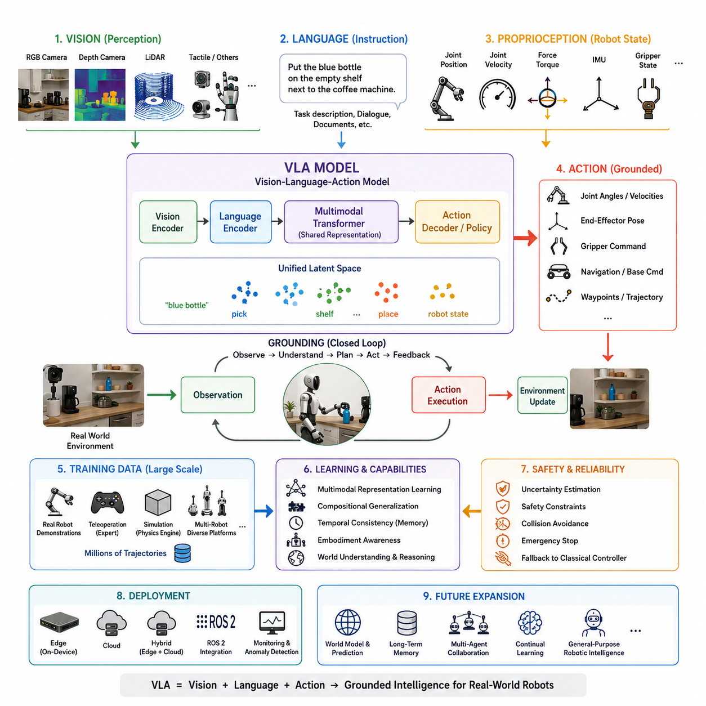
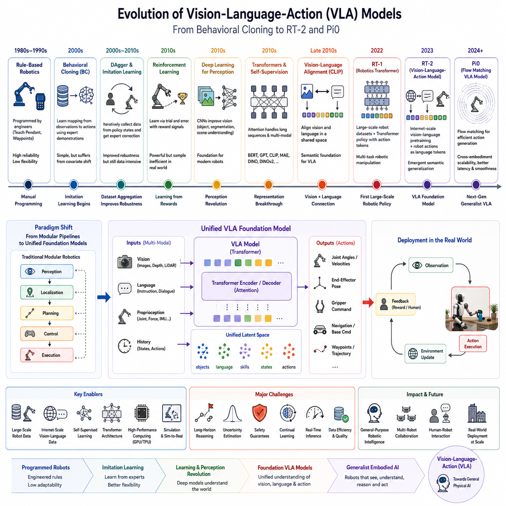
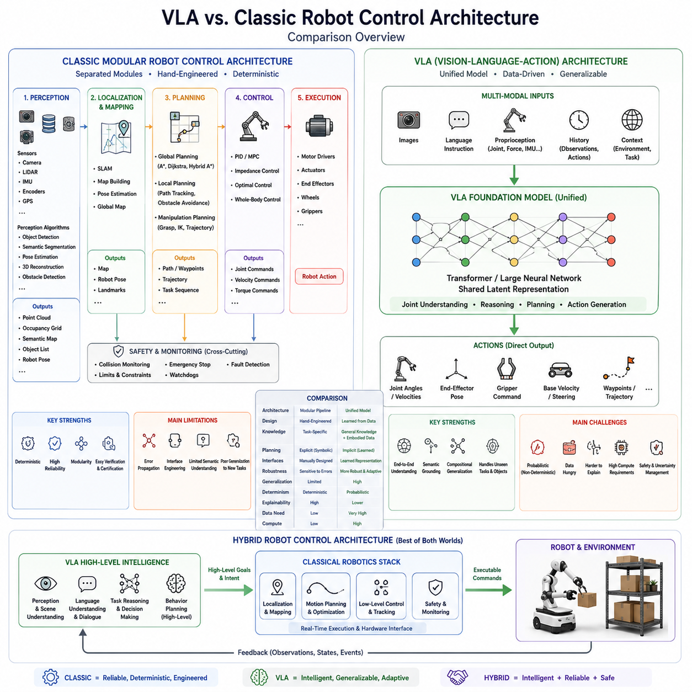
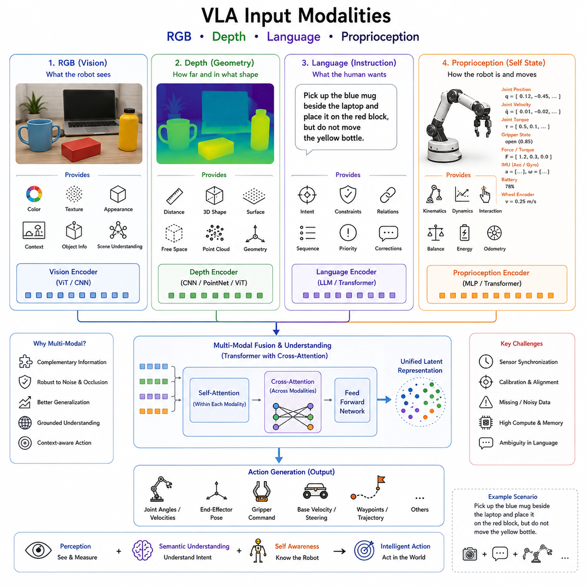
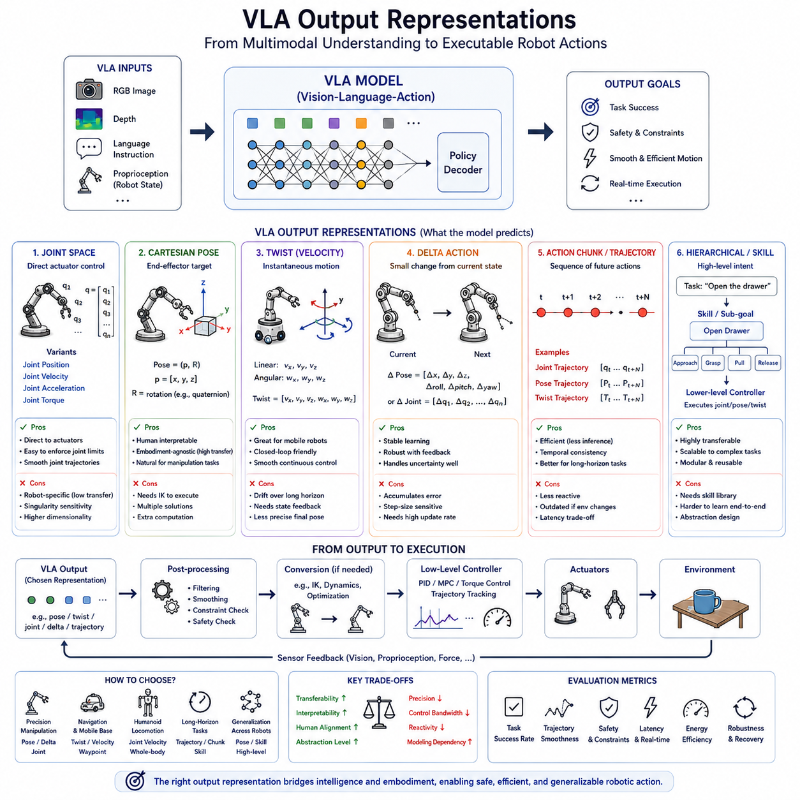
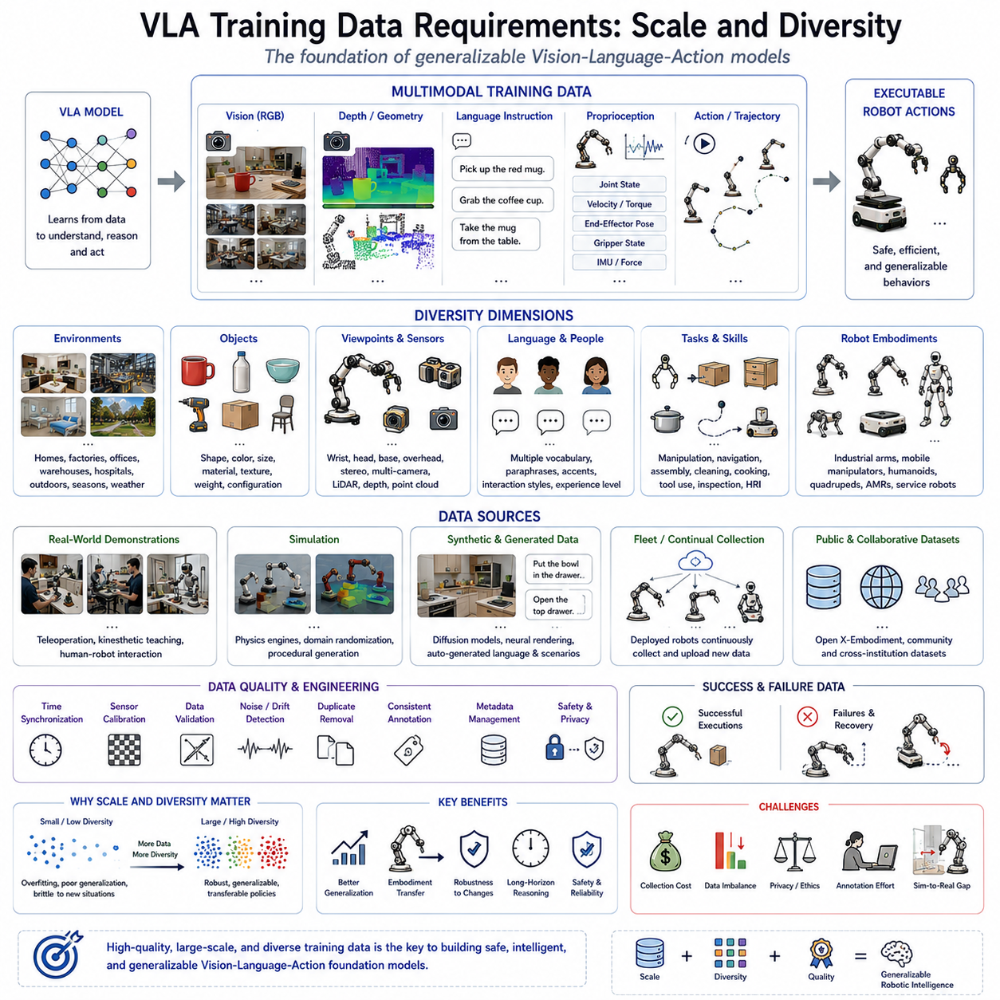
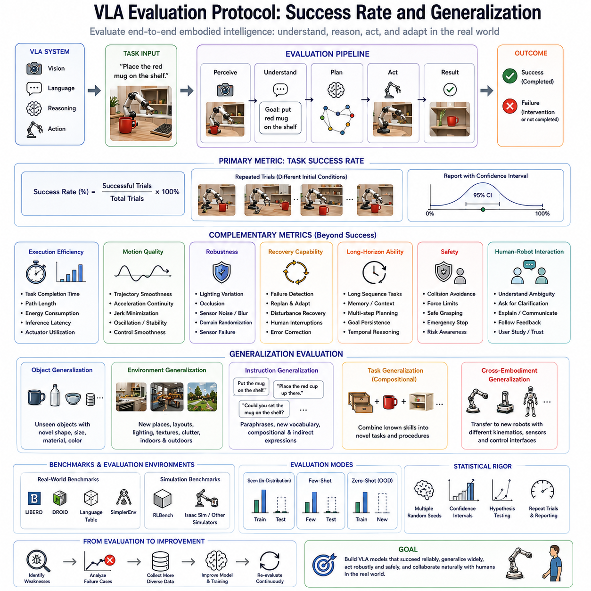
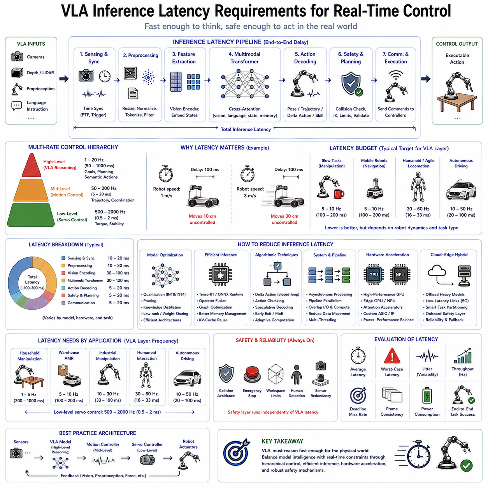
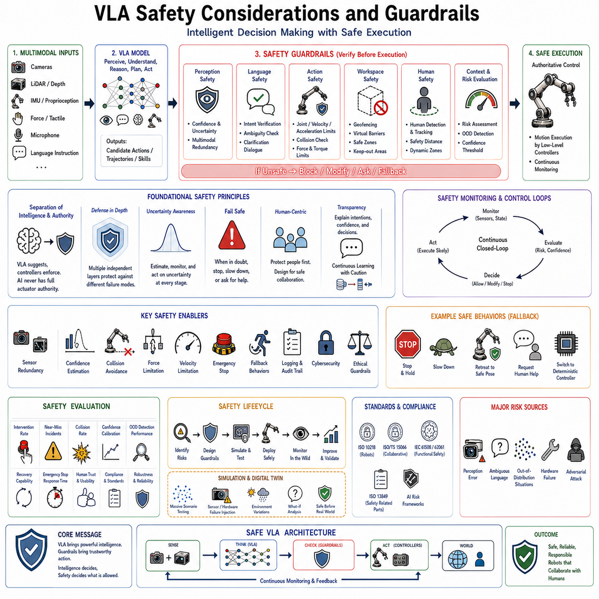
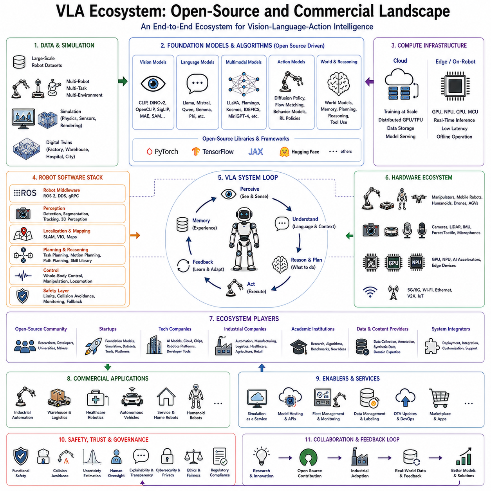

**Volume 20. Vision Language Action (VLA) Models**

# Chapter 1. VLA Fundamentals

## 1.1 VLA Definition: Vision-Language-Grounded Action

{width="7.268055555555556in" height="7.268055555555556in"}

비전-언어-행동(Vision-Language-Action, VLA) 모델의 등장은 현대 로보틱스(Robotics)에서 자율주행과 딥러닝(Deep Learning)의 도입 이후 가장 중요한 변화 중 하나로 평가된다. 기존의 로봇 시스템은 인지(Perception), 위치추정(Localization), 계획(Planning), 제어(Control), 실행(Execution)을 각각 독립적인 모듈(Module)로 구현하고 이들을 정해진 인터페이스(Interface)로 연결하는 방식으로 설계되었다. 이러한 구조는 산업용 로봇과 자율이동로봇(AMR)에서 높은 신뢰성을 제공했지만, 새로운 환경이나 예상하지 못한 상황에서는 유연성이 부족하다는 한계를 가지고 있었다. VLA는 이러한 문제를 해결하기 위해 인지와 언어, 행동을 하나의 통합된 학습 문제로 다루는 새로운 패러다임을 제시한다.

VLA는 비전(Vision), 언어(Language), 행동(Action)의 세 가지 핵심 요소로 구성된다. 비전은 RGB 카메라(Camera), 깊이 카메라(Depth Camera), 라이다(LiDAR), 이벤트 카메라(Event Camera), 촉각 비전(Tactile Vision) 등 다양한 센서를 통해 외부 환경을 인식하는 기능을 의미한다. 언어는 사람의 명령, 작업 설명, 문서, 대화와 같은 의미 정보를 포함한다. 행동은 관절 명령(Joint Command), 이동 속도(Velocity), 자세(Pose), 조작(Manipulation), 주행(Navigation)과 같은 실제 로봇의 물리적 동작을 의미한다. VLA의 핵심은 이 세 가지 정보를 각각 독립적으로 처리하는 것이 아니라 하나의 공통 잠재공간(Latent Space)에서 동시에 이해하고 연결하는 데 있다.

기존의 비전-언어 모델(Vision-Language Model, VLM)은 이미지 설명(Image Captioning)이나 시각 질의응답(Visual Question Answering)과 같은 텍스트(Text) 생성에 초점을 맞추었다. 반면 VLA는 이러한 의미 이해를 실제 행동으로 연결한다는 점에서 본질적으로 다르다. 즉, 로봇은 단순히 "컵이 책상 위에 있다."고 설명하는 것이 아니라, 해당 컵을 집고 지정된 위치로 옮기는 행동까지 수행해야 한다. 이러한 행동은 단순한 명령 생성이 아니라 현재 환경과 로봇의 상태를 모두 고려하여 생성되는 물리적으로 실행 가능한 행동이라는 점에서 "행동의 접지(Grounded Action)"라는 개념으로 설명된다.

접지(Grounding)는 VLA를 이해하는 가장 중요한 개념이다. 언어에서 표현된 의미가 실제 환경과 연결되고, 다시 물리적인 행동으로 이어질 때 비로소 로봇은 환경 속에서 의미 있는 작업을 수행할 수 있다. 예를 들어 "커피 머신 옆 빈 선반에 파란 병을 올려놓아라."라는 명령을 받았을 경우, 로봇은 먼저 파란 병과 커피 머신을 인식하고, 빈 선반의 위치를 이해한 뒤, 충돌 없이 병을 집어 이동하여 정확한 위치에 놓는 일련의 행동을 수행해야 한다. 이 과정에서 언어, 공간 이해, 시각 정보, 물리적 제약이 동시에 고려되므로 이러한 행동은 환경에 접지된 행동이라고 할 수 있다.

기존 로봇 시스템에서는 이러한 작업을 수행하기 위해 객체 인식(Object Detection), 의미 분할(Semantic Segmentation), 언어 분석(Language Parsing), 경로 계획(Motion Planning), 충돌 회피(Collision Avoidance), 역기구학(Inverse Kinematics), 제어(Control) 등 수많은 모듈이 독립적으로 동작하였다. 각 모듈은 별도의 인터페이스를 통해 연결되므로 작은 오류 하나가 전체 시스템의 실패로 이어질 가능성이 존재했다. VLA에서는 이러한 모듈들이 하나의 통합된 신경망(Neural Network) 안에서 공동으로 학습되므로 보다 자연스럽고 유연한 의사결정이 가능해진다.

VLA의 핵심 기술 중 하나는 다중모달 표현 학습(Multimodal Representation Learning)이다. 이미지(Image), 언어(Language), 행동(Action)이 모두 동일한 의미 공간으로 투영되어 서로 가까운 개념은 비슷한 표현을 가지도록 학습된다. 예를 들어 사과 이미지를 본 경험, "사과"라는 단어를 읽은 경험, 그리고 사과를 집는 로봇의 행동 데이터가 모두 동일한 개념으로 연결된다. 이와 같은 공통 표현(Common Representation)은 새로운 환경에서도 기존 경험을 활용하여 일반화(Generalization)할 수 있는 능력을 제공한다.

이러한 통합 표현은 트랜스포머(Transformer) 구조의 발전에 의해 가능해졌다. 트랜스포머는 단어뿐 아니라 이미지 패치(Image Patch), 포인트 클라우드(Point Cloud), 관절 상태(Joint State), 행동 토큰(Action Token)까지 모두 동일한 시퀀스(Sequence) 형태로 처리할 수 있다. 어텐션(Attention) 메커니즘은 현재 작업 수행에 가장 중요한 정보를 선택적으로 집중하도록 하며, "키보드와 가장 가까운 컵을 집어라."와 같은 명령에서도 컵의 위치와 키보드의 위치, 그리고 \'가장 가깝다\'는 공간적 관계를 동시에 고려할 수 있도록 한다.

기존 로봇 소프트웨어는 대부분 규칙 기반(Rule-Based) 알고리즘으로 구성되었지만, VLA는 대규모 데이터셋(Dataset)을 이용한 통계적 학습(Statistical Learning)에 기반한다. 수백만 개의 시연(Demonstration)을 학습함으로써 로봇은 단순히 특정 경로를 암기하는 것이 아니라 다양한 환경에서 공통적으로 적용 가능한 행동 정책(Policy)을 학습한다. 그 결과 이전에 한 번도 경험하지 못한 작업이나 새로운 물체 조합에 대해서도 적절한 행동을 생성할 수 있으며, 이를 조합적 일반화(Compositional Generalization)라고 한다.

VLA에서는 신체성(Embodiment)도 매우 중요한 개념이다. 동일한 명령을 받더라도 사람형 로봇(Humanoid Robot), 이동형 매니퓰레이터(Mobile Manipulator), 사족보행 로봇(Quadruped Robot), 자율이동로봇(AMR)은 서로 다른 행동을 수행한다. 이는 각각의 로봇이 가진 관절 구조(Kinematics), 동역학(Dynamics), 센서 구성(Sensor Configuration), 가반하중(Payload) 등이 모두 다르기 때문이다. 따라서 VLA는 환경뿐 아니라 로봇 자신의 신체 특성까지 함께 이해하는 모델이어야 한다.

이러한 신체 정보는 고유감각(Proprioception)으로 표현된다. 관절 위치(Joint Position), 관절 속도(Joint Velocity), 힘-토크 센서(Force-Torque Sensor), 모터 전류(Motor Current), 배터리 상태(Battery State), 관성측정장치(IMU), 휠 엔코더(Wheel Encoder), 그리퍼 상태(Gripper State) 등이 모두 여기에 포함된다. 외부 환경은 비전이 설명하고 내부 상태는 고유감각이 설명하며, 두 정보가 함께 사용되어야 현재 상황에서 실행 가능한 행동을 생성할 수 있다.

또한 VLA는 시간적 연속성(Temporal Consistency)을 중요하게 고려한다. 로봇의 작업은 단일 이미지가 아니라 연속적인 행동의 흐름으로 이루어진다. 따라서 최근의 VLA 모델은 이미지 시퀀스(Image Sequence), 행동 이력(Action History), 대화 기록(Dialog History) 등을 함께 입력받아 장기적인 작업 진행 상태를 유지한다. 이를 위해 메모리(Memory), 히스토리 어텐션(History Attention), 월드 모델(World Model)과 같은 구조가 함께 사용되며, 현재 상태뿐 아니라 앞으로 발생할 결과까지 예측하는 능력을 갖추게 된다.

행동 생성 방식도 다양하다. 일부 모델은 연속적인 관절 각도나 속도를 직접 예측하며, 다른 모델은 카르테시안 자세(Cartesian Pose), 이동 속도 명령(Velocity Command), 그리퍼 명령(Gripper Command), 경유점(Waypoint)을 생성한다. 최근에는 행동을 언어처럼 토큰(Token)으로 표현하는 방식이나, 확산 모델(Diffusion Model), 플로우 매칭(Flow Matching) 기반 정책도 활발히 연구되고 있다. 어떤 표현 방식을 사용하더라도 목표는 동일하며, 환경과 명령을 입력으로 받아 실행 가능한 물리적 행동을 생성하는 것이다.

VLA와 기존 VLM의 차이는 행동 생성 능력에 있다. VLM은 "병이 키보드 옆에 있다."는 사실을 설명할 수 있지만, VLA는 병을 집을 수 있는지 판단하고, 충돌을 피하는 경로를 계산하며, 집은 후 원하는 위치까지 이동하는 실제 제어 명령을 생성해야 한다. 즉, VLA는 의미 이해를 행동으로 확장한 물리 인공지능(Physical AI)의 핵심 기술이라 할 수 있다.

이러한 모델을 학습하기 위해서는 매우 방대한 데이터가 필요하다. 실제 로봇 시연, 원격조작(Teleoperation), 시뮬레이션(Simulation), 산업용 로봇 데이터, 이동형 로봇 데이터 등을 통합한 수백만 건 이상의 데이터셋이 활용된다. 또한 서로 다른 형태의 로봇에서 수집된 데이터를 함께 학습함으로써 다양한 플랫폼에서 동작 가능한 기반 정책(Foundation Policy)이 만들어진다.

시뮬레이션은 VLA 개발에서 필수적인 요소이다. 실제 환경에서 대규모 데이터를 수집하는 것은 비용과 시간이 매우 많이 소요되므로, 물리 엔진(Physics Engine) 기반 시뮬레이터에서 다양한 환경과 작업을 생성하여 학습 데이터를 확보한다. 이후 도메인 랜덤화(Domain Randomization), 시뮬레이션-실환경 전이(Sim-to-Real Transfer), 광학 사실성(Photorealistic Rendering) 등을 활용하여 실제 로봇에서도 높은 성능을 유지하도록 한다.

안전성(Safety)은 VLA에서 가장 중요한 설계 요소 중 하나이다. 신경망 기반 정책은 항상 일정한 신뢰도를 보장하지 못하기 때문에 불확실성 추정(Uncertainty Estimation), 안전 제약(Safety Constraint), 충돌 회피(Collision Avoidance), 비상 정지(Emergency Stop), 기존 제어기(Classical Controller)로의 전환(Fallback)과 같은 보호 장치가 함께 구성된다. 따라서 VLA는 기존 제어기를 완전히 대체하기보다는 안전 제어 시스템과 함께 동작하는 구조가 일반적이다.

또한 VLA는 지속적 학습(Continual Learning)이 가능하다는 특징을 가진다. 기존 소프트웨어는 기능을 개선하려면 프로그램을 수정해야 했지만, VLA는 새로운 시연 데이터를 추가함으로써 점진적으로 성능을 향상시킬 수 있다. 여러 대의 로봇이 현장에서 축적한 경험을 중앙 서버로 모아 공동으로 학습하는 플릿 학습(Fleet Learning)은 이러한 발전을 가능하게 하는 대표적인 기술이다.

결국 VLA는 로봇 소프트웨어 개발 방식 자체를 변화시키고 있다. 과거에는 규칙과 알고리즘을 직접 작성하는 것이 핵심이었다면, 앞으로는 데이터셋 구축, 학습 파이프라인(Training Pipeline), 추론 최적화(Inference Optimization), 안전 검증(Safety Validation), 기반 모델(Foundation Model)과 기존 제어기의 통합이 더욱 중요한 역할을 하게 된다.

향후 VLA는 월드 모델(World Model), 장기 기억(Long-Term Memory), 추론(Reasoning), 다중 에이전트(Multi-Agent) 협력, 지속적 학습 등을 통합하면서 범용 로봇 지능(General-Purpose Robotic Intelligence)의 핵심 기반 기술로 발전할 것으로 예상된다. 비전, 언어, 행동을 하나의 통합된 표현 공간에서 이해하고 실제 물리적 행동으로 연결하는 능력은 차세대 물리 인공지능(Physical AI)의 핵심이며, 앞으로의 로봇 시스템 아키텍처(Robot System Architecture)를 구성하는 가장 중요한 기술적 토대가 될 것이다.

## 1.2 Historical Evolution: From Behavioral Cloning to RT-2 and Pi0

{width="7.268055555555556in" height="7.268055555555556in"}

행동 복제(Behavioral Cloning, BC)에서 시작하여 RT-2와 Pi0에 이르기까지의 비전-언어-행동(Vision-Language-Action, VLA) 모델의 발전 과정은 로보틱스(Robotics), 컴퓨터 비전(Computer Vision), 기계학습(Machine Learning), 자연어 처리(Natural Language Processing), 강화학습(Reinforcement Learning), 모방학습(Imitation Learning), 그리고 기반 모델(Foundation Model)이 하나로 융합되어 온 역사라고 할 수 있다. 과거의 로봇은 수학적 모델과 규칙 기반(Rule-Based) 알고리즘을 중심으로 설계되었지만, 현재의 VLA는 대규모 데이터(Data)를 기반으로 로봇이 스스로 행동을 학습하는 방향으로 발전하였다. 이러한 변화는 단순한 알고리즘의 발전이 아니라 로봇 지능을 구현하는 방식 자체가 근본적으로 바뀌었음을 의미한다.

1980년대와 1990년대의 산업용 로봇은 대부분 티치 펜던트(Teach Pendant)나 웨이포인트(Waypoint) 기록 방식을 이용하여 프로그램되었다. 엔지니어가 모든 이동 경로와 작업 순서를 직접 정의했기 때문에 높은 신뢰성을 확보할 수 있었지만, 환경이 조금만 바뀌어도 전체 프로그램을 다시 작성해야 하는 문제가 있었다. 이러한 한계를 해결하기 위해 연구자들은 사람이 수행한 작업을 로봇이 그대로 학습하는 모방학습(Imitation Learning)에 관심을 갖기 시작하였다.

행동 복제(Behavioral Cloning)는 가장 초기의 대표적인 모방학습 기법이다. 전문가(Expert)가 수행한 작업을 관측 상태(State)와 행동(Action)의 쌍으로 수집한 뒤, 이를 지도학습(Supervised Learning) 방식으로 학습하여 동일한 상황에서 비슷한 행동을 생성하도록 한다. 즉, 복잡한 계획(Planning)을 수행하는 대신 신경망(Neural Network)이 직접 입력과 출력을 연결하는 정책(Policy)을 학습하는 방식이다. 이를 통해 기존의 복잡한 제어 소프트웨어 없이도 로봇이 사람의 행동을 따라 할 수 있게 되었다.

그러나 행동 복제는 공변량 이동(Covariate Shift)이라는 치명적인 문제를 가지고 있었다. 학습 과정에서는 전문가가 경험한 상태만 관찰하지만, 실제 운용에서는 작은 오차가 누적되어 전혀 다른 상태에 도달하게 된다. 이러한 새로운 상황은 학습 데이터에 존재하지 않으므로 모델은 적절한 행동을 생성하지 못하고 성능이 급격히 저하된다. 결국 작은 오차가 계속 누적되면서 전체 작업이 실패하는 현상이 발생하였다.

이 문제를 해결하기 위해 데이터셋 집계(Dataset Aggregation, DAgger) 기법이 제안되었다. DAgger는 로봇이 실제로 수행하는 과정에서 발생하는 새로운 상태를 다시 전문가가 교정해 주고 이를 학습 데이터에 추가하는 과정을 반복한다. 따라서 모델은 단순한 성공 사례뿐 아니라 실패에서 회복하는 방법까지 학습할 수 있게 되었으며, 장기 작업(Long-Horizon Task)에 대한 안정성이 크게 향상되었다. 하지만 여전히 많은 전문가 시연(Demonstration)이 필요하다는 한계는 남아 있었다.

같은 시기에 강화학습(Reinforcement Learning)도 빠르게 발전하였다. 강화학습은 전문가를 모방하는 대신 시행착오(Trial and Error)를 반복하면서 보상(Reward)을 최대화하는 정책을 스스로 학습한다. Q-Learning, DQN(Deep Q Network), TRPO(Trust Region Policy Optimization), PPO(Proximal Policy Optimization)와 같은 알고리즘은 조작(Manipulation)과 보행(Locomotion) 분야에서 뛰어난 성능을 보였다. 그러나 실제 로봇에서 막대한 시행착오를 수행하기는 어렵기 때문에 대부분의 학습은 시뮬레이션(Simulation) 환경에서 이루어졌다.

2010년대에는 딥러닝(Deep Learning)의 발전과 함께 로봇 인지 기술도 급격히 향상되었다. 합성곱 신경망(Convolutional Neural Network, CNN)은 객체 인식(Object Detection), 의미 분할(Semantic Segmentation), 장면 이해(Scene Understanding) 분야에서 기존 알고리즘을 크게 뛰어넘는 성능을 보였다. 로봇은 더 이상 사람이 설계한 특징(Feature)에 의존하지 않고 이미지(Image) 자체에서 의미 있는 표현을 자동으로 학습할 수 있게 되었으며, 이는 이후 VLA의 비전 인코더(Vision Encoder) 발전의 기반이 되었다.

순차 데이터 처리 기술도 함께 발전하였다. 초기에는 순환신경망(Recurrent Neural Network, RNN)과 장단기 메모리(Long Short-Term Memory, LSTM)가 사용되었지만 장기 의존성(Long-Term Dependency)을 처리하는 데에는 한계가 있었다. 이후 트랜스포머(Transformer)가 등장하면서 어텐션(Attention) 메커니즘을 통해 긴 시퀀스(Sequence)에서도 중요한 정보를 효과적으로 학습할 수 있게 되었다. 이 구조는 언어뿐 아니라 이미지, 센서 데이터, 행동 토큰(Action Token)까지 모두 동일한 방식으로 처리할 수 있어 VLA의 핵심 구조가 되었다.

이와 동시에 자기지도학습(Self-Supervised Learning)도 빠르게 발전하였다. 사람이 직접 라벨(Label)을 붙이지 않아도 마스킹(Masking)이나 대조학습(Contrastive Learning)을 통해 의미 있는 표현을 학습할 수 있게 되었으며, BERT, GPT, CLIP, MAE(Masked Autoencoder), DINO, DINOv2 등의 모델이 등장하였다. 이러한 모델은 방대한 비정형 데이터(Unlabeled Data)에서 일반적인 특징을 학습할 수 있었고, 이후 로봇 분야에서도 높은 일반화(Generalization) 성능을 제공하게 되었다.

특히 CLIP은 비전과 언어를 하나의 공통 임베딩 공간(Common Embedding Space)으로 연결한 중요한 전환점이었다. 인터넷(Internet)에서 수집한 수억 개의 이미지(Image)와 텍스트(Text)를 함께 학습함으로써 동일한 의미를 가지는 이미지와 문장이 가까운 위치에 표현되도록 만들었다. 비록 CLIP 자체는 로봇을 제어하지는 않았지만, 이후 VLA가 비전과 언어를 하나의 잠재공간(Latent Space)에서 이해할 수 있는 기반을 마련하였다.

거대 언어 모델(Large Language Model, LLM)의 발전은 로봇 연구에도 큰 영향을 주었다. GPT 계열 모델은 복잡한 문장을 이해하고 추론(Reasoning)하며 계획(Planning)을 생성할 수 있게 되었고, 로봇은 자연어(Natural Language) 명령을 보다 정확하게 이해할 수 있게 되었다. 하지만 초기의 LLM은 실제 행동(Action)을 생성하는 기능은 없었으며, 주로 계획 생성기(Planner)의 역할만 수행하였다.

이를 해결하기 위해 등장한 대표적인 연구가 SayCan이다. SayCan은 LLM이 생성한 작업 계획(Task Plan)과 실제 환경에서 실행 가능한 행동 가능성(Affordance)을 결합하였다. 즉, 언어적으로는 적절하지만 물리적으로 수행할 수 없는 행동은 제외하고, 실제 환경에서 가능한 행동만 선택하도록 설계되었다. 이는 언어 추론과 물리적 실행을 연결한 초기의 중요한 사례로 평가된다.

Code as Policies는 또 다른 접근 방식이었다. 이 방법은 로봇 행동을 직접 생성하는 대신 Python 코드(Python Code)를 생성하여 기존 로봇 API(Application Programming Interface)를 호출하도록 한다. 따라서 기존 소프트웨어 구조를 유지하면서도 LLM의 프로그래밍 능력을 활용할 수 있었으며, 생성된 코드를 사람이 검토할 수 있기 때문에 해석 가능성(Interpretability)도 높다는 장점을 가졌다.

이후 연구자들은 인지, 언어, 행동을 각각 독립적으로 처리하기보다는 하나의 통합 모델에서 함께 학습해야 한다는 결론에 도달하였다. 이러한 흐름에서 등장한 것이 로보틱스 트랜스포머(Robotics Transformer, RT) 계열 모델이다.

RT-1은 수천 시간 이상의 실제 로봇 시연 데이터를 이용하여 학습된 최초의 대규모 로봇 기반 모델(Foundation Model) 중 하나이다. 하나의 트랜스포머 모델이 다양한 가정용 조작 작업을 동시에 수행할 수 있었으며, 이미지, 언어 명령, 로봇 상태를 입력받아 행동 토큰을 생성하였다. 기존처럼 작업마다 별도의 모델을 학습하는 것이 아니라 하나의 모델이 여러 작업을 수행할 수 있다는 가능성을 입증하였다.

RT-2는 VLA 역사에서 가장 중요한 전환점 가운데 하나이다. RT-2는 단순히 로봇 데이터만 학습한 것이 아니라 인터넷 규모의 비전-언어 데이터도 함께 학습하였다. 또한 행동(Action)을 하나의 언어 토큰처럼 취급하여 이미지, 언어, 행동을 모두 동일한 자기회귀(Autoregressive) 트랜스포머 구조에서 생성하였다. 이를 통해 로봇은 실제 시연을 보지 않은 새로운 작업도 의미적으로 추론하여 수행할 수 있는 능력을 갖추게 되었다.

예를 들어 RT-2는 "빈 캔은 재활용 통에 넣어라."라는 작업을 실제로 학습하지 않았더라도, 인터넷 데이터에서 재활용(Recycling)에 대한 지식을 이미 학습했기 때문에 빈 캔을 재활용 통으로 옮기는 행동을 스스로 추론할 수 있었다. 이는 인터넷에서 학습한 의미 지식(Semantic Knowledge)이 실제 로봇 행동으로 연결될 수 있음을 보여준 대표적인 사례이다.

RT-2 이후 연구는 다양한 형태의 로봇이 하나의 모델을 공유하는 범용 정책(Generalist Policy) 방향으로 발전하였다. Open X-Embodiment 프로젝트는 여러 연구기관이 보유한 다양한 로봇 데이터를 통합하여 하나의 거대한 데이터셋(Dataset)을 구축하였으며, 이를 통해 서로 다른 형태의 로봇에서도 동일한 정책을 사용할 수 있는 기반을 마련하였다.

행동 생성 방식도 크게 발전하였다. 기존에는 행동을 직접 회귀(Regression) 방식으로 예측했지만, 최근에는 확산 모델(Diffusion Model)이 많이 활용된다. 확산 정책(Diffusion Policy)은 여러 가능한 행동을 확률적으로 생성할 수 있어 접촉(Contact)이 많은 조작 작업에서 보다 부드럽고 안정적인 움직임을 제공한다.

최근에는 플로우 매칭(Flow Matching)이 확산 모델의 대안으로 주목받고 있다. 플로우 매칭은 반복적인 노이즈 제거 과정을 수행하지 않고 확률 분포(Probability Distribution)의 이동을 직접 학습하기 때문에 추론 속도(Inference Latency)가 크게 향상된다. 이는 실시간 제어(Real-Time Control)가 중요한 로봇 시스템에서 매우 큰 장점으로 평가된다.

Pi0는 최신 세대의 VLA 기반 모델 가운데 하나로, 비전, 언어, 행동뿐 아니라 시간적 기억(Temporal Memory), 장기 추론(Long-Horizon Reasoning), 다중 로봇 데이터(Multi-Embodiment Data)를 함께 학습한다. 플로우 매칭과 대규모 사전학습(Pretraining)을 결합하여 RT-2보다 더욱 부드럽고 일반화된 행동을 생성하며, 다양한 로봇 플랫폼에서 높은 성능을 보이는 기반 정책으로 발전하고 있다.

VLA의 역사에서 가장 중요한 변화는 모듈 기반(Modular) 소프트웨어에서 기반 모델 중심(Foundation Model-Centric) 구조로의 전환이다. 초기 로봇은 인지, 계획, 제어를 각각 독립적으로 구현했지만, 현대의 VLA는 하나의 공통 잠재공간에서 모든 기능을 함께 학습한다. 이는 엔지니어가 중간 과정을 일일이 설계하는 대신 모델이 스스로 최적의 내부 표현을 학습하도록 하는 방식이다.

또한 연구의 목표도 단일 작업(Task-Specific) 모델에서 범용 로봇 지능(General-Purpose Robotic Intelligence)으로 변화하였다. 과거에는 하나의 작업을 위한 하나의 모델이 일반적이었지만, 현재는 하나의 모델이 수천 개 이상의 다양한 작업을 수행하는 범용 정책을 목표로 하고 있다. 이는 자연어 처리 분야가 개별 모델에서 GPT와 같은 기반 모델로 발전한 과정과 매우 유사하다.

학습 데이터의 규모 역시 비약적으로 증가하였다. 행동 복제는 수백 개의 시연으로 시작되었고, DAgger는 수천 개 수준으로 확대되었다. RT-1은 수만 개 이상의 실제 로봇 작업을 학습하였으며, Open X-Embodiment는 수백만 개 이상의 시연 데이터를 통합하였다. 여기에 인터넷 규모의 이미지와 텍스트 데이터까지 결합되면서 모델의 일반화 능력은 이전 세대와 비교할 수 없을 정도로 향상되었다.

컴퓨팅 인프라도 함께 발전하였다. 초기 행동 복제는 일반 워크스테이션(Workstation)에서도 학습이 가능했지만, 최신 VLA 기반 모델은 대규모 GPU 클러스터(GPU Cluster), 초고속 스토리지(Storage), 분산 학습(Distributed Training), 시뮬레이션 클러스터(Simulation Cluster), 최적화된 추론 엔진(Inference Engine)이 필수적인 요소가 되었다.

그럼에도 불구하고 해결해야 할 과제는 여전히 많다. 장기 추론(Long-Horizon Reasoning), 불확실성 추정(Uncertainty Estimation), 안전성 보장(Safety Guarantee), 지속적 학습(Continual Learning), 저전력 추론(Energy-Efficient Inference), 실시간 응답성(Real-Time Responsiveness)은 앞으로도 활발한 연구가 필요한 분야이다. 특히 산업 현장에서는 기존의 결정론적 제어기(Deterministic Controller)와 VLA 기반 정책을 함께 사용하는 하이브리드(Hybrid) 구조가 당분간 가장 현실적인 접근 방식이 될 것으로 예상된다.

결국 행동 복제에서 RT-2와 Pi0에 이르기까지의 발전 과정은 개별 알고리즘의 진화가 아니라 로봇 지능의 패러다임 전환이라고 할 수 있다. 앞으로의 VLA는 월드 모델(World Model), 장기 기억(Long-Term Memory), 다중 에이전트(Multi-Agent), 신경기호 AI(Neuro-Symbolic AI), 지속적 학습을 하나의 기반 모델 안에서 통합하는 방향으로 발전할 것이며, 사람처럼 보고, 이해하고, 추론하며, 행동하는 범용 물리 인공지능(General Physical AI)의 핵심 기술로 자리 잡게 될 것이다.

## 1.3 VLA versus Classical Robot Control Architectures

{width="7.268055555555556in" height="7.268055555555556in"}

고전적인 로봇 제어 아키텍처(Classic Robot Control Architecture)는 수십 년 동안 산업용 로봇, 자율이동로봇(AMR), 의료 로봇, 물류 자동화 시스템의 핵심 설계 방식으로 사용되어 왔다. 이 구조는 인지(Perception), 위치추정(Localization), 계획(Planning), 제어(Control), 실행(Execution)을 각각 독립적인 모듈(Module)로 분리하여 개발하고, 명확하게 정의된 인터페이스(Interface)를 통해 연결하는 계층형(Layered) 구조를 가진다. 이러한 방식은 높은 신뢰성과 유지보수성을 제공하며, 각 모듈을 독립적으로 개발하거나 교체할 수 있다는 장점을 가진다.

고전적인 아키텍처에서 가장 먼저 동작하는 것은 인지 시스템(Perception System)이다. 카메라(Camera), 라이다(LiDAR), 레이더(Radar), 깊이 카메라(Depth Camera), 관성측정장치(IMU), 휠 엔코더(Wheel Encoder), GPS 등의 센서를 이용하여 주변 환경을 관측한다. 객체 인식(Object Detection), 의미 분할(Semantic Segmentation), 위치 추정(Pose Estimation), 장애물 탐지(Obstacle Detection), 3차원 재구성(3D Reconstruction) 등의 알고리즘이 각각 독립적으로 수행되며, 결과는 점군(Point Cloud), 점유격자지도(Occupancy Grid), 의미지도(Semantic Map)와 같은 명시적인 데이터 구조로 표현된다.

인지 결과가 생성되면 계획 시스템(Planning System)이 이를 이용하여 실제 이동 경로나 작업 순서를 계산한다. 전역 계획기(Global Planner)는 A\*, 다익스트라(Dijkstra), Hybrid A\*와 같은 알고리즘을 이용하여 목적지까지의 최적 경로를 생성하며, 지역 계획기(Local Planner)는 이동 중 발생하는 장애물을 회피하면서 실시간 경로를 수정한다. 매니퓰레이터(Manipulator)의 경우에는 파지(Grasp) 위치 계산, 역기구학(Inverse Kinematics), 충돌 회피(Collision Avoidance), 팔 경로 생성(Trajectory Planning) 등이 포함된다.

제어 시스템(Control System)은 계획된 경로를 실제 모터 제어 명령으로 변환한다. 비례-적분-미분 제어(Proportional-Integral-Derivative, PID), 모델 예측 제어(Model Predictive Control, MPC), 임피던스 제어(Impedance Control), 적응 제어(Adaptive Control), 최적 제어(Optimal Control), 전신 제어(Whole-Body Control) 등 다양한 제어 기법이 사용된다. 이러한 제어기는 수학적으로 설계되고 안정성(Stability)과 강인성(Robustness)이 충분히 검증되므로 산업 현장에서 높은 신뢰성을 제공한다.

이와 같은 모듈형(Modular) 구조는 유지보수 측면에서 매우 큰 장점을 가진다. 센서가 변경되면 인지 모듈만 수정하면 되고, 새로운 경로 계획 알고리즘이 개발되면 계획 모듈만 교체하면 된다. 또한 하드웨어(Hardware)가 변경되더라도 하드웨어 추상화 계층(Hardware Abstraction Layer)만 수정하면 나머지 시스템은 그대로 사용할 수 있다. 이러한 독립성은 산업용 로봇이 수십 년 동안 안정적으로 운영될 수 있었던 가장 중요한 이유 가운데 하나이다.

또한 고전적인 아키텍처는 결정론적(Deterministic) 특성을 가진다. 동일한 입력이 주어지면 항상 동일한 결과를 생성하기 때문에 검증(Verification), 시험(Test), 인증(Certification), 안전성 평가(Safety Assessment)가 비교적 용이하다. 자동차 생산, 반도체 제조, 의료 로봇과 같이 높은 안전성이 요구되는 분야에서는 이러한 결정론적 특성이 매우 중요한 장점으로 작용한다.

그러나 이러한 구조는 여러 한계도 가지고 있다. 가장 대표적인 문제는 오류 전파(Error Propagation)이다. 인지 단계에서 객체 위치를 잘못 추정하면 계획 단계에서도 잘못된 경로가 생성되고, 제어기는 그 잘못된 명령을 그대로 수행하게 된다. 즉, 하나의 작은 오류가 전체 파이프라인(Pipeline)을 따라 계속 누적되면서 최종적으로 작업 실패로 이어질 수 있다.

또 다른 문제는 인터페이스 설계(Interface Engineering)이다. 각 모듈은 사람이 정의한 데이터 형식(Data Format)을 사용하여 정보를 주고받기 때문에 새로운 기능을 추가하거나 기존 구조를 변경할 경우 여러 모듈을 동시에 수정해야 하는 경우가 많다. 시스템이 복잡해질수록 이러한 인터페이스 관리 비용은 급격히 증가하며, 개발과 유지보수가 어려워지는 원인이 된다.

의미 이해(Semantic Understanding)도 고전적인 구조의 약점이다. 기존 시스템은 병(Bottle)의 위치를 인식하고 집을 수는 있지만, "커피 머신 옆에 있는 병을 가져오되 컵은 건드리지 말라."와 같은 자연어(Natural Language) 명령을 이해하기 위해서는 별도의 자연어 처리(NLP), 규칙 기반 추론(Rule-Based Reasoning), 작업 계획(Task Planning) 시스템을 추가로 개발해야 한다. 즉, 기하학적 계산에는 강하지만 사람의 의도를 이해하는 능력은 제한적이다.

일반화(Generalization) 능력도 부족하다. 기존 시스템은 개발자가 예상한 환경에서는 매우 높은 성능을 보이지만, 새로운 물체(New Object), 새로운 작업(New Task), 새로운 환경(New Environment)이 등장하면 다시 프로그램을 수정하거나 파라미터(Parameter)를 조정해야 한다. 따라서 다양한 환경에서 빠르게 적응해야 하는 서비스 로봇(Service Robot)이나 가정용 로봇(Home Robot)에는 한계가 존재한다.

비전-언어-행동(Vision-Language-Action, VLA) 아키텍처는 이러한 문제를 해결하기 위해 완전히 다른 접근 방식을 채택하였다. VLA는 인지, 언어 이해, 계획, 행동 생성을 각각 독립적인 모듈로 구현하지 않고 하나의 대규모 신경망(Large Neural Network) 안에서 함께 학습한다. 이미지(Image), 언어(Language), 고유감각(Proprioception), 이전 행동(Action History)을 동시에 입력받아 직접 실행 가능한 행동(Action)을 생성한다.

VLA의 핵심 개념은 공통 잠재공간(Shared Latent Space)이다. 비전, 언어, 로봇 상태, 행동을 모두 동일한 특징 공간(Feature Space)에 표현하여 서로 의미적으로 관련된 정보가 자연스럽게 연결되도록 한다. 따라서 기존처럼 객체 위치를 계산하고, 언어를 해석하고, 계획을 세우는 여러 단계를 따로 수행하는 것이 아니라 하나의 통합된 표현 안에서 동시에 추론이 이루어진다.

언어 이해(Language Understanding)는 두 구조의 가장 큰 차이점 중 하나이다. 기존 로봇은 자연어를 기호(Symbol) 형태의 작업 명령으로 변환한 후 이를 계획 시스템에 전달하였다. 반면 VLA는 언어와 이미지, 행동을 동시에 학습하기 때문에 "파란 병을 집어라."라는 명령을 별도의 규칙 없이도 현재 보이는 환경 속에서 자연스럽게 연결할 수 있다. 즉, 언어 자체가 환경에 접지(Grounded)되어 행동으로 직접 이어진다.

인지 방식도 다르다. 기존 컴퓨터 비전은 객체 인식 정확도나 분할 정확도를 높이는 것이 목표였지만, VLA의 비전 인코더(Vision Encoder)는 최종적으로 로봇이 작업을 성공적으로 수행할 수 있도록 학습된다. 따라서 단순히 물체를 잘 찾는 것이 아니라 조작(Manipulation), 이동(Navigation), 추론(Reasoning)에 필요한 특징을 자동으로 학습하는 것이 목적이다.

계획(Planning)의 개념도 변화하였다. 기존 시스템에서는 명시적인 경로 계획(Path Planning)이 반드시 존재했지만, VLA에서는 계획 과정이 신경망 내부에 암묵적으로(Implicitly) 포함된다. 대규모 시연 데이터를 학습한 트랜스포머(Transformer)는 여러 단계의 작업을 내부적으로 추론하며, 별도의 계획기를 만들지 않아도 장기 작업(Long-Horizon Task)을 수행할 수 있다. 다만 실제 산업 환경에서는 여전히 기존의 경로 계획기를 함께 사용하는 경우가 많다.

학습 방식 역시 근본적으로 다르다. 고전적인 로봇은 전문가가 알고리즘을 설계하고 규칙을 직접 구현하지만, VLA는 대규모 데이터셋(Dataset)을 통해 행동 자체를 학습한다. 따라서 엔지니어의 역할도 알고리즘 구현에서 데이터 구축(Data Engineering), 학습 파이프라인(Training Pipeline), 모델 평가(Model Evaluation), 안전성 검증(Safety Validation)으로 점차 이동하고 있다.

일반화 능력은 VLA의 가장 큰 장점이다. 다양한 시연 데이터와 인터넷 규모의 비전-언어 데이터(Internet-Scale Vision-Language Data)를 함께 학습함으로써 새로운 작업이나 새로운 물체도 기존 경험을 조합하여 수행할 수 있다. 예를 들어 컵(Cup)과 병(Bottle)을 각각 학습한 로봇은 처음 보는 용기(Container)도 적절하게 조작할 가능성이 높다.

기반 모델(Foundation Model)의 사전학습(Pretraining)은 이러한 일반화 능력을 더욱 강화하였다. 최신 VLA는 인터넷에서 학습한 이미지와 언어 지식을 실제 로봇 행동과 결합한다. 따라서 로봇은 직접 경험하지 않은 개념도 이해할 수 있으며, 웹(Web)에서 학습한 의미 지식을 실제 물리적 행동으로 연결하는 것이 가능해졌다.

시간적 추론(Temporal Reasoning) 방식도 차이가 있다. 기존 로봇은 객체 상태(Object State), 지도(Map), 작업 진행 상황(Task State)을 명시적인 데이터베이스(Database)에 저장하였다. 반면 VLA는 트랜스포머의 메모리(Memory)와 어텐션(Attention)을 이용하여 이전 행동과 대화, 환경 변화를 내부 표현으로 유지한다. 즉, 기억 자체가 신경망 안에 포함된다.

그러나 VLA도 새로운 문제를 가진다. 신경망 기반 모델은 확률적(Probabilistic)이기 때문에 동일한 입력에서도 미세하게 다른 결과를 생성할 수 있으며, 왜 그러한 결정을 내렸는지 설명하기가 어렵다. 따라서 설명 가능성(Explainability), 검증(Verification), 인증(Certification), 안전성 보장(Safety Assurance)은 여전히 중요한 연구 과제로 남아 있다.

또한 VLA는 매우 방대한 학습 데이터를 필요로 한다. 이미지, 언어, 로봇 상태, 행동 기록, 힘 센서 데이터, 시뮬레이션 데이터 등을 지속적으로 수집하고 정제해야 하며, 데이터 품질(Data Quality)이 모델 성능을 결정하는 중요한 요소가 된다. 따라서 데이터 엔지니어링(Data Engineering)은 VLA 개발에서 핵심 기술이 되었다.

계산 자원도 크게 증가하였다. 기존의 경로 계획 알고리즘은 임베디드 프로세서(Embedded Processor)에서도 충분히 실행되었지만, 최신 VLA는 GPU(Graphics Processing Unit), AI 가속기(AI Accelerator), TensorRT, 모델 양자화(Model Quantization), 클라우드-엣지(Cloud-Edge) 추론 환경 등이 필요하다. 실시간 추론(Real-Time Inference)을 위한 최적화 역시 중요한 연구 분야이다.

안전성 확보 방식도 달라졌다. 기존 시스템은 결정론적 알고리즘을 검증하는 것이 중심이었지만, VLA는 불확실성 추정(Uncertainty Estimation), 신뢰도 평가(Confidence Estimation), 이상 탐지(Anomaly Detection), 인간 개입(Human Override), 기존 제어기로의 전환(Fallback Controller) 등을 함께 구성해야 한다. 따라서 VLA는 기존 안전 제어를 대체하는 것이 아니라 함께 동작하는 구조가 일반적이다.

실제 산업 현장에서는 하이브리드 아키텍처(Hybrid Architecture)가 가장 현실적인 접근 방식으로 평가된다. VLA는 작업 이해(Task Understanding), 언어 해석(Language Understanding), 장면 추론(Scene Reasoning), 행동 생성(Action Generation)을 담당하고, 기존 제어기는 위치추정(Localization), 경로 계획(Path Planning), 충돌 회피(Collision Avoidance), 모터 제어(Motor Control), 기능 안전(Functional Safety)을 담당한다. 두 구조의 장점을 결합함으로써 높은 지능과 높은 신뢰성을 동시에 확보할 수 있다.

예를 들어 물류 로봇(Warehouse Robot)이 "하역장 옆 세 번째 선반에서 손상된 박스를 가져오라."는 명령을 받으면, VLA는 명령을 이해하고 대상 물체를 식별하며 전체 작업 목표를 결정한다. 이후 기존 위치추정 시스템과 경로 계획기, 제어기가 실제 이동과 조작을 수행하고, 안전 시스템이 주변 환경을 지속적으로 감시한다. 즉, VLA가 기존 시스템을 대체하는 것이 아니라 상위 지능(High-Level Intelligence)을 담당하는 형태가 된다.

결국 고전적인 로봇 제어와 VLA는 경쟁 관계가 아니라 상호 보완 관계이다. 고전적인 제어는 결정론적 실행(Deterministic Execution), 정밀 제어(Precision Control), 기능 안전(Functional Safety), 산업 인증(Industrial Certification)에 강점을 가지며, VLA는 의미 이해(Semantic Understanding), 자연어 처리(Natural Language Processing), 일반화(Generalization), 기반 모델 지능(Foundation Model Intelligence)에 강점을 가진다. 미래의 로봇 시스템은 두 기술을 결합한 지능형 하이브리드 아키텍처를 중심으로 발전할 것이며, 이를 통해 보다 안전하고 신뢰성 있으면서도 사람처럼 이해하고 적응하는 차세대 물리 인공지능(Physical AI)이 구현될 것으로 기대된다.

## 1.4 Input Modalities: RGB, Depth, Language, and Proprioception

{width="7.268055555555556in" height="7.268055555555556in"}

비전-언어-행동(Vision-Language-Action, VLA) 모델은 기존 로봇 제어 시스템과 가장 크게 구별되는 특징으로 여러 종류의 입력 정보를 하나의 통합된 신경망(Neural Network)에서 동시에 처리한다. 기존 로봇은 인지(Perception), 언어 처리(Language Processing), 위치추정(Localization), 제어(Control)를 각각 독립적인 모듈(Module)로 구현했지만, VLA는 이러한 모든 정보를 공통 잠재공간(Shared Latent Space)에서 함께 학습한다. 이를 통해 로봇은 주변 환경뿐 아니라 사람의 의도와 자신의 상태까지 동시에 이해하며 적절한 행동을 생성할 수 있다. 따라서 VLA의 성능은 어떤 입력 모달리티(Input Modality)를 사용하고, 이를 얼마나 정확하게 동기화하고 표현하는가에 크게 좌우된다.

현대 VLA 시스템에서 가장 핵심이 되는 입력 모달리티는 RGB 영상(RGB Image), 깊이 정보(Depth), 자연어(Language), 고유감각(Proprioception)의 네 가지이다. 이들은 각각 외부 환경, 공간 구조, 인간의 의도, 로봇 내부 상태를 설명하는 서로 다른 정보를 제공한다. 어느 하나의 센서만으로는 완전한 환경을 이해할 수 없기 때문에, VLA는 이들 정보를 하나의 표현 공간으로 통합하여 각 모달리티가 서로 부족한 정보를 보완하도록 학습한다. 이러한 다중모달(Multimodal) 학습이 VLA의 일반화 능력과 적응성을 크게 향상시키는 핵심 원리이다.

RGB 카메라는 대부분의 VLA 모델에서 가장 기본적인 시각 입력이다. RGB 영상은 색상(Color), 질감(Texture), 조명(Illumination), 모양(Shape), 그림자(Shadow), 반사(Reflection), 객체 외형(Appearance)과 같은 풍부한 시각 정보를 제공한다. 사람의 시각 역시 대부분 RGB 정보에 의존하기 때문에 인터넷(Internet)에서 수집된 대규모 이미지 데이터를 활용한 사전학습(Pretraining)이 가능하다. 비전 트랜스포머(Vision Transformer, ViT), CLIP, SigLIP, DINOv2와 같은 기반 모델은 RGB 영상에서 매우 뛰어난 의미 표현(Semantic Representation)을 학습할 수 있으며, 대부분의 VLA는 이러한 비전 인코더(Vision Encoder)를 기반으로 구축된다.

RGB 영상은 물체를 구별하는 데 매우 큰 장점을 가진다. 동일한 형태의 물체라도 색상이나 질감이 다르면 쉽게 구분할 수 있으며, 재질(Material), 표면 상태(Surface Condition), 손상 여부(Defect) 등도 판단할 수 있다. 또한 책상 위의 컵(Cup), 선반 위의 책(Book), 컴퓨터 옆의 키보드(Keyboard)와 같이 객체 간의 의미적 관계(Contextual Relationship)를 자연스럽게 학습할 수 있어 장면 이해(Scene Understanding)에 매우 효과적이다.

그러나 RGB 영상에는 한계도 존재한다. 단안 카메라(Monocular Camera)는 3차원 공간을 2차원 이미지로 투영하기 때문에 물체까지의 거리(Distance)나 실제 크기(Scale)를 직접 알 수 없다. 또한 조명 변화(Lighting Variation), 그림자, 역광, 반사, 날씨 변화 등은 인식 성능을 크게 저하시킬 수 있다. 투명하거나 반사율이 높은 물체는 인식이 어렵고, 물체가 서로 가려지는 가림 현상(Occlusion)도 빈번하게 발생한다. 따라서 RGB만으로는 정밀한 조작이나 자율주행을 수행하기에는 한계가 있다.

이러한 문제를 해결하기 위해 깊이 정보(Depth)가 함께 사용된다. 깊이 센서는 구조광(Structured Light), 스테레오 비전(Stereo Vision), 비행시간(Time-of-Flight, ToF), 적외선(IR), 라이다(LiDAR) 등 다양한 방식으로 물체와 센서 사이의 실제 거리를 측정한다. RGB 영상이 물체의 외형을 설명한다면, 깊이 정보는 물체의 실제 기하학적 구조(Geometric Structure)를 설명한다. 따라서 두 정보를 함께 사용하면 물체의 형태와 위치를 훨씬 정확하게 이해할 수 있다.

깊이 정보는 특히 조작(Manipulation) 작업에서 매우 중요하다. 로봇이 물체를 잡으려면 단순히 물체를 인식하는 것만으로는 부족하며, 표면 법선(Surface Normal), 경계(Boundary), 부피(Volume), 자유 공간(Free Space) 등을 정확하게 알아야 한다. 이동 로봇(Mobile Robot) 역시 깊이 정보를 이용하여 장애물 회피(Obstacle Avoidance), 주행 가능 영역(Traversability), 경사도 분석(Terrain Analysis), 충돌 방지(Collision Prevention)를 수행한다. 따라서 깊이 정보는 실제 물리적 상호작용을 위한 핵심 입력이라 할 수 있다.

깊이 정보는 점군(Point Cloud), 볼륨 맵(Volumetric Map), 점유 지도(Occupancy Map), 객체 자세 추정(Object Pose Estimation)과 같은 다양한 3차원 표현을 생성할 수 있다. 이러한 표현은 창고 물류(Warehouse Automation), 팔레트 운반(Pallet Handling), 자동 조립(Assembly), 자율주행(Autonomous Driving), 휴머노이드(Humanoid) 로봇 등에서 필수적으로 사용된다. 최근의 VLA는 이러한 깊이 정보를 트랜스포머 기반 특징 공간에 직접 통합하여 의미 정보와 기하학 정보를 동시에 학습한다.

그러나 깊이 센서 역시 완벽하지 않다. 강한 햇빛에서는 정확도가 떨어질 수 있으며, 투명한 유리(Glass), 반사체(Mirror), 검은색 물체(Dark Object)는 깊이를 제대로 측정하지 못하는 경우가 많다. 또한 RGB보다 해상도(Resolution)가 낮은 경우가 많기 때문에 RGB와 깊이를 효과적으로 융합(Sensor Fusion)하는 기술이 중요하다. 라이다는 이러한 문제를 일부 해결하지만, 생성되는 점군이 상대적으로 희소(Sparse)하기 때문에 별도의 처리 기술이 필요하다.

자연어(Language)는 VLA의 세 번째 핵심 입력이다. 언어는 사람이 로봇에게 작업 목표(Task Goal), 우선순위(Priority), 제약 조건(Constraint), 수정 사항(Correction)을 전달하는 가장 자연스러운 방법이다. 기존 로봇은 프로그램을 직접 작성해야 했지만, VLA는 "파란 상자를 가져와라.", "커피 머신 옆 컵을 치우지 마라."와 같은 자연어 명령을 직접 이해하고 실행할 수 있다.

언어는 단순한 명령 전달 이상의 역할을 수행한다. "옆에 있는", "안쪽에 있는", "가장 가까운"과 같은 공간 관계(Spatial Relation), "먼저", "나중에", "동시에"와 같은 시간 관계(Temporal Relation), "깨지기 쉬운", "급한", "깨끗한"과 같은 추상적 의미(Abstract Concept)도 함께 전달할 수 있다. 이러한 정보는 카메라만으로는 알 수 없는 인간의 의도를 표현하기 때문에, 언어는 VLA에서 인간과 로봇을 연결하는 가장 중요한 인터페이스(Interface)가 된다.

최신 VLA에서는 대규모 언어 모델(Large Language Model, LLM)의 토큰(Token) 임베딩을 이용하여 문장을 의미 공간으로 변환한다. 이후 교차 어텐션(Cross-Attention)은 "파란 컵", "노트북 옆"과 같은 단어를 실제 카메라 영상 속 객체와 연결한다. 이 과정을 접지(Grounding)라고 하며, 언어가 실제 환경과 연결되어 행동으로 이어질 수 있게 만드는 핵심 기술이다.

언어는 작업 시작 시점뿐 아니라 수행 과정에서도 지속적으로 사용된다. 사용자는 "그 컵 말고 다른 컵을 집어.", "두 번째 선반에 놓아.", "조금 더 왼쪽으로 옮겨."와 같은 수정 명령을 계속 전달할 수 있다. 따라서 다중 턴 대화(Multi-Turn Dialogue)는 앞으로의 VLA에서 매우 중요한 기능으로 발전하고 있다.

하지만 자연어는 본질적으로 모호성(Ambiguity)을 가진다. 사람마다 같은 작업을 다른 표현으로 설명할 수 있으며, 많은 정보가 생략되거나 암묵적으로 전달되기도 한다. 따라서 VLA는 언어만으로 판단하지 않고 반드시 비전 정보와 함께 해석하여 실제 환경 속에서 의미를 결정해야 한다.

네 번째 핵심 입력은 고유감각(Proprioception)이다. 비전이 외부 환경을 인식한다면, 고유감각은 로봇 자신의 상태를 인식하는 기능이다. 관절 위치(Joint Position), 관절 속도(Joint Velocity), 모터 토크(Motor Torque), 힘 센서(Force Sensor), 배터리 상태(Battery State), 관성측정장치(IMU), 휠 엔코더(Wheel Encoder), 그리퍼 상태(Gripper State) 등이 모두 여기에 포함된다. 이러한 정보가 없으면 로봇은 주변 환경은 알지만 자신의 현재 자세나 동작 가능 여부를 알 수 없다.

관절 위치와 속도는 현재 로봇의 운동학(Kinematics) 상태를 나타낸다. 이를 통해 도달 가능 영역(Reachability), 관절 제한(Joint Limit), 특이점(Singularity) 등을 고려한 행동 생성이 가능해진다. 토크(Torque)와 힘-토크 센서(Force-Torque Sensor)는 물체를 얼마나 강하게 잡고 있는지, 접촉(Contact)이 발생했는지 등을 판단하여 정밀 조립이나 힘 제어(Force Control)에 활용된다.

IMU는 선형 가속도(Linear Acceleration)와 각속도(Angular Velocity)를 측정하여 이동 로봇의 자세 추정(Localization), 미끄럼 감지(Slip Detection), 균형 유지(Balance Control)에 활용된다. 휴머노이드(Humanoid)는 보행 안정성을 유지하기 위해 IMU 정보를 지속적으로 사용하며, 사족보행 로봇(Quadruped) 역시 관절 정보와 함께 IMU를 이용하여 험지에서도 안정적인 이동을 수행한다.

배터리 상태도 중요한 고유감각 정보이다. 남은 에너지(Energy)에 따라 이동 경로나 작업 우선순위가 달라질 수 있으며, 충전소(Charging Station)로 이동해야 하는 시점을 판단하는 데도 활용된다. 따라서 내부 상태 역시 로봇의 의사결정 과정에 직접적인 영향을 준다.

휠 엔코더는 이동 거리와 속도를 계산하여 오도메트리(Odometry)를 생성한다. IMU와 함께 사용하면 시각 정보가 일시적으로 손실되더라도 안정적인 위치추정이 가능하다. 그리퍼 상태는 물체를 제대로 잡았는지, 놓았는지를 확인하는 데 사용되며, 최근에는 촉각 센서(Tactile Sensor)를 이용하여 사람의 촉각과 유사한 정보를 얻는 연구도 활발히 진행되고 있다.

최근 VLA는 현재 입력뿐 아니라 시간적 이력(Temporal History)도 중요한 입력으로 활용한다. 하나의 이미지나 하나의 명령만으로는 현재 작업 상태를 완전히 이해하기 어렵기 때문에, 이전 이미지(Image History), 행동(Action History), 대화(Dialogue History), 센서 상태(State History)를 함께 입력하여 장기 작업(Long-Horizon Task)을 수행한다. 트랜스포머의 어텐션 구조는 이러한 연속적인 정보를 효과적으로 처리할 수 있다.

다양한 모달리티를 함께 사용하기 위해서는 정확한 시간 동기화(Time Synchronization)가 필수적이다. RGB 영상, 깊이 정보, IMU, 관절 상태, 힘 센서, 언어 입력이 동일한 시점을 기준으로 정렬되지 않으면 잘못된 데이터가 서로 연결되어 학습 성능이 크게 저하된다. 이를 위해 하드웨어 트리거(Hardware Trigger), 정밀 시간 프로토콜(Precision Time Protocol, PTP), 타임스탬프(Time Stamp) 정렬 등이 널리 사용된다.

센서 보정(Calibration)도 매우 중요하다. 카메라 내부 보정(Intrinsic Calibration), 외부 보정(Extrinsic Calibration), 핸드-아이 보정(Hand-Eye Calibration), IMU 보정 등을 통해 모든 센서가 동일한 좌표계(Coordinate System)를 사용하도록 만들어야 한다. 그렇지 않으면 RGB, 깊이, 로봇 좌표가 서로 맞지 않아 학습과 추론 성능이 크게 저하된다.

각 모달리티는 서로 다른 형태로 표현된다. RGB 영상은 비전 트랜스포머(Vision Transformer)나 CNN으로 인코딩되고, 깊이는 점군(Point Cloud)이나 깊이 맵(Depth Map)으로 표현된다. 언어는 토큰 임베딩(Token Embedding), 고유감각은 연속적인 수치 벡터(Vector)로 표현되며, 이후 모든 입력은 동일한 임베딩 차원(Embedding Dimension)으로 변환되어 하나의 공통 특징 공간에서 융합된다.

융합(Fusion) 방식도 다양하다. 초기 융합(Early Fusion)은 입력 단계에서 모든 정보를 결합하고, 후기 융합(Late Fusion)은 각각 독립적으로 처리한 후 마지막에 결합한다. 계층적 융합(Hierarchical Fusion)은 여러 단계에서 정보를 점진적으로 통합하며, 최근에는 교차 어텐션(Cross-Attention)이 가장 널리 사용된다. 이를 통해 현재 상황에서 어떤 모달리티가 가장 중요한지를 모델이 스스로 학습할 수 있다.

실제 환경에서는 모든 센서가 항상 정상적으로 동작하지 않는다. 카메라가 가려지거나, 깊이 센서가 햇빛 때문에 오동작하거나, 언어 명령이 불완전하거나, 일부 센서가 고장날 수도 있다. 따라서 최신 VLA는 모달리티 중복성(Modality Redundancy)을 학습하여 일부 입력이 손실되어도 나머지 센서를 이용하여 작업을 계속 수행할 수 있도록 설계되고 있다.

최근 기반 모델(Foundation Model)의 발전으로 인터넷 규모의 이미지(Image), 텍스트(Text), 로봇 시연(Robot Demonstration), 시뮬레이션(Simulation) 데이터를 함께 사전학습하는 방식이 일반화되고 있다. 이를 통해 로봇은 새로운 환경에서도 높은 전이학습(Transfer Learning) 능력과 제로샷 일반화(Zero-Shot Generalization)를 보이며, 다양한 작업을 수행할 수 있는 기반 지식을 갖추게 된다.

앞으로의 VLA는 현재의 네 가지 입력을 넘어 오디오(Audio), 촉각(Tactile), 열화상(Thermal Imaging), 하이퍼스펙트럼(Hyperspectral), 레이더(Radar), 화학 센서(Chemical Sensor), 디지털 트윈(Digital Twin), 월드 모델(World Model), 장기 기억(Long-Term Memory)까지 통합하는 방향으로 발전할 것으로 예상된다. 이러한 다양한 입력을 하나의 통합된 표현으로 연결함으로써 로봇은 사람처럼 환경을 이해하고, 인간의 의도를 해석하며, 자신의 상태를 고려한 지능적인 행동을 생성하는 진정한 물리 인공지능(Physical AI)으로 발전하게 될 것이다.

## 1.5 Output Representations: Joint Commands, Pose, Twist, and Delta Actions

{width="7.268055555555556in" height="7.268055555555556in"}

비전-언어-행동(Vision-Language-Action, VLA) 모델의 최종 목적은 다양한 입력 정보를 실제 로봇이 수행할 수 있는 물리적 행동(Physical Action)으로 변환하는 것이다. 비전(Vision), 언어(Language), 추론(Reasoning)이 아무리 뛰어나더라도 최종적으로 생성된 출력(Output)이 로봇의 모터(Motor)나 구동기(Actuator)를 제어할 수 없다면 실제 작업은 수행할 수 없다. 따라서 출력 표현(Output Representation)은 VLA 내부에서 학습된 지능을 실제 물리적 동작으로 연결하는 가장 중요한 인터페이스(Interface)라 할 수 있다. 출력 표현 방식은 로봇의 종류, 제어 방식, 응용 분야에 따라 달라지며, 학습 효율, 일반화 성능, 실시간성, 안전성에도 큰 영향을 미친다.

언어 모델(Large Language Model, LLM)의 출력이 텍스트(Text)라면 VLA의 출력은 실제 물리적 움직임이다. 이동 로봇(Mobile Robot)은 속도와 조향(Steering)을 출력해야 하고, 매니퓰레이터(Manipulator)는 관절(Joint)이나 말단장치(End-Effector)를 제어해야 하며, 휴머노이드(Humanoid)는 수십 개의 관절을 동시에 제어해야 한다. 따라서 모든 로봇에 적용되는 하나의 출력 방식은 존재하지 않으며, 다양한 출력 표현이 목적에 따라 사용된다. 대표적인 방식으로는 관절 공간(Joint Space), 카르테시안 자세(Cartesian Pose), 트위스트(Twist), 델타 행동(Delta Action), 행동 토큰(Action Token), 궤적(Trajectory), 계층적 행동(Hierarchical Skill) 등이 있다.

출력 표현은 학습의 난이도와 일반화 능력에도 직접적인 영향을 미친다. 저수준(Low-Level) 출력은 정밀한 제어가 가능하지만 로봇마다 구조가 달라 일반화가 어렵고 많은 학습 데이터가 필요하다. 반대로 고수준(High-Level) 출력은 다양한 로봇에 쉽게 적용할 수 있지만 이를 실제 모터 명령으로 변환하는 별도의 제어기가 필요하다. 따라서 실제 VLA 시스템에서는 작업 목적에 따라 적절한 출력 표현을 선택하거나 여러 방식을 함께 사용하는 경우가 많다.

관절 공간(Joint Space) 표현은 가장 널리 사용되는 출력 방식이다. 이 방법은 각 관절의 목표 위치(Joint Position), 속도(Joint Velocity), 가속도(Joint Acceleration), 토크(Torque)를 직접 예측한다. 예를 들어 6축 산업용 로봇은 6개의 관절 각도를 출력하고, 휴머노이드는 머리, 팔, 손, 몸통, 다리 등 수십 개의 관절 값을 동시에 출력한다. 모터는 결국 관절을 움직이므로 가장 직접적으로 하드웨어와 연결되는 표현 방식이다.

관절 위치를 직접 출력하면 기존 서보 제어기(Servo Controller)에 바로 전달할 수 있다는 장점이 있다. 또한 관절 제한(Joint Limit)이나 운동학(Kinematics) 제약 조건을 쉽게 적용할 수 있으며, 연속적인 관절 값을 생성하면 부드러운 움직임도 만들 수 있다. 반면 이러한 출력은 특정 로봇의 관절 구조에 종속되므로 다른 로봇으로 쉽게 이전(Transfer)하기 어렵다. 같은 작업이라도 6축 로봇과 7축 로봇은 전혀 다른 관절 값을 사용하기 때문에 범용 기반 모델(Foundation Model)에서는 추가적인 미세조정(Fine-Tuning)이 필요하다.

관절 속도(Joint Velocity)를 출력하는 방식도 많이 사용된다. 이 방법은 절대 위치를 예측하는 것이 아니라 현재 상태에서 얼마나 빠르게 움직일지를 예측한다. 속도 기반 제어는 폐루프 제어(Closed-Loop Control)에 적합하며, 센서 피드백을 지속적으로 반영할 수 있기 때문에 이동 로봇, 휴머노이드, 사족보행 로봇(Quadruped)에서 많이 활용된다. 환경 변화에 따라 매 제어 주기마다 새로운 속도를 생성할 수 있어 적응성이 높다.

토크(Torque) 출력은 가장 낮은 수준의 제어 방식이다. 위치나 속도가 아니라 각 모터가 발생해야 하는 힘 자체를 예측한다. 이러한 방식은 사람과의 협업(Collaboration), 힘 제어(Force Control), 정밀 조립(Assembly), 험지 보행(Rough Terrain Locomotion) 등에서 매우 유용하다. 그러나 토크 제어는 로봇의 동역학(Dynamics)을 매우 정확하게 이해해야 하며, 매우 높은 제어 주기(Control Frequency)가 요구되기 때문에 현재 대부분의 VLA에서는 직접 토크를 출력하기보다는 별도의 저수준 제어기를 사용하는 경우가 많다.

카르테시안 자세(Cartesian Pose)는 작업 공간(Task Space) 중심의 출력 방식이다. 관절 각도를 예측하는 대신 로봇 손끝(End-Effector)의 목표 위치(Position)와 자세(Orientation)를 직접 생성한다. 위치는 X, Y, Z 좌표로 표현되고, 자세는 오일러 각(Euler Angle), 회전 행렬(Rotation Matrix), 축-각(Axis-Angle), 쿼터니언(Quaternion) 등으로 표현된다. 즉, 로봇이 어디로 손을 이동해야 하는지를 직접 나타내는 방식이다.

자세 기반 출력은 사람의 명령과 매우 잘 맞는다. 사람은 "컵을 집어 책상 위에 놓아라."라고 말하지 "3번 관절을 25도 움직여라."라고 말하지 않는다. 따라서 자연어와 작업 목표를 연결하기가 훨씬 쉽다. 또한 서로 다른 로봇도 동일한 손끝 위치를 만들 수 있기 때문에 관절 표현보다 범용성이 높다. 이후 역기구학(Inverse Kinematics) 알고리즘이 자세를 실제 관절 각도로 변환하여 실행하게 된다.

그러나 카르테시안 자세는 계산량이 증가하는 단점이 있다. 하나의 손끝 위치를 여러 개의 관절 조합으로 만들 수 있기 때문에 역기구학이 가장 적절한 해를 선택해야 한다. 또한 특이점(Singularity)에서는 원하는 자세를 만들기 어려운 경우도 있으며, 역기구학 계산 시간이 추가되어 전체 추론 지연(Inference Latency)이 증가할 수 있다.

트위스트(Twist)는 위치가 아니라 속도를 나타내는 작업 공간 표현이다. 선속도(Linear Velocity)와 각속도(Angular Velocity)를 동시에 포함하는 6차원 벡터로 구성되며, 이동 로봇과 자율주행 차량, 휴머노이드에서 매우 많이 사용된다. 차동 구동(Differential Drive) 로봇은 전진 속도와 회전 속도를 출력하며, 전방향 이동(Omnidirectional) 플랫폼은 좌우 이동까지 포함한 속도를 생성한다.

트위스트는 폐루프 제어에 매우 적합하다. 센서가 새로운 환경을 인식하면 즉시 새로운 속도를 생성할 수 있으므로 장애물 회피나 사람과의 상호작용이 자연스럽게 이루어진다. 또한 기존 속도 제어기(Velocity Controller)와 쉽게 연결할 수 있기 때문에 실제 산업용 이동 로봇에서 널리 사용된다.

최근 가장 많이 사용되는 방식 가운데 하나는 델타 행동(Delta Action)이다. 절대 위치를 예측하는 대신 현재 상태에서 얼마나 이동할 것인지만 예측한다. 예를 들어 현재 손끝 위치에서 2cm 이동하고 3도 회전하는 식으로 작은 변화량만 출력한다. 이러한 작은 움직임이 반복되면서 전체 작업이 완성된다.

델타 방식은 학습이 매우 안정적이라는 장점이 있다. 신경망은 큰 움직임보다 작은 보정(Correction)을 예측하는 것이 훨씬 쉽기 때문에 오차가 누적되지 않는다. 또한 매 제어 주기마다 새로운 영상을 보고 다시 작은 움직임을 생성하므로 카메라 보정 오차나 환경 변화에도 강인하다. 최근 확산 정책(Diffusion Policy)이나 트랜스포머 기반 조작 정책에서 가장 많이 사용하는 방식이기도 하다.

행동 청크(Action Chunking)는 한 번의 추론으로 하나의 행동만 생성하는 것이 아니라 여러 개의 미래 행동을 동시에 생성하는 방법이다. 예를 들어 앞으로 10개의 관절 명령을 한 번에 생성하면 매 제어 주기마다 신경망을 실행할 필요가 없어 계산량이 크게 감소한다. 또한 움직임도 훨씬 부드럽게 연결된다.

행동 청크는 추론 시간이 긴 GPU 기반 시스템에서 특히 유용하다. 예측된 행동을 미리 저장해 두었다가 순차적으로 실행하면 추론 지연이 발생하더라도 로봇은 계속 움직일 수 있다. 그러나 너무 긴 행동 청크를 사용하면 주변 환경이 변해도 기존 계획을 계속 수행하기 때문에 반응성이 떨어질 수 있다. 따라서 실제 시스템에서는 계산 효율과 실시간성을 적절히 균형 있게 설계해야 한다.

궤적(Trajectory) 표현은 행동 청크를 더욱 확장한 방식이다. 하나의 점(Point)이 아니라 시간(Time)에 따른 전체 이동 경로를 생성한다. 이동 로봇은 목적지까지의 주행 경로를 예측하고, 매니퓰레이터는 접근, 파지, 이동, 배치까지 포함한 전체 경로를 생성한다. 생성된 궤적은 기존 경로 계획(Motion Planning) 시스템과 쉽게 연결되며 실행 전에 충돌 여부도 검증할 수 있다.

계층적 행동(Hierarchical Action)은 고수준 작업과 저수준 제어를 분리하는 구조이다. VLA는 "물체를 집어라.", "서랍을 열어라.", "선반으로 이동하라."와 같은 추상적인 기술(Skill)을 생성하고, 실제 모터 제어는 각각의 기술 제어기(Skill Controller)가 담당한다. 이러한 방식은 서로 다른 로봇에서도 동일한 기술을 재사용할 수 있어 범용 기반 모델에서 매우 중요한 구조로 발전하고 있다.

행동 토큰(Action Token)은 자연어 처리에서 영감을 받은 방식이다. 연속적인 행동을 일정한 단위로 양자화(Quantization)하여 언어 토큰처럼 생성한다. RT-1과 RT-2는 이러한 방식을 적용한 대표적인 모델로, 언어 생성과 동일한 자기회귀(Autoregressive) 구조를 사용하여 행동을 생성하였다. 그러나 연속적인 움직임을 이산적인 토큰으로 표현하기 때문에 정밀도와 계산량 사이의 균형이 중요하다.

최근에는 확산 정책(Diffusion Policy)과 플로우 매칭(Flow Matching) 기반 출력 방식도 활발히 연구되고 있다. 확산 모델은 하나의 행동만 생성하는 것이 아니라 가능한 여러 행동의 확률 분포를 생성한다. 따라서 다양한 경로 가운데 가장 적절한 행동을 선택할 수 있으며, 불확실성이 높은 환경에서도 보다 부드럽고 안정적인 움직임을 생성할 수 있다.

출력 보정(Output Calibration)도 매우 중요한 연구 분야이다. 신경망은 종종 잘못된 판단에도 높은 확신(Confidence)을 가지는 경우가 있기 때문에 불확실성 추정(Uncertainty Estimation), 베이지안 추론(Bayesian Inference), 앙상블(Ensemble), 신뢰도 평가(Confidence Estimation)를 함께 사용한다. 미래의 VLA는 행동뿐 아니라 "얼마나 확신하는지"까지 함께 출력하여 안전 제어기가 이를 활용할 수 있도록 발전할 것으로 예상된다.

출력 표현은 로봇의 형태(Embodiment)에 따라 달라진다. 이동 로봇은 속도와 조향 명령이 중요하고, 산업용 로봇은 손끝 자세와 그리퍼 제어가 중요하다. 휴머노이드는 보행, 균형, 팔 조작, 시선 제어를 동시에 수행해야 하므로 수십 개 이상의 출력을 생성해야 한다. 따라서 최근에는 특정 로봇에 종속되지 않는 범용 출력 표현을 연구하는 방향으로 발전하고 있다.

현재 산업 현장에서 가장 현실적인 구조는 하이브리드 아키텍처(Hybrid Architecture)이다. VLA는 목표 자세, 델타 움직임, 기술(Skill), 의미적 행동(Semantic Action)을 생성하고, 기존 제어기는 궤적 생성(Trajectory Generation), 충돌 회피(Collision Avoidance), 안정화(Stabilization), 기능 안전(Functional Safety)을 담당한다. 즉, VLA는 지능(Intelligence)을 담당하고 기존 제어기는 안전한 실행(Execution)을 담당하는 역할 분담이 이루어진다.

실시간 제어에서는 출력 주기도 중요하다. VLA는 초당 1\~10회의 저주파 추론(Low-Frequency Inference)을 수행하는 반면, 모터 제어기는 초당 100\~1000회의 고주파 제어(High-Frequency Control)를 수행한다. 따라서 중간에서 보간(Interpolation), 모델 예측 제어(Model Predictive Control, MPC), 피드백 제어(Feedback Control)가 수행되어 부드러운 움직임을 만들어낸다.

출력 표현의 성능은 단순한 예측 정확도만으로 평가되지 않는다. 작업 성공률(Task Success Rate), 움직임의 부드러움(Trajectory Smoothness), 에너지 효율(Energy Efficiency), 일반화(Generalization), 지연 시간(Latency), 복구 능력(Recovery Capability), 실제 환경에서의 신뢰성(Robustness) 등을 종합적으로 평가해야 한다.

앞으로의 VLA는 하나의 출력 방식만 사용하는 것이 아니라 상황에 따라 다양한 출력 표현을 선택하는 적응형 구조(Adaptive Output Representation)로 발전할 것이다. 정밀 조작은 델타 자세(Delta Pose)를, 장거리 이동은 의미 기반 경유점(Semantic Waypoint)을, 휴머노이드 보행은 전신 궤적(Whole-Body Trajectory)을 사용하는 방식으로 목적에 따라 가장 적합한 출력을 선택하게 될 것이다.

결국 출력 표현(Output Representation)은 VLA 내부에서 학습된 인지(Perception), 언어(Language), 추론(Reasoning)을 실제 물리적 행동(Physical Action)으로 연결하는 마지막 단계이다. 관절(Joint)은 정밀 제어를, 자세(Pose)는 공간 목표를, 트위스트(Twist)는 연속적인 이동을, 델타 행동(Delta Action)은 강인한 폐루프 제어를, 궤적(Trajectory)은 장기 작업을, 계층적 기술(Hierarchical Skill)은 범용성을 제공한다. 이러한 다양한 출력 표현이 함께 발전함으로써 VLA는 지능적인 판단을 안전하고 효율적인 실제 로봇 행동으로 구현하는 핵심 기술로 자리매김하고 있다.

## 1.6 Training Data Requirements: Scale, Diversity, and Quality

{width="7.268055555555556in" height="7.268055555555556in"}

비전-언어-행동(Vision-Language-Action, VLA) 모델의 성능은 신경망(Neural Network) 구조만으로 결정되지 않는다. 오히려 학습 데이터(Training Data)의 품질(Quality), 규모(Scale), 다양성(Diversity)이 모델의 성능을 결정하는 가장 중요한 요소이다. 인공지능(AI)의 발전 과정에서도 모델의 성능 향상은 항상 더 크고 다양한 데이터셋(Dataset)의 구축과 함께 이루어졌다. 특히 로보틱스(Robotics)는 규칙 기반 알고리즘에서 범용 기반 모델(Foundation Model)로 발전하면서 데이터 자체가 가장 중요한 자산이 되었다. 기존 로봇은 엔지니어가 알고리즘을 직접 작성했지만, VLA는 시각 정보, 언어, 로봇 상태, 행동 시연(Demonstration)을 학습하여 스스로 행동 정책(Policy)을 형성한다.

현대 VLA는 데이터 스케일링 법칙(Scaling Law)의 영향을 크게 받는다. 초기의 로봇 학습은 수백 개에서 수천 개 정도의 시연 데이터만 사용했기 때문에 특정 작업(Task)에만 적용 가능한 정책을 학습하였다. 그러나 데이터가 수만, 수십만, 수백만 건으로 증가하면서 모델은 단순히 데이터를 암기(Memorization)하는 것이 아니라 다양한 작업과 환경에 공통적으로 적용되는 일반화된 표현(Generalized Representation)을 학습하기 시작하였다. 즉, 데이터의 규모가 커질수록 새로운 작업(New Task)과 새로운 환경(New Environment)에 적응하는 능력이 크게 향상된다.

하지만 데이터의 양만 많다고 좋은 모델이 만들어지는 것은 아니다. 동일한 환경에서 반복적으로 수집한 수백만 개의 데이터는 새로운 정보를 거의 제공하지 못한다. 따라서 다양성(Diversity)은 규모만큼이나 중요한 요소이다. VLA는 다양한 물체(Object), 다양한 조명(Lighting), 여러 작업(Task), 다양한 로봇 플랫폼(Robot Embodiment), 서로 다른 사용자(User), 다양한 언어 표현(Language Expression)을 모두 경험해야만 실제 환경에서 높은 일반화 성능을 얻을 수 있다.

최근의 VLA 데이터셋은 이러한 다양성을 확보하기 위해 가정(Home), 공장(Factory), 병원(Hospital), 창고(Warehouse), 사무실(Office), 상점(Retail Store), 실외(Outdoor) 등 다양한 환경에서 데이터를 수집한다. 물체의 크기(Size), 색상(Color), 재질(Material), 형태(Shape), 배치(Layout)를 변화시키며, 사람마다 다른 언어 표현과 작업 방식도 함께 포함한다. 또한 동일한 작업을 여러 종류의 로봇이 수행하도록 하여 특정 하드웨어(Hardware)에 종속되지 않는 범용 정책을 학습하도록 한다.

시각적 다양성(Visual Diversity)은 VLA에서 가장 중요한 요소 가운데 하나이다. 카메라는 밝은 환경과 어두운 환경, 그림자(Shadow), 반사(Reflection), 비나 눈과 같은 기상 변화(Weather), 계절 변화(Season), 카메라 노이즈(Sensor Noise), 모션 블러(Motion Blur), 가림(Occlusion) 등 매우 다양한 조건에서 영상을 수집해야 한다. 이러한 환경을 충분히 학습한 모델만이 실제 현장에서도 안정적으로 물체를 인식하고 조작할 수 있다.

로봇 분야에서의 시각 데이터는 일반 이미지 인식보다 훨씬 복잡하다. 손목 카메라(Wrist Camera), 머리 카메라(Head Camera), 이동 로봇 전방 카메라, 천장 카메라(Overhead Camera), 스테레오 카메라(Stereo Camera) 등 다양한 시점(Viewpoint)의 영상을 함께 사용한다. 손목 카메라는 정밀한 조작을 위한 정보를 제공하고, 머리 카메라는 전체 작업 공간을 보여준다. 이러한 다중 카메라(Multi-Camera) 구성은 공간 추론(Spatial Reasoning)과 조작 성능을 크게 향상시킨다.

깊이 정보(Depth)는 RGB 영상만으로 얻을 수 없는 공간 구조를 제공한다. 최근의 VLA 데이터셋은 스테레오 비전(Stereo Vision), 구조광(Structured Light), 비행시간(Time-of-Flight, ToF), 라이다(LiDAR), 점군(Point Cloud) 등을 함께 저장한다. 깊이 정보는 물체의 형태(Geometry), 자유 공간(Free Space), 표면 방향(Surface Normal), 파지 가능 위치(Grasp Affordance)를 정확하게 계산할 수 있도록 해주며, RGB와 결합될 때 훨씬 강력한 조작 정책을 학습할 수 있다.

언어 다양성(Language Diversity)도 매우 중요하다. 동일한 작업이라도 사람마다 표현 방식이 다르다. 예를 들어 "빨간 컵을 집어라.", "빨간 머그컵을 가져와.", "커피잔을 들어라."는 모두 같은 작업을 의미할 수 있다. 따라서 VLA는 하나의 작업에 대해 다양한 문장 구조(Sentence Structure), 단어(Vocabulary), 표현 방식(Expression)을 함께 학습해야 한다. 이를 통해 처음 보는 표현이라도 의미를 이해하고 적절한 행동을 생성할 수 있다.

언어는 추상화 수준(Abstraction Level)도 다양하다. 어떤 사용자는 "컵을 집고 식탁으로 이동한 뒤 오른쪽에 놓아라."처럼 세부 단계를 설명하지만, 다른 사용자는 단순히 "식탁을 준비해."라고만 말할 수도 있다. VLA는 이러한 다양한 수준의 명령을 모두 이해하고 부족한 절차를 스스로 추론해야 한다. 이는 기반 언어 모델(Foundation Language Model)의 사전학습(Pretraining)이 중요한 이유이기도 하다.

로봇 형태 다양성(Embodiment Diversity)은 최근 VLA 연구의 핵심 주제이다. 과거에는 하나의 로봇에서만 데이터를 수집했지만, 최신 연구에서는 산업용 로봇(Industrial Robot), 이동형 매니퓰레이터(Mobile Manipulator), 휴머노이드(Humanoid), 사족보행 로봇(Quadruped), 자율이동로봇(AMR) 등 다양한 플랫폼의 데이터를 함께 사용한다. 이를 통해 특정 로봇에 종속되지 않는 범용 정책을 학습할 수 있으며, 새로운 로봇으로의 전이학습(Transfer Learning)도 가능해진다.

대표적인 사례가 Open X-Embodiment 프로젝트이다. 여러 연구기관이 서로 다른 로봇에서 수집한 데이터를 하나의 거대한 데이터셋으로 통합하였다. 모델은 각 로봇의 모터 제어를 학습하는 것이 아니라 "잡기(Grasp)", "밀기(Push)", "이동(Navigate)"와 같은 작업의 본질적인 의미를 학습하게 된다. 이러한 접근은 범용 로봇 기반 모델(General Robot Foundation Model)의 중요한 기반이 되고 있다.

작업 다양성(Task Diversity) 역시 필수적이다. 초기 데이터셋은 블록 쌓기(Block Stacking)나 물체 집기(Object Grasping)처럼 하나의 작업만 포함하는 경우가 많았다. 그러나 최신 데이터셋은 조립(Assembly), 청소(Cleaning), 포장(Packaging), 요리(Cooking), 창고 작업(Warehouse Logistics), 서랍 열기(Drawer Opening), 공구 사용(Tool Usage), 자율주행(Navigation), 산업 검사(Industrial Inspection) 등 수천 개 이상의 작업을 포함한다. 다양한 작업을 함께 학습하면 새로운 작업도 기존 기술(Skill)을 조합하여 수행할 수 있다.

환경 다양성(Environment Diversity)도 매우 중요하다. 실험실(Laboratory)에서만 학습한 로봇은 실제 공장이나 병원, 가정에 배치되면 성능이 크게 저하되는 경우가 많다. 따라서 최신 VLA 데이터셋은 다양한 건물 구조(Building Layout), 가구 배치(Furniture Arrangement), 바닥 재질(Floor Material), 계절 변화, 기상 조건 등을 포함하도록 설계된다. 시뮬레이션(Simulation)은 이러한 환경 다양성을 매우 저렴한 비용으로 확보할 수 있는 중요한 수단이다.

시간적 다양성(Temporal Diversity)은 VLA에서 매우 중요한 특징이다. 로봇 작업은 하나의 이미지가 아니라 연속적인 행동의 흐름으로 이루어진다. 따라서 데이터셋은 단순한 이미지-행동(Image-Action) 쌍이 아니라 시작부터 종료까지의 전체 작업 궤적(Trajectory)을 저장한다. 트랜스포머(Transformer)는 이러한 긴 시퀀스(Sequence)를 학습하여 장기 작업(Long-Horizon Task)을 수행할 수 있는 능력을 획득한다.

사람의 다양성(Human Diversity)도 학습 성능에 영향을 미친다. 사람마다 물체를 잡는 방식, 움직이는 속도, 사용하는 언어, 문제 해결 방식이 모두 다르다. 특정 전문가(Expert)의 시연만 학습하면 그 사람의 습관(Bias)까지 함께 학습하게 된다. 따라서 다양한 연령, 문화, 경험을 가진 사용자의 데이터를 함께 수집하는 것이 보다 일반화된 정책을 만드는 데 도움이 된다.

실패 데이터(Failure Data)는 과거에는 거의 사용되지 않았지만 최근에는 매우 중요한 학습 자원으로 인식되고 있다. 성공한 작업만 학습하면 로봇은 실패 상황에서 어떻게 복구해야 하는지를 알 수 없다. 따라서 실패 사례, 충돌(Collision), 잘못된 파지(Incorrect Grasp), 회복 동작(Recovery Action) 등을 함께 학습하면 오류를 감지하고 스스로 복구하는 능력이 크게 향상된다.

안전 데이터(Safety Data)도 반드시 포함되어야 한다. 사람과의 충돌 위험(Human Collision), 깨지기 쉬운 물체(Fragile Object), 제한 구역(Restricted Area), 불안정한 적재(Unstable Payload), 미끄러운 바닥(Slippery Surface), 비상 정지(Emergency Stop)와 같은 상황을 충분히 학습해야 실제 산업 현장에서 안전하게 동작할 수 있다. 따라서 안전성은 단순한 제어 문제가 아니라 데이터 설계 단계부터 고려해야 하는 중요한 요소이다.

시뮬레이션(Simulation)은 대규모 데이터를 확보하는 가장 효율적인 방법이다. 실제 로봇으로 수백만 개의 데이터를 수집하는 것은 시간과 비용이 매우 많이 들기 때문에 물리 엔진(Physics Engine)을 이용한 가상 환경에서 대량의 데이터를 생성한다. 특히 위험하거나 반복적인 작업, 실제로는 거의 발생하지 않는 희귀 상황(Rare Scenario)도 쉽게 생성할 수 있다는 장점이 있다.

도메인 랜덤화(Domain Randomization)는 시뮬레이션의 대표적인 기법이다. 조명, 질감(Texture), 물체 위치, 카메라 위치, 물리 특성 등을 계속 변경하면서 데이터를 생성하여 특정 환경에 과적합(Overfitting)되는 것을 방지한다. 이러한 데이터를 학습한 모델은 실제 환경에서도 높은 일반화 성능을 보이는 경우가 많다.

최근에는 생성형 인공지능(Generative AI)을 이용한 합성 데이터(Synthetic Data)도 활발히 활용되고 있다. 확산 모델(Diffusion Model), 신경 렌더링(Neural Rendering), 가우시안 스플래팅(Gaussian Splatting), 비디오 생성(Video Generation) 기술을 이용하여 현실과 매우 유사한 학습 데이터를 자동으로 생성할 수 있다. 언어 명령, 장면 설명(Scene Description), 작업 시나리오(Task Scenario)까지 자동 생성하는 연구도 활발히 진행되고 있다.

데이터 품질(Quality)은 데이터 규모만큼 중요하다. 잘못된 시간 정보(Time Stamp), 센서 보정 오류(Calibration Error), 동기화 실패(Synchronization Failure), 잘못된 라벨(Label), 센서 드리프트(Sensor Drift)는 모델 성능을 크게 저하시킨다. 따라서 최신 데이터 엔지니어링(Data Engineering)은 데이터 수집보다 검증(Validation), 정제(Cleansing), 중복 제거(Deduplication), 메타데이터 관리(Metadata Management)에 더 많은 노력을 투자하고 있다.

특히 다중모달(Multimodal) 데이터에서는 시간 동기화(Time Synchronization)가 매우 중요하다. RGB 영상, 깊이, IMU, 관절 상태, 힘 센서, 언어 명령, 행동 데이터가 동일한 시점을 정확하게 나타내야 의미 있는 학습이 가능하다. 이를 위해 하드웨어 트리거(Hardware Trigger), 정밀 시간 프로토콜(Precision Time Protocol, PTP), 결정론적 미들웨어(Deterministic Middleware)가 널리 사용된다.

최근에는 자기지도학습(Self-Supervised Learning)이 데이터 구축 방식을 크게 변화시키고 있다. 사람이 직접 모든 데이터를 라벨링(Labeling)하지 않아도 이미지, 언어, 행동의 관계를 자동으로 학습할 수 있으며, 대규모 기반 모델은 적은 양의 추가 데이터만으로도 새로운 작업에 빠르게 적응할 수 있다.

대규모 로봇 데이터셋은 개인정보 보호(Privacy), 윤리(Ethics), 법적 규제(Legal Regulation)도 반드시 고려해야 한다. 가정용 로봇은 개인 공간을 촬영하고, 의료 로봇은 환자 정보를 다루며, 산업용 로봇은 기업의 생산 정보를 기록할 수 있다. 따라서 익명화(Anonymization), 사용자 동의(Informed Consent), 접근 제어(Access Control), 데이터 보안(Security)이 필수적인 요소가 되고 있다.

최근에는 지속적 데이터 수집(Continual Data Collection)도 중요한 흐름이다. 로봇이 현장에서 계속 작업하면서 새로운 데이터를 중앙 서버로 전송하고, 이를 이용하여 모델을 지속적으로 개선하는 플릿 학습(Fleet Learning)이 대표적인 사례이다. 즉, 로봇이 배치된 이후에도 데이터는 계속 증가하며, 모델 역시 지속적으로 발전하는 구조가 된다.

향후 VLA는 단순히 더 많은 데이터를 수집하는 것이 아니라 능동 학습(Active Learning), 커리큘럼 학습(Curriculum Learning), 자동 데이터 선택(Auto Data Selection), 불확실성 기반 데이터 수집(Uncertainty-Driven Data Collection) 등을 활용하여 더욱 효율적인 데이터 구축 방향으로 발전할 것으로 예상된다.

결국 VLA에서 학습 데이터는 단순한 시연 모음이 아니다. RGB, 깊이, 언어, 고유감각(Proprioception), 다양한 환경, 다양한 로봇, 다양한 사람, 성공과 실패 사례, 장시간 작업, 안전 데이터가 균형 있게 포함되어야 한다. 데이터의 규모는 일반화 능력을 만들고, 다양성은 강인성(Robustness)을 높이며, 높은 품질은 신뢰성을 보장하고, 지속적인 데이터 축적은 평생학습(Lifelong Learning)을 가능하게 한다. 이러한 데이터 기반이 차세대 범용 로봇 기반 모델과 물리 인공지능(Physical AI)의 핵심 경쟁력이 될 것이다.

## 1.7 Evaluation Protocols: Success Rate and Generalization

{width="7.268055555555556in" height="7.268055555555556in"}

비전-언어-행동(Vision-Language-Action, VLA) 모델은 기존 로봇 제어 시스템과 달리 단순한 위치 제어나 경로 추종 성능만으로 평가할 수 없다. 현대의 VLA는 비전(Vision), 언어(Language), 추론(Reasoning), 행동(Action)을 하나의 통합된 시스템으로 수행하기 때문에 평가(Evaluation) 역시 전체 시스템 수준에서 이루어져야 한다. 따라서 평가 프로토콜(Evaluation Protocol)은 로봇이 얼마나 정확하게 움직였는가보다 실제 환경에서 사람의 의도를 이해하고 새로운 상황에 적응하며 작업을 성공적으로 수행하는지를 측정하는 방향으로 발전하고 있다.

평가는 VLA 개발 과정 전체에서 중요한 역할을 수행한다. 연구 단계에서는 서로 다른 모델과 학습 방법을 객관적으로 비교할 수 있으며, 개발 단계에서는 어떤 부분이 부족한지를 분석하여 데이터 수집이나 모델 구조를 개선하는 기준이 된다. 실제 배포(Deployment) 단계에서는 로봇이 사람과 함께 작업할 수 있을 정도의 신뢰성과 안전성을 갖추었는지를 검증하며, 지속적 학습(Continual Learning) 단계에서는 새로운 데이터를 학습한 이후 얼마나 성능이 향상되었는지를 확인하는 역할을 수행한다.

과거의 로보틱스 평가는 대부분 개별 모듈(Module)의 성능에 집중하였다. 컴퓨터 비전은 객체 인식 정확도(Object Detection Accuracy), 의미 분할(Semantic Segmentation), 위치 추정(Localization Error)을 평가하였고, 경로 계획(Motion Planning)은 경로 길이(Path Length), 충돌 횟수(Collision Rate), 계산 시간(Planning Time)을 측정하였다. 제어(Control)는 추종 오차(Tracking Error), 안정성(Stability), 에너지 소비(Energy Consumption)를 평가하였다. 그러나 이러한 개별 성능은 실제 로봇이 작업을 성공적으로 수행하는지를 직접 보여주지는 못한다.

예를 들어 객체를 정확하게 인식하는 로봇이라도 물체를 제대로 집지 못하면 실제 작업은 실패한다. 반대로 이동 경로를 완벽하게 계산하더라도 사용자의 명령을 잘못 이해하면 원하는 목적을 달성할 수 없다. 따라서 VLA에서는 개별 알고리즘의 정확도보다 작업 전체(Task-Level Performance)를 성공적으로 수행했는지가 가장 중요한 평가 기준이 된다.

현재 가장 널리 사용되는 평가지표는 작업 성공률(Task Success Rate)이다. 이는 로봇이 사람의 개입 없이 주어진 작업을 끝까지 성공적으로 수행한 비율을 의미한다. 예를 들어 "컵을 선반 위에 올려놓아라."라는 명령을 받았을 때 컵을 정확한 위치에 안전하게 올려놓으면 성공으로 판단한다. 이동 로봇은 지정된 물체를 정확한 장소까지 운반해야 성공으로 인정된다. 즉, 인식부터 행동까지 모든 과정이 성공해야 하나의 성공 사례가 된다.

작업 성공률은 일반적으로 동일한 작업을 여러 번 반복 수행하여 성공한 횟수의 비율로 계산한다. 실제 환경에서는 항상 동일한 결과가 나오지 않기 때문에 다양한 초기 조건에서 반복 실험을 수행하며, 평균 성공률과 함께 신뢰구간(Confidence Interval)을 함께 제시하는 경우가 많다. 반복 횟수가 많을수록 실제 성능을 더욱 정확하게 평가할 수 있다.

그러나 성공률만으로는 로봇의 능력을 충분히 설명할 수 없다. 두 모델이 모두 90%의 성공률을 기록하더라도 하나는 매우 빠르고 부드럽게 작업을 수행하는 반면, 다른 하나는 여러 번 실패를 반복한 끝에 겨우 성공할 수도 있다. 따라서 최근에는 성공 여부뿐 아니라 수행 품질(Execution Quality)도 함께 평가하는 방향으로 발전하고 있다.

수행 효율(Execution Efficiency)은 실제 산업 환경에서 매우 중요한 평가 요소이다. 공장이나 물류센터, 병원에서는 동일한 작업을 더 짧은 시간 안에 수행하는 것이 중요하다. 따라서 작업 수행 시간(Task Completion Time), 이동 거리(Path Length), 에너지 소비(Energy Consumption), 계산 지연(Inference Latency), 모터 사용량(Actuator Utilization) 등을 함께 평가한다. 성공하더라도 지나치게 오래 걸리는 로봇은 실제 현장에서 활용하기 어렵다.

움직임의 품질(Motion Quality)도 중요한 평가 대상이다. 부드러운 궤적(Trajectory)은 기계의 마모를 줄이고, 사람에게 신뢰감을 주며, 정밀한 조작을 가능하게 한다. 따라서 궤적의 부드러움(Smoothness), 가속도 연속성(Acceleration Continuity), 저크(Jerk), 진동(Oscillation), 제어 안정성(Control Stability) 등을 함께 측정한다. 사람은 부드럽게 움직이는 로봇을 더 지능적이고 안전하다고 인식하는 경향이 있다.

일반화(Generalization)는 VLA가 기존 로봇과 가장 크게 차별화되는 능력이다. 기존 로봇은 학습한 작업만 수행할 수 있었지만, VLA는 새로운 물체(New Object), 새로운 환경(New Environment), 새로운 명령(New Instruction), 새로운 로봇 플랫폼(New Embodiment)에서도 기존 지식을 활용하여 작업을 수행할 수 있어야 한다. 따라서 최근 평가에서는 학습한 환경보다 처음 보는 환경에서의 성능을 더욱 중요하게 평가한다.

객체 일반화(Object Generalization)는 학습하지 않은 새로운 물체를 얼마나 잘 다루는지를 평가한다. 예를 들어 세라믹 컵(Ceramic Cup)만 학습했더라도 유리컵(Glass Cup), 플라스틱 컵(Plastic Cup), 금속 컵(Metal Cup)도 성공적으로 조작할 수 있다면 높은 일반화 능력을 가진 것으로 평가한다. 이는 단순히 물체를 암기한 것이 아니라 조작의 원리를 이해했다는 의미이다.

환경 일반화(Environment Generalization)는 실험실에서 학습한 로봇이 실제 공장, 병원, 사무실, 가정 등 새로운 장소에서도 동일한 성능을 유지하는지를 평가한다. 조명, 가구 배치, 배경, 바닥 재질, 작업 공간 구조가 모두 달라지더라도 안정적으로 작업을 수행할 수 있어야 한다. 실제 서비스 로봇에서는 환경 일반화 능력이 매우 중요한 경쟁력이 된다.

언어 일반화(Language Generalization)는 다양한 표현을 이해하는 능력을 의미한다. 사람마다 동일한 작업도 서로 다른 문장으로 표현하기 때문에, VLA는 새로운 문장 구조(Sentence Structure), 새로운 단어(Vocabulary), 간접적인 표현(Indirect Expression)도 이해해야 한다. 이는 단순히 문장을 외우는 것이 아니라 의미(Semantics)를 이해하는 능력을 평가하는 것이다.

작업 일반화(Task Generalization)는 여러 개의 기존 기술(Skill)을 새로운 방식으로 조합하여 수행하는 능력을 의미한다. 예를 들어 "서랍 열기(Open Drawer)", "물체 집기(Grasp Object)", "캐비닛 닫기(Close Cabinet)"를 각각 학습하였다면, 처음 보는 "서랍에서 숟가락을 꺼내 캐비닛에 넣어라."라는 작업도 수행할 수 있어야 한다. 이러한 능력을 조합 일반화(Compositional Generalization)라고 한다.

최근에는 로봇 형태 일반화(Cross-Embodiment Generalization)도 중요한 평가 항목이 되었다. 하나의 로봇에서 학습한 정책을 다른 구조의 로봇에서도 사용할 수 있는지를 평가한다. 산업용 로봇, 휴머노이드(Humanoid), 이동형 매니퓰레이터(Mobile Manipulator), 자율이동로봇(AMR) 등 서로 다른 플랫폼에서도 동일한 작업을 수행할 수 있다면 매우 높은 범용성을 가진 모델이라고 평가된다.

강인성(Robustness) 평가는 실제 환경에서 발생하는 다양한 문제에 얼마나 잘 대응하는지를 측정한다. 센서 노이즈(Sensor Noise), 조명 변화(Lighting Variation), 움직이는 장애물(Moving Obstacle), 센서 보정 오차(Calibration Error), 통신 지연(Communication Delay), 액추에이터 오차(Actuator Uncertainty) 등을 인위적으로 추가하여 성능 변화를 측정한다. 실제 현장은 항상 예측 불가능하기 때문에 강인성은 실용성을 결정하는 중요한 요소이다.

조명 강인성(Lighting Robustness)은 밝은 햇빛, 어두운 환경, 그림자, 반사광, 야간 환경 등에서 동일한 작업을 얼마나 안정적으로 수행하는지를 평가한다. 이와 함께 모션 블러(Motion Blur), 카메라 노이즈(Camera Noise), 렌즈 오염(Lens Contamination) 등도 함께 시험하여 실제 운용 환경을 최대한 재현한다.

가림 강인성(Occlusion Robustness)은 중요한 물체가 일부 가려진 상태에서도 작업을 수행할 수 있는지를 평가한다. 작업 중 로봇 팔이 물체를 가리거나 사람이 지나가면서 시야를 막을 수도 있다. 우수한 VLA는 이전 프레임과 공간 정보를 이용하여 가려진 물체를 추론하며 작업을 계속 수행할 수 있다.

센서 고장(Sensor Failure)에 대한 평가도 중요하다. 카메라, 깊이 센서, IMU, 힘 센서, 마이크 등 일부 센서가 일시적으로 동작하지 않더라도 나머지 센서를 이용하여 작업을 계속 수행할 수 있어야 한다. 이러한 다중모달(Multimodal) 중복성(Redundancy)은 실제 산업 환경에서 매우 중요한 평가 요소이다.

복구 능력(Recovery Capability)은 최근 VLA 평가에서 매우 중요하게 다루어진다. 실제 작업에서는 물체를 떨어뜨리거나, 사람이 작업을 방해하거나, 장애물이 갑자기 나타나는 경우가 많다. 따라서 단순히 실패 여부가 아니라 실패를 인식하고 원인을 분석한 뒤 새로운 계획(Replanning)을 생성하여 작업을 완료하는 능력이 중요한 평가 대상이 된다.

이를 위해 평가 과정에서는 의도적으로 물체 위치를 변경하거나 장애물을 추가하고, 사용자가 중간에 명령을 변경하는 등의 상황을 만들어 복구 성능을 측정한다. 이러한 능력은 장시간 자율 작업(Long-Term Autonomy)을 수행하는 로봇에서 매우 중요하다.

장기 작업(Long-Horizon Task) 평가는 수십 개 이상의 작업 단계를 포함하는 복잡한 작업을 대상으로 한다. 요리(Cooking), 창고 관리(Warehouse Management), 산업 검사(Industrial Inspection), 청소(Cleaning) 등은 단순한 행동이 아니라 여러 단계의 계획과 기억(Memory), 추론(Reasoning)이 필요하다. 따라서 최근의 VLA 평가는 긴 작업 시퀀스(Long Sequence)를 얼마나 안정적으로 수행하는지를 중요하게 평가한다.

메모리(Memory) 성능도 장기 작업에서는 필수적인 요소이다. 이전에 보았던 물체를 기억하거나, 사용자의 이전 대화 내용을 기억하여 이후 작업에 활용해야 한다. 따라서 VLA는 단순한 현재 입력만 처리하는 것이 아니라 시간적 문맥(Temporal Context)을 유지하는 능력도 함께 평가받는다.

사람-로봇 상호작용(Human-Robot Interaction, HRI)은 물리적 성능 외에도 중요한 평가 요소이다. 로봇은 모호한 명령을 이해하고, 필요한 경우 추가 질문을 하며, 자신의 의도를 설명하고, 불확실성을 표현할 수 있어야 한다. 이러한 상호작용 품질은 실제 사용자의 만족도와 신뢰성에 직접적인 영향을 준다.

사람에 의한 평가(Human Evaluation)는 수치만으로 평가하기 어려운 요소를 측정한다. 자연스러움(Naturalness), 신뢰감(Trust), 예측 가능성(Predictability), 협업 능력(Collaboration), 사회적 적절성(Social Appropriateness) 등은 설문조사, 리커트 척도(Likert Scale), 비교 평가(Pairwise Comparison)를 통해 평가된다.

안전성(Safety)은 산업용 VLA에서 가장 중요한 평가 항목 가운데 하나이다. 사람과의 충돌(Collision), 제한 구역(Restricted Area), 불안정한 파지(Unstable Grasp), 과도한 힘(Excessive Force), 비상 정지(Emergency Stop) 등을 평가하여 실제 현장에 배치 가능한 수준의 안전성을 확보해야 한다. 실제 산업에서는 성공률보다 안전성이 더 중요한 경우도 많다.

현재 VLA 연구에서는 LIBERO, RLBench, Language Table, DROID, SimplerEnv와 같은 대표적인 벤치마크(Benchmark)가 널리 사용된다. 이들 벤치마크는 동일한 조건에서 여러 모델을 비교할 수 있도록 표준화된 평가 환경(Standardized Evaluation Environment)을 제공하며, 연구 결과의 재현성(Reproducibility)을 높이는 중요한 역할을 한다.

시뮬레이션(Simulation)은 대규모 평가를 수행하는 데 필수적인 도구이다. 실제 로봇으로 수천 번의 실험을 수행하는 것은 비용과 시간이 매우 많이 들기 때문에 물리 엔진(Physics Engine)을 이용한 가상 환경에서 다양한 조건을 반복적으로 시험한다. 또한 실제 환경에서는 위험한 상황도 안전하게 재현할 수 있다는 장점이 있다.

그러나 최종 평가는 반드시 실제 환경(Real World)에서 이루어져야 한다. 실제 공장, 병원, 창고, 가정에서는 사람의 행동, 센서 노후화, 기계 오차, 예상하지 못한 환경 변화 등 시뮬레이션으로 재현하기 어려운 다양한 문제가 발생한다. 따라서 실제 환경에서의 성공 여부가 궁극적인 평가 기준이 된다.

최근에는 통계적 신뢰성(Statistical Rigor)도 매우 중요하게 고려된다. 단순히 평균 성공률만 제시하는 것이 아니라 신뢰구간(Confidence Interval), 분산(Variance), 반복 실험(Randomized Trial), 가설 검정(Hypothesis Testing)을 함께 수행하여 연구 결과의 신뢰성을 높이고 있다.

또한 지속적 평가(Continual Evaluation)도 중요한 연구 분야이다. 플릿 학습(Fleet Learning)과 지속적 학습(Continual Learning)을 사용하는 로봇은 현장에서 새로운 데이터를 계속 학습하기 때문에 시간이 지남에 따라 성능이 향상되거나 반대로 저하될 수도 있다. 따라서 실제 운영 중에도 지속적으로 성능을 모니터링하고 필요하면 새로운 모델을 학습하는 체계가 요구된다.

미래의 VLA 평가는 단순한 성공률을 넘어 인지(Cognition), 추론(Reasoning), 협업(Collaboration), 윤리(Ethics), 에너지 효율(Energy Efficiency), 지속 가능성(Sustainability)까지 포함하는 종합적인 평가 체계로 발전할 것으로 예상된다. 결국 VLA의 평가는 작업 성공률(Task Success Rate), 일반화(Generalization), 강인성(Robustness), 복구 능력(Recovery Capability), 효율(Efficiency), 안전성(Safety)을 종합적으로 측정함으로써 실제 사람과 함께 신뢰성 있게 동작할 수 있는 물리 인공지능(Physical AI)의 수준을 판단하는 핵심 기준이 된다.

## 1.8 Inference Latency Requirements for Real-Time Robot Control

{width="7.268055555555556in" height="7.268055555555556in"}

비전-언어-행동(Vision-Language-Action, VLA) 모델은 비전(Vision), 언어(Language), 추론(Reasoning), 행동(Action)을 하나의 기반 모델(Foundation Model)로 통합하여 로봇의 지능을 크게 향상시켰다. 그러나 아무리 뛰어난 인공지능이라도 실제 환경에서 필요한 시간 안에 행동을 생성하지 못하면 실용성이 크게 떨어진다. 텍스트 생성 모델은 몇 초의 응답 시간이 허용되지만, 로봇은 움직이는 사람과 장애물, 물체를 실시간으로 처리해야 하기 때문에 수십\~수백 밀리초(Millisecond)의 지연도 성능과 안전성에 직접적인 영향을 미친다. 따라서 추론 지연(Inference Latency)은 VLA를 실제 로봇에 적용할 때 가장 중요한 기술적 과제 가운데 하나이다.

추론 지연은 새로운 센서 정보를 입력받은 순간부터 실제 로봇이 실행할 행동(Action Command)을 생성하기까지 걸리는 전체 시간을 의미한다. 여기에는 센서 획득(Sensor Acquisition), 데이터 동기화(Synchronization), 전처리(Preprocessing), 특징 추출(Feature Extraction), 다중모달 인코딩(Multimodal Encoding), 트랜스포머(Transformer) 추론, 행동 생성(Action Decoding), 안전 검증(Safety Verification), 통신(Communication), 모터 제어기 전달까지 모든 과정이 포함된다. 이 과정에서 발생하는 모든 시간이 합쳐져 최종적인 제어 지연(Control Delay)이 된다.

기존 산업용 로봇은 비교적 단순한 수학적 계산만 수행하기 때문에 매우 높은 주기로 제어할 수 있었다. 일반적인 서보 제어기(Servo Controller)는 1kHz 수준, 즉 1ms마다 제어 명령을 생성한다. 경로 계획(Motion Planning)은 수십 ms 단위, 위치 추정(Localization)은 약 10\~50Hz 수준으로 동작한다. 이러한 시스템은 각 모듈이 실시간(Real-Time) 제약을 만족하도록 설계되어 있기 때문에 매우 안정적인 제어가 가능하다.

반면 현대의 VLA는 수십억 개의 파라미터(Parameter)를 가진 대규모 트랜스포머를 사용하기 때문에 계산량이 기존 제어기보다 훨씬 크다. 최적화되지 않은 모델은 하나의 입력을 처리하는 데 수백 ms에서 수 초까지 걸릴 수 있다. 이러한 속도는 챗봇(Chatbot)에는 문제가 되지 않지만, 움직이는 로봇에서는 매우 심각한 문제가 된다. 예를 들어 초속 1m로 이동하는 로봇은 100ms 동안 10cm를 이동하며, 초속 3m에서는 같은 시간 동안 약 30cm를 움직인다. 이 정도 거리만으로도 충돌이나 작업 실패가 발생할 수 있다.

따라서 추론 지연은 로봇의 동역학(Dynamics)과 함께 고려되어야 한다. 느리게 움직이는 가정용 서비스 로봇(Service Robot)은 비교적 긴 지연을 허용할 수 있지만, 고속 이동 로봇이나 휴머노이드(Humanoid), 자율주행차(Autonomous Vehicle)는 매우 짧은 응답 시간이 요구된다. 결국 VLA의 복잡성과 로봇의 물리적 특성을 함께 고려하여 적절한 실시간 성능을 확보해야 한다.

실제 로봇은 하나의 주기로 모든 제어를 수행하지 않는다. 일반적으로 저수준 제어(Low-Level Control)는 500\~2000Hz에서 모터를 제어하고, 중간 수준(Motion Control)은 50\~200Hz에서 경로를 생성하며, 고수준 계획(High-Level Planning)은 1\~20Hz 수준에서 작업 목표를 결정한다. 대부분의 VLA는 이 가운데 가장 높은 수준의 인지 계층(Cognitive Layer)에 위치하며, 모터를 직접 제어하기보다 목표 행동이나 작업 의도를 생성하는 역할을 담당한다.

이러한 계층적 제어(Hierarchical Control)는 VLA의 실시간 문제를 해결하는 핵심 구조이다. VLA는 매 밀리초마다 모터 토크를 계산하는 대신 목표 자세(Target Pose), 델타 행동(Delta Action), 기술(Skill), 의미 기반 목표(Semantic Goal)를 생성한다. 이후 기존의 피드백 제어기(Feedback Controller)가 이를 부드러운 모터 명령으로 변환하여 고속으로 실행한다. 즉, VLA는 지능을 담당하고 기존 제어기는 실시간성을 담당하는 역할 분담이 이루어진다.

이 구조는 사람의 신경계와도 매우 유사하다. 사람은 물건을 잡겠다는 의사결정을 수백 ms 동안 수행하지만, 근육 제어는 척수 반사(Spinal Reflex)를 통해 수 ms 단위로 이루어진다. VLA 역시 고수준 추론과 저수준 제어를 분리함으로써 대규모 기반 모델을 사용하면서도 실시간 제어 성능을 유지할 수 있다.

매니퓰레이션(Manipulation) 작업에서는 이러한 시간 구조가 더욱 중요하다. 예를 들어 카메라(Camera)가 30fps로 영상을 입력하면 약 33ms마다 새로운 영상이 들어온다. 비전 인코더(Vision Encoder)가 영상을 처리하고, 트랜스포머가 언어와 로봇 상태를 함께 분석하여 행동을 생성한 뒤, 역기구학(Inverse Kinematics)과 충돌 검사(Collision Checking)를 수행하여 실제 관절 명령으로 변환한다. 이 과정이 카메라 프레임보다 오래 걸리면 이미 오래된 정보를 기반으로 움직이게 되어 조작 정확도가 크게 떨어진다.

이를 해결하기 위해 최근에는 델타 행동(Delta Action)이 많이 사용된다. 절대 위치를 한 번에 계산하는 것이 아니라 현재 상태에서 작은 보정(Correction)만 반복적으로 생성한다. 매 제어 주기마다 새로운 영상을 이용하여 조금씩 수정하기 때문에 추론 지연이 있더라도 오차를 지속적으로 보상할 수 있다. 이러한 방식은 확산 정책(Diffusion Policy)과 트랜스포머 기반 조작 정책에서 매우 널리 사용된다.

자율이동로봇(Autonomous Mobile Robot, AMR)은 매니퓰레이터와 다른 시간 특성을 가진다. 이동은 비교적 천천히 이루어지지만 사람이나 지게차(Forklift), 다른 로봇과 충돌하지 않기 위해서는 빠른 장애물 회피(Obstacle Avoidance)가 필요하다. 따라서 VLA는 목적지와 이동 전략을 결정하고, 실제 속도 제어와 장애물 회피는 로컬 플래너(Local Planner)가 고속으로 수행하는 구조가 일반적이다.

휴머노이드(Humanoid)는 가장 엄격한 시간 제약을 가진다. 보행(Walking), 균형(Balance), 양팔 조작(Bimanual Manipulation), 시선 제어(Gaze Control)를 동시에 수행해야 하기 때문이다. 균형 유지에는 매우 빠른 제어가 필요하므로, 대부분의 휴머노이드는 전신 제어기(Whole-Body Controller)가 별도로 존재하며, VLA는 상위 수준의 작업 계획(Task Planning)만 담당한다.

사족보행 로봇(Quadruped)도 유사한 구조를 사용한다. 다리의 힘과 접촉(Contact)은 수백 Hz 수준에서 제어되고, VLA는 목적지, 장애물 통과 전략, 의미 기반 탐색(Semantic Exploration) 등을 결정한다. 이렇게 계층적으로 구성하면 대규모 기반 모델을 사용하면서도 안정적인 보행이 가능하다.

자율주행차 역시 같은 원리를 적용한다. 저수준 제어기는 조향(Steering), 가속(Acceleration), 제동(Braking)을 실시간으로 수행하고, VLA는 차선 변경(Lane Change), 교차로 통과(Intersection Negotiation), 추월(Overtaking), 목적지 계획(Route Planning)과 같은 의미 기반 의사결정을 담당하게 된다.

추론 지연은 하나의 과정이 아니라 여러 단계가 누적되어 발생한다. 먼저 카메라, 깊이 센서(Depth Sensor), IMU, 힘 센서, 관절 엔코더(Joint Encoder) 등이 데이터를 수집하고, 이후 서로 다른 센서의 시간을 맞추기 위해 하드웨어 트리거(Hardware Trigger)와 정밀 시간 프로토콜(Precision Time Protocol, PTP)을 이용하여 동기화를 수행한다.

다음으로 전처리 단계에서는 이미지 크기 조정(Image Resize), 정규화(Normalization), 색상 변환(Color Conversion), 왜곡 보정(Distortion Correction), 포인트 클라우드(Point Cloud) 처리, 언어 토큰화(Tokenization), 로봇 상태 벡터 생성 등이 이루어진다. 각각은 짧은 시간이지만 전체적으로는 무시할 수 없는 지연을 발생시킨다.

비전 인코더는 전체 계산량 가운데 가장 큰 비중을 차지한다. 특히 비전 트랜스포머(Vision Transformer)는 수백 개의 이미지 패치(Image Patch)를 여러 개의 어텐션(Self-Attention) 계층에서 처리하기 때문에 계산량이 매우 크다. 카메라 수가 증가할수록 연산량도 거의 비례하여 증가한다.

이후 다중모달 융합(Multimodal Fusion)에서는 영상, 언어, 고유감각(Proprioception), 메모리(Memory)를 하나의 특징 공간으로 통합한다. 교차 어텐션(Cross-Attention)은 여러 정보를 효과적으로 연결하지만 계산량 역시 크게 증가한다. 수십억 개의 파라미터를 가진 모델은 최적화 없이 실행하면 수백 ms 이상의 시간이 필요할 수 있다.

행동 생성(Action Decoding) 단계에서는 관절 각도(Joint Position), 카르테시안 자세(Cartesian Pose), 속도(Velocity), 델타 행동(Delta Action), 궤적(Trajectory) 등을 생성한다. 이후 안전 검증(Safety Verification), 충돌 검사(Collision Checking), 역기구학 계산을 거쳐 실제 제어기로 전달된다. 또한 여러 컴퓨터를 사용하는 시스템에서는 네트워크 통신(Network Communication) 지연도 전체 시간에 포함된다.

따라서 실시간 최적화는 특정 단계 하나만 빠르게 만드는 것으로 해결되지 않는다. 센서, 전처리, 추론, 통신을 포함한 전체 시스템(System-Level Optimization)을 함께 분석해야 한다. 이를 위해 각 단계의 실행 시간을 측정하는 레이턴시 프로파일링(Latency Profiling)이 매우 중요하다.

하드웨어(Hardware)는 추론 속도를 결정하는 가장 중요한 요소 가운데 하나이다. 현재는 GPU(Graphics Processing Unit)가 가장 널리 사용되며, 데이터센터용 GPU는 매우 높은 성능을 제공하지만 소비전력(Power Consumption)이 크기 때문에 이동 로봇에는 적합하지 않다. 반면 엣지 GPU(Edge GPU)는 성능과 소비전력의 균형이 좋아 AMR, 산업용 로봇, 실외 서비스 로봇에서 많이 사용된다.

최근에는 NPU(Neural Processing Unit)도 중요한 역할을 하고 있다. NPU는 트랜스포머 연산을 적은 전력으로 처리할 수 있으며, 앞으로는 어텐션 가속기(Attention Accelerator), 희소 연산(Sparse Computation), 다중모달 전용 프로세서가 함께 통합되는 방향으로 발전할 것으로 예상된다.

소프트웨어 최적화(Software Optimization)도 필수적이다. 양자화(Quantization)는 FP16이나 FP32 대신 INT8, INT4를 사용하여 계산량을 크게 줄인다. 또한 프루닝(Pruning), 연산 융합(Operator Fusion), 메모리 최적화(Memory Optimization), 컴파일러 최적화 등을 이용하여 추론 속도를 높인다. TensorRT, ONNX Runtime, TVM과 같은 추론 엔진(Inference Engine)이 대표적으로 사용된다.

지식 증류(Knowledge Distillation)는 매우 큰 교사 모델(Teacher Model)의 성능을 작은 학생 모델(Student Model)에 전달하는 기술이다. 학생 모델은 대부분의 성능을 유지하면서도 훨씬 빠른 추론 속도를 제공하므로 엣지 로봇에서 매우 중요한 기술로 활용되고 있다.

최근에는 추측 디코딩(Speculative Decoding)도 연구되고 있다. 작은 모델이 먼저 결과를 예측하고, 큰 모델이 이를 검증하는 방식으로 평균 추론 시간을 크게 줄일 수 있다. 이러한 계층적 추론(Hierarchical Inference)은 향후 VLA에서도 중요한 최적화 기술이 될 것으로 예상된다.

행동 청킹(Action Chunking)은 한 번의 추론으로 여러 개의 행동을 생성하는 방식이다. 매 제어 주기마다 트랜스포머를 실행하지 않고, 미리 계산된 행동을 일정 시간 동안 순차적으로 실행하므로 계산량을 크게 줄일 수 있다. 그러나 너무 긴 행동 시퀀스는 환경 변화에 즉시 대응하기 어렵기 때문에 적절한 길이를 선택하는 것이 중요하다.

비동기 처리(Asynchronous Processing)도 실시간성을 높이는 중요한 기술이다. 카메라는 다음 영상을 처리하는 동안 VLA는 이전 영상을 추론하고, 제어기는 이전 행동을 실행하는 식으로 파이프라인(Pipeline)을 구성하면 전체 처리량(Throughput)을 크게 향상시킬 수 있다.

트랜스포머의 메모리 관리(Memory Management)도 매우 중요하다. 키-값 캐시(Key-Value Cache)를 재사용하면 이전 계산을 반복하지 않아도 되므로 장기 작업(Long-Horizon Task)에서 추론 시간을 크게 줄일 수 있다.

최근에는 클라우드-엣지 하이브리드(Cloud-Edge Hybrid) 구조도 많이 사용된다. 무거운 기반 모델은 엣지 서버나 클라우드에서 실행하고, 실시간성이 필요한 제어기는 로봇 내부(Onboard)에서 수행한다. 그러나 네트워크(Network) 지연이 존재하므로 어떤 기능을 로컬에서 수행하고 어떤 기능을 원격에서 수행할지 신중한 설계가 필요하다.

안전(Safety)은 항상 추론보다 우선한다. 따라서 충돌 방지(Collision Avoidance), 비상 정지(Emergency Stop), 작업 공간 제한(Workspace Limit), 사람 감지(Human Detection) 등은 VLA와 독립적으로 동작하는 결정론적 안전 제어기(Deterministic Safety Controller)가 담당한다. 설령 VLA가 일시적으로 멈추더라도 로봇은 안전을 유지할 수 있어야 한다.

추론 성능은 평균 시간만으로 평가하지 않는다. 최악 지연(Worst-Case Latency), 지터(Jitter), 처리량(Throughput), 프레임 일관성(Frame Consistency), 실시간 마감시간(Deadline) 충족 여부 등을 함께 평가해야 한다. 평균이 빠르더라도 간헐적으로 큰 지연이 발생하면 실제 로봇에서는 매우 위험할 수 있기 때문이다.

응용 분야에 따라 요구되는 추론 속도도 다르다. 대화 중심 서비스 로봇은 약 1Hz 수준으로도 충분할 수 있지만, 물류 AMR은 일반적으로 5\~10Hz, 산업용 매니퓰레이터는 약 10\~30Hz, 휴머노이드와 고속 이동 로봇은 약 30\~60Hz 수준의 인지 추론이 요구된다. 반면 모터 제어는 모든 경우에 수백\~수천 Hz로 동작한다.

앞으로의 VLA는 상황에 따라 계산량을 조절하는 적응형 추론(Adaptive Computation)으로 발전할 가능성이 크다. 단순한 상황에서는 작은 모델을 사용하고, 복잡한 상황에서만 대규모 모델을 활성화하는 방식이다. 또한 조기 종료 트랜스포머(Early Exit Transformer), 전문가 혼합(Mixture of Experts, MoE), 조건부 계산(Conditional Computation) 기술도 실시간 성능 향상에 중요한 역할을 할 것으로 예상된다.

결국 추론 지연(Inference Latency)은 인공지능이 실제 물리 세계에서 동작할 수 있는지를 결정하는 핵심 요소이다. VLA는 정확하게 추론하는 것뿐 아니라 충분히 빠르게 추론해야 한다. 이를 위해 계층적 제어(Hierarchical Control), 하드웨어 가속(Hardware Acceleration), 소프트웨어 최적화(Software Optimization), 실시간 제어기(Real-Time Controller), 안전 시스템(Safety System)을 함께 설계해야 한다. 이러한 통합 아키텍처를 통해 미래의 VLA는 높은 수준의 지능과 엄격한 실시간 제어 요구사항을 동시에 만족하는 진정한 물리 인공지능(Physical AI)으로 발전하게 될 것이다.

## 1.9 Safety Considerations and Guardrails

{width="7.268055555555556in" height="7.268055555555556in"}

비전-언어-행동(Vision-Language-Action, VLA) 모델은 비전(Vision), 언어(Language), 추론(Reasoning), 계획(Planning), 행동(Action)을 하나의 기반 모델(Foundation Model)로 통합하여 기존 로봇보다 훨씬 높은 수준의 지능을 제공한다. 그러나 이러한 유연성(Flexibility)은 동시에 새로운 안전(Safety) 문제를 발생시킨다. 기존 산업용 로봇은 미리 정의된 규칙과 결정론적 알고리즘(Deterministic Algorithm)에 따라 움직였기 때문에 동작을 예측하기 쉬웠지만, VLA는 대규모 데이터에서 학습한 신경망을 기반으로 행동을 생성하기 때문에 모든 상황을 사전에 예측하기 어렵다. 따라서 VLA에서는 안전이 하나의 기능이 아니라 시스템 전체를 관통하는 핵심 설계 원칙이 되어야 한다.

기존 산업용 로봇은 대부분 안전 펜스(Safety Fence) 안에서 반복적인 작업만 수행하였다. 로봇의 움직임은 항상 동일했고, 안전성은 하드웨어(Hardware), 비상 정지(Emergency Stop), 제어기(Controller)의 신뢰성으로 확보할 수 있었다. 그러나 VLA 기반 로봇은 사람과 함께 작업하고, 새로운 환경을 탐색하며, 자연어 명령을 이해하고, 학습된 경험을 바탕으로 새로운 행동을 생성한다. 이러한 능력은 높은 유연성을 제공하지만 동시에 예측하기 어려운 행동도 발생할 수 있으므로 기존 안전 방식만으로는 충분하지 않다.

이러한 문제를 해결하기 위해 최근에는 가드레일(Guardrail)이라는 개념이 중요하게 사용되고 있다. 가드레일은 VLA가 생성한 행동이 실제로 실행되기 전에 반드시 통과해야 하는 안전 제약(Safety Constraint)이다. 즉, VLA는 행동 후보(Action Candidate)를 생성하지만, 독립적인 안전 시스템(Safety Supervisor)이 해당 행동이 물리적, 운영적, 윤리적 기준을 만족하는지를 검사한 후에만 실행을 허용한다. 이를 통해 인공지능과 안전 기능을 명확하게 분리할 수 있다.

현대 VLA 안전 설계의 가장 중요한 원칙은 인지(Cognition)와 물리적 권한(Physical Authority)의 분리이다. VLA는 행동을 제안할 수는 있지만 모터를 직접 제어하는 권한은 가지지 않는다. 실제 모터는 결정론적 저수준 제어기(Low-Level Controller)가 관리하며, 관절 제한(Joint Limit), 속도 제한(Velocity Limit), 가속도 제한(Acceleration Limit), 충돌 방지(Collision Avoidance), 작업 공간 제한(Workspace Limit) 등을 항상 강제로 적용한다. 따라서 AI가 잘못된 명령을 생성하더라도 실제 로봇은 위험한 행동을 수행하지 않는다.

안전을 확보하기 위해서는 먼저 위험(Risk)의 원인을 이해해야 한다. VLA에서는 비전 인식 오류(Perception Error), 조명 변화(Lighting Variation), 센서 노이즈(Sensor Noise), 자연어 해석 오류(Language Understanding Error), 학습 데이터 부족(Data Scarcity), 새로운 환경(New Environment), 하드웨어 고장(Hardware Failure), 통신 장애(Communication Failure) 등 다양한 불확실성(Uncertainty)이 존재한다. 따라서 안전 시스템은 이러한 불확실성을 항상 고려하도록 설계되어야 한다.

첫 번째 안전 계층은 인식 안전(Perception Safety)이다. VLA는 카메라와 센서를 이용하여 주변 환경을 이해하기 때문에 객체 인식(Object Recognition), 자세 추정(Pose Estimation), 장애물 검출(Obstacle Detection), 의미 해석(Semantic Understanding)의 정확도가 매우 중요하다. 최근의 인식 시스템은 단순히 결과만 출력하는 것이 아니라 신뢰도(Confidence)와 불확실성(Uncertainty)도 함께 계산한다. 신뢰도가 낮으면 추가 센서를 사용하거나, 사람에게 확인을 요청하거나, 보다 보수적인 행동을 선택하도록 설계된다.

다중모달(Multimodal) 센서 구성은 인식 안전성을 크게 향상시킨다. RGB 카메라, 깊이 센서(Depth Sensor), 라이다(LiDAR), 레이더(Radar), 초음파(Ultrasonic Sensor), 촉각 센서(Tactile Sensor), 힘 센서(Force Sensor), 고유감각(Proprioception) 등은 서로 다른 정보를 제공한다. 예를 들어 어두운 환경에서는 RGB 카메라의 성능이 저하될 수 있지만 라이다는 정상적으로 동작한다. 따라서 여러 센서를 함께 사용하면 하나의 센서가 실패하더라도 나머지 센서가 이를 보완할 수 있다.

언어 안전(Language Safety)도 매우 중요한 요소이다. 사람은 모호하거나 불완전한 명령을 자주 사용하며, 때로는 안전하지 않은 작업을 요청할 수도 있다. 예를 들어 "빨리 움직여."라는 명령은 주변에 사람이 있을 경우 위험할 수 있다. 따라서 VLA는 사용자의 명령을 그대로 수행하는 것이 아니라 현재 환경과 안전 규칙을 함께 고려하여 실행 여부를 결정해야 한다.

명령이 불명확하거나 충돌하는 경우에는 확인 대화(Clarification Dialogue)를 수행하는 것이 바람직하다. 예를 들어 "저것을 저기로 옮겨."와 같이 대상이나 위치가 명확하지 않은 경우에는 임의로 판단하지 않고 사용자에게 추가 질문을 해야 한다. 또한 "빠르게 움직이면서도 안전하게 작업해."처럼 서로 상충되는 요구가 있을 경우에는 적절한 우선순위를 결정하거나 사용자의 확인을 받는 것이 안전성을 높이는 방법이다.

행동 안전(Action Safety)은 실제 물리적 움직임을 검증하는 과정이다. VLA가 생성한 행동은 실행되기 전에 관절 각도(Joint Position), 속도(Velocity), 가속도(Acceleration), 토크(Torque), 충돌 여부(Collision), 작업 공간(Workspace), 물체 파지력(Grasp Force) 등을 모두 검사한다. 이러한 검사는 결정론적 알고리즘이 수행하며, 기준을 만족하지 못하면 행동은 즉시 수정되거나 거부된다.

작업 공간 감시(Workspace Monitoring)는 매우 중요한 보호 기능이다. 로봇마다 허용된 작업 공간이 존재하며, 사람의 작업 영역이나 위험 구역은 접근해서는 안 된다. 이를 위해 지오펜싱(Geofencing), 가상 벽(Virtual Wall), 금지 구역(Forbidden Zone), 동적 안전 구역(Dynamic Safety Zone) 등을 설정하여 로봇이 허용된 범위 안에서만 움직이도록 한다.

충돌 방지(Collision Avoidance)는 모든 자율 로봇에서 가장 기본적인 안전 기능이다. 최신 시스템은 현재의 장애물뿐 아니라 앞으로 발생할 가능성이 있는 충돌도 예측(Predictive Collision Detection)한다. 로봇의 이동 경로와 사람 또는 장애물의 예상 움직임을 동시에 분석하여 충돌 가능성이 있으면 미리 속도를 줄이거나 새로운 경로를 생성한다.

사람 감지(Human Detection)는 가장 중요한 안전 요소이다. 카메라, 깊이 센서, 라이다, 열화상(Thermal Camera), 레이더 등을 이용하여 사람의 위치와 자세를 지속적으로 추적한다. 최근에는 사람의 자세(Human Pose Estimation)를 이용하여 앞으로의 움직임까지 예측하며, 이에 따라 안전 거리(Safety Distance)를 동적으로 조정하는 기술도 널리 사용되고 있다.

속도 제한(Velocity Limitation)은 위험도를 줄이는 가장 효과적인 방법 가운데 하나이다. 사람이 없는 공간에서는 빠르게 이동하지만, 사람이 가까워질수록 자동으로 속도를 줄인다. 국제 안전 규격에서도 로봇 속도와 충돌 에너지(Impact Energy)의 관계를 정의하고 있으며, VLA 역시 이러한 규칙을 항상 준수해야 한다.

힘 제한(Force Limitation)은 협동로봇(Collaborative Robot)에서 매우 중요하다. 힘-토크 센서(Force-Torque Sensor), 모터 전류(Motor Current), 촉각 센서 등을 이용하여 접촉력을 지속적으로 측정한다. 힘이 허용 범위를 초과하면 즉시 정지하거나 순응 제어(Compliance Control)를 수행하여 사람이나 물체의 손상을 방지한다. 깨지기 쉬운 물체를 다룰 때에도 이러한 힘 제어가 필수적이다.

비상 정지(Emergency Stop)는 어떠한 AI보다 우선하는 안전 장치이다. 비상 버튼(E-Stop), 안전 릴레이(Safety Relay), 독립 감시 프로세서(Watchdog Processor), 전원 차단(Power Isolation) 등은 VLA와 무관하게 항상 동작한다. 설령 AI가 멈추거나 오작동하더라도 비상 정지 시스템은 독립적으로 로봇을 안전하게 정지시킬 수 있어야 한다.

폴백(Fallback) 동작은 VLA의 중요한 안전 전략이다. 모델이 학습하지 않은 상황이나 신뢰도가 매우 낮은 상황을 만나면 무리하게 작업을 계속하지 않는다. 대신 현재 자세 유지(Hold Position), 안전 자세(Safe Pose)로 복귀, 작업 중단, 사람에게 도움 요청(Human Assistance), 기존 결정론적 제어기로 전환하는 등의 안전 모드로 자동 전환된다.

신뢰도 추정(Confidence Estimation)은 이러한 판단의 핵심이다. 신경망은 잘못된 결과에도 높은 확신을 가지는 경우가 있기 때문에 최근에는 베이지안 추론(Bayesian Inference), 앙상블(Ensemble), 몬테카를로 드롭아웃(Monte Carlo Dropout), 캘리브레이션(Calibration) 등을 이용하여 예측과 함께 신뢰도도 계산한다. 신뢰도가 낮으면 더욱 보수적인 행동을 선택하게 된다.

분포 외 탐지(Out-of-Distribution Detection)는 학습하지 않은 상황을 인식하는 기술이다. 새로운 물체, 새로운 환경, 이상한 조명, 센서 오류 등이 발생하면 특징 공간(Feature Space)의 변화를 감지하여 현재 상황이 학습 데이터와 다르다는 것을 판단한다. 이러한 경우에는 자동으로 안전 모드로 전환하거나 사람의 개입을 요청한다.

최근에는 메모리 안전(Memory Safety)도 중요한 연구 주제가 되고 있다. 장기 기억(Long-Term Memory)을 사용하는 VLA는 이전 경험을 바탕으로 행동을 생성하기 때문에 잘못된 기억이나 오래된 환경 정보가 저장되면 위험한 행동을 할 수 있다. 따라서 기억의 일관성(Consistency), 시간적 유효성(Temporal Validity), 신뢰도(Confidence)를 지속적으로 관리해야 한다.

사이버 보안(Cybersecurity)은 네트워크 기반 VLA에서 매우 중요하다. 클라우드 업데이트(Cloud Update), 원격 제어(Remote Control), 모델 다운로드 과정에서 악의적인 공격이 발생하면 위험한 행동이 생성될 수 있다. 이를 방지하기 위해 암호화(Encryption), 인증(Authentication), 보안 부트(Secure Boot), 무결성 검증(Integrity Verification) 등이 필수적으로 사용된다.

적대적 공격(Adversarial Attack)에 대한 방어도 중요하다. 특수하게 조작된 이미지나 언어 입력이 신경망을 오동작시키는 경우가 있기 때문이다. 이를 막기 위해 적대적 학습(Adversarial Training), 입력 검증(Input Validation), 다중모달 일관성 검사(Multimodal Consistency Check), 신뢰도 기반 의사결정 등이 함께 적용된다.

윤리적 가드레일(Ethical Guardrail)은 물리적 안전을 넘어 사회적 책임까지 포함한다. 가정용 로봇은 사생활을 보호해야 하고, 의료 로봇은 환자의 정보를 안전하게 관리해야 하며, 교육용 로봇은 어린이를 적절하게 보호해야 한다. 따라서 개인정보 보호(Privacy), 공정성(Fairness), 설명 가능성(Transparency), 사용자 동의(Informed Consent)는 미래 VLA에서 반드시 고려해야 하는 요소이다.

설명 가능성(Explainability)은 사용자 신뢰를 높이는 중요한 기능이다. 로봇은 단순히 행동하는 것이 아니라 왜 그런 행동을 선택했는지, 현재 얼마나 확신하는지, 어떤 위험을 감지했는지를 사용자에게 설명할 수 있어야 한다. 이러한 정보는 사람과 로봇의 협업을 더욱 안전하게 만든다.

사람의 감독(Human Oversight)은 앞으로도 계속 중요한 역할을 수행할 것이다. 완전 자율보다는 공유 자율성(Shared Autonomy)이 현실적인 방향이며, 사람은 언제든지 로봇의 행동을 승인, 수정, 중단할 수 있어야 한다. 환경이 복잡하거나 위험할수록 인간의 개입 수준을 높이는 적응형 자율성(Adjustable Autonomy)이 점차 중요해지고 있다.

실제 배포 전에는 시뮬레이션(Simulation)을 이용한 대규모 안전 검증이 수행된다. 센서 고장, 통신 장애, 장애물 출현, 환경 변화 등을 수백만 번 반복하여 시험할 수 있으며, 디지털 트윈(Digital Twin)을 이용하면 실제 공장을 그대로 재현한 환경에서도 안전성을 검증할 수 있다.

결정론적 안전 모듈은 형식 검증(Formal Verification)을 수행할 수 있다. 충돌 방지, 작업 공간 제한, 비상 정지, 속도 제한과 같은 핵심 기능은 수학적으로 안전성을 증명할 수 있는 알고리즘으로 구현된다. 반면 VLA는 의미 이해와 작업 계획에 집중하여 두 시스템이 서로의 장점을 활용하는 구조를 가진다.

안전 평가는 단순히 사고 발생 횟수만 측정하지 않는다. 개입 빈도(Intervention Rate), 충돌 직전 상황(Near Miss), 신뢰도 정확도(Confidence Calibration), 이상 상황 탐지(Anomaly Detection), 복구 능력(Recovery Capability), 비상 정지 시간(Emergency Response Time), 사용자 신뢰(Human Trust) 등을 종합적으로 평가한다.

국제 안전 규격(International Safety Standards)도 점차 VLA를 반영하는 방향으로 발전하고 있다. 기존에는 산업용 자동화 중심이었다면 앞으로는 학습 기반 인공지능(Learning-Enabled AI), 자율 의사결정, 지속적 학습(Continual Learning), 설명 가능성까지 포함하는 새로운 안전 기준이 마련될 것으로 예상된다.

플릿 학습(Fleet Learning)에서는 여러 대의 로봇이 수집한 데이터를 공유하여 모델을 개선한다. 그러나 새로운 모델을 모든 로봇에 즉시 적용하는 것은 위험하므로 단계적 배포(Gradual Rollout), 섀도우 테스트(Shadow Testing), 지속적인 모니터링(Monitoring), 롤백(Rollback) 기능을 반드시 함께 적용해야 한다.

미래의 VLA는 하나의 안전 기술에 의존하지 않고 다층 안전 구조(Defense-in-Depth)를 구축하게 될 것이다. 상징적 추론(Symbolic Reasoning), 불확실성 추정(Uncertainty Estimation), 형식 검증(Formal Verification), 위험 예측(Risk Prediction), 인간 감독(Human Oversight)이 함께 동작하여 항공(Aviation)이나 원자력(Nuclear Engineering)과 유사한 수준의 안전성을 확보하는 방향으로 발전할 것이다.

결국 안전(Safety)은 VLA의 성능을 제한하는 요소가 아니라, 강력한 인공지능을 실제 사회에서 사용할 수 있도록 만드는 핵심 기술이다. 비전(Vision), 언어(Language), 행동(Action)의 지능은 가드레일(Guardrail)을 통해 안전한 범위 안에서만 실행되어야 하며, 인식 신뢰도(Perception Confidence), 다중모달 중복성(Multimodal Redundancy), 언어 검증(Language Verification), 결정론적 제어기(Deterministic Controller), 충돌 방지(Collision Avoidance), 작업 공간 관리(Workspace Monitoring), 불확실성 추정(Uncertainty Estimation), 폴백(Fallback), 비상 정지(Emergency Stop), 사이버 보안(Cybersecurity), 윤리(Ethics), 인간 감독(Human Oversight), 지속적 검증(Continuous Validation)이 함께 동작할 때 비로소 신뢰할 수 있는 물리 인공지능(Physical AI)이 완성될 수 있다.

## 1.10 Open-Source and Commercial VLA Ecosystem

{width="7.268055555555556in" height="7.268055555555556in"}

비전-언어-행동(Vision-Language-Action, VLA) 생태계(Ecosystem)는 현대 인공지능(AI)과 로보틱스(Robotics) 분야에서 가장 빠르게 성장하는 기술 영역 가운데 하나이다. VLA는 하나의 모델이나 하나의 소프트웨어 프레임워크(Software Framework)만을 의미하지 않는다. 비전 모델(Vision Model), 언어 모델(Language Model), 행동 모델(Action Model), 로봇 미들웨어(Robot Middleware), 시뮬레이션(Simulation), 데이터셋(Dataset), 하드웨어(Hardware), 클라우드(Cloud), 엣지 컴퓨팅(Edge Computing), 평가 시스템(Benchmark), 상용 솔루션(Commercial Solution) 등이 모두 연결된 거대한 기술 생태계를 구성한다.

과거의 로보틱스는 컴퓨터 비전(Computer Vision), 자연어 처리(Natural Language Processing), 제어(Control), 기계공학(Mechanical Engineering), 인공지능(AI)이 각각 독립적으로 발전하였다. 각 분야는 서로 다른 개발 환경과 데이터셋, 평가 기준을 사용하였기 때문에 통합 시스템을 구축하기가 매우 어려웠다. 그러나 VLA는 이러한 개별 기술을 하나의 기반 모델(Foundation Model) 안에서 통합함으로써 로봇이 하나의 지능 시스템처럼 동작할 수 있도록 만들었다.

기반 모델(Foundation Model)의 등장으로 이러한 변화는 더욱 빨라졌다. 과거에는 비전, 계획, 제어를 각각 독립적으로 개발한 뒤 인터페이스를 통해 연결했지만, 현재는 하나의 대규모 모델이 이미지(Image), 언어(Language), 행동(Action), 메모리(Memory)를 동시에 학습한다. 따라서 컴퓨터 비전, 머신러닝(Machine Learning), 로보틱스, 인지과학(Cognitive Science), 분산 컴퓨팅(Distributed Computing), 하드웨어 가속(Hardware Acceleration) 등 다양한 분야가 하나의 생태계로 융합되고 있다.

오픈소스(Open Source)는 VLA 발전의 가장 중요한 원동력 가운데 하나이다. 현재 VLA를 구성하는 대부분의 핵심 기술은 공개 소프트웨어 형태로 제공되고 있으며, 전 세계 연구자와 기업들이 이를 자유롭게 활용하고 개선하고 있다. 오픈소스는 연구 결과의 재현성(Reproducibility)을 높이고, 새로운 알고리즘을 빠르게 공유하며, 다양한 기관이 협력하여 기술을 발전시키는 기반이 되고 있다.

오픈소스 생태계의 기반은 딥러닝 프레임워크(Deep Learning Framework)이다. 자동 미분(Automatic Differentiation), 텐서 연산(Tensor Computation), 분산 학습(Distributed Training), GPU 가속 등을 제공하는 프레임워크 덕분에 연구자는 저수준 연산을 직접 구현하지 않고도 대규모 VLA 모델을 쉽게 개발할 수 있다. 이러한 환경은 데스크톱(Desktop), 클라우드 서버(Cloud Server), 임베디드 시스템(Embedded System)까지 폭넓게 지원된다.

트랜스포머(Transformer) 기반 모델 역시 오픈소스를 통해 빠르게 발전하였다. 비전 트랜스포머(Vision Transformer), 다중모달 인코더(Multimodal Encoder), 언어 모델(Language Model), 확산 모델(Diffusion Model), 플로우 매칭(Flow Matching) 구조 등이 공개되어 있으며, 대부분은 사전학습(Pretraining)된 가중치(Checkpoint)도 함께 제공된다. 연구자는 처음부터 학습하지 않고 기존 모델을 기반으로 새로운 로봇 응용을 개발할 수 있다.

비전 기반 모델(Vision Foundation Model)은 VLA의 중요한 구성 요소이다. 수십억 장의 인터넷 이미지를 이용하여 학습된 모델은 강력한 시각 표현(Visual Representation)을 제공한다. CLIP, DINOv2, SigLIP와 같은 모델은 로봇 데이터가 부족한 상황에서도 우수한 성능을 제공하며, 이후 로봇 환경에 맞게 추가 학습(Fine-Tuning)하는 방식이 널리 사용되고 있다.

언어 기반 모델(Language Foundation Model)도 핵심 구성 요소이다. 대규모 언어 모델(Large Language Model, LLM)은 자연어 명령을 이해하고, 작업을 계획하며, 상식(Common Sense)을 활용하고, 사람과 대화를 수행할 수 있다. 이러한 언어 능력이 비전과 행동 모델과 결합되면서 로봇은 별도의 규칙 기반 시스템 없이도 자연어 명령을 이해하고 실행할 수 있게 되었다.

최근에는 비전과 언어를 동시에 처리하는 다중모달 모델(Multimodal Model)이 크게 발전하였다. 이러한 모델은 이미지(Image), 텍스트(Text), 비디오(Video)를 동시에 이해하며, 장면 설명(Scene Description), 객체 위치(Object Grounding), 시각 질의응답(Visual Question Answering), 공간 추론(Spatial Reasoning)을 수행할 수 있다. 이후 행동 모델(Action Model)을 추가하면 완전한 VLA 시스템으로 확장할 수 있다.

대규모 로봇 데이터셋(Large-Scale Robot Dataset)은 현대 VLA 생태계의 또 다른 핵심 요소이다. 과거에는 연구실마다 서로 다른 소규모 데이터셋을 사용했지만, 최근에는 여러 기관이 공동으로 수집한 수백만 개 이상의 시연(Demonstration) 데이터를 공유한다. 이러한 데이터는 다양한 작업(Task), 환경(Environment), 로봇(Robot Embodiment)을 포함하므로 범용 로봇 기반 모델(General Robot Foundation Model)을 학습하는 데 매우 중요한 역할을 한다.

시뮬레이션(Simulation)은 실제 데이터 수집 비용을 크게 줄여준다. 최신 시뮬레이터는 강체(Rigid Body), 연성 물체(Deformable Object), 사실적인 렌더링(Photorealistic Rendering), 센서 모델(Sensor Model), 물리 엔진(Physics Engine), 도메인 랜덤화(Domain Randomization)를 지원한다. 연구자는 수백만 번의 가상 실험을 수행한 뒤 실제 로봇으로 이전(Sim-to-Real Transfer)할 수 있다.

디지털 트윈(Digital Twin)은 시뮬레이션을 산업 현장으로 확장한 기술이다. 공장, 병원, 물류센터, 창고를 가상 환경으로 그대로 구현하여 실제 배치 전에 VLA를 충분히 검증할 수 있다. 또한 실제 로봇과 디지털 트윈을 지속적으로 동기화하면 예측 유지보수(Predictive Maintenance), 운영 최적화(Operation Optimization), 지속적 학습(Continual Learning)에도 활용할 수 있다.

로봇 미들웨어(Robot Middleware)는 VLA와 실제 하드웨어를 연결하는 중요한 계층이다. 센서, 제어기, 인식 모듈, 계획 시스템, 응용 프로그램 사이의 통신을 표준화하며, 발행-구독(Publish-Subscribe), 서비스(Service), 파라미터(Parameter), 라이프사이클(Lifecycle) 관리 등을 제공한다. 이를 통해 하드웨어가 달라져도 동일한 소프트웨어 구조를 유지할 수 있다.

엣지 컴퓨팅(Edge Computing)은 최근 VLA에서 매우 중요한 역할을 한다. 대규모 기반 모델은 클라우드에서 학습하지만 실제 로봇은 네트워크 지연(Latency), 개인정보 보호(Privacy), 안전(Safety) 문제 때문에 가능한 한 로봇 내부에서 추론을 수행해야 한다. 따라서 GPU, NPU(Neural Processing Unit), CPU, 실시간 MCU(Microcontroller)를 함께 사용하는 이기종 컴퓨팅(Heterogeneous Computing)이 일반적인 구조가 되고 있다.

반면 클라우드(Cloud)는 여전히 대규모 모델 학습, 데이터 관리, 플릿 학습(Fleet Learning), 원격 진단(Remote Diagnostics), 모델 배포(Model Deployment)에 필수적이다. 실제 VLA는 클라우드와 엣지를 함께 사용하는 하이브리드 아키텍처(Hybrid Architecture)가 가장 현실적인 구조로 자리잡고 있다.

하드웨어 제조사(Hardware Vendor)도 VLA 생태계에서 중요한 역할을 수행한다. GPU(Graphics Processing Unit)는 여전히 가장 널리 사용되는 AI 가속기이며, 최근에는 NPU와 전용 AI 가속기(AI Accelerator)가 함께 발전하고 있다. 앞으로는 트랜스포머 전용 프로세서(Transformer Processor), 어텐션 가속기(Attention Accelerator), 희소 연산(Sparse Computation) 전용 하드웨어가 등장할 것으로 예상된다.

상용 생태계(Commercial Ecosystem) 역시 매우 빠르게 성장하고 있다. 대형 IT 기업은 범용 로봇 기반 모델을 개발하고 있으며, 반도체 기업은 AI 전용 칩을 출시하고, 클라우드 기업은 대규모 학습 서비스를 제공한다. 또한 산업용 자동화 기업은 제조, 물류, 검사, 유지보수 시스템에 VLA를 통합하여 새로운 시장을 만들어가고 있다.

산업용 로봇에서는 VLA가 기존 자동화 방식의 한계를 극복하고 있다. 기존에는 모든 작업을 사람이 직접 프로그래밍해야 했지만, VLA는 자연어 명령이나 시연만으로도 새로운 작업을 학습할 수 있다. 이를 통해 생산라인 변경에도 빠르게 적응할 수 있으며, 엔지니어링 비용도 크게 줄일 수 있다.

물류 자동화(Logistics Automation)는 가장 빠르게 성장하는 분야 가운데 하나이다. VLA를 탑재한 자율이동로봇(AMR)은 창고를 자율적으로 이동하고, 물품을 인식하며, 작업자의 명령을 이해하고, 예상하지 못한 장애물에도 스스로 대응할 수 있다. 기존처럼 완벽하게 정형화된 창고가 아니라도 높은 수준의 자동화를 구현할 수 있다.

의료 로봇(Medical Robot)도 VLA의 중요한 응용 분야이다. 병원 내 물품 운반, 환자 안내, 의료진 지원, 재활 치료(Rehabilitation), 수술 보조(Surgical Assistance) 등에서 활용될 수 있다. 의료 분야는 특히 안전(Safety), 설명 가능성(Explainability), 규제(Regulation)를 매우 중요하게 요구하기 때문에 신뢰성 높은 VLA 기술이 필요하다.

가정용 로봇(Home Robot)은 VLA의 장기적인 목표 가운데 하나이다. 가정은 공장보다 훨씬 다양한 환경과 물체, 사용자 행동이 존재한다. 따라서 규칙 기반 시스템으로는 대응하기 어렵다. VLA는 청소(Cleaning), 정리(Organization), 요리 보조(Cooking Assistance), 노인 돌봄(Elder Care), 생활 지원(Service Assistant) 등을 수행하는 범용 가정용 로봇의 핵심 기술이 될 것으로 기대된다.

휴머노이드(Humanoid)는 현재 가장 주목받는 상용 분야이다. 사람을 위해 설계된 환경에서 사람과 동일한 방식으로 작업하기 위해서는 시각, 언어, 추론, 전신 제어(Whole-Body Control)가 하나의 시스템으로 통합되어야 한다. VLA는 이러한 요구사항을 가장 자연스럽게 만족시키는 구조로 평가받고 있으며, 차세대 범용 로봇의 핵심 기술로 자리잡고 있다.

스타트업(Start-up) 생태계도 빠르게 성장하고 있다. 로봇 기반 모델, 시뮬레이션, 합성 데이터(Synthetic Data), 엣지 AI, 안전 검증(Safety Verification), 디지털 트윈, 로봇 운영체제(Robot Operating Platform), 플릿 관리(Fleet Management) 등 다양한 분야에서 새로운 기업들이 등장하고 있다.

학계(Academia)는 여전히 VLA 기술 발전의 핵심 원천이다. 대학과 연구소는 새로운 트랜스포머 구조, 강화학습(Reinforcement Learning), 모방학습(Imitation Learning), 월드 모델(World Model), 지속적 학습(Continual Learning), 안전성(Safety) 연구를 수행하며, 이러한 연구 결과는 오픈소스를 통해 산업계에도 빠르게 확산되고 있다.

벤치마크(Benchmark)는 VLA 발전을 가속하는 중요한 요소이다. 공개 리더보드(Leaderboard)는 조작(Manipulation), 언어 이해(Language Understanding), 자율주행(Navigation), 일반화(Generalization), 강인성(Robustness), 안전성(Safety) 등을 객관적으로 비교할 수 있도록 하며, 연구의 재현성과 공정성을 높인다.

상용 VLA는 연구용 시스템과 달리 안전(Safety), 신뢰성(Reliability), 유지보수(Maintainability), 설명 가능성(Explainability), 운영 관리(Operation Management)를 매우 중요하게 고려한다. 실제 고객은 단순한 성능보다 지속적인 서비스와 안정적인 운영을 더욱 중요하게 평가하기 때문이다.

상호운용성(Interoperability)도 중요한 요소이다. 대부분의 기업은 기존 ERP(Enterprise Resource Planning), MES(Manufacturing Execution System), WMS(Warehouse Management System), 플릿 관리 시스템(Fleet Management System) 등을 이미 사용하고 있다. 따라서 VLA는 이러한 기존 시스템과 쉽게 연동될 수 있는 개방형 API(Open API)와 표준 인터페이스(Standard Interface)를 제공해야 한다.

비즈니스 모델(Business Model)도 변화하고 있다. 과거에는 로봇 하드웨어 판매가 중심이었지만, 앞으로는 소프트웨어 구독(Software Subscription), 모델 업데이트(Model Update), 시뮬레이션 서비스(Simulation as a Service), AI 플랫폼(AI Platform), 플릿 인텔리전스(Fleet Intelligence)와 같은 지속적인 서비스 모델이 더욱 중요해질 것으로 예상된다.

규제(Regulation) 역시 앞으로 VLA 생태계에 큰 영향을 미칠 것이다. 기능 안전(Functional Safety), 사이버 보안(Cybersecurity), 개인정보 보호(Data Privacy), AI 거버넌스(AI Governance), 윤리(Ethics) 등을 만족하는 기업이 시장에서 더욱 경쟁력을 가지게 될 것이다.

오픈소스와 상용 생태계는 경쟁 관계가 아니라 상호 보완 관계이다. 오픈소스는 혁신(Innovation), 연구(Research), 교육(Education), 재현성(Reproducibility)을 촉진하며, 상용 생태계는 제품화(Productization), 유지보수(Maintenance), 고객 지원(Customer Support), 인증(Certification), 대규모 배포(Large-Scale Deployment)를 담당한다. 실제로 많은 상용 플랫폼도 오픈소스를 기반으로 개발되며, 개선된 기술을 다시 커뮤니티에 환원하는 선순환 구조를 형성하고 있다.

미래의 VLA 생태계는 다양한 로봇 플랫폼과 산업 분야를 하나의 범용 기반 모델(General Foundation Model) 위에서 지원하는 방향으로 발전할 것이다. 공통의 비전(Vision), 언어(Language), 추론(Reasoning), 메모리(Memory), 행동(Action) 기능은 공유되고, 각 산업은 자신만의 데이터(Data), 안전 기술(Safety Engineering), 하드웨어 최적화(Hardware Optimization), 사용자 경험(User Experience)을 추가하여 차별화하게 될 것이다.

결국 VLA 생태계는 단순한 AI 모델의 집합이 아니라, 오픈소스(Open Source), 상용 기업(Commercial Company), 학계(Academia), 하드웨어(Hardware), 시뮬레이션(Simulation), 데이터셋(Dataset), 클라우드(Cloud), 엣지 컴퓨팅(Edge Computing), 안전(Safety), 벤치마크(Benchmark), 산업 응용(Industrial Deployment)이 모두 연결된 거대한 기술 플랫폼이다. 이러한 통합 생태계는 제조(Manufacturing), 물류(Logistics), 의료(Healthcare), 교통(Transportation), 농업(Agriculture), 서비스(Service), 가정(Home) 등 다양한 산업에서 차세대 물리 인공지능(Physical AI)을 실현하는 핵심 기반이 될 것이다.
