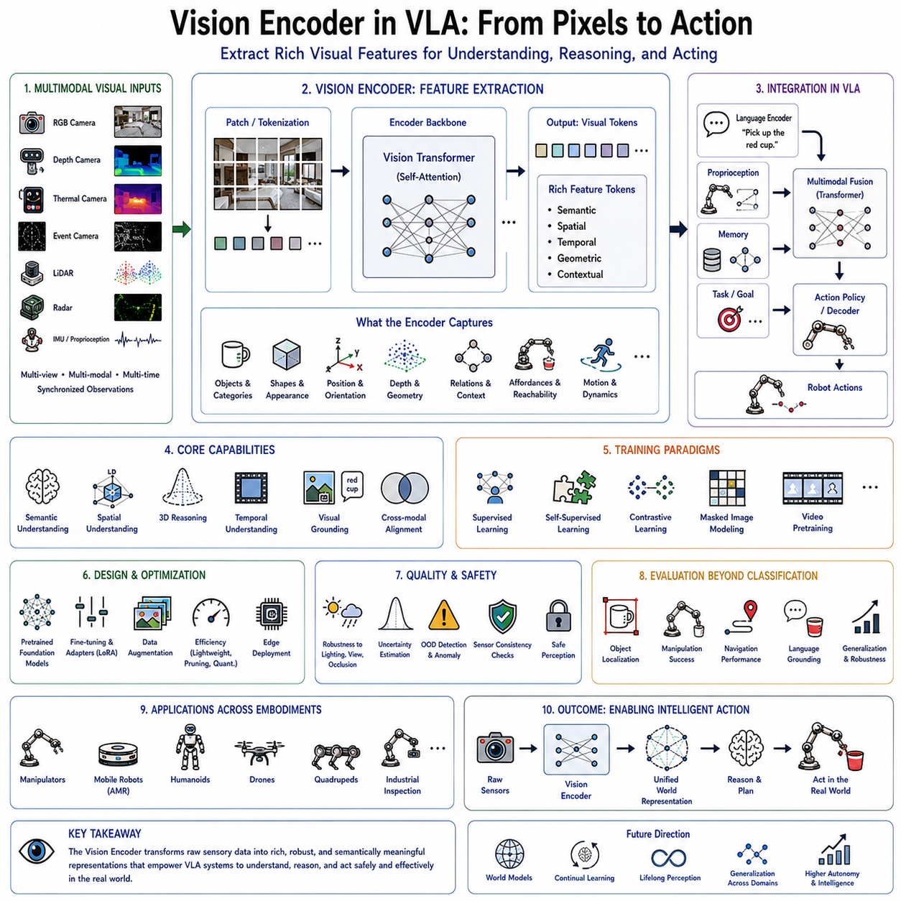
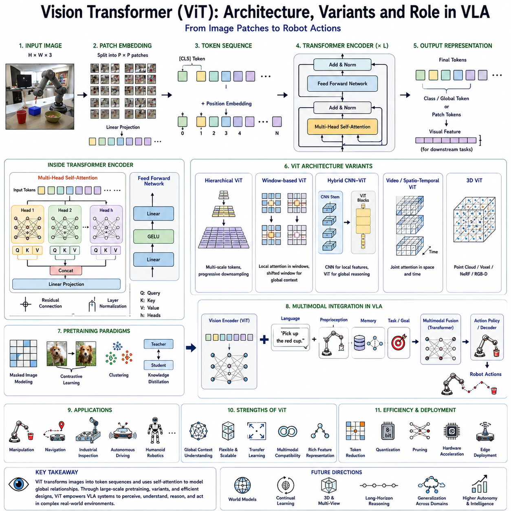
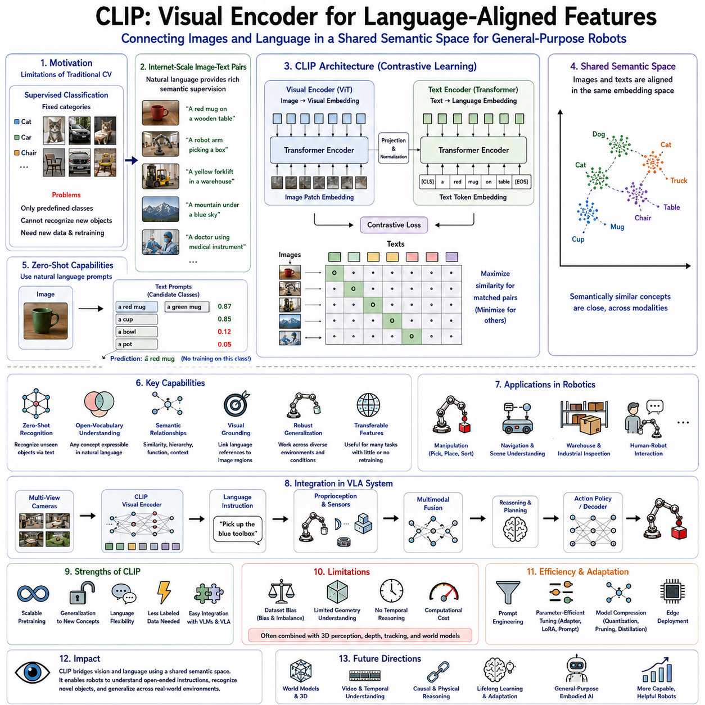
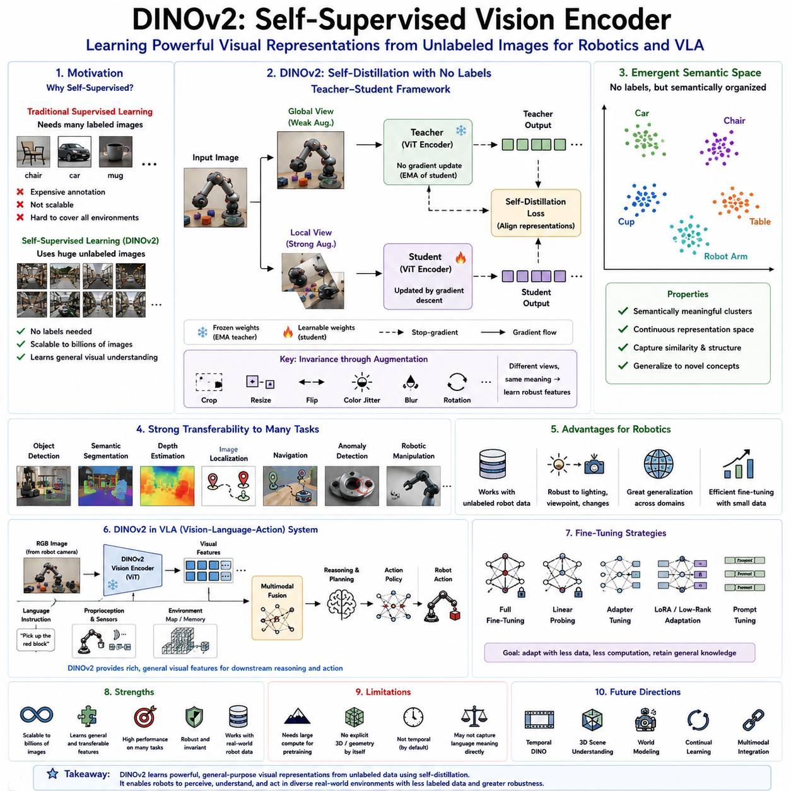
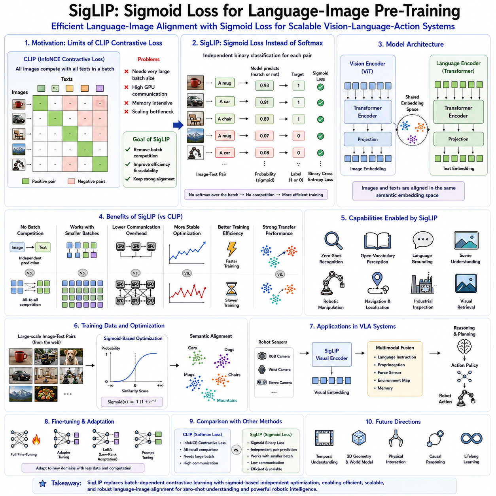
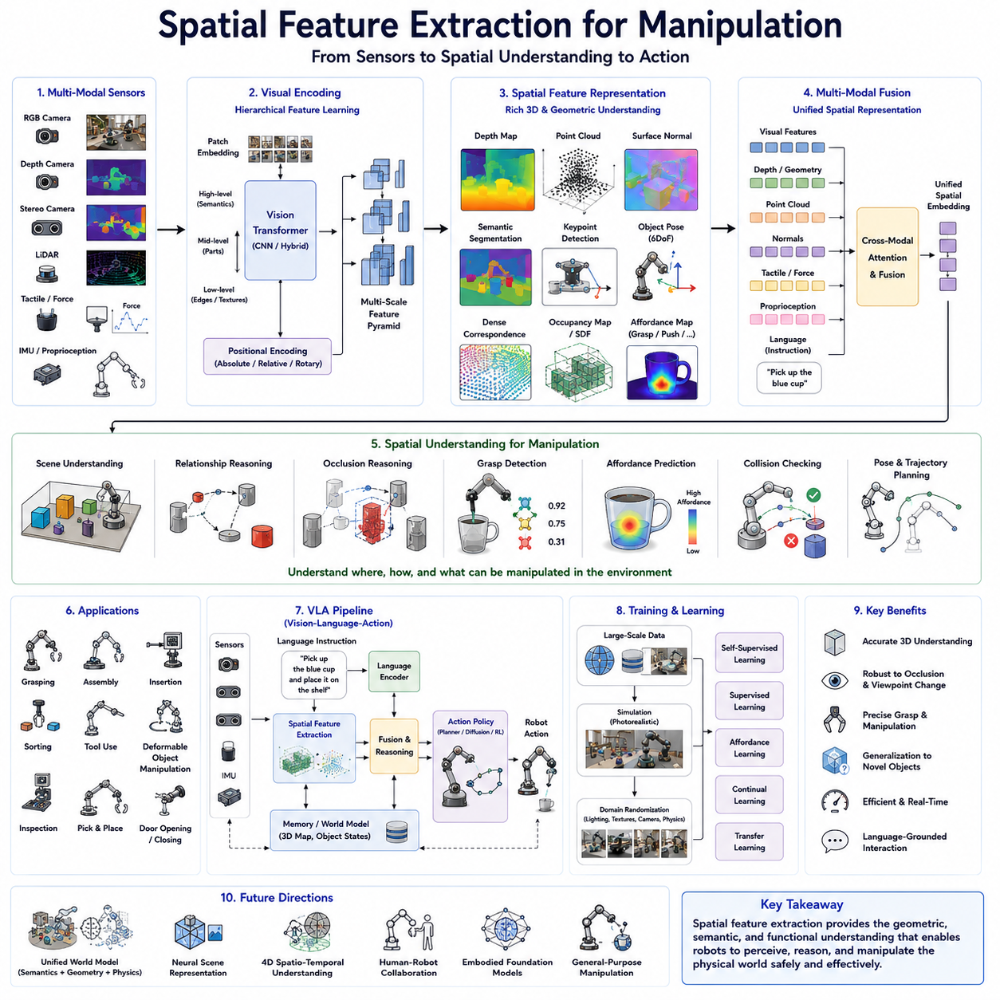
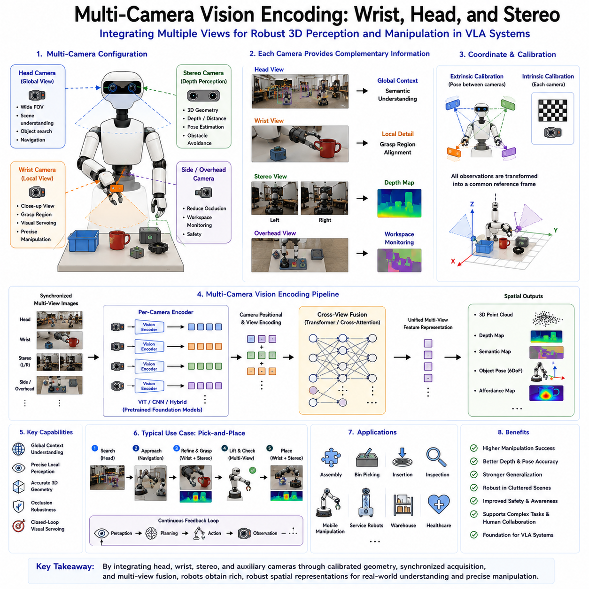
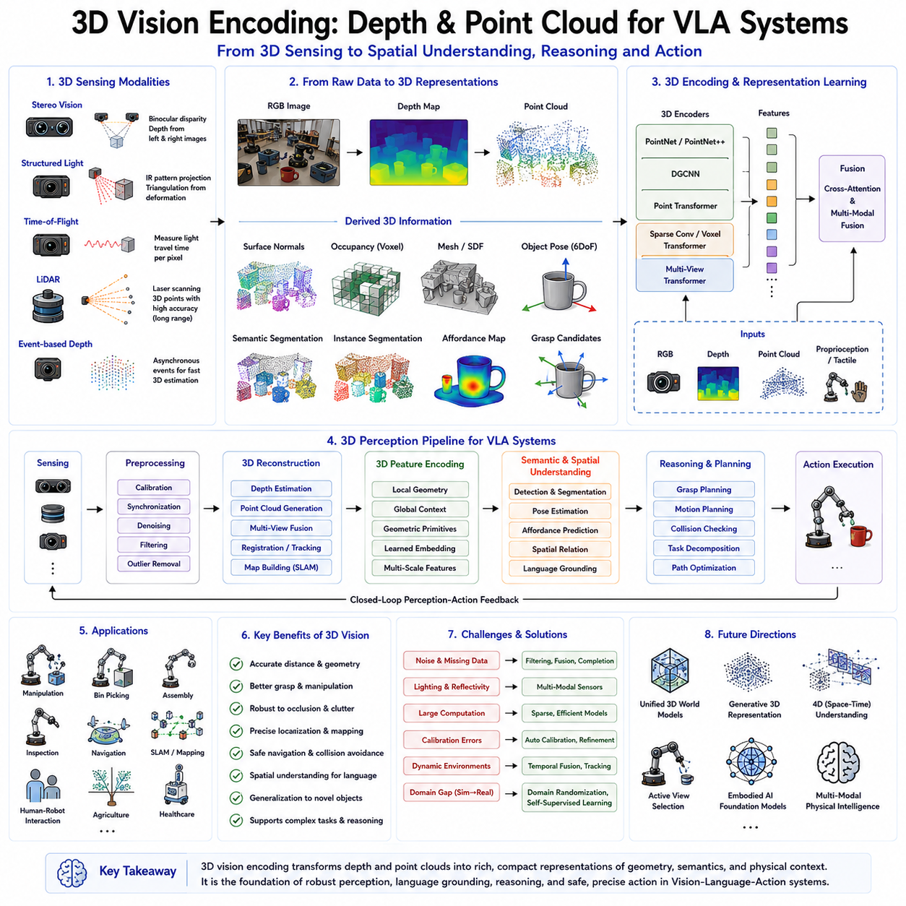
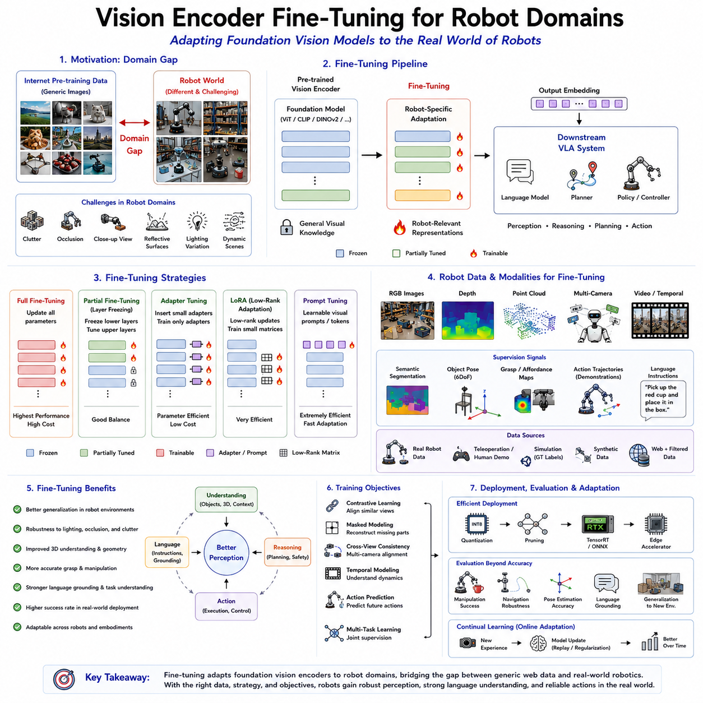
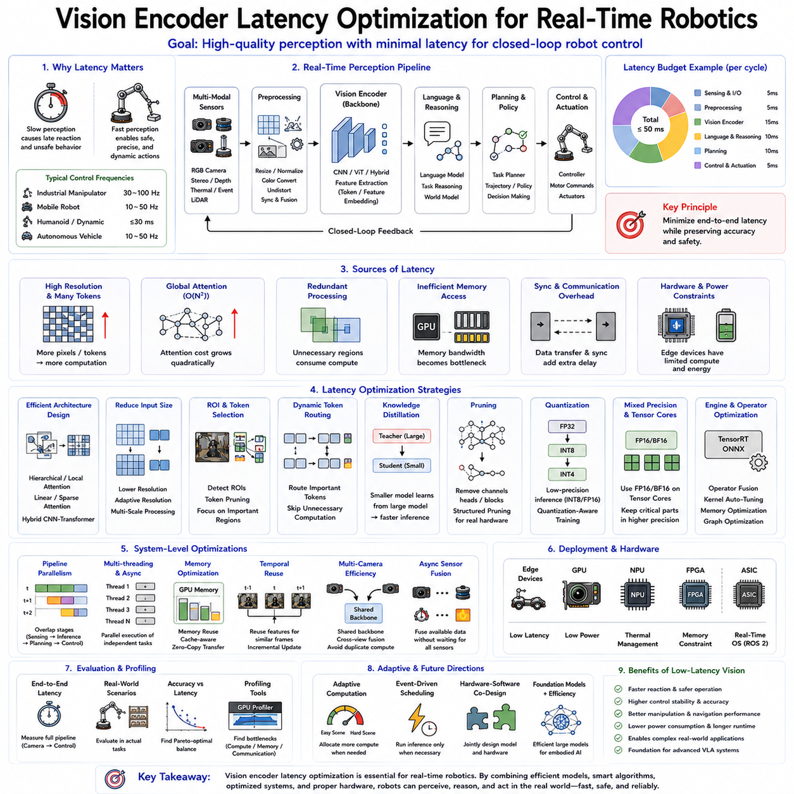

**Volume 20. Vision Language Action (VLA) Models**


# Chapter 2. Vision Encoders

##  

## 2.1 Role of Vision Encoders in VLA Feature Extraction

{width="7.268055555555556in" height="7.268055555555556in"}

The Vision Encoder serves as the perceptual foundation of every Vision-Language-Action (VLA) system. Just as the human visual cortex transforms raw photons into meaningful representations that enable recognition, reasoning, and interaction with the surrounding world, a Vision Encoder converts raw sensor observations into structured feature representations that can be understood by downstream neural modules. Without an effective visual representation, even the most sophisticated language model or action policy cannot understand the environment in which the robot operates. Consequently, the Vision Encoder is widely regarded as the "eyes" of an embodied artificial intelligence system, providing the semantic understanding necessary for perception, reasoning, planning, and physical interaction.

In modern robotic foundation models, perception is no longer considered an isolated computer vision problem. Instead, it represents the first stage of a unified multimodal intelligence pipeline. The visual encoder receives observations from one or more sensing modalities and produces compact latent representations that preserve both semantic meaning and spatial structure. These representations are subsequently integrated with language embeddings, robot proprioception, memory, world models, and task objectives before the VLA policy generates executable robot actions. Therefore, the quality of visual features directly influences every downstream component of the entire robotic intelligence stack.

Historically, robotic perception relied heavily on manually engineered feature extraction methods. Early robotic vision systems utilized edge detectors, corner detectors, texture descriptors, color histograms, geometric templates, and handcrafted local descriptors such as SIFT, SURF, ORB, and HOG. These techniques were computationally efficient and mathematically interpretable but struggled under varying illumination, viewpoint changes, partial occlusion, object deformation, and large-scale semantic variation. Because handcrafted features represented only limited visual characteristics, robotic systems frequently failed when encountering environments significantly different from those anticipated during development.

The emergence of deep convolutional neural networks fundamentally changed robotic perception. Instead of relying upon manually designed features, convolutional architectures automatically learned hierarchical representations directly from data. Lower network layers detected simple visual primitives such as edges and textures, intermediate layers recognized object parts and geometric structures, while deeper layers captured semantic concepts including complete objects, scene categories, and contextual relationships. This hierarchical learning capability substantially improved robustness across diverse operating conditions while eliminating the need for extensive manual feature engineering.

Although convolutional neural networks significantly advanced robotic perception, they also introduced architectural limitations. Convolution naturally emphasizes local receptive fields, requiring many stacked layers before long-range dependencies become available. Understanding relationships between distant image regions therefore becomes computationally challenging. In robotic manipulation and navigation, however, long-range spatial relationships frequently determine successful behavior. A robot must understand not only individual objects but also their relative positions, accessibility, spatial arrangements, and interactions within the surrounding environment.

Vision Transformers represent the next major evolution in robotic visual representation. Inspired by the transformer architecture originally developed for natural language processing, Vision Transformers divide images into fixed-size patches and process these patches using self-attention mechanisms. Rather than restricting computation to local neighborhoods, self-attention enables every image region to interact directly with every other region, allowing the network to capture global contextual relationships throughout the entire visual scene. This capability is particularly valuable for robotic reasoning because manipulation, navigation, and interaction often depend upon understanding the complete environmental context rather than isolated image fragments.

The fundamental objective of a Vision Encoder is not merely to compress visual information but to produce latent feature embeddings that preserve all information relevant for downstream robotic tasks while discarding irrelevant variations. Raw images contain enormous quantities of redundant information, including lighting fluctuations, sensor noise, minor texture variations, and background clutter. Effective feature extraction transforms these high-dimensional pixel arrays into compact representations emphasizing semantic content, geometric structure, object identity, spatial configuration, and interaction affordances while suppressing nuisance variables that unnecessarily complicate decision making.

Feature extraction therefore serves as a dimensionality reduction process guided by semantic preservation rather than simple compression. Two visually different observations corresponding to the same physical situation should ideally produce similar latent representations. Conversely, subtle visual differences that significantly alter robotic behavior must remain distinguishable within the embedding space. Designing representations satisfying these competing requirements constitutes one of the central challenges of modern robotic perception.

Within Vision-Language-Action systems, the output of the visual encoder generally consists of high-dimensional feature tokens rather than explicit object labels or segmentation maps. These feature tokens preserve rich semantic information while remaining sufficiently flexible for integration with language models and action policies. Instead of manually specifying which visual concepts should be extracted, downstream transformer layers learn to interpret feature embeddings according to current task objectives. Consequently, the same visual representation may support object recognition, scene understanding, manipulation planning, navigation, anomaly detection, and human interaction simultaneously.

Modern Vision Encoders frequently process multiple sensing modalities rather than conventional RGB images alone. Depth cameras provide geometric information describing three-dimensional scene structure. Thermal cameras reveal temperature distributions useful for inspection, search-and-rescue, and industrial monitoring. Event cameras capture rapid motion under challenging lighting conditions. LiDAR generates accurate three-dimensional point clouds supporting outdoor navigation. Radar operates reliably under adverse weather. Multispectral and hyperspectral imaging extends perception beyond visible wavelengths. Each sensing modality contributes complementary information regarding the physical environment.

Multimodal perception requires the Vision Encoder to integrate heterogeneous sensory observations into unified latent representations. Fusion may occur at early stages by combining raw sensor measurements, at intermediate stages through feature-level integration, or at later stages by merging independently encoded modality-specific embeddings. The choice of fusion strategy depends upon sensor characteristics, computational constraints, synchronization accuracy, and downstream application requirements. Regardless of implementation details, the objective remains consistent: constructing coherent environmental representations more informative than any individual sensing modality alone.

Spatial understanding represents one of the defining responsibilities of the Vision Encoder within robotic intelligence. Unlike image classification tasks emphasizing semantic recognition alone, robots must understand where objects are located, how they relate geometrically, whether they are reachable, and how they may be manipulated safely. Feature representations therefore encode not only appearance but also position, orientation, scale, depth, surface geometry, occlusion relationships, free space, traversability, and physical affordances supporting subsequent action planning.

Three-dimensional reasoning becomes increasingly important as robots transition from laboratory demonstrations toward complex real-world environments. Flat two-dimensional images often fail to capture critical geometric information required for grasp planning, obstacle avoidance, manipulation, and locomotion. Modern Vision Encoders increasingly incorporate stereo vision, depth estimation, point cloud processing, neural radiance fields, Gaussian representations, and volumetric scene encoding to construct richer spatial representations supporting embodied interaction.

Temporal perception constitutes another essential capability. Real-world robotic operation occurs continuously rather than through isolated image snapshots. Motion conveys valuable information regarding object dynamics, human intentions, robot egomotion, and environmental change. Vision Encoders therefore increasingly process image sequences instead of individual frames, learning temporal feature representations describing evolving visual observations across time. Video transformers, recurrent memory mechanisms, temporal attention, and spatiotemporal architectures capture these dynamic relationships supporting prediction and continuous decision making.

Motion understanding significantly influences robotic performance. Predicting future object trajectories enables proactive collision avoidance. Estimating human movement supports safe collaboration. Recognizing manipulation progress assists long-horizon task execution. Temporal visual representations additionally improve robustness under temporary occlusion because previously observed information remains available through memory. Consequently, modern VLA architectures frequently integrate temporal encoding directly into perception rather than treating video as independent image sequences.

Visual grounding establishes another critical connection between perception and language. Language instructions reference objects, locations, actions, colors, attributes, and spatial relationships present within the physical environment. The Vision Encoder therefore produces feature representations enabling language models to associate textual concepts with corresponding visual observations. Rather than independently recognizing every possible object category, grounding mechanisms align visual embeddings with semantic language representations, allowing robots to understand previously unseen objects described through natural language.

Cross-modal alignment has consequently become one of the most influential developments in multimodal artificial intelligence. Contrastive representation learning encourages visually similar semantic concepts to occupy nearby locations within shared embedding spaces regardless of modality. Images depicting cups become closely aligned with textual descriptions of cups, while images of chairs align with corresponding linguistic concepts. Such shared latent spaces greatly simplify multimodal reasoning because vision and language naturally communicate through compatible feature representations.

General-purpose visual foundation models have demonstrated remarkable transferability across numerous robotic applications. Models pretrained on massive Internet-scale image collections acquire surprisingly rich representations despite receiving no explicit robotic supervision. Rather than learning robotics-specific perception entirely from scratch, developers increasingly initialize Vision Encoders using these pretrained representations before adapting them toward domain-specific tasks through fine-tuning, adapter modules, prompt tuning, or low-rank parameter updates. This transfer learning paradigm dramatically reduces data requirements while improving generalization.

Feature transfer operates because many visual concepts remain consistent across domains. Edges, textures, shapes, materials, object categories, and geometric structures encountered during Internet-scale pretraining also appear within robotic environments. Although industrial robots, autonomous vehicles, service robots, and humanoids encounter specialized operating conditions, foundational visual representations nevertheless provide valuable initialization accelerating subsequent adaptation toward specific applications.

Robotic perception, however, introduces challenges absent from conventional computer vision benchmarks. Internet images typically emphasize aesthetically pleasing compositions captured from human viewpoints. Robots instead observe scenes from moving platforms, wrist-mounted cameras, unusual perspectives, changing illumination, motion blur, partial occlusion, sensor artifacts, and cluttered workspaces. Consequently, Vision Encoders frequently require additional adaptation before achieving reliable robotic performance. Domain-specific fine-tuning adjusts representations according to operational requirements while preserving broadly transferable semantic knowledge acquired during pretraining.

Data augmentation plays a major role in developing robust visual representations. Random cropping, rotation, scaling, color perturbation, illumination variation, blur simulation, noise injection, occlusion synthesis, geometric distortion, and domain randomization expose Vision Encoders to diverse visual conditions during training. Rather than memorizing narrow appearance distributions, models learn invariant semantic representations capable of generalizing across realistic environmental variability encountered during deployment.

Self-supervised learning has become particularly influential for Vision Encoder development because manually labeled robotic datasets remain relatively limited. Instead of relying exclusively upon expensive human annotations, self-supervised objectives exploit intrinsic image structure to learn useful representations automatically. Contrastive learning, masked image modeling, predictive coding, temporal consistency, clustering, and cross-view correspondence enable models to extract semantic features from enormous quantities of unlabeled visual data. Such approaches significantly reduce dependence upon manual dataset annotation while improving scalability.

The computational efficiency of Vision Encoders strongly influences practical robotic deployment. High-resolution cameras, multiple viewpoints, stereo imaging, and three-dimensional sensing dramatically increase computational complexity. Yet autonomous robots frequently operate under strict power, latency, and thermal constraints. Efficient architectures therefore balance representational quality against computational cost. Lightweight transformer variants, hierarchical attention mechanisms, token pruning, dynamic resolution adaptation, early exiting, and hardware-aware neural architecture search all contribute toward reducing inference latency while preserving feature quality.

Memory consumption presents another important engineering consideration. Vision feature maps often occupy substantial GPU memory, particularly when processing multiple cameras or extended temporal sequences. Feature compression, mixed-precision computation, activation checkpointing, memory-efficient attention, and quantized inference help reduce resource requirements without significantly degrading downstream robotic performance. Such optimizations become particularly valuable for edge deployment on mobile robotic platforms with limited onboard computational resources.

Interpretability remains an active area of Vision Encoder research. Although latent feature embeddings support powerful downstream reasoning, understanding precisely what information individual neurons or attention heads encode remains challenging. Visualization techniques including attention maps, feature inversion, activation maximization, token similarity analysis, and representation probing provide valuable insights into learned perception. Improved interpretability not only advances scientific understanding but also supports debugging, safety validation, regulatory compliance, and human trust.

Evaluation of Vision Encoders extends far beyond conventional image classification accuracy. Robotic perception must support object localization, manipulation success, navigation reliability, scene understanding, spatial reasoning, visual grounding, cross-domain generalization, robustness under environmental variation, computational efficiency, and downstream policy performance. Consequently, benchmarking increasingly emphasizes task-oriented evaluation measuring the practical contribution of visual representations toward complete robotic systems rather than isolated perception metrics.

Cross-embodiment transfer further highlights the importance of general visual representations. A Vision Encoder trained using one robotic platform should ideally remain useful across manipulators, autonomous mobile robots, quadrupeds, drones, humanoids, and industrial inspection systems despite differing viewpoints and sensing configurations. General visual understanding therefore becomes an enabling technology supporting reusable robotic intelligence independent of specific hardware embodiments.

Safety considerations also influence Vision Encoder design. Perception errors propagate directly toward planning and action generation, potentially creating hazardous behavior. Modern systems increasingly estimate uncertainty alongside feature extraction, allowing downstream modules to recognize unreliable observations. Multimodal redundancy, anomaly detection, confidence estimation, out-of-distribution recognition, sensor consistency verification, and continual monitoring collectively improve perception reliability under real-world operating conditions.

Continual learning represents another important research direction. Robotic environments evolve continuously as objects change appearance, facilities undergo modification, seasonal conditions vary, and operational procedures adapt. Static Vision Encoders trained once during development gradually become outdated. Continual adaptation allows perceptual representations to improve throughout deployment while avoiding catastrophic forgetting of previously acquired knowledge. Achieving stable lifelong perception remains a central objective of embodied artificial intelligence research.

The future of Vision Encoders will likely involve increasingly unified multimodal world representations rather than independent visual feature extraction. Perception will extend beyond recognizing current observations toward constructing persistent three-dimensional semantic world models integrating vision, language, memory, physics, interaction history, and predictive reasoning. Such world-centric representations will support long-horizon planning, causal reasoning, collaborative interaction, autonomous exploration, and generalized manipulation across highly diverse environments.

Ultimately, the Vision Encoder serves as the perceptual gateway connecting the physical world with intelligent reasoning inside Vision-Language-Action systems. Every subsequent stage of multimodal understanding depends fundamentally upon the quality, richness, robustness, and efficiency of extracted visual representations. By transforming raw sensory observations into meaningful semantic embeddings, Vision Encoders enable robots to recognize objects, understand spatial relationships, ground language, predict environmental dynamics, support reasoning, and generate purposeful physical actions. As robotic foundation models continue advancing toward increasingly capable embodied intelligence, Vision Encoders will remain one of the most fundamental components determining how effectively autonomous systems perceive, understand, and interact with the real world.

비전-언어-행동(Vision-Language-Action, VLA) 시스템에서 비전 인코더(Vision Encoder)는 로봇의 \'눈(Eyes)\' 역할을 수행하는 가장 중요한 구성 요소이다. 사람의 시각 피질(Visual Cortex)이 빛을 의미 있는 정보로 변환하여 주변 환경을 이해하듯이, 비전 인코더는 카메라와 다양한 센서로부터 입력된 원시 데이터(Raw Data)를 인공지능이 이해할 수 있는 특징 표현(Feature Representation)으로 변환한다. 아무리 뛰어난 언어 모델(Language Model)이나 행동 정책(Action Policy)을 사용하더라도, 환경을 올바르게 인식하지 못하면 정확한 판단과 행동은 불가능하다. 따라서 비전 인코더는 VLA 전체 지능의 출발점이며, 이후의 추론과 행동 생성 품질을 결정하는 핵심 기술이다.

현대의 로봇에서는 비전 인식이 독립적인 컴퓨터 비전(Computer Vision) 문제가 아니라 통합된 다중모달(Multimodal) 지능의 첫 번째 단계로 간주된다. 비전 인코더는 하나 이상의 센서로부터 입력된 영상을 분석하여 의미적 정보(Semantic Information)와 공간 정보(Spatial Information)를 포함하는 잠재 표현(Latent Representation)을 생성한다. 이러한 특징 벡터는 이후 언어(Language), 고유감각(Proprioception), 메모리(Memory), 작업 목표(Task Goal)와 결합되어 최종적으로 행동(Action)을 생성하는 기반이 된다.

초기의 로봇 비전 시스템은 대부분 사람이 직접 설계한 특징 추출(Handcrafted Feature Extraction)에 의존하였다. 에지 검출기(Edge Detector), 코너 검출기(Corner Detector), 색상 히스토그램(Color Histogram), SIFT, SURF, ORB, HOG와 같은 기법이 대표적이다. 이러한 알고리즘은 계산량이 적고 해석이 쉬웠지만, 조명 변화(Illumination Variation), 시점 변화(Viewpoint Change), 물체 가림(Occlusion), 물체 변형(Object Deformation)과 같은 실제 환경 변화에 매우 취약하였다. 따라서 실험실에서는 잘 동작하더라도 실제 산업 현장에서는 성능이 크게 저하되는 경우가 많았다.

딥러닝(Deep Learning)의 등장으로 비전 기술은 근본적으로 변화하였다. 합성곱 신경망(Convolutional Neural Network, CNN)은 사람이 직접 특징을 설계하지 않고, 데이터를 이용하여 계층적 특징(Hierarchical Feature)을 자동으로 학습하였다. 초기 계층은 에지와 질감을 학습하고, 중간 계층은 물체의 일부 구조를 이해하며, 깊은 계층에서는 완전한 물체와 장면(Scene)의 의미를 이해한다. 이러한 계층적 표현은 기존 수작업 특징보다 훨씬 높은 일반화 성능(Generalization)을 제공하였다.

그러나 CNN 역시 한계를 가지고 있었다. 합성곱은 기본적으로 지역적(Local) 연산이기 때문에 이미지 전체의 관계(Global Context)를 이해하려면 매우 깊은 네트워크가 필요하다. 하지만 실제 로봇은 멀리 떨어진 물체 간의 관계나 장면 전체의 구조를 이해해야 하는 경우가 많다. 따라서 전역적인 문맥(Global Context)을 보다 효율적으로 처리할 수 있는 새로운 구조가 필요하게 되었다.

이러한 요구를 해결하기 위해 등장한 것이 비전 트랜스포머(Vision Transformer, ViT)이다. ViT는 이미지를 작은 패치(Image Patch) 단위로 분할한 뒤 자기 어텐션(Self-Attention)을 이용하여 모든 패치 간의 관계를 동시에 계산한다. 이 방식은 CNN보다 훨씬 효과적으로 장면 전체를 이해할 수 있으며, 물체 간의 거리, 위치, 공간적 관계를 표현하는 데 매우 유리하다. 특히 조작(Manipulation), 자율주행(Navigation), 휴머노이드(Humanoid)와 같이 복잡한 환경을 이해해야 하는 VLA에서 매우 중요한 기술로 자리잡았다.

비전 인코더의 가장 중요한 목적은 단순히 이미지를 압축하는 것이 아니라 의미를 유지하면서 차원을 축소(Dimensionality Reduction)하는 것이다. 원시 영상에는 조명 변화, 센서 노이즈(Sensor Noise), 배경(Background), 불필요한 질감(Texture) 등 작업과 무관한 정보도 매우 많이 포함되어 있다. 비전 인코더는 이러한 불필요한 요소를 제거하면서 물체의 의미, 공간 구조, 형태, 위치, 관계와 같은 중요한 정보만을 특징 벡터로 추출한다.

효과적인 특징 추출은 단순한 압축이 아니라 의미 보존(Semantic Preservation)을 목표로 한다. 예를 들어 같은 컵(Cup)을 서로 다른 조명이나 각도에서 촬영하더라도 비슷한 특징 벡터를 생성해야 한다. 반대로 외형은 비슷하지만 기능적으로 다른 물체는 명확하게 구분되어야 한다. 이러한 특징 공간(Feature Space)을 만드는 것이 현대 비전 인코더 설계의 핵심 목표이다.

현대 VLA에서는 비전 인코더가 객체 이름이나 분할 결과를 직접 출력하는 것이 아니라, 고차원 특징 토큰(Feature Token)을 생성하는 것이 일반적이다. 이러한 토큰은 물체의 의미와 공간 구조를 모두 포함하고 있으며, 이후 트랜스포머가 현재 작업 목적에 맞게 해석한다. 따라서 동일한 특징 표현은 객체 인식(Object Recognition), 장면 이해(Scene Understanding), 조작 계획(Manipulation Planning), 자율주행(Navigation), 이상 탐지(Anomaly Detection) 등 다양한 작업에서 동시에 활용될 수 있다.

최근의 비전 인코더는 RGB 영상뿐 아니라 다양한 센서를 함께 처리한다. 깊이 카메라(Depth Camera)는 거리 정보를 제공하고, 열화상 카메라(Thermal Camera)는 온도 분포를 제공하며, 이벤트 카메라(Event Camera)는 빠른 움직임을 정확하게 측정한다. 또한 라이다(LiDAR), 레이더(Radar), 다중분광(Multispectral), 초분광(Hyperspectral) 센서까지 함께 활용되면서 로봇은 사람보다 더 풍부한 환경 정보를 인식할 수 있게 되었다.

다중모달 융합(Multimodal Fusion)은 이러한 다양한 센서 정보를 하나의 특징 공간으로 통합하는 기술이다. 융합은 원시 데이터 단계(Early Fusion), 특징 단계(Feature-Level Fusion), 의사결정 단계(Late Fusion)에서 수행될 수 있으며, 센서 종류와 응용 분야에 따라 적절한 구조를 선택한다. 최종 목표는 개별 센서보다 훨씬 풍부하고 신뢰성 높은 환경 표현(Environment Representation)을 생성하는 것이다.

공간 이해(Spatial Understanding)는 비전 인코더의 가장 중요한 기능 가운데 하나이다. 단순히 물체를 인식하는 것만으로는 로봇이 작업할 수 없다. 물체가 어디에 있는지, 어떤 방향을 향하고 있는지, 접근 가능한지, 집을 수 있는지 등을 함께 이해해야 한다. 따라서 특징 표현에는 위치(Position), 자세(Pose), 크기(Scale), 깊이(Depth), 표면 형상(Surface Geometry), 가림 관계(Occlusion), 이동 가능 공간(Free Space), 조작 가능성(Affordance) 등이 함께 포함된다.

최근에는 3차원 이해(3D Understanding)의 중요성이 더욱 커지고 있다. 단일 RGB 영상만으로는 정확한 거리와 공간 구조를 알기 어렵기 때문이다. 따라서 스테레오 비전(Stereo Vision), 깊이 추정(Depth Estimation), 포인트 클라우드(Point Cloud), 신경 방사장(Neural Radiance Field, NeRF), 가우시안 스플래팅(Gaussian Splatting) 등 다양한 기술이 비전 인코더에 적용되고 있으며, 더욱 정밀한 공간 표현을 가능하게 하고 있다.

시간적 이해(Temporal Understanding) 역시 중요한 기능이다. 실제 로봇은 정지된 사진이 아니라 연속적인 영상(Video)을 처리한다. 움직이는 사람, 이동하는 물체, 로봇 자신의 움직임은 모두 시간 정보(Time Information)를 포함한다. 따라서 최근 비전 인코더는 개별 이미지가 아니라 영상 시퀀스(Video Sequence)를 입력으로 받아 시간적 특징(Temporal Feature)을 함께 학습하는 방향으로 발전하고 있다.

움직임(Motion)은 로봇에게 매우 중요한 정보이다. 사람의 이동 방향을 예측하여 충돌을 방지할 수 있으며, 물체의 움직임을 이용하여 작업 진행 상황(Task Progress)을 판단할 수도 있다. 또한 일시적으로 물체가 가려지더라도 이전 프레임의 정보를 기억하여 작업을 계속 수행할 수 있다. 이러한 시간 기반 표현은 장시간 작업(Long-Horizon Task)에서 매우 중요한 역할을 한다.

비전과 언어를 연결하는 시각적 그라운딩(Visual Grounding)은 VLA에서 핵심 기술이다. 사용자가 "빨간 컵을 집어라."라고 말하면 비전 인코더는 영상 속의 빨간 컵을 언어 표현과 연결해야 한다. 이를 위해 이미지와 텍스트가 동일한 의미 공간(Shared Embedding Space)에 표현되도록 학습한다. 이러한 구조 덕분에 학습하지 않은 새로운 물체도 언어 설명만으로 인식할 수 있게 된다.

이러한 교차모달 정렬(Cross-Modal Alignment)은 현대 다중모달 AI의 가장 중요한 기술 가운데 하나이다. 컵 이미지는 "Cup"이라는 텍스트와 가까운 위치에 표현되고, 의자는 "Chair"라는 텍스트와 가까운 특징 공간을 형성한다. 따라서 언어 모델과 비전 모델은 동일한 의미 공간을 공유하면서 자연스럽게 상호작용할 수 있다.

최근에는 범용 비전 기반 모델(Vision Foundation Model)이 매우 큰 성공을 거두고 있다. 인터넷 규모의 데이터셋에서 사전학습된 모델은 로봇 데이터가 거의 없어도 뛰어난 일반화 능력을 제공한다. 따라서 대부분의 VLA는 이러한 모델을 초기화(Initialization)한 후, 로봇 환경에 맞게 미세조정(Fine-Tuning), 어댑터(Adapter), 프롬프트 튜닝(Prompt Tuning), 저랭크 적응(Low-Rank Adaptation, LoRA) 등을 적용한다.

전이학습(Transfer Learning)이 가능한 이유는 대부분의 시각적 개념이 공통적으로 존재하기 때문이다. 인터넷 이미지에서 학습한 에지, 질감, 형태, 물체 구조는 산업용 로봇, 서비스 로봇, 자율주행차에서도 동일하게 나타난다. 따라서 처음부터 모든 것을 학습하는 것보다 기존 표현을 활용하는 것이 훨씬 효율적이다.

그러나 로봇 환경은 일반 이미지와 상당히 다르다. 손목 카메라(Wrist Camera), 이동 카메라(Mobile Camera), 심한 모션 블러(Motion Blur), 다양한 조명, 작업 공간의 복잡한 배경 등이 존재하기 때문에 추가적인 도메인 적응(Domain Adaptation)이 필요하다. 이를 통해 일반 비전 모델을 실제 로봇 환경에 최적화할 수 있다.

데이터 증강(Data Augmentation)은 강인한 비전 인코더를 만드는 중요한 기술이다. 회전(Rotation), 크기 변경(Scaling), 색상 변화(Color Jitter), 조명 변화, 노이즈 추가(Noise Injection), 가림(Occlusion), 기하학적 왜곡(Geometric Distortion), 도메인 랜덤화(Domain Randomization) 등을 이용하여 다양한 환경을 학습시키면 실제 환경에서도 높은 일반화 성능을 얻을 수 있다.

최근에는 자기지도학습(Self-Supervised Learning)이 매우 중요해지고 있다. 로봇 데이터를 모두 사람이 라벨링(Labeling)하는 것은 비용이 매우 크기 때문이다. 자기지도학습은 이미지 자체의 구조를 이용하여 의미 있는 특징을 자동으로 학습하며, 대규모 비라벨(Unlabeled) 데이터를 효과적으로 활용할 수 있다. 대조학습(Contrastive Learning), 마스킹 이미지 모델링(Masked Image Modeling), 예측 부호화(Predictive Coding) 등이 대표적인 방법이다.

비전 인코더의 계산 효율성(Computational Efficiency)은 실제 로봇에서 매우 중요한 요소이다. 여러 대의 카메라와 고해상도 영상을 동시에 처리하면 계산량이 급격히 증가한다. 그러나 이동 로봇은 전력(Power), 발열(Thermal), 지연(Latency)에 제한이 있기 때문에 경량 트랜스포머(Lightweight Transformer), 토큰 프루닝(Token Pruning), 동적 해상도(Dynamic Resolution), 하드웨어 최적화(Hardware-Aware Optimization) 등이 함께 사용된다.

메모리 사용량(Memory Consumption) 역시 중요한 설계 요소이다. 다중 카메라와 긴 영상 시퀀스를 처리하면 GPU 메모리 사용량이 급격히 증가한다. 이를 해결하기 위해 혼합 정밀도(Mixed Precision), 특징 압축(Feature Compression), 메모리 효율 어텐션(Memory-Efficient Attention), 양자화(Quantization) 등이 널리 적용되고 있다.

설명 가능성(Interpretability)은 비전 인코더 연구의 중요한 분야이다. 특징 벡터 내부에 어떤 정보가 저장되어 있는지 이해하기 위해 어텐션 맵(Attention Map), 특징 시각화(Feature Visualization), 활성화 분석(Activation Analysis), 특징 역변환(Feature Inversion) 등이 사용된다. 이러한 분석은 모델의 디버깅(Debugging), 안전성(Safety), 신뢰성(Reliability)을 높이는 데 중요한 역할을 한다.

비전 인코더의 평가는 단순한 이미지 분류 정확도로 이루어지지 않는다. 객체 위치 추정(Object Localization), 조작 성공률(Manipulation Success), 자율주행 성능(Navigation Performance), 공간 추론(Spatial Reasoning), 언어 그라운딩(Language Grounding), 계산 속도(Computational Efficiency), 일반화(Generalization), 강인성(Robustness) 등을 종합적으로 평가한다. 결국 비전 인코더의 품질은 최종 로봇 성능으로 평가된다.

크로스 엠바디먼트(Cross-Embodiment) 전이도 중요한 연구 분야이다. 하나의 비전 인코더가 매니퓰레이터(Manipulator), AMR, 사족보행 로봇(Quadruped), 드론(Drone), 휴머노이드(Humanoid) 등 다양한 플랫폼에서 동일하게 활용될 수 있어야 한다. 이를 통해 로봇 하드웨어가 달라져도 동일한 지능을 재사용할 수 있다.

안전(Safety) 역시 비전 인코더와 밀접한 관련이 있다. 잘못된 인식은 곧 잘못된 행동으로 이어질 수 있기 때문에 최신 비전 인코더는 신뢰도 추정(Confidence Estimation), 이상 탐지(Anomaly Detection), 분포 외 탐지(Out-of-Distribution Detection), 센서 일관성 검사(Sensor Consistency Check)를 함께 수행하여 위험 상황을 조기에 발견하도록 설계된다.

지속적 학습(Continual Learning)은 미래 비전 인코더의 중요한 방향이다. 실제 환경은 계속 변화하며 새로운 물체와 새로운 작업이 지속적으로 등장한다. 따라서 비전 인코더는 기존 지식을 잊지 않으면서(Catastrophic Forgetting 방지) 새로운 환경을 계속 학습할 수 있어야 한다. 이는 장기적으로 자율적으로 성장하는 물리 인공지능(Physical AI)의 핵심 기술이 될 것이다.

앞으로의 비전 인코더는 단순히 이미지를 특징 벡터로 변환하는 수준을 넘어, 비전(Vision), 언어(Language), 메모리(Memory), 물리 법칙(Physics), 상호작용(Interaction), 예측(Prediction)을 통합한 월드 모델(World Model)을 구축하는 방향으로 발전할 것이다. 이러한 세계 표현은 장기 계획(Long-Horizon Planning), 인과 추론(Causal Reasoning), 협업(Collaboration), 자율 탐사(Autonomous Exploration), 범용 조작(General Manipulation)을 지원하는 핵심 기반이 된다.

결국 비전 인코더는 현실 세계(Physical World)와 인공지능(Artificial Intelligence)을 연결하는 가장 중요한 관문이다. 원시 센서 데이터를 의미 있는 특징 표현으로 변환함으로써 객체 인식(Object Recognition), 공간 이해(Spatial Understanding), 언어 그라운딩(Language Grounding), 환경 예측(Environment Prediction), 추론(Reasoning), 행동 생성(Action Generation)의 기반을 제공한다. 미래의 VLA와 물리 인공지능(Physical AI)이 더욱 높은 수준의 지능을 갖추기 위해서는 강인하고 효율적이며 범용적인 비전 인코더의 발전이 무엇보다 중요한 핵심 요소가 될 것이다.

##  

## 2.2 Vision Transformer (ViT) Architecture and Variants (with Code)

{width="7.268055555555556in" height="7.268055555555556in"}

The Vision Transformer (ViT) represents one of the most significant milestones in the evolution of modern computer vision and has become a fundamental building block for Vision-Language-Action (VLA) systems. Originally inspired by the Transformer architecture developed for natural language processing, Vision Transformer fundamentally changed how visual information is represented, processed, and integrated into multimodal foundation models. Instead of relying on convolutional operations that dominated computer vision for more than two decades, ViT introduced the concept of treating an image as a sequence of visual tokens, allowing the same attention-based architecture that revolutionized language understanding to become equally effective for visual perception.

The introduction of Vision Transformer marked a conceptual shift rather than merely an architectural improvement. Traditional convolutional neural networks assumed that local spatial neighborhoods contained the most important visual information, gradually expanding receptive fields through deeper network layers. Vision Transformer removed this assumption entirely. Every image region can directly communicate with every other region through self-attention, enabling global contextual reasoning from the earliest stages of feature extraction. This ability has proven especially valuable for robotic perception because robots must reason about complete scenes rather than isolated objects.

Within Vision-Language-Action systems, Vision Transformer serves as the primary visual encoder responsible for converting raw images into semantic feature representations that can be fused with language embeddings, robot states, memory, and action policies. The quality of these visual representations largely determines how well downstream reasoning modules understand the physical environment. Consequently, ViT has become the default backbone for many state-of-the-art robotic foundation models, including multimodal VLMs, VLA systems, humanoid policies, and general-purpose robot learning frameworks.

The fundamental idea behind Vision Transformer is surprisingly elegant. Instead of processing pixels directly, an input image is first divided into a regular grid of fixed-size patches. Each patch is flattened into a one-dimensional vector and projected into a higher-dimensional embedding space using a learned linear projection. These projected vectors become visual tokens analogous to word embeddings in natural language models. Once converted into token embeddings, the remainder of the architecture closely resembles the original Transformer encoder used for language processing.

Patch embedding serves as the first stage of the Vision Transformer pipeline. Consider an image with a resolution of 224 by 224 pixels. If sixteen-by-sixteen patches are used, the image becomes fourteen-by-fourteen patches, resulting in a sequence of one hundred ninety-six visual tokens. Each token summarizes the visual content of one local image region while preserving spatial ordering through positional embeddings. The patch size significantly influences computational complexity, feature granularity, and recognition performance. Smaller patches preserve finer spatial detail but increase sequence length and computational cost. Larger patches reduce computation but may lose important visual structures necessary for manipulation and robotic perception.

Positional encoding is essential because Transformers themselves possess no inherent understanding of spatial relationships. Unlike convolutional layers, which naturally preserve neighborhood structure through local receptive fields, self-attention treats input tokens as unordered sets unless explicit positional information is provided. Learned positional embeddings or sinusoidal encodings are therefore added to every visual token before transformer processing. These embeddings enable the network to distinguish neighboring image patches and reason about relative spatial arrangements within the visual scene.

Following patch embedding, the visual tokens pass through multiple Transformer encoder blocks. Each block consists primarily of Multi-Head Self-Attention, feed-forward neural networks, residual connections, and layer normalization. These components collectively allow the network to learn increasingly abstract visual representations while maintaining stable optimization during large-scale training.

Multi-Head Self-Attention represents the defining innovation of Vision Transformer. Rather than processing each image region independently, self-attention computes relationships between every pair of visual tokens simultaneously. Each token dynamically determines which other image regions contain relevant contextual information. Consequently, a token representing a robotic gripper can directly attend to an object located on the opposite side of the image without requiring numerous intermediate convolutional layers. This global interaction dramatically improves contextual reasoning, especially for scenes involving multiple interacting objects.

Multiple attention heads further enhance representational capacity. Different attention heads naturally specialize in different visual relationships. Some heads primarily capture object boundaries, others focus on semantic categories, while additional heads learn geometric structures, spatial configurations, textures, or contextual interactions. Together, these parallel attention mechanisms create rich hierarchical visual representations that support downstream reasoning and robotic action generation.

The feed-forward network following each attention layer further transforms token representations using nonlinear projections. Although self-attention determines how information flows between image regions, the feed-forward network increases representational capacity by learning complex nonlinear feature transformations independently for every token. Residual connections preserve information flow across deep networks, while layer normalization stabilizes optimization and accelerates convergence during training.

Unlike convolutional neural networks, Vision Transformers contain no explicit assumptions regarding locality or translation invariance. Instead, these properties emerge naturally through large-scale data-driven learning. Initially, researchers questioned whether removing convolution would degrade visual recognition. Surprisingly, sufficiently large datasets demonstrated that pure attention architectures often outperform convolutional networks once adequate training data becomes available. This discovery fundamentally reshaped computer vision research and influenced virtually every subsequent multimodal foundation model.

One important characteristic of Vision Transformer is its dependence upon large-scale pretraining. Convolutional neural networks naturally encode useful inductive biases, allowing effective learning from relatively modest datasets. Vision Transformers possess fewer built-in assumptions, requiring substantially more data before superior performance emerges. Consequently, ViT models are typically pretrained using millions or billions of images before adaptation toward downstream robotic tasks. Once pretrained, however, they exhibit remarkable transfer learning capabilities across diverse application domains.

Transfer learning has become one of the primary reasons for Vision Transformer\'s widespread adoption in robotics. Massive image datasets contain enormous visual diversity spanning objects, materials, textures, lighting conditions, environments, and viewpoints. During pretraining, ViT learns universal visual representations transferable to industrial inspection, warehouse automation, autonomous driving, household robotics, agricultural systems, medical robotics, and humanoid manipulation. Rather than collecting prohibitively expensive robotic datasets from scratch, researchers fine-tune pretrained Vision Transformers for specialized robotic applications.

Feature extraction within Vision Transformer differs fundamentally from traditional object recognition pipelines. Earlier computer vision systems frequently emphasized explicit detection, segmentation, or classification outputs. Modern ViT architectures instead produce high-dimensional latent embeddings preserving rich semantic information. These embeddings support numerous downstream tasks simultaneously without requiring separate feature engineering for each application. The same visual representation may therefore contribute to manipulation planning, navigation, language grounding, scene understanding, anomaly detection, and interaction reasoning.

Spatial reasoning represents one of Vision Transformer\'s greatest strengths within robotic systems. Since every visual token attends globally to every other token, long-range spatial dependencies naturally emerge throughout learned representations. A robot manipulating objects on a cluttered table benefits enormously from understanding relationships among distant objects, free workspace, obstacles, containers, and target destinations simultaneously. Such global awareness substantially improves task planning compared with purely local visual processing.

However, the quadratic computational complexity of self-attention introduces significant engineering challenges. Every visual token interacts with every other token, causing computational and memory requirements to increase quadratically with sequence length. High-resolution images therefore become computationally expensive. For example, doubling image resolution approximately quadruples the number of patches while increasing attention computations by roughly sixteen times. Efficient architectural variants have consequently become essential for practical robotic deployment.

Numerous Vision Transformer variants have emerged to address these computational challenges while preserving representational quality. One of the earliest improvements introduced hierarchical feature extraction. Rather than maintaining fixed token resolution throughout the network, hierarchical architectures progressively merge neighboring tokens into larger semantic representations, reducing computational complexity while preserving multi-scale information. Such approaches resemble feature pyramids traditionally used in convolutional neural networks but retain attention-based processing throughout the architecture.

Window-based attention represents another influential optimization. Instead of computing attention globally across the entire image, local attention windows restrict interactions to nearby regions. Neighboring windows periodically exchange information through shifted partitioning strategies, allowing global context to emerge gradually while dramatically reducing computational cost. This approach enables efficient processing of higher-resolution images suitable for dense robotic perception tasks.

Hybrid architectures combining convolution and attention have also proven successful. Early convolutional layers efficiently extract local textures and edges before transformer blocks perform higher-level contextual reasoning. Such hybrid designs exploit the complementary strengths of both paradigms. Convolutions provide computational efficiency and strong local inductive biases, whereas transformers contribute flexible global reasoning. Many practical robotic systems adopt such hybrid visual backbones to balance accuracy with computational constraints.

Hierarchical Vision Transformers have become particularly important for robotic perception because they naturally produce multi-scale representations. Early layers preserve fine spatial details useful for grasp planning and precise localization, while deeper layers encode increasingly abstract semantic concepts supporting task reasoning and language grounding. Multi-scale features also facilitate integration with downstream perception modules performing object detection, segmentation, depth estimation, or simultaneous localization and mapping.

Self-supervised pretraining has profoundly influenced Vision Transformer development. Rather than relying exclusively upon manually labeled datasets, self-supervised objectives encourage networks to learn meaningful visual representations directly from unlabeled images. Masked image modeling, contrastive learning, predictive coding, clustering, and teacher-student distillation enable ViT architectures to acquire transferable semantic knowledge without expensive annotation. Such approaches significantly improve scalability while reducing dependence upon curated datasets.

Contrastive representation learning has become especially influential. During training, different augmented views of the same image are encouraged to produce similar embeddings, whereas unrelated images occupy distant regions within latent space. This objective naturally learns robust semantic features invariant to lighting, viewpoint, cropping, color variation, and moderate geometric transformations. Such invariance proves extremely valuable for robots operating under continuously changing environmental conditions.

Masked image modeling represents another important training paradigm. Random image patches are hidden during training, and the Vision Transformer learns to reconstruct missing visual information from surrounding context. This objective encourages deep semantic understanding because successful reconstruction requires reasoning about object structure, scene composition, and contextual relationships rather than merely memorizing pixel patterns. Models trained using masked prediction often demonstrate exceptional transfer learning performance across downstream robotic applications.

Knowledge distillation has further improved Vision Transformer efficiency. Large teacher models transfer representational knowledge toward smaller student architectures suitable for edge deployment. Distilled Vision Transformers preserve much of the semantic capability of substantially larger networks while reducing computational cost sufficiently for onboard robotic inference. Such lightweight models enable practical deployment on autonomous mobile robots, drones, collaborative manipulators, and embedded edge platforms.

Vision Transformer also integrates naturally with multimodal learning. Since both visual patches and language tokens are represented as sequences of embeddings, images and text may be processed using highly similar transformer architectures. Cross-attention layers align visual tokens with linguistic concepts, enabling multimodal reasoning across perception and language. This architectural compatibility explains why ViT rapidly became the preferred visual backbone for multimodal systems including CLIP, PaLM-E, LLaVA, GPT-4V, Gemini, Qwen-VL, InternVL, RT-2, and numerous robotic foundation models.

In Vision-Language-Action architectures, ViT typically functions as the perception module responsible for encoding RGB observations, wrist camera images, stereo vision, overhead cameras, or multi-camera systems into unified visual embeddings. These embeddings are subsequently fused with language instructions, proprioceptive measurements, force sensing, memory representations, and task objectives. The resulting multimodal latent space supports high-level reasoning before action policies generate executable robot behaviors.

Multi-camera robotic perception particularly benefits from Vision Transformer architectures. Mobile manipulators often employ head-mounted cameras, wrist cameras, side cameras, and depth sensors simultaneously. Each viewpoint captures complementary information regarding object geometry, occlusion, manipulation affordances, and environmental context. Vision Transformers efficiently integrate these heterogeneous visual observations into coherent scene representations through attention-based feature fusion rather than manually engineered sensor integration pipelines.

Temporal Vision Transformers extend these concepts toward video understanding. Instead of processing isolated images, temporal architectures jointly attend across both spatial and temporal dimensions. Such models capture motion patterns, object trajectories, human activities, manipulation progress, and environmental dynamics essential for long-horizon robotic tasks. Video-based feature extraction increasingly supports embodied reasoning by providing persistent contextual awareness unavailable from individual frames.

Three-dimensional Vision Transformers represent another rapidly advancing research direction. Rather than restricting attention to two-dimensional image patches, specialized architectures process point clouds, voxel grids, neural radiance fields, Gaussian representations, or multimodal RGB-depth observations directly. These models learn spatial representations more closely aligned with physical geometry, improving robotic manipulation, navigation, inspection, and autonomous interaction within three-dimensional environments.

Interpretability has become an active area of Vision Transformer research. Attention visualization provides valuable insight into how models distribute computational focus across visual scenes. Researchers analyze attention maps, feature embeddings, token similarity, activation trajectories, and representation geometry to understand learned perception. Although attention alone does not fully explain network reasoning, these visualization techniques significantly improve debugging, safety validation, and scientific understanding.

Robotic deployment introduces additional optimization requirements beyond conventional computer vision. Edge platforms impose strict limitations regarding latency, memory consumption, energy efficiency, and thermal management. Vision Transformer inference therefore frequently incorporates quantization, pruning, token reduction, mixed-precision arithmetic, compiler optimization, hardware-aware scheduling, and specialized transformer accelerators. These optimizations preserve visual quality while satisfying real-time operational constraints.

Future Vision Transformer development will likely emphasize increasingly unified world representations rather than isolated visual encoding. Instead of merely extracting features from individual images, next-generation architectures will construct persistent semantic world models integrating visual observations across time, viewpoints, sensor modalities, and physical interaction. Such representations will support causal reasoning, predictive simulation, memory, planning, and continual learning within embodied artificial intelligence systems.

Ultimately, Vision Transformer has transformed robotic perception by replacing manually engineered local feature extraction with globally contextualized semantic representation learning. Its ability to encode visual information as rich token sequences naturally compatible with language models has established it as the dominant visual backbone for modern Vision-Language-Action systems. Through self-attention, large-scale pretraining, transfer learning, multimodal fusion, and increasingly efficient architectural variants, Vision Transformer enables robots to perceive complex environments with unprecedented flexibility and generalization. As multimodal foundation models continue advancing toward increasingly capable embodied intelligence, Vision Transformer and its successors will remain central technologies connecting visual perception with language understanding, reasoning, and autonomous physical action.

비전 트랜스포머(Vision Transformer, ViT)는 현대 컴퓨터 비전(Computer Vision)의 가장 중요한 발전 가운데 하나이며, 오늘날 비전-언어-행동(Vision-Language-Action, VLA) 시스템의 핵심 구성 요소로 자리 잡았다. ViT는 자연어 처리(Natural Language Processing)의 트랜스포머(Transformer) 구조를 영상 처리에 적용한 모델로, 기존의 합성곱 신경망(Convolutional Neural Network, CNN) 중심 구조를 근본적으로 변화시켰다. 이미지를 단순한 픽셀 집합이 아니라 시각 토큰(Visual Token)의 시퀀스(Sequence)로 처리함으로써 언어 모델과 동일한 방식의 표현 학습과 추론이 가능해졌다.

ViT의 등장은 단순한 모델 개선이 아니라 영상 인식 방식 자체의 패러다임 전환이었다. 기존 CNN은 국소 영역(Local Region)의 특징을 단계적으로 확장하면서 장면을 이해했지만, ViT는 자기 어텐션(Self-Attention)을 이용하여 모든 이미지 영역이 서로 직접 정보를 교환하도록 설계되었다. 따라서 이미지 전체의 문맥(Global Context)을 초기 단계부터 동시에 이해할 수 있으며, 복잡한 장면을 처리해야 하는 로봇 환경에서 매우 뛰어난 성능을 보인다.

VLA 시스템에서 ViT는 가장 중요한 비전 인코더(Vision Encoder) 역할을 수행한다. 카메라로부터 입력된 영상을 의미 있는 특징 표현(Feature Representation)으로 변환한 뒤, 이를 언어(Language), 로봇 상태(Proprioception), 메모리(Memory), 행동 정책(Action Policy)과 결합하여 최종 행동을 생성한다. 따라서 비전 표현의 품질은 이후의 추론(Reasoning), 계획(Planning), 행동(Action) 성능을 직접적으로 결정하며, 대부분의 최신 로봇 기반 모델은 ViT를 기본 백본(Backbone)으로 채택하고 있다.

ViT의 핵심 아이디어는 매우 단순하면서도 강력하다. 입력 이미지를 일정한 크기의 패치(Image Patch)로 나누고, 각 패치를 하나의 토큰(Token)으로 변환한다. 이후 각 패치는 선형 투영(Linear Projection)을 통해 고차원 임베딩(Embedding)으로 변환되며, 자연어 처리에서 단어(Token)를 처리하는 것과 동일한 방식으로 트랜스포머에 입력된다. 즉, ViT는 이미지를 하나의 문장처럼 이해하는 구조라고 볼 수 있다.

패치 임베딩(Patch Embedding)은 ViT의 첫 번째 단계이다. 예를 들어 224×224 크기의 이미지를 16×16 패치로 나누면 총 196개의 패치가 생성된다. 각 패치는 독립적인 시각 토큰으로 변환되며, 이후 모든 토큰은 동일한 트랜스포머 구조에서 처리된다. 패치 크기는 매우 중요한 설계 변수이다. 작은 패치는 세밀한 정보를 유지하지만 계산량이 증가하고, 큰 패치는 계산량은 줄지만 세부 구조가 손실될 수 있다. 따라서 로봇 조작과 같이 정밀한 작업에서는 적절한 패치 크기 선택이 매우 중요하다.

위치 임베딩(Positional Embedding)은 ViT에서 반드시 필요한 요소이다. 트랜스포머는 입력 순서를 스스로 알 수 없기 때문에 각 패치의 위치 정보를 별도로 추가해야 한다. 이를 통해 모델은 어떤 패치가 위쪽에 있는지, 어느 패치가 서로 인접한지를 이해하게 된다. 위치 임베딩이 없으면 이미지의 공간적 구조를 학습할 수 없기 때문에 시각적 의미를 제대로 이해하기 어렵다.

패치 임베딩 이후에는 여러 개의 트랜스포머 인코더(Transformer Encoder)가 반복적으로 적용된다. 각 인코더는 멀티헤드 자기 어텐션(Multi-Head Self-Attention), 피드포워드 네트워크(Feed Forward Network), 잔차 연결(Residual Connection), 계층 정규화(Layer Normalization)로 구성된다. 이러한 구조는 깊은 네트워크에서도 안정적인 학습을 가능하게 하며, 점진적으로 더 높은 수준의 의미 표현을 생성한다.

멀티헤드 자기 어텐션(Multi-Head Self-Attention)은 ViT의 핵심 기술이다. 기존 CNN에서는 서로 멀리 떨어진 영역이 정보를 교환하기 위해 많은 계층을 거쳐야 했지만, ViT에서는 모든 패치가 서로 직접 관계를 계산한다. 예를 들어 로봇 그리퍼(Gripper)가 이미지의 한쪽 끝에 있고 목표 물체가 반대편에 있더라도 즉시 관계를 파악할 수 있다. 이러한 전역 문맥 이해(Global Context Understanding)는 로봇 작업에서 매우 큰 장점을 제공한다.

멀티헤드(Multi-Head) 구조는 다양한 정보를 동시에 학습하도록 만든다. 일부 어텐션 헤드(Attention Head)는 물체의 경계를 학습하고, 다른 헤드는 질감(Texture), 의미(Semantics), 공간 구조(Spatial Structure), 물체 간 관계(Relationship)를 학습한다. 여러 헤드가 서로 다른 관점을 동시에 분석함으로써 훨씬 풍부한 시각 표현을 생성할 수 있다.

피드포워드 네트워크(Feed Forward Network)는 어텐션 이후 각 토큰을 비선형적으로 변환한다. 자기 어텐션이 정보의 흐름을 결정한다면, 피드포워드 네트워크는 각 토큰의 의미를 더욱 풍부하게 확장하는 역할을 수행한다. 또한 잔차 연결과 계층 정규화는 깊은 모델에서도 안정적인 학습과 빠른 수렴을 가능하게 한다.

CNN과 가장 큰 차이점은 ViT에는 지역성(Locality)이나 이동 불변성(Translation Invariance)에 대한 사전 가정(Inductive Bias)이 없다는 것이다. 이러한 특성은 모두 데이터로부터 학습된다. 초기에는 이러한 구조가 성능이 떨어질 것으로 예상되었지만, 대규모 데이터셋에서 충분히 학습할 경우 CNN보다 더 높은 성능을 달성한다는 것이 입증되었다. 이 발견은 컴퓨터 비전 분야의 연구 방향을 완전히 바꾸는 계기가 되었다.

ViT는 대규모 사전학습(Large-Scale Pretraining)에 크게 의존한다. CNN은 비교적 적은 데이터에서도 잘 학습되지만, ViT는 내재된 구조적 가정이 적기 때문에 충분한 데이터가 필요하다. 따라서 일반적으로 수백만에서 수십억 장의 이미지로 먼저 사전학습한 후, 특정 로봇 작업에 맞게 미세조정(Fine-Tuning)하여 사용한다.

전이학습(Transfer Learning)은 ViT가 로보틱스에서 성공한 가장 큰 이유 가운데 하나이다. 인터넷 규모의 이미지 데이터에는 다양한 물체(Object), 재질(Material), 질감(Texture), 조명(Lighting), 시점(Viewpoint)이 포함되어 있다. 이러한 다양한 경험을 학습한 ViT는 산업용 검사, 물류 자동화, 자율주행, 서비스 로봇, 농업 로봇, 휴머노이드 등 매우 다양한 분야에 쉽게 적용될 수 있다.

ViT의 특징 추출 방식은 기존 객체 인식과 다르다. 과거에는 객체 분류(Classification)나 검출(Detection)이 목적이었다면, ViT는 다양한 작업에서 공통으로 사용할 수 있는 고차원 잠재 표현(Latent Embedding)을 생성한다. 동일한 특징 표현은 물체 인식(Object Recognition), 장면 이해(Scene Understanding), 조작 계획(Manipulation Planning), 자율주행(Navigation), 이상 탐지(Anomaly Detection) 등 여러 작업에 동시에 활용될 수 있다.

공간 추론(Spatial Reasoning)은 ViT의 가장 큰 장점 가운데 하나이다. 모든 패치가 서로 연결되어 있기 때문에 물체 간 거리, 장애물, 작업 공간, 이동 가능 영역 등을 동시에 이해할 수 있다. 특히 복잡한 작업대 위에서 여러 개의 물체를 다루는 로봇은 이러한 전역적인 공간 이해 능력을 통해 더욱 안정적인 작업을 수행할 수 있다.

하지만 자기 어텐션(Self-Attention)은 계산량이 매우 크다는 단점도 가지고 있다. 모든 패치가 서로 계산하기 때문에 계산 복잡도는 토큰 수의 제곱(Quadratic Complexity)에 비례한다. 이미지 해상도가 높아질수록 연산량과 메모리 사용량이 급격히 증가하므로 실제 로봇에서는 이를 해결하기 위한 다양한 개선 구조가 개발되고 있다.

이를 해결하기 위해 다양한 ViT 변형 모델(Variant)이 등장하였다. 대표적으로 계층적 비전 트랜스포머(Hierarchical Vision Transformer)는 토큰을 단계적으로 병합하여 계산량을 줄이면서 다중 해상도(Multi-Scale) 정보를 유지한다. 이는 기존 CNN의 피처 피라미드(Feature Pyramid)와 유사한 효과를 제공하면서도 트랜스포머의 장점을 그대로 유지한다.

윈도우 기반 어텐션(Window-Based Attention)도 중요한 개선 방식이다. 이미지 전체가 아니라 작은 윈도우(Window) 안에서만 자기 어텐션을 수행하고, 일정 주기마다 윈도우를 이동(Shifted Window)시켜 전체 정보를 연결한다. 이를 통해 계산량을 크게 줄이면서도 전역 문맥을 효과적으로 유지할 수 있다.

하이브리드 구조(Hybrid Architecture)는 CNN과 ViT를 함께 사용하는 방식이다. 초기 계층에서는 CNN이 에지와 질감을 효율적으로 추출하고, 이후에는 ViT가 전체 문맥을 이해한다. 이러한 구조는 계산 효율성과 표현 능력을 동시에 확보할 수 있기 때문에 실제 산업용 로봇에서 많이 활용되고 있다.

계층적 ViT(Hierarchical ViT)는 로봇 비전에 매우 적합하다. 초기 계층에서는 정밀한 공간 정보를 유지하고, 깊은 계층에서는 점차 의미 중심의 특징을 생성한다. 이러한 다중 해상도(Multi-Scale) 표현은 객체 검출(Object Detection), 의미 분할(Semantic Segmentation), 깊이 추정(Depth Estimation), 위치 추정(Localization) 등에 효과적으로 활용된다.

자기지도학습(Self-Supervised Learning)은 ViT 발전에 큰 영향을 주었다. 사람이 직접 라벨링하지 않아도 이미지 자체의 구조를 이용하여 특징을 학습할 수 있기 때문이다. 마스킹 이미지 모델링(Masked Image Modeling), 대조학습(Contrastive Learning), 예측 부호화(Predictive Coding), 지식 증류(Knowledge Distillation) 등이 대표적인 학습 방법이며, 이를 통해 대규모 비라벨 데이터(Unlabeled Data)를 효과적으로 활용할 수 있다.

대조학습(Contrastive Learning)은 같은 이미지의 다양한 변형은 가까운 특징 공간에, 다른 이미지는 먼 공간에 위치하도록 학습한다. 이러한 방식은 조명 변화, 시점 변화, 색상 변화에도 동일한 의미를 유지하는 강인한 특징 표현(Robust Feature Representation)을 생성하며, 실제 로봇 환경에서 매우 높은 일반화 성능을 제공한다.

마스킹 이미지 모델링(Masked Image Modeling)은 일부 패치를 가리고 이를 복원하도록 학습한다. 이를 위해 모델은 주변 문맥(Context)을 이해해야 하므로 단순한 픽셀 복원이 아니라 장면의 의미(Semantics)를 학습하게 된다. 이러한 방식은 로봇 작업에서도 매우 뛰어난 전이학습 성능을 제공한다.

지식 증류(Knowledge Distillation)는 대형 ViT의 성능을 작은 모델로 전달하는 기술이다. 이를 통해 모바일 로봇(Mobile Robot), 드론(Drone), 협동로봇(Cobot)과 같이 계산 자원이 제한된 엣지 장치(Edge Device)에서도 ViT를 사용할 수 있게 되었다.

ViT는 다중모달(Multimodal) AI와도 매우 잘 결합된다. 이미지 패치와 언어 토큰이 모두 동일한 토큰(Token) 구조를 가지므로 비전과 언어를 동일한 트랜스포머 안에서 처리할 수 있다. 이러한 구조 덕분에 CLIP, PaLM-E, LLaVA, GPT-4V, Gemini, Qwen-VL, InternVL, RT-2와 같은 대부분의 최신 비전-언어 모델(Vision-Language Model, VLM)이 ViT를 비전 백본으로 사용하고 있다.

VLA에서는 ViT가 RGB 카메라, 손목 카메라(Wrist Camera), 스테레오 카메라(Stereo Camera), 다중 카메라(Multi-Camera)의 영상을 통합하여 하나의 시각 표현을 생성한다. 이후 언어, 로봇 상태, 힘 센서(Force Sensor), 메모리와 결합하여 행동 생성(Action Generation)의 입력으로 사용된다.

멀티카메라(Multi-Camera) 환경에서도 ViT는 뛰어난 성능을 보인다. 헤드 카메라, 손목 카메라, 측면 카메라, 깊이 센서 등 여러 시점의 정보를 자기 어텐션으로 자연스럽게 융합하여 하나의 장면(Scene)으로 이해할 수 있다. 이는 기존의 복잡한 센서 융합 알고리즘보다 훨씬 유연한 구조를 제공한다.

시간 정보를 처리하는 비디오 트랜스포머(Video Transformer)는 공간뿐 아니라 시간(Temporal Dimension)까지 함께 학습한다. 사람의 움직임, 물체의 이동, 작업 진행 과정 등을 이해할 수 있으며, 장시간 작업(Long-Horizon Task)을 수행하는 VLA에서 중요한 역할을 한다.

최근에는 3차원 비전 트랜스포머(3D Vision Transformer)도 활발히 연구되고 있다. 포인트 클라우드(Point Cloud), 복셀(Voxel), 신경 방사장(Neural Radiance Field, NeRF), RGB-D 데이터를 직접 처리하여 실제 공간과 더욱 가까운 표현을 생성한다. 이러한 기술은 조작, 자율주행, 산업 검사 등에서 매우 중요한 역할을 수행한다.

설명 가능성(Interpretability)은 ViT 연구의 중요한 주제이다. 어텐션 맵(Attention Map), 토큰 유사도(Token Similarity), 특징 시각화(Feature Visualization) 등을 이용하면 모델이 어떤 영역에 주목하는지 분석할 수 있다. 이는 모델 디버깅(Debugging), 안전성(Safety), 신뢰성(Reliability)을 향상시키는 데 큰 도움이 된다.

실제 로봇에서는 지연 시간(Latency), 메모리(Memory), 소비 전력(Power), 발열(Thermal) 제약이 존재한다. 따라서 양자화(Quantization), 프루닝(Pruning), 토큰 감소(Token Reduction), 혼합 정밀도(Mixed Precision), 컴파일러 최적화(Compiler Optimization), 전용 AI 가속기(AI Accelerator)를 이용하여 ViT를 실시간으로 실행할 수 있도록 최적화한다.

미래의 ViT는 단순히 이미지를 인코딩하는 수준을 넘어, 시간(Time), 공간(Space), 메모리(Memory), 물리 법칙(Physics), 상호작용(Interaction)을 통합한 월드 모델(World Model)로 발전할 것으로 예상된다. 이를 통해 인과 추론(Causal Reasoning), 장기 계획(Long-Horizon Planning), 지속적 학습(Continual Learning), 자율 탐사(Autonomous Exploration)를 수행하는 진정한 물리 인공지능(Physical AI)의 핵심 기술이 될 것이다.

결국 비전 트랜스포머(Vision Transformer)는 기존 CNN 기반 국소 특징 추출(Local Feature Extraction)을 전역 문맥 기반 의미 표현(Global Semantic Representation)으로 발전시킨 혁신적인 기술이다. 자기 어텐션(Self-Attention), 대규모 사전학습(Large-Scale Pretraining), 전이학습(Transfer Learning), 다중모달 융합(Multimodal Fusion), 다양한 경량화 구조(Variant)를 통해 오늘날 대부분의 VLA와 비전-언어 모델(VLM)의 핵심 비전 백본으로 자리 잡았다. 앞으로도 ViT와 그 후속 기술은 로봇이 현실 세계를 이해하고, 언어를 해석하며, 추론하고, 안전하게 행동하도록 만드는 가장 중요한 기반 기술로 지속적으로 발전할 것이다.

##  

## 2.3 CLIP Visual Encoder for Language-Aligned Features (with Code)

{width="7.268055555555556in" height="7.268055555555556in"}

Contrastive Language-Image Pretraining (CLIP) represents one of the most influential milestones in the development of multimodal artificial intelligence and has fundamentally transformed how robots connect visual perception with natural language understanding. Before CLIP, computer vision and natural language processing largely evolved as separate research fields. Vision models learned to recognize predefined object categories using manually annotated datasets, while language models learned textual relationships independently from visual perception. The connection between these two domains typically required carefully engineered pipelines or task-specific datasets. CLIP introduced a radically different paradigm by learning a shared semantic representation directly from image-text pairs collected at Internet scale. This innovation enabled visual concepts and linguistic concepts to occupy the same latent embedding space, allowing machines to understand images through language and language through images without requiring explicit supervision for every individual task.

Within modern Vision-Language-Action (VLA) systems, CLIP has become one of the most important visual foundation models because it provides semantically meaningful feature representations rather than merely recognizing predefined object categories. Instead of predicting one label from a fixed taxonomy, CLIP learns relationships between arbitrary visual observations and natural language descriptions. Consequently, robots equipped with CLIP-based visual encoders can interpret open-ended instructions, identify previously unseen objects through textual descriptions, reason about semantic similarities, and transfer knowledge across entirely new environments without requiring additional object-specific training.

The motivation behind CLIP emerged from recognizing the limitations of conventional supervised computer vision. Traditional image classification models relied heavily on manually labeled datasets in which each image corresponded to one predefined category. While such datasets achieved remarkable performance on benchmark tasks, they imposed severe restrictions on generalization. A classifier trained to recognize one thousand object categories could not naturally identify objects outside those categories. Furthermore, adding new object classes required collecting additional labeled data and retraining the entire network. Such limitations made conventional supervised perception unsuitable for general-purpose robotics, where robots continuously encounter novel objects, environments, and user instructions.

Natural language, however, already contains extraordinarily rich semantic supervision. Every image published on the Internet is frequently accompanied by captions, descriptions, surrounding text, or metadata describing visual content. Rather than manually assigning categorical labels, CLIP leverages these naturally occurring image-text pairs to learn multimodal representations. Millions and eventually hundreds of millions of image-caption pairs provide diverse supervision spanning virtually every object category, environment, activity, profession, geographic location, material, and visual concept encountered in everyday life.

The central idea of CLIP is conceptually elegant. Instead of training a model to classify images into predefined labels, two separate neural networks are trained simultaneously. One network processes images using a visual encoder, while the other processes text using a language encoder. During training, the image corresponding to a caption is encouraged to produce an embedding close to the embedding generated from its matching textual description. Simultaneously, unrelated image-text pairs are pushed apart within the shared latent space. Through this contrastive learning objective, both visual and linguistic representations gradually align into a common semantic embedding space where similar concepts naturally cluster together regardless of modality.

Contrastive learning fundamentally distinguishes CLIP from traditional supervised learning. Rather than predicting explicit labels, the objective focuses on measuring similarity between paired observations. Given a batch of image-text pairs, every image should become most similar to its corresponding caption while remaining dissimilar from all other captions within the batch. Likewise, every caption should align closely with its associated image while separating from unrelated images. This symmetric optimization encourages robust semantic alignment without requiring manually designed classification outputs.

The visual encoder within CLIP may employ different backbone architectures depending upon computational requirements and intended applications. Early implementations utilized both convolutional neural networks and Vision Transformers, demonstrating that either architecture could effectively support multimodal representation learning. Over time, Vision Transformer became the dominant visual backbone because of its superior scalability, global contextual reasoning, and compatibility with transformer-based language models. Modern robotic systems almost universally adopt transformer-based CLIP visual encoders due to their outstanding transfer learning performance across diverse downstream tasks.

The language encoder processes textual descriptions using transformer architectures similar to those employed in natural language processing. Sentences describing images are tokenized, embedded, and transformed into semantic feature vectors representing linguistic meaning. Importantly, the language encoder does not simply memorize object names. Instead, it learns contextual representations incorporating attributes, relationships, actions, materials, colors, spatial concepts, and descriptive semantics. Consequently, textual prompts such as "a red ceramic coffee mug on a wooden table" produce substantially richer representations than isolated category labels.

During contrastive pretraining, image embeddings and text embeddings gradually converge toward a unified semantic space. Images depicting similar objects naturally occupy nearby locations regardless of illumination, viewpoint, background clutter, or minor appearance variation. Likewise, textual descriptions referring to semantically related concepts become similarly organized. Because both modalities share the same latent geometry, similarity can be computed directly through simple cosine distance between image and language embeddings. This elegant representation enables numerous downstream applications requiring no additional task-specific supervision.

Zero-shot classification became one of CLIP\'s most celebrated capabilities. Instead of retraining classifiers for new object categories, users simply describe candidate classes using natural language prompts. Image embeddings are compared directly against textual embeddings corresponding to category descriptions, and the most similar description becomes the predicted classification. Consequently, CLIP can recognize thousands of categories never explicitly encountered during supervised training. This remarkable generalization capability fundamentally changed expectations regarding visual foundation models and demonstrated the extraordinary power of language-aligned representations.

For robotics, zero-shot recognition provides enormous practical value. Robots deployed within homes, factories, hospitals, warehouses, or agricultural environments inevitably encounter previously unseen objects. Rather than requiring extensive retraining whenever new inventory arrives or operating conditions change, CLIP enables robots to identify novel objects through textual descriptions alone. A user may simply instruct a robot to "pick up the blue toolbox," "inspect the cracked pipe," or "find the emergency exit sign," even if those specific object categories never appeared within robotic training datasets.

Semantic understanding extends well beyond object recognition. CLIP embeddings naturally capture relationships among concepts including similarity, hierarchy, functionality, and contextual association. Images of chairs, sofas, and benches cluster together because they all represent seating furniture. Kitchen utensils exhibit semantic proximity despite substantial visual variation. Industrial equipment groups according to operational function rather than purely visual appearance. Such semantic organization supports higher-level reasoning unavailable from conventional categorical classifiers.

Visual grounding represents another major application of CLIP within Vision-Language-Action architectures. Human instructions frequently reference objects using descriptive language rather than predefined symbolic identifiers. Commands such as "move the green container beside the toolbox" require robots to associate linguistic concepts with visual observations. Because CLIP aligns images and language within a shared embedding space, grounding naturally emerges through embedding similarity rather than manually engineered object-language mappings. Consequently, robots interpret flexible natural language while remaining robust to linguistic variation.

Spatial reasoning also benefits indirectly from language-aligned visual features. Although CLIP primarily learns semantic rather than geometric representations, semantic understanding significantly enhances downstream spatial reasoning. Recognizing that a microwave is typically located within kitchens or that cups commonly appear upon tables provides contextual knowledge supporting navigation, manipulation, and task planning. When integrated with geometric perception modules, CLIP contributes rich semantic priors improving overall embodied intelligence.

Feature transfer constitutes one of CLIP\'s greatest strengths. The learned visual encoder produces highly general semantic representations applicable across numerous downstream applications including object detection, semantic segmentation, robotic manipulation, anomaly detection, visual navigation, scene understanding, industrial inspection, autonomous driving, healthcare robotics, and human-robot interaction. Rather than training perception independently for every task, developers increasingly initialize robotic systems using pretrained CLIP encoders before performing lightweight domain adaptation.

Fine-tuning strategies vary according to application requirements. Complete end-to-end fine-tuning updates all network parameters but requires substantial computational resources and large robotic datasets. Parameter-efficient approaches instead freeze most pretrained weights while learning only lightweight adapter modules, prompt embeddings, low-rank updates, or task-specific projection layers. Such methods preserve broadly transferable semantic knowledge while adapting efficiently toward specialized robotic domains including manufacturing, warehouse automation, healthcare, agriculture, and service robotics.

Prompt engineering has emerged as an unexpectedly powerful mechanism for improving CLIP performance. Since classification depends upon textual descriptions, carefully designed prompts significantly influence recognition accuracy. Instead of using isolated object names, richer contextual prompts such as "a photograph of a robotic gripper," "an industrial conveyor belt," or "a medical instrument used during surgery" often produce superior results because they better match natural language distributions encountered during pretraining. Automatic prompt optimization and learned prompt tuning further improve domain-specific performance without modifying the underlying visual encoder.

Robotic manipulation particularly benefits from language-aligned visual representations. Traditional manipulation systems often relied upon precise object detection pipelines trained specifically for individual object categories. CLIP enables more flexible interaction by representing objects according to semantic meaning rather than rigid categorical identities. A robot instructed to "pick up something suitable for writing" may identify pens, pencils, or markers through semantic similarity even if the exact object category differs from previous demonstrations. Such conceptual reasoning substantially increases robotic adaptability.

Open-vocabulary perception represents another major advantage. Conventional detectors recognize only predefined categories, whereas CLIP-based systems potentially recognize any concept expressible through natural language. This capability has inspired numerous open-vocabulary detection and segmentation architectures extending CLIP representations toward precise object localization. Robots therefore combine semantic flexibility with geometric precision, enabling robust operation across diverse real-world environments containing constantly evolving object inventories.

Scene understanding similarly benefits from multimodal representations. Instead of merely identifying isolated objects, CLIP captures broader semantic context including activities, environments, relationships, and functional interactions. Images depicting laboratories, kitchens, factories, offices, warehouses, hospitals, or agricultural fields naturally occupy distinct semantic regions within embedding space. Such contextual awareness supports higher-level planning, navigation, and task selection within embodied artificial intelligence systems.

Human-robot interaction becomes substantially more natural when robots share semantic representations with human language. Rather than requiring rigid command syntax, users communicate through ordinary descriptive language. CLIP enables robots to interpret references, synonyms, attributes, and contextual descriptions with remarkable flexibility. This linguistic compatibility reduces engineering complexity while improving accessibility for non-technical users interacting with intelligent robotic systems.

CLIP has also profoundly influenced robotic dataset construction. Earlier datasets emphasized carefully balanced object categories accompanied by categorical annotations. Modern multimodal datasets increasingly collect free-form textual descriptions together with visual observations, demonstrations, and robotic actions. Rich language annotations capture semantic information far exceeding conventional labels, enabling foundation models to acquire broader conceptual understanding supporting general-purpose robotic intelligence.

Despite its remarkable capabilities, CLIP possesses several important limitations. Since training data originates primarily from Internet image-text pairs, learned representations reflect biases present within publicly available online content. Certain object categories, cultural contexts, geographic regions, occupations, and demographic groups may be overrepresented or underrepresented. Such distributional biases can influence downstream robotic behavior unless carefully addressed through additional training, evaluation, and responsible deployment practices.

Geometric understanding represents another limitation. CLIP primarily optimizes semantic alignment rather than precise spatial reasoning. Although embeddings capture conceptual similarity exceptionally well, they provide relatively limited information regarding object pose, depth, physical dimensions, graspability, collision geometry, or manipulation affordances. Practical robotic systems therefore frequently combine CLIP semantic features with specialized geometric perception modules including depth estimation, stereo vision, point cloud processing, or simultaneous localization and mapping.

Temporal reasoning similarly lies outside CLIP\'s original design. Individual images are processed independently without explicit modeling of motion, object dynamics, or temporal continuity. Robots operating continuously within dynamic environments require additional architectures processing video sequences, recurrent memory, temporal transformers, or predictive world models. Nevertheless, CLIP embeddings frequently serve as foundational semantic representations within such extended temporal architectures.

Computational efficiency has become increasingly important for edge robotic deployment. Original CLIP models often require substantial GPU resources unsuitable for mobile robotic platforms. Researchers have therefore developed compressed variants using knowledge distillation, quantization, pruning, lightweight transformer architectures, and efficient visual backbones. These optimizations preserve much of CLIP\'s semantic capability while satisfying latency, energy, and memory constraints characteristic of embedded robotic systems.

CLIP naturally integrates with modern Vision-Language Models (VLMs). Numerous multimodal foundation models adopt CLIP-derived visual encoders before connecting them with increasingly powerful language models through cross-attention, projection layers, or multimodal transformers. Consequently, CLIP serves not merely as an independent perception model but as foundational infrastructure supporting conversational agents, embodied assistants, robotic planners, multimodal reasoning systems, and Vision-Language-Action architectures.

Within VLA systems, CLIP visual encoders typically produce semantic feature embeddings that are fused with robot proprioception, force sensing, language instructions, memory representations, environmental maps, and task objectives. Higher-level reasoning modules subsequently interpret these multimodal embeddings before generating executable action policies. Rather than directly controlling robot actuators, CLIP provides the semantic perception upon which intelligent decision making depends.

Future developments will likely extend CLIP beyond static semantic alignment toward richer world-centric representations integrating vision, language, three-dimensional geometry, temporal memory, causal reasoning, and physical interaction. Rather than merely understanding what objects are present, next-generation language-aligned visual encoders will understand how objects behave, how they can be manipulated, how environments evolve, and how language instructions translate into long-horizon physical behavior. Such unified representations will form the perceptual foundation for increasingly capable embodied artificial intelligence.

Ultimately, CLIP fundamentally transformed visual representation learning by demonstrating that semantic alignment between images and language provides a far more scalable foundation than conventional supervised classification. Its contrastive learning paradigm, shared multimodal embedding space, remarkable transfer learning capability, and open-vocabulary understanding have made it one of the most influential visual encoders in modern artificial intelligence. For Vision-Language-Action systems, CLIP serves as the essential bridge connecting visual perception with natural language understanding, enabling robots to interpret flexible human instructions, recognize previously unseen objects, reason semantically about their environments, and operate effectively across diverse real-world domains. As robotic foundation models continue evolving toward increasingly general embodied intelligence, language-aligned visual representations pioneered by CLIP will remain central components of future multimodal robotic architectures.

CLIP(Contrastive Language-Image Pretraining)는 현대 다중모달 인공지능(Multimodal AI)의 발전을 이끈 가장 중요한 기술 가운데 하나이며, 비전-언어-행동(Vision-Language-Action, VLA) 시스템에서 비전과 언어를 연결하는 핵심 기반 모델이다. 기존의 컴퓨터 비전(Computer Vision)은 이미지 분류(Image Classification)만 수행하고, 자연어 처리(Natural Language Processing)는 텍스트만 이해하였다. CLIP은 이미지(Image)와 텍스트(Text)를 하나의 의미 공간(Shared Semantic Embedding Space)에서 동시에 학습함으로써, 로봇이 사람의 언어를 이해하고 이를 실제 시각 정보와 연결할 수 있도록 만들었다.

VLA에서 CLIP은 단순한 객체 인식(Object Recognition) 모델이 아니라 의미 중심의 비전 인코더(Vision Encoder) 역할을 수행한다. 기존 모델처럼 미리 정의된 객체(Object Category)만 인식하는 것이 아니라, 자연어 설명과 시각 정보를 동시에 이해한다. 따라서 로봇은 처음 보는 물체라도 언어 설명(Language Description)을 이용하여 인식할 수 있으며, 다양한 환경에서도 높은 일반화(Generalization) 성능을 유지할 수 있다.

CLIP이 등장하기 전의 지도학습(Supervised Learning) 기반 컴퓨터 비전은 사람이 직접 라벨(Label)을 붙인 데이터셋에 크게 의존하였다. 예를 들어 고양이(Cat), 자동차(Car), 의자(Chair)와 같이 정해진 클래스(Class)만 인식할 수 있었으며, 새로운 물체를 추가하려면 새로운 데이터를 수집하고 모델을 다시 학습해야 했다. 이러한 방식은 다양한 환경에서 동작해야 하는 범용 로봇(General-Purpose Robot)에는 매우 큰 제약이었다.

반면 인터넷에는 수많은 이미지와 설명(Caption)이 이미 존재한다. CLIP은 이러한 이미지-텍스트(Image-Text Pair)를 그대로 활용하여 학습한다. 수억 개 이상의 이미지와 문장을 동시에 학습하면서 특정 객체뿐 아니라 장소, 재질(Material), 색상(Color), 행동(Action), 직업(Profession), 환경(Environment) 등 매우 다양한 개념을 함께 이해하게 된다. 이러한 학습 방식은 기존 지도학습보다 훨씬 풍부한 의미 표현(Semantic Representation)을 생성한다.

CLIP의 핵심 아이디어는 두 개의 독립적인 인코더(Encoder)를 동시에 학습하는 것이다. 하나는 이미지를 처리하는 비전 인코더(Vision Encoder)이고, 다른 하나는 문장을 처리하는 언어 인코더(Language Encoder)이다. 동일한 이미지와 설명은 특징 공간에서 서로 가까워지도록 학습하고, 관련 없는 이미지와 문장은 서로 멀어지도록 학습한다. 이러한 대조학습(Contrastive Learning)을 반복하면서 이미지와 언어는 하나의 공통 의미 공간을 형성하게 된다.

대조학습(Contrastive Learning)은 기존 분류(Classification) 방식과 근본적으로 다르다. 기존에는 "이것은 고양이이다."처럼 정답(Label)을 맞추는 것이 목적이었다면, CLIP은 "이 이미지와 이 문장은 서로 얼마나 비슷한가?"를 학습한다. 따라서 모델은 특정 클래스만 기억하는 것이 아니라 의미적 유사성(Semantic Similarity)을 스스로 학습하게 되며, 새로운 개념도 자연스럽게 이해할 수 있다.

CLIP의 비전 인코더는 다양한 구조를 사용할 수 있다. 초기에는 합성곱 신경망(Convolutional Neural Network, CNN)과 비전 트랜스포머(Vision Transformer, ViT)를 모두 사용하였지만, 최근에는 대부분 ViT가 기본 구조로 사용된다. ViT는 이미지 전체의 문맥(Global Context)을 이해하는 능력이 뛰어나며, 언어 모델과 구조적으로도 매우 잘 맞기 때문에 현재 대부분의 VLA에서 표준 비전 인코더로 활용되고 있다.

언어 인코더(Language Encoder)는 트랜스포머(Transformer)를 기반으로 문장을 처리한다. 단순히 단어를 인식하는 것이 아니라 문장의 의미(Context)를 함께 이해한다. 예를 들어 "빨간 세라믹 컵이 나무 테이블 위에 있다."라는 문장은 컵(Cup), 색(Color), 재질(Material), 위치(Relation)를 모두 포함한 하나의 의미 벡터로 표현된다. 이러한 풍부한 언어 표현은 이미지와의 의미 정렬(Semantic Alignment)을 가능하게 한다.

학습이 완료되면 이미지와 텍스트는 동일한 잠재 공간(Latent Space)에 표현된다. 예를 들어 컵 사진과 "Cup"이라는 문장은 매우 가까운 위치에 존재하고, 자동차와 "Car" 역시 서로 가까운 특징 공간을 형성한다. 이러한 공통 임베딩(Shared Embedding)은 이미지와 언어를 직접 비교할 수 있게 하며, 다양한 응용 분야에서 매우 높은 활용성을 제공한다.

CLIP의 가장 큰 장점 가운데 하나는 제로샷 분류(Zero-Shot Classification)이다. 새로운 객체를 학습하지 않아도 텍스트만 입력하면 해당 객체를 인식할 수 있다. 예를 들어 "A red toolbox", "A fire extinguisher", "An emergency exit sign"과 같은 문장을 입력하면 모델은 이를 이미지와 직접 비교하여 가장 유사한 물체를 찾아낸다. 이러한 기능은 새로운 물체가 계속 등장하는 실제 로봇 환경에서 매우 큰 장점을 제공한다.

로보틱스에서는 제로샷 인식(Zero-Shot Recognition)의 가치가 매우 크다. 가정(Home), 공장(Factory), 병원(Hospital), 창고(Warehouse)에서는 새로운 물체가 지속적으로 등장한다. 기존 시스템은 새로운 물체마다 다시 학습해야 했지만, CLIP 기반 로봇은 사용자가 "파란 공구 상자를 집어라."와 같이 설명만 해도 해당 물체를 찾아낼 수 있다. 이는 범용 로봇(General Robot) 구현에 매우 중요한 기술이다.

CLIP은 단순히 객체를 구분하는 것이 아니라 의미적 관계(Semantic Relationship)도 이해한다. 의자(Chair), 소파(Sofa), 벤치(Bench)는 모두 앉는 가구라는 공통 의미를 가지므로 특징 공간에서도 서로 가까운 위치를 형성한다. 또한 주방(Kitchen), 병원(Hospital), 공장(Factory)과 같은 장면(Scene)도 각각 의미적으로 구분된다. 이러한 구조는 로봇의 고수준 추론(High-Level Reasoning)을 가능하게 한다.

시각적 그라운딩(Visual Grounding)은 CLIP이 제공하는 또 다른 핵심 기능이다. 사용자가 "공구함 옆의 초록색 상자를 가져와."라고 말하면, 로봇은 언어와 이미지가 동일한 특징 공간에 존재하기 때문에 해당 물체를 자연스럽게 찾을 수 있다. 별도의 객체 ID나 규칙을 만들 필요 없이 자연어만으로 물체를 지정할 수 있는 것이 CLIP의 큰 장점이다.

CLIP은 공간 추론(Spatial Reasoning)에도 간접적으로 기여한다. CLIP 자체는 거리나 자세를 직접 계산하지는 않지만, "컵은 보통 테이블 위에 있다.", "전자레인지는 주방에 있다."와 같은 의미적 지식을 학습한다. 이러한 의미 정보는 깊이 센서(Depth Sensor)나 3차원 비전(3D Vision)과 결합될 때 더욱 강력한 공간 이해 능력을 제공한다.

전이학습(Transfer Learning)은 CLIP의 가장 큰 장점 가운데 하나이다. 하나의 CLIP 모델은 객체 검출(Object Detection), 의미 분할(Semantic Segmentation), 조작(Manipulation), 자율주행(Navigation), 산업 검사(Industrial Inspection), 이상 탐지(Anomaly Detection), 인간-로봇 상호작용(Human-Robot Interaction) 등 매우 다양한 응용 분야에서 그대로 사용할 수 있다. 따라서 대부분의 VLA는 CLIP을 기반으로 추가 학습만 수행한다.

CLIP을 로봇에 적용하는 방법은 여러 가지가 있다. 모든 파라미터를 다시 학습하는 전체 미세조정(Full Fine-Tuning)도 가능하지만 계산량이 매우 크다. 최근에는 어댑터(Adapter), 프롬프트 튜닝(Prompt Tuning), 저랭크 적응(Low-Rank Adaptation, LoRA)과 같은 경량화 방법을 이용하여 적은 데이터만으로도 새로운 환경에 빠르게 적응하는 방식이 널리 사용된다.

프롬프트 엔지니어링(Prompt Engineering)도 CLIP 성능에 큰 영향을 준다. 단순히 "Cup"이라고 입력하는 것보다 "A photo of a ceramic coffee cup"처럼 자연스러운 문장을 사용할 경우 인식 성능이 더욱 높아진다. 최근에는 사람이 직접 문장을 작성하지 않고, 학습을 통해 최적의 프롬프트를 자동으로 생성하는 프롬프트 학습(Prompt Learning) 기술도 활발히 연구되고 있다.

로봇 조작(Robotic Manipulation)은 CLIP의 대표적인 응용 분야이다. 기존 시스템은 특정 물체만 집을 수 있었지만, CLIP은 "필기할 수 있는 물건을 가져와."와 같은 개념적 명령도 이해할 수 있다. 따라서 펜(Pen), 연필(Pencil), 마커(Marker)처럼 서로 다른 물체도 동일한 의미 그룹으로 인식하여 작업을 수행할 수 있다.

오픈 보캐뷸러리(Open-Vocabulary) 인식은 CLIP이 만든 새로운 패러다임이다. 기존 객체 검출기는 미리 정의된 클래스만 인식했지만, CLIP 기반 시스템은 사람이 언어로 표현할 수 있는 거의 모든 개념을 인식할 수 있다. 이러한 구조를 기반으로 최근에는 오픈 보캐뷸러리 객체 검출(Open-Vocabulary Object Detection)과 의미 분할(Open-Vocabulary Segmentation)이 활발히 연구되고 있다.

장면 이해(Scene Understanding) 역시 CLIP의 중요한 기능이다. 단순히 물체를 인식하는 것이 아니라 공장, 병원, 연구실, 창고, 사무실과 같은 환경 전체를 의미적으로 이해한다. 이러한 장면 정보는 자율주행, 작업 계획(Task Planning), 서비스 로봇(Service Robot)에서 매우 중요한 역할을 수행한다.

인간-로봇 상호작용(Human-Robot Interaction)은 CLIP 덕분에 더욱 자연스러워졌다. 사용자는 복잡한 명령어 대신 평범한 자연어(Natural Language)를 사용할 수 있으며, 로봇은 동의어(Synonym), 속성(Attribute), 설명(Context)을 모두 이해할 수 있다. 따라서 비전문가도 쉽게 로봇을 사용할 수 있게 되었다.

CLIP은 데이터셋 구축 방식도 변화시켰다. 과거에는 객체 이름만 라벨링했지만, 최근에는 자유 형식의 문장(Free-Form Caption)을 함께 저장한다. 이러한 언어 정보는 단순한 객체 분류를 넘어 의미 추론과 언어 기반 로봇 제어를 가능하게 한다.

그러나 CLIP에도 한계는 존재한다. 학습 데이터 대부분이 인터넷에서 수집되기 때문에 문화적 편향(Bias), 지역 편향(Regional Bias), 특정 직업이나 사물에 대한 데이터 불균형이 존재할 수 있다. 따라서 실제 산업용 로봇에서는 추가적인 데이터 수집과 검증을 통해 이러한 편향을 최소화해야 한다.

또한 CLIP은 의미 중심 모델이기 때문에 기하학적 정보(Geometric Information)는 상대적으로 부족하다. 물체의 거리, 자세(Pose), 깊이(Depth), 파지 가능성(Graspability) 등은 정확하게 표현하지 못한다. 따라서 실제 VLA에서는 RGB-D 카메라(RGB-D Camera), 포인트 클라우드(Point Cloud), 스테레오 비전(Stereo Vision) 등과 함께 사용하여 의미와 공간 정보를 동시에 확보한다.

시간적 이해(Temporal Understanding)도 CLIP의 한계 가운데 하나이다. 원래 CLIP은 정적인 이미지(Static Image)를 대상으로 설계되었기 때문에 움직임(Motion)이나 시간에 따른 변화(Time Series)는 직접 처리하지 못한다. 따라서 비디오 트랜스포머(Video Transformer)나 월드 모델(World Model)과 결합하여 장시간 작업(Long-Horizon Task)을 지원하는 방식으로 발전하고 있다.

실제 로봇에서는 계산 효율성(Computational Efficiency)도 중요하다. 원본 CLIP은 GPU 자원을 많이 사용하기 때문에 모바일 로봇(Mobile Robot)에서는 경량화 모델(Lightweight Model), 양자화(Quantization), 프루닝(Pruning), 지식 증류(Knowledge Distillation)를 적용하여 추론 속도와 전력 소비를 최적화한다.

CLIP은 현재 대부분의 비전-언어 모델(Vision-Language Model, VLM)의 기본 비전 인코더로 사용된다. 다양한 멀티모달 모델은 CLIP의 시각 특징을 언어 모델과 연결하여 대화형 AI, 로봇 계획(Robot Planning), 비전-언어-행동(VLA) 시스템을 구축한다. 즉, CLIP은 독립적인 모델이라기보다 현대 멀티모달 AI의 핵심 기반 기술이라고 할 수 있다.

VLA에서는 CLIP이 생성한 시각 특징을 로봇 상태(Proprioception), 힘 센서(Force Sensor), 언어(Language), 메모리(Memory), 환경 지도(Environment Map)와 융합한다. 이후 상위 추론 모델(Reasoning Model)이 이를 분석하여 행동 정책(Action Policy)을 생성하며, 최종적으로 로봇이 실제 동작을 수행하게 된다.

앞으로의 CLIP은 단순히 이미지와 언어를 연결하는 수준을 넘어, 3차원 공간(3D Geometry), 시간(Temporal Memory), 물리 법칙(Physics), 인과 추론(Causal Reasoning), 월드 모델(World Model)까지 통합하는 방향으로 발전할 것으로 예상된다. 이를 통해 로봇은 단순히 "무엇이 있는가"를 이해하는 수준을 넘어 "어떻게 움직이고", "어떻게 조작하며", "앞으로 어떻게 변화할 것인가"까지 예측할 수 있게 될 것이다.

결국 CLIP은 이미지와 언어를 하나의 의미 공간으로 통합한 최초의 대규모 성공 사례이며, 현대 비전-언어-행동(VLA) 시스템의 핵심 기반 기술이다. 대조학습(Contrastive Learning), 공통 임베딩 공간(Shared Embedding Space), 제로샷 학습(Zero-Shot Learning), 오픈 보캐뷸러리(Open Vocabulary), 뛰어난 전이학습(Transfer Learning)을 통해 로봇은 사람의 언어를 이해하고, 새로운 물체를 인식하며, 의미 기반 추론을 수행할 수 있게 되었다. 앞으로도 CLIP에서 시작된 언어 정렬(Language-Aligned) 비전 표현은 차세대 물리 인공지능(Physical AI)과 범용 로봇(General-Purpose Robot)을 실현하는 핵심 기술로 계속 발전할 것이다.

##  

## 2.4 DINOv2 Self-Supervised Vision Encoder (with Code)

{width="7.268055555555556in" height="7.268055555555556in"}

DINOv2 represents one of the most significant advances in self-supervised visual representation learning and has become one of the most powerful vision foundation models available for modern robotics and Vision-Language-Action (VLA) systems. Unlike traditional supervised computer vision models that depend heavily on manually annotated datasets, DINOv2 learns rich semantic visual representations directly from large collections of unlabeled images. This capability fundamentally changes how robots acquire visual understanding because collecting massive quantities of unlabeled images is considerably easier, less expensive, and more scalable than producing carefully annotated datasets. As robotic systems continue expanding into increasingly diverse environments, self-supervised learning has emerged as one of the most promising approaches for building general-purpose visual intelligence.

The motivation behind DINOv2 originates from a fundamental observation regarding natural perception. Humans do not require explicit labels for every object they observe throughout life. Infants learn visual concepts by continuously observing the surrounding world, discovering regularities, similarities, and structures without receiving category names for every visual experience. Similarly, robots operating continuously in factories, warehouses, hospitals, homes, agricultural fields, and urban environments generate enormous quantities of visual observations. Instead of requiring human engineers to manually annotate every image, self-supervised learning enables robots to extract meaningful representations directly from these observations.

Traditional supervised learning has achieved remarkable success across numerous computer vision tasks. However, its dependence on labeled datasets introduces several limitations for robotic applications. Manual annotation is expensive, time-consuming, and often inconsistent. Industrial environments frequently contain specialized equipment, custom components, unique products, and proprietary manufacturing processes unavailable within public datasets. Furthermore, robotic environments evolve continuously as new objects, layouts, tools, and operating procedures are introduced. Constantly maintaining fully annotated datasets becomes impractical at industrial scale.

Self-supervised learning addresses these challenges by replacing manual supervision with automatically generated learning objectives. Rather than predicting human-provided labels, the model learns internal representations by solving surrogate tasks constructed directly from the input data itself. The objective is not classification but representation learning. Once high-quality visual representations have been learned, these representations can be transferred efficiently toward numerous downstream robotic tasks including object detection, segmentation, navigation, manipulation, localization, anomaly detection, inspection, and multimodal reasoning.

DINO, which stands for Self-DIstillation with NO labels, introduced an elegant teacher-student learning paradigm that fundamentally influenced modern self-supervised computer vision. DINOv2 extends and significantly improves this approach through larger datasets, improved optimization strategies, more robust architectures, superior scaling behavior, and higher-quality learned representations. The resulting model demonstrates remarkable transfer learning performance across a wide variety of visual tasks without requiring task-specific supervision during pretraining.

The central principle underlying DINOv2 is knowledge distillation performed without human annotations. Instead of learning directly from labeled examples, a student network learns to match the representations generated by a teacher network observing different augmented versions of the same image. Because both teacher and student receive distinct visual transformations of identical underlying content, successful learning requires discovering invariant semantic properties rather than memorizing superficial appearance. Through repeated optimization across millions of images, increasingly robust visual representations gradually emerge.

Teacher-student learning represents one of the defining characteristics of DINOv2. During training, two neural networks process separate augmentations of the same image. The teacher network produces stable target representations, while the student network attempts to predict these representations despite receiving different image views. Importantly, the teacher parameters are not optimized directly through gradient descent. Instead, they evolve gradually using an exponential moving average of the student parameters. This momentum update mechanism provides stable learning targets and prevents representational collapse.

Image augmentation plays a crucial role throughout DINOv2 training. Different crops, scales, rotations, color perturbations, brightness changes, contrast variations, Gaussian blur, and other visual transformations generate multiple views of each image. Although these augmented observations differ substantially at the pixel level, they correspond to identical underlying semantic content. The student therefore learns invariant representations preserving semantic meaning while ignoring irrelevant appearance variation. Such invariance is particularly valuable for robotics because operating environments naturally exhibit changing illumination, viewpoint, weather, sensor characteristics, and partial occlusion.

Unlike contrastive learning approaches requiring explicit negative examples, DINOv2 avoids pairwise comparison between unrelated images. Earlier self-supervised methods frequently optimized similarity between positive pairs while simultaneously pushing apart negative samples. Although effective, negative sampling introduced computational complexity and potential optimization difficulties. DINOv2 instead relies upon self-distillation, allowing representations to organize naturally without explicitly constructing negative relationships. This simplification contributes to improved scalability and representation quality.

Vision Transformers serve as the primary backbone architecture for DINOv2. Their attention-based design naturally supports learning rich global representations from large-scale image collections. Since self-attention enables every image region to communicate directly with every other region, the resulting features capture long-range semantic dependencies, object relationships, scene composition, and contextual information essential for robotic perception. Transformer scalability also facilitates efficient pretraining across billions of image patches.

One remarkable property of DINOv2 representations is their ability to preserve semantic structure without explicit supervision. Images depicting visually similar concepts naturally cluster together within embedding space despite receiving no human-provided labels during training. Objects sharing similar geometry, materials, functions, or contextual environments occupy neighboring regions, while semantically distinct concepts separate automatically. This emergent organization demonstrates that high-level semantic understanding can arise purely from self-supervised representation learning.

Feature quality constitutes one of DINOv2\'s greatest strengths. Rather than optimizing specifically for image classification, DINOv2 learns highly general-purpose representations transferable across diverse downstream applications. The same pretrained encoder may subsequently support robotic manipulation, autonomous navigation, industrial inspection, semantic segmentation, object detection, depth estimation, visual localization, visual place recognition, scene understanding, human activity recognition, and multimodal foundation models with minimal adaptation.

Transfer learning has therefore become the dominant deployment strategy for DINOv2 within robotics. Large-scale self-supervised pretraining captures universal visual knowledge spanning objects, textures, materials, environments, geometric structures, lighting conditions, and scene composition. Robotic developers subsequently fine-tune these representations using relatively modest task-specific datasets. Because much visual understanding has already been acquired during pretraining, downstream optimization requires substantially fewer labeled examples while achieving significantly improved generalization.

One particularly valuable characteristic of DINOv2 involves its strong dense prediction capabilities. Intermediate feature representations preserve detailed spatial information supporting pixel-level reasoning rather than merely global image classification. Consequently, DINOv2 performs exceptionally well when adapted toward semantic segmentation, instance segmentation, surface understanding, and dense correspondence estimation. Such capabilities prove extremely important for robotic manipulation, autonomous navigation, and interaction with complex physical environments.

Robotic manipulation demands visual representations capable of distinguishing subtle geometric differences while remaining invariant to irrelevant appearance changes. DINOv2 naturally satisfies these competing requirements. Fine-grained object geometry remains encoded within feature representations, enabling precise grasp planning, pose estimation, and manipulation reasoning. Simultaneously, variations in illumination, camera viewpoint, and background clutter exert relatively limited influence upon learned semantic embeddings. This balance significantly improves manipulation robustness under realistic operating conditions.

Navigation similarly benefits from self-supervised visual representations. Mobile robots must recognize previously visited locations despite seasonal variation, furniture rearrangement, changing lighting, dynamic obstacles, and differing camera trajectories. DINOv2 embeddings exhibit remarkable viewpoint invariance while preserving environmental distinctiveness, making them particularly effective for visual localization, place recognition, loop closure detection, and long-term autonomous navigation.

Industrial inspection presents another compelling application domain. Manufacturing facilities frequently contain products, components, and assembly processes unavailable within public datasets. Acquiring fully annotated inspection datasets is often prohibitively expensive. DINOv2 enables inspection systems to learn general visual representations from unlabeled factory imagery before adapting efficiently toward specialized anomaly detection, defect recognition, quality assurance, predictive maintenance, and process monitoring applications.

Anomaly detection benefits substantially from self-supervised learning because defective products often occur rarely within industrial datasets. Traditional supervised classifiers struggle when abnormal examples remain scarce. DINOv2 instead learns comprehensive representations of normal visual appearance through abundant unlabeled observations. Deviations from these learned representations naturally indicate potential anomalies requiring further inspection. Such approaches reduce dependence upon extensive collections of defective training samples.

Depth estimation and three-dimensional scene understanding also leverage DINOv2 representations effectively. Although DINOv2 itself processes primarily RGB imagery, learned semantic features correlate strongly with object boundaries, surface continuity, structural organization, and scene composition. Downstream depth estimation networks initialized using DINOv2 frequently outperform models trained from random initialization because semantic understanding provides valuable contextual information supporting geometric inference.

Visual localization constitutes another important robotic capability enhanced by DINOv2. Autonomous systems continuously estimate their position relative to previously observed environments. Since DINOv2 embeddings remain relatively invariant to lighting, weather, viewpoint, and seasonal variation, localization systems achieve improved robustness across extended deployment periods. Such stability becomes increasingly valuable for long-term autonomous operation in dynamic real-world environments.

One notable advantage of DINOv2 involves its exceptional cross-domain transfer capability. Models pretrained using natural images often generalize surprisingly well toward industrial manufacturing, medical imaging, agriculture, remote sensing, autonomous driving, and robotic perception. This broad transferability demonstrates that self-supervised learning captures universal visual structures extending far beyond individual application domains.

Feature visualization reveals interesting properties of DINOv2 representations. Attention maps naturally highlight semantically meaningful object regions despite receiving no object annotations during training. Internal feature clusters frequently correspond to coherent semantic concepts including materials, textures, shapes, object parts, and scene categories. Such emergent organization illustrates that high-level perception arises naturally from large-scale self-supervised optimization.

Unlike supervised classifiers emphasizing predefined category boundaries, DINOv2 learns continuous representation spaces preserving nuanced semantic relationships. Similar objects remain close while gradually transitioning across conceptual boundaries. This continuous geometry better reflects natural visual organization and supports downstream reasoning tasks requiring similarity measurement, retrieval, clustering, and open-world recognition rather than discrete classification alone.

Multi-camera robotic systems particularly benefit from DINOv2. Wrist cameras, head-mounted cameras, stereo pairs, overhead cameras, inspection cameras, and panoramic sensors frequently observe identical environments from substantially different viewpoints. Self-supervised invariance enables DINOv2 to generate consistent representations across these diverse perspectives, simplifying sensor fusion and multimodal perception within complex robotic platforms.

Memory efficiency and computational scalability remain important engineering considerations. Large Vision Transformer architectures require significant computational resources during pretraining, often utilizing hundreds or thousands of GPUs across extended training periods. However, once pretrained, frozen DINOv2 encoders may be deployed efficiently using optimized inference frameworks, quantization, mixed-precision computation, and hardware acceleration suitable for industrial robotic platforms.

Fine-tuning strategies vary depending upon downstream objectives. Full network optimization maximizes task-specific performance but increases computational cost and risks catastrophic forgetting. Parameter-efficient adaptation techniques including adapter modules, prompt tuning, low-rank adaptation, and lightweight projection heads preserve pretrained representations while minimizing optimization complexity. Such approaches have become increasingly popular within robotics because labeled datasets often remain relatively limited.

Continual learning represents an exciting future direction for DINOv2-inspired research. Robots deployed continuously within changing environments should ideally refine visual representations over time without forgetting previously acquired knowledge. Integrating self-supervised online adaptation with stable foundation representations may eventually enable lifelong visual learning supporting increasingly autonomous robotic systems capable of continuous improvement throughout deployment.

DINOv2 also complements multimodal foundation models exceptionally well. Although originally developed purely for visual representation learning, its semantically rich embeddings integrate naturally with language models, world models, memory systems, planning architectures, and Vision-Language-Action policies. Rather than replacing language-aligned models such as CLIP, DINOv2 frequently provides complementary visual representations emphasizing structural understanding, dense perception, and geometric consistency.

Within Vision-Language-Action systems, DINOv2 commonly functions as the visual encoder responsible for extracting robust feature embeddings from RGB observations. These features are subsequently fused with language instructions, proprioceptive measurements, force sensing, environmental memory, semantic maps, and robot state information before action policies generate executable behavior. Because downstream reasoning depends critically upon representation quality, DINOv2 contributes substantially to overall robotic intelligence despite operating solely within the perception stage.

One distinguishing characteristic of DINOv2 involves its independence from language supervision. Whereas CLIP explicitly aligns images with textual descriptions, DINOv2 learns exclusively from visual consistency. Consequently, DINOv2 often produces stronger geometric and structural representations, while CLIP provides superior semantic language alignment. Many advanced robotic architectures therefore combine both encoders, exploiting DINOv2 for dense visual perception and CLIP for multimodal semantic grounding. Such complementary integration frequently yields superior performance compared with either model individually.

The emergence of DINOv2 demonstrates that manually labeled datasets are no longer the only path toward powerful visual intelligence. Self-supervised learning has shown that sufficiently large collections of unlabeled images contain enormous intrinsic supervisory signals capable of producing highly transferable representations. This realization fundamentally changes robotic perception because future autonomous systems will continuously generate vast quantities of visual experience during normal operation. Rather than discarding these observations, robots may increasingly leverage them for continual self-improvement through scalable self-supervised learning.

Looking forward, future generations of DINO-inspired visual foundation models will likely incorporate temporal consistency, three-dimensional scene understanding, physical interaction, world modeling, multimodal reasoning, and lifelong adaptation. Rather than learning static visual representations alone, next-generation self-supervised systems will construct persistent semantic world models integrating appearance, geometry, dynamics, causality, memory, and action. Such unified representations will provide increasingly powerful perceptual foundations for general-purpose embodied artificial intelligence.

Ultimately, DINOv2 represents a major milestone in the evolution of visual representation learning by demonstrating that large-scale self-supervised optimization can produce semantic features rivaling or surpassing those learned through conventional supervised methods. Its teacher-student architecture, transformer backbone, robust transfer learning capability, dense visual representations, and exceptional cross-domain generalization have established DINOv2 as one of the most influential visual encoders for modern robotics and Vision-Language-Action systems. As embodied artificial intelligence continues progressing toward increasingly capable autonomous agents, self-supervised visual foundation models pioneered by DINOv2 will remain essential technologies enabling robots to perceive, understand, and interact intelligently with the complex physical world.

DINOv2는 자기지도학습(Self-Supervised Learning) 기반의 대표적인 비전 기반 모델(Vision Foundation Model)로, 현대 비전-언어-행동(Vision-Language-Action, VLA) 시스템에서 가장 강력한 비전 인코더(Vision Encoder) 가운데 하나로 평가받는다. 기존의 지도학습(Supervised Learning) 기반 모델이 사람이 직접 라벨(Label)을 붙인 데이터를 필요로 했다면, DINOv2는 라벨이 없는(Unlabeled) 대규모 이미지 데이터만으로도 의미 있는 시각 표현(Visual Representation)을 학습할 수 있다. 이는 데이터 수집 비용을 크게 줄이고, 다양한 환경에서 활용 가능한 범용 시각 지능(General Visual Intelligence)을 구축할 수 있도록 한다.

DINOv2가 등장한 배경에는 인간의 시각 학습 방식에 대한 중요한 통찰이 있다. 사람은 태어나면서 모든 사물의 이름을 배우는 것이 아니라, 주변 환경을 지속적으로 관찰하면서 물체의 형태, 질감, 구조, 관계를 스스로 학습한다. 마찬가지로 로봇도 공장, 병원, 창고, 농업, 서비스 환경 등에서 끊임없이 새로운 영상을 획득한다. DINOv2는 이러한 방대한 비라벨(Unlabeled) 데이터를 활용하여 의미 있는 특징을 자동으로 학습하는 구조를 제공하며, 범용 로봇 지능의 핵심 기술로 주목받고 있다.

기존 지도학습 기반 컴퓨터 비전은 뛰어난 성능을 보였지만 여러 한계가 존재하였다. 데이터에 사람이 직접 객체 이름과 라벨을 붙여야 하며, 산업 현장에서는 새로운 부품이나 장비가 지속적으로 등장하기 때문에 데이터셋을 계속 수정하고 다시 학습해야 한다. 또한 공장마다 사용하는 제품과 공정이 다르기 때문에 공개 데이터셋만으로는 실제 산업 환경을 충분히 반영하기 어렵다. 이러한 문제를 해결하기 위해 자기지도학습(Self-Supervised Learning)이 중요한 대안으로 떠오르게 되었다.

자기지도학습은 사람이 정답(Label)을 제공하지 않고, 데이터 자체에서 학습 목표(Learning Objective)를 생성하는 방식이다. 모델은 이미지 속의 구조와 패턴을 스스로 발견하며, 이를 통해 일반적인 시각 표현을 학습한다. 이후 이 표현은 객체 검출(Object Detection), 의미 분할(Semantic Segmentation), 자율주행(Navigation), 조작(Manipulation), 위치 추정(Localization), 이상 탐지(Anomaly Detection), 산업 검사(Industrial Inspection) 등 다양한 로봇 응용 분야에 활용될 수 있다.

DINO(Self-DIstillation with NO Labels)는 사람의 라벨 없이도 지식을 전달하는 자기 증류(Self-Distillation) 구조를 최초로 제안하였다. DINOv2는 이를 더욱 발전시켜 더 큰 데이터셋, 향상된 최적화 알고리즘(Optimization), 확장된 모델 구조(Architecture), 뛰어난 일반화 성능(Generalization)을 제공한다. 그 결과 다양한 비전 작업에서 기존 지도학습 모델에 필적하거나 이를 뛰어넘는 성능을 달성하였다.

DINOv2의 핵심 원리는 자기 증류(Self-Distillation)이다. 두 개의 동일한 신경망(Network)을 사용하며, 하나는 교사 모델(Teacher Network), 다른 하나는 학생 모델(Student Network) 역할을 수행한다. 두 모델은 동일한 이미지를 서로 다른 방식으로 변형(Augmentation)하여 입력받고, 학생 모델은 교사 모델이 생성한 특징 표현을 따라가도록 학습한다. 이 과정에서 사람의 라벨은 전혀 사용되지 않으며, 의미 있는 시각 표현이 자연스럽게 형성된다.

교사-학생(Teacher-Student) 구조는 DINOv2의 가장 중요한 특징이다. 교사 모델은 직접 학습되는 것이 아니라 학생 모델의 파라미터(Parameter)를 지수 이동 평균(Exponential Moving Average, EMA) 방식으로 천천히 반영한다. 따라서 교사 모델은 항상 안정적인 목표(Target)를 제공하며, 학생 모델은 이를 지속적으로 따라가면서 더욱 강인한 특징 표현을 학습하게 된다.

이미지 증강(Image Augmentation)은 DINOv2 학습에서 매우 중요한 역할을 한다. 동일한 이미지를 회전(Rotation), 확대 및 축소(Scaling), 색상 변화(Color Jitter), 밝기 변화(Brightness), 블러(Blur), 자르기(Cropping) 등 다양한 방식으로 변형한다. 비록 픽셀(Pixel)은 크게 달라지지만 의미는 동일하기 때문에, 모델은 조명이나 시점 변화와 무관하게 동일한 의미를 유지하는 특징을 학습하게 된다. 이러한 특성은 실제 로봇 환경에서 매우 높은 강인성(Robustness)을 제공한다.

기존의 대조학습(Contrastive Learning)은 서로 다른 이미지 간의 거리까지 함께 계산해야 했지만, DINOv2는 명시적인 음성 샘플(Negative Sample)을 사용하지 않는다. 대신 교사 모델이 생성한 특징을 학생 모델이 그대로 따라가도록 만드는 자기 증류 방식을 사용한다. 이 구조는 계산 효율성을 높이고, 더욱 안정적인 학습을 가능하게 하며, 우수한 시각 표현을 생성한다.

DINOv2는 비전 트랜스포머(Vision Transformer, ViT)를 기본 구조로 사용한다. ViT는 이미지 전체를 하나의 시각 토큰(Visual Token) 시퀀스로 처리하며, 자기 어텐션(Self-Attention)을 이용하여 장면 전체의 관계를 동시에 이해할 수 있다. 이러한 구조는 물체 간 관계, 장면 구성(Scene Composition), 공간 구조(Spatial Structure)를 효과적으로 학습할 수 있어 로봇 비전에서 매우 적합한 기반 모델로 활용된다.

DINOv2의 가장 큰 특징은 사람이 라벨을 제공하지 않았음에도 의미적 구조(Semantic Structure)를 스스로 학습한다는 점이다. 예를 들어 비슷한 형태나 기능을 가진 물체들은 자연스럽게 특징 공간(Feature Space)에서 가까운 위치를 형성한다. 이는 지도학습 없이도 고수준 의미 표현(High-Level Semantic Representation)이 형성될 수 있음을 보여주는 대표적인 사례이다.

DINOv2는 특정 작업을 위한 모델이 아니라 범용 특징 추출기(General-Purpose Feature Extractor)이다. 학습된 특징은 객체 인식(Object Recognition), 의미 분할(Semantic Segmentation), 자율주행(Navigation), 산업 검사(Industrial Inspection), 사람 행동 인식(Human Activity Recognition), 장면 이해(Scene Understanding), 이상 탐지(Anomaly Detection) 등 매우 다양한 작업에 그대로 사용할 수 있다.

이러한 범용성 덕분에 전이학습(Transfer Learning)이 매우 효과적으로 이루어진다. DINOv2는 대규모 이미지에서 미리 학습한 시각 지식을 그대로 유지한 채, 적은 양의 데이터만 이용하여 새로운 작업에 빠르게 적응할 수 있다. 따라서 로봇 개발자는 방대한 데이터를 다시 수집하지 않고도 새로운 응용 분야를 효율적으로 구축할 수 있다.

DINOv2는 특히 밀집 예측(Dense Prediction) 작업에서 매우 뛰어난 성능을 보인다. 객체의 경계(Object Boundary), 표면 구조(Surface Structure), 공간 관계(Spatial Relationship)를 세밀하게 유지하기 때문에 의미 분할, 객체 분할(Instance Segmentation), 표면 이해(Surface Understanding), 픽셀 단위 대응(Dense Correspondence)과 같은 작업에서 우수한 결과를 제공한다. 이러한 특성은 로봇 조작과 산업 검사에서 매우 중요한 역할을 수행한다.

로봇 조작(Robotic Manipulation)은 DINOv2의 대표적인 응용 분야이다. 로봇은 물체의 미세한 형상 차이를 정확하게 구분해야 하며, 동시에 조명이나 배경 변화에는 영향을 받지 않아야 한다. DINOv2는 이러한 요구를 만족하는 특징 표현을 생성하여 파지 계획(Grasp Planning), 자세 추정(Pose Estimation), 조작 계획(Manipulation Planning)의 성능을 크게 향상시킨다.

자율주행(Navigation) 역시 DINOv2의 중요한 응용 분야이다. 이동 로봇은 계절 변화, 조명 변화, 가구 배치 변경과 같은 다양한 환경 변화 속에서도 동일한 장소를 인식해야 한다. DINOv2는 이러한 변화에 강인한 특징을 생성하기 때문에 장소 인식(Place Recognition), 위치 추정(Visual Localization), 루프 클로저(Loop Closure)에서 매우 높은 성능을 제공한다.

산업 검사(Industrial Inspection)는 DINOv2가 특히 강점을 가지는 분야이다. 대부분의 공장은 공개 데이터셋에 존재하지 않는 제품과 설비를 사용한다. DINOv2는 라벨 없는 공장 데이터를 이용하여 일반적인 시각 표현을 먼저 학습한 후, 적은 양의 검사 데이터만으로 결함 검출(Defect Detection), 품질 검사(Quality Inspection), 예지보전(Predictive Maintenance) 등에 빠르게 적용할 수 있다.

이상 탐지(Anomaly Detection) 역시 자기지도학습의 대표적인 응용 분야이다. 실제 산업 현장에서는 정상 제품은 많지만 불량 제품은 매우 적다. DINOv2는 정상 제품의 특징을 충분히 학습한 후, 이와 크게 다른 특징을 이상으로 판단한다. 따라서 불량 데이터가 거의 없어도 높은 수준의 이상 탐지가 가능하다.

깊이 추정(Depth Estimation)과 3차원 장면 이해(3D Scene Understanding)에도 DINOv2의 특징 표현이 활용된다. DINOv2 자체는 RGB 영상만 처리하지만, 학습된 특징에는 물체 경계, 표면 연속성(Surface Continuity), 장면 구조(Scene Structure)에 대한 정보가 포함되어 있기 때문에 깊이 추정 모델의 초기화(Initialization)로 매우 효과적이다.

시각 위치 추정(Visual Localization)은 이동 로봇에게 필수적인 기술이다. DINOv2의 특징은 조명, 계절, 카메라 시점이 변해도 비교적 안정적으로 유지되므로 장기간 운영되는 자율주행 시스템에서 매우 높은 신뢰성을 제공한다. 이러한 특성은 실외 로봇과 물류 AMR에서 특히 중요한 장점이다.

DINOv2는 도메인 간 전이(Cross-Domain Transfer) 능력이 매우 뛰어나다. 자연 이미지(Natural Image)로 학습한 모델이 산업 검사, 의료 영상(Medical Imaging), 농업(Agriculture), 원격 탐사(Remote Sensing), 자율주행(Autonomous Driving) 등 다양한 분야에서도 높은 성능을 유지한다. 이는 자기지도학습이 매우 범용적인 시각 지식을 학습한다는 것을 보여준다.

특징 시각화(Feature Visualization)를 수행하면 DINOv2가 매우 의미 있는 영역에 자연스럽게 주목하는 것을 확인할 수 있다. 사람의 라벨이 전혀 없었음에도 물체, 재질, 질감, 형태, 장면 등을 스스로 구분하며, 내부 특징 공간이 의미적으로 잘 조직되어 있음을 보여준다.

지도학습 모델은 미리 정의된 클래스(Class)를 중심으로 특징 공간을 형성하지만, DINOv2는 연속적인 의미 공간(Continuous Semantic Space)을 생성한다. 따라서 서로 유사한 개념은 자연스럽게 가까운 위치를 형성하고, 의미 차이에 따라 점진적으로 분리된다. 이러한 구조는 검색(Retrieval), 클러스터링(Clustering), 유사도 분석(Similarity Search)에 매우 적합하다.

멀티카메라(Multi-Camera) 시스템에서도 DINOv2는 뛰어난 성능을 보인다. 손목 카메라(Wrist Camera), 헤드 카메라(Head Camera), 스테레오 카메라(Stereo Camera), 전방 카메라 등 서로 다른 시점에서도 일관된 특징을 생성하므로 센서 융합(Sensor Fusion)이 훨씬 쉬워진다.

DINOv2는 사전학습 단계에서는 매우 큰 계산 자원이 필요하지만, 학습이 완료된 이후에는 추론(Inference) 단계에서 효율적으로 사용할 수 있다. 양자화(Quantization), 혼합 정밀도(Mixed Precision), 하드웨어 가속(Hardware Acceleration)을 적용하면 모바일 로봇이나 산업용 엣지 컴퓨터(Edge Computer)에서도 충분히 활용 가능하다.

실제 로봇에서는 전체 모델을 다시 학습하는 대신 경량 적응(Parameter-Efficient Fine-Tuning)이 널리 사용된다. 어댑터(Adapter), 프롬프트 튜닝(Prompt Tuning), 저랭크 적응(Low-Rank Adaptation, LoRA) 등을 적용하면 적은 데이터와 적은 계산량으로 새로운 작업에 빠르게 적응할 수 있다.

지속적 학습(Continual Learning)은 DINOv2 이후의 중요한 연구 방향이다. 로봇은 운영 과정에서 계속 새로운 환경을 경험하므로 기존 지식을 유지하면서 새로운 정보를 지속적으로 학습해야 한다. 이러한 온라인 자기지도학습(Online Self-Supervised Learning)은 미래 범용 로봇의 핵심 기술이 될 것으로 예상된다.

DINOv2는 다중모달(Multimodal) AI와도 매우 잘 결합된다. 원래는 비전 모델이지만, 생성된 특징 표현은 언어 모델(Language Model), 월드 모델(World Model), 메모리 시스템(Memory System), 계획 모델(Planning Model), 비전-언어-행동(VLA) 정책과 자연스럽게 융합될 수 있다. 따라서 DINOv2는 단순한 비전 모델을 넘어 범용 AI의 핵심 구성 요소로 활용되고 있다.

VLA에서는 DINOv2가 RGB 카메라 입력을 처리하는 비전 인코더 역할을 수행한다. 생성된 특징은 언어(Language), 로봇 상태(Proprioception), 힘 센서(Force Sensor), 환경 지도(Environment Map), 메모리와 결합되어 행동 정책(Action Policy)의 입력으로 사용된다. 즉, DINOv2는 행동을 직접 생성하지는 않지만 전체 로봇 지능의 기반이 되는 시각 표현을 제공한다.

DINOv2는 CLIP과 자주 함께 사용된다. CLIP은 이미지와 언어의 의미 정렬(Language Alignment)에 강점을 가지며, DINOv2는 구조적 이해(Structural Understanding), 공간 표현(Geometric Representation), 밀집 특징(Dense Feature)에 강점을 가진다. 따라서 최신 VLA에서는 두 모델을 함께 사용하여 의미 이해와 공간 이해를 동시에 확보하는 경우가 많다.

DINOv2의 등장은 라벨링(Labeling)이 강력한 비전 모델을 만드는 유일한 방법이 아니라는 사실을 보여주었다. 앞으로 로봇은 운영 과정에서 수집하는 방대한 비라벨 데이터를 스스로 학습하며 지속적으로 성능을 향상시키는 방향으로 발전할 것이다. 이는 자기 성장(Self-Improving AI)을 실현하는 중요한 기반 기술이 된다.

향후 DINO 계열 모델은 시간 정보(Temporal Information), 3차원 공간(3D Geometry), 물리 상호작용(Physical Interaction), 월드 모델(World Model), 다중모달 추론(Multimodal Reasoning), 지속적 학습(Continual Learning)을 통합하는 방향으로 발전할 것으로 예상된다. 단순한 이미지 특징 추출을 넘어 현실 세계 전체를 이해하는 시각 지능으로 진화할 것이다.

결국 DINOv2는 대규모 자기지도학습(Self-Supervised Learning)을 통해 지도학습을 뛰어넘는 범용 시각 표현을 생성할 수 있음을 입증한 대표적인 비전 기반 모델이다. 교사-학생(Self-Distillation) 구조, 비전 트랜스포머(Vision Transformer), 뛰어난 전이학습(Transfer Learning), 강력한 밀집 특징(Dense Feature), 높은 일반화 성능(Generalization)을 바탕으로 현대 로보틱스와 비전-언어-행동(VLA) 시스템의 핵심 비전 인코더로 자리 잡았다. 앞으로도 DINOv2 계열의 자기지도학습 기반 모델은 물리 인공지능(Physical AI)과 범용 로봇(General-Purpose Robot)의 핵심 시각 기술로 지속적으로 발전할 것이다.

##  

## 2.5 SigLIP: Sigmoid Loss for Vision-Language Pretraining (with Code)

{width="7.268055555555556in" height="7.268055555555556in"}

SigLIP, which stands for **Sigmoid Loss for Language-Image Pre-training**, represents a significant advancement in multimodal representation learning and serves as an evolution of the language-image alignment paradigm introduced by CLIP. While CLIP demonstrated that visual and textual representations could be successfully aligned using contrastive learning over large-scale image-text pairs, SigLIP introduced a fundamentally different optimization objective that improves scalability, training stability, computational efficiency, and transfer learning performance. Rather than relying on batch-wise softmax normalization across all image-text pairs, SigLIP reformulates language-image alignment as an independent binary classification problem optimized with sigmoid loss. This seemingly modest modification has profound implications for training very large vision-language foundation models and has made SigLIP one of the most influential visual encoders for modern Vision-Language-Action (VLA) systems.

The motivation behind SigLIP originates from the limitations of traditional contrastive learning. CLIP employs the InfoNCE contrastive objective, where every image competes against every text sample inside the same mini-batch. During optimization, positive image-text pairs are encouraged to become similar while all remaining image-text combinations within the batch become negative examples. Although this approach has proven remarkably successful, its performance depends strongly upon batch size because larger batches naturally provide more negative examples. Consequently, training large CLIP models typically requires extremely large distributed batches spanning thousands of GPUs. Such computational requirements significantly increase infrastructure complexity, communication overhead, synchronization costs, and memory consumption.

As multimodal foundation models continued scaling toward billions of parameters and hundreds of millions of image-text pairs, researchers recognized that the dependence upon large global batches had become a major bottleneck. Large distributed training requires continuous communication among GPUs to compute batch-wide similarity matrices. As cluster sizes increase, synchronization latency and communication bandwidth begin limiting overall training efficiency. Furthermore, maintaining extremely large batches may not always improve optimization quality because gradients become increasingly correlated while hardware utilization becomes more difficult to optimize.

SigLIP addresses these limitations by fundamentally changing the learning objective. Instead of treating image-text alignment as a ranking problem normalized over an entire mini-batch, each image-text pair is evaluated independently using binary logistic regression. Every positive pair receives a positive target, while every negative pair receives a negative target. The model predicts whether an image and text belong together, and optimization minimizes independent sigmoid cross-entropy losses across all sampled pairs. Because predictions no longer require normalization across the complete batch, the dependence upon large batch sizes is dramatically reduced.

This modification appears mathematically simple but produces important practical advantages. Unlike softmax normalization, sigmoid activation computes probabilities independently for every image-text pair. Consequently, optimization no longer depends upon relative comparisons against every other sample within the batch. Each training example contributes independently toward representation learning. This independence substantially reduces synchronization requirements across distributed hardware and enables more flexible batch construction strategies suitable for extremely large-scale pretraining.

The central architecture of SigLIP closely resembles CLIP in terms of overall model design. Two separate encoders operate simultaneously throughout training. The visual encoder transforms images into high-dimensional semantic feature embeddings, while the language encoder converts textual descriptions into corresponding language embeddings. Both modalities ultimately project into a shared latent embedding space where semantically related concepts occupy nearby regions. The principal difference lies not within network architecture but within the optimization objective connecting these representations.

The visual encoder generally adopts Vision Transformer architectures due to their excellent scalability, global contextual reasoning, and compatibility with multimodal transformer systems. Images are divided into patches, embedded as visual tokens, processed through multiple transformer encoder layers, and finally projected into a semantic embedding space. These representations preserve object identity, scene context, texture, material properties, spatial organization, and high-level semantic concepts necessary for downstream robotic perception.

The language encoder similarly employs transformer architectures capable of generating contextual sentence embeddings. Rather than representing isolated object labels, textual descriptions encode semantic relationships, attributes, actions, spatial references, materials, colors, affordances, and contextual information. Rich language representations substantially improve multimodal alignment because images frequently correspond to complex natural language descriptions rather than single categorical labels.

Shared embedding spaces remain central to SigLIP\'s representation learning philosophy. Images depicting visually similar concepts naturally cluster together, while semantically related textual descriptions occupy corresponding regions within the same latent space. Since both modalities become directly comparable through embedding similarity, robots can interpret language instructions, retrieve visual concepts, identify previously unseen objects, and reason across modalities without requiring specialized task-specific architectures.

The sigmoid loss distinguishes SigLIP fundamentally from previous multimodal learning approaches. In CLIP, similarity scores between every image and every text within a batch are normalized using softmax, creating competition among samples. SigLIP instead evaluates each image-text relationship independently through sigmoid activation followed by binary cross-entropy optimization. Positive image-text pairs maximize agreement while negative pairs minimize similarity without requiring global normalization. This formulation improves optimization efficiency while preserving semantic alignment.

One important consequence of independent pairwise optimization is improved scalability across varying batch sizes. Traditional contrastive objectives often exhibit degraded performance when batch sizes become relatively small because fewer negative samples participate during optimization. SigLIP demonstrates substantially greater robustness under moderate batch sizes since each pair contributes independently regardless of total batch composition. Such flexibility simplifies practical training across diverse hardware configurations while reducing infrastructure requirements.

Training efficiency has therefore become one of SigLIP\'s most celebrated advantages. Eliminating global batch normalization significantly reduces inter-device communication during distributed optimization. Large GPU clusters no longer require continuous synchronization of full similarity matrices spanning every image-text pair within enormous distributed batches. Reduced communication overhead directly improves hardware utilization, shortens training time, and lowers computational cost while maintaining excellent representation quality.

Optimization stability also benefits from the sigmoid objective. Softmax normalization inherently couples all samples together, meaning that changes affecting one example influence gradients associated with every other sample within the same batch. SigLIP removes much of this interdependence, allowing optimization to proceed using more localized learning signals. Reduced gradient interference often produces smoother convergence, particularly during large-scale multimodal pretraining involving diverse Internet-scale datasets.

Large-scale data remains essential despite changes in optimization. SigLIP continues leveraging enormous collections of naturally paired images and textual descriptions collected from publicly available multimodal sources. These datasets span countless objects, activities, environments, geographic regions, materials, artistic styles, professions, scientific concepts, and everyday scenes. Such diversity enables learned representations to generalize effectively across numerous downstream robotic applications.

Semantic alignment remains the ultimate objective throughout pretraining. Images depicting coffee mugs become closely aligned with descriptions referring to cups, beverages, kitchens, ceramic containers, or drinking utensils. Vehicles naturally cluster according to semantic relationships rather than purely visual similarity. Animals organize according to biological concepts. Industrial equipment groups according to functional purpose. Such emergent semantic organization provides robots with conceptual understanding extending beyond conventional categorical recognition.

Zero-shot recognition remains one of SigLIP\'s most valuable capabilities. Since language descriptions occupy the same embedding space as visual observations, robots can identify previously unseen objects through textual descriptions alone. Instead of retraining classifiers whenever new equipment, products, tools, or components appear, engineers simply describe target objects using natural language. The robot identifies visual observations whose embeddings most closely match corresponding textual representations.

Open-vocabulary perception similarly benefits from SigLIP representations. Conventional supervised classifiers recognize only predefined categories available during training. SigLIP instead supports arbitrary linguistic concepts expressible through natural language. Consequently, robotic systems become significantly more adaptable across changing operational environments where novel objects continuously appear. Industrial manufacturing, warehouse logistics, healthcare robotics, household assistance, and agricultural automation all benefit substantially from open-world perception.

Robotic manipulation increasingly relies upon semantically meaningful visual features rather than rigid categorical labels. Consider an instruction such as "pick up something suitable for tightening screws." Traditional perception systems require explicit object categories such as screwdriver. SigLIP instead captures conceptual relationships linking screwdrivers, repair tools, maintenance equipment, and associated functional descriptions. Such semantic flexibility enables robots to reason conceptually rather than merely recognizing predefined object identities.

Language grounding constitutes another critical application. Human operators rarely communicate using symbolic identifiers. Instructions instead reference objects through descriptive attributes including color, shape, material, location, or functional purpose. Commands such as "move the blue plastic container beside the conveyor belt" require robots to associate natural language with visual observations. SigLIP provides robust multimodal alignment enabling direct grounding of language within visual perception.

Scene understanding extends naturally from semantic embeddings. Entire environments including factories, laboratories, warehouses, hospitals, kitchens, offices, retail stores, agricultural fields, and residential homes become organized within shared semantic space. Consequently, robots acquire contextual understanding supporting navigation, planning, task selection, anomaly detection, and autonomous decision making. Rich environmental semantics significantly improve long-horizon robotic reasoning.

Transfer learning represents one of SigLIP\'s greatest strengths. Once pretrained using large multimodal datasets, visual representations transfer effectively toward numerous downstream applications including object detection, semantic segmentation, robotic grasping, visual localization, defect inspection, autonomous navigation, human activity recognition, visual retrieval, scene classification, and embodied reasoning. Fine-tuning typically requires substantially fewer labeled examples because general semantic knowledge has already been acquired during foundation model pretraining.

Parameter-efficient adaptation techniques further improve practical deployment. Rather than retraining complete multimodal models, developers frequently employ adapter modules, prompt tuning, low-rank adaptation, or lightweight projection layers preserving most pretrained representations. Such methods reduce computational cost while maintaining excellent transfer performance across specialized robotic domains characterized by relatively limited labeled datasets.

Prompt engineering continues influencing language-image alignment performance. Rich natural language descriptions generally produce stronger semantic embeddings than isolated object names. Domain-specific prompts describing industrial tools, medical equipment, warehouse inventory, manufacturing components, or agricultural machinery significantly improve robotic perception because they better reflect operational contexts encountered during deployment. Learned prompt optimization further enhances adaptation without modifying pretrained encoders.

SigLIP integrates naturally into modern Vision-Language Models. Many multimodal foundation models adopt SigLIP visual encoders before connecting them with increasingly capable large language models through projection layers, cross-attention mechanisms, or unified transformer architectures. Consequently, SigLIP functions not merely as an isolated perception model but as foundational infrastructure supporting multimodal conversational agents, robotic planners, embodied assistants, and Vision-Language-Action systems.

Within VLA architectures, SigLIP typically provides semantic visual embeddings serving as inputs to downstream reasoning modules. Visual observations from RGB cameras, wrist-mounted cameras, stereo systems, or multi-camera arrays become encoded into shared semantic representations. These embeddings subsequently fuse with language instructions, proprioceptive measurements, force sensing, memory representations, environmental maps, and task objectives before higher-level planning modules generate executable robotic actions.

Compared with CLIP, SigLIP frequently demonstrates improved computational efficiency during pretraining while achieving comparable or superior downstream performance across numerous evaluation benchmarks. The elimination of large-batch softmax normalization simplifies distributed optimization and improves scalability. Nevertheless, both models remain fundamentally similar regarding overall architectural philosophy and representation quality. In practice, selection often depends upon infrastructure requirements, computational resources, training objectives, and desired deployment characteristics.

Compared with self-supervised models such as DINOv2, SigLIP emphasizes semantic language alignment rather than purely visual consistency. DINOv2 excels at learning geometric structure, dense visual correspondence, and robust visual representations without textual supervision. SigLIP instead explicitly aligns visual observations with natural language, enabling zero-shot recognition, language grounding, and multimodal reasoning. Many advanced robotic architectures therefore combine both approaches, leveraging DINOv2 for structural perception and SigLIP for semantic understanding.

Computational deployment on edge robotic platforms introduces additional optimization challenges. Large Vision Transformers consume considerable memory and computational resources. Practical robotic systems therefore frequently employ quantization, mixed-precision inference, pruning, token reduction, compiler optimization, and specialized AI accelerators including TensorRT, NPUs, and edge GPUs. Such optimizations preserve semantic capability while satisfying latency, energy, and thermal constraints characteristic of autonomous mobile robots.

Interpretability remains an active research area. Attention visualization, embedding projection, feature similarity analysis, and semantic clustering reveal how SigLIP organizes multimodal knowledge internally. Understanding these representations improves debugging, safety validation, bias analysis, failure diagnosis, and trustworthy deployment of robotic systems operating within safety-critical environments including healthcare, manufacturing, logistics, and public spaces.

Despite its many strengths, SigLIP still inherits limitations associated with large Internet-derived multimodal datasets. Distributional biases, incomplete coverage of specialized industrial concepts, inconsistent textual descriptions, cultural variation, and potential annotation noise may influence learned representations. Domain adaptation, continual learning, active data collection, and human feedback therefore remain important components of robust robotic deployment strategies.

Future developments will likely extend SigLIP beyond static image-language alignment toward richer multimodal world representations incorporating temporal dynamics, three-dimensional geometry, physical interaction, causal reasoning, episodic memory, and lifelong adaptation. Rather than merely determining whether images correspond to textual descriptions, future language-aligned visual encoders will understand object behavior, manipulation affordances, environmental dynamics, and long-horizon task execution within embodied physical environments.

As robotic foundation models continue evolving, language-image pretraining will increasingly become only one component within comprehensive multimodal learning systems integrating vision, language, action, simulation, memory, planning, and world modeling. SigLIP provides an important step toward this future by demonstrating that carefully designed optimization objectives can substantially improve the efficiency and scalability of multimodal representation learning without sacrificing semantic understanding.

Ultimately, SigLIP represents a major advancement in language-image foundation models by replacing traditional batch-dependent contrastive optimization with independent sigmoid-based learning. Its scalable optimization strategy, robust semantic alignment, excellent transfer learning capability, efficient distributed training, and strong multimodal representations have established SigLIP as one of the leading visual encoders for Vision-Language-Action systems. By enabling robots to associate visual perception directly with natural language while reducing computational barriers to large-scale multimodal pretraining, SigLIP contributes significantly to the development of increasingly capable embodied artificial intelligence capable of understanding, reasoning about, and interacting intelligently with the physical world.

SigLIP(Sigmoid Loss for Language-Image Pre-training)는 CLIP 이후 등장한 대표적인 비전-언어(Vision-Language) 기반 모델로, 이미지와 언어를 하나의 의미 공간(Shared Semantic Space)으로 정렬하는(Language Alignment) 새로운 학습 방식을 제안하였다. CLIP이 대조학습(Contrastive Learning)을 통해 이미지와 텍스트를 연결하였다면, SigLIP은 시그모이드 손실(Sigmoid Loss)을 이용하여 더욱 효율적이고 확장 가능한 학습 구조를 제공한다. 이 구조는 대규모 비전-언어 기반 모델(Vision-Language Foundation Model)의 학습 효율을 크게 향상시키며, 최신 비전-언어-행동(Vision-Language-Action, VLA) 시스템의 핵심 비전 인코더(Vision Encoder) 가운데 하나로 활용되고 있다.

SigLIP가 등장한 배경은 기존 CLIP의 한계를 개선하기 위한 것이었다. CLIP은 InfoNCE 기반의 대조학습을 사용하여 하나의 미니배치(Mini-Batch)에 포함된 모든 이미지와 텍스트를 서로 비교한다. 올바른 이미지-텍스트 쌍은 가깝게 만들고 나머지 모든 조합은 멀어지도록 학습한다. 이러한 방식은 매우 뛰어난 성능을 제공하지만, 많은 음성 샘플(Negative Sample)을 확보하기 위해 매우 큰 배치 크기(Batch Size)가 필요하며, 수천 개의 GPU를 사용하는 대규모 분산 학습 환경에서만 최고의 성능을 발휘하는 문제가 있었다.

모델 규모가 점점 커지면서 이러한 대규모 배치 의존성은 중요한 병목(Bottleneck)이 되었다. CLIP에서는 전체 배치에 포함된 모든 이미지와 텍스트 간의 유사도를 계산해야 하므로 GPU 간 통신량(Communication Overhead)이 매우 커진다. 또한 배치가 커질수록 메모리 사용량과 동기화(Synchronization) 비용도 급격히 증가한다. 이러한 이유로 더 효율적인 학습 방법이 요구되었으며, 그 결과 SigLIP이 제안되었다.

SigLIP은 이러한 문제를 해결하기 위해 학습 목표 자체를 변경하였다. 기존처럼 모든 샘플을 동시에 비교하는 대신, 각각의 이미지-텍스트 쌍(Image-Text Pair)을 독립적인 이진 분류(Binary Classification) 문제로 처리한다. 올바른 쌍은 긍정(Positive), 잘못된 쌍은 부정(Negative)으로 판단하며, 각각을 시그모이드 손실(Sigmoid Cross Entropy Loss)로 학습한다. 따라서 하나의 샘플이 다른 샘플과 경쟁하지 않아도 되며, 전체 배치 크기에 대한 의존성이 크게 줄어든다.

겉으로 보기에는 단순한 손실 함수(Loss Function)의 변경처럼 보이지만, 실제 효과는 매우 크다. CLIP에서는 모든 이미지와 텍스트를 동시에 정규화(Softmax Normalization)해야 하지만, SigLIP에서는 각각의 이미지-텍스트 관계를 독립적으로 평가한다. 따라서 대규모 GPU 클러스터에서도 통신량이 크게 감소하고, 분산 학습(Distributed Training)의 효율이 크게 향상된다.

SigLIP의 전체 구조는 CLIP과 매우 유사하다. 하나의 비전 인코더(Vision Encoder)가 이미지를 처리하고, 하나의 언어 인코더(Language Encoder)가 문장을 처리한다. 각각의 인코더는 이미지와 문장을 고차원 임베딩(Embedding)으로 변환한 후 동일한 의미 공간으로 투영한다. 가장 큰 차이는 모델 구조가 아니라 이미지와 텍스트를 연결하는 학습 방법(Learning Objective)에 있다.

비전 인코더는 일반적으로 비전 트랜스포머(Vision Transformer, ViT)를 사용한다. 이미지는 여러 개의 패치(Image Patch)로 분할되고, 각각이 시각 토큰(Visual Token)으로 변환된 뒤 트랜스포머를 거쳐 의미 표현(Semantic Representation)을 생성한다. 이러한 특징은 물체(Object), 장면(Scene), 재질(Material), 질감(Texture), 공간 구조(Spatial Structure)와 같은 다양한 정보를 포함하며, 이후 언어와 자연스럽게 결합된다.

언어 인코더(Language Encoder)는 트랜스포머(Transformer)를 이용하여 문장을 의미 벡터(Semantic Embedding)로 변환한다. 단순히 단어를 인식하는 것이 아니라 색상(Color), 재질(Material), 위치(Relation), 행동(Action), 속성(Attribute) 등 다양한 문맥(Context)을 함께 이해한다. 이러한 풍부한 언어 표현 덕분에 이미지와의 의미 정렬(Language Alignment)이 더욱 정확하게 이루어진다.

SigLIP 역시 이미지와 텍스트를 하나의 공통 임베딩 공간(Shared Embedding Space)에 표현한다. 컵(Cup) 이미지는 "Cup"이라는 단어와 가까운 위치를 형성하며, 자동차(Car)는 "Car"와 가까운 특징 공간에 위치한다. 이러한 공통 의미 공간은 이미지와 언어를 직접 비교할 수 있도록 하며, 로봇이 자연어 명령을 이해하는 핵심 기반이 된다.

SigLIP의 핵심은 시그모이드 손실(Sigmoid Loss)에 있다. CLIP에서는 소프트맥스(Softmax)를 이용하여 전체 배치 안에서 가장 유사한 쌍을 찾지만, SigLIP에서는 각 이미지와 텍스트의 관계를 독립적으로 예측한다. 각각의 관계가 올바른지 여부만 판단하면 되므로 학습이 훨씬 단순하며, 전체 배치 크기에 덜 민감하다.

이러한 독립적인 최적화(Independent Optimization)는 다양한 배치 크기에서도 안정적인 성능을 제공한다. CLIP은 배치가 작아질수록 음성 샘플이 줄어들어 성능이 떨어질 수 있지만, SigLIP은 개별 샘플을 독립적으로 학습하므로 상대적으로 작은 배치에서도 우수한 성능을 유지한다. 따라서 다양한 하드웨어 환경에서 효율적으로 학습할 수 있다.

학습 효율성(Training Efficiency)은 SigLIP의 가장 큰 장점 가운데 하나이다. GPU 간 통신량이 크게 감소하고, 전체 유사도 행렬(Similarity Matrix)을 계산하지 않아도 되므로 학습 속도가 향상된다. 또한 GPU 활용률(Utilization)이 높아지고, 대규모 분산 학습에서 계산 자원을 더욱 효율적으로 사용할 수 있다.

최적화 안정성(Optimization Stability)도 향상된다. Softmax 기반 학습에서는 하나의 샘플 변화가 전체 배치의 손실에 영향을 주지만, SigLIP은 각 샘플이 독립적으로 학습되므로 다른 샘플의 영향을 적게 받는다. 이러한 구조는 더욱 부드러운 학습 곡선과 안정적인 수렴(Convergence)을 제공한다.

SigLIP 역시 대규모 이미지-텍스트(Image-Text Pair) 데이터를 이용하여 학습된다. 인터넷에는 수억 개 이상의 이미지와 설명(Caption)이 존재하며, 이를 통해 물체(Object), 행동(Action), 장소(Environment), 재질(Material), 예술(Art), 과학(Science), 산업(Industry) 등 다양한 의미를 함께 학습한다. 이러한 대규모 데이터는 범용 시각 표현(General Visual Representation)의 기반이 된다.

학습이 완료되면 의미 정렬(Semantic Alignment)이 자연스럽게 이루어진다. 예를 들어 커피잔(Coffee Mug)은 컵(Cup), 음료(Drink), 주방(Kitchen), 세라믹(Ceramic)과 같은 다양한 언어 표현과 가까운 특징 공간을 형성한다. 자동차는 차량(Vehicle), 이동(Mobility), 도로(Road)와 연결되며, 산업 장비는 그 기능(Function)에 따라 의미적으로 그룹화된다.

SigLIP의 가장 중요한 장점 가운데 하나는 제로샷 인식(Zero-Shot Recognition)이다. 새로운 물체가 등장하더라도 추가 학습 없이 자연어 설명만으로 인식할 수 있다. 사용자가 "파란 공구 상자(Blue Toolbox)" 또는 "비상구 표지판(Emergency Exit Sign)"과 같은 문장을 입력하면, 로봇은 가장 유사한 이미지를 찾아낼 수 있다.

오픈 보캐뷸러리(Open Vocabulary) 인식도 SigLIP의 중요한 특징이다. 기존의 지도학습 모델은 미리 정의된 객체만 인식할 수 있었지만, SigLIP은 사람이 언어로 표현할 수 있는 거의 모든 개념을 인식할 수 있다. 따라서 새로운 제품과 새로운 환경이 계속 등장하는 실제 산업 현장에서 매우 높은 활용성을 가진다.

로봇 조작(Robotic Manipulation)은 SigLIP의 대표적인 응용 분야이다. 예를 들어 "나사를 조일 수 있는 도구를 가져와."와 같은 명령을 받으면, SigLIP은 드라이버(Screwdriver), 전동 드라이버(Power Driver), 정비 도구(Maintenance Tool)를 모두 의미적으로 이해할 수 있다. 이는 단순한 객체 인식을 넘어 개념 기반 추론(Concept-Based Reasoning)을 가능하게 한다.

언어 그라운딩(Language Grounding)은 SigLIP의 핵심 기능이다. 사람은 객체 ID 대신 "컨베이어 옆의 파란 플라스틱 상자"와 같이 자연어를 사용한다. SigLIP은 이러한 설명을 이미지와 직접 연결하여 로봇이 원하는 물체를 정확하게 찾을 수 있도록 한다.

장면 이해(Scene Understanding)도 SigLIP의 중요한 응용 분야이다. 공장(Factory), 병원(Hospital), 연구실(Laboratory), 창고(Warehouse), 사무실(Office), 농장(Farm) 등 환경 전체를 의미적으로 이해하며, 이를 기반으로 자율주행(Navigation), 작업 계획(Task Planning), 이상 탐지(Anomaly Detection)를 수행할 수 있다.

전이학습(Transfer Learning)은 SigLIP의 강력한 장점이다. 사전학습된 모델은 객체 검출(Object Detection), 의미 분할(Semantic Segmentation), 자율주행, 시각 위치 추정(Visual Localization), 산업 검사(Industrial Inspection), 인간 행동 인식(Human Activity Recognition), 시각 검색(Visual Retrieval) 등 매우 다양한 작업에 활용될 수 있다. 적은 양의 데이터만으로도 새로운 작업에 빠르게 적응할 수 있다.

실제 로봇에서는 전체 모델을 다시 학습하기보다 파라미터 효율적 미세조정(Parameter-Efficient Fine-Tuning)을 사용한다. 어댑터(Adapter), 프롬프트 튜닝(Prompt Tuning), 저랭크 적응(Low-Rank Adaptation, LoRA)을 이용하면 적은 계산량으로도 새로운 산업 환경에 효과적으로 적응할 수 있다.

프롬프트 엔지니어링(Prompt Engineering) 역시 SigLIP의 성능을 향상시키는 중요한 요소이다. 단순한 단어보다 "공장에서 사용하는 산업용 드라이버(A photo of an industrial screwdriver)"와 같은 자연스러운 설명을 사용할 경우 인식 성능이 향상된다. 최근에는 자동 프롬프트 최적화(Prompt Optimization)도 활발히 연구되고 있다.

SigLIP은 최신 비전-언어 모델(Vision-Language Model, VLM)의 핵심 비전 인코더로 활용된다. 생성된 시각 특징은 대규모 언어 모델(Large Language Model, LLM)과 연결되어 대화형 AI, 로봇 계획(Robot Planning), 비전-언어-행동(VLA) 시스템을 구성한다. 즉, SigLIP은 단순한 이미지 인식 모델이 아니라 현대 멀티모달 AI의 핵심 기반 기술이다.

VLA에서는 SigLIP이 RGB 카메라, 손목 카메라(Wrist Camera), 스테레오 카메라(Stereo Camera) 등의 영상을 의미 특징(Semantic Feature)으로 변환한다. 이후 언어(Language), 로봇 상태(Proprioception), 힘 센서(Force Sensor), 환경 지도(Environment Map), 메모리(Memory)와 결합되어 행동 정책(Action Policy)의 입력으로 사용된다.

CLIP과 비교하면 SigLIP은 더욱 효율적인 학습 구조를 제공한다. Softmax 기반 경쟁 구조 대신 Sigmoid 기반 독립 학습을 사용하기 때문에 대규모 분산 학습에서 계산량과 통신량이 감소한다. 반면 두 모델 모두 이미지와 언어를 동일한 의미 공간으로 정렬한다는 기본 철학은 동일하며, 실제 응용에서는 목적에 따라 두 모델을 선택하거나 함께 사용하는 경우가 많다.

DINOv2와 비교하면 SigLIP은 언어 정렬(Language Alignment)에 특화되어 있다. DINOv2는 구조적 이해(Structural Understanding)와 기하학적 특징(Geometric Representation)에 강점을 가지며, SigLIP은 이미지와 언어를 연결하는 의미 표현(Semantic Representation)에 강점을 가진다. 최신 로봇에서는 두 모델을 함께 사용하여 구조 정보와 의미 정보를 동시에 활용하는 경우가 많다.

실제 로봇에서는 계산 효율성도 중요하다. 대형 ViT 모델은 메모리와 연산량이 크기 때문에 양자화(Quantization), 혼합 정밀도(Mixed Precision), 프루닝(Pruning), 토큰 감소(Token Reduction), TensorRT 최적화 등을 적용하여 모바일 로봇과 산업용 엣지 컴퓨터에서도 실시간 추론이 가능하도록 한다.

설명 가능성(Interpretability)은 SigLIP 연구의 중요한 분야이다. 어텐션 맵(Attention Map), 임베딩 시각화(Embedding Visualization), 특징 분석(Feature Analysis)을 통해 모델이 어떤 의미 구조를 학습했는지 확인할 수 있으며, 이는 안전성(Safety), 신뢰성(Reliability), 모델 디버깅(Debugging)에 큰 도움이 된다.

하지만 SigLIP도 인터넷 기반 데이터셋에서 학습되므로 데이터 편향(Bias), 산업 분야의 데이터 부족, 문화적 차이, 잘못된 캡션 등의 영향을 받을 수 있다. 따라서 실제 산업용 로봇에서는 추가적인 도메인 적응(Domain Adaptation), 지속적 학습(Continual Learning), 현장 데이터 수집이 매우 중요하다.

향후 SigLIP은 단순한 이미지-언어 정렬을 넘어 시간 정보(Temporal Information), 3차원 공간(3D Geometry), 물리 상호작용(Physical Interaction), 인과 추론(Causal Reasoning), 메모리(Memory), 월드 모델(World Model)을 통합하는 방향으로 발전할 것으로 예상된다. 이는 더욱 높은 수준의 물리 인공지능(Physical AI)을 구현하는 핵심 기반이 될 것이다.

결국 SigLIP은 CLIP 이후의 대표적인 비전-언어 기반 모델로서, Softmax 기반 대조학습을 Sigmoid 기반 독립 학습으로 발전시켜 더욱 효율적이고 확장 가능한 언어-영상 정렬(Language-Image Alignment)을 실현하였다. 뛰어난 학습 효율성(Training Efficiency), 우수한 전이학습(Transfer Learning), 제로샷 인식(Zero-Shot Recognition), 오픈 보캐뷸러리(Open Vocabulary), 강력한 의미 표현(Semantic Representation)을 바탕으로 현재의 비전-언어-행동(VLA) 시스템과 차세대 물리 인공지능(Physical AI)의 핵심 비전 인코더로 자리 잡고 있으며, 앞으로도 범용 로봇 지능을 위한 중요한 기반 기술로 지속적으로 발전할 것이다.

##  

## 2.6 Spatial Feature Extraction for Robotic Manipulation (with Code)

{width="7.268055555555556in" height="7.268055555555556in"}

Spatial feature extraction is one of the most fundamental components of robotic manipulation and serves as the bridge between visual perception and physical interaction. While conventional image recognition focuses primarily on identifying what objects are present within a scene, manipulation-oriented perception must additionally understand where objects are located, how they are oriented, how they relate to surrounding objects, and how they can be physically manipulated. Vision-Language-Action (VLA) systems therefore require spatial representations that preserve not only semantic information but also geometric structure, three-dimensional relationships, physical affordances, and interaction constraints. The quality of these spatial features directly determines whether a robot can successfully grasp, assemble, sort, inspect, or manipulate objects in complex real-world environments.

The importance of spatial understanding becomes immediately apparent when comparing image classification with robotic manipulation. A traditional image classifier may successfully identify a coffee mug regardless of its location, orientation, or accessibility. However, a robot attempting to grasp that mug requires substantially richer information. It must estimate the mug\'s precise position, determine its orientation, identify the handle location, evaluate grasp stability, avoid nearby obstacles, and plan a collision-free trajectory. Thus, manipulation requires perception that extends far beyond semantic recognition toward detailed geometric understanding.

Spatial feature extraction refers to the process of transforming raw sensor observations into structured representations describing the geometry, topology, relationships, and physical properties of objects within the environment. These representations provide downstream action policies with sufficient information to reason about contact, motion, force application, grasp planning, and object interaction. Rather than simply encoding visual appearance, spatial features preserve the physical organization of the surrounding world.

Modern robotic perception integrates multiple sensing modalities to construct comprehensive spatial representations. RGB cameras provide rich texture, color, and semantic information. Depth cameras estimate object distance and surface geometry. Stereo vision reconstructs three-dimensional structures through binocular disparity. LiDAR generates accurate point cloud measurements over large environments. Structured-light sensors capture dense depth maps for indoor manipulation. Event cameras provide high-speed motion information, while tactile and force sensors complement visual perception during physical interaction. Together, these sensors produce multimodal observations supporting robust spatial reasoning.

Within Vision-Language-Action architectures, spatial feature extraction typically begins with visual encoding. Images acquired from multiple cameras are processed using Vision Transformers, convolutional neural networks, or hybrid architectures capable of extracting hierarchical feature representations. Early layers preserve low-level visual characteristics including edges, corners, textures, gradients, and local patterns. Intermediate layers gradually capture object parts, surface structures, and spatial configurations. Higher layers encode semantic object representations together with contextual relationships necessary for manipulation planning.

Unlike image classification, robotic manipulation requires preserving spatial correspondence throughout feature extraction. Downstream grasp planners must determine exactly where object boundaries occur, where contact surfaces exist, and how object geometry influences feasible manipulation strategies. Consequently, manipulation-oriented visual encoders frequently maintain higher spatial resolution than classification models while minimizing information loss caused by excessive pooling or downsampling operations.

Feature pyramids have become important components within spatial perception systems. Different feature resolutions capture complementary information across multiple spatial scales. Fine-resolution features preserve detailed geometric structure including grasp points, object boundaries, and small components. Intermediate resolutions capture object parts and local configurations. Coarse representations encode overall scene organization and long-range contextual relationships. Multi-scale fusion combines these complementary representations, enabling simultaneous reasoning about local precision and global context.

Vision Transformers provide several advantages for manipulation-oriented perception because self-attention naturally captures long-range spatial dependencies across entire images. Unlike convolutional filters constrained by local receptive fields, attention mechanisms allow every image patch to communicate directly with every other patch. Consequently, transformers learn object relationships, spatial context, scene organization, and interaction constraints extending across complex environments. Such capabilities significantly improve manipulation planning involving multiple objects or cluttered scenes.

Positional encoding plays an essential role in transformer-based spatial feature extraction. Since transformer architectures process unordered token sequences, explicit positional information must be introduced to preserve spatial arrangement. Absolute positional embeddings assign unique coordinates to every image patch. Relative positional encoding captures distances and orientations between neighboring regions. Rotary positional embeddings preserve rotational relationships. These encoding strategies ensure that learned representations remain sensitive to geometric structure despite transformer permutation invariance.

Depth perception dramatically enhances manipulation performance by introducing explicit three-dimensional geometric information unavailable from monocular RGB images alone. RGB images accurately capture appearance but cannot directly determine object distance or depth ordering. Depth sensors provide metric measurements enabling robots to estimate object pose, surface orientation, grasp approach direction, collision avoidance, and workspace geometry. Modern manipulation systems therefore increasingly combine RGB semantics with depth geometry to generate robust spatial representations.

RGB-D perception has become one of the dominant paradigms within robotic manipulation. RGB channels contribute semantic object recognition, texture understanding, material appearance, and language grounding. Depth channels contribute geometric structure, object boundaries, surface normals, and precise distance measurements. Fusion architectures integrate both modalities throughout feature extraction, producing unified representations simultaneously encoding semantic and geometric information. Such multimodal fusion substantially improves manipulation robustness under diverse environmental conditions.

Point clouds provide another powerful representation for spatial feature extraction. Rather than projecting three-dimensional environments onto two-dimensional image planes, point clouds directly represent physical geometry through collections of three-dimensional coordinates. Each point corresponds to a measured surface location within Cartesian space. Additional attributes including color, intensity, surface normals, semantic labels, or confidence scores further enrich these geometric representations. Point cloud processing enables robots to reason directly within physical three-dimensional environments.

Processing point clouds presents unique computational challenges because points lack regular grid structure characteristic of images. Specialized architectures including PointNet, PointNet++, Dynamic Graph CNN, Point Transformer, sparse voxel networks, and graph neural networks have therefore been developed specifically for irregular geometric data. These architectures learn permutation-invariant representations while preserving local geometric relationships necessary for robotic manipulation.

Surface normal estimation represents another important component of spatial feature extraction. Surface normals describe local orientation at every point on an object\'s surface. Knowledge of surface orientation significantly improves grasp planning because robotic grippers typically approach objects perpendicular to stable contact surfaces. Surface normals additionally support object reconstruction, collision avoidance, insertion tasks, assembly operations, and force planning. Many manipulation systems explicitly incorporate surface normal estimation within perception pipelines.

Object pose estimation provides six-degree-of-freedom representations describing object position and orientation relative to the robot coordinate system. Accurate pose estimation enables precise grasp execution, insertion operations, assembly tasks, tool manipulation, and industrial automation. Spatial feature extraction therefore frequently incorporates pose prediction networks jointly estimating translation and rotation directly from visual observations. Multi-view perception further improves pose accuracy by reducing occlusion and viewpoint ambiguity.

Keypoint detection offers another effective strategy for manipulation-oriented perception. Rather than modeling complete object geometry, robots identify semantically meaningful landmark points including handles, corners, edges, insertion holes, grasp regions, hinges, or articulation joints. Keypoint representations significantly simplify downstream planning because manipulation policies may operate directly upon meaningful geometric references instead of dense visual observations. Learned keypoint detectors increasingly outperform manually engineered feature extraction methods.

Affordance learning extends spatial feature extraction beyond geometry toward functional understanding. Affordances describe how objects may be manipulated rather than merely what objects are. Handles afford grasping. Buttons afford pressing. Knobs afford rotation. Doors afford pulling or pushing. Containers afford filling. Such functional representations emerge through learning associations between visual appearance, geometry, and successful manipulation outcomes. Modern Vision-Language-Action systems increasingly predict affordance maps highlighting regions supporting specific actions.

Dense correspondence estimation plays an important role when manipulating deformable objects, articulated mechanisms, or previously unseen instances. Dense correspondence establishes pixel-level or point-level mappings between observed objects and reference models. Such mappings enable robots to transfer grasp strategies across object instances, estimate deformation, track manipulation progress, and perform precise assembly. Self-supervised representation learning has substantially improved dense correspondence quality over recent years.

Semantic segmentation contributes significantly toward manipulation by assigning semantic labels to every pixel within visual observations. Rather than merely recognizing entire objects, segmentation identifies precise object boundaries separating manipulable items from surrounding environments. Instance segmentation further distinguishes multiple objects belonging to identical categories. Such detailed spatial understanding facilitates collision avoidance, object isolation, grasp planning, and task decomposition within cluttered workspaces.

Occlusion reasoning represents another essential aspect of spatial perception. Real-world manipulation frequently occurs within cluttered environments where objects partially obstruct one another. Successful manipulation requires reasoning about hidden surfaces, depth ordering, visibility constraints, and reachable grasp configurations. Multi-view cameras, active perception, probabilistic occupancy maps, and neural scene representations increasingly enable robots to infer partially occluded object geometry supporting robust manipulation despite incomplete observations.

Spatial attention mechanisms allow perception systems to prioritize visually relevant regions while suppressing irrelevant background information. Manipulation tasks frequently involve only one or several target objects among numerous distractors. Attention modules focus computational resources upon grasp candidates, manipulation targets, tool interfaces, or language-referenced objects. Language-conditioned attention further directs perception toward objects specified through natural language instructions, enabling flexible human-robot interaction.

Multi-camera perception substantially improves spatial feature quality by reducing viewpoint ambiguity and increasing environmental coverage. Head-mounted cameras observe global scene organization. Wrist-mounted cameras provide detailed close-range manipulation views. Stereo pairs estimate local depth accurately. Overhead cameras monitor workspace organization. Fusing observations from multiple viewpoints generates more complete spatial representations while improving robustness against occlusion, sensor noise, and limited viewing angles.

Three-dimensional scene reconstruction extends spatial perception beyond individual observations toward persistent world models. Simultaneous Localization and Mapping systems accumulate observations across time to construct globally consistent geometric maps. Neural radiance fields, Gaussian splatting, signed distance fields, occupancy networks, and implicit neural representations further enhance scene reconstruction quality. Such persistent spatial models enable long-horizon manipulation planning extending beyond immediate sensor observations.

Temporal consistency becomes increasingly important for manipulation involving moving objects, dynamic environments, or continuous interaction. Individual frames often contain ambiguous or incomplete information. Temporal feature integration accumulates observations across multiple time steps, improving robustness against sensor noise, occlusion, motion blur, and transient perception failures. Recurrent neural networks, temporal transformers, memory modules, and state estimation algorithms provide mechanisms for maintaining coherent spatial understanding throughout manipulation sequences.

Robotic grasp detection represents one of the most extensively studied applications of spatial feature extraction. Given visual observations, grasp detection networks predict feasible gripper positions, orientations, widths, approach directions, and grasp quality scores. Modern grasp prediction increasingly combines semantic object understanding with dense geometric representations derived from RGB-D images, point clouds, surface normals, and transformer-based visual features. Such integrated representations significantly outperform purely appearance-based approaches.

Manipulation involving deformable objects introduces additional complexity because object geometry changes continuously throughout interaction. Fabrics, cables, ropes, food products, biological tissues, and flexible packaging require spatial representations capable of modeling deformation dynamics. Traditional rigid-body assumptions become insufficient. Learned neural representations incorporating temporal geometry, physical simulation, and differentiable deformation models increasingly support manipulation of flexible materials.

Industrial robotics frequently demands sub-millimeter spatial precision during assembly, insertion, welding, inspection, or semiconductor manufacturing. High-resolution spatial features combined with calibrated camera systems, structured lighting, laser triangulation, and force sensing enable extremely accurate geometric perception. Such precision supports insertion tolerances, alignment correction, quality inspection, and automated manufacturing operations requiring exceptional positional accuracy.

Language grounding increasingly influences spatial feature extraction within Vision-Language-Action architectures. Instructions such as "grasp the screwdriver beside the blue toolbox" require perception systems to associate semantic language with precise spatial locations. Language-conditioned visual encoders generate spatial attention maps identifying objects referenced within natural language descriptions. Consequently, robots combine semantic reasoning with geometric localization when executing human instructions.

Foundation vision models including DINOv2, CLIP, SigLIP, SAM, and other transformer-based architectures increasingly provide pretrained spatial representations transferable toward robotic manipulation. Rather than learning perception entirely from robotic datasets, developers initialize manipulation systems using large-scale visual foundation models before adapting representations toward specialized manipulation tasks. Such transfer learning significantly improves generalization while reducing annotation requirements.

Simulation has become an indispensable component of spatial feature learning. High-fidelity simulation environments generate unlimited synthetic manipulation data including RGB images, depth maps, segmentation labels, object poses, contact information, force measurements, and successful demonstrations. Domain randomization introduces variations in lighting, textures, materials, camera parameters, and object arrangements. Models pretrained in simulation subsequently transfer effectively toward real-world robotic manipulation through sim-to-real adaptation techniques.

Feature fusion represents a central design principle throughout manipulation perception. Semantic embeddings derived from visual foundation models combine with geometric representations obtained from depth sensors, point clouds, proprioception, tactile sensing, force feedback, and environmental maps. Cross-modal attention mechanisms integrate these heterogeneous information sources into unified representations supporting comprehensive manipulation reasoning. Such multimodal fusion increasingly defines state-of-the-art robotic perception architectures.

Computational efficiency remains a critical engineering consideration because manipulation requires real-time perception operating within closed-loop control systems. Excessive inference latency directly reduces manipulation accuracy, particularly during dynamic interaction. Efficient transformer architectures, sparse attention mechanisms, token pruning, quantization, hardware acceleration, TensorRT optimization, and edge AI deployment strategies enable high-quality spatial feature extraction while satisfying strict real-time constraints imposed by robotic control.

Robustness across varying operating conditions constitutes another essential requirement. Manipulation systems must tolerate changing illumination, reflective surfaces, transparent materials, sensor noise, partial occlusion, clutter, viewpoint variation, motion blur, and environmental uncertainty. Self-supervised learning, data augmentation, domain adaptation, continual learning, uncertainty estimation, and multimodal sensing collectively improve spatial feature robustness throughout long-term robotic deployment.

Future research directions increasingly emphasize unified spatial representations integrating semantics, geometry, physics, language, memory, and action within a single foundation architecture. Rather than treating perception, planning, and manipulation as independent components, next-generation Vision-Language-Action systems will construct comprehensive world models representing object identity, spatial organization, physical behavior, manipulation affordances, temporal evolution, and causal relationships simultaneously. Such integrated representations will enable robots to reason about complex manipulation tasks with human-like flexibility and generalization.

Ultimately, spatial feature extraction forms the perceptual foundation upon which intelligent robotic manipulation is built. Accurate semantic recognition alone is insufficient for physical interaction. Robots must understand geometry, depth, pose, affordances, contact surfaces, object relationships, temporal dynamics, and environmental structure in order to manipulate the physical world safely and effectively. Modern transformer-based vision encoders, multimodal fusion architectures, self-supervised foundation models, and three-dimensional perception systems collectively provide increasingly powerful spatial representations supporting sophisticated manipulation capabilities across industrial automation, service robotics, healthcare, logistics, agriculture, and general-purpose embodied artificial intelligence.

공간 특징 추출(Spatial Feature Extraction)은 로봇 조작(Robotic Manipulation)에서 가장 핵심적인 기술 가운데 하나이며, 시각 인식(Visual Perception)과 실제 물리적 행동(Physical Interaction)을 연결하는 중요한 역할을 수행한다. 일반적인 이미지 분류(Image Classification)는 "무엇이 있는가"를 판단하는 것이 목적이지만, 조작을 위한 비전은 "어디에 있는가", "어떤 자세(Pose)를 가지고 있는가", "어떻게 잡아야 하는가", "주변 물체와 어떤 관계를 가지는가"까지 이해해야 한다. 따라서 비전-언어-행동(Vision-Language-Action, VLA) 시스템에서는 의미 정보(Semantics)뿐 아니라 기하학적 구조(Geometry)와 공간 관계(Spatial Relationship)를 함께 표현하는 특징이 필요하다.

조작을 위한 공간 이해는 일반적인 객체 인식보다 훨씬 복잡하다. 예를 들어 컵(Cup)을 인식하는 것은 비교적 쉬운 작업이지만, 실제 로봇이 컵을 집기 위해서는 컵의 위치(Position), 방향(Orientation), 손잡이 위치(Handle Position), 주변 장애물(Obstacle), 접근 방향(Approach Direction), 안정적인 파지(Stable Grasp) 가능성까지 모두 판단해야 한다. 따라서 조작용 비전은 단순한 객체 분류가 아니라 물리적인 상호작용을 위한 공간 정보를 생성하는 것이 목적이다.

공간 특징 추출은 센서(Sensor)로부터 획득한 데이터를 로봇이 이해할 수 있는 구조화된 표현으로 변환하는 과정이다. 이러한 특징은 객체의 위치, 형태, 공간 구조, 표면, 물리적 관계 등을 포함하며, 이후 행동 정책(Action Policy), 경로 계획(Motion Planning), 파지 계획(Grasp Planning)의 입력으로 사용된다. 즉, 공간 특징은 로봇이 실제 환경과 상호작용하기 위한 핵심 정보이다.

현대 로봇은 다양한 센서를 동시에 활용하여 공간 정보를 생성한다. RGB 카메라(RGB Camera)는 색상(Color), 질감(Texture), 의미 정보(Semantic Information)를 제공하며, 깊이 카메라(Depth Camera)는 거리(Distance)와 3차원 구조(3D Geometry)를 제공한다. 스테레오 비전(Stereo Vision)은 양안 시차(Binocular Disparity)를 이용하여 깊이를 계산하고, LiDAR는 대규모 3차원 포인트 클라우드(Point Cloud)를 생성한다. 여기에 힘 센서(Force Sensor), 촉각 센서(Tactile Sensor), 이벤트 카메라(Event Camera)까지 결합하여 더욱 정밀한 공간 표현을 생성한다.

VLA 시스템에서는 공간 특징 추출이 일반적으로 비전 인코더(Vision Encoder)에서 시작된다. 입력 영상은 비전 트랜스포머(Vision Transformer, ViT), 합성곱 신경망(Convolutional Neural Network, CNN), 또는 하이브리드(Hybrid) 구조를 통해 처리된다. 초기 계층에서는 에지(Edge), 코너(Corner), 질감(Texture)과 같은 저수준 특징을 추출하고, 중간 계층에서는 물체의 형태와 공간 구조를 학습하며, 상위 계층에서는 의미 정보와 공간 관계를 동시에 표현하는 고수준 특징을 생성한다.

조작을 위한 비전에서는 공간 대응성(Spatial Correspondence)을 유지하는 것이 매우 중요하다. 일반 이미지 분류 모델은 해상도를 크게 줄여도 문제가 없지만, 조작에서는 물체의 경계(Object Boundary), 접촉면(Contact Surface), 파지 위치(Grasp Point)를 정확하게 유지해야 한다. 따라서 조작용 비전 모델은 가능한 한 높은 공간 해상도(Spatial Resolution)를 유지하면서 특징을 추출하도록 설계된다.

특징 피라미드(Feature Pyramid)는 다양한 공간 해상도를 동시에 활용하는 대표적인 방법이다. 높은 해상도에서는 작은 부품과 경계를 정확하게 표현하고, 중간 해상도에서는 물체의 구조를 이해하며, 낮은 해상도에서는 장면 전체의 문맥(Global Context)을 이해한다. 이러한 다중 해상도(Multi-Scale) 특징을 결합하면 정밀성과 전체적인 이해를 동시에 확보할 수 있다.

비전 트랜스포머(Vision Transformer)는 공간 특징 추출에서 큰 장점을 가진다. 자기 어텐션(Self-Attention)을 이용하여 이미지의 모든 영역이 서로 직접 정보를 교환하기 때문에 멀리 떨어진 물체 간 관계도 쉽게 이해할 수 있다. 이는 복잡한 작업 공간에서 여러 물체를 동시에 다루는 조작 작업에 매우 유리하다.

트랜스포머에서는 위치 임베딩(Positional Embedding)이 매우 중요하다. 트랜스포머는 입력 순서를 자동으로 알 수 없기 때문에 각 패치(Patch)의 위치 정보를 별도로 추가해야 한다. 절대 위치 임베딩(Absolute Positional Embedding), 상대 위치 임베딩(Relative Positional Embedding), 회전 위치 임베딩(Rotary Positional Embedding) 등을 이용하여 공간 구조를 유지하며, 이를 통해 로봇은 물체의 위치와 방향을 정확하게 이해할 수 있다.

깊이 인식(Depth Perception)은 조작 성능을 크게 향상시킨다. RGB 영상은 물체의 색과 형태는 알 수 있지만 정확한 거리 정보는 제공하지 못한다. 깊이 카메라와 RGB-D(RGB-Depth) 센서를 함께 사용하면 물체까지의 거리, 표면 형태, 접근 방향, 충돌 여부를 정확하게 계산할 수 있다. 이러한 기하학적 정보는 안정적인 파지와 충돌 회피에 매우 중요하다.

RGB-D 기반 비전은 현재 가장 널리 사용되는 조작 방식이다. RGB 영상은 의미 정보와 언어 정렬(Language Alignment)을 제공하고, 깊이 영상은 공간 구조와 거리 정보를 제공한다. 두 정보를 특징 융합(Feature Fusion)하면 의미 정보와 기하학 정보를 동시에 포함하는 강력한 공간 표현을 생성할 수 있으며, 대부분의 최신 조작 시스템이 이러한 구조를 채택하고 있다.

포인트 클라우드(Point Cloud)는 3차원 공간을 직접 표현하는 대표적인 방식이다. 이미지가 2차원 픽셀(Pixel)로 구성되는 반면, 포인트 클라우드는 수많은 3차원 좌표(Point)로 이루어진다. 각 점은 색상(Color), 법선 벡터(Surface Normal), 의미 정보(Semantic Label) 등을 함께 포함할 수 있어 실제 공간을 매우 정확하게 표현한다.

포인트 클라우드는 일반 이미지와 구조가 다르기 때문에 전용 네트워크가 필요하다. PointNet, PointNet++, Dynamic Graph CNN, Point Transformer와 같은 구조는 불규칙한 포인트 데이터를 직접 처리하며, 공간 구조를 유지하면서 특징을 추출한다. 이러한 모델은 로봇 조작에서 매우 널리 사용된다.

표면 법선(Surface Normal)은 물체 표면의 방향을 나타내는 벡터이다. 로봇은 일반적으로 표면에 수직으로 접근할 때 가장 안정적인 파지가 가능하므로, 표면 법선은 파지 계획(Grasp Planning)에서 매우 중요한 역할을 수행한다. 또한 삽입(Insertion), 조립(Assembly), 충돌 회피(Collision Avoidance)에서도 필수적인 정보이다.

객체 자세 추정(Object Pose Estimation)은 물체의 위치(Position)와 회전(Rotation)을 함께 추정하는 기술이다. 일반적으로 6자유도(6 Degrees of Freedom, 6DoF)를 계산하며, 이를 통해 로봇은 물체를 정확하게 집거나 조립할 수 있다. 다중 시점(Multi-View) 카메라를 함께 사용하면 가려짐(Occlusion) 문제를 줄이고 더욱 정확한 자세를 추정할 수 있다.

키포인트 검출(Keypoint Detection)은 물체 전체를 이해하기보다 중요한 지점을 찾는 방식이다. 손잡이(Handle), 모서리(Corner), 구멍(Hole), 힌지(Hinge), 연결부(Connection) 등을 검출하여 로봇이 쉽게 조작할 수 있도록 한다. 이러한 방식은 계산량이 적으면서도 매우 높은 조작 성능을 제공한다.

어포던스(Affordance) 학습은 공간 특징을 기능(Function) 중심으로 확장한 개념이다. 손잡이는 잡을 수 있고, 버튼은 누를 수 있으며, 문은 밀거나 당길 수 있다. 이러한 기능적 의미를 학습함으로써 로봇은 처음 보는 물체라도 "어떻게 사용할 수 있는지"를 추론할 수 있게 된다.

밀집 대응(Dense Correspondence)은 서로 다른 물체 사이의 픽셀 또는 포인트를 연결하는 기술이다. 이를 통해 서로 다른 형태의 물체라도 동일한 조작 전략을 적용할 수 있으며, 변형 물체(Deformable Object)나 조립 작업에서도 매우 효과적으로 활용된다.

의미 분할(Semantic Segmentation)은 이미지의 모든 픽셀에 의미 정보를 부여하는 기술이다. 객체 검출(Object Detection)보다 훨씬 정밀한 경계를 제공하며, 인스턴스 분할(Instance Segmentation)은 동일한 종류의 여러 물체도 개별적으로 구분한다. 이러한 정보는 파지 위치와 충돌 회피를 결정하는 데 매우 중요하다.

가려짐(Occlusion) 문제는 실제 로봇 환경에서 자주 발생한다. 여러 물체가 서로 겹쳐 있을 경우 일부만 보이더라도 로봇은 숨겨진 부분을 추정해야 한다. 이를 위해 다중 카메라(Multi-Camera), 능동 시각(Active Perception), 점유 지도(Occupancy Map), 신경 장면 표현(Neural Scene Representation) 등이 함께 활용된다.

공간 어텐션(Spatial Attention)은 작업에 필요한 영역만 집중적으로 분석하는 기술이다. 복잡한 작업 공간에서는 모든 물체를 동일하게 처리할 필요가 없으며, 조작 대상(Target Object)만 정확하게 분석하면 된다. 특히 자연어 명령과 결합하면 "파란 상자"와 같은 특정 객체에만 집중하는 언어 기반 공간 어텐션(Language-Guided Attention)을 구현할 수 있다.

멀티카메라(Multi-Camera) 시스템은 공간 특징의 품질을 크게 향상시킨다. 헤드 카메라(Head Camera)는 전체 환경을 관찰하고, 손목 카메라(Wrist Camera)는 조작 대상의 세부 정보를 제공하며, 스테레오 카메라는 깊이를 계산하고, 천장 카메라는 전체 작업 공간을 모니터링한다. 이러한 정보를 융합하면 가려짐과 시점 변화에 매우 강한 공간 표현을 생성할 수 있다.

3차원 장면 재구성(3D Scene Reconstruction)은 순간적인 영상뿐 아니라 환경 전체를 지속적으로 모델링하는 기술이다. SLAM(Simultaneous Localization and Mapping), Neural Radiance Field(NeRF), Gaussian Splatting, Signed Distance Field(SDF) 등을 이용하여 장시간 사용할 수 있는 공간 모델을 생성하며, 장기적인 조작 계획에도 활용된다.

시간 일관성(Temporal Consistency)은 움직이는 물체나 장시간 작업에서 매우 중요하다. 단일 프레임만으로는 정보가 부족할 수 있기 때문에 여러 프레임을 함께 분석하여 공간 정보를 안정적으로 유지한다. 이를 위해 순환 신경망(Recurrent Neural Network), 시간 트랜스포머(Temporal Transformer), 메모리(Memory) 모듈 등이 활용된다.

파지 검출(Grasp Detection)은 공간 특징 추출의 대표적인 응용 분야이다. 로봇은 영상만 보고도 그리퍼(Gripper)의 위치, 방향, 폭(Gripper Width), 접근 방향, 성공 확률까지 예측해야 한다. 최근에는 RGB-D, 포인트 클라우드, 비전 트랜스포머를 함께 사용하여 매우 높은 파지 성공률을 달성하고 있다.

변형 물체(Deformable Object) 조작은 더욱 어려운 문제이다. 천(Fabric), 케이블(Cable), 음식(Food), 생체 조직(Biological Tissue)과 같은 물체는 형태가 계속 변하기 때문에 기존 강체(Rigid Body) 기반 모델만으로는 처리하기 어렵다. 이를 해결하기 위해 물리 시뮬레이션(Physics Simulation)과 신경망 기반 변형 모델(Neural Deformation Model)이 함께 연구되고 있다.

산업용 로봇은 서브밀리미터(Sub-Millimeter) 수준의 정밀도를 요구하는 경우가 많다. 조립, 용접, 반도체 공정에서는 매우 정확한 공간 특징이 필요하며, 이를 위해 구조광(Structured Light), 레이저 삼각측량(Laser Triangulation), 고정밀 카메라와 힘 센서를 함께 사용한다.

언어 기반 공간 이해(Language Grounding)는 VLA의 핵심 기능이다. "파란 공구함 옆의 드라이버를 집어라."와 같은 명령을 수행하려면 로봇은 언어의 의미와 공간 위치를 동시에 이해해야 한다. 공간 특징과 언어 임베딩(Language Embedding)을 함께 사용하는 언어 조건부 공간 어텐션(Language-Conditioned Attention)이 이러한 문제를 해결한다.

최근에는 DINOv2, CLIP, SigLIP, SAM(Segment Anything Model)과 같은 비전 기반 모델(Vision Foundation Model)이 공간 특징 추출의 기본 모델로 사용된다. 대규모 사전학습을 통해 학습된 일반적인 시각 지식을 활용한 후, 조작 작업에 맞게 미세조정(Fine-Tuning)하면 적은 데이터만으로도 매우 높은 성능을 얻을 수 있다.

시뮬레이션(Simulation)은 공간 특징 학습에서 매우 중요한 역할을 한다. 가상 환경에서는 RGB, 깊이, 포인트 클라우드, 자세 정보(Pose), 접촉 정보(Contact), 성공한 조작 데이터까지 무한히 생성할 수 있다. 도메인 랜덤화(Domain Randomization)를 적용하면 실제 환경에서도 높은 일반화 성능을 확보할 수 있다.

특징 융합(Feature Fusion)은 현대 조작 시스템의 핵심 설계 원칙이다. 비전 특징, 깊이 정보, 포인트 클라우드, 촉각(Tactile), 힘 센서, 자기 위치(Proprioception), 환경 지도(Environment Map)를 모두 통합하여 하나의 공간 표현을 생성한다. 이러한 다중모달 융합(Multimodal Fusion)은 최신 로봇 시스템의 기본 구조가 되고 있다.

실시간 처리(Real-Time Processing)는 조작 시스템에서 매우 중요하다. 공간 특징 추출이 늦어지면 로봇의 제어(Control) 성능이 크게 저하된다. 따라서 경량 트랜스포머(Lightweight Transformer), 토큰 감소(Token Pruning), 양자화(Quantization), TensorRT 최적화, 전용 AI 가속기(AI Accelerator)를 이용하여 높은 정확도와 낮은 지연 시간을 동시에 달성한다.

공간 특징 추출은 조명 변화, 반사체(Reflective Surface), 투명 물체(Transparent Object), 센서 노이즈, 가려짐, 시점 변화 등 다양한 환경에서도 강인하게 동작해야 한다. 이를 위해 자기지도학습(Self-Supervised Learning), 데이터 증강(Data Augmentation), 도메인 적응(Domain Adaptation), 지속적 학습(Continual Learning), 불확실성 추정(Uncertainty Estimation)이 함께 활용된다.

미래의 공간 특징 추출은 의미(Semantics), 기하학(Geometry), 물리 법칙(Physics), 언어(Language), 메모리(Memory), 행동(Action)을 하나의 모델 안에서 동시에 표현하는 방향으로 발전할 것으로 예상된다. 즉, 물체의 위치뿐 아니라 기능, 물리적 특성, 상호작용 방식, 미래의 변화까지 함께 이해하는 통합 월드 모델(World Model)이 차세대 조작 시스템의 핵심이 될 것이다.

결국 공간 특징 추출은 로봇 조작의 가장 기본이 되는 인식 기술이다. 단순한 객체 인식만으로는 실제 물리적 작업을 수행할 수 없으며, 로봇은 깊이(Depth), 자세(Pose), 표면(Surface), 어포던스(Affordance), 공간 관계(Spatial Relationship), 시간 정보(Temporal Information), 환경 구조(Environment Structure)를 동시에 이해해야 한다. 현대의 비전 트랜스포머(Vision Transformer), 다중모달 융합(Multimodal Fusion), 자기지도학습(Self-Supervised Learning), 3차원 공간 인식(3D Spatial Perception)은 이러한 공간 특징을 효과적으로 생성하며, 산업 자동화, 서비스 로봇, 의료 로봇, 물류, 농업, 범용 물리 인공지능(Physical AI)의 핵심 기반 기술로 지속적으로 발전하고 있다.

##  

## 2.7 Multi-Camera Vision Encoding: Wrist, Head, and Stereo Cameras (with Code)

{width="7.268055555555556in" height="7.268055555555556in"}

Multi-camera vision encoding has become one of the most important technologies in modern robotic perception because no single camera can provide complete visual information for complex manipulation and autonomous operation. Human vision naturally combines multiple viewpoints through two eyes while simultaneously coordinating head movements, body posture, and hand-eye coordination to understand three-dimensional environments. Modern robots adopt a similar strategy by integrating multiple cameras positioned at different locations on the robot, such as head-mounted cameras, wrist-mounted cameras, stereo camera pairs, side cameras, overhead cameras, and environmental cameras. Together, these sensors provide complementary visual information that enables robust perception, spatial reasoning, manipulation, navigation, and interaction with dynamic environments. In Vision-Language-Action (VLA) systems, multi-camera vision encoding has evolved into a fundamental perception architecture that supplies comprehensive spatial representations for downstream language understanding, reasoning, planning, and action generation.

The motivation for multi-camera vision originates from the inherent limitations of single-view perception. A single RGB camera captures only one projection of a three-dimensional world, resulting in unavoidable ambiguity regarding depth, occlusion, hidden surfaces, object geometry, and spatial relationships. Objects may become partially invisible behind obstacles, important grasp regions may remain hidden, and lighting conditions may degrade visual quality. These limitations significantly reduce manipulation success and navigation robustness. Multiple synchronized cameras provide complementary observations from different viewpoints, dramatically reducing uncertainty while improving overall environmental understanding.

Human manipulation demonstrates the importance of multi-view perception. When reaching for an object, humans continuously integrate information from both eyes, head movement, peripheral vision, and proprioception. Eye-hand coordination allows continuous refinement of grasp trajectories as hands approach target objects. Similarly, robotic manipulation benefits substantially from combining global scene observations with close-range local views. Head-mounted cameras monitor workspace organization, while wrist-mounted cameras provide detailed observations during grasp execution. Stereo cameras estimate metric depth, and additional environmental cameras monitor surrounding obstacles. Together these observations support significantly more reliable manipulation than any individual sensor could achieve independently.

Within Vision-Language-Action architectures, multi-camera systems generally include several complementary camera configurations. Head cameras provide broad environmental awareness resembling human vision. Wrist cameras observe manipulation targets from close range during grasping. Stereo camera pairs estimate three-dimensional geometry through binocular disparity. Side cameras improve coverage around manipulators, while overhead cameras monitor global workspace organization. Mobile robots additionally incorporate forward navigation cameras, rear cameras, panoramic systems, and occasionally downward-facing cameras supporting terrain understanding. The exact configuration depends upon robotic embodiment and intended operational tasks.

Head-mounted cameras function as the primary source of global scene understanding. Positioned near the robot\'s upper body or head, these cameras observe large portions of the surrounding environment. Their field of view includes multiple objects, navigation pathways, obstacles, workstations, human collaborators, and contextual scene information. Since head cameras remain relatively distant from manipulation targets, they emphasize semantic understanding, object localization, task planning, environmental awareness, and navigation rather than fine geometric detail.

Global perception provided by head cameras supports numerous high-level cognitive functions. Object detection identifies candidate manipulation targets throughout the environment. Semantic segmentation distinguishes furniture, equipment, workstations, containers, and free space. Scene understanding recognizes kitchens, warehouses, laboratories, hospitals, offices, or manufacturing cells. Human detection supports collaborative robotics and safety monitoring. Navigation modules estimate traversable pathways while simultaneously identifying obstacles and landmarks supporting localization. Consequently, head cameras provide essential contextual information guiding overall robotic behavior.

Wrist-mounted cameras complement global perception by providing detailed close-range observations during manipulation. Mounted directly on robotic end effectors or near grippers, these cameras continuously observe target objects from perspectives closely matching manipulation geometry. Because wrist cameras move together with robot arms, they naturally maintain visibility of grasp targets even as manipulators approach objects. This active viewpoint significantly improves grasp precision, insertion accuracy, assembly operations, and visual servoing.

The importance of wrist cameras becomes particularly evident during precision manipulation tasks. Head cameras often lose visibility when robotic arms occlude target objects during reaching motions. Wrist cameras remain positioned immediately beside the gripper, continuously monitoring contact surfaces, insertion holes, assembly interfaces, object boundaries, and grasp regions throughout manipulation. Such detailed observations enable closed-loop control correcting positioning errors during execution. Consequently, industrial assembly, connector insertion, bin picking, precision inspection, and tool manipulation increasingly depend upon wrist-mounted visual sensing.

Visual servoing represents one of the primary applications of wrist camera perception. Rather than executing open-loop trajectories computed before movement begins, robots continuously update motion commands based upon real-time visual feedback acquired from wrist-mounted sensors. Small positioning errors caused by calibration uncertainty, object movement, mechanical tolerance, or environmental disturbance become corrected dynamically throughout manipulation. Closed-loop visual servoing substantially improves manipulation precision compared with purely kinematic control.

Stereo vision introduces explicit three-dimensional perception by exploiting binocular geometry. Two calibrated cameras observe identical scenes from slightly different viewpoints. Corresponding image points appear displaced between left and right images due to perspective differences. This disparity allows triangulation algorithms to estimate metric depth for every visible surface. Stereo perception therefore transforms two-dimensional image observations into dense three-dimensional geometric representations supporting manipulation, navigation, collision avoidance, and scene reconstruction.

Depth estimation derived from stereo vision provides numerous advantages compared with monocular perception. Object distance becomes directly measurable rather than inferred indirectly through learned priors. Surface orientation, object dimensions, workspace geometry, obstacle locations, and free-space boundaries become explicitly available. Such geometric information dramatically improves grasp planning, manipulation safety, autonomous navigation, and spatial reasoning. Modern robotic systems increasingly integrate stereo depth with semantic understanding generated by foundation vision models.

Stereo matching constitutes the computational core of binocular perception. Corresponding image features must be identified across both camera views before triangulation estimates three-dimensional coordinates. Classical stereo algorithms relied upon handcrafted feature descriptors and block matching. Contemporary systems instead employ deep neural networks learning dense stereo correspondence directly from data. Transformer-based stereo architectures further improve correspondence accuracy while remaining robust against illumination changes, repetitive textures, reflective surfaces, and partial occlusion.

Calibration represents a critical prerequisite for successful multi-camera perception. Intrinsic calibration estimates individual camera parameters including focal length, principal point, lens distortion, and pixel geometry. Extrinsic calibration determines relative positions and orientations among all cameras mounted throughout the robotic platform. Accurate calibration ensures observations acquired from different viewpoints remain geometrically consistent, allowing reliable sensor fusion and spatial reasoning. Even small calibration errors may significantly degrade manipulation accuracy, particularly during precision industrial operations.

Temporal synchronization is equally important because multiple cameras frequently observe dynamic scenes containing moving robots, humans, or manipulated objects. Unsynchronized image acquisition produces inconsistent observations that complicate sensor fusion. Hardware triggering, Precision Time Protocol synchronization, Global Navigation Satellite System timing, and deterministic Ethernet communication increasingly provide sub-millisecond synchronization across complex robotic sensor networks. Consistent timestamps ensure observations correspond to identical physical moments despite distributed sensing architectures.

Coordinate transformation enables observations from multiple cameras to be integrated within common reference frames. Every camera initially measures objects relative to its own coordinate system. Transformation matrices derived during calibration convert all observations into robot-centered, world-centered, or manipulation-centered coordinate frames. Such unified spatial representations permit downstream planning modules to reason consistently across heterogeneous sensing modalities regardless of original observation viewpoint.

Multi-camera feature fusion represents one of the central challenges within modern robotic perception. Each camera generates distinct feature embeddings emphasizing different aspects of environmental structure. Head cameras contribute semantic context. Wrist cameras provide detailed manipulation geometry. Stereo cameras estimate depth. Side cameras reduce occlusion. Simply concatenating these features often proves insufficient because viewpoints differ substantially. Advanced fusion architectures therefore learn optimal integration strategies through neural attention mechanisms, transformer cross-attention, graph reasoning, or hierarchical multimodal fusion.

Cross-attention has become particularly effective for multi-camera feature integration. Features generated from one camera attend selectively toward complementary information extracted by other viewpoints. Head camera representations identify manipulation targets globally, while wrist camera features refine local geometry. Stereo depth enhances semantic segmentation by supplying geometric context. Cross-attention dynamically exchanges information across viewpoints, producing unified representations richer than individual camera observations alone.

Hierarchical fusion strategies integrate multi-camera information gradually across multiple representation levels. Early fusion combines raw image features before substantial semantic processing. Intermediate fusion exchanges information between partially processed feature maps. Late fusion integrates high-level semantic embeddings generated independently by each camera. Hybrid architectures combine multiple fusion stages simultaneously, exploiting complementary advantages associated with different integration strategies. Selection depends upon computational constraints, available training data, sensor configuration, and application requirements.

Transformer architectures naturally support multi-camera perception because self-attention mechanisms operate upon arbitrary token collections regardless of originating viewpoint. Visual tokens extracted from multiple cameras become jointly processed within shared transformer layers, allowing direct information exchange among all observations. Learned positional encodings distinguish camera identities while preserving geometric relationships. Such unified transformer architectures increasingly dominate multi-camera robotic perception because they scale naturally toward complex multimodal sensing systems.

Spatial consistency remains an important objective throughout feature fusion. Different cameras observing identical objects should ultimately generate coherent representations despite viewpoint variation. Self-supervised learning, contrastive objectives, geometric constraints, and multi-view consistency losses encourage viewpoint-invariant semantic embeddings while preserving spatial accuracy. Consequently, robots recognize identical objects consistently regardless of observing camera, approach direction, or manipulation stage.

Occlusion handling represents one of the greatest practical advantages of multi-camera perception. Real-world manipulation frequently occurs within cluttered environments where individual viewpoints become partially blocked by robot arms, containers, neighboring objects, or environmental structures. Multiple cameras dramatically reduce visibility loss because surfaces hidden from one viewpoint often remain observable elsewhere. Fusion algorithms combine visible regions into complete object representations supporting robust manipulation despite partial occlusion.

Manipulation planning benefits substantially from viewpoint diversity. Head cameras identify target objects and estimate initial approach trajectories. Wrist cameras refine grasp alignment during final approach. Stereo perception verifies obstacle clearance and grasp geometry. Side cameras monitor neighboring objects preventing unintended collisions. Integrated perception therefore supports hierarchical planning progressing smoothly from global task reasoning toward precise local execution.

Pick-and-place operations illustrate the complete multi-camera perception pipeline. Head cameras first detect target objects within cluttered workspaces while generating semantic understanding. Navigation systems position manipulators appropriately. Stereo cameras estimate object depth and pose. Wrist cameras refine grasp alignment during final approach using visual servoing. During lifting, wrist cameras monitor object stability while head cameras verify successful removal. During placement, stereo and wrist observations jointly guide precise positioning. Throughout execution, multiple viewpoints continuously update world models supporting closed-loop control.

Industrial assembly further demonstrates the necessity of multi-camera encoding. Insertion tasks frequently require sub-millimeter precision exceeding capabilities of single-view perception. Head cameras guide coarse manipulator positioning. Stereo systems estimate assembly geometry. Wrist cameras identify connector alignment immediately before insertion. Visual servoing corrects small positioning errors while force sensors monitor contact. Such coordinated sensing dramatically improves assembly success under manufacturing conditions characterized by mechanical tolerance variation and environmental uncertainty.

Autonomous mobile manipulation introduces additional complexity because navigation and manipulation occur simultaneously. Forward-facing cameras observe navigation pathways while head cameras identify manipulation targets. Stereo systems estimate obstacle geometry. Wrist cameras support object interaction. Environmental cameras monitor shared workspaces containing humans and other robots. Coordinating these heterogeneous observations requires sophisticated perception architectures maintaining consistent world models despite continuous robot movement.

Foundation vision models have significantly improved multi-camera representation learning. Vision Transformers pretrained using large-scale datasets extract semantically meaningful features transferable across diverse viewpoints. Models including DINOv2, CLIP, SigLIP, Segment Anything Model, and emerging multimodal foundation architectures increasingly initialize individual camera encoders before downstream multi-view adaptation. Such transfer learning substantially reduces robotic dataset requirements while improving generalization across diverse operating environments.

Simulation plays an increasingly important role during multi-camera training. Photorealistic simulation environments generate synchronized observations from arbitrary camera configurations together with accurate depth maps, segmentation labels, object poses, correspondence annotations, and successful manipulation demonstrations. Domain randomization introduces variation in lighting, camera placement, materials, textures, weather, and sensor characteristics, improving sim-to-real transfer. Large-scale simulated multi-camera datasets therefore accelerate development while reducing dependence upon expensive physical data collection.

Edge deployment introduces important computational considerations because processing multiple high-resolution camera streams simultaneously requires substantial computational resources. Efficient transformer architectures, shared backbone encoders, feature compression, token pruning, hardware acceleration, mixed-precision inference, TensorRT optimization, and neural processing units collectively reduce latency while preserving perception quality. Real-time manipulation generally requires perception pipelines operating comfortably within closed-loop control frequencies, motivating continual optimization of multi-camera inference efficiency.

Memory management similarly becomes increasingly important as camera count grows. Rather than storing full-resolution observations from every viewpoint indefinitely, modern architectures maintain compact latent world representations integrating information across cameras and time. Episodic memory modules preserve task-relevant observations while discarding redundant visual information. Such compact representations improve long-horizon reasoning without excessive computational overhead.

Uncertainty estimation provides additional robustness throughout multi-camera perception. Individual cameras may experience temporary degradation due to lighting variation, motion blur, lens contamination, or hardware failure. Bayesian inference, confidence estimation, probabilistic sensor fusion, and ensemble representations allow robots to quantify uncertainty associated with each viewpoint. Fusion algorithms subsequently weight observations according to estimated reliability, improving resilience under challenging environmental conditions.

Future research increasingly emphasizes unified perception architectures simultaneously processing images, depth, tactile sensing, proprioception, language instructions, memory, and world models within shared transformer frameworks. Rather than treating each camera independently, future robotic foundation models will construct persistent three-dimensional semantic representations continuously updated through observations from all available sensors. Such integrated world models will support increasingly sophisticated manipulation, navigation, collaboration, and long-horizon reasoning.

Another important research direction involves adaptive viewpoint selection. Instead of relying exclusively upon fixed camera configurations, robots will actively reposition cameras through head movement, arm motion, mobile platforms, or pan-tilt mechanisms to maximize information gain. Active perception combines planning and sensing, allowing robots to reduce uncertainty by selecting optimal viewpoints before executing manipulation. Such adaptive sensing more closely resembles human visual exploration during complex manual tasks.

Ultimately, multi-camera vision encoding provides the perceptual foundation required for reliable robotic manipulation in complex real-world environments. Individual cameras inevitably suffer from limited field of view, occlusion, depth ambiguity, and viewpoint dependency. Combining head cameras, wrist cameras, stereo vision, environmental sensing, and multimodal fusion overcomes these limitations by generating comprehensive spatial representations integrating global context, local geometry, semantic understanding, and precise three-dimensional structure. As Vision-Language-Action systems continue evolving toward increasingly capable embodied intelligence, multi-camera vision encoding will remain an essential technology enabling robots to perceive, understand, reason about, and safely manipulate the physical world with human-like flexibility and robustness.

멀티카메라 비전 인코딩(Multi-Camera Vision Encoding)은 현대 로보틱스에서 가장 중요한 시각 인식 기술 가운데 하나이다. 하나의 카메라만으로는 복잡한 환경을 완전하게 이해하기 어렵기 때문에, 여러 위치에 장착된 카메라를 동시에 활용하여 공간을 인식한다. 사람도 두 눈과 머리의 움직임을 함께 사용하여 입체적으로 세상을 인식하는 것처럼, 로봇 역시 헤드 카메라(Head Camera), 손목 카메라(Wrist Camera), 스테레오 카메라(Stereo Camera), 측면 카메라(Side Camera), 천장 카메라(Overhead Camera) 등을 조합하여 환경을 이해한다. 이러한 구조는 비전-언어-행동(Vision-Language-Action, VLA) 시스템에서 공간 이해와 행동 생성의 핵심 기반이 된다.

멀티카메라 시스템이 필요한 가장 큰 이유는 단일 카메라(Single Camera)의 한계 때문이다. 하나의 RGB 카메라는 3차원 공간을 2차원 영상으로 투영하기 때문에 깊이(Depth), 가려짐(Occlusion), 숨겨진 물체(Hidden Surface), 공간 구조(Spatial Structure)를 완전히 이해하기 어렵다. 물체 뒤쪽은 보이지 않고, 접근 가능한 파지 위치도 확인하기 어렵다. 여러 카메라를 서로 다른 위치에 배치하면 동일한 물체를 다양한 시점(Viewpoint)에서 관찰할 수 있으므로 이러한 문제를 크게 줄일 수 있다.

인간의 조작 능력은 멀티뷰(Multi-View) 시각의 중요성을 잘 보여준다. 사람은 두 눈을 이용해 깊이를 인식하고, 머리를 움직여 가려진 부분을 확인하며, 손이 물체에 가까워질수록 시선을 집중시킨다. 로봇도 마찬가지로 전역(Global) 시야와 근거리(Local) 시야를 동시에 활용해야 한다. 헤드 카메라는 전체 작업 공간을 관찰하고, 손목 카메라는 실제 파지와 조작 과정을 가까운 거리에서 관찰한다. 이러한 협력 구조는 안정적인 조작 성공률을 제공한다.

VLA 시스템에서 멀티카메라는 각각의 역할이 명확하게 구분된다. 헤드 카메라는 환경 전체를 이해하고, 손목 카메라는 정밀 조작을 담당하며, 스테레오 카메라는 깊이를 계산한다. 측면 카메라는 사각지대(Blind Spot)를 줄이고, 천장 카메라는 전체 작업 공간을 모니터링한다. 이동 로봇은 여기에 전방 카메라(Forward Camera), 후방 카메라(Rear Camera), 파노라마 카메라(Panoramic Camera), 하향 카메라(Downward Camera)까지 추가하여 더욱 넓은 환경을 인식한다.

헤드 카메라(Head Camera)는 사람의 시선과 가장 유사한 역할을 수행한다. 높은 위치에서 넓은 시야(Field of View)를 확보하여 작업 공간 전체를 관찰한다. 여러 개의 물체, 작업대, 사람, 이동 경로, 장애물을 동시에 인식하며, 물체 탐지(Object Detection), 의미 분할(Semantic Segmentation), 장면 이해(Scene Understanding), 자율주행(Navigation), 작업 계획(Task Planning)에 필요한 정보를 제공한다.

헤드 카메라는 전역 문맥(Global Context)을 이해하는 데 매우 적합하다. 예를 들어 공장에서는 작업대와 부품 위치를 파악하고, 병원에서는 의료 장비와 사람을 구분하며, 창고에서는 선반과 물류 박스를 동시에 인식한다. 이러한 전역 정보는 이후 로봇의 행동 계획(Action Planning)과 이동 계획(Motion Planning)의 기반이 된다.

손목 카메라(Wrist Camera)는 로봇 팔 끝단이나 그리퍼(Gripper) 근처에 장착된다. 조작 대상과 매우 가까운 거리에서 영상을 획득하기 때문에 파지 위치(Grasp Point), 삽입 구멍(Insertion Hole), 조립 위치(Assembly Position), 접촉면(Contact Surface) 등을 매우 정확하게 인식할 수 있다. 실제 산업용 로봇에서는 가장 중요한 센서 가운데 하나이다.

손목 카메라는 로봇 팔과 함께 움직이기 때문에 조작 과정에서도 항상 목표 물체를 관찰할 수 있다. 헤드 카메라는 로봇 팔에 의해 시야가 가려질 수 있지만, 손목 카메라는 대상과 함께 이동하므로 가려짐(Occlusion)에 매우 강하다. 이러한 특징은 조립, 삽입, 나사 체결, 정밀 검사와 같은 작업에서 매우 큰 장점을 제공한다.

비주얼 서보잉(Visual Servoing)은 손목 카메라의 대표적인 응용 기술이다. 로봇은 미리 계산된 궤적만 따라가는 것이 아니라, 손목 카메라의 영상을 실시간으로 분석하여 위치 오차를 지속적으로 수정한다. 이러한 폐루프 제어(Closed-Loop Control)는 조립 오차, 물체 이동, 기계 오차 등을 자동으로 보정하여 매우 높은 작업 성공률을 제공한다.

스테레오 비전(Stereo Vision)은 두 개의 카메라를 이용하여 깊이를 계산하는 방식이다. 두 카메라는 서로 약간 떨어진 위치에서 동일한 물체를 촬영하며, 좌우 영상의 차이(Disparity)를 계산하여 물체까지의 거리를 추정한다. 이는 인간의 양안 시각(Binocular Vision)과 동일한 원리이다.

스테레오 비전은 단안(Monocular) 카메라보다 훨씬 정확한 공간 정보를 제공한다. 물체의 거리(Distance), 크기(Size), 표면 방향(Surface Orientation), 작업 공간의 구조를 직접 계산할 수 있기 때문에 파지 계획(Grasp Planning), 충돌 회피(Collision Avoidance), 자율주행(Navigation), 환경 모델링(Environment Modeling)의 정확도가 크게 향상된다.

스테레오 매칭(Stereo Matching)은 스테레오 비전의 핵심 알고리즘이다. 좌우 영상에서 동일한 특징점을 찾아야 거리 계산이 가능하다. 초기에는 블록 매칭(Block Matching)과 같은 전통적인 알고리즘이 사용되었지만, 최근에는 딥러닝 기반 스테레오 네트워크(Deep Stereo Network)와 트랜스포머 기반 모델(Transformer-Based Stereo Model)이 매우 높은 정확도를 제공하고 있다.

멀티카메라 시스템에서는 캘리브레이션(Calibration)이 매우 중요하다. 내부 파라미터(Intrinsic Parameter)는 렌즈와 초점거리(Focal Length), 왜곡(Distortion)을 보정하며, 외부 파라미터(Extrinsic Parameter)는 여러 카메라 간의 위치와 방향을 계산한다. 이러한 보정이 정확해야 서로 다른 카메라의 정보를 하나의 좌표계(Coordinate System)에서 사용할 수 있다.

시간 동기화(Time Synchronization)도 매우 중요하다. 움직이는 로봇이나 사람을 여러 카메라가 동시에 관찰할 경우, 촬영 시점이 다르면 서로 다른 장면을 보게 된다. 이를 방지하기 위해 하드웨어 트리거(Hardware Trigger), 정밀 시간 프로토콜(Precision Time Protocol, PTP), GNSS 시간 동기화 등을 이용하여 모든 카메라를 마이크로초(Microsecond) 수준으로 동기화한다.

좌표 변환(Coordinate Transformation)은 여러 카메라의 정보를 하나의 좌표계로 통합하는 과정이다. 각각의 카메라는 자신의 좌표계를 가지므로, 이를 로봇 좌표계(Robot Coordinate), 월드 좌표계(World Coordinate), 작업 좌표계(Task Coordinate)로 변환해야 한다. 이러한 과정이 완료되어야 로봇은 모든 센서 정보를 일관되게 사용할 수 있다.

멀티카메라 특징 융합(Multi-Camera Feature Fusion)은 가장 중요한 연구 분야 가운데 하나이다. 헤드 카메라는 전역 문맥을 제공하고, 손목 카메라는 세밀한 기하 정보를 제공하며, 스테레오 카메라는 깊이를 제공한다. 이러한 서로 다른 특징을 효과적으로 결합해야 최종적인 공간 표현(Spatial Representation)이 생성된다.

크로스 어텐션(Cross-Attention)은 멀티카메라 융합에서 가장 널리 사용되는 방법이다. 헤드 카메라가 목표 물체를 찾으면 손목 카메라는 해당 영역의 세부 구조를 분석하고, 스테레오는 깊이 정보를 추가한다. 이러한 상호 참조를 통해 하나의 카메라만 사용할 때보다 훨씬 풍부한 특징을 생성할 수 있다.

계층적 특징 융합(Hierarchical Feature Fusion)은 여러 단계에서 특징을 결합하는 방식이다. 초기 단계(Early Fusion)는 원시 특징(Raw Feature)을 합치고, 중간 단계(Mid-Level Fusion)는 부분적으로 처리된 특징을 결합하며, 마지막 단계(Late Fusion)는 의미 정보(Semantic Feature)를 통합한다. 최근에는 이러한 방식을 모두 사용하는 하이브리드(Hybrid Fusion) 구조가 많이 사용된다.

비전 트랜스포머(Vision Transformer)는 멀티카메라 처리에 매우 적합하다. 서로 다른 카메라에서 생성된 비전 토큰(Visual Token)을 하나의 트랜스포머에서 동시에 처리할 수 있으며, 자기 어텐션(Self-Attention)을 이용하여 카메라 간 정보를 자연스럽게 교환한다. 이러한 구조는 최신 멀티카메라 VLA 시스템의 기본 구조가 되고 있다.

공간 일관성(Spatial Consistency)은 멀티카메라에서 매우 중요한 목표이다. 동일한 물체는 어느 카메라에서 보더라도 동일한 의미 표현을 가져야 한다. 이를 위해 자기지도학습(Self-Supervised Learning), 대조학습(Contrastive Learning), 기하학 제약(Geometric Constraint), 다중 시점 일관성(Multi-View Consistency) 학습이 활용된다.

가려짐(Occlusion)은 멀티카메라가 가장 큰 장점을 가지는 부분이다. 하나의 카메라에서 보이지 않는 물체라도 다른 카메라에서는 보일 가능성이 매우 높다. 따라서 여러 시점을 동시에 사용하면 물체의 전체 구조를 안정적으로 복원할 수 있으며, 조작 성공률도 크게 향상된다.

조작 계획(Manipulation Planning)은 멀티카메라의 대표적인 응용 분야이다. 헤드 카메라는 목표 물체를 찾고, 스테레오는 거리와 자세를 계산하며, 손목 카메라는 최종 파지를 수행한다. 측면 카메라는 주변 장애물을 감시하여 충돌을 방지한다. 이러한 계층적인 협력 구조가 현대 조작 시스템의 기본 구조이다.

픽앤플레이스(Pick-and-Place)는 멀티카메라 시스템의 대표적인 예이다. 헤드 카메라는 물체를 탐색하고, 이동 로봇은 접근하며, 스테레오는 깊이를 계산하고, 손목 카메라는 최종 파지를 수행한다. 물체를 들어 올린 이후에도 손목 카메라는 물체의 안정성을 확인하고, 배치 과정에서도 위치를 지속적으로 수정한다.

산업용 조립(Industrial Assembly)은 더욱 높은 정밀도를 요구한다. 헤드 카메라는 전체 작업을 관리하고, 스테레오는 조립 위치를 계산하며, 손목 카메라는 삽입 직전의 정렬을 수행한다. 힘 센서(Force Sensor)와 함께 사용하면 서브밀리미터(Sub-Millimeter) 수준의 조립 정확도를 달성할 수 있다.

이동 조작(Mobile Manipulation)은 자율주행과 조작이 동시에 이루어진다. 전방 카메라는 이동 경로를 관찰하고, 헤드 카메라는 작업 대상을 찾으며, 스테레오는 장애물을 인식하고, 손목 카메라는 물체를 집는다. 이러한 복합적인 시각 시스템은 이동과 조작을 동시에 수행하는 범용 로봇의 핵심 기술이다.

최근에는 DINOv2, CLIP, SigLIP, SAM(Segment Anything Model)과 같은 비전 기반 모델(Vision Foundation Model)이 멀티카메라 시스템의 기본 인코더로 사용된다. 대규모 사전학습을 통해 얻은 일반적인 시각 표현을 각 카메라에 적용한 후, 멀티카메라 환경에 맞게 미세조정(Fine-Tuning)하면 적은 데이터만으로도 매우 높은 성능을 얻을 수 있다.

시뮬레이션(Simulation)은 멀티카메라 학습에서 매우 중요한 역할을 한다. 가상 환경에서는 다양한 카메라 배치를 자유롭게 구성할 수 있으며, RGB, 깊이, 자세(Pose), 의미 분할, 포인트 클라우드 등을 동시에 생성할 수 있다. 도메인 랜덤화(Domain Randomization)를 적용하면 실제 환경에서도 높은 일반화 성능을 얻을 수 있다.

멀티카메라 시스템은 계산량이 매우 크기 때문에 엣지 컴퓨팅(Edge Computing) 최적화가 필수적이다. 공유 백본(Shared Backbone), 토큰 프루닝(Token Pruning), 양자화(Quantization), 혼합 정밀도(Mixed Precision), TensorRT 최적화 등을 적용하여 여러 카메라 영상을 실시간으로 처리한다.

메모리 관리(Memory Management)도 중요한 연구 분야이다. 모든 영상을 그대로 저장하는 대신, 환경 전체를 하나의 잠재 표현(Latent World Representation)으로 유지하고 필요한 정보만 저장한다. 이러한 에피소드 메모리(Episodic Memory)는 장기적인 작업 수행에서 매우 중요한 역할을 한다.

불확실성 추정(Uncertainty Estimation)은 멀티카메라 시스템의 안정성을 높여준다. 특정 카메라가 조명 변화나 오염으로 성능이 떨어질 경우, 시스템은 해당 카메라의 신뢰도를 낮추고 다른 카메라의 정보를 더 많이 활용한다. 이러한 확률 기반 센서 융합(Probabilistic Sensor Fusion)은 실제 산업 환경에서 매우 중요하다.

미래의 멀티카메라 시스템은 영상뿐 아니라 깊이(Depth), 촉각(Tactile), 자기 위치(Proprioception), 언어(Language), 메모리(Memory), 월드 모델(World Model)을 모두 하나의 트랜스포머 기반 구조로 통합할 것으로 예상된다. 즉, 단순한 카메라 융합을 넘어 로봇 전체의 인지 시스템(Cognitive System)으로 발전하게 된다.

또한 능동 시각(Active Perception)도 중요한 연구 분야이다. 고정된 카메라만 사용하는 것이 아니라, 로봇이 머리나 팔을 움직여 가장 좋은 시점을 직접 선택한다. 이러한 정보 획득 최대화(Maximum Information Gain) 전략은 사람의 시각 탐색 방식과 매우 유사하며, 미래 범용 로봇의 핵심 기술이 될 것으로 전망된다.

결국 멀티카메라 비전 인코딩(Multi-Camera Vision Encoding)은 단일 카메라의 한계를 극복하여 전역 환경(Global Context), 정밀 조작(Local Manipulation), 깊이 정보(Depth), 공간 구조(Spatial Structure), 의미 이해(Semantic Understanding)를 하나의 통합 표현으로 결합하는 기술이다. 헤드 카메라, 손목 카메라, 스테레오 비전, 다중모달 특징 융합(Multimodal Feature Fusion), 비전 기반 모델(Vision Foundation Model)이 결합됨으로써 현대 비전-언어-행동(VLA) 시스템은 사람과 유사한 수준의 공간 인식과 조작 능력을 갖추게 되었으며, 이러한 기술은 범용 로봇(General-Purpose Robot)과 물리 인공지능(Physical AI)의 핵심 기반 기술로 지속적으로 발전할 것이다.

##  

## 2.8 3D Vision Encoding Using Depth and Point Clouds (with Code)

{width="7.268055555555556in" height="7.268055555555556in"}

Three-dimensional vision encoding has become one of the most essential technologies in modern robotics because intelligent interaction with the physical world fundamentally requires understanding three-dimensional geometry rather than merely recognizing two-dimensional images. While conventional computer vision primarily analyzes color, texture, and semantic appearance from RGB images, robotic systems must additionally perceive object depth, surface geometry, spatial relationships, physical dimensions, and environmental structure in order to manipulate objects safely and accurately. Vision-Language-Action (VLA) systems therefore increasingly rely on three-dimensional vision encoding to transform raw depth measurements and point cloud data into compact semantic representations that can support perception, reasoning, planning, and physical interaction. The integration of three-dimensional geometry with multimodal foundation models represents one of the most important directions in the evolution of embodied artificial intelligence.

The necessity of three-dimensional perception originates from the limitations of two-dimensional imaging. A conventional RGB image represents the projection of a three-dimensional world onto a two-dimensional image plane. During this projection process, depth information is lost, making it impossible to directly determine object distance, physical size, relative elevation, or surface orientation from a single image. Humans overcome this limitation through binocular vision, motion parallax, prior knowledge, and continuous interaction with the environment. Robots must similarly reconstruct three-dimensional information before executing reliable manipulation, navigation, inspection, or autonomous decision making.

Depth perception provides the missing geometric dimension required for physical interaction. Rather than representing only horizontal and vertical image coordinates, every pixel becomes associated with an estimated distance from the camera. This additional information enables robots to estimate object pose, compute collision-free trajectories, evaluate grasp feasibility, reconstruct surrounding environments, and understand the physical arrangement of objects within three-dimensional space. Consequently, depth sensing has become a standard component of modern autonomous robots, industrial manipulators, service robots, warehouse automation systems, medical robots, agricultural machines, and humanoid platforms.

Several sensing technologies are capable of measuring depth information. Stereo vision estimates depth through binocular disparity between two synchronized cameras. Structured-light cameras project known infrared patterns onto objects and recover depth from pattern deformation. Time-of-flight sensors measure the travel time of emitted infrared light reflected from surrounding surfaces. LiDAR systems estimate distance using laser pulse timing and scanning mechanisms. Event-based depth sensors combine asynchronous measurements with geometric reconstruction. Each sensing modality offers different trade-offs regarding accuracy, range, computational complexity, environmental robustness, power consumption, and cost.

Stereo vision remains one of the most widely adopted approaches because it resembles natural human binocular perception while requiring relatively inexpensive hardware. Two calibrated cameras simultaneously observe identical scenes from slightly different viewpoints. Corresponding image features appear displaced according to object distance. Stereo matching algorithms identify corresponding pixels and triangulate three-dimensional coordinates. The resulting depth maps provide dense geometric information suitable for manipulation, navigation, and obstacle avoidance. Recent deep learning-based stereo matching networks significantly outperform traditional handcrafted correspondence algorithms, especially under challenging lighting conditions, reflective materials, repetitive textures, and partial occlusion.

Structured-light sensing provides highly accurate short-range depth estimation by projecting known infrared patterns onto observed surfaces. Distortion of these projected patterns reveals surface geometry through triangulation. Structured-light cameras achieve excellent precision indoors and are commonly deployed within industrial inspection, robotic manipulation, human tracking, and augmented reality systems. However, strong ambient sunlight may interfere with infrared projection, limiting outdoor applicability.

Time-of-flight cameras estimate depth using the propagation time of emitted infrared illumination. Every image pixel measures distance independently by calculating light travel time between the sensor and observed surfaces. Compared with structured-light systems, time-of-flight cameras generally provide higher acquisition speed and improved robustness under moderate environmental variation. Their compact size, dense depth output, and real-time operation make them particularly suitable for robotic perception, autonomous navigation, and gesture recognition.

LiDAR technology provides another important source of three-dimensional information. Rather than generating dense image-like depth maps, LiDAR measures discrete three-dimensional points by scanning laser beams across surrounding environments. Each laser return directly represents a physical point within Cartesian space. Modern spinning LiDAR systems generate millions of three-dimensional measurements every second, enabling highly accurate mapping, localization, terrain understanding, and obstacle detection. Solid-state LiDAR technologies continue reducing cost, size, and mechanical complexity while improving reliability for large-scale robotic deployment.

Depth maps represent one of the simplest three-dimensional visual encodings. Every pixel contains a scalar value corresponding to distance from the imaging sensor. Such representations naturally align with conventional RGB images, simplifying multimodal fusion between semantic appearance and geometric structure. Many Vision-Language-Action architectures process RGB and depth observations simultaneously through shared or parallel visual encoders before integrating multimodal representations for downstream reasoning and action generation.

Although depth maps capture geometric information efficiently, they remain viewpoint-dependent image representations. Point clouds instead directly represent the physical geometry of surrounding environments. Every point consists of three-dimensional spatial coordinates, typically expressed within Cartesian reference frames. Additional attributes including color, surface normals, intensity, semantic labels, timestamps, confidence scores, and sensor provenance further enrich point cloud representations. Unlike two-dimensional images, point clouds describe real three-dimensional structures independently of viewing perspective.

Point cloud generation occurs through several sensing modalities. LiDAR directly produces point measurements through laser ranging. Stereo vision reconstructs three-dimensional coordinates from binocular disparity. RGB-D cameras combine color imagery with depth estimation to generate colored point clouds. Structured-light sensors similarly recover dense geometric surfaces. Multiple observations acquired over time may additionally accumulate into globally consistent point cloud maps representing complete environments beyond instantaneous sensor fields of view.

Processing point clouds presents unique computational challenges because points lack regular grid organization characteristic of images. Conventional convolutional neural networks assume structured pixel arrangements unsuitable for irregular geometric data. Specialized neural architectures have therefore emerged specifically for point cloud processing. PointNet introduced permutation-invariant feature extraction by independently processing points before global aggregation. PointNet++ extended this concept through hierarchical local neighborhood modeling. Dynamic Graph CNN learned relationships among neighboring points using graph structures. Point Transformer incorporated self-attention directly within three-dimensional geometric representations. Sparse convolutional networks and voxel transformers further improved scalability for large environments.

Voxelization provides another common approach for encoding three-dimensional geometry. Rather than processing individual points directly, surrounding space becomes discretized into small volumetric cells called voxels. Each voxel stores occupancy, density, semantic labels, color statistics, or learned feature embeddings. Three-dimensional convolutional neural networks then process voxel grids analogously to two-dimensional image convolutions. Although voxelization simplifies neural computation, spatial resolution increases cubically with environment size, motivating sparse representations and adaptive hierarchical voxel structures.

Surface reconstruction transforms discrete point measurements into continuous geometric models suitable for manipulation planning and simulation. Triangular meshes explicitly represent object surfaces through connected vertices and polygons. Signed distance fields encode implicit geometric boundaries. Occupancy networks estimate continuous spatial occupancy probabilities. Neural radiance fields reconstruct photorealistic volumetric scenes. Gaussian splatting efficiently approximates complex surfaces using probabilistic primitives. Such continuous representations improve collision checking, grasp planning, simulation fidelity, and physical interaction.

Surface normal estimation constitutes another essential component of three-dimensional vision encoding. Surface normals describe local orientation at every observed point, providing valuable geometric information supporting manipulation and navigation. Stable robotic grasps frequently require approaching surfaces approximately perpendicular to local normals. Surface orientation additionally assists insertion operations, assembly alignment, contact modeling, terrain understanding, and object reconstruction. Many modern perception pipelines estimate normals jointly with depth and semantic representations.

Object pose estimation represents one of the primary downstream applications of three-dimensional vision encoding. Six-degree-of-freedom pose describes object translation and rotation relative to robot coordinate systems. Accurate pose estimation enables grasp planning, assembly, tool manipulation, quality inspection, and autonomous interaction. Three-dimensional representations generally produce substantially higher pose estimation accuracy than monocular RGB perception because explicit geometry reduces ambiguity associated with object orientation and spatial configuration.

Three-dimensional semantic segmentation extends pixel-wise labeling into volumetric environments. Rather than assigning semantic classes solely within image space, every point or voxel receives semantic labels describing objects, surfaces, structures, or environmental regions. Such representations support navigation, manipulation, inventory management, infrastructure inspection, autonomous construction, agricultural monitoring, and environmental understanding. Foundation models increasingly integrate semantic segmentation with language grounding, enabling robots to identify arbitrary concepts specified through natural language.

Point cloud registration enables integration of multiple observations acquired from different viewpoints or time instances. Iterative Closest Point algorithms traditionally estimated rigid transformations aligning overlapping point clouds. Modern learning-based registration methods instead predict correspondences directly through neural feature embeddings. Successful registration supports simultaneous localization and mapping, object tracking, multi-camera fusion, long-term environment reconstruction, and collaborative multi-robot perception.

Simultaneous Localization and Mapping systems rely heavily upon three-dimensional vision encoding. Mobile robots continuously estimate their position while incrementally constructing environmental maps from accumulated depth observations. Three-dimensional point clouds provide highly accurate geometric constraints supporting localization despite changing viewpoints, partial occlusion, and dynamic environments. Loop closure detection, pose graph optimization, and semantic mapping further improve long-term mapping consistency. Modern autonomous mobile robots frequently combine LiDAR, stereo vision, inertial measurements, wheel odometry, and global navigation systems within tightly coupled three-dimensional state estimation frameworks.

Three-dimensional perception dramatically improves robotic manipulation by explicitly modeling physical object geometry. Grasp planners evaluate candidate contact points using surface orientation, curvature, accessibility, and collision constraints derived directly from geometric representations. Manipulation strategies adapt automatically to object size, orientation, and surrounding obstacles. Dynamic regrasp planning becomes possible when environmental geometry changes during execution. Such geometric reasoning significantly improves manipulation robustness compared with appearance-only perception.

Language grounding increasingly incorporates three-dimensional representations within Vision-Language-Action architectures. Human instructions frequently reference spatial relationships including above, below, beside, inside, behind, in front of, or between. Two-dimensional images often provide ambiguous interpretations of such relationships. Three-dimensional geometry enables precise spatial reasoning by explicitly representing relative object positions within physical space. Consequently, robots more accurately interpret language instructions requiring spatial understanding.

Affordance learning also benefits substantially from three-dimensional geometry. Rather than recognizing objects solely by visual appearance, robots identify physically meaningful interaction regions based upon geometric structure. Handles afford grasping because of their shape. Flat horizontal surfaces afford placement. Cylindrical knobs afford rotation. Cavities afford insertion. Such functional understanding emerges naturally when semantic reasoning integrates with geometric representation learning.

Foundation vision models increasingly extend beyond conventional RGB processing toward multimodal three-dimensional perception. Vision Transformers originally developed for image classification now incorporate depth channels, point cloud tokens, voxel embeddings, and geometric attention mechanisms. Cross-modal transformers integrate RGB appearance with three-dimensional geometry through learned fusion layers. Such multimodal encoders produce unified semantic representations simultaneously capturing appearance, geometry, and spatial context. These representations provide increasingly powerful foundations for Vision-Language-Action systems.

Multi-camera systems further enhance three-dimensional vision encoding by reducing viewpoint ambiguity. Head-mounted cameras provide global environmental awareness. Wrist cameras observe manipulation targets from close range. Stereo pairs estimate local depth accurately. Overhead cameras monitor workspace organization. Fusion of synchronized observations generates richer geometric representations than individual sensors alone. Cross-view attention mechanisms exchange information among camera viewpoints while maintaining geometric consistency throughout learned feature spaces.

Temporal integration constitutes another important aspect of three-dimensional perception. Individual depth observations often contain noise, missing regions, motion blur, or temporary occlusion. Accumulating observations across time produces denser and more complete environmental models. Temporal transformers, recurrent neural networks, differentiable memory systems, and probabilistic occupancy maps maintain persistent world representations supporting long-horizon reasoning. Such temporal consistency significantly improves manipulation reliability within dynamic environments.

Simulation plays an increasingly important role in three-dimensional representation learning. High-fidelity simulators generate perfect depth maps, point clouds, semantic labels, surface normals, object poses, contact information, and manipulation demonstrations unavailable through physical data collection alone. Domain randomization introduces variation in lighting, sensor characteristics, object textures, materials, weather conditions, and geometric configurations. Sim-to-real adaptation subsequently transfers learned representations toward physical robotic systems while minimizing performance degradation.

Computational efficiency remains an important engineering consideration because three-dimensional perception frequently processes millions of spatial measurements every second. Point cloud sparsity, adaptive voxelization, hierarchical attention, efficient transformer architectures, mixed-precision inference, hardware acceleration, neural compression, and tensor optimization collectively reduce computational requirements. Edge robotic platforms increasingly perform sophisticated three-dimensional perception using specialized AI accelerators while satisfying strict latency and energy constraints necessary for real-time autonomous operation.

Robustness under challenging environmental conditions continues motivating active research. Reflective surfaces, transparent materials, adverse weather, dust, fog, rain, snow, direct sunlight, sparse textures, dynamic obstacles, and sensor interference all influence three-dimensional measurement quality. Multimodal sensor fusion combining RGB, LiDAR, radar, thermal imaging, inertial sensing, tactile feedback, and proprioception substantially improves perception robustness. Probabilistic uncertainty estimation further quantifies confidence associated with geometric observations, enabling safer autonomous decision making.

Three-dimensional world models represent one of the most promising future directions for embodied artificial intelligence. Rather than processing isolated sensor observations independently, robots will maintain persistent volumetric representations continuously updated through perception and interaction. Such world models will encode geometry, semantics, physical properties, object dynamics, affordances, temporal evolution, and causal relationships within unified latent spaces. Language reasoning, planning, memory retrieval, and action generation will all operate upon these shared three-dimensional representations.

Another emerging direction involves integrating three-dimensional vision encoding with generative foundation models. Instead of merely reconstructing observed geometry, future systems will predict unobserved surfaces, infer hidden object structures, estimate physical dynamics, and simulate future environmental evolution. Generative world models combining language, vision, geometry, and physics may eventually enable robots to anticipate manipulation outcomes before executing physical actions, dramatically improving planning efficiency and operational safety.

Humanoid robots particularly depend upon advanced three-dimensional perception because they operate within environments originally designed for humans. Stair climbing, door opening, object carrying, collaborative manipulation, tool usage, and human interaction all require accurate understanding of complex three-dimensional geometry. Multiple synchronized cameras combined with depth sensing, point cloud processing, and foundation vision models provide the perceptual capabilities necessary for achieving human-level manipulation flexibility across diverse real-world environments.

General-purpose robotic foundation models increasingly treat three-dimensional geometry as a first-class information modality rather than optional supplementary input. Future Vision-Language-Action systems will naturally integrate RGB appearance, depth perception, point cloud geometry, tactile sensing, force feedback, proprioception, memory, language understanding, and physical reasoning within unified multimodal transformer architectures. Such comprehensive representations will allow robots to perceive and understand the physical world with unprecedented fidelity while supporting robust manipulation, navigation, collaboration, and lifelong learning.

Ultimately, three-dimensional vision encoding forms the geometric foundation of embodied intelligence by enabling robots to perceive the physical structure of their environments beyond two-dimensional visual appearance. Depth maps provide dense metric distance information, while point clouds directly represent three-dimensional geometry suitable for manipulation, navigation, mapping, and interaction. Modern transformer-based perception architectures, multimodal foundation models, efficient geometric neural networks, and large-scale self-supervised learning have collectively transformed three-dimensional perception into one of the central enabling technologies for Vision-Language-Action systems. As robotics continues advancing toward increasingly capable autonomous agents, three-dimensional vision encoding will remain indispensable for enabling safe, reliable, and intelligent interaction with the complex physical world.

3차원 비전 인코딩(3D Vision Encoding)은 현대 로보틱스에서 가장 중요한 핵심 기술 가운데 하나이다. 로봇이 실제 물리 세계와 상호작용하기 위해서는 단순히 2차원 영상만 인식하는 것이 아니라, 물체의 거리(Depth), 형태(Geometry), 공간 구조(Spatial Structure), 크기(Size), 방향(Orientation)까지 이해해야 한다. 따라서 비전-언어-행동(Vision-Language-Action, VLA) 시스템에서는 RGB 영상뿐 아니라 깊이(Depth)와 포인트 클라우드(Point Cloud)를 함께 사용하여 보다 정확한 공간 표현(Spatial Representation)을 생성한다. 이러한 3차원 정보는 조작(Manipulation), 자율주행(Navigation), 계획(Planning), 추론(Reasoning)의 핵심 기반이 된다.

2차원 영상은 실제 3차원 공간을 하나의 평면(Image Plane)에 투영한 결과이다. 이 과정에서 깊이 정보가 사라지므로 물체까지의 거리, 실제 크기, 높이 차이, 표면 방향 등을 직접 알 수 없다. 사람은 양안 시각(Binocular Vision), 머리 움직임(Motion Parallax), 경험(Prior Knowledge)을 이용하여 이를 보완하지만, 로봇은 별도의 3차원 인식 기술을 이용해야 한다. 따라서 3차원 비전은 실제 환경에서 물리적인 행동을 수행하기 위한 필수 기술이 된다.

깊이 인식(Depth Perception)은 RGB 영상에 부족한 공간 정보를 제공한다. 영상의 모든 픽셀(Pixel)은 색상뿐 아니라 카메라와의 거리(Distance)도 함께 가지게 된다. 이를 통해 로봇은 물체의 위치(Position), 자세(Pose), 표면 구조(Surface Geometry), 충돌 여부(Collision), 접근 방향(Approach Direction)을 계산할 수 있다. 오늘날 대부분의 산업용 로봇, 서비스 로봇, 물류 로봇, 의료 로봇, 휴머노이드(Humanoid)는 이러한 깊이 정보를 기본적으로 활용하고 있다.

깊이를 측정하는 방법은 여러 가지가 존재한다. 스테레오 비전(Stereo Vision)은 두 개의 카메라를 이용하여 거리 정보를 계산하며, 구조광(Structured Light)은 적외선 패턴을 투사하여 표면 형상을 복원한다. ToF(Time-of-Flight)는 빛이 왕복하는 시간을 측정하여 거리를 계산하고, LiDAR는 레이저를 이용하여 매우 정확한 거리 정보를 생성한다. 최근에는 이벤트 카메라(Event Camera)와 같은 새로운 센서도 등장하여 다양한 환경에서 활용되고 있다.

스테레오 비전은 가장 널리 사용되는 깊이 측정 방식이다. 두 개의 카메라가 동일한 장면을 서로 다른 위치에서 촬영하면, 동일한 물체가 좌우 영상에서 서로 다른 위치에 나타난다. 이러한 시차(Disparity)를 계산하여 삼각측량(Triangulation)을 수행하면 물체까지의 거리를 계산할 수 있다. 최근에는 딥러닝 기반 스테레오 매칭(Stereo Matching) 모델이 기존 알고리즘보다 훨씬 높은 정확도를 제공하고 있다.

구조광(Structured Light)은 적외선(IR) 패턴을 물체에 투사한 후, 패턴의 변형 정도를 분석하여 깊이를 계산한다. 매우 높은 정밀도를 제공하기 때문에 산업 검사(Industrial Inspection), 로봇 조작(Robotic Manipulation), 증강현실(Augmented Reality) 등에서 널리 사용된다. 다만 강한 햇빛에서는 적외선이 간섭을 받아 실외 환경에서는 사용이 제한될 수 있다.

ToF(Time-of-Flight) 카메라는 적외선을 발사한 후 반사되어 돌아오는 시간을 측정하여 거리를 계산한다. 모든 픽셀이 동시에 거리 정보를 생성하기 때문에 매우 빠른 속도로 깊이 영상을 획득할 수 있으며, 실시간성이 중요한 로봇 응용 분야에서 널리 활용된다. 구조광보다 다양한 환경에서 안정적으로 사용할 수 있다는 장점도 가진다.

LiDAR(Light Detection and Ranging)는 레이저를 이용하여 주변 공간을 스캔한다. RGB-D 카메라처럼 깊이 영상을 생성하는 대신, 수백만 개의 3차원 점(Point)을 생성하는 포인트 클라우드(Point Cloud)를 출력한다. LiDAR는 매우 높은 거리 정확도와 긴 측정 거리(Long Range)를 제공하므로 자율주행 자동차, 실외 자율주행 로봇, 드론, 측량 시스템에서 필수적인 센서로 사용된다.

깊이 맵(Depth Map)은 가장 기본적인 3차원 표현 방식이다. RGB 영상과 동일한 해상도를 가지며, 각 픽셀에는 색상 대신 거리 값이 저장된다. 이러한 구조는 기존 RGB 영상과 쉽게 결합할 수 있으므로 RGB-D 기반 비전 시스템의 핵심 데이터 형식으로 사용된다. VLA 시스템에서도 RGB와 Depth를 함께 입력으로 사용하는 경우가 많다.

포인트 클라우드(Point Cloud)는 실제 공간을 직접 표현하는 대표적인 3차원 데이터 구조이다. 각각의 점(Point)은 X, Y, Z 좌표를 가지며, 색상(Color), 반사 강도(Intensity), 표면 법선(Surface Normal), 의미 정보(Semantic Label) 등을 함께 저장할 수 있다. 이미지가 2차원 공간을 표현하는 반면, 포인트 클라우드는 실제 3차원 환경 자체를 표현한다는 점에서 큰 차이가 있다.

포인트 클라우드는 다양한 방법으로 생성된다. LiDAR는 직접 포인트를 측정하며, 스테레오 비전은 깊이를 계산한 후 포인트로 변환한다. RGB-D 카메라도 깊이 영상을 이용하여 컬러 포인트 클라우드를 생성할 수 있다. 여러 시점에서 획득한 포인트 클라우드를 합치면 하나의 완전한 3차원 환경 모델을 구축할 수 있다.

포인트 클라우드는 이미지처럼 규칙적인 격자(Grid) 구조가 아니기 때문에 일반 CNN을 사용할 수 없다. 이를 위해 PointNet, PointNet++, Dynamic Graph CNN(DGCNN), Point Transformer와 같은 전용 신경망이 개발되었다. 이러한 모델은 점들의 순서와 관계를 유지하면서 효과적으로 특징을 추출할 수 있도록 설계되었다.

복셀(Voxel)은 3차원 공간을 작은 정육면체(Cell)로 분할하는 방법이다. 2차원 이미지의 픽셀(Pixel)에 해당하는 개념으로, 각 복셀에는 점유 여부(Occupancy), 밀도(Density), 색상(Color), 의미 정보(Semantic Feature) 등이 저장된다. 이후 3차원 CNN을 이용하여 공간 정보를 처리할 수 있다. 그러나 공간 해상도가 높아질수록 메모리 사용량이 급격히 증가하는 단점이 있다.

표면 재구성(Surface Reconstruction)은 포인트 클라우드를 연속적인 표면(Surface)으로 변환하는 과정이다. 삼각형 메쉬(Triangle Mesh), Signed Distance Field(SDF), Occupancy Network, Neural Radiance Field(NeRF), Gaussian Splatting 등이 대표적인 기술이다. 이러한 표현은 충돌 검사(Collision Checking), 시뮬레이션(Simulation), 조작 계획(Manipulation Planning)에 매우 유용하다.

표면 법선(Surface Normal)은 각 표면이 어느 방향을 향하고 있는지를 나타내는 벡터(Vector)이다. 로봇은 일반적으로 표면에 수직으로 접근해야 안정적인 파지가 가능하므로, 표면 법선은 파지 계획(Grasp Planning), 조립(Assembly), 삽입(Insertion), 지형 분석(Terrain Analysis)에서 매우 중요한 정보가 된다.

객체 자세 추정(Object Pose Estimation)은 물체의 위치(Position)와 방향(Orientation)을 함께 계산하는 기술이다. 일반적으로 6자유도(6 Degrees of Freedom, 6DoF)를 추정하며, 로봇은 이를 이용하여 물체를 집거나 조립하고 검사 작업을 수행한다. 3차원 정보는 2차원 영상보다 훨씬 높은 자세 추정 정확도를 제공한다.

3차원 의미 분할(3D Semantic Segmentation)은 이미지가 아니라 포인트 또는 복셀 각각에 의미 정보를 부여하는 기술이다. 이를 통해 로봇은 물체뿐 아니라 바닥(Floor), 벽(Wall), 계단(Stair), 작업대(Table)까지 모두 이해할 수 있다. 이러한 기술은 자율주행, 창고 관리, 시설 점검, 농업 로봇 등에서 매우 중요하다.

포인트 클라우드 정합(Point Cloud Registration)은 서로 다른 위치에서 획득한 3차원 데이터를 하나로 합치는 기술이다. 기존에는 ICP(Iterative Closest Point)가 주로 사용되었지만, 최근에는 딥러닝 기반 정합(Registration) 기술이 등장하여 더욱 정확한 결과를 제공한다. 이는 SLAM, 환경 지도(Environment Mapping), 객체 추적(Object Tracking)의 핵심 기술이다.

동시 위치 추정 및 지도 작성(Simultaneous Localization and Mapping, SLAM)은 3차원 비전 인코딩의 대표적인 응용 분야이다. 이동 로봇은 이동하면서 자신의 위치를 추정하는 동시에 환경 지도를 구축해야 한다. 포인트 클라우드와 깊이 정보는 매우 정확한 기하학 정보를 제공하므로 위치 추정(Localization)과 환경 모델링(Environment Modeling)의 정확도를 크게 향상시킨다.

3차원 정보는 로봇 조작(Robotic Manipulation)의 성능도 크게 향상시킨다. 로봇은 표면 형태, 접근 방향, 충돌 가능성, 파지 안정성 등을 직접 계산할 수 있으며, 작업 도중 환경이 바뀌더라도 새로운 경로를 다시 계산할 수 있다. 이러한 기하학적 추론(Geometric Reasoning)은 RGB 영상만 사용하는 시스템보다 훨씬 높은 성공률을 제공한다.

언어 기반 공간 이해(Language Grounding) 역시 3차원 정보의 도움을 받는다. 사람은 "파란 상자 위에 있는 컵" 또는 "의자 뒤에 있는 공구"와 같이 공간 관계를 포함한 명령을 자주 사용한다. 이러한 관계는 2차원 영상에서는 모호하지만, 3차원 공간에서는 정확하게 표현할 수 있으므로 VLA 시스템의 언어 이해 능력이 크게 향상된다.

어포던스(Affordance) 학습도 3차원 기하학과 밀접한 관련이 있다. 손잡이는 잡을 수 있고, 평평한 면은 물건을 올려놓을 수 있으며, 원통형 손잡이는 회전시킬 수 있다. 이러한 기능적 의미는 단순한 색상이 아니라 물체의 기하학적 구조를 이해해야만 학습할 수 있다.

최근의 비전 기반 모델(Vision Foundation Model)은 RGB뿐 아니라 깊이와 포인트 클라우드도 함께 처리한다. 비전 트랜스포머(Vision Transformer, ViT)는 깊이 토큰(Depth Token), 포인트 토큰(Point Token), 복셀 임베딩(Voxel Embedding)을 함께 처리할 수 있으며, RGB와 3차원 기하학을 동시에 학습하는 멀티모달(Multimodal) 구조로 발전하고 있다.

멀티카메라 시스템(Multi-Camera System)은 3차원 비전의 정확도를 더욱 향상시킨다. 헤드 카메라는 전역 환경을 관찰하고, 손목 카메라는 조작 대상을 근거리에서 관찰하며, 스테레오는 깊이를 계산한다. 여러 시점의 정보를 융합하면 하나의 센서보다 훨씬 완전한 공간 표현을 생성할 수 있다.

시간적 통합(Temporal Integration)도 중요한 요소이다. 단일 프레임에서는 노이즈나 가려짐이 존재할 수 있으므로, 여러 시점과 여러 시간의 데이터를 누적하여 보다 완전한 환경 모델을 생성한다. 시간 트랜스포머(Temporal Transformer), 메모리(Memory), 점유 지도(Occupancy Map)가 이러한 역할을 수행한다.

시뮬레이션(Simulation)은 3차원 비전 학습에서 매우 중요한 역할을 한다. 가상 환경에서는 깊이 맵, 포인트 클라우드, 자세(Pose), 접촉 정보(Contact), 의미 분할(Semantic Segmentation) 등을 완벽하게 생성할 수 있다. 도메인 랜덤화(Domain Randomization)를 적용하면 실제 환경에서도 높은 일반화 성능을 확보할 수 있다.

3차원 비전은 매우 많은 계산량을 요구하기 때문에 효율적인 처리 기술이 필요하다. 희소 포인트(Sparse Point), 적응형 복셀(Adaptive Voxel), 효율적인 트랜스포머(Efficient Transformer), 혼합 정밀도(Mixed Precision), AI 가속기(AI Accelerator), TensorRT 최적화 등이 실시간 처리를 가능하게 한다.

실제 환경에서는 반사체(Reflective Surface), 투명 물체(Transparent Object), 비(Rain), 안개(Fog), 먼지(Dust), 직사광선(Sunlight) 등이 깊이 센서의 성능을 저하시킨다. 이를 해결하기 위해 RGB, LiDAR, 레이더(Radar), 열화상(Thermal Camera), IMU 등을 함께 사용하는 다중모달 센서 융합(Multimodal Sensor Fusion)이 활발히 연구되고 있다.

3차원 월드 모델(3D World Model)은 미래 로봇의 핵심 기술이다. 단순히 현재 보이는 장면만 저장하는 것이 아니라, 환경 전체의 기하학, 의미 정보, 물리 특성, 시간 변화, 객체의 움직임을 하나의 지속적인 공간 표현으로 유지한다. 이러한 월드 모델은 장기 계획(Long-Horizon Planning)과 자율 행동(Autonomous Action)의 핵심이 될 것이다.

최근에는 생성형 AI(Generative AI)와 3차원 비전도 결합되고 있다. 미래의 모델은 보이지 않는 부분까지 예측하고, 물체의 내부 구조와 물리적 움직임을 추론하며, 행동 이후의 결과까지 미리 시뮬레이션할 수 있을 것으로 기대된다. 이는 물리 인공지능(Physical AI)의 중요한 발전 방향이다.

휴머노이드(Humanoid)는 특히 고성능 3차원 비전이 필수적이다. 계단 오르기(Stair Climbing), 문 열기(Door Opening), 공구 사용(Tool Use), 사람과의 협업(Human-Robot Collaboration)은 모두 복잡한 3차원 공간을 이해해야 수행할 수 있다. 여러 대의 카메라와 깊이 센서를 결합한 멀티카메라 시스템은 이러한 기능의 핵심 기반이 된다.

차세대 범용 로봇(General-Purpose Robot)은 RGB 영상뿐 아니라 깊이, 포인트 클라우드, 촉각(Tactile), 힘 센서(Force Sensor), 자기 위치(Proprioception), 언어(Language), 메모리(Memory)를 하나의 통합 모델에서 처리하는 방향으로 발전하고 있다. 이러한 통합 멀티모달 구조는 사람과 유사한 수준의 환경 이해와 행동 생성을 가능하게 할 것이다.

결국 3차원 비전 인코딩(3D Vision Encoding)은 2차원 영상의 한계를 극복하고 실제 물리 세계의 기하학적 구조를 이해하기 위한 핵심 기술이다. 깊이 맵(Depth Map)은 거리 정보를 제공하고, 포인트 클라우드(Point Cloud)는 실제 3차원 공간을 직접 표현한다. 여기에 비전 트랜스포머(Vision Transformer), 비전 기반 모델(Vision Foundation Model), 자기지도학습(Self-Supervised Learning), 멀티모달 융합(Multimodal Fusion)이 결합되면서 현대 비전-언어-행동(VLA) 시스템은 사람 수준에 가까운 공간 이해 능력을 갖추게 되었으며, 이러한 기술은 앞으로 범용 로봇과 물리 인공지능(Physical AI)의 핵심 기반 기술로 지속적으로 발전할 것이다.

##  

## 2.9 Fine-Tuning Vision Encoders for Robotic Applications (with Code)

{width="7.268055555555556in" height="7.268055555555556in"}

Vision encoders have become one of the fundamental building blocks of modern Vision-Language-Action (VLA) systems because they transform raw visual observations into compact semantic representations that can be understood by language models, planning modules, and robot control policies. Large-scale foundation vision models such as Vision Transformer (ViT), CLIP, DINOv2, SigLIP, Segment Anything Model (SAM), EVA, ConvNeXt, and numerous multimodal encoders are typically pre-trained using billions of natural images collected from the Internet. These foundation models demonstrate remarkable generalization across many visual recognition tasks. However, robotic environments differ substantially from Internet image datasets. Industrial workcells, warehouses, laboratories, hospitals, agricultural fields, construction sites, autonomous vehicles, and household environments contain visual characteristics that are rarely represented during large-scale pre-training. Consequently, directly applying generic vision encoders often results in reduced performance for robotic perception, manipulation, navigation, and embodied intelligence. Vision encoder fine-tuning has therefore emerged as one of the most critical techniques for adapting foundation vision models to robot-specific domains while preserving their powerful general visual knowledge.

The primary objective of vision encoder fine-tuning is not to retrain an entire visual model from scratch but rather to adapt its learned representations toward robotic operating environments. Large-scale pre-training already provides excellent low-level feature extraction capabilities including edges, textures, colors, shapes, object categories, semantic relationships, and contextual understanding. Fine-tuning modifies only selected portions of these representations so that visual embeddings become more sensitive to robot-relevant information including manipulation affordances, object pose, spatial geometry, tool interaction, task context, environmental structure, and dynamic scene understanding.

One of the major reasons fine-tuning becomes necessary is the substantial domain gap between Internet-scale datasets and robotic perception. Internet photographs typically emphasize aesthetically pleasing viewpoints, centered objects, balanced lighting, and visually distinctive scenes. Robotic cameras instead frequently observe cluttered workspaces, unusual viewing angles, partial occlusions, reflective materials, transparent objects, repetitive industrial components, motion blur, varying illumination, and close-range perspectives. Wrist-mounted cameras often capture highly zoomed-in views of manipulation targets. Mobile robots continuously observe changing environments while moving. These characteristics differ significantly from conventional computer vision benchmarks, requiring specialized adaptation.

Robotic vision also differs fundamentally in terms of objectives. Traditional computer vision often focuses upon image classification, object recognition, semantic segmentation, caption generation, or visual question answering. Robotic perception instead supports downstream physical interaction. The encoder must therefore preserve geometric consistency, object boundaries, graspable regions, contact surfaces, insertion points, tool interfaces, free space, collision constraints, and manipulation affordances. Features optimized solely for semantic classification may neglect precisely those geometric details essential for successful robotic action.

Fine-tuning strategies can generally be categorized into full fine-tuning, partial fine-tuning, parameter-efficient fine-tuning, adapter-based learning, prompt tuning, low-rank adaptation, continual adaptation, and task-specific specialization. Each strategy balances computational cost, memory requirements, catastrophic forgetting risk, deployment constraints, and expected performance improvements.

Full fine-tuning updates every trainable parameter within the vision encoder using robot-specific datasets. This approach provides maximum adaptation flexibility because all learned representations gradually specialize toward the target domain. Industrial manipulation datasets, warehouse perception datasets, agricultural imagery, medical robotics data, and autonomous driving observations may all reshape feature hierarchies throughout the network. Although full fine-tuning often produces the highest task-specific accuracy, it requires substantial computational resources, large datasets, extended training time, and careful optimization to avoid catastrophic forgetting of previously learned visual knowledge.

Catastrophic forgetting represents one of the principal challenges during robotic fine-tuning. Excessive specialization toward narrow robotic datasets may unintentionally destroy general semantic knowledge acquired during foundation pre-training. Models that previously recognized thousands of object categories may overfit toward limited industrial environments, reducing robustness when encountering unfamiliar situations. Modern fine-tuning strategies therefore seek balanced adaptation preserving both general visual understanding and domain-specific specialization simultaneously.

Partial fine-tuning addresses this challenge by updating only selected layers within the vision encoder. Early layers generally learn universal low-level features including edges, gradients, textures, and primitive visual patterns applicable across nearly all domains. These representations rarely require modification. Higher transformer blocks instead capture increasingly task-specific semantic concepts, contextual relationships, and object interactions. Updating only later layers significantly reduces computational requirements while preserving robust foundational visual knowledge.

Layer freezing constitutes one of the simplest yet most effective fine-tuning strategies. Lower transformer layers remain completely frozen throughout training, while upper layers gradually adapt toward robotic perception tasks. Different freezing schedules may update only the final transformer block, several upper layers, intermediate representations, normalization parameters, or attention modules. Careful selection depends upon dataset size, computational resources, domain similarity, and desired generalization performance.

Parameter-efficient fine-tuning has become particularly attractive for robotics because embedded systems frequently possess limited computational resources. Rather than updating billions of foundation model parameters, parameter-efficient methods introduce small trainable components while preserving original backbone weights. Such approaches dramatically reduce memory consumption, training cost, storage requirements, and deployment complexity while achieving competitive adaptation performance.

Adapter modules represent one of the most successful parameter-efficient techniques. Small bottleneck neural networks are inserted between transformer layers without modifying original model weights. During fine-tuning only adapter parameters become trainable, leaving pretrained visual representations intact. Different robot domains may employ different adapters while sharing identical foundation backbones. Industrial robots, agricultural robots, warehouse systems, medical manipulators, and humanoid robots can therefore maintain specialized perception capabilities using compact domain-specific adapters.

Low-Rank Adaptation further reduces trainable parameter counts by representing weight updates through low-rank matrix decompositions. Rather than directly modifying large transformer weight matrices, low-dimensional update matrices capture essential domain adaptation information. Such representations often require less than one percent of original parameter counts while maintaining excellent performance. Low-Rank Adaptation has consequently become widely adopted throughout both language models and multimodal robotic foundation architectures.

Prompt tuning provides another lightweight adaptation mechanism inspired by large language model prompting. Instead of modifying transformer weights, learnable visual prompt tokens become prepended to image representations before transformer processing. These prompts guide internal attention mechanisms toward robot-relevant visual concepts including grasp regions, tool interfaces, object geometry, safety boundaries, or task-specific semantic cues. Prompt tuning significantly reduces computational overhead while enabling rapid adaptation across multiple robotic applications.

Instruction-aware visual fine-tuning increasingly integrates language supervision throughout adaptation. Rather than optimizing purely visual objectives, robot perception models jointly learn relationships among images, language instructions, action demonstrations, and environmental context. Vision encoders gradually produce embeddings naturally aligned with language models supporting downstream Vision-Language-Action reasoning. Such multimodal supervision substantially improves language grounding, task understanding, and embodied instruction following.

Data quality represents perhaps the single most important factor influencing successful robotic fine-tuning. High-quality robotic datasets should accurately reflect deployment environments including sensor configurations, camera viewpoints, lighting variation, object diversity, workspace organization, robot embodiments, manipulation trajectories, environmental dynamics, and operational constraints. Collecting representative robotic data frequently proves more valuable than merely increasing dataset size using irrelevant imagery.

Multi-camera datasets significantly enhance robotic fine-tuning because modern robots rarely rely upon individual viewpoints. Head-mounted cameras capture global environmental context. Wrist cameras observe manipulation targets from close range. Stereo cameras estimate depth geometry. Overhead cameras monitor workspace organization. Simultaneously adapting vision encoders across multiple synchronized viewpoints encourages viewpoint-invariant feature representations supporting robust perception despite changing camera perspectives.

Depth information increasingly participates directly within vision encoder fine-tuning. Conventional foundation models generally process only RGB imagery. Robotic perception instead benefits substantially from integrating RGB appearance with depth geometry. Multi-modal fine-tuning jointly optimizes visual encoders using color images, depth maps, point clouds, semantic segmentation labels, object poses, surface normals, and manipulation trajectories. Learned representations consequently capture both semantic appearance and physical geometry.

Point cloud supervision further enriches robotic visual adaptation. Three-dimensional geometry provides information unavailable from conventional RGB images including precise object shape, spatial relationships, surface orientation, grasp accessibility, collision constraints, and environmental topology. Cross-modal learning encourages visual features extracted from RGB images to align consistently with corresponding geometric point cloud representations. Such alignment improves three-dimensional reasoning despite relying upon monocular visual observations during deployment.

Temporal consistency has become increasingly important because robots continuously observe dynamic environments rather than isolated images. Fine-tuning therefore frequently incorporates sequential video observations rather than independent static frames. Temporal transformers, recurrent memory modules, and video foundation models learn representations preserving object identity, scene evolution, manipulation progress, and environmental dynamics throughout extended interaction sequences. Such temporally consistent features substantially improve long-horizon planning and action execution.

Self-supervised learning plays an increasingly important role during robotic adaptation because manually annotating large robotic datasets remains expensive and time consuming. Contrastive learning encourages visually similar observations to produce nearby feature embeddings despite viewpoint variation. Masked image modeling reconstructs missing visual regions from surrounding context. Cross-view consistency aligns synchronized observations acquired from different cameras. Predictive learning estimates future visual states following robot actions. Such objectives enable robots to learn meaningful domain representations without extensive manual labeling.

Demonstration learning provides another valuable supervision source. Human teleoperation, kinesthetic teaching, imitation learning, and autonomous data collection generate paired visual observations and successful manipulation trajectories. Vision encoders gradually specialize toward representations maximizing downstream action prediction rather than merely image recognition accuracy. Consequently, learned features naturally emphasize object affordances, contact surfaces, manipulation context, and physically meaningful environmental structure.

Task-specific fine-tuning further specializes vision encoders toward individual robotic capabilities. Grasp detection requires preserving fine geometric boundaries and object orientation. Visual servoing emphasizes continuous positional accuracy throughout manipulation. Inspection systems prioritize defect recognition under varying illumination. Autonomous navigation focuses upon traversable terrain, obstacle detection, and semantic mapping. Surgical robotics emphasizes tissue boundaries and instrument tracking. Each task introduces unique perceptual priorities influencing optimal representation learning.

Industrial robotics presents unique adaptation challenges because manufacturing environments frequently contain repetitive textures, metallic surfaces, transparent materials, highly similar components, changing lighting conditions, and strict precision requirements. Fine-tuned vision encoders learn to distinguish visually similar mechanical parts, detect manufacturing defects, estimate insertion alignment, recognize assembly states, and support high-precision automation despite challenging visual conditions.

Warehouse robotics similarly benefits from specialized adaptation. Inventory containers frequently exhibit repetitive appearance while varying substantially in size, packaging, labeling, and placement. Vision encoders fine-tuned using warehouse datasets become increasingly robust against stacked boxes, cluttered shelves, varying illumination, damaged packaging, barcode occlusion, and changing inventory arrangements. Such adaptation improves picking accuracy, inventory management, and autonomous logistics.

Agricultural robotics introduces additional domain complexity because natural environments continuously change throughout seasons, weather conditions, plant growth stages, soil appearance, and lighting variation. Generic Internet image datasets poorly represent these characteristics. Agricultural fine-tuning therefore adapts visual representations toward crop recognition, fruit localization, disease detection, weed identification, terrain understanding, and autonomous harvesting despite substantial environmental variability.

Medical robotics represents another highly specialized domain requiring careful visual adaptation. Surgical cameras observe biological tissues exhibiting appearance substantially different from natural images. Endoscopic procedures introduce unusual illumination, fluid reflections, anatomical variation, and instrument interaction. Fine-tuned vision encoders therefore emphasize tissue segmentation, anatomical landmark recognition, surgical tool tracking, and procedure-specific perception while satisfying strict safety and reliability requirements.

Humanoid robots require perhaps the broadest visual adaptation because they operate across diverse human environments including homes, offices, hospitals, factories, and public spaces. Vision encoders must simultaneously recognize household objects, human activities, furniture, appliances, tools, signage, gestures, environmental hazards, and social interactions. Fine-tuning therefore balances broad semantic understanding with robot-specific embodiment requirements supporting manipulation, navigation, communication, and collaboration.

Simulation has become indispensable for robotic vision adaptation. High-fidelity simulators generate unlimited labeled observations including RGB images, depth maps, semantic segmentation, object poses, point clouds, optical flow, manipulation trajectories, and environmental metadata. Domain randomization systematically varies textures, lighting, camera parameters, object arrangements, weather conditions, and sensor characteristics. Models first adapted within simulation subsequently transfer toward physical robots using comparatively limited real-world fine-tuning. This sim-to-real strategy substantially reduces expensive physical data collection while improving generalization.

Domain adaptation techniques explicitly address discrepancies between simulated and real environments. Feature alignment minimizes representation differences across domains. Adversarial adaptation encourages domain-invariant visual embeddings. Style transfer modifies simulated imagery to resemble real observations. Self-training gradually incorporates unlabeled real-world observations into adaptation pipelines. Such techniques reduce sim-to-real performance gaps while preserving benefits of large-scale simulated supervision.

Evaluation of fine-tuned vision encoders extends beyond conventional computer vision metrics. Classification accuracy alone insufficiently predicts robotic success. Practical evaluation instead considers manipulation success rate, grasp stability, navigation robustness, collision avoidance, task completion efficiency, spatial localization accuracy, language grounding performance, object pose estimation, generalization toward unseen environments, resilience under changing illumination, robustness against occlusion, and adaptation across novel embodiments. Ultimately, successful fine-tuning should improve overall robotic behavior rather than isolated perception benchmarks.

Computational efficiency remains a major consideration because robotic systems frequently operate upon embedded edge hardware. Fine-tuning strategies must therefore preserve inference speed while minimizing memory consumption. Quantization-aware training, mixed-precision computation, structured pruning, efficient attention mechanisms, neural compression, TensorRT optimization, ONNX deployment, and specialized AI accelerators collectively enable adapted vision encoders to execute within real-time control loops. Such optimization becomes particularly important for mobile robots, drones, humanoids, and collaborative manipulators requiring continuous perception under strict latency constraints.

Continual learning represents another emerging direction in robotic vision adaptation. Rather than performing a single offline fine-tuning stage, future robots will continuously refine perception models throughout deployment. New environments, objects, tasks, lighting conditions, seasonal variation, and operational experience gradually improve visual representations over time. Continual adaptation requires preventing catastrophic forgetting while safely incorporating newly acquired knowledge. Replay memory, parameter isolation, adaptive regularization, and modular expansion architectures increasingly support lifelong robotic learning.

Foundation robotic models increasingly unify visual adaptation with language understanding, world modeling, manipulation policy learning, and multimodal reasoning. Rather than independently fine-tuning separate visual encoders, future Vision-Language-Action architectures will jointly optimize perception, language grounding, planning, and action prediction using integrated multimodal objectives. Visual representations will naturally evolve toward features most beneficial for embodied intelligence rather than isolated recognition accuracy.

Another promising research direction involves cross-embodiment adaptation. Rather than specializing vision encoders for individual robots, future foundation models will learn generalized representations transferable across mobile robots, manipulators, humanoids, quadrupeds, aerial drones, underwater vehicles, and autonomous industrial systems. Fine-tuning will increasingly emphasize embodiment-invariant perception while allowing lightweight specialization for individual hardware configurations through modular adapters or low-rank updates.

Ultimately, vision encoder fine-tuning provides the critical bridge between powerful general-purpose foundation vision models and the highly specialized perceptual requirements of robotic systems operating in the physical world. Large-scale pre-training supplies broad semantic understanding, while domain-specific adaptation refines representations toward manipulation, navigation, spatial reasoning, safety, and embodied interaction. Through careful selection of adaptation strategies, representative robotic datasets, multimodal supervision, parameter-efficient learning, simulation-assisted transfer, and continual refinement, vision encoders become increasingly capable of supporting robust Vision-Language-Action systems across industrial automation, service robotics, autonomous vehicles, healthcare, logistics, agriculture, and future general-purpose embodied artificial intelligence.

비전 인코더 미세조정(Vision Encoder Fine-Tuning)은 현대 비전-언어-행동(Vision-Language-Action, VLA) 시스템에서 가장 중요한 기술 가운데 하나이다. 비전 인코더(Vision Encoder)는 카메라로 입력된 영상을 의미 있는 특징 벡터(Feature Embedding)로 변환하여 언어 모델(Language Model), 계획기(Planner), 행동 정책(Action Policy)이 이해할 수 있도록 만든다. 최근에는 Vision Transformer(ViT), CLIP, DINOv2, SigLIP, Segment Anything Model(SAM)과 같은 대규모 비전 기반 모델(Vision Foundation Model)이 널리 사용되고 있으며, 이들은 인터넷의 수십억 장 이상의 이미지로 사전학습(Pre-training)되어 뛰어난 일반화 성능을 제공한다.

그러나 이러한 비전 기반 모델은 일반적인 인터넷 이미지를 학습한 것이므로 실제 로봇 환경과는 상당한 차이가 존재한다. 공장(Factory), 물류 창고(Warehouse), 병원(Hospital), 농업(Agriculture), 연구실(Laboratory), 가정(Home)과 같은 로봇 환경은 인터넷 사진보다 훨씬 복잡하며, 카메라의 시점(Viewpoint), 조명(Lighting), 물체 배치(Object Arrangement), 가려짐(Occlusion), 반사체(Reflective Surface), 투명 물체(Transparent Object) 등이 매우 다르다. 따라서 사전학습된 모델을 그대로 사용하기보다는 로봇 환경에 맞게 미세조정(Fine-Tuning)하는 과정이 반드시 필요하다.

비전 인코더 미세조정의 목적은 기존 모델을 처음부터 다시 학습하는 것이 아니라, 이미 학습된 일반적인 시각 지식을 유지하면서 로봇 환경에 적합하도록 일부 표현을 수정하는 것이다. 기존 모델은 에지(Edge), 색상(Color), 질감(Texture), 형태(Shape), 의미 정보(Semantics)를 이미 잘 학습하고 있으므로, 이러한 기반 지식을 유지하면서 공간 구조(Spatial Structure), 파지 위치(Grasp Point), 물체 자세(Object Pose), 작업 문맥(Task Context), 조작 가능성(Affordance)과 같은 로봇 특화 정보를 더욱 잘 표현하도록 만드는 것이 핵심 목표이다.

인터넷 이미지와 로봇 데이터 사이에는 큰 도메인 차이(Domain Gap)가 존재한다. 인터넷 사진은 대부분 조명이 균일하고 물체가 잘 보이는 환경에서 촬영되지만, 로봇은 복잡한 작업 공간, 매우 가까운 거리, 다양한 시점, 반복적인 산업 부품, 강한 반사, 그림자, 움직임이 있는 환경을 지속적으로 관찰한다. 손목 카메라(Wrist Camera)는 매우 가까운 거리에서 물체를 촬영하고, 이동 로봇은 이동하면서 지속적으로 환경을 관찰한다. 이러한 차이는 비전 인코더를 로봇 환경에 맞게 적응시켜야 하는 가장 중요한 이유이다.

일반적인 컴퓨터 비전(Computer Vision)은 이미지 분류(Image Classification), 객체 인식(Object Detection), 의미 분할(Semantic Segmentation) 등을 목표로 하지만, 로봇 비전은 실제 행동(Action)을 위한 정보를 제공해야 한다. 따라서 단순히 물체를 인식하는 것이 아니라 파지 가능한 영역(Grasp Region), 접촉면(Contact Surface), 충돌 가능성(Collision Constraint), 자유 공간(Free Space), 조립 위치(Insertion Point), 공구 인터페이스(Tool Interface) 등을 유지하는 특징 표현이 필요하다. 이러한 공간 정보는 성공적인 조작과 자율행동을 위한 핵심 요소이다.

비전 인코더 미세조정에는 다양한 방법이 존재한다. 전체 미세조정(Full Fine-Tuning)은 모델의 모든 파라미터(Parameter)를 업데이트하는 방식으로 가장 높은 성능을 기대할 수 있지만, 매우 많은 GPU 자원과 대규모 데이터셋이 필요하다. 또한 지나치게 특정 작업에 적응하면 기존에 학습한 일반적인 시각 지식을 잃어버리는 문제도 발생할 수 있다.

이러한 문제를 파국적 망각(Catastrophic Forgetting)이라고 한다. 특정 산업 데이터만 반복적으로 학습하면 기존에 학습했던 수많은 일반 객체와 장면에 대한 이해 능력이 감소할 수 있다. 따라서 현대의 미세조정은 기존의 일반화 능력을 유지하면서도 새로운 환경에 적응하는 균형(Balance)을 매우 중요하게 고려한다.

부분 미세조정(Partial Fine-Tuning)은 이러한 문제를 해결하기 위한 대표적인 방법이다. 비전 트랜스포머(Vision Transformer)의 초기 계층(Lower Layer)은 에지와 질감처럼 모든 환경에서 공통적으로 사용되는 특징을 학습하고 있으므로 그대로 유지한다. 대신 상위 계층(Upper Layer)만 업데이트하여 로봇 환경에 특화된 의미 표현을 학습한다. 이 방법은 계산량이 적고 일반화 성능도 잘 유지된다.

레이어 고정(Layer Freezing)은 가장 널리 사용되는 기법이다. 초기 레이어는 완전히 고정(Frozen)하고 마지막 몇 개의 트랜스포머 블록(Transformer Block)만 학습한다. 데이터셋의 크기와 목표 작업에 따라 일부 정규화 계층(Normalization Layer)이나 어텐션 모듈(Attention Module)만 선택적으로 학습하는 방식도 많이 사용된다.

최근에는 파라미터 효율적 미세조정(Parameter-Efficient Fine-Tuning, PEFT)이 매우 중요한 연구 분야가 되었다. 전체 모델을 수정하지 않고 아주 작은 수의 파라미터만 학습하기 때문에 GPU 메모리 사용량과 학습 시간이 크게 감소한다. 엣지 AI(Edge AI)와 산업용 로봇에서는 이러한 방식이 사실상 표준이 되어가고 있다.

어댑터(Adapter)는 가장 성공적인 PEFT 기법 가운데 하나이다. 기존 트랜스포머 계층 사이에 작은 신경망을 삽입하고, 이 부분만 학습한다. 원래의 비전 인코더는 그대로 유지되므로 여러 로봇 플랫폼이 동일한 기본 모델을 공유하면서도 산업용, 의료용, 농업용, 물류용 등 각각 다른 어댑터만 교체하여 사용할 수 있다.

LoRA(Low-Rank Adaptation)는 또 다른 대표적인 PEFT 기술이다. 거대한 가중치 행렬(Weight Matrix)을 직접 수정하지 않고, 저차원(Low-Rank) 행렬만 학습하여 전체 모델을 적응시킨다. 전체 파라미터의 1% 이하만 학습해도 높은 성능을 유지할 수 있기 때문에 최근 VLA와 대규모 언어 모델(LLM)에서 가장 널리 사용되는 방법 가운데 하나이다.

프롬프트 튜닝(Prompt Tuning)은 언어 모델의 프롬프트 개념을 비전에 적용한 기술이다. 학습 가능한 시각 프롬프트(Visual Prompt)를 입력 영상 앞에 추가하여 모델의 주의를 특정 작업에 집중시킨다. 예를 들어 파지 위치, 공구 인터페이스, 위험 영역과 같은 정보를 더욱 강조하도록 유도할 수 있으며, 매우 적은 계산량으로도 높은 성능 향상을 얻을 수 있다.

최근에는 언어 기반 미세조정(Language-Aware Fine-Tuning)도 활발하게 연구되고 있다. 단순히 이미지만 학습하는 것이 아니라, 자연어 명령(Natural Language Instruction), 행동(Action), 환경(Context)을 함께 학습하여 비전 특징과 언어 임베딩(Language Embedding)을 자연스럽게 정렬한다. 이를 통해 VLA 시스템의 언어 이해와 작업 계획 능력이 크게 향상된다.

데이터 품질(Data Quality)은 비전 인코더 미세조정에서 가장 중요한 요소이다. 실제 배포 환경과 유사한 카메라 시점, 조명 조건, 작업 공간, 물체 종류, 로봇 플랫폼, 작업 순서를 포함하는 데이터셋이 필요하다. 단순히 데이터의 양을 늘리는 것보다 실제 환경을 잘 반영하는 데이터셋을 구축하는 것이 훨씬 중요한 경우가 많다.

멀티카메라(Multi-Camera) 데이터는 미세조정 성능을 더욱 향상시킨다. 헤드 카메라(Head Camera)는 전역 환경을 제공하고, 손목 카메라(Wrist Camera)는 조작 대상의 세부 정보를 제공하며, 스테레오 카메라는 깊이 정보를 생성한다. 여러 시점을 동시에 학습하면 시점 변화(Viewpoint Variation)에 강한 특징 표현을 얻을 수 있다.

깊이 정보(Depth Information)도 매우 중요한 입력이다. 기존 비전 모델은 RGB 영상만 처리하지만, 로봇은 RGB와 깊이(Depth), 포인트 클라우드(Point Cloud)를 함께 사용한다. 이러한 다중모달(Multimodal) 학습을 통해 의미 정보와 기하학적 정보를 동시에 학습할 수 있으며, 조작과 자율주행 성능이 크게 향상된다.

포인트 클라우드(Point Cloud)를 함께 사용하는 미세조정도 증가하고 있다. RGB 영상과 3차원 기하학을 동시에 학습하면 물체의 형태, 공간 관계, 표면 구조, 접근 가능성 등을 더욱 정확하게 이해할 수 있다. 이러한 특징은 3차원 공간 추론(3D Spatial Reasoning)에 매우 효과적이다.

시간 정보(Temporal Information)를 활용하는 미세조정도 중요하다. 로봇은 정적인 이미지가 아니라 연속적인 비디오(Video)를 관찰한다. 따라서 시간 트랜스포머(Temporal Transformer), 순환 신경망(Recurrent Neural Network), 메모리(Memory)를 사용하여 시간에 따라 변화하는 환경을 이해하는 특징을 학습한다. 이는 장기 작업(Long-Horizon Task)에서 매우 중요하다.

자기지도학습(Self-Supervised Learning)은 라벨(Label)이 부족한 로봇 환경에서 매우 유용하다. 대조학습(Contrastive Learning), 마스크 이미지 모델링(Masked Image Modeling), 다중 시점 일관성(Multi-View Consistency), 미래 예측(Predictive Learning) 등을 이용하여 사람이 직접 라벨을 붙이지 않아도 의미 있는 특징을 학습할 수 있다.

시범 데이터(Demonstration Data)도 중요한 학습 자원이다. 사람의 원격 조작(Teleoperation), 직접 교시(Kinesthetic Teaching), 모방학습(Imitation Learning)을 통해 수집된 데이터는 성공적인 행동과 영상을 함께 제공한다. 이를 통해 비전 인코더는 단순한 이미지 인식이 아니라 실제 행동과 관련된 특징을 학습할 수 있다.

작업(Task)에 따라 미세조정 방식도 달라진다. 파지 검출(Grasp Detection)은 접촉면과 물체 방향을 강조하고, 비주얼 서보잉(Visual Servoing)은 위치 정확도를 중요하게 학습한다. 산업 검사(Industrial Inspection)는 결함 탐지를 중심으로 학습하며, 자율주행은 장애물과 주행 가능 영역을 중심으로 최적화된다.

산업용 로봇(Industrial Robot)은 매우 특수한 환경을 가진다. 금속 표면(Metal Surface), 반복적인 부품, 반사체, 미세한 조립 공정 등이 많기 때문에 일반 비전 모델만으로는 충분하지 않다. 산업 환경에 맞게 미세조정하면 유사한 부품을 구별하고, 조립 상태를 정확하게 판단하며, 생산 품질을 향상시킬 수 있다.

물류 로봇(Warehouse Robot)은 다양한 박스(Box), 바코드(Barcode), 선반(Shelf), 포장재(Package)를 인식해야 한다. 창고 데이터로 미세조정된 비전 인코더는 복잡한 적재 상태와 다양한 조명 환경에서도 높은 정확도로 물체를 인식하고 피킹(Picking) 작업을 수행할 수 있다.

농업 로봇(Agricultural Robot)은 계절 변화, 날씨, 토양, 작물 성장에 따라 환경이 계속 변한다. 일반 이미지 데이터셋으로는 이러한 변화를 충분히 학습할 수 없기 때문에 농업 전용 데이터셋을 이용한 미세조정이 필요하다. 이를 통해 과일 수확, 잡초 제거, 병충해 탐지 등의 성능을 향상시킬 수 있다.

의료 로봇(Medical Robot)은 내시경 영상(Endoscopic Image), 생체 조직(Biological Tissue), 수술 기구(Surgical Instrument)와 같이 일반 이미지와 매우 다른 환경을 다룬다. 의료 데이터로 미세조정된 비전 인코더는 조직 분할, 기구 추적, 수술 보조 등에서 높은 정확도를 제공한다.

휴머노이드(Humanoid)는 가장 다양한 환경을 경험하는 로봇이다. 가정, 사무실, 병원, 공장 등에서 사람과 함께 생활해야 하므로, 매우 넓은 범위의 시각 정보를 이해해야 한다. 따라서 일반적인 의미 이해와 로봇 특화 능력을 동시에 유지하는 균형 잡힌 미세조정이 매우 중요하다.

시뮬레이션(Simulation)은 비전 인코더 학습에서 매우 중요한 역할을 한다. 가상 환경에서는 RGB, 깊이, 포인트 클라우드, 자세(Pose), 의미 분할(Semantic Segmentation), 조작 데이터까지 무한히 생성할 수 있다. 이후 실제 데이터로 소량의 추가 미세조정을 수행하는 Sim-to-Real 전략은 데이터 수집 비용을 크게 줄이면서 높은 성능을 제공한다.

도메인 적응(Domain Adaptation)은 시뮬레이션과 실제 환경의 차이를 줄이는 기술이다. 특징 정렬(Feature Alignment), 적대적 학습(Adversarial Adaptation), 스타일 변환(Style Transfer), 자기학습(Self-Training) 등을 이용하여 시뮬레이션에서 학습한 모델이 실제 환경에서도 높은 성능을 유지하도록 만든다.

비전 인코더의 평가는 단순한 이미지 정확도만으로는 충분하지 않다. 실제 로봇에서는 조작 성공률(Manipulation Success Rate), 파지 안정성(Grasp Stability), 자율주행 성능(Navigation Performance), 충돌 회피(Collision Avoidance), 언어 이해(Language Grounding), 자세 추정(Pose Estimation), 일반화(Generalization) 등을 종합적으로 평가해야 한다.

실시간 추론(Real-Time Inference)을 위해서는 계산 효율성도 매우 중요하다. 양자화(Quantization), 혼합 정밀도(Mixed Precision), 프루닝(Pruning), TensorRT 최적화, ONNX 변환, AI 가속기(AI Accelerator)를 적용하여 엣지 컴퓨터에서도 빠른 추론이 가능하도록 최적화한다.

지속적 학습(Continual Learning)은 차세대 로봇 비전의 핵심 방향이다. 로봇은 한 번 학습하고 끝나는 것이 아니라 새로운 환경, 새로운 작업, 새로운 물체를 계속 경험하면서 자신의 비전 인코더를 지속적으로 개선한다. 이를 위해 리플레이 메모리(Replay Memory), 적응형 정규화(Adaptive Regularization), 모듈 확장(Modular Expansion) 등의 기술이 연구되고 있다.

미래의 비전 기반 모델은 시각(Vision), 언어(Language), 월드 모델(World Model), 행동(Action)을 하나의 통합 구조에서 공동으로 학습하게 될 것이다. 비전 인코더는 더 이상 독립적인 인식 모듈이 아니라, 추론(Reasoning), 계획(Planning), 행동(Action)을 동시에 지원하는 핵심 표현 생성기로 발전할 것이다.

또한 플랫폼 독립적(Cross-Embodiment) 비전 모델도 중요한 연구 방향이다. 하나의 비전 인코더가 이동 로봇(AMR), 매니퓰레이터(Manipulator), 휴머노이드(Humanoid), 사족보행 로봇(Quadruped), 드론(Drone) 등 다양한 로봇에서 공통으로 사용되고, 어댑터(Adapter)나 LoRA만 변경하여 각 플랫폼에 맞게 적응하는 방식이 점차 확대될 것으로 예상된다.

결국 비전 인코더 미세조정(Vision Encoder Fine-Tuning)은 대규모 비전 기반 모델(Vision Foundation Model)의 일반적인 시각 지식과 로봇 환경의 특수성을 연결하는 핵심 기술이다. 사전학습은 광범위한 의미 이해를 제공하고, 미세조정은 조작(Manipulation), 자율주행(Navigation), 공간 추론(Spatial Reasoning), 안전(Safety), 인간-로봇 상호작용(Human-Robot Interaction)에 필요한 표현을 강화한다. 파라미터 효율적 학습(Parameter-Efficient Learning), 멀티모달 데이터(Multimodal Data), 시뮬레이션(Simulation), 지속적 학습(Continual Learning)을 결합함으로써 미래의 VLA 시스템은 산업 자동화, 서비스 로봇, 의료, 물류, 농업, 범용 물리 인공지능(Physical AI)을 위한 더욱 강력한 시각 인식 능력을 갖추게 될 것이다.

##  

## 2.10 Real-Time Vision Encoder Optimization (with Code)

{width="7.268055555555556in" height="7.268055555555556in"}

Real-time perception is one of the fundamental requirements for modern robotic systems because intelligent robots must continuously observe the environment, understand changing situations, reason about possible actions, and generate safe control commands within strict time constraints. Even the most accurate vision encoder becomes impractical if its inference latency exceeds the temporal requirements of robot control. A robot that recognizes an obstacle one second after it appears has already failed, regardless of how accurate its prediction may be. Consequently, latency optimization has become one of the most important engineering disciplines in Vision-Language-Action (VLA) systems, where perception, reasoning, planning, and action are tightly coupled into continuous feedback loops.

Vision encoders represent the front-end of nearly every VLA architecture. Their primary responsibility is to convert raw visual observations obtained from RGB cameras, stereo cameras, depth sensors, thermal cameras, event cameras, or LiDAR projections into compact semantic feature embeddings that downstream language models, world models, planning systems, and action policies can efficiently process. Since every downstream module depends upon these visual features, the latency introduced by the vision encoder directly affects the overall responsiveness of the robotic system. Optimizing vision encoder inference therefore provides one of the highest returns in improving end-to-end robot performance.

Unlike conventional computer vision applications where processing a single image may be acceptable, robotic systems operate under continuous closed-loop control. Cameras may generate thirty, sixty, or even hundreds of frames every second. Each frame potentially requires object detection, semantic segmentation, depth estimation, scene understanding, language grounding, and policy inference before the robot executes a new motion command. The available computational budget per frame is therefore extremely limited. If perception consumes excessive computation, downstream planning and control inevitably become delayed, causing degraded manipulation accuracy, unstable navigation, oscillatory behavior, and increased safety risks.

Latency optimization begins by understanding the overall perception pipeline. A typical robotic vision system receives images from multiple synchronized cameras. These images undergo preprocessing including resizing, normalization, color conversion, lens distortion correction, temporal synchronization, and sensor fusion. The processed images are then forwarded into the vision encoder where transformer layers or convolutional backbones extract hierarchical semantic representations. These feature embeddings subsequently enter language reasoning modules, task planners, world models, and action policies before final control commands reach robot actuators. Every stage contributes additional latency, making system-level optimization considerably more important than optimizing isolated neural networks.

Real-time robotic systems frequently distinguish between throughput and latency. Throughput measures how many images can be processed every second, while latency measures how long a single observation requires before producing useful output. Although these concepts are related, they represent different optimization objectives. Cloud inference systems often prioritize maximum throughput using large batch processing. Robots instead prioritize minimum latency because each control decision depends upon the most recent sensor observation. A robot processing one hundred images simultaneously may achieve excellent throughput while introducing unacceptable delays for individual control cycles.

Control frequency fundamentally determines acceptable perception latency. High-speed industrial manipulators frequently operate servo controllers at one kilohertz while visual feedback loops may execute between thirty and one hundred hertz. Mobile robots typically update navigation between ten and fifty hertz depending upon vehicle dynamics. Humanoid robots performing dynamic locomotion often require visual updates below thirty milliseconds to maintain stable balance. Autonomous vehicles similarly demand rapid perception under continuously changing environments. Consequently, practical vision encoder latency targets generally range from several milliseconds to several tens of milliseconds depending upon application requirements.

Model architecture represents the first major factor influencing inference latency. Early convolutional neural networks relied upon repeated convolution operations that scaled efficiently on specialized hardware but often exhibited limited global context modeling. Vision Transformers introduced self-attention mechanisms capable of capturing long-range semantic relationships, significantly improving representation quality. However, global self-attention scales quadratically with token count, increasing computational complexity for high-resolution images. Modern robotic vision encoders therefore seek architectural designs balancing representational capability with computational efficiency.

Image resolution directly influences computational cost because transformer token counts grow proportionally with image dimensions. Doubling image width and height approximately quadruples the number of image patches processed by the encoder while dramatically increasing attention computation. Selecting appropriate input resolution therefore represents one of the simplest latency optimization strategies. High-resolution perception should be reserved only for tasks requiring fine manipulation accuracy, while coarse navigation or obstacle avoidance often performs adequately using substantially smaller images.

Adaptive resolution strategies further improve efficiency by dynamically adjusting image resolution according to task requirements. During long-distance navigation, low-resolution perception sufficiently identifies corridors, obstacles, and navigation landmarks. As the robot approaches manipulation targets, higher-resolution processing becomes selectively activated only within regions requiring detailed geometric understanding. Such adaptive perception significantly reduces average computational cost without sacrificing manipulation accuracy.

Region-of-interest processing provides another effective optimization strategy. Rather than encoding entire images uniformly, robotic systems first identify candidate task regions through lightweight detectors or previous observations. High-capacity vision encoders subsequently process only these selected image regions at full resolution. Background areas receive minimal computation because they rarely influence immediate robot actions. This selective processing closely resembles human visual attention, where detailed perception focuses upon task-relevant objects rather than entire scenes simultaneously.

Patch selection mechanisms extend this concept within transformer architectures. Vision Transformers divide images into small patches before encoding them as tokens. However, not every patch contributes equally toward downstream robotic decisions. Token pruning algorithms estimate patch importance during early transformer stages and progressively remove uninformative tokens. Remaining computational resources concentrate upon visually significant regions including manipulated objects, obstacles, human collaborators, navigation landmarks, and task-relevant environmental structures.

Dynamic token routing has emerged as an important optimization technique for transformer-based vision encoders. Instead of processing every token through every transformer layer, adaptive routing mechanisms identify computationally important tokens while bypassing redundant processing for less informative regions. Such dynamic computation substantially reduces overall inference time while maintaining nearly identical recognition accuracy across many robotic perception tasks.

Knowledge distillation provides another powerful latency optimization strategy. Large teacher models possessing exceptional visual understanding supervise significantly smaller student networks during training. Student models gradually approximate teacher representations despite requiring dramatically fewer parameters and computational operations. Distilled vision encoders frequently achieve comparable robotic perception performance while reducing inference latency by several multiples, making them highly attractive for embedded robotic deployment.

Model pruning further reduces computational complexity by removing unnecessary parameters, channels, attention heads, neurons, or entire transformer blocks after training. Structured pruning eliminates complete computational components, allowing hardware accelerators to execute optimized inference efficiently. Unstructured pruning instead removes individual weights but often requires specialized sparse computation libraries to achieve practical acceleration. Modern robotic deployment generally favors structured pruning because it better aligns with existing inference hardware.

Quantization has become one of the most widely adopted deployment optimizations. Conventional neural networks perform computation using thirty-two-bit floating-point arithmetic. However, many robotic AI accelerators efficiently execute eight-bit integer operations while maintaining nearly identical prediction accuracy. Quantization reduces memory bandwidth, cache usage, energy consumption, and arithmetic complexity simultaneously. Advanced techniques including INT8, FP16, BF16, INT4, and mixed-precision inference enable increasingly efficient embedded perception without substantial performance degradation.

Quantization-aware training further improves deployment robustness by incorporating low-precision arithmetic directly during optimization. Rather than quantizing fully trained models afterward, training continuously simulates deployment precision throughout optimization. Learned parameters therefore naturally adapt toward quantized representations, minimizing accuracy degradation during real-world embedded inference.

Mixed-precision computation dynamically combines different numerical precisions throughout inference pipelines. Computationally intensive matrix multiplications frequently execute using sixteen-bit arithmetic, while sensitive normalization layers maintain higher precision where necessary. Tensor Core hardware available within modern GPUs significantly accelerates mixed-precision computation, enabling transformer-based vision encoders to achieve real-time robotic performance previously considered impractical.

TensorRT optimization has become an industry standard for deploying robotic deep learning models on NVIDIA platforms. TensorRT analyzes computational graphs, fuses adjacent operations, eliminates redundant memory transfers, optimizes tensor layouts, selects efficient kernels, and generates hardware-specific execution plans. Vision encoders optimized using TensorRT frequently demonstrate substantial latency reductions without modifying model architecture or prediction behavior.

Operator fusion represents one of the principal TensorRT optimizations. Multiple consecutive operations including convolution, normalization, activation functions, matrix multiplication, and residual connections become merged into single optimized computational kernels. This reduces intermediate memory allocation, cache misses, synchronization overhead, and kernel launch latency, producing significant improvements particularly within transformer architectures containing numerous sequential operations.

ONNX provides another important deployment framework supporting cross-platform optimization. Vision encoders exported into standardized computational graphs become deployable across diverse inference engines including TensorRT, OpenVINO, Qualcomm AI Engine, ARM Compute Library, Intel Neural Processing Units, and dedicated embedded AI accelerators. Such hardware abstraction simplifies deployment across heterogeneous robotic platforms while preserving optimized computational graphs.

Batch processing presents an interesting optimization trade-off. Large batch sizes maximize hardware utilization by processing numerous images simultaneously. However, robots typically require immediate processing of individual observations. Consequently, robotic systems generally operate using batch size one despite lower hardware utilization because minimizing response latency remains substantially more important than maximizing throughput. Specialized inference engines increasingly optimize explicitly for batch-one execution.

Pipeline parallelism improves system-level responsiveness by overlapping perception, reasoning, planning, and control rather than executing these stages sequentially. While the vision encoder processes the next camera frame, language reasoning simultaneously analyzes previous embeddings, planning modules optimize future trajectories, and controllers execute current actions. Carefully synchronized asynchronous pipelines maximize computational resource utilization while reducing overall control latency.

Multi-threaded execution further enhances performance by assigning independent perception components to separate CPU or GPU execution streams. Camera acquisition, image preprocessing, neural inference, sensor fusion, visualization, logging, localization, mapping, and control operate concurrently rather than sequentially. Proper thread synchronization prevents unnecessary waiting while maintaining deterministic real-time behavior required for safe robotic operation.

Memory optimization frequently proves equally important as arithmetic optimization. Transformer inference repeatedly accesses large parameter matrices and intermediate feature representations. Efficient memory allocation, tensor reuse, cache-aware scheduling, zero-copy communication, pinned host memory, unified memory architectures, and asynchronous data transfers significantly reduce latency by minimizing expensive memory operations rather than purely accelerating mathematical computation.

Feature caching provides another effective optimization when visual observations change slowly. Robots frequently observe relatively static environments across consecutive frames. Instead of recomputing complete visual representations repeatedly, intermediate transformer features may be partially reused when environmental changes remain limited. Such temporal feature reuse substantially reduces computation during stationary manipulation or slow navigation scenarios.

Temporal redundancy similarly motivates video-aware vision encoders. Consecutive video frames typically differ only slightly. Rather than independently processing every frame from scratch, recurrent architectures, temporal transformers, state-space models, and feature propagation mechanisms update previous visual representations using incremental information extracted from newly observed regions. Such temporal encoding dramatically reduces average inference cost across continuous robotic perception.

Multi-camera robotic systems introduce additional optimization challenges because numerous synchronized image streams simultaneously require processing. Processing each camera independently duplicates substantial computation. Shared backbone architectures therefore jointly encode observations acquired from head cameras, wrist cameras, stereo cameras, side cameras, and overhead cameras before branching toward task-specific representations. Cross-view attention further exchanges information across camera perspectives without requiring entirely separate visual encoders.

Sensor fusion timing also influences perception latency. RGB cameras, depth sensors, LiDAR, inertial measurement units, force sensors, tactile arrays, and proprioceptive observations frequently operate at different sampling frequencies. Waiting for complete synchronization unnecessarily increases latency. Modern robotic systems increasingly employ asynchronous sensor fusion where immediately available observations update world models continuously while delayed modalities contribute incrementally as new measurements arrive.

Edge computing introduces unique deployment constraints absent from cloud infrastructure. Mobile robots operate using limited battery capacity while carrying restricted computational hardware. Thermal management, power consumption, memory availability, hardware reliability, vibration resistance, and physical size all influence feasible vision encoder deployment. Efficient latency optimization therefore simultaneously reduces energy consumption, extending robot operating duration while maintaining responsive perception.

Dedicated AI accelerators increasingly address these deployment challenges. GPUs provide exceptional flexibility supporting diverse transformer architectures. Neural Processing Units optimize matrix multiplication and low-precision inference while consuming substantially lower power. Field-Programmable Gate Arrays enable highly customized perception pipelines with deterministic latency. Application-Specific Integrated Circuits maximize efficiency for fixed deployment scenarios. Selecting appropriate hardware therefore becomes an integral component of latency optimization rather than an independent engineering decision.

Robotic operating systems further influence end-to-end latency. ROS 2 communication introduces serialization, middleware transport, synchronization, scheduling, and callback overhead beyond pure neural inference. Zero-copy transport, shared memory communication, intra-process messaging, deterministic executors, real-time scheduling policies, and optimized Quality-of-Service configurations collectively reduce middleware latency throughout robotic perception pipelines.

Scheduling strategies significantly affect real-time responsiveness. Fixed-rate scheduling periodically executes perception regardless of environmental complexity. Event-driven scheduling activates vision encoders only when significant environmental changes occur. Adaptive scheduling dynamically adjusts perception frequency according to robot velocity, task difficulty, computational availability, and environmental uncertainty. Intelligent scheduling prevents unnecessary computation while preserving safety and responsiveness.

Latency optimization must always balance computational efficiency against perception quality. Excessive compression, aggressive pruning, extremely low precision, or insufficient spatial resolution may reduce inference time while simultaneously degrading recognition accuracy, manipulation reliability, navigation safety, and language grounding performance. Practical optimization therefore seeks Pareto-optimal operating points where latency reductions minimally affect downstream robotic capability.

Evaluation of real-time vision encoders extends beyond benchmark inference speed. Engineers must measure complete end-to-end perception latency including camera exposure, image acquisition, preprocessing, neural inference, feature transmission, language reasoning, policy execution, actuator command generation, and physical robot response. Real-world measurements frequently differ substantially from isolated neural network benchmarks because system integration introduces additional computational overhead.

Profiling tools play an essential role throughout optimization. GPU profilers identify computational bottlenecks within transformer layers. Memory analyzers reveal inefficient allocation patterns. Execution timelines expose synchronization delays among processing threads. Power monitors quantify energy consumption during continuous operation. Comprehensive profiling guides engineering effort toward components providing maximum practical latency improvements rather than speculative optimization.

Future research increasingly investigates adaptive computation within foundation vision models. Instead of executing identical computation for every observation, intelligent perception systems dynamically allocate computational resources according to environmental complexity, task urgency, uncertainty estimates, and available hardware capacity. Simple scenes receive lightweight processing while complex manipulation scenarios activate deeper reasoning pathways. Such adaptive intelligence closely resembles biological perception, where humans naturally devote greater attention toward challenging situations.

Another promising direction involves co-designing neural architectures with specialized robotic hardware. Rather than optimizing software independently from hardware platforms, future systems will jointly develop vision encoders, memory hierarchies, AI accelerators, communication architectures, and robotic operating systems as integrated computational ecosystems. Such hardware-software co-design promises substantial improvements in latency, energy efficiency, reliability, and scalability beyond conventional deployment optimization.

Ultimately, vision encoder latency optimization constitutes a multidisciplinary engineering challenge combining neural architecture design, model compression, hardware acceleration, efficient deployment frameworks, operating system optimization, memory management, asynchronous computation, sensor fusion, and real-time control principles. High-quality visual understanding alone is insufficient for embodied intelligence unless perception occurs rapidly enough to support continuous interaction with dynamic physical environments. By carefully balancing computational efficiency with representational quality through quantization, pruning, knowledge distillation, adaptive computation, TensorRT optimization, edge deployment strategies, and system-level pipeline optimization, modern Vision-Language-Action systems achieve the responsive perception necessary for industrial automation, autonomous navigation, mobile manipulation, humanoid robotics, and future general-purpose embodied artificial intelligence operating safely and effectively within the real world.

실시간(Real-Time) 비전은 현대 로봇 시스템의 핵심 요구사항 가운데 하나이다. 로봇은 주변 환경을 지속적으로 관찰하고, 상황을 이해하며, 행동을 계획하고, 안전한 제어 명령을 매우 짧은 시간 안에 생성해야 한다. 아무리 높은 정확도를 가진 비전 인코더(Vision Encoder)라도 추론 지연(Latency)이 지나치게 크면 실제 로봇에서는 사용할 수 없다. 장애물을 1초 뒤에 정확하게 인식하는 로봇은 이미 충돌했을 가능성이 높기 때문이다. 따라서 비전-언어-행동(Vision-Language-Action, VLA) 시스템에서는 비전 인코더의 지연 시간을 최소화하는 것이 매우 중요한 연구 분야가 되었다.

비전 인코더는 대부분의 VLA 시스템에서 가장 앞단에 위치한다. RGB 카메라, 스테레오 카메라(Stereo Camera), 깊이 카메라(Depth Camera), 열화상 카메라(Thermal Camera), 이벤트 카메라(Event Camera), LiDAR 등으로부터 입력받은 데이터를 의미 있는 특징 벡터(Feature Embedding)로 변환하여 언어 모델(Language Model), 월드 모델(World Model), 작업 계획기(Task Planner), 행동 정책(Action Policy)에 전달한다. 이후의 모든 처리 과정은 비전 인코더의 결과에 의존하므로, 비전 인코더의 추론 속도는 전체 로봇 시스템의 응답성을 결정하는 핵심 요소가 된다.

일반적인 컴퓨터 비전은 한 장의 이미지를 처리하는 데 수백 밀리초가 걸려도 문제가 되지 않는 경우가 많다. 그러나 로봇은 초당 30\~120장의 영상을 지속적으로 처리하면서 동시에 움직여야 한다. 각 프레임(Frame)은 객체 탐지(Object Detection), 의미 분할(Semantic Segmentation), 깊이 추정(Depth Estimation), 장면 이해(Scene Understanding), 언어 정렬(Language Grounding), 행동 추론(Action Inference)을 수행해야 하므로 허용 가능한 계산 시간이 매우 제한적이다. 비전 처리 시간이 길어질수록 조작 정확도와 주행 안정성은 급격히 감소하게 된다.

실시간 최적화는 전체 인식 파이프라인(Perception Pipeline)을 이해하는 것에서 시작된다. 일반적인 로봇은 여러 대의 카메라에서 영상을 수집하고, 크기 조정(Image Resize), 정규화(Normalization), 색상 변환(Color Conversion), 왜곡 보정(Distortion Correction), 센서 동기화(Sensor Synchronization)를 수행한다. 이후 비전 인코더가 특징을 추출하고, 언어 모델과 계획기가 이를 이용하여 행동을 생성한 후 제어기가 모터 명령을 출력한다. 이 모든 과정이 합쳐져 전체 지연 시간이 결정되므로, 특정 모델만 빠르게 만드는 것이 아니라 시스템 전체를 최적화해야 한다.

실시간 시스템에서는 처리량(Throughput)과 지연 시간(Latency)을 구분해야 한다. 처리량은 초당 몇 장의 이미지를 처리할 수 있는지를 의미하며, 지연 시간은 하나의 영상이 입력된 후 결과가 출력되기까지 걸리는 시간을 의미한다. 클라우드 AI는 높은 처리량을 중요하게 생각하지만, 로봇은 하나의 프레임이라도 가능한 한 빨리 처리해야 하므로 지연 시간이 훨씬 중요한 성능 지표가 된다.

제어 주기(Control Frequency)는 허용 가능한 지연 시간을 결정한다. 산업용 로봇은 일반적으로 수백 Hz 이상의 제어 주기를 사용하며, 비전 제어는 30\~100Hz 정도로 수행된다. 이동 로봇은 약 10\~50Hz, 휴머노이드(Humanoid)는 균형 제어를 위해 30ms 이하의 시각 응답이 요구되는 경우가 많다. 따라서 대부분의 VLA 시스템은 수 밀리초에서 수십 밀리초 이내의 비전 추론을 목표로 설계된다.

비전 인코더의 구조(Model Architecture)는 지연 시간을 결정하는 가장 중요한 요소이다. 기존 CNN(Convolutional Neural Network)은 계산 효율이 높지만 전역 문맥(Global Context)을 이해하는 능력이 제한적이었다. 반면 비전 트랜스포머(Vision Transformer, ViT)는 긴 거리의 의미 관계를 잘 학습하지만, 자기 어텐션(Self-Attention)의 계산량이 입력 토큰(Token)의 제곱에 비례하여 증가한다. 따라서 최신 비전 인코더는 표현 능력과 계산 효율을 동시에 고려한 구조를 채택한다.

입력 영상의 해상도(Image Resolution)는 계산량에 직접적인 영향을 준다. 해상도가 두 배가 되면 처리해야 하는 토큰 수는 약 네 배로 증가하며, 트랜스포머의 계산량도 크게 증가한다. 따라서 고해상도 영상은 정밀 조작에만 사용하고, 일반적인 이동이나 장애물 회피에는 낮은 해상도를 사용하는 것이 일반적인 최적화 방법이다.

적응형 해상도(Adaptive Resolution)는 작업 상황에 따라 입력 해상도를 동적으로 변경하는 방법이다. 장거리 자율주행에서는 저해상도 영상만 사용하고, 물체에 가까워졌을 때만 고해상도 처리를 수행한다. 이렇게 하면 전체 평균 계산량을 크게 줄이면서도 정밀 조작 성능은 유지할 수 있다.

관심 영역(Region of Interest, ROI) 기반 처리는 전체 이미지를 모두 처리하지 않고 중요한 부분만 고해상도로 분석하는 기술이다. 먼저 가벼운 객체 탐지기가 관심 영역을 찾고, 이후 대형 비전 인코더가 해당 영역만 정밀하게 분석한다. 사람의 시각이 중요한 대상에만 집중하는 것과 매우 유사한 방식이다.

비전 트랜스포머에서는 패치 선택(Patch Selection)이 매우 중요한 최적화 기술이다. 이미지는 작은 패치(Patch) 단위로 나누어 처리되는데, 모든 패치가 동일하게 중요한 것은 아니다. 토큰 프루닝(Token Pruning)은 중요도가 낮은 패치를 제거하고, 중요한 패치에만 계산 자원을 집중함으로써 추론 시간을 크게 줄일 수 있다.

동적 토큰 라우팅(Dynamic Token Routing)은 더욱 발전된 방식이다. 모든 토큰이 모든 트랜스포머 계층을 통과하는 것이 아니라, 중요한 토큰만 깊은 계산을 수행하고 나머지는 일부 계층을 건너뛴다. 이를 통해 계산량은 감소하지만 인식 성능은 거의 유지할 수 있다.

지식 증류(Knowledge Distillation)는 대형 비전 모델의 지식을 작은 학생 모델(Student Model)로 전달하는 방법이다. 학생 모델은 훨씬 적은 파라미터(Parameter)를 사용하지만 교사 모델(Teacher Model)의 특징 표현을 학습하므로, 실시간 로봇 시스템에서도 높은 정확도를 유지하면서 빠른 추론이 가능하다.

모델 프루닝(Model Pruning)은 필요 없는 채널(Channel), 뉴런(Neuron), 어텐션 헤드(Attention Head), 트랜스포머 블록(Transformer Block)을 제거하는 기술이다. 특히 구조적 프루닝(Structured Pruning)은 실제 하드웨어에서 높은 가속 효과를 제공하기 때문에 산업용 로봇에서 많이 사용된다.

양자화(Quantization)는 가장 널리 사용되는 최적화 기법이다. 일반적인 FP32(Float32) 계산 대신 INT8, FP16, BF16, INT4와 같은 저정밀도 계산을 사용하면 메모리 사용량과 연산량이 크게 감소한다. 최신 GPU와 AI 가속기(AI Accelerator)는 이러한 저정밀도 연산을 매우 빠르게 수행할 수 있다.

양자화 인식 학습(Quantization-Aware Training)은 학습 과정부터 저정밀도 연산을 고려하는 방법이다. 추론 단계에서 갑자기 양자화를 적용하는 것보다 정확도 손실이 훨씬 적으며, 실제 산업용 AI 모델에서는 매우 많이 활용된다.

혼합 정밀도(Mixed Precision)는 계층마다 서로 다른 계산 정밀도를 사용하는 기술이다. 대부분의 연산은 FP16으로 수행하고, 정밀도가 중요한 계층만 FP32를 유지한다. NVIDIA Tensor Core는 이러한 혼합 정밀도 계산을 매우 빠르게 수행하여 비전 인코더의 속도를 크게 향상시킨다.

TensorRT는 NVIDIA 플랫폼에서 가장 널리 사용되는 추론 최적화 프레임워크이다. 연산 그래프(Graph)를 분석하여 불필요한 연산을 제거하고, 연산 결합(Operator Fusion), 메모리 최적화(Memory Optimization), 커널 선택(Kernel Selection)을 수행한다. 동일한 모델이라도 TensorRT를 적용하면 상당한 수준의 지연 시간 감소를 얻을 수 있다.

연산 결합(Operator Fusion)은 여러 개의 연속된 연산을 하나의 커널(Kernel)로 통합하는 기술이다. 예를 들어 컨볼루션(Convolution), 정규화(Normalization), 활성화 함수(Activation Function)를 하나로 합치면 메모리 접근 횟수와 커널 실행 횟수가 줄어들어 추론 속도가 향상된다.

ONNX(Open Neural Network Exchange)는 다양한 하드웨어에서 동일한 모델을 사용할 수 있도록 하는 표준 포맷이다. TensorRT, OpenVINO, ARM AI, Qualcomm AI Engine 등 다양한 추론 엔진에서 사용할 수 있으므로 로봇 플랫폼 간 이식성이 매우 높다.

배치 처리(Batch Processing)는 서버 AI에서는 매우 중요하지만 로봇에서는 다르게 접근해야 한다. 서버는 여러 이미지를 한꺼번에 처리하여 처리량을 높이지만, 로봇은 가장 최근의 영상 하나를 가능한 빨리 처리해야 한다. 따라서 대부분의 로봇은 배치 크기(Batch Size)를 1로 유지하면서 지연 시간을 최소화하는 방향으로 최적화된다.

파이프라인 병렬화(Pipeline Parallelism)는 인식, 추론, 계획, 제어를 동시에 수행하는 방식이다. 비전 인코더가 다음 프레임을 처리하는 동안 언어 모델은 이전 프레임을 분석하고, 제어기는 현재 명령을 실행한다. 이러한 비동기 처리(Asynchronous Processing)는 전체 시스템의 응답 속도를 크게 향상시킨다.

멀티스레드(Multi-threading)도 중요한 최적화 방법이다. 카메라 입력, 이미지 전처리, AI 추론, 센서 융합, 지도 작성, 제어 등을 각각 독립적인 스레드(Thread)에서 수행하면 CPU와 GPU를 효율적으로 사용할 수 있으며 전체 지연 시간을 줄일 수 있다.

메모리 최적화(Memory Optimization)는 계산 최적화만큼 중요하다. 트랜스포머는 매우 큰 특징 맵(Feature Map)과 가중치를 반복적으로 읽고 쓰기 때문에 메모리 병목(Memory Bottleneck)이 자주 발생한다. 메모리 재사용(Memory Reuse), 캐시(Cache) 최적화, 비동기 전송(Asynchronous Transfer)을 적용하면 추론 속도를 크게 향상시킬 수 있다.

특징 캐싱(Feature Caching)은 연속된 프레임 사이의 중복 계산을 줄이는 기술이다. 로봇이 정지해 있거나 환경 변화가 거의 없는 경우에는 이전 프레임의 특징을 재사용하고 변경된 부분만 다시 계산하여 연산량을 크게 줄일 수 있다.

시간적 중복성(Temporal Redundancy) 역시 중요한 최적화 대상이다. 연속된 영상은 대부분 비슷하므로 모든 프레임을 처음부터 계산할 필요가 없다. 시간 트랜스포머(Temporal Transformer), 상태 공간 모델(State Space Model), 특징 전파(Feature Propagation)를 이용하면 이전 계산 결과를 활용하여 빠른 추론이 가능하다.

멀티카메라(Multi-Camera) 시스템에서는 여러 대의 카메라를 각각 독립적으로 처리하면 계산량이 크게 증가한다. 따라서 공유 백본(Shared Backbone)을 이용하여 공통 특징을 추출한 후, 헤드 카메라(Head Camera), 손목 카메라(Wrist Camera), 스테레오 카메라(Stereo Camera)의 특징만 추가적으로 처리하는 방식이 많이 사용된다.

센서 융합(Sensor Fusion)도 지연 시간에 영향을 미친다. RGB 카메라, LiDAR, IMU, 힘 센서(Force Sensor)는 서로 다른 주기로 데이터를 생성한다. 모든 센서가 도착할 때까지 기다리면 지연이 증가하므로, 최근에는 비동기 센서 융합(Asynchronous Sensor Fusion)을 통해 즉시 처리 가능한 데이터를 먼저 사용하는 방식이 많이 연구되고 있다.

엣지 컴퓨팅(Edge Computing)은 로봇에서 매우 중요한 제약 조건이다. 이동 로봇은 제한된 배터리와 제한된 GPU를 사용해야 하므로 전력(Power), 발열(Thermal), 메모리(Memory), 크기(Size)를 모두 고려해야 한다. 따라서 지연 시간을 줄이는 것은 배터리 사용 시간까지 증가시키는 효과를 가진다.

AI 가속기(AI Accelerator)는 이러한 문제를 해결하기 위한 핵심 기술이다. GPU는 범용성이 높고, NPU(Neural Processing Unit)는 전력 효율이 뛰어나며, FPGA는 결정론적(Deterministic) 지연 시간을 제공하고, ASIC은 특정 모델에서 최고의 성능을 제공한다. 따라서 하드웨어 선택도 지연 시간 최적화의 중요한 요소이다.

ROS 2(Robot Operating System 2)는 통신 과정에서도 추가적인 지연이 발생한다. 메시지 직렬화(Serialization), DDS(Data Distribution Service), 콜백(Callback), QoS(Quality of Service) 설정 등에 따라 실제 시스템의 지연 시간이 크게 달라질 수 있으므로, 공유 메모리(Shared Memory), Zero-Copy 통신 등을 활용한 최적화가 필요하다.

스케줄링(Scheduling) 전략도 중요하다. 일정한 주기로 항상 비전을 수행하는 고정 주기 방식(Fixed-Rate Scheduling)도 있지만, 환경 변화가 있을 때만 AI를 실행하는 이벤트 기반(Event-Driven) 방식이나, 로봇 속도와 환경 복잡도에 따라 처리 빈도를 조절하는 적응형 스케줄링(Adaptive Scheduling)도 활발히 연구되고 있다.

실시간 최적화에서는 속도만 빠른 것이 아니라 정확도와의 균형도 중요하다. 지나친 프루닝, 과도한 양자화, 지나치게 낮은 해상도는 추론 속도는 향상시키지만 인식 성능과 조작 성공률을 떨어뜨릴 수 있다. 따라서 실제 시스템에서는 정확도와 지연 시간 사이의 최적 균형점(Pareto Optimal Point)을 찾는 것이 핵심이다.

실시간 비전 인코더는 단순히 AI 모델의 추론 속도만 측정해서는 안 된다. 카메라 노출(Camera Exposure), 영상 획득(Image Acquisition), 전처리, AI 추론, 특징 전달, 언어 추론, 행동 생성, 모터 제어까지 포함한 전체 End-to-End 지연 시간을 평가해야 실제 로봇의 성능을 정확하게 판단할 수 있다.

프로파일링(Profiling)은 최적화 과정에서 반드시 필요한 단계이다. GPU 프로파일러(GPU Profiler)는 병목 구간을 찾고, 메모리 분석기는 캐시 사용과 메모리 접근을 분석하며, 전력 측정기는 소비 전력을 평가한다. 이러한 분석 결과를 기반으로 가장 효과적인 최적화 지점을 찾을 수 있다.

미래에는 적응형 계산(Adaptive Computation)이 더욱 중요해질 것으로 예상된다. 단순한 장면에서는 적은 계산만 수행하고, 복잡한 작업이나 위험 상황에서는 더 많은 연산을 수행하는 방식이다. 이는 사람의 시각 시스템이 어려운 상황일수록 더 집중하는 방식과 매우 유사하다.

또한 하드웨어-소프트웨어 공동 설계(Hardware-Software Co-design)도 중요한 연구 분야이다. AI 모델, GPU, NPU, 메모리 구조, 운영체제를 함께 설계하면 기존 방식보다 훨씬 높은 지연 시간 감소와 전력 효율을 얻을 수 있다.

결국 비전 인코더 지연 시간 최적화(Vision Encoder Latency Optimization)는 신경망 구조 설계(Neural Architecture Design), 모델 압축(Model Compression), 양자화(Quantization), TensorRT 최적화, 메모리 관리(Memory Management), 비동기 처리(Asynchronous Processing), 센서 융합(Sensor Fusion), 운영체제 최적화(OS Optimization), AI 가속기(AI Accelerator)를 모두 포함하는 종합적인 시스템 엔지니어링 분야이다. 정확한 인식만으로는 실제 로봇을 구현할 수 없으며, 빠르고 안정적인 실시간 추론이 함께 이루어질 때 비로소 산업용 로봇, 자율주행 로봇, 휴머노이드(Humanoid), 범용 물리 인공지능(Physical AI)을 위한 VLA 시스템이 안전하고 효율적으로 동작할 수 있다.
