**Volume 20. Vision Language Action (VLA) Models**

# Chapter 3. Language Models for Robotics

## 3.1 The Role of Large Language Models in Robotics

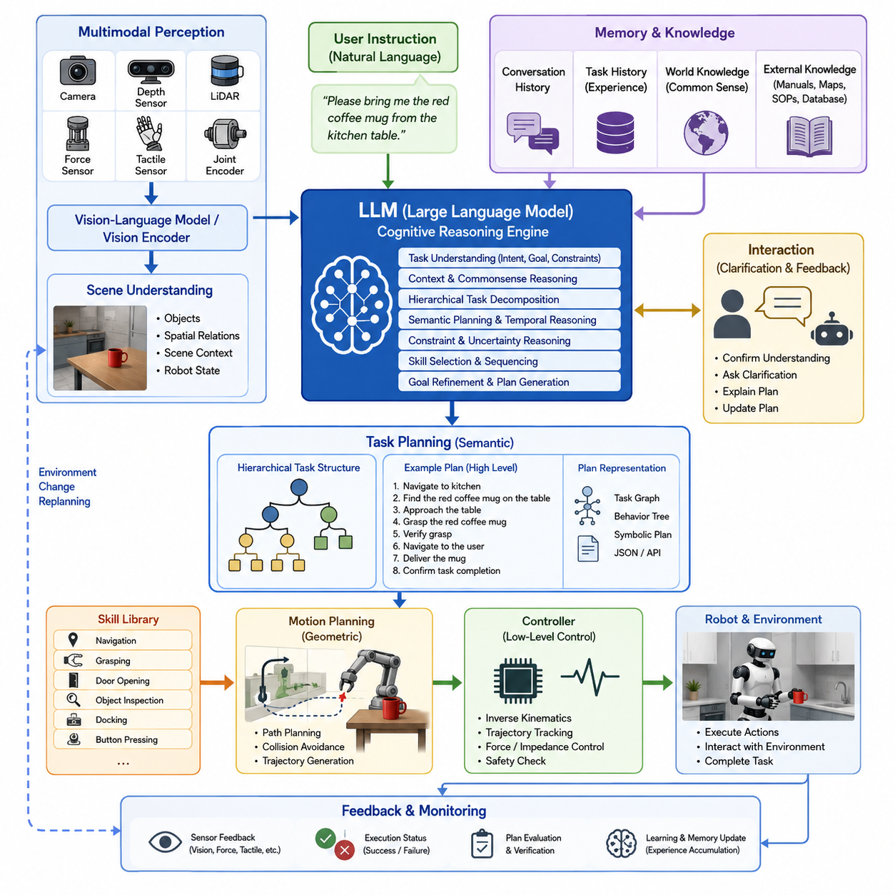{width="7.268055555555556in" height="7.268055555555556in"}

대규모 언어 모델(LLM, Large Language Model)은 로봇공학(Robotics)에서 단순한 자연어 처리 도구를 넘어, 로봇의 인지(Cognition), 추론(Reasoning), 계획(Planning)을 담당하는 핵심 두뇌 역할을 수행한다. 기존 로봇은 모든 작업 절차를 사람이 미리 프로그래밍해야 했지만, LLM을 적용한 로봇은 사람의 자연어(Natural Language)를 이해하고 이를 실행 가능한 작업(Task) 계획으로 변환할 수 있다. 이러한 변화는 사람의 의도와 로봇의 행동 사이의 간극을 줄여 보다 유연하고 지능적인 자율 시스템을 가능하게 한다.

비전-언어-행동(VLA, Vision-Language-Action) 아키텍처(Architecture)에서 LLM은 저수준 제어(Low-Level Control)를 담당하지 않는다. 모터 토크(Torque)나 관절 명령(Joint Command)을 직접 생성하는 대신, 센서 정보를 이해하고 사용자의 의도를 분석하며, 전체 작업을 계획하고 실행 순서를 결정하는 고수준 인지 계층(High-Level Cognitive Layer)의 역할을 수행한다. 이후 생성된 계획은 하위 계획기(Planner)와 제어기(Controller)에 전달되어 실제 움직임으로 변환된다.

전체 인지 과정은 다중모달 인식(Multimodal Perception)으로 시작된다. 카메라(Camera), 깊이 센서(Depth Sensor), 라이다(LiDAR), 힘 센서(Force Sensor), 촉각 센서(Tactile Sensor), 관절 엔코더(Joint Encoder) 등의 다양한 센서가 지속적으로 환경과 로봇의 상태를 측정한다. 비전 인코더(Vision Encoder)는 이러한 원시 데이터를 의미적 특징(Semantic Feature)으로 변환하며, 객체(Object), 위치(Location), 공간 관계(Spatial Relation), 장면(Scene)의 의미를 추출하여 LLM이 이해할 수 있는 형태로 제공한다.

사용자는 일반적으로 프로그래밍 언어가 아닌 자연어를 이용하여 로봇에게 작업을 지시한다. 예를 들어 "주방에서 빨간 컵을 가져와."와 같은 명령에는 목적(Objective), 대상(Object), 위치(Location), 최종 목표(Goal)가 모두 포함되어 있지만 구체적인 절차는 생략되어 있다. LLM은 이러한 문장을 해석하여 필요한 세부 작업을 자동으로 추론하고, 실행 가능한 구조화된 작업(Task Structure)으로 변환한다.

작업 이해(Task Understanding)의 첫 단계는 사용자의 의도(Intent)를 정확하게 파악하는 것이다. LLM은 단어를 개별적으로 해석하지 않고 문장 전체의 의미를 분석하여 작업 목적, 원하는 결과, 시간적 순서, 환경 조건, 제약 사항 등을 동시에 이해한다. 동사(Verb)는 수행할 행동을, 명사(Noun)는 대상 객체를, 형용사(Adjective)는 객체의 속성을, 장소 표현은 목표 위치를 의미하는 요소로 분석된다.

예를 들어 "주방 테이블 위의 빨간 머그컵을 가져와."라는 명령은 단순한 객체 탐지(Object Detection)가 아니다. 로봇은 최종 목표가 컵을 찾는 것이 아니라 사용자에게 전달하는 것임을 이해해야 하며, 빨간색이라는 속성과 주방 테이블이라는 공간적 정보를 동시에 고려해야 한다. LLM은 이러한 의미를 종합하여 로봇이 수행해야 할 작업 흐름을 생성한다.

LLM은 대화의 문맥(Context)도 함께 이해한다. 사람은 "어제 사용했던 것을 가져와.", "원래 있던 곳에 다시 놔."와 같이 이전 대화를 전제로 명령하는 경우가 많다. 이러한 문장은 단독으로는 의미가 불완전하지만, LLM은 이전 대화 기록과 작업 이력을 기억하여 현재 명령과 연결한다. 이를 통해 장기간 작업(Long-Term Task)과 연속적인 인간-로봇 상호작용(Human-Robot Interaction)이 가능해진다.

또한 LLM은 상식(Common Sense)을 활용하여 사람이 명시하지 않은 조건도 추론한다. 예를 들어 유리컵은 조심해서 들어야 하고, 액체가 담긴 컵은 기울이지 않아야 하며, 문을 통과하기 위해서는 먼저 문을 열어야 한다는 사실은 일반적인 로봇 프로그램에는 포함되어 있지 않을 수 있다. 하지만 LLM은 대규모 학습을 통해 이러한 상식을 내재화하고 있어 보다 자연스럽고 안전한 계획을 생성할 수 있다.

의도를 이해한 이후에는 계층적 작업 분해(Hierarchical Task Decomposition)가 수행된다. 대부분의 실제 작업은 하나의 행동으로 끝나지 않는다. 예를 들어 청소 작업이라면 청소 도구 찾기, 이동하기, 오염 위치 확인, 청소 수행, 결과 확인, 장비 정리 등의 여러 하위 작업(Subtask)으로 구성된다. LLM은 이러한 작업을 논리적인 순서로 분해하고 각 단계의 의존성(Dependency)을 고려하여 전체 계획을 구성한다.

계층적 계획(Hierarchical Planning)은 작업의 안정성을 크게 향상시킨다. 각각의 하위 작업은 독립적으로 실행 및 검증될 수 있으며, 특정 단계에서 문제가 발생하면 전체 작업을 처음부터 다시 시작하는 것이 아니라 해당 단계만 수정하거나 재계획(Replanning)하면 된다. 이는 실제 산업용 로봇과 서비스 로봇 모두에서 매우 중요한 특성이다.

LLM이 수행하는 의미 기반 계획(Semantic Planning)은 전통적인 기하학적 계획(Geometric Planning)과는 목적이 다르다. 기존 경로 계획(Path Planning)은 충돌 없는 이동 경로를 계산하는 것이 목적이지만, LLM은 무엇을 해야 하는지와 어떤 순서로 수행해야 하는지를 결정한다. 이후 실제 경로 생성은 모션 플래너(Motion Planner)가 담당하여 역할을 분리한다.

LLM은 외부 지식(External Knowledge)도 적극적으로 활용한다. 창고(Warehouse)에서는 깨지기 쉬운 물건은 조심해서 운반해야 하고, 냉장 물품은 냉장 구역으로 이동해야 하며, 위험 물질은 별도의 절차를 따라야 한다. 이러한 산업 지식(Domain Knowledge)은 작업 계획의 품질을 크게 향상시키며, 다양한 응용 분야에 쉽게 적용될 수 있다.

환경 이해(Environment Understanding) 역시 중요한 기능이다. 비전-언어 모델(VLM, Vision-Language Model)이나 비전 인코더가 생성한 장면 설명(Scene Description)을 기반으로 LLM은 "상자는 책상 아래 있다.", "드라이버는 공구함 옆에 있다.", "충전기는 로봇 뒤쪽에 있다."와 같은 공간 관계를 이해한다. 이러한 의미적 정보는 단순 좌표 기반 시스템보다 훨씬 높은 수준의 추론을 가능하게 한다.

작업 계획에서는 다양한 제약 조건(Constraint)도 함께 고려된다. 배터리 용량(Battery Capacity), 적재 하중(Payload), 관절 가동 범위(Joint Limit), 안전 거리(Safety Distance), 작업 우선순위(Priority), 충돌 회피(Collision Avoidance)와 같은 요소는 모두 계획 과정에 반영된다. 따라서 생성되는 작업은 단순히 논리적일 뿐 아니라 실제 실행 가능한 계획이 된다.

시간적 추론(Temporal Reasoning)은 작업 순서를 결정하는 핵심 요소이다. 어떤 작업은 반드시 이전 단계가 완료되어야 수행될 수 있다. 예를 들어 물건을 집기 전에 먼저 접근해야 하며, 닫힌 문을 통과하기 위해서는 문을 먼저 열어야 한다. LLM은 이러한 시간적 의존성을 자연스럽게 이해하고 올바른 실행 순서를 생성한다.

사람의 명령은 종종 매우 간략하다. "식탁을 준비해."라는 명령에는 접시를 놓고, 컵을 배치하고, 수저를 정리하며, 냅킨을 놓는 과정이 포함되어 있지만 사용자는 이를 모두 말하지 않는다. LLM은 이러한 생략된 절차를 자동으로 보완하여 완전한 목표(Task Goal)로 확장한다.

LLM은 작업 계획을 사람이 이해하기 쉬운 의미 표현(Semantic Representation)으로 생성한다. 예를 들어 작업 그래프(Task Graph), 행동 트리(Behavior Tree), JSON 구조(JSON Structure), 심볼릭 계획(Symbolic Plan) 등의 형태로 출력하며, 이후 로봇 미들웨어(Middleware)와 제어 시스템이 이를 실제 실행 코드로 변환한다.

현실 환경에는 항상 불확실성(Uncertainty)이 존재한다. 객체가 가려져 있거나, 동일한 물체가 여러 개 존재하거나, 사용자의 표현이 모호할 수도 있다. 최신 LLM은 이러한 상황에서 임의로 판단하지 않고 "어느 파란 상자를 말씀하시는 건가요?"와 같이 추가 질문(Clarification Question)을 생성하여 오류 가능성을 줄인다.

대화 기반 계획(Interactive Planning)은 인간과 로봇의 협업을 더욱 자연스럽게 만든다. 로봇은 작업을 이해한 내용을 사용자에게 설명하고, 애매한 부분은 확인하며, 작업 도중에도 상황 변화에 따라 추가 질문을 수행할 수 있다. 이러한 상호작용은 실제 서비스 로봇(Service Robot)에서 매우 중요한 기능이다.

최근에는 검색 증강 생성(RAG, Retrieval-Augmented Generation) 기술이 함께 활용된다. LLM은 자체 학습 지식뿐 아니라 작업 매뉴얼(Manual), 공장 절차서(Standard Operating Procedure), 환경 지도(Map), 이전 작업 기록(Task History), 장비 데이터베이스(Database) 등을 검색하여 보다 정확한 계획을 생성한다. 이는 환각(Hallucination)을 줄이고 산업 환경에서의 신뢰성을 향상시킨다.

로봇은 일반적으로 이동(Navigation), 물체 집기(Grasping), 문 열기(Door Opening), 버튼 누르기(Button Pressing), 도킹(Docking), 검사(Inspection) 등 다양한 기술(Skill)을 보유하고 있다. LLM은 현재 작업에 적합한 기술을 선택하고, 가장 효율적인 실행 순서를 결정하여 기술 라이브러리(Skill Library)를 활용한다.

산업용 시스템에서는 행동 트리(Behavior Tree)나 계층형 상태 머신(Hierarchical State Machine)과 LLM을 함께 사용하는 경우가 많다. LLM은 상위 수준의 의미 기반 계획을 생성하고, 행동 트리는 이를 안정적으로 실행한다. 이러한 구조는 LLM의 유연성과 산업용 제어 시스템의 신뢰성을 동시에 확보할 수 있는 장점이 있다.

실제 로봇은 여러 목표를 동시에 최적화해야 한다. 작업 시간(Task Time), 에너지 소비(Energy Consumption), 안전성(Safety), 사용자 편의성(User Comfort), 생산성(Productivity)은 서로 상충될 수 있다. LLM은 이러한 요소를 종합적으로 고려하여 균형 잡힌 계획을 생성한다.

협업 로봇(Collaborative Robot)에서는 사람의 행동도 함께 예측한다. LLM은 사람이 다음에 수행할 행동을 추론하고, 로봇이 언제 도움을 제공해야 하는지, 언제 대기해야 하는지, 어떤 작업을 분담해야 하는지를 계획한다. 이를 통해 사람과 로봇은 자연스럽게 공동 작업을 수행할 수 있다.

실제 환경은 지속적으로 변화하므로 동적 재계획(Dynamic Replanning)이 필수적이다. 사람이 갑자기 이동하거나 장애물이 나타나거나 목표 물체가 다른 위치로 옮겨질 수 있다. LLM은 이러한 변화를 감지하여 전체 작업을 처음부터 다시 만드는 것이 아니라 영향을 받은 부분만 수정하여 새로운 계획을 생성한다.

장기 작업에서는 메모리(Memory) 기능도 매우 중요하다. 에피소드 메모리(Episodic Memory)는 이전 작업 경험을 저장하고, 의미 메모리(Semantic Memory)는 일반 지식을 저장하며, 절차 메모리(Procedural Memory)는 기술 실행 방법을 기억한다. 작업 메모리(Working Memory)는 현재 수행 중인 작업 상태를 유지하여 장시간 임무에서도 일관성을 유지하도록 지원한다.

현대 VLA 시스템은 일반적으로 계층형 구조(Hierarchical Architecture)를 사용한다. 인식 모듈(Perception Module)은 환경을 이해하고, LLM은 의미적 추론을 수행하며, 작업 계획기(Task Planner)는 실행 계획을 생성한다. 이후 모션 계획기(Motion Planner)가 경로를 계산하고, 제어기(Controller)가 모터를 제어하며, 피드백 시스템(Feedback System)이 결과를 지속적으로 모니터링한다.

그러나 LLM에도 한계는 존재한다. 물리적으로 불가능한 계획을 생성하거나, 안전 조건을 간과하거나, 존재하지 않는 객체를 잘못 추론하는 환각(Hallucination)이 발생할 수 있다. 따라서 실제 로봇 시스템에서는 기하학적 검증(Geometric Validation), 어포던스 분석(Affordance Analysis), 시뮬레이션 검증(Simulation Validation), 안전 제어기(Safety Controller)를 통해 생성된 계획을 반드시 검증한 후 실행한다.

추론 속도(Inference Latency) 역시 중요한 과제이다. 대규모 모델은 응답 생성에 수백 밀리초(Millisecond)에서 수 초(Second)가 소요될 수 있으므로, 실시간 제어(Real-Time Control)는 여전히 별도의 로컬 제어기(Local Controller)가 담당한다. LLM은 비교적 느린 고수준 계획을 수행하고, 저지연 제어기는 연속적인 피드백 제어를 수행하는 계층형 구조가 가장 현실적인 접근 방식이다.

향후 로봇 시스템은 언어(Language), 영상(Image), 깊이(Depth), 포인트 클라우드(Point Cloud), 음성(Audio), 촉각(Tactile), 힘(Force), 로봇 상태(Robot State), 장기 메모리(Long-Term Memory)를 동시에 이해하는 멀티모달 기반 모델(Multimodal Foundation Model)로 발전할 것이다. 이러한 모델은 단순한 언어 생성기를 넘어 로봇의 인지 엔진(Cognitive Engine)으로 동작하며, 복잡한 환경을 이해하고 미래를 예측하며 다수의 로봇을 협업시키고 새로운 상황에도 적응하는 범용 물리 AI(Physical AI)의 핵심 기술이 될 것으로 전망된다.

## 3.2 LLM-Based Task Planning and Chain-of-Thought (with Code)

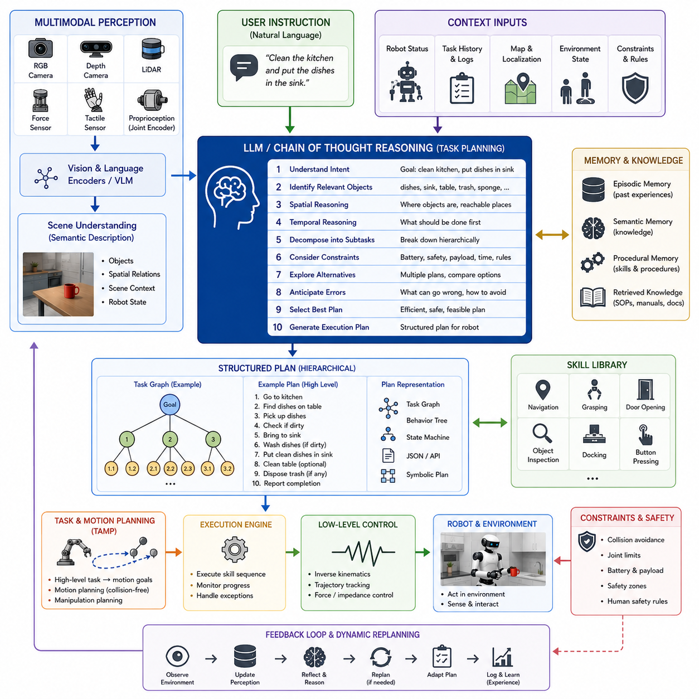{width="7.268055555555556in" height="7.268055555555556in"}

대규모 언어 모델 기반 작업 계획(LLM-Based Task Planning)은 로봇이 단순히 미리 정의된 명령을 수행하는 수준을 넘어, 작업의 의미를 이해하고 스스로 계획을 수립할 수 있도록 하는 핵심 기술이다. 기존 로봇은 상태 머신(State Machine), 행동 트리(Behavior Tree), 심볼릭 플래너(Symbolic Planner)에 의존하여 모든 상황을 사람이 미리 설계해야 했다. 그러나 이러한 방식은 새로운 환경이나 모호한 명령에 대한 적응력이 부족하였다. LLM은 언어 이해와 추론 능력을 활용하여 보다 유연한 작업 계획을 생성할 수 있다.

이러한 LLM 기반 계획의 핵심 개념이 바로 사고의 연쇄(CoT, Chain of Thought) 추론이다. CoT는 질문을 입력받자마자 답을 생성하는 것이 아니라, 문제를 여러 개의 논리적인 중간 단계로 분해한 후 최종 결론을 도출하는 방식이다. 로봇은 이를 통해 사용자의 명령을 단계별로 분석하고, 필요한 하위 작업(Subtask)을 생성하며, 실행 가능한 계획으로 변환할 수 있다.

비전-언어-행동(VLA, Vision-Language-Action) 시스템에서 LLM은 인식(Perception)과 제어(Control) 사이의 인지 계층(Cognitive Layer)에 위치한다. 카메라(Camera), 깊이 센서(Depth Sensor), 라이다(LiDAR), 힘 센서(Force Sensor), 촉각 센서(Tactile Sensor), 관절 센서(Proprioception)가 수집한 데이터는 비전 인코더(Vision Encoder)를 통해 의미적 특징(Semantic Feature)으로 변환된다. 이러한 정보와 사용자의 자연어 명령, 로봇 상태, 메모리 정보가 함께 LLM의 입력으로 사용된다.

CoT 기반 계획의 첫 번째 단계는 명령 해석(Instruction Interpretation)이다. 사람은 일반적으로 "주방을 청소해.", "창고를 점검해."처럼 매우 간단한 문장으로 작업을 지시한다. 그러나 실제 작업에는 수많은 세부 절차가 포함되어 있다. LLM은 이러한 생략된 과정을 상식(Common Sense)과 문맥(Context)을 이용하여 보완하고 전체 작업의 의미를 이해한다.

다음 단계는 의도 인식(Intent Recognition)이다. LLM은 먼저 사용자가 무엇을 원하는지를 파악한다. 작업이 이동(Navigation), 물체 조작(Manipulation), 검사(Inspection), 운반(Transportation), 청소(Cleaning), 조립(Assembly) 중 어떤 유형인지 분석하고 최종 목표(Goal)를 결정한다. 이러한 목표는 이후 생성되는 모든 작업 계획의 기준이 된다.

이후 객체 이해(Object Understanding)가 수행된다. LLM은 단순히 객체 이름만 인식하는 것이 아니라 기능(Function), 물리적 특성(Property), 사용 목적(Affordance), 일반적인 위치(Location) 등을 함께 이해한다. 예를 들어 커피잔(Coffee Mug)은 손으로 잡을 수 있으며, 액체를 담고 있고, 운반 시 기울이면 안 되며, 일반적으로 주방이나 사무실에서 발견된다는 상식을 함께 활용한다.

공간 추론(Spatial Reasoning)은 로봇 작업에서 매우 중요한 요소이다. LLM은 "위(Above)", "아래(Below)", "옆(Next To)", "안쪽(Inside)", "뒤(Behind)"와 같은 공간 관계를 이해하여 환경을 의미적으로 해석한다. 이는 단순한 좌표 계산보다 사람의 사고방식과 유사한 수준에서 작업을 계획할 수 있도록 지원한다.

시간적 추론(Temporal Reasoning)은 작업 순서를 결정하는 과정이다. 로봇은 물건을 놓기 전에 먼저 집어야 하고, 문을 통과하려면 먼저 문을 열어야 하며, 충전을 하려면 충전기로 먼저 이동해야 한다. CoT는 이러한 선행 관계(Prerequisite)를 단계적으로 분석하여 올바른 실행 순서를 생성한다.

CoT의 가장 큰 특징은 계층적 작업 분해(Hierarchical Task Decomposition)이다. 복잡한 작업을 한 번에 해결하지 않고 작은 작업으로 나누어 처리한다. 예를 들어 창고 점검이라는 작업은 이동하기, 구역 탐색하기, 팔레트 탐지하기, 손상 여부 판단하기, 사진 촬영하기, 결과 저장하기, 보고서 작성하기 등의 여러 단계로 분해된다. 각각의 단계는 다시 더 작은 작업으로 나누어질 수 있으며 최종적으로는 로봇이 수행 가능한 기술(Skill) 단위까지 세분화된다.

예를 들어 "B구역의 손상된 팔레트를 모두 검사하고 보고서를 작성하라."는 명령을 받은 경우 LLM은 먼저 목적을 이해하고, B구역으로 이동한 후 팔레트를 탐색하고, 손상 여부를 판단하며, 검사 순서를 결정하고, 사진과 데이터를 수집한 뒤 최종 보고서를 생성하는 순차적인 계획을 수립한다. 이러한 계획은 단순한 행동 목록이 아니라 논리적인 추론 과정을 거쳐 생성된다.

CoT는 다양한 제약 조건(Constraint)도 함께 고려한다. 배터리 잔량(Battery Capacity), 적재 하중(Payload), 관절 제한(Joint Limit), 충돌 회피(Collision Avoidance), 작업 시간(Time Limit), 통신 상태(Network Condition), 안전 규정(Safety Regulation) 등은 계획 생성 과정에서 동시에 평가된다. 따라서 처음부터 실행 가능한 계획이 생성될 가능성이 높아진다.

LLM은 대규모 사전학습을 통해 획득한 상식(Common Sense)을 적극적으로 활용한다. 유리 제품은 조심해서 다루어야 하고, 액체는 흘리지 않도록 운반해야 하며, 미끄러운 바닥에서는 천천히 이동해야 한다는 사실은 일반적인 로봇 제어 프로그램에는 포함되지 않을 수도 있다. 하지만 CoT는 이러한 상식을 추론 과정에 포함시켜 보다 현실적인 계획을 생성한다.

사람의 명령은 종종 모호하다. "파란 상자를 가져와."라고 했을 때 파란 상자가 여러 개 존재할 수 있다. CoT는 이러한 불확실성(Uncertainty)을 인식하고 무리하게 추측하지 않는다. 대신 "어느 파란 상자를 말씀하시는 건가요?"와 같은 확인 질문(Clarification Question)을 생성하여 오류 가능성을 줄인다.

환경 추론(Environment Reasoning)도 중요한 기능이다. 로봇은 사람이 이동하거나, 장애물이 새롭게 생기거나, 조명이 변하거나, 특정 구역이 폐쇄되는 등 동적인 환경을 고려해야 한다. CoT는 이러한 환경 변화를 지속적으로 반영하면서 기존 계획이 여전히 유효한지를 판단한다.

메모리(Memory)는 CoT의 중요한 구성 요소이다. 에피소드 메모리(Episodic Memory)는 이전 작업 경험을 저장하고, 의미 메모리(Semantic Memory)는 일반적인 지식을 저장하며, 절차 메모리(Procedural Memory)는 기술(Skill)의 실행 방법을 저장한다. 작업 메모리(Working Memory)는 현재 수행 중인 계획을 유지하며 지속적인 추론을 가능하게 한다.

CoT는 기술 라이브러리(Skill Library)와도 밀접하게 연동된다. 대부분의 로봇은 이동(Navigation), 물체 집기(Grasping), 문 열기(Door Opening), 버튼 누르기(Button Pressing), 도킹(Docking), 검사(Inspection), 충전(Charging)과 같은 기본 기술을 이미 보유하고 있다. LLM은 새로운 기술을 만드는 것이 아니라 현재 작업에 필요한 기술을 선택하고 가장 적절한 순서로 배치한다.

LLM은 생성한 계획을 작업 그래프(Task Graph), 행동 트리(Behavior Tree), 상태 머신(State Machine), JSON 계획(JSON Plan), 심볼릭 계획(Symbolic Plan) 등 구조화된 표현으로 변환한다. 이러한 표현은 기존 로봇 소프트웨어가 쉽게 실행할 수 있으며, 산업 현장의 안정성과 확장성을 동시에 확보할 수 있다.

CoT는 작업 및 모션 계획(TAMP, Task and Motion Planning)과 결합될 때 더욱 강력한 성능을 발휘한다. LLM은 "무엇을 해야 하는가"를 결정하고, 모션 플래너(Motion Planner)는 "어떻게 움직일 것인가"를 계산한다. 이처럼 의미 기반 계획과 기하학 기반 계획이 분리됨으로써 시스템 전체의 효율성과 신뢰성이 향상된다.

최근에는 검색 증강 생성(RAG, Retrieval-Augmented Generation)이 함께 활용되고 있다. LLM은 내부 지식뿐 아니라 공장 매뉴얼(Manual), 작업 절차(Standard Operating Procedure), 환경 지도(Map), 유지보수 기록(Log), 기업 데이터베이스(Database) 등을 검색하여 보다 정확한 작업 계획을 생성한다. 이는 산업 환경에서 발생할 수 있는 환각(Hallucination)을 크게 감소시키는 효과가 있다.

CoT는 여러 개의 실행 전략을 동시에 비교할 수도 있다. 여러 이동 경로, 다양한 작업 순서, 서로 다른 작업 분담 방식을 평가하여 안전성(Safety), 에너지 소비(Energy Consumption), 작업 시간(Task Time), 생산성(Productivity) 등을 종합적으로 고려한 최적의 계획을 선택한다.

또한 실행 전에 오류를 예측(Error Anticipation)하는 능력도 갖추고 있다. 특정 물체가 너무 무겁거나, 통로가 너무 좁거나, 배터리가 부족하거나, 조명이 어두워 인식 성능이 떨어질 가능성을 사전에 예측하여 작업 실패를 예방한다. 이는 실제 산업용 로봇에서 매우 중요한 기능이다.

현실 환경은 지속적으로 변화하기 때문에 동적 재계획(Dynamic Replanning)이 필요하다. 사람이 지나가거나, 장애물이 발생하거나, 목표 물체가 이동하면 CoT는 새로운 정보를 반영하여 기존 계획의 일부만 수정한다. 이미 완료된 작업은 유지하고 필요한 부분만 다시 계획함으로써 작업 효율을 높인다.

사람과 로봇의 협업(Human-Robot Collaboration)에서도 CoT는 중요한 역할을 한다. 정밀한 판단이 필요한 작업은 사람에게 맡기고, 반복적이거나 위험한 작업은 로봇이 수행하도록 역할을 분담한다. 이를 통해 인간과 로봇은 서로의 장점을 활용하는 협업 체계를 구축할 수 있다.

산업 환경에서는 표준 작업 절차(SOP, Standard Operating Procedure)를 반드시 따라야 한다. 제조, 물류, 의료, 시설 점검과 같은 분야에서는 정해진 절차와 규정을 준수해야 하며, CoT는 이러한 절차를 현재 작업 환경에 맞게 적용하여 계획을 생성한다.

안전(Safety)은 CoT 기반 계획에서도 가장 중요한 요소이다. 아무리 논리적으로 보이는 계획이라도 실제 실행 전에 기하학적 검증(Geometric Validation), 어포던스 검증(Affordance Validation), 충돌 예측(Collision Prediction), 시뮬레이션(Simulation), 규칙 기반 안전 검사(Rule-Based Safety Check)를 반드시 수행해야 한다. 이를 통해 물리적으로 불가능하거나 위험한 계획이 실행되는 것을 방지한다.

대규모 LLM은 추론 시간(Inference Latency)이 길다는 단점이 있다. 따라서 실제 시스템에서는 CoT가 고수준 전략 계획을 수행하고, 저수준 제어(Low-Level Control)는 실시간 제어기(Real-Time Controller)가 담당하는 계층형 구조(Hierarchical Architecture)를 사용한다. 이는 높은 지능과 빠른 제어 성능을 동시에 확보하기 위한 현실적인 설계 방식이다.

LLM은 여전히 존재하지 않는 객체를 추론하거나 공간 관계를 잘못 이해하는 환각(Hallucination)이 발생할 수 있다. 따라서 인식 시스템(Perception System), 기하학 검증기(Geometric Validator), 실행 모니터(Execution Monitor), 안전 모듈(Safety Module)이 생성된 계획을 지속적으로 검증해야 한다.

최근 연구에서는 적응형 사고의 연쇄(Adaptive Chain of Thought)가 활발히 연구되고 있다. 쉬운 작업은 짧은 추론 과정을 사용하고, 복잡한 작업은 깊은 추론을 수행함으로써 계산량을 줄이고 실시간 성능을 향상시키는 방식이다.

또한 소형 언어 모델(SLM, Small Language Model)은 CoT를 경량화하여 엣지 로봇(Edge Robot)에 적용하고 있다. 로봇 내부에서는 압축된 모델이 빠른 추론을 수행하고, 매우 복잡한 문제는 클라우드 기반 대형 모델이 처리하는 계층형 구조가 점차 보편화되고 있다.

향후 비전-언어-행동(VLA) 시스템은 언어(Language), 영상(Image), 비디오(Video), 깊이 정보(Depth), 포인트 클라우드(Point Cloud), 촉각(Tactile), 힘(Force), 로봇 상태(Proprioception), 세계 모델(World Model), 장기 메모리(Long-Term Memory)를 동시에 활용하는 멀티모달 사고의 연쇄(Multimodal Chain of Thought)로 발전할 것으로 전망된다.

결국 CoT는 단순한 언어 생성 기술이 아니라 사람의 추상적인 의도를 실행 가능한 로봇 행동으로 연결하는 핵심 인지 기술이다. 의미 기반 추론(Semantic Reasoning), 계층적 작업 분해(Hierarchical Decomposition), 상식(Common Sense), 메모리(Memory), 환경 이해(Environment Understanding), 불확실성 추론(Uncertainty Reasoning), 지속적인 재계획(Replanning)을 통합함으로써 인간의 의도를 안전하고 신뢰성 높은 자율 로봇 행동으로 변환하는 핵심 기반 기술로 자리매김하고 있다.

## 3.3 Code-as-Policies: Generating Robot Programs Using LLMs (with Code)

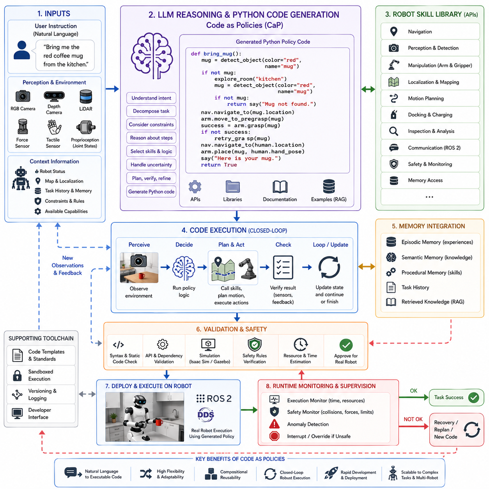{width="7.268055555555556in" height="7.268055555555556in"}

코드 기반 정책(Code as Policies, CaP)은 대규모 언어 모델(LLM, Large Language Model)이 단순히 자연어를 이해하는 수준을 넘어, 실행 가능한 파이썬(Python) 프로그램을 직접 생성하여 로봇을 제어하는 새로운 패러다임이다. 기존에는 사람이 직접 로봇 프로그램을 작성해야 했지만, CaP에서는 사용자의 자연어 명령을 입력받아 LLM이 실행 가능한 정책(Policy) 코드를 자동으로 생성한다. 이를 통해 사람의 의도와 로봇의 실제 동작 사이의 간극을 크게 줄일 수 있다.

기존 로봇 소프트웨어는 이동(Navigation), 조작(Manipulation), 검사(Inspection), 도킹(Docking), 복구(Recovery) 등의 모든 동작을 사람이 직접 프로그래밍해야 했다. 이러한 방식은 안정성은 높지만 새로운 작업이나 예상하지 못한 환경 변화에는 유연하게 대응하기 어렵다. 반면 Code as Policies는 상황에 따라 필요한 프로그램을 실시간(Runtime)에 생성하므로 새로운 작업에도 빠르게 적응할 수 있다.

Code as Policies의 핵심 개념은 자연어를 실행 가능한 정책 함수(Policy Function)로 변환하는 것이다. LLM은 단순한 작업 설명을 생성하는 것이 아니라 파이썬 함수를 작성하여 로봇 API(Application Programming Interface), 인식 시스템(Perception System), 계획기(Planner), 제어기(Controller)를 호출한다. 이렇게 생성된 코드는 로봇이 작업을 수행하기 위한 실제 실행 프로그램 역할을 한다.

비전-언어-행동(VLA, Vision-Language-Action) 아키텍처에서 Code as Policies는 고수준 추론과 실제 제어 사이에 위치한다. 사용자 명령, 환경 정보, 로봇 상태, 메모리(Memory), 지도(Map), 작업 이력(Task History), 센서 정보 등이 LLM의 입력으로 제공되며, LLM은 이를 분석하여 현재 상황에 적합한 파이썬 코드를 생성한다.

생성된 코드는 기존 로봇 라이브러리를 그대로 활용한다. 이동 알고리즘, 물체 인식(Object Detection), 위치 추정(Localization), 모션 계획(Motion Planning), 역기구학(Inverse Kinematics), 안전 제어(Safety Controller) 등을 새롭게 구현하지 않는다. 대신 이미 검증된 소프트웨어 모듈(Module)을 호출하고 조합하는 오케스트레이션(Orchestration) 역할을 수행한다.

예를 들어 "주방에서 빨간 머그컵을 가져와."라는 명령을 받으면 LLM은 먼저 빨간 컵을 탐지하는 함수를 호출하고, 주방으로 이동한 후, 시각 서보(Visual Servoing)를 이용해 접근하고, 그리퍼(Gripper)를 이용하여 컵을 집고, 힘 센서(Force Sensor)로 성공 여부를 확인한 뒤, 사용자에게 이동하여 안전하게 전달하는 전체 파이썬 프로그램을 자동으로 생성할 수 있다.

Code as Policies의 가장 큰 장점은 조합 가능성(Compositionality)이다. 로봇은 모든 작업을 별도로 저장하는 것이 아니라 이동, 물체 집기, 문 열기, 충전, 검사 등 다양한 기본 기술(Skill)을 보유하고 있으며, LLM은 이러한 기술들을 현재 작업에 맞게 조합하여 새로운 프로그램을 생성한다. 따라서 기술 라이브러리(Skill Library)가 커질수록 수행 가능한 작업도 기하급수적으로 증가한다.

생성되는 코드는 일반적으로 계층형 소프트웨어 구조(Hierarchical Software Architecture)를 따른다. 상위 함수는 전체 작업을 관리하고, 중간 함수는 하위 작업(Subtask)을 수행하며, 최하위 함수는 기존 로봇 라이브러리를 호출한다. 이러한 구조는 유지보수성과 재사용성을 높이는 동시에 복잡한 작업도 체계적으로 관리할 수 있게 한다.

Code as Policies는 환경을 지속적으로 인식하면서 동작하는 폐루프 제어(Closed-Loop Execution)를 지원한다. 실행 중에도 카메라, 라이다(LiDAR), 힘 센서 등의 정보를 지속적으로 확인하며 현재 환경에 맞게 다음 행동을 결정한다. 즉, 미리 정해진 순서를 그대로 실행하는 것이 아니라 센서 피드백(Sensor Feedback)을 이용하여 상황에 맞게 행동을 수정한다.

파이썬은 조건문(If Statement), 반복문(Loop), 예외 처리(Exception Handling), 재귀 함수(Recursion), 비동기 처리(Asynchronous Programming) 등 풍부한 제어 구조(Control Structure)를 제공한다. LLM은 이러한 기능을 활용하여 복잡한 로봇 의사결정 로직을 자연스럽게 생성할 수 있으며, 사람이 직접 작성한 프로그램과 유사한 수준의 구조를 가진다.

반복문은 탐색(Search)이나 순찰(Patrol)과 같은 작업에서 매우 유용하다. 목표 물체를 찾을 때까지 여러 위치를 계속 탐색하거나, 더 이상 오염이 없을 때까지 청소를 반복하거나, 모든 선반을 검사할 때까지 순차적으로 이동하는 등의 작업을 반복문을 이용하여 자연스럽게 구현할 수 있다.

예외 처리(Exception Handling)는 실제 로봇에서 매우 중요한 기능이다. 이동 중 장애물이 나타나거나, 물체를 집지 못하거나, 통신이 끊기거나, 센서 오류가 발생하는 상황은 매우 흔하다. 생성된 코드는 Try-Except 구조를 활용하여 오류를 감지하고 재시도(Retry), 대체 경로(Fallback), 복구 절차(Recovery Procedure)를 수행함으로써 작업 실패를 최소화한다.

메모리(Memory)와의 연동도 중요한 특징이다. 생성된 프로그램은 에피소드 메모리(Episodic Memory)에서 이전 작업 위치를 검색하고, 의미 메모리(Semantic Memory)에서 일반 지식을 활용하며, 절차 메모리(Procedural Memory)를 이용하여 적절한 기술을 선택할 수 있다. 이를 통해 장기간 자율 작업(Long-Term Autonomy)이 가능해진다.

최근에는 검색 증강 생성(RAG, Retrieval-Augmented Generation)과도 결합되고 있다. LLM은 코드를 생성하기 전에 API 문서(API Documentation), 개발 문서(Developer Guide), 공장 매뉴얼(Manual), 작업 절차(Standard Operating Procedure), 환경 지도(Map) 등을 검색하여 보다 정확하고 신뢰성 높은 프로그램을 생성한다.

ROS 2 기반 로봇에서는 생성된 코드가 퍼블리셔(Publisher), 서브스크라이버(Subscriber), 서비스(Service), 액션(Action), 라이프사이클 노드(Lifecycle Node), TF 좌표 변환(TF Transformation) 등을 직접 호출한다. 즉, ROS 2를 대체하는 것이 아니라 ROS 2 위에서 자동으로 애플리케이션(Application)을 개발하는 형태라고 볼 수 있다.

복잡한 작업은 함수(Function) 단위로 분리된다. 예를 들어 물체 탐색(Object Search), 이동(Navigation), 물체 집기(Grasp), 성공 여부 확인(Verification), 결과 보고(Reporting)를 각각 독립적인 함수로 생성한 후 이를 하나의 상위 함수에서 호출하는 구조를 만든다. 이러한 구조는 코드의 가독성과 유지보수성을 크게 향상시킨다.

Code as Policies는 작업 및 모션 계획(TAMP, Task and Motion Planning)과도 긴밀하게 연동된다. LLM은 수행해야 할 작업 순서를 생성하고, 모션 플래너(Motion Planner)는 충돌 없는 이동 경로와 관절 궤적(Trajectory)을 계산한다. 즉, 의미 기반 계획과 기하학 기반 계획을 자연스럽게 연결하는 역할을 수행한다.

비전-언어 모델(VLM, Vision-Language Model)도 함께 활용된다. 생성된 파이썬 코드는 "테이블 위에 있는 물체를 설명해.", "빈 선반을 찾아.", "손상된 장비를 찾아."와 같은 자연어 질의를 VLM에 전달하여 환경 정보를 획득할 수 있다. 이를 통해 인식 모듈과의 통합이 더욱 쉬워진다.

산업용 로봇에서는 Code as Policies의 장점이 더욱 크다. 제조 공정은 자주 변경되며 작업 절차도 지속적으로 수정된다. 기존에는 프로그램을 다시 개발해야 했지만, LLM은 새로운 작업 요구사항에 맞추어 파이썬 코드를 즉시 생성할 수 있으므로 생산 라인의 유연성(Flexibility)이 크게 향상된다.

물류 창고(Warehouse)에서도 다양한 주문(Order), 재고 상태(Inventory), 작업 우선순위(Priority)에 따라 프로그램을 실시간으로 생성할 수 있다. 피킹(Picking), 재고 조사(Inventory Inspection), 선반 보충(Replenishment), 예외 처리(Exception Handling) 등 다양한 작업을 별도의 프로그램 없이 자동으로 구성할 수 있다.

검사 로봇(Inspection Robot) 역시 자산 유형(Asset Type), 이상 상태(Anomaly), 고객 요구사항(Customer Requirement), 유지보수 기록(Maintenance History)에 따라 검사 절차가 달라진다. LLM은 현재 상황에 맞는 검사 프로그램을 생성하고, 영상 처리(Image Processing), 이상 탐지(Anomaly Detection), 보고서 작성(Report Generation), 클라우드 전송(Cloud Synchronization) 등을 자동으로 조합한다.

실외 자율주행 로봇(Outdoor Autonomous Robot)도 날씨(Weather), 지형(Terrain), 조명(Lighting), 접근 가능성(Accessibility), 장비 상태(Equipment Status)를 고려하여 실행 프로그램을 생성할 수 있다. 이는 기존의 고정된 프로그램보다 훨씬 높은 적응성을 제공한다.

그러나 Code as Policies도 일반 소프트웨어 공학(Software Engineering)의 원칙을 반드시 따라야 한다. 생성된 코드는 가독성(Readability), 모듈성(Modularity), 유지보수성(Maintainability), 안정성(Robustness), 예외 처리(Exception Safety), 자원 관리(Resource Management), 인터페이스 일관성(Interface Consistency)을 만족해야 한다. 따라서 많은 시스템에서는 미리 정의된 코드 템플릿(Code Template)과 승인된 API만 사용하도록 제한한다.

보안(Security)은 매우 중요한 문제이다. LLM이 생성한 코드가 운영체제(OS)에 자유롭게 접근할 경우 심각한 보안 문제가 발생할 수 있다. 이를 방지하기 위해 샌드박스(Sandbox), 제한된 파이썬 인터프리터(Restricted Python Interpreter), 권한 기반 API(Permission-Controlled API), 자원 제한(Resource Limitation), 런타임 모니터(Runtime Monitor) 등을 이용하여 실행 환경을 보호한다.

실행 전에 코드 검증(Code Validation)도 수행된다. 생성된 프로그램은 문법 검사(Syntax Check), 정적 분석(Static Analysis), 타입 검사(Type Verification), API 검증(API Validation), 의존성 분석(Dependency Analysis), 시뮬레이션(Simulation), 안전 규칙 검사(Safety Rule Verification)를 거친 후에야 실제 로봇에서 실행된다.

최근에는 먼저 시뮬레이션(Simulation)에서 실행한 후 실제 로봇에 적용하는 방식이 일반적이다. 아이작 심(Isaac Sim), 가제보(Gazebo), 무조코(MuJoCo), 디지털 트윈(Digital Twin) 환경에서 충돌 가능성, 실행 시간, 자원 사용량 등을 충분히 검증한 후 실제 장비에 배포한다. 이러한 Sim-to-Real 접근법은 안전성을 크게 향상시킨다.

실행 중에도 런타임 모니터링(Runtime Monitoring)이 수행된다. 실행 시간이 지나치게 길어지거나, 예상하지 못한 API가 호출되거나, 위험한 이동 경로가 생성되거나, 과도한 힘이 발생하면 감독 시스템(Supervisor)이 즉시 프로그램 실행을 중단하거나 대체 동작을 수행한다.

LLM은 문법적으로는 올바르지만 논리적으로 잘못된 코드나 존재하지 않는 API를 생성하는 환각(Hallucination)이 발생할 수 있다. 따라서 생성된 코드는 실제 라이브러리와 인터페이스를 기반으로 반드시 검증되어야 하며, 무조건 신뢰해서는 안 된다.

대규모 모델은 코드 생성 시간이 길기 때문에 클라우드(Cloud)에서 전략적인 프로그램을 생성하고, 실제 실행은 로봇 내부(Edge)에서 수행하는 계층형 구조가 일반적으로 사용된다. 이렇게 하면 생성 속도와 실시간성을 모두 확보할 수 있다.

최근에는 사고의 연쇄(CoT, Chain of Thought)와 Code as Policies를 결합하는 연구가 활발하다. LLM은 먼저 작업을 단계적으로 추론한 후 그 결과를 파이썬 코드로 변환한다. 이러한 추론 기반 코드 생성은 프로그램의 품질과 안정성을 더욱 향상시킨다.

향후에는 세계 모델(World Model)과 Code as Policies가 결합될 전망이다. 현재 환경뿐 아니라 미래의 환경 변화까지 예측하여 프로그램을 생성하고, 실패를 미리 방지하며, 여러 로봇의 협업까지 고려하는 예측 기반 정책 생성(Predictive Policy Generation)이 가능해질 것으로 기대된다.

다중 로봇(Multi-Robot) 시스템에서도 LLM은 여러 로봇에게 서로 다른 작업을 자동으로 할당하고, 통신(Communication), 동기화(Synchronization), 자원 관리(Resource Allocation), 작업 분배(Task Allocation)를 수행하는 협업 프로그램을 생성할 수 있다.

앞으로는 로봇 전용 소프트웨어 저장소를 학습한 로봇 파운데이션 모델(Robot Foundation Model)이 등장하면서 ROS 패키지(ROS Package), 산업 자동화 프레임워크(Industrial Automation Framework), 시뮬레이션 라이브러리(Simulation Library), 인식 파이프라인(Perception Pipeline), 제어 소프트웨어(Control Software)를 더욱 정확하게 생성할 것으로 기대된다.

궁극적으로 Code as Policies는 프로그래밍을 사람이 미리 작성하는 작업이 아니라 로봇이 필요할 때마다 스스로 생성하고 수정하며 최적화하는 과정으로 변화시키고 있다. 의미 기반 추론(Semantic Reasoning), 멀티모달 인식(Multimodal Perception), 재사용 가능한 소프트웨어 라이브러리(Reusable Software Library), 파이썬 코드 생성(Python Code Generation), 시뮬레이션 검증(Simulation Validation), 런타임 모니터링(Runtime Monitoring)을 통합함으로써 사람의 의도를 안전하고 검증 가능한 실행 프로그램으로 변환하는 차세대 물리 AI(Physical AI)의 핵심 기술로 자리잡아 가고 있다.

## 3.4 Scene Reasoning and Spatial Understanding (with Code)

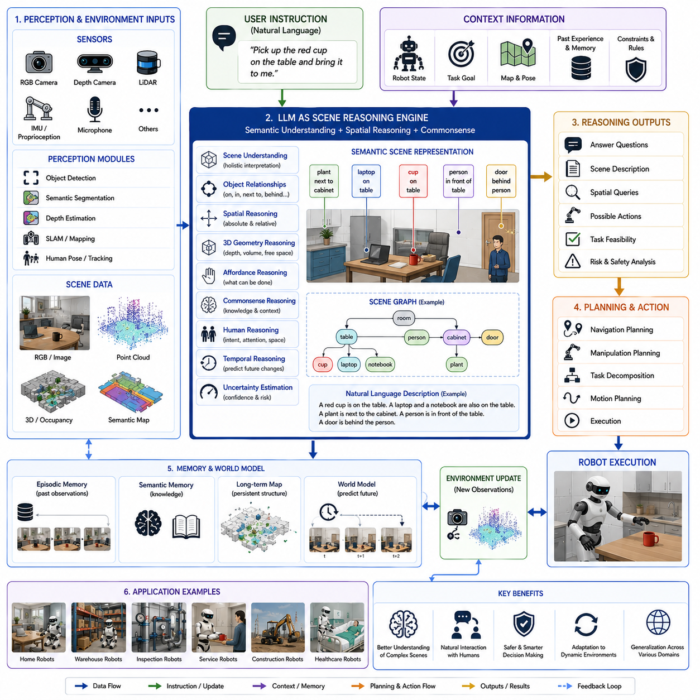{width="7.268055555555556in" height="7.268055555555556in"}

장면 추론(Scene Reasoning)과 공간 이해(Spatial Understanding)는 실제 환경에서 자율적으로 동작하는 지능형 로봇이 반드시 갖추어야 하는 핵심 인지(Cognitive) 능력이다. 인식 시스템(Perception System)은 객체(Object)를 탐지하고 깊이(Depth)를 추정하며 의미 정보를 생성할 수 있지만, 그것만으로는 로봇이 올바른 의사결정을 수행하기 어렵다. 로봇은 객체 간의 관계, 사람과 환경의 상호작용, 공간적 제약, 작업 수행에 필요한 맥락(Context)을 함께 이해해야 한다.

대규모 언어 모델(LLM, Large Language Model)은 인식 시스템보다 상위 계층에서 의미적 추론(Semantic Reasoning)을 수행한다. 카메라(Camera), 라이다(LiDAR), 깊이 카메라(Depth Camera), 포인트 클라우드(Point Cloud), 지도(Map), 로봇 상태(Robot State) 등의 정보를 직접 처리하기보다는, 비전 인코더(Vision Encoder)와 비전-언어 모델(VLM, Vision-Language Model)이 생성한 의미 정보를 입력받아 환경 전체를 종합적으로 해석한다.

장면 이해(Scene Understanding)의 첫 번째 단계는 의미 기반 장면 표현(Semantic Scene Representation)이다. 단순히 좌표(Coordinate)를 저장하는 것이 아니라, 방(Room), 책상(Table), 의자(Chair), 도구(Tool), 통로(Path), 장애물(Obstacle), 작업 공간(Workspace), 보관 장소(Storage Area) 등을 의미적으로 표현한다. 각 객체는 종류(Category), 위치(Location), 방향(Orientation), 크기(Size), 접근 가능성(Accessibility), 기능(Function) 등의 다양한 속성을 함께 가진다.

LLM은 개별 객체를 독립적으로 인식하지 않고 객체 간의 관계(Relationship)를 함께 이해한다. 예를 들어 컵(Cup)이 테이블(Table) 위에 있고, 노트북(Laptop) 옆에 있으며, 사람(Person)의 손이 닿는 위치에 있고, 다른 물체에 일부 가려져 있다는 정보를 하나의 통합된 장면으로 해석한다. 이러한 관계 정보는 단순한 객체 인식보다 훨씬 높은 수준의 작업 계획을 가능하게 한다.

공간 이해는 절대 위치(Absolute Position)와 상대 위치(Relative Position)를 동시에 고려한다. 절대 위치는 지도 좌표를 기반으로 객체의 위치를 나타내며, 상대 위치는 "왼쪽(Left)", "오른쪽(Right)", "위(Above)", "아래(Below)", "뒤(Behind)", "안쪽(Inside)", "옆(Next To)"과 같은 사람 중심의 공간 표현을 의미한다. 사람은 이러한 표현을 사용하여 로봇에게 명령하기 때문에 LLM은 이를 자연스럽게 이해해야 한다.

예를 들어 "공구함 옆의 렌치를 가져와." 또는 "파이프 아래의 밸브를 점검해."와 같은 명령은 정확한 좌표보다 공간적 관계를 이해해야 수행할 수 있다. LLM은 이러한 자연어 표현을 공간 제약(Spatial Constraint)으로 변환하고, 이를 인식 시스템과 모션 계획(Motion Planning)에 전달한다.

최근 로봇은 RGB-D 카메라(RGB-D Camera), 스테레오 카메라(Stereo Camera), 구조광(Structured Light), 라이다(LiDAR), 비행시간 센서(ToF, Time-of-Flight Sensor) 등을 이용하여 3차원 환경을 인식한다. LLM은 이러한 3차원 정보(3D Information)를 활용하여 자유 공간(Free Space), 점유 공간(Occupied Space), 작업 가능 영역(Reachable Workspace), 장애물 구조(Obstacle Geometry)를 이해하고 보다 현실적인 계획을 생성한다.

어포던스(Affordance) 추론은 공간 이해에서 매우 중요한 요소이다. 어포던스란 객체가 어떤 행동을 허용하는지를 의미한다. 예를 들어 의자는 앉을 수 있고, 손잡이는 당길 수 있으며, 버튼은 누를 수 있고, 문은 열어서 통과할 수 있으며, 충전기는 로봇을 충전할 수 있다. LLM은 시각 정보와 상식을 결합하여 이러한 기능을 자동으로 추론한다.

상식(Common Sense)은 장면 이해의 핵심 요소이다. 컵은 일반적으로 주방에 있고, 책은 책장에 있으며, 공구는 공구함에 보관되고, 깨지기 쉬운 물체는 조심해서 다루어야 한다는 지식은 대부분 인식 시스템에는 존재하지 않는다. LLM은 대규모 사전학습을 통해 이러한 상식을 습득하였으며 이를 작업 계획에 적극적으로 활용한다.

동일한 객체라도 주변 환경(Context)에 따라 의미가 달라질 수 있다. 회의실(Meeting Room)의 의자는 사람이 앉기 위한 것이지만, 높은 선반 아래 있는 의자는 발판으로 사용할 수도 있다. 그러나 안전 규칙(Safety Rule)에 따라 로봇은 의자를 이용하여 올라가면 안 될 수도 있다. 따라서 장면 이해는 객체 자체보다 환경 전체를 함께 고려하는 과정이다.

사람(Human)이 존재하는 환경에서는 더욱 복잡한 추론이 필요하다. 로봇은 사람의 위치뿐 아니라 이동 방향(Direction), 시선(Gaze), 작업 의도(Intent), 손이 닿는 영역(Reachable Workspace), 개인 공간(Personal Space)까지 함께 고려해야 한다. 예를 들어 사람이 물건을 집으려는 상황이라면 로봇은 먼저 양보하거나 다른 경로를 선택하는 것이 바람직하다.

현실 세계는 계속 변화하는 동적 환경(Dynamic Environment)이다. 사람이 이동하고, 문이 열리고 닫히며, 장애물이 새롭게 생기고, 조명이 변하고, 물체의 위치도 지속적으로 바뀐다. LLM은 새로운 센서 정보를 지속적으로 반영하여 장면 표현(Scene Representation)을 업데이트하고 기존 작업 계획을 수정한다.

객체 지속성(Object Permanence)은 사람이 자연스럽게 수행하는 추론이다. 물체가 책상 뒤나 상자 안에 잠시 가려졌더라도 계속 존재한다고 판단한다. LLM도 이러한 개념을 이용하여 잠시 보이지 않는 객체가 여전히 존재할 가능성을 고려하므로 탐색(Search) 효율을 크게 향상시킬 수 있다.

가려짐(Occlusion) 추론도 매우 중요하다. 실제 환경에서는 물체 일부만 보이는 경우가 많다. LLM은 보이는 일부 정보와 주변 환경, 상식, 이전 관측 결과를 종합하여 전체 객체를 추론할 수 있다. 이러한 능력은 복잡한 작업 공간이나 창고 환경에서 매우 유용하다.

최근에는 장면 그래프(Scene Graph)가 LLM의 중요한 입력으로 사용된다. 장면 그래프는 객체(Object)를 노드(Node)로 표현하고 객체 간의 관계를 엣지(Edge)로 표현하는 그래프 구조이다. 사람, 로봇, 도구, 작업 공간, 통로 등이 서로 연결된 의미 네트워크를 구성하며, LLM은 이러한 구조를 기반으로 공간 추론을 수행한다.

비전-언어 모델(VLM)은 장면을 자연어로 설명할 수도 있다. 예를 들어 "파란 공구함이 작업대 아래에 있으며, 그 옆에 빨간 상자가 있다."와 같은 문장을 생성한다. LLM은 이러한 자연어 기반 장면 설명을 매우 효과적으로 이해할 수 있으므로 복잡한 기호(Symbol) 기반 추론보다 더욱 자연스러운 의미 해석이 가능하다.

공간 이해는 자율주행(Navigation)에도 매우 중요한 역할을 한다. 병원 로봇은 중환자실을 피해서 이동해야 하고, 창고 로봇은 사람 전용 통로를 우선적으로 고려해야 하며, 서비스 로봇은 사람에게 정면에서 접근하기보다 자연스러운 방향에서 접근하는 것이 바람직하다. 이러한 판단은 단순한 경로 생성(Path Planning)만으로는 수행하기 어렵다.

조작(Manipulation) 작업에서도 공간 추론은 필수적이다. 물체를 집기 전에 접근 가능한지, 다른 물체가 방해하는지, 손을 어느 방향으로 넣어야 하는지, 주변 사람과 충돌하지 않는지 등을 먼저 판단해야 한다. LLM은 이러한 의미적 조건을 분석하고, 이후 모션 플래너(Motion Planner)가 실제 관절 궤적(Trajectory)을 생성한다.

작업 수행은 계층적 공간 구조(Hierarchical Spatial Structure)를 기반으로 이루어진다. 객체는 상자(Container)에 들어 있고, 상자는 방(Room)에 있으며, 방은 건물(Building)에 포함된다. "A동에서 장비를 가져와."라는 명령을 수행하려면 건물 → 방 → 선반 → 상자 → 장비 순서로 공간을 단계적으로 이해해야 한다.

시간적 장면 추론(Temporal Scene Reasoning)은 미래 상황까지 예측한다. 사람이 이동하는 방향, 지게차(Forklift)의 이동, 엘리베이터(Elevator)의 위치 변화, 자동문(Automatic Door)의 개폐 등을 예측하여 현재 계획을 수정한다. 이는 보다 안전하고 효율적인 자율주행을 가능하게 한다.

메모리(Memory)는 공간 이해의 품질을 크게 향상시킨다. 에피소드 메모리(Episodic Memory)는 이전 작업 경험을 저장하고, 의미 메모리(Semantic Memory)는 일반 지식을 저장하며, 장기 지도(Long-Term Map)는 건물 구조와 충전기 위치 등을 기억한다. 이러한 정보는 반복 작업에서 매우 높은 효율을 제공한다.

최근에는 검색 증강 생성(RAG, Retrieval-Augmented Generation)을 함께 사용한다. 시설 도면(Building Map), 유지보수 문서(Maintenance Manual), 설비 데이터베이스(Database), 디지털 트윈(Digital Twin), 운영 절차(Standard Operating Procedure) 등을 검색하여 현재 인식 정보와 함께 활용함으로써 보다 정확한 장면 이해가 가능해진다.

산업용 로봇은 작업 공간(Workspace), 안전 구역(Safety Zone), 위험 물질(Hazardous Material), 생산 설비(Production Equipment), 검사 구역(Inspection Area) 등을 구분해야 한다. 단순히 객체를 인식하는 것만으로는 적절한 작업 절차를 결정할 수 없으며, 환경 전체의 의미를 이해해야 한다.

물류 창고(Warehouse)에서는 선반(Shelf), 팔레트(Pallet), 컨베이어(Conveyor), 충전기(Charging Station), 사람 통로(Pedestrian Lane), 출입 제한 구역(Restricted Area)을 함께 고려해야 한다. LLM은 이러한 공간 구조를 분석하여 이동 경로와 작업 순서를 최적화한다.

시설 점검(Inspection) 로봇은 배관(Pipeline), 발전소(Power Plant), 교량(Bridge), 건설 현장(Construction Site)과 같은 복잡한 구조를 이해해야 한다. 장비 간의 연결 관계와 위치를 분석하여 체계적인 검사 순서를 생성하는 것이 장면 추론의 중요한 역할이다.

실외 자율주행(Outdoor Autonomous Driving)에서는 지형(Terrain), 식생(Vegetation), 도로(Road), 보도(Sidewalk), 공사 구역(Construction Area), 날씨(Weather), 차량(Vehicle) 등 매우 다양한 요소가 동시에 변화한다. LLM은 지도(Map), 인식 정보, 상식을 통합하여 이러한 복잡한 환경을 해석한다.

사람-로봇 협업(Human-Robot Collaboration)에서도 장면 이해는 핵심 기술이다. 사람과 로봇이 공유하는 작업 공간, 공구의 소유권, 물건 전달 위치(Handover Position), 대화 상황(Conversation Context), 사회적 거리(Social Distance)를 함께 고려하여 자연스럽고 안전한 협업을 수행한다.

그러나 장면 추론의 성능은 인식 시스템의 품질에 크게 의존한다. 객체 인식 오류(Object Detection Error), 깊이 추정 오차(Depth Error), 지도 오차(Localization Drift), 센서 잡음(Sensor Noise)은 모두 잘못된 추론으로 이어질 수 있다. 따라서 불확실성 추정(Uncertainty Estimation)을 함께 수행하여 신뢰도가 낮은 정보는 보수적으로 처리해야 한다.

다중 카메라(Multi-Camera) 시스템은 장면 이해를 크게 향상시킨다. 헤드 카메라(Head Camera), 손목 카메라(Wrist Camera), 전방 카메라(Front Camera), 드론(Drone), 고정 카메라(Fixed Camera)의 다양한 시점을 통합하면 가려짐(Occlusion)을 줄이고 더욱 완전한 환경 모델을 구축할 수 있다.

최근에는 세계 모델(World Model)과 장면 추론을 결합하는 연구가 활발하다. 현재 환경뿐 아니라 앞으로 발생할 상황까지 예측하여 작업 계획을 생성하고, 여러 행동의 결과를 시뮬레이션한 후 가장 적합한 행동을 선택하는 예측 기반 추론(Predictive Reasoning)이 가능해지고 있다.

향후에는 언어(Language), 영상(Image), 비디오(Video), 깊이 정보(Depth), 3차원 기하 정보(3D Geometry), 조작 데이터(Manipulation), 환경 변화(Environment Dynamics)를 함께 학습하는 멀티모달 파운데이션 모델(Multimodal Foundation Model)이 등장할 것으로 예상된다. 이러한 모델은 장면을 사람처럼 이해하고 장기 계획(Long-Horizon Planning), 자연스러운 대화(Natural Communication), 예측 기반 의사결정(Predictive Decision Making), 지속적인 적응(Continual Adaptation)을 수행하는 차세대 물리 AI(Physical AI)의 핵심 기술이 될 것으로 전망된다.

## 3.5 SayCan: Grounding Language Models with Affordances (with Code)

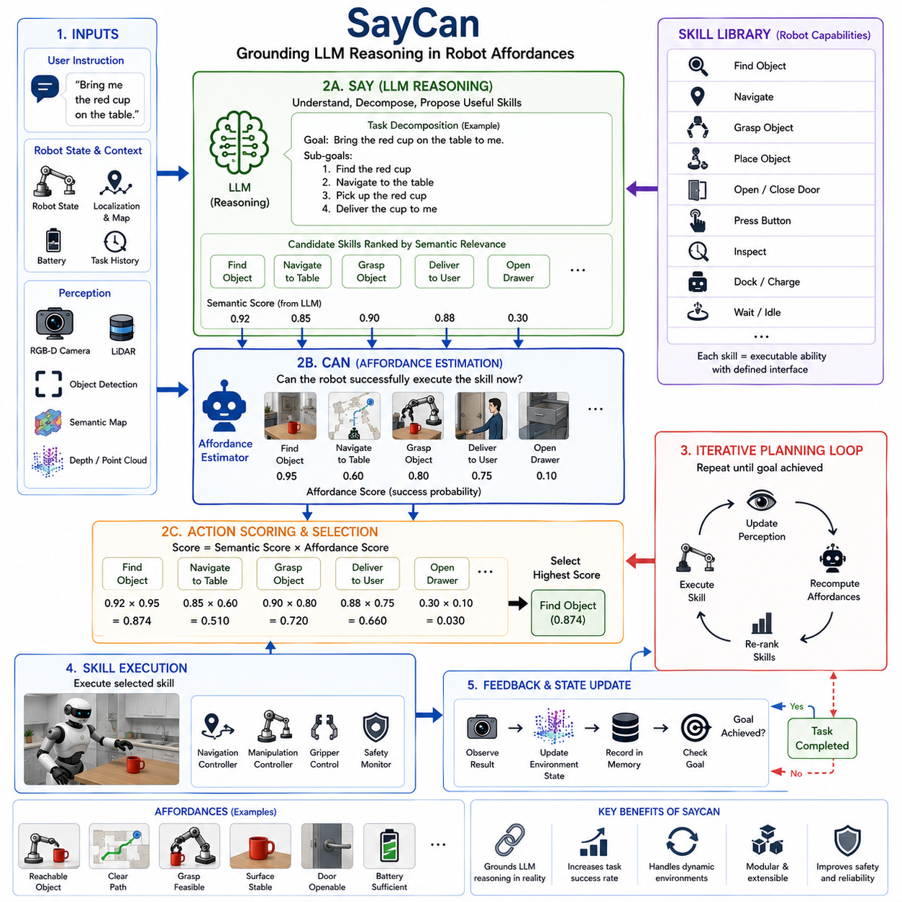{width="7.268055555555556in" height="7.268055555555556in"}

세이캔(SayCan)은 대규모 언어 모델(LLM, Large Language Model)의 언어 이해 능력과 실제 로봇의 물리적 실행 능력을 연결한 대표적인 로봇 인공지능 아키텍처이다. 기존 LLM은 사람의 명령을 이해하고 논리적인 계획을 세우는 데 매우 뛰어났지만, 실제 로봇이 해당 작업을 수행할 수 있는지는 고려하지 못했다. 반대로 기존 로봇 제어 시스템은 자신이 수행 가능한 동작은 정확히 알고 있었지만 사람의 언어를 이해하거나 복잡한 추론을 수행하는 능력이 부족했다. SayCan은 이 두 가지 장점을 결합하여 의미적으로 올바르면서도 실제 실행 가능한 작업 계획을 생성한다.

SayCan이라는 이름은 "Say"와 "Can"이라는 두 요소에서 유래하였다. "Say"는 LLM이 사용자의 명령을 이해하고 어떤 작업을 수행해야 하는지를 추론하는 역할을 의미한다. 반면 "Can"은 현재 로봇이 실제 환경에서 해당 작업을 수행할 수 있는지를 판단하는 능력을 의미한다. 즉, 언어적으로 적절한 행동과 물리적으로 실행 가능한 행동을 동시에 고려하여 최종 작업을 결정하는 것이 SayCan의 핵심 개념이다.

기존의 언어 기반 로봇 시스템에서는 LLM이 매우 논리적인 작업 계획을 생성하더라도 실제 환경에서는 실행이 불가능한 경우가 자주 발생하였다. 예를 들어 물체가 너무 멀리 있거나, 로봇의 팔이 닿지 않거나, 해당 물체가 존재하지 않거나, 장애물 때문에 접근할 수 없는 경우에도 LLM은 이를 고려하지 못했다. SayCan은 이러한 문제를 해결하기 위해 행동마다 실행 가능성(Affordance Probability)을 함께 평가한다.

비전-언어-행동(VLA, Vision-Language-Action) 시스템에서 SayCan은 고수준 추론과 실제 제어 사이에 위치한다. 카메라(Camera), 깊이 센서(Depth Sensor), 라이다(LiDAR), 힘 센서(Force Sensor), 촉각 센서(Tactile Sensor), 위치 추정(Localization), 의미 지도(Semantic Map) 등의 정보를 이용하여 현재 환경을 이해하고, 비전 인코더(Vision Encoder)는 이를 의미 정보로 변환한다. 동시에 LLM은 사용자의 명령을 분석하여 수행해야 할 작업을 추론하고, 로봇은 현재 자신이 수행 가능한 기술(Skill)을 평가한다.

SayCan의 핵심은 행동 점수(Action Scoring) 계산이다. LLM은 특정 기술(Skill)이 목표를 달성하는 데 얼마나 적합한지를 언어 확률(Language Probability)로 평가한다. 동시에 로봇은 현재 환경에서 해당 기술을 성공적으로 수행할 확률을 실행 가능성(Affordance Probability)으로 계산한다. SayCan은 이 두 값을 결합하여 최종 점수를 계산하며, 가장 높은 점수를 가진 행동을 다음 실행 단계로 선택한다.

어포던스(Affordance)는 로봇과 환경 사이에서 가능한 상호작용을 의미한다. 로봇은 물체를 집고, 문을 열고, 버튼을 누르고, 이동하고, 충전기에 도킹하고, 설비를 검사하는 등의 다양한 기술을 보유하고 있다. 그러나 이러한 기술은 항상 성공하는 것이 아니라 현재 환경에 따라 성공 가능성이 달라진다. 예를 들어 물체가 작업 범위를 벗어나 있거나 통로가 막혀 있으면 해당 행동은 실행할 수 없다. SayCan은 이러한 물리적 제약을 계획 과정에서 함께 고려한다.

SayCan의 가장 큰 특징은 의미 기반 계획과 물리적 실행을 분리하면서도 긴밀하게 연결한다는 점이다. LLM은 사용자의 의도를 이해하고 작업을 여러 단계로 분해하며 어떤 기술이 필요한지를 추론한다. 반면 실행 시스템은 각 기술이 실제로 성공할 가능성을 계산한다. 두 결과를 결합함으로써 현실적으로 수행 가능한 최적의 행동을 선택할 수 있다.

SayCan은 전체 계획을 한 번에 생성하지 않고 반복적인 의사결정(Iterative Decision Making)을 수행한다. 매 단계마다 현재 사용할 수 있는 기술 라이브러리(Skill Library)의 모든 기술을 평가하고, LLM은 의미적으로 가장 적합한 기술을 선택하며, 어포던스 모델은 성공 가능성을 계산한다. 가장 높은 점수를 얻은 기술을 실행한 후 새로운 센서 정보를 반영하여 다시 다음 행동을 선택하는 과정을 반복한다.

기술 라이브러리(Skill Library)는 SayCan의 핵심 구성 요소이다. 로봇은 이동(Navigation), 물체 탐지(Object Detection), 물체 집기(Grasping), 문 열기(Open Door), 물체 놓기(Place Object), 버튼 누르기(Button Pressing), 검사(Inspection), 충전(Charging), 사람과 대화하기(Human Interaction) 등의 기본 기술을 이미 보유하고 있다. LLM은 이러한 기술을 새롭게 만드는 것이 아니라 적절한 순서로 선택하여 작업을 수행한다.

LLM은 단순히 단어를 연결하는 것이 아니라 사용자의 의도(Intent)를 이해하고 상식(Common Sense)을 이용하여 작업을 추론한다. 예를 들어 "차를 준비해."라는 명령을 받으면 물을 준비하고, 물을 끓이고, 찻잔을 가져오고, 차를 우려내는 여러 단계를 자동으로 생성한다. 이러한 절차는 명령에 명시되어 있지 않더라도 LLM이 상식을 이용하여 추론한다.

그러나 LLM이 아무리 좋은 계획을 생성하더라도 실제 환경에 찻주전자(Kettle)가 존재하지 않는다면 작업은 수행할 수 없다. SayCan의 어포던스 모델은 현재 환경을 분석하여 해당 물체가 존재하는지, 접근 가능한지, 로봇이 실제로 수행할 수 있는지를 판단한다. 즉, 의미 기반 추론을 현실 세계에 연결하는 역할을 수행한다.

어포던스 추론은 인식 시스템(Perception System)에 크게 의존한다. 객체 탐지(Object Detection)는 물체를 찾고, 의미 분할(Semantic Segmentation)은 환경 구조를 이해하며, 깊이 추정(Depth Estimation)은 접근 가능성을 계산한다. 포인트 클라우드(Point Cloud)는 작업 공간을 분석하고, 힘 센서(Force Sensor)는 물체를 성공적으로 집었는지를 확인하며, 위치 추정(Localization)은 현재 로봇의 위치를 제공한다.

SayCan은 장기 작업(Long-Horizon Task)에도 적합하다. 모든 행동을 미리 계획하지 않고 현재 상황에서 가장 적합한 기술만 선택하기 때문에 환경이 계속 변화하는 실제 공간에서도 높은 안정성을 유지할 수 있다. 작업이 진행될수록 새로운 센서 정보를 반영하여 계획을 지속적으로 수정한다.

사람의 명령은 종종 모호하다. 예를 들어 "마실 것을 가져와."라는 명령은 여러 가지 해석이 가능하다. LLM은 물, 커피, 음료수 등 다양한 후보를 추론하지만, SayCan은 현재 주변에 실제로 존재하고 접근 가능한 물체를 고려하여 가장 적합한 선택을 수행한다. 따라서 의미와 현실을 동시에 반영한 의사결정이 가능하다.

SayCan은 작업 당시의 문맥(Context)도 함께 고려한다. 사용자의 위치, 현재 로봇 상태, 배터리 잔량(Battery Capacity), 이전 작업(Task History), 현재 손에 들고 있는 물체, 환경 상태 등을 함께 분석한다. 예를 들어 그리퍼(Gripper)가 이미 다른 물체를 잡고 있다면 새로운 물체를 집기 전에 먼저 기존 물체를 내려놓는 행동을 선택한다.

메모리(Memory)는 SayCan의 성능을 더욱 향상시킨다. 에피소드 메모리(Episodic Memory)는 이전 성공 및 실패 사례를 저장하고, 의미 메모리(Semantic Memory)는 일반 지식을 저장하며, 절차 메모리(Procedural Memory)는 기술 실행 방법을 기억한다. 장기 환경 메모리(Long-Term Memory)는 자주 방문하는 장소나 물체 위치를 기억하여 향후 작업 계획에 활용된다.

SayCan은 환경 변화에 따라 동적 재계획(Dynamic Replanning)도 수행한다. 사람이 이동하거나, 물체 위치가 바뀌거나, 통로가 막히거나, 장비가 고장 나면 현재 작업을 중단하지 않고 새로운 환경을 반영하여 남은 작업 계획만 다시 생성한다. 이를 통해 예기치 않은 상황에도 안정적으로 대응할 수 있다.

비전-언어 모델(VLM, Vision-Language Model)과도 자연스럽게 결합된다. 예를 들어 "냉장고 문이 열려 있고 중간 선반에 우유가 있으며 앞쪽에 의자가 있다."와 같은 장면 설명(Scene Description)을 생성하면 LLM은 이를 이용하여 더욱 정확한 의미 추론과 어포던스 평가를 수행할 수 있다.

자율주행(Navigation)에서도 SayCan은 매우 유용하다. 동일한 목적지라도 사람이 많거나, 공사 중이거나, 위험 구역이 포함된 경로는 실행 가능성이 낮다. SayCan은 의미적으로 적합한 목적과 실제 이동 가능한 경로를 동시에 고려하여 최적의 이동 전략을 선택한다.

조작(Manipulation) 작업에서도 동일한 원리가 적용된다. 목표 물체가 존재하더라도 다른 물체가 가로막고 있다면 직접 집는 것이 아니라 먼저 방해물을 치우거나, 문을 열거나, 로봇의 위치를 변경한 후 다시 물체를 집는 계획을 선택한다. 이러한 단계적 계획은 실제 환경에서 성공률을 크게 높여준다.

산업용 로봇에서는 SayCan의 효과가 더욱 크다. 생산 목표는 LLM이 이해하고, 실제 장비 사용 가능 여부, 작업 공간 접근성, 공구 상태, 안전 규칙은 어포던스 모델이 평가한다. 따라서 공장의 실제 상태를 반영한 현실적인 작업 계획을 생성할 수 있다.

물류 창고(Warehouse)에서는 재고 상태(Inventory), 선반 접근성(Shelf Accessibility), 통로 혼잡도(Traffic Congestion), 충전 상태(Charging Status), 작업 우선순위(Priority)를 함께 고려한다. SayCan은 이러한 다양한 요소를 종합하여 가장 효율적인 물류 작업을 계획한다.

의료 로봇(Healthcare Robot)은 환자의 요청을 자연어로 이해하는 동시에 환자 안전(Safety), 의료 장비 접근성, 병원 절차(Medical Protocol), 의료 규정을 함께 고려해야 한다. SayCan은 이러한 현실적인 제약을 계획에 반영함으로써 보다 안전한 의료 서비스를 지원할 수 있다.

시설 점검(Inspection) 로봇도 설비 접근성, 조명 상태, 안전 조건, 작업 허가 등을 고려해야 한다. SayCan은 현재 환경에서 실제 수행 가능한 검사 기술만 선택하여 효율적인 점검 계획을 생성한다.

SayCan의 가장 큰 장점은 모듈성(Modularity)이다. LLM, 인식 시스템, 어포던스 모델, 기술 라이브러리, 모션 플래너(Motion Planner), 제어기(Controller)는 서로 독립적으로 개발될 수 있으며, 하나의 모듈이 개선되더라도 전체 시스템을 다시 설계할 필요가 없다.

그러나 한계도 존재한다. 어포던스 추론은 인식 정확도에 크게 의존하므로 객체 탐지 오류, 위치 오차, 센서 잡음이 발생하면 실행 가능성 평가도 부정확해질 수 있다. 따라서 높은 수준의 인식 기술이 반드시 필요하다.

LLM 역시 환각(Hallucination) 문제를 완전히 해결하지 못한다. 사용자 의도를 잘못 이해하거나 부적절한 작업 계획을 생성할 수 있다. SayCan은 실행 가능성을 평가하여 일부 오류를 제거할 수 있지만, 안전이 중요한 분야에서는 추가적인 검증(Validation)이 반드시 필요하다.

기술 라이브러리가 수백 개 이상으로 증가하면 모든 기술의 실행 가능성을 계산하는 비용도 증가한다. 이를 해결하기 위해 계층형 기술 구조(Hierarchical Skill Organization), 임베딩 검색(Embedding Retrieval), 근사 탐색(Approximate Search) 등의 연구가 활발히 진행되고 있다.

최근에는 다중 로봇(Multi-Robot) 환경으로 SayCan을 확장하는 연구도 진행되고 있다. 여러 로봇이 동시에 작업할 경우 각 로봇의 능력, 자원 공유(Resource Sharing), 작업 분배(Task Allocation), 통신(Communication), 협업(Collaboration)을 함께 고려하여 최적의 작업 계획을 생성한다.

세계 모델(World Model)과 SayCan을 결합하는 연구도 활발하다. 현재 환경뿐 아니라 미래의 환경 변화까지 예측하여 실행 가능성을 평가하므로 보다 선제적인 계획(Predictive Planning)이 가능해지고 있다.

검색 증강 생성(RAG, Retrieval-Augmented Generation)과도 자연스럽게 통합된다. 운영 매뉴얼(Manual), 설비 데이터베이스(Database), 디지털 트윈(Digital Twin), 시설 지도(Map), 유지보수 기록(Log) 등을 검색하여 LLM의 추론과 어포던스 평가를 더욱 정확하게 만든다.

사고의 연쇄(CoT, Chain of Thought)와 SayCan을 함께 사용하는 연구도 증가하고 있다. LLM은 먼저 작업을 단계적으로 추론하고, 이후 각 단계마다 실제 실행 가능성을 평가한다. 이러한 방식은 복잡한 장기 작업에서 더욱 높은 성공률을 제공한다.

향후 VLA 시스템은 언어(Language), 영상(Image), 깊이(Depth), 비디오(Video), 촉각(Tactile), 힘(Force), 자기 상태(Proprioception), 의미 지도(Semantic Map), 세계 모델(World Model), 장기 메모리(Long-Term Memory)를 동시에 학습하는 멀티모달 파운데이션 모델(Multimodal Foundation Model)로 발전할 것으로 예상된다. 미래의 모델은 별도의 언어 모델과 어포던스 모델을 결합하는 방식이 아니라 의미 이해와 물리적 실행 가능성을 하나의 통합 표현(Unified Representation)으로 학습하게 될 것이다.

결국 SayCan은 LLM의 의미 기반 추론과 실제 로봇의 물리적 실행 능력을 연결한 최초의 실용적인 프레임워크 중 하나이다. 상식(Common Sense), 작업 계획(Task Planning), 인식(Perception), 어포던스 추론(Affordance Reasoning), 기술 라이브러리(Skill Library), 지속적인 재계획(Continuous Replanning), 환경 피드백(Environment Feedback)을 통합함으로써 자연어 명령을 실제 실행 가능한 로봇 행동으로 변환하는 차세대 물리 AI(Physical AI)의 핵심 기반 기술로 평가받고 있다.

## 3.6 Fine-Tuning LLMs for Robot Instruction Following (with Code)

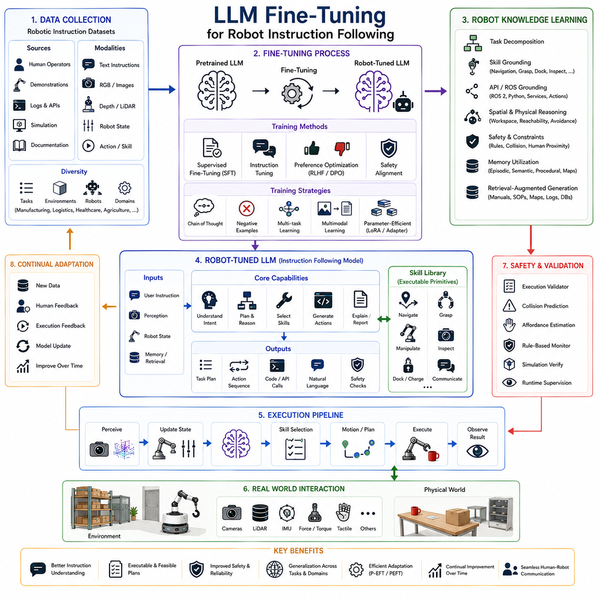{width="7.268055555555556in" height="7.268055555555556in"}

대규모 언어 모델(LLM, Large Language Model)은 자연어 이해(Natural Language Understanding), 추론(Reasoning), 계획(Planning), 코드 생성(Code Generation) 등에서 뛰어난 성능을 보이지만, 인터넷 기반 일반 데이터로 학습된 파운데이션 모델(Foundation Model)은 로봇공학(Robotics)에 최적화되어 있지 않다. 로봇은 물리 환경(Physical Environment), 안전(Safety), 센서 정보(Sensor Data), 실시간 제어(Real-Time Control), 작업 절차(Task Procedure)를 이해해야 하므로, 이를 위해 미세조정(Fine-Tuning)이 필수적으로 수행된다.

로봇 명령 수행(Robot Instruction Following)은 일반 대화형 인공지능(Chatbot)과는 근본적으로 다르다. 대화에서는 다소 모호하거나 여러 해석이 가능한 답변도 허용되지만, 로봇은 생성된 명령이 실제 물리적 행동으로 이어지므로 정확하고 안전하며 실행 가능한 결과를 생성해야 한다. 따라서 로봇용 LLM은 자연어 이해뿐 아니라 실제 행동(Action)과 연결되는 높은 수준의 정렬(Alignment)이 요구된다.

미세조정의 목적은 일반 LLM이 보유한 광범위한 지식을 유지하면서 로봇 환경에 필요한 언어 패턴(Language Pattern), 작업 절차(Workflow), 안전 규칙(Safety Policy), 환경 지식(Environment Knowledge), 제어 방식(Control Strategy)을 학습시키는 것이다. 이는 기존 지식을 대체하는 것이 아니라 로봇 분야에 특화된 능력을 추가하는 과정이라고 볼 수 있다.

로봇 명령 수행은 단순히 문장을 해석하는 것이 아니라 사람의 의도(Intent)를 이해하는 것에서 시작된다. 예를 들어 "검사 카메라를 정비실로 가져가.", "손상된 팔레트를 검사해.", "오늘 점검을 마치면 충전기로 돌아가."와 같은 명령에는 환경(Context), 시간 순서(Temporal Order), 안전 규칙, 작업 우선순위 등이 명시되어 있지 않은 경우가 많다. 미세조정된 LLM은 이러한 숨겨진 조건을 자동으로 추론할 수 있다.

미세조정은 우선 고품질 로봇 명령 데이터셋(Robot Instruction Dataset)을 구축하는 것부터 시작된다. 데이터셋에는 자연어 명령, 작업 분해(Task Decomposition), 행동 순서(Action Sequence), 심볼릭 계획(Symbolic Plan), 파이썬 정책(Python Policy), 행동 트리(Behavior Tree), ROS 명령 구조(ROS Command Structure) 등이 포함된다. 일반적인 언어 데이터와 달리 실제 로봇 행동과 직접 연결되는 정보가 중심이 된다.

데이터셋은 다양한 산업 분야를 포함해야 한다. 제조(Manufacturing), 물류(Logistics), 의료(Healthcare), 농업(Agriculture), 건설(Construction), 창고 자동화(Warehouse Automation), 시설 점검(Infrastructure Inspection), 서비스 로봇(Service Robotics), 협동 로봇(Collaborative Robotics) 등은 서로 다른 용어와 절차를 사용한다. 다양한 환경을 포함한 데이터는 모델의 일반화 성능을 크게 향상시킨다.

작업(Task)의 다양성도 매우 중요하다. 이동(Navigation), 조작(Manipulation), 물체 운반(Object Transport), 검사(Inspection), 조립(Assembly), 충전(Charging), 청소(Cleaning), 감시(Monitoring), 배송(Delivery), 유지보수(Maintenance), 복구(Recovery), 사람과의 협업(Human Collaboration) 등 다양한 작업을 학습해야 실제 환경에서 폭넓게 활용할 수 있다.

최근에는 텍스트(Text)뿐 아니라 멀티모달(Multimodal) 데이터가 함께 사용된다. RGB 영상(RGB Image), 깊이 영상(Depth Map), 라이다(LiDAR), 포인트 클라우드(Point Cloud), 촉각(Tactile), 힘 센서(Force Sensor), 배터리 상태(Battery Status), 위치 정보(Localization), 환경 메타데이터(Environment Metadata), 작업 이력(Task History) 등을 자연어와 함께 학습함으로써 언어와 실제 환경을 연결한다.

가장 널리 사용되는 방법은 지도 미세조정(SFT, Supervised Fine-Tuning)이다. 사람이 직접 작성한 고품질 명령과 정답(Response)을 이용하여 모델을 학습시킨다. 이러한 데이터에는 올바른 작업 분해, 안전한 행동 계획, 정확한 API 사용, 예외 처리(Exception Handling), 실행 절차 등이 포함되어 있으며, 모델은 이를 반복 학습하면서 로봇 환경에 적응한다.

명령 미세조정(Instruction Tuning)은 단순히 특정 명령을 외우는 것이 아니라 작업 목표(Goal), 하위 작업(Subtask), 환경 제약(Constraint), 로봇 기술(Skill), 실행 순서(Execution Sequence) 사이의 관계를 이해하도록 학습시킨다. 따라서 처음 보는 명령이라도 기존 지식을 활용하여 적절한 작업 계획을 생성할 수 있다.

최근에는 선호도 학습(Preference Optimization)이 중요해지고 있다. 여러 개의 후보 응답 중 전문가가 가장 적절한 답변을 선택하면 모델은 이를 학습한다. 강화학습 기반 인간 피드백(RLHF, Reinforcement Learning from Human Feedback), 직접 선호도 최적화(DPO, Direct Preference Optimization) 등의 기법을 활용하여 더욱 안전하고 효율적인 작업 계획을 생성하도록 학습시킨다.

안전 정렬(Safety Alignment)은 로봇 미세조정에서 가장 중요한 요소이다. 로봇은 실제 환경에서 사람과 함께 작업하므로 충돌 회피(Collision Avoidance), 비상 정지(Emergency Stop), 위험 물질(Hazardous Material) 처리, 사람과의 거리 유지(Human Proximity), 장비 보호(Equipment Protection), 산업 안전 규정(Regulation) 등을 반드시 준수해야 한다. 따라서 학습 데이터에도 이러한 사례가 충분히 포함되어야 한다.

올바른 사례뿐 아니라 잘못된 사례(Negative Example)도 함께 학습한다. 잘못된 작업 계획, 위험한 행동, 실행 불가능한 조작, 잘못된 API 사용, 물리적으로 불가능한 경로 등을 함께 제시하고 왜 잘못되었는지를 설명함으로써 모델의 판단 능력을 향상시킨다.

사고의 연쇄(CoT, Chain of Thought)를 이용한 학습도 점차 중요해지고 있다. 단순히 정답만 제공하는 것이 아니라 작업을 여러 단계로 분해하는 추론 과정을 함께 학습한다. 이를 통해 목표 분석, 제약 조건 파악, 대안 비교, 어포던스(Affordance) 평가, 작업 순서 결정 등의 과정을 스스로 수행할 수 있게 된다.

공간 추론(Spatial Reasoning) 능력도 미세조정을 통해 크게 향상된다. 일반 LLM은 공간 개념은 이해하지만 작업 가능 영역(Workspace), 접근 가능성(Reachability), 장애물 회피(Obstacle Avoidance), 그리퍼 접근 방향(Grasp Planning)과 같은 로봇 특화 공간 개념은 부족하다. 로봇 데이터셋으로 학습하면 이러한 능력이 크게 개선된다.

미세조정은 로봇 기술(Skill)과 자연어를 연결하는 역할도 수행한다. 사용자의 명령을 이동(Navigation), 물체 집기(Grasping), 충전(Charging), 검사(Inspection), 스캔(Scanning), 보고(Reporting) 등의 기술 라이브러리(Skill Library)와 직접 연결하여 실제 실행 가능한 작업으로 변환한다.

API(Application Programming Interface)와의 연동도 중요한 학습 대상이다. ROS 2 서비스(Service), 액션(Action), 파이썬(Python) API, 하드웨어 드라이버(Hardware Driver), 인식 서비스(Perception Service), 계획 라이브러리(Planning Library)를 올바르게 호출하는 방법을 학습하여 실제 로봇 소프트웨어와 자연스럽게 연결된다.

메모리(Memory) 활용 능력도 향상된다. 에피소드 메모리(Episodic Memory), 의미 메모리(Semantic Memory), 절차 메모리(Procedural Memory), 장기 지도(Long-Term Map)를 언제 활용해야 하는지를 학습하여 장시간 자율 작업(Long-Term Autonomy)의 성능을 높인다.

검색 증강 생성(RAG, Retrieval-Augmented Generation)도 미세조정과 함께 사용된다. 설비 매뉴얼(Manual), 유지보수 문서(Maintenance Guide), 디지털 트윈(Digital Twin), 운영 절차(Standard Operating Procedure), 장비 데이터베이스(Database)를 언제 검색해야 하는지를 학습하여 내부 지식과 외부 지식을 효율적으로 결합한다.

최근에는 시뮬레이션(Simulation)을 이용한 데이터 생성이 활발하다. 아이작 심(Isaac Sim), 가제보(Gazebo), 무조코(MuJoCo), 해비타트(Habitat), 디지털 트윈(Digital Twin) 환경에서 수백만 개의 명령 수행 데이터를 생성할 수 있다. 실제 로봇보다 비용이 저렴하고 안전하며 다양한 환경을 손쉽게 생성할 수 있다는 장점이 있다.

Sim-to-Real 학습은 시뮬레이션과 실제 로봇 데이터를 함께 활용한다. 시뮬레이션은 다양한 상황을 제공하고, 실제 데이터는 센서 잡음(Sensor Noise), 구동 오차(Actuator Error), 환경 변화(Environment Variation)를 포함한다. 두 데이터를 함께 학습하면 실제 환경에서의 일반화 성능이 크게 향상된다.

최근에는 지속적 미세조정(Continual Fine-Tuning)도 연구되고 있다. 초기 학습 후에도 새로운 작업 성공 사례, 운영자 수정, 새로운 장비, 환경 변화 등을 지속적으로 학습하여 시간이 지날수록 성능이 향상되는 적응형 로봇 시스템을 구축할 수 있다.

파라미터 효율적 미세조정(PEFT, Parameter-Efficient Fine-Tuning)은 매우 중요한 기술이다. 수십억 개 이상의 파라미터를 가진 모델 전체를 다시 학습하는 대신 로라(LoRA, Low-Rank Adaptation), 어댑터(Adapter), 프롬프트 튜닝(Prompt Tuning), 프리픽스 튜닝(Prefix Tuning) 등을 이용하여 일부 파라미터만 학습한다. 이를 통해 학습 비용과 메모리 사용량을 크게 줄일 수 있다.

소형 언어 모델(SLM, Small Language Model)도 로봇 분야에서 많이 활용된다. 엣지 컴퓨터(Edge Computer)에서는 대규모 모델을 실행하기 어렵기 때문에 이동, 검사, 조작 등 특정 작업에 맞추어 경량 모델을 미세조정하여 사용한다. 이를 통해 실시간성(Real-Time)과 성능을 동시에 확보할 수 있다.

산업용 로봇은 공장 고유의 용어(Terminology), 생산 절차(Production Workflow), 품질 검사(Quality Inspection), 유지보수 일정(Maintenance Schedule), 안전 규정(Safety Regulation)을 이해해야 한다. 미세조정을 통해 이러한 전문 지식을 학습하면 실제 산업 현장에서 훨씬 높은 성능을 발휘할 수 있다.

창고 자동화(Warehouse Automation)는 재고 관리(Inventory Management), 주문 처리(Order Fulfillment), 바코드 스캔(Barcode Scanning), 선반 관리(Shelf Organization), 물류 최적화(Logistics Optimization) 등 특수한 용어와 작업 절차를 사용한다. 이에 특화된 미세조정은 창고 로봇의 명령 이해 능력을 크게 향상시킨다.

의료 로봇(Healthcare Robot)은 의료 용어(Medical Terminology), 환자 응대(Patient Interaction), 위생 규정(Hygiene Policy), 약품 관리(Medication Handling), 응급 절차(Emergency Workflow), 개인정보 보호(Privacy Regulation)를 이해해야 한다. 의료 환경에 특화된 미세조정을 통해 더욱 안전하고 신뢰성 있는 서비스를 제공할 수 있다.

시설 점검(Inspection Robot) 역시 설비 구조, 이상 탐지(Anomaly Detection), 점검 절차(Inspection Procedure), 보고 형식(Report Format), 센서 운용(Sensor Operation)에 대한 전문 지식을 학습해야 한다. 이러한 데이터는 점검 로봇의 성능을 크게 향상시킨다.

평가(Evaluation)는 일반 언어 모델과 다른 기준을 사용한다. 단순한 문장 품질이 아니라 작업 성공률(Task Success Rate), 명령 수행 정확도(Instruction Following Accuracy), 계획 일관성(Planning Consistency), API 정확도(API Correctness), 안전성(Safety Compliance), 실행 가능성(Execution Feasibility), 오류 복구(Recovery Capability) 등을 종합적으로 평가한다.

미세조정이 완료되더라도 안전 검증(Safety Verification)은 반드시 수행되어야 한다. 실행 검증기(Execution Validator), 기하학적 검증(Geometric Validation), 충돌 예측(Collision Prediction), 어포던스 분석(Affordance Estimation), 규칙 기반 안전 검사(Rule-Based Safety Check), 시뮬레이션 검증(Simulation Verification), 런타임 모니터(Runtime Monitoring)가 함께 동작하여 위험한 행동을 차단한다.

미세조정 과정에서는 재앙적 망각(Catastrophic Forgetting)도 중요한 문제이다. 지나치게 로봇 데이터만 학습하면 기존의 일반 상식과 추론 능력이 감소할 수 있다. 따라서 일반 지식과 로봇 전문 지식 사이의 균형을 유지하는 것이 매우 중요하다.

데이터의 양보다 품질(Quality)이 더욱 중요하다. 수백만 개의 부정확한 데이터보다 전문가가 작성한 수천 개의 고품질 데이터가 더 좋은 성능을 제공하는 경우가 많다. 정확한 라벨(Label), 일관된 표현, 표준화된 작업 구조가 성공적인 미세조정의 핵심 요소이다.

향후에는 언어(Language), 영상(Image), 깊이 정보(Depth), 촉각(Tactile), 힘 센서(Force), 자기 상태(Proprioception), 의미 지도(Semantic Map), 세계 모델(World Model), 조작 시연(Manipulation Demonstration), 장기 메모리(Long-Term Memory)를 함께 학습하는 멀티모달 미세조정(Multimodal Fine-Tuning)이 중심 기술로 발전할 것으로 예상된다.

또한 여러 대의 로봇이 서로의 경험을 공유하는 협업 미세조정(Collaborative Fine-Tuning)도 활발히 연구되고 있다. 서로 다른 환경에서 수행한 명령 수행 경험을 공유함으로써 보다 강력한 로봇 파운데이션 모델(Robot Foundation Model)을 구축할 수 있다.

연합 학습(Federated Learning)은 산업 현장에서 매우 유망한 기술이다. 각 공장에서 데이터를 외부로 보내지 않고 로컬(Local)에서 미세조정을 수행한 후 모델의 파라미터만 공유함으로써 개인정보와 기업 기밀을 보호하면서도 공동 학습이 가능하다.

앞으로는 세계 모델(World Model)과 미세조정이 결합되어 현재 환경뿐 아니라 미래 상황까지 예측하는 명령 수행이 가능해질 것이다. 현재 행동이 미래의 안전성(Safety), 에너지 소비(Energy Consumption), 생산성(Productivity), 협업 효율(Collaboration Efficiency)에 어떤 영향을 미치는지까지 고려하는 예측 기반 로봇 인공지능(Predictive Robot AI)으로 발전할 것으로 기대된다.

결국 로봇 명령 수행을 위한 LLM 미세조정은 일반 언어 모델을 실제 물리 세계에서 동작하는 로봇 인공지능으로 변화시키는 핵심 기술이다. 자연어 이해(Natural Language Understanding), 물리 환경(Physical Environment), 센서 정보(Perception), 안전 규칙(Safety Policy), 기술 라이브러리(Skill Library), 소프트웨어 인터페이스(Software Interface), 실행 피드백(Execution Feedback)을 하나의 통합 인지 시스템으로 연결함으로써 사람의 의도를 안전하고 신뢰성 있게 실제 로봇 행동으로 변환하는 차세대 물리 AI(Physical AI)의 핵심 기반 기술로 자리매김하고 있다.

## 3.7 Small Language Models (SLMs) for Edge Robots (with Code)

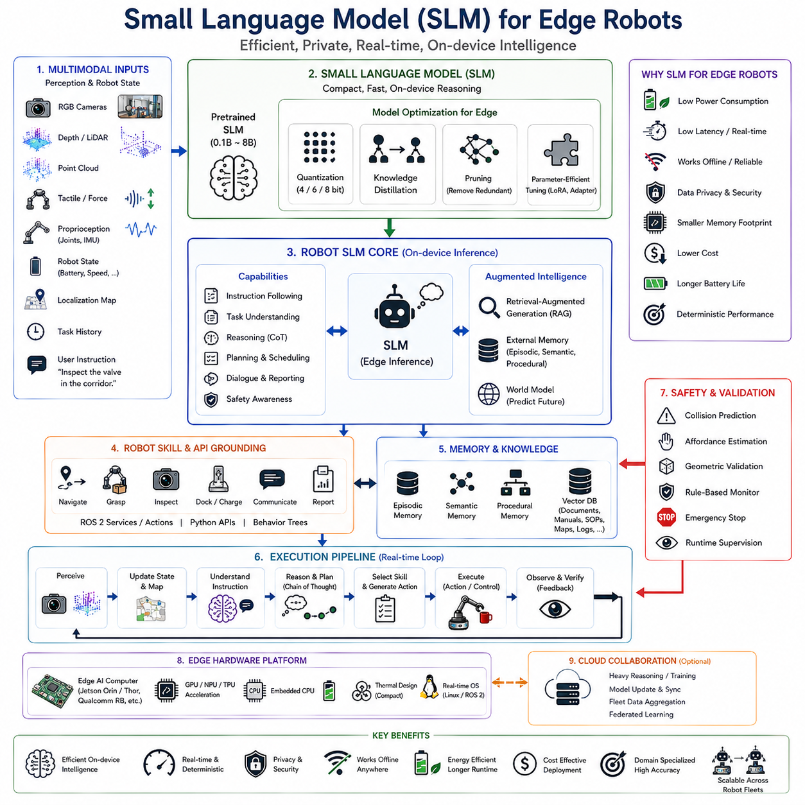{width="7.268055555555556in" height="7.268055555555556in"}

소형 언어 모델(SLM, Small Language Model)은 차세대 엣지 로봇(Edge Robot)을 위한 핵심 인공지능 기술로 주목받고 있다. 대규모 언어 모델(LLM, Large Language Model)은 자연어 이해(Natural Language Understanding), 추론(Reasoning), 계획(Planning), 코드 생성(Code Generation)에서 뛰어난 성능을 제공하지만, 막대한 연산량과 메모리 사용량으로 인해 대부분의 자율주행 로봇에 직접 탑재하기는 어렵다. 반면 SLM은 수억 개에서 수십억 개 수준의 파라미터(Parameter)를 사용하여 제한된 하드웨어에서도 실시간 추론이 가능하도록 설계되었다.

엣지 로봇은 이동하면서 주변 환경을 인식하고, 위치를 추정하며, 경로를 계획하고, 센서를 처리하고, 안전을 유지해야 한다. 이러한 모든 기능은 제한된 전력(Power), 메모리(Memory), 발열(Thermal Budget), 연산 성능(Compute Performance) 안에서 수행되어야 한다. 따라서 클라우드에서 사용하는 초대형 모델보다 경량화된 SLM이 실제 로봇에서는 훨씬 현실적인 선택이 된다.

SLM은 범용 인공지능(General Intelligence)보다 목적 중심 인공지능(Task-Oriented Intelligence)을 지향한다. 대부분의 로봇은 인터넷 전체의 지식을 이해할 필요가 없다. 창고 로봇은 물류(Logistics)를, 검사 로봇은 유지보수(Maintenance)를, 병원 로봇은 의료 절차(Healthcare Workflow)를, 농업 로봇은 작물 관리(Crop Management)를 이해하면 충분하다. 따라서 특정 업무에 특화된 SLM이 실제 성능과 효율성 모두에서 유리하다.

엣지 로봇은 클라우드 AI와 다른 제약 조건을 가진다. 배터리(Battery) 기반으로 동작하므로 소비 전력이 매우 중요하며, 작은 기구 구조 때문에 냉각 능력도 제한적이다. 또한 메모리 용량이 제한되어 있으며, 사람과 함께 작업하는 경우 수 밀리초(Millisecond) 수준의 빠른 응답 속도가 요구된다. 이러한 조건은 SLM 설계의 중요한 기준이 된다.

전력 소비(Power Consumption)는 가장 중요한 요소 중 하나이다. 언어 모델 추론에 많은 전력을 사용하면 센서, 모터, 통신 장치, 제어기 등이 사용할 수 있는 에너지가 감소한다. 배터리 기반 자율주행 로봇에서는 여러 개의 고성능 GPU가 필요한 초대형 LLM을 사용하는 것이 사실상 불가능하다. SLM은 연산량을 줄여 배터리 사용 시간을 크게 증가시킨다.

지연 시간(Latency)도 매우 중요하다. 로봇은 계속 변화하는 환경에서 즉시 의사결정을 내려야 한다. 클라우드 기반 AI는 네트워크(Network) 상태에 따라 응답 시간이 달라질 수 있으며, 인터넷 연결이 끊기면 작업이 불가능해질 수 있다. 반면 SLM은 로봇 내부에서 직접 추론을 수행하므로 일정한 응답 속도를 유지할 수 있으며 안전성이 크게 향상된다.

보안(Security)과 개인정보 보호(Privacy) 역시 엣지 AI가 필요한 이유이다. 공장에서는 생산 기술과 설비 정보가 외부로 유출되어서는 안 되며, 병원에서는 환자의 개인정보를 외부 서버로 전송할 수 없다. SLM을 로봇 내부에서 실행하면 모든 데이터가 로컬(Local)에 유지되므로 보안과 개인정보 보호 수준이 크게 향상된다.

신뢰성(Reliability)도 중요한 장점이다. 광산(Mine), 터널(Tunnel), 농장(Farm), 건설 현장(Construction Site), 산악 지역(Remote Area)처럼 통신이 불안정한 환경에서는 클라우드 AI에 의존할 수 없다. SLM은 네트워크 없이도 자연어 이해와 작업 계획을 수행할 수 있으므로 독립적인 자율 운용이 가능하다.

현대의 엣지 로봇은 계층형 컴퓨팅(Hierarchical Computing Architecture)을 사용한다. 저수준 제어(Low-Level Control), 위치 추정(Localization), 충돌 회피(Collision Avoidance), 안전 제어(Safety Monitoring)는 실시간 제어기에서 수행한다. SLM은 자연어 이해, 작업 계획(Task Planning), 대화(Dialogue), 의미 기반 추론(Semantic Reasoning)을 담당하며, 매우 복잡한 장기 추론(Long-Horizon Reasoning)은 필요할 경우 클라우드 LLM이 처리하는 구조가 일반적이다.

하드웨어 가속(Hardware Acceleration)은 SLM의 핵심 기술이다. 엔비디아(NVIDIA) Jetson Orin, Jetson Thor, 퀄컴(Qualcomm) Robotics RB 시리즈, 인텔(Intel) Core Ultra AI, AMD Ryzen AI, 전용 신경망 처리 장치(NPU, Neural Processing Unit) 등은 SLM을 효율적으로 실행하도록 설계되어 있다. 이러한 플랫폼은 낮은 소비 전력으로도 충분한 추론 성능을 제공한다.

모델 압축(Model Compression)은 SLM을 가능하게 하는 핵심 기술이다. 양자화(Quantization)는 부동소수점(Floating Point) 연산을 8비트, 6비트, 4비트 정수(Integer) 연산으로 변환하여 메모리 사용량과 연산량을 크게 줄인다. 이 과정에서도 대부분의 언어 이해 성능을 유지할 수 있어 로봇 분야에서 널리 사용된다.

지식 증류(Knowledge Distillation)는 대형 모델(Teacher Model)의 지식을 소형 모델(Student Model)로 전달하는 기술이다. 학생 모델은 인터넷 전체를 다시 학습하는 대신 교사 모델의 추론 결과를 학습하여 훨씬 적은 파라미터로도 높은 성능을 얻을 수 있다. 이는 SLM 성능 향상의 핵심 방법 중 하나이다.

가지치기(Pruning)는 중요하지 않은 뉴런(Neuron), 어텐션 헤드(Attention Head), 피드포워드 계층(Feed-Forward Layer)을 제거하여 모델을 더욱 가볍게 만든다. 이를 통해 연산량과 메모리 사용량을 줄이면서도 핵심 추론 능력을 유지할 수 있다.

파라미터 효율적 미세조정(PEFT, Parameter-Efficient Fine-Tuning)은 SLM에 매우 적합하다. 로라(LoRA, Low-Rank Adaptation), 어댑터(Adapter), 프롬프트 튜닝(Prompt Tuning), 프리픽스 튜닝(Prefix Tuning) 등을 이용하여 전체 모델을 다시 학습하지 않고도 특정 로봇 환경에 빠르게 적응시킬 수 있다.

미세조정(Fine-Tuning)은 일반 SLM을 로봇 전용 모델로 변환하는 과정이다. 일반 언어 모델은 로봇 용어, 센서 구조, 안전 규칙, ROS API, 작업 절차 등을 충분히 이해하지 못한다. 로봇 데이터로 미세조정을 수행하면 특정 플랫폼에 최적화된 명령 수행 능력을 갖추게 된다.

SLM은 자연어 명령을 로봇 기술(Skill)과 직접 연결한다. 이동(Navigation), 물체 집기(Grasping), 검사(Inspection), 충전(Charging), 도킹(Docking), 보고(Reporting) 등의 기술을 자연어와 연결함으로써 사용자의 명령을 즉시 실행 가능한 작업으로 변환할 수 있다.

ROS 2 API, 파이썬(Python) 인터페이스, 행동 트리(Behavior Tree), 작업 계획기(Task Planner), 실행 관리자(Execution Manager)도 SLM과 연결된다. 따라서 사용자의 명령을 단순한 텍스트가 아니라 실제 로봇 소프트웨어가 실행 가능한 명령으로 변환할 수 있다.

외부 메모리(External Memory)는 SLM의 부족한 파라미터를 보완한다. 에피소드 메모리(Episodic Memory), 의미 메모리(Semantic Memory), 절차 메모리(Procedural Memory), 작업 메모리(Working Memory)를 활용하여 장시간 작업에서도 높은 성능을 유지할 수 있다.

검색 증강 생성(RAG, Retrieval-Augmented Generation)은 SLM에서 특히 중요하다. 모델 내부에 모든 지식을 저장하는 대신 필요할 때 설비 매뉴얼(Manual), 작업 절차(Standard Operating Procedure), 디지털 트윈(Digital Twin), 장비 데이터베이스(Database), 의미 지도(Semantic Map)를 검색하여 활용한다. 작은 모델도 방대한 지식을 활용할 수 있게 된다.

멀티모달(Multimodal) 입력은 SLM의 성능을 크게 향상시킨다. RGB 영상(RGB Image), 깊이 정보(Depth Map), 라이다(LiDAR), 포인트 클라우드(Point Cloud), 촉각(Tactile), 힘 센서(Force Sensor), 배터리 상태(Battery Status), 지도(Map) 등을 함께 입력받아 언어 추론과 결합함으로써 모델의 한계를 보완한다.

비전-언어 통합(Vision-Language Integration)은 엣지 로봇에서 매우 중요하다. 비전 인코더(Vision Encoder)는 장면을 의미 벡터(Semantic Embedding)로 변환하고, SLM은 이를 자연어 명령과 함께 이해하여 작업 계획, 장면 이해(Scene Understanding), 물체 탐색(Object Retrieval), 자율주행(Navigation)을 수행한다.

사고의 연쇄(CoT, Chain of Thought)도 SLM에 적용할 수 있다. 다만 대형 모델처럼 긴 추론을 수행하는 대신 작업 분해(Task Decomposition), 안전 확인(Safety Verification), 환경 분석(Environment Analysis), 기술 선택(Skill Selection) 등 필요한 부분만 간결하게 수행하여 연산량을 줄인다.

세계 모델(World Model)은 SLM의 성능을 크게 향상시킨다. 미래 환경 변화를 예측하는 세계 모델과 결합하면 작은 모델도 단순한 현재 상태뿐 아니라 앞으로 발생할 상황까지 고려하여 의사결정을 수행할 수 있다.

실제 로봇에서는 계층형 AI 구조(Hierarchical AI Architecture)가 많이 사용된다. SLM은 항상 로봇 내부에서 실행되어 빠른 응답을 제공하고, 복잡한 설계, 소프트웨어 개발, 장기 전략 수립은 필요할 때만 클라우드 LLM이 수행한다. 이러한 구조는 성능과 비용을 동시에 만족시키는 현실적인 접근 방식이다.

제조 공장에서는 SLM이 작업 지시를 이해하고, 설비 상태를 설명하며, 유지보수 절차를 검색하고, 검사 결과를 보고하며, 작업자와 자연스럽게 대화할 수 있다. 모든 처리가 공장 내부에서 이루어지므로 보안과 실시간성이 보장된다.

물류 창고에서는 피킹(Picking), 재고 확인(Inventory Check), 물류 보고(Logistics Report), 차량 협업(Fleet Coordination), 선반 위치 검색(Storage Retrieval) 등을 네트워크 연결 없이 수행할 수 있다. 이는 대규모 창고 자동화에서 매우 중요한 장점이다.

시설 점검 로봇은 발전소(Power Plant), 공장(Factory), 배관(Pipeline), 교량(Bridge), 철도(Railway), 건설 현장 등에서 점검 절차를 이해하고, 이상 상태를 설명하며, 유지보수 기록을 조회하고, 점검 보고서를 생성할 수 있다.

의료 로봇은 환자 정보가 외부로 유출되지 않도록 로컬에서 모든 추론을 수행한다. 자연어 대화, 약 복용 알림, 병실 안내, 환자 모니터링 등을 개인정보를 보호하면서 처리할 수 있다.

농업 로봇은 농부의 명령을 이해하고 작물 상태를 설명하며, 재배 절차를 검색하고, 수확 보고서를 생성한다. 인터넷 연결이 어려운 농장에서도 독립적으로 작업을 수행할 수 있다.

건설 로봇은 현장 문서를 이해하고, 공사 진행 상황을 설명하며, 설계 절차를 검색하고, 작업 보고서를 생성한다. 네트워크가 불안정한 공사 현장에서도 안정적으로 동작할 수 있다.

그러나 SLM도 저수준 모터 제어를 직접 수행해서는 안 된다. 충돌 예측(Collision Prediction), 기하학적 검증(Geometric Validation), 어포던스 분석(Affordance Estimation), 비상 정지(Emergency Stop), 런타임 모니터(Runtime Monitor)는 반드시 독립적인 안전 시스템이 담당해야 한다.

SLM의 평가는 일반 언어 모델과 다르다. 명령 수행 정확도(Instruction Following Accuracy), 작업 성공률(Task Success Rate), 응답 지연(Response Latency), 에너지 소비(Energy Consumption), 메모리 사용량(Memory Utilization), 실행 가능성(Execution Feasibility), 오류 복구(Recovery) 등을 중심으로 평가한다.

SLM 설계에서는 모델 크기와 추론 성능 사이의 균형이 매우 중요하다. 지나친 압축은 상식(Common Sense)과 추론 능력을 저하시킬 수 있으며, 너무 큰 모델은 엣지 하드웨어에서 실행하기 어렵다. 따라서 하드웨어 성능과 작업 난이도에 맞는 적절한 크기를 선택해야 한다.

지속적 학습(Continual Learning)은 향후 중요한 연구 분야이다. 로봇은 작업 성공 사례, 운영자의 수정, 새로운 환경 정보를 지속적으로 학습하여 성능을 개선할 수 있다. 이를 통해 시간이 지날수록 더욱 똑똑한 로봇으로 발전할 수 있다.

연합 학습(Federated Learning)은 여러 대의 로봇이 개인정보를 공유하지 않고도 함께 학습하는 기술이다. 각 로봇은 로컬에서 모델을 업데이트한 후 파라미터만 공유하므로 보안을 유지하면서도 전체 로봇 시스템의 성능을 향상시킬 수 있다.

향후에는 로봇 전용 SLM이 언어(Language), 영상(Image), 조작 시연(Manipulation Demonstration), 자율주행 데이터(Navigation Trajectory), ROS 소프트웨어 저장소, 산업 문서, 세계 모델(World Model), 장기 메모리(Long-Term Memory)를 함께 학습하는 형태로 발전할 것으로 예상된다. 단순히 LLM을 축소하는 것이 아니라 처음부터 물리 AI(Physical AI)를 목표로 설계된 전용 모델이 등장할 가능성이 높다.

결국 SLM은 엣지 로봇 시대의 핵심 인지 엔진(Cognitive Engine)이다. 경량 트랜스포머(Lightweight Transformer), 로봇 특화 미세조정(Robot-Specific Fine-Tuning), 멀티모달 인식(Multimodal Perception), 검색 증강 생성(RAG), 외부 메모리(External Memory), 온디바이스 추론(On-Device Inference), 계층형 AI(Hierarchical AI), 독립적인 안전 시스템(Safety System)을 통합함으로써 제한된 하드웨어에서도 빠르고 안전하며 신뢰성 높은 자율 로봇을 구현하는 차세대 물리 AI의 핵심 기술로 자리잡고 있다.

## 3.8 Error Recovery and Replanning Using LLMs (with Code)

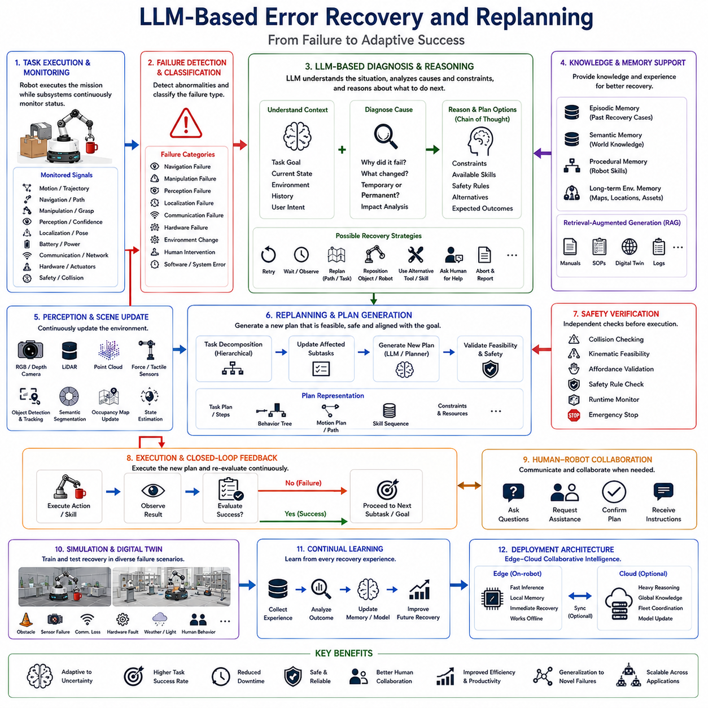{width="7.268055555555556in" height="7.268055555555556in"}

LLM 기반 오류 복구(Error Recovery)와 재계획(Replanning)은 실제 환경에서 동작하는 지능형 로봇의 핵심 기술이다. 자율주행, 물체 조작, 환경 인식, 작업 계획이 아무리 정교하더라도 실제 환경에서는 예상하지 못한 다양한 오류가 발생한다. 센서 잡음(Sensor Noise), 위치 추정 오차(Localization Drift), 장애물(Obstacle), 사람의 개입(Human Intervention), 통신 장애(Communication Failure), 하드웨어 이상(Hardware Failure), 환경 변화(Environment Change) 등은 기존 계획을 무력화할 수 있다. 따라서 로봇은 오류를 감지하고 스스로 새로운 계획을 생성하는 능력이 필요하다.

기존 로봇 시스템은 대부분 상태 기계(State Machine)나 예외 처리(Exception Handler)를 이용하여 오류를 처리하였다. 이러한 방식은 미리 정의된 상황에서는 안정적으로 동작하지만, 새로운 유형의 오류나 복합적인 문제에는 유연하게 대응하지 못한다. 반면 대규모 언어 모델(LLM, Large Language Model)은 오류의 원인을 의미적으로 이해하고, 환경을 분석하며, 새로운 해결 전략을 생성할 수 있으므로 기존 방식보다 훨씬 높은 적응성을 제공한다.

LLM 기반 오류 복구의 핵심은 단순히 "실패했다"는 사실을 인식하는 것이 아니라 "왜 실패했는가"를 이해하는 것이다. 로봇은 현재 환경이 어떻게 변화했는지, 어떤 제약 조건이 새롭게 발생했는지, 기존 계획이 왜 더 이상 유효하지 않은지를 분석하고, 이를 바탕으로 새로운 작업 계획을 생성한다. 즉, 실패를 단순한 예외가 아니라 새로운 상황(Context)으로 해석한다.

오류 복구의 첫 단계는 실패 감지(Failure Detection)이다. 이동 제어기(Motion Controller)는 경로 이탈을 감지하고, 자율주행(Navigation)은 경로 차단을 확인하며, 조작기(Manipulator)는 물체를 제대로 잡지 못했는지를 판단한다. 또한 인식 시스템(Perception System)은 객체 탐지 신뢰도(Object Detection Confidence)를 계산하고, 위치 추정(Localization)은 위치 오차를 측정하며, 배터리 관리 시스템(BMS)은 전력 부족을 감지한다.

오류가 감지되면 다음 단계는 오류 분류(Failure Classification)이다. 모든 오류를 동일하게 처리하지 않고 원인에 따라 구분한다. 이동 실패는 장애물, 지도 오류, 위치 오차, 목적지 접근 불가 등으로 나뉘며, 조작 실패는 물체 인식 오류, 그리퍼(Gripper) 미끄러짐, 물체 이동, 작업 공간 부족 등으로 구분된다. 통신 장애, 센서 이상, 소프트웨어 오류도 각각 다른 복구 절차를 요구한다.

LLM은 오류를 의미적으로 해석한다. 예를 들어 단순히 "물체를 잡지 못했다."가 아니라 "다른 물체가 목표를 가리고 있었으며, 조명이 어두워 인식 정확도가 떨어졌고, 접근 중 사람이 물체를 이동시켰다."와 같이 원인을 종합적으로 분석한다. 이러한 의미 기반 진단(Semantic Diagnosis)은 이후의 재계획 품질을 크게 향상시킨다.

문맥(Context)은 오류 복구에서 매우 중요한 요소이다. 같은 집기 실패라도 깨지기 쉬운 유리컵(Glass Cup)과 무거운 산업용 부품(Industrial Component)은 서로 다른 복구 전략이 필요하다. LLM은 물체의 특성(Property), 작업 목적(Task Goal), 주변 환경(Environment)을 함께 고려하여 가장 적합한 해결 방법을 선택한다.

LLM은 일시적인 오류와 영구적인 오류를 구분한다. 잠시 사람이 지나가거나 통신이 끊긴 경우에는 기다리거나 재시도(Retry)하면 해결될 가능성이 높다. 반면 장비 고장, 배터리 부족, 작업 공간 접근 불가와 같은 문제는 단순 재시도가 아니라 새로운 계획(Replanning)이 필요하다.

재계획은 단순 반복과 다르다. 기존 시스템은 실패한 행동을 그대로 다시 수행하는 경우가 많았지만, LLM은 현재 환경을 다시 분석하여 새로운 경로를 찾거나, 다른 접근 방향을 선택하거나, 방해물을 먼저 이동시키는 등 전략 자체를 변경한다. 따라서 동일한 오류가 반복될 가능성이 크게 줄어든다.

LLM은 작업을 계층적으로 분해(Task Decomposition)한다. 전체 작업을 여러 개의 하위 작업(Subtask)으로 나누기 때문에 특정 단계에서 오류가 발생하더라도 전체 작업을 처음부터 다시 시작하지 않는다. 문제가 발생한 하위 작업만 수정하고 나머지 작업은 그대로 유지하므로 효율성이 크게 향상된다.

메모리(Memory)는 오류 복구 성능을 크게 향상시킨다. 에피소드 메모리(Episodic Memory)는 과거의 성공 및 실패 사례를 저장하며, 의미 메모리(Semantic Memory)는 물체 특성과 일반 지식을 제공한다. 절차 메모리(Procedural Memory)는 로봇 기술(Skill)을 저장하고, 장기 환경 메모리(Long-Term Environmental Memory)는 건물 구조, 충전기 위치, 제한 구역 등을 기억하여 복구 계획에 활용된다.

검색 증강 생성(RAG, Retrieval-Augmented Generation)은 오류 복구에서도 매우 유용하다. 유지보수 매뉴얼(Maintenance Manual), 운영 절차(Standard Operating Procedure), 디지털 트윈(Digital Twin), 설비 문서(Document), 과거 작업 로그(Log)를 검색하여 현재 오류와 가장 유사한 사례를 찾아 새로운 해결 방법을 생성할 수 있다.

인식 시스템은 복구 과정에서도 계속 환경을 갱신한다. 카메라(Camera)는 새로운 장애물과 사람을 인식하고, 깊이 센서(Depth Sensor)는 접근 가능성을 분석하며, 라이다(LiDAR)는 새로운 지도(Map)를 생성한다. 힘 센서(Force Sensor)는 집기 성공 여부를 확인하며, 이러한 모든 정보는 재계획 과정에 지속적으로 반영된다.

장면 추론(Scene Reasoning)은 오류 복구에서 중요한 역할을 한다. 목표 물체가 원래 위치에 없으면 주변 선반(Shelf), 상자(Container), 작업대(Workbench), 운반 카트(Cart), 사람 근처 등을 후보 위치로 추론한다. 단순한 객체 탐색보다 훨씬 높은 성공률을 제공하는 이유가 여기에 있다.

어포던스(Affordance) 추론도 함께 사용된다. 이동 가능한 경로가 막혔는지, 현재 그리퍼가 물체를 잡을 수 있는지, 배터리 상태로 장거리 이동이 가능한지 등을 평가하여 실제 수행 가능한 행동만 선택한다. 의미 기반 계획과 물리적 실행 가능성을 동시에 고려하는 것이 특징이다.

최근에는 사고의 연쇄(CoT, Chain of Thought)를 오류 복구에 적용하는 연구가 활발하다. LLM은 즉시 해결책을 생성하지 않고 먼저 작업 목표, 현재 상태, 실패 원인, 환경 변화, 사용 가능한 기술(Skill), 안전 규칙(Safety Rule), 대안(Alternative)을 단계적으로 추론한 후 최적의 복구 계획을 생성한다.

오류 복구는 폐루프 제어(Closed-Loop Execution)로 수행된다. 새로운 행동을 수행한 후 센서를 이용하여 결과를 확인하고, 다시 환경을 분석한 후 다음 행동을 결정한다. 즉, 복구 과정 자체도 지속적인 피드백(Feedback)을 이용하여 동적으로 수정된다.

사람과 협업(Human-Robot Collaboration)하는 환경에서는 사람의 도움도 적극적으로 활용한다. 로봇은 "물체 위치를 알려주세요.", "문을 열어 주시겠습니까?", "현재 작업을 계속 진행해도 될까요?"와 같이 자연어로 질문하여 필요한 정보를 얻거나 작업 허가를 받을 수 있다. LLM은 이러한 대화 기반 복구(Dialogue-Based Recovery)를 자연스럽게 수행한다.

산업용 제조 환경에서는 설비 점검, 생산 계획 변경, 자재 부족(Material Shortage), 작업 순서 변경 등으로 인해 지속적인 재계획이 필요하다. LLM은 생산 목표를 유지하면서 작업 순서를 변경하거나 대체 설비를 선택하여 생산성을 최대한 유지하도록 계획을 수정한다.

물류 창고(Warehouse)에서는 재고 위치 변경, 통로 혼잡, 팔레트 이동, 충전기 사용 중 등의 상황이 자주 발생한다. LLM은 이러한 환경 변화를 분석하여 새로운 경로를 생성하고 작업 우선순위를 변경하며, 여러 작업을 동시에 최적화할 수 있다.

시설 점검(Inspection Robot)에서는 날씨(Weather), 조명(Lighting), 센서 오염, 접근 제한, 장비 진동 등이 검사에 영향을 준다. LLM은 점검 순서를 변경하거나 다른 센서를 활용하거나, 접근 가능한 설비부터 먼저 검사하는 방식으로 작업을 계속 수행한다.

의료 로봇(Healthcare Robot)은 환자의 안전이 가장 중요하다. 약품 부족, 엘리베이터 고장, 병실 이동, 응급 상황이 발생하면 기존 작업보다 환자의 안전을 우선하여 새로운 계획을 생성하고 의료진에게 현재 상황을 설명한다.

건설 현장(Construction Site)은 작업 환경이 지속적으로 변한다. 새로운 구조물이 설치되고 장비가 이동하며 공사 구역이 변경된다. LLM은 이러한 변화를 반영하여 검사 경로, 운반 계획, 자재 이동 순서를 계속 수정한다.

농업 로봇(Agricultural Robot)은 날씨, 작물 성장, 지형 변화, 동물 이동, 관개 상태에 따라 작업 계획을 변경해야 한다. LLM은 현재 환경을 분석하여 수확 순서, 방제 구역, 이동 경로 등을 실시간으로 재계획한다.

소프트웨어 오류(Software Failure)도 의미 기반으로 분석할 수 있다. ROS 서비스 오류(Service Failure), API 예외(Exception), 동기화 문제(Synchronization Issue), 메모리 부족(Memory Shortage) 등의 로그(Log)를 분석하여 적절한 해결 방법을 제안할 수 있다.

다중 로봇(Multi-Robot) 시스템에서는 한 대의 로봇 오류가 전체 작업에 영향을 미친다. LLM은 다른 로봇에게 작업을 재할당(Task Reallocation)하거나 자원을 공유(Resource Sharing)하고 전체 작업 일정을 다시 조정하여 시스템 전체의 효율성을 유지한다.

최근에는 엣지(Edge)와 클라우드(Cloud)를 함께 사용하는 계층형 복구 구조도 많이 사용된다. 로컬 SLM(Small Language Model)은 즉각적인 오류 분석과 단기 복구를 수행하고, 클라우드 LLM은 근본 원인 분석(Root Cause Analysis), 장기 계획(Long-Horizon Planning), 다중 로봇 협업 등을 수행한다.

시뮬레이션(Simulation)은 오류 복구 학습에서 매우 중요한 역할을 한다. 아이작 심(Isaac Sim), 디지털 트윈(Digital Twin), 가제보(Gazebo) 등을 이용하여 장애물, 센서 고장, 통신 장애, 악천후, 장비 고장 등의 다양한 실패 상황을 대량으로 생성하고 학습할 수 있다.

로봇 전용 미세조정(Fine-Tuning)은 오류 복구 성능을 더욱 향상시킨다. 일반 LLM은 로봇의 오류 코드(Error Code), 센서 상태, ROS 로그, 산업 장비 구조를 충분히 이해하지 못하기 때문에 로봇 데이터로 추가 학습하면 훨씬 정확한 오류 분석이 가능해진다.

그러나 안전(Safety)은 항상 최우선이다. LLM이 생성한 복구 계획은 직접 실행되지 않는다. 모션 플래너(Motion Planner), 충돌 예측(Collision Prediction), 어포던스 분석(Affordance Estimation), 런타임 모니터(Runtime Monitor), 비상 정지(Emergency Stop), 규칙 기반 안전 검사(Rule-Based Safety Check)가 먼저 검증한 후 실제 로봇에서 실행된다.

오류 복구 성능 평가는 일반 언어 모델과 다르다. 복구 성공률(Recovery Success Rate), 작업 완료율(Task Completion Rate), 재계획 시간(Replanning Time), 자원 사용량(Resource Consumption), 사람의 개입 횟수(Human Intervention), 안전성(Safety Compliance), 작업 연속성(Task Continuity) 등을 종합적으로 평가한다.

불확실성(Uncertainty) 처리도 중요한 연구 분야이다. 센서 정보가 불완전하거나 모호한 경우 잘못된 오류 진단이 이루어질 수 있다. 최근에는 베이지안 추론(Bayesian Inference), 확률 기반 계획(Probabilistic Planning), 신뢰도 추정(Confidence Estimation)을 함께 사용하여 더욱 안정적인 오류 복구를 수행한다.

향후에는 세계 모델(World Model)을 이용한 예측 기반 오류 복구가 발전할 것으로 예상된다. 오류가 발생한 후 대응하는 것이 아니라 미래의 장비 고장, 장애물 이동, 배터리 부족 등을 미리 예측하여 사전에 작업 계획을 수정하는 예방적 복구(Proactive Recovery)가 가능해질 것이다.

지속적 학습(Continual Learning)도 중요한 발전 방향이다. 로봇은 운영 과정에서 발생한 다양한 오류와 복구 사례를 지속적으로 학습하여 시간이 지날수록 더욱 높은 복구 성공률을 갖게 된다.

결국 LLM 기반 오류 복구와 재계획은 기존의 고정된 예외 처리 방식을 넘어 의미 기반 추론(Semantic Reasoning), 환경 이해(Scene Understanding), 어포던스 분석(Affordance Reasoning), 메모리(Memory), 검색 증강 생성(RAG), 멀티모달 인식(Multimodal Perception), 세계 모델(World Model), 지속적 학습(Continual Learning)을 통합하여 실제 환경에서 발생하는 다양한 실패를 스스로 이해하고 해결하는 차세대 물리 AI(Physical AI)의 핵심 기술로 자리잡고 있다.

## 3.9 Multi-Turn Human-Robot Dialogue (with Code)

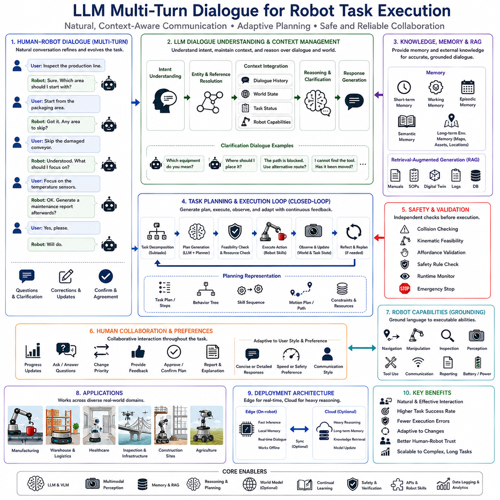{width="7.268055555555556in" height="7.268055555555556in"}

LLM 기반 다중 턴 대화(Multi-Turn Dialogue)는 지능형 로봇이 단순한 명령 수행 장치를 넘어 사람과 지속적으로 협업하는 인지 시스템(Cognitive System)으로 발전하기 위한 핵심 기술이다. 기존 로봇은 사용자가 한 번에 완전한 명령을 입력한다고 가정했지만, 실제 환경에서는 작업 목표가 대화를 통해 점진적으로 구체화된다. 사람은 작업 중간에 새로운 요구사항을 추가하고, 우선순위를 변경하며, 질문을 하고, 환경 변화에 따라 계획을 수정한다. LLM은 이러한 연속적인 대화를 이해하고 작업을 지속적으로 조정할 수 있다.

사람의 대화는 항상 문맥(Context)에 의존한다. 예를 들어 "생산 라인을 점검해."라는 명령 이후 "포장 구역부터 시작하고.", "고장 난 컨베이어는 제외해.", "온도 센서를 집중적으로 확인해.", "점검 후 보고서를 작성해."와 같은 추가 명령이 이어질 수 있다. 로봇은 각각의 명령을 독립적으로 처리하는 것이 아니라 이전 대화와 연결하여 하나의 작업(Task)으로 통합해야 한다.

단일 명령 처리(Single-Turn Command)와 달리 다중 턴 대화는 지속적인 문맥 관리(Context Management)가 필요하다. 예를 들어 사용자가 "검사 카메라를 가져와."라고 말한 후 "그것을 충전기에 올려놔."라고 말하면 "그것(It)"이 검사 카메라를 의미한다는 것을 이해해야 한다. 이러한 대명사(Pronoun) 해석과 참조 해결(Reference Resolution)은 LLM의 중요한 장점 중 하나이다.

대화 메모리(Dialogue Memory)는 단순한 대화 기록만 저장하는 것이 아니다. 로봇은 작업 진행 상태(Task Progress), 물체 위치(Object Location), 센서 정보(Sensor Data), 배터리 상태(Battery Status), 사람의 위치(Human Position), 환경 변화(Environment Change) 등을 함께 기억한다. 따라서 대화는 언어 정보와 실제 환경 정보를 동시에 이용하여 진행된다.

작업 중심 대화(Task-Oriented Dialogue)는 일반 챗봇(Chatbot)과 다르다. 일반 대화에서는 정보 전달이 목적이지만, 로봇 대화에서는 사용자의 대화가 실제 이동(Navigation), 물체 조작(Manipulation), 검사(Inspection), 작업 순서(Task Scheduling)에 직접 영향을 준다. 따라서 생성되는 모든 응답은 실제 실행 가능성과 안전성(Safety)을 반드시 고려해야 한다.

다중 턴 대화의 첫 번째 단계는 사용자 의도(Intent Understanding)를 정확히 이해하는 것이다. 사람은 종종 불완전하거나 모호한 명령을 사용한다. 예를 들어 "장비를 옮겨."라는 명령만으로는 어떤 장비인지, 어디로 이동해야 하는지 알 수 없다. LLM은 즉시 작업을 수행하지 않고 "어떤 장비를 말씀하시나요?", "어디로 옮길까요?"와 같은 질문을 통해 필요한 정보를 확인한다.

이러한 명확화 대화(Clarification Dialogue)는 기존 로봇과 가장 큰 차이점이다. 기존 시스템은 정확한 명령이 입력되지 않으면 오류를 발생시키지만, LLM은 사람과 자연스럽게 대화하여 부족한 정보를 스스로 수집한다. 이는 사람과 사람 사이의 협업 방식과 매우 유사하다.

다중 턴 대화는 작업 변경(Task Modification)에도 매우 유용하다. 예를 들어 로봇이 검사 장비를 운반하는 중 사용자가 긴급 작업을 먼저 수행하도록 요청하면 LLM은 현재까지 완료된 작업, 남은 작업, 우선순위, 이동 거리 등을 종합적으로 분석하여 새로운 계획을 생성한다. 기존 작업을 단순히 취소하는 것이 아니라 가장 효율적인 방식으로 수정한다.

장시간 작업(Long-Horizon Task)에서는 다중 턴 대화가 더욱 중요하다. 생산 설비 점검, 창고 재고 관리, 병원 배송, 농업 모니터링, 건설 현장 관리 등은 수 시간 이상 지속될 수 있다. 작업 도중 관리자는 진행 상황을 확인하고 새로운 작업을 추가하거나 우선순위를 변경한다. LLM은 이러한 긴 작업 동안 전체 문맥을 유지하면서 자연스럽게 협업한다.

대화 메모리는 여러 계층으로 구성된다. 단기 메모리(Short-Term Memory)는 최근 대화를 기억하고, 작업 메모리(Working Memory)는 현재 수행 중인 작업과 미해결 질문을 저장한다. 에피소드 메모리(Episodic Memory)는 이전 작업 경험을 저장하며, 의미 메모리(Semantic Memory)는 시설 구조, 장비 정보, 작업 절차 등을 장기적으로 기억한다.

검색 증강 생성(RAG, Retrieval-Augmented Generation)은 대화 품질을 크게 향상시킨다. 사용자가 설비 매뉴얼, 유지보수 절차, 검사 기록, 운영 규정 등에 대해 질문하면 로봇은 내부 지식뿐 아니라 유지보수 문서(Maintenance Manual), 디지털 트윈(Digital Twin), 설비 데이터베이스(Database), 작업 이력(History)을 검색하여 보다 정확한 답변을 생성한다.

멀티모달 인식(Multimodal Perception)은 대화를 더욱 풍부하게 만든다. RGB 카메라(RGB Camera), 깊이 센서(Depth Sensor), 라이다(LiDAR), 촉각 센서(Tactile Sensor), 힘 센서(Force Sensor), 위치 추정(Localization), 객체 탐지(Object Detection)를 이용하여 현재 환경을 이해한 후 "통로를 막고 있는 것이 무엇인가?", "밸브에서 아직 누수가 발생하는가?"와 같은 질문에 실제 환경을 반영한 답변을 제공할 수 있다.

비전-언어 모델(VLM, Vision-Language Model)은 장면(Scene)을 자연어로 설명한다. 예를 들어 "작업대 아래에 공구함이 있으며, 오른쪽에 사람이 서 있다."와 같은 정보를 생성하면 LLM은 이를 현재 대화의 일부로 활용하여 더욱 정확한 작업 계획과 응답을 생성한다.

참조 해결(Reference Resolution)은 매우 중요한 기능이다. 사람은 "저 상자", "지난번 팔레트", "왼쪽 선반", "고장 난 기계"와 같은 표현을 자주 사용한다. LLM은 이전 대화와 현재 환경, 공간 정보(Spatial Information), 작업 기록(Task History)을 종합하여 정확한 대상을 찾아낸다.

모든 대화는 실제 로봇의 능력(Capability)에 기반해야 한다. 사용자가 현재 로봇이 수행할 수 없는 작업을 요청하면 LLM은 불가능한 이유를 설명하고 가능한 대안을 제시한다. 예를 들어 작업 범위를 벗어난 물체를 요청하면 접근 가능한 위치로 이동해 달라고 요청하거나 사람의 도움을 제안할 수 있다.

다중 턴 대화는 설명 가능성(Explainability)도 향상시킨다. 로봇은 현재 어떤 작업을 수행하고 있는지, 왜 이러한 경로를 선택했는지, 얼마나 시간이 걸리는지, 어떤 문제가 발생했는지를 사람에게 자연스럽게 설명할 수 있다. 이는 사람의 신뢰(Trust)를 높이고 협업 효율을 향상시킨다.

오류 복구(Error Recovery) 과정에서도 대화는 중요한 역할을 한다. 목표 물체를 찾지 못하거나 경로가 차단된 경우 로봇은 "검사 장비가 현재 위치에 없습니다. 다른 곳으로 이동했습니까?", "현재 통로가 막혀 있습니다. 우회 경로를 사용할까요?"와 같이 사람과 협의하여 새로운 작업 계획을 생성한다.

LLM은 반복적인 대화를 통해 사용자의 선호도(User Preference)도 학습할 수 있다. 어떤 사용자는 간단한 보고를 선호하고, 어떤 사용자는 상세한 설명을 요구한다. 어떤 사용자는 속도를 우선하고, 어떤 사용자는 안전을 더 중요하게 생각한다. LLM은 이러한 대화 패턴을 학습하여 개인 맞춤형 인터페이스를 제공할 수 있다.

작업 위임(Task Delegation)도 자연스럽게 이루어진다. 사용자는 세부 명령을 일일이 입력하지 않고 목표만 제시하면 된다. LLM은 이를 여러 개의 하위 작업(Subtask)으로 분해하고 중요한 단계마다 사용자와 대화하여 계획을 확인하면서 작업을 수행한다.

산업용 제조 환경에서는 생산 계획 변경, 설비 고장, 유지보수 일정, 검사 우선순위 등이 계속 바뀐다. LLM은 관리자의 새로운 지시를 대화를 통해 이해하고 기존 작업 계획을 수정하면서 생산성을 유지한다.

물류 창고(Warehouse)에서는 긴급 배송(Urgent Delivery), 재고 위치 변경(Inventory Relocation), 선반 변경(Storage Assignment), 다수의 AMR 협업(Fleet Coordination) 등이 자주 발생한다. 다중 턴 대화는 이러한 지속적인 운영 변경을 자연스럽게 지원한다.

의료 로봇(Healthcare Robot)은 환자 상태 변화, 약품 배송, 치료 우선순위 변경, 의료진의 추가 지시 등을 대화를 통해 처리한다. 의료 용어(Medical Terminology), 개인정보 보호(Privacy), 환자 안전(Safety)을 함께 고려하여 신뢰성 높은 협업을 수행한다.

시설 점검 로봇(Inspection Robot)은 이상 현상(Anomaly), 추가 측정 요청, 과거 점검 기록 비교, 유지보수 계획 등을 엔지니어와 지속적으로 대화하면서 점검 품질을 높일 수 있다.

건설 현장(Construction Site)은 구조물 설치, 장비 이동, 작업 순서 변경, 날씨 변화 등이 매우 빈번하다. 다중 턴 대화는 이러한 환경 변화에 맞추어 작업 계획을 지속적으로 수정하는 데 큰 장점을 가진다.

농업 로봇(Agricultural Robot)은 작물 상태(Crop Condition), 날씨(Weather), 관개(Irrigation), 병충해(Disease), 수확 계획(Harvesting Plan)을 농부와 지속적으로 대화하면서 작업을 수행할 수 있다.

감정 인식(Affective Communication)도 향후 중요한 기술이다. 산업용 로봇이 사람의 감정을 흉내 낼 필요는 없지만, 사용자의 긴급함(Urgency), 혼란(Confusion), 불만(Frustration), 만족(Satisfaction)을 언어적으로 이해하고 적절한 방식으로 응답하면 협업 품질이 크게 향상된다.

대화는 중간에 끊기거나 다른 주제로 전환될 수도 있다. LLM은 긴급 질문에 먼저 답변한 후 이전 작업 대화로 자연스럽게 돌아올 수 있으며, 여러 개의 대화 흐름을 동시에 관리할 수 있다. 이러한 능력은 실제 업무 환경에서 매우 중요하다.

작업 계획(Task Planning)과 대화(Dialogue)는 서로 긴밀하게 연결된다. 새로운 대화는 작업 계획을 수정하며, 작업 진행 상황은 다시 대화의 문맥이 된다. 따라서 언어(Language), 메모리(Memory), 인식(Perception), 계획(Planning), 실행(Execution)은 하나의 통합 인지 시스템으로 동작한다.

최근에는 엣지 로봇(Edge Robot)에 탑재되는 소형 언어 모델(SLM, Small Language Model)이 다중 턴 대화를 수행하기 시작하였다. 로컬에서 즉시 응답하고, 개인정보를 보호하며, 네트워크가 없는 환경에서도 대화를 유지할 수 있다. 복잡한 전략 수립이나 긴 문서 생성은 필요할 때만 클라우드 LLM이 담당하는 계층형 AI 구조가 일반화되고 있다.

검색 시스템(RAG)은 기업별 용어(Terminology), 운영 절차(Standard Operating Procedure), 설비 문서(Document), 소프트웨어 저장소(Repository), 시설 지도(Map)를 대화에 통합하여 조직 맞춤형 응답을 생성한다. 따라서 일반적인 답변이 아니라 실제 기업 환경에 맞는 전문적인 대화를 제공할 수 있다.

그러나 안전(Safety)은 항상 최우선이다. LLM의 대화가 직접 로봇을 제어하지는 않는다. 모션 플래너(Motion Planner), 충돌 예측(Collision Prediction), 어포던스 분석(Affordance Estimation), 런타임 모니터(Runtime Monitor), 비상 정지(Emergency Stop), 안전 제어기(Safety Controller)가 모든 행동을 검증한 후 실제 실행을 허가한다.

다중 턴 대화의 평가는 일반 챗봇과 다르다. 문맥 유지(Context Consistency), 참조 해결(Reference Resolution), 명령 수행 성공률(Task Success Rate), 명확화 대화(Clarification Effectiveness), 사용자 만족도(User Satisfaction), 응답 지연(Response Latency), 작업 연속성(Task Continuity), 협업 효율(Collaboration Efficiency) 등을 종합적으로 평가한다.

향후에는 세계 모델(World Model), 멀티모달 인식(Multimodal Perception), 외부 메모리(External Memory), 지속적 학습(Continual Learning), 검색 증강 생성(RAG), 장면 이해(Scene Understanding), 감정 기반 상호작용(Affective Interaction), 예측 계획(Predictive Planning), 다중 에이전트 협업(Multi-Agent Collaboration)이 모두 통합된 차세대 대화형 물리 AI(Physical AI)가 등장할 것으로 예상된다.

결국 LLM 기반 다중 턴 대화는 단순한 음성 인터페이스를 넘어 사람과 로봇이 장기간 함께 협업하기 위한 핵심 기술이다. 문맥(Context), 메모리(Memory), 의미 추론(Semantic Reasoning), 멀티모달 인식(Multimodal Perception), 작업 계획(Task Planning), 설명 가능성(Explainability), 검색 증강 생성(RAG), 지속적 학습(Continual Learning), 안전 검증(Safety Verification)을 하나의 통합 인지 시스템으로 결합함으로써, 실제 산업·물류·의료·건설·농업 환경에서 사람과 자연스럽게 협력하는 차세대 물리 AI의 핵심 기반 기술로 발전하고 있다.

## 3.10 Real-Time LLM Inference Optimization (with Code)

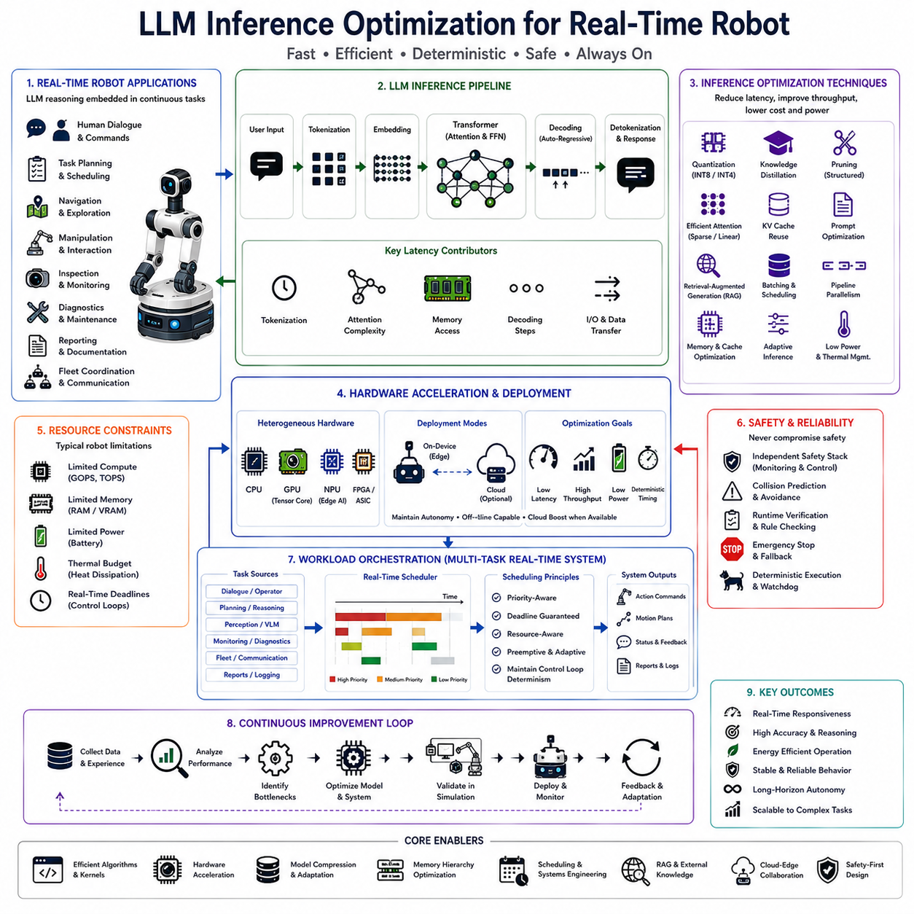{width="7.268055555555556in" height="7.268055555555556in"}

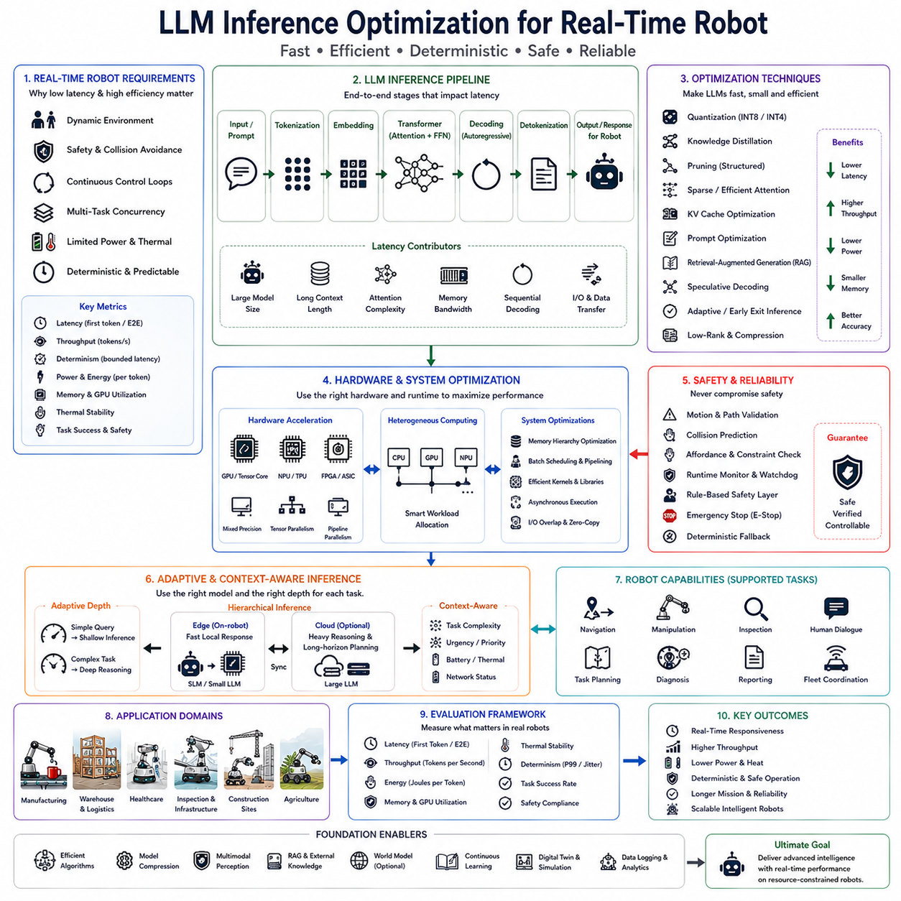{width="7.268055555555556in" height="7.268055555555556in"}

실시간 로봇(Real-Time Robot)을 위한 대규모 언어 모델(LLM, Large Language Model) 추론 최적화(Inference Optimization)는 현대 물리 AI(Physical AI)의 핵심 기술이다. 최신 LLM은 뛰어난 자연어 이해(Natural Language Understanding), 추론(Reasoning), 계획(Planning) 능력을 제공하지만, 연산량과 메모리 요구량이 매우 크기 때문에 배터리 기반 자율주행 로봇에 그대로 적용하기는 어렵다. 따라서 제한된 전력(Power), 메모리(Memory), 발열(Thermal Budget), 실시간성(Real-Time)을 만족하면서도 높은 추론 성능을 유지하는 최적화 기술이 반드시 필요하다.

실시간 로봇은 클라우드 AI와 근본적으로 다른 요구사항을 가진다. 클라우드에서는 하나의 요청을 수 초 동안 처리해도 문제가 없지만, 로봇은 자율주행(Navigation), 위치 추정(Localization), 센서 융합(Sensor Fusion), 충돌 회피(Collision Avoidance), 작업 계획(Task Planning), 제어(Control), 안전 모니터링(Safety Monitoring)을 동시에 수행해야 한다. 따라서 언어 모델은 다른 모든 시스템과 연산 자원을 공유하면서도 일정한 응답 시간을 유지해야 한다.

지연 시간(Latency)은 가장 중요한 성능 지표이다. 로봇은 움직이는 사람, 갑작스러운 장애물, 이동하는 물체, 긴급 작업 요청 등 변화하는 환경에 즉시 대응해야 한다. 언어 모델의 응답이 늦어지면 이미 환경이 바뀐 후 잘못된 계획을 실행할 가능성이 높아진다. 따라서 추론 속도는 단순한 성능 문제가 아니라 안전(Safety)과 직접 연결된다.

LLM 추론은 여러 단계로 이루어진다. 먼저 사용자의 문장을 토큰(Token)으로 분리하고(Tokenization), 이를 임베딩(Embedding) 벡터로 변환한 후, 트랜스포머(Transformer)의 어텐션(Attention)과 피드포워드 네트워크(Feed-Forward Network)를 통과한다. 이후 생성된 토큰을 다시 문장으로 변환(Detokenization)하여 작업 계획기로 전달한다. 따라서 전체 파이프라인(Pipeline)을 최적화해야 실질적인 응답 속도를 높일 수 있다.

처리량(Throughput)도 중요한 요소이다. 실제 로봇은 사람과의 대화뿐 아니라 작업 계획, 센서 분석, 상태 보고, 자율주행, 진단 시스템 등 여러 모듈이 동시에 언어 모델을 사용할 수 있다. 따라서 여러 요청을 동시에 빠르게 처리할 수 있는 높은 처리량이 요구된다.

실시간 로봇에서는 결정적 실행(Deterministic Execution)이 중요하다. 평균 응답 속도가 빠른 것보다 항상 일정한 시간 안에 응답하는 것이 더 중요하다. 제어기(Control Loop), 모션 플래너(Motion Planner), 안전 시스템(Safety System)은 예측 가능한 실행 시간을 요구하므로 추론 시간의 변동성을 최소화해야 한다.

트랜스포머(Transformer) 구조는 대량의 행렬 곱(Matrix Multiplication), 어텐션 계산, 활성화 함수(Activation Function), 메모리 접근을 반복 수행한다. 이러한 구조는 뛰어난 성능을 제공하지만 연산량이 매우 크므로 엣지 로봇(Edge Robot)에 맞게 최적화하는 연구가 활발히 진행되고 있다.

모델 압축(Model Compression)은 가장 널리 사용되는 최적화 방법이다. 양자화(Quantization)는 FP16이나 FP32 대신 INT8, INT6, INT4와 같은 저정밀도 정수(Integer)를 사용하여 메모리 사용량과 연산량을 크게 줄인다. 최신 GPU와 AI 가속기(AI Accelerator)는 이러한 저정밀 연산을 하드웨어 수준에서 지원하여 추론 속도를 크게 향상시킨다.

지식 증류(Knowledge Distillation)는 대형 모델(Teacher Model)의 지식을 작은 학생 모델(Student Model)에게 전달하는 기술이다. 학생 모델은 훨씬 적은 파라미터(Parameter)만 사용하면서도 대부분의 추론 능력을 유지할 수 있어 실시간 로봇에 매우 적합하다.

가지치기(Pruning)는 중요하지 않은 뉴런(Neuron), 어텐션 헤드(Attention Head), 피드포워드 계층을 제거하여 모델을 경량화한다. 불필요한 계산을 줄이면서도 핵심 추론 능력을 유지할 수 있어 연산 효율이 크게 향상된다.

어텐션 최적화(Attention Optimization)도 중요한 연구 분야이다. 일반적인 셀프 어텐션(Self-Attention)은 입력 길이가 길어질수록 연산량이 제곱으로 증가한다. 이를 해결하기 위해 희소 어텐션(Sparse Attention), 로컬 어텐션(Local Attention), 슬라이딩 윈도우(Sliding Window), 선형 어텐션(Linear Attention) 등이 개발되어 긴 문맥(Long Context)에서도 빠른 추론이 가능해지고 있다.

키-값 캐시(KV Cache, Key-Value Cache)는 자동회귀(Auto-Regressive) 생성 과정에서 이전 계산 결과를 저장하여 동일한 계산을 반복하지 않도록 한다. 이를 통해 응답 생성 속도를 크게 높이고 GPU 사용률도 감소시킬 수 있다.

프롬프트 최적화(Prompt Optimization)는 불필요한 토큰(Token)을 줄이는 기술이다. 시스템 프롬프트(System Prompt), 환경 정보(Environment Context), 작업 목표(Task Goal), 안전 규칙(Safety Rule)을 계층적으로 구성하여 반복되는 정보를 최소화하면 전체 추론 시간이 감소한다.

검색 증강 생성(RAG, Retrieval-Augmented Generation)은 모델 내부에 모든 정보를 저장하지 않고 필요할 때만 유지보수 문서(Maintenance Manual), 디지털 트윈(Digital Twin), 작업 절차(Standard Operating Procedure), 설비 데이터베이스(Database)를 검색하여 사용한다. 이는 프롬프트 길이를 줄이고 추론 정확도도 동시에 향상시킨다.

메모리 계층(Memory Hierarchy) 최적화도 매우 중요하다. GPU 레지스터(Register), 공유 메모리(Shared Memory), 캐시(Cache), 고대역폭 메모리(HBM), 시스템 메모리(System Memory)를 효율적으로 사용하여 메모리 이동을 최소화하면 GPU 계산 성능을 극대화할 수 있다.

배치 스케줄링(Batch Scheduling)은 여러 개의 언어 요청을 동시에 처리하여 GPU 활용도를 높인다. 다만 로봇에서는 응답 속도가 중요하므로 배치 크기(Batch Size)와 응답 지연 사이의 균형을 유지해야 한다.

파이프라인 병렬화(Pipeline Parallelism)는 토큰화(Tokenization), 임베딩(Embedding), 트랜스포머 계산, 출력 생성 등을 동시에 수행하여 전체 응답 시간을 단축한다. 여러 하드웨어가 각 단계를 동시에 수행함으로써 효율을 크게 높일 수 있다.

하드웨어 가속(Hardware Acceleration)은 실시간 추론의 핵심이다. GPU, NPU(Neural Processing Unit), TPU(Tensor Processing Unit), FPGA(Field Programmable Gate Array), Tensor Core와 같은 AI 전용 하드웨어는 트랜스포머 연산을 일반 CPU보다 훨씬 빠르고 전력 효율적으로 수행한다.

현대의 엣지 AI 플랫폼은 CPU, GPU, NPU를 함께 사용하는 이기종 컴퓨팅(Heterogeneous Computing)을 채택하고 있다. 각 프로세서의 특성에 맞게 작업을 분배하면 전체 시스템 성능을 극대화할 수 있다.

전력 최적화(Power Optimization)는 이동 로봇에서 매우 중요하다. AI 추론이 소비하는 전력이 증가하면 모터(Motor), 센서(Sensor), 통신 장치(Communication), 조명(Lighting)에 사용할 수 있는 전력이 감소한다. 따라서 토큰당 에너지 소비(Energy per Token)를 최소화하는 것이 장시간 운용(Long Mission)의 핵심이다.

발열 관리(Thermal Management)도 중요한 문제이다. 지속적인 LLM 추론은 많은 열을 발생시키며, 일정 온도를 초과하면 GPU는 자동으로 클럭(Clock)을 낮추는 스로틀링(Thermal Throttling)을 수행한다. 따라서 작업 스케줄링과 동적 주파수 조절(Dynamic Frequency Scaling)을 이용하여 장시간 안정적인 성능을 유지해야 한다.

적응형 추론(Adaptive Inference)은 최근 가장 주목받는 기술이다. 단순한 질문에는 간단한 추론만 수행하고, 복잡한 작업 계획이나 오류 복구가 필요한 경우에만 깊은 추론을 수행한다. 이를 통해 평균 연산량을 크게 줄일 수 있다.

계층형 언어 모델(Hierarchical Language Architecture)은 실시간 로봇에 매우 적합하다. 로컬의 소형 언어 모델(SLM, Small Language Model)은 즉각적인 대화와 작업 계획을 수행하고, 클라우드의 대형 언어 모델(LLM)은 장기 전략(Long-Horizon Planning), 소프트웨어 개발, 복잡한 진단을 담당한다. 이 구조는 성능과 응답 속도를 동시에 만족시킨다.

작업별 특화 모델(Task-Specific Model)도 효율성을 높인다. 하나의 범용 모델 대신 자율주행, 조작, 검사, 유지보수, 사람과의 대화 등 기능별로 특화된 모델을 사용하면 추론 시간이 감소하고 정확도도 향상된다.

멀티모달(Multimodal) 처리 역시 최적화에 기여한다. 비전 인코더(Vision Encoder), 객체 탐지(Object Detection), 의미 지도(Semantic Map), 위치 추정(Localization) 등이 먼저 환경을 분석하고, LLM은 이미 구조화된 정보를 이용하여 추론하기 때문에 전체 계산량이 감소한다.

작업 계획(Task Planning)은 기하학적 경로 계산과 의미 추론을 분리한다. 경로 생성(Path Planning), 충돌 검사(Collision Checking), 역기구학(Inverse Kinematics)은 기존 로봇 알고리즘이 수행하고, LLM은 작업 분해(Task Decomposition), 의미 이해(Semantic Reasoning), 사용자 대화(Dialogue)를 담당한다. 이러한 역할 분리는 연산 효율을 크게 향상시킨다.

실시간 운영체제(RTOS)나 ROS 2 기반 시스템에서는 언어 모델이 다른 실시간 제어 작업을 방해하지 않도록 우선순위 기반 스케줄링(Priority Scheduling)을 수행한다. 안전 제어와 모터 제어는 항상 가장 높은 우선순위를 유지하며, 언어 모델은 남는 연산 자원을 효율적으로 활용한다.

클라우드-엣지 협업(Cloud-Edge Collaboration)은 현실적인 최적화 방법이다. 즉각적인 판단은 로컬에서 수행하고, 복잡한 분석이나 디지털 트윈(Digital Twin) 기반 시뮬레이션, 플릿(Fleet) 관리, 장기 계획은 클라우드에서 처리한다. 네트워크가 끊겨도 로컬 SLM만으로 기본적인 자율성을 유지할 수 있다.

도메인 특화 미세조정(Fine-Tuning)은 추론 효율도 향상시킨다. 산업용 로봇 전용 모델은 공장 용어, ROS API, 설비 구조를 이미 이해하고 있으므로 불필요한 추론 과정이 줄어들고 응답도 더욱 정확해진다.

지속적 학습(Continual Learning)은 시간이 지날수록 추론 효율을 높인다. 반복되는 작업, 작업자의 선호도, 자주 사용하는 명령, 시설 구조를 학습함으로써 동일한 작업에 필요한 계산량이 점차 감소한다.

시뮬레이션(Simulation)은 추론 최적화 연구에서 매우 중요한 역할을 한다. 디지털 트윈(Digital Twin)과 아이작 심(Isaac Sim)을 이용하면 지연 시간(Latency), 처리량(Throughput), GPU 사용률(Utilization), 전력 소비(Power Consumption), 발열(Thermal Behavior)을 실제 환경과 유사하게 측정하고 최적화할 수 있다.

제조 공장에서는 실시간 추론이 생산성(Productivity)에 직접 연결된다. 작업 지시 해석, 품질 검사(Quality Inspection), 유지보수 지원, 보고서 생성 등을 빠르게 수행하면서도 생산 라인의 주기 시간(Cycle Time)을 방해하지 않아야 한다.

물류 창고에서는 배송 요청, 재고 관리, 다중 AMR 협업, 충전 관리, 장애물 회피 등이 동시에 발생한다. 최적화된 추론은 이러한 다양한 요청을 낮은 지연 시간으로 처리하여 전체 물류 효율을 향상시킨다.

의료 로봇은 환자와의 자연스러운 대화와 실시간 이동을 동시에 수행해야 한다. 약품 배송, 환자 안내, 상태 모니터링 등을 지연 없이 처리하기 위해서는 매우 효율적인 추론 구조가 필요하다.

시설 점검 로봇은 점검 결과 분석, 이상 탐지(Anomaly Detection), 유지보수 문서 검색, 작업자 질문 응답을 수행하면서도 동시에 자율주행과 센서 처리를 계속해야 한다. 따라서 추론 최적화는 점검 효율을 결정하는 핵심 요소가 된다.

그러나 추론 속도가 빨라진다고 해서 안전 검증(Safety Verification)을 생략해서는 안 된다. 모션 플래너(Motion Planner), 충돌 예측(Collision Prediction), 어포던스 분석(Affordance Estimation), 런타임 모니터(Runtime Monitor), 비상 정지(Emergency Stop)는 LLM과 독립적으로 동작하며 모든 행동을 검증한 후 실행을 허가한다.

실시간 추론 성능은 단순한 토큰 생성 속도(Tokens per Second)만으로 평가하지 않는다. 첫 토큰 생성 시간(First Token Latency), 전체 응답 시간(End-to-End Latency), 처리량(Throughput), 메모리 사용량(Memory Utilization), GPU 활용률(GPU Utilization), 전력 소비(Power Consumption), 발열 안정성(Thermal Stability), 작업 성공률(Task Success Rate), 장시간 운용 안정성(Long-Term Reliability)을 함께 평가해야 한다.

향후에는 적응형 트랜스포머(Adaptive Transformer), 멀티모달 인식(Multimodal Perception), 검색 증강 생성(RAG), 세계 모델(World Model), 외부 메모리(External Memory), 이기종 하드웨어(Heterogeneous Hardware), 예측 스케줄링(Predictive Scheduling), 지속적 학습(Continual Learning)이 통합된 차세대 실시간 추론 구조가 등장할 것으로 예상된다. 환경 변화, 배터리 상태, 발열, 작업 중요도에 따라 추론 구조가 스스로 최적화되는 지능형 시스템이 핵심 기술이 될 것이다.

결국 LLM 추론 최적화는 모델 압축(Model Compression), 하드웨어 가속(Hardware Acceleration), 적응형 추론(Adaptive Inference), 계층형 AI(Hierarchical AI), 멀티모달 처리(Multimodal Processing), 효율적인 메모리 관리(Memory Management), 검색 증강 생성(RAG), 클라우드-엣지 협업(Cloud-Edge Collaboration), 결정적 실행(Deterministic Execution), 안전 검증(Safety Verification)을 하나의 통합 아키텍처로 결합하여 제한된 하드웨어에서도 실시간으로 동작하는 차세대 물리 AI(Physical AI)의 핵심 기반 기술로 자리잡고 있다.
