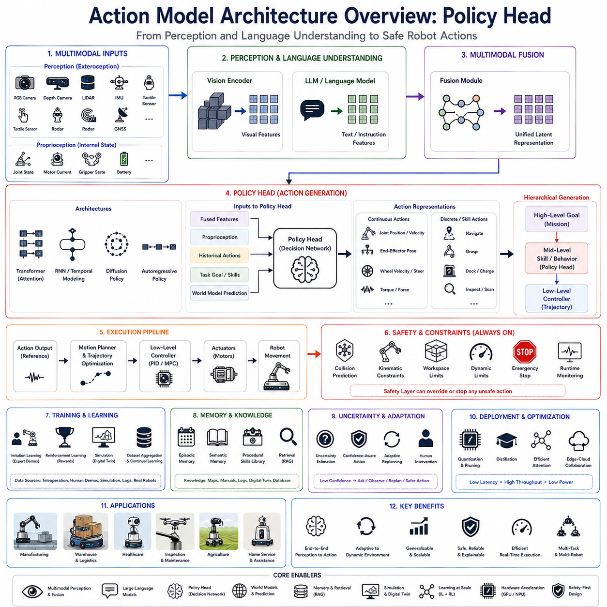
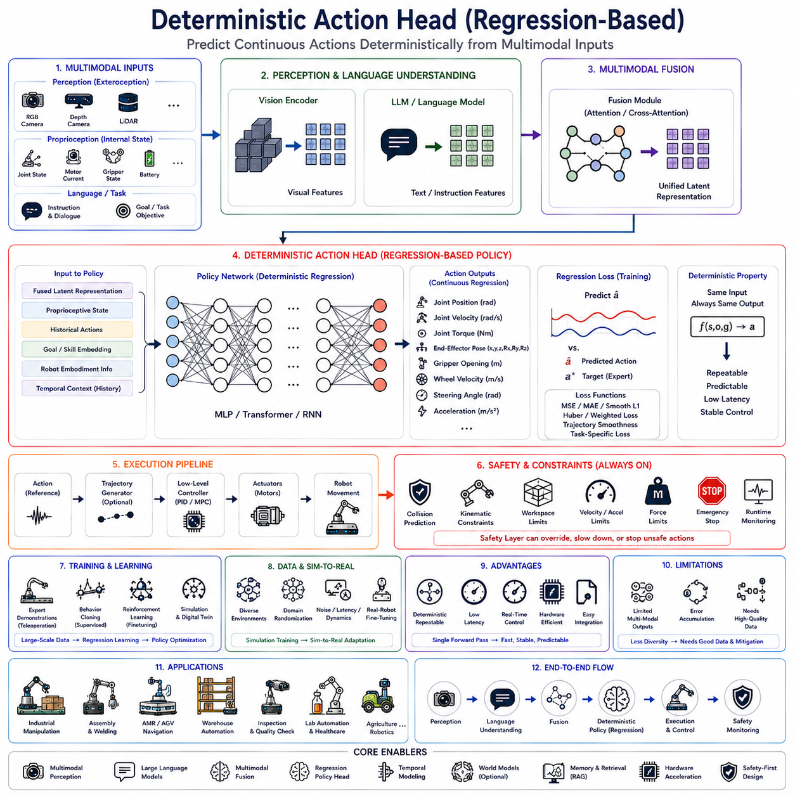
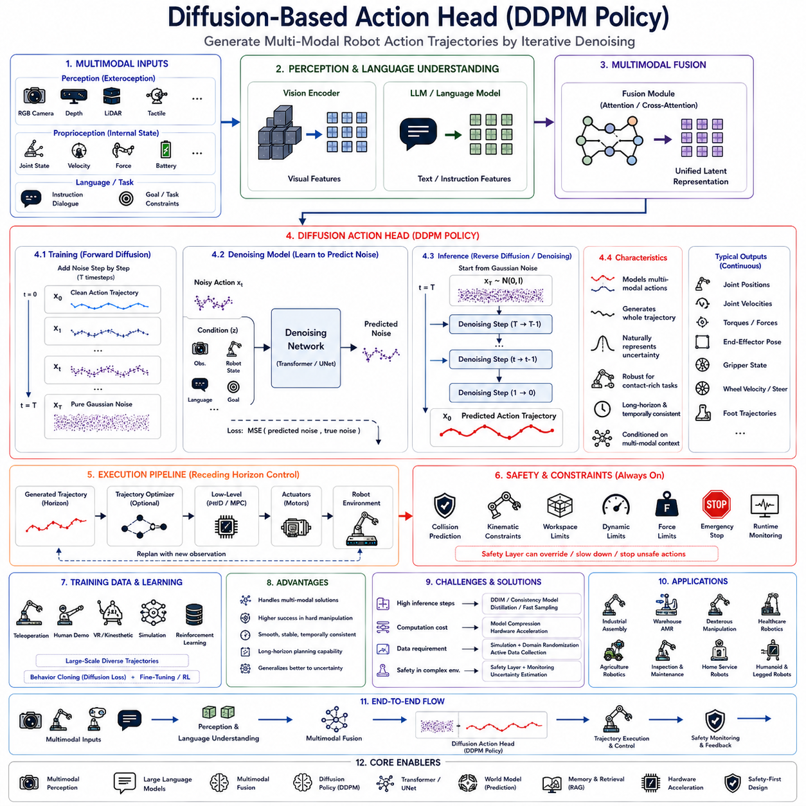
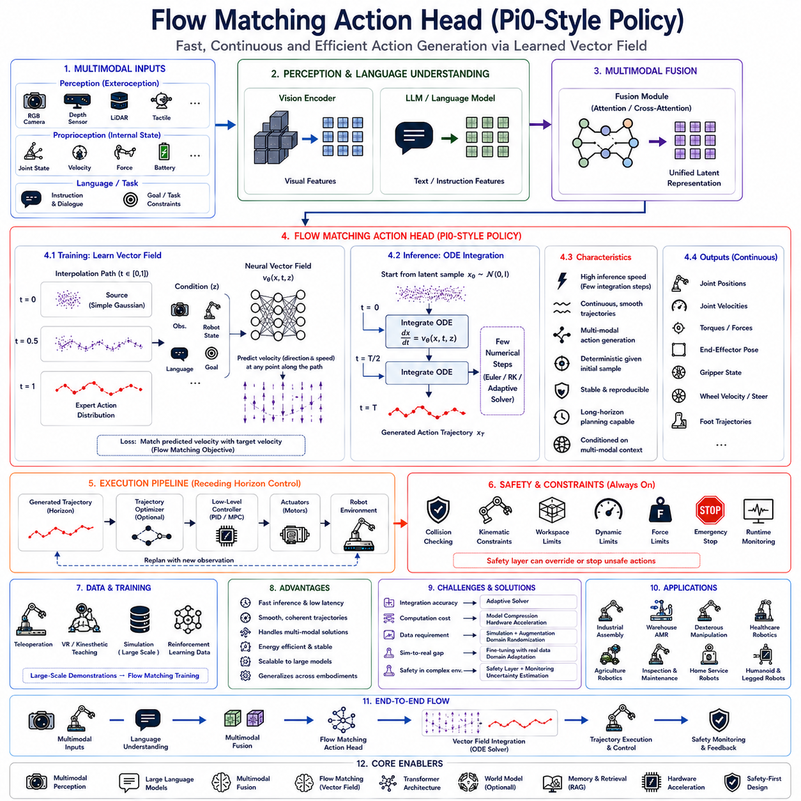
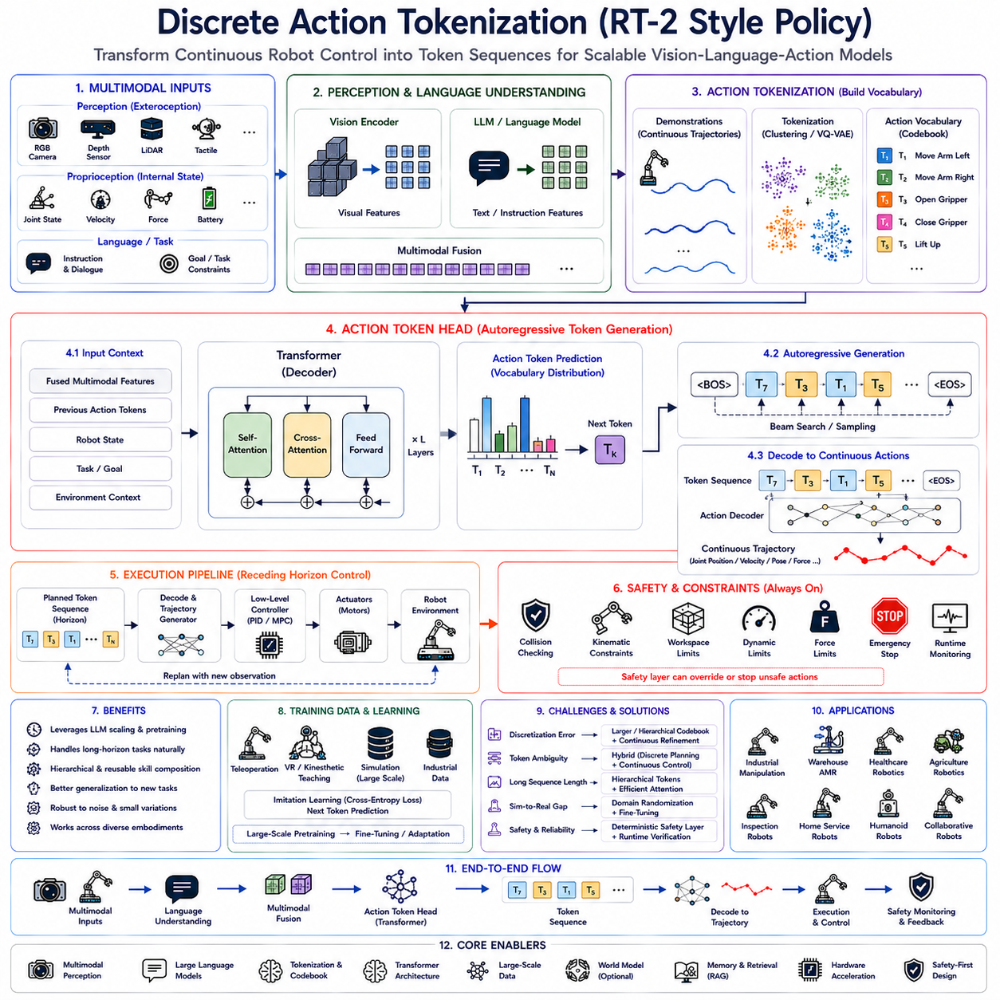
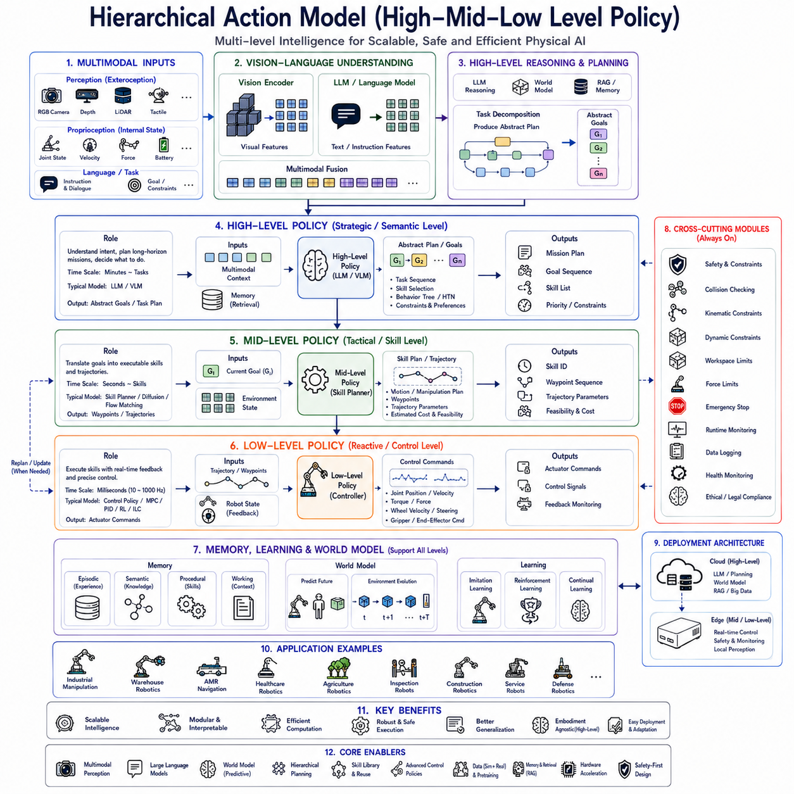
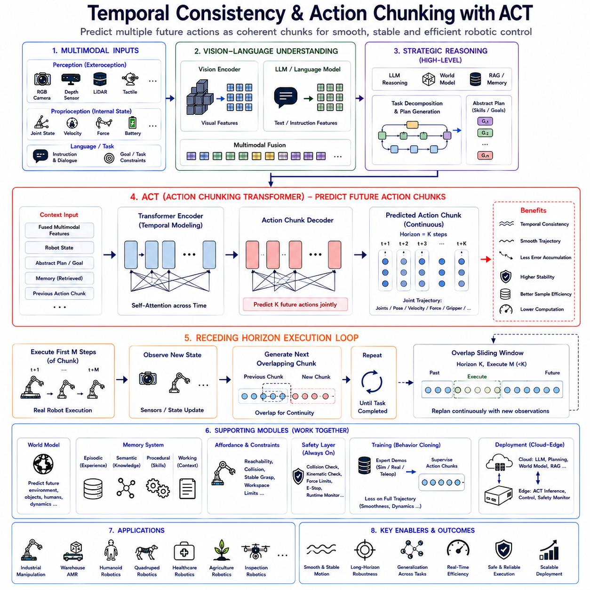
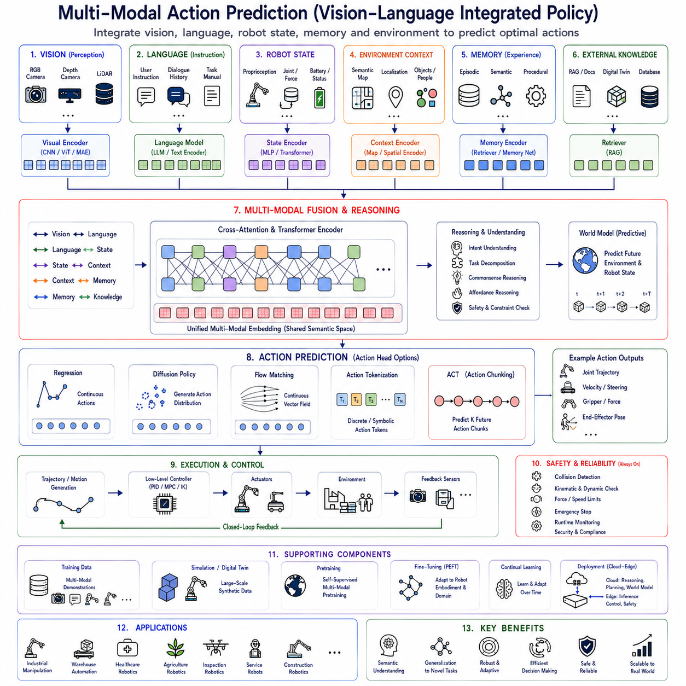
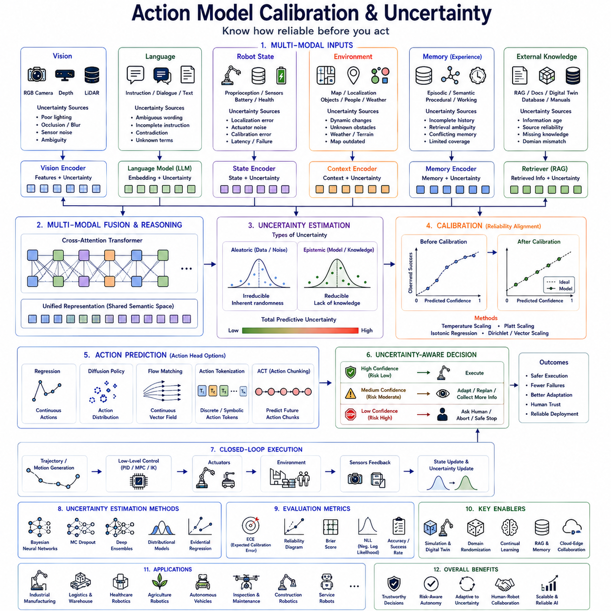
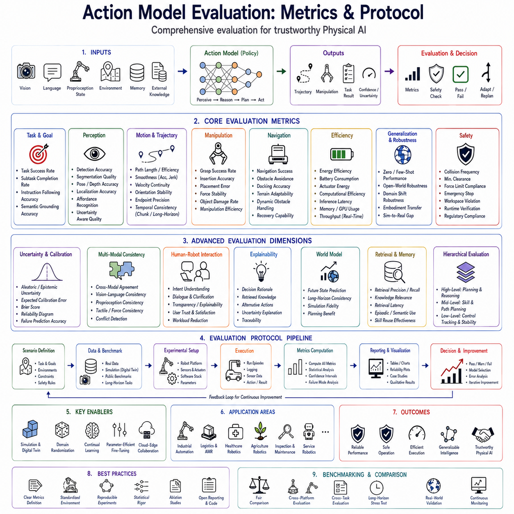

**Volume 20. Vision Language Action (VLA) Models**

# Chapter 4. Action Models

## 4.1 Action Model Architecture Overview

{width="7.268055555555556in" height="7.268055555555556in"}

The Policy Head is one of the most critical components within modern Vision-Language-Action (VLA) architectures because it represents the final decision-making layer that converts high-level semantic understanding into executable robotic actions. While vision encoders perceive the surrounding environment and language models interpret user intent, the Policy Head bridges cognition and physical execution by transforming multimodal latent representations into continuous or discrete control commands. In contemporary Physical AI systems, the Policy Head serves as the interface between artificial intelligence reasoning and the robot\'s motion control system, enabling autonomous behavior that is grounded in both environmental perception and task objectives.

Traditional robotic architectures generally separate perception, planning, and control into independent software modules connected through predefined interfaces. Perception systems identify objects, localization modules estimate robot pose, planners generate symbolic action sequences, and controllers execute low-level motion commands. Although this modular approach provides robustness and interpretability, it often introduces latency, accumulated errors, and difficulties in adapting to highly dynamic environments. End-to-end Action Models address these limitations by learning direct mappings from multimodal observations to robot actions, with the Policy Head acting as the final action generation module responsible for real-time decision making.

Within a complete VLA pipeline, sensory information first enters the perception layer where RGB cameras, depth sensors, LiDAR, tactile sensors, force sensors, IMUs, wheel encoders, GNSS receivers, radar, and proprioceptive measurements capture the robot\'s current interaction with the environment. Vision encoders transform these heterogeneous observations into high-dimensional semantic feature representations. Simultaneously, Large Language Models interpret natural language instructions, previous dialogue history, task objectives, operational constraints, safety rules, and contextual information. A multimodal fusion module integrates these representations into a unified latent space that describes both environmental understanding and task semantics. The Policy Head receives this integrated representation and produces the action commands that ultimately drive robot behavior.

Unlike language generation, which produces textual sequences, the Policy Head generates control-oriented outputs suitable for robotic execution. These outputs may include continuous joint trajectories, end-effector poses, gripper commands, steering angles, wheel velocities, acceleration profiles, navigation waypoints, motion primitives, behavior tree nodes, manipulation actions, or high-level skill selections depending on the robot architecture. Consequently, the Policy Head must simultaneously satisfy semantic correctness, physical feasibility, safety constraints, temporal consistency, and hardware limitations.

The Policy Head is fundamentally different from conventional motion controllers. Classical controllers operate using deterministic mathematical models designed to minimize tracking errors relative to predefined trajectories. The Policy Head instead learns action generation through large-scale data, allowing it to infer complex relationships between perception, language, environmental context, and desired robot behavior without explicitly modeling every physical interaction. Rather than replacing traditional controllers entirely, the Policy Head generally produces reference commands subsequently refined by deterministic control algorithms responsible for maintaining stability and safety.

Action generation may be formulated using continuous action spaces or discrete action spaces. Continuous policies directly predict numerical control variables such as joint positions, joint velocities, joint torques, wheel speeds, steering commands, end-effector trajectories, or Cartesian poses. This representation provides smooth motion suitable for manipulation, navigation, and dynamic locomotion. Discrete policies instead select actions from predefined skill libraries including navigation, grasping, docking, charging, inspection, scanning, opening doors, pressing buttons, or communicating with human operators. Many practical robotic systems combine both representations hierarchically.

Hierarchical action generation has become increasingly popular because robotic behavior naturally exists across multiple abstraction levels. High-level reasoning determines mission objectives and task decomposition. Mid-level planning selects reusable robot skills appropriate for current environmental conditions. Low-level action generation computes detailed control trajectories satisfying physical constraints. The Policy Head frequently occupies the middle layer, selecting behaviors while allowing lower-level controllers to generate precise actuator commands.

Temporal modeling plays a central role in modern Policy Head architectures. Individual actions rarely exist independently because robotic tasks evolve continuously over time. Current actions depend not only upon present observations but also upon previous robot states, historical actions, environmental changes, future task objectives, and interaction dynamics. Consequently, Policy Heads often incorporate temporal attention mechanisms, recurrent memory, transformer decoders, sequence modeling, diffusion processes, or latent dynamics models to maintain temporal consistency throughout extended task execution.

Autoregressive policy generation represents one common architectural design. Rather than predicting entire trajectories simultaneously, the Policy Head generates actions sequentially, conditioning each prediction upon previous outputs. This approach resembles language generation while naturally supporting long-horizon planning, adaptive recovery, and interactive decision making. However, autoregressive policies may accumulate errors over extended prediction horizons and require optimization to satisfy real-time latency constraints.

Diffusion-based action models have recently emerged as powerful alternatives for robotic policy generation. Instead of predicting actions directly, diffusion policies iteratively refine noisy action trajectories toward physically plausible solutions. This approach naturally models multimodal action distributions where multiple valid behaviors exist for identical environmental observations. Diffusion Policy architectures demonstrate remarkable robustness for manipulation tasks involving uncertainty, contact dynamics, and complex object interactions.

Transformer-based Policy Heads increasingly dominate modern Action Model architectures. Self-attention enables the policy network to analyze long-range relationships among visual observations, language instructions, historical actions, environmental changes, and task context simultaneously. Cross-attention mechanisms further integrate multimodal information by allowing action generation to focus selectively upon relevant visual features, linguistic concepts, semantic maps, object relationships, or robot state variables.

Policy Heads frequently incorporate proprioceptive information alongside exteroceptive perception. Joint positions, joint velocities, motor currents, actuator temperatures, wheel encoder measurements, battery condition, gripper status, manipulator configuration, and robot kinematic state provide essential information regarding the robot\'s physical condition. Integrating internal state with environmental perception substantially improves action consistency and execution reliability.

Robot embodiment significantly influences Policy Head design. Humanoid robots require coordinated full-body motion generation involving dozens of articulated joints. Autonomous mobile robots emphasize navigation trajectories, obstacle avoidance, and fleet coordination. Manipulation platforms prioritize grasp synthesis, end-effector trajectories, and force control. Quadruped robots generate dynamic locomotion policies balancing stability, agility, and terrain adaptation. Consequently, Policy Head architectures frequently specialize according to embodiment while sharing common multimodal reasoning foundations.

Action tokenization has recently emerged as an important research direction. Similar to language models representing words as discrete tokens, robotic actions may be discretized into reusable action tokens representing elementary motion primitives or skill components. Policy Heads generate token sequences subsequently decoded into continuous control trajectories. Tokenization simplifies learning while enabling transfer across diverse robotic platforms.

Skill-conditioned policies further improve action generation flexibility. Instead of directly predicting arbitrary actuator commands, the Policy Head conditions action generation upon selected robot skills including navigation, manipulation, docking, inspection, charging, or perception. Skill conditioning decomposes complex missions into reusable behavioral modules while reducing overall policy complexity.

Goal conditioning similarly enhances policy generalization. Rather than memorizing fixed action sequences, the Policy Head receives explicit task objectives represented as language instructions, semantic goals, visual targets, spatial coordinates, object identities, or symbolic mission descriptions. Goal-conditioned policies generalize more effectively toward previously unseen tasks because they explicitly separate desired outcomes from execution strategies.

World models increasingly complement Policy Heads by predicting future environmental evolution before action generation occurs. Instead of reacting solely to current observations, the policy reasons over simulated future states describing predicted object motion, human activity, environmental dynamics, energy consumption, collision probability, or task progress. Predictive reasoning substantially improves long-horizon planning while reducing execution failures.

Affordance reasoning similarly influences policy generation. Not every semantically appropriate action remains physically executable under current environmental conditions. Objects may lie outside reachable workspace, pathways may become blocked, manipulators may encounter collisions, batteries may approach depletion, or safety constraints may restrict operation. Policy Heads therefore integrate affordance estimation ensuring generated actions remain physically feasible.

Safety constraints represent indispensable components of Action Model architectures. Although Policy Heads learn sophisticated behavioral patterns from demonstration data, learned policies alone cannot guarantee safe operation across every possible environmental condition. Independent safety layers continuously validate generated actions using collision prediction, geometric verification, kinematic constraints, dynamic limits, operational rules, emergency stopping, runtime monitoring, and deterministic control algorithms. Safety supervision remains external to learned policy generation while interacting closely with Policy Head outputs.

Uncertainty estimation increasingly accompanies action prediction. Rather than generating deterministic outputs regardless of confidence, advanced Policy Heads estimate predictive uncertainty associated with each proposed action. High uncertainty may trigger slower execution, additional perception, clarification dialogue, human intervention, conservative behavior, or replanning. Confidence-aware action generation significantly improves operational robustness within uncertain environments.

Multi-task learning substantially expands Policy Head capability. Instead of training separate policies for navigation, manipulation, inspection, dialogue, and reporting, unified Action Models learn shared representations supporting diverse robotic behaviors simultaneously. Shared multimodal features improve sample efficiency while enabling knowledge transfer across related task domains.

Large-scale imitation learning remains the dominant training methodology for Policy Heads. Expert demonstrations collected from teleoperation, human manipulation, industrial operation, simulation, reinforcement learning, or previous autonomous execution provide paired observation-action sequences used to train policy networks. The Policy Head gradually learns mappings from multimodal perception to expert-quality behavior through supervised optimization.

Behavior cloning represents the simplest imitation learning approach by directly minimizing differences between predicted and demonstrated actions. However, behavior cloning may accumulate compounding errors during long-horizon deployment because the robot encounters states absent from demonstration datasets. Dataset aggregation, online correction, continual learning, and reinforcement learning fine-tuning therefore increasingly complement supervised policy training.

Reinforcement learning further refines Policy Head performance through interaction with simulated or real environments. Reward functions encourage efficient navigation, successful manipulation, collision avoidance, energy efficiency, smooth motion, task completion, human comfort, or operational productivity. Reinforcement learning enables policies to discover behaviors exceeding demonstrated human performance while adapting to complex environmental dynamics.

Simulation plays a particularly important role during Policy Head development. High-fidelity digital twins generate millions of observation-action trajectories spanning diverse environmental conditions, object configurations, weather patterns, lighting variations, terrain characteristics, equipment failures, and interaction scenarios. Simulation dramatically expands training diversity while reducing physical experimentation costs.

Sim-to-real transfer remains a central challenge because simulation rarely reproduces every physical phenomenon encountered during deployment. Domain randomization, physics randomization, sensor noise injection, appearance variation, latency simulation, actuator uncertainty, and environmental diversity improve transfer robustness by exposing Policy Heads to broad distributions during training.

Fine-tuning adapts pretrained Action Models toward specific robotic platforms. Foundation policies trained across multiple robots acquire broad manipulation, navigation, and interaction capabilities. Platform-specific fine-tuning adjusts embodiment characteristics, kinematic constraints, actuator interfaces, sensor configurations, payload capacities, workspace geometry, and operational procedures without retraining entire models from scratch.

Parameter-efficient adaptation methods such as Low-Rank Adaptation enable organizations to customize large Action Models using relatively modest computational resources. Rather than updating billions of network parameters, lightweight adaptation layers specialize policy behavior toward factory automation, warehouse logistics, healthcare assistance, agricultural operation, inspection robotics, or collaborative manufacturing.

Memory integration significantly enhances long-duration policy execution. Episodic memory stores previous task experiences, semantic memory records environmental knowledge, procedural memory captures reusable skills, and working memory maintains active task context. Memory retrieval allows the Policy Head to adapt actions according to accumulated operational experience rather than relying exclusively upon instantaneous perception.

Retrieval-Augmented Generation increasingly extends beyond language models into robotic action generation. Policy Heads retrieve digital twins, semantic maps, maintenance procedures, operational documentation, previous execution logs, inspection histories, software repositories, and enterprise knowledge bases supporting context-aware action generation tailored to organization-specific environments.

Multi-robot systems require distributed policy coordination. Individual Policy Heads generate local actions while simultaneously considering fleet objectives, resource allocation, communication constraints, collision avoidance, cooperative manipulation, task delegation, and shared environmental knowledge. Collaborative policy generation enables coordinated autonomous behavior across heterogeneous robot teams.

Inference optimization remains essential because Policy Heads operate within real-time robotic systems. Quantization, pruning, knowledge distillation, efficient attention mechanisms, heterogeneous hardware acceleration, adaptive computation, mixed-precision execution, memory optimization, and edge-cloud collaboration reduce latency while preserving action quality. Real-time execution remains mandatory because delayed actions may compromise both productivity and safety.

Industrial manufacturing illustrates practical Policy Head deployment. Robots interpret production goals, perceive workpieces, identify assembly states, generate manipulation trajectories, coordinate inspection procedures, recover from failures, interact with human operators, and adapt dynamically to changing production schedules. Unified Action Models substantially reduce engineering complexity while improving operational flexibility.

Warehouse automation similarly benefits from unified policies. Autonomous mobile robots coordinate navigation, pallet transportation, charging, obstacle avoidance, inventory inspection, fleet scheduling, human interaction, and exception handling through integrated Policy Heads grounded in multimodal perception and semantic task understanding.

Healthcare robotics demands particularly robust policy generation because patient safety supersedes operational efficiency. Policy Heads integrate medical procedures, navigation, manipulation, human interaction, environmental awareness, and safety verification while maintaining natural communication and adaptive behavior throughout complex clinical workflows.

Future Action Model architectures are expected to integrate transformer-based multimodal reasoning, diffusion policies, world models, hierarchical planning, external memory, retrieval-augmented knowledge, continual learning, predictive simulation, uncertainty estimation, heterogeneous embodiment adaptation, and lifelong reinforcement learning into unified cognitive systems. Rather than treating perception, planning, and control as isolated software modules, future Physical AI will employ integrated Action Models capable of transforming multimodal observations directly into safe, efficient, interpretable, and adaptive robot behavior.

As intelligent robotics continues advancing toward general-purpose embodied intelligence, the Policy Head will remain the central computational component translating perception, language understanding, environmental context, and semantic reasoning into executable robotic action. By integrating multimodal fusion, temporal modeling, hierarchical skill generation, predictive reasoning, affordance estimation, uncertainty awareness, memory retrieval, simulation-trained policies, real-time optimization, and deterministic safety verification, modern Policy Head architectures establish the practical bridge connecting artificial cognition with reliable physical interaction across diverse robotic platforms operating within complex real-world environments.

## 4.2 Deterministic Action Heads (with Code)

{width="7.268055555555556in" height="7.268055555555556in"}

The Deterministic Action Head represents one of the most fundamental policy architectures used in modern robotic Action Models. Unlike probabilistic or generative policies that predict distributions over possible behaviors, a deterministic policy directly maps multimodal observations into a single optimal action. Given the same observation, task instruction, robot state, and environmental context, the deterministic policy always produces exactly the same output. This characteristic makes regression-based Action Heads particularly attractive for industrial robotics, autonomous mobile robots, warehouse automation, precision manipulation, and other applications where repeatability, stability, predictability, and low-latency execution are more important than behavioral diversity.

Within the Vision-Language-Action (VLA) framework, deterministic policies occupy the final stage of the perception-to-action pipeline. Vision encoders extract semantic representations from RGB images, depth sensors, LiDAR, tactile sensing, and proprioceptive measurements. Large Language Models interpret human instructions, operational constraints, previous dialogue, and task objectives. Multimodal fusion combines these heterogeneous representations into a unified latent embedding describing the current world state. The regression-based Action Head receives this embedding and directly predicts the control variables required for robot execution.

Regression-based policies formulate action generation as a supervised function approximation problem. Instead of selecting actions from a predefined discrete set, the network predicts continuous numerical values corresponding to robot control commands. The policy learns a deterministic mapping

Action = f(State, Observation, Goal)

where the learned function transforms multimodal input representations into executable robot commands. During inference, identical inputs always produce identical outputs, ensuring deterministic behavior throughout deployment.

Continuous action prediction is especially important in robotics because physical systems naturally operate within continuous control spaces. Robot manipulators require precise joint angles, joint velocities, joint accelerations, or joint torques. Autonomous mobile robots require steering angles, wheel velocities, acceleration commands, and heading corrections. Legged robots require coordinated limb trajectories balancing stability and locomotion efficiency. These outputs are inherently continuous and therefore well suited for regression-based prediction.

Unlike language generation, which predicts discrete vocabulary tokens, deterministic Action Heads minimize numerical prediction error between estimated actions and expert demonstrations. The network does not generate textual descriptions of intended behavior but instead directly estimates actuator reference values suitable for immediate execution by downstream control systems.

The mathematical objective typically minimizes regression loss functions comparing predicted actions with demonstrated expert actions. Mean Squared Error (MSE), Mean Absolute Error (MAE), Smooth L1 Loss, Huber Loss, cosine similarity, weighted trajectory loss, or combinations thereof supervise network optimization. These losses encourage precise numerical prediction while maintaining smooth and stable control behavior throughout execution.

Mean Squared Error remains the most widely adopted regression objective because it strongly penalizes large prediction errors while remaining computationally efficient. However, robotic systems frequently incorporate additional task-specific losses emphasizing trajectory smoothness, collision avoidance, temporal consistency, end-effector precision, orientation accuracy, or energy efficiency depending upon application requirements.

Deterministic Action Heads generally produce multiple continuous outputs simultaneously. A six-degree-of-freedom industrial manipulator may require joint position predictions for each articulated joint together with gripper commands. Mobile robots may simultaneously predict translational velocity, rotational velocity, steering angle, braking force, and acceleration profiles. Humanoid robots generate coordinated full-body trajectories involving dozens of articulated joints. Consequently, regression heads frequently output high-dimensional continuous vectors representing complete robot action states.

Temporal consistency plays an essential role throughout deterministic policy generation. Consecutive actions should vary smoothly because abrupt control discontinuities produce unstable robot motion, excessive actuator wear, unnecessary energy consumption, and degraded manipulation accuracy. Modern regression heads therefore incorporate temporal regularization encouraging smooth action transitions across sequential predictions.

Transformer-based Action Heads increasingly replace conventional multilayer perceptrons because attention mechanisms naturally capture long-range temporal dependencies among previous observations, robot actions, environmental evolution, and future task objectives. Self-attention enables the policy to integrate extended execution history while maintaining deterministic action prediction.

Recurrent neural networks similarly support temporal modeling by maintaining hidden state representations summarizing previous observations and actions. Although transformers have become dominant in recent years, recurrent architectures remain computationally attractive for embedded robotic platforms requiring lightweight inference.

Deterministic policies generally operate under teacher-forcing supervision during training. Expert demonstrations collected through teleoperation, industrial automation, human manipulation, simulation, or previous autonomous execution provide paired observation-action sequences. The Action Head gradually learns to reproduce expert behavior by minimizing regression error across extensive datasets.

Behavior cloning remains the most common training methodology. Human operators perform desired tasks while recording synchronized sensor observations, robot states, language instructions, and executed control commands. Supervised learning subsequently approximates the demonstrated policy using regression optimization. This approach enables rapid deployment while avoiding the sample inefficiency associated with pure reinforcement learning.

One limitation of behavior cloning involves distribution shift. During deployment, small prediction errors accumulate over time, causing the robot to encounter environmental states absent from demonstration datasets. Since the regression model has never observed these states during training, prediction quality may deteriorate progressively. Dataset aggregation, online correction, and reinforcement learning fine-tuning increasingly address this challenge.

Deterministic Action Heads exhibit particularly strong performance within highly structured industrial environments. Manufacturing assembly lines, semiconductor production, automated inspection, laboratory automation, warehouse transportation, pallet handling, machine tending, and repetitive logistics operations frequently involve well-defined tasks executed under relatively consistent environmental conditions. Deterministic regression provides excellent accuracy, repeatability, and operational reliability in these settings.

Low inference latency represents another significant advantage. Regression-based policies perform only a single forward pass through the neural network before producing continuous control outputs. Unlike autoregressive language generation or diffusion-based policy optimization requiring multiple iterative refinement steps, deterministic policies execute rapidly, making them highly suitable for real-time robotics.

Real-time performance becomes particularly important for high-frequency control applications. Industrial manipulators often update reference trajectories at tens or hundreds of Hertz. Autonomous mobile robots continuously adjust navigation commands according to changing obstacle configurations. Legged locomotion controllers require rapid feedback stabilization throughout every gait cycle. Deterministic regression naturally satisfies these stringent timing requirements.

Hardware efficiency further contributes to widespread adoption. Continuous regression networks generally require fewer computational resources than probabilistic generative models because they avoid sampling procedures, iterative optimization, beam search, diffusion refinement, or stochastic inference. This efficiency facilitates deployment on embedded AI platforms including Jetson Orin, Jetson Thor, dedicated NPUs, FPGA accelerators, and industrial edge computers.

Policy architecture commonly consists of multiple fully connected layers receiving fused multimodal embeddings generated by upstream perception modules. Intermediate nonlinear transformations progressively map semantic representations toward continuous action vectors. Residual connections, normalization layers, activation functions, dropout regularization, and attention mechanisms improve optimization stability while preserving representational capacity.

Goal conditioning significantly enhances deterministic policy generalization. Rather than memorizing fixed action trajectories, regression networks receive explicit task objectives represented as natural language instructions, semantic goals, object identities, target coordinates, assembly specifications, or manipulation targets. Goal-conditioned policies adapt identical environmental observations toward different execution behaviors depending upon specified objectives.

Robot embodiment directly influences regression output dimensionality. A two-wheel differential mobile robot predicts translational and rotational velocity. An Ackermann steering vehicle predicts steering angle together with acceleration. Six-axis manipulators output joint references for each articulated joint. Humanoid robots produce coordinated full-body motion involving numerous limbs, balance constraints, and manipulation objectives simultaneously.

Multi-task deterministic policies increasingly support diverse robotic capabilities within unified architectures. Navigation, manipulation, docking, charging, inspection, reporting, human interaction, and maintenance tasks share common perception representations while producing task-specific continuous control outputs. Shared representations improve learning efficiency while reducing engineering complexity.

Hierarchical deterministic control frequently separates decision making across multiple abstraction levels. High-level planners determine mission objectives and symbolic task decomposition. Mid-level regression heads generate continuous motion goals consistent with these objectives. Low-level deterministic controllers including PID, Model Predictive Control, inverse kinematics, and trajectory tracking execute generated references while maintaining stability and safety.

Deterministic policies naturally integrate with conventional robotic software. ROS 2 navigation stacks, MoveIt manipulation planners, behavior trees, trajectory optimizers, collision avoidance systems, localization modules, mapping systems, and deterministic controllers consume continuous policy outputs through standardized interfaces. This compatibility simplifies industrial deployment without requiring complete software redesign.

Safety remains independent from learned regression models. Although deterministic policies generate physically plausible actions, dedicated safety supervisors continue validating generated commands before execution. Collision prediction, workspace monitoring, kinematic verification, velocity limits, acceleration constraints, force limitations, emergency stopping, runtime monitoring, and operational rules independently supervise every action generated by the regression head.

One challenge associated with deterministic policies concerns multimodal action ambiguity. Many robotic tasks possess multiple equally valid solutions. For example, grasping an object may succeed using several different approach trajectories. Regression optimization often averages demonstrated behaviors, potentially generating intermediate actions that were never demonstrated and may prove suboptimal. This averaging phenomenon motivates probabilistic and diffusion-based alternatives for highly multimodal manipulation tasks.

Dataset diversity substantially influences deterministic policy quality. Large-scale demonstrations spanning varying object positions, lighting conditions, sensor noise, environmental layouts, operator preferences, payload variations, and workspace configurations improve generalization beyond narrowly structured training distributions. High-quality data frequently contributes more to performance than increasing model complexity.

Simulation plays a central role during regression policy development. Digital twins generate millions of synchronized observation-action pairs across diverse environmental conditions impossible to collect physically. Physics randomization, domain randomization, sensor noise injection, latency variation, actuator uncertainty, weather simulation, and lighting changes improve transfer robustness toward real-world deployment.

Sim-to-real adaptation remains an active research area because simulation inevitably differs from physical reality. Fine-tuning using relatively modest quantities of real robotic data substantially improves regression accuracy while preserving broad behavioral knowledge acquired during simulation training.

Parameter-efficient fine-tuning further accelerates deployment across heterogeneous robotic platforms. Rather than retraining entire Action Models, lightweight adaptation layers customize embodiment characteristics, kinematic parameters, sensor configurations, payload capacities, workspace geometries, and operational procedures while preserving shared multimodal representations.

Uncertainty estimation increasingly complements deterministic regression despite deterministic outputs. Auxiliary confidence prediction networks estimate expected prediction reliability based upon current observations. Low confidence may trigger additional perception, slower motion, clarification dialogue, human supervision, or alternative planning strategies without abandoning deterministic control entirely.

External memory enhances deterministic policies during long-duration missions. Episodic memory retrieves previous task experiences, semantic memory stores facility knowledge, procedural memory records successful robot skills, and working memory maintains current execution context. Retrieved information influences deterministic action generation without sacrificing computational efficiency.

Retrieval-Augmented Generation also supports regression policies indirectly by supplying current maintenance procedures, semantic maps, digital twins, software documentation, operational manuals, previous execution logs, and enterprise databases. Rather than embedding all organizational knowledge within neural parameters, deterministic policies leverage external knowledge retrieval to improve context-aware action generation.

Industrial assembly represents an ideal deployment scenario. Robot manipulators repeatedly execute precision insertion, fastening, welding, adhesive application, pick-and-place, inspection, and packaging operations where repeatability outweighs behavioral diversity. Deterministic regression consistently reproduces expert-quality trajectories while satisfying stringent manufacturing tolerances.

Warehouse automation similarly benefits from deterministic policies. Autonomous mobile robots repeatedly navigate fixed facilities, transport standardized payloads, dock accurately, recharge automatically, and coordinate predictable fleet behavior. Continuous regression provides stable navigation performance while minimizing computational overhead.

Healthcare robotics also employs deterministic policies for medication delivery, patient transport, specimen handling, laboratory automation, pharmacy logistics, and sterilization procedures where reliable repeatability and explainable execution remain more important than exploratory behavior.

Agricultural robots performing crop monitoring, precision spraying, autonomous harvesting, field navigation, and repetitive maintenance similarly benefit from regression policies whenever environmental variability remains manageable through robust perception and continuous feedback.

Inference optimization further strengthens deterministic architectures. Quantization, pruning, mixed-precision arithmetic, efficient attention, tensor optimization, heterogeneous hardware acceleration, adaptive scheduling, and edge deployment reduce computational latency while preserving numerical prediction accuracy. Deterministic policies naturally exploit these optimization techniques because inference requires only direct forward evaluation.

Evaluation metrics differ from language modeling benchmarks. Regression accuracy, end-effector precision, trajectory smoothness, control stability, task completion rate, energy consumption, cycle time, latency, collision frequency, repeatability, actuator wear, localization accuracy, and long-term operational reliability collectively characterize deployment performance. Practical robotics emphasizes successful physical execution rather than textual generation quality.

Future deterministic Action Heads are expected to integrate transformer-based temporal reasoning, multimodal fusion, world models, uncertainty estimation, continual learning, external memory, retrieval augmentation, adaptive embodiment representations, simulation-trained foundation policies, and hierarchical control into unified Action Model architectures. Although generative policies continue advancing rapidly, deterministic regression will remain indispensable for applications demanding low latency, predictable execution, precise continuous control, industrial reliability, and safety-certified robotic operation.

As Physical AI continues evolving toward general-purpose embodied intelligence, regression-based deterministic Action Heads will remain a foundational technology bridging semantic understanding and physical execution. By combining multimodal perception, continuous regression, temporal modeling, hierarchical planning, efficient inference, simulation-trained expertise, deterministic control integration, external knowledge retrieval, adaptive fine-tuning, and independent safety verification, deterministic policies establish a robust computational framework for reliable real-time robotic behavior across manufacturing, logistics, healthcare, agriculture, inspection, and autonomous mobile robotic platforms operating within structured and semi-structured real-world environments.

## 4.3 Diffusion-Based Action Policies (with Code)

{width="7.268055555555556in" height="7.268055555555556in"}

Diffusion-based Action Heads have recently emerged as one of the most influential innovations in robotic policy learning because they overcome several limitations of conventional deterministic regression policies. While regression-based Action Heads directly predict a single action through supervised learning, Diffusion Probabilistic Models (DDPMs) formulate robotic action generation as an iterative denoising process capable of representing highly multimodal action distributions. This capability is particularly important in robotics because many tasks possess multiple equally valid solutions rather than one unique optimal trajectory. By modeling the entire probability distribution of feasible actions instead of estimating only a single deterministic output, diffusion-based policies significantly improve manipulation robustness, long-horizon planning, contact-rich interaction, and adaptation to uncertain environments. Within modern Vision-Language-Action (VLA) architectures, Diffusion Policy has rapidly become one of the dominant approaches for end-to-end robotic action generation.

Traditional deterministic policies assume that every observation corresponds to exactly one correct action. This assumption simplifies supervised learning but often fails in real-world robotics. Consider a robot attempting to grasp a coffee mug. The mug may be approached from multiple directions, grasped using different finger configurations, or manipulated through various collision-free trajectories. All of these solutions successfully accomplish the same objective. Deterministic regression frequently averages these demonstrations during optimization, producing an unrealistic intermediate trajectory that no human demonstrator actually performed. Such averaging often degrades manipulation quality, particularly in highly multimodal tasks.

Diffusion-based policies address this limitation by learning probability distributions over action trajectories rather than direct regression functions. Instead of predicting the final robot action immediately, the model begins with random Gaussian noise representing an initial action hypothesis. Through multiple iterative denoising steps, this noisy representation gradually evolves toward a physically plausible action sequence consistent with current observations, language instructions, environmental context, and task objectives. The final output emerges after repeated refinement rather than single-step prediction.

The conceptual foundation originates from Denoising Diffusion Probabilistic Models originally developed for image generation. During training, random noise is progressively added to expert demonstrations until action trajectories become nearly indistinguishable from Gaussian noise. The neural network then learns the reverse diffusion process by predicting how to remove noise step by step. During inference, completely random noise serves as the starting point, and the learned reverse process gradually reconstructs a realistic robot action trajectory.

Unlike autoregressive sequence generation, diffusion models optimize entire action trajectories simultaneously. Instead of generating one control command after another, the diffusion policy predicts globally coherent action sequences covering multiple future timesteps. This trajectory-level optimization naturally preserves temporal consistency, smoothness, and long-range coordination throughout robot execution.

Within a complete Vision-Language-Action architecture, perception modules first encode RGB images, depth observations, LiDAR measurements, tactile sensing, force sensing, robot proprioception, localization information, semantic maps, and environmental context into latent feature representations. Large Language Models interpret user instructions, dialogue history, operational constraints, and mission objectives. Multimodal fusion combines these heterogeneous representations into unified embeddings describing both semantic understanding and physical context. The Diffusion Action Head conditions the denoising process upon these fused representations, ensuring generated trajectories remain consistent with environmental observations and task goals.

Conditioning mechanisms play a central role throughout diffusion policy generation. Every denoising iteration incorporates environmental information describing object locations, robot configuration, task objectives, previous actions, language instructions, semantic relationships, and predicted future states. Conditional diffusion therefore produces action trajectories explicitly aligned with current robotic objectives rather than unconstrained random motion.

The forward diffusion process exists only during training. Expert demonstrations gradually receive increasing amounts of Gaussian noise over multiple diffusion timesteps. Initially, trajectories remain easily recognizable. As diffusion progresses, meaningful action structure gradually disappears until only random noise remains. The neural network observes noisy trajectories together with original conditioning information and learns to predict the injected noise. Through repeated optimization, the model acquires the ability to reverse this stochastic corruption process.

Inference reverses the learned diffusion process. Starting from pure Gaussian noise, the Action Head repeatedly estimates noise components conditioned upon current observations and subtracts them incrementally. Every denoising iteration improves trajectory quality while preserving consistency with environmental context. After completion of all reverse diffusion steps, the resulting trajectory represents a valid robotic action satisfying learned behavioral patterns.

Diffusion policies naturally model multimodal behavior because random initial noise may converge toward different valid solutions depending upon environmental context and stochastic initialization. Multiple generated trajectories may successfully complete identical tasks using distinct manipulation strategies, navigation routes, grasp configurations, or motion patterns. This diversity significantly improves robustness compared with deterministic regression.

Temporal prediction constitutes another major advantage. Rather than predicting only the immediate next control command, diffusion models frequently generate action horizons covering dozens of future control steps simultaneously. Model Predictive Control subsequently executes only the initial segment before replanning using updated environmental observations. Receding horizon execution combines long-term trajectory optimization with continual environmental adaptation.

Action horizon length significantly influences policy behavior. Short horizons produce highly reactive behavior suitable for dynamic obstacle avoidance and local manipulation refinement. Longer horizons enable strategic planning across extended tasks involving coordinated manipulation, navigation, assembly operations, or collaborative interactions. Modern diffusion policies often optimize prediction horizons balancing computational efficiency against planning capability.

Transformer architectures increasingly serve as the backbone for diffusion Action Heads. Self-attention captures relationships among action timesteps, environmental observations, language instructions, robot states, and multimodal representations throughout the denoising process. Cross-attention integrates conditioning information dynamically during every diffusion iteration, enabling continuous interaction between perception and action generation.

UNet architectures also remain popular due to their hierarchical multi-resolution feature extraction capabilities. Skip connections preserve fine-grained trajectory information while deeper layers capture global temporal structure. Both transformer-based and convolutional diffusion architectures continue demonstrating competitive performance across diverse robotic applications.

Noise scheduling significantly affects diffusion quality. Training gradually increases noise according to predefined variance schedules controlling information degradation across diffusion timesteps. Linear schedules, cosine schedules, learned schedules, and adaptive variance strategies influence reconstruction quality, convergence stability, and inference efficiency. Careful schedule design substantially improves generated trajectory smoothness and task success.

Loss functions typically optimize noise prediction accuracy rather than direct action regression. Mean Squared Error between predicted noise and injected noise remains the dominant optimization objective. By accurately estimating corruption noise throughout every diffusion timestep, the model indirectly learns to reconstruct realistic robot trajectories from arbitrary random initialization.

Unlike deterministic regression, diffusion policies inherently represent uncertainty. Multiple valid trajectories emerge naturally from stochastic sampling without requiring explicitly designed probability distributions. This capability proves especially valuable whenever tasks admit numerous equally successful execution strategies or environmental ambiguity exists.

Contact-rich manipulation particularly benefits from diffusion-based policies. Insertion, assembly, cable routing, cloth manipulation, food preparation, deformable object handling, surgical assistance, and tool usage frequently involve highly nonlinear contact dynamics difficult to model explicitly. Diffusion policies learn these complex behaviors directly from demonstrations while preserving flexibility across varying interaction conditions.

Long-horizon robotic tasks similarly benefit because entire action sequences become optimized jointly. Multi-stage assembly, warehouse picking, autonomous inspection, agricultural harvesting, laboratory automation, and collaborative manufacturing require coordinated behavior extending over many sequential actions. Diffusion trajectory optimization naturally captures these long-range dependencies more effectively than independent stepwise regression.

Language-conditioned diffusion policies integrate natural language understanding directly into action generation. User instructions specifying task objectives, environmental preferences, operational constraints, safety requirements, object identities, or collaborative intentions influence every denoising iteration. Consequently, generated trajectories remain semantically aligned with human intent throughout execution.

Multimodal conditioning further improves policy robustness. Visual observations identify object geometry, semantic segmentation provides environmental structure, depth sensing estimates spatial relationships, tactile sensing monitors contact forces, localization estimates robot pose, and language specifies task semantics. Diffusion integrates all these modalities simultaneously while refining action trajectories.

Robot embodiment influences diffusion output representation. Manipulators generate joint trajectories, end-effector poses, gripper commands, and force profiles. Autonomous mobile robots predict velocity sequences, steering commands, acceleration profiles, and navigation trajectories. Legged robots optimize coordinated foot placements, body stabilization, and locomotion sequences. Humanoid robots simultaneously generate whole-body coordinated motion involving numerous articulated joints.

Policy execution generally follows receding horizon principles. Although diffusion predicts extended trajectories, only initial control segments execute before environmental perception updates robot understanding. Newly observed information triggers another diffusion process generating revised trajectories. This continual replanning maintains responsiveness despite long prediction horizons.

Simulation plays a particularly important role in diffusion policy training because high-quality trajectory datasets are essential. Digital twins generate millions of demonstration trajectories spanning diverse object configurations, lighting conditions, contact interactions, environmental layouts, weather variations, sensor noise, and task scenarios. Large-scale simulation substantially improves policy generalization while reducing expensive physical data collection.

Behavior cloning remains the primary training methodology. Human teleoperation, kinesthetic teaching, virtual reality manipulation, industrial automation logs, reinforcement learning policies, and autonomous execution histories provide expert demonstrations. Diffusion learning captures the full distribution of demonstrated behaviors rather than collapsing them into single deterministic trajectories.

Fine-tuning enables pretrained diffusion foundation policies to specialize toward particular robotic embodiments, industrial domains, agricultural applications, warehouse logistics, healthcare environments, or collaborative manufacturing systems. Parameter-efficient adaptation techniques reduce computational requirements while preserving broad behavioral knowledge acquired through large-scale pretraining.

Retrieval-Augmented Generation increasingly complements diffusion policies. Maintenance procedures, semantic maps, digital twins, software documentation, previous execution logs, operational manuals, inspection histories, and enterprise knowledge bases provide additional contextual information conditioning action generation. External knowledge therefore improves policy decisions without enlarging neural network parameters.

Memory integration similarly strengthens long-duration execution. Episodic memory recalls previous successful manipulations. Semantic memory stores environmental knowledge and object relationships. Procedural memory preserves reusable robot skills. Working memory maintains current execution context. Retrieved memories guide diffusion toward contextually appropriate trajectory generation.

World models further enhance diffusion policies by predicting future environmental evolution. Instead of generating trajectories solely according to current observations, diffusion conditioning incorporates simulated future object motion, human activity, obstacle dynamics, battery consumption, task progression, and environmental uncertainty. Predictive conditioning substantially improves long-horizon decision quality.

Affordance estimation also constrains trajectory generation. Although diffusion naturally generates diverse behaviors, only physically executable trajectories remain desirable. Affordance modules identify reachable objects, collision-free manipulation opportunities, stable grasp configurations, navigable pathways, and operational constraints. Conditioning diffusion upon affordance information reduces infeasible trajectory generation.

Safety supervision remains external to diffusion policies. Learned trajectory generation alone cannot guarantee safe operation under every environmental circumstance. Independent collision prediction, geometric verification, kinematic constraints, dynamic limits, workspace monitoring, runtime verification, emergency stopping, and deterministic control algorithms continuously evaluate generated trajectories before physical execution.

One practical challenge concerns computational complexity. Conventional DDPM inference may require dozens or hundreds of denoising iterations before producing final trajectories. Such iterative computation increases latency compared with deterministic regression. Numerous acceleration techniques therefore reduce sampling complexity using Denoising Diffusion Implicit Models, consistency models, progressive distillation, latent diffusion, scheduler optimization, adaptive sampling, and learned acceleration networks.

Real-time robotics demands efficient diffusion inference. Industrial manipulators, autonomous mobile robots, humanoids, quadrupeds, and collaborative robots require low-latency decision making despite iterative trajectory refinement. Hardware acceleration using GPUs, tensor cores, dedicated AI accelerators, mixed-precision computation, model quantization, pruning, and optimized attention mechanisms significantly reduces execution time while preserving trajectory quality.

Cloud-edge collaboration provides another practical deployment strategy. Lightweight edge models perform immediate local diffusion using compressed representations, while cloud infrastructure executes computationally intensive long-horizon optimization, simulation, retraining, or fleet-level coordination whenever communication resources become available. Local autonomy remains preserved during network interruptions.

Industrial manufacturing increasingly adopts diffusion policies for precision assembly, insertion, polishing, welding, adhesive application, cable routing, and collaborative manipulation where multiple valid motion strategies naturally exist. Warehouse automation similarly benefits through flexible picking, adaptive pallet handling, dynamic navigation, and robust obstacle negotiation. Healthcare robotics employs diffusion for dexterous assistance, surgical support, rehabilitation devices, laboratory automation, and patient interaction requiring adaptable yet precise movement. Agricultural robotics utilizes diffusion policies for harvesting, pruning, fruit picking, crop inspection, and manipulation of highly variable natural objects.

Evaluation metrics extend beyond conventional prediction accuracy. Trajectory smoothness, task completion rate, manipulation success, contact stability, energy efficiency, trajectory diversity, robustness under environmental variation, collision frequency, inference latency, computational efficiency, safety compliance, and long-term operational reliability collectively characterize deployment performance. Unlike deterministic regression, diversity itself becomes a valuable evaluation criterion because multiple high-quality solutions improve adaptability.

Future Action Model architectures are expected to integrate diffusion policies with transformer reasoning, multimodal perception, world models, external memory, retrieval-augmented knowledge, continual learning, reinforcement learning refinement, adaptive embodiment representations, predictive simulation, and hierarchical planning into unified Physical AI systems. Fast diffusion variants, latent trajectory generation, consistency models, adaptive denoising schedules, and hardware-aware optimization will further reduce inference latency while preserving behavioral diversity.

As robotic intelligence continues progressing toward general-purpose embodied cognition, Diffusion-Based Action Heads will likely become one of the dominant policy architectures for complex manipulation, autonomous navigation, collaborative robotics, and long-horizon task execution. By combining probabilistic trajectory modeling, multimodal conditioning, iterative denoising, transformer-based sequence learning, predictive world models, retrieval-augmented contextual reasoning, simulation-trained expertise, adaptive fine-tuning, efficient hardware acceleration, and independent safety verification, DDPM-based Action Heads establish a powerful computational framework capable of generating diverse, physically feasible, semantically consistent, and highly robust robot behaviors across increasingly complex real-world environments.

## 4.4 Flow-Matching Action Models (with Code)

{width="7.268055555555556in" height="7.268055555555556in"}

Flow Matching has recently emerged as one of the most promising paradigms for generative robot policies because it offers an elegant alternative to traditional diffusion-based action generation while significantly improving inference efficiency. Although Diffusion Probabilistic Models (DDPMs) have demonstrated remarkable performance in robotic manipulation and long-horizon action generation, they generally require dozens or even hundreds of iterative denoising steps during inference. Such computational complexity limits their practical deployment in real-time robotic systems where low latency, deterministic responsiveness, and efficient onboard computation are essential. Flow Matching addresses these limitations by learning continuous vector fields that directly transform simple probability distributions into complex action distributions through ordinary differential equations rather than iterative stochastic denoising. This formulation enables significantly faster inference while preserving the expressive multimodal capabilities that made diffusion policies successful. Recent foundation robot models such as Pi0 have demonstrated the effectiveness of Flow Matching for large-scale Vision-Language-Action architectures, positioning this approach as one of the leading candidates for next-generation Physical AI.

The central motivation behind Flow Matching originates from the observation that robotic action generation is fundamentally a continuous transformation problem rather than merely a sequence prediction problem. Instead of viewing robot behavior as isolated action commands, Flow Matching represents action generation as a smooth trajectory evolving continuously from an initial simple distribution toward the desired expert action distribution. The learned vector field describes the direction in which every action sample should move throughout this transformation. Consequently, action generation becomes a process of integrating continuous dynamics rather than repeatedly removing stochastic noise.

Unlike deterministic regression policies that directly estimate one action and unlike diffusion models that gradually denoise random trajectories, Flow Matching explicitly learns the velocity field governing probability transport between two distributions. During inference, robot actions emerge by integrating this learned velocity field from an initial latent representation toward the final action trajectory. Because the velocity field is estimated directly rather than indirectly through iterative denoising, considerably fewer numerical integration steps are required, dramatically reducing computational latency.

Mathematically, Flow Matching learns a vector field describing how probability mass should evolve continuously through latent space. Instead of predicting actions themselves, the neural network predicts instantaneous velocity vectors indicating how each latent sample should move over infinitesimal time intervals. Integrating these velocity vectors across time reconstructs complete action trajectories consistent with expert demonstrations. This continuous dynamical perspective provides a natural framework for representing smooth robot motion while avoiding many computational inefficiencies associated with diffusion sampling.

Within a Vision-Language-Action architecture, perception modules first encode RGB images, depth observations, LiDAR measurements, tactile sensing, proprioception, localization information, semantic maps, robot state variables, and environmental context into high-dimensional latent representations. Large Language Models simultaneously interpret natural language instructions, operational constraints, previous dialogue, mission objectives, procedural knowledge, and semantic reasoning. Multimodal fusion integrates these heterogeneous representations into a unified latent embedding describing the current task context. The Flow Matching Action Head conditions its learned vector field upon these multimodal embeddings, ensuring generated trajectories remain semantically aligned with perception and language understanding throughout action generation.

Flow Matching differs fundamentally from DDPM because it eliminates the explicit forward noising process. Diffusion models first corrupt expert trajectories through repeated Gaussian noise injection before learning to reverse this corruption process. Flow Matching instead directly specifies continuous interpolation paths connecting source distributions and target action distributions. The learning objective becomes matching the velocity required along these paths rather than estimating injected noise. This direct formulation simplifies optimization while reducing inference complexity.

Continuous probability transport provides the theoretical foundation underlying Flow Matching. Rather than treating probability distributions as disconnected statistical objects, optimal transport theory interprets them as masses flowing continuously through high-dimensional space. The learned vector field defines how robot action distributions should evolve smoothly between initial and target configurations. Such continuous transformations naturally correspond to physical robot motion, making Flow Matching particularly suitable for embodied intelligence.

The interpolation path plays a central role throughout training. Each expert action trajectory defines a target distribution, while a simple Gaussian latent distribution defines the source. Intermediate points along interpolation paths combine latent samples with demonstrated actions according to continuously varying interpolation coefficients. The neural network observes these intermediate states and learns the corresponding velocity vectors required to move toward expert trajectories. By learning velocity everywhere along these paths, the model acquires a globally consistent dynamical representation of robotic behavior.

Unlike stochastic diffusion sampling, Flow Matching generally employs deterministic numerical integration during inference. Starting from an initial latent sample, numerical ordinary differential equation solvers integrate the learned vector field toward the final action trajectory. Euler integration, Runge-Kutta methods, adaptive solvers, or higher-order numerical integration techniques progressively update latent representations according to predicted velocities until complete robot actions emerge.

The deterministic nature of Flow Matching offers several practical advantages. Identical latent initialization combined with identical environmental conditions produces identical action trajectories, facilitating repeatability, debugging, verification, certification, and industrial deployment. At the same time, behavioral diversity remains available by sampling different initial latent representations whenever multiple valid action strategies exist.

Inference efficiency constitutes one of the strongest motivations for adopting Flow Matching within robotics. Diffusion policies often require fifty to one hundred denoising iterations before generating satisfactory trajectories. Flow Matching frequently achieves comparable trajectory quality using only a small number of ordinary differential equation integration steps. This substantial reduction in computational cost enables deployment on embedded robotic computing platforms where latency directly influences operational safety and responsiveness.

Real-time robotics particularly benefits from reduced inference latency. Autonomous mobile robots continuously update navigation commands according to dynamic obstacles. Industrial manipulators adjust grasp trajectories in response to object motion. Humanoid robots maintain balance while reacting to human interaction. Agricultural robots adapt harvesting strategies according to changing crop geometry. Every millisecond saved during policy inference contributes directly toward improved real-world performance.

Flow Matching naturally generates continuous trajectories rather than isolated control commands. Entire future action sequences evolve coherently according to the learned vector field, preserving temporal smoothness and coordination across multiple timesteps. Such trajectory-level optimization reduces control discontinuities, improves actuator efficiency, minimizes unnecessary acceleration, and enhances overall robot stability.

Transformer architectures increasingly serve as the backbone for Flow Matching Action Heads. Self-attention captures long-range dependencies among visual observations, language instructions, robot states, environmental context, historical actions, and future objectives. Cross-attention dynamically conditions velocity prediction upon multimodal features throughout numerical integration. These transformer-based architectures provide exceptional representational capacity while supporting scalable foundation policy learning.

Continuous-time representations distinguish Flow Matching from many conventional sequence models. Rather than discretizing temporal evolution into fixed prediction steps, the learned vector field defines behavior continuously across arbitrary time values. This continuous formulation allows flexible integration accuracy, adaptive solver behavior, variable trajectory durations, and smooth temporal interpolation without requiring retraining for different execution frequencies.

Robot embodiment strongly influences Flow Matching output representations. Industrial manipulators predict joint trajectories, end-effector poses, gripper forces, and contact dynamics. Autonomous mobile robots generate velocity profiles, steering commands, waypoint trajectories, and navigation actions. Quadruped robots coordinate limb trajectories balancing locomotion stability and terrain adaptation. Humanoid robots simultaneously synthesize coordinated whole-body motion involving numerous articulated joints and manipulation objectives.

Multimodal conditioning remains essential throughout trajectory generation. Vision encoders describe object geometry, semantic segmentation identifies scene structure, localization estimates robot pose, tactile sensing monitors contact interactions, force sensing measures manipulation dynamics, language specifies task intent, and environmental memory recalls previous experiences. Flow Matching integrates all these information sources into unified vector field prediction supporting context-aware robot behavior.

Long-horizon planning represents another significant advantage. Since complete trajectories evolve through continuous dynamical systems, Flow Matching naturally models extended task sequences involving coordinated manipulation, assembly, warehouse logistics, infrastructure inspection, collaborative manufacturing, household assistance, and agricultural automation. Global trajectory optimization improves consistency across lengthy task executions compared with independently predicted action steps.

World models increasingly complement Flow Matching policies by predicting future environmental evolution. Instead of generating trajectories solely from present observations, conditioning incorporates anticipated object motion, human activities, environmental dynamics, battery consumption, collision probability, task progression, and semantic scene evolution. Predictive conditioning enables robots to proactively avoid future failures rather than merely reacting to current observations.

Affordance reasoning similarly constrains trajectory generation. The learned vector field should direct robot motion only toward physically executable behaviors. Reachability analysis, collision prediction, stable grasp estimation, workspace constraints, terrain traversability, object manipulability, and operational limitations therefore influence conditioning information throughout trajectory synthesis. Integrating affordance estimation significantly improves practical execution success.

Safety remains independent from the generative Action Head. Although Flow Matching produces smooth physically plausible trajectories, deterministic safety supervisors continue validating generated actions before execution. Collision detection, geometric verification, kinematic limits, dynamic constraints, workspace monitoring, emergency stopping, runtime verification, force limitation, and regulatory compliance remain external safety mechanisms ensuring operational reliability regardless of policy behavior.

Training typically relies upon large-scale imitation learning. Human teleoperation, kinesthetic teaching, virtual reality interaction, industrial automation logs, simulation trajectories, reinforcement learning policies, and autonomous execution histories collectively provide demonstration datasets. Rather than learning explicit action labels, Flow Matching learns continuous probability transport dynamics describing how latent variables should evolve toward demonstrated behaviors.

Simulation provides indispensable support for training because enormous trajectory diversity is required. Digital twins generate millions of manipulation sequences spanning varying object configurations, sensor noise, lighting conditions, terrain properties, environmental layouts, payload variations, weather conditions, equipment failures, and interaction scenarios. Such diversity substantially improves policy robustness before physical deployment.

Sim-to-real transfer remains important despite Flow Matching\'s strong generalization capability. Domain randomization, appearance variation, physics perturbation, actuator uncertainty, communication latency, calibration errors, and environmental diversity reduce discrepancies between simulated and physical robots. Subsequent fine-tuning using relatively small quantities of real-world demonstrations further improves deployment reliability.

Parameter-efficient adaptation enables Flow Matching foundation models to specialize toward different robot embodiments and industrial domains. Lightweight adaptation layers modify only small subsets of network parameters while preserving broad multimodal reasoning acquired through large-scale pretraining. Consequently, a single pretrained Action Model can rapidly adapt toward warehouse logistics, manufacturing automation, agricultural robotics, inspection platforms, medical assistants, or collaborative mobile manipulators.

Memory integration significantly enriches continuous trajectory generation. Episodic memory retrieves previous successful executions, semantic memory stores facility knowledge, procedural memory records reusable robot skills, and working memory maintains current mission context. Memory-conditioned vector fields therefore adapt robot behavior according to accumulated operational experience instead of relying solely upon instantaneous perception.

Retrieval-Augmented Generation extends naturally into Flow Matching architectures. Enterprise documentation, maintenance manuals, semantic maps, digital twins, software repositories, inspection records, production schedules, operational procedures, and historical execution logs provide external contextual knowledge conditioning trajectory generation. This separation between neural parameters and organizational knowledge improves adaptability while reducing retraining requirements.

Hierarchical control architectures commonly integrate Flow Matching with conventional robotics software. High-level planners determine symbolic task decomposition and mission sequencing. Flow Matching Action Heads synthesize continuous trajectories implementing these plans. Low-level deterministic controllers execute generated references using inverse kinematics, trajectory tracking, Model Predictive Control, impedance control, force regulation, and actuator stabilization. Such hierarchical integration combines learned intelligence with proven engineering reliability.

Compared with diffusion models, Flow Matching generally exhibits improved numerical stability during inference because deterministic integration avoids repeated stochastic sampling. Reduced sampling variance simplifies reproducibility, debugging, safety validation, and certification efforts required for industrial deployment. Engineers can more readily analyze continuous vector fields than complex stochastic denoising dynamics.

One remaining challenge concerns numerical integration accuracy. Although substantially fewer integration steps are required than diffusion sampling, excessively coarse integration may reduce trajectory quality while unnecessarily fine integration increases computational cost. Adaptive numerical solvers therefore balance trajectory fidelity against real-time execution requirements according to current operational conditions.

Hardware acceleration further improves deployment feasibility. GPUs, tensor cores, neural processing units, mixed-precision arithmetic, quantization, optimized transformer kernels, compiler optimization, memory-efficient attention, and heterogeneous computing architectures substantially accelerate vector field evaluation. Because inference requires only repeated forward evaluations of one neural network rather than extensive stochastic refinement, Flow Matching scales efficiently across embedded robotic platforms.

Industrial manufacturing represents one of the most promising application domains. Precision assembly, insertion, welding, adhesive dispensing, machine tending, cable routing, polishing, and collaborative manipulation benefit from smooth continuous trajectory generation combined with low inference latency. Warehouse automation similarly exploits Flow Matching for adaptive pallet transportation, dynamic obstacle avoidance, coordinated fleet navigation, and flexible picking operations.

Healthcare robotics increasingly demands policies capable of generating smooth, predictable, and explainable motion. Medication delivery, patient assistance, rehabilitation devices, surgical support, laboratory automation, and assistive manipulation all benefit from continuous trajectory synthesis emphasizing safety and human comfort. Agricultural robotics similarly leverages Flow Matching for harvesting, pruning, crop monitoring, precision spraying, and interaction with deformable natural objects exhibiting significant environmental variability.

Evaluation metrics extend beyond conventional prediction accuracy. Trajectory smoothness, manipulation success, temporal consistency, energy efficiency, actuator wear, inference latency, computational cost, task completion rate, collision frequency, robustness under environmental variation, adaptability, safety compliance, and long-duration operational stability collectively characterize policy quality. Because Flow Matching generates continuous trajectories, evaluating dynamical behavior becomes as important as measuring endpoint accuracy.

Recent foundation robot models inspired by Pi0 demonstrate that Flow Matching scales effectively toward general-purpose embodied intelligence. Large multimodal datasets containing vision, language, proprioception, action trajectories, semantic context, and environmental interaction histories enable training of unified policies capable of generalizing across diverse robotic embodiments and operational domains. Rather than learning isolated task-specific controllers, Flow Matching supports the emergence of broadly transferable robotic foundation policies.

Future research is expected to integrate Flow Matching with world models, hierarchical planning, multimodal reasoning, retrieval-augmented knowledge, continual learning, external memory, reinforcement learning refinement, adaptive numerical solvers, predictive simulation, uncertainty estimation, and heterogeneous hardware acceleration. These developments aim to combine the expressive trajectory modeling capabilities of generative policies with the computational efficiency required for practical real-time robotics.

As Physical AI continues advancing toward large-scale embodied foundation models, Flow Matching Action Heads represent a compelling evolution beyond both deterministic regression and conventional diffusion policies. By learning continuous probability transport through conditioned vector fields, integrating multimodal perception with semantic reasoning, generating temporally coherent action trajectories, leveraging simulation-trained foundation models, supporting efficient hardware deployment, and cooperating with deterministic safety architectures, Pi0-style Flow Matching establishes a powerful computational framework capable of delivering fast, robust, scalable, and semantically grounded robot behavior across manufacturing, logistics, healthcare, agriculture, inspection, autonomous mobility, and future general-purpose robotic systems.

## 4.5 Discrete Action Tokenization (with Code)

{width="7.268055555555556in" height="7.268055555555556in"}

Discrete Action Tokenization has emerged as one of the most influential concepts in modern Vision-Language-Action (VLA) architectures because it transforms continuous robotic control into a token prediction problem analogous to natural language generation. Inspired by the remarkable success of Large Language Models (LLMs), researchers recognized that robotic actions could be represented as sequences of discrete tokens instead of continuous control values. This paradigm enables robot policies to leverage the same transformer architectures, sequence modeling capabilities, scaling laws, and pretraining methodologies that have revolutionized language understanding. Google\'s RT-2 demonstrated that robots could interpret multimodal information and generate generalized manipulation behaviors by treating robotic actions as another language-like sequence. As a result, Discrete Action Tokenization has become one of the foundational approaches for large-scale embodied intelligence and robotic foundation models.

Traditional robotic control systems generally operate within continuous action spaces where every output corresponds directly to numerical control variables such as joint positions, joint velocities, wheel velocities, steering angles, end-effector poses, or torque commands. Although continuous control provides high precision, learning these high-dimensional continuous mappings becomes increasingly difficult as task complexity, environmental uncertainty, and robot embodiment diversity increase. Small numerical prediction errors may accumulate throughout execution, leading to unstable trajectories or task failures.

Discrete Action Tokenization addresses these limitations by converting continuous robot actions into finite symbolic representations called action tokens. Instead of directly predicting numerical actuator commands, the policy predicts a sequence of discrete symbols selected from a predefined action vocabulary. Each token represents an elementary movement primitive, manipulation skill, navigation behavior, or control pattern that can subsequently be decoded into executable robot commands. Consequently, robotic action generation becomes mathematically similar to sentence generation in natural language processing.

The conceptual analogy between language tokens and robot action tokens provides a powerful framework for embodied intelligence. Natural language sentences consist of words arranged into meaningful sequences according to grammatical structure. Similarly, robotic behaviors consist of elementary motion primitives organized into temporally coherent action sequences according to physical task requirements. Transformers naturally model both sequence types using identical attention mechanisms, enabling direct transfer of language modeling techniques into robotics.

Within a complete Vision-Language-Action architecture, perception modules first encode RGB images, depth observations, LiDAR measurements, tactile sensing, force sensing, proprioception, localization estimates, semantic maps, and environmental context into high-dimensional latent feature representations. Large Language Models interpret natural language instructions, dialogue history, operational procedures, mission objectives, semantic constraints, and human intent. Multimodal fusion combines these heterogeneous representations into unified embeddings describing both the external environment and internal robot state. The Action Token Head subsequently predicts discrete action tokens conditioned upon these multimodal embeddings.

Action tokenization begins by constructing an action vocabulary. Large collections of expert demonstrations provide continuous trajectories recorded through teleoperation, industrial automation, virtual reality interaction, simulation, or autonomous execution. Clustering algorithms, vector quantization methods, hierarchical codebooks, or learned discrete latent representations identify recurring motion patterns within these demonstrations. Every discovered pattern receives a unique symbolic identifier, forming the robot\'s action vocabulary.

Each action token may correspond to a low-level movement primitive or a higher-level behavioral abstraction depending upon vocabulary design. Low-level tokens represent elementary actuator commands such as moving individual joints, rotating wheels, opening grippers, adjusting steering angles, or changing end-effector orientation. Higher-level tokens encode reusable manipulation skills including grasping, placing, docking, opening doors, pressing buttons, inserting components, or inspecting objects. Hybrid vocabularies frequently combine both abstraction levels.

Vector Quantized Variational Autoencoders have become one of the most common approaches for learning discrete action vocabularies automatically. Continuous demonstration trajectories pass through neural encoders generating latent representations. These latent vectors become quantized into finite codebook entries representing discrete action tokens. Decoders subsequently reconstruct continuous trajectories from token sequences. Through end-to-end optimization, meaningful symbolic representations emerge without requiring manually designed action dictionaries.

Unlike deterministic regression policies predicting continuous numerical values, token-based policies formulate robotic control as categorical prediction. Given multimodal observations and previous action history, the transformer predicts probability distributions over available action tokens. Beam search, greedy decoding, temperature sampling, or stochastic decoding strategies subsequently select action sequences according to deployment requirements. Once selected, dedicated decoders translate symbolic tokens back into executable continuous trajectories.

Autoregressive sequence generation naturally supports token-based policies. The Action Head predicts one action token conditioned upon all previously generated tokens, environmental observations, language instructions, and multimodal context. Every newly generated token extends the action sequence while influencing subsequent predictions. This sequential generation process closely resembles modern Large Language Models generating textual responses token by token.

Temporal modeling constitutes a major advantage of action tokenization. Because transformer attention simultaneously analyzes long token sequences, policies naturally capture long-range dependencies across extended robotic tasks. Earlier manipulation decisions influence future actions through self-attention without requiring manually designed temporal memory. Consequently, robots maintain coherent behavior throughout lengthy multi-stage operations.

Action tokenization also enables hierarchical behavior representation. Individual tokens combine into motion phrases representing reusable robot skills. Multiple skills compose complete task procedures. Entire task sequences implement mission objectives. This hierarchical organization mirrors natural language structure where letters form words, words form sentences, and sentences form complete documents. Hierarchical token composition substantially improves scalability toward increasingly complex robotic capabilities.

Language grounding represents another significant benefit. Since language instructions and action sequences both become transformer token streams, semantic alignment naturally emerges through multimodal pretraining. Concepts such as "pick," "place," "push," "rotate," "inspect," "clean," or "charge" become directly associated with corresponding action token sequences. This shared representational space enables robots to generalize toward previously unseen instructions by recombining learned semantic-action relationships.

Cross-modal reasoning similarly benefits from tokenization. Vision tokens describe visual observations. Language tokens encode semantic intent. Action tokens represent physical behavior. Unified transformer architectures reason jointly across all three modalities using common attention mechanisms. Consequently, robots learn integrated multimodal representations connecting perception, reasoning, and physical execution within one scalable foundation model.

Generalization improves because discrete symbolic representations reduce sensitivity to small numerical variations. Continuous control often overfits precise actuator trajectories observed during training. Action tokens instead emphasize reusable behavioral patterns applicable across diverse environmental conditions. Similar manipulation tasks therefore share common symbolic structures despite differing geometric details, facilitating transfer toward previously unseen scenarios.

Large-scale pretraining becomes feasible because action token prediction resembles conventional language modeling. Internet-scale vision-language datasets, robotics demonstrations, simulation trajectories, industrial automation logs, and multimodal interaction histories collectively train unified transformer policies using identical optimization objectives. Scaling laws originally observed in language models increasingly apply to embodied intelligence through tokenized action representations.

RT-2 demonstrated this principle by jointly training upon internet vision-language data and robotic manipulation demonstrations. Knowledge acquired from general visual-language understanding transferred naturally toward robotic execution because action prediction utilized the same transformer architecture responsible for language generation. Consequently, robots exhibited zero-shot generalization toward novel objects, unseen instructions, and previously untrained task variations.

Robot embodiment significantly influences action vocabulary design. Industrial manipulators require tokens describing grasp trajectories, insertion motions, force modulation, and end-effector orientation. Autonomous mobile robots emphasize navigation, obstacle avoidance, docking, localization correction, and velocity regulation. Humanoid robots require coordinated whole-body motion tokens involving locomotion, manipulation, balance, gesture generation, and human interaction. Quadruped robots generate gait transitions, foothold placement, body stabilization, and terrain adaptation tokens.

Token granularity represents an important design decision. Fine-grained vocabularies produce highly expressive behaviors but require longer token sequences during inference. Coarse-grained vocabularies reduce sequence length but may sacrifice motion precision and adaptability. Practical systems balance representational richness against computational efficiency by optimizing vocabulary size according to application requirements.

Subword tokenization concepts from natural language processing inspire similar hierarchical action encoding. Rather than representing every complete robot skill as one token, frequently occurring motion fragments become reusable token components. Complex manipulation behaviors therefore emerge through composition of smaller reusable action units analogous to linguistic morphemes composing complete words.

Training generally relies upon imitation learning using tokenized demonstrations. Expert trajectories become discretized through learned codebooks before transformer optimization. Cross-entropy loss supervises action token prediction exactly as language models predict vocabulary tokens. This unified training objective greatly simplifies large-scale multimodal foundation model development.

Sequence prediction naturally supports long-horizon planning. Instead of generating only immediate control commands, token-based policies predict complete future action sequences implementing entire task procedures. Model Predictive Control or hierarchical execution frameworks subsequently execute initial action segments while continually replanning according to updated environmental observations.

External memory substantially enriches token-based policies. Episodic memory retrieves previous successful action sequences. Semantic memory stores object knowledge and environmental relationships. Procedural memory records reusable task templates encoded as action token sequences. Working memory maintains current execution context. Retrieved token sequences guide future predictions while improving task consistency.

Retrieval-Augmented Generation extends naturally into discrete action policies. Maintenance manuals, semantic maps, software repositories, digital twins, operational procedures, inspection records, enterprise databases, and historical execution logs provide additional contextual information conditioning action token prediction. External knowledge therefore complements learned policy representations without requiring complete retraining.

World models increasingly integrate with action token generation. Predictive simulation estimates future environmental evolution, object dynamics, human behavior, battery consumption, obstacle motion, and task progression. Future predictions influence token selection, allowing robots to anticipate upcoming events rather than reacting solely to current observations. Long-horizon planning consequently becomes significantly more reliable.

Affordance reasoning similarly constrains action vocabulary usage. Although many action tokens exist within the vocabulary, only physically executable tokens remain appropriate under current environmental conditions. Reachability analysis, collision prediction, stable grasp estimation, workspace limitations, terrain traversability, and operational constraints restrict token selection before execution, improving practical task success.

Safety supervision remains independent from token prediction. Learned transformer policies generate candidate action sequences, but deterministic safety systems continue validating every decoded trajectory using collision detection, kinematic verification, dynamic constraints, workspace monitoring, emergency stopping, runtime supervision, force limitation, and regulatory compliance. Safety layers therefore remain external to learned policy generation.

Simulation provides indispensable training resources because token vocabularies require enormous behavioral diversity. Digital twins generate millions of manipulation trajectories spanning varying object arrangements, environmental layouts, weather conditions, lighting variations, sensor noise, contact interactions, payload changes, and failure scenarios. Large-scale simulation greatly expands action vocabulary richness before physical deployment.

Sim-to-real transfer remains an active research area. Domain randomization, appearance variation, actuator uncertainty, communication latency, sensor calibration differences, physics perturbation, and environmental diversity reduce discrepancies between simulated and physical execution. Fine-tuning with relatively modest real-world datasets further improves token prediction accuracy while preserving broad behavioral knowledge acquired during pretraining.

Parameter-efficient adaptation enables large pretrained token policies to specialize toward diverse robotic embodiments. Lightweight adaptation layers modify only small parameter subsets while preserving shared multimodal reasoning. Consequently, warehouse robots, industrial manipulators, agricultural platforms, healthcare assistants, inspection robots, collaborative mobile manipulators, and household service robots may share common pretrained transformer backbones despite differing mechanical configurations.

Inference efficiency depends primarily upon transformer sequence length rather than continuous optimization procedures. Unlike diffusion models requiring iterative denoising, token policies generate one discrete symbol at a time through autoregressive decoding. Hardware acceleration using GPUs, tensor cores, neural processing units, quantization, mixed-precision arithmetic, optimized attention kernels, and compiler optimization substantially improves real-time deployment performance.

One challenge concerns discretization error. Converting continuous trajectories into finite token vocabularies inevitably sacrifices some motion precision. Increasing vocabulary size reduces reconstruction error but increases computational complexity and training difficulty. Hierarchical tokenization, adaptive codebooks, residual vector quantization, and continuous refinement layers increasingly address this tradeoff.

Another challenge involves token ambiguity. Similar physical movements occasionally receive different symbolic representations depending upon surrounding task context. Conversely, identical tokens may require slight continuous adaptation across different robot embodiments. Hybrid architectures therefore frequently combine discrete high-level planning with continuous low-level refinement to maximize both generalization and execution precision.

Industrial manufacturing increasingly benefits from token-based policies. Assembly procedures, machine tending, quality inspection, component insertion, fastening, packaging, pallet handling, and collaborative manipulation naturally decompose into reusable symbolic action sequences. Warehouse automation similarly exploits navigation, docking, charging, inventory handling, and fleet coordination tokens supporting scalable autonomous logistics.

Healthcare robotics employs tokenized behaviors for medication delivery, patient interaction, laboratory automation, rehabilitation assistance, specimen transport, and hospital logistics. Agricultural robotics generates token sequences representing harvesting, pruning, crop monitoring, precision spraying, fruit picking, and field navigation. Household service robots compose cleaning, cooking, object retrieval, organization, and human interaction behaviors through reusable symbolic action vocabularies.

Evaluation extends beyond simple token prediction accuracy. Task completion rate, manipulation success, navigation accuracy, sequence consistency, semantic grounding quality, generalization capability, embodiment transfer performance, latency, computational efficiency, safety compliance, long-horizon stability, and real-world operational robustness collectively characterize deployment quality. Token prediction accuracy alone rarely reflects practical robotic capability.

Future research will likely integrate discrete action tokenization with Flow Matching, diffusion policies, world models, retrieval-augmented reasoning, continual learning, external memory, hierarchical planning, multimodal foundation models, adaptive codebooks, reinforcement learning refinement, predictive simulation, and heterogeneous hardware acceleration. Hybrid architectures combining symbolic action tokens with continuous trajectory refinement promise to unify the strengths of language modeling and precision robotic control.

As embodied artificial intelligence continues evolving toward universal robotic foundation models, Discrete Action Tokenization will remain one of the key enabling technologies connecting language reasoning with physical behavior. By transforming robot control into scalable sequence prediction, integrating multimodal perception with semantic understanding, leveraging transformer architectures originally developed for natural language processing, supporting large-scale pretraining, enabling transferable symbolic skill composition, and cooperating with deterministic safety verification, RT-2 style Action Tokenization establishes a powerful computational framework for general-purpose robotic intelligence capable of operating across manufacturing, logistics, healthcare, agriculture, household service, infrastructure inspection, collaborative robotics, and future autonomous embodied systems.

## 4.6 Hierarchical Action Models (with Code)

{width="7.268055555555556in" height="7.268055555555556in"}

Hierarchical Action Models have become one of the most important architectural principles in modern Physical AI because they enable robots to solve highly complex tasks by decomposing decision making into multiple abstraction levels. Rather than forcing a single neural network to simultaneously understand human intent, reason about long-term objectives, generate feasible trajectories, and control actuators at high frequency, hierarchical architectures divide these responsibilities across specialized policy layers. This decomposition significantly improves scalability, interpretability, computational efficiency, safety, and generalization while allowing each policy to focus on decisions appropriate to its temporal and semantic resolution. As Vision-Language-Action (VLA) foundation models continue expanding toward general-purpose embodied intelligence, hierarchical policy architectures have become a fundamental design principle for integrating reasoning, planning, perception, and physical control into unified robotic systems.

The motivation for hierarchical control originates from the observation that intelligent behavior naturally occurs at multiple levels of abstraction. Humans rarely think about every muscle contraction while performing everyday activities. Instead, high-level reasoning determines objectives such as preparing coffee, organizing a workspace, or inspecting industrial equipment. Intermediate planning decomposes these objectives into subtasks. Low-level motor systems finally coordinate individual muscle movements required for execution. Modern robotic systems increasingly adopt the same hierarchical principle, allowing semantic reasoning and physical execution to coexist without overwhelming a single decision-making module.

Traditional end-to-end policies attempt to map sensor observations directly into actuator commands using one large neural network. Although this formulation appears elegant, practical robotics reveals significant limitations. Long-horizon planning, symbolic reasoning, multimodal understanding, safety verification, and millisecond-level control exhibit dramatically different computational characteristics. Combining all these responsibilities into one policy frequently leads to optimization difficulties, poor generalization, excessive computational requirements, and limited interpretability. Hierarchical Action Models overcome these challenges by distributing intelligence across multiple cooperating layers.

The highest layer within a hierarchical architecture generally represents strategic reasoning. This High-Level Policy interprets natural language instructions, mission objectives, environmental semantics, operational constraints, previous dialogue, enterprise knowledge, and long-term planning requirements. Rather than generating actuator commands directly, the High-Level Policy produces symbolic goals, task sequences, behavior graphs, skill selections, semantic plans, or abstract action intentions that describe what the robot should accomplish.

Large Language Models naturally occupy the High-Level Policy because they excel at semantic understanding, symbolic reasoning, commonsense inference, procedural planning, dialogue interaction, and long-context information processing. User instructions such as "Inspect every machine on the production line and report abnormal temperatures," "Deliver medical supplies to Room 315 before noon," or "Harvest only ripe strawberries while avoiding damaged fruit" become structured mission representations understandable by downstream robotic modules.

Vision-Language reasoning further enriches high-level decision making. Vision encoders identify objects, scene layouts, semantic relationships, environmental hazards, and human activities. Language models combine this perceptual understanding with textual instructions and previous mission context. The resulting multimodal representation enables strategic planning grounded in current environmental conditions rather than relying solely upon predefined task scripts.

Task decomposition represents one of the most important responsibilities of the High-Level Policy. Complex objectives become sequences of manageable subtasks executable by lower-level controllers. A warehouse mission may decompose into navigation, localization refinement, shelf identification, object recognition, grasp planning, transportation, docking, charging, and reporting. Industrial inspection similarly decomposes into navigation, positioning, sensor alignment, image acquisition, anomaly detection, documentation, and maintenance scheduling.

Symbolic planning frequently utilizes behavior trees, hierarchical task networks, finite-state machines, planning graphs, or semantic execution graphs. Rather than controlling motors directly, these representations coordinate reusable robot skills while maintaining interpretability and modularity. Large Language Models increasingly generate or modify these symbolic structures dynamically according to evolving operational requirements.

Below the strategic layer resides the Mid-Level Policy responsible for translating abstract goals into executable robot behaviors. Although not every architecture explicitly distinguishes this intermediate level, many practical systems employ skill planning, trajectory generation, motion sequencing, manipulation planning, or navigation planning between strategic reasoning and low-level control. The Mid-Level Policy bridges semantic objectives and physical execution.

The Low-Level Policy operates at the highest execution frequency. Unlike semantic reasoning occurring every few seconds, low-level controllers continuously generate actuator commands at tens or hundreds of Hertz. Joint positions, wheel velocities, steering angles, torque references, impedance parameters, force commands, balance stabilization, and trajectory tracking constitute typical outputs of the Low-Level Policy. Real-time responsiveness dominates every design decision within this layer.

Low-Level Policies frequently utilize deterministic regression networks, diffusion policies, Flow Matching models, Model Predictive Control, inverse kinematics, impedance control, reinforcement learning controllers, or classical feedback algorithms depending upon application requirements. Hybrid architectures often combine learned policies with deterministic engineering controllers to maximize reliability while preserving adaptive behavior.

Temporal abstraction naturally separates responsibilities across hierarchical layers. High-Level Policies reason over minutes, mission objectives, and long-horizon task sequences. Mid-Level Policies plan over seconds, skill execution, and trajectory generation. Low-Level Policies operate over milliseconds, actuator dynamics, sensor feedback, and physical stabilization. This temporal decomposition substantially reduces optimization complexity while improving computational efficiency.

Spatial abstraction similarly distinguishes hierarchical policies. High-Level reasoning concerns semantic environments, object categories, human instructions, and facility maps. Mid-Level planning considers robot workspaces, obstacle configurations, manipulation geometry, and navigation corridors. Low-Level controllers focus upon joint angles, motor currents, force sensing, encoder measurements, and immediate actuator behavior.

Within Vision-Language-Action architectures, multimodal perception continuously supports every policy level. Vision encoders process RGB images, depth observations, LiDAR measurements, semantic segmentation, object detection, pose estimation, tactile sensing, force sensing, proprioception, localization, and environmental mapping. Rather than independently processing sensory information, hierarchical policies share common multimodal representations while specializing interpretation according to their respective abstraction levels.

Language grounding primarily influences High-Level Policies but increasingly affects lower layers as well. Strategic instructions determine mission objectives. Skill descriptions influence Mid-Level behavior selection. Fine-grained language may even specify manipulation preferences such as grasp orientation, object handling style, interaction force, or safety margins. Consequently, semantic understanding propagates throughout the entire hierarchical architecture rather than remaining isolated within one reasoning module.

Hierarchical memory substantially improves long-duration robotic behavior. Episodic memory stores previous missions, successful strategies, encountered failures, and environmental experiences. Semantic memory represents object relationships, facility knowledge, procedural rules, and operational constraints. Procedural memory stores reusable robot skills executable by lower-level controllers. Working memory maintains current task progress, temporary observations, dialogue context, and execution status. Different hierarchical layers access memory according to their informational requirements.

Retrieval-Augmented Generation naturally complements hierarchical reasoning. Enterprise documentation, maintenance manuals, digital twins, semantic maps, production schedules, inspection records, software repositories, historical execution logs, and operational procedures provide external knowledge unavailable within neural parameters alone. High-Level Policies retrieve relevant contextual information before generating mission plans, while lower layers exploit retrieved knowledge for execution refinement.

World Models increasingly occupy an intermediate role connecting strategic reasoning with reactive control. Predictive simulation estimates future object motion, human behavior, environmental evolution, battery consumption, equipment degradation, traffic congestion, weather changes, and mission progress. High-Level Policies reason about future outcomes using these predictions before committing to strategic decisions, while Low-Level Policies continually adapt execution according to updated forecasts.

Affordance reasoning further enhances hierarchical architectures. High-Level Policies identify task-relevant objects and operational opportunities. Mid-Level Policies evaluate manipulation feasibility, reachability, collision-free trajectories, and workspace constraints. Low-Level Policies verify actuator capabilities, force limitations, contact stability, and dynamic feasibility. Layered affordance analysis significantly improves execution robustness.

Safety naturally integrates throughout hierarchical systems. High-Level Policies verify mission legality, ethical constraints, operational authorization, and regulatory compliance. Mid-Level planners avoid restricted areas, hazardous environments, unstable trajectories, and conflicting resource allocation. Low-Level controllers continuously enforce collision avoidance, kinematic limits, dynamic constraints, workspace boundaries, emergency stopping, runtime monitoring, and actuator protection. Multi-layer safety substantially exceeds the reliability achievable by isolated end-to-end policies.

Hierarchical reinforcement learning provides another learning paradigm supporting layered architectures. Rather than learning individual actuator commands directly, high-level reinforcement learning discovers reusable skills maximizing long-term mission rewards. Low-level reinforcement learning optimizes execution efficiency, trajectory smoothness, manipulation precision, energy consumption, and stability within these skill boundaries. Decomposition substantially reduces exploration complexity while improving sample efficiency.

Behavior cloning similarly benefits from hierarchical decomposition. Human demonstrations naturally exhibit multiple abstraction levels including mission planning, skill sequencing, manipulation strategies, and actuator control. Learning separate policies for different abstraction levels frequently requires fewer demonstrations while improving generalization across novel task combinations.

Simulation plays a central role because hierarchical policies require diverse training experiences spanning multiple semantic and physical scales. Digital twins generate long-duration missions, environmental variation, object diversity, sensor noise, actuator uncertainty, communication delays, weather changes, human interaction scenarios, equipment failures, and collaborative robot behavior. Simulation therefore supports simultaneous development of strategic planning and low-level execution.

Sim-to-real transfer becomes more manageable under hierarchical architectures. High-Level Policies primarily depend upon semantic understanding, making them relatively robust across simulation and reality. Low-Level Policies require precise adaptation toward actuator dynamics, sensor calibration, friction, latency, compliance, and physical uncertainties. Separating these concerns significantly simplifies real-world deployment.

Parameter-efficient fine-tuning enables foundation models to specialize toward particular industrial domains without retraining complete hierarchical architectures. Strategic reasoning remains largely transferable across applications, while lower execution layers adapt toward embodiment-specific kinematics, sensing modalities, payload characteristics, workspace geometry, and operational procedures. This modular adaptation substantially reduces engineering effort.

Robot embodiment strongly influences lower hierarchical layers while minimally affecting higher reasoning. A warehouse AMR, industrial manipulator, quadruped, humanoid, agricultural vehicle, inspection robot, or collaborative mobile manipulator may all receive identical semantic instructions despite differing physical structures. High-Level Policies therefore remain largely embodiment-independent, whereas Low-Level Policies specialize toward each robot\'s mechanical configuration.

Hierarchical Action Models also facilitate multi-robot coordination. Fleet management systems assign missions through High-Level Policies while individual robots independently execute navigation, manipulation, perception, and local obstacle avoidance through their respective lower layers. Centralized strategic planning combines naturally with decentralized physical control, improving scalability across large autonomous fleets.

Cloud-edge collaboration aligns naturally with hierarchical decomposition. Cloud infrastructure performs computationally intensive strategic reasoning, multimodal understanding, large language inference, world model prediction, simulation, and fleet coordination. Edge computers execute low-latency perception, trajectory generation, actuator control, collision avoidance, and safety monitoring locally. Communication interruptions therefore minimally affect immediate robot safety and responsiveness.

Real-time execution requires asynchronous operation across policy levels. High-Level reasoning updates mission objectives only when necessary. Mid-Level planners regenerate trajectories after significant environmental changes. Low-Level controllers execute continuously regardless of higher-level computation delays. Such asynchronous scheduling maximizes computational efficiency while preserving reactive behavior.

Hierarchical architectures substantially improve explainability. Strategic plans remain human interpretable because High-Level Policies operate using semantic goals, symbolic skills, and structured reasoning. Engineers can inspect task decomposition, decision rationale, mission progress, and execution status independently from low-level actuator behavior. Regulatory certification and industrial debugging consequently become significantly more manageable.

Computational efficiency also improves because expensive multimodal reasoning executes only when strategic decisions require updating. Continuous actuator control proceeds independently using lightweight execution policies optimized for embedded hardware. Separating computational responsibilities prevents unnecessary invocation of resource-intensive foundation models during routine physical control.

Evaluation metrics span multiple abstraction levels. High-Level Policies measure mission completion, planning quality, semantic correctness, instruction following, and reasoning accuracy. Mid-Level Policies evaluate trajectory feasibility, skill sequencing, planning efficiency, and obstacle avoidance. Low-Level Policies emphasize control stability, trajectory tracking error, energy efficiency, manipulation precision, latency, actuator wear, and safety compliance. Comprehensive evaluation therefore requires hierarchical performance assessment rather than single aggregate metrics.

Industrial manufacturing increasingly adopts hierarchical architectures for assembly automation, machine tending, quality inspection, logistics, pallet handling, and collaborative robotics. Warehouse automation combines semantic inventory management with autonomous navigation and manipulation. Healthcare robotics integrates patient interaction, medical planning, specimen transport, and precise assistive manipulation. Agricultural robotics coordinates crop monitoring, harvesting strategies, autonomous navigation, and manipulation under changing environmental conditions.

Foundation robot models increasingly incorporate hierarchical Action Models because scaling toward general-purpose embodied intelligence requires separating semantic reasoning from physical execution. Large multimodal datasets containing language instructions, visual observations, semantic plans, skill demonstrations, and low-level trajectories enable joint optimization across multiple abstraction layers while preserving modular deployment flexibility.

Future research is expected to integrate hierarchical reasoning with Flow Matching policies, diffusion trajectory generation, discrete action tokenization, world models, retrieval-augmented knowledge, continual learning, adaptive memory systems, reinforcement learning refinement, predictive simulation, heterogeneous hardware acceleration, and collaborative multi-agent coordination. Rather than replacing hierarchical organization, these emerging technologies naturally occupy different abstraction levels within increasingly sophisticated robotic architectures.

As Physical AI progresses toward universally capable embodied agents, Hierarchical Action Models will remain one of the foundational architectural principles enabling scalable robotic intelligence. By separating strategic semantic reasoning from tactical planning and real-time actuator control, integrating multimodal perception with language understanding, leveraging foundation models for high-level cognition while preserving deterministic low-level safety, supporting reusable skill composition, enabling cloud-edge collaboration, facilitating explainable decision making, and adapting efficiently across diverse robotic embodiments, High-Level and Low-Level policy architectures establish a robust computational framework capable of supporting manufacturing automation, logistics, healthcare, agriculture, autonomous inspection, household robotics, collaborative manipulation, and future general-purpose intelligent robotic systems operating safely and efficiently within complex real-world environments.

## 4.7 Temporal Consistency and Action Chunking (with Code)

{width="7.268055555555556in" height="7.268055555555556in"}

## 4.8 Multimodal Action Prediction (with Code)

{width="7.268055555555556in" height="7.268055555555556in"}

Multi-Modal Action Prediction has become one of the central research directions in modern Physical AI because intelligent robots must simultaneously understand what they see, what they are instructed to do, what they have previously experienced, and how they should physically interact with the surrounding environment. Traditional robotic systems often treated perception, language understanding, planning, and control as independent modules connected through manually designed interfaces. While this modular approach enabled reliable engineering, it limited the robot\'s ability to perform semantic reasoning across heterogeneous information sources. Modern Vision-Language-Action (VLA) architectures instead learn unified multimodal representations that integrate visual perception, natural language understanding, robot state estimation, environmental knowledge, and historical experience into a common latent space from which action policies are generated. Multi-Modal Action Prediction therefore represents the convergence of computer vision, natural language processing, multimodal learning, robotics, and foundation model research into a unified computational framework capable of supporting general-purpose embodied intelligence.

The motivation for multimodal action prediction arises from the observation that intelligent behavior cannot be inferred from a single information source. Vision alone cannot explain why a robot should manipulate one object instead of another. Language alone cannot describe precise object locations or dynamic environmental changes. Robot proprioception alone cannot determine mission objectives or semantic priorities. True embodied intelligence emerges only when multiple sensory and semantic modalities cooperate throughout the perception, reasoning, planning, and execution process. The robot must understand both what exists in the environment and why specific actions should be performed under particular contextual conditions.

Human cognition naturally demonstrates multimodal reasoning. When a person receives an instruction such as "Please bring the blue toolbox beside the inspection table," visual perception identifies objects, language understanding interprets the instruction, spatial reasoning determines relative object positions, memory recalls previous experience with similar tools, and motor planning coordinates physical movement. None of these cognitive processes operate independently. Instead, they continuously exchange information throughout task execution. Modern multimodal robot policies attempt to reproduce this tightly integrated reasoning process using large-scale neural architectures.

Traditional robotics frequently relied upon perception pipelines producing symbolic outputs subsequently consumed by independent planning modules. Object detectors generated labels, localization systems estimated robot position, navigation planners computed paths, and control algorithms executed trajectories. Although effective for constrained industrial applications, these manually connected components struggled with ambiguous instructions, open-world environments, novel objects, and previously unseen task combinations. Multi-Modal Action Prediction addresses these limitations by learning end-to-end semantic relationships across heterogeneous information sources rather than relying upon handcrafted interfaces.

Vision represents one of the most important modalities within multimodal robotic systems. RGB cameras provide appearance information describing object color, texture, illumination, semantic identity, human activity, environmental structure, and scene context. Depth cameras contribute geometric information including three-dimensional object shape, relative distance, free space estimation, and surface orientation. LiDAR sensors further improve spatial understanding through dense geometric measurements supporting localization, mapping, obstacle detection, terrain analysis, and navigation. Event cameras, thermal cameras, multispectral sensors, radar, and hyperspectral imaging extend perception beyond conventional visible-light sensing according to application requirements.

Visual encoders transform these heterogeneous sensory measurements into compact latent feature representations. Modern Vision Transformers, convolutional neural networks, masked autoencoders, contrastive learning architectures, and self-supervised foundation models extract semantic information while preserving geometric relationships. Multi-scale feature hierarchies represent local object characteristics together with global scene context, enabling robots to reason simultaneously about fine manipulation details and large-scale environmental structure.

Natural language constitutes the second major modality supporting action prediction. Human operators naturally specify objectives through spoken dialogue, written instructions, procedural documentation, maintenance manuals, production schedules, operational constraints, safety policies, or conversational interaction. Large Language Models transform these linguistic inputs into semantic representations encoding intent, goals, temporal relationships, causal reasoning, procedural knowledge, and commonsense understanding. Rather than interpreting language merely as symbolic commands, modern architectures learn deep semantic representations aligned with visual perception and physical behavior.

Language understanding extends beyond direct instruction interpretation. Dialogue history provides evolving mission context throughout prolonged human-robot collaboration. Clarification questions resolve ambiguous instructions. Procedural reasoning determines task ordering. Commonsense knowledge enables inference regarding object functionality, environmental hazards, or expected outcomes. Consequently, language contributes far more than command decoding; it provides rich contextual reasoning guiding robot decision making.

Robot proprioception forms another essential modality. Joint positions, wheel velocities, steering angles, force measurements, torque estimates, inertial sensing, battery status, actuator temperatures, end-effector pose, localization confidence, and dynamic state variables continuously describe the robot\'s internal condition. Action prediction must consider these internal constraints because physically feasible behavior depends upon current embodiment state rather than environmental observations alone.

Environmental context further enriches multimodal understanding. Semantic maps describe facility structure, operational zones, restricted regions, docking stations, charging locations, inspection checkpoints, storage areas, emergency exits, and collaborative workspaces. Localization systems estimate global robot position while simultaneously identifying spatial relationships among objects, humans, infrastructure, and dynamic obstacles. Temporal environmental evolution similarly influences future action selection.

Memory constitutes another increasingly important modality. Episodic memory stores previous execution experiences, successful strategies, encountered failures, and environmental interactions. Semantic memory preserves factual knowledge regarding objects, facilities, operational procedures, regulations, and relationships. Procedural memory stores reusable manipulation skills, navigation strategies, inspection sequences, and control routines. Working memory maintains current dialogue context, mission progress, temporary observations, and intermediate reasoning. Integrating these memory systems enables action prediction informed by accumulated operational experience rather than isolated observations.

Retrieval-Augmented Generation significantly extends multimodal capability by incorporating external knowledge sources beyond neural parameters. Enterprise documentation, maintenance manuals, digital twins, software repositories, semantic maps, inspection records, production databases, engineering drawings, inventory systems, and historical mission logs provide contextual information dynamically retrieved during inference. This separation between learned representations and external organizational knowledge substantially improves adaptability without requiring continuous retraining.

The central challenge within Multi-Modal Action Prediction concerns representation fusion. Each modality possesses distinct statistical characteristics, temporal resolution, dimensionality, uncertainty, and semantic abstraction. Vision encodes dense spatial information. Language represents symbolic sequential knowledge. Proprioception describes continuous dynamical state variables. Memory contains historical semantic relationships. Effective action generation therefore requires unified latent representations preserving complementary information while eliminating redundant or conflicting signals.

Early fusion approaches concatenate multimodal features immediately after independent encoding. Although computationally simple, early fusion frequently struggles because different modalities exhibit incompatible feature distributions and temporal characteristics. Naive concatenation may dilute semantically important information or overemphasize dominant modalities during optimization.

Late fusion instead processes every modality independently before combining high-level semantic representations immediately prior to action prediction. Independent reasoning improves modality specialization but limits deep cross-modal interaction throughout intermediate computational layers. Consequently, subtle semantic relationships between vision and language may remain underutilized.

Cross-attention has emerged as one of the most successful multimodal fusion mechanisms. Vision features attend selectively toward relevant language tokens while language representations simultaneously attend toward visually meaningful regions. Similar bidirectional interactions occur among robot state variables, environmental memory, procedural knowledge, and semantic reasoning. Dynamic attention therefore enables context-dependent information exchange rather than static feature combination.

Transformer architectures naturally support multimodal reasoning because self-attention models arbitrary dependencies across heterogeneous token sequences. Visual patches, language tokens, proprioceptive embeddings, memory vectors, semantic maps, and environmental descriptors become unified transformer inputs processed using identical computational principles. Large-scale pretraining subsequently aligns these diverse modalities into shared semantic spaces supporting generalized reasoning.

Contrastive learning further strengthens multimodal alignment. Corresponding visual observations, language descriptions, robot behaviors, and environmental states become embedded near one another within latent representation space while unrelated observations remain separated. Such representation learning significantly improves zero-shot generalization toward previously unseen objects, instructions, and task combinations.

Temporal alignment constitutes another major challenge because different modalities evolve at different rates. Camera images update dozens of times per second. Language instructions change infrequently. Robot proprioception updates hundreds of Hertz. Memory retrieval occurs asynchronously. Effective multimodal architectures therefore synchronize heterogeneous temporal information while preserving relevant dynamics across multiple timescales.

World Models increasingly complement multimodal perception by predicting future environmental evolution. Instead of generating actions solely according to present observations, action policies condition upon anticipated object motion, human behavior, battery consumption, traffic flow, weather changes, equipment degradation, and task progression. Predictive multimodal representations therefore support proactive rather than reactive robot behavior.

Hierarchical Action Models naturally integrate multimodal reasoning across abstraction levels. High-Level Policies interpret language instructions, semantic objectives, enterprise knowledge, and mission planning. Mid-Level planners generate skill sequences, navigation goals, manipulation strategies, and trajectory objectives using multimodal context. Low-Level controllers execute continuous motor commands according to predicted trajectories while monitoring proprioceptive feedback and environmental sensing. Every hierarchical layer exploits multimodal information according to its respective temporal and semantic responsibilities.

Action Heads subsequently translate unified multimodal embeddings into executable robot behavior. Different Action Head architectures remain compatible with multimodal representations. Deterministic regression predicts continuous control values directly. Diffusion policies generate multimodal-conditioned trajectory distributions through iterative denoising. Flow Matching learns continuous probability transport conditioned upon multimodal embeddings. Action Tokenization predicts discrete symbolic behaviors autoregressively. Action Chunking Transformers synthesize temporally coherent future action sequences. Regardless of output representation, multimodal conditioning substantially improves action quality.

Affordance reasoning plays a central role during multimodal action prediction. Visual perception identifies object geometry while language specifies intended interaction. Semantic memory recalls object functionality. Physical simulation estimates manipulation feasibility. Reachability analysis verifies accessibility. Collision prediction evaluates safety. Stable grasp estimation determines reliable contact configurations. Action prediction therefore becomes constrained by both semantic objectives and physical executability.

Human-robot collaboration particularly benefits from multimodal integration. Speech, gesture recognition, gaze estimation, facial expression analysis, body posture, pointing behavior, environmental context, previous dialogue, and operational history collectively determine collaborative intent. Robots therefore respond according to complete communicative context rather than isolated spoken commands.

Industrial manufacturing increasingly adopts multimodal action prediction for flexible automation. Vision identifies workpieces and assembly progress. Production databases specify manufacturing schedules. Maintenance documentation provides procedural guidance. Localization determines workstation context. Force sensing monitors insertion quality. Language interfaces enable operator collaboration. Integrated multimodal reasoning therefore supports adaptive manufacturing beyond rigid preprogrammed automation.

Warehouse automation similarly exploits multimodal representations combining inventory databases, semantic maps, localization, obstacle detection, package identification, navigation planning, battery monitoring, fleet coordination, and operator instructions. Action prediction simultaneously considers logistical objectives, environmental dynamics, and robot operational constraints throughout autonomous material handling.

Healthcare robotics demands especially rich multimodal understanding. Patient dialogue, medical documentation, physiological sensing, environmental observations, localization, medication schedules, hospital workflows, and safety regulations collectively influence robot behavior. Assistive manipulation, rehabilitation, laboratory automation, medication delivery, and clinical logistics therefore require tightly integrated multimodal reasoning.

Agricultural robotics presents another challenging application domain. RGB imagery identifies crop appearance. Multispectral sensing estimates plant health. Thermal imaging detects water stress. GPS localization determines field position. Weather forecasting predicts future conditions. Farm management databases specify treatment schedules. Manipulation policies integrate these heterogeneous information sources to optimize harvesting, spraying, pruning, monitoring, and precision agriculture operations.

Simulation provides indispensable multimodal training data because collecting real-world multimodal demonstrations remains expensive. Digital twins generate synchronized visual observations, language descriptions, robot trajectories, semantic annotations, environmental evolution, and sensor measurements spanning diverse operational conditions. Domain randomization introduces appearance variation, lighting changes, weather conditions, sensor noise, communication latency, and actuator uncertainty supporting robust sim-to-real transfer.

Self-supervised pretraining further expands multimodal learning capability. Vision-language correspondence, masked prediction, contrastive alignment, temporal prediction, cross-modal reconstruction, and representation consistency objectives enable foundation models to acquire generalized multimodal knowledge before robotics-specific fine-tuning. Large internet datasets complement robotics demonstrations through shared semantic representations.

Parameter-efficient fine-tuning subsequently adapts foundation models toward specific robotic embodiments and industrial domains. Shared multimodal reasoning remains largely transferable while lightweight adaptation layers specialize action prediction according to manipulator kinematics, mobile robot dynamics, sensing modalities, payload characteristics, operational procedures, and environmental constraints. Such modular adaptation substantially reduces computational cost while preserving broad generalization capability.

Cloud-edge collaboration naturally distributes multimodal computation. Cloud infrastructure performs computationally intensive language reasoning, world modeling, simulation, retrieval, fleet coordination, and long-horizon planning. Edge platforms execute perception, sensor fusion, action prediction, safety verification, and low-latency control locally. Hierarchical multimodal computation therefore balances computational efficiency with operational responsiveness.

Safety remains independent from learned multimodal reasoning. Although multimodal policies generate contextually appropriate actions, deterministic safety supervisors continuously validate predicted behavior using collision detection, kinematic verification, workspace monitoring, force limitation, dynamic constraints, emergency stopping, runtime verification, cybersecurity monitoring, and regulatory compliance. Safety therefore complements rather than competes with learned intelligence.

Evaluation extends beyond isolated perception accuracy or language understanding. Successful multimodal action prediction requires measuring task completion rate, manipulation success, navigation robustness, semantic grounding quality, instruction following accuracy, temporal consistency, environmental adaptability, human interaction quality, computational efficiency, embodiment transfer, long-horizon stability, and safety compliance. Comprehensive evaluation therefore reflects complete embodied system performance rather than individual subsystem metrics.

Future research will likely integrate increasingly sophisticated multimodal representations with world models, continual learning, adaptive memory systems, retrieval-augmented reasoning, hierarchical planning, Flow Matching, Action Chunking, discrete action tokenization, reinforcement learning refinement, uncertainty estimation, collaborative multi-agent reasoning, and heterogeneous hardware acceleration. Unified multimodal foundation models capable of reasoning across vision, language, sound, touch, force, proprioception, memory, simulation, and predictive environmental models are expected to become the computational core of next-generation embodied intelligence.

As Physical AI advances toward universal robotic intelligence, Multi-Modal Action Prediction will remain one of its defining architectural foundations. By integrating visual perception, language understanding, robot state estimation, environmental knowledge, external memory, predictive world models, semantic reasoning, hierarchical planning, and advanced Action Heads into unified latent representations, Vision-Language integrated policies establish a scalable computational framework capable of generating context-aware, semantically grounded, physically executable, temporally consistent, and highly adaptable robot behavior across manufacturing, logistics, healthcare, agriculture, autonomous inspection, collaborative robotics, household service, and future general-purpose embodied intelligent systems operating safely within complex real-world environments.

## 4.9 Calibration and Uncertainty Estimation (with Code)

{width="7.268055555555556in" height="7.268055555555556in"}

Action Model Calibration and Uncertainty Estimation have become fundamental components of modern Physical AI because intelligent robots must not only generate actions but also understand how reliable those actions are before execution. Traditional robotic control systems often assume that policy outputs are correct and execute them directly. While such deterministic execution can be effective in highly structured industrial environments, it becomes increasingly unsafe in dynamic real-world scenarios involving uncertain perception, incomplete observations, changing environments, ambiguous language instructions, sensor failures, novel objects, and unexpected human behavior. Modern Vision-Language-Action (VLA) systems therefore require mechanisms that continuously estimate confidence, quantify uncertainty, calibrate prediction reliability, and determine whether generated actions should be executed, modified, delayed, or rejected. Action Model Calibration transforms robotic intelligence from merely predicting actions into understanding the trustworthiness of those predictions, enabling significantly safer and more reliable autonomous systems.

The motivation behind action calibration originates from an important observation in human cognition. Humans rarely perform actions with absolute certainty. Instead, people continuously evaluate confidence before making decisions. A person may confidently grasp a clearly visible object under good lighting but hesitate when visibility deteriorates or when multiple similar objects exist nearby. This internal assessment of uncertainty influences decision making, information gathering, risk management, and interaction with the environment. Modern robotic systems increasingly require similar self-awareness, allowing autonomous agents to recognize the difference between confident decisions and uncertain situations requiring additional perception, planning, or human assistance.

Traditional robotic policies generally optimize task performance through supervised learning, imitation learning, reinforcement learning, or trajectory optimization. These models produce action predictions regardless of whether sufficient information exists to support reliable execution. Neural network output values often appear numerically confident even when predictions are highly uncertain because conventional optimization minimizes average prediction error rather than confidence calibration. Consequently, robots may execute unsafe behaviors while incorrectly assuming high prediction reliability.

Calibration addresses this discrepancy by aligning predicted confidence with actual execution probability. A perfectly calibrated action model predicts ninety percent confidence only when approximately ninety percent of those actions succeed in practice. Similarly, predictions accompanied by fifty percent confidence should succeed approximately half the time. Well-calibrated confidence therefore becomes an interpretable estimate of operational reliability rather than merely a numerical output generated by neural networks.

Confidence estimation differs fundamentally from action prediction. Action generation determines what the robot intends to do, whereas uncertainty estimation evaluates how certain the robot is regarding that decision. These complementary processes operate simultaneously throughout perception, reasoning, planning, and execution. Modern robotic architectures increasingly treat uncertainty estimation as an independent computational objective rather than a secondary byproduct of policy inference.

Within complete Vision-Language-Action architectures, uncertainty originates from multiple information sources. Visual uncertainty arises from poor illumination, motion blur, occlusion, reflective surfaces, transparent objects, weather conditions, sensor noise, camera calibration error, and ambiguous object appearance. Language uncertainty results from incomplete instructions, ambiguous references, contradictory dialogue, unfamiliar terminology, or missing contextual information. Robot state uncertainty emerges from actuator degradation, localization error, wheel slippage, joint backlash, force estimation inaccuracies, communication latency, and hardware failures. Environmental uncertainty includes dynamic obstacles, human movement, unknown terrain, changing weather, evolving workspaces, and unforeseen events. Memory retrieval uncertainty similarly reflects incomplete historical experience or conflicting retrieved knowledge.

Action uncertainty therefore cannot be represented by a single scalar quantity. Instead, uncertainty becomes a multidimensional representation describing perception reliability, semantic ambiguity, localization confidence, manipulation feasibility, trajectory robustness, execution safety, and long-term planning stability simultaneously. Different uncertainty sources interact throughout multimodal reasoning, requiring unified probabilistic representations supporting informed decision making.

Vision encoders increasingly estimate uncertainty alongside semantic representations. Modern computer vision models predict object detection confidence, segmentation reliability, depth uncertainty, pose estimation variance, feature consistency, and scene understanding confidence. Rather than accepting perception outputs as absolute truth, downstream action policies receive probabilistic visual information reflecting observation quality. This enables adaptive behavior such as requesting additional viewpoints, slowing robot motion, or avoiding uncertain interactions.

Language models similarly estimate semantic uncertainty. Natural language instructions frequently contain ambiguity regarding object identity, reference resolution, procedural ordering, or operational intent. Large Language Models increasingly quantify confidence regarding instruction interpretation while identifying ambiguous phrases requiring clarification. Dialogue systems may therefore request additional user information before generating irreversible physical actions.

Robot proprioception contributes another important uncertainty dimension. Localization algorithms estimate positional covariance describing spatial confidence. Force sensors quantify measurement variance during contact manipulation. Inertial sensors estimate orientation uncertainty. Battery monitoring predicts remaining operational capacity with associated confidence intervals. Continuous monitoring of internal robot state therefore enables adaptive execution under changing physical conditions.

Environmental uncertainty becomes particularly important within autonomous outdoor robotics. Weather changes influence sensor performance. Moving pedestrians create unpredictable navigation conditions. Construction zones alter previously mapped environments. Agricultural fields exhibit seasonal variation. Industrial facilities continuously evolve through equipment relocation and maintenance activities. Robust action prediction therefore requires continuous estimation of environmental uncertainty rather than assuming static operational conditions.

Probabilistic state estimation provides one of the earliest uncertainty modeling approaches in robotics. Bayesian filtering, Kalman filters, particle filters, factor graphs, simultaneous localization and mapping, probabilistic occupancy grids, and belief space planning all represent robot state through probability distributions rather than deterministic values. Modern Action Models increasingly extend these probabilistic principles toward deep neural policy architectures.

Aleatoric uncertainty represents irreducible uncertainty originating from noisy observations or inherently stochastic environments. Examples include sensor noise, lighting variation, measurement inaccuracies, actuator variability, or environmental randomness. Additional training data cannot eliminate aleatoric uncertainty because it reflects intrinsic variability within the physical world. Action policies therefore learn to represent observation uncertainty explicitly while adapting execution accordingly.

Epistemic uncertainty reflects incomplete model knowledge. Novel objects, previously unseen environments, unfamiliar manipulation tasks, or rare operational situations generate uncertainty because the model lacks sufficient experience. Unlike aleatoric uncertainty, epistemic uncertainty decreases through additional training data, continual learning, domain adaptation, or expanded foundation model pretraining.

Distinguishing between these uncertainty types significantly improves robotic decision making. High aleatoric uncertainty may encourage cautious execution despite extensive prior experience. High epistemic uncertainty instead indicates situations requiring additional exploration, simulation, human supervision, or knowledge retrieval. Different uncertainty sources therefore trigger different adaptation strategies.

Bayesian Neural Networks provide one principled approach toward uncertainty estimation. Rather than learning deterministic network parameters, Bayesian inference estimates probability distributions over neural weights. Multiple weight samples generate action distributions representing prediction uncertainty. Although computationally demanding, Bayesian methods offer mathematically grounded uncertainty estimation supporting safety-critical robotics.

Monte Carlo Dropout provides a computationally efficient approximation. Dropout layers remain active during inference, generating multiple stochastic forward evaluations for identical observations. Prediction variance across repeated evaluations estimates epistemic uncertainty while requiring minimal architectural modification. Many robotic applications employ Monte Carlo Dropout because it balances computational efficiency with uncertainty estimation capability.

Deep ensembles constitute another widely adopted approach. Multiple independently trained neural networks generate parallel action predictions whose agreement estimates confidence. High consensus indicates reliable prediction, whereas disagreement suggests uncertain operational conditions. Ensemble methods consistently demonstrate strong uncertainty estimation performance across robotics benchmarks despite increased computational requirements.

Distributional Action Models extend deterministic policies by predicting probability distributions over future actions rather than single control vectors. Instead of estimating one joint trajectory, the policy predicts multiple plausible trajectories weighted by probability. Decision modules subsequently select actions balancing expected task performance against execution risk.

Diffusion Policies naturally support uncertainty estimation because iterative denoising generates probability distributions over future trajectories. Multiple diffusion samples reveal alternative physically plausible actions together with associated likelihoods. Wide trajectory distributions indicate uncertain planning conditions, whereas concentrated distributions reflect confident decision making. Consequently, diffusion architectures inherently provide probabilistic action representations.

Flow Matching models similarly represent continuous probability transport from simple prior distributions toward multimodal action manifolds. Probability density estimation naturally accompanies generated trajectories, providing uncertainty information throughout continuous action generation. Recent foundation models increasingly exploit Flow Matching because of its computational efficiency compared with conventional diffusion approaches.

Action Chunking Transformers also estimate uncertainty across temporally coherent future action sequences. Rather than assigning confidence only to individual actions, ACT predicts uncertainty throughout complete trajectory segments. Future trajectory divergence therefore indicates decreasing confidence across extended execution horizons, enabling adaptive replanning before failure occurs.

Action Tokenization similarly benefits from probabilistic sequence modeling. Token probabilities directly estimate confidence regarding discrete symbolic actions. Entropy across predicted action vocabularies quantifies uncertainty while enabling alternative skill selection, task decomposition, or clarification dialogue. Token-level uncertainty therefore naturally complements language-model-inspired robotic policies.

Calibration techniques improve confidence reliability following model training. Temperature scaling adjusts softmax distributions without modifying underlying neural representations. Platt scaling, isotonic regression, Dirichlet calibration, vector scaling, matrix scaling, and histogram binning similarly align predicted confidence with observed execution frequency. Such post-training calibration frequently improves operational safety without requiring expensive retraining.

Expected Calibration Error (ECE) has become one of the standard evaluation metrics. ECE compares predicted confidence against empirical execution success across multiple confidence intervals. Smaller calibration error indicates better correspondence between estimated confidence and actual robot performance. Additional metrics including Maximum Calibration Error, Brier Score, Negative Log Likelihood, Reliability Diagrams, and Sharpness further characterize uncertainty quality.

Reliability diagrams visually illustrate calibration quality. Perfectly calibrated models produce confidence curves aligned with diagonal reference lines indicating equal predicted and observed success probabilities. Overconfident policies systematically overestimate reliability, whereas underconfident models unnecessarily hesitate despite correct predictions. Calibration optimization therefore balances operational efficiency with execution safety.

Decision making increasingly incorporates uncertainty-aware planning. Rather than maximizing expected task reward alone, planners optimize risk-sensitive objectives balancing productivity against execution reliability. High uncertainty may trigger slower motion, additional perception, alternative trajectories, human confirmation, or postponement until improved environmental conditions become available.

Hierarchical Action Models naturally integrate uncertainty across abstraction levels. High-Level Policies estimate confidence regarding semantic reasoning, task decomposition, and mission planning. Mid-Level planners evaluate trajectory feasibility, affordance reliability, and navigation robustness. Low-Level controllers monitor actuator stability, contact uncertainty, localization confidence, and control precision. Hierarchical uncertainty propagation enables comprehensive system-wide risk assessment.

World Models significantly improve uncertainty estimation through predictive simulation. Instead of evaluating only current observations, future environmental evolution, object dynamics, human behavior, weather changes, battery degradation, and traffic conditions become probabilistically predicted. Multiple simulated futures reveal uncertainty regarding long-term execution outcomes, enabling proactive replanning before hazardous situations arise.

Retrieval-Augmented Generation complements calibration by distinguishing between confident internal knowledge and uncertain external information requirements. When semantic confidence decreases, retrieval systems consult maintenance manuals, digital twins, engineering documentation, operational procedures, semantic maps, enterprise databases, or historical execution logs before generating final actions. Dynamic knowledge acquisition therefore reduces epistemic uncertainty during deployment.

Memory systems similarly support uncertainty reduction. Episodic memory recalls previous successful strategies under comparable operational conditions. Semantic memory contributes factual environmental knowledge. Procedural memory retrieves reusable motor skills validated through prior execution. Working memory tracks current uncertainty evolution throughout long-duration missions. Historical experience therefore informs present confidence estimation.

Simulation provides indispensable uncertainty training because dangerous edge cases rarely occur frequently enough in real-world datasets. Digital twins generate sensor failures, actuator degradation, environmental disturbances, communication delays, adversarial weather, lighting variation, unexpected obstacles, rare manipulation scenarios, and hardware malfunctions. Large-scale simulation therefore teaches policies to recognize uncertainty before encountering hazardous operational situations.

Sim-to-real transfer further benefits from explicit uncertainty modeling. Domain randomization exposes policies to diverse appearance variation, physics discrepancies, calibration errors, latency, sensor degradation, and environmental diversity. Rather than expecting perfect correspondence between simulation and reality, calibrated Action Models explicitly represent uncertainty arising from remaining distribution mismatch.

Cloud-edge collaboration enables scalable uncertainty estimation. Cloud infrastructure performs computationally intensive Bayesian inference, ensemble prediction, world modeling, simulation, and long-horizon uncertainty propagation. Edge platforms execute lightweight confidence estimation, sensor validation, runtime calibration, safety verification, and adaptive control locally. Hybrid deployment therefore balances computational cost with real-time responsiveness.

Safety supervision relies heavily upon calibrated uncertainty. Rather than executing every predicted action automatically, safety monitors compare estimated confidence against application-specific thresholds. High-confidence actions proceed autonomously. Moderate uncertainty triggers additional sensing or slower execution. Severe uncertainty initiates human intervention, emergency stopping, alternative planning, or mission suspension. Adaptive safety policies therefore transform uncertainty into operational decision logic.

Human-robot collaboration particularly benefits from confidence awareness. Robots capable of expressing uncertainty naturally request clarification, confirm ambiguous instructions, explain decision rationale, or seek operator approval before executing potentially unsafe behaviors. Transparent uncertainty communication substantially increases user trust while reducing operational risk.

Industrial manufacturing increasingly demands calibrated robotic intelligence because production systems require predictable reliability. Assembly, inspection, welding, pallet handling, machine tending, logistics, collaborative manipulation, and autonomous quality assurance all depend upon accurate confidence estimation. Manufacturing certification similarly requires quantifiable execution reliability rather than qualitative performance claims.

Healthcare robotics places even greater emphasis upon calibration because patient safety requires conservative autonomous behavior. Medication delivery, rehabilitation assistance, surgical support, specimen transport, and patient interaction all benefit from uncertainty-aware execution preventing potentially harmful autonomous decisions under ambiguous conditions.

Autonomous vehicles, agricultural robots, warehouse systems, construction robots, infrastructure inspection platforms, planetary exploration systems, and defense robotics similarly require uncertainty-aware decision making because dynamic operational environments continuously challenge deterministic policy assumptions.

Evaluation therefore extends beyond traditional task success metrics. Modern Action Models are assessed according to calibration quality, confidence reliability, uncertainty decomposition, risk-aware decision performance, failure prediction accuracy, robustness under distribution shift, open-world generalization, human trust, safety compliance, computational efficiency, long-horizon reliability, and adaptive behavior under uncertainty. Comprehensive evaluation reflects the robot\'s ability not only to act correctly but also to recognize situations where its own knowledge becomes insufficient.

Future research will likely integrate uncertainty estimation with multimodal foundation models, Flow Matching policies, diffusion trajectory generation, Action Chunking Transformers, world models, retrieval-augmented reasoning, continual learning, adaptive memory architectures, reinforcement learning, predictive simulation, heterogeneous hardware acceleration, self-reflection mechanisms, and autonomous scientific reasoning. Unified embodied foundation models capable of simultaneously predicting actions, estimating confidence, explaining uncertainty, retrieving missing knowledge, and adapting execution strategies are expected to define the next generation of trustworthy Physical AI.

As robotic intelligence advances toward universal embodied autonomy, Action Model Calibration and Uncertainty Estimation will remain indispensable architectural components rather than optional safety enhancements. By quantifying confidence throughout perception, language understanding, memory retrieval, multimodal reasoning, trajectory generation, hierarchical planning, and low-level execution, calibrated Action Models establish a principled computational foundation for trustworthy autonomous decision making. They enable robots not only to determine what action should be performed but also to understand how confidently that decision can be trusted, allowing intelligent systems to adapt behavior according to uncertainty, collaborate naturally with humans, maintain operational safety, and achieve reliable deployment across manufacturing, logistics, healthcare, agriculture, infrastructure inspection, service robotics, collaborative automation, and future general-purpose embodied artificial intelligence operating within complex and unpredictable real-world environments.

## 4.10 Evaluation Metrics and Benchmark Protocols (with Code)

{width="7.268055555555556in" height="7.268055555555556in"}

Action Model Evaluation has become one of the most important research topics in modern Physical AI because the capability of an intelligent robot cannot be adequately described by a single accuracy value. Traditional machine learning models are typically evaluated using prediction accuracy, classification precision, recall, F1-score, or regression error. Although these metrics remain useful for isolated perception tasks, they fail to capture the complex interaction between perception, reasoning, planning, control, and physical execution that defines embodied intelligence. Modern Vision-Language-Action (VLA) systems require comprehensive evaluation protocols capable of measuring semantic understanding, physical execution, temporal consistency, safety, robustness, efficiency, adaptability, and long-horizon task completion simultaneously. Consequently, Action Model Evaluation has evolved into a multidisciplinary framework combining robotics, artificial intelligence, control theory, human-robot interaction, reliability engineering, and systems verification.

The motivation behind comprehensive evaluation originates from a simple observation. Two robot policies may achieve identical task success rates while exhibiting dramatically different operational behavior. One robot may complete a task smoothly with minimal energy consumption, robust safety margins, and consistent execution across different environments. Another may achieve the same task completion only after repeated corrective motions, excessive computation, unsafe interactions, and poor generalization. Evaluating only final success therefore ignores critical properties that determine real-world deployment quality.

Human intelligence itself is evaluated through multiple dimensions rather than a single score. A person may perform tasks accurately but slowly, efficiently but unsafely, or creatively but inconsistently. Physical AI must therefore be assessed through a similarly multidimensional perspective, recognizing that intelligence encompasses reasoning quality, execution quality, adaptability, reliability, explainability, and collaboration rather than isolated prediction performance.

Traditional robotics frequently separated evaluation according to individual modules. Computer vision algorithms measured object detection accuracy. Localization systems measured positional error. Motion planners evaluated path optimality. Controllers measured trajectory tracking error. While modular evaluation remains valuable during subsystem development, integrated VLA architectures learn highly coupled representations where perception, language understanding, reasoning, and action generation continuously influence one another. Modern evaluation must therefore assess complete embodied behavior instead of isolated algorithmic components.

Task Success Rate remains the most intuitive performance indicator. It measures the percentage of missions completed according to predefined objectives under specified operational conditions. Successful completion may involve navigation toward designated destinations, manipulation of target objects, inspection of industrial equipment, collaborative interaction with humans, agricultural harvesting, autonomous delivery, or assembly operations. However, Task Success Rate alone provides insufficient information because it does not explain why failures occur or how efficiently success is achieved.

Subtask Completion Rate offers finer behavioral analysis by decomposing complex missions into sequential stages. Long-horizon tasks typically involve instruction understanding, perception, localization, navigation, manipulation, verification, reporting, and mission completion. Evaluating individual subtasks identifies failure bottlenecks while supporting systematic improvement of hierarchical action policies. High overall success therefore emerges from reliable execution across every intermediate stage rather than isolated endpoint evaluation.

Instruction Following Accuracy measures semantic understanding within Vision-Language-Action systems. Natural language instructions frequently contain multiple constraints regarding object identity, spatial relationships, temporal ordering, safety requirements, procedural preferences, and environmental context. Action Models must correctly interpret both explicit commands and implicit commonsense knowledge. Evaluation therefore measures whether generated actions faithfully satisfy linguistic intent rather than merely achieving approximate physical objectives.

Semantic Grounding Accuracy extends instruction evaluation toward perception. Language descriptions must become correctly associated with corresponding visual entities, spatial locations, object attributes, human activities, and environmental context. Successful grounding enables robots to identify referenced objects even within cluttered scenes containing multiple semantically similar alternatives. Grounding evaluation therefore measures cross-modal reasoning capability rather than isolated perception accuracy.

Visual Perception Quality remains essential because action generation depends fundamentally upon environmental understanding. Object detection accuracy, segmentation quality, pose estimation precision, depth estimation reliability, scene graph correctness, affordance recognition, and localization confidence collectively determine perceptual capability supporting downstream action prediction. Modern evaluation increasingly considers uncertainty-aware perception alongside conventional accuracy metrics.

Trajectory Quality evaluates physical motion rather than task completion alone. Smooth trajectories reduce mechanical wear, improve energy efficiency, increase human comfort, and minimize collision risk. Metrics include path length, trajectory optimality, acceleration smoothness, jerk minimization, velocity continuity, orientation stability, control oscillation, and endpoint precision. High-quality trajectories therefore reflect coordinated physical intelligence beyond endpoint achievement.

Temporal Consistency has become particularly important following the emergence of Action Chunking Transformers, diffusion policies, and long-horizon trajectory generation. Evaluation measures continuity across consecutive actions, chunk transitions, temporal smoothness, predictive stability, execution coherence, and cumulative control quality. Temporally consistent policies avoid unnecessary oscillation while maintaining stable long-duration behavior under changing environmental conditions.

Manipulation Performance represents another major evaluation category. Successful grasping requires stable contact formation, appropriate grasp orientation, collision avoidance, compliant force control, object retention, placement precision, and adaptive manipulation under varying object properties. Metrics include grasp success rate, insertion accuracy, placement deviation, force stability, object damage frequency, and manipulation efficiency.

Navigation Performance evaluates autonomous mobility across structured and unstructured environments. Localization accuracy, path efficiency, obstacle avoidance success, docking precision, terrain adaptability, dynamic obstacle handling, recovery capability, and travel efficiency collectively characterize navigation quality. Outdoor robots additionally require robustness against weather variation, GPS degradation, terrain irregularity, and environmental uncertainty.

Energy Efficiency has become increasingly important as edge robotics expands toward mobile autonomous systems. Excessive computation, unnecessary motion, repeated corrective actions, and inefficient trajectory generation reduce operational duration while increasing maintenance cost. Evaluation therefore measures battery consumption, actuator energy expenditure, computational power utilization, thermal efficiency, and mission energy cost relative to completed work.

Computational Efficiency similarly influences practical deployment. Modern Action Models often incorporate Vision Transformers, Large Language Models, multimodal fusion, world models, retrieval systems, diffusion policies, and hierarchical planners. Evaluation therefore measures inference latency, memory consumption, GPU utilization, CPU load, parameter count, communication bandwidth, and throughput under real-time operational constraints.

Real-Time Performance remains indispensable because physical interaction requires bounded response latency. High-quality semantic reasoning becomes operationally useless if generated actions arrive too late for safe execution. Consequently, evaluation includes end-to-end latency from sensor acquisition through multimodal fusion, reasoning, trajectory generation, safety verification, and actuator command transmission. Edge deployment frequently demands deterministic response within tens of milliseconds.

Generalization Capability measures adaptation toward previously unseen environments, objects, tasks, embodiments, and instructions. Traditional supervised learning often performs well only within training distributions. Physical AI instead requires robust zero-shot, few-shot, and transfer learning capability enabling deployment across diverse operational domains. Evaluation therefore intentionally introduces novel conditions absent from training datasets.

Open-World Robustness further extends generalization by introducing unexpected environmental changes, sensor degradation, missing information, unknown objects, dynamic human behavior, communication interruption, weather variation, lighting changes, and unforeseen operational events. Robust Action Models maintain graceful performance degradation rather than catastrophic failure under distribution shift.

Embodiment Transfer evaluates policy portability across different robot platforms. Modern foundation models increasingly aim to separate semantic reasoning from embodiment-specific control. High-level planning should therefore remain transferable among manipulators, mobile robots, quadrupeds, humanoids, agricultural robots, warehouse platforms, and inspection systems. Evaluation measures adaptation cost, fine-tuning requirements, and retained task performance following embodiment changes.

Multi-Modal Consistency measures agreement among heterogeneous sensory modalities. Visual perception, language understanding, proprioception, tactile sensing, force estimation, environmental memory, semantic maps, and retrieval systems should collectively support coherent action generation. Contradictory multimodal interpretations frequently indicate reasoning failures requiring additional perception or uncertainty estimation.

Calibration Quality has emerged as an increasingly important evaluation criterion. Confidence estimates should accurately represent execution reliability. Expected Calibration Error, Brier Score, Negative Log Likelihood, Reliability Diagrams, and confidence-accuracy correlation quantify whether predicted confidence corresponds to actual operational success. Well-calibrated policies improve autonomous decision making while supporting trustworthy human collaboration.

Uncertainty Estimation Quality evaluates the robot\'s ability to recognize uncertain operational conditions. Action Models should distinguish between aleatoric uncertainty originating from noisy observations and epistemic uncertainty resulting from incomplete knowledge. Evaluation measures uncertainty decomposition accuracy, failure prediction capability, risk-aware decision quality, confidence reliability, and uncertainty-guided adaptation.

Safety Performance remains the highest-priority evaluation objective for real-world deployment. Collision frequency, minimum obstacle clearance, force limit compliance, emergency stop response time, hazardous state avoidance, workspace constraint satisfaction, regulatory compliance, runtime verification success, and human safety collectively characterize operational safety. Safety metrics override productivity whenever conflicts arise.

Human-Robot Interaction introduces additional evaluation dimensions emphasizing collaboration quality. Robots should interpret human intent correctly, communicate uncertainty transparently, explain decisions, respond naturally to dialogue, adapt toward operator preferences, maintain comfortable motion, respect personal space, and recover gracefully from misunderstanding. User trust, workload reduction, collaboration efficiency, and subjective satisfaction complement objective behavioral metrics.

Explainability has become increasingly valuable for industrial certification and debugging. Action Models capable of explaining generated actions, retrieved knowledge, planning rationale, uncertainty sources, and alternative strategies facilitate verification, maintenance, operator acceptance, and regulatory approval. Evaluation therefore includes explanation quality alongside predictive capability.

World Model evaluation measures predictive environmental understanding rather than immediate action quality alone. Accurate prediction of future object dynamics, human movement, battery evolution, weather changes, traffic patterns, and mission progression significantly improves proactive planning. Metrics include future state prediction accuracy, long-horizon consistency, simulation fidelity, and planning benefit derived from predictive models.

Retrieval-Augmented Generation requires separate evaluation because external knowledge significantly influences Action Model behavior. Retrieval precision, recall, knowledge relevance, document grounding, citation correctness, latency, and retrieval contribution toward task success collectively characterize retrieval performance. Evaluation distinguishes internal model knowledge from dynamically acquired organizational information.

Memory systems similarly require dedicated evaluation. Episodic memory measures successful reuse of previous experience. Semantic memory evaluates factual knowledge consistency. Procedural memory assesses reusable skill retrieval. Working memory measures maintenance of dialogue context, mission progress, and intermediate reasoning throughout extended interaction. Effective memory substantially improves long-duration autonomous operation.

Hierarchical Action Models introduce evaluation across multiple abstraction levels. High-Level Policies measure semantic reasoning, task decomposition quality, mission planning accuracy, and strategic decision making. Mid-Level planners evaluate trajectory feasibility, skill selection, affordance reasoning, and navigation optimization. Low-Level controllers measure tracking precision, stability, actuator efficiency, and control robustness. Hierarchical evaluation identifies bottlenecks within complex embodied systems.

Simulation-based evaluation has become indispensable because real-world testing alone cannot adequately cover rare failure conditions. Digital twins generate millions of diverse scenarios involving environmental variation, sensor failures, actuator degradation, weather changes, communication latency, adversarial disturbances, dynamic obstacles, and unusual object configurations. Large-scale simulation therefore complements physical testing while supporting statistically significant evaluation.

Sim-to-Real evaluation measures deployment robustness following simulation training. Performance degradation between simulated and physical environments quantifies transfer quality. Domain randomization, adaptive calibration, online learning, parameter-efficient fine-tuning, and uncertainty-aware adaptation all contribute toward minimizing sim-to-real performance gaps.

Cloud-Edge deployment introduces additional evaluation criteria regarding distributed computation. Cloud reasoning quality, edge inference latency, communication robustness, synchronization accuracy, fault tolerance, bandwidth efficiency, and graceful degradation during network interruption collectively determine operational scalability. Hybrid architectures therefore require systems-level evaluation extending beyond isolated model performance.

Benchmark datasets continue playing an essential role, although static datasets alone remain insufficient. Modern embodied benchmarks increasingly combine multimodal demonstrations, interactive simulation, real-world robotic execution, language instructions, dynamic environments, collaborative interaction, long-horizon tasks, and continual adaptation. Comprehensive evaluation therefore integrates offline datasets with online autonomous deployment.

Statistical evaluation remains necessary because robotic performance exhibits inherent stochasticity. Mean performance, standard deviation, confidence intervals, success distribution, failure modes, worst-case behavior, and statistical significance testing provide scientifically rigorous comparison among competing Action Models. Reporting only average success frequently conceals operational weaknesses.

Reproducibility constitutes another critical evaluation principle. Experimental conditions, hardware configuration, software versions, random seeds, training procedures, simulation environments, datasets, and evaluation protocols should remain sufficiently documented to enable independent verification. Reproducible benchmarking accelerates scientific progress while improving industrial trust.

Industrial certification increasingly requires standardized evaluation protocols. Functional safety standards, cybersecurity regulations, quality management systems, reliability engineering practices, verification procedures, validation protocols, and traceability documentation collectively establish trustworthy deployment requirements extending beyond academic benchmark performance.

Future evaluation frameworks will likely integrate autonomous self-evaluation, continual benchmarking, online performance monitoring, predictive maintenance assessment, lifelong learning evaluation, adaptive certification, human trust measurement, collaborative intelligence metrics, embodied foundation model benchmarking, and self-improving simulation ecosystems. Robots will increasingly monitor their own operational performance throughout deployment while continuously updating confidence estimates, safety margins, and adaptation strategies.

As embodied artificial intelligence progresses toward universal robotic autonomy, Action Model Evaluation will become far more comprehensive than traditional machine learning benchmarking. Future evaluation protocols will simultaneously measure semantic understanding, multimodal reasoning, physical execution, temporal consistency, uncertainty calibration, hierarchical planning, safety, explainability, computational efficiency, embodiment transfer, continual adaptation, collaborative intelligence, and long-term operational reliability. Such multidimensional evaluation establishes the scientific foundation required for trustworthy deployment of Physical AI across manufacturing, logistics, healthcare, agriculture, autonomous inspection, service robotics, collaborative automation, infrastructure maintenance, planetary exploration, and future general-purpose embodied intelligent systems capable of operating safely, efficiently, and reliably within complex real-world environments.
