**Volume 20. Vision Language Action (VLA) Models**

# Chapter 5. Vision-Language Models

## 5.1 VLM Architecture Overview

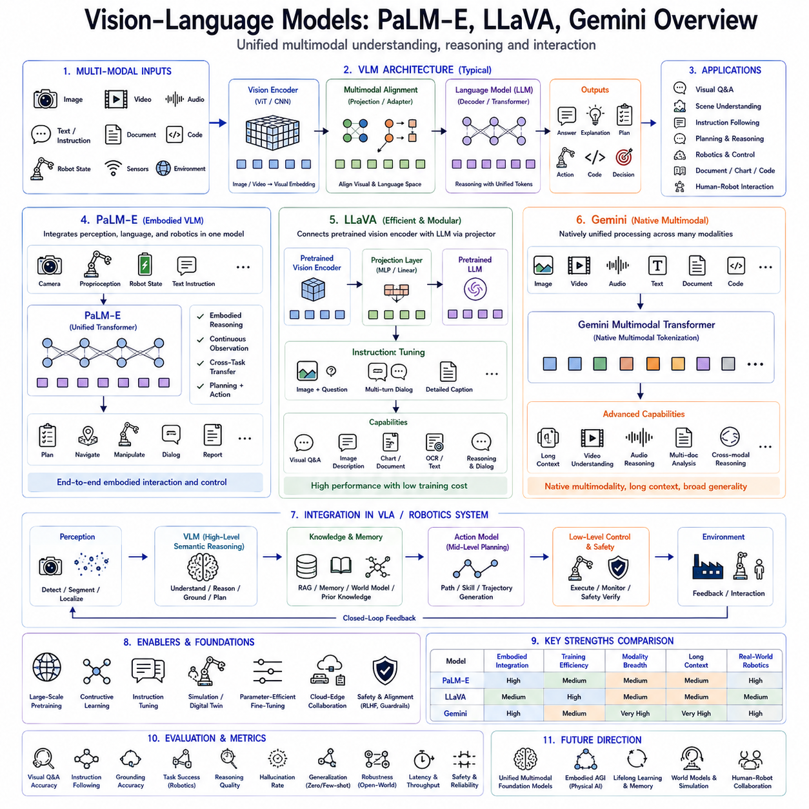{width="7.268055555555556in" height="7.268055555555556in"}

비전-언어 모델(VLM, Vision-Language Model)은 현대 인공지능(AI)에서 가장 중요한 기술 중 하나이다. 기존 컴퓨터 비전(Computer Vision)은 물체를 인식하거나 이미지를 분류하는 데 집중했지만, VLM은 영상(Image)과 자연어(Language)를 하나의 통합된 추론 구조에서 처리한다. 이를 통해 단순한 객체 인식을 넘어 장면(Scene)을 이해하고, 사람의 의도를 추론하며, 상황(Context)을 설명하고, 복잡한 질문에 답할 수 있다. 특히 물리 AI(Physical AI)에서는 비전-언어-행동(VLA, Vision-Language-Action) 시스템의 핵심 구성 요소로 사용되어 장면 이해(Scene Understanding), 의미 추론(Semantic Reasoning), 작업 계획(Task Planning), 환경 해석(Environment Interpretation)을 담당한다.

비전-언어 모델이 등장한 이유는 기존 AI의 한계를 극복하기 위해서이다. 컴퓨터 비전은 물체와 사람을 인식할 수 있지만 "왜 이 물체가 중요한가" 또는 "다음에 어떤 행동을 해야 하는가"를 설명하기 어렵다. 반대로 대규모 언어 모델(LLM, Large Language Model)은 뛰어난 추론 능력을 가지고 있지만 원래는 이미지를 직접 이해하지 못했다. VLM은 이러한 두 기술을 결합하여 시각 정보와 언어 정보를 동시에 이해할 수 있도록 만든 모델이다.

인간의 인지 과정도 동일한 원리로 동작한다. 사람은 공장에 들어가면 기계를 보고, 작업 흐름을 이해하며, 안전 표지판을 읽고, 과거 경험을 활용하여 전체 상황을 자연스럽게 이해한다. 시각, 언어, 기억(Memory), 상식(Common Sense)이 독립적으로 동작하는 것이 아니라 하나의 통합된 사고 과정으로 연결된다. VLM은 이러한 인간의 멀티모달(Multimodal) 인지 구조를 인공지능으로 구현한 것이다.

초기의 컴퓨터 비전은 SIFT, SURF, HOG와 같은 수작업 특징(Handcrafted Feature)을 사용하였다. 이후 합성곱 신경망(CNN, Convolutional Neural Network)이 등장하면서 자동으로 특징을 학습할 수 있게 되었고, 트랜스포머(Transformer) 기반 언어 모델은 자연어 이해를 혁신적으로 발전시켰다. 이러한 두 기술이 결합되면서 현대의 비전-언어 모델이 탄생하였다.

현대 VLM은 크게 세 부분으로 구성된다. 비전 인코더(Vision Encoder)는 영상을 잠재 특징(Latent Feature)으로 변환하고, 언어 모델(Language Model)은 자연어를 이해하며, 두 영역을 연결하는 멀티모달 정렬(Multimodal Alignment)이 시각 특징을 언어 모델이 이해할 수 있는 형태로 변환한다. 이후 하나의 통합된 표현(Unified Representation) 위에서 추론이 수행된다.

비전 인코더는 비전 트랜스포머(ViT, Vision Transformer), CNN, 자기지도학습(Self-Supervised Learning), 마스크드 이미지 모델링(Masked Image Modeling) 등을 사용한다. 입력 영상은 여러 개의 패치(Image Patch)로 분할되거나 CNN을 통해 특징을 추출한 후, 고차원의 임베딩(Embedding)으로 변환되어 언어 토큰(Token)과 유사한 형태로 처리된다.

언어 모델은 디코더(Decoder) 또는 인코더-디코더(Encoder-Decoder) 기반 트랜스포머를 사용한다. LLM은 상식(Common Sense), 논리 추론(Logical Reasoning), 절차 지식(Procedural Knowledge), 수학적 추론(Mathematical Reasoning), 대화(Dialogue)를 담당하며, VLM은 이러한 언어 능력을 영상 정보와 결합하여 멀티모달 추론을 수행한다.

멀티모달 정렬(Multimodal Alignment)은 VLM의 핵심 기술이다. 영상 특징과 언어 토큰은 서로 다른 표현 공간(Representation Space)을 가지므로 직접 연결할 수 없다. 정렬 과정은 의미적으로 대응되는 영상과 문장이 동일한 잠재 공간에 위치하도록 학습하여, 언어 모델이 영상 정보를 자연스럽게 이해할 수 있도록 만든다.

대조 학습(Contrastive Learning)은 멀티모달 정렬의 대표적인 방법이다. 같은 의미를 가진 영상과 문장은 잠재 공간에서 가까워지고, 관련 없는 영상과 문장은 멀어지도록 학습한다. 수십억 개의 이미지-텍스트(Image-Text) 데이터를 이용한 사전학습(Pretraining)이 이러한 정렬을 가능하게 한다.

명령 기반 미세조정(Instruction Tuning)은 실제 활용성을 크게 향상시킨다. 단순한 이미지 설명(Image Captioning)이 아니라 그림 설명, 질문 응답(Visual Question Answering), 문서 해석(Document Understanding), 이상 탐지(Anomaly Detection), 차트 분석(Chart Analysis), 장시간 대화(Long Conversation) 등을 수행하도록 학습된다.

PaLM-E는 로봇과 VLM을 본격적으로 결합한 대표적인 모델이다. 기존 VLM이 이미지와 언어만 사용했던 것과 달리, PaLM-E는 로봇 상태(Robot State), 센서 데이터(Sensor Data), 카메라 영상(Camera Image), 자연어 명령을 모두 하나의 트랜스포머 입력으로 사용한다. 이를 통해 실제 로봇이 작업을 수행하면서 동시에 추론할 수 있는 최초의 대규모 멀티모달 모델 중 하나가 되었다.

PaLM-E의 가장 큰 특징은 체화된 추론(Embodied Reasoning)이다. 단순히 정적인 이미지를 이해하는 것이 아니라 로봇이 실제 환경에서 이동하고 조작하는 과정에서 얻는 센서 정보를 지속적으로 반영한다. 따라서 추론과 물리 행동이 하나의 통합된 과정으로 연결된다.

또한 PaLM-E는 서로 다른 작업(Task) 간의 전이 학습(Transfer Learning) 성능이 우수하다. 비전, 언어, 조작(Manipulation), 자율주행(Navigation) 데이터를 함께 학습함으로써 하나의 작업에서 얻은 지식이 다른 작업에도 자연스럽게 활용된다.

LLaVA(Large Language and Vision Assistant)는 기존 LLM과 비전 인코더를 효율적으로 결합한 구조이다. 거대한 멀티모달 모델을 처음부터 학습하는 대신, 이미 학습된 비전 인코더와 LLM을 연결하는 프로젝션 레이어(Projection Layer)를 추가하여 비교적 적은 비용으로 높은 성능을 달성하였다.

LLaVA의 가장 큰 장점은 모듈형(Modular) 구조이다. 비전 인코더는 기존 이미지 인식 능력을 그대로 유지하고, 언어 모델도 기존 추론 능력을 유지한다. 두 모델을 연결하는 작은 네트워크만 학습하면 되므로 전체 모델을 새롭게 학습하는 것보다 훨씬 효율적이다.

LLaVA는 이미지 대화(Image Conversation) 성능이 매우 우수하다. 사진, 도면, 그래프, 산업 설비, 손글씨 문서 등을 이해하고 사용자의 질문에 자연스럽게 답할 수 있다. 비교적 적은 학습 비용으로도 뛰어난 멀티모달 성능을 보여준 대표적인 사례이다.

프로젝션 레이어는 LLaVA의 핵심이다. 비전 인코더의 출력과 LLM의 입력 차원이 서로 다르므로, 다층 퍼셉트론(MLP, Multi-Layer Perceptron)이나 선형 계층(Linear Layer)을 사용하여 두 표현 공간을 연결한다. 구조는 단순하지만 매우 효과적인 멀티모달 정렬을 수행한다.

Gemini는 처음부터 멀티모달을 고려하여 설계된 네이티브 멀티모달(Native Multimodal) 파운데이션 모델이다. 이미지(Image), 영상(Video), 음성(Audio), 문서(Document), 코드(Code), 수식(Mathematical Notation), 자연어를 모두 하나의 모델에서 동시에 처리할 수 있도록 설계되었다.

Gemini의 가장 큰 특징은 멀티모달 토큰화(Multimodal Tokenization)이다. 영상, 음성, 문서, 코드가 모두 동일한 토큰(Token) 형태로 표현되어 하나의 트랜스포머 안에서 함께 추론된다. 따라서 기존처럼 별도의 정렬 과정 없이도 다양한 정보를 자연스럽게 통합할 수 있다.

Gemini는 장문맥(Long Context) 처리 능력도 매우 뛰어나다. 긴 매뉴얼, CAD 문서, 생산 이력, 유지보수 기록, 대규모 대화 등 수십만 개 이상의 토큰을 동시에 처리할 수 있어 기업 환경과 산업용 로봇에 매우 적합하다.

영상(Video) 이해 능력도 Gemini의 중요한 특징이다. 단순한 이미지가 아니라 시간에 따라 변화하는 장면을 이해하여 사람의 행동, 조립 과정, 검사 절차, 공정 흐름을 추론할 수 있다. 이는 산업 자동화와 자율주행에서 매우 중요한 기능이다.

음성(Audio)도 하나의 모달리티로 처리된다. 사람의 음성 명령, 기계 소음, 진동, 환경음을 동시에 분석하여 보다 풍부한 멀티모달 추론이 가능하다. 이는 사람과 로봇의 자연스러운 협업(Human-Robot Collaboration)을 지원한다.

문서 이해(Document Understanding)도 중요한 기능이다. 기술 문서, CAD 도면, 검사 보고서, 표(Table), 수식, 그래프 등을 하나의 모델에서 동시에 이해할 수 있다. OCR(Optical Character Recognition) 이후 별도의 분석이 필요했던 기존 방식보다 훨씬 높은 수준의 문서 이해가 가능하다.

로봇 분야에서 VLM은 저수준 제어(Low-Level Control)가 아니라 고수준 의미 추론(High-Level Semantic Reasoning)을 담당한다. 센서는 물체와 환경을 인식하고, VLM은 작업 목표를 이해하며, 의미 관계를 분석하고, 계획을 생성한다. 실제 모터 제어는 액션 모델(Action Model)이 수행하는 계층형 구조(Hierarchical Architecture)가 일반적이다.

장면 이해(Scene Understanding)는 VLM의 대표적인 기능이다. 단순히 물체를 인식하는 것이 아니라 사람, 설비, 장애물, 위험 요소의 관계를 이해하고, 앞으로 일어날 행동을 예측하며, 작업 흐름까지 파악한다. 이러한 의미 기반 장면 이해는 자율 로봇의 핵심 능력이다.

시각 접지(Visual Grounding)는 자연어와 실제 물체를 연결하는 기술이다. "빨간 공구함 옆의 렌치를 집어라."와 같은 명령에서 "렌치"와 "빨간 공구함"을 정확하게 영상 속 객체와 연결해야 한다. 이는 언어와 비전의 통합 추론이 필요한 대표적인 문제이다.

어포던스 추론(Affordance Reasoning)은 물체의 기능(Function)을 이해하는 능력이다. 의자는 앉을 수 있고, 공구함은 공구를 보관하며, 충전 스테이션은 배터리를 충전한다는 기능적 의미를 이해해야 적절한 행동을 계획할 수 있다.

조작(Manipulation)에서도 VLM은 중요한 역할을 한다. 대상 물체를 인식하고, 작업 목적을 이해하며, 적절한 파지 위치(Grasp Point)를 추론하고, 필요한 절차를 계획한다. 실제 궤적(Trajectory)은 액션 모델이 생성하지만, 의미적 계획은 VLM이 담당한다.

자율주행(Navigation)에서도 VLM은 의미 기반 이동(Semantic Navigation)을 지원한다. 단순한 지도(Map)가 아니라 작업 공간(Workspace), 위험 구역(Hazard Area), 충전소(Charging Station), 검사 지점(Inspection Point)을 이해하여 상황에 맞는 이동 계획을 생성한다.

검색 증강 생성(RAG, Retrieval-Augmented Generation)은 VLM과 자연스럽게 결합된다. CAD 도면, 유지보수 매뉴얼, 디지털 트윈(Digital Twin), 생산 이력, 작업 문서 등을 검색하여 모델 내부 지식과 함께 추론에 활용할 수 있다. 따라서 최신 정보를 별도의 재학습 없이 사용할 수 있다.

메모리(Memory)도 중요한 역할을 수행한다. 에피소드 메모리(Episodic Memory)는 과거 작업 경험을 저장하고, 의미 메모리(Semantic Memory)는 환경과 사물의 지식을 저장하며, 절차 메모리(Procedural Memory)는 반복 가능한 기술(Skill)을 저장한다. 작업 메모리(Working Memory)는 현재 대화와 작업 상태를 유지한다.

세계 모델(World Model)은 VLM과 결합되어 미래를 예측한다. 사람의 이동, 장애물 변화, 배터리 상태, 기계의 열화 등을 예측하여 현재뿐 아니라 미래 상황까지 고려한 계획을 생성할 수 있다.

계층형 액션 모델(Hierarchical Action Model)에서는 VLM이 상위 정책(High-Level Policy)에 해당한다. 작업 목표를 이해하고, 의미적 계획을 생성하며, 중간 정책(Mid-Level Policy)이 경로와 기술(Skill)을 생성하고, 하위 정책(Low-Level Policy)이 실제 모터를 제어한다.

시뮬레이션(Simulation)은 VLM 학습에서 매우 중요하다. 디지털 트윈은 영상, 언어, 센서, 환경 정보를 동시에 생성하여 제조, 물류, 의료, 농업, 시설 점검 등 다양한 데이터를 대규모로 생성할 수 있다. 이는 실제 데이터를 보완하는 핵심 기술이다.

파라미터 효율적 미세조정(PEFT, Parameter-Efficient Fine-Tuning)은 기존 VLM을 산업 환경에 맞게 쉽게 수정할 수 있도록 한다. LoRA(Low-Rank Adaptation), 어댑터(Adapter), 프롬프트 튜닝(Prompt Tuning) 등을 이용하여 공장 자동화, 물류, 의료, 농업 등에 특화된 모델을 효율적으로 구축할 수 있다.

클라우드-엣지 협업(Cloud-Edge Collaboration)은 VLM의 대표적인 운영 방식이다. 클라우드는 장문맥 추론, RAG, 세계 모델, 대규모 멀티모달 추론을 수행하고, 엣지는 센서 처리, 위치 추정, 안전 제어, 실시간 행동 생성을 담당한다. 계산 효율성과 실시간성을 동시에 확보할 수 있다.

안전(Safety)은 VLM과 별도로 관리된다. VLM은 의미 추론을 수행하지만, 실제 실행 전에는 충돌 감지(Collision Detection), 작업 공간 제한(Workspace Constraint), 힘 제한(Force Limit), 비상 정지(Emergency Stop), 사이버보안(Cybersecurity) 등의 안전 시스템이 반드시 검증을 수행한다.

VLM의 평가는 단순한 이미지 캡셔닝(Image Captioning)이 아니라 시각 질의응답(VQA, Visual Question Answering), 명령 수행(Instruction Following), 시각 접지(Visual Grounding), 문서 이해(Document Understanding), 영상 이해(Video Understanding), 일반화(Generalization), 환각(Hallucination), 추론 품질(Reasoning Quality), 실제 로봇 작업 성공률(Task Success Rate) 등을 종합적으로 평가한다.

향후 VLM은 이미지, 영상, 음성, 촉각(Tactile), 힘 센서(Force), 내부 상태(Proprioception), 메모리(Memory), 세계 모델(World Model), 검색 증강 생성(RAG), 시뮬레이션(Simulation)을 모두 하나의 파운데이션 모델(Foundation Model)로 통합할 것으로 예상된다. 이는 단순한 인식 모델이 아니라 로봇의 인지 운영체제(Cognitive Operating System) 역할을 수행하게 될 것이다.

결국 **PaLM-E**, **LLaVA**, **Gemini**는 비전-언어 모델의 발전 단계를 대표한다. **PaLM-E**는 로봇과 체화된 추론(Embodied Reasoning)을 통합하였고, **LLaVA**는 효율적인 모듈형 멀티모달 구조를 제시하였으며, **Gemini**는 이미지, 영상, 음성, 문서, 코드, 장문맥(Long Context)을 모두 처리하는 네이티브 멀티모달 파운데이션 모델로 발전하였다. 이러한 VLM은 앞으로 비전-언어-행동(VLA), 메모리, 세계 모델, 검색 증강 생성(RAG), 계층형 액션 모델(Hierarchical Action Model)을 통합하는 차세대 물리 AI(Physical AI)의 핵심 인지 엔진(Cognitive Engine)으로 자리매김할 것으로 전망된다.

## 5.2 PaLM-E: Embodied Multimodal Language Model (with Code)

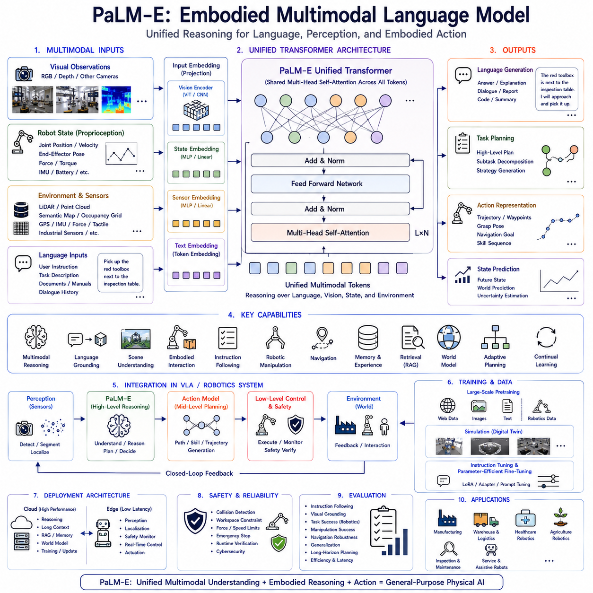{width="7.268055555555556in" height="7.268055555555556in"}

PaLM-E(Pathways Language Model for Embodied Intelligence)는 대규모 언어 모델(LLM, Large Language Model)을 실제 물리 세계와 연결한 최초의 대표적인 체화형(Embodied) 멀티모달 모델이다. 기존 LLM이 자연어만 처리했던 것과 달리, PaLM-E는 카메라 영상(Camera Image), 로봇 상태(Robot State), 환경 정보(Environment Observation), 자연어(Language)를 하나의 트랜스포머(Transformer) 안에서 동시에 처리한다. 이를 통해 비전-언어-행동(VLA, Vision-Language-Action)의 핵심 개념인 체화 지능(Embodied Intelligence)을 구현하는 기반을 마련하였다.

PaLM-E가 등장한 배경은 기존 LLM의 한계를 극복하기 위해서였다. 기존 언어 모델은 로봇 제어나 작업 절차를 설명할 수는 있었지만 실제 센서 데이터를 이해하거나 물리 환경과 상호작용할 수는 없었다. 반대로 기존 로봇 시스템은 물체를 인식하고 경로를 생성할 수 있었지만 복잡한 의미 추론(Semantic Reasoning) 능력이 부족했다. PaLM-E는 이러한 두 영역을 하나의 모델로 통합하여 언어 추론과 물리 행동을 연결하였다.

인간은 시각(Vision), 언어(Language), 촉각(Touch), 기억(Memory), 신체 감각(Proprioception)을 동시에 활용하여 환경을 이해한다. 공장에 들어가면 기계를 보고, 작업 순서를 이해하고, 안전 규칙을 인식하며, 과거 경험을 활용하여 행동을 결정한다. PaLM-E는 이러한 인간의 통합 인지 구조를 트랜스포머 기반의 멀티모달 아키텍처로 구현하려는 시도이다.

기존 로봇은 인식(Perception), 위치 추정(Localization), 계획(Planning), 제어(Control)를 각각 독립된 모듈로 구현하였다. 이러한 구조는 유지보수에는 유리하지만 각 모듈 간 의미 정보(Semantic Information)가 충분히 공유되지 못하는 문제가 있었다. PaLM-E는 모든 정보를 하나의 잠재 공간(Latent Space)에서 처리하여 의미 정보가 전체 시스템에 지속적으로 전달되도록 설계되었다.

PaLM-E의 핵심 아이디어는 언어 토큰(Language Token)뿐 아니라 비언어 정보(Non-Linguistic Observation)도 동일한 토큰(Token) 형태로 처리하는 것이다. 카메라 영상, 로봇 상태, 센서 데이터, 자연어 명령을 모두 임베딩(Embedding)으로 변환하여 하나의 트랜스포머 입력으로 사용한다. 이를 통해 서로 다른 데이터가 동일한 방식으로 추론에 활용된다.

비전 인코더(Vision Encoder)는 RGB 카메라(RGB Camera), 깊이 카메라(Depth Camera), 다양한 센서 영상을 고차원 임베딩으로 변환한다. 이 임베딩은 물체의 색상(Color), 형태(Shape), 질감(Texture), 조명(Illumination), 공간 구조(Scene Structure) 등 풍부한 시각 정보를 포함하며, 단순한 객체 라벨(Object Label)이 아니라 의미를 가진 연속적인 표현으로 유지된다.

로봇 상태(Proprioception)도 중요한 입력이다. 관절 위치(Joint Position), 속도(Joint Velocity), 엔드이펙터 자세(End-Effector Pose), 힘 센서(Force Sensor), 휠 인코더(Wheel Encoder), IMU(Inertial Measurement Unit), 배터리 상태(Battery Status) 등이 각각 임베딩으로 변환되어 로봇의 현재 신체 상태를 표현한다.

환경 정보(Environment Observation)도 함께 입력된다. 의미 지도(Semantic Map), 장애물(Obstacle), 점유 격자(Occupancy Grid), GPS, LiDAR, 힘 센서, 산업용 센서 등이 모두 멀티모달 입력으로 사용된다. PaLM-E는 이러한 다양한 센서를 별도의 모듈이 아니라 하나의 통합된 표현으로 처리한다.

자연어(Language)는 여전히 핵심 입력이다. 사용자 명령(User Instruction), 작업 절차(Procedure), 유지보수 문서(Maintenance Manual), 생산 계획(Production Schedule), 대화(Dialogue History) 등이 언어 토큰으로 입력된다. 모든 입력이 동일한 트랜스포머 안에서 처리되므로 언어와 센서 데이터가 자연스럽게 결합된다.

서로 다른 입력을 하나의 모델에서 처리하기 위해 프로젝션 네트워크(Projection Network)가 사용된다. 영상 특징, 로봇 상태, 센서 값은 각각 동일한 차원의 임베딩으로 변환되어 언어 토큰과 함께 트랜스포머에 입력된다. 이러한 임베딩 정렬(Embedding Alignment)이 PaLM-E의 핵심 기술 중 하나이다.

트랜스포머 구조 자체는 기존 LLM과 거의 동일하다. 멀티헤드 셀프 어텐션(Multi-Head Self-Attention)은 모든 토큰이 서로를 참조하도록 하며, 언어 토큰은 영상 특징을 참고하고, 로봇 상태는 계획에 영향을 주며, 환경 정보는 행동 생성을 수정한다. 서로 다른 모달리티(Modality)가 동일한 어텐션 메커니즘을 통해 연결된다.

이러한 구조에서는 크로스 모달 추론(Cross-Modal Reasoning)이 자연스럽게 이루어진다. "검사대 옆의 빨간 공구함을 가져와라."라는 명령에서 "빨간 공구함"이라는 언어 토큰은 해당 물체의 시각 특징과 연결되고, 로봇 상태는 현재 도달 가능한지를 판단하며, 환경 지도는 이동 경로를 제공한다. 모든 정보가 동시에 추론에 활용된다.

PaLM-E는 긍정적 전이 학습(Positive Transfer Learning)의 대표적인 사례이기도 하다. 언어 이해 능력이 향상되면 작업 계획도 향상되고, 시각 인식 성능이 높아지면 언어 접지(Language Grounding)도 향상된다. 하나의 작업에서 학습한 지식이 다른 작업에도 자연스럽게 활용되는 것이 큰 장점이다.

PaLM-E의 가장 중요한 개념은 체화된 멀티모달 추론(Embodied Multimodal Reasoning)이다. 기존 VLM은 정적인 이미지(Image)를 이해하는 데 집중했지만, PaLM-E는 실제 로봇이 움직이면서 지속적으로 새로운 센서 데이터를 받아 추론을 갱신한다. 추론과 행동이 하나의 폐루프(Closed Loop)를 형성하는 것이다.

연속적인 환경 인식(Continuous Perception)은 체화 지능의 핵심이다. 로봇은 이동하면서 사람, 장애물, 조명, 작업 환경이 계속 변하는 상황을 관찰하고, 새로운 센서 정보가 들어올 때마다 내부 표현을 업데이트하여 행동을 수정한다.

PaLM-E는 언어를 실제 물리 세계에 접지(Grounding)한다. "왼쪽", "뒤", "밀어라", "들어 올려라"와 같은 단어는 단순한 텍스트가 아니라 실제 센서와 로봇 동작을 통해 의미를 갖게 된다. 이러한 체화된 언어 이해(Embodied Language Understanding)는 기존 LLM과 가장 큰 차이점이다.

장면 이해(Scene Understanding)도 크게 향상된다. 단순히 물체를 인식하는 것이 아니라 기계와 작업자의 관계, 위험 요소, 작업 흐름, 향후 발생 가능한 상황까지 추론할 수 있다. 이러한 의미 기반 장면 이해는 이후 액션 모델(Action Model)의 중요한 입력이 된다.

작업 계획(Task Planning)은 여러 정보가 동시에 활용된다. 자연어 명령은 목표를 제공하고, 비전은 작업 대상을 찾으며, 환경 정보는 이동 가능성을 판단하고, 로봇 상태는 실제 수행 가능 여부를 결정한다. PaLM-E는 이러한 모든 정보를 하나의 추론 과정에서 통합한다.

조작(Manipulation)에서도 PaLM-E는 물체를 인식하고, 접근 가능성을 평가하며, 어포던스(Affordance)를 추론하고, 적절한 작업 순서를 생성한다. 이후 실제 궤적(Trajectory)은 하위 액션 모델(Action Model)이 생성하지만, 의미 기반 계획은 PaLM-E가 담당한다.

자율주행(Navigation) 역시 의미 기반으로 수행된다. 단순한 지도(Map)가 아니라 검사 구역, 충전소, 위험 구역, 작업 공간 등을 이해하여 더욱 지능적인 이동 계획을 생성할 수 있다.

메모리(Memory)는 이후 PaLM-E 계열 연구에서 더욱 중요해졌다. 에피소드 메모리(Episodic Memory)는 이전 작업 경험을 저장하고, 의미 메모리(Semantic Memory)는 환경 지식을 저장하며, 절차 메모리(Procedural Memory)는 반복 가능한 작업 기술(Skill)을 저장한다. 이를 통해 장기간 작업에서도 지속적인 학습이 가능해진다.

검색 증강 생성(RAG, Retrieval-Augmented Generation)은 PaLM-E를 더욱 강력하게 만든다. 유지보수 문서, CAD 도면, 디지털 트윈(Digital Twin), 생산 데이터베이스 등을 필요할 때 검색하여 모델 내부 지식과 함께 추론에 사용할 수 있다. 최신 정보도 재학습 없이 활용 가능하다.

세계 모델(World Model)은 현재뿐 아니라 미래 환경도 예측한다. 사람의 이동, 장애물 변화, 배터리 감소, 기계 열화 등을 예측하여 선제적인(Proactive) 계획을 생성한다. 이는 단순한 반응형(Reactive) 제어보다 훨씬 높은 수준의 지능을 제공한다.

시뮬레이션(Simulation)은 PaLM-E 학습에서 매우 중요한 역할을 한다. 디지털 트윈은 영상, 센서, 언어, 환경 변화 데이터를 동시에 생성하여 제조, 물류, 농업, 의료, 시설 점검 등 다양한 분야의 대규모 멀티모달 데이터를 제공한다.

Sim-to-Real 기술은 시뮬레이션에서 학습한 모델을 실제 로봇에 적용하기 위한 핵심 기술이다. 도메인 랜덤화(Domain Randomization), 자기지도학습(Self-Supervised Learning), 지속적 학습(Continual Learning), 적응형 미세조정(Adaptive Fine-Tuning)을 이용하여 실제 환경에서도 높은 성능을 유지하도록 한다.

명령 기반 미세조정(Instruction Tuning)은 실제 활용성을 크게 향상시킨다. 작업 명령 수행, 센서 데이터 해석, 이상 상황 설명, 작업 보고서 생성, 사용자 질의응답 등을 학습하여 산업 현장에서 사용할 수 있는 수준의 멀티모달 비서를 구현한다.

파라미터 효율적 미세조정(PEFT, Parameter-Efficient Fine-Tuning)은 LoRA(Low-Rank Adaptation), 어댑터(Adapter), 프롬프트 튜닝(Prompt Tuning)을 이용하여 제조, 물류, 의료, 농업 등 특정 산업 분야에 맞게 PaLM-E를 효율적으로 수정할 수 있도록 지원한다.

실제 운영은 클라우드-엣지 협업(Cloud-Edge Collaboration) 구조가 일반적이다. 클라우드는 장문맥(Long Context), RAG, 세계 모델, 지속적 학습을 담당하고, 엣지는 센서 처리, 위치 추정, 안전 감시, 실시간 제어를 담당한다. 이를 통해 계산 효율성과 실시간성을 동시에 확보할 수 있다.

PaLM-E는 계층형 비전-언어-행동(VLA) 구조에서도 핵심 역할을 수행한다. 상위 정책(High-Level Policy)은 의미 이해와 계획을 담당하고, 중간 정책(Mid-Level Policy)은 경로와 작업 절차를 생성하며, 하위 정책(Low-Level Policy)은 모터 제어와 안전 제어를 수행한다. 인지(Cognition)와 제어(Control)를 계층적으로 분리하는 구조이다.

안전(Safety)은 PaLM-E와 독립적으로 운영된다. PaLM-E가 생성한 계획은 반드시 충돌 감지(Collision Detection), 작업 공간 제한(Workspace Constraint), 힘 제한(Force Limit), 비상 정지(Emergency Stop), 사이버보안(Cybersecurity) 검증을 통과한 후 실행된다.

PaLM-E는 단순한 언어 모델이 아니라 실제 로봇 작업(Task Completion), 시각 접지(Visual Grounding), 명령 수행(Instruction Following), 조작 성공률(Manipulation Success), 자율주행 성능(Navigation Performance), 일반화(Generalization), 장기 계획(Long-Horizon Planning), 계산 효율(Computational Efficiency) 등을 종합적으로 평가한다.

산업 분야에서는 제조 자동화, 물류 로봇, 농업 로봇, 의료 로봇, 시설 점검 로봇 등 다양한 분야에서 활용 가능성이 확인되고 있다. 생산 지시를 이해하고, 작업 상황을 분석하며, 실제 환경에서 사람과 협업하는 것이 가능해진다.

PaLM-E의 가장 큰 의의는 로봇을 여러 개의 독립된 소프트웨어 모듈이 아니라 하나의 통합된 멀티모달 추론 시스템으로 바라보았다는 점이다. 인식(Perception), 언어(Language), 메모리(Memory), 계획(Planning), 조작(Manipulation), 자율주행(Navigation)이 모두 하나의 표현 공간에서 연결되면서 차세대 물리 AI(Physical AI)의 새로운 방향을 제시하였다.

이후 등장한 다양한 VLA와 파운데이션 모델(Foundation Model)은 PaLM-E의 개념을 발전시켜 네이티브 멀티모달(Native Multimodal), 세계 모델(World Model), 검색 증강 생성(RAG), 확산 정책(Diffusion Policy), 지속적 학습(Continual Learning), 계층형 계획(Hierarchical Planning)을 통합하는 방향으로 발전하고 있다.

결국 **PaLM-E(Pathways Language Model for Embodied Intelligence)**는 언어(Language), 비전(Vision), 로봇 상태(Proprioception), 환경 정보(Environment Observation)를 하나의 트랜스포머(Transformer)에서 통합 처리한 최초의 체화형(Embodied) 멀티모달 파운데이션 모델이다. 이는 비전-언어-행동(VLA)의 개념을 실질적으로 구현한 출발점으로 평가되며, 이후 LLaVA, Gemini, RT-2, OpenVLA 등 차세대 물리 AI(Physical AI) 시스템의 설계 철학에 큰 영향을 미쳤다. 앞으로도 메모리(Memory), 세계 모델(World Model), 검색 증강 생성(RAG), 지속적 학습(Continual Learning), 계층형 액션 모델(Hierarchical Action Model)과 결합되어 범용 체화 지능(General-Purpose Embodied Intelligence)의 핵심 인지 엔진(Cognitive Engine)으로 발전할 것으로 전망된다.

## 5.3 LLaVA for Robotic Instruction Following (with Code)

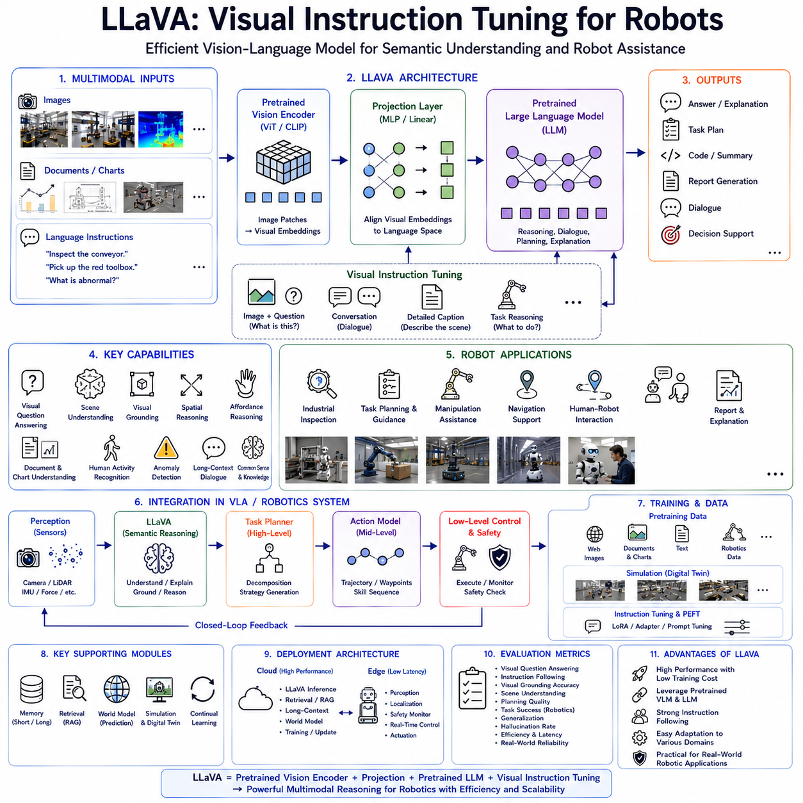{width="7.268055555555556in" height="7.268055555555556in"}

LLaVA(Large Language and Vision Assistant)는 비전-언어 모델(VLM, Vision-Language Model)의 발전 과정에서 가장 큰 영향을 준 모델 중 하나이다. PaLM-E처럼 거대한 멀티모달 파운데이션 모델(Foundation Model)을 처음부터 학습하는 대신, 이미 학습된 비전 인코더(Vision Encoder)와 대규모 언어 모델(LLM, Large Language Model)을 가벼운 프로젝션 모듈(Projection Module)로 연결한 후, 시각 명령 미세조정(Visual Instruction Tuning)을 수행하는 구조를 채택하였다. 이러한 설계는 학습 비용을 크게 줄이면서도 뛰어난 멀티모달 추론 성능을 달성할 수 있음을 보여주었다.

LLaVA의 개발 배경은 기존 LLM과 컴퓨터 비전 모델이 이미 각각 뛰어난 능력을 가지고 있다는 점에서 출발하였다. LLM은 방대한 텍스트를 통해 추론 능력을 학습하였고, 비전 인코더는 대규모 이미지 데이터로부터 우수한 시각 특징을 학습하였다. LLaVA는 새로운 거대 모델을 다시 만드는 대신, 두 모델을 효율적으로 연결하여 기존 지식을 최대한 활용하는 접근법을 제시하였다. 이로 인해 계산 비용을 크게 줄이면서도 매우 높은 성능을 얻을 수 있었다.

인간의 학습 과정도 이와 유사하다. 사람은 언어를 배운 후 시각 경험을 다시 처음부터 학습하지 않는다. 새로운 사물을 보면서 이미 알고 있는 언어 개념과 연결하고, 반복적인 경험을 통해 시각과 언어를 자연스럽게 통합한다. LLaVA는 이러한 인간의 학습 원리를 반영하여 독립적으로 학습된 비전 모델과 언어 모델을 하나의 추론 체계로 연결하였다.

기존 로봇 시스템은 영상 인식, 객체 탐지(Object Detection), 의미 분할(Semantic Segmentation), 위치 추정(Localization), 작업 계획(Task Planning)을 각각 별도의 모듈로 구현하였다. 이러한 구조는 산업 현장에서는 안정적이지만, 개방형 환경(Open World)이나 자연어 명령을 이해하는 데에는 한계가 있었다. LLaVA는 영상과 언어를 동시에 이해하는 의미 추론 계층(Semantic Reasoning Layer)을 제공하여 보다 자연스러운 인간-로봇 상호작용(Human-Robot Interaction)을 가능하게 하였다.

LLaVA의 전체 구조는 매우 단순하다. 첫 번째는 이미지에서 특징을 추출하는 비전 인코더(Vision Encoder), 두 번째는 추론과 대화를 담당하는 대규모 언어 모델(LLM), 그리고 이 둘을 연결하는 프로젝션 레이어(Projection Layer)로 구성된다. 이러한 간결한 구조에도 불구하고 매우 우수한 멀티모달 성능을 보여 주었다.

비전 인코더는 일반적으로 비전 트랜스포머(ViT, Vision Transformer)를 사용한다. 입력 이미지는 여러 개의 패치(Image Patch)로 나누어지고, 이를 임베딩(Embedding)으로 변환하여 객체의 형태, 색상, 질감, 공간 구조, 조명 정보 등을 포함하는 고차원 시각 특징을 생성한다. 이러한 특징은 단순한 객체 이름이 아니라 풍부한 의미 정보를 가진 연속적인 표현이다.

기존 컴퓨터 비전에서는 최종적으로 객체 이름(Object Label)만 출력하는 경우가 많았지만, LLaVA는 시각 임베딩을 그대로 유지한다. 따라서 객체 간의 미세한 차이, 공간적 관계, 환경 정보, 불확실성(Uncertainty)까지 함께 보존할 수 있으며, 언어 모델은 이러한 풍부한 시각 정보를 기반으로 추론을 수행한다.

언어 모델은 기존에 학습된 LLM을 그대로 사용한다. 상식(Common Sense), 논리 추론(Logical Reasoning), 수학(Mathematical Reasoning), 절차 지식(Procedural Knowledge), 대화(Dialogue), 문맥 이해(Context Understanding) 능력을 그대로 활용하며, 새롭게 학습하는 것은 영상 정보를 언어 모델이 이해할 수 있도록 연결하는 부분뿐이다.

LLaVA의 핵심 기술은 프로젝션 레이어(Projection Layer)이다. 비전 인코더가 출력하는 특징 벡터와 LLM의 토큰(Token)은 차원이 다르기 때문에, 다층 퍼셉트론(MLP, Multi-Layer Perceptron)이나 선형 계층(Linear Layer)을 이용하여 두 표현 공간을 연결한다. 이 작은 네트워크만 학습하면 기존 비전 모델과 언어 모델을 효과적으로 결합할 수 있다.

프로젝션 레이어만 학습하기 때문에 학습해야 하는 파라미터(Parameter)가 매우 적다. 대부분의 비전 인코더와 LLM은 고정(Frozen)된 상태를 유지하므로 학습 비용이 크게 감소하며, 기존 모델이 이미 가지고 있는 지식을 그대로 활용할 수 있다. 이러한 효율성은 LLaVA가 빠르게 확산된 가장 큰 이유 중 하나이다.

LLaVA의 또 다른 핵심은 시각 명령 미세조정(Visual Instruction Tuning)이다. 기존 이미지 캡셔닝(Image Captioning)은 단순히 그림을 설명하는 데 그쳤지만, LLaVA는 질문 응답(Visual Question Answering), 객체 비교(Object Comparison), 장면 설명(Scene Explanation), 문서 이해(Document Understanding), 이상 탐지(Anomaly Detection), 작업 절차 설명(Task Explanation) 등 다양한 형태의 대화를 학습하였다.

시각 명령 학습을 통해 사용자는 "이 공장에서 무슨 작업이 진행되고 있는가?", "어떤 부품을 먼저 집어야 하는가?", "이 조립 과정에서 잘못된 부분은 무엇인가?", "안전 문제가 있는가?"와 같은 질문을 자연스럽게 할 수 있으며, LLaVA는 영상을 이해한 뒤 논리적인 답변을 생성한다.

로봇 분야에서는 이러한 명령 기반 학습이 특히 중요하다. 작업자는 복잡한 좌표(Coordinate)를 입력하지 않고 "컨베이어를 검사하고 이상 부품을 찾아라." 또는 "냉각 장치 옆에서 누수가 발생한 파이프를 찾아라."와 같이 자연어로 명령할 수 있다. LLaVA는 이러한 명령을 시각 정보와 함께 해석하여 작업 목표를 이해한다.

장면 이해(Scene Understanding)는 LLaVA의 대표적인 기능이다. 단순히 기계와 사람을 인식하는 것이 아니라, 작업자와 설비의 관계, 공정 흐름, 장애물, 안전 장비 등을 함께 이해한다. 이러한 의미 기반(Scene Semantic) 이해는 이후 작업 계획과 행동 생성의 핵심 입력이 된다.

시각 접지(Visual Grounding)는 자연어와 실제 물체를 연결하는 기술이다. "파란 공구함 옆의 렌치를 집어라."라는 명령에서 "파란 공구함"과 "렌치"를 실제 영상 속 객체와 정확하게 연결하고, 공간 관계(Spatial Relation)를 이해하여 목표를 찾는다.

공간 추론(Spatial Reasoning)은 왼쪽(Left), 오른쪽(Right), 위(Above), 아래(Below), 안쪽(Inside), 바깥쪽(Outside), 가까운(Near), 먼(Far)과 같은 상대적 위치를 자연스럽게 이해하도록 한다. 별도의 규칙 기반 시스템 없이도 자연어만으로 공간 관계를 해석할 수 있다.

어포던스 추론(Affordance Reasoning)은 물체의 기능(Function)을 이해하는 능력이다. 드라이버(Screwdriver)는 나사를 조이는 도구이며, 충전 스테이션(Charging Station)은 배터리를 충전하는 장소이고, 컨베이어는 제품을 이동시키는 설비라는 기능적 의미를 이해한다. 이는 로봇의 작업 계획에서 매우 중요한 요소이다.

사람의 행동 인식(Human Activity Recognition)도 가능하다. 단순히 사람을 탐지하는 것이 아니라 조립 작업, 점검 작업, 유지보수, 물류 이동, 위험 행동 등을 의미적으로 이해할 수 있다. 이러한 기능은 협업 로봇(Collaborative Robot)에서 매우 중요한 역할을 한다.

산업 설비 점검(Industrial Inspection)은 LLaVA의 대표적인 활용 분야이다. 카메라 영상을 분석하여 이상 부위를 설명하고, 유지보수 문서를 참고하며, 고장의 원인을 추론하고, 자동으로 점검 보고서를 생성할 수 있다. 단순한 이상 탐지에서 벗어나 의미 기반 설명까지 가능하다.

문서 이해(Document Understanding)도 중요한 기능이다. 기술 문서, CAD 도면, 유지보수 매뉴얼, 검사 보고서, 라벨(Label), 제어 패널(Control Panel), 생산 일정표 등을 이미지와 텍스트를 함께 분석하여 이해할 수 있다.

차트 분석(Chart Understanding)도 가능하다. 생산 통계, 품질 관리 그래프, 에너지 사용량, 물류 현황 등을 시각적으로 해석하고 자연어로 설명할 수 있다. 별도의 데이터베이스(DB)가 없어도 대시보드(Dashboard)를 직접 이해할 수 있다는 장점이 있다.

시각 질의응답(VQA, Visual Question Answering)은 LLaVA의 핵심 기능이다. 작업자는 현재 장면에 대해 질문하고, 로봇은 영상을 근거로 상황을 설명한다. 이러한 대화형 인터페이스는 기존 GUI(Graphical User Interface)보다 훨씬 직관적인 작업 환경을 제공한다.

작업 계획(Task Planning)에서도 LLaVA는 직접 제어를 수행하지 않는다. 대신 작업 목표를 분석하고, 필요한 도구와 절차를 설명하며, 위험 요소를 제시하는 등 의미 기반 계획을 생성한다. 이후 액션 모델(Action Model)이 실제 경로(Trajectory)와 제어 명령을 생성한다.

자율주행(Navigation)에서도 의미 기반 이동(Semantic Navigation)을 지원한다. 단순한 지도(Map)가 아니라 작업 공간, 충전 구역, 위험 지역, 검사 지점을 이해하여 보다 지능적인 이동 계획을 생성한다.

메모리(Memory)는 장시간 작업에서 중요한 역할을 한다. 이전 대화, 과거 작업 결과, 사용자 선호도(User Preference), 설비 상태 등을 기억하여 연속적인 작업을 수행할 수 있다. 이는 장시간 운영되는 산업용 로봇에서 매우 유용하다.

검색 증강 생성(RAG, Retrieval-Augmented Generation)은 LLaVA를 더욱 강력하게 만든다. 유지보수 문서, CAD 도면, 디지털 트윈(Digital Twin), 검사 이력, 소프트웨어 저장소 등을 필요할 때 검색하여 현재 영상과 함께 추론할 수 있다. 이를 통해 최신 정보도 실시간으로 활용할 수 있다.

세계 모델(World Model)은 현재 장면뿐 아니라 미래 환경까지 예측한다. 사람의 이동, 장비 상태 변화, 교통 흐름, 배터리 감소 등을 예측하여 선제적인(Proactive) 계획을 생성하도록 지원한다.

시뮬레이션(Simulation)은 LLaVA 학습에서도 매우 중요하다. 디지털 트윈은 영상, 언어, 센서 데이터, 작업 시나리오를 대량으로 생성하여 제조, 물류, 의료, 농업, 시설 점검 등 다양한 산업 분야에 맞는 학습 데이터를 제공한다.

파라미터 효율적 미세조정(PEFT, Parameter-Efficient Fine-Tuning)은 LoRA(Low-Rank Adaptation), 어댑터(Adapter), 프롬프트 튜닝(Prompt Tuning) 등을 이용하여 적은 데이터만으로도 공장 자동화, 물류, 농업, 의료 등 특정 산업에 맞는 LLaVA를 쉽게 구축할 수 있도록 한다.

실제 운영에서는 클라우드-엣지 협업(Cloud-Edge Collaboration)이 일반적이다. 클라우드는 장문맥(Long Context), 문서 이해, 검색 증강 생성(RAG), 지속적 학습을 수행하고, 엣지는 영상 처리, 센서 융합(Sensor Fusion), 위치 추정(Localization), 실시간 제어를 담당한다.

PaLM-E와 비교하면 LLaVA는 로봇 상태(Proprioception)를 직접 입력받는 체화형 모델(Embodied Model)은 아니다. 대신 이미지와 언어를 중심으로 의미 추론을 수행하며, 실제 제어는 별도의 액션 모델(Action Model)에 맡긴다. 따라서 LLaVA는 로봇의 인지 엔진(Cognitive Engine) 역할에 더욱 적합하다.

Gemini와 비교하면 LLaVA는 훨씬 적은 계산 비용으로 높은 성능을 달성한다. 거대한 네이티브 멀티모달 모델(Native Multimodal Model)을 새로 학습하지 않고도, 기존 모델을 효율적으로 연결하여 경쟁력 있는 성능을 보여 주었다는 점이 가장 큰 특징이다.

안전(Safety)은 LLaVA와 독립적으로 관리된다. LLaVA가 생성한 의미 추론 결과는 반드시 충돌 감지(Collision Detection), 작업 공간 제한(Workspace Constraint), 힘 제한(Force Limit), 비상 정지(Emergency Stop), 사이버보안(Cybersecurity) 검증을 거친 후 실행된다.

LLaVA의 평가는 단순한 이미지 캡셔닝이 아니라 시각 질의응답(VQA), 명령 수행(Instruction Following), 시각 접지(Visual Grounding), 장면 이해(Scene Understanding), 문서 해석(Document Interpretation), 계획 생성(Planning), 이상 설명(Anomaly Explanation), 환각(Hallucination), 일반화(Generalization), 실제 로봇 작업(Task Success) 등을 종합적으로 평가한다.

산업 현장에서는 제조 자동화, 물류 로봇, 농업 로봇, 의료 로봇, 시설 점검 로봇 등 다양한 분야에서 활용되고 있다. 작업 지시를 이해하고, 설비 상태를 설명하며, 작업 보고서를 생성하고, 사람과 자연스럽게 대화하는 지능형 인터페이스로 사용된다.

LLaVA는 이후 등장한 다양한 비전-언어-행동(VLA) 시스템에 큰 영향을 미쳤다. 프로젝션 기반 정렬(Projection-Based Alignment), 시각 명령 미세조정(Visual Instruction Tuning), 파라미터 효율적 학습(PEFT), 계층형 추론(Hierarchical Reasoning)은 이후 대부분의 멀티모달 모델에서 채택되는 핵심 기술이 되었다.

향후에는 영상(Video), 음성(Audio), 촉각(Tactile), 힘 센서(Force Sensor), 세계 모델(World Model), 메모리(Memory), 검색 증강 생성(RAG), 지속적 학습(Continual Learning), 다중 에이전트(Multi-Agent) 협업과 결합되어 더욱 강력한 멀티모달 인지 시스템으로 발전할 것으로 예상된다.

결국 **LLaVA(Large Language and Vision Assistant)**는 거대한 멀티모달 모델을 새롭게 구축하지 않고도, 기존 **비전 인코더(Vision Encoder)**와 **대규모 언어 모델(LLM)**을 효율적으로 연결하고 **시각 명령 미세조정(Visual Instruction Tuning)**을 수행함으로써 뛰어난 멀티모달 추론 능력을 구현한 대표적인 모델이다. 로봇 분야에서는 장면 이해(Scene Understanding), 자연어 명령 해석(Instruction Following), 시각 접지(Visual Grounding), 작업 계획(Task Planning), 사람-로봇 상호작용(Human-Robot Interaction)의 핵심 인지 엔진으로 활용되며, 차세대 **비전-언어-행동(VLA)** 시스템과 **물리 AI(Physical AI)**의 중요한 기반 기술로 자리매김하고 있다.

## 5.4 Gemini for Robotics (with Code)

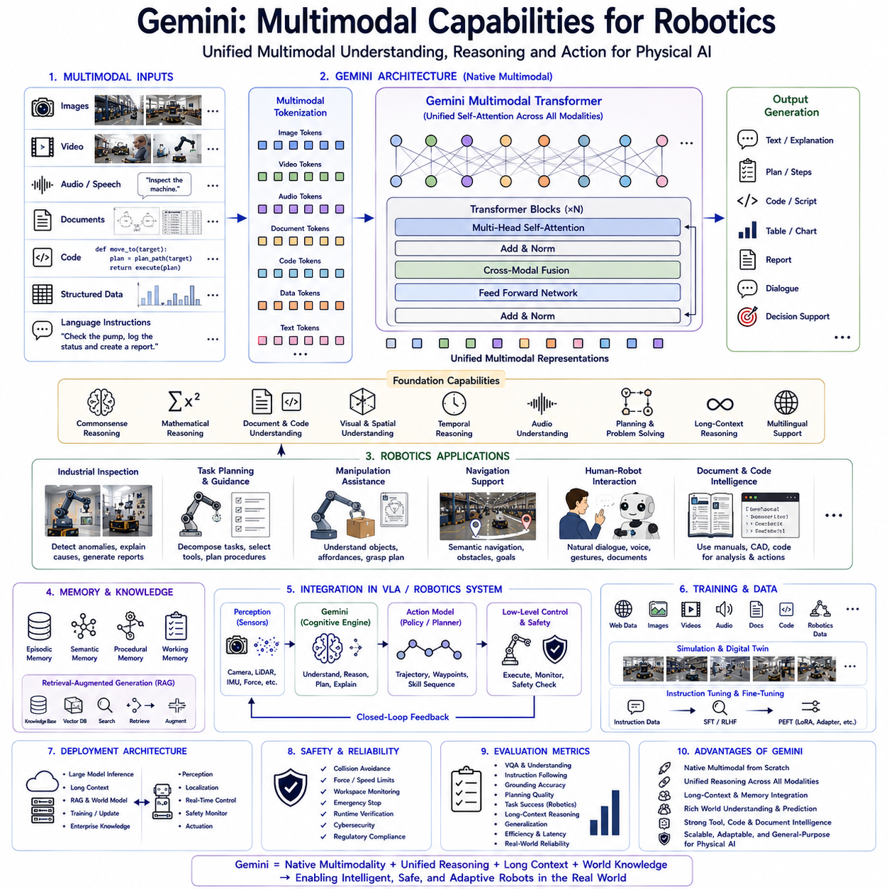{width="7.268055555555556in" height="7.268055555555556in"}

Gemini는 현재 가장 발전된 멀티모달(Multimodal) 파운데이션 모델(Foundation Model) 중 하나로, 처음부터 여러 종류의 데이터를 동시에 처리하도록 설계되었다. 기존 비전-언어 모델(VLM, Vision-Language Model)이 언어 모델에 시각 정보를 추가하는 방식이었다면, Gemini는 이미지(Image), 영상(Video), 음성(Audio), 문서(Document), 소스 코드(Source Code), 구조화 데이터(Structured Data), 자연어(Language)를 하나의 통합된 아키텍처에서 함께 이해하고 추론한다. 이러한 설계는 로봇이 다양한 센서와 정보를 하나의 지능 체계에서 처리할 수 있도록 하여 차세대 물리 AI(Physical AI)의 핵심 인지 엔진(Cognitive Engine) 역할을 수행한다.

Gemini가 개발된 배경은 실제 인간의 지능이 본질적으로 멀티모달이라는 점에 있다. 사람은 시각(Vision), 청각(Hearing), 촉각(Touch), 언어(Language), 기억(Memory), 경험(Experience), 환경 정보(Environment)를 동시에 활용하여 판단한다. 예를 들어 공장에 들어가면 설비를 보고, 기계 소리를 듣고, 경고 표지를 읽고, 과거 경험을 활용하여 현재 상황을 이해한다. Gemini는 이러한 인간의 통합 인지 과정을 하나의 트랜스포머(Transformer) 모델 안에서 구현하고자 설계되었다.

초기의 비전-언어 모델은 대부분 대규모 언어 모델(LLM)에 비전 인코더(Vision Encoder)를 추가하는 구조였다. 그러나 Gemini는 처음부터 네이티브 멀티모달(Native Multimodal) 구조를 목표로 개발되었다. 이미지, 영상, 음성, 문서, 코드, 수식(Mathematics) 등이 모두 동일한 중요도를 가지며 하나의 모델 안에서 동시에 처리된다. 따라서 특정 모달리티(Modality)가 중심이 되는 것이 아니라 모든 정보가 동일한 수준에서 추론에 참여한다.

Gemini의 핵심 기술 중 하나는 멀티모달 토큰화(Multimodal Tokenization)이다. 기존 언어 모델은 단어(Token)만 처리하고, 컴퓨터 비전은 이미지 임베딩(Image Embedding)을 별도로 처리하였다. Gemini는 서로 다른 형태의 데이터를 동일한 토큰(Token) 구조로 변환하여 하나의 트랜스포머 안에서 함께 처리한다. 이로써 영상, 음성, 문서, 코드가 모두 동일한 어텐션(Attention) 메커니즘에서 상호작용할 수 있게 된다.

Gemini의 시각 처리(Vision Processing)는 단순한 객체 인식(Object Detection)을 넘어선다. 물체를 식별하는 것뿐 아니라 객체 간의 의미 관계(Semantic Relationship), 기능(Function), 공간 구조(Spatial Layout), 시간적 변화(Temporal Dynamics), 사람의 행동(Human Activity), 주변 환경(Context)을 함께 이해한다. 따라서 로봇은 단순히 "무엇이 있는가"가 아니라 "현재 어떤 상황인가"까지 판단할 수 있다.

영상(Video) 이해는 Gemini의 가장 큰 장점 중 하나이다. 실제 로봇은 정적인 이미지가 아니라 계속 변화하는 환경에서 동작한다. 생산 공정, 물류 이동, 협업 작업, 농업 작업, 시설 점검은 모두 시간(Time)에 따라 변화하는 과정이다. Gemini는 연속적인 영상 프레임(Frame)을 함께 분석하여 작업 순서와 환경 변화를 이해하고 미래 상황까지 예측할 수 있다.

음성(Audio) 이해 역시 중요한 기능이다. 산업 현장에는 기계 소리, 모터 진동, 경보음(Alarm), 사람의 음성 명령, 유체 누설 소리 등 다양한 음향 정보가 존재한다. Gemini는 이러한 음향 정보를 영상과 함께 분석하여 장비 이상을 탐지하거나 사람의 명령을 이해하고 보다 풍부한 상황 판단을 수행할 수 있다.

문서 이해(Document Understanding)는 산업용 로봇에서 매우 중요한 기능이다. 공장과 물류센터에는 CAD 도면, 유지보수 매뉴얼(Maintenance Manual), 검사 보고서(Inspection Report), 생산 일정표, 안전 규정(Safety Regulation), 작업 절차(Procedure)가 존재한다. Gemini는 텍스트, 표(Table), 그래프(Graph), 그림(Diagram), 수식(Mathematical Equation)을 동시에 이해하여 로봇이 문서를 직접 활용할 수 있도록 한다.

소스 코드(Source Code) 이해 능력도 Gemini의 차별화 요소이다. 현대 로봇은 ROS 패키지, PLC 프로그램, 자동화 스크립트(Script), API 문서, 임베디드 소프트웨어와 밀접하게 연결된다. Gemini는 코드와 문서를 동시에 분석하여 프로그램을 이해하고, 코드 생성(Code Generation), 디버깅(Debugging), 시스템 통합(System Integration)까지 지원할 수 있다.

수학(Mathematical Reasoning)은 공학 분야에서 매우 중요하다. 로봇 운동학(Kinematics), 동역학(Dynamics), 제어(Control), 최적화(Optimization), 센서 융합(Sensor Fusion)은 모두 수학을 기반으로 한다. Gemini는 수식과 자연어를 함께 이해하므로 기술 문서와 수학 모델을 동시에 분석할 수 있으며, 이는 공학 계산과 연구 개발에 큰 장점을 제공한다.

Gemini의 트랜스포머는 모든 모달리티를 동일한 셀프 어텐션(Self-Attention)으로 처리한다. 이미지는 문서를 참고하고, 문서는 영상을 참고하며, 음성은 이미지와 연결된다. 각각의 데이터가 독립적으로 처리되는 것이 아니라 하나의 통합된 추론 과정에서 서로 영향을 주고받는다. 이는 기존의 모듈형 AI와 가장 큰 차이점이다.

장문맥(Long Context) 처리 능력은 Gemini의 또 다른 핵심 기능이다. 실제 산업 환경에서는 유지보수 이력, 검사 기록, 생산 데이터, 작업 매뉴얼, 지도(Map), 대화 기록 등을 동시에 참고해야 한다. Gemini는 수십만 개 이상의 토큰을 처리할 수 있어 방대한 정보를 한 번에 분석할 수 있다.

문맥 유지(Context Persistence) 능력도 뛰어나다. 장시간 작업에서는 이전 대화, 과거 작업 결과, 환경 변화, 새로운 센서 정보가 지속적으로 추가된다. Gemini는 이러한 정보를 장기간 유지하여 긴 작업 동안에도 일관된 추론을 수행할 수 있다.

장면 이해(Scene Understanding)는 단순한 물체 인식을 넘어 작업 환경 전체를 이해한다. 설비 간의 관계, 작업 순서, 사람의 협업, 자재 이동, 안전 구역, 위험 요소 등을 종합적으로 분석하여 현재 상황을 의미적으로 해석한다. 이러한 전체적인 상황 인식(Situational Awareness)은 고수준 작업 계획의 핵심이 된다.

시각 접지(Visual Grounding)는 자연어와 실제 환경을 연결하는 기술이다. "파란 공구함 옆의 드라이버를 가져와라."와 같은 명령에서 "파란 공구함"과 "드라이버"를 영상 속 객체와 연결하고, 공간 관계까지 이해하여 정확한 작업 대상을 찾는다.

어포던스 추론(Affordance Reasoning)은 물체의 기능을 이해하는 능력이다. 밸브는 유량을 조절하고, 충전기는 배터리를 충전하며, 컨베이어는 제품을 이동시키는 기능을 가진다는 것을 이해한다. 이러한 기능적 이해는 로봇이 적절한 행동(Action)을 선택하는 데 매우 중요한 역할을 한다.

작업 계획(Task Planning)은 다양한 정보를 함께 활용한다. 자연어 명령, 현재 환경, 기술 문서, 이전 작업 이력, 디지털 트윈(Digital Twin), 작업 목표가 모두 하나의 추론 과정에 사용된다. Gemini는 실제 모터를 제어하기보다는 작업을 여러 단계로 분해하고 필요한 자원과 절차를 계획하는 역할을 수행한다.

사람-로봇 상호작용(Human-Robot Interaction)은 Gemini의 대표적인 활용 분야이다. 사람은 음성, 그림, 사진, 문서, 손글씨 메모 등 다양한 방식으로 정보를 전달한다. Gemini는 이러한 다양한 입력을 동시에 이해하여 사람과 자연스럽게 협업할 수 있는 인터페이스를 제공한다.

산업 설비 점검(Industrial Inspection)에서는 카메라 영상뿐 아니라 유지보수 문서, 과거 점검 기록, CAD 도면, 센서 데이터를 함께 분석한다. 이상 현상을 설명하고, 가능한 고장 원인을 추론하며, 유지보수 절차를 추천하고 자동으로 보고서를 생성할 수 있다.

물류 자동화(Warehouse Automation)에서도 Gemini는 재고 데이터베이스, 바코드, 창고 지도, 주문 정보, 음성 명령, 카메라 영상을 동시에 활용한다. 이를 통해 재고 관리, 주문 처리, 예외 상황 대응을 보다 지능적으로 수행할 수 있다.

농업 로봇(Agricultural Robotics)은 작물 영상, 기상 정보(Weather Forecast), 토양 데이터, 관개 일정(Irrigation Schedule), 농업 지식을 함께 분석하여 정밀 농업(Precision Agriculture)을 수행할 수 있다. 단순히 작물을 인식하는 것이 아니라 환경 전체를 고려한 의사결정을 지원한다.

의료 로봇(Healthcare Robotics)에서는 의료 영상(Medical Imaging), 환자 기록(Patient Record), 의사의 지시, 생체 신호(Vital Signs), 환경 정보를 함께 분석한다. 이를 통해 의료진을 지원하고 보다 안전한 의료 서비스를 제공할 수 있다.

사회기반시설 점검(Infrastructure Inspection)에서는 교량, 터널, 철도, 파이프라인 등의 영상과 구조 설계 문서, 점검 기록, 센서 데이터를 함께 분석한다. 구조물의 열화(Degradation)를 예측하고 유지보수 우선순위를 결정하며 자동으로 기술 보고서를 작성할 수 있다.

메모리(Memory)는 Gemini의 핵심 요소이다. 에피소드 메모리(Episodic Memory)는 이전 작업 경험을 저장하고, 의미 메모리(Semantic Memory)는 공학 지식과 환경 정보를 저장하며, 절차 메모리(Procedural Memory)는 반복 가능한 작업 기술(Skill)을 저장한다. 작업 메모리(Working Memory)는 현재 대화와 작업 상태를 유지하여 장기적인 협업을 가능하게 한다.

검색 증강 생성(RAG, Retrieval-Augmented Generation)은 Gemini와 자연스럽게 결합된다. CAD 데이터베이스, 디지털 트윈, 소프트웨어 저장소, 품질 관리 문서, 안전 규정 등을 실시간으로 검색하여 모델 내부 지식과 함께 추론에 활용한다. 이를 통해 최신 정보를 항상 사용할 수 있다.

세계 모델(World Model)은 미래를 예측하는 기능을 담당한다. 사람의 이동, 장비 마모, 교통 흐름, 날씨 변화, 배터리 감소 등을 예측하여 위험을 미리 방지하고 선제적인(Proactive) 계획을 생성할 수 있다.

시뮬레이션(Simulation)은 Gemini 학습에서도 매우 중요하다. 디지털 트윈은 영상, 음성, 센서, 문서, 작업 시나리오를 동시에 생성하여 제조, 물류, 의료, 농업, 광산, 건설 등 다양한 산업 분야에 필요한 대규모 멀티모달 데이터를 제공한다.

파라미터 효율적 적응(Parameter-Efficient Adaptation)은 LoRA(Low-Rank Adaptation), 어댑터(Adapter), 프롬프트 튜닝(Prompt Tuning), 검색 기반 적응(Retrieval Customization)을 이용하여 산업별 특화 모델을 효율적으로 구축할 수 있도록 한다. 전체 모델을 다시 학습하지 않아도 특정 분야에 맞게 쉽게 적용할 수 있다.

실제 운영에서는 클라우드-엣지 협업(Cloud-Edge Collaboration)이 일반적이다. 클라우드는 장문맥 추론, RAG, 세계 모델, 지속적 학습을 수행하고, 엣지는 센서 처리, 위치 추정(Localization), 장애물 회피, 안전 제어를 담당한다. 이를 통해 계산 성능과 실시간성을 동시에 확보할 수 있다.

안전(Safety)은 Gemini와 별도의 시스템으로 관리된다. Gemini가 아무리 뛰어난 추론 능력을 가지더라도 실제 로봇 제어 전에는 충돌 방지(Collision Avoidance), 힘 제한(Force Limitation), 작업 공간 감시(Workspace Monitoring), 비상 정지(Emergency Stop), 사이버보안(Cybersecurity) 검증이 반드시 수행되어야 한다.

Gemini 기반 로봇의 평가는 시각 질의응답(VQA), 문서 이해(Document Understanding), 영상 이해(Video Understanding), 음성 추론(Audio Reasoning), 명령 수행(Instruction Following), 작업 계획(Task Planning), 시각 접지(Visual Grounding), RAG 성능, 장문맥 처리(Long Context), 실제 로봇 작업 성공률(Task Success), 계산 효율성(Computational Efficiency), 일반화(Generalization) 등을 종합적으로 평가한다.

PaLM-E와 비교하면 Gemini는 단순한 로봇 상태 통합을 넘어 이미지, 영상, 음성, 문서, 코드, 수학, 메모리, 검색 시스템까지 모두 포함하는 범용 멀티모달 지능으로 발전하였다. LLaVA가 효율적인 시각-언어 정렬을 강조하였다면, Gemini는 처음부터 모든 모달리티를 하나의 통합 구조로 처리하는 네이티브 멀티모달 모델이라는 점이 가장 큰 차이이다.

향후 Gemini는 촉각(Tactile), 힘 센서(Force Sensor), 이벤트 카메라(Event Camera), 레이더(Radar), LiDAR, 생체 신호(Biosignal), 다중 에이전트(Multi-Agent), 지속적 학습(Continual Learning), 자기 개선(Self-Improvement), 세계 모델(World Model)과 결합되어 더욱 강력한 물리 AI(Physical AI) 플랫폼으로 발전할 것으로 예상된다.

결국 **Gemini**는 이미지(Image), 영상(Video), 음성(Audio), 언어(Language), 문서(Document), 코드(Source Code), 수학(Mathematical Reasoning), 메모리(Memory), 검색 증강 생성(RAG), 세계 모델(World Model)을 하나의 트랜스포머(Transformer)에서 통합 처리하는 최초의 **네이티브 멀티모달(Native Multimodal)** 파운데이션 모델이다. 이는 제조, 물류, 의료, 농업, 시설 점검, 서비스 로봇 등 다양한 분야에서 **비전-언어-행동(VLA)** 시스템의 상위 인지 엔진(Cognitive Engine)으로 활용될 것이며, 차세대 범용 물리 AI(General-Purpose Physical AI)의 핵심 기반 기술로 자리매김할 것으로 전망된다.

## 5.5 GPT-4V API Integration for Robotics (with Code)

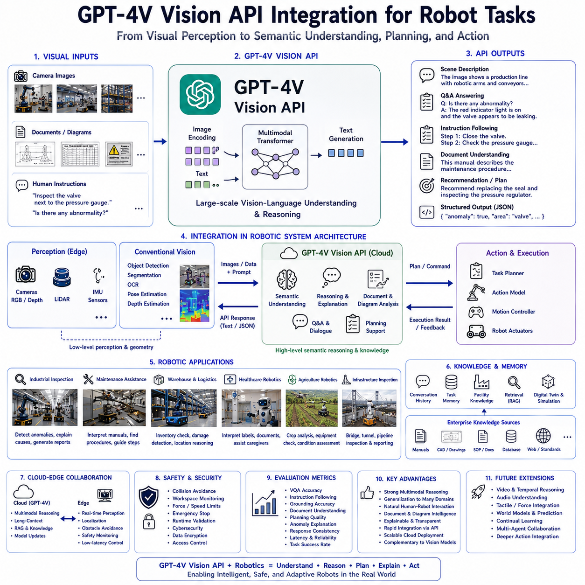{width="7.268055555555556in" height="7.268055555555556in"}

GPT-4V Vision API는 대규모 언어 모델(LLM, Large Language Model)이 이미지를 직접 이해할 수 있도록 확장한 대표적인 멀티모달(Multimodal) 인공지능 인터페이스이다. 기존의 대화형 언어 모델과 달리 GPT-4V는 이미지(Image), 문서(Document), 도면(Diagram), 장면(Scene)을 함께 이해하고 자연어(Language)로 추론할 수 있다. 로봇 분야에서는 카메라(Camera)를 통해 수집한 시각 정보를 의미적으로 해석하고, 작업 계획(Task Planning), 상황 설명(Scene Explanation), 의사결정(Decision Support)을 수행하는 상위 인지 엔진(Cognitive Engine)으로 활용된다.

GPT-4V가 로봇 분야에서 주목받는 이유는 기존 컴퓨터 비전(Computer Vision)의 한계를 보완하기 때문이다. 기존 시스템은 객체 탐지(Object Detection), 의미 분할(Semantic Segmentation), 문자 인식(OCR), 깊이 추정(Depth Estimation), 자세 추정(Pose Estimation) 등을 각각 독립적으로 수행하였다. 이러한 방법은 정확한 수치 계산에는 강하지만, "왜 이 물체가 중요한가?", "다음에는 어떤 행동을 해야 하는가?"와 같은 의미적 질문에는 답하기 어려웠다. GPT-4V는 이러한 의미 추론(Semantic Reasoning)을 수행하여 기존 비전 시스템을 보완한다.

인간은 사물을 볼 때 단순히 물체를 인식하는 것이 아니라 언어(Language), 기억(Memory), 경험(Experience), 상식(Common Sense)을 함께 활용한다. 예를 들어 공장에 들어가면 기계를 보고, 작업자를 확인하며, 안전 표지를 읽고, 과거 경험을 이용하여 현재 상황을 이해한다. GPT-4V는 이러한 인간의 통합 인지 과정을 모방하여 시각 정보와 언어 지식을 함께 활용하는 멀티모달 추론을 수행한다.

기존 로봇 비전 시스템은 특정 목적에 맞게 학습된 인식 모델이었다. 반면 GPT-4V는 범용 멀티모달 추론 모델이다. 단순히 객체를 인식하는 것이 아니라 장면을 설명하고, 질문에 답하며, 문서를 이해하고, 그림을 해석하고, 작업 절차를 추천하는 등 다양한 인지 작업을 수행할 수 있다. 이러한 범용성은 복잡한 실제 환경에서 매우 큰 장점이 된다.

GPT-4V Vision API는 표준 API(Application Programming Interface)를 통해 로봇과 연결된다. 로봇이 카메라로 촬영한 이미지를 API로 전송하고, 함께 자연어 프롬프트(Prompt)를 전달하면 GPT-4V는 시각 정보와 언어 정보를 동시에 분석하여 결과를 반환한다. 이를 통해 거대한 멀티모달 모델을 로컬(Local)에서 직접 실행하지 않아도 최신 AI 기능을 쉽게 사용할 수 있다.

일반적인 로봇 시스템에서는 카메라가 영상을 수집하고 기존 비전 알고리즘이 객체와 위치를 계산한다. GPT-4V는 그 위에서 의미적 해석을 담당한다. 즉 기존 컴퓨터 비전을 대체하는 것이 아니라, 저수준 인식(Low-Level Perception) 위에서 고수준 의미 추론(High-Level Semantic Reasoning)을 수행하는 계층형 구조(Hierarchical Architecture)를 형성한다.

GPT-4V의 시각 이해 능력은 객체 인식을 넘어선다. 물체 간의 관계(Relationship), 공간 구조(Spatial Layout), 환경(Context), 사람의 행동(Human Activity), 작업 흐름(Workflow), 위험 요소(Hazard), 기능(Function) 등을 함께 분석한다. 단순히 기계를 인식하는 것이 아니라 현재 어떤 작업이 진행 중이며 어떤 문제가 발생할 가능성이 있는지까지 설명할 수 있다.

장면 해석(Scene Interpretation)은 자율 로봇에서 매우 중요한 기능이다. 공장, 창고, 병원, 건설 현장, 농장, 연구소 등은 수많은 객체가 서로 관계를 맺고 있다. GPT-4V는 이러한 관계를 자연어로 설명하며 현재 상황을 의미적으로 이해한다. 이러한 상황 인식(Situational Awareness)은 이후 작업 계획(Task Planning)의 핵심 입력이 된다.

시각 접지(Visual Grounding)는 자연어와 실제 물체를 연결하는 기능이다. "압력계 옆의 밸브를 점검하라." 또는 "하역장 근처의 손상된 박스를 이동하라."와 같은 명령에서 언어와 영상 속 객체를 정확하게 연결하여 작업 대상을 식별한다. 이는 사람과 로봇의 자연스러운 상호작용(Human-Robot Interaction)에 필수적인 기술이다.

문서 이해(Document Understanding)는 GPT-4V의 강력한 기능 중 하나이다. 유지보수 매뉴얼(Maintenance Manual), CAD 도면(CAD Drawing), 조립 설명서(Assembly Instruction), 검사 보고서(Inspection Report), 장비 라벨(Label), 전기 회로도(Electrical Schematic), 생산 일정표 등을 카메라 영상만으로 이해할 수 있다. 별도의 문서 처리 시스템 없이도 로봇이 기술 문서를 직접 활용할 수 있다.

광학 문자 인식(OCR, Optical Character Recognition)은 GPT-4V의 일부 기능일 뿐이다. 단순히 글자를 읽는 것이 아니라 의미를 이해한다. 예를 들어 경고 문구를 읽고 안전상 의미를 설명하거나, 점검 보고서의 수치를 읽고 유지보수 필요성을 판단할 수 있다. 즉 문자 인식과 의미 해석이 동시에 이루어진다.

도면(Diagram)과 기술 문서(Engineering Document) 해석도 중요한 기능이다. 공정 흐름도(Process Flow Diagram), 배관도(Piping Diagram), 전기 회로(Electrical Circuit), 공장 배치도(Layout), 디지털 트윈(Digital Twin) 등을 분석하여 구조와 관계를 설명하고 설계 오류나 이상 요소를 찾아낼 수 있다.

시각 질의응답(VQA, Visual Question Answering)은 GPT-4V의 대표적인 활용 방식이다. 작업자는 "현재 장비 상태가 정상인가?", "어떤 부품이 문제인가?", "작업이 어디까지 진행되었는가?"와 같은 질문을 할 수 있으며, GPT-4V는 카메라 영상을 근거로 자연스럽게 답변한다.

작업 계획(Task Planning)에서는 GPT-4V가 직접 모터를 제어하지 않는다. 대신 작업 목표를 분석하고, 필요한 절차를 설명하며, 위험 요소를 제시하고, 작업 순서를 계획한다. 실제 이동 경로와 제어 명령은 액션 모델(Action Model)이나 기존 로봇 제어기가 생성한다. 따라서 GPT-4V는 상위 계획(High-Level Planning)을 담당한다.

산업 설비 점검(Industrial Inspection)은 GPT-4V가 가장 큰 효과를 발휘하는 분야 중 하나이다. 카메라 영상에서 장비 상태를 분석하고, 이상을 설명하며, 가능한 고장 원인을 추론하고, 유지보수 절차를 추천하며, 자동으로 점검 보고서를 생성할 수 있다. 단순한 이상 탐지를 넘어 의미 기반 진단(Semantic Diagnosis)이 가능하다.

물류 자동화(Warehouse Automation)에서도 GPT-4V는 재고 사진, 바코드, 포장 상태, 창고 위치, 배송 라벨 등을 분석한다. 재고 오류를 설명하고, 손상된 포장을 식별하며, 물류 흐름을 이해하고, 창고 운영을 지원할 수 있다.

의료 로봇(Healthcare Robotics)에서는 의료 영상(Medical Image), 환자 문서(Patient Record), 약품 라벨(Medication Label), 병실 환경을 함께 분석한다. 의료진을 보조하고 환자 상태를 설명하는 등 상황 인식 기반 의료 지원이 가능하다.

농업 로봇(Agricultural Robotics)은 작물 영상(Crop Image), 관개 시설(Irrigation System), 장비 상태, 병해충(Pest Damage), 작업 기록을 함께 분석한다. 단순한 작물 인식이 아니라 농장 전체의 운영 상태를 이해하고 관리 방안을 제안할 수 있다.

사회기반시설 점검(Infrastructure Inspection)에서는 교량, 터널, 철도, 송전 시설, 파이프라인의 영상을 분석한다. 균열, 부식, 열화 현상을 설명하고 유지보수 우선순위를 제안하며, 기술 보고서를 자동으로 생성할 수 있다.

이미지 비교(Image Comparison)는 또 다른 중요한 기능이다. 현재 제품과 기준 이미지(Reference Image)를 비교하거나, 과거 설비 상태와 현재 상태를 비교하여 변화와 이상을 설명할 수 있다. 단순히 차이를 찾는 것이 아니라 그 차이가 가지는 의미까지 해석한다.

시간적 추론(Temporal Reasoning)은 연속적인 작업에서 중요한 역할을 한다. GPT-4V 자체는 개별 요청을 처리하지만, 외부 메모리(Memory)와 결합하면 이전 영상과 현재 영상을 비교하여 장기간 설비 상태나 작업 진행 상황을 분석할 수 있다.

메모리(Memory)는 GPT-4V를 더욱 강력하게 만든다. 이전 대화, 과거 점검 결과, 작업 기록, 사용자 선호도, 설비 이력 등을 외부 시스템에서 관리하고 GPT-4V와 결합하면 장기적인 작업 수행과 일관된 의사결정이 가능해진다.

검색 증강 생성(RAG, Retrieval-Augmented Generation)은 GPT-4V와 매우 잘 결합된다. 유지보수 문서, CAD 도면, 디지털 트윈, 생산 데이터, 품질 기준, 안전 규정 등을 검색하여 현재 카메라 영상과 함께 분석함으로써 보다 정확하고 최신의 결과를 제공할 수 있다.

세계 모델(World Model)은 현재 영상뿐 아니라 미래 환경도 예측한다. 장비의 열화, 사람의 이동, 배터리 감소, 생산 일정 등을 함께 고려하여 선제적(Proactive) 계획을 생성할 수 있다. 이를 통해 단순 반응형(Reactive) 제어를 넘어 예측 기반(Predictive) 의사결정이 가능해진다.

클라우드 기반(Cloud-Based) GPT-4V는 로컬 컴퓨터에서 거대한 모델을 실행할 필요가 없다는 장점이 있다. 비교적 작은 엣지 컴퓨터(Edge Computer)에서도 최신 멀티모달 AI를 활용할 수 있으며, 모델 업데이트와 유지관리도 중앙에서 이루어진다.

그러나 클라우드 사용에는 네트워크 지연(Latency), 통신 안정성(Reliability), 개인정보 보호(Privacy), 보안(Security), 대역폭(Bandwidth), 운영 비용(Cost) 등의 문제가 존재한다. 따라서 실제 산업용 로봇은 클라우드와 엣지를 함께 사용하는 하이브리드 구조(Hybrid Cloud-Edge Architecture)를 채택하는 경우가 많다.

이러한 구조에서는 엣지 컴퓨터가 위치 추정(Localization), 장애물 회피(Obstacle Avoidance), 안전 제어(Safety Control), 실시간 센서 처리를 담당하고, GPT-4V는 의미 추론, 문서 해석, 계획 생성, 대화 기능을 담당한다. 실시간성과 고급 인지 기능을 동시에 확보할 수 있는 구조이다.

보안(Security)은 Vision API를 사용할 때 매우 중요한 요소이다. 공장 내부 사진이나 생산 설비는 기업의 핵심 자산일 수 있으므로 암호화(Encryption), 인증(Authentication), 접근 제어(Access Control), 감사(Audit) 체계가 반드시 필요하다. 안전한 데이터 관리가 전제되어야 Vision API를 산업 현장에서 활용할 수 있다.

안전(Safety)은 GPT-4V와 독립적으로 운영된다. GPT-4V가 제안한 작업은 반드시 충돌 방지(Collision Avoidance), 작업 공간 감시(Workspace Monitoring), 힘 제한(Force Limitation), 비상 정지(Emergency Stop), 사이버보안(Cybersecurity) 검증을 거친 후 실행되어야 한다. GPT-4V는 계획을 제안하지만 실제 실행은 안전 시스템이 최종 검증한다.

GPT-4V 기반 로봇은 이미지 인식 정확도만 평가하지 않는다. 시각 질의응답(VQA), 문서 이해(Document Understanding), 장면 해석(Scene Understanding), 명령 수행(Instruction Following), 시각 접지(Visual Grounding), RAG 연계 성능, 응답 일관성(Context Consistency), 응답 지연(Latency), 실제 작업 성공률(Task Success) 등을 종합적으로 평가한다.

GPT-4V의 가장 큰 장점은 설명 가능성(Explainability)이다. 단순히 결과만 제시하는 것이 아니라 왜 그렇게 판단했는지, 어떤 근거를 사용했는지, 어떤 대안이 있는지, 어떤 불확실성(Uncertainty)이 존재하는지를 자연어로 설명할 수 있다. 이는 사람과 로봇 간의 신뢰성을 크게 향상시킨다.

기존의 전용 비전 모델과 비교하면 GPT-4V는 특정 작업에 최적화된 모델은 아니지만 매우 높은 일반화(Generalization) 능력을 가진다. 제조, 물류, 의료, 농업, 건설, 연구소, 시설 점검 등 다양한 분야에서 하나의 멀티모달 엔진으로 활용할 수 있다는 점이 가장 큰 장점이다.

향후 GPT-4V Vision API는 메모리(Memory), 세계 모델(World Model), RAG, 디지털 트윈(Digital Twin), 시뮬레이션(Simulation), 액션 모델(Action Model), 강화학습(Reinforcement Learning), 지속적 학습(Continual Learning), 다중 에이전트(Multi-Agent) 협업과 결합되어 더욱 발전할 것으로 예상된다. 단순한 이미지 분석 API를 넘어 로봇의 핵심 인지 플랫폼으로 발전할 가능성이 매우 높다.

결국 **GPT-4V Vision API**는 이미지(Image), 문서(Document), 도면(Diagram), 자연어(Language)를 하나의 API를 통해 통합적으로 이해하고 추론하는 **멀티모달(Multimodal)** 인공지능 플랫폼이다. 로봇에서는 저수준 비전 시스템을 대체하는 것이 아니라 상위 의미 추론(Semantic Reasoning), 작업 계획(Task Planning), 문서 이해(Document Understanding), 사람-로봇 상호작용(Human-Robot Interaction)을 담당하는 **인지 엔진(Cognitive Engine)**으로 활용된다. 앞으로 **비전-언어-행동(VLA)**, **RAG**, **세계 모델(World Model)**, **디지털 트윈(Digital Twin)**과 결합하여 차세대 **물리 AI(Physical AI)**의 핵심 소프트웨어 플랫폼으로 자리잡을 것으로 전망된다.

## 5.6 Qwen-VL and InternVL (with Code)

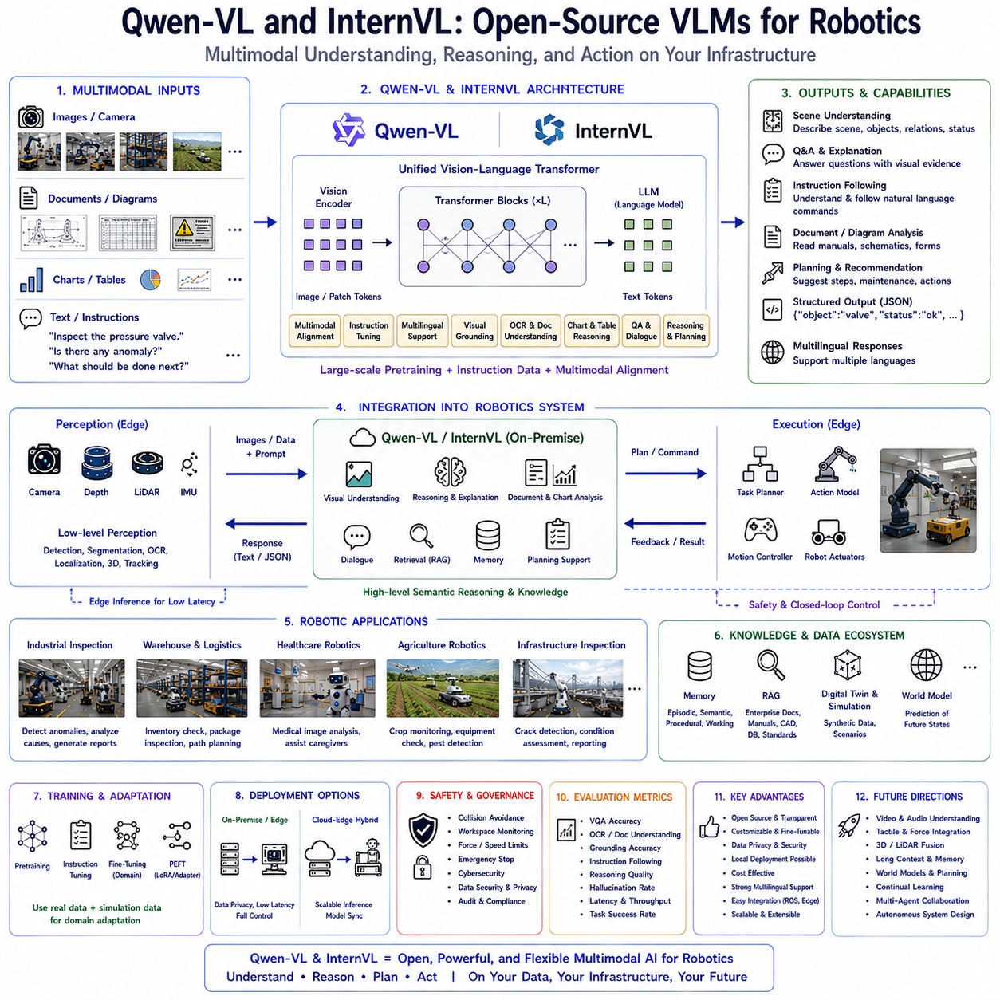{width="7.268055555555556in" height="7.268055555555556in"}

오픈소스 비전-언어 모델(VLM, Vision-Language Model)은 멀티모달(Multimodal) 인공지능의 대중화를 이끈 핵심 기술이다. GPT-4V나 Gemini와 같은 상용 모델은 뛰어난 성능을 제공하지만 대부분 클라우드 기반 서비스로 제공된다. 반면 Qwen-VL과 InternVL은 모델을 직접 다운로드하여 로컬(Local) 환경에서 실행할 수 있으므로, 기업은 배포(Deployment), 최적화(Optimization), 미세조정(Fine-Tuning), 데이터 보안(Security)을 모두 직접 관리할 수 있다. 이러한 특성은 제조, 의료, 국방, 물류, 시설 점검과 같이 민감한 데이터를 다루는 로봇 시스템에서 매우 큰 장점을 제공한다.

오픈소스 VLM이 주목받는 이유는 상용 API의 한계를 해결할 수 있기 때문이다. 클라우드 API는 네트워크(Network)에 의존하고, 통신 지연(Latency), 사용 비용(Cost), 데이터 외부 전송(Privacy) 문제가 발생할 수 있다. 반면 오픈소스 모델은 조직 내부(On-Premise)에서 실행할 수 있으므로 생산 설비, 의료 영상, 국방 데이터, 연구 자료 등 외부로 전송하기 어려운 정보를 안전하게 처리할 수 있다. 따라서 산업용 물리 AI(Physical AI)에서는 오픈소스 VLM의 중요성이 점점 커지고 있다.

인간은 자신의 직업과 환경에 따라 지속적으로 새로운 지식을 학습한다. 엔지니어는 공학 지식을 배우고, 의사는 의료 지식을 습득하며, 농업 전문가는 농업 환경에 특화된 경험을 축적한다. 오픈소스 VLM도 마찬가지로 특정 산업에 맞게 추가 학습할 수 있다. 기업은 자체 데이터셋을 이용하여 모델을 공장 자동화, 물류, 의료, 농업 등 특정 분야에 최적화할 수 있으며, 이러한 적응성(Adaptability)은 오픈소스 모델의 가장 큰 장점 중 하나이다.

기존 로봇은 객체 탐지(Object Detection), 의미 분할(Semantic Segmentation), 문자 인식(OCR), 위치 추정(Localization), 작업 계획(Task Planning)을 각각 독립적인 모듈로 구현하였다. 이러한 구조는 안정적이지만 새로운 환경이나 복잡한 상황에서는 유연성이 부족하였다. Qwen-VL과 InternVL은 시각 정보와 언어 정보를 하나의 모델에서 통합적으로 처리하여 의미 추론(Semantic Reasoning), 문서 이해(Document Understanding), 대화(Dialogue), 환경 이해(Scene Understanding)를 동시에 수행할 수 있도록 한다.

Qwen-VL은 대표적인 오픈소스 비전-언어 모델 중 하나이다. 강력한 대규모 언어 모델(LLM)을 기반으로 비전 인코더(Vision Encoder)를 결합하여 이미지와 자연어를 함께 이해한다. 이미지 캡셔닝(Image Captioning), 시각 질의응답(VQA, Visual Question Answering), 문서 이해(Document Understanding), 차트 분석(Chart Analysis), OCR, 시각 접지(Visual Grounding), 명령 수행(Instruction Following) 등 다양한 멀티모달 작업에서 매우 높은 성능을 보여준다.

Qwen-VL의 가장 큰 특징은 실용성(Practical Usability)이다. 다국어(Multilingual)를 지원하며, 다양한 해상도의 이미지를 처리할 수 있고, 시각 명령(Visual Instruction)을 이해하며, 문서와 이미지를 동시에 분석할 수 있다. 또한 ROS(Robot Operating System), 엣지 AI(Edge AI), 산업 자동화 플랫폼과 쉽게 통합할 수 있어 실제 로봇 시스템에 적용하기 용이하다.

Qwen-VL의 비전 인코더는 일반적으로 비전 트랜스포머(ViT, Vision Transformer)를 사용한다. 이미지는 객체의 형태, 질감, 색상, 공간 관계, 환경 정보를 포함하는 고차원 임베딩(Embedding)으로 변환되며, 이러한 시각 특징은 언어 모델과 연결되어 하나의 멀티모달 표현 공간에서 함께 추론된다. 기존의 객체 라벨 기반 접근보다 훨씬 풍부한 의미 정보를 유지할 수 있다.

언어 모델은 방대한 다국어 데이터로 사전학습되어 상식(Common Sense), 절차 지식(Procedural Knowledge), 수학적 추론(Mathematical Reasoning), 논리 추론(Logical Reasoning), 대화(Dialogue), 작업 계획(Task Planning) 능력을 제공한다. 따라서 로봇은 시각 정보뿐 아니라 다양한 언어 환경에서도 자연스럽게 작업을 수행할 수 있다.

Qwen-VL은 시각 명령 미세조정(Visual Instruction Tuning)을 통해 실제 사람과의 대화를 학습한다. 단순히 이미지를 설명하는 것이 아니라 설비 점검, 유지보수 절차, 창고 관리, 농업 환경, 의료 영상 등에 대한 질문과 답변을 학습하여 실제 산업 환경에서 자연어 기반 로봇 제어를 가능하게 한다.

시각 접지(Visual Grounding)는 Qwen-VL의 중요한 기능이다. "빨간 파이프 옆의 압력 밸브를 점검하라."와 같은 명령에서 언어와 영상 속 객체를 정확하게 연결하고 공간 관계까지 이해하여 작업 대상을 식별한다. 이는 사람과 로봇의 자연스러운 협업(Human-Robot Collaboration)에 필수적인 기능이다.

문서 이해(Document Understanding)는 산업용 로봇에서 매우 중요한 기능이다. CAD 도면, 유지보수 매뉴얼, 검사 보고서, 생산 일정표, 기술 문서 등을 이미지 형태 그대로 분석하여 텍스트와 그림을 함께 이해한다. OCR과 문서 분석을 별도로 수행하는 기존 방식보다 훨씬 높은 수준의 의미 이해를 제공한다.

차트(Chart)와 표(Table) 분석도 중요한 기능이다. 생산 통계, 품질 관리 그래프, 재고 관리, 유지보수 일정 등을 분석하여 단순히 숫자를 읽는 것이 아니라 변화 추세와 운영상의 의미를 설명할 수 있다. 이는 공장 자동화와 경영 의사결정에도 활용될 수 있다.

InternVL 역시 매우 영향력이 큰 오픈소스 비전-언어 모델이다. 대규모 멀티모달 사전학습(Multimodal Pretraining)을 기반으로 강력한 비전 인코더와 언어 모델을 결합하였다. 이미지 이해(Image Understanding), OCR, 시각 대화(Visual Dialogue), 과학 문서 분석(Scientific Document Analysis), 차트 이해(Chart Understanding), 수학(Mathematical Reasoning), 명령 수행(Instruction Following)에서 매우 우수한 성능을 보여준다.

InternVL의 특징은 확장성(Scalability)에 있다. 모델 크기를 점진적으로 증가시키면서 멀티모달 표현 학습(Multimodal Representation Learning)이 어떻게 향상되는지를 연구하였으며, 대규모 데이터와 고성능 비전 인코더, 정교한 정렬(Alignment)이 멀티모달 성능을 지속적으로 향상시킨다는 점을 보여주었다.

InternVL 역시 최신 비전 트랜스포머를 사용하여 세밀한 시각 특징을 추출한다. 지역(Local) 특징과 전체(Global) 장면 구조를 동시에 표현하는 임베딩을 생성하고, 이를 언어 모델과 결합하여 객체 인식을 넘어 의미적 장면 이해를 수행한다.

Qwen-VL과 InternVL은 모두 다국어(Multilingual)를 지원한다. 글로벌 제조 기업이나 국제 물류 시스템에서는 다양한 언어가 사용되므로 하나의 모델이 여러 언어를 동시에 처리할 수 있다는 점은 큰 장점이다. 별도의 언어 모델을 구축하지 않아도 자연스러운 다국어 상호작용이 가능하다.

오픈소스 모델의 가장 큰 장점은 로컬 배포(Local Deployment)이다. 기업은 GPU 서버, 산업용 PC, 엣지 컴퓨터에 직접 모델을 설치하고 운영할 수 있으며, 소프트웨어 구성, 보안 정책, 데이터 관리, 모델 업데이트를 모두 자체적으로 수행할 수 있다. 민감한 데이터가 외부로 전송되지 않으므로 보안성이 크게 향상된다.

엣지 AI(Edge AI)에서도 오픈소스 VLM의 활용이 증가하고 있다. NVIDIA Jetson, 산업용 GPU, AI 가속기 등을 이용하여 모델을 로컬에서 실행할 수 있으며, 양자화(Quantization), 모델 가지치기(Model Pruning), 지식 증류(Knowledge Distillation), Flash Attention, KV Cache 최적화 등의 기술을 적용하여 실시간 추론 성능을 높일 수 있다.

클라우드-엣지 협업(Cloud-Edge Collaboration) 역시 중요하다. 대규모 모델은 서버에서 복잡한 추론을 수행하고, 엣지 장치는 저지연(Low Latency) 작업을 담당한다. 동일한 오픈소스 모델을 서버와 로봇에서 함께 사용할 수 있으므로 일관된 AI 아키텍처를 구축할 수 있다.

미세조정(Fine-Tuning)은 오픈소스 VLM의 가장 큰 장점이다. 제조 자동화, 물류, 농업, 의료, 서비스 로봇 등 특정 산업의 데이터를 이용하여 모델을 쉽게 학습시킬 수 있다. LoRA(Low-Rank Adaptation), 어댑터(Adapter), 프롬프트 튜닝(Prompt Tuning) 등의 파라미터 효율적 미세조정(PEFT, Parameter-Efficient Fine-Tuning)을 사용하면 적은 비용으로도 높은 성능을 얻을 수 있다.

시뮬레이션(Simulation)은 미세조정을 더욱 효율적으로 만든다. 디지털 트윈(Digital Twin)은 이미지, 센서 데이터, 작업 절차, 환경 변화를 동시에 생성하여 실제 데이터를 수집하지 않고도 대규모 멀티모달 데이터셋을 구축할 수 있다. 이를 통해 로봇은 제조, 물류, 농업, 의료 등 다양한 환경을 사전에 학습할 수 있다.

검색 증강 생성(RAG, Retrieval-Augmented Generation)은 오픈소스 VLM과 자연스럽게 결합된다. 유지보수 문서, CAD 도면, 디지털 트윈, 품질 관리 문서, 소프트웨어 저장소 등을 실시간으로 검색하여 현재 카메라 영상과 함께 분석할 수 있다. 모델을 다시 학습하지 않아도 최신 정보를 사용할 수 있다는 장점이 있다.

메모리(Memory)는 로봇의 장기적인 지능을 담당한다. 에피소드 메모리(Episodic Memory)는 이전 작업 경험을 저장하고, 의미 메모리(Semantic Memory)는 공학 지식을 저장하며, 절차 메모리(Procedural Memory)는 작업 기술(Skill)을 저장한다. 작업 메모리(Working Memory)는 현재 대화와 작업 상태를 유지한다. 오픈소스 모델은 이러한 메모리 구조를 기업 환경에 맞게 자유롭게 설계할 수 있다.

세계 모델(World Model)은 미래 상황을 예측하는 기능이다. 현재 영상을 기반으로 설비 열화, 사람의 이동, 배터리 감소, 생산 일정 등을 예측하여 선제적인(Proactive) 작업 계획을 생성할 수 있다. 반응형(Reactive) 제어보다 훨씬 높은 수준의 지능을 제공한다.

산업 설비 점검(Industrial Inspection)은 오픈소스 VLM의 대표적인 활용 분야이다. 카메라 영상과 유지보수 문서, CAD 도면, 디지털 트윈, 검사 기준을 함께 분석하여 이상을 설명하고, 유지보수 절차를 추천하며, 자동으로 점검 보고서를 생성할 수 있다. 모든 데이터는 조직 내부에서 안전하게 관리된다.

물류 로봇(Warehouse Robotics)은 재고 관리, 바코드 인식, 포장 검사, 물류 계획, 창고 지도 분석 등을 수행한다. 기업 내부 서버에서 운영되므로 민감한 물류 정보가 외부로 유출되지 않으며, 맞춤형 최적화도 가능하다.

의료 로봇(Healthcare Robotics)은 환자 정보와 의료 영상의 보안이 매우 중요하다. 오픈소스 VLM은 병원 내부 서버에서 운영할 수 있어 개인정보를 보호하면서 의료 영상 분석, 문서 이해, 의료진 지원 기능을 수행할 수 있다.

농업 로봇(Agricultural Robotics)은 작물 영상, 농기계 상태, 병해충 정보, 기상 데이터, 농업 문서를 함께 분석한다. 지역 특성에 맞는 데이터로 미세조정할 수 있으므로 범용 클라우드 모델보다 더 높은 성능을 기대할 수 있다.

과학 연구(Scientific Research)에서도 Qwen-VL과 InternVL은 실험 자동화, 현미경 영상 분석, 논문 해석, 연구 장비 모니터링, 교육용 로봇 등에 활용된다. 오픈소스이므로 연구 결과를 재현(Reproducibility)하기 쉽고 새로운 알고리즘 개발에도 매우 유리하다.

안전(Safety)은 오픈소스 모델에서도 독립적으로 관리된다. 비전-언어 모델은 의미 추론과 계획을 담당하지만, 충돌 방지(Collision Avoidance), 작업 공간 감시(Workspace Monitoring), 힘 제한(Force Limitation), 비상 정지(Emergency Stop), 사이버보안(Cybersecurity)은 별도의 안전 시스템이 담당한다.

Qwen-VL과 InternVL은 시각 질의응답(VQA), OCR, 문서 이해(Document Understanding), 차트 분석(Chart Understanding), 시각 접지(Visual Grounding), 명령 수행(Instruction Following), RAG 연계, 일반화(Generalization), 계산 효율성(Computational Efficiency), 엣지 배포 성능(Edge Deployment Performance), 실제 로봇 작업(Task Success) 등을 종합적으로 평가한다.

상용 API와 비교하면 Qwen-VL과 InternVL은 투명성(Transparency), 확장성(Extensibility), 재현성(Reproducibility), 배포 자유도(Deployment Flexibility)가 매우 높다. 기업은 모델 구조를 수정하고, 추론 엔진을 최적화하며, 자체 RAG 시스템을 구축하고, 특정 산업에 맞게 지속적으로 발전시킬 수 있다. 이러한 개방성은 산업용 AI의 혁신 속도를 크게 높인다.

향후 오픈소스 VLM은 영상(Video), 음성(Audio), 촉각(Tactile), 힘 센서(Force Sensor), LiDAR, 이벤트 카메라(Event Camera), 세계 모델(World Model), 지속적 학습(Continual Learning), 다중 에이전트(Multi-Agent), 디지털 트윈(Digital Twin), 불확실성 추정(Uncertainty Estimation)과 결합되어 더욱 강력한 물리 AI 플랫폼으로 발전할 것으로 예상된다.

결국 **Qwen-VL**과 **InternVL**은 대표적인 오픈소스 **비전-언어 모델(VLM)**로서, **시각 이해(Vision Understanding)**, **언어 추론(Language Reasoning)**, **문서 이해(Document Understanding)**, **다국어 지원(Multilingual Support)**, **검색 증강 생성(RAG)**, **파라미터 효율적 미세조정(PEFT)**, **로컬 배포(Local Deployment)**를 동시에 지원한다. 이러한 특성은 제조, 물류, 의료, 농업, 시설 점검, 연구 분야에서 **보안(Security)**, **맞춤형 최적화(Customization)**, **운영 독립성(Independence)**을 확보할 수 있게 하며, 차세대 **비전-언어-행동(VLA)** 및 **물리 AI(Physical AI)** 시스템의 핵심 오픈소스 플랫폼으로 자리매김할 것으로 전망된다.

## 5.7 Scene Description and Visual Question Answering (with Code)

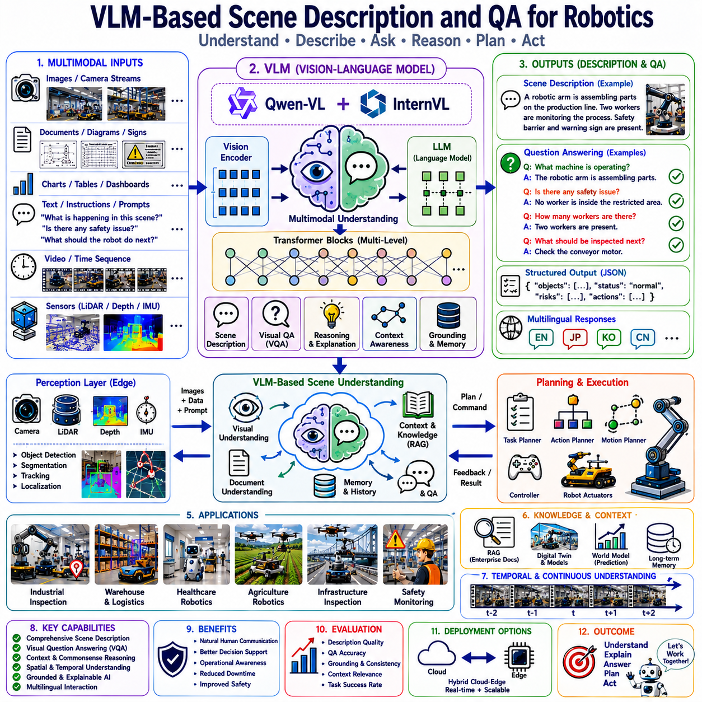{width="7.268055555555556in" height="7.268055555555556in"}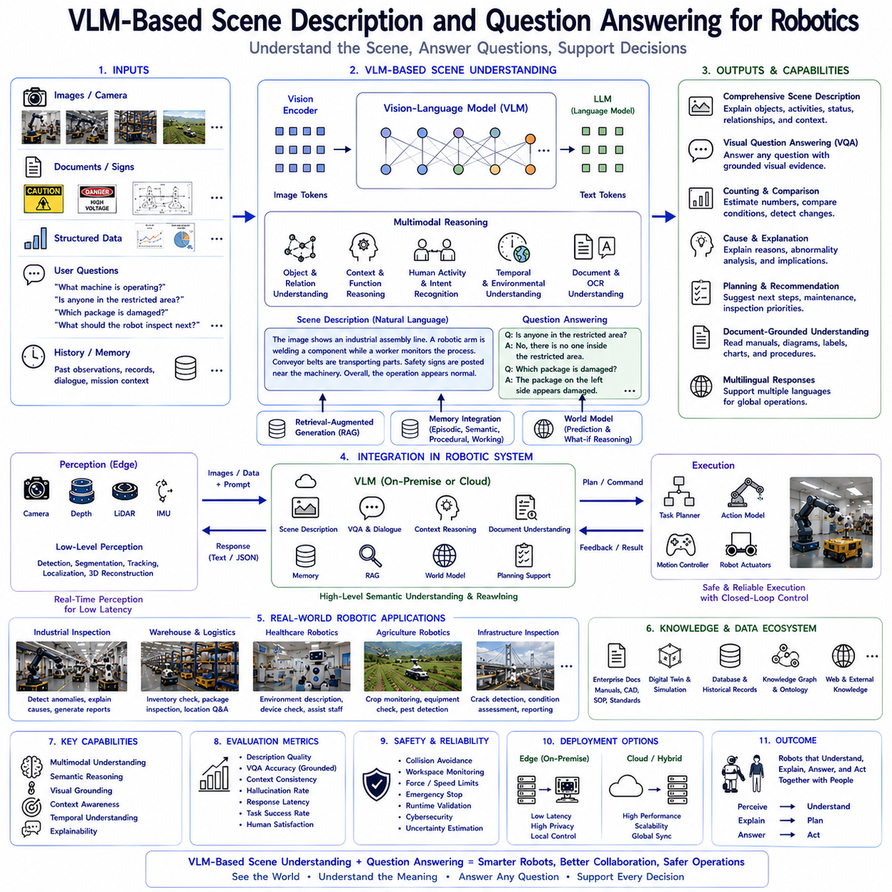{width="7.268055555555556in" height="7.268055555555556in"}

비전-언어 모델(VLM, Vision-Language Model)은 단순한 객체 인식을 넘어 장면(Scene)을 의미적으로 이해할 수 있도록 로봇 인지를 크게 발전시켰다. 기존 컴퓨터 비전(Computer Vision)은 객체 탐지(Object Detection), 위치 추정(Pose Estimation), 의미 분할(Semantic Segmentation)과 같은 개별 작업에는 뛰어난 성능을 보였지만, 실제 환경에서 "무슨 일이 일어나고 있는가?"를 설명하는 능력은 부족하였다. VLM 기반 장면 설명(Scene Description)과 시각 질의응답(VQA, Visual Question Answering)은 저수준 센서 데이터를 사람이 이해할 수 있는 자연어 설명으로 변환하여 물리 AI(Physical AI)의 핵심 인지 계층(Cognitive Layer)을 형성한다.

이러한 기술이 등장한 이유는 인간이 환경을 단순한 물체의 집합으로 인식하지 않기 때문이다. 사람은 공장에 들어가면 기계, 작업자, 공정, 안전 상태, 작업 순서를 동시에 이해한다. 이러한 이해는 시각(Vision), 언어(Language), 기억(Memory), 상식(Common Sense), 경험(Experience)이 결합되어 이루어진다. VLM은 이러한 인간의 통합 인지 과정을 모방하여 시각 정보와 언어 지식을 함께 활용하는 의미 기반 추론(Semantic Reasoning)을 수행한다.

기존 로봇은 객체 탐지, 깊이 추정(Depth Estimation), 위치 추정(Localization), OCR, 활동 인식(Activity Recognition) 등을 각각 독립적인 모듈에서 수행하였다. 각 알고리즘은 매우 높은 정확도를 가지지만, 전체 환경을 하나의 의미 있는 상황으로 설명하지는 못한다. VLM은 이러한 개별 인식 결과를 통합하여 현재 작업 상황, 사람의 행동, 설비 상태, 환경 변화 등을 하나의 자연어 설명으로 생성한다.

장면 설명(Scene Description)은 VLM의 가장 기본적인 기능이다. 단순히 "기계가 있다." 또는 "사람이 있다."를 출력하는 것이 아니라, 현재 어떤 공정이 진행되고 있는지, 작업자가 어떤 작업을 수행 중인지, 설비가 정상 상태인지, 위험 요소는 무엇인지 등을 종합적으로 설명한다. 이러한 설명은 로봇과 사람이 동일한 상황을 공유하도록 도와주는 중요한 기능이다.

일반적인 이미지 캡셔닝(Image Captioning)은 보이는 대상을 설명하는 데 초점을 둔다. 반면 로봇용 장면 설명은 작업(Task)과 운영(Operation)에 필요한 정보를 중심으로 생성된다. 예를 들어 공장에서 어떤 생산 단계가 진행되고 있는지, 유지보수가 필요한 설비가 무엇인지, 작업 순서가 올바른지 등을 설명한다. 즉 시각적 정보보다 작업 의미(Task Semantics)를 중심으로 기술한다.

문맥(Context)은 장면 이해에서 매우 중요한 요소이다. 같은 렌치(Wrench)라도 작업대 위에 놓여 있으면 정상적인 작업 준비 상태이지만, 회전하는 기계 아래 떨어져 있다면 위험 요소가 된다. 팔레트(Pallet)가 창고 안에 있으면 정상적인 보관 상태이지만 비상구를 막고 있다면 안전 문제가 된다. VLM은 이러한 문맥을 함께 고려하여 상황을 해석한다.

공간 관계(Spatial Relationship)도 중요한 기능이다. 사람은 "왼쪽", "오른쪽", "위", "아래", "근처", "사이"와 같은 표현을 자연스럽게 사용한다. VLM은 이러한 공간 관계를 의미적으로 이해하여 기계, 작업자, 공구, 안전 장비, 물류 설비 간의 위치 관계를 설명한다. 이는 사람이 로봇에게 자연어로 작업을 지시할 수 있도록 해준다.

시간적 문맥(Temporal Context)은 장면 이해를 더욱 발전시킨다. 한 장의 이미지는 특정 순간만 보여주지만, 로봇은 연속적으로 환경을 관찰한다. 외부 메모리(Memory)와 결합하면 VLM은 설비 상태 변화, 생산 진행 상황, 작업자의 행동 변화, 환경 변화를 지속적으로 설명할 수 있다. 이는 단순한 이미지 분석을 지속적인 상황 인식(Situational Awareness)으로 확장한다.

장면 설명은 기능(Function)도 함께 이해한다. VLM은 단순히 컨베이어를 인식하는 것이 아니라 제품을 운반하는 장치라는 기능을 이해한다. 충전기는 배터리를 충전하고, 로봇 팔은 조립 작업을 수행하며, 경고등은 이상 상태를 나타낸다는 기능적 의미(Affordance)를 함께 해석한다. 이러한 기능 이해는 이후 작업 계획(Task Planning)에 매우 중요한 정보를 제공한다.

시각 질의응답(VQA, Visual Question Answering)은 장면 설명을 대화형 기능으로 확장한 것이다. 사용자는 "현재 어떤 장비가 동작 중인가?", "위험 구역에 사람이 있는가?", "손상된 박스는 어디에 있는가?", "다음에 무엇을 점검해야 하는가?"와 같은 질문을 자연어로 할 수 있다. VLM은 카메라 영상과 언어 모델을 결합하여 이러한 질문에 의미 있는 답변을 제공한다.

대화형 질의응답은 사람과 로봇의 협업을 크게 향상시킨다. 작업자는 복잡한 GUI(Graphical User Interface)나 프로그래밍 언어를 사용할 필요 없이 자연어만으로 로봇과 대화할 수 있다. 로봇 역시 센서 데이터를 그대로 보여주는 것이 아니라 사람이 이해하기 쉬운 설명을 제공하므로 협업 효율이 높아진다.

질의응답에서는 시각 접지(Visual Grounding)가 매우 중요하다. 답변은 반드시 실제 영상 속 객체를 근거로 해야 하며, 존재하지 않는 내용을 생성해서는 안 된다. VLM은 질문 속 언어 표현과 실제 영상의 객체를 연결하여 근거 기반(Grounded) 답변을 생성한다. 이는 환각(Hallucination)을 줄이는 핵심 기술이다.

질문 유형은 매우 다양하다. 설명형 질문은 현재 장면을 설명하고, 관계형 질문은 객체 간의 위치와 관계를 묻는다. 개수 질문은 사람이나 물체의 수를 계산하며, 비교 질문은 두 장면의 차이를 설명한다. 원인 질문은 이상 발생 이유를 추론하고, 예측 질문은 앞으로 어떤 일이 발생할 가능성이 있는지를 설명한다.

산업 설비 점검(Industrial Inspection)은 장면 설명과 VQA의 대표적인 활용 분야이다. 카메라가 설비를 촬영하면 VLM은 장비 상태를 설명하고 이상을 분석하며, 유지보수 문서를 참고하여 가능한 고장 원인을 설명한다. 작업자는 필요한 질문을 자연어로 할 수 있으며, 시스템은 점검 보고서까지 자동으로 생성할 수 있다.

물류 자동화(Warehouse Automation)에서도 VLM은 재고 배치, 물류 흐름, 포장 상태, 적재 상황, 작업자의 이동 등을 설명한다. 창고 관리자는 "현재 재고 부족 품목은 무엇인가?", "손상된 박스는 어디에 있는가?"와 같은 질문을 할 수 있으며, VLM은 영상을 기반으로 답변한다.

의료 로봇(Healthcare Robotics)은 병실 환경, 의료 장비, 환자 주변 상황을 설명한다. 의료진은 환자 상태나 장비 배치에 대해 질문할 수 있으며, VLM은 의료 환경을 자연어로 설명하여 의료진을 지원한다. 물론 진단(Diagnosis)은 전문 의료 AI가 담당하며 VLM은 상황 설명을 지원하는 역할을 수행한다.

농업 로봇(Agricultural Robotics)은 작물 상태, 농기계, 관개 시설, 잡초 분포, 환경 변화를 설명한다. 농부는 작물 성장 상태, 병해충 발생 가능성, 수확 우선순위 등에 대해 질문할 수 있으며, VLM은 영상과 환경 정보를 바탕으로 답변한다.

사회기반시설 점검(Infrastructure Inspection)에서는 교량, 철도, 터널, 송전 설비, 파이프라인 등의 상태를 설명한다. 균열, 부식, 구조적 열화 등을 의미적으로 설명하고 유지보수 우선순위를 제안하며, 기술 보고서를 자동으로 생성할 수 있다.

사람의 행동 이해(Human Activity Understanding)도 중요한 기능이다. 단순히 사람을 탐지하는 것이 아니라 조립 작업, 장비 점검, 물류 이동, 실험 수행, 청소 작업, 위험 행동 등을 구분하여 설명한다. 이러한 행동 이해는 협업 로봇(Collaborative Robot)의 작업 계획에 매우 중요한 정보가 된다.

안전 모니터링(Safety Monitoring)은 또 다른 중요한 응용 분야이다. VLM은 비상구를 막는 장애물, 보호 장비 미착용, 위험 구역 출입, 누수, 설비 손상 등을 설명할 수 있다. 작업자는 "현재 안전상 문제가 있는가?"와 같은 질문을 할 수 있으며, VLM은 현재 장면을 분석하여 답변한다. 다만 실제 안전 제어는 별도의 안전 시스템(Safety System)이 담당한다.

문서 기반 장면 이해(Document-Grounded Scene Understanding)는 VLM의 강력한 기능이다. 장비 라벨(Label), 경고 표지(Sign), 작업 절차, CAD 도면, 디지털 디스플레이 등을 장면과 함께 분석하여 환경 설명과 문서 이해를 동시에 수행한다. 별도의 OCR 시스템 없이도 기술 문서를 활용할 수 있다.

메모리(Memory)는 장시간 작업에서 중요한 역할을 한다. 이전 점검 결과, 과거 대화, 유지보수 기록, 작업 목표 등을 저장하고 이후 질문에 활용한다. 이를 통해 로봇은 현재 장면뿐 아니라 과거 작업 이력까지 고려하여 답변할 수 있다.

검색 증강 생성(RAG, Retrieval-Augmented Generation)은 장면 설명을 더욱 풍부하게 만든다. 유지보수 매뉴얼, CAD 도면, 검사 기준, 품질 규정, 소프트웨어 저장소 등을 검색하여 현재 영상과 함께 분석한다. VLM은 현재 환경뿐 아니라 기업의 지식(Knowledge)을 함께 활용하여 답변을 생성한다.

세계 모델(World Model)은 현재 장면에서 미래를 예측하는 기능이다. 설비 열화, 사람의 이동, 생산 진행 상황, 배터리 감소 등을 예측하여 앞으로 발생할 가능성이 높은 상황을 설명한다. 이는 반응형(Reactive) 로봇을 예측형(Predictive) 로봇으로 발전시키는 핵심 기술이다.

실제 시스템은 클라우드-엣지 협업(Cloud-Edge Collaboration) 구조를 많이 사용한다. 엣지는 위치 추정, 객체 탐지, 센서 융합 등 실시간 처리를 담당하고, VLM은 장면 설명, 문서 이해, 질의응답, 작업 계획과 같은 의미 추론을 수행한다. 이러한 계층 구조는 실시간성과 지능을 동시에 확보할 수 있게 한다.

최근에는 Qwen-VL, InternVL과 같은 오픈소스 모델을 이용하여 장면 설명을 로컬(Local)에서도 수행할 수 있다. 양자화(Quantization), 모델 압축(Model Compression), Flash Attention 등의 최적화를 통해 엣지 GPU에서도 실시간 장면 이해가 가능해지고 있다.

다국어(Multilingual) 지원은 글로벌 제조 환경에서 매우 중요하다. 여러 국가의 작업자가 동일한 시스템을 사용할 수 있으며, VLM은 다양한 언어로 장면을 설명하고 질문에 답할 수 있다. 별도의 언어별 모델을 구축할 필요가 없어 운영 효율이 높아진다.

장면 설명의 평가는 단순한 이미지 캡셔닝과 다르다. 사실 정확성(Factual Correctness), 문맥 완전성(Context Completeness), 시각 접지(Visual Grounding), 관계 이해(Relationship Understanding), 시간 일관성(Temporal Consistency), 작업 지원 능력(Task Utility), 설명 품질(Explanation Quality), 계산 효율성(Computational Efficiency), 환각(Hallucination) 등을 종합적으로 평가한다.

VQA 역시 답변 정확도뿐 아니라 근거 제시(Grounded Evidence), 추론 깊이(Reasoning Depth), 문맥 유지(Context Consistency), 불확실성(Uncertainty), RAG 활용 능력, 응답 속도(Latency), 실제 작업 성공률(Task Success) 등을 함께 평가한다.

안전(Safety)은 장면 설명과 독립적으로 운영된다. VLM은 설명과 추천을 제공하지만 실제 로봇 제어는 충돌 방지(Collision Avoidance), 작업 공간 감시(Workspace Monitoring), 힘 제한(Force Limitation), 비상 정지(Emergency Stop), 런타임 검증(Runtime Verification) 시스템이 담당한다.

VLM 기반 장면 설명의 가장 큰 장점은 설명 가능성(Explainability)이다. 단순한 숫자 결과 대신 왜 그렇게 판단했는지, 어떤 근거를 사용했는지, 어떤 불확실성이 있는지, 다음에 무엇을 해야 하는지를 자연어로 설명한다. 이러한 설명 능력은 사람과 로봇 간의 신뢰를 크게 향상시킨다.

향후 VLM 기반 장면 설명은 영상(Video), 음성(Audio), 촉각(Tactile), LiDAR, 이벤트 카메라(Event Camera), 디지털 트윈(Digital Twin), 세계 모델(World Model), 지속적 학습(Continual Learning), 다중 에이전트(Multi-Agent), RAG와 결합되어 더욱 발전할 것으로 예상된다. 단순한 이미지 설명을 넘어 환경 전체를 지속적으로 이해하는 인지 시스템으로 발전하게 될 것이다.

결국 **VLM 기반 장면 설명(Scene Description)과 시각 질의응답(VQA)**은 로봇의 저수준 센서 데이터를 사람이 이해할 수 있는 의미 정보(Semantic Information)로 변환하는 핵심 기술이다. **비전 이해(Vision Understanding)**, **자연어 대화(Natural Language Dialogue)**, **메모리(Memory)**, **검색 증강 생성(RAG)**, **세계 모델(World Model)**을 통합하여 제조, 물류, 의료, 농업, 시설 점검 등 다양한 분야에서 사람과 자연스럽게 협업하는 **비전-언어-행동(VLA)** 및 **물리 AI(Physical AI)** 시스템의 핵심 인지 계층으로 자리잡을 것으로 전망된다.

## 5.8 Spatial Grounding Using VLMs (with Code)

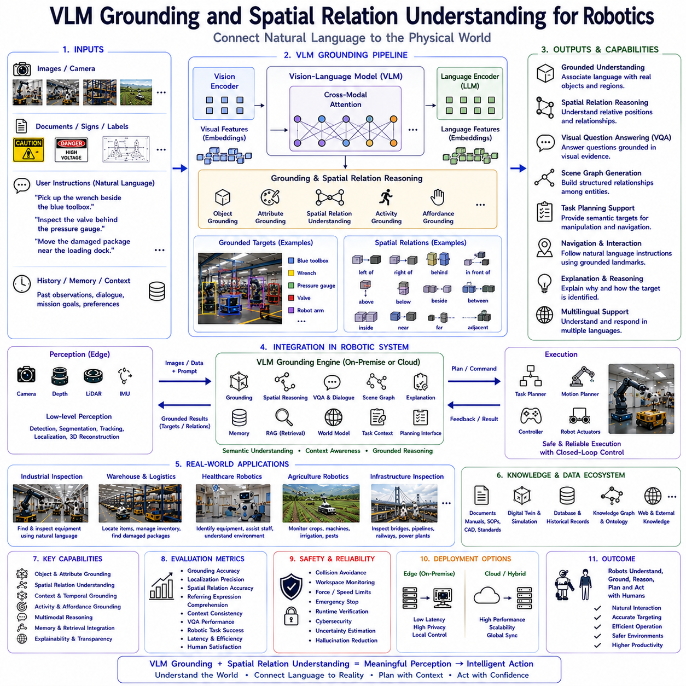{width="7.268055555555556in" height="7.268055555555556in"}

비전-언어 모델(VLM, Vision-Language Model)은 자연어(Language)와 실제 물리 환경(Physical Environment)을 의미적으로 연결하는 시각 접지(Visual Grounding)와 공간 관계 이해(Spatial Relation Understanding)를 통해 로봇 인지 기술을 크게 발전시켰다. 기존 컴퓨터 비전(Computer Vision)은 객체 탐지(Object Detection), 깊이 추정(Depth Estimation), 자세 추정(Pose Estimation), 객체 분류(Object Classification)에는 뛰어난 성능을 보였지만, 사람이 사용하는 자연어를 실제 환경의 객체와 연결하는 능력은 제한적이었다. VLM은 언어와 영상을 하나의 의미 공간(Semantic Space)에서 함께 학습하여 사람이 사용하는 표현을 실제 물체와 자연스럽게 연결할 수 있도록 한다.

시각 접지(Visual Grounding)가 필요한 이유는 인간이 절대 좌표(Absolute Coordinate)를 사용하여 의사소통하지 않기 때문이다. 사람은 "파란 공구함 옆에 있는 렌치를 가져와라.", "압력계 뒤에 있는 밸브를 점검하라.", "하역장 근처의 손상된 박스를 이동하라."와 같이 위치를 설명한다. 이러한 표현은 숫자 좌표가 아니라 객체 간의 관계(Relationship)와 문맥(Context)을 기반으로 한다. VLM은 이러한 자연어 표현을 실제 카메라 영상 속 객체와 연결하는 기능을 수행한다.

기존 산업용 로봇은 미리 정의된 좌표계(Coordinate System), 마커(Marker), 객체 ID(Object Identifier), 작업 공간(Workspace)을 이용하여 동작하였다. 이러한 방식은 정형화된 환경에서는 매우 높은 정확도를 제공하지만, 작업 환경이 자주 변하거나 사람이 함께 작업하는 환경에서는 유연성이 부족하다. VLM 기반 시각 접지는 자연어를 이용하여 작업 대상을 지정할 수 있으므로, 복잡한 환경에서도 높은 적응성을 제공한다.

시각 접지(Visual Grounding)는 언어 표현(Language Expression)을 실제 환경의 객체(Object), 영역(Region), 사람(Human), 활동(Activity)과 연결하는 과정이다. 단순히 문장을 이해하는 것이 아니라, 문장에서 언급된 대상이 카메라 영상의 어느 부분인지를 정확하게 찾아낸다. 이를 통해 로봇은 사람의 자연어 명령을 실제 작업 대상으로 변환할 수 있다.

시각 접지는 멀티모달 표현 학습(Multimodal Representation Learning)에서 시작된다. 카메라 영상은 비전 인코더(Vision Encoder)를 통해 객체의 모양, 색상, 질감(Texture), 공간 구조(Spatial Structure), 환경(Context)을 포함하는 임베딩(Embedding)으로 변환된다. 동시에 자연어는 언어 모델(Language Model)을 통해 의미 정보와 문법 구조를 포함하는 언어 임베딩으로 변환된다. 이후 두 임베딩을 동일한 의미 공간으로 정렬(Alignment)하여 서로 대응되는 개념을 연결한다.

트랜스포머(Transformer)의 어텐션(Attention)은 시각 접지의 핵심 역할을 수행한다. 문장의 단어(Token)는 영상 속 관련 영역에 집중하고, 영상의 객체는 관련 언어 표현과 연결된다. 예를 들어 "파란 공구함"이라는 단어는 영상 속 실제 파란 공구함 영역과 연결되며, "렌치"는 해당 공구함 옆의 렌치와 연결된다. 이러한 상호 주의(Self-Attention)는 언어와 영상을 자연스럽게 결합한다.

객체 접지(Object Grounding)는 가장 기본적인 기능이다. 렌치(Wrench), 팔레트(Pallet), 컨베이어(Conveyor), 압력계(Pressure Gauge), 안전 울타리(Safety Barrier), 로봇(Robot), 충전기(Charging Station), 지게차(Forklift) 등 다양한 객체를 자연어와 연결한다. 기존 객체 탐지(Object Detection)가 미리 정의된 클래스(Class)만 인식하는 것과 달리, VLM은 언어 기반 의미를 활용하여 훨씬 다양한 객체를 인식할 수 있다.

속성 접지(Attribute Grounding)는 객체의 특성까지 함께 고려한다. 사람은 "큰 빨간 상자", "금속 렌치", "깨진 파이프", "회전 중인 모터"와 같이 객체의 상태와 속성을 함께 표현한다. VLM은 객체뿐 아니라 색상(Color), 크기(Size), 재질(Material), 상태(State), 방향(Direction), 기능(Function) 등을 동시에 고려하여 작업 대상을 식별한다.

공간 관계 이해(Spatial Relation Understanding)는 VLM의 가장 중요한 기능 중 하나이다. 사람은 "왼쪽", "오른쪽", "위", "아래", "안쪽", "바깥", "앞", "뒤", "사이", "근처", "멀리"와 같은 상대적 위치를 사용한다. VLM은 이러한 공간 관계를 의미적으로 이해하여 객체 간의 위치 관계를 설명하고 작업 대상의 정확한 위치를 찾는다.

공간 관계는 단순한 좌표 계산만으로 해결되지 않는다. "기계 왼쪽"이라는 표현은 카메라의 위치와 관찰자의 방향에 따라 달라질 수 있다. VLM은 이러한 시점(Viewpoint)을 함께 고려하여 동일한 공간 표현을 다양한 환경에서도 일관성 있게 해석한다. 이는 이동 로봇(Mobile Robot)에서 매우 중요한 기능이다.

자기 기준 좌표(Egocentric Reference Frame)와 환경 기준 좌표(Allocentric Reference Frame)를 동시에 이해하는 것도 중요하다. 자기 기준은 로봇 자신의 위치를 중심으로 방향을 판단하는 것이고, 환경 기준은 주변 객체들 간의 관계를 기준으로 위치를 표현하는 것이다. 사람은 두 가지 방식을 자연스럽게 혼합하여 사용하며, VLM 역시 이러한 다양한 기준 좌표를 학습한다.

문맥(Context)은 접지 정확도를 크게 향상시킨다. 예를 들어 "컨베이어 옆의 박스를 가져와라."라는 명령에서 여러 개의 박스가 존재할 수 있다. VLM은 단순히 박스를 찾는 것이 아니라 컨베이어와의 관계를 함께 분석하여 올바른 작업 대상을 선택한다. 이러한 문맥 기반 추론(Contextual Reasoning)은 사람과 로봇의 협업에서 매우 중요한 역할을 한다.

시간적 접지(Temporal Grounding)는 연속적인 작업에서 사용된다. 공장에서는 사람과 물체가 지속적으로 이동하며 작업이 진행된다. 외부 메모리(Memory)와 결합하면 VLM은 이전에 보았던 객체나 과거 작업을 기억하여 "방금 점검했던 밸브" 또는 "조금 전에 이동한 팔레트"와 같은 표현도 이해할 수 있다.

사람의 행동 접지(Human Activity Grounding)는 객체뿐 아니라 행동까지 이해한다. VLM은 사람이 조립(Assembly), 점검(Inspection), 운반(Transportation), 청소(Cleaning), 수리(Repair), 용접(Welding) 등을 수행하는 모습을 인식하고, 자연어 명령과 연결하여 협업 작업을 지원한다.

어포던스 접지(Affordance Grounding)는 객체의 기능(Function)을 이해하는 기술이다. 충전기는 배터리를 충전하고, 컨베이어는 제품을 이동시키며, 밸브는 유량을 조절하고, 소화기는 화재를 진압하는 기능을 가진다. VLM은 이러한 기능적 의미를 함께 학습하여 단순한 객체 인식을 넘어 작업 계획(Task Planning)에 필요한 정보를 제공한다.

시각 접지는 조작 계획(Manipulation Planning)의 출발점이 된다. 언어에서 작업 대상을 찾으면 이후 로봇은 그 객체의 파지 자세(Grasp Pose), 이동 경로(Trajectory), 충돌 회피(Collision Avoidance), 힘 제어(Force Control)를 계산한다. 즉 VLM은 의미 기반 계획(Semantic Planning)을 담당하고 실제 모터 제어는 액션 모델(Action Model)이 수행한다.

내비게이션(Navigation)도 시각 접지의 중요한 활용 분야이다. 사람은 "실험실 옆 방으로 가라.", "창고 뒤 충전기로 이동하라."와 같은 명령을 사용한다. VLM은 이러한 랜드마크(Landmark) 기반 표현을 이해하여 지도(Map)와 실제 환경을 연결하고 의미 기반 내비게이션(Semantic Navigation)을 수행할 수 있다.

장면 그래프(Scene Graph)는 접지를 구조화한 표현이다. 객체를 단순히 나열하는 것이 아니라 "팔레트가 컨베이어 옆에 있다.", "렌치가 공구함 안에 있다.", "작업자가 로봇과 협업하고 있다."와 같은 관계를 그래프로 표현한다. 이러한 구조는 작업 계획과 환경 이해를 더욱 효과적으로 수행할 수 있게 한다.

문서 접지(Document Grounding)는 장비 라벨(Label), 유지보수 매뉴얼(Maintenance Manual), 경고 표지(Sign), CAD 도면(CAD Drawing), 디지털 디스플레이(Display)를 실제 설비와 연결하는 기술이다. 로봇은 문서를 읽는 동시에 실제 설비를 인식하여 문서 내용과 현실 환경을 연결할 수 있다.

시각 질의응답(VQA, Visual Question Answering)에서는 접지가 매우 중요하다. "컨베이어 옆의 기계는 무엇인가?", "비상구를 막고 있는 물체는 무엇인가?", "로봇 뒤에 사람이 있는가?"와 같은 질문에 답하기 위해서는 반드시 실제 영상을 근거(Grounded Evidence)로 해야 한다. 접지는 환각(Hallucination)을 줄이고 신뢰성을 높이는 핵심 기술이다.

산업 설비 점검(Industrial Inspection)은 시각 접지의 대표적인 활용 사례이다. 작업자는 "압력 용기 아래 펌프를 점검하라." 또는 "냉각 배관 옆 밸브를 확인하라."와 같이 자연어를 사용한다. VLM은 이를 실제 설비와 연결하여 정확한 검사 대상을 찾을 수 있으며, 별도의 좌표 데이터베이스 없이도 다양한 공장에 쉽게 적용할 수 있다.

물류 자동화(Warehouse Automation)에서는 창고 구조가 자주 변경된다. 작업자는 "냉장 창고 옆의 손상된 상자를 가져와라."와 같은 명령을 내리며, VLM은 창고 환경을 분석하여 작업 대상을 찾는다. 이러한 방식은 고정 좌표 기반 시스템보다 훨씬 유연하다.

의료 로봇(Healthcare Robotics)은 환자, 의료 장비, 약품, 모니터 등을 정확하게 연결해야 한다. VLM은 의료 용어와 실제 장비를 연결하고 환자 주변의 공간 관계를 이해하여 의료진의 작업을 지원한다. 다만 진단은 전문 의료 AI가 담당하고 VLM은 상황 이해를 지원하는 역할을 수행한다.

농업 로봇(Agricultural Robotics)은 작물, 농기계, 관개 시설, 잡초, 병해충 등을 자연어와 연결한다. 농부는 "관개 시설 옆의 토마토를 점검하라."와 같은 명령을 사용할 수 있으며, VLM은 이를 실제 환경에서 찾아낸다.

사회기반시설 점검(Infrastructure Inspection)은 매우 많은 유사 구조물을 포함한다. "서쪽 플랫폼 아래 두 번째 기둥을 점검하라." 또는 "유지보수 도로 옆 변압기를 확인하라."와 같은 명령은 공간 관계와 구조 정보를 함께 이해해야 한다. VLM은 이러한 복잡한 공간 구조를 자연어와 연결할 수 있다.

메모리(Memory)는 접지 성능을 향상시킨다. 이전 대화, 과거 점검, 작업 이력, 사용자 선호도 등을 저장하여 모호한 표현도 정확하게 이해할 수 있다. 예를 들어 "아까 점검했던 밸브"라는 표현은 메모리를 통해 해석된다.

검색 증강 생성(RAG, Retrieval-Augmented Generation)은 접지를 더욱 정확하게 만든다. 유지보수 매뉴얼, CAD 도면, 디지털 트윈(Digital Twin), 검사 기록 등을 검색하여 현재 영상과 함께 분석함으로써 객체의 기능과 작업 절차를 더욱 정확하게 이해할 수 있다.

세계 모델(World Model)은 현재 접지된 객체를 기반으로 미래를 예측한다. 사람의 이동, 장비 열화, 생산 진행, 배터리 감소 등을 예측하여 앞으로 필요한 작업을 미리 계획할 수 있다. 이는 예측 기반(Predictive) 작업 계획의 핵심 요소이다.

실제 시스템에서는 클라우드-엣지 협업(Cloud-Edge Collaboration)이 많이 사용된다. 엣지는 객체 탐지, 위치 추정, 센서 융합을 수행하고, VLM은 시각 접지, 공간 추론, 대화, RAG 기반 의미 추론을 담당한다. 이러한 계층 구조는 실시간성과 높은 지능을 동시에 제공한다.

최근에는 Qwen-VL, InternVL과 같은 오픈소스 VLM을 이용하여 로컬(Local) 환경에서도 시각 접지를 수행할 수 있다. 양자화(Quantization), Flash Attention, 모델 압축(Model Compression) 등의 기술을 적용하면 엣지 GPU에서도 실시간 접지가 가능해지고 있다.

시각 접지의 평가는 단순한 객체 탐지와 다르다. 접지 정확도(Grounding Accuracy), 위치 정확도(Localization Accuracy), 공간 추론(Spatial Reasoning), 문맥 이해(Contextual Understanding), 다국어 지원(Multilingual Support), 환각(Hallucination), 응답 속도(Latency), 실제 로봇 작업 성공률(Task Success) 등을 종합적으로 평가한다.

공간 관계 이해 역시 상대 위치 이해(Relative Position), 시점 변화(Viewpoint Invariance), 장면 그래프(Scene Graph), 내비게이션 성능(Navigation Performance), 조작 지원(Manipulation Support), 장기 일관성(Temporal Consistency) 등을 함께 평가한다.

안전(Safety)은 시각 접지와 독립적으로 운영된다. VLM은 작업 대상을 의미적으로 찾고 공간 관계를 이해하지만, 실제 동작은 충돌 방지(Collision Avoidance), 작업 공간 감시(Workspace Monitoring), 힘 제한(Force Limitation), 비상 정지(Emergency Stop), 런타임 검증(Runtime Verification)이 담당한다.

VLM 기반 시각 접지의 또 다른 장점은 설명 가능성(Explainability)이다. 단순히 특정 객체를 선택하는 것이 아니라 왜 해당 객체를 선택했는지, 어떤 공간 관계를 사용했는지, 어떤 근거를 기반으로 판단했는지를 자연어로 설명할 수 있다. 이러한 투명성은 산업 현장에서 신뢰성과 검증 가능성을 크게 향상시킨다.

향후 시각 접지는 영상(Video), 음성(Audio), 촉각(Tactile), LiDAR, 이벤트 카메라(Event Camera), 세계 모델(World Model), 디지털 트윈(Digital Twin), 지속적 학습(Continual Learning), 다중 에이전트(Multi-Agent), 불확실성 추정(Uncertainty Estimation)과 결합되어 더욱 발전할 것으로 예상된다. 정적인 이미지 기반 접지를 넘어 지속적으로 변화하는 환경 전체를 이해하는 방향으로 발전하게 될 것이다.

결국 **VLM 기반 시각 접지(Visual Grounding)와 공간 관계 이해(Spatial Relation Understanding)**는 자연어(Language), 시각 정보(Vision), 공간 구조(Spatial Structure), 문맥(Context), 메모리(Memory), 검색 증강 생성(RAG), 세계 모델(World Model)을 통합하여 사람의 명령을 실제 환경의 객체와 정확하게 연결하는 핵심 기술이다. 이러한 능력은 제조, 물류, 의료, 농업, 시설 점검, 서비스 로봇 등 다양한 분야에서 **비전-언어-행동(VLA)** 및 **물리 AI(Physical AI)** 시스템의 핵심 인지 기술로 활용되며, 사람과 로봇이 자연스럽게 협업하는 차세대 지능형 로봇 플랫폼의 기반이 될 것으로 전망된다.

## 5.9 Fine-Tuning VLMs for Robot Tasks (with Code)

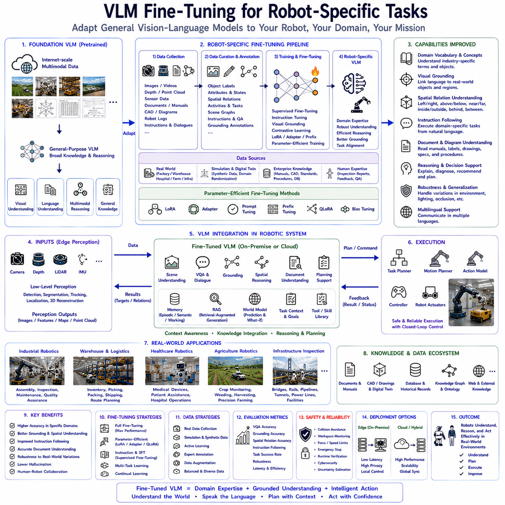{width="7.268055555555556in" height="7.268055555555556in"}

비전-언어 모델(VLM, Vision-Language Model)은 다양한 멀티모달(Multimodal) 작업에서 뛰어난 일반화(Generalization) 성능을 보이지만, 실제 로봇 시스템은 특정 산업과 환경에 맞는 전문 지식(Domain Knowledge)을 요구한다. 제조 로봇은 생산 설비를 이해해야 하고, 물류 로봇은 창고 운영 방식을 이해해야 하며, 농업 로봇은 작물과 농업 환경을 이해해야 한다. 또한 의료 로봇은 의료 장비와 병원 환경을 이해해야 하고, 시설 점검 로봇은 구조물과 설비에 대한 공학 지식을 갖추어야 한다. 따라서 범용 VLM을 실제 산업용 로봇에 적용하기 위해서는 로봇 전용 미세조정(Fine-Tuning)이 반드시 필요하다.

로봇 전용 미세조정이 필요한 이유는 일반 지식과 전문 지식의 차이 때문이다. 사람도 학교에서 일반적인 지식을 배우지만 이후에는 엔지니어, 의사, 농업 전문가, 물류 전문가 등 자신의 분야에 맞는 전문 지식을 지속적으로 습득한다. VLM도 마찬가지로 사전학습(Pretraining)을 통해 폭넓은 지식을 배우지만, 특정 산업 현장에서 안정적으로 동작하기 위해서는 해당 분야의 장비, 절차, 용어, 작업 방식, 안전 규정을 추가로 학습해야 한다.

범용 VLM은 인터넷 이미지(Image), 문서(Document), 대화(Dialogue), 과학 자료(Scientific Publication), 웹 데이터(Web Data)를 기반으로 학습된다. 이러한 데이터는 일반적인 시각 이해와 언어 이해에는 매우 효과적이지만, 제조 설비, 산업 장비, CAD 도면, 유지보수 절차, 생산 공정과 같은 산업 특화 데이터는 충분히 포함되어 있지 않다. 미세조정은 이러한 부족한 전문 지식을 보완하는 과정이다.

로봇 전용 미세조정은 이미 학습된 VLM을 특정 산업 환경에 맞게 추가 학습시키는 과정이다. 처음부터 새로운 모델을 학습하는 것이 아니라 기존의 시각 이해와 언어 이해 능력을 유지하면서 산업별 데이터셋을 이용해 전문성을 강화한다. 따라서 적은 데이터와 비교적 적은 연산 자원으로도 높은 성능 향상을 얻을 수 있다.

미세조정의 첫 단계는 데이터셋(Data Set) 구축이다. 로봇 데이터셋은 단순한 이미지와 캡션만으로 구성되지 않는다. 카메라 영상(Camera Image), 깊이 영상(Depth Map), 객체 주석(Annotation), CAD 도면(CAD Drawing), 유지보수 매뉴얼(Maintenance Manual), 검사 보고서(Inspection Report), 센서 데이터(Sensor Data), 작업 절차(Workflow), 자연어 명령(Natural Language Instruction), 디지털 트윈(Digital Twin), 로봇 실행 로그(Robot Log) 등을 함께 포함한다. 이러한 다양한 데이터가 멀티모달 학습을 가능하게 한다.

제조 산업은 로봇 전용 미세조정이 가장 활발하게 이루어지는 분야이다. 생산 설비, 산업용 로봇, 컨베이어, PLC, 검사 장비, 품질 관리 시스템, 유지보수 절차, 안전 규정 등을 학습함으로써 VLM은 공장 환경을 훨씬 정확하게 이해할 수 있다. 일반 모델이 단순히 기계를 인식하는 수준이라면, 미세조정된 모델은 생산 단계와 유지보수 상태까지 설명할 수 있다.

물류 자동화(Warehouse Automation)도 대표적인 미세조정 분야이다. 범용 모델은 박스와 선반을 인식할 수 있지만, 실제 물류 현장에서는 재고 관리, 팔레트 배치, 바코드 해석, 물류 흐름, 배송 우선순위, 손상된 제품 판별 등을 이해해야 한다. 이러한 물류 지식을 학습함으로써 창고 운영에 최적화된 VLM을 구축할 수 있다.

의료 로봇(Healthcare Robotics)은 더욱 높은 수준의 전문성을 요구한다. 병원에는 의료 영상(Medical Image), 환자 모니터, 수술 장비, 재활 장비, 의료 문서, 의료 용어 등이 존재한다. 미세조정을 통해 의료 환경에 특화된 VLM을 구축하면 의료진과 더욱 자연스럽게 협업할 수 있으며, 상황 설명과 문서 해석 능력도 크게 향상된다.

농업 로봇(Agricultural Robotics)은 작물 종류, 병해충, 농기계, 관개 시설, 기상 정보, 토양 환경 등 지역별 특성이 매우 크다. 따라서 범용 모델보다 농업 데이터로 미세조정된 모델이 훨씬 높은 성능을 제공한다. 이러한 모델은 정밀 농업(Precision Agriculture)에서 작물 관리와 환경 분석에 효과적으로 활용될 수 있다.

사회기반시설 점검(Infrastructure Inspection) 역시 중요한 응용 분야이다. 교량, 철도, 터널, 송전 시설, 파이프라인은 일반 데이터셋에 거의 포함되지 않는다. 구조물 구성 요소, 열화(Deterioration), 유지보수 기준, 검사 절차 등을 학습하면 시설 점검 로봇의 성능을 크게 향상시킬 수 있다.

미세조정의 성능은 데이터셋 품질에 크게 의존한다. 데이터는 정확한 주석(Annotation), 다양한 환경(Environment), 실제 작업(Task), 전문가 검증(Expert Validation), 충분한 데이터 다양성(Diversity)을 갖추어야 한다. 데이터 품질이 낮으면 모델 구조가 아무리 우수해도 성능 향상에는 한계가 있다.

로봇 데이터셋의 주석은 단순한 객체 라벨링(Object Labeling)을 넘어선다. 객체 종류뿐 아니라 공간 관계(Spatial Relation), 어포던스(Affordance), 작업 상태(Task State), 안전 상태(Safety Condition), 활동(Activity), 장면 그래프(Scene Graph), 자연어 설명(Natural Language Description)까지 함께 포함한다. 이러한 풍부한 주석이 로봇의 의미 기반 추론(Semantic Reasoning)을 가능하게 한다.

명령 기반 학습(Instruction Tuning)은 매우 중요한 과정이다. 사람은 로봇에게 좌표를 입력하는 것이 아니라 "이 설비를 점검하라.", "창고의 손상된 박스를 찾아라."와 같은 자연어 명령을 사용한다. 따라서 다양한 작업 지시와 질문을 포함하는 데이터셋을 이용하여 VLM을 학습시키면 실제 로봇과의 대화 능력이 크게 향상된다.

시각 접지(Visual Grounding) 데이터도 중요한 역할을 한다. 자연어와 실제 객체를 연결하는 학습을 통해 로봇은 "파란 공구함 옆의 렌치"와 같은 표현을 정확하게 이해할 수 있다. 이는 협업 로봇(Collaborative Robot)에서 매우 중요한 기능이다.

공간 관계 이해(Spatial Relation Understanding) 역시 산업 환경에 맞게 학습해야 한다. 공장, 창고, 병원, 농장마다 장비 배치와 공간 구조가 다르므로, 실제 환경을 반영한 데이터셋으로 학습해야 자연어 기반 작업 수행 능력이 향상된다.

시뮬레이션(Simulation)은 미세조정 데이터 생성에 매우 중요한 역할을 한다. 디지털 트윈(Digital Twin)은 이미지, 깊이 영상, 객체 주석, 작업 절차, 센서 데이터, 로봇 동작을 자동으로 생성할 수 있다. 또한 조명(Lighting), 날씨(Weather), 카메라 시점(Viewpoint), 객체 위치를 다양하게 변경하는 도메인 랜덤화(Domain Randomization)를 통해 일반화 성능도 향상시킬 수 있다.

그러나 시뮬레이션만으로는 충분하지 않다. 실제 환경에서는 센서 노이즈(Sensor Noise), 장비 노후화(Equipment Aging), 작업자 행동(Human Behavior), 조명 변화, 예기치 않은 장애물이 존재한다. 따라서 시뮬레이션 데이터와 실제 데이터(Real-World Data)를 함께 사용하는 것이 가장 효과적인 학습 방법이다.

최근에는 파라미터 효율적 미세조정(PEFT, Parameter-Efficient Fine-Tuning)이 널리 사용된다. 기존에는 모델 전체를 다시 학습해야 했지만, 현재는 LoRA(Low-Rank Adaptation), 어댑터(Adapter), 프롬프트 튜닝(Prompt Tuning), 프리픽스 튜닝(Prefix Tuning) 등을 이용하여 일부 파라미터만 학습한다. 이를 통해 적은 GPU 메모리와 짧은 학습 시간으로도 높은 성능을 얻을 수 있다.

LoRA는 가장 대표적인 PEFT 기법이다. 기존 모델의 대부분은 그대로 유지하고, 작은 학습 가능한 행렬(Matrix)만 추가한다. 따라서 제조, 물류, 의료, 농업 등 여러 산업 분야에 특화된 모델을 하나의 기반 모델(Foundation Model) 위에서 효율적으로 관리할 수 있다.

지속적 학습(Continual Learning)은 미래의 중요한 연구 분야이다. 공장은 새로운 설비가 추가되고, 작업 절차가 변경되며, 소프트웨어가 업데이트된다. 지속적 학습을 이용하면 모델 전체를 다시 학습하지 않고도 새로운 지식을 계속 추가할 수 있다. 이는 사람의 평생 학습(Lifelong Learning)과 매우 유사한 방식이다.

메모리(Memory)는 미세조정과 함께 사용될 때 더욱 효과적이다. 에피소드 메모리(Episodic Memory)는 과거 작업을 저장하고, 의미 메모리(Semantic Memory)는 공학 지식을 저장하며, 절차 메모리(Procedural Memory)는 작업 기술을 저장한다. 작업 메모리(Working Memory)는 현재 작업 상태를 유지하여 장기적인 로봇 작업을 지원한다.

검색 증강 생성(RAG, Retrieval-Augmented Generation)은 미세조정 부담을 줄여준다. 유지보수 매뉴얼, CAD 도면, 품질 기준, 검사 기록 등을 실시간으로 검색하여 활용하므로 모든 정보를 모델 내부에 저장할 필요가 없다. 따라서 최신 정보를 항상 사용할 수 있다.

세계 모델(World Model)은 미세조정된 VLM과 결합되어 미래를 예측한다. 설비 열화, 작업자의 이동, 생산 일정, 배터리 감소 등을 예측하여 선제적(Proactive) 작업 계획을 생성할 수 있다. 이는 반응형(Reactive) 로봇을 예측형(Predictive) 로봇으로 발전시키는 핵심 요소이다.

클라우드-엣지 협업(Cloud-Edge Collaboration)은 실제 산업 환경에서 많이 사용된다. 서버에서는 대규모 미세조정을 수행하고, 엣지 컴퓨터에서는 최적화된 모델을 실행한다. 동일한 모델 구조를 유지하면서 서버와 로봇이 함께 사용할 수 있는 장점이 있다.

Qwen-VL, InternVL과 같은 오픈소스(Open Source) VLM은 로봇 전용 미세조정을 더욱 쉽게 만든다. 기업은 모델 구조와 학습 과정을 직접 수정할 수 있으며, 공장 내부에서 데이터를 안전하게 관리할 수 있다. 제조, 의료, 국방과 같이 보안(Security)이 중요한 산업에서는 매우 큰 장점이 된다.

미세조정 성능 평가는 단순한 벤치마크(Benchmark) 점수만으로 이루어지지 않는다. 시각 접지(Visual Grounding), 문서 이해(Document Understanding), 명령 수행(Instruction Following), 공간 추론(Spatial Reasoning), 작업 계획(Task Planning), 계산 효율성(Computational Efficiency), 실제 작업 성공률(Task Success), 운영 비용(Operation Cost), 유지보수 효율성(Maintenance Efficiency) 등을 종합적으로 평가한다.

일반화(Generalization)는 매우 중요한 과제이다. 특정 공장만 학습하면 새로운 공장에서는 성능이 떨어질 수 있다. 따라서 다양한 데이터와 적절한 정규화(Regularization), 시뮬레이션 데이터, PEFT 기법을 함께 사용하여 전문성과 일반화 능력을 동시에 유지해야 한다.

안전(Safety)은 미세조정과 별도로 관리된다. VLM은 의미 추론과 작업 계획을 담당하지만, 충돌 방지(Collision Avoidance), 작업 공간 감시(Workspace Monitoring), 힘 제한(Force Limitation), 비상 정지(Emergency Stop), 사이버보안(Cybersecurity)은 독립적인 안전 시스템이 담당한다.

설명 가능성(Explainability)은 미세조정의 또 다른 장점이다. 산업별 용어와 절차를 학습한 모델은 엔지니어가 이해하기 쉬운 방식으로 판단 근거와 작업 절차를 설명할 수 있다. 이는 신뢰성(Trustworthiness)과 유지보수 효율을 크게 향상시킨다.

향후 로봇 전용 VLM 미세조정은 강화학습(Reinforcement Learning), 자율 데이터 수집(Autonomous Data Collection), 지속적 학습(Continual Learning), 다중 로봇 협업(Multi-Robot Learning), 세계 모델(World Model), 디지털 트윈(Digital Twin), RAG와 결합되어 더욱 발전할 것으로 예상된다. 로봇은 운영 과정에서 새로운 데이터를 스스로 학습하며 점차 전문성을 향상시키는 방향으로 발전하게 될 것이다.

결국 **VLM의 로봇 전용 미세조정(Fine-Tuning)**은 범용 멀티모달 모델을 제조, 물류, 의료, 농업, 시설 점검 등 특정 산업에 최적화된 **전문 인지 엔진(Cognitive Engine)**으로 발전시키는 핵심 기술이다. **PEFT**, **LoRA**, **디지털 트윈(Digital Twin)**, **RAG**, **메모리(Memory)**, **세계 모델(World Model)**과 결합하여 높은 정확도와 실용성을 확보하며, 차세대 **비전-언어-행동(VLA)** 및 **물리 AI(Physical AI)** 시스템의 핵심 기반 기술로 자리잡을 것으로 전망된다.

## 5.10 Edge Deployment, Compression, and Distillation (with Code)

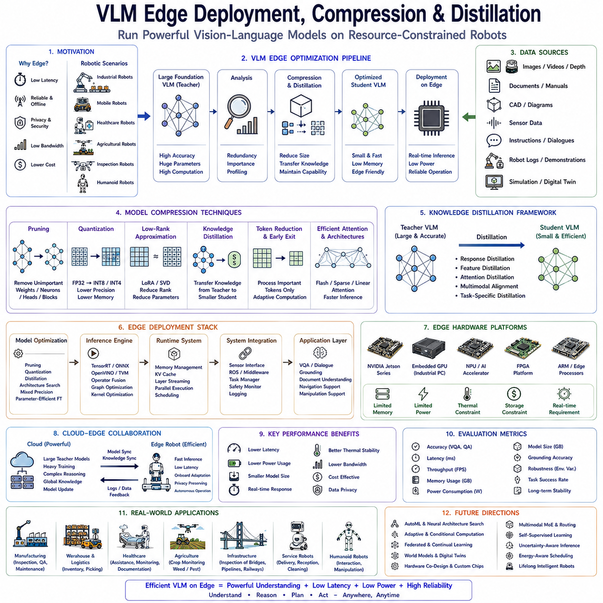{width="7.268055555555556in" height="7.268055555555556in"}

비전-언어 모델(VLM, Vision-Language Model)은 장면 이해(Scene Understanding), 시각 추론(Visual Reasoning), 자연어 대화(Natural Language Interaction), 문서 이해(Document Understanding), 멀티모달 의사결정(Multimodal Decision Making)의 핵심 기술로 자리잡았다. 그러나 최신 VLM은 수십억 개 이상의 파라미터(Parameter)를 가지므로 매우 높은 연산 성능과 메모리를 요구한다. 이러한 요구 사항은 대규모 GPU 서버에서는 문제가 되지 않지만, 산업용 로봇, 자율주행 이동로봇(AMR), 서비스 로봇, 농업 로봇, 의료 로봇과 같이 전력과 발열이 제한된 엣지 컴퓨터(Edge Computer)에서는 큰 부담이 된다. 따라서 모델 압축(Model Compression), 지식 증류(Knowledge Distillation), 양자화(Quantization)를 이용한 엣지 배포(Edge Deployment)가 필수 기술이 되고 있다.

엣지 배포가 중요한 이유는 실제 로봇이 항상 클라우드(Cloud)에 연결되어 있지 않기 때문이다. 제조 공장의 로봇은 수 밀리초(ms) 수준에서 판단해야 하며, 이동 로봇은 사람을 피하기 위해 즉각적인 반응이 필요하다. 의료 로봇은 환자 지원 과정에서 네트워크 지연(Network Latency)에 의존할 수 없으며, 농업 로봇은 통신이 불안정한 환경에서 동작한다. 따라서 의미 추론(Semantic Reasoning)을 클라우드가 아닌 로봇 내부에서 수행할 수 있는 엣지 AI(Edge AI)가 매우 중요해지고 있다.

클라우드 기반 VLM은 매우 높은 연산 성능을 제공하지만 통신 지연(Latency), 네트워크 대역폭(Bandwidth), 운영 비용(Operation Cost), 개인정보 보호(Privacy), 사이버보안(Cybersecurity) 등의 문제가 존재한다. 제조 공장은 생산 데이터를 외부로 전송하기 어렵고, 병원은 의료 데이터를 보호해야 하며, 국방 분야는 오프라인(Offline) 운용이 필수적이다. 엣지 배포는 이러한 문제를 해결하여 로봇 내부에서 안전하게 추론을 수행할 수 있도록 한다.

엣지 컴퓨팅(Edge Computing)은 클라우드와 달리 제한된 연산 자원을 가진다. NVIDIA Jetson, 산업용 GPU, ARM 프로세서, AI 가속기(NPU), FPGA 등의 플랫폼은 GPU 서버보다 메모리, 연산 성능, 저장 공간, 냉각 능력, 전력 소비가 제한적이다. 따라서 대규모 VLM을 그대로 배포하는 것은 현실적으로 어렵고 다양한 최적화 기술이 필요하다.

모델 압축(Model Compression)은 기존 VLM을 더 작고 빠른 모델로 변환하는 기술이다. 새로운 모델을 만드는 것이 아니라 기존 모델에서 불필요한 연산과 파라미터를 줄여 메모리 사용량, 계산량, 저장 공간, 추론 시간을 감소시키면서도 성능을 최대한 유지하는 것을 목표로 한다.

파라미터 감소(Parameter Reduction)는 가장 기본적인 압축 방법이다. 대규모 트랜스포머(Transformer)는 상당한 중복(Redundancy)을 포함하고 있으며, 일부 파라미터는 추론 과정에서 거의 기여하지 않는다. 이러한 파라미터를 제거하면 모델 크기를 크게 줄이면서도 의미 추론 능력을 유지할 수 있다.

구조적 가지치기(Structured Pruning)는 뉴런(Neuron), 어텐션 헤드(Attention Head), 트랜스포머 블록(Block), 채널(Channel) 등을 통째로 제거하는 방법이다. 하드웨어 친화적(Hardware Friendly)이기 때문에 실제 추론 속도를 향상시키는 효과가 크며 산업용 로봇에서 많이 사용된다.

비구조적 가지치기(Unstructured Pruning)는 개별 가중치(Weight)를 제거하여 희소 모델(Sparse Model)을 생성한다. 최신 AI 가속기는 이러한 희소 연산(Sparse Computing)을 지원하기 시작했으며, 향후 엣지 AI에서 중요한 기술이 될 것으로 예상된다.

양자화(Quantization)는 엣지 배포에서 가장 널리 사용되는 최적화 기술이다. 기존 모델은 FP32(Float32)를 사용하지만, 이를 FP16(Float16), INT8(Integer8), INT4(Integer4) 등 낮은 정밀도로 변환하면 메모리 사용량과 연산량을 크게 줄일 수 있다. 이는 엣지 GPU에서 매우 큰 성능 향상을 제공한다.

사후 양자화(Post-Training Quantization)는 모델 학습이 완료된 후 정밀도를 낮추는 방식이다. 추가 학습 없이도 적용 가능하므로 산업 현장에서 가장 많이 사용된다. 반면 양자화 인식 학습(QAT, Quantization-Aware Training)은 학습 과정에서 양자화를 고려하여 모델을 최적화하므로 더 높은 정확도를 유지할 수 있다.

혼합 정밀도(Mixed Precision)는 중요한 계층(Layer)은 높은 정밀도를 유지하고, 상대적으로 중요도가 낮은 계층은 낮은 정밀도를 사용하는 방법이다. 이를 통해 정확도와 연산 효율 사이의 균형을 맞출 수 있으며, 복잡한 VLM의 엣지 실행에서 매우 효과적이다.

지식 증류(Knowledge Distillation)는 큰 모델(Teacher Model)의 지식을 작은 모델(Student Model)로 전달하는 기술이다. Teacher는 확률 분포(Probability Distribution), 중간 특징(Intermediate Feature), 어텐션(Attention), 의미 표현(Semantic Representation)을 Student에게 전달하며, Student는 훨씬 적은 파라미터로 Teacher와 유사한 성능을 달성한다.

지식 증류는 경험 많은 전문가가 학생에게 핵심 지식을 전달하는 과정과 유사하다. Teacher 모델은 방대한 데이터를 학습한 전문가이고, Student 모델은 핵심 지식을 효율적으로 전달받아 적은 계산량으로도 높은 성능을 제공하는 경량 모델(Lightweight Model)이 된다.

응답 기반 증류(Response Distillation)는 Teacher의 최종 출력(Output)을 Student가 모방하도록 학습한다. 중간 특징 증류(Feature Distillation)는 내부 표현까지 학습하며, 어텐션 증류(Attention Distillation)는 트랜스포머의 주의 메커니즘까지 전달하여 더 높은 성능을 얻는다.

멀티모달 증류(Multimodal Distillation)는 영상과 언어를 동시에 학습해야 하므로 더욱 복잡하다. Student는 시각 특징(Visual Feature), 언어 특징(Language Feature), 교차 어텐션(Cross Attention), 공간 추론(Spatial Reasoning), 시각 접지(Visual Grounding)까지 함께 학습해야 한다.

작업 특화 증류(Task-Specific Distillation)는 특정 산업에 필요한 기능만 선택적으로 전달한다. 제조 로봇은 설비 점검과 공학 용어를, 물류 로봇은 재고 관리와 창고 운영을, 의료 로봇은 병원 환경과 의료 문서를, 농업 로봇은 작물 관리와 환경 분석을 중심으로 학습한다.

아키텍처 최적화(Architecture Optimization)는 압축과 함께 사용되는 중요한 기술이다. 트랜스포머의 셀프 어텐션(Self-Attention)은 입력 길이에 따라 계산량이 급격히 증가하므로, 희소 어텐션(Sparse Attention), 선형 어텐션(Linear Attention), 계층적 어텐션(Hierarchical Attention) 등을 적용하여 계산량을 줄인다.

Flash Attention은 메모리 접근을 최적화하여 GPU 활용률을 높이는 기술이다. 모델 구조를 변경하지 않고도 추론 속도를 크게 향상시킬 수 있어 최근 엣지 AI에서 가장 많이 활용되는 최적화 기술 중 하나이다.

KV 캐시(Key-Value Cache)는 대화형 추론에서 이전 계산 결과를 저장하여 동일한 연산을 반복하지 않도록 한다. 이를 통해 자연어 생성 속도가 크게 향상되며, 로봇과 사람의 실시간 대화에도 매우 효과적이다.

추측 디코딩(Speculative Decoding)은 작은 보조 모델이 다음 토큰(Token)을 먼저 예측하고, 큰 모델이 이를 검증하는 방식이다. 올바른 예측은 그대로 사용하므로 전체 추론 속도를 높일 수 있으며, 대화형 로봇에서 응답 시간을 줄이는 데 유용하다.

토큰 축소(Token Reduction)는 중요한 영상 영역만 선택하여 처리하는 기술이다. 의미 있는 객체만 고해상도로 분석하고 나머지는 간략하게 처리함으로써 계산량을 크게 줄일 수 있다. 이는 실시간 영상 처리에 적합하다.

조기 종료(Early Exit)는 쉬운 입력에서는 트랜스포머의 모든 계층을 계산하지 않고 중간 계층에서 추론을 종료하는 기술이다. 복잡한 장면은 더 많은 계산을 수행하고, 단순한 장면은 적은 계산만 수행하므로 평균 추론 속도를 크게 향상시킬 수 있다.

하드웨어 인식 최적화(Hardware-Aware Optimization)는 실제 배포에서 매우 중요하다. GPU Tensor Core, NPU, FPGA, 메모리 구조, 캐시(Cache), 컴파일러(Compiler)를 고려하여 모델을 최적화해야 실제 성능을 최대화할 수 있다.

TensorRT, ONNX Runtime, TVM, OpenVINO와 같은 컴파일러는 연산자 융합(Operator Fusion), 메모리 최적화(Memory Scheduling), 커널 최적화(Kernel Optimization)를 수행하여 동일한 모델도 훨씬 빠르게 실행할 수 있도록 지원한다.

메모리 관리(Memory Management)는 엣지 AI에서 매우 중요하다. 계층 스트리밍(Layer Streaming), 파라미터 오프로딩(Parameter Offloading), 메모리 공유(Memory Sharing), 활성화 재계산(Activation Recomputation)을 이용하여 제한된 GPU 메모리에서도 대형 모델을 실행할 수 있다.

전력 효율(Power Efficiency)은 이동 로봇에서 가장 중요한 요소 중 하나이다. GPU의 연산량이 증가하면 배터리 소비가 증가하므로, 압축된 모델은 추론 속도뿐 아니라 운용 시간(Operation Time)도 크게 향상시킨다.

발열(Thermal Management) 역시 중요한 문제이다. 엣지 컴퓨터는 대형 서버처럼 강력한 냉각 장치를 사용할 수 없으므로, 계산량이 많으면 스로틀링(Thermal Throttling)이 발생한다. 경량화된 모델은 발열을 줄여 장시간 안정적인 동작을 가능하게 한다.

클라우드-엣지 협업(Cloud-Edge Collaboration)은 여전히 중요한 구조이다. 로봇 내부의 Student 모델은 실시간 추론을 수행하고, 클라우드의 Teacher 모델은 복잡한 분석과 추가 학습을 담당한다. 이를 통해 자율성과 높은 지능을 동시에 확보할 수 있다.

검색 증강 생성(RAG, Retrieval-Augmented Generation)은 압축 모델의 한계를 보완한다. 유지보수 문서, CAD 도면, 디지털 트윈, 품질 기준 등을 실시간 검색하여 활용하면 모델 내부에 모든 지식을 저장하지 않아도 높은 성능을 유지할 수 있다.

지속적 학습(Continual Learning)은 압축 모델에서도 중요하다. LoRA(Low-Rank Adaptation), 어댑터(Adapter), 프롬프트 튜닝(Prompt Tuning)을 이용하면 적은 계산량으로도 새로운 환경과 작업을 지속적으로 학습할 수 있다.

Qwen-VL, InternVL, SmolVLM과 같은 오픈소스(Open Source) VLM은 엣지 배포를 더욱 쉽게 만든다. 기업은 모델 구조를 자유롭게 수정하고, 압축과 증류를 직접 수행하며, 산업용 환경에 맞게 최적화할 수 있다. 이는 보안(Security)과 데이터 주권(Data Sovereignty)이 중요한 산업에서 큰 장점이다.

엣지 배포의 평가는 단순한 정확도(Accuracy)만으로 이루어지지 않는다. 추론 지연(Latency), 메모리 사용량(Memory Footprint), 전력 소비(Power Consumption), 발열(Thermal Stability), 처리량(Throughput), 시각 접지(Visual Grounding), 문서 이해(Document Understanding), 실제 로봇 작업 성공률(Task Success)을 함께 평가해야 한다.

일반화(Generalization)는 압축 이후에도 반드시 유지되어야 한다. 지나친 압축은 의미 추론 능력을 감소시켜 새로운 환경에서 성능 저하를 유발할 수 있다. 따라서 계산 효율성과 의미 이해 능력 사이의 균형(Balance)이 매우 중요하다.

안전(Safety)은 엣지 최적화와 독립적으로 운영된다. 압축된 VLM은 의미 이해와 작업 계획을 담당하지만, 충돌 방지(Collision Avoidance), 작업 공간 감시(Workspace Monitoring), 비상 정지(Emergency Stop), 런타임 검증(Runtime Verification)은 별도의 안전 시스템이 담당한다.

향후 엣지 배포 기술은 적응형 신경망(Adaptive Neural Network), 신경망 구조 탐색(NAS, Neural Architecture Search), 혼합 전문가(Mixture of Experts), 연합 학습(Federated Learning), 분산 엣지 AI(Distributed Edge AI), 세계 모델(World Model), 디지털 트윈(Digital Twin), 자동 하드웨어 공동 설계(Hardware Co-Design)와 결합되어 더욱 발전할 것으로 예상된다.

결국 **VLM의 엣지 배포(Edge Deployment)**는 **모델 압축(Model Compression)**, **양자화(Quantization)**, **지식 증류(Knowledge Distillation)**, **효율적 어텐션(Efficient Attention)**, **하드웨어 최적화(Hardware-Aware Optimization)**, **RAG**, **지속적 학습(Continual Learning)**, **클라우드-엣지 협업(Cloud-Edge Collaboration)**을 통합하여 제한된 연산 자원에서도 높은 수준의 멀티모달 추론을 가능하게 하는 핵심 기술이다. 이러한 기술은 제조, 물류, 의료, 농업, 시설 점검, 서비스 로봇 등 다양한 분야에서 **비전-언어-행동(VLA)** 및 **물리 AI(Physical AI)** 시스템의 실용화를 가능하게 하는 핵심 기반 기술로 자리잡을 것으로 전망된다.
