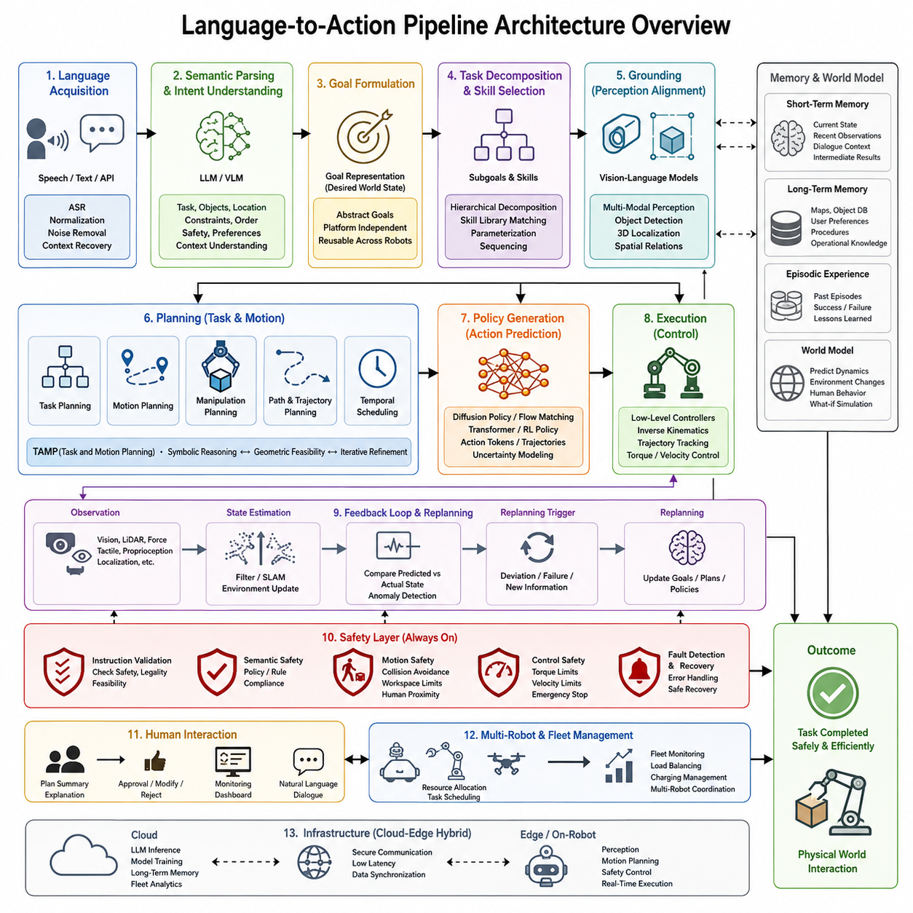
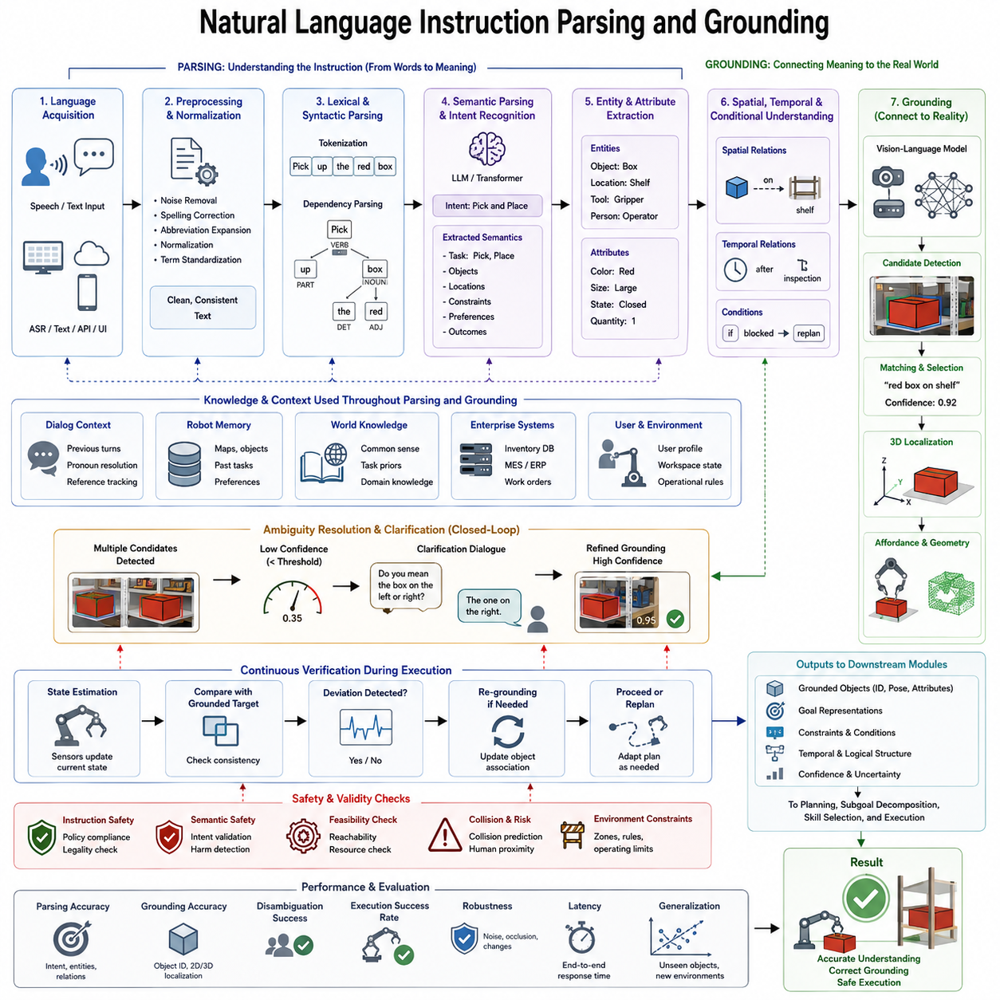
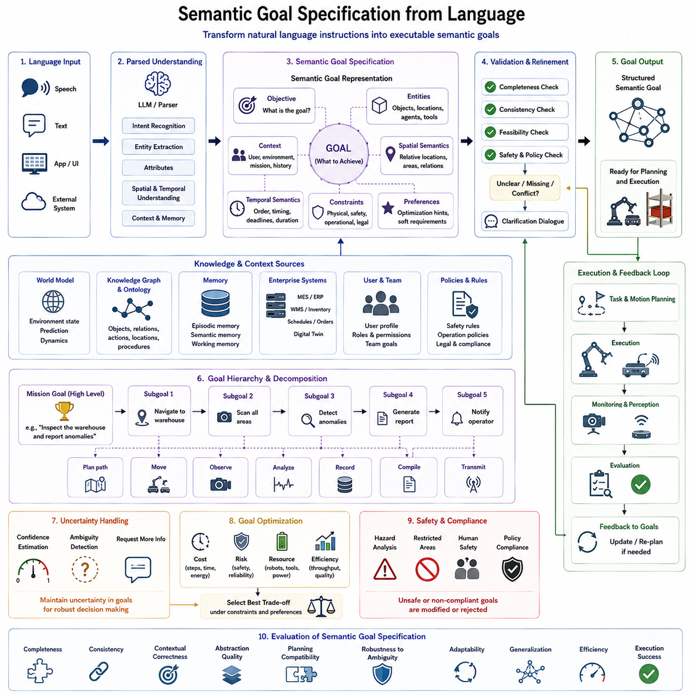
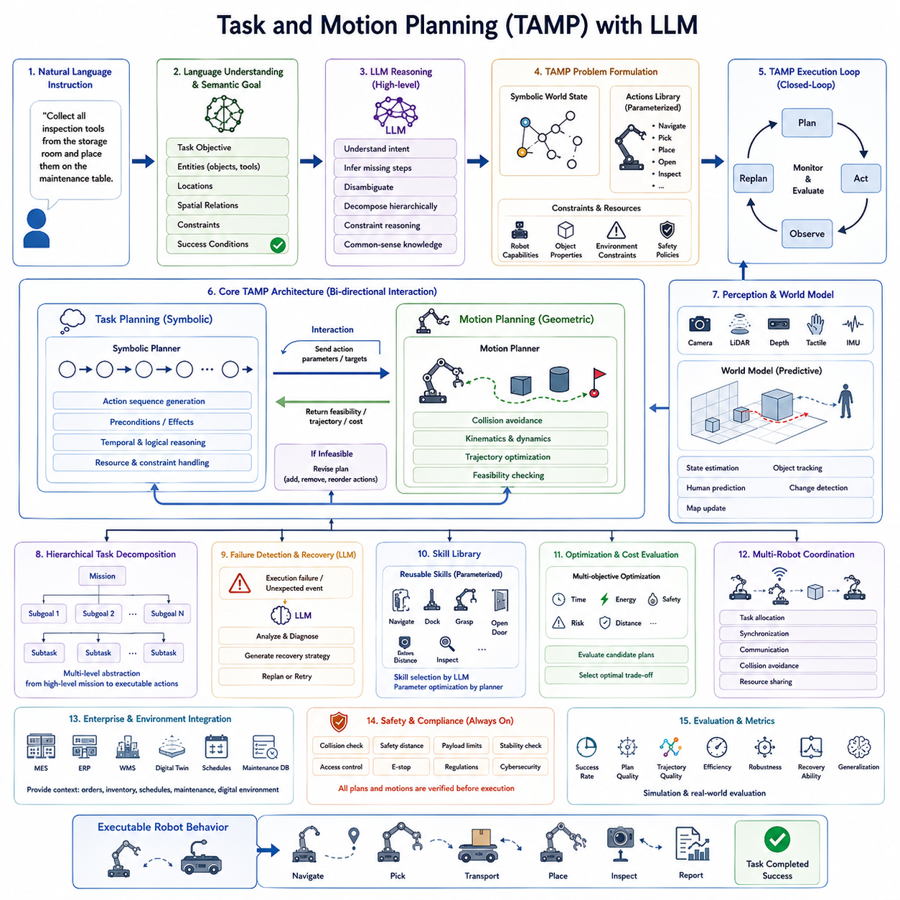
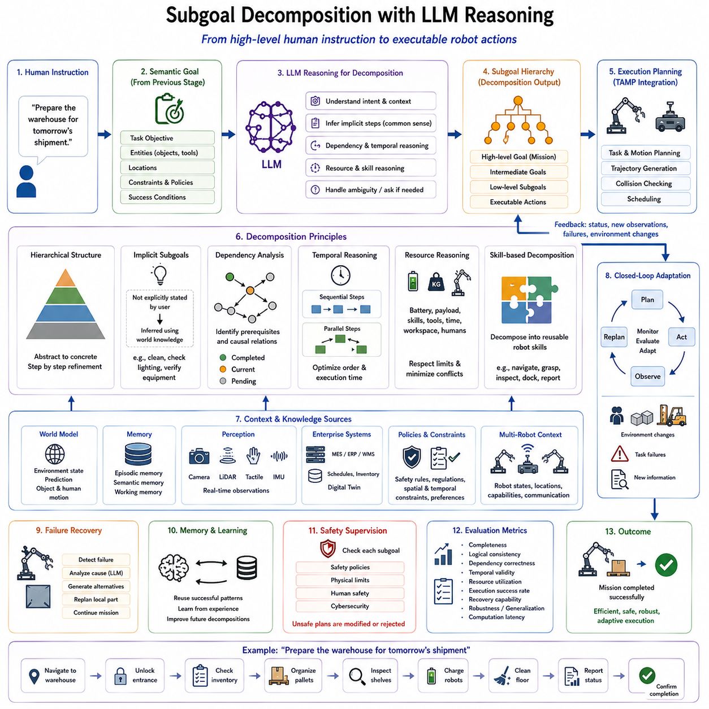
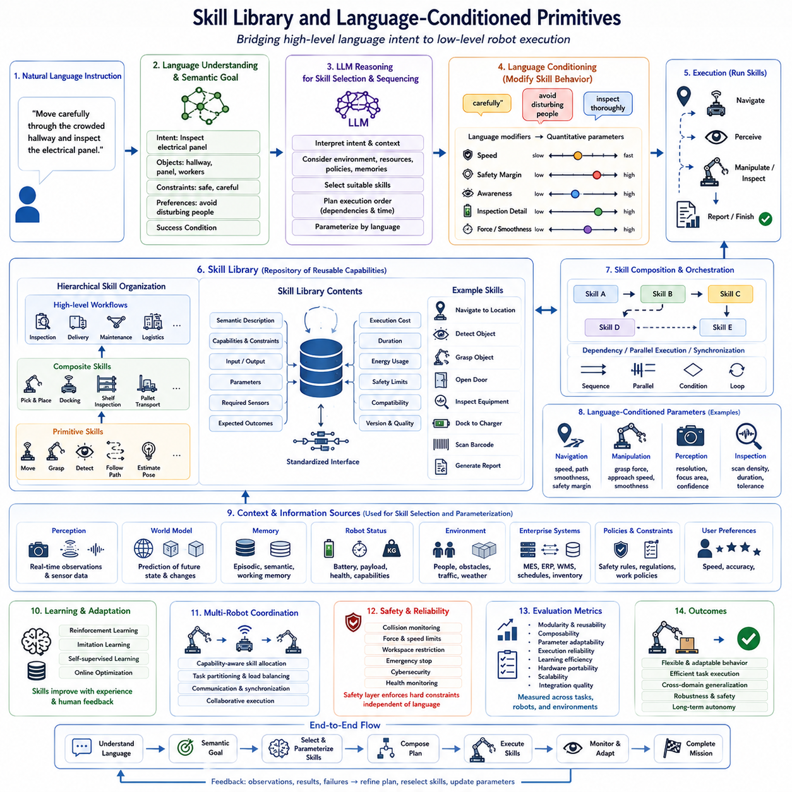
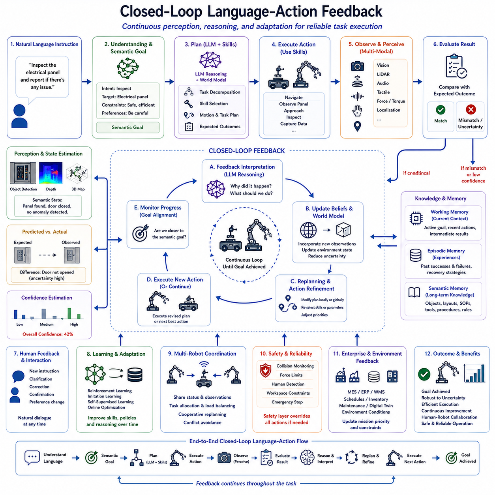
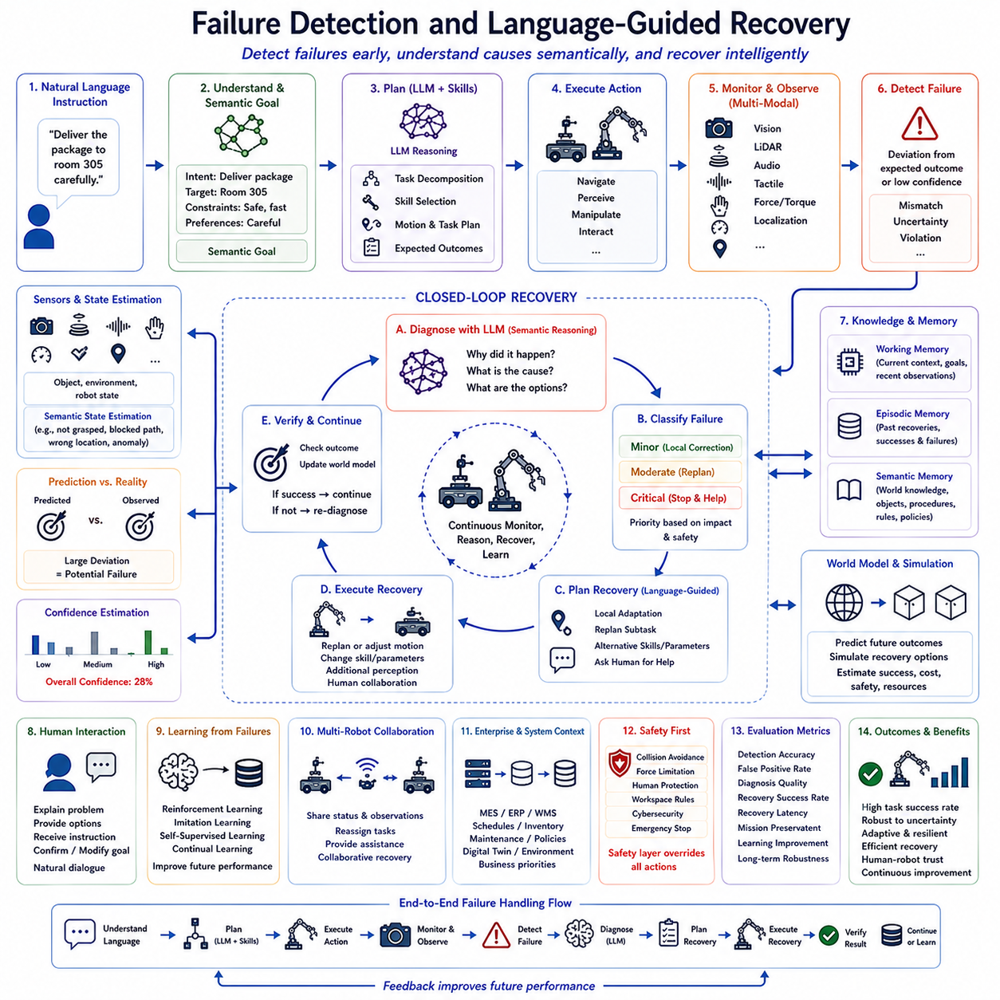
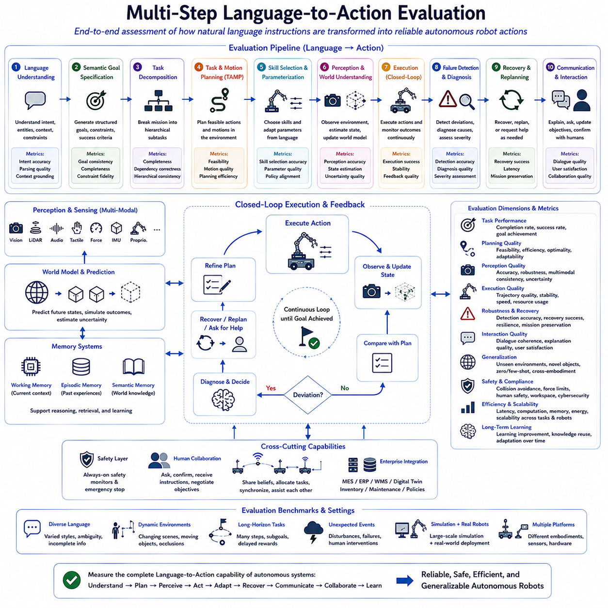
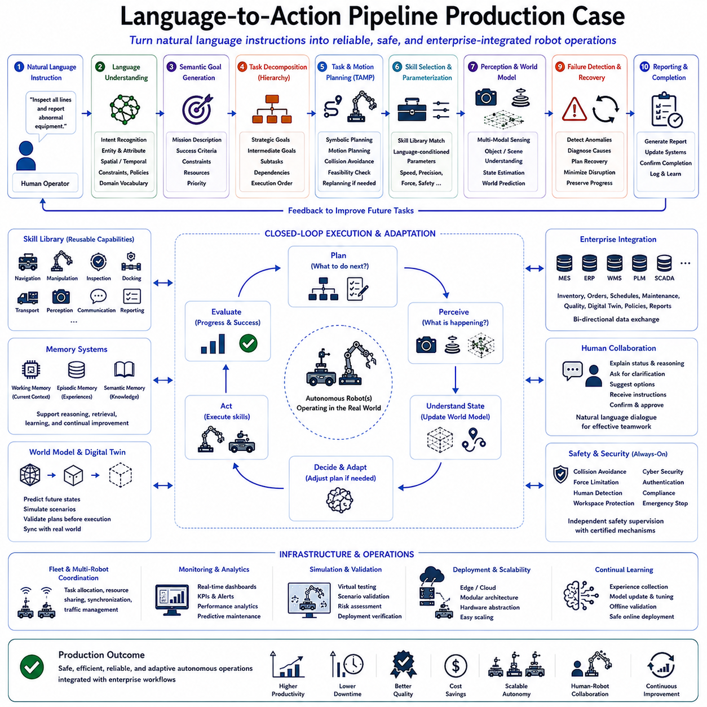

**Volume 20. Vision Language Action (VLA) Models**

# Chapter 6. Language-to-Action Pipelines

## 6.1 Pipeline Architecture Overview

{width="7.268055555555556in" height="7.268055555555556in"}

언어-행동(Language-to-Action, L2A) 파이프라인은 현대 비전-언어-행동(Vision-Language-Action, VLA) 시스템을 구성하는 가장 핵심적인 소프트웨어 아키텍처(Software Architecture) 중 하나이다. 기존의 로봇 제어 시스템이 센서 입력을 제어 알고리즘으로 직접 연결하는 방식이었다면, L2A 파이프라인은 사람의 자연어(Natural Language)를 이해하고 이를 실제 로봇이 수행할 수 있는 행동(Action)으로 변환하는 계층적 구조를 갖는다. 이 과정에서는 의미 이해, 추론, 계획, 환경 인식, 행동 생성, 실시간 제어가 유기적으로 연결되어 사람과 로봇 사이의 자연스러운 상호작용을 가능하게 한다.

사람은 일반적으로 좌표나 모터 명령을 전달하지 않고 "작업장에 있는 파란 공구함을 가져와"와 같은 추상적인 목표를 제시한다. 따라서 로봇은 이러한 언어를 이해하여 목표를 해석하고, 필요한 이동 경로와 물체 인식, 집기(Grasping), 장애물 회피(Avoidance), 운반 및 전달까지 모든 과정을 스스로 계획해야 한다. 이것이 Language-to-Action 파이프라인이 필요한 가장 근본적인 이유이다.

Language-to-Action 파이프라인은 계층형(Hierarchical) 구조로 설계된다. 가장 상위에서는 사용자의 의도(Intent)를 이해하고, 이를 작업 목표(Task Goal)로 변환한 후 여러 개의 하위 작업(Subgoal)으로 분해한다. 이후 환경과의 정합(Grounding)을 수행하고, 이동 및 조작 계획(Motion and Manipulation Planning)을 생성한 뒤, 안전성 검증(Safety Validation)을 거쳐 최종적으로 로봇 제어기(Controller)가 실행 가능한 명령으로 변환한다. 이러한 계층적 구조는 복잡한 작업을 안정적으로 수행하기 위한 핵심 설계 원칙이다.

파이프라인의 첫 단계는 언어 입력(Language Acquisition)이다. 사용자의 명령은 음성 인식(Automatic Speech Recognition, ASR), 텍스트 인터페이스(Text Interface), 대화형 시스템(Dialog System), 클라우드 API(Cloud API) 또는 산업용 소프트웨어에서 전달될 수 있다. 입력된 문장은 맞춤법 수정, 문장 정규화(Normalization), 노이즈 제거, 문맥 보완 등을 거쳐 일관된 형태로 변환되며, 이후의 의미 분석 과정에서 높은 정확도를 확보할 수 있도록 전처리된다.

다음 단계는 의미 분석(Semantic Parsing)이다. 대규모 언어 모델(Large Language Model, LLM)은 문장을 분석하여 작업(Task), 대상 객체(Object), 목적지(Location), 시간적 순서(Temporal Order), 제약 조건(Constraints), 안전 요구사항(Safety Requirements) 등을 추출한다. 이 과정의 목표는 즉시 로봇 명령을 생성하는 것이 아니라 사용자의 실제 의도(Intent)를 표현하는 내부 의미 구조(Semantic Representation)를 생성하는 것이다.

의도 이해(Intent Understanding)는 단순한 키워드 분석보다 훨씬 복잡하다. 예를 들어 "검사 테이블을 정리해"라는 명령은 어떤 테이블을 의미하는지, 무엇을 치워야 하는지, 어떤 도구를 사용할 것인지, 주변에 사람이 있는지 등 다양한 암묵적 정보를 포함한다. 따라서 현대의 Language-to-Action 시스템은 환경 정보(Environment Context), 작업 이력(Task History), 도메인 지식(Domain Knowledge)을 함께 활용하여 사용자의 의도를 보다 정확하게 해석한다.

의도가 이해되면 목표 정의(Goal Formulation)가 수행된다. 목표는 로봇의 관절이나 모터를 움직이는 명령이 아니라 작업이 완료된 최종 상태(Desired State)를 정의한다. 예를 들어 특정 물체를 지정된 위치에 배치하거나, 충전 스테이션으로 이동하거나, 창고 선반을 모두 검사하거나, 의료 물품을 특정 병실에 전달하는 것이 목표가 된다. 이러한 목표 표현은 특정 로봇 플랫폼에 독립적이므로 다양한 로봇에서 동일한 작업을 수행할 수 있다.

이후 작업 분해(Task Decomposition)가 이루어진다. 복잡한 작업은 여러 개의 작은 하위 작업(Subgoal)으로 나누어진다. 예를 들어 창고 피킹(Picking) 작업은 이동(Navigation), 물체 탐색(Object Detection), 자세 추정(Pose Estimation), 집기 계획(Grasp Planning), 조작(Manipulation), 운반(Transportation), 배치(Placement), 결과 확인(Verification) 등의 단계로 분해된다. 이러한 계층적 분해는 모듈화(Modularity)와 유지보수성(Maintainability)을 크게 향상시키며 부분적인 실패가 발생하더라도 전체 작업을 다시 수행하지 않아도 되는 장점을 제공한다.

작업이 분해되면 기술 라이브러리(Skill Library)에서 적절한 기능을 선택한다. 현대의 로봇은 NavigateTo(), PickObject(), OpenDoor(), PressButton(), InspectSurface()와 같은 재사용 가능한 기술(Skill)을 보유한다. Language-to-Action 시스템은 이러한 기술을 선택하고 필요한 매개변수(Parameter)를 설정하여 순차적으로 연결한다. 이를 통해 모든 동작을 처음부터 생성하지 않고도 높은 신뢰성과 효율성을 확보할 수 있다.

환경 정합(Grounding)은 Language-to-Action 파이프라인을 대표하는 핵심 기술이다. 언어에 포함된 객체와 공간 정보를 실제 센서가 관측한 환경과 연결하는 과정이다. 예를 들어 "노트북 옆에 있는 파란 병을 집어"라는 명령을 수행하기 위해서는 카메라 영상에서 노트북과 병을 찾아야 하며, 두 물체의 위치와 공간 관계(Spatial Relationship)를 분석하여 정확한 대상 객체를 결정해야 한다.

이를 위해 비전-언어 모델(Vision-Language Model, VLM)이 활용된다. RGB 카메라(Camera), 깊이 카메라(Depth Camera), LiDAR, 촉각 센서(Tactile Sensor), 힘 센서(Force Sensor), 고유감각(Proprioception) 정보를 통합하여 시각 정보와 언어 정보를 동일한 의미 공간(Semantic Embedding Space)에 매핑한다. 이러한 공통 표현(Common Representation)을 이용하면 언어와 영상 사이의 의미적 연결이 가능해진다.

환경 정합 이후에는 계획(Planning) 단계가 시작된다. 여기에는 작업 계획(Task Planning), 이동 계획(Motion Planning), 조작 계획(Manipulation Planning), 경로 계획(Path Planning), 시간 계획(Temporal Scheduling)이 포함된다. 작업 계획은 무엇을 수행할 것인지를 결정하고, 이동 계획은 그것을 어떻게 안전하게 수행할 것인지를 계산한다.

최근에는 작업 및 이동 통합 계획(Task and Motion Planning, TAMP)이 중요한 역할을 수행한다. 상위 수준에서는 가능한 작업처럼 보이더라도 실제 로봇이 접근할 수 없거나 충돌이 발생할 수 있기 때문이다. 따라서 현대의 Language-to-Action 시스템은 의미적 계획(Symbolic Planning)과 기하학적 계획(Geometric Planning)을 반복적으로 수행하여 실제 실행 가능한 최적의 계획을 생성한다.

계획 결과는 정책(Policy)으로 변환된다. 정책은 현재의 관측(Observation)을 실제 행동(Action)으로 변환하는 함수이다. 기존의 로봇은 사람이 설계한 제어기를 사용했지만, 현대의 VLA 시스템은 대규모 시범 데이터(Demonstration Dataset)를 학습한 정책 모델(Policy Model)을 활용한다. 정책은 관절 각도(Joint Position), 속도(Velocity), 말단 장치 자세(End-effector Pose), 행동 토큰(Action Token), 확산 기반 행동(Diffusion Action) 등을 출력할 수 있다.

최근의 Language-to-Action 시스템은 확산 정책(Diffusion Policy)이나 플로우 매칭(Flow Matching) 기반 행동 생성기를 적극 활용한다. 이러한 모델은 단일 경로만 생성하는 것이 아니라 여러 후보 행동을 반복적으로 개선하면서 불확실성을 고려할 수 있다. 특히 접촉(Contact)이 포함되는 조작 작업에서는 높은 안정성과 일반화 성능을 제공한다.

시간적 일관성(Temporal Consistency) 역시 매우 중요하다. 로봇이 매 순간 독립적인 행동을 생성하면 움직임이 불안정해질 수 있다. 따라서 행동 청킹(Action Chunking), 순환 메모리(Recurrent Memory), 트랜스포머 기반 시간 주의(Temporal Attention), 예측 제어(Predictive Control)를 활용하여 장시간에 걸쳐 부드럽고 연속적인 동작을 생성한다.

실행(Execution) 단계에서는 생성된 행동이 실제 제어 명령으로 변환된다. 이동 제어기(Navigation Controller), 역기구학(Inverse Kinematics), 전신 제어기(Whole-body Controller), 매니퓰레이터 제어기(Manipulator Controller), 자율주행 제어기(Autonomous Driving Controller)가 이를 수행한다. 이 계층은 언어 추론보다 훨씬 높은 수백\~수천 헤르츠(Hz)의 주기로 동작하여 실시간 제어 성능을 보장한다.

현대의 Language-to-Action 파이프라인은 지속적인 피드백 루프(Feedback Loop)를 갖는다. 작업이 시작된 이후에도 카메라, LiDAR, 힘 센서, 위치 추정(Localization), 장애물 감지 등의 정보를 지속적으로 수집하여 현재 상태를 확인한다. 계획과 실제 환경이 달라질 경우 즉시 재계획(Replanning)이 수행된다.

예를 들어 집기 작업 중 물체가 미끄러지거나 사람이 물체를 이동시켰다면 로봇은 이를 감지하고 새로운 상황을 분석한 뒤 다른 접근 방법을 생성한다. 따라서 실패(Failure)는 작업 종료가 아니라 새로운 계획을 생성하기 위한 입력 정보로 활용된다.

메모리(Memory)는 이러한 과정의 성능을 크게 향상시킨다. 단기 메모리(Short-term Memory)는 현재 작업 상태와 최근 관측 결과를 저장하고, 장기 메모리(Long-term Memory)는 지도(Map), 객체 정보(Object Database), 사용자 선호도(User Preference), 과거 경험(Episodic Experience), 작업 절차(Standard Procedure)를 유지한다. 이를 통해 동일하거나 유사한 작업을 더욱 효율적으로 수행할 수 있다.

최근에는 세계 모델(World Model)이 Language-to-Action 아키텍처의 중심 요소로 자리잡고 있다. 세계 모델은 단순히 현재 상태만 저장하는 것이 아니라 물체의 움직임, 환경 변화, 사람의 행동, 물리적 상호작용을 예측한다. 이러한 예측 능력은 장기 계획(Long-horizon Planning)과 복잡한 추론을 가능하게 하며, 차세대 Physical AI의 핵심 기술로 평가받고 있다.

안전성(Safety)은 파이프라인의 모든 계층에서 적용된다. 명령 자체가 위험한지 확인하는 명령 검증(Instruction Validation), 정책 위반 여부를 검사하는 의미적 안전성(Semantic Safety), 충돌 가능성을 분석하는 이동 안전성(Motion Safety), 토크(Torque)와 속도(Velocity)를 감시하는 제어 안전성(Control Safety)이 동시에 동작한다. 이를 통해 산업 현장에서도 높은 신뢰성을 확보할 수 있다.

사람과의 협업(Human Supervision)도 중요한 요소이다. Language-to-Action 시스템은 실행 전에 계획된 작업 순서와 예상 결과, 신뢰도(Confidence)를 사용자에게 제공할 수 있으며, 사용자는 이를 승인하거나 수정할 수 있다. 이러한 인간 중심(Human-in-the-loop) 구조는 산업용 로봇과 협업 로봇(Collaborative Robot)에서 매우 중요한 설계 원칙이다.

대규모 산업 환경에서는 확장성(Scalability)이 요구된다. 다수의 로봇이 동시에 작업하는 경우 각 로봇은 독립적인 Language-to-Action 파이프라인을 수행하면서도 플릿 관리 시스템(Fleet Management System)이 전체 작업을 조정한다. 이를 통해 자원 배분(Resource Allocation), 충전 관리(Charging Management), 작업 스케줄(Task Scheduling), 다중 로봇 협업(Multi-Robot Coordination)이 가능해진다.

클라우드-엣지 하이브리드(Cloud-Edge Hybrid) 구조도 널리 활용된다. 대규모 언어 추론과 장기 메모리 관리, 모델 업데이트는 클라우드에서 수행하고, 인식(Perception), 이동 계획(Motion Planning), 안전 제어(Safety Control)는 엣지 컴퓨팅(Edge Computing)에서 수행하여 실시간성을 확보한다.

최근에는 파운데이션 모델(Foundation Model)의 등장으로 Language-to-Action 시스템이 점차 통합되고 있다. 과거에는 인식, 계획, 제어를 각각 독립적으로 설계했지만, 최신 VLA 모델은 언어와 영상 입력으로부터 행동까지 직접 생성하는 종단간(End-to-End) 학습을 수행한다. 그러나 실제 산업 시스템에서는 안정성과 안전성을 확보하기 위해 모듈형 안전 계층과 전통적인 제어기를 함께 사용하는 하이브리드 구조가 여전히 주류를 이루고 있다.

Language-to-Action 시스템의 성능 평가는 단순한 작업 성공률만으로는 충분하지 않다. 명령 이해 정확도(Instruction Following Accuracy), 환경 정합 정확도(Grounding Accuracy), 계획 효율성(Planning Efficiency), 추론 지연시간(Inference Latency), 정책의 강건성(Robustness), 조작 성공률(Manipulation Success Rate), 일반화 성능(Generalization), 장애 복구 능력(Recovery Capability), 에너지 효율(Energy Efficiency), 사용자 만족도(User Satisfaction) 등 다양한 지표를 종합적으로 평가해야 한다.

현재 Language-to-Action 파이프라인은 물류(Logistics), 제조(Manufacturing), 병원(Hospital), 서비스(Service), 건설(Construction), 농업(Agriculture), 자율주행(Autonomous Driving), 산업 검사(Industrial Inspection) 등 다양한 분야에서 빠르게 적용되고 있다. 사람은 자연어만으로 로봇에게 작업을 지시할 수 있으며, 로봇은 복잡한 추론과 계획을 거쳐 이를 자율적으로 수행하는 시대가 도래하고 있다.

향후 Language-to-Action 아키텍처는 세계 모델(World Model), 장기 메모리(Long-term Memory), 지속 학습(Continual Learning), 체화 인공지능(Embodied AI), 파운데이션 정책(Foundation Policy), 자기 개선(Self-improving) 기능이 통합된 인지 시스템(Cognitive System)으로 발전할 것으로 예상된다. 미래의 로봇은 단순히 언어를 행동으로 변환하는 수준을 넘어 작업의 목적과 환경, 사람과의 협업, 조직의 목표까지 이해하는 지능형 Physical AI 플랫폼으로 진화할 것이며, Language-to-Action 파이프라인은 이러한 차세대 자율 로봇을 구현하는 핵심 소프트웨어 아키텍처가 될 것이다.

## 6.2 Instruction Parsing and Grounding (with Code)

{width="7.268055555555556in" height="7.268055555555556in"}

자연어 명령 파싱 및 그라운딩(Natural Language Instruction Parsing and Grounding)은 현대 비전-언어-행동(Vision-Language-Action, VLA) 시스템에서 사람의 언어와 실제 로봇 행동을 연결하는 가장 핵심적인 기술이다. 기존 로봇은 미리 정의된 명령어나 스크립트를 사용해야 했지만, 최신 Physical AI는 사람이 일상적으로 사용하는 자연어(Natural Language)를 이해하여 작업을 수행한다. 이를 통해 로봇 전문가가 아닌 일반 사용자도 음성이나 텍스트만으로 다양한 로봇을 직관적으로 제어할 수 있게 된다.

자연어는 본질적으로 모호성(Ambiguity), 문맥 의존성(Context Dependency), 불완전성(Incompleteness), 암묵적 정보(Implicit Knowledge)를 포함한다. 예를 들어 사용자가 "드라이버를 가져와"라고 말하면 어떤 드라이버인지, 어디에 있는지, 동일한 물체가 여러 개 있는지 등을 명시하지 않는 경우가 대부분이다. 따라서 명령 파싱의 목적은 단순히 문장을 번역하는 것이 아니라 사용자가 실제로 의도한 의미(Intent)를 복원하는 데 있다.

명령 해석은 언어 입력(Language Acquisition)에서 시작된다. 입력은 음성 인식(Automatic Speech Recognition, ASR), 그래픽 사용자 인터페이스(Graphical User Interface), 산업용 관리 시스템, 모바일 애플리케이션, 클라우드 서비스 또는 대화형 AI를 통해 전달될 수 있다. 입력된 문장은 철자 수정, 약어 확장, 문장 정규화(Normalization), 용어 표준화(Standardization)를 수행하여 일관된 텍스트 형태로 변환된다. 이러한 전처리 과정은 이후 의미 분석의 정확도를 크게 향상시킨다.

음성 기반 시스템에서는 추가적인 어려움이 존재한다. 산업 현장의 소음, 다양한 발음, 여러 화자의 동시 대화, 기계 소음 등으로 인해 음성 인식 오류가 발생할 수 있다. 현대 시스템은 대규모 언어 모델(Large Language Model, LLM)을 활용하여 문맥(Context)을 분석하고 잘못 인식된 단어를 보정한다. 단순히 음성을 문자로 변환하는 것이 아니라 작업 환경과 이전 대화 내용을 함께 고려하여 사용자의 실제 의도를 추론한다.

언어가 정규화되면 어휘 분석(Lexical Analysis)이 수행된다. 문장은 동사(Verb), 명사(Noun), 형용사(Adjective), 공간 전치사(Spatial Preposition), 시간 표현(Temporal Expression), 수량 정보(Quantity), 조건문(Conditional Clause) 등으로 분리된다. 일반적인 자연어 처리(Natural Language Processing)가 문법적 정확성을 중시하는 것과 달리, 로봇에서는 이러한 요소들이 실제 행동에 어떤 영향을 주는지를 중심으로 분석한다.

구문 분석(Syntactic Parsing)은 문장의 문법 구조를 파악하는 과정이다. 의존 구문 분석(Dependency Parsing), 구성 구문 분석(Constituency Parsing), 트랜스포머(Transformer) 기반 문맥 인코딩(Contextual Encoding)을 이용하여 어떤 행동이 어떤 객체에 적용되는지, 수식어가 어느 대상을 설명하는지, 여러 문장이 어떤 순서로 수행되어야 하는지를 분석한다. 이를 통해 복잡한 명령도 논리적인 작업 순서로 변환할 수 있다.

의미 분석(Semantic Parsing)은 문법을 넘어 실제 작업에 필요한 의미를 추출한다. 시스템은 작업(Task), 대상(Object), 위치(Location), 제약 조건(Constraint), 우선순위(Priority), 기대 결과(Expected Outcome)를 포함하는 의미 표현(Semantic Representation)을 생성한다. 이 과정에서는 문법적으로 중요한 표현보다 실제 작업 수행에 필요한 정보가 우선적으로 유지되며, 불필요한 표현은 제거된다.

의도 인식(Intent Recognition)은 자연어 이해의 핵심 요소이다. 사람은 직접적인 명령 대신 간접적인 표현을 자주 사용한다. 예를 들어 "바닥이 더러운 것 같은데"라는 말은 실제로 청소 작업을 요청하는 의미일 수 있으며, "부품이 거의 다 떨어졌네"라는 표현은 재고 확인이나 보충 작업을 의미할 수도 있다. 최신 LLM은 이러한 암묵적인 의도를 문맥과 환경 정보를 이용하여 추론할 수 있다.

최근의 명령 파서는 규칙 기반 시스템보다 트랜스포머 기반 LLM을 주로 사용한다. 이러한 모델은 대규모 사전 학습을 통해 다양한 표현과 동의어(Synonym), 우회적 표현(Paraphrase), 산업 전문 용어(Domain Terminology)를 이해할 수 있다. 제조, 물류, 의료, 검사, 건설과 같은 특정 산업 분야에서는 추가적인 미세 조정(Fine-tuning)을 통해 해당 환경에 적합한 언어 이해 능력을 확보한다.

엔터티 추출(Entity Extraction)은 명령에 등장하는 모든 객체를 식별하는 과정이다. 대상은 작업 대상 물체, 작업 공간, 장비, 사람, 공구, 기계, 저장 위치, 검사 대상, 목적지, 시간 정보, 수량 정보 등 매우 다양하다. 각각의 엔터티는 종류(Category), 속성(Attribute), 역할(Role), 관계(Relationship)를 함께 저장하여 이후 환경과 연결할 수 있도록 준비한다.

속성 추출(Attribute Extraction)은 엔터티를 더욱 구체적으로 표현한다. 사용자는 "큰 빨간 공구함", "두 번째 팔레트", "손상된 부품", "가장 가까운 충전기"와 같이 색상(Color), 크기(Size), 재질(Material), 형태(Shape), 상태(State), 순서(Order) 등을 함께 표현한다. 이러한 속성은 이후 실제 환경에서 정확한 대상을 찾는 데 중요한 기준이 된다.

공간 언어(Spatial Language)의 해석은 매우 중요한 과정이다. 사람은 절대 좌표보다 "옆", "뒤", "사이", "위", "아래", "왼쪽", "가장 가까운"과 같은 상대적 표현을 사용한다. 따라서 시스템은 이러한 언어를 3차원 공간 관계(Spatial Relationship)로 변환해야 한다. 이를 위해 의미 정보와 공간 추론(Spatial Reasoning)을 결합하여 실제 환경에서의 위치를 계산한다.

시간 이해(Temporal Understanding) 역시 중요한 역할을 수행한다. "작업이 끝난 후 검사해", "두 개를 동시에 옮겨", "배터리가 20%가 될 때까지 계속 검사해"와 같은 명령은 수행 순서와 반복 조건을 포함한다. 시스템은 이러한 시간 관계를 분석하여 올바른 실행 순서를 생성하고 작업 스케줄(Task Schedule)을 구성한다.

조건 추론(Conditional Reasoning)은 로봇의 유연성을 높여준다. "제품이 손상되었으면 관리자에게 알려", "충전기가 사용 중이면 다른 작업을 먼저 수행해"와 같은 조건문은 하나의 고정된 작업이 아니라 여러 실행 경로를 생성한다. 이러한 조건 분기는 실제 산업 환경에서 예외 상황에 유연하게 대응할 수 있도록 한다.

대화 문맥(Dialog Context)은 명령 이해 정확도를 크게 향상시킨다. 사람은 이전 대화를 바탕으로 "그것을 내 책상에 놓아"와 같이 대명사를 자주 사용한다. 따라서 시스템은 이전 대화에서 언급된 객체를 기억하고 적절한 대상을 연결해야 한다. 이를 위해 작업 중에는 대화 이력(Dialog History)을 지속적으로 유지한다.

문맥 기반 그라운딩(Contextual Grounding)은 언어뿐 아니라 환경 정보도 함께 활용한다. 로봇은 지도(Map), 재고 데이터베이스(Inventory Database), 사용자 정보(User Profile), 작업 절차(Standard Procedure), 이전 작업 이력(Task History)을 함께 사용하여 여러 후보 중 가장 적절한 대상을 선택한다. 이러한 환경 기반 추론은 동일한 명령이라도 상황에 따라 다른 결과를 생성할 수 있게 한다.

그라운딩(Grounding)은 자연어를 실제 물리 환경과 연결하는 과정이다. 파싱이 언어의 의미를 이해하는 과정이라면, 그라운딩은 언어에서 언급된 객체를 카메라(Camera), 깊이 센서(Depth Sensor), LiDAR, 촉각 센서(Tactile Sensor), 힘 센서(Force Sensor), 위치 추정(Localization), 고유감각(Proprioception)으로 관측된 실제 환경의 객체와 연결한다. 이 과정이 없다면 언어는 실제 행동으로 이어질 수 없다.

시각적 그라운딩(Visual Grounding)은 가장 대표적인 방식이다. 비전-언어 모델(Vision-Language Model, VLM)은 텍스트와 영상 정보를 동일한 의미 임베딩 공간(Semantic Embedding Space)에 표현한다. 먼저 객체 검출(Object Detection)을 수행한 후 언어 임베딩(Language Embedding)과 영상 임베딩(Visual Embedding)을 비교하여 가장 일치하는 객체를 선택한다. 이를 통해 다양한 형태와 외형을 가진 물체도 안정적으로 인식할 수 있다.

3차원 그라운딩(Three-dimensional Grounding)은 선택된 객체의 실제 위치와 자세를 계산한다. 단순히 객체를 찾는 것이 아니라 위치(Position), 자세(Pose), 크기(Size), 접근 가능성(Accessibility), 파지 가능성(Grasp Affordance), 주변 장애물(Obstacle)까지 분석한다. 이러한 정보는 이후 조작 계획(Manipulation Planning)과 이동 계획(Motion Planning)에 직접 활용된다.

관계 추론(Relational Reasoning)은 객체 간의 관계를 분석한다. "프린터 옆 상자", "지게차 뒤 팔레트"와 같은 명령은 여러 객체를 동시에 인식한 뒤 상대적인 공간 관계를 계산해야 한다. 이를 위해 장면 그래프(Scene Graph)를 구축하여 객체 간 연결 관계를 표현하고, 다양한 시점에서도 동일한 의미를 유지할 수 있도록 한다.

실제 산업 환경은 항상 변화하므로 동적 그라운딩(Dynamic Grounding)이 필요하다. 작업 중 사람이 물체를 이동시키거나 새로운 장애물이 나타날 수 있다. 따라서 로봇은 작업이 진행되는 동안 지속적으로 센서 정보를 업데이트하여 현재 환경과 언어의 연결 관계를 다시 확인한다. 이를 통해 변화하는 환경에서도 안정적인 작업 수행이 가능해진다.

모호성 해결(Ambiguity Resolution)은 매우 중요한 기능이다. 동일한 조건의 물체가 여러 개 존재하는 경우 "파란 병을 집어"라는 명령만으로는 대상을 결정할 수 없다. 시스템은 각 후보에 대한 신뢰도(Confidence)를 계산하며, 충분하지 않을 경우 "왼쪽 병을 말씀하시는 건가요?"와 같은 확인 질문을 수행하여 오류 가능성을 줄인다.

신뢰도 추정(Confidence Estimation)은 전체 시스템의 안정성을 향상시킨다. 파싱과 그라운딩 과정에서 생성된 모든 결과에는 확률 기반 신뢰도가 함께 계산된다. 신뢰도가 높은 경우에는 자동으로 작업을 수행하고, 신뢰도가 낮으면 추가 관측이나 사용자 확인을 요청한다. 이러한 불확실성 관리(Uncertainty Management)는 산업용 로봇에서 매우 중요한 안전 요소이다.

메모리(Memory)는 그라운딩 성능을 크게 향상시킨다. 의미 메모리(Semantic Memory)는 객체와 작업에 대한 일반 지식을 저장하고, 에피소드 메모리(Episodic Memory)는 과거 작업 경험을 저장한다. 작업 메모리(Working Memory)는 현재 대화와 현재 작업 상태를 유지한다. 이러한 메모리 구조를 통해 동일한 작업을 반복할수록 더욱 빠르고 정확하게 수행할 수 있다.

세계 모델(World Model)은 그라운딩의 수준을 한 단계 높여준다. 현재 상태만 인식하는 것이 아니라 물체의 이동, 사람의 움직임, 환경 변화를 예측하여 미래 상태까지 고려한다. 이를 통해 작업 계획을 미리 준비할 수 있으며, 복잡한 협업 환경에서도 높은 효율성을 확보할 수 있다.

멀티모달 그라운딩(Multi-modal Grounding)은 다양한 센서를 동시에 활용한다. 시각 정보뿐 아니라 힘 센서, 촉각 센서, 음향 센서(Audio Sensor), 열화상 카메라(Thermal Camera), 위치 추정 시스템 등을 함께 사용하여 객체를 더욱 정확하게 식별한다. 여러 센서의 정보를 통합하면 단일 카메라보다 훨씬 높은 신뢰성을 확보할 수 있다.

산업용 로봇에서는 기업 시스템과의 연동도 필요하다. 생산 지시서(Production Order), 기계 번호(Machine Identifier), 바코드(Barcode), 창고 주소(Warehouse Address), 디지털 트윈(Digital Twin), 제조 실행 시스템(Manufacturing Execution System, MES)과 같은 정보도 언어와 함께 그라운딩되어야 한다. 이를 통해 실제 작업 환경과 기업 정보 시스템을 하나의 통합 플랫폼으로 연결할 수 있다.

그라운딩의 정확도는 이후의 계획과 실행 성능을 결정한다. 잘못된 객체를 선택하면 이동 실패, 조작 실패, 작업 지연, 안전 사고까지 발생할 수 있다. 따라서 최신 시스템은 작업 중에도 지속적으로 센서 정보를 확인하며 언어와 환경의 연결이 올바른지 반복적으로 검증하는 폐루프 검증(Closed-loop Verification)을 수행한다.

안전성(Safety)은 파싱과 그라운딩 과정에서도 항상 고려된다. 위험하거나 규정을 위반하는 명령은 실행 전에 차단되며, 의미적 안전성(Semantic Safety)은 사용자의 실제 의도가 안전한지를 분석한다. 또한 그라운딩은 현재 환경에서 해당 작업이 실제로 수행 가능한지도 함께 확인하여 안전성과 실행 가능성을 동시에 보장한다.

명령 파싱 및 그라운딩의 성능 평가는 일반적인 자연어 처리 성능만으로는 충분하지 않다. 명령 이해 정확도(Instruction Following Accuracy), 의미 일관성(Semantic Consistency), 그라운딩 정확도(Grounding Accuracy), 객체 위치 추정 정확도(Object Localization Accuracy), 모호성 해결 성공률(Ambiguity Resolution Success), 대화 효율(Dialogue Efficiency), 실제 작업 성공률(Task Success Rate), 일반화 성능(Generalization), 환경 변화에 대한 강건성(Robustness), 추론 지연시간(Inference Latency) 등을 종합적으로 평가해야 한다.

향후 연구는 파싱, 그라운딩, 추론, 계획, 행동 생성을 하나의 통합 파운데이션 모델(Foundation Model)로 학습하는 방향으로 발전하고 있다. 그러나 실제 산업 현장에서는 설명 가능성(Explainability), 검증 가능성(Verifiability), 안전성(Safety), 예측 가능성(Predictability)을 확보하기 위해 모듈형 구조와 안전 검증 계층을 함께 사용하는 하이브리드(Hybrid) 아키텍처가 계속 활용될 것으로 예상된다. 자연어 명령 파싱 및 그라운딩은 앞으로도 사람과 Physical AI가 가장 자연스럽고 신뢰성 있게 협업하기 위한 핵심 기반 기술로 자리잡을 것이다.

## 6.3 Semantic Goal Specification (with Code)

{width="7.268055555555556in" height="7.268055555555556in"}

언어 기반 의미 목표 명세(Semantic Goal Specification from Language)는 현대 비전-언어-행동(Vision-Language-Action, VLA) 시스템에서 사람의 자연어를 로봇이 이해하고 실행 가능한 목표로 변환하는 핵심 기술이다. 자연어는 사람이 사용하기에는 매우 편리하지만, 로봇은 문장을 그대로 실행할 수 없다. 따라서 언어를 구조화된 의미 목표(Semantic Goal)로 변환하여 작업의 목적, 환경 제약, 우선순위, 성공 조건을 명확하게 정의해야 한다. 이러한 과정은 언어 이해(Language Understanding)와 실제 작업 계획(Task Planning)을 연결하는 중요한 중간 단계이다.

기존의 로봇 시스템은 미리 정의된 명령어나 프로그램을 기반으로 동작하였다. 그러나 최신 Physical AI 시스템은 "실험실로 이 물건을 가져가라", "비상구를 모두 점검하라", "작업대 위의 공구를 정리하라"와 같은 고수준 명령(High-level Instruction)을 직접 입력받는다. 이러한 명령은 이동 경로나 관절 제어가 아니라 최종적으로 달성해야 할 상태(Desired End State)를 표현한다. 따라서 로봇은 사용자의 의도를 이해하고, 관련 객체와 환경을 분석한 후 실행 가능한 목표를 생성해야 한다.

의미 목표 생성의 첫 단계는 자연어를 추상적인 작업 표현(Abstract Task Representation)으로 변환하는 것이다. 이 과정에서는 문장의 모든 단어를 그대로 유지하는 것이 아니라 자율적인 의사결정에 필요한 정보만 추출한다. 생성된 목표에는 작업(Task), 대상 객체(Object), 목적지(Location), 환경 조건(Environment Condition), 시간 제약(Temporal Constraint), 사용자 선호도(User Preference), 우선순위(Priority) 등이 포함된다. 이러한 중간 표현은 사람의 언어와 실제 로봇 제어를 분리하는 중요한 역할을 수행한다.

의미 목표의 가장 중요한 특징은 추상화(Abstraction)이다. 사람은 대부분 최종 결과만 이야기하고 구체적인 수행 방법은 설명하지 않는다. 예를 들어 "검사 구역을 준비해"라는 명령에는 장애물 제거, 장비 배치, 센서 활성화, 전원 확인, 작업자 통보 등의 세부 작업이 포함될 수 있다. 이러한 세부 과정은 명령에 직접 표현되어 있지 않지만, 목표를 달성하기 위해 반드시 수행되어야 한다. 따라서 의미 목표는 세부 행동보다 최종적으로 달성해야 할 상태를 중심으로 정의된다.

목표의 추상화는 플랫폼 독립성(Platform Independence)도 제공한다. 동일한 의미 목표는 하드웨어가 다른 다양한 로봇에서도 동일하게 사용할 수 있다. 예를 들어 이동형 매니퓰레이터(Mobile Manipulator), 휴머노이드(Humanoid), 자율주행 이동로봇(Autonomous Mobile Robot)이 동일한 목표를 받더라도 각각의 하드웨어 특성에 맞는 실행 계획을 생성할 수 있다. 즉 목표는 동일하지만 구현 방법은 로봇마다 달라질 수 있다.

현대의 의미 목표는 일반적으로 계층형(Hierarchical) 구조를 갖는다. 상위 수준의 미션(Mission)은 여러 개의 중간 목표(Intermediate Goal)로 분해되고, 다시 실행 가능한 하위 작업(Subtask)으로 세분화된다. 예를 들어 "창고를 점검하라"는 임무는 이동(Navigation), 위치 추정(Localization), 환경 스캔(Environment Scanning), 이상 탐지(Anomaly Detection), 보고서 생성(Report Generation), 완료 확인(Completion Verification) 등으로 분해된다. 이러한 계층 구조는 계획의 모듈화(Modularity)와 장애 복구(Failure Recovery)를 쉽게 만든다.

의도 모델링(Intent Modeling)은 의미 목표를 더욱 풍부하게 만든다. 사용자는 모든 세부 내용을 설명하지 않으며, 로봇이 기본적인 작업 절차를 알고 있다고 가정한다. 예를 들어 "의료 물품을 전달해"라는 명령에는 안전한 운반(Safe Transportation), 충돌 회피(Collision Avoidance), 물품 보호(Package Protection), 목적지 확인(Destination Verification) 등이 암묵적으로 포함되어 있다. 이러한 숨겨진 요구사항도 의미 목표의 일부로 자동 추가된다.

문맥(Context)은 의미 목표 생성 과정에서 매우 중요한 역할을 한다. 동일한 문장이라도 환경과 상황에 따라 서로 다른 목표를 의미할 수 있다. 예를 들어 "기지(Base)로 복귀하라"는 명령은 충전 스테이션(Charging Station), 정비 구역(Maintenance Area), 보관 장소(Storage Area), 이동식 관제 차량(Command Vehicle) 등을 의미할 수 있다. 따라서 의미 목표는 현재 환경과 장기 메모리(Long-term Memory), 조직의 운영 절차를 함께 고려하여 생성된다.

객체 의미(Object Semantics)는 단순한 외형 정보보다 훨씬 많은 정보를 포함한다. 예를 들어 공구함(Toolbox)은 단순한 상자가 아니라 유지보수 작업(Maintenance Operation)에 사용되는 장비이며, 특정 작업자가 사용하는 공구를 포함할 수도 있다. 의미 목표는 이러한 기능적 역할(Function), 관계(Relationship), 사용 목적(Purpose)까지 함께 표현하여 보다 지능적인 계획 수립을 가능하게 한다.

공간 의미(Spatial Semantics)는 목표가 수행되어야 할 위치를 표현한다. 사람은 대부분 절대 좌표 대신 "하역장 근처", "보관함 안", "검사 테이블 옆"과 같은 상대적인 위치를 사용한다. 의미 목표는 이러한 언어를 기호 기반 공간 관계(Symbolic Spatial Relationship)로 변환하고, 이후 환경 지도(Environment Map)와 연결하여 실제 위치를 결정한다. 이러한 구조는 환경이 일부 변경되더라도 동일한 목표를 유지할 수 있도록 한다.

시간 의미(Temporal Semantics)는 작업의 수행 시점과 순서를 정의한다. 일부 작업은 순차적으로 수행되어야 하며, 다른 작업은 동시에 실행될 수 있다. 마감 시간(Deadline), 대기 조건(Waiting Condition), 반복 검사(Recurring Inspection), 작업자와의 동기화(Synchronization) 등도 의미 목표에 포함된다. 이를 통해 계획기는 시간 제약을 만족하는 효율적인 작업 스케줄(Task Schedule)을 생성할 수 있다.

제약 조건 모델링(Constraint Modeling)은 의미 목표의 중요한 구성 요소이다. 실제 작업은 적재 중량(Payload), 배터리 용량(Battery Capacity), 출입 제한 구역(Restricted Area), 안전 구역(Safety Zone), 장비 사용 가능 여부(Resource Availability), 법규(Regulation), 환경 조건(Environment Condition) 등 다양한 제약을 받는다. 이러한 조건을 목표 안에 명확하게 표현하면 이후 계획과 실행 과정에서 일관성 있는 의사결정을 수행할 수 있다.

선호도 모델링(Preference Modeling)은 필수 조건과 권장 조건을 구분한다. 사용자는 "가능하면 가까운 엘리베이터를 사용해", "생산 라인을 방해하지 말아라", "전력 소비를 최소화해"와 같이 반드시 지켜야 하는 조건이 아닌 선호 사항을 함께 제시할 수 있다. 의미 목표는 이러한 선호도를 별도로 표현하여 계획기가 여러 대안을 비교하면서 최적의 실행 방식을 선택하도록 지원한다.

목표 검증(Goal Validation)은 계획을 시작하기 전에 의미 목표가 논리적으로 타당한지를 확인하는 과정이다. 필요한 정보가 누락되었는지, 서로 충돌하는 조건이 있는지, 실제 수행이 가능한지, 필요한 자원이 존재하는지 등을 검사한다. 문제가 발견되면 사용자에게 추가 질문을 하거나 자동으로 목표를 수정하여 이후 계획 단계에서의 실패를 줄인다.

의미 목표는 불확실성(Uncertainty)도 함께 표현한다. 사람의 명령은 모호하거나 불완전할 수 있으며, 센서 정보 역시 항상 정확하지는 않다. 따라서 현대 시스템은 목표와 객체, 제약 조건마다 신뢰도(Confidence)를 함께 저장한다. 이후 계획기는 이러한 신뢰도를 고려하여 추가 관측을 수행하거나 사용자에게 확인을 요청하는 등 보다 안전한 의사결정을 수행한다.

세계 모델(World Model)은 의미 목표의 품질을 크게 향상시킨다. 현재 상태만 이용하는 것이 아니라 미래의 환경 변화와 사람의 이동, 자원의 가용성(Resource Availability), 물체의 이동 가능성 등을 예측한다. 이러한 예측 능력을 이용하면 환경이 변화하더라도 유효한 목표를 생성할 수 있으며, 사전 대응(Proactive Decision Making)이 가능해진다.

지식 그래프(Knowledge Graph)와 의미 온톨로지(Semantic Ontology)는 목표를 더욱 풍부하게 표현한다. 객체와 위치, 행동, 작업 간의 관계를 계층적으로 구성하여 새로운 상황에서도 기존 지식을 재활용할 수 있도록 한다. 예를 들어 렌치(Wrench)가 유지보수 공구(Maintenance Tool)라는 사실을 알고 있다면 처음 보는 렌치도 적절한 보관 위치와 사용 목적을 추론할 수 있다.

메모리(Memory)는 의미 목표 생성 과정에서 중요한 역할을 수행한다. 에피소드 메모리(Episodic Memory)는 과거의 작업 성공 사례와 실패 사례를 저장하고, 의미 메모리(Semantic Memory)는 객체와 작업에 대한 일반 지식을 저장한다. 작업 메모리(Working Memory)는 현재 수행 중인 임무와 대화 내용을 유지한다. 이러한 다양한 메모리 구조를 활용하면 이전 경험을 새로운 작업에 효과적으로 적용할 수 있다.

협업 환경에서는 여러 대의 로봇이 동시에 동일한 목표를 수행해야 하는 경우가 많다. 다중 로봇 의미 목표(Multi-Robot Semantic Goal)는 작업 분담(Task Allocation), 자원 공유(Resource Sharing), 동기화(Synchronization), 통신(Communication), 공동 성공 조건(Collective Success Criteria) 등을 함께 정의한다. 이를 통해 여러 로봇이 하나의 팀처럼 협력하여 작업을 수행할 수 있다.

산업 환경에서는 기업 정보 시스템과의 연계도 중요하다. 생산 일정(Production Schedule), 제조 실행 시스템(Manufacturing Execution System, MES), 창고 관리 시스템(Warehouse Management System, WMS), 재고 데이터베이스(Inventory Database), 디지털 트윈(Digital Twin), 유지보수 기록(Maintenance Record) 등이 의미 목표 생성에 활용된다. 이를 통해 자율 로봇은 기업의 전체 업무 흐름과 자연스럽게 통합될 수 있다.

안전성(Safety)은 의미 목표 생성 과정 전체에서 가장 중요한 원칙 중 하나이다. 생성된 목표는 안전 규정(Safety Regulation), 윤리 기준(Ethical Policy), 법적 요구사항(Legal Requirement), 사이버 보안(Cybersecurity), 작업 허가 정책(Operation Policy) 등을 기준으로 검증된다. 위험하거나 허가되지 않은 작업은 계획 단계 이전에 수정되거나 거부되며, 이를 통해 실제 산업 현장에서 높은 신뢰성을 확보할 수 있다.

의미 목표 생성의 성능 평가는 일반적인 언어 이해 성능만으로는 충분하지 않다. 목표 완전성(Goal Completeness), 의미 일관성(Semantic Consistency), 문맥 적합성(Contextual Correctness), 추상화 수준(Abstraction Quality), 계획 호환성(Planning Compatibility), 모호성 처리 능력(Ambiguity Robustness), 환경 변화에 대한 적응성(Adaptability), 일반화 성능(Generalization), 계산 효율성(Computational Efficiency), 실제 작업 성공률(Execution Success Rate) 등을 종합적으로 평가해야 한다.

향후 Vision-Language-Action 시스템이 발전함에 따라 의미 목표 생성은 멀티모달 추론(Multimodal Reasoning), 파운데이션 모델(Foundation Model), 세계 모델(World Model), 지속 학습(Continual Learning), 인지 메모리(Cognitive Memory)와 더욱 긴밀하게 통합될 것으로 예상된다. 미래의 Physical AI는 고정된 목표를 생성하는 것이 아니라 환경과 사람의 행동, 작업 진행 상황에 따라 목표를 지속적으로 수정하고 발전시키는 동적인 인지 구조(Dynamic Cognitive Structure)를 갖게 될 것이다. 이러한 의미 목표 명세는 장기 계획(Long-horizon Planning), 협업 의사결정(Collaborative Decision Making), 자율 임무 관리(Autonomous Mission Management)를 지원하는 핵심 기술로 발전하며, 차세대 지능형 로봇 시스템의 중심 소프트웨어 아키텍처를 구성하게 될 것이다.

## 6.4 Task and Motion Planning (TAMP) (with Code)

{width="7.268055555555556in" height="7.268055555555556in"}

대규모 언어 모델(Large Language Model, LLM)을 활용한 작업 및 이동 계획(Task and Motion Planning, TAMP)은 현대 비전-언어-행동(Vision-Language-Action, VLA) 시스템의 핵심 기술 중 하나이다. 이 기술은 기호 기반 추론(Symbolic Reasoning)과 연속적인 이동 생성(Motion Generation)을 결합하여 복잡한 작업을 실제 환경에서 수행할 수 있도록 한다. 기존 로봇 시스템에서는 작업 계획(Task Planning)과 이동 계획(Motion Planning)이 서로 독립적으로 수행되는 경우가 많았지만, 이러한 구조는 실제 물리 환경의 제약을 충분히 반영하지 못하는 한계가 있었다.

기존 작업 계획기는 "이동(Navigate)", "집기(Pick)", "배치(Place)"와 같은 기호적 행동을 생성하고, 이동 계획기는 각각의 행동에 대해 충돌이 없는 경로를 계산하였다. 그러나 작업 계획이 실제 환경에서 실행 가능한지 확인하지 못하는 경우가 많아 계획과 현실 사이에 불일치가 발생하였다. TAMP는 이러한 문제를 해결하기 위해 상위 수준의 작업 계획과 하위 수준의 이동 계획을 하나의 통합된 구조로 연결하며, LLM은 여기에 의미 기반 추론(Semantic Reasoning)을 제공하여 보다 유연하고 지능적인 의사결정을 가능하게 한다.

TAMP의 가장 중요한 목적은 추상적인 작업 목표(Abstract Task Goal)를 실제 실행 가능한 로봇 행동으로 변환하는 것이다. 시스템은 단순히 작업 순서를 생성하는 것이 아니라 로봇이 목표 위치까지 실제로 이동할 수 있는지, 물체를 집을 수 있는지, 장애물을 피할 수 있는지, 균형을 유지할 수 있는지 등을 지속적으로 확인한다. 즉, 논리적인 계획과 물리적인 실행 가능성을 동시에 고려하는 통합 계획 구조를 제공한다.

현대의 TAMP 시스템은 자연어 이해(Language Understanding) 모듈에서 생성된 의미 목표(Semantic Goal)를 입력으로 사용한다. 예를 들어 "창고에서 검사 도구를 모두 가져와 정비 테이블 위에 놓아라"라는 명령이 입력되면 이전 단계에서 작업 목표(Task Goal), 대상 객체(Object), 공간 관계(Spatial Relation), 제약 조건(Constraint), 성공 조건(Success Condition)이 포함된 구조화된 의미 목표가 생성된다. TAMP는 이러한 정보를 기반으로 실제 실행 가능한 계획을 수립한다.

대규모 언어 모델은 주로 고수준 의미 추론(High-level Semantic Reasoning)을 담당한다. LLM은 작업의 의미를 분석하고, 누락된 절차를 추론하며, 문맥(Context)을 이해하고, 모호성을 해결하며, 계층적인 작업 구조를 생성한다. 반면 실제 이동 경로를 계산하거나 관절 각도를 생성하는 작업은 기존의 이동 계획 알고리즘(Motion Planning Algorithm)이 담당한다. 즉, LLM은 기존 계획기를 대체하는 것이 아니라 보다 지능적인 의사결정을 지원하는 역할을 수행한다.

작업 계획(Task Planning)은 "무엇을 수행해야 하는가"를 결정하는 과정이다. 작업은 행동(Action), 전제 조건(Precondition), 결과(Effect), 자원(Resource), 시간 관계(Temporal Relation) 등의 형태로 표현된다. 계획기는 현재 상태에서 목표 상태까지 도달할 수 있는 행동 순서를 탐색하며, 각 행동이 다음 단계의 실행 조건을 만족하도록 구성한다. 이러한 과정은 기존 인공지능 계획(Artificial Intelligence Planning)의 원리를 기반으로 하지만, 더욱 풍부한 의미 정보를 활용한다.

이동 계획(Motion Planning)은 "어떻게 움직일 것인가"를 결정한다. 작업 계획에서 선택된 행동을 실제 로봇이 수행하기 위해서는 충돌 회피(Collision Avoidance), 관절 제한(Joint Limit), 차량 운동학(Vehicle Kinematics), 속도(Velocity), 가속도(Acceleration), 동적 안정성(Dynamic Stability) 등을 모두 고려해야 한다. 이동 계획기는 이러한 제약을 만족하는 연속적인 이동 경로(Trajectory)를 생성한다.

TAMP의 핵심 특징은 작업 계획과 이동 계획이 지속적으로 상호작용한다는 점이다. 작업 계획에서 생성된 행동은 이동 계획을 통해 실제 실행 가능 여부를 확인받는다. 만약 이동 계획 결과 물체에 접근할 수 없거나 장애물이 존재한다면, 작업 계획은 새로운 행동을 추가하거나 순서를 변경한다. 예를 들어 앞을 막고 있는 상자를 먼저 치운 뒤 원래의 물체를 집도록 작업 순서를 자동으로 수정한다.

현대의 TAMP는 계층적 계획(Hierarchical Planning) 구조를 사용한다. 상위 수준의 미션(Mission)은 여러 개의 중간 목표(Intermediate Goal)로 분해되고, 다시 세부 작업(Subtask)으로 나누어진다. 예를 들어 창고 검사 임무는 구역 이동, 센서 스캔, 이상 탐지, 보고서 작성 등의 작업으로 분해되며, 각 단계는 다시 세부 이동과 조작 계획으로 이어진다. 이러한 계층 구조는 복잡한 작업을 효율적으로 관리할 수 있도록 한다.

LLM은 이러한 계층적 작업 분해를 더욱 지능적으로 수행한다. 사람은 "실험실을 검사 준비 상태로 만들어라"와 같이 추상적인 명령만 내리는 경우가 많다. LLM은 문장 속에 포함되지 않은 암묵적인 절차를 추론하여 문 열기(Open Door), 조명 켜기(Lighting), 센서 활성화(Sensor Activation), 작업 공간 정리(Workspace Cleaning), 장비 점검(Equipment Check) 등의 세부 작업을 자동으로 생성한다.

제약 조건 추론(Constraint Reasoning)도 LLM이 크게 기여하는 분야이다. 실제 산업 환경에서는 물리적 제약(Physical Constraint), 운영 정책(Operation Policy), 안전 규정(Safety Regulation), 조직 규칙(Organizational Rule) 등이 동시에 존재한다. LLM은 자연어로 표현된 다양한 제약을 이해하고 이를 계획기가 사용할 수 있는 구조화된 제약 조건으로 변환한다. 이를 통해 보다 현실적인 작업 계획을 생성할 수 있다.

최근의 TAMP는 세계 모델(World Model)을 적극 활용한다. 기존 시스템이 현재 상태만 고려하였다면, 세계 모델은 사람의 이동, 물체의 움직임, 자원의 사용 가능 여부 등 미래 환경까지 예측한다. 따라서 현재뿐 아니라 앞으로의 상황까지 고려한 계획을 생성할 수 있으며, 사람과 로봇이 함께 작업하는 협업 환경에서도 높은 안정성을 제공한다.

인지(Perception)는 계획 과정 전체에서 지속적으로 활용된다. 카메라(Camera), LiDAR, 깊이 센서(Depth Sensor), 촉각 센서(Tactile Sensor), 힘 센서(Force Sensor), 위치 추정(Localization) 시스템은 작업이 진행되는 동안 계속해서 환경 정보를 업데이트한다. 이러한 최신 정보를 이용하여 계획기는 필요할 경우 이동 경로와 작업 순서를 실시간으로 수정할 수 있다.

현대의 TAMP는 폐루프 계획(Closed-loop Planning)을 사용한다. 기존 방식처럼 처음에 한 번 계획을 세우고 그대로 실행하는 것이 아니라, 작업이 진행될 때마다 환경을 다시 관측하고 계획을 지속적으로 수정한다. 작업이 완료될 때마다 새로운 정보를 반영하여 이후 작업을 다시 계산하므로 예기치 못한 환경 변화에도 안정적으로 대응할 수 있다.

실패 복구(Failure Recovery)는 LLM 기반 TAMP의 가장 큰 장점 중 하나이다. 기존 계획기는 예상하지 못한 실패가 발생하면 작업을 중단하는 경우가 많았다. 그러나 LLM은 이전 실행 기록과 현재 환경을 분석하여 새로운 해결 방법을 제안할 수 있다. 예를 들어 물체를 집는 데 실패했다면 접근 방향을 변경하거나 다른 파지 자세(Grasp Pose)를 선택하거나 주변 물체를 먼저 이동시키는 등의 대안을 생성한다.

기술 라이브러리(Skill Library)는 계획 효율성을 높여준다. 시스템은 모든 동작을 처음부터 계산하지 않고 이동(Navigation), 도킹(Docking), 파지(Grasping), 문 열기(Open Door), 버튼 누르기(Button Press), 시각 검사(Visual Inspection)와 같은 재사용 가능한 기술(Skill)을 활용한다. LLM은 작업의 의미를 분석하여 적절한 기술을 선택하고, 이동 계획기는 현재 환경에 맞도록 세부 매개변수를 최적화한다.

최적화(Optimization)는 여러 실행 방법 가운데 가장 효율적인 계획을 선택하는 과정이다. 계획기는 이동 거리(Travel Distance), 수행 시간(Execution Time), 에너지 소비(Energy Consumption), 충돌 위험(Collision Risk), 조작 난이도(Manipulation Complexity), 자원 사용(Resource Utilization) 등을 종합적으로 평가한다. 이를 통해 여러 목적을 동시에 만족하는 최적의 실행 계획을 생성할 수 있다.

다중 로봇(Multi-Robot) 환경에서는 계획 과정이 더욱 복잡해진다. 여러 로봇이 동일한 작업 공간을 공유하고 하나의 목표를 협력하여 수행해야 하기 때문이다. TAMP는 작업 분배(Task Allocation), 동기화(Synchronization), 통신 일정(Communication Scheduling), 로봇 간 충돌 회피, 자원 공유(Resource Sharing) 등을 함께 고려한다. LLM은 협업 구조와 역할 분담을 추론하고, 이동 계획기는 실제 물리적 충돌이 발생하지 않도록 경로를 생성한다.

산업 현장에서는 TAMP가 기업 정보 시스템과도 연동된다. 제조 실행 시스템(Manufacturing Execution System, MES), 전사적 자원 관리(Enterprise Resource Planning, ERP), 창고 관리 시스템(Warehouse Management System, WMS), 디지털 트윈(Digital Twin), 생산 일정(Production Schedule), 유지보수 데이터베이스(Maintenance Database) 등이 계획 과정에 반영된다. 이를 통해 로봇은 기업 전체의 생산 프로세스와 자연스럽게 통합될 수 있다.

안전성(Safety)은 계획 과정 전반에서 항상 적용된다. 생성된 모든 작업 계획과 이동 경로는 충돌 예측(Collision Prediction), 작업 공간 제한(Workspace Restriction), 사람과의 거리(Human Proximity), 적재 한계(Payload Limit), 안정성(Stability), 보안 정책(Cybersecurity Policy), 비상 정지(Emergency Procedure) 등을 기준으로 검증된다. 특히 안전 검증은 LLM의 추론과 독립적으로 수행되므로 잘못된 계획이 실제 실행되는 것을 방지할 수 있다.

TAMP의 성능 평가는 단순히 작업 성공 여부만으로 이루어지지 않는다. 작업 완료율(Task Completion Rate), 계획 성공률(Planning Success), 경로 품질(Trajectory Quality), 수행 효율(Execution Efficiency), 장애 복구 능력(Recovery Capability), 계산 지연시간(Computational Latency), 환경 변화에 대한 강건성(Robustness), 일반화 성능(Generalization), 다양한 로봇 플랫폼으로의 확장성(Cross-embodiment Transfer), 사람과의 협업 효율(Human Collaboration Efficiency) 등을 종합적으로 평가한다.

향후 Vision-Language-Action 시스템이 발전함에 따라 TAMP는 의미 추론(Semantic Reasoning), 세계 모델(World Model), 멀티모달 인지(Multimodal Perception), 지속 학습(Continual Learning), 에피소드 메모리(Episodic Memory), 파운데이션 정책(Foundation Policy)을 하나의 통합 인지 아키텍처(Unified Cognitive Architecture)로 통합할 것으로 예상된다. 미래의 Physical AI는 작업 계획과 이동 계획, 환경 인식, 실행을 독립적인 모듈이 아닌 하나의 연속적인 사고 과정으로 수행하게 될 것이며, 이를 통해 장기 임무(Long-horizon Mission)에서도 높은 자율성과 안정성을 동시에 확보할 수 있을 것이다.

## 6.5 Subgoal Decomposition (with Code)

{width="7.268055555555556in" height="7.268055555555556in"}

대규모 언어 모델(Large Language Model, LLM)을 활용한 하위 목표 분해(Subgoal Decomposition)는 현대 비전-언어-행동(Vision-Language-Action, VLA) 시스템의 핵심 기능 가운데 하나이다. 사람은 일반적으로 매우 추상적인 목표만 제시하며, 세부적인 수행 절차는 지능형 시스템이 스스로 추론하기를 기대한다. 따라서 로봇은 높은 수준의 목표를 이해하고 이를 실행 가능한 여러 개의 하위 목표(Subgoal)로 분해하여 실제 작업으로 연결해야 한다.

예를 들어 "내일 출하를 위해 창고를 준비하라"라는 명령에는 이동 경로, 재고 확인, 팔레트 정리, 배터리 충전, 장비 점검 등의 세부 절차가 직접 포함되어 있지 않다. 그러나 로봇은 이러한 암묵적인 작업을 추론하여 적절한 순서로 수행해야 한다. 하위 목표 분해는 이러한 추상적인 사용자 의도를 실제 실행 가능한 작업 구조(Task Structure)로 변환하는 핵심 과정이다.

기존의 로봇 시스템은 사람이 직접 설계한 작업 트리(Task Tree)나 유한 상태 기계(Finite State Machine)를 이용하여 복잡한 작업을 분해하였다. 이러한 방식은 반복적인 산업 환경에서는 효과적이었지만 새로운 작업이 추가될 때마다 엔지니어가 직접 규칙을 작성해야 하는 한계가 있었다. 따라서 다양한 환경과 새로운 작업에 대한 확장성이 부족하였다.

LLM 기반 하위 목표 분해는 이러한 한계를 극복한다. 대규모 언어 모델은 방대한 텍스트와 멀티모달(Multimodal) 데이터를 사전 학습하면서 축적한 상식(Common Sense), 도메인 지식(Domain Knowledge), 절차적 지식(Procedural Knowledge)을 활용하여 사람이 명시하지 않은 작업까지 추론할 수 있다. 결과적으로 규칙 기반 시스템보다 훨씬 높은 일반화 성능과 유연성을 제공한다.

하위 목표 분해는 이전 단계에서 생성된 의미 목표(Semantic Goal)를 입력으로 시작된다. 시스템은 먼저 전체 목표를 분석하여 작업의 논리적 구조를 이해한다. 작업이 독립적인 활동인지, 순차적인 절차인지, 조건에 따라 분기되는 구조인지, 여러 로봇이 협력해야 하는 임무인지를 먼저 판단한 후 전체 계획 구조를 설계한다.

효율적인 하위 목표 구조는 전략적 목표(Strategic Goal)와 운영 절차(Operational Procedure)를 명확하게 구분한다. 최상위 목표는 최종적으로 달성해야 할 목적을 정의하고, 중간 목표(Intermediate Goal)는 이를 달성하기 위한 중요한 단계들을 표현한다. 가장 하위 계층은 이동(Navigation), 조작(Manipulation), 검사(Inspection), 센서 측정(Sensing), 통신(Communication), 보고(Reporting) 등 실제 로봇이 수행할 수 있는 실행 단위(Action Unit)로 구성된다.

LLM 기반 분해의 가장 큰 장점은 암묵적인 하위 목표(Implicit Subgoal)를 스스로 생성할 수 있다는 점이다. 사람은 대부분의 절차를 생략하고 결과만 이야기한다. 예를 들어 "회의실을 준비해라"라는 명령에는 의자 배치, 프로젝터 준비, 조명 확인, 청소, 냉난방 점검 등이 포함될 수 있다. 이러한 세부 작업은 명령에 직접 표현되지 않지만 LLM은 일반적인 상식을 이용하여 필요한 절차를 자동으로 생성한다.

문맥(Context)은 하위 목표 분해 과정에서 매우 중요한 요소이다. 동일한 명령이라도 작업 환경과 사용 가능한 자원, 조직의 운영 절차, 사용자의 선호도에 따라 필요한 작업 구조가 달라질 수 있다. 예를 들어 연구실을 준비하는 과정과 물류 창고를 준비하는 과정은 동일한 "준비"라는 표현을 사용하더라도 전혀 다른 작업 순서를 요구한다.

LLM은 세계 모델(World Model), 디지털 지도(Digital Map), 기업 데이터베이스(Enterprise Database), 에피소드 메모리(Episodic Memory) 등 다양한 문맥 정보를 함께 활용하여 현재 환경에 가장 적합한 하위 목표 구조를 생성한다. 따라서 동일한 명령이라도 실제 상황에 맞게 유연하게 계획을 수정할 수 있다.

의존성 분석(Dependency Analysis)은 하위 목표 분해의 중요한 단계이다. 일부 작업은 반드시 다른 작업이 완료된 이후에 수행되어야 한다. 예를 들어 검사 구역에 도착하기 전에는 선반을 검사할 수 없으며, 물체를 집기 전에는 해당 위치까지 이동해야 한다. LLM은 이러한 인과 관계(Causal Relationship)를 분석하여 올바른 실행 순서를 생성하고, 작업 간의 의존성을 유지하도록 계획을 구성한다.

시간 추론(Temporal Reasoning)은 작업의 수행 순서를 더욱 최적화한다. 일부 작업은 순차적으로 진행되어야 하지만, 다른 작업은 동시에 수행할 수 있다. 예를 들어 배터리 충전, 환경 모니터링, 보고서 작성은 병렬 수행이 가능하지만 이동과 조작은 순차적으로 진행되어야 한다. LLM은 이러한 시간 관계를 분석하여 전체 수행 시간을 최소화할 수 있는 작업 구조를 생성한다.

자원 추론(Resource Reasoning)도 매우 중요한 역할을 수행한다. 모든 로봇은 계산 성능, 배터리 용량, 적재 하중(Payload), 센서 성능, 조작 능력 등 제한된 자원을 가지고 있다. 또한 산업 현장에서는 장비 사용 가능 여부, 작업 공간 공유, 생산 일정 등도 고려해야 한다. LLM은 이러한 자원 제약을 분석하여 현재 환경에서 실행 가능한 하위 목표를 생성하고 자원 충돌(Resource Conflict)을 최소화한다.

현대의 로봇 소프트웨어에서는 기술 기반 분해(Skill-based Decomposition)가 널리 활용된다. 작업을 모터 제어 수준까지 분해하는 대신 이동(Navigation), 위치 추정(Localization), 파지(Grasping), 도킹(Docking), 장애물 회피(Obstacle Avoidance), 객체 인식(Object Recognition), 시각 검사(Visual Inspection), 보고(Reporting)와 같은 재사용 가능한 기술(Skill)을 중심으로 계획을 생성한다. 이러한 구조는 다양한 로봇 플랫폼에서도 동일한 계획 구조를 사용할 수 있도록 해준다.

하위 목표 분해 과정에서는 이전 단계에서 생성된 의미적 제약(Semantic Constraint)도 함께 유지된다. 안전 규정(Safety Policy), 운영 규칙(Operation Rule), 공간 제약(Spatial Constraint), 시간 제약(Temporal Constraint), 사용자 선호도(User Preference), 조직 정책(Organizational Policy) 등은 각각의 하위 목표에 연결되어 이후 계획 과정에서도 지속적으로 활용된다. 이를 통해 중요한 의미 정보가 사라지는 것을 방지할 수 있다.

LLM은 불완전하거나 모호한 명령을 처리하는 데에도 뛰어난 성능을 보인다. 사용자가 중요한 정보를 생략한 경우, 세계 지식(World Knowledge)을 이용하여 적절한 가정을 수행하거나 필요한 경우 사용자에게 추가 질문을 한다. 예를 들어 "택배를 전달해라"라는 명령에서 목적지가 명확하지 않다면, 주변 문맥을 분석하여 추론하거나 필요한 경우 사용자에게 확인을 요청한다.

하위 목표 분해는 장애 복구(Failure Recovery)에도 큰 장점을 제공한다. 전체 작업이 계층 구조(Hierarchical Structure)로 관리되기 때문에 특정 하위 목표에서 문제가 발생하더라도 전체 계획을 다시 생성할 필요가 없다. 예를 들어 특정 통로가 장애물로 막혀 검사에 실패한 경우, 해당 하위 목표만 새로운 이동 경로로 수정하거나 검사 순서를 변경하여 전체 임무를 계속 수행할 수 있다.

메모리(Memory)는 하위 목표 생성의 품질을 지속적으로 향상시킨다. 에피소드 메모리(Episodic Memory)는 과거 성공 사례를 저장하여 유사한 작업에서 재사용할 수 있도록 하며, 의미 메모리(Semantic Memory)는 객체의 기능과 작업 절차, 환경 정보를 저장한다. 작업 메모리(Working Memory)는 현재 대화와 작업 상태를 유지하여 계획 과정의 일관성을 보장한다.

세계 모델(World Model)은 미래 환경을 예측하여 하위 목표 생성의 품질을 더욱 향상시킨다. 현재 상태만 고려하는 것이 아니라 사람의 이동, 물체의 위치 변화, 작업량 변화, 장비 사용 가능 여부 등을 예측하여 최적의 작업 순서를 결정한다. 이를 통해 단순히 현재 환경에 반응하는 것이 아니라 미래를 고려한 선제적 계획(Proactive Planning)이 가능해진다.

다중 로봇(Multi-Robot) 환경에서는 하나의 작업을 여러 로봇에게 효율적으로 분배해야 한다. LLM은 각 로봇의 성능과 위치, 현재 작업 상태, 사용 가능한 자원을 고려하여 하위 목표를 적절하게 분배한다. 이를 통해 여러 로봇이 동시에 협력하면서도 불필요한 이동이나 통신을 최소화할 수 있으며, 물류 창고나 생산 공장과 같은 대규모 산업 환경에서 높은 효율성을 제공한다.

산업 현장에서는 하위 목표 분해가 기업 정보 시스템과도 긴밀하게 연결된다. 제조 실행 시스템(Manufacturing Execution System, MES), 전사적 자원 관리(Enterprise Resource Planning, ERP), 창고 관리 시스템(Warehouse Management System, WMS), 디지털 트윈(Digital Twin), 재고 데이터베이스(Inventory Database), 유지보수 일정(Maintenance Schedule) 등이 모두 계획 생성에 반영된다. 이를 통해 로봇의 작업은 기업 전체의 운영 흐름과 자연스럽게 통합된다.

안전성(Safety)은 하위 목표 분해 과정에서도 항상 최우선으로 고려된다. 생성된 모든 하위 목표는 운영 정책(Operation Policy), 물리적 한계(Physical Limitation), 사이버 보안(Cybersecurity), 산업 안전 규정(Industrial Safety Regulation), 작업자 보호(Human Safety) 기준을 만족해야 한다. 논리적으로 올바른 계획이라 하더라도 안전성을 만족하지 못하면 즉시 수정되거나 폐기되며, 고위험 작업은 사람이 직접 검토할 수도 있다.

LLM 기반 하위 목표 분해의 성능 평가는 단순한 언어 이해 정확도만으로 이루어지지 않는다. 하위 목표 완전성(Decomposition Completeness), 논리적 일관성(Logical Consistency), 의존성 정확도(Dependency Correctness), 시간 계획 적합성(Temporal Validity), 자원 활용(Resource Utilization), 작업 성공률(Execution Success Rate), 장애 복구 능력(Recovery Capability), 모호성 처리 능력(Robustness to Ambiguity), 일반화 성능(Generalization), 계산 지연시간(Computational Latency) 등을 종합적으로 평가한다.

향후 Vision-Language-Action 시스템이 발전함에 따라 하위 목표 분해는 더욱 적응적이고(Self-Adaptive), 동적이며(Dynamic), 자기 개선(Self-improving) 능력을 갖춘 구조로 발전할 것이다. 미래의 LLM은 멀티모달 인식(Multimodal Perception), 세계 모델(World Model), 지속 학습(Continual Learning), 인지 메모리(Cognitive Memory), 파운데이션 정책(Foundation Robot Policy)을 통합하여 작업 수행 중에도 하위 목표를 지속적으로 수정하는 동적 미션 그래프(Dynamic Mission Graph)를 생성하게 될 것이다. 이러한 기술은 장기 임무(Long-horizon Mission), 개방형 환경(Open-world Environment), 사람과의 협업(Human-Robot Collaboration)에서도 높은 자율성과 강건성(Robustness)을 제공하는 차세대 Physical AI의 핵심 기술로 자리잡을 것으로 기대된다.

## 6.6 Skill Libraries and Language-Conditioned Primitives (with Code)

{width="7.268055555555556in" height="7.268055555555556in"}

먼저 원문의 기술적 의미를 유지하면서 자연스러운 기술 문체로 번역하였으며, 약 **200\~400자** 단위로 구분하여 가독성을 높였습니다. 주요 전문 용어는 요청하신 대로 **"한글(영어)"** 형식으로 병기했습니다.

기술 라이브러리(Skill Library)와 언어 조건 기반 프리미티브(Language-Conditioned Primitives)는 현대 비전-언어-행동(Vision-Language-Action, VLA) 시스템에서 상위 수준의 추론과 하위 수준의 로봇 제어를 연결하는 핵심 아키텍처이다. 대규모 언어 모델(Large Language Model, LLM)은 사람의 의도를 이해하고 작업 계획을 생성하는 데 뛰어나지만, 모터를 직접 제어하거나 이동 경로를 계산하지는 않는다. 실제 실행은 재사용 가능한 로봇 기술(Skill)이 담당하며, 자연어는 이러한 기술을 선택하고 동적으로 조정하는 역할을 수행한다.

기존 로봇 시스템은 특정 작업을 위해 사람이 직접 절차를 작성하는 방식이었다. 이동, 조작, 검사 등의 모든 기능이 특정 하드웨어와 강하게 결합되어 있었으며, 새로운 작업이나 새로운 환경이 추가되면 프로그램을 다시 개발해야 했다. 이러한 구조는 반복적인 생산 환경에서는 효과적이었지만 변화하는 환경에서는 확장성과 유지보수성이 크게 떨어지는 문제가 있었다.

현대의 Physical AI 시스템은 이러한 문제를 해결하기 위해 로봇의 기능을 독립적인 기술(Skill) 단위로 구성한다. 각각의 기술은 다양한 작업에서 재사용할 수 있으며, 필요에 따라 조합되고 순서를 변경할 수 있다. 언어 이해 시스템(Language Understanding System)이 생성한 의미 목표(Semantic Goal)에 따라 적절한 기술을 선택하고 연결함으로써 새로운 작업도 별도의 프로그래밍 없이 수행할 수 있다.

로봇 기술(Skill)은 단순한 모터 명령이 아니라 하나의 독립적인 기능(Function)을 의미한다. 예를 들어 목표 위치까지 이동하기(Navigation), 물체 탐지(Object Detection), 공구 집기(Grasping), 문 열기(Open Door), 충전 도킹(Docking), 설비 검사(Inspection), 버튼 누르기(Button Press), 바코드 스캔(Barcode Scan), 작업 보고(Reporting) 등이 각각 하나의 기술이 된다. 이러한 기술은 인식, 계획, 제어, 오류 처리, 안전 관리까지 모두 포함하는 하나의 실행 단위이다.

기술 라이브러리(Skill Library)는 이러한 실행 가능한 기술들을 저장하는 저장소(Repository) 역할을 수행한다. 단순히 프로그램만 저장하는 것이 아니라 각 기술의 의미(Semantics), 적용 가능한 조건(Capability Constraint), 입력 매개변수(Parameter), 필요한 센서(Sensor), 예상 결과(Expected Outcome), 실행 시간(Duration), 에너지 소비(Energy Consumption), 안전 조건(Safety Limitation), 다른 기술과의 호환성(Compatibility)까지 함께 관리한다.

언어 조건 기반 프리미티브(Language-Conditioned Primitive)는 자연어를 이용하여 기술의 동작 방식을 변경하는 개념이다. 예를 들어 "사람이 많은 복도를 조심해서 이동해"라는 명령은 동일한 이동 기술을 사용하지만 속도를 줄이고 장애물 회피를 강화하며 사람과의 안전거리를 넓게 유지하도록 설정한다. 반대로 "빠르게 검사해"라는 명령은 이동 속도를 높이고 검사 효율을 우선시하도록 기술의 내부 매개변수를 자동으로 변경한다.

이러한 과정의 핵심은 의미 기반 매개변수화(Semantic Parameterization)이다. 사람은 "천천히", "조심스럽게", "정확하게", "효율적으로", "부드럽게"와 같은 정성적인 표현(Qualitative Expression)을 사용한다. 시스템은 이를 이동 속도(Velocity), 가속도(Acceleration), 파지 힘(Grasp Force), 카메라 노출(Camera Exposure), 검사 해상도(Inspection Resolution), 위치 추정 정확도(Localization Accuracy), 안전 거리(Safety Margin) 등의 정량적인 제어 변수(Control Parameter)로 변환한다.

현대의 기술 라이브러리는 일반적으로 계층형(Hierarchical) 구조를 가진다. 가장 아래에는 이동 경로 추종(Trajectory Following), 그리퍼 제어(Gripper Control), 자세 추정(Pose Estimation), 객체 탐지(Object Detection)와 같은 기본 기술(Primitive Skill)이 존재한다. 그 위에는 피킹(Pick-and-Place), 자율 도킹(Autonomous Docking), 선반 검사(Shelf Inspection), 팔레트 운반(Pallet Transport), 장비 유지보수(Maintenance)와 같은 복합 기술(Composite Skill)이 구성된다. 최상위에는 물류, 제조, 의료, 서비스 등 산업별 작업 흐름(Workflow)이 구축된다.

기술 조합(Skill Composition)은 실제 작업 수행에서 매우 중요한 기능이다. 대부분의 산업 작업은 하나의 기술만으로 수행되지 않는다. 예를 들어 물품 배송은 위치 추정(Localization), 이동(Navigation), 장애물 회피(Obstacle Avoidance), 객체 인식(Object Recognition), 파지 계획(Grasp Planning), 운반(Transportation), 목적지 확인(Destination Verification), 사용자 상호작용(User Interaction), 완료 보고(Completion Reporting) 등 다양한 기술을 순차적으로 조합하여 수행된다.

LLM은 이러한 기술 선택 과정에서 중요한 역할을 수행한다. 단순히 키워드를 기준으로 기술을 선택하는 것이 아니라 사용자의 의도(Intent)를 이해하고 현재 환경(Context), 자원(Resource), 과거 경험(Episodic Memory), 조직 정책(Organizational Policy), 사용자 선호도(User Preference)를 함께 고려하여 가장 적합한 기술 조합을 생성한다. 따라서 동일한 명령이라도 상황에 따라 서로 다른 실행 전략이 생성될 수 있다.

문맥 기반 기술 선택(Context-aware Skill Selection)은 시스템의 적응성을 크게 향상시킨다. 배터리 상태(Battery Status), 적재 하중(Payload), 날씨(Weather), 작업 공간 혼잡도(Workspace Occupancy), 센서 상태(Sensor Health), 생산 일정(Production Schedule) 등이 모두 기술 선택에 영향을 준다. 예를 들어 매니퓰레이터가 유지보수 중이라면 시스템은 다른 로봇을 선택하거나 대체 가능한 운반 기술을 자동으로 적용할 수 있다.

인지 기술(Perception Skill)은 Physical AI에서 매우 중요한 위치를 차지한다. 현대의 로봇은 작업 전후뿐 아니라 작업 중에도 지속적으로 환경을 관찰한다. 객체 인식(Object Recognition), 의미 분할(Semantic Segmentation), 시각 위치 추정(Visual Localization), 자세 추정(Pose Estimation), 이상 탐지(Anomaly Detection), 깊이 인식(Depth Perception), 장면 이해(Scene Understanding) 등의 기술은 상황 인식(Situational Awareness)을 담당하며, 현재 수행 중인 작업에 필요한 정보를 지속적으로 제공한다.

언어 조건 기반 인지(Language-conditioned Perception)는 현재 작업과 관련된 정보에 집중하도록 인식 시스템을 조정한다. 예를 들어 "전기 패널을 검사해"라는 명령이 주어지면 카메라와 인식 알고리즘은 스위치, 전선, 경고 표시, 계기판 등과 같은 요소를 우선적으로 탐색하며, 불필요한 주변 정보는 상대적으로 낮은 우선순위로 처리한다.

조작 기술(Manipulation Skill)은 의미 추론과 정밀 제어가 가장 긴밀하게 결합되는 분야이다. "유리병을 조심스럽게 들어라"라는 명령은 파지 힘(Grasp Force), 접근 속도(Approach Velocity), 접촉 감시(Contact Monitoring), 충돌 민감도(Collision Sensitivity), 물체 놓기(Release Behavior)를 모두 조정한다. 반대로 "무거운 상자를 효율적으로 적재해"라는 명령은 안정성(Stability), 적재 효율(Payload Optimization), 배치 정확도(Placement Accuracy)를 우선적으로 고려한다.

이동 기술(Navigation Skill) 역시 언어 조건(Language Condition)의 영향을 받는다. 사람은 "가장 안전한 길로 이동해", "사람을 방해하지 마", "가장 빠른 경로를 선택해"와 같이 행동 방식에 대한 선호도를 자주 표현한다. 시스템은 이동 시간(Travel Time), 에너지 효율(Energy Efficiency), 사람의 편안함(Human Comfort), 장애물 회피(Obstacle Avoidance), 운영 우선순위(Operational Priority)를 종합적으로 고려하여 최적의 이동 전략을 선택한다.

메모리(Memory)는 기술 실행의 품질을 지속적으로 향상시킨다. 에피소드 메모리(Episodic Memory)는 과거 성공 사례와 최적의 매개변수를 저장하여 유사한 환경에서 재사용한다. 의미 메모리(Semantic Memory)는 객체의 특성, 환경 정보, 표준 작업 절차(Standard Operating Procedure)를 저장하며, 작업 메모리(Working Memory)는 현재 목표와 최근 관측 정보를 유지하여 실행 과정의 일관성을 보장한다.

세계 모델(World Model)은 기술 선택과 실행을 더욱 지능적으로 만든다. 현재 환경뿐 아니라 사람의 이동, 물체의 위치 변화, 장비 사용 가능 여부, 작업량 변화 등을 예측하여 앞으로 필요한 기술을 미리 준비한다. 이러한 예측 기반 계획(Predictive Planning)은 대기 시간을 줄이고 작업 충돌을 방지하며 전체 임무 수행 효율을 향상시킨다.

학습 기반 기술 적응(Learning-based Skill Adaptation)은 차세대 로봇의 중요한 연구 분야이다. 기존에는 기술이 고정된 프로그램이었지만, 최근에는 강화학습(Reinforcement Learning), 모방학습(Imitation Learning), 자기지도학습(Self-supervised Learning), 온라인 최적화(Online Optimization)를 이용하여 실행 과정에서 지속적으로 성능을 개선한다. 또한 사람의 언어 피드백(Language Feedback)을 이용하여 기술의 품질을 점진적으로 향상시킬 수 있다.

다중 로봇 시스템(Multi-Robot System)에서는 기술 할당(Skill Allocation)이 매우 중요하다. 서로 다른 로봇은 센서 구성, 적재 능력, 이동 성능, 조작 능력이 다르므로 동일한 작업도 가장 적합한 로봇에게 배정해야 한다. 기술 라이브러리는 이러한 능력 정보를 저장하고 있으며, LLM은 이를 활용하여 여러 로봇 간의 협업 구조(Collaborative Structure)를 자동으로 생성한다.

산업 환경에서는 기술 라이브러리가 기업 정보 시스템과도 긴밀하게 연결된다. 제조 실행 시스템(Manufacturing Execution System, MES), 전사적 자원 관리(Enterprise Resource Planning, ERP), 창고 관리 시스템(Warehouse Management System, WMS), 디지털 트윈(Digital Twin), 생산 일정(Production Schedule), 유지보수 기록(Maintenance Record) 등이 모두 기술 선택과 실행 우선순위에 영향을 준다. 이를 통해 로봇은 기업 전체의 운영 흐름과 자연스럽게 통합된다.

안전성(Safety)은 모든 기술 내부에 기본적으로 포함된다. 각각의 기술은 충돌 감시(Collision Monitoring), 힘 제한(Force Limitation), 작업 공간 제한(Workspace Restriction), 비상 정지(Emergency Stop), 사이버 보안(Cybersecurity), 산업 안전 규정(Regulatory Compliance)을 독립적으로 수행한다. 언어 명령은 작업의 방식만 변경할 수 있을 뿐 이러한 안전 규칙을 무시하거나 변경할 수는 없다.

기술 라이브러리의 성능 평가는 개별 기술의 정확도만으로 이루어지지 않는다. 모듈성(Modularity), 재사용성(Reusability), 조합 가능성(Composability), 매개변수 적응성(Parameter Adaptability), 의미 일관성(Semantic Consistency), 실행 신뢰성(Execution Reliability), 학습 효율(Learning Efficiency), 다양한 로봇 플랫폼에서의 이식성(Hardware Portability), 계산 성능(Computational Performance), Language-to-Action 파이프라인과의 통합성(Integration Quality) 등을 종합적으로 평가한다.

향후 Vision-Language-Action 시스템이 발전함에 따라 기술 라이브러리는 고정된 프로그램 저장소가 아니라 스스로 성장하는 지식 시스템(Knowledge System)으로 발전할 것이다. 미래의 시스템은 새로운 기술을 자율적으로 발견하고(Autonomous Skill Discovery), 지속 학습(Continual Learning)을 통해 기술 조합을 최적화하며, 세계 모델(World Model)을 이용하여 실행 매개변수를 자동으로 조정하고, 여러 종류의 로봇을 하나의 의미 기반 인터페이스(Semantic Interface)로 통합 관리하게 될 것이다. 이러한 발전은 Physical AI의 확장성(Scalability), 유연성(Flexibility), 장기 자율성(Long-term Autonomy)을 크게 향상시키는 핵심 기반 기술이 될 것으로 기대된다.

## 6.7 Closed-Loop Language-to-Action Feedback (with Code)

{width="7.268055555555556in" height="7.268055555555556in"}

폐루프 언어-행동 피드백(Closed-Loop Language-Action Feedback)은 현대 비전-언어-행동(Vision-Language-Action, VLA) 시스템을 대표하는 핵심 기술 중 하나이다. 이 구조는 로봇이 작업을 수행하는 동안 자신의 행동을 지속적으로 평가하고, 환경 변화를 해석하며, 필요에 따라 계획을 수정하도록 만든다. 기존 로봇이 한 번 계획을 생성한 후 그대로 실행하는 방식이었다면, Physical AI는 매 순간 목표와 현재 상태를 비교하면서 행동을 지속적으로 개선한다.

기존 로봇 시스템은 대부분 개방 루프(Open-loop) 방식으로 동작하였다. 작업 계획이 생성되면 로봇은 환경 변화와 관계없이 미리 정해진 순서대로 작업을 수행하였다. 이러한 방식은 공장처럼 매우 정형화된 환경에서는 효과적이었지만, 물체가 이동하거나 사람이 작업 공간에 들어오거나 센서 오차가 발생하면 전체 계획이 실패하는 경우가 많았다. 환경 변화에 대응할 수 있는 능력이 부족했던 것이다.

폐루프(Closed-loop) 구조는 이러한 문제를 근본적으로 해결한다. 로봇은 하나의 행동을 수행할 때마다 새로운 정보를 얻는 과정으로 인식한다. 이동, 조작, 검사, 사람과의 상호작용 이후에는 카메라(Camera), LiDAR, 깊이 센서(Depth Sensor), 힘 센서(Force Sensor), 촉각 센서(Tactile Sensor), 위치 추정(Localization), 고유감각(Proprioception) 등을 이용하여 현재 환경을 다시 관측한다. 이후 현재 상태와 목표 상태를 비교하여 다음 행동을 결정한다.

언어(Language)는 작업 시작 단계에서만 사용되는 것이 아니라 실행 과정 전체에서 중요한 기준이 된다. 시스템은 단순히 모터 명령이 정상적으로 수행되었는지를 확인하는 것이 아니라, 사용자가 처음 제시한 의미 목표(Semantic Goal)가 실제로 달성되고 있는지를 지속적으로 평가한다. 따라서 특정 행동이 실패하더라도 전체 목표를 달성할 수 있다면 다른 방법을 선택하여 작업을 계속 수행할 수 있다.

피드백(Feedback)은 관측 검증(Observation Validation)에서 시작된다. 모든 행동은 실행 전에 예상 결과(Expected Outcome)를 생성하며, 실행 이후 실제 센서 정보와 비교된다. 만약 실제 결과가 예측과 일치하면 다음 단계로 진행한다. 그러나 차이가 발생하면 환경이 변경되었거나 실행 오류가 발생했음을 의미하며, 시스템은 세계 모델(World Model)을 업데이트하고 새로운 계획을 생성한다.

의미 상태 추정(Semantic State Estimation)은 단순한 하드웨어 상태 감시보다 훨씬 높은 수준의 정보를 제공한다. 기존 시스템은 관절 위치(Joint Position)나 바퀴 속도(Wheel Velocity)와 같은 저수준 데이터만 확인하였다. 반면 VLA 시스템은 물체를 성공적으로 집었는지, 검사 작업이 완료되었는지, 배송이 완료되었는지와 같은 작업 중심(Task-oriented)의 의미 상태를 지속적으로 추적한다.

세계 모델(World Model)은 피드백을 해석하는 핵심 요소이다. 시스템은 행동을 수행하기 전에 환경이 어떻게 변화할 것인지 예측한다. 이후 실제 결과와 예측 결과를 비교하여 차이를 분석하고, 그 결과를 내부 세계 모델에 반영한다. 이러한 반복적인 업데이트를 통해 로봇은 환경에 대한 이해를 지속적으로 향상시키며, 장기적인 작업(Long-horizon Task)에서도 더욱 정확한 의사결정을 수행할 수 있다.

대규모 언어 모델(Large Language Model, LLM)은 피드백 과정에서 수치 계산보다는 의미 추론(Semantic Reasoning)을 담당한다. 작업 결과가 예상과 다를 경우 LLM은 작업 이력(Task History), 환경 정보(Context), 사용자 의도(User Intent), 센서 데이터를 함께 분석하여 실패 원인을 추론한다. 예를 들어 물체를 집는 데 실패하였다면 물체가 움직였는지, 위치 추정이 잘못되었는지, 장애물이 있었는지 등을 의미적으로 분석하여 적절한 대응 방안을 제안한다.

언어 기반 재계획(Language-based Replanning)은 전체 작업을 다시 시작하지 않는다는 점에서 매우 효율적이다. 특정 작업만 영향을 받은 경우에는 해당 부분만 수정한다. 예를 들어 이동 경로가 막힌 경우에는 이동 계획만 변경하고 이미 완료된 조작 작업은 그대로 유지한다. 또한 필요한 경우 의미적으로 유사한 대체 물체(Substitute Object)를 선택하여 사용자의 의도를 계속 만족시킬 수도 있다.

메모리(Memory)는 피드백의 품질을 크게 향상시킨다. 작업 메모리(Working Memory)는 현재 목표와 최근 관측 결과를 유지하며, 에피소드 메모리(Episodic Memory)는 이전 작업의 성공 사례와 실패 사례를 저장한다. 의미 메모리(Semantic Memory)는 객체의 기능과 환경 구조, 표준 작업 절차(Standard Operating Procedure)를 저장한다. 이러한 다양한 메모리를 이용하여 현재 상황을 과거 경험과 비교하면서 더욱 정확한 판단을 수행한다.

사람과의 상호작용(Human Interaction) 역시 중요한 피드백 요소이다. 현대의 Physical AI는 최초 명령만 수행하는 것이 아니라 작업 도중 새로운 지시를 받을 수 있다. 예를 들어 배송 작업 중 사용자가 목적지를 변경하거나 긴급 작업을 먼저 수행하도록 요청하면 시스템은 이미 완료된 작업은 유지하면서 새로운 명령을 반영하여 작업 계획을 수정한다.

멀티모달 피드백(Multi-modal Feedback)은 하나의 센서만 사용하는 방식보다 훨씬 높은 신뢰성을 제공한다. 시각 정보(Visual Perception)는 객체 위치를 확인하고, 촉각 센서(Tactile Sensor)는 접촉 여부를 판단하며, 힘 센서(Force Sensor)는 파지 상태를 확인한다. 또한 음향 센서(Audio Sensor)는 기계의 동작 상태를 확인하고, 위치 추정(Localization)은 현재 위치를 계산한다. 이러한 다양한 센서 정보를 통합하여 작업 성공 여부를 더욱 정확하게 판단한다.

신뢰도 추정(Confidence Estimation)은 피드백 과정의 중요한 요소이다. 인식 결과, 의미 해석, 위치 추정, 계획 생성 등 모든 과정에는 신뢰도가 함께 계산된다. 신뢰도가 낮아지면 시스템은 추가 관측을 수행하거나 이동 속도를 줄이거나 사용자에게 확인을 요청한다. 이러한 불확실성 관리(Uncertainty Management)는 자율성과 안정성을 동시에 확보하는 중요한 기술이다.

폐루프 구조는 지속 학습(Continual Learning)도 자연스럽게 지원한다. 수행된 모든 작업은 새로운 경험으로 저장되며, 강화학습(Reinforcement Learning), 모방학습(Imitation Learning), 자기지도학습(Self-supervised Learning), 온라인 최적화(Online Optimization) 등을 통해 다음 작업의 성능을 향상시킨다. 또한 LLM은 새롭게 학습한 절차적 지식(Procedural Knowledge)을 이후의 추론 과정에 활용할 수 있다.

장애 복구(Failure Recovery)는 폐루프 구조의 가장 큰 장점 가운데 하나이다. 시스템은 작업이 종료된 후 실패를 분석하는 것이 아니라 작업 중에도 지속적으로 상태를 감시한다. 작은 문제가 발생하면 해당 부분만 수정하여 작업을 계속 수행하며, 복구가 불가능한 경우에는 새로운 작업 분해(Task Decomposition), 이동 계획(Motion Planning), 추가 환경 인식(Additional Perception), 사람의 도움 요청(Human Assistance) 등을 수행한다.

폐루프 피드백은 에너지 효율(Energy Efficiency)과 작업 생산성(Productivity)도 향상시킨다. 시스템은 불필요한 이동, 중복된 센서 사용, 비효율적인 이동 경로, 과도한 조작 동작 등을 지속적으로 분석하여 제거한다. 그 결과 이동 거리, 작업 시간, 계산량, 배터리 사용량, 기계적 마모를 줄이면서도 동일한 작업 품질과 안전성을 유지할 수 있다.

산업 환경에서는 물리적인 작업뿐 아니라 기업 정보 시스템의 피드백도 함께 활용된다. 제조 실행 시스템(Manufacturing Execution System, MES), 전사적 자원 관리(Enterprise Resource Planning, ERP), 창고 관리 시스템(Warehouse Management System, WMS), 디지털 트윈(Digital Twin), 생산 일정(Production Schedule), 재고 데이터베이스(Inventory Database), 유지보수 기록(Maintenance Record) 등이 지속적으로 변경되며 이러한 정보는 작업 우선순위와 계획 수정에 직접 반영된다.

다중 로봇(Multi-Robot) 환경에서는 폐루프 피드백이 더욱 중요하다. 각각의 로봇은 자신의 작업 상태(Task Status), 자원 사용(Resource Utilization), 환경 정보(Environment Observation), 통신 상태(Communication Status), 예상 완료 시간(Estimated Completion Time)을 서로 공유한다. 이를 기반으로 전체 로봇 그룹은 협력 계획(Cooperative Planning)을 수정하고 작업을 재분배하여 전체 시스템의 효율성을 향상시킨다.

안전성(Safety)은 피드백 과정 전체에서 독립적으로 동작한다. 충돌 감시(Collision Monitoring), 힘 제한(Force Limitation), 사람 접근 감지(Human Proximity Detection), 작업 공간 제한(Workspace Restriction), 사이버 보안(Cybersecurity), 장비 상태 진단(Equipment Diagnostics), 산업 안전 규정(Regulatory Compliance)은 의미 추론과 관계없이 항상 동작한다. 따라서 적응적인 작업 수행 중에도 안전성은 절대적으로 보장된다.

폐루프 언어-행동 피드백의 성능 평가는 단순한 제어 성능만으로 이루어지지 않는다. 의미 목표 달성률(Semantic Task Completion Accuracy), 피드백 지연시간(Feedback Latency), 환경 인식 정확도(Perception Consistency), 장애 복구 성공률(Recovery Success Rate), 적응 속도(Adaptation Speed), 계획 효율성(Planning Efficiency), 환경 변화에 대한 강건성(Robustness), 대화 품질(Dialogue Effectiveness), 학습 향상도(Learning Improvement), 에너지 효율(Energy Efficiency), 장기 운영 신뢰성(Long-term Operational Reliability) 등을 종합적으로 평가해야 한다.

향후 Vision-Language-Action 시스템은 단순한 반응형(Reactive) 피드백을 넘어 인지적 피드백(Cognitive Feedback)으로 발전할 것이다. 미래의 Physical AI는 멀티모달 인식(Multimodal Perception), 세계 모델(World Model), 에피소드 메모리(Episodic Memory), 지속 학습(Continual Learning), 파운데이션 로봇 정책(Foundation Robot Policy), 협업 추론(Collaborative Reasoning), 대규모 언어 모델(LLM)을 하나의 통합 아키텍처(Unified Adaptive Architecture)로 결합하게 된다. 이를 통해 로봇은 단순히 오류를 수정하는 수준을 넘어 미래의 문제를 예측하고, 작업 전략을 스스로 변경하며, 사람과 협상하고, 여러 로봇을 협력적으로 제어하는 진정한 장기 자율성(Long-horizon Autonomy)을 갖춘 차세대 Physical AI로 발전할 것이다.

## 6.8 Failure Detection and Recovery (with Code)

{width="7.268055555555556in" height="7.268055555555556in"}

먼저 원문의 기술적 의미를 유지하면서 자연스러운 기술 문체로 번역하였으며, 요청하신 형식에 맞게 약 **200\~400자** 단위로 구분했습니다. 또한 주요 전문 용어는 **"한글(영어)"** 형식으로 병기했습니다.

실패 탐지 및 언어 기반 복구(Failure Detection and Language-Guided Recovery)는 현대 비전-언어-행동(Vision-Language-Action, VLA) 시스템의 핵심 기능 가운데 하나이다. 실제 환경에서 동작하는 자율 로봇은 계획 단계에서 예측하지 못한 다양한 상황을 반드시 경험하게 된다. 사람의 개입, 환경 변화, 센서 오차, 물체의 이동, 통신 지연, 하드웨어 문제 등은 모두 작업 수행에 영향을 줄 수 있다. 따라서 현대의 Physical AI는 실패를 단순한 오류가 아니라 새로운 정보를 제공하는 중요한 학습 기회로 인식한다.

기존의 로봇 시스템은 대부분 결정론적 오류 처리(Deterministic Error Handling) 방식을 사용하였다. 엔지니어는 예상 가능한 오류를 미리 정의하고 각각의 오류 코드(Error Code)에 대응하는 복구 절차(Recovery Procedure)를 직접 작성하였다. 이러한 방식은 반복적인 산업 환경에서는 높은 신뢰성을 제공했지만, 새로운 실패 상황이 발생할 때마다 새로운 규칙을 추가해야 하므로 유지보수와 확장성이 크게 떨어지는 문제가 있었다.

현대의 Physical AI 시스템은 대규모 언어 모델(Large Language Model, LLM)을 활용하여 이러한 한계를 극복한다. 시스템은 단순히 오류 코드를 확인하는 것이 아니라 현재 환경(Context), 작업 이력(Task History), 세계 지식(World Knowledge), 사용자 의도(User Intent)를 함께 분석하여 실패의 의미(Semantics)를 이해한다. 따라서 기존에 한 번도 경험하지 못한 새로운 실패 상황도 유연하게 해석하고 대응할 수 있다.

실패 탐지(Failure Detection)는 Language-to-Action 파이프라인 전체에서 지속적으로 수행된다. 자연어 이해(Language Understanding), 의미 목표 생성(Semantic Goal Generation), 작업 계획(Task Planning), 이동 계획(Motion Planning), 환경 인식(Perception), 조작(Manipulation), 이동(Navigation), 사람과의 상호작용(Interaction) 등 모든 단계는 예상 결과(Expected Outcome)와 신뢰도(Confidence)를 함께 생성한다. 실행 과정에서는 실제 센서 결과와 이를 지속적으로 비교하여 이상 여부를 판단한다.

환경 인식 기반 실패 탐지(Perception-driven Failure Detection)는 가장 일반적인 감시 방법이다. 카메라(Camera), LiDAR, 깊이 센서(Depth Sensor), 촉각 센서(Tactile Sensor), 힘 센서(Force Sensor), 관성 측정 장치(Inertial Measurement Unit, IMU), 위치 추정(Localization), 고유감각(Proprioception) 등을 통해 로봇과 주변 환경의 상태를 지속적으로 관찰한다. 예상과 다른 결과가 나타나면 시스템은 실행 과정에서 문제가 발생했음을 즉시 인식한다.

의미 기반 실패 탐지(Semantic Failure Detection)는 단순한 센서 값 이상의 정보를 분석한다. 예를 들어 그리퍼(Gripper)가 정상적으로 닫혔다고 해서 물체를 성공적으로 집은 것은 아니다. 시스템은 실제로 물체가 안전하게 잡혔는지, 배송이 완료되었는지, 검사 목표가 달성되었는지 등 작업 수준(Task Level)의 의미를 평가한다. 이러한 방식은 사용자의 원래 의도와 실제 작업 결과를 직접 비교할 수 있게 해준다.

대규모 언어 모델(LLM)은 실패 원인 분석(Failure Cause Analysis)에서 중요한 역할을 수행한다. 단순히 실패를 감지하는 것이 아니라 왜 실패가 발생했는지를 추론한다. 예를 들어 검사 실패는 조명 부족, 센서 가림(Occlusion), 장비 고장, 위치 오차, 환경 변화, 작업 순서 오류 등 다양한 원인으로 발생할 수 있다. LLM은 작업 이력과 환경 정보를 종합하여 가장 가능성이 높은 원인을 분석하고 적절한 복구 전략을 선택한다.

실패 분류(Failure Classification)는 복구 전략을 결정하는 중요한 단계이다. 작은 위치 오차나 일시적인 센서 불확실성과 같은 경미한 오류는 단순한 이동 보정만으로 해결할 수 있다. 물체를 집지 못하거나 이동 경로가 막힌 경우와 같은 중간 수준의 오류는 부분적인 재계획(Local Replanning)이 수행된다. 반면 안전성과 관련된 심각한 오류는 즉시 작업을 중단하고 상세한 진단을 수행한 후에만 작업을 재개한다.

문맥(Context)은 복구 과정에서도 매우 중요하다. 동일한 실패라도 작업 환경과 우선순위에 따라 대응 방식이 달라질 수 있다. 예를 들어 일반적인 창고 점검 중 통로가 막혀 있다면 다른 경로를 선택하면 되지만, 긴급 구조 작업에서는 장애물을 제거하거나 사람의 도움을 요청해야 할 수도 있다. LLM은 이러한 상황적 차이를 고려하여 가장 적절한 복구 방법을 선택한다.

언어(Language)는 복구 과정에서 사람과 로봇을 연결하는 중요한 인터페이스가 된다. 불확실성이 높거나 자동 복구가 어려운 경우 시스템은 단순한 오류 코드 대신 현재 상황과 원인, 가능한 해결 방법을 자연어로 설명한다. 사용자는 새로운 목표를 제시하거나 우선순위를 변경하거나 추가 정보를 제공할 수 있으며, 시스템은 이를 반영하여 작업 계획을 수정한다.

복구 계획(Recovery Planning)은 전체 작업을 처음부터 다시 생성하는 것이 아니라 가능한 한 부분적으로 수행된다. 특정 하위 목표(Subgoal)만 실패하였다면 해당 부분만 수정하고 이미 완료된 작업은 그대로 유지한다. 이동 경로를 새로 생성하거나 파지(Grasp) 자세를 변경하거나 추가적인 환경 인식(Additional Perception)을 수행하는 등 최소한의 수정만으로 작업을 계속 진행한다.

계층적 작업 분해(Hierarchical Task Decomposition)는 복구 효율성을 크게 향상시킨다. 작업이 여러 개의 하위 목표로 구성되어 있기 때문에 실패가 발생한 부분만 독립적으로 수정할 수 있다. 작업 간의 의존성(Dependency)이 명확하게 표현되어 있으므로 영향을 받는 부분만 재계획하고 나머지 작업은 그대로 유지할 수 있다. 이러한 구조는 장기 임무(Long-horizon Mission)에서도 매우 효과적이다.

메모리(Memory)는 복구 품질을 지속적으로 향상시킨다. 작업 메모리(Working Memory)는 현재 작업 상태와 최근 관측 결과를 유지하며, 에피소드 메모리(Episodic Memory)는 이전의 성공적인 복구 사례와 실패 사례를 저장한다. 의미 메모리(Semantic Memory)는 객체 특성, 작업 절차(Standard Operating Procedure), 환경 정보를 장기적으로 저장한다. 이러한 경험은 이후 유사한 상황에서 더욱 빠르고 정확한 복구를 가능하게 한다.

세계 모델(World Model)은 복구 전략을 사전에 검증하는 역할을 수행한다. 시스템은 새로운 복구 방법을 실제 환경에서 실행하기 전에 내부 시뮬레이션을 수행하여 성공 가능성, 안전성, 자원 사용량, 작업 시간 등을 예측한다. 여러 개의 후보 전략 가운데 가장 높은 성공 확률을 가진 방법을 선택한 후 실제 실행을 시작하므로 복구 성공률을 크게 향상시킬 수 있다.

기술 라이브러리(Skill Library)는 복구 과정에서도 적극적으로 활용된다. 새로운 복구 알고리즘을 만드는 대신 기존의 이동(Navigation), 조작(Manipulation), 환경 인식(Perception), 통신(Communication) 기술을 다른 매개변수(Parameter)나 다른 순서로 재조합하여 문제를 해결한다. 언어 조건 기반 프리미티브(Language-Conditioned Primitive)는 이러한 기술을 현재 상황에 맞게 유연하게 조정한다.

실패로부터의 학습(Learning from Failures)은 폐루프 Physical AI 시스템의 가장 큰 장점 중 하나이다. 모든 실패 사례는 환경의 특성, 센서 한계, 계획의 문제점, 사용자 선호도 등에 대한 새로운 정보를 제공한다. 강화학습(Reinforcement Learning), 모방학습(Imitation Learning), 자기지도학습(Self-supervised Learning), 지속 학습(Continual Learning)은 이러한 경험을 이용하여 이후 작업의 성능을 지속적으로 향상시킨다. LLM 역시 새로운 절차적 지식을 축적하여 추론 능력을 강화한다.

다중 로봇(Multi-Robot) 환경에서는 협업 기반 복구(Cooperative Recovery)가 가능하다. 한 로봇이 배터리 부족, 센서 고장, 작업 공간 차단 등의 문제를 겪으면 다른 로봇이 남은 작업을 대신 수행하거나 추가적인 환경 정보를 제공하거나 필요한 자원을 운반할 수 있다. 언어 기반 협업(Language-guided Coordination)은 여러 로봇이 하나의 의미 목표(Semantic Mission)를 공유하면서 효율적으로 작업을 재분배하도록 지원한다.

산업 현장에서는 복구 과정이 기업 정보 시스템과도 긴밀하게 연결된다. 제조 실행 시스템(Manufacturing Execution System, MES), 전사적 자원 관리(Enterprise Resource Planning, ERP), 창고 관리 시스템(Warehouse Management System, WMS), 디지털 트윈(Digital Twin), 유지보수 데이터베이스(Maintenance Database), 생산 일정(Production Schedule), 재고 관리 시스템(Inventory Management System) 등이 복구 전략 결정에 중요한 정보를 제공한다. 이를 통해 복구 과정도 기업의 운영 목표와 일치하도록 유지된다.

안전성(Safety)은 모든 복구 과정에서 가장 높은 우선순위를 가진다. 충돌 회피(Collision Avoidance), 힘 제한(Force Limitation), 사람 보호(Human Protection), 작업 공간 제한(Workspace Restriction), 사이버 보안(Cybersecurity), 산업 안전 규정(Regulatory Compliance), 비상 정지(Emergency Shutdown)는 LLM의 추론과 독립적으로 동작한다. 따라서 의미적으로 적절한 복구 전략이라도 안전성을 만족하지 못하면 실행되지 않는다.

실패 탐지 및 언어 기반 복구의 성능 평가는 단순히 복구 성공 여부만으로 이루어지지 않는다. 실패 탐지 정확도(Detection Accuracy), 오탐률(False Positive Rate), 원인 분석 품질(Diagnosis Quality), 복구 시간(Recovery Latency), 기존 작업 유지율(Mission Preservation), 계획 효율성(Planning Efficiency), 설명 가능성(Semantic Explanation Quality), 사람과의 협업 효율(Human Collaboration Effectiveness), 계산 성능(Computational Performance), 새로운 실패에 대한 적응성(Adaptability to Unseen Failures), 학습 효과(Learning Improvement), 장기 운영 신뢰성(Long-term Operational Robustness) 등을 종합적으로 평가해야 한다.

향후 Vision-Language-Action 시스템이 발전함에 따라 실패 탐지와 언어 기반 복구는 더욱 예측적(Predictive), 협업적(Collaborative), 자기 개선(Self-improving) 능력을 갖춘 구조로 발전할 것이다. 미래의 Physical AI는 멀티모달 인식(Multimodal Perception), 예측 세계 모델(Predictive World Model), 지속 학습(Continual Learning), 인지 메모리(Cognitive Memory), 파운데이션 로봇 정책(Foundation Robot Policy), 디지털 트윈(Digital Twin), 대규모 언어 모델(LLM)을 하나의 통합 복원력 아키텍처(Unified Resilience Architecture)로 결합하게 된다. 이를 통해 오류가 발생한 이후 대응하는 수준을 넘어 실패 가능성을 미리 예측하고, 작업 전략을 선제적으로 변경하며, 사람과 협력하고, 여러 로봇이 공동으로 문제를 해결하는 고신뢰성 자율 시스템으로 발전하게 될 것이다.

## 6.9 Multi-Step Evaluation (with Code)

{width="7.268055555555556in" height="7.268055555555556in"}

다단계 언어-행동 평가(Multi-Step Language-to-Action Evaluation)는 현대 비전-언어-행동(Vision-Language-Action, VLA) 시스템에서 매우 중요한 연구 분야이다. 이 평가는 자연어 명령(Natural Language Instruction)이 실제 로봇의 장기 자율 행동(Long-horizon Autonomous Behavior)으로 얼마나 정확하고 안정적으로 변환되는지를 종합적으로 측정한다. 기존의 로봇 평가는 인식(Perception), 이동(Navigation), 조작(Manipulation)과 같은 개별 기능만을 평가하는 경우가 많았지만, VLA 시스템은 언어 이해부터 실제 행동까지 전체 인지 파이프라인(Cognitive Pipeline)을 하나의 시스템으로 평가해야 한다.

기존 로봇 시스템의 평가는 대부분 제한된 실험 환경에서 작업 성공률(Task Completion Rate)을 측정하는 방식이었다. 이동 알고리즘은 위치 오차(Localization Error), 조작 기술은 파지 성공률(Grasp Success Rate), 인식 시스템은 객체 인식 정확도(Object Detection Accuracy) 중심으로 평가되었다. 이러한 평가는 각각의 기술을 분석하는 데에는 효과적이지만, 언어 이해와 의미 추론, 작업 계획, 세계 모델(World Model), 적응형 실행(Adaptive Execution)이 서로 어떻게 영향을 주는지는 평가할 수 없었다.

다단계 평가는 먼저 언어 이해(Language Understanding) 단계부터 시작된다. 시스템이 단순히 단어를 인식하는 것이 아니라 사용자의 실제 의도(User Intent)를 얼마나 정확하게 이해하는지를 평가한다. 사람의 명령은 모호하거나 불완전하며 문맥(Context)에 의존하는 경우가 많다. 따라서 의미 분석(Semantic Parsing), 의도 인식(Intent Recognition), 객체 추출(Entity Extraction), 공간 이해(Spatial Understanding), 시간 추론(Temporal Reasoning), 제약 조건 해석(Constraint Interpretation), 문맥 기반 연결(Contextual Grounding) 등을 종합적으로 평가한다.

두 번째 단계는 의미 목표 명세(Semantic Goal Specification)를 평가한다. 자연어를 이해한 이후 시스템은 목표 상태(Desired Outcome), 환경 제약(Environment Constraint), 작업 우선순위(Priority), 성공 조건(Success Criteria) 등을 포함하는 구조화된 의미 목표를 생성해야 한다. 평가는 생성된 목표가 사용자의 원래 의도를 정확하게 유지하는지, 충분한 추상화 수준을 가지는지, 계획 시스템과 자연스럽게 연결되는지를 중심으로 수행된다.

세 번째 단계는 작업 분해(Task Decomposition)를 평가한다. 하나의 높은 수준의 작업은 여러 개의 하위 목표(Subgoal)로 논리적으로 분해되어야 한다. 평가 항목에는 작업 분해의 완전성(Completeness), 의존성 정확도(Dependency Correctness), 계층 구조(Hierarchical Consistency), 시간 순서(Temporal Ordering), 자원 할당(Resource Allocation), 절차적 추론(Procedural Reasoning) 등이 포함된다. 특히 사용자가 생략한 중간 절차를 LLM이 얼마나 정확하게 추론하는지도 중요한 평가 요소이다.

작업 및 이동 계획(Task and Motion Planning, TAMP)은 다음 평가 단계이다. 생성된 작업 계획은 실제 물리 환경에서 실행 가능해야 한다. 따라서 계획의 실행 가능성(Planning Feasibility), 이동 경로 품질(Motion Quality), 충돌 회피(Collision Avoidance), 경로의 부드러움(Trajectory Smoothness), 계산 효율성(Computational Efficiency), 자원 활용(Resource Utilization), 환경 변화에 대한 적응성(Adaptability) 등을 함께 평가한다. 의미 계획과 실제 물리 계획이 얼마나 잘 통합되는지가 핵심이다.

기술 선택(Skill Selection)과 언어 조건 기반 실행(Language-Conditioned Execution)도 중요한 평가 대상이다. 현대의 로봇은 이동(Navigation), 조작(Manipulation), 인식(Perception), 통신(Communication), 상호작용(Interaction) 등 다양한 기술(Skill)을 보유하고 있다. 시스템이 현재 작업에 가장 적합한 기술을 선택하는지, 그리고 "조심스럽게", "빠르게", "정확하게", "효율적으로"와 같은 언어 표현을 실제 제어 매개변수(Control Parameter)로 적절히 변환하는지를 평가한다.

환경 인식(Perception) 평가는 기존의 컴퓨터 비전 평가보다 훨씬 넓은 범위를 포함한다. 카메라(Camera), LiDAR, 깊이 센서(Depth Sensor), 촉각 센서(Tactile Sensor), 힘 센서(Force Sensor), 위치 추정(Localization), 고유감각(Proprioception)을 이용하여 작업과 직접 관련된 의미 정보(Semantic Information)를 얼마나 정확하게 추출하는지를 측정한다. 객체 위치, 장면 이해(Scene Understanding), 자세 추정(Pose Estimation), 멀티모달 일관성(Multimodal Consistency), 불확실성 추정(Uncertainty Estimation) 등이 주요 평가 대상이다.

폐루프 실행(Closed-loop Execution)은 작업 전체에서 지속적으로 평가된다. 단순히 최종 결과만 확인하는 것이 아니라 각 행동 이후 현재 상태와 목표 상태를 비교하여 계획이 적절하게 수정되는지를 평가한다. 피드백 품질(Feedback Quality), 적응 속도(Adaptation Speed), 재계획 효율성(Replanning Efficiency), 의미 상태 추정(Semantic State Estimation), 실행 안정성(Execution Stability) 등을 지속적으로 분석하여 장기 임무에서도 안정적인 자율성을 유지하는지를 확인한다.

실패 탐지(Failure Detection)와 복구(Recovery)는 실제 자율 시스템에서 매우 중요한 평가 요소이다. 평가 환경에서는 물체 이동, 통로 차단, 센서 오류, 통신 장애, 위치 오차, 하드웨어 문제, 사람의 개입 등 다양한 예기치 않은 상황을 의도적으로 발생시킨다. 시스템은 이러한 상황에서 실패 탐지 정확도(Detection Accuracy), 원인 분석(Diagnosis Quality), 복구 시간(Recovery Latency), 복구 성공률(Recovery Success Rate), 작업 유지율(Mission Preservation), 설명 품질(Explanation Quality), 시스템 복원력(Resilience)을 종합적으로 평가받는다.

사람과 로봇의 상호작용(Human-Robot Interaction)도 중요한 평가 대상이다. 로봇은 작업 상태를 설명하고, 필요한 경우 추가 질문을 하며, 사용자와 목표를 조정하고, 작업 진행 상황을 자연어로 전달할 수 있어야 한다. 따라서 대화 일관성(Dialogue Coherence), 문맥 유지(Contextual Consistency), 설명 정확도(Explanation Accuracy), 사용자 만족도(User Satisfaction), 상호작용 효율성(Interaction Efficiency), 협업 품질(Collaborative Decision Quality) 등을 함께 평가한다.

메모리 활용(Memory Utilization)은 차세대 Physical AI에서 점점 더 중요한 요소가 되고 있다. 작업 메모리(Working Memory)는 현재 작업을 유지하고, 에피소드 메모리(Episodic Memory)는 과거 경험을 저장하며, 의미 메모리(Semantic Memory)는 장기적인 지식을 관리한다. 평가는 메모리 검색 정확도(Memory Retrieval Accuracy), 문맥 적합성(Contextual Relevance), 지식 일관성(Knowledge Consistency), 장기 적응(Long-term Adaptation), 과거 경험 재활용 능력(Experience Reuse)을 중심으로 수행된다.

세계 모델(World Model)은 미래 예측 능력을 평가한다. 현재 환경뿐 아니라 사람의 이동, 물체의 변화, 자원 사용 가능성, 작업 제약 등을 얼마나 정확하게 예측하는지를 측정한다. 평가 항목에는 예측 정확도(Prediction Accuracy), 시뮬레이션 충실도(Simulation Fidelity), 불확실성 전파(Uncertainty Propagation), 계획 지원 능력(Planning Support), 환경 일관성(Environment Consistency), 장기 예측(Long-term Forecasting) 등이 포함된다.

다중 로봇(Multi-Robot) 평가에서는 개별 로봇이 아니라 전체 협업 시스템을 대상으로 평가한다. 작업 분배(Task Allocation), 통신 효율성(Communication Efficiency), 동기화(Synchronization), 상황 공유(Shared Situational Awareness), 협업 복구(Collaborative Recovery), 작업 부하 분산(Workload Balancing), 충돌 방지(Conflict Avoidance), 전체 생산성(Fleet Productivity) 등을 종합적으로 분석하여 협업 능력을 평가한다.

산업 현장에서는 실제 기업 시스템과의 통합도 중요한 평가 대상이다. 제조 실행 시스템(Manufacturing Execution System, MES), 전사적 자원 관리(Enterprise Resource Planning, ERP), 창고 관리 시스템(Warehouse Management System, WMS), 디지털 트윈(Digital Twin), 재고 데이터베이스(Inventory Database), 유지보수 시스템(Maintenance System), 생산 관리 시스템(Production Management Platform)과 얼마나 자연스럽게 연동되는지를 평가한다. 또한 운영 신뢰성(Operational Reliability)과 장기 운용 성능(Long-term Deployment Performance)도 함께 분석한다.

안전성(Safety)은 모든 단계에서 독립적으로 평가된다. 충돌 회피(Collision Avoidance), 힘 제한(Force Limitation), 사람 감지(Human Detection), 작업 공간 제한(Workspace Restriction), 사이버 보안(Cybersecurity), 산업 안전 규정(Regulatory Compliance), 비상 정지(Emergency Stop), 장비 상태 감시(Equipment Health Monitoring)가 의미 추론과 관계없이 항상 정상적으로 동작하는지를 검증한다. 이를 통해 자율성과 안전성을 동시에 확보할 수 있다.

일반화 성능(Generalization)은 최근 가장 중요한 평가 항목 중 하나이다. 시스템은 이전에 학습하지 않은 환경(Unseen Environment), 새로운 객체(Novel Object), 새로운 명령(Unfamiliar Instruction), 다른 로봇 플랫폼(Different Robot Embodiment), 새로운 센서(New Sensor Configuration), 변화된 운영 정책(Operational Policy Change)에서도 안정적으로 동작해야 한다. 따라서 제로샷 추론(Zero-shot Reasoning), 퓨샷 적응(Few-shot Adaptation), 도메인 전이(Cross-domain Transfer), 플랫폼 확장성(Cross-platform Portability)을 함께 평가한다.

평가용 벤치마크(Benchmark) 자체도 중요한 연구 대상이다. 실제 산업 환경을 반영하기 위해서는 다양한 자연어 표현(Language Diversity), 동적 환경(Dynamic Environment), 장기 임무(Long-horizon Mission), 멀티모달 인식(Multimodal Perception), 협업 작업(Collaborative Task), 예기치 않은 실패(Unexpected Failure), 목표 변경(Changing Objectives), 지속적인 사람과의 상호작용(Continuous Human Interaction)을 포함해야 한다. 또한 시뮬레이션(Simulation)과 실제 로봇 실험(Real Robot Deployment)을 함께 수행하여 실제 적용 가능성을 검증해야 한다.

계산 성능(Computational Performance) 역시 중요한 평가 요소이다. 언어 이해(Language Understanding), 의미 추론(Semantic Reasoning), 작업 계획(Task Planning), 환경 인식(Perception), 세계 모델(World Model), 피드백 처리(Feedback Processing)는 모두 실시간(Real-time)으로 수행되어야 한다. 따라서 추론 지연시간(Inference Latency), 메모리 사용량(Memory Consumption), 계산 효율성(Computational Efficiency), 에너지 소비(Energy Utilization), 하드웨어 확장성(Hardware Scalability), 복잡한 작업에서의 응답성(Responsiveness)을 종합적으로 평가한다.

궁극적으로 다단계 언어-행동 평가는 개별 알고리즘이 아니라 전체 자율 지능(Autonomous Intelligence)을 평가하는 것을 목표로 한다. 우수한 Physical AI 시스템은 언어를 이해하고, 의미 목표를 생성하며, 작업을 분해하고, 적절한 기술을 선택하고, 환경을 인식하며, 실패를 복구하고, 사람과 자연스럽게 대화하며, 여러 로봇과 협력하고, 경험을 통해 지속적으로 발전할 수 있어야 한다. 이러한 전체 인지 파이프라인(Cognitive Pipeline)을 종합적으로 평가하는 것이 차세대 Vision-Language-Action 시스템의 성능을 객관적으로 측정하는 가장 중요한 기준이 될 것이며, 향후 산업 적용, 안전 인증, 장기 자율 운용(Long-term Autonomous Operation)의 핵심 기반이 될 것이다.

## 6.10 Production Deployment Case Study (with Code)

{width="7.268055555555556in" height="7.268055555555556in"}

언어-행동 파이프라인 생산 적용 사례(Language-to-Action Pipeline Production Case)는 현대 비전-언어-행동(Vision-Language-Action, VLA) 기술이 실제 산업 현장에서 어떻게 활용되는지를 보여준다. 앞선 장에서는 언어 이해(Language Understanding), 의미 추론(Semantic Reasoning), 작업 분해(Task Decomposition), 작업 및 이동 계획(Task and Motion Planning), 기술 실행(Skill Execution), 피드백 제어(Feedback Control), 장애 복구(Recovery), 성능 평가(Evaluation) 등을 개별적으로 설명하였다. 본 장에서는 이러한 요소들을 하나의 생산용(Production-grade) 시스템으로 통합하는 방법을 다룬다.

생산 환경에서는 단순히 연구실 수준의 알고리즘 성능만으로는 충분하지 않다. 실제 공장과 물류센터에서는 지속적인 운영(Long-term Operation), 변화하는 작업 환경(Dynamic Environment), 기업 정보 시스템(Enterprise System), 산업 안전 규정(Safety Regulation), 유지보수(Maintenance) 등을 동시에 고려해야 한다. 따라서 Language-to-Action 파이프라인은 실제 산업 환경에서 안정적으로 동작할 수 있는 완전한 엔드투엔드(End-to-End) 아키텍처로 구성되어야 한다.

생산 환경에서의 Language-to-Action 시스템은 사람의 자연어 명령(Natural Language Instruction)으로부터 시작된다. 작업자는 더 이상 복잡한 로봇 프로그램이나 작업 스크립트를 직접 작성하지 않는다. 대신 "생산 라인을 검사하고 이상 설비를 보고하라", "작업자를 피하면서 팔레트를 출하 구역으로 이동시켜라", "오후 출하를 위해 창고를 준비하라"와 같은 자연스러운 문장을 입력하면 시스템이 이를 자율 작업으로 변환한다.

첫 번째 단계는 자연어 이해(Language Understanding)이다. 대규모 언어 모델(Large Language Model, LLM)은 사용자의 의도(User Intent), 작업 목표(Operation Objective), 대상 객체(Object), 공간 관계(Spatial Relation), 시간 조건(Temporal Requirement), 안전 제약(Safety Constraint), 기업 정책(Organizational Policy), 기대 결과(Expected Outcome)를 분석한다. 또한 제조(Manufacturing), 물류(Logistics), 의료(Healthcare), 설비 점검(Infrastructure Inspection) 등 각 산업 분야의 전문 용어도 기업 지식베이스(Enterprise Knowledge Base)를 활용하여 정확하게 해석한다.

자연어를 분석한 후에는 의미 목표 생성(Semantic Goal Generation)이 수행된다. 시스템은 사용자의 명령을 구조화된 목표(Structured Goal)로 변환하며, 여기에는 작업 설명(Mission Description), 성공 조건(Success Criteria), 운영 제약(Operation Constraint), 필요한 자원(Resource Requirement), 환경 가정(Environment Assumption), 작업 우선순위(Priority) 등이 포함된다. 이러한 의미 계층(Semantic Layer)은 이후의 계획 시스템과 기업 시스템이 동일한 작업 목표를 공유할 수 있도록 하는 핵심 인터페이스 역할을 수행한다.

다음 단계는 작업 분해(Task Decomposition)이다. 높은 수준의 작업 목표는 전략 목표(Strategic Goal), 중간 목표(Intermediate Goal), 실행 가능한 하위 작업(Subtask)으로 계층적으로 분해된다. 예를 들어 생산 설비 검사 작업은 검사 구역 분할(Inspection Zone Assignment), 이동 계획(Navigation Planning), 센서 측정(Sensor Operation), 이상 탐지(Anomaly Detection), 결과 검증(Observation Validation), 유지보수 보고(Maintenance Reporting) 등으로 구성된다. 이러한 계층 구조는 장기 작업에서도 효율적인 관리와 부분 복구를 가능하게 한다.

작업 및 이동 계획(Task and Motion Planning, TAMP)은 논리적인 작업 계획과 실제 물리적 실행 가능성을 동시에 고려한다. 작업 계획(Task Planning)은 어떤 순서로 작업을 수행할지를 결정하고, 이동 계획(Motion Planning)은 충돌 회피(Collision Avoidance), 운동학(Kinematics), 동적 제약(Dynamic Constraint), 로봇 성능(Robot Capability)을 고려하여 실제 이동 경로를 생성한다. 두 계획기는 지속적으로 상호작용하면서 논리적으로도 올바르고 물리적으로도 실행 가능한 계획을 생성한다.

생산 시스템은 로봇의 기능을 기술 라이브러리(Skill Library) 형태로 관리한다. 이동(Navigation), 조작(Manipulation), 환경 인식(Perception), 검사(Inspection), 도킹(Docking), 운반(Transportation), 통신(Communication), 보고(Reporting) 등의 기능은 모두 독립적인 기술(Skill)로 구성된다. LLM은 현재 작업의 의미를 분석하여 적절한 기술을 선택하며, 언어 조건 기반 매개변수(Language-conditioned Parameterization)를 이용하여 "조심스럽게", "빠르게", "정확하게"와 같은 사용자 요구를 실행 방식에 반영한다.

환경 인식(Perception)은 생산 현장에서 가장 중요한 요소 중 하나이다. 공장과 물류센터는 작업 중에도 계속 변화하므로 로봇은 카메라(Camera), LiDAR, 깊이 센서(Depth Sensor), 힘 센서(Force Sensor), 촉각 센서(Tactile Sensor), 열화상 카메라(Thermal Camera), 위치 추정(Localization), 관성 측정 장치(Inertial Measurement Unit, IMU) 등을 이용하여 환경을 지속적으로 관찰한다. 또한 사람, 설비, 자재, 안전 구역 등을 의미적으로 인식하여 작업 계획을 실시간으로 수정한다.

세계 모델(World Model)은 현재 환경뿐 아니라 미래의 변화까지 예측한다. 생산 라인의 작업량 변화, 이동 장비의 위치, 재고 수준, 설비 유지보수 일정, 작업자 이동 등을 예측하여 앞으로 발생할 상황을 미리 고려한 계획을 생성한다. 이러한 예측 기반 계획(Predictive Planning)은 대기 시간을 줄이고 자원 충돌을 방지하며 전체 생산 효율을 향상시킨다.

생산 시스템의 가장 큰 특징은 기업 정보 시스템과의 통합(Enterprise Integration)이다. 제조 실행 시스템(Manufacturing Execution System, MES), 전사적 자원 관리(Enterprise Resource Planning, ERP), 창고 관리 시스템(Warehouse Management System, WMS), 제품 수명주기 관리(Product Lifecycle Management, PLM), 디지털 트윈(Digital Twin), 품질 관리(Quality Management), 유지보수 시스템(Maintenance Platform), 생산 일정(Scheduling System) 등과 실시간으로 데이터를 교환한다. 이를 통해 로봇은 기업 전체의 운영 흐름과 자연스럽게 연동된다.

폐루프 실행(Closed-loop Execution)은 작업 수행 중 지속적으로 상태를 확인한다. 모든 행동 이후 새로운 센서 정보가 수집되며, 계획된 의미 상태(Semantic State)와 비교된다. 차이가 발견되면 세계 모델(World Model)을 업데이트하고, 필요한 경우 부분 재계획(Local Replanning), 추가 환경 인식(Additional Perception), 복구 절차(Recovery Procedure)를 수행한다. 따라서 작업은 고정된 순서가 아니라 지속적으로 수정되는 적응형 실행(Adaptive Execution) 구조를 가진다.

실패 탐지(Failure Detection)는 실행 과정 전반에서 지속적으로 수행된다. 센서 이상(Sensor Inconsistency), 위치 오차(Localization Drift), 조작 실패(Manipulation Failure), 통신 장애(Communication Interruption), 환경 변화(Environment Change), 하드웨어 열화(Hardware Degradation), 예기치 않은 장애물(Unexpected Obstacle), 정책 위반(Policy Violation) 등이 모두 감시된다. 시스템은 단순히 오류를 감지하는 것이 아니라 작업 이력(Task History), 환경 정보(Context), 세계 지식(World Knowledge)을 함께 분석하여 실패의 근본 원인(Root Cause)을 추론한다.

언어 기반 복구(Language-guided Recovery)는 사람과 로봇의 협업을 지원한다. 자동 복구가 어려운 경우 로봇은 단순한 오류 코드 대신 현재 상황, 원인, 가능한 해결 방법, 예상되는 영향 등을 자연어로 설명한다. 관리자는 우선순위를 변경하거나 새로운 작업을 지시하거나 추가 자원을 할당할 수 있으며, 시스템은 이러한 대화를 반영하여 작업 계획을 수정한다. 이러한 방식은 생산 현장에서 높은 투명성과 신뢰성을 제공한다.

메모리 시스템(Memory System)은 장기 운영 과정에서 지속적으로 성능을 향상시킨다. 작업 메모리(Working Memory)는 현재 작업 상태를 유지하며, 에피소드 메모리(Episodic Memory)는 과거 작업 경험과 성공적인 복구 사례를 저장한다. 의미 메모리(Semantic Memory)는 공장 구조, 설비 정보, 작업 절차(Standard Operating Procedure), 안전 규정을 저장한다. 시간이 지날수록 로봇은 축적된 경험을 활용하여 더욱 효율적인 작업을 수행하게 된다.

대규모 생산 시설에서는 다중 로봇 협업(Multi-Robot Coordination)이 필수적이다. 자율주행 로봇(AMR), 검사 로봇(Inspection Robot), 매니퓰레이터(Manipulator), 재고 관리 시스템(Inventory System) 등이 동일한 의미 목표(Semantic Goal)를 공유하면서 작업 분배(Task Allocation), 자원 관리(Resource Allocation), 통신(Communication), 이동 우선순위(Navigation Priority), 장애 복구(Recovery)를 협력적으로 수행한다. 이를 통해 서로 다른 로봇도 하나의 통합 시스템처럼 동작할 수 있다.

사이버 보안(Cybersecurity)과 기능 안전(Functional Safety)은 생산 환경에서 반드시 보장되어야 한다. 언어 이해, 작업 계획, 환경 인식, 실행, 통신, 기업 시스템 연동은 모두 독립적인 안전 제어(Safety Supervision) 아래에서 동작한다. 충돌 회피(Collision Avoidance), 힘 제한(Force Limitation), 작업 공간 보호(Workspace Protection), 인증(Authentication), 산업 안전 규정(Regulatory Compliance), 비상 정지(Emergency Shutdown)는 의미 추론과 관계없이 항상 우선적으로 적용된다.

운영 성능 모니터링(Performance Monitoring)은 단순한 작업 성공 여부만 확인하지 않는다. 작업 효율(Task Efficiency), 계획 품질(Planning Quality), 자원 활용(Resource Utilization), 계산 지연시간(Computational Latency), 에너지 소비(Energy Consumption), 로봇 협업(Fleet Coordination), 안전 준수(Safety Compliance), 유지보수 상태(Maintenance Status), 전체 생산성(Productivity)을 지속적으로 분석한다. 관리자는 대시보드(Dashboard)를 통해 전체 시스템의 운영 상태를 실시간으로 확인할 수 있다.

생산 환경에서는 확장성(Scalability)도 매우 중요하다. 동일한 Language-to-Action 아키텍처는 서비스 로봇(Service Robot), 물류 로봇(Logistics Robot), 생산 셀(Manufacturing Cell), 검사 시스템(Inspection System), 의료 로봇(Healthcare Robot), 실외 자율주행 차량(Outdoor Autonomous Vehicle) 등 다양한 플랫폼에서 활용될 수 있어야 한다. 이를 위해 표준화된 의미 인터페이스(Semantic Interface), 기술 라이브러리(Skill Library), 하드웨어 추상화(Hardware Abstraction), 분산 컴퓨팅(Distributed Computing)이 적용된다.

실제 배포 이전에는 시뮬레이션(Simulation)과 디지털 트윈(Digital Twin)을 활용한 검증이 수행된다. 새로운 계획 알고리즘, 언어 해석, 복구 전략, 자원 배치, 다중 로봇 협업 구조는 모두 가상 환경에서 충분히 검증된 후 실제 공장에 적용된다. 실제 환경과 디지털 트윈을 지속적으로 동기화함으로써 배포 위험을 줄이고 운영 안정성을 높일 수 있다.

장기 운영(Long-term Operation)을 위해서는 지속 학습(Continual Learning)도 필수적이다. 실제 생산 과정에서 획득한 새로운 지식은 지도학습(Supervised Learning), 강화학습(Reinforcement Learning), 모방학습(Imitation Learning), 파운데이션 모델 개선(Foundation Model Refinement)을 통해 지속적으로 반영된다. 다만 산업 환경에서는 안전성과 신뢰성을 보장하기 위해 새로운 모델을 충분히 검증한 이후에만 실제 운영 시스템에 적용한다.

결국 Language-to-Action 생산 파이프라인(Language-to-Action Production Pipeline)은 사람의 자연어를 실제 산업 자율성(Industrial Autonomy)으로 변환하는 통합 인지 아키텍처(Unified Cognitive Architecture)이다. 사용자의 의도를 이해하고, 의미 목표를 생성하며, 작업을 분해하고, 이동 계획을 수립하고, 기술을 실행하며, 환경을 지속적으로 인식하고, 폐루프 피드백을 수행하며, 실패를 복구하고, 기업 시스템과 연동하며, 경험을 통해 지속적으로 발전하는 하나의 완전한 자율 시스템이다. 이러한 구조는 제조, 물류, 의료, 농업, 인프라 점검 등 다양한 산업 분야에서 차세대 Physical AI의 핵심 기반 기술로 자리잡을 것으로 기대된다.
