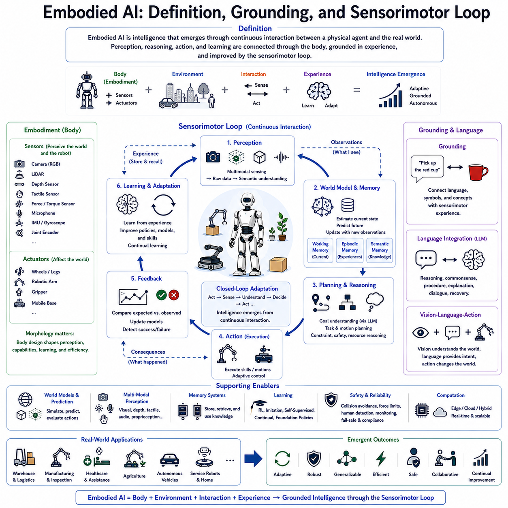
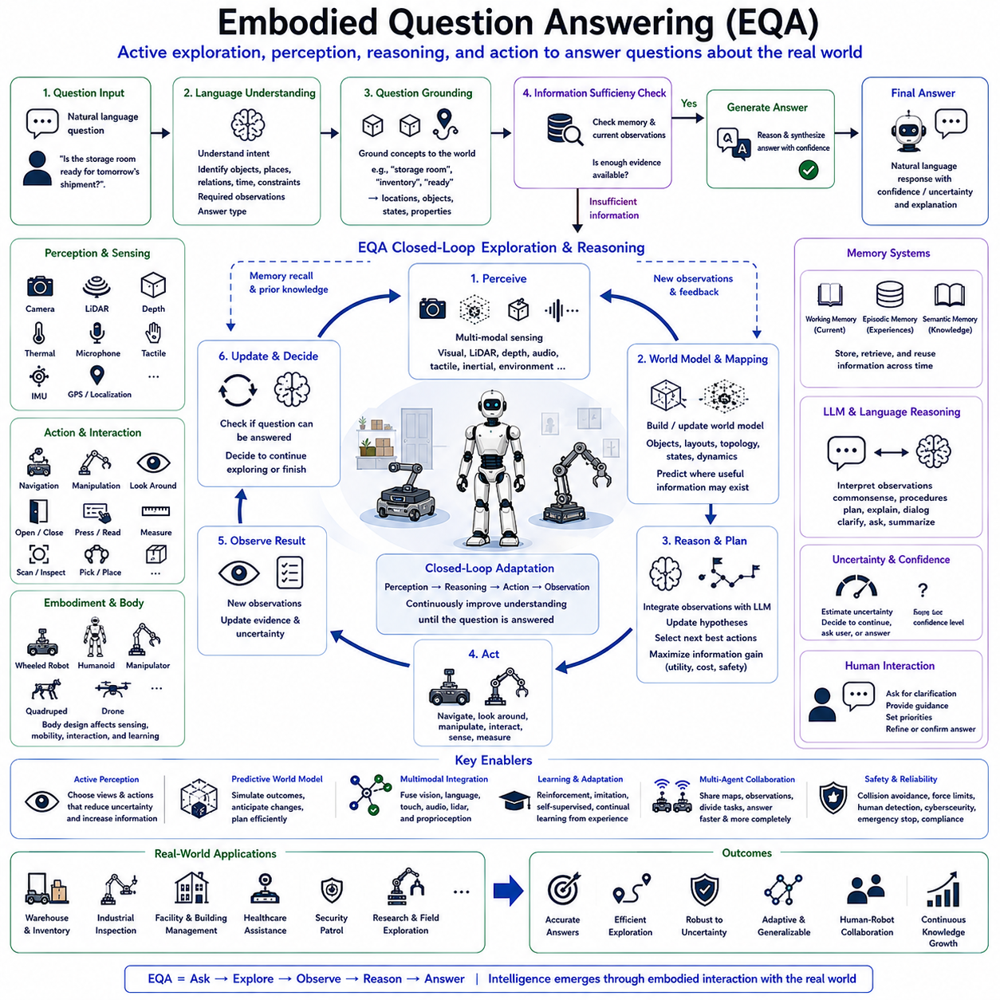
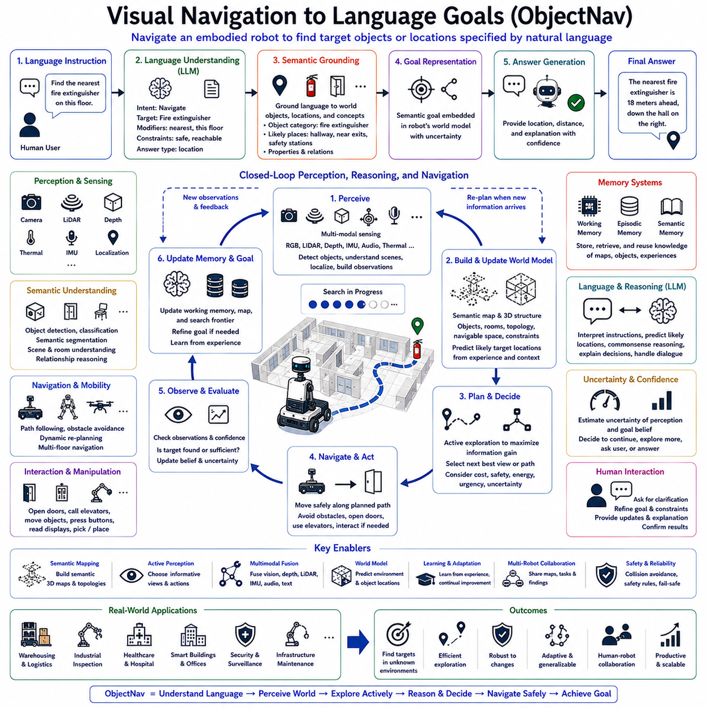
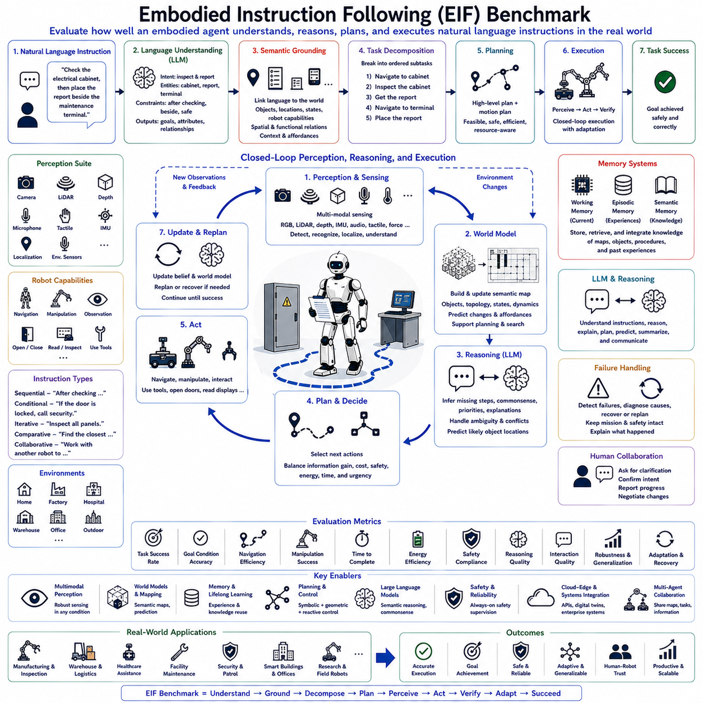
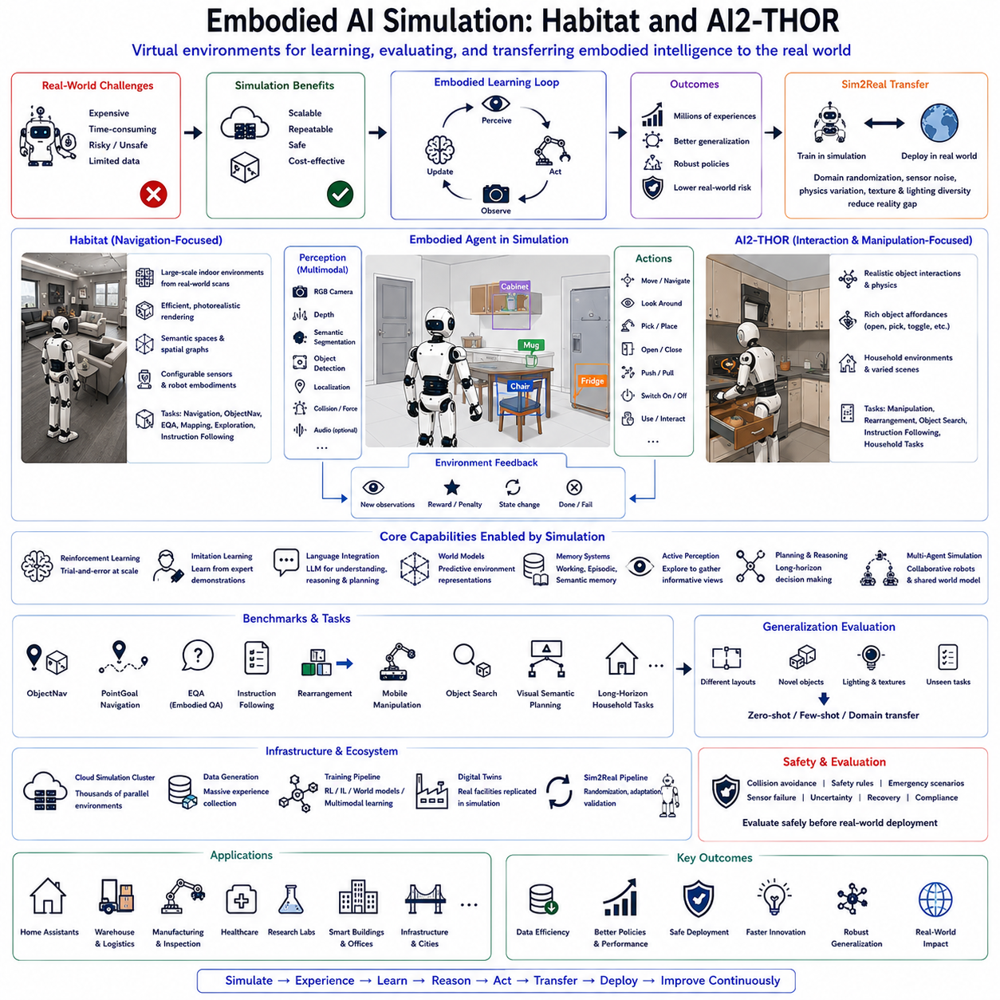
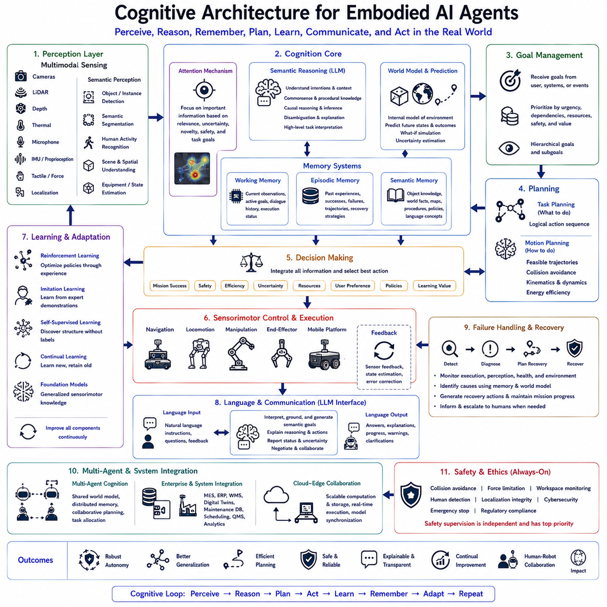
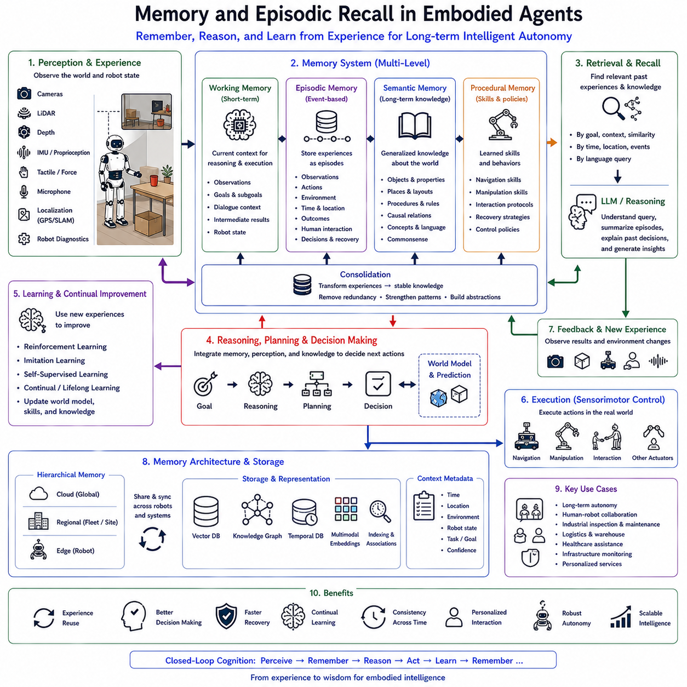
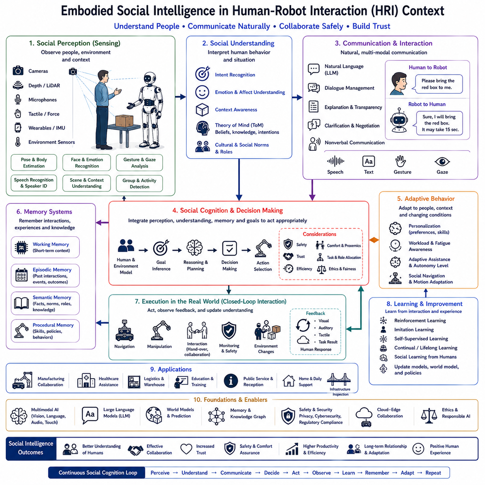
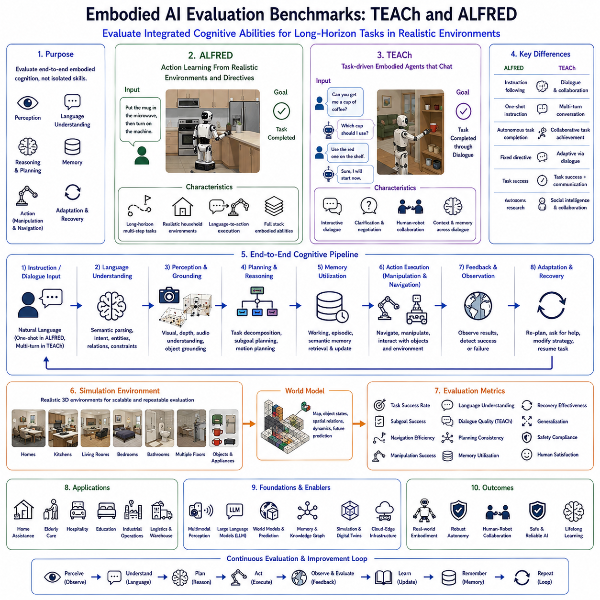
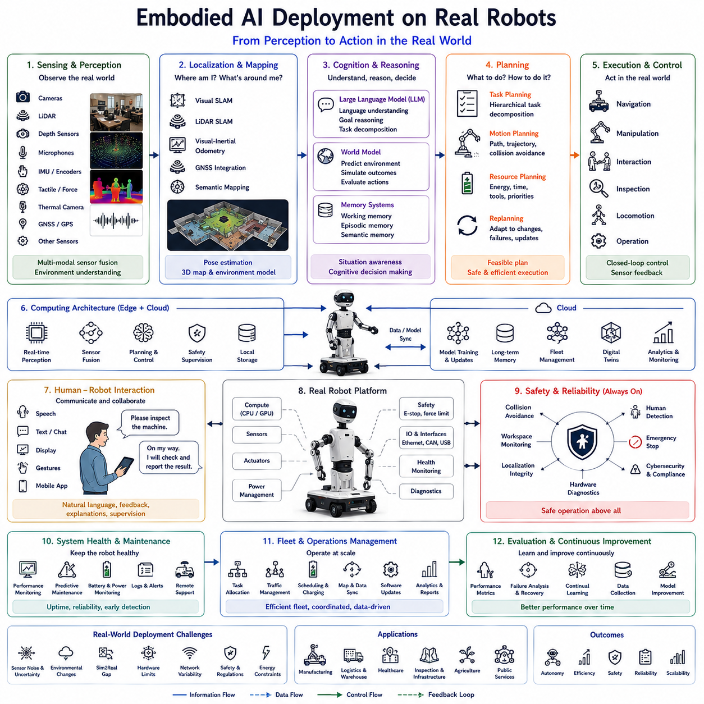

**Volume 20. Vision Language Action (VLA) Models**

# Chapter 7. Embodied AI

## 7.1 Foundations of Embodied AI

{width="7.268055555555556in" height="7.268055555555556in"}

체화 인공지능(Embodied Artificial Intelligence, Embodied AI)은 현대 로보틱스에서 가장 중요한 패러다임 변화 가운데 하나이다. 기존의 인공지능은 지능을 계산(Computation) 중심의 문제로 바라보았지만, 체화 인공지능은 지능이 실제 물리적 환경과 지속적으로 상호작용하는 과정에서 형성된다고 본다. 즉, 센서(Sensor)와 액추에이터(Actuator)를 가진 물리적 몸체(Body)가 환경과 끊임없이 상호작용하면서 인식, 추론, 행동, 학습이 하나의 순환 구조를 이루는 것이 핵심이다.

기존 인공지능 시스템은 이미지 인식(Image Recognition), 자연어 처리(Natural Language Processing), 계획(Planning) 등을 서로 독립적인 모듈로 구성하는 경우가 많았다. 또한 대부분의 학습은 미리 수집된 데이터셋(Offline Dataset)을 기반으로 수행되었다. 이러한 방식은 정적인 문제에서는 뛰어난 성능을 보였지만, 실제 환경처럼 변화가 많고 불확실성이 높은 공간에서는 예측하지 못한 상황에 적응하기 어려웠다.

체화 인공지능은 이러한 한계를 해결하기 위해 지능을 환경과의 지속적인 상호작용(Continuous Interaction)으로 정의한다. 로봇은 환경을 관찰하고 행동하며, 행동의 결과를 다시 관찰하고 학습하는 순환 구조를 반복한다. 따라서 지능은 미리 만들어진 규칙이 아니라 실제 경험(Experience)을 통해 지속적으로 발전하는 능력으로 이해된다.

체화(Embodiment)라는 개념은 지능형 시스템이 반드시 물리적인 몸체(Physical Body)를 가져야 함을 의미한다. 카메라(Camera), LiDAR, 깊이 센서(Depth Sensor), 촉각 센서(Tactile Sensor), 힘 센서(Force Sensor), 마이크(Microphone), 관성 측정 장치(Inertial Measurement Unit, IMU), 엔코더(Encoder) 등은 환경과 로봇 자신의 상태를 지속적으로 측정한다. 동시에 바퀴(Wheel), 다리(Leg), 로봇 팔(Robot Arm), 그리퍼(Gripper), 이동 플랫폼(Mobile Platform) 등의 액추에이터는 계산된 결과를 실제 행동으로 변환한다.

그라운딩(Grounding)은 체화 인공지능의 또 다른 핵심 개념이다. 기존의 언어 모델은 단어와 문장의 통계적 관계를 중심으로 의미를 학습하였다. 반면 체화 인공지능은 언어(Language), 개념(Concept), 추상적 사고(Abstract Reasoning)를 실제 물리적 경험(Physical Experience)과 연결한다. 예를 들어 "잡다(Grasp)", "밀다(Push)", "걷다(Walk)", "문(Door)", "상자(Container)"와 같은 개념은 단순한 단어가 아니라 실제 환경에서 반복적으로 경험한 감각과 행동을 통해 의미가 형성된다.

감각-운동 그라운딩(Sensorimotor Grounding)은 인식과 행동을 직접 연결하는 과정이다. 모든 센서 정보는 이후의 행동에 영향을 미치며, 수행된 행동은 다시 새로운 센서 정보를 생성한다. 이러한 양방향 순환(Bidirectional Loop)을 통해 로봇은 자신의 상태와 환경에 대한 이해를 지속적으로 갱신한다. 따라서 환경 인식(Perception), 의미 해석(Semantic Interpretation), 예측(Prediction), 행동(Action), 피드백(Feedback)은 서로 분리된 과정이 아니라 하나의 연속적인 인지 과정(Cognitive Process)을 구성한다.

감각-운동 루프(Sensorimotor Loop)는 체화 인공지능의 핵심 동작 구조이다. 먼저 센서가 환경과 로봇 자신의 상태를 관찰한다. 환경 인식(Perception)은 이러한 센서 데이터를 객체(Object), 장애물(Obstacle), 사람(Human), 환경 상태(Environment State)와 같은 의미 정보(Semantic Representation)로 변환한다. 이후 세계 모델(World Model)은 현재 관측과 과거 경험을 통합하여 현재 환경을 이해하고 미래 상태를 예측한다. 계획기(Planner)는 이를 기반으로 최적의 행동(Action)을 생성하며, 실행 결과는 다시 새로운 관측을 만들어 다음 루프를 시작한다.

감각-운동 루프는 개방 루프(Open-loop) 방식과 달리 지속적인 피드백(Continuous Feedback)을 제공한다. 로봇이 이동하거나 물체를 조작할 때마다 새로운 관측이 이루어지며, 예상했던 결과와 실제 결과를 비교한다. 차이가 발생하면 내부 세계 모델을 수정하고 새로운 계획을 생성한다. 이러한 폐루프(Closed-loop) 구조는 움직이는 물체, 변화하는 환경, 사람과의 상호작용 등 불확실성이 높은 환경에서도 안정적인 작업 수행을 가능하게 한다.

체화 인공지능에서 환경 인식은 단순한 컴퓨터 비전(Computer Vision)을 넘어선다. 시각 정보(Visual Information), 깊이 정보(Depth Information), 힘 감지(Force Sensing), 촉각(Tactile Feedback), 고유감각(Proprioception), 관성 정보(Inertial Sensing), 위치 추정(Localization), 환경 센서(Environmental Sensor), 음향 정보(Audio Information) 등 다양한 센서를 동시에 활용한다. 이러한 멀티모달 인식(Multimodal Perception)은 각 센서의 한계를 보완하며 환경에 대한 더욱 정확한 이해를 제공한다.

운동 제어(Motor Control) 역시 단순한 경로 추종(Trajectory Following)이 아니다. 현대의 체화 인공지능은 환경 변화와 센서 정보를 지속적으로 반영하여 이동 경로, 속도(Velocity), 힘(Force), 균형(Balance), 조작 전략(Manipulation Strategy)을 실시간으로 수정한다. 따라서 미리 정의된 경로를 그대로 따라가는 것이 아니라 현재 상황에 맞추어 행동을 지속적으로 최적화한다.

학습(Learning)은 체화 인공지능을 기존 AI와 구분하는 중요한 특징이다. 대부분의 기존 AI는 오프라인 데이터셋을 이용하여 학습하지만, 체화 인공지능은 실제 환경에서 경험을 지속적으로 축적한다. 이동, 조작, 사람과의 상호작용, 성공과 실패, 장애 복구 등 모든 경험은 새로운 학습 데이터가 된다. 강화학습(Reinforcement Learning), 모방학습(Imitation Learning), 자기지도학습(Self-supervised Learning), 지속 학습(Continual Learning), 파운데이션 로봇 정책(Foundation Robot Policy)은 이러한 경험을 활용하여 성능을 지속적으로 향상시킨다.

메모리(Memory)는 체화 지능을 더욱 발전시키는 핵심 요소이다. 작업 메모리(Working Memory)는 현재 목표와 작업 상태를 유지하며, 에피소드 메모리(Episodic Memory)는 과거의 성공과 실패, 복구 경험을 저장한다. 의미 메모리(Semantic Memory)는 객체 특성, 환경 구조, 작업 절차(Standard Operating Procedure), 물리적 특성 등을 장기적으로 저장한다. 이러한 다양한 메모리를 이용하여 현재 상황을 과거 경험과 연결하고 더욱 높은 수준의 추론을 수행한다.

세계 모델(World Model)은 미래를 예측하는 기능을 제공한다. 단순히 현재 상태를 인식하는 것이 아니라 앞으로 사람과 물체가 어떻게 움직일지, 환경이 어떻게 변할지를 예측한다. 또한 실제 행동을 수행하기 전에 내부 시뮬레이션(Internal Simulation)을 수행하여 다양한 행동의 결과를 미리 평가한다. 이러한 예측 능력은 작업 효율을 높이고 위험을 줄이는 데 매우 중요한 역할을 한다.

현대의 체화 인공지능은 대규모 언어 모델(Large Language Model, LLM)과 긴밀하게 통합된다. LLM은 상식(Common Sense), 절차 지식(Procedural Knowledge), 의미 추론(Semantic Reasoning), 자연어 대화(Natural Language Communication)를 담당한다. 언어는 단순히 명령을 입력하는 수단이 아니라 인식, 계획, 행동, 설명, 장애 복구, 학습 과정 전체에 걸쳐 활용된다. 그라운딩된 언어(Grounded Language)는 추상적인 단어를 실제 감각과 행동 경험에 연결하여 사람과 로봇의 자연스러운 협업을 가능하게 한다.

비전-언어-행동(Vision-Language-Action, VLA) 아키텍처는 체화 인공지능을 더욱 발전시킨 형태이다. 비전(Vision)은 환경을 이해하고, 언어(Language)는 목표와 문맥을 제공하며, 행동(Action)은 실제 물리적인 작업을 수행한다. 감각-운동 루프는 이러한 세 요소를 하나의 통합 인지 구조(Unified Cognitive Architecture)로 연결하여 복잡한 실제 환경에서도 안정적인 자율성을 제공한다. 이는 차세대 Physical AI의 핵심 기술 방향으로 평가된다.

체화 인공지능은 몸체(Morphology) 자체도 지능의 일부로 본다. 몸체의 구조는 센서 배치, 이동 능력, 조작 방식, 에너지 소비, 접근 가능한 환경, 학습 효율 등에 직접적인 영향을 준다. 휴머노이드(Humanoid), 사족 보행 로봇(Quadruped), 바퀴형 로봇(Wheeled Robot), 드론(Aerial Vehicle), 매니퓰레이터(Manipulator), 수중 로봇(Underwater Robot), 산업용 자율주행 로봇(Industrial AMR)은 동일한 알고리즘을 사용하더라도 서로 다른 몸체 구조 때문에 서로 다른 경험과 행동 전략을 형성하게 된다.

안전성(Safety)은 감각-운동 루프 내부에 항상 포함된다. 충돌 감시(Collision Monitoring), 힘 제한(Force Limitation), 균형 제어(Balance Control), 사람 감지(Human Detection), 작업 공간 감시(Workspace Supervision), 장비 진단(Equipment Diagnostics), 산업 안전 규정(Regulatory Compliance)은 계획과 실행 과정 전체에 지속적으로 영향을 미친다. 따라서 안전 기능은 단순한 비상 정지(Emergency Stop)가 아니라 지능적인 행동 생성 과정의 일부로 작동한다.

산업 현장에서 체화 인공지능의 중요성은 더욱 커지고 있다. 물류 로봇은 재고와 작업자, 장애물을 동시에 인식하면서 운반 작업을 수행하고, 검사 로봇은 설비 상태에 따라 검사 전략을 변경하며, 농업 로봇은 작물 상태와 환경에 따라 수확 방식을 조정하고, 의료 로봇은 환자의 행동과 의료 상황에 맞추어 서비스를 제공한다. 이러한 모든 사례는 지능이 환경과의 지속적인 감각-운동 상호작용을 통해 형성된다는 체화 인공지능의 개념을 잘 보여준다.

체화 인공지능의 평가는 기존 AI와는 다른 기준을 사용한다. 단순한 인식 정확도가 아니라 감각-운동 협조(Sensorimotor Coordination), 환경 적응성(Environmental Adaptability), 그라운딩 일관성(Grounding Consistency), 멀티모달 통합(Multimodal Integration), 장기 계획(Long-horizon Planning), 학습 효율(Learning Efficiency), 새로운 환경에 대한 일반화(Generalization), 불확실성에 대한 강건성(Robustness), 장애 복구 능력(Recovery Capability), 에너지 효율(Energy Efficiency), 사람과의 협업(Human Collaboration), 장기 자율 운용(Long-term Autonomous Operation) 등을 종합적으로 평가한다.

향후 체화 인공지능은 더욱 발전된 세계 모델(World Model), 멀티모달 파운데이션 모델(Multimodal Foundation Model), 지속 학습(Continual Learning), 인지 메모리(Cognitive Memory), 분산 추론(Distributed Reasoning), 디지털 트윈(Digital Twin), 클라우드-엣지 협업(Cloud-Edge Collaboration), 대규모 로봇 파운데이션 정책(Robot Foundation Policy)을 하나의 통합 아키텍처로 결합하게 될 것이다. 미래의 지능은 언어(Language), 인식(Perception), 메모리(Memory), 예측(Prediction), 추론(Reasoning), 행동(Action)이 감각-운동 루프를 중심으로 지속적으로 상호작용하면서 발전하게 될 것이며, 이는 복잡한 실제 환경에서 장기간 자율적으로 학습하고 적응하는 차세대 Physical AI의 핵심 기반이 될 것이다.

## 7.2 Embodied Question Answering (with Code)

{width="7.268055555555556in" height="7.268055555555556in"}

먼저 원문의 기술적 의미를 유지하면서 자연스러운 기술 문체로 번역하였으며, 요청하신 형식에 맞게 약 **200\~400자** 단위로 구분했습니다. 또한 주요 전문 용어는 **"한글(영어)"** 형식으로 병기했습니다.

체화 질의응답(Embodied Question Answering, EQA)은 체화 인공지능(Embodied Artificial Intelligence)과 비전-언어-행동(Vision-Language-Action, VLA) 시스템의 중요한 연구 분야이다. 기존의 질의응답(Question Answering)이 이미 제공된 텍스트나 이미지에서 답을 찾는 방식이었다면, EQA는 로봇이 실제 환경을 스스로 탐색하고 필요한 정보를 직접 수집한 후 질문에 답하는 것을 목표로 한다. 즉, 지능은 단순한 추론이 아니라 환경을 탐색하고 행동하는 과정에서 형성된다.

기존의 질의응답 시스템은 필요한 정보가 이미 존재한다고 가정한다. 대규모 언어 모델(Large Language Model, LLM)은 텍스트 지식을 이용하여 질문에 답하고, 비전-언어 모델(Vision-Language Model)은 입력된 이미지 안에서 답을 찾는다. 그러나 실제 환경에서는 하나의 시점(Viewpoint)만으로 충분한 정보를 얻을 수 없는 경우가 대부분이다. 따라서 로봇은 직접 이동하고 관찰하며 부족한 정보를 획득해야 한다.

예를 들어 "이 층에는 비상구가 몇 개 있는가?"라는 질문에 답하기 위해서는 건물 전체를 이동하며 비상구를 찾아야 한다. 또한 "창고가 내일 출하 준비를 완료했는가?"라는 질문은 재고 상태, 작업 공간 정리, 설비 상태, 환경 조건 등을 모두 확인해야 한다. 따라서 EQA는 질문에 답하기 전에 필요한 정보를 능동적으로 수집하는 탐색(Exploration) 과정을 포함한다.

EQA의 가장 중요한 특징은 능동적 정보 획득(Active Information Acquisition)이다. 시스템은 현재 가지고 있는 정보만 사용하는 것이 아니라 어떤 정보가 부족한지를 먼저 판단한다. 이후 부족한 정보를 가장 효율적으로 얻을 수 있는 행동(Action)을 계획하고, 새로운 관측 결과를 반영하면서 탐색 전략을 지속적으로 수정한다. 질문에 대한 답은 이러한 반복적인 탐색과 추론 과정을 통해 완성된다.

EQA 시스템은 먼저 자연어 이해(Language Understanding)를 수행한다. LLM은 질문 속의 사용자 의도(User Intent), 대상 객체(Object), 공간 관계(Spatial Relationship), 시간 조건(Temporal Constraint), 필요한 관측 정보(Required Observation), 예상 답변 형식(Expected Answer Type)을 분석한다. 이후 현재 메모리(Memory)나 센서 정보만으로 답할 수 있는지 판단하고, 정보가 부족한 경우에는 탐색을 시작한다.

질문 그라운딩(Question Grounding)은 EQA의 핵심 과정이다. 자연어에 포함된 개념을 실제 환경의 물리적 대상과 연결해야 한다. 예를 들어 "회의실 프로젝터가 정상적으로 동작하는가?"라는 질문은 "회의실(Conference Room)", "프로젝터(Projector)", "정상 동작(Working)"이라는 개념을 실제 공간과 장비 상태에 연결해야 한다. 이러한 그라운딩(Grounding)은 언어와 감각-운동 경험을 연결하는 핵심 기술이다.

EQA에서의 작업 계획(Task Planning)은 일반적인 이동 계획과 목적이 다르다. 기존의 이동은 목적지까지 가장 빠르게 이동하는 것이 목표였지만, EQA에서는 가장 많은 정보를 얻을 수 있는 경로를 선택하는 것이 중요하다. 따라서 정보 획득량(Expected Information Gain), 센서 성능(Sensing Capability), 배터리(Battery), 시간(Time), 안전(Safety) 등을 함께 고려하여 탐색 계획을 생성한다.

환경 인식(Perception)은 EQA의 핵심 구성 요소이다. 카메라(Camera), LiDAR, 깊이 센서(Depth Sensor), 열화상 카메라(Thermal Camera), 마이크(Microphone), 촉각 센서(Tactile Sensor), 위치 추정(Localization), 환경 센서(Environmental Sensor) 등이 지속적으로 데이터를 수집한다. 객체 인식(Object Recognition), 장면 이해(Scene Understanding), 자세 추정(Pose Estimation), 장비 상태 분석(Object State Estimation)을 수행하여 질문과 관련된 정보를 지속적으로 축적한다.

세계 모델(World Model)은 탐색 효율을 크게 향상시킨다. 단순히 현재 관측만 사용하는 것이 아니라 지금까지 관찰한 정보를 통합하여 내부 환경 모델을 구축한다. 방의 구조(Room Layout), 객체 위치(Object Location), 공간 연결(Spatial Topology), 의미 관계(Semantic Relationship)를 저장하며, 앞으로 필요한 정보가 어디에 존재할 가능성이 높은지를 예측한다. 이를 통해 불필요한 이동을 줄이고 탐색 효율을 높일 수 있다.

메모리(Memory)는 EQA의 중요한 구성 요소이다. 작업 메모리(Working Memory)는 현재 탐색 과정과 임시 추론 결과를 유지하며, 에피소드 메모리(Episodic Memory)는 이전 탐색 경험과 방문했던 위치를 저장한다. 의미 메모리(Semantic Memory)는 객체 특성, 건물 구조, 작업 절차, 환경 정보를 장기적으로 관리한다. 과거 경험을 활용하면 동일한 장소를 반복적으로 탐색하지 않아도 되므로 효율성이 크게 향상된다.

체화 질의응답은 폐루프 추론(Closed-loop Reasoning)을 사용한다. 탐색이 진행될 때마다 새로운 관측이 기존의 가설(Hypothesis)을 검증하거나 수정한다. 어떤 경우에는 이미 충분한 정보가 확보되어 탐색을 종료할 수 있고, 반대로 추가적인 정보가 필요하다고 판단되면 새로운 탐색 계획을 생성한다. 이러한 반복적인 피드백은 불확실한 환경에서도 높은 정확도를 유지하도록 만든다.

대규모 언어 모델(LLM)은 탐색 과정 전체에서 의미 추론(Semantic Reasoning)을 수행한다. 단순히 최종 답변을 생성하는 것이 아니라 현재까지의 관측을 해석하고, 부족한 정보를 찾고, 다음 탐색 위치를 결정하며, 여러 센서의 정보를 통합하여 하나의 일관된 결론을 도출한다. 또한 상식(Common Sense)과 절차 지식(Procedural Knowledge)을 활용하여 물체의 위치나 사람의 행동을 예측한다.

불확실성 추정(Uncertainty Estimation)은 EQA에서 매우 중요한 요소이다. 모든 환경 인식 결과와 위치 추정, 객체 인식, 의미 추론에는 신뢰도(Confidence)가 함께 계산된다. 신뢰도가 충분하지 않으면 시스템은 성급하게 답을 생성하지 않고 추가 탐색을 수행한다. 또한 필요한 경우 사용자에게 현재의 불확실성을 설명하고 어떤 추가 정보가 필요한지도 함께 알려줄 수 있다.

사람과의 상호작용(Human Interaction)은 단순한 질문과 답변을 넘어선다. 질문이 모호하거나 여러 가지 의미를 가질 수 있을 경우 로봇은 사용자에게 추가 질문을 한다. 사용자는 탐색 범위를 제한하거나 우선순위를 변경하거나 새로운 정보를 제공할 수 있으며, 시스템은 이러한 대화를 반영하여 탐색 계획을 수정한다. 이러한 협업은 탐색 시간을 줄이고 답변의 정확성을 높인다.

EQA는 필요한 경우 실제 물체와의 상호작용도 수행한다. 단순히 보는 것만으로는 충분하지 않을 수 있기 때문이다. 캐비닛 문을 열거나, 버튼을 누르거나, 계기판(Display)을 읽거나, 바코드를 스캔하거나, 온도와 습도를 측정하거나, 장비를 직접 조작해야만 질문에 답할 수 있는 경우가 존재한다. 따라서 EQA는 능동적인 물리적 상호작용을 포함하는 인지 시스템이다.

다중 로봇 체화 질의응답(Multi-Agent EQA)은 대규모 환경에서 더욱 효과적이다. 여러 대의 로봇이 각각 다른 구역을 탐색하고, 세계 모델(World Model)과 의미 메모리(Semantic Memory)를 공유하며, 정보를 통합하여 하나의 질문에 답할 수 있다. 이러한 협업 구조는 창고, 병원, 공항, 스마트시티, 대형 공장 등에서 탐색 시간을 크게 단축시키고 답변의 완전성을 향상시킨다.

산업 현장에서 EQA의 활용 가능성은 매우 크다. 유지보수 로봇은 설비를 직접 점검하여 장비 상태를 보고할 수 있으며, 물류 로봇은 창고를 확인하여 재고 상태를 답할 수 있다. 검사 로봇은 엔지니어의 질문에 따라 구조물을 조사하고, 의료 로봇은 환자의 주변 환경을 확인한 후 안전 상태를 설명할 수 있으며, 보안 로봇은 순찰 과정에서 시설의 이상 여부를 확인하여 질문에 답할 수 있다. 모든 답변은 데이터베이스가 아니라 실제 환경에서 직접 획득한 경험을 기반으로 생성된다.

안전성(Safety)은 탐색 과정 전체에서 항상 유지된다. 이동(Navigation), 조작(Manipulation), 환경 인식(Perception), 사람과의 상호작용(Human Interaction)은 모두 독립적인 안전 제어(Safety Supervision) 아래에서 수행된다. 충돌 회피(Collision Avoidance), 힘 제한(Force Limitation), 작업 공간 제한(Workspace Restriction), 사람 감지(Human Detection), 사이버 보안(Cybersecurity), 산업 안전 규정(Regulatory Compliance), 비상 정지(Emergency Stop)는 질문 해결보다 항상 우선적으로 적용된다.

체화 질의응답의 성능 평가는 기존 언어 모델 평가보다 훨씬 복합적이다. 이동 효율(Navigation Efficiency), 탐색 품질(Exploration Quality), 정보 획득 효율(Information Acquisition Effectiveness), 의미 그라운딩 정확도(Semantic Grounding Accuracy), 객체 위치 추정(Object Localization), 답변 정확도(Answer Correctness), 추론 일관성(Reasoning Consistency), 불확실성 추정(Uncertainty Estimation), 메모리 활용(Memory Utilization), 계산 효율성(Computational Efficiency), 멀티모달 통합(Multimodal Integration), 일반화 성능(Generalization), 사람과의 협업(Human Interaction Quality), 장기 자율성(Long-horizon Autonomy)을 종합적으로 평가한다.

향후 체화 질의응답은 멀티모달 파운데이션 모델(Multimodal Foundation Model), 예측 세계 모델(Predictive World Model), 지속 학습(Continual Learning), 인지 메모리(Cognitive Memory), 디지털 트윈(Digital Twin), 클라우드-엣지 협업(Cloud-Edge Collaboration), 로봇 파운데이션 정책(Robot Foundation Policy), 대규모 언어 모델(LLM)을 하나의 통합 아키텍처로 결합하게 될 것이다. 미래의 EQA는 단순히 질문에 답하는 수준을 넘어 필요한 정보를 스스로 찾아내고, 사용자의 의도를 예측하며, 여러 로봇이 협력하여 환경을 조사하고, 평생 학습(Lifelong Learning)을 통해 지속적으로 지식을 확장하는 지능형 정보 탐사 시스템(Intelligent Information Exploration System)으로 발전하게 될 것이다.

## 7.3 ObjectNav and Visual Navigation (with Code)

{width="7.268055555555556in" height="7.268055555555556in"}

언어 목표 기반 시각 내비게이션(Visual Navigation to Language Goals), 일반적으로 객체 내비게이션(Object Navigation, ObjectNav)은 체화 인공지능(Embodied Artificial Intelligence), 비전-언어-행동(Vision-Language-Action, VLA), 그리고 Physical AI의 핵심 연구 분야이다. 기존의 자율주행 로봇이 미리 지정된 좌표(Coordinate)나 지도(Map)를 기반으로 이동했다면, ObjectNav는 자연어(Natural Language)로 표현된 의미적 목표(Semantic Goal)를 이해하고 해당 대상까지 스스로 이동하는 기술이다.

ObjectNav에서는 목적지가 단순한 좌표가 아니라 "가장 가까운 소화기(Nearest Fire Extinguisher)", "주방의 커피 머신(Coffee Machine)", "제어실의 점검 패널(Inspection Panel)", "비어 있는 충전 스테이션(Empty Charging Station)"과 같이 의미를 가진 객체(Object)나 장소(Location)로 표현된다. 이를 통해 사람은 좌표를 지정할 필요 없이 자연스럽게 로봇에게 작업을 지시할 수 있으며, 로봇도 변화하는 환경에서 유연하게 목적지를 찾을 수 있다.

기존 이동 로봇은 주로 동시적 위치 추정 및 지도 작성(Simultaneous Localization and Mapping, SLAM), 점유 격자 지도(Occupancy Grid), 웨이포인트 계획(Waypoint Planning), 계량 기반 내비게이션(Metric Navigation)에 의존하였다. 이러한 방식은 공장과 같은 정형화된 환경에서는 매우 효과적이지만, 사람이 "회의실 프로젝터로 가라" 또는 "출입구 옆의 소화기를 찾아라"와 같은 의미 중심의 명령을 내리는 실제 환경에서는 한계가 존재한다. ObjectNav는 이러한 언어와 공간 정보 사이의 간극을 연결한다.

ObjectNav의 첫 번째 단계는 자연어 이해(Language Understanding)이다. 대규모 언어 모델(Large Language Model, LLM)은 사용자의 명령에서 이동 목적(Navigation Intent), 대상 객체(Object), 공간 수식어(Spatial Modifier), 환경 문맥(Environmental Context), 작업 우선순위(Priority), 숨겨진 제약 조건(Implicit Constraint)을 분석한다. "가장 가까운(Closest)", "가장 큰(Largest)", "사용 가능한(Available)", "입구 옆(Next to the Entrance)"과 같은 표현은 단순한 단어 검색이 아니라 의미 추론(Semantic Reasoning)을 필요로 한다.

의미 그라운딩(Semantic Grounding)은 언어 기반 내비게이션의 핵심 기술이다. 자연어에서 사용된 객체와 장소의 개념을 실제 환경에서 관찰 가능한 물리적 대상과 연결해야 한다. 예를 들어 "의자(Chair)", "충전 스테이션(Charging Dock)", "회의실(Conference Room)", "점검 캐비닛(Inspection Cabinet)" 등의 단어는 객체의 형태뿐 아니라 공간적 위치, 기능(Function), 주변 환경과의 관계(Context)까지 함께 연결된다. 이를 통해 로봇은 저장된 좌표가 아니라 실제 의미를 기반으로 탐색을 수행할 수 있다.

시각 인식(Visual Perception)은 이동 과정 전체에서 지속적으로 수행된다. RGB 카메라(Camera), 깊이 센서(Depth Sensor), LiDAR, 열화상 카메라(Thermal Camera), 관성 측정 장치(Inertial Measurement Unit, IMU), 위치 추정(Localization), 환경 센서(Environmental Sensor)가 함께 동작하여 주변 환경을 실시간으로 인식한다. 객체 탐지(Object Detection), 의미 분할(Semantic Segmentation), 장면 이해(Scene Understanding), 시각 위치 추정(Visual Localization)이 동시에 수행되며 이동 중에도 환경 변화가 지속적으로 반영된다.

ObjectNav에서 객체 인식(Object Recognition)은 단순히 개별 물체를 찾는 수준을 넘어선다. 로봇은 객체와 주변 환경의 의미적 관계(Semantic Relationship)를 함께 이해해야 한다. 예를 들어 프린터(Printer)를 찾을 경우 책상과 사무실을 함께 인식해야 하고, 의료 장비(Medical Equipment)를 찾는 경우 병실과 보관 캐비닛을 함께 고려해야 한다. 이러한 장면 이해(Scene Understanding)는 탐색 효율을 크게 향상시키는 중요한 요소이다.

세계 모델(World Model)은 탐색 과정에서 획득한 정보를 하나의 통합된 환경 모델로 구성한다. 객체의 위치(Object Location), 공간 연결 구조(Spatial Topology), 이동 가능한 영역(Navigable Region), 환경 제약(Environment Constraint), 객체 간의 의미 관계(Semantic Relationship)를 지속적으로 저장하고 갱신한다. 또한 과거 경험을 이용하여 특정 객체가 존재할 가능성이 높은 위치를 예측함으로써 탐색 범위를 크게 줄일 수 있다.

ObjectNav의 이동 계획(Navigation Planning)은 일반적인 경로 계획(Path Planning)과 목적이 다르다. 초기에는 목적지의 정확한 위치를 알지 못하기 때문에 단순히 최단 경로를 계산하는 것이 아니라 탐색과 이동을 동시에 수행해야 한다. 따라서 정보 획득량(Expected Information Gain), 탐색 효율(Exploration Efficiency), 에너지 소비(Energy Consumption), 센서 성능(Sensing Capability), 작업 긴급도(Mission Urgency)를 함께 고려하여 이동 경로를 생성한다.

폐루프 인식(Closed-loop Perception)은 이동 중에도 지속적으로 계획을 수정한다. 새로운 센서 정보는 기존의 가설(Hypothesis)을 검증하거나 수정하며, 예상하지 못한 장애물이나 더 효율적인 경로를 발견할 수도 있다. 따라서 이동 경로는 미리 고정된 것이 아니라 환경 변화에 따라 실시간으로 재계획(Replanning)된다. 이러한 감각-운동 루프(Sensorimotor Loop)는 동적인 실제 환경에서 높은 안정성을 제공한다.

메모리(Memory)는 장기적인 탐색 성능을 크게 향상시킨다. 작업 메모리(Working Memory)는 현재의 탐색 목표와 관측 결과를 유지하며, 에피소드 메모리(Episodic Memory)는 이전 탐색 경험과 방문한 장소를 저장한다. 의미 메모리(Semantic Memory)는 건물 구조(Building Layout), 방의 기능(Room Function), 객체의 특성(Object Category), 조직의 운영 규칙(Organizational Procedure)을 장기적으로 저장한다. 이를 통해 불필요한 중복 탐색을 줄일 수 있다.

대규모 언어 모델(LLM)은 이동 과정 전체에서 의미 추론(Semantic Reasoning)을 수행한다. 단순히 사용자의 명령을 해석하는 역할뿐 아니라 상식(Common Sense), 기능적 관계(Functional Relationship), 조직의 운영 규칙, 과거 탐색 경험을 활용하여 객체가 존재할 가능성이 높은 위치를 예측한다. 예를 들어 응급 의료 키트(Emergency Medical Kit)는 안전 캐비닛이나 실험실 근처에 있을 가능성이 높다는 상식을 탐색 전략에 반영한다.

ObjectNav는 항상 불확실성(Uncertainty)을 고려해야 한다. 객체는 다른 물체에 가려질 수 있고, 위치가 변경될 수도 있으며, 일시적으로 제거되었을 수도 있다. 따라서 모든 객체 인식, 위치 추정, 탐색 결과에는 신뢰도(Confidence)가 함께 계산된다. 신뢰도가 낮을 경우에는 시점을 변경하거나 다른 센서를 활용하거나 추가 탐색을 수행하여 더욱 정확한 정보를 확보한다.

사람과의 상호작용(Human Interaction)은 ObjectNav를 더욱 효율적으로 만든다. 동일한 조건을 만족하는 객체가 여러 개 존재하거나 명령이 모호한 경우 로봇은 사용자에게 추가 질문을 수행한다. 사용자는 추가 조건을 제시하거나 우선순위를 변경하거나 새로운 목적을 지정할 수 있으며, 로봇은 이를 반영하여 탐색 전략을 수정한다. 이러한 협업은 탐색 시간을 줄이고 사용자 만족도를 높인다.

ObjectNav는 단순한 이동뿐 아니라 환경과의 상호작용도 수행한다. 문을 열거나, 엘리베이터를 호출하거나, 임시 장애물을 우회하거나, 필요한 경우 이동 가능한 물체를 옮겨야 할 수도 있다. 따라서 ObjectNav는 이동(Navigation), 조작(Manipulation), 환경 인식(Perception), 의미 추론(Semantic Reasoning), 사람과의 대화(Language Interaction)를 하나의 통합 인지 시스템(Unified Cognitive Architecture)으로 결합한다.

다중 로봇 객체 내비게이션(Multi-Robot ObjectNav)은 여러 대의 로봇이 의미 지도(Semantic Map), 객체 정보(Object Observation), 탐색 경험(Exploration Experience)을 공유하는 구조이다. 각 로봇은 서로 다른 구역을 탐색하며 중복 작업을 줄이고, 발견한 객체 위치를 공유하고, 탐색 임무를 재분배한다. 이러한 협업 구조는 공장, 병원, 공항, 스마트시티, 물류센터와 같은 대규모 환경에서 매우 높은 효율을 제공한다.

산업 현장에서 ObjectNav의 활용 가능성은 매우 크다. 물류 로봇은 자연어 명령으로 특정 재고를 찾고, 검사 로봇은 설비 이름만으로 검사 대상까지 이동하며, 의료 로봇은 기능적으로 정의된 병실이나 장비를 찾아가고, 보안 로봇은 작업자가 설명한 의심 물체를 탐색할 수 있다. 또한 인프라 유지보수 로봇은 밸브, 전기 패널, 소화기, 비상구 등을 자연어 명령만으로 찾아갈 수 있다. 이러한 기능은 사람과 로봇의 협업을 크게 단순화한다.

안전성(Safety)은 ObjectNav에서도 가장 중요한 요소이다. 충돌 회피(Collision Avoidance), 사람 감지(Human Detection), 속도 제어(Speed Regulation), 작업 공간 제한(Workspace Restriction), 위치 추정 무결성(Localization Integrity), 사이버 보안(Cybersecurity), 비상 정지(Emergency Stop), 산업 안전 규정(Regulatory Compliance)은 이동 과정 전체에서 항상 동작한다. 의미 추론은 이러한 안전 제어를 절대로 우회하지 않으며, 안전 범위 내에서만 자율 이동을 수행한다.

ObjectNav의 성능 평가는 단순한 이동 성공률만으로 이루어지지 않는다. 의미 그라운딩 정확도(Semantic Grounding Accuracy), 언어 이해(Language Understanding), 객체 탐색 성공률(Object Localization Success), 이동 효율(Navigation Efficiency), 탐색 품질(Exploration Effectiveness), 경로 최적성(Path Optimality), 환경 인식 강건성(Perception Robustness), 불확실성 추정(Uncertainty Estimation), 메모리 활용(Memory Utilization), 멀티모달 통합(Multimodal Integration), 계산 효율성(Computational Efficiency), 에너지 소비(Energy Consumption), 사람과의 상호작용(Human Interaction), 새로운 환경에 대한 일반화(Generalization), 장기 임무 성공률(Long-horizon Mission Success)을 종합적으로 평가한다.

향후 언어 목표 기반 시각 내비게이션은 멀티모달 파운데이션 모델(Multimodal Foundation Model), 예측 세계 모델(Predictive World Model), 지속 학습(Continual Learning), 인지 메모리(Cognitive Memory), 디지털 트윈(Digital Twin), 클라우드-엣지 협업(Cloud-Edge Collaboration), 로봇 파운데이션 정책(Robot Foundation Policy), 대규모 언어 모델(LLM)을 하나의 통합 체화 내비게이션 아키텍처(Unified Embodied Navigation Architecture)로 결합하게 될 것이다. 미래의 ObjectNav는 단순히 목적지까지 이동하는 기술을 넘어 사용자의 의도를 예측하고, 객체의 위치를 미리 추론하며, 여러 로봇이 협력하여 탐색을 수행하고, 평생 학습(Lifelong Learning)을 통해 환경 지식을 지속적으로 축적하는 차세대 Physical AI의 핵심 기술로 발전하게 될 것이다.

## 7.4 Embodied Instruction Following (with Code)

{width="7.268055555555556in" height="7.268055555555556in"}

체화 명령 수행(Embodied Instruction Following, EIF) 벤치마크는 현대 체화 인공지능(Embodied Artificial Intelligence), 비전-언어-행동(Vision-Language-Action, VLA), 그리고 Physical AI 시스템을 평가하기 위한 핵심 프레임워크이다. 기존의 로봇 벤치마크가 이동(Navigation), 조작(Manipulation), 객체 인식(Object Recognition)과 같은 개별 기능을 평가하였다면, EIF는 로봇이 자연어 명령(Natural Language Instruction)을 이해하고, 계획을 수립하며, 실제 환경에서 행동으로 실행하는 전체 인지 과정(Cognitive Process)을 종합적으로 평가한다.

기존 로봇 시스템은 대부분 사람이 미리 작성한 작업 스크립트(Task Script)나 행동 트리(Behavior Tree)를 기반으로 동작하였다. 이러한 방식은 정형화된 환경에서는 높은 신뢰성을 제공하지만, 새로운 명령이나 예상하지 못한 환경 변화가 발생하면 유연하게 대응하기 어려웠다. EIF는 이러한 절차 기반 제어를 언어 기반 자율성(Language-driven Autonomy)으로 대체하여 사람이 자연어만으로 다양한 작업을 지시할 수 있도록 한다.

EIF의 첫 번째 평가 단계는 자연어 이해(Language Understanding)이다. 사람의 명령에는 불완전한 정보(Incomplete Information), 모호한 표현(Ambiguous Reference), 암묵적인 가정(Implicit Assumption), 공간 정보(Spatial Description), 시간 관계(Temporal Relationship), 작업 순서(Procedural Dependency), 문맥(Context)이 함께 포함되어 있다. 대규모 언어 모델(Large Language Model, LLM)은 이러한 요소를 분석하여 사용자의 의도(User Intent), 작업 목표(Task Objective), 대상 객체(Entity), 환경 제약(Environment Constraint), 안전 요구사항(Safety Requirement), 작업 우선순위(Priority)를 추출한다.

두 번째 단계는 의미 그라운딩(Semantic Grounding)이다. 자연어 명령은 실제 환경에서 관찰 가능한 객체(Object), 위치(Location), 환경 상태(Environmental Property), 로봇의 작업 능력(Robot Capability)과 연결되어야 한다. 예를 들어 "전기 캐비닛을 점검한 후 유지보수 단말기 옆에 검사 보고서를 놓아라"라는 명령은 전기 캐비닛(Electrical Cabinet), 보고서(Inspection Report), 유지보수 단말기(Maintenance Terminal), 작업 순서(Task Sequence), 공간 관계(Spatial Relation)를 모두 실제 환경과 연결해야 한다.

작업 분해(Task Decomposition)는 EIF의 중요한 평가 요소이다. 사용자의 명령은 대부분 모든 세부 절차를 포함하지 않는다. 따라서 로봇은 높은 수준의 목표를 여러 개의 하위 작업(Subtask)으로 자동 분해해야 한다. 이동(Navigation), 환경 인식(Perception), 객체 탐색(Object Search), 조작(Manipulation), 검사(Inspection), 결과 검증(Verification), 보고(Reporting) 등의 작업이 계층적으로 구성된다. 평가는 이러한 작업 분해가 원래 명령의 의미를 얼마나 정확하게 유지하는지를 측정한다.

계획(Planning) 평가는 논리적 작업 계획(Task Planning)뿐 아니라 실제 실행 가능성까지 포함한다. 작업 계획기는 논리적인 순서를 결정하고, 이동 계획기(Motion Planner)는 충돌 회피(Collision Avoidance), 로봇 운동학(Kinematics), 환경 제약(Environment Constraint), 에너지 제한(Energy Constraint), 안전 요구사항(Safety Requirement)을 고려하여 실제 경로를 생성한다. EIF는 이러한 계획이 실제 환경에서 안정적으로 실행 가능한지를 종합적으로 평가한다.

멀티모달 환경 인식(Multimodal Perception)은 명령 수행의 핵심 기반이다. 카메라(Camera), LiDAR, 깊이 센서(Depth Sensor), 힘 센서(Force Sensor), 촉각 센서(Tactile Sensor), 위치 추정(Localization), 관성 측정 장치(Inertial Measurement Unit, IMU), 마이크(Microphone), 환경 센서(Environmental Sensor)가 함께 동작한다. 객체 인식(Object Recognition), 장면 이해(Scene Understanding), 의미 분할(Semantic Segmentation), 자세 추정(Pose Estimation), 위치 추정(Localization Accuracy), 멀티모달 융합(Multimodal Fusion)의 정확도가 중요한 평가 항목이다.

EIF는 기존 언어 벤치마크와 달리 능동적인 정보 획득(Active Information Acquisition)도 평가한다. 필요한 객체가 보이지 않거나 목적지를 알 수 없는 경우 로봇은 스스로 탐색(Exploration)을 수행하고 추가적인 정보를 수집해야 한다. 능동적 환경 인식(Active Perception)은 단순한 센서 사용이 아니라 정보 획득 효율(Information Gain)을 극대화하는 탐색 전략까지 포함하는 중요한 평가 요소이다.

세계 모델(World Model)은 장기적인 명령 수행을 지원한다. 로봇은 환경을 단순히 관찰하는 것이 아니라 객체 위치(Object Location), 공간 구조(Spatial Topology), 기능적 관계(Functional Relationship), 환경 변화(Environmental Dynamics)를 지속적으로 저장하고 갱신한다. 또한 미래 환경을 예측(Predictive Modeling)하여 장애물이나 작업 충돌을 미리 예상하고 계획을 수정한다. EIF는 이러한 세계 모델의 정확성과 예측 능력을 함께 평가한다.

메모리(Memory)는 장기 작업에서 매우 중요한 역할을 한다. 작업 메모리(Working Memory)는 현재 작업 상태를 유지하며, 에피소드 메모리(Episodic Memory)는 과거 작업 경험과 성공 및 실패 사례를 저장한다. 의미 메모리(Semantic Memory)는 객체 특성, 건물 구조(Building Layout), 작업 절차(Standard Operating Procedure), 안전 규정(Safety Regulation)을 장기적으로 저장한다. EIF는 이러한 메모리 활용 능력이 장기 작업 수행에 얼마나 기여하는지를 평가한다.

폐루프 실행(Closed-loop Execution)은 EIF를 기존 순차 실행 시스템과 구분하는 중요한 특징이다. 모든 행동 이후에는 새로운 센서 정보가 획득되고, 예상 결과와 실제 결과를 비교한다. 차이가 발생하면 세계 모델을 업데이트하고, 부분 재계획(Local Replanning), 추가 환경 인식(Additional Perception), 복구(Recovery)를 수행한다. 따라서 평가에서는 최종 성공 여부뿐 아니라 실행 과정 전체의 적응성(Adaptability)과 안정성(Stability)을 함께 분석한다.

대규모 언어 모델(LLM)은 단순한 명령 해석기 이상의 역할을 수행한다. LLM은 생략된 작업 절차를 추론하고, 현재 상황을 설명하며, 예상하지 못한 환경 변화를 해석하고, 우선순위를 조정하며, 상식(Common Sense)을 이용하여 객체의 위치를 예측하고, 사람과 자연스럽게 대화한다. EIF는 의미 추론(Semantic Reasoning), 절차 추론(Procedural Inference), 설명 가능성(Explainability), 문맥 이해(Context Awareness)를 종합적으로 평가한다.

실패 처리(Failure Handling)는 EIF의 핵심 평가 요소 가운데 하나이다. 실제 환경에서는 장애물, 객체의 부재, 통신 장애(Communication Failure), 위치 오차(Localization Error), 센서 오류(Sensor Failure), 작업 목표 변경(Task Modification) 등이 발생할 수 있다. EIF는 실패 탐지(Failure Detection), 원인 분석(Diagnosis), 복구 계획(Recovery Planning), 작업 유지(Mission Preservation), 설명 능력(Explanation Capability)을 종합적으로 평가하여 시스템의 복원력(Resilience)을 측정한다.

사람과 로봇의 협업(Human-Robot Collaboration)은 명령 수행 과정 전체에 포함된다. 로봇은 명령이 모호할 경우 사용자에게 추가 질문을 하고, 현재 작업 진행 상황을 설명하며, 환경 변화로 인해 목표를 수정해야 할 경우 새로운 작업 계획을 제안할 수 있다. EIF는 대화 품질(Dialogue Quality), 협업 추론(Collaborative Reasoning), 문맥 유지(Contextual Communication), 사용자 만족도(User Satisfaction), 시스템 신뢰성(Trustworthiness)을 함께 평가한다.

다중 로봇 명령 수행(Multi-Agent Instruction Following)은 여러 대의 로봇이 하나의 명령을 협력하여 수행하는 구조이다. 로봇들은 작업 분배(Task Allocation), 이동(Navigation), 조작(Manipulation), 환경 인식(Perception), 통신(Communication), 복구(Recovery)를 분산적으로 수행한다. 공유 세계 모델(Shared World Model), 동기화된 메모리(Synchronized Memory), 협업 계획(Collaborative Planning)을 이용하여 창고, 공장, 병원, 공항, 스마트시티와 같은 대규모 환경에서 효율적인 작업 수행이 가능하다.

산업 환경에서는 기업 시스템과의 통합도 EIF 평가에 포함된다. 제조 실행 시스템(Manufacturing Execution System, MES), 전사적 자원 관리(Enterprise Resource Planning, ERP), 창고 관리 시스템(Warehouse Management System, WMS), 디지털 트윈(Digital Twin), 유지보수 데이터베이스(Maintenance Database), 생산 일정(Production Schedule), 품질 관리 시스템(Quality Management Platform) 등이 작업 우선순위와 계획에 직접 영향을 준다. EIF는 이러한 산업 환경과의 연동 능력도 평가한다.

안전성(Safety)은 EIF에서 항상 독립적으로 보장된다. 충돌 회피(Collision Avoidance), 힘 제한(Force Limitation), 작업 공간 감시(Workspace Monitoring), 사람 감지(Human Detection), 사이버 보안(Cybersecurity), 비상 정지(Emergency Stop), 위치 추정 무결성(Localization Integrity), 산업 안전 규정(Regulatory Compliance)은 의미 추론과 관계없이 항상 동작한다. 따라서 적응적인 자율 행동도 검증된 안전 범위 안에서만 수행된다.

일반화 성능(Generalization)은 EIF의 가장 중요한 평가 항목 가운데 하나이다. 우수한 시스템은 새로운 환경(Unseen Environment), 새로운 객체(Novel Object), 새로운 명령(Unseen Instruction), 다른 로봇 플랫폼(Different Robot Embodiment), 새로운 센서 구성(New Sensor Configuration), 변화된 운영 정책(Operational Policy)에서도 안정적으로 동작해야 한다. 이를 위해 제로샷 추론(Zero-shot Reasoning), 퓨샷 적응(Few-shot Adaptation), 도메인 전이(Cross-domain Transfer), 플랫폼 확장성(Cross-platform Portability)을 종합적으로 평가한다.

향후 EIF 벤치마크는 더욱 현실적인 장기 임무(Long-horizon Mission)를 중심으로 발전할 것이다. 멀티모달 파운데이션 모델(Multimodal Foundation Model), 예측 세계 모델(Predictive World Model), 지속 학습(Continual Learning), 인지 메모리(Cognitive Memory), 디지털 트윈(Digital Twin), 클라우드-엣지 협업(Cloud-Edge Collaboration), 로봇 파운데이션 정책(Robot Foundation Policy), 대규모 언어 모델(LLM)을 하나의 통합 평가 체계로 결합하게 될 것이다. 미래의 EIF는 단순한 기능 평가를 넘어 언어 이해, 추론, 계획, 이동, 조작, 협업, 복구, 평생 학습(Lifelong Learning)까지 포함하는 차세대 Physical AI의 대표적인 종합 성능 평가 기준으로 자리잡게 될 것이다.

## 7.5 Simulation Platforms: Habitat and AI2-THOR (with Code)

{width="7.268055555555556in" height="7.268055555555556in"}

체화 인공지능 시뮬레이션(Embodied AI Simulation)은 현대 체화 인공지능(Embodied Artificial Intelligence), 비전-언어-행동(Vision-Language-Action, VLA), 그리고 Physical AI 연구에서 필수적인 요소가 되었다. 체화 지능은 정적인 데이터셋(Static Dataset)이 아니라 실제 환경과의 지속적인 상호작용을 통해 형성되기 때문이다. 그러나 실제 로봇으로 방대한 경험을 축적하는 것은 비용과 시간이 많이 들고 안전상의 위험도 존재한다. 따라서 시뮬레이션은 대규모 학습과 반복 실험을 수행할 수 있는 핵심 연구 환경으로 활용된다.

기존의 기계학습(Machine Learning)은 정적인 데이터를 기반으로 모델을 학습하였다. 반면 체화 인공지능은 환경을 관찰하고, 행동을 수행하며, 그 결과를 다시 학습하는 감각-운동 루프(Sensorimotor Loop)를 반복한다. 이러한 경험 기반 학습은 실제 로봇만으로 수행하기에는 매우 비효율적이다. 시뮬레이션 환경은 동일한 상황을 반복 재현할 수 있으며, 수백만 번의 상호작용 경험을 안전하게 축적할 수 있도록 지원한다.

체화 인공지능 시뮬레이션의 목적은 단순한 그래픽 렌더링(Rendering)이 아니다. 가상의 로봇은 다양한 센서(Virtual Sensor)를 이용하여 환경을 인식하고, 계획(Planning)을 통해 행동을 결정하며, 환경과 상호작용한 결과를 다시 관측한다. 이러한 폐루프 감각-운동 구조(Closed-loop Sensorimotor Architecture)는 실제 로봇과 매우 유사한 경험을 제공하며, 다양한 알고리즘을 안전하게 검증할 수 있는 기반이 된다.

Habitat는 체화 내비게이션(Embodied Navigation) 연구를 위해 개발된 대표적인 시뮬레이션 플랫폼이다. 실제 건물을 스캔하여 생성한 사실적인 실내 환경(Photorealistic Indoor Environment)을 제공하며, 높은 물리 정확도(Physics Accuracy), 다양한 센서 구성(Configurable Sensor), 여러 형태의 로봇(Embodiment)을 지원한다. Habitat는 자율주행, 의미 지도(Semantic Mapping), 위치 추정(Localization), 탐색(Exploration), 체화 질의응답(EQA), 언어 기반 내비게이션(Language-guided Navigation), 명령 수행(Instruction Following) 연구에 널리 활용된다.

Habitat의 가장 큰 특징은 환경을 단순한 이미지(Image)가 아니라 의미 공간(Semantic Space)으로 구성한다는 점이다. 방(Room), 복도(Corridor), 가구(Furniture), 건축 구조(Structural Component), 이동 가능한 공간(Navigable Area)을 공간 그래프(Spatial Graph) 형태로 표현하여 로봇이 기하학적 정보뿐 아니라 의미적 관계(Semantic Relationship)도 함께 학습할 수 있도록 한다. 이를 통해 언어 그라운딩(Language Grounding)과 세계 모델(World Model) 학습이 더욱 효과적으로 이루어진다.

AI2-THOR는 Habitat와 함께 가장 널리 사용되는 체화 시뮬레이션 플랫폼 가운데 하나이다. Habitat가 이동 중심의 연구에 강점을 가진다면 AI2-THOR는 실제 물체와의 상호작용(Active Interaction)에 더욱 초점을 맞추고 있다. 로봇은 문을 열고(Open Door), 서랍을 열거나 닫고(Open/Close Drawer), 전자제품을 작동시키고(Activate Appliance), 물체를 집거나(Pick), 놓거나(Place), 이동시키는(Move Object) 등 현실적인 물리 상호작용을 수행할 수 있다.

AI2-THOR의 중요한 특징은 어포던스(Affordance)를 모델링한다는 점이다. 객체는 단순히 모양을 인식하는 대상이 아니라 수행 가능한 행동(Action)을 함께 포함한다. 예를 들어 의자는 접근할 수 있고, 냉장고는 열 수 있으며, 전자레인지는 작동시킬 수 있고, 수도꼭지는 돌릴 수 있으며, 캐비닛은 검사할 수 있다. 이러한 기능 중심 표현은 언어 명령을 실제 행동과 자연스럽게 연결하는 데 매우 중요한 역할을 한다.

Habitat와 AI2-THOR는 모두 멀티모달 센서(Multimodal Sensor)를 지원한다. RGB 카메라(Camera), 깊이 센서(Depth Sensor), 의미 분할(Semantic Segmentation), 객체 분할(Instance Segmentation), 객체 탐지(Object Detection), 위치 추정(Localization), 충돌 감지(Collision Feedback), 환경 정보(Environment Observation)를 기본적으로 제공한다. 일부 확장 환경에서는 오디오(Audio), 촉각(Tactile Sensing), 힘 추정(Force Estimation), 물리 측정(Physics Measurement)까지 지원하여 실제 로봇과 유사한 감각 정보를 생성할 수 있다.

체화 시뮬레이션은 강화학습(Reinforcement Learning)의 핵심 기반이 된다. 로봇은 시행착오(Trial-and-Error)를 반복하면서 최적의 행동 정책(Policy)을 학습한다. 시뮬레이션에서는 성공 사례뿐 아니라 실패(Failure), 장애물(Obstacle), 환경 변화(Environmental Change), 장애 복구(Recovery)를 수백만 번 반복할 수 있으므로 실제 로봇보다 훨씬 빠르게 학습이 가능하다. 보상 함수(Reward Function)는 이동 효율, 작업 성공률, 에너지 소비, 탐색 품질, 안전성 등을 종합적으로 평가한다.

모방학습(Imitation Learning)도 시뮬레이션에서 매우 중요한 역할을 한다. 사람이나 전문가 알고리즘이 수행한 작업을 시뮬레이션 환경에서 대량으로 생성하여 학습 데이터(Demonstration Dataset)로 사용할 수 있다. Habitat와 AI2-THOR는 다양한 환경과 작업 시나리오를 제공하므로, 로봇은 수많은 전문가 행동을 학습한 후 새로운 환경에서도 높은 성능을 발휘할 수 있다.

최근에는 언어(Language)와 시뮬레이션의 통합이 중요한 연구 방향이 되고 있다. 대규모 언어 모델(LLM)은 자연어 명령을 해석하고, 의미 목표(Semantic Goal)를 생성하며, 환경을 설명하고, 생략된 절차를 추론하며, 장기 작업(Long-horizon Task)을 계획한다. 시뮬레이션은 이러한 언어 기반 내비게이션, 체화 질의응답(EQA), 명령 수행(EIF), 언어 기반 조작(Language-guided Manipulation)을 실제 로봇에 적용하기 전에 안전하게 검증할 수 있는 환경을 제공한다.

세계 모델(World Model) 학습 역시 시뮬레이션에서 매우 활발하게 이루어진다. 로봇은 단순히 현재 환경만 인식하는 것이 아니라 객체 위치(Object Location), 방의 구조(Room Topology), 기능적 관계(Functional Relationship), 환경 변화(Environmental Dynamics)를 지속적으로 학습한다. 시뮬레이션은 동일한 조건을 반복할 수 있기 때문에 세계 모델의 예측 정확도(Prediction Accuracy), 탐색 효율(Exploration Efficiency), 계획 성능(Planning Quality)을 객관적으로 평가할 수 있다.

메모리 시스템(Memory System)은 체화 시뮬레이션과 자연스럽게 결합된다. 작업 메모리(Working Memory)는 현재의 작업 상태와 관측 정보를 유지하고, 에피소드 메모리(Episodic Memory)는 탐색 경험과 성공·실패 사례를 저장한다. 의미 메모리(Semantic Memory)는 객체의 기능, 환경 구조, 절차 지식, 상식(Common Sense)을 장기적으로 축적한다. 장기간의 시뮬레이션은 이러한 메모리를 실제 로봇보다 훨씬 빠르게 성장시킬 수 있다.

Habitat와 AI2-THOR는 다양한 벤치마크(Benchmark)를 지원한다. 객체 내비게이션(ObjectNav), 목표 지점 내비게이션(PointGoal Navigation), 체화 질의응답(EQA), 명령 수행(Instruction Following), 재배치(Rearrangement), 이동 조작(Mobile Manipulation), 객체 탐색(Object Search), 시각 의미 계획(Visual Semantic Planning), 장기 가정 작업(Long-horizon Household Task) 등이 대표적이다. 이러한 벤치마크는 이동뿐 아니라 언어, 인식, 계획, 조작을 동시에 평가한다.

일반화 성능(Generalization)은 체화 시뮬레이션 연구의 가장 중요한 목표 가운데 하나이다. 학습 환경과 평가 환경은 방 구조(Room Layout), 객체 배치(Object Arrangement), 조명(Lighting), 질감(Texture), 이동 구조(Navigation Topology), 환경 변화(Environmental Dynamics)가 서로 다르게 구성된다. 따라서 로봇은 특정 환경을 암기하는 것이 아니라 새로운 환경에서도 동일한 성능을 유지할 수 있는 일반화 능력을 학습해야 한다.

시뮬레이션-실환경 전이(Simulation-to-Real Transfer, Sim2Real)는 체화 로보틱스에서 매우 중요한 연구 과제이다. 시뮬레이션에서 학습한 모델은 실제 환경의 조명, 마찰(Friction), 센서 노이즈(Sensor Noise), 물체 특성(Object Appearance), 동역학(Dynamics)의 차이 때문에 성능이 저하될 수 있다. 이를 해결하기 위해 도메인 랜덤화(Domain Randomization), 물리 랜덤화(Physics Randomization), 센서 노이즈 모델링(Sensor Noise Modeling), 조명 다양화(Illumination Diversity), 환경 변형(Environmental Perturbation) 등의 기법이 사용된다.

최근에는 디지털 트윈(Digital Twin)과 체화 시뮬레이션이 결합되고 있다. 단순한 가상 환경이 아니라 실제 공장, 물류센터, 병원, 연구소, 공항, 사무실, 사회기반시설(Infrastructure)을 그대로 가상 공간에 재현하여 학습을 수행한다. 이러한 디지털 트윈은 실제 운영 환경과 지속적으로 동기화되며, 유지보수(Predictive Maintenance), 운영 계획(Operation Planning), 다중 로봇 관리(Fleet Management)에도 활용된다.

클라우드 컴퓨팅(Cloud Computing)은 체화 시뮬레이션의 규모를 크게 확대하고 있다. 수천 개의 가상 환경을 병렬로 실행하면서 하나의 파운데이션 로봇 모델(Foundation Robot Model)을 동시에 학습할 수 있다. 이를 통해 강화학습, 모방학습, 세계 모델, 멀티모달 표현 학습을 실제 로봇보다 훨씬 빠르게 수행할 수 있으며, 클라우드-엣지 협업(Cloud-Edge Collaboration)을 통해 학습과 실제 운용을 효율적으로 연결할 수 있다.

시뮬레이션은 안전성(Safety) 평가에도 매우 중요한 역할을 한다. 긴급 상황(Emergency Scenario), 장비 고장(Equipment Failure), 통신 장애(Communication Failure), 센서 오류(Sensor Failure), 장애물 발생(Unexpected Obstacle), 사람과의 상호작용(Human Interaction)을 반복적으로 재현할 수 있기 때문이다. 이를 통해 충돌 회피(Collision Avoidance), 장애 복구(Recovery), 불확실성 추정(Uncertainty Estimation), 비상 절차(Emergency Procedure), 산업 안전 규정(Regulatory Compliance)을 실제 환경에 적용하기 전에 충분히 검증할 수 있다.

미래의 체화 인공지능 시뮬레이션은 멀티모달 파운데이션 모델(Multimodal Foundation Model), 예측 세계 모델(Predictive World Model), 지속 학습(Continual Learning), 인지 메모리(Cognitive Memory), 고성능 물리 엔진(Advanced Physics Engine), 사실적 렌더링(Photorealistic Rendering), 디지털 트윈(Digital Twin), 클라우드-엣지 협업(Cloud-Edge Collaboration), 대규모 언어 모델(LLM)을 하나의 통합 개발 환경으로 결합하게 될 것이다. Habitat와 AI2-THOR는 앞으로도 차세대 Physical AI 개발을 위한 핵심 시뮬레이션 플랫폼으로 활용되며, 실제 환경에서 안전하고 지능적으로 동작하는 자율 로봇을 개발하는 기반 기술로 계속 발전할 것이다.

## 7.6 Cognitive Architectures (with Code)

{width="7.268055555555556in" height="7.268055555555556in"}

체화 인공지능 에이전트를 위한 인지 아키텍처(Cognitive Architecture for Embodied AI Agents)는 지능형 로봇이 복잡한 실제 환경에서 인식(Perception), 추론(Reasoning), 기억(Memory), 학습(Learning), 계획(Planning), 의사소통(Communication), 행동(Action)을 자율적으로 수행하도록 하는 핵심 구조이다. 기존의 로봇 제어 아키텍처가 센서와 제어기를 연결하는 수준이었다면, 인지 아키텍처는 기억과 예측, 의미 추론, 지속 학습을 포함하여 하나의 통합된 지능 시스템을 구성한다.

기존 로봇 시스템은 환경 인식, 위치 추정(Localization), 이동(Navigation), 조작(Manipulation), 계획(Planning), 제어(Control)를 서로 독립된 모듈로 구성하는 경우가 많았다. 이러한 구조는 개발과 유지보수가 용이하지만, 새로운 환경이나 예상하지 못한 상황에서는 적응 능력이 제한된다. 체화 인공지능의 인지 아키텍처는 이러한 모듈들이 지속적으로 정보를 교환하면서 하나의 통합된 인지 과정(Cognitive Process)을 형성하도록 설계된다.

인지 아키텍처의 중심에는 환경 인식(Perception)이 존재한다. 카메라(Camera), LiDAR, 깊이 센서(Depth Sensor), 열화상 카메라(Thermal Camera), 촉각 센서(Tactile Sensor), 힘 센서(Force Sensor), 마이크(Microphone), 관성 측정 장치(Inertial Measurement Unit, IMU), 고유감각(Proprioception) 등이 환경과 로봇 자신의 상태를 지속적으로 관찰한다. 인식 모듈은 단순한 센서 데이터를 객체(Object), 공간 관계(Spatial Relationship), 사람의 행동(Human Activity), 설비 상태(Equipment Status), 작업 문맥(Task Context)을 포함하는 의미 정보(Semantic Representation)로 변환한다.

주의 메커니즘(Attention Mechanism)은 방대한 센서 정보를 효율적으로 처리하기 위한 핵심 요소이다. 실제 환경에서는 모든 정보를 동시에 처리할 수 없기 때문에 현재 작업과 가장 관련성이 높은 정보에 계산 자원을 집중해야 한다. 주의 메커니즘은 작업 중요도(Task Relevance), 불확실성(Uncertainty), 새로운 사건(Novelty), 안전성(Safety), 운영 목표(Operation Objective)를 기준으로 우선순위를 결정하며, 이를 통해 계산 효율성과 상황 인식 능력을 동시에 향상시킨다.

의미 추론(Semantic Reasoning)은 환경 인식과 계획을 연결하는 핵심 계층이다. 대규모 언어 모델(Large Language Model, LLM)과 멀티모달 추론 모델(Multimodal Reasoning Model)은 관측된 환경을 상식(Common Sense), 절차 지식(Procedural Knowledge), 환경 문맥(Environmental Context), 사용자 의도(User Intent)를 기반으로 해석한다. 또한 객체의 기능(Function), 인과 관계(Causal Relationship), 모호한 상황(Ambiguity), 예기치 않은 사건(Unexpected Event)을 분석하여 이후 계획과 의사결정을 지원한다.

메모리(Memory)는 인지 아키텍처를 구성하는 가장 중요한 요소 가운데 하나이다. 작업 메모리(Working Memory)는 현재 관측 정보, 작업 목표, 대화 내용, 실행 상태를 유지한다. 에피소드 메모리(Episodic Memory)는 과거 작업 경험, 성공 사례, 실패 사례, 환경 변화, 복구 전략을 저장한다. 의미 메모리(Semantic Memory)는 객체 특성(Object Property), 건물 구조(Building Layout), 작업 절차(Standard Operating Procedure), 물리 법칙(Physical Principle), 조직 정책(Organizational Policy), 언어 지식을 장기적으로 관리한다.

세계 모델(World Model)은 미래를 예측하는 내부 표현(Internal Representation)을 제공한다. 단순히 현재 환경을 저장하는 것이 아니라 로봇의 행동, 사람의 이동, 설비의 상태 변화, 외부 환경 변화에 따라 앞으로 어떤 일이 발생할지를 예측한다. 이러한 예측 기반 시뮬레이션(Predictive Simulation)은 실제 행동을 수행하기 전에 다양한 계획을 내부적으로 평가할 수 있도록 하며, 위험을 줄이고 작업 효율을 높이는 데 중요한 역할을 한다.

목표 관리(Goal Management)는 장기 임무(Long-horizon Mission)를 체계적으로 수행하기 위한 기능이다. 사용자의 명령, 기업 시스템, 환경 변화, 로봇 스스로 발견한 사건 등은 여러 개의 목표를 동시에 생성할 수 있다. 목표 관리 시스템은 긴급도(Urgency), 작업 의존성(Dependency), 자원(Resource), 안전성(Safety), 운영 가치(Operation Value)를 고려하여 우선순위를 결정하고, 높은 수준의 목표를 여러 개의 하위 목표(Subgoal)로 분해하여 일관성 있게 관리한다.

계획(Planning)은 인지 목표를 실제 행동으로 변환하는 과정이다. 작업 계획(Task Planning)은 논리적인 실행 순서를 생성하며, 이동 계획(Motion Planning)은 충돌 회피(Collision Avoidance), 로봇 운동학(Kinematics), 환경 제약(Environment Constraint), 에너지 효율(Energy Efficiency)을 고려하여 실제 이동 경로를 계산한다. 인지 아키텍처는 의미 계획과 물리 계획을 지속적으로 연결하여 환경 변화가 발생하더라도 작업을 안정적으로 계속 수행할 수 있도록 한다.

의사결정(Decision Making)은 환경 인식, 메모리, 의미 추론, 계획, 예측, 안전 제어에서 생성된 정보를 종합하여 최종 행동을 선택한다. 단순히 작업 성공률만 최적화하는 것이 아니라 안전(Safety), 작업 효율(Efficiency), 불확실성(Uncertainty), 계산 자원(Computational Resource), 사용자 선호(User Preference), 조직 정책(Organizational Policy), 장기 학습(Long-term Learning) 등을 동시에 고려하는 다목적 최적화(Multi-objective Optimization)를 수행한다.

감각-운동 제어(Sensorimotor Control)는 인지 결과를 실제 물리적 행동으로 연결하는 실행 계층이다. 이동(Navigation), 조작(Manipulation), 보행(Locomotion), 힘 제어(Force Control), 균형 유지(Balance Control), 로봇 팔(Robot Arm), 모바일 플랫폼(Mobile Platform), 엔드이펙터(End-effector) 등이 계획된 행동을 수행하며, 동시에 새로운 센서 정보를 받아 지속적으로 제어를 수정한다. 이러한 적응형 제어(Adaptive Control)는 실제 환경의 불확실성을 효과적으로 극복한다.

학습(Learning)은 인지 아키텍처 전체를 지속적으로 발전시키는 핵심 기능이다. 강화학습(Reinforcement Learning)은 장기적인 행동 정책을 최적화하고, 모방학습(Imitation Learning)은 전문가의 행동을 학습하며, 자기지도학습(Self-supervised Learning)은 별도의 라벨 없이 환경 구조를 이해한다. 지속 학습(Continual Learning)은 새로운 지식을 추가하면서 기존 능력을 유지하며, 파운데이션 로봇 모델(Foundation Robot Model)은 다양한 환경에서 활용 가능한 일반화된 감각-운동 지식을 축적한다.

언어(Language)는 사람과 로봇을 연결하는 핵심 인지 인터페이스이다. 자연어 명령(Natural Language Instruction)은 작업 목표를 전달하고, 작업 우선순위를 수정하며, 문맥 정보를 제공하고, 사람과 로봇의 협업을 지원한다. 대규모 언어 모델(LLM)은 사람의 언어를 의미 목표(Semantic Goal)로 변환할 뿐 아니라 작업 진행 상황을 설명하고, 불확실성을 표현하며, 장애 복구 전략을 사용자에게 설명하는 역할도 수행한다.

폐루프 인지(Closed-loop Cognition)는 모든 인지 구성 요소를 지속적으로 동기화한다. 새로운 센서 정보는 환경 인식을 갱신하고, 세계 모델은 미래를 다시 예측하며, 의미 추론은 현재 상황을 재해석하고, 계획기는 행동을 수정하며, 메모리는 새로운 경험을 저장하고, 학습 모듈은 내부 모델을 개선한다. 이러한 지속적인 순환 구조는 기존의 순차적 제어 방식과 달리 장기적인 자율성을 가능하게 한다.

실패 탐지(Failure Detection)와 복구(Recovery)는 인지 아키텍처 내부에서 항상 동작하는 기능이다. 시스템은 작업 진행 상태, 환경 인식의 일관성, 위치 추정 정확도(Localization Confidence), 하드웨어 상태(Hardware Status), 통신 상태(Communication Integrity), 환경 변화(Environmental Change)를 지속적으로 감시한다. 문제가 발생하면 과거 경험과 세계 모델을 이용하여 원인을 분석하고, 작업을 최대한 유지하면서 복구 전략을 생성한다.

사람과 로봇의 협업(Human-Robot Collaboration)은 인지 아키텍처의 중요한 특징이다. 로봇은 자신의 의사결정 과정을 설명하고, 필요한 경우 사용자에게 추가 질문을 하며, 작업 우선순위를 협의하고, 복구 과정을 자연어로 설명할 수 있다. 이러한 설명 가능성(Explainability)과 투명성(Transparency)은 사람의 신뢰를 높이고 복잡한 작업 환경에서 효율적인 협업을 가능하게 한다.

다중 에이전트 인지(Multi-Agent Cognition)는 여러 대의 로봇이 하나의 인지 시스템처럼 협력하도록 한다. 각 로봇은 의미 세계 모델(Shared World Model), 분산 메모리(Distributed Memory), 협업 계획(Collaborative Planning), 환경 관측(Environment Observation), 작업 분배(Task Allocation), 실행 상태(Execution Status)를 공유한다. 이를 통해 대규모 공장, 물류센터, 병원, 사회기반시설에서 집단 지능(Collective Intelligence)을 구현할 수 있다.

기업 시스템과의 통합(Enterprise Integration)은 생산 환경에서 매우 중요한 요소이다. 제조 실행 시스템(Manufacturing Execution System, MES), 전사적 자원 관리(Enterprise Resource Planning, ERP), 창고 관리 시스템(Warehouse Management System, WMS), 디지털 트윈(Digital Twin), 유지보수 데이터베이스(Maintenance Database), 생산 일정(Production Scheduling), 품질 관리 시스템(Quality Management System)과 지속적으로 정보를 교환하여 작업 우선순위와 자원 배분을 최적화한다.

안전성(Safety)은 인지 아키텍처 전체에서 독립적으로 보장된다. 충돌 회피(Collision Avoidance), 힘 제한(Force Limitation), 작업 공간 감시(Workspace Monitoring), 사람 감지(Human Detection), 위치 추정 무결성(Localization Integrity), 사이버 보안(Cybersecurity), 비상 정지(Emergency Stop), 산업 안전 규정(Regulatory Compliance)은 의미 추론과 관계없이 항상 우선적으로 동작한다. 따라서 지능적인 행동도 검증된 안전 범위 안에서만 수행된다.

인지 아키텍처의 평가는 개별 알고리즘이 아니라 전체 시스템 수준에서 수행된다. 의미 추론(Semantic Reasoning), 환경 인식 강건성(Perception Robustness), 메모리 활용(Memory Utilization), 계획 효율(Planning Efficiency), 예측 정확도(Prediction Accuracy), 학습 능력(Learning Capability), 감각-운동 협조(Sensorimotor Coordination), 언어 이해(Language Understanding), 복구 성능(Recovery Effectiveness), 사람과의 협업(Human Collaboration), 계산 효율성(Computational Efficiency), 에너지 소비(Energy Consumption), 일반화 성능(Generalization), 장기 자율성(Long-horizon Autonomy)을 종합적으로 평가한다.

미래의 체화 인공지능 인지 아키텍처는 멀티모달 파운데이션 모델(Multimodal Foundation Model), 예측 세계 모델(Predictive World Model), 인지 메모리(Cognitive Memory), 지속 학습(Continual Learning), 클라우드-엣지 협업(Cloud-Edge Collaboration), 디지털 트윈(Digital Twin), 분산 추론(Distributed Reasoning), 평생 학습(Lifelong Learning), 대규모 언어 모델(LLM)을 하나의 통합 지능 시스템으로 결합하게 될 것이다. 이러한 인지 아키텍처는 인식, 이해, 예측, 추론, 계획, 학습, 행동이 지속적으로 상호작용하는 차세대 Physical AI의 핵심 기반이 되며, 제조, 물류, 의료, 사회기반시설, 서비스 로봇, 과학 탐사 등 다양한 분야에서 장기간 안정적으로 동작하는 자율 지능 시스템을 구현하는 중심 기술로 발전할 것이다.

## 7.7 Memory and Episodic Recall (with Code)

{width="7.268055555555556in" height="7.268055555555556in"}

체화 에이전트의 메모리와 에피소드 회상(Memory and Episodic Recall)은 체화 인공지능(Embodied Artificial Intelligence)이 장기간의 경험을 축적하고, 과거 사건을 기반으로 추론하며, 지속적으로 행동을 개선하기 위한 핵심 인지 기능이다. 기존의 로봇은 작업이 끝나면 대부분의 실행 정보를 폐기하고 다음 작업을 새롭게 시작했지만, 체화 에이전트는 관측 정보, 행동(Action), 결과(Outcome), 환경 변화(Environmental Change), 사람과의 상호작용(Human Interaction)을 지속적으로 기억한다. 이러한 기억은 장기 자율성(Long-horizon Autonomy)의 기반이 된다.

기존 로봇 시스템은 작업 수행 중에만 내부 상태(State)를 유지하고 작업이 종료되면 대부분의 정보를 삭제하였다. 따라서 동일한 문제를 반복적으로 해결해야 했으며 이전 경험을 활용하지 못했다. 체화 인공지능은 지속 메모리(Persistent Memory)를 통해 환경 정보, 실행 이력(Execution History), 절차 지식(Procedural Knowledge), 의미 정보(Semantic Knowledge)를 장기적으로 보존한다. 이를 통해 로봇은 경험을 축적하며 점차 더 효율적인 행동을 수행할 수 있다.

체화 에이전트의 메모리는 여러 개의 계층으로 구성된다. 작업 메모리(Working Memory)는 현재 작업에 필요한 정보를 일시적으로 저장하고, 에피소드 메모리(Episodic Memory)는 시간 순서에 따른 경험을 저장한다. 의미 메모리(Semantic Memory)는 객체(Object), 환경(Environment), 절차(Procedure), 언어(Language)에 대한 장기 지식을 축적하며, 절차 메모리(Procedural Memory)는 반복적으로 학습한 행동 기술(Skill)과 제어 정책(Control Policy)을 저장한다. 이러한 메모리들은 서로 협력하여 하나의 통합된 인지 구조를 형성한다.

작업 메모리(Working Memory)는 현재 작업을 수행하기 위한 임시 작업 공간이다. 센서 정보(Sensor Observation), 자연어 명령(Language Instruction), 작업 목표(Task Goal), 중간 추론 결과(Intermediate Reasoning), 대화 내용(Dialogue Context), 이동 상태(Navigation Status), 조작 상태(Manipulation State)가 저장된다. 새로운 정보가 들어오면 기존 내용은 지속적으로 갱신되며, 작업이 종료되면 필요한 정보만 장기 메모리로 전달된다.

에피소드 메모리(Episodic Memory)는 체화 인공지능을 기존 로봇과 구분하는 가장 중요한 특징 가운데 하나이다. 하나의 에피소드(Episode)는 특정 시간에 수행된 관측, 행동, 환경 상태, 객체 정보, 사람과의 상호작용, 의사결정 과정, 작업 결과, 장애 복구(Recovery)까지 포함하는 하나의 경험 단위이다. 단순히 센서 데이터를 저장하는 것이 아니라 하나의 사건(Experience)을 시간 순서대로 기록하기 때문에 과거 경험을 자연스럽게 회상할 수 있다.

에피소드 메모리를 이용하면 로봇은 "이 물체를 마지막으로 어디에서 보았는가?", "비슷한 상황에서 어떤 복구 방법이 성공했는가?", "지난주 점검 당시 설비 상태는 어땠는가?"와 같은 질문에 답할 수 있다. 즉, 기억은 단순한 데이터 저장이 아니라 과거 경험을 활용한 추론(Experience-based Reasoning)의 기반이 된다.

의미 메모리(Semantic Memory)는 여러 번의 경험에서 공통적인 지식을 추출하여 장기적인 개념으로 저장한다. 반복적으로 관찰한 객체는 하나의 객체 개념(Object Concept)으로 통합되고, 건물 구조(Building Layout), 작업 절차(Standard Operating Procedure), 안전 규정(Safety Regulation), 물리적 특성(Physical Property), 상식(Common Sense) 등이 일반화된 지식으로 축적된다. 의미 메모리는 특정 사건과 무관하게 언제든지 활용 가능한 장기 지식 기반(Knowledge Base)이 된다.

절차 메모리(Procedural Memory)는 반복적인 학습을 통해 습득한 행동 기술을 저장한다. 이동(Navigation), 물체 집기(Grasping), 조작(Manipulation), 검사(Inspection), 장애 복구(Recovery), 사람과의 상호작용(Human Interaction) 등이 대표적인 예이다. 강화학습(Reinforcement Learning), 모방학습(Imitation Learning), 지속 학습(Continual Learning)을 통해 습득된 정책은 절차 메모리에 저장되며, 반복 작업에서는 복잡한 추론 없이도 빠르게 실행된다.

메모리 생성(Memory Formation)은 환경 인식 이후 즉시 시작된다. 카메라(Camera), LiDAR, 깊이 센서(Depth Sensor), 촉각 센서(Tactile Sensor), 마이크(Microphone), 위치 추정(Localization), 관성 측정 장치(IMU), 시스템 상태(System Diagnostics)가 생성한 멀티모달 정보(Multimodal Observation)를 분석하여 새로운 사건인지, 중요한 작업인지, 안전과 관련된 상황인지, 사람과의 상호작용인지 등을 판단한 후 장기 저장 여부를 결정한다.

메모리 인코딩(Memory Encoding)은 원시 센서 데이터를 구조화된 지식으로 변환하는 과정이다. 시각 정보는 객체와 장면(Scene)으로 변환되고, 공간 정보는 위치와 연결 관계로 저장되며, 자연어 대화는 의미 기록(Semantic Dialogue Record)으로 변환된다. 또한 시간(Time), 위치(Location), 환경 조건(Environmental Condition), 작업 목표(Task Goal), 실행 신뢰도(Confidence)와 같은 문맥 정보(Context Metadata)가 함께 저장되어 이후 회상 정확도를 높인다.

메모리 통합(Memory Consolidation)은 단기 경험을 장기 지식으로 변환하는 과정이다. 반복적으로 발생하는 경험은 하나의 일반화된 개념으로 통합되고, 불필요하거나 노이즈가 많은 정보는 점차 중요도가 낮아진다. 유사한 작업과 환경은 서로 연결되며, 저장 공간을 효율적으로 사용하면서도 장기적인 학습 효과를 극대화한다.

메모리 검색(Memory Retrieval)은 현재 작업과 가장 관련성이 높은 경험을 찾아오는 과정이다. 단순한 키워드 검색이 아니라 현재 작업 목표(Task Goal), 환경(Context), 의미 유사성(Semantic Similarity), 공간 위치(Spatial Location), 시간 정보(Temporal Relation), 사용자 질문(User Query)을 함께 고려한다. 벡터 데이터베이스(Vector Database), 임베딩(Embedding), 지식 그래프(Knowledge Graph), 연관 검색(Associative Retrieval) 기술이 함께 활용된다.

대규모 언어 모델(LLM)은 에피소드 회상(Episodic Recall)의 성능을 크게 향상시킨다. LLM은 사용자의 질문을 이해하고 관련된 여러 경험을 의미적으로 검색하며, 여러 개의 에피소드를 하나의 자연스러운 설명으로 요약하고, 과거 의사결정의 이유를 설명할 수 있다. 따라서 회상은 단순한 검색이 아니라 의미 기반 추론(Semantic Reasoning) 과정으로 발전한다.

세계 모델(World Model)은 메모리와 긴밀하게 연결된다. 에피소드 메모리는 객체의 위치, 환경 구조, 사람의 행동, 환경 변화에 대한 정보를 세계 모델에 지속적으로 반영한다. 반대로 세계 모델은 현재 상황에서 어떤 과거 경험이 가장 관련성이 높은지를 예측하여 메모리 검색을 지원한다. 이러한 상호작용은 장기 계획(Long-horizon Planning)과 적응적 의사결정(Adaptive Decision Making)의 핵심이 된다.

메모리는 지속 학습(Continual Learning)의 기반이 된다. 새로운 경험은 의미 메모리를 갱신하고, 절차 메모리를 개선하며, 세계 모델의 예측 정확도를 향상시키고, 성공적인 복구 전략을 강화한다. 기존 모델을 처음부터 다시 학습하는 것이 아니라 새로운 경험을 지속적으로 추가하면서 기존 지식을 유지하기 때문에 실제 환경에서도 효율적인 장기 학습이 가능하다.

사람과 로봇의 상호작용(Human-Robot Interaction)에서도 에피소드 회상은 매우 중요하다. 로봇은 이전 대화, 과거 작업, 사용자의 선호도(User Preference), 자주 방문한 장소, 유지보수 이력(Maintenance History), 반복되는 작업 절차를 기억할 수 있다. 사용자는 이러한 지속적인 기억을 통해 로봇을 단순한 자동화 장치가 아니라 협업 가능한 지능형 파트너(Intelligent Partner)로 인식하게 된다.

산업 현장에서 메모리는 매우 큰 가치를 가진다. 검사 로봇은 과거 결함을 기억하여 현재 상태와 비교할 수 있으며, 물류 로봇은 반복적으로 발생하는 장애물과 최적 경로를 학습한다. 의료 로봇은 환자의 선호도와 치료 이력을 기억하며, 사회기반시설 점검 로봇은 과거 점검 결과를 기반으로 설비의 열화(Degradation)와 유지보수 시점을 예측할 수 있다.

장애 복구(Failure Recovery)에서도 에피소드 메모리는 핵심 역할을 한다. 로봇은 과거에 발생했던 유사한 오류를 검색하여 어떤 복구 전략이 성공했는지를 확인하고, 실패했던 방법은 피하면서 가장 효과적인 해결 방법을 선택한다. 이러한 경험 기반 복구(Experience-based Recovery)는 미리 정의된 예외 처리보다 훨씬 높은 적응성과 성공률을 제공한다.

현대의 메모리 시스템은 계층형 구조(Hierarchical Memory Architecture)를 채택하고 있다. 엣지 컴퓨터(Edge Computer)는 현재 작업에 필요한 로컬 메모리(Local Memory)를 유지하고, 동일 시설 내 여러 로봇은 지역 메모리(Regional Memory)를 공유한다. 클라우드 메모리(Cloud Memory)는 수천 대의 로봇이 축적한 경험을 통합하여 조직 전체의 지식으로 관리한다. 이러한 계층 구조는 개별 경험을 집단 지능(Collective Intelligence)으로 확장할 수 있게 한다.

최근의 메모리 시스템은 벡터 데이터베이스(Vector Database), 지식 그래프(Knowledge Graph), 시간 데이터베이스(Temporal Database), 멀티모달 임베딩(Multimodal Embedding), 그래프 신경망(Graph Neural Network) 등을 결합하여 구현된다. 벡터 임베딩은 의미 유사성을 계산하고, 지식 그래프는 객체 간 관계를 표현하며, 시간 정보는 사건의 순서를 관리한다. 이를 통해 대규모 장기 메모리도 효율적으로 검색하고 활용할 수 있다.

메모리 시스템의 평가는 저장 용량만으로 이루어지지 않는다. 에피소드 회상 정확도(Episodic Recall Accuracy), 의미 검색 품질(Semantic Retrieval Quality), 검색 지연 시간(Retrieval Latency), 문맥 일관성(Context Consistency), 메모리 통합 성능(Consolidation Effectiveness), 장기 유지(Long-term Retention), 망각 저항성(Catastrophic Forgetting Resistance), 지속 학습 능력(Continual Learning Capability), 계획 성능 향상(Planning Improvement), 복구 성능(Recovery Performance), 사람과의 상호작용 품질(Human Interaction Quality) 등을 종합적으로 평가한다.

미래의 체화 인공지능 메모리 시스템은 멀티모달 파운데이션 모델(Multimodal Foundation Model), 예측 세계 모델(Predictive World Model), 평생 학습(Lifelong Learning), 의미 지식 그래프(Semantic Knowledge Graph), 클라우드-엣지 메모리(Cloud-Edge Memory), 인지 추론 엔진(Cognitive Reasoning Engine), 디지털 트윈(Digital Twin), 대규모 언어 모델(LLM)을 하나의 통합 인지 메모리 구조로 결합하게 될 것이다. 미래의 체화 에이전트는 단순히 과거를 저장하는 것이 아니라 자신의 경험과 지식을 지속적으로 축적하고 활용하는 자서전적 기억(Autobiographical Memory)을 갖춘 Physical AI로 발전하게 될 것이며, 이는 제조, 물류, 의료, 서비스 로봇, 사회기반시설, 과학 탐사 등 다양한 분야에서 장기 자율성을 실현하는 핵심 기술이 될 것이다.

## 7.8 Social Intelligence for Human-Robot Interaction (with Code)

{width="7.268055555555556in" height="7.268055555555556in"}

체화 사회적 지능(Embodied Social Intelligence)은 현대 체화 인공지능(Embodied Artificial Intelligence), 비전-언어-행동(Vision-Language-Action, VLA), 그리고 Physical AI에서 가장 중요한 연구 분야 가운데 하나이다. 미래의 로봇은 사람과 분리되어 독립적으로 동작하는 기계가 아니라, 사람과 함께 일하고 협력하는 지능형 파트너가 되어야 한다. 따라서 단순한 작업 수행 능력뿐 아니라 사람의 의도를 이해하고, 사회적 상황을 해석하며, 자연스럽게 소통하고 협업하는 능력이 필수적인 요소가 된다.

기존의 산업용 로봇은 높은 정밀도와 반복 작업을 수행하는 자동화 장비였다. 사람은 명령을 내리거나 시스템을 감독하는 역할에 머물렀으며, 로봇은 정해진 절차만 수행하였다. 그러나 체화 사회적 지능은 사람을 단순한 작업자가 아니라 함께 목표를 달성하는 협업 대상(Collaborative Partner)으로 인식한다. 따라서 로봇은 사람의 행동과 의도를 지속적으로 이해하며 환경 변화에 적응해야 한다.

체화 사회적 지능은 물리적 환경뿐 아니라 사회적 환경(Social Environment)까지 함께 이해한다. 사람의 행동(Human Activity), 감정 표현(Facial Expression), 손동작(Gesture), 음성(Speech), 시선(Gaze Direction), 자세(Posture), 사람 간 거리(Interpersonal Distance), 협업 의도(Collaborative Intention), 문화적 규범(Cultural Expectation) 등이 모두 중요한 환경 정보가 된다. 따라서 로봇은 장애물뿐 아니라 사람의 행동과 사회적 상황도 동시에 인식해야 한다.

인간-로봇 상호작용(Human-Robot Interaction, HRI)은 체화 사회적 지능이 가장 많이 활용되는 분야이다. HRI는 사람이 로봇과 어떻게 협력하고, 정보를 교환하며, 작업 공간을 공유하고, 서로를 이해하는지를 연구한다. 체화 에이전트는 사람을 단순한 사용자(User)가 아니라 의도(Intent), 선호도(Preference), 역할(Role), 능력(Ability)을 가진 협력자로 인식하며, 이를 바탕으로 의사결정을 수행한다.

사회적 인식(Social Perception)은 체화 사회적 지능의 첫 번째 단계이다. 카메라(Camera), 깊이 센서(Depth Sensor), LiDAR, 마이크(Microphone), 촉각 센서(Tactile Sensor), 힘 센서(Force Sensor), 환경 센서(Environment Sensor)가 사람의 존재와 행동을 지속적으로 관찰한다. 컴퓨터 비전(Computer Vision)은 자세 추정(Pose Estimation), 손동작 인식(Gesture Recognition), 얼굴 표정(Facial Expression), 시선 추적(Gaze Tracking), 이동 경로(Trajectory), 그룹 행동(Group Formation)을 분석하며, 음성 처리는 화자(Speaker), 감정(Emotion), 대화 내용(Dialogue Context)을 함께 이해한다.

의도 인식(Intent Recognition)은 사람이 명령을 말하기 전에 무엇을 하려는지를 예측하는 기능이다. 로봇은 사람의 이동 경로, 행동 패턴, 물체와의 상호작용, 현재 작업, 과거 협업 이력을 분석하여 앞으로 필요한 작업을 추론한다. 예를 들어 작업자가 공구를 들고 검사 구역으로 이동한다면, 로봇은 검사 지원이 필요할 가능성을 미리 예측하고 준비할 수 있다. 이러한 예측은 협업 효율을 크게 향상시킨다.

자연어(Language)는 사람과 로봇 사이의 가장 중요한 의사소통 수단이다. 대규모 언어 모델(Large Language Model, LLM)은 음성이나 텍스트 명령을 이해하고, 질문에 답하며, 자신의 의사결정을 설명하고, 우선순위를 협의하며, 모호한 표현을 확인하고, 장시간의 대화를 유지한다. 명령 기반 인터페이스(Command Interface)와 달리 자연스러운 대화는 사람과 로봇의 협업을 훨씬 효율적으로 만든다.

문맥 인식(Context Awareness)은 사회적 지능을 크게 향상시키는 요소이다. 동일한 명령이라도 환경 조건, 조직 정책, 사용자의 선호도, 문화적 규범, 현재 작업 목표에 따라 의미가 달라질 수 있다. 예를 들어 "이 상자를 옮겨 주세요."라는 명령은 어떤 상자인지, 깨지기 쉬운 물품인지, 주변에 사람이 있는지, 생산 일정과 충돌하는지 등을 함께 고려해야 한다. 문맥 기반 추론은 보다 자연스럽고 안전한 행동을 가능하게 한다.

메모리(Memory)는 체화 사회적 지능의 핵심 구성 요소이다. 에피소드 메모리(Episodic Memory)는 과거 대화, 협업 경험, 사용자 선호도, 반복 작업, 성공적인 협업 사례를 저장한다. 의미 메모리(Semantic Memory)는 조직의 운영 규칙, 사회적 규범, 객체 소유권, 사용자 역할 등을 장기적으로 기억한다. 이러한 기억은 사람마다 다른 맞춤형 협업(Personalized Collaboration)을 가능하게 한다.

마음 이론(Theory of Mind)은 사람의 생각과 의도를 추론하는 고차원 인지 기능이다. 사회적 지능을 가진 로봇은 단순히 주변 환경만 이해하는 것이 아니라 상대방이 무엇을 알고 있는지, 무엇을 기대하는지, 무엇을 오해하고 있는지를 추론하려고 한다. 이를 통해 필요한 설명을 제공하고, 불필요한 대화를 줄이며, 더욱 자연스러운 협업을 수행할 수 있다.

적응형 행동(Adaptive Behavior)은 체화 사회적 지능의 중요한 특징이다. 사람의 숙련도(Expertise), 작업량(Workload), 감정 상태(Emotional State), 피로도(Fatigue), 환경 복잡도(Environment Complexity), 작업 긴급도(Urgency)는 지속적으로 변화한다. 인지 아키텍처는 이러한 변화를 실시간으로 분석하여 대화 빈도, 지원 수준, 이동 속도, 작업 분담(Task Allocation), 사람과의 거리 등을 자동으로 조정한다.

비언어적 의사소통(Nonverbal Communication)은 협업 과정에서 매우 중요한 역할을 한다. 얼굴 방향(Head Orientation), 시선(Gaze), 손동작(Gesture), 이동 방향(Navigation Direction), 속도 조절(Speed Modulation), 자세(Posture), 위치(Position)는 모두 로봇의 의도를 사람에게 전달하는 수단이 된다. 예측 가능한 비언어적 행동은 사람의 불안감을 줄이고 로봇에 대한 이해도를 높인다.

신뢰(Trust)는 체화 사회적 지능이 달성해야 하는 가장 중요한 목표 가운데 하나이다. 사람은 일관성 있게 행동하고, 자신의 판단을 설명하며, 불확실성을 솔직하게 표현하고, 문제가 발생하면 적절히 복구하며, 항상 안전을 우선하는 로봇을 더욱 신뢰하게 된다. 이러한 신뢰는 한 번의 성공이 아니라 반복적인 협업 경험을 통해 점진적으로 형성된다.

다수의 사람과 협업(Multi-human Interaction)은 사회적 지능을 더욱 복잡하게 만든다. 병원, 공장, 공항, 물류센터에서는 여러 사람이 동시에 서로 다른 작업을 수행한다. 로봇은 여러 사용자를 구분하고, 대화 그룹을 인식하며, 요청의 우선순위를 판단하고, 충돌하는 명령을 조정하며, 그룹 전체의 협업 상황을 이해해야 한다. 이러한 집단 상호작용은 사회적 추론의 중요한 연구 분야이다.

사회적 내비게이션(Social Navigation)은 단순한 장애물 회피를 넘어 사람 중심의 이동을 수행하는 기술이다. 로봇은 사람 사이의 적절한 거리(Personal Space)를 유지하고, 보행 방향(Walking Convention)을 존중하며, 대화를 방해하지 않고, 좁은 복도에서는 양보하고, 협업 중에는 자연스러운 위치를 선택한다. 즉, 이동 계획은 기하학적 경로뿐 아니라 사회적 규범까지 고려하여 수행된다.

윤리적 추론(Ethical Reasoning)은 체화 사회적 지능에서 점점 더 중요한 요소가 되고 있다. 로봇은 개인정보(Privacy), 공정성(Fairness), 투명성(Transparency), 동의(Consent), 기밀성(Confidentiality), 조직 정책(Organizational Policy)을 고려하여 의사결정을 수행해야 한다. 따라서 작업 효율뿐 아니라 윤리적 책임까지 함께 고려하는 것이 차세대 Physical AI의 중요한 요구사항이 된다.

산업 현장에서 인간-로봇 협업(Human-Robot Collaboration)은 매우 큰 가치를 제공한다. 협동 로봇(Collaborative Robot)은 조립, 검사, 유지보수, 물류, 자재 운반, 품질 검사 과정에서 작업자의 의도를 이해하고 필요한 공구를 미리 전달하며, 작업자의 안전을 감시하고, 생산 정보를 설명하며, 작업 흐름을 함께 조정한다. 이를 통해 생산성은 높이고 작업자의 부담은 줄일 수 있다.

의료 분야에서도 사회적 지능은 필수적이다. 서비스 로봇(Service Robot)은 환자와 대화하고, 의료진을 지원하며, 의료 물품을 전달하고, 환경을 모니터링하며, 고령자를 보조한다. 이러한 로봇은 공감 기반 의사소통(Empathy-aware Communication), 예의 있는 행동(Respectful Behavior), 적응형 지원(Adaptive Assistance), 개인정보 보호(Privacy Protection), 개인 맞춤형 서비스(Personalized Interaction)를 수행해야 한다.

교육(Education) 분야 역시 체화 사회적 지능의 중요한 활용 분야이다. 교육 로봇은 학생의 집중도(Engagement)를 분석하고, 혼란(Confusion)을 인식하며, 학습 전략을 조정하고, 질문에 답하며, 학습 참여를 유도한다. 장기 메모리를 활용하여 학생 개개인의 학습 수준을 기억하고 맞춤형 교육을 제공할 수 있으므로 사람 중심의 학습 환경을 구축할 수 있다.

안전성(Safety)은 모든 사회적 상호작용에서 항상 최우선이다. 충돌 회피(Collision Avoidance), 힘 제한(Force Limitation), 사람 감지(Human Detection), 개인 공간 감시(Personal Space Monitoring), 비상 정지(Emergency Stop), 사이버 보안(Cybersecurity), 개인정보 보호(Privacy Protection), 위치 추정 무결성(Localization Integrity), 산업 안전 규정(Regulatory Compliance)은 사회적 추론과 관계없이 항상 독립적으로 동작한다.

체화 사회적 지능의 평가는 단순한 작업 성공률만으로 이루어지지 않는다. 의사소통 품질(Communication Quality), 언어 이해(Language Understanding), 의도 인식(Intent Recognition), 신뢰 형성(Trust Development), 협업 효율(Collaboration Efficiency), 문맥 인식(Context Awareness), 적응 능력(Adaptation Capability), 비언어적 의사소통(Nonverbal Communication), 사회적 내비게이션(Social Navigation), 윤리 준수(Ethical Compliance), 메모리 활용(Memory Utilization), 설명 가능성(Explainability), 사용자 만족도(User Satisfaction), 장기 협업(Long-term Relationship)을 종합적으로 평가한다.

미래의 체화 사회적 지능은 멀티모달 파운데이션 모델(Multimodal Foundation Model), 예측 세계 모델(Predictive World Model), 평생 메모리(Lifelong Memory), 지속 학습(Continual Learning), 인지 추론(Cognitive Reasoning), 감정 이해(Emotional Understanding), 클라우드-엣지 협업(Cloud-Edge Collaboration), 디지털 트윈(Digital Twin), 분산 다중 에이전트 인지(Distributed Multi-Agent Cognition), 대규모 언어 모델(LLM)을 하나의 통합 인지 구조로 결합하게 될 것이다. 미래의 Physical AI는 단순히 작업을 수행하는 기계를 넘어 사람의 의도를 이해하고, 사회적 상황에 적응하며, 장기적인 협업 관계를 형성하는 지능형 협업 파트너로 발전하게 될 것이며, 제조, 의료, 물류, 교육, 공공서비스, 과학 연구 등 다양한 분야에서 핵심 기술로 자리잡게 될 것이다.

## 7.9 Evaluation Benchmarks (with Code)

{width="7.268055555555556in" height="7.268055555555556in"}

체화 인공지능 평가 벤치마크(Embodied AI Evaluation Benchmarks)는 실제 환경에서 동작하는 체화 인공지능(Embodied Artificial Intelligence), 비전-언어-행동(Vision-Language-Action, VLA), 그리고 Physical AI의 인지 능력을 객관적으로 평가하기 위한 표준 프레임워크이다. 기존의 벤치마크가 객체 인식(Object Recognition), 이동(Navigation), 조작(Manipulation)과 같은 개별 기능을 평가했다면, 현대의 체화 AI는 언어 이해, 환경 인식, 추론, 메모리, 계획, 행동을 하나의 통합된 인지 시스템으로 평가해야 한다.

기존 로봇 평가 방식은 특정 알고리즘의 성능을 개별적으로 측정하는 데 집중하였다. 예를 들어 이동 알고리즘은 위치 추정(Localization)과 경로 계획(Path Planning)을, 비전 알고리즘은 객체 탐지(Object Detection)를, 조작 알고리즘은 물체 집기 성공률(Grasp Success)을 평가하였다. 그러나 실제 환경에서는 이러한 기능들이 동시에 동작해야 하므로 개별 성능만으로는 로봇의 실제 지능을 평가하기 어렵다. TEACh와 ALFRED는 이러한 한계를 극복하기 위해 개발된 대표적인 통합 벤치마크이다.

ALFRED(Action Learning From Realistic Environments and Directives)는 자연어 명령(Natural Language Instruction)을 실제 행동(Action)으로 변환하는 능력을 평가하기 위해 개발되었다. 로봇은 "주방에서 컵을 가져와 식탁 위에 놓아라."와 같은 고수준 명령을 입력받고, 이를 실제 환경에서 여러 단계의 행동으로 수행해야 한다. 따라서 언어 이해(Language Understanding), 환경 인식(Perception), 이동(Navigation), 조작(Manipulation), 메모리(Memory), 계획(Planning)이 모두 통합되어야 한다.

ALFRED의 가장 큰 특징은 장기 작업(Long-horizon Task)을 평가한다는 점이다. 하나의 명령은 단일 행동으로 끝나지 않는다. 로봇은 여러 방(Room)을 이동하고, 새로운 객체를 탐색하며, 캐비닛을 열고, 물건을 꺼내고, 전자제품을 조작하고, 여러 개의 물체를 순차적으로 이동한 후 최종 결과를 확인해야 한다. 이러한 과정은 이전 행동의 결과가 이후 작업에 영향을 미치는 연속적인 의사결정 구조를 요구한다.

ALFRED의 첫 번째 단계는 자연어 이해(Language Understanding)이다. 대규모 언어 모델(Large Language Model, LLM)은 사용자의 명령에서 의미 목표(Semantic Goal), 대상 객체(Object Reference), 시간 순서(Temporal Ordering), 공간 관계(Spatial Relationship), 작업 의존성(Procedural Dependency), 암묵적인 제약 조건(Implicit Constraint)을 분석한다. 명령에는 모든 세부 절차가 포함되어 있지 않기 때문에 상식(Common Sense)과 환경 지식을 이용하여 생략된 작업을 스스로 추론해야 한다.

시각 인식(Visual Perception)은 ALFRED 전체에서 지속적으로 수행된다. 카메라(Camera), 의미 분할(Semantic Segmentation), 객체 탐지(Object Detection), 객체 인식(Instance Recognition), 깊이 추정(Depth Estimation), 장면 이해(Scene Understanding)를 이용하여 환경을 실시간으로 분석한다. 기존의 정적인 이미지 인식과 달리 로봇이 이동하는 동안 환경 정보는 계속 변화하며, 새로운 관측 결과가 계획을 지속적으로 수정하게 된다.

작업 계획(Task Planning)은 계층적 구조(Hierarchical Planning)를 가진다. 하나의 높은 수준 목표는 탐색(Exploration), 이동(Navigation), 객체 탐색(Object Search), 조작(Manipulation), 배치(Placement), 결과 확인(Verification), 장애 복구(Recovery)와 같은 여러 개의 하위 작업(Subtask)으로 자동 분해된다. 동시에 이동 계획(Motion Planning)은 충돌 회피(Collision Avoidance)와 물리적 실행 가능성(Physical Feasibility)을 함께 고려하여 실제 경로를 생성한다.

메모리(Memory)는 장기 작업에서 매우 중요한 역할을 한다. 로봇은 탐색 초기에 특정 객체를 발견했더라도 실제로는 여러 작업 이후에 해당 객체를 사용해야 할 수도 있다. 작업 메모리(Working Memory)는 현재 작업 상태를 유지하며, 에피소드 메모리(Episodic Memory)는 방문했던 장소, 발견한 객체, 수행했던 행동, 성공한 작업 절차를 저장한다. 이러한 메모리는 불필요한 재탐색을 줄이고 계획 효율을 크게 향상시킨다.

TEACh(Task-driven Embodied Agents that Chat)는 ALFRED보다 한 단계 발전된 평가 벤치마크이다. TEACh는 단순한 명령 수행이 아니라 사람과 로봇이 대화를 통해 협력하는 능력을 평가한다. 사람은 작업 도중 새로운 정보를 제공하거나 명령을 수정하고, 로봇은 질문을 하거나 진행 상황을 설명하며 작업을 계속 수행한다. 따라서 대화(Dialogue)는 작업 수행의 일부가 된다.

대화(Dialogue)는 TEACh를 기존 벤치마크와 구분하는 가장 큰 특징이다. 사람의 명령은 불완전하거나 모호할 수 있으며, 환경에 따라 의미가 달라질 수도 있다. 로봇은 이러한 불확실성을 인식하고, 필요한 경우 사용자에게 추가 질문을 하며, 자신의 작업 상태를 설명하고, 다른 실행 방법을 제안할 수 있어야 한다. 즉, 언어는 단순한 입력이 아니라 지속적인 협업 수단이 된다.

문맥 인식(Context Awareness)은 TEACh의 핵심 평가 요소이다. 사람은 이전에 언급한 객체나 환경을 다시 반복해서 설명하지 않는 경우가 많다. 따라서 로봇은 대화 기록(Dialogue History), 현재 환경(Context), 이전 작업(Task History), 진행 중인 목표(Current Goal)를 모두 기억하면서 명령을 해석해야 한다. 이러한 문맥 기반 이해는 장기적인 협업의 핵심 요소이다.

TEACh는 협업(Collaboration)을 중심으로 설계된 벤치마크이다. 사람은 작업의 목적과 상황을 설명하고, 로봇은 이동, 환경 인식, 조작, 탐색을 자율적으로 수행한다. 따라서 평가는 단순한 자율성보다 사람과 로봇이 얼마나 효율적으로 협력하여 목표를 달성하는지를 중점적으로 측정한다.

세계 모델(World Model)은 ALFRED와 TEACh 모두에서 중요한 역할을 수행한다. 세계 모델은 객체 위치(Object Location), 방 구조(Room Topology), 공간 관계(Spatial Relationship), 환경 변화(Environmental Dynamics), 과거 조작 이력(Manipulation History)을 지속적으로 저장한다. 새로운 관측 결과가 들어오면 세계 모델은 즉시 갱신되며, 앞으로 발생할 상황을 예측하여 더욱 안정적인 계획을 생성한다.

대규모 언어 모델(LLM)은 현대의 체화 AI 벤치마크에서 핵심 추론 엔진으로 활용된다. LLM은 명령을 해석할 뿐 아니라 생략된 절차를 추론하고, 환경을 설명하며, 여러 목표의 우선순위를 조정하고, 과거 메모리를 검색하며, 상식을 이용하여 객체의 위치를 예측하고, 사용자와 자연스럽게 대화를 이어간다. 언어와 행동을 연결하는 핵심 인지 엔진이라 할 수 있다.

장애 복구(Failure Recovery)는 두 벤치마크 모두에서 중요한 평가 요소이다. 장기 작업에서는 객체가 사라지거나, 길이 막히거나, 조작이 실패하거나, 위치 추정 오류가 발생하거나, 사람의 명령이 변경될 수 있다. 지능형 로봇은 이러한 문제를 스스로 탐지하고 원인을 분석하며, 필요한 경우 사용자에게 질문을 하고, 계획을 수정하면서 이미 수행한 작업은 최대한 유지해야 한다.

일반화 성능(Generalization)은 체화 AI 평가에서 가장 중요한 목표 가운데 하나이다. 새로운 환경(Unseen Environment), 새로운 객체 배치(Novel Object Arrangement), 조명 변화(Lighting Variation), 새로운 작업(Task Combination), 새로운 대화 방식(New Communication Style)에서도 안정적으로 동작해야 한다. 따라서 제로샷 추론(Zero-shot Reasoning), 퓨샷 적응(Few-shot Adaptation), 도메인 전이(Cross-domain Transfer)가 중요한 평가 항목이 된다.

TEACh와 ALFRED는 모두 시뮬레이션 환경(Simulation Environment)을 기반으로 한다. 현실적인 가정 환경(Household Environment), 가구(Furniture), 가전제품(Appliance), 조작 가능한 물체(Manipulable Object), 실제 물리 엔진(Physics Engine)을 제공하여 반복 가능하고 표준화된 평가를 수행한다. 시뮬레이션은 실제 로봇보다 훨씬 많은 시나리오를 안전하게 실험할 수 있는 장점을 가진다.

최근에는 이러한 벤치마크가 산업 환경으로 확장되고 있다. 향후에는 제조 공장(Manufacturing Facility), 물류센터(Warehouse), 병원(Hospital), 연구소(Laboratory), 공항(Airport), 사회기반시설(Infrastructure Inspection) 등이 평가 환경으로 포함될 것으로 예상된다. 또한 제조 실행 시스템(Manufacturing Execution System, MES), 창고 관리 시스템(Warehouse Management System, WMS), 디지털 트윈(Digital Twin), 예지보전(Predictive Maintenance)과 같은 산업 시스템과의 연동도 중요한 평가 요소가 될 것이다.

안전성(Safety)은 벤치마크 전체에서 항상 독립적으로 관리된다. 충돌 회피(Collision Avoidance), 조작 안전(Manipulation Safety), 사람 감지(Human Awareness), 작업 공간 제한(Workspace Restriction), 위치 추정 무결성(Localization Integrity), 비상 정지(Emergency Stop), 사이버 보안(Cybersecurity), 산업 안전 규정(Regulatory Compliance)은 모든 작업보다 우선적으로 적용된다. 따라서 높은 작업 성공률보다 안전한 행동이 더욱 중요한 평가 기준이 된다.

평가 지표(Evaluation Metric)는 단순한 성공률만을 측정하지 않는다. 언어 이해(Language Understanding), 의미 그라운딩(Semantic Grounding), 대화 품질(Dialogue Effectiveness), 이동 효율(Navigation Efficiency), 객체 탐색(Object Search Performance), 조작 성공률(Manipulation Success), 계획 일관성(Planning Consistency), 메모리 활용(Memory Utilization), 추론 품질(Reasoning Quality), 불확실성 추정(Uncertainty Estimation), 장애 복구(Recovery Effectiveness), 협업 효율(Collaboration Efficiency), 계산 비용(Computational Cost), 에너지 효율(Energy Efficiency), 장기 안정성(Long-horizon Stability), 일반화 성능(Generalization Capability), 사용자 만족도(Human Satisfaction)를 종합적으로 평가한다.

미래의 체화 AI 평가 벤치마크는 멀티모달 파운데이션 모델(Multimodal Foundation Model), 예측 세계 모델(Predictive World Model), 평생 메모리(Lifelong Memory), 지속 학습(Continual Learning), 클라우드-엣지 협업(Cloud-Edge Collaboration), 디지털 트윈(Digital Twin), 다중 에이전트 협업(Multi-Agent Coordination), 대규모 언어 모델(LLM)을 하나의 통합 평가 체계로 결합하게 될 것이다. TEACh와 ALFRED는 앞으로도 차세대 Physical AI의 핵심 성능을 평가하는 대표적인 벤치마크로 활용될 것이며, 언어 이해, 추론, 메모리, 계획, 행동, 협업, 학습을 통합적으로 평가하는 표준 플랫폼으로 계속 발전하게 될 것이다.

## 7.10 Deployment on Physical Robots (with Code)

{width="7.268055555555556in" height="7.268055555555556in"}

실제 로봇에서의 체화 인공지능 배포(Embodied AI Deployment on Real Robots)는 비전-언어-행동(Vision-Language-Action, VLA) 개발 파이프라인의 마지막이자 가장 어려운 단계이다. 시뮬레이션(Simulation)은 알고리즘 개발과 데이터 수집에는 매우 효율적이지만, 실제 환경에서는 센서 오차(Sensor Noise), 하드웨어 제약(Hardware Limitation), 환경 변화(Environmental Variability), 안전성(Safety), 장기 운용(Long-term Operation) 등 다양한 문제가 발생한다. 따라서 실제 배포는 단순히 학습된 AI 모델을 로봇에 탑재하는 것이 아니라, 인식, 추론, 계획, 메모리, 제어, 안전, 시스템 엔지니어링을 모두 통합하는 과정이다.

체화 인공지능은 계산(Computation)과 물리적 몸체(Embodiment)의 지속적인 상호작용을 통해 지능을 형성한다. 카메라(Camera), LiDAR, 깊이 센서(Depth Sensor), 촉각 센서(Tactile Sensor), 힘 센서(Force Sensor), 관성 측정 장치(Inertial Measurement Unit, IMU), 휠 엔코더(Wheel Encoder), 마이크(Microphone), 열화상 카메라(Thermal Camera), GNSS 수신기 등이 외부 환경과 로봇 내부 상태를 실시간으로 관찰한다. 실제 환경에서는 이러한 센서 데이터가 노이즈와 지연을 포함하기 때문에, 강건한 인식 시스템이 반드시 필요하다.

센서 보정(Sensor Calibration)은 실제 배포에서 가장 중요한 준비 단계이다. 내부 보정(Intrinsic Calibration)은 개별 센서의 측정 정확도를 보장하며, 외부 보정(Extrinsic Calibration)은 여러 센서 사이의 공간적 위치 관계를 정확하게 설정한다. 또한 시간 동기화(Temporal Synchronization)는 서로 다른 센서가 동일한 시점의 데이터를 생성하도록 보장한다. 보정이나 동기화가 정확하지 않으면 위치 추정(Localization), 환경 인식(Perception), 지도 생성(Mapping), 의사결정(Decision Making) 모두에 심각한 오류가 발생할 수 있다.

위치 추정과 지도 작성(Localization and Mapping)은 실제 로봇 운용의 핵심 기술이다. 동시적 위치 추정 및 지도 작성(Simultaneous Localization and Mapping, SLAM), 비전 SLAM(Visual SLAM), LiDAR SLAM, 비전-관성 오도메트리(Visual-Inertial Odometry), GNSS, 의미 지도(Semantic Mapping)가 함께 사용되어 로봇의 위치와 주변 환경을 지속적으로 갱신한다. 실제 환경은 사람의 이동, 장애물 변화, 조명 변화, 날씨 변화 등으로 끊임없이 변하기 때문에 여러 센서를 융합한 확률 기반 위치 추정이 요구된다.

실제 환경에서의 인식(Real-world Perception)은 단순한 객체 인식을 넘어 환경 전체를 이해해야 한다. 카메라는 객체와 사람의 행동을 인식하고, LiDAR는 3차원 공간 구조를 측정하며, 깊이 센서는 표면 형상을 분석한다. 마이크는 음성과 주변 소음을 인식하고, 열화상 카메라는 온도 이상을 감지하며, 촉각 및 힘 센서는 물체와의 접촉 상태를 확인한다. 이러한 멀티모달 센서 융합(Multimodal Sensor Fusion)은 이동, 조작, 검사, 사람과의 상호작용을 위한 통합 환경 모델을 생성한다.

컴퓨팅 아키텍처(Computing Architecture)는 실제 배포에서 매우 중요한 역할을 한다. 엣지 컴퓨팅(Edge Computing)은 로봇 내부에서 실시간 인식, 센서 융합, 계획, 제어를 수행하여 지연 시간을 최소화한다. 클라우드 컴퓨팅(Cloud Computing)은 대규모 모델 학습, 장기 메모리(Long-term Memory), 플릿 관리(Fleet Management), 디지털 트윈(Digital Twin) 등을 담당한다. 따라서 실제 시스템은 응답성이 뛰어난 엣지와 확장성이 뛰어난 클라우드를 결합한 하이브리드 구조(Hybrid Cloud-Edge Architecture)를 채택한다.

대규모 언어 모델(Large Language Model, LLM)은 실제 배포에서도 중요한 인지 엔진으로 활용된다. 사용자의 자연어 명령은 의미 목표(Semantic Goal), 작업 분해(Task Decomposition), 실행 계획(Execution Plan), 복구 전략(Recovery Strategy)으로 변환된다. 그러나 실제 실행은 반드시 기호 계획기(Symbolic Planner), 이동 계획기(Motion Planner), 안전 제어기(Safety Supervisor), 하드웨어 제어기(Hardware Controller)의 검증을 거친 후 수행된다. 이러한 계층 구조는 유연성과 안정성을 동시에 확보한다.

세계 모델(World Model)은 실제 환경을 예측하는 내부 표현이다. 객체 위치(Object Location), 환경 구조(Environment Topology), 이동 장애물(Dynamic Obstacle), 사람의 행동(Human Activity), 설비 상태(Equipment Status)를 지속적으로 저장하고 미래 상태를 예측한다. 로봇은 실제 행동을 수행하기 전에 내부 시뮬레이션을 수행하여 여러 계획을 비교하고 가장 적절한 행동을 선택할 수 있다. 이를 통해 위험을 줄이고 장기 작업(Long-horizon Task)의 성공률을 높일 수 있다.

메모리 시스템(Memory System)은 장기 운용을 가능하게 하는 핵심 요소이다. 작업 메모리(Working Memory)는 현재 작업 상태를 유지하고, 에피소드 메모리(Episodic Memory)는 과거 작업 경험, 장애 사례, 복구 과정, 사람과의 협업 이력을 저장한다. 의미 메모리(Semantic Memory)는 시설 구조, 작업 절차, 안전 규정, 객체 특성 등을 장기적으로 축적한다. 이러한 메모리는 반복 작업의 효율을 높이고 지속적인 학습을 가능하게 한다.

작업 계획(Task Planning)은 의미 추론과 실제 물리적 실행을 연결한다. 사용자의 목표는 이동(Navigation), 탐색(Exploration), 조작(Manipulation), 검사(Inspection), 결과 확인(Verification), 보고(Reporting)와 같은 하위 작업으로 분해된다. 이동 계획(Motion Planning)은 로봇의 운동학(Kinematics), 충돌 회피(Collision Avoidance), 에너지 효율(Energy Efficiency), 작업 우선순위(Priority)를 동시에 고려한다. 환경이 변화하면 계획은 즉시 다시 생성되어 작업을 계속 수행한다.

감각-운동 제어(Sensorimotor Control)는 인지 결과를 실제 행동으로 변환하는 계층이다. 모바일 플랫폼(Mobile Platform), 로봇 팔(Robot Manipulator), 엔드이펙터(End-effector), 보행 시스템(Locomotion), 힘 제어(Force Control), 균형 제어(Balance Control)는 센서 피드백을 이용하여 지속적으로 동작을 수정한다. 실제 환경의 오차와 외란(Disturbance)을 실시간으로 보상함으로써 안정적인 작업 수행이 가능해진다.

실제 환경에서는 인간-로봇 상호작용(Human-Robot Interaction, HRI)의 중요성이 더욱 커진다. 사람은 자연어를 이용하여 작업을 지시하고, 우선순위를 변경하며, 설명을 요청할 수 있다. 반대로 로봇은 작업 진행 상황, 불확실성, 장애 발생, 복구 방법, 최종 결과를 음성(Speech), 텍스트(Text), 디스플레이(Display), 제스처(Gesture), 모바일 애플리케이션(Mobile Application)을 통해 사람에게 전달한다. 이러한 투명한 소통은 신뢰를 높이는 중요한 요소이다.

안전 관리(Safety Supervision)는 인지 시스템과 독립적으로 항상 동작한다. 충돌 회피(Collision Avoidance), 힘 제한(Force Limitation), 작업 공간 감시(Workspace Monitoring), 사람 감지(Human Detection), 비상 정지(Emergency Stop), 위치 추정 무결성(Localization Integrity), 사이버 보안(Cybersecurity), 전원 관리(Power Management), 하드웨어 진단(Hardware Diagnostics), 산업 안전 규정(Regulatory Compliance)은 어떠한 인지 결과보다 우선적으로 적용된다.

시스템 상태 모니터링(System Health Monitoring)은 실제 운용에서 필수적인 기능이다. 프로세서 사용률(CPU Utilization), GPU 부하(GPU Workload), 메모리 사용량(Memory Consumption), 통신 지연(Communication Latency), 배터리 상태(Battery Health), 모터 온도(Motor Temperature), 센서 상태(Sensor Health), 저장 공간(Storage Capacity), 네트워크 품질(Network Quality), 액추에이터 상태(Actuator Status)를 지속적으로 감시한다. 예지보전(Predictive Maintenance)은 이러한 정보를 이용하여 고장이 발생하기 전에 유지보수를 수행한다.

플릿 관리(Fleet Management)는 여러 대의 자율 로봇을 동시에 운영하기 위한 핵심 기술이다. 플릿 관리 시스템은 작업 분배(Task Allocation), 교통 제어(Traffic Control), 충전 일정(Charging Schedule), 소프트웨어 업데이트(Software Update), 지도 동기화(Map Synchronization), 운영 분석(Operation Analytics), 디지털 트윈(Digital Twin), 클라우드 메모리 공유(Cloud Memory Sharing)를 담당한다. 개별 로봇의 경험은 조직 전체의 집단 지능(Collective Intelligence)으로 발전한다.

시뮬레이션-실환경 전이(Simulation-to-Real Transfer, Sim2Real)는 여전히 가장 어려운 문제 가운데 하나이다. 이를 해결하기 위해 도메인 랜덤화(Domain Randomization), 센서 노이즈 모델링(Sensor Noise Modeling), 사실적 시뮬레이션(Photorealistic Simulation), 물리 랜덤화(Physics Randomization), 지속 학습(Continual Learning), 온라인 적응(Online Adaptation), 디지털 트윈 동기화(Digital Twin Synchronization) 등의 기술이 활용된다. 그럼에도 실제 환경에서의 지속적인 학습은 반드시 필요하다.

산업 현장에서의 체화 AI는 로봇 단독으로 동작하지 않는다. 제조 실행 시스템(Manufacturing Execution System, MES), 전사적 자원 관리(Enterprise Resource Planning, ERP), 창고 관리 시스템(Warehouse Management System, WMS), 검사 데이터베이스(Inspection Database), 유지보수 관리(Maintenance Management), 생산 계획(Production Planning), 품질 관리(Quality Management), 디지털 트윈(Digital Twin)과 연계되어 하나의 통합 운영 시스템을 구성한다.

실제 배포의 성능 평가는 연구실 수준의 정확도만으로 이루어지지 않는다. 운영 가동률(Operational Availability), 작업 성공률(Mission Completion Rate), 평균 고장 간격(Mean Time Between Failures), 복구 성능(Recovery Effectiveness), 이동 효율(Navigation Efficiency), 조작 성공률(Manipulation Success), 사람과의 협업 품질(Human Collaboration), 에너지 소비(Energy Consumption), 계산 효율(Computational Efficiency), 유지보수 비용(Maintenance Requirement), 사이버 보안(Cybersecurity), 소프트웨어 신뢰성(Software Reliability), 사용자 만족도(User Satisfaction), 규제 준수(Regulatory Compliance), 투자 대비 효과(Return on Investment)를 종합적으로 평가한다.

지속 학습(Continual Learning)은 실제 로봇이 장기간 성능을 유지하기 위한 핵심 기술이다. 새로운 경험은 세계 모델(World Model)을 개선하고, 성공적인 작업은 절차 메모리(Procedural Memory)를 강화하며, 반복적인 사람과의 상호작용은 맞춤형 협업(Personality-aware Interaction)을 가능하게 한다. 기존 지식을 유지하면서 새로운 경험을 계속 축적함으로써 로봇은 환경 변화에도 지속적으로 적응할 수 있다.

미래의 실제 로봇 배포는 멀티모달 파운데이션 모델(Multimodal Foundation Model), 예측 세계 모델(Predictive World Model), 평생 메모리(Lifelong Memory), 지속 학습(Continual Learning), 디지털 트윈(Digital Twin), 클라우드-엣지 컴퓨팅(Cloud-Edge Computing), 분산 플릿 지능(Distributed Fleet Intelligence), 대규모 언어 모델(LLM), 인지 추론 아키텍처(Cognitive Reasoning Architecture)를 하나의 통합 플랫폼으로 결합하게 될 것이다. 미래의 Physical AI는 단순한 자동화 장비를 넘어, 사람과 자연스럽게 협력하고 스스로 학습하며 장기간 안정적으로 운용되는 지능형 자율 시스템으로 발전하게 될 것이며, 제조, 물류, 의료, 사회기반시설, 농업, 과학 탐사, 공공서비스 등 다양한 산업 분야의 핵심 기술로 자리매김할 것이다.
