**Volume 20. Vision Language Action (VLA) Models**

# Chapter 8. Humanoid VLA Architectures

## 8.1 Requirements and Challenges

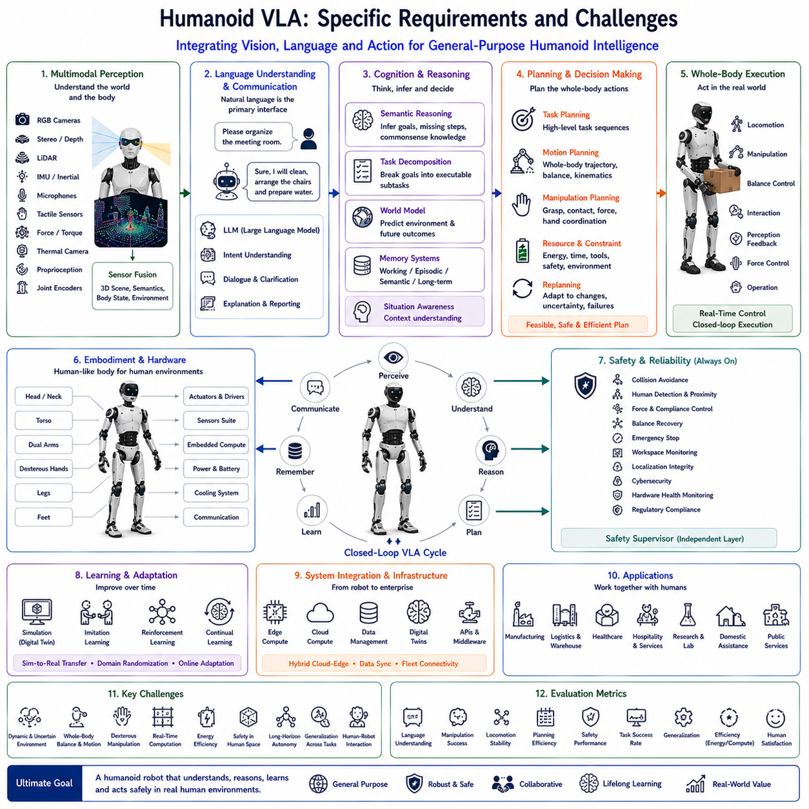{width="7.268055555555556in" height="7.268055555555556in"}

Humanoid Vision-Language-Action (VLA) systems represent one of the most ambitious directions in modern Physical AI because they combine multimodal perception, natural language understanding, cognitive reasoning, and full-body motor control within a human-like robotic platform. Unlike conventional mobile robots that primarily perform navigation or manipulation independently, humanoid robots must coordinate perception, cognition, locomotion, manipulation, balance, communication, and social interaction simultaneously. The complexity of these interconnected capabilities makes humanoid VLA systems fundamentally different from traditional robotics, requiring specialized architectures capable of integrating language intelligence with continuous physical interaction in dynamic human environments.

The primary objective of humanoid VLA is to enable robots to understand high-level human intentions expressed through natural language and transform them into coordinated whole-body behaviors. Human instructions are typically abstract, incomplete, and context-dependent. Commands such as "Please organize the meeting room," "Help prepare the laboratory," or "Assist the customer" do not specify every required action. Instead, humanoid robots must interpret semantic intent, infer missing procedural knowledge, identify relevant objects, generate task sequences, and execute coordinated actions while adapting continuously to environmental changes. This process requires significantly deeper reasoning than simple command execution.

One of the defining characteristics of humanoid robots is their human-compatible embodiment. Human environments such as homes, hospitals, factories, offices, hotels, airports, and laboratories are designed for human body dimensions, movement patterns, and manipulation capabilities. Doors, stairs, elevators, handrails, switches, cabinets, workbenches, keyboards, tools, and furniture all assume human reachability and dexterity. Consequently, humanoid robots can operate within existing infrastructure without requiring extensive environmental modification, making them attractive platforms for general-purpose physical intelligence.

Unlike wheeled autonomous mobile robots, humanoids require continuous balance control throughout every movement. Walking, turning, climbing stairs, stepping over obstacles, carrying objects, opening doors, and interacting with people all influence body stability. Every action changes the robot\'s center of mass, support polygon, joint loading, and dynamic equilibrium. Vision-Language-Action systems must therefore coordinate high-level reasoning with low-level locomotion controllers capable of maintaining stable posture under uncertain environmental conditions.

Whole-body motion planning represents one of the most demanding computational problems in humanoid robotics. Instead of planning only mobile base trajectories or robotic arm motions independently, humanoid systems simultaneously coordinate dozens of joints across the legs, arms, torso, neck, hands, and head. Manipulation frequently requires coordinated body repositioning before arm motion begins. Reaching a high shelf may involve stepping forward, adjusting torso orientation, extending both arms, maintaining balance, and monitoring nearby obstacles simultaneously. Motion planning therefore becomes an optimization problem involving the entire kinematic structure rather than isolated mechanisms.

Dexterous manipulation introduces another major challenge. Human hands possess extraordinary flexibility, tactile sensitivity, and fine motor coordination developed through millions of years of biological evolution. Humanoid robots attempt to replicate these capabilities using multi-finger robotic hands equipped with force sensors, tactile arrays, joint encoders, and compliance control. Vision-Language-Action models must understand not only object identity but also grasp strategy, contact force, finger coordination, object orientation, and manipulation sequence appropriate for each task. Everyday activities such as folding clothes, preparing food, assembling equipment, or handling fragile materials require highly sophisticated sensorimotor coordination.

Perception within humanoid platforms extends beyond conventional environmental sensing. Multiple RGB cameras, stereo vision, depth sensors, LiDAR, inertial measurement units, tactile sensing, force-torque sensors, microphones, thermal cameras, proprioceptive sensing, and joint state monitoring collectively provide comprehensive awareness of both external environments and internal body conditions. Sensor fusion continuously integrates these heterogeneous information sources into coherent representations supporting navigation, manipulation, human interaction, balance control, and cognitive reasoning.

Natural language understanding serves as the primary interface between humans and humanoid robots. Large Language Models interpret conversational instructions, answer questions, explain robot intentions, request clarification, negotiate priorities, summarize completed tasks, and support collaborative planning. Unlike industrial robots receiving predefined programs, humanoid systems frequently interact with non-expert users who communicate using ordinary language rather than technical commands. Robust language grounding therefore becomes essential for practical deployment.

Semantic reasoning bridges language understanding and physical execution. Human instructions often omit intermediate procedural details that humans naturally infer from common sense. A request to "prepare coffee for the meeting" implicitly requires locating cups, identifying coffee supplies, operating equipment, filling water, serving beverages, and cleaning afterward. Humanoid VLA systems employ reasoning models capable of inferring these hidden procedural steps while considering environmental context, available resources, organizational rules, and user preferences before generating executable plans.

Memory systems significantly enhance humanoid intelligence across long-duration interactions. Working memory maintains active observations, dialogue history, task progress, and execution status throughout ongoing activities. Episodic memory records previous interactions, completed missions, encountered failures, and successful recovery procedures. Semantic memory stores object knowledge, environmental layouts, operational procedures, human preferences, organizational policies, and commonsense concepts. Long-term memory enables humanoid robots to personalize interactions while continuously improving performance through accumulated experience.

World models provide predictive internal simulations supporting long-horizon planning. Rather than reacting only to immediate observations, humanoid robots continuously estimate future environmental evolution resulting from human movement, object manipulation, equipment operation, and their own planned actions. Internal simulation evaluates candidate strategies before execution, reducing unnecessary movement, preventing collisions, and improving task efficiency. Predictive world models therefore play an increasingly important role within advanced humanoid cognitive architectures.

Social intelligence represents another defining requirement for humanoid platforms. Their human-like appearance naturally encourages close interaction with people, creating expectations regarding communication quality, emotional appropriateness, safety, and collaborative behavior. Humanoid robots must interpret gaze direction, gestures, facial expressions, body posture, interpersonal distance, conversational context, and social conventions while adapting behavior appropriately. Human-Robot Interaction therefore becomes a central design objective rather than an optional extension.

Safety requirements for humanoid robots exceed those of many conventional robotic systems because these platforms often operate in close proximity to people while possessing significant mechanical strength and mobility. Safe operation requires continuous collision avoidance, compliant force control, human detection, balance recovery, emergency stopping, workspace monitoring, actuator health supervision, localization integrity, cybersecurity validation, and regulatory compliance. Safety supervision operates independently from cognitive reasoning to ensure deterministic protective behavior under all operating conditions.

Computational requirements are considerably greater than those of traditional mobile robots. Humanoid VLA systems simultaneously execute multimodal perception, language understanding, semantic reasoning, world model prediction, motion planning, whole-body control, manipulation, speech processing, memory retrieval, and safety monitoring under strict real-time constraints. High-performance GPUs, specialized AI accelerators, heterogeneous computing architectures, and efficient model optimization techniques become essential for achieving practical deployment without excessive energy consumption.

Energy management presents another major engineering challenge. Humanoid robots require substantial electrical power to support dozens of actuators, onboard computing platforms, sensor suites, wireless communication, and thermal management systems while maintaining acceptable operational duration. Walking consumes significantly more energy than wheeled locomotion, making battery capacity, energy-efficient planning, lightweight mechanical design, regenerative actuation, and intelligent power management critical factors influencing deployment viability.

Simulation plays an indispensable role during humanoid VLA development. Digital twins, physics simulators, synthetic environments, reinforcement learning platforms, and imitation learning systems allow millions of interaction experiences before physical deployment. Simulation supports balance optimization, manipulation learning, navigation, recovery behavior, language grounding, and world model training while minimizing hardware wear and development cost. Nevertheless, Simulation-to-Real transfer remains challenging because physical contact dynamics, sensor noise, actuator variability, and environmental uncertainty cannot be perfectly reproduced virtually.

Industrial deployment introduces additional integration requirements extending beyond robotics alone. Manufacturing Execution Systems, Enterprise Resource Planning platforms, Warehouse Management Systems, Digital Twins, predictive maintenance software, quality management systems, and cloud-based fleet management increasingly interact with humanoid VLA systems. Humanoid robots therefore become intelligent participants within enterprise information ecosystems rather than isolated autonomous machines.

Evaluation of humanoid Vision-Language-Action systems extends far beyond traditional robotic benchmarks. Researchers assess language understanding, semantic grounding, locomotion stability, manipulation success, balance recovery, planning efficiency, memory utilization, reasoning quality, world model accuracy, social interaction, human collaboration, computational efficiency, energy consumption, safety performance, generalization capability, long-horizon autonomy, and continual learning. Comprehensive evaluation therefore measures the effectiveness of the complete embodied cognitive architecture rather than isolated algorithmic components.

Future humanoid VLA systems will increasingly integrate multimodal foundation models, predictive world models, lifelong memory, continual learning, cloud-edge computing, distributed cognitive architectures, digital twins, advanced dexterous manipulation, whole-body motion optimization, and increasingly capable Large Language Models into unified autonomous intelligence platforms. Rather than functioning as programmable industrial machines, future humanoid robots will become adaptive cognitive partners capable of understanding human language, reasoning about complex physical environments, learning continuously from experience, collaborating naturally with people, and safely performing diverse real-world tasks across manufacturing, healthcare, logistics, hospitality, scientific research, public services, and domestic environments. These integrated capabilities will define the next generation of general-purpose Physical AI systems designed specifically for human-centered environments.

## 8.2 Full-Body Action Spaces (with Code)

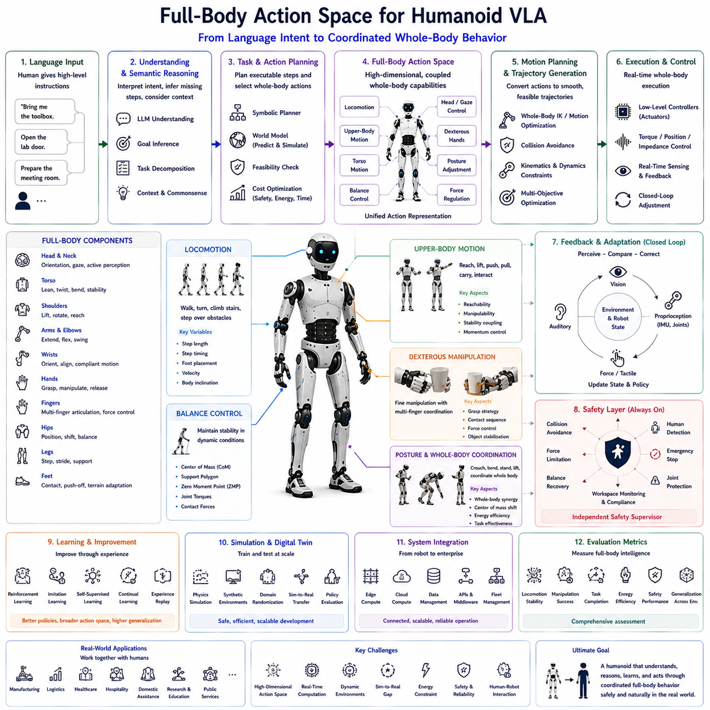{width="7.268055555555556in" height="7.268055555555556in"}

The Full-Body Action Space represents one of the defining characteristics that distinguishes humanoid Vision-Language-Action (VLA) systems from conventional mobile robots and industrial manipulators. While wheeled robots typically operate using navigation commands and robotic arms execute manipulation trajectories independently, humanoid robots must coordinate every movable body component as a unified physical system. Walking, balancing, reaching, grasping, turning, bending, climbing, carrying, gesturing, and interacting with humans all require synchronized control of the entire body. Consequently, the action space of a humanoid robot is significantly larger, more dynamic, and considerably more complex than that of traditional robotic platforms.

Within humanoid VLA, the action space defines every controllable physical behavior available to the robot. It includes locomotion, arm movement, torso motion, head orientation, hand articulation, finger coordination, gaze control, posture adjustment, force regulation, and whole-body stabilization. Rather than treating these motions as independent subsystems, modern cognitive architectures represent them as coordinated components of a unified action representation. Every decision generated by the Vision-Language-Action pipeline ultimately becomes a sequence of actions selected from this high-dimensional action space.

Natural language serves as the starting point of action generation. Human instructions typically describe objectives rather than explicit motions. Commands such as "Bring me the toolbox," "Open the laboratory door," or "Prepare the meeting room" provide semantic goals while leaving detailed body movements unspecified. The VLA system must interpret language, identify task intent, infer intermediate actions, evaluate environmental constraints, and finally generate coordinated whole-body motion. This transformation from semantic intention into executable body movement represents one of the central problems of humanoid robotics.

Unlike traditional industrial robots operating within fixed workspaces, humanoid robots continuously interact with dynamic environments. Every action changes body posture, center of mass, contact conditions, joint loading, and environmental relationships. Consequently, action generation becomes a continuous closed-loop optimization process rather than a sequence of predetermined trajectories. Sensory feedback constantly modifies body movement according to changing environmental conditions, human behavior, and execution uncertainty.

Locomotion forms the foundation of the humanoid action space. Walking requires coordinated movement of both legs while continuously maintaining dynamic balance. Every step influences future stability, obstacle avoidance, energy consumption, and manipulation opportunities. Walking speed, stride length, turning radius, foot placement, body inclination, and ground contact timing are continuously optimized according to terrain conditions and task objectives. Unlike wheeled robots, humanoids must actively stabilize every movement throughout execution.

Balance control operates simultaneously with every other action. Standing, walking, climbing stairs, carrying loads, reaching for elevated objects, bending toward the floor, or interacting with people all influence dynamic equilibrium. Whole-body controllers continuously estimate the robot\'s center of mass, support polygon, zero moment point, joint torques, and contact forces while generating corrective movements before instability develops. Balance therefore becomes an inseparable component of every action rather than an isolated control module.

Upper-body motion introduces another level of complexity. The shoulders, elbows, wrists, and hands cooperate with torso rotation and body positioning to maximize manipulation capability while preserving stability. Arm trajectories cannot be planned independently because they directly influence body momentum and balance. A reaching action frequently requires simultaneous stepping, torso adjustment, head rotation, and force redistribution throughout the entire body.

Dexterous manipulation represents one of the highest-dimensional components within the humanoid action space. Multi-finger robotic hands must coordinate finger position, grasp force, contact sequence, wrist orientation, compliance, and object stabilization during manipulation. Everyday activities including opening bottles, inserting connectors, folding fabric, using tools, assembling equipment, preparing food, or handling fragile objects require extremely precise coordination among multiple joints and tactile feedback mechanisms.

Head and neck movement provide active perception rather than passive sensing. Cameras, depth sensors, microphones, and other perception devices mounted on the head continuously adjust orientation toward relevant environmental features. Vision-guided attention improves perception quality by directing sensing resources toward objects, people, navigation targets, or manipulation areas currently required for task execution. Active sensing therefore becomes an integral component of the overall action space.

Eye gaze and visual attention increasingly influence humanoid interaction behavior. Although many robotic platforms do not possess movable eyes, virtual gaze direction generated through head orientation, camera alignment, facial displays, or expressive mechanisms significantly improves human understanding of robot intentions. Gaze communicates attention, anticipation, object references, conversational engagement, and collaborative intent during Human-Robot Interaction.

Torso motion significantly expands reachable workspace while improving manipulation flexibility. Leaning forward extends arm reach, rotating the torso improves lateral access, crouching enables floor-level manipulation, and upright posture improves environmental visibility. Coordinated torso movement also reduces unnecessary walking by allowing efficient body repositioning during manipulation tasks. Whole-body optimization therefore minimizes energy expenditure while maximizing operational efficiency.

Whole-body coordination distinguishes humanoid action planning from traditional robotic control. Consider a simple instruction such as "Pick up the box from the floor." Successful execution requires visual localization, stepping toward the object, lowering body height, maintaining balance, coordinating torso inclination, extending both arms, adjusting finger configuration, grasping securely, lifting while preserving stability, and returning to upright posture. Every movement depends upon continuous coordination among multiple body segments rather than isolated actuator control.

Language-guided action generation relies heavily upon semantic reasoning. Human instructions frequently omit procedural details that humans naturally infer from common experience. The cognitive architecture decomposes high-level goals into executable subtasks while selecting appropriate whole-body actions according to environmental conditions, object properties, safety requirements, and available resources. Large Language Models contribute commonsense reasoning, whereas task planners verify physical feasibility before execution begins.

Motion planning transforms symbolic action sequences into continuous body trajectories. Kinematic constraints, dynamic stability, collision avoidance, joint limits, actuator capabilities, environmental obstacles, human proximity, and energy efficiency collectively influence trajectory optimization. Modern humanoid planners simultaneously optimize multiple objectives while maintaining smooth, safe, and efficient body movement throughout task execution.

Sensorimotor feedback continuously refines action execution. Cameras verify object position, force sensors monitor grasp quality, tactile sensing confirms contact conditions, inertial sensors estimate body orientation, joint encoders report actuator positions, and proprioceptive sensing measures internal body configuration. Every observation updates the controller, allowing actions to adapt immediately to unexpected disturbances, object movement, or environmental variation. Closed-loop execution therefore provides robustness unavailable through open-loop trajectory generation alone.

Learning plays a central role in expanding the humanoid action space. Reinforcement learning discovers efficient movement strategies through repeated interaction. Imitation learning transfers expert demonstrations into autonomous execution. Self-supervised learning identifies regularities within sensorimotor experience without requiring manual annotation. Continual learning gradually improves movement quality as additional operational experience accumulates throughout deployment. Learned action representations become increasingly generalized across diverse tasks and environments.

Simulation provides an indispensable environment for developing full-body action policies. Physics engines model walking dynamics, contact interactions, object manipulation, balance recovery, stair climbing, tool usage, and collaborative interaction before physical deployment. Millions of simulated experiences enable efficient optimization while minimizing hardware wear and development cost. Nevertheless, transferring learned policies from simulation into physical robots remains challenging because real-world contact dynamics, actuator variability, and environmental uncertainty differ from idealized simulation models.

Safety constraints remain active throughout every action generated by humanoid VLA systems. Collision avoidance, force limitation, joint protection, balance recovery, human proximity monitoring, emergency stopping, workspace supervision, and regulatory compliance operate independently from high-level cognition. Even when language reasoning generates valid task objectives, low-level safety controllers continuously modify action execution whenever unsafe conditions emerge.

Energy efficiency significantly influences action planning because humanoid locomotion and manipulation consume substantial electrical power. Walking, lifting heavy objects, maintaining balance, and operating dexterous hands all require coordinated energy management. Action planners therefore consider battery capacity, actuator efficiency, thermal conditions, and expected mission duration while selecting movement strategies. Efficient motion generation extends operational lifetime without sacrificing task performance.

Evaluation of humanoid action spaces extends beyond measuring isolated movement accuracy. Researchers assess locomotion stability, manipulation precision, balance robustness, task completion success, trajectory smoothness, energy consumption, computational efficiency, language grounding quality, sensorimotor coordination, adaptation capability, safety performance, generalization across environments, and long-horizon autonomous behavior. Comprehensive evaluation therefore measures the effectiveness of integrated whole-body intelligence rather than individual motion primitives.

Future humanoid Vision-Language-Action systems will increasingly employ unified action representations integrating multimodal perception, semantic reasoning, predictive world models, lifelong memory, whole-body optimization, dexterous manipulation, cloud-edge computation, distributed learning, and advanced Large Language Models into a single cognitive architecture. Rather than generating isolated joint commands, future humanoid robots will synthesize coordinated full-body behaviors directly from human intentions while adapting continuously to dynamic environments. Such integrated action spaces will become the foundation for general-purpose Physical AI capable of operating naturally, safely, and efficiently across manufacturing, healthcare, logistics, domestic assistance, scientific research, hospitality, and other complex human-centered environments.

## 8.3 Whole-Body Language-Conditioned Control (with Code)

{width="7.268055555555556in" height="7.268055555555556in"}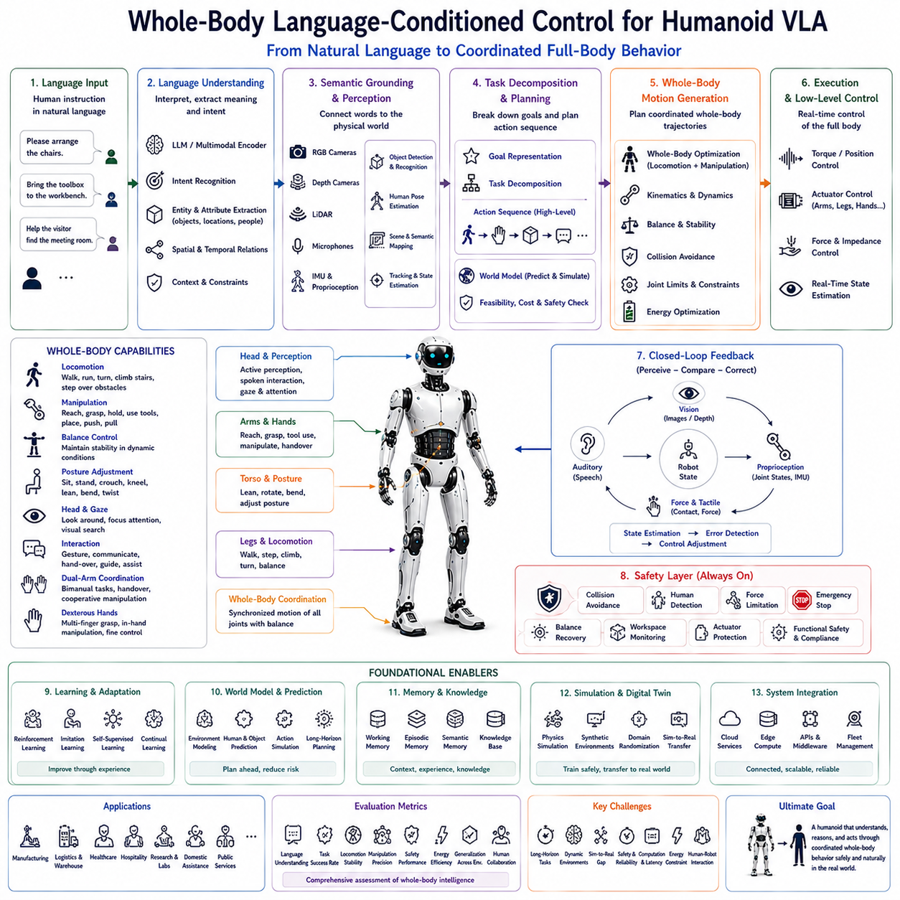{width="7.268055555555556in" height="7.268055555555556in"}

Whole-Body Language-Conditioned Control is one of the core technologies enabling humanoid Vision-Language-Action (VLA) systems to transform natural language instructions directly into coordinated full-body behavior. Unlike traditional robotic control systems that execute predefined trajectories or isolated motion primitives, language-conditioned control allows a humanoid robot to continuously interpret semantic intentions, perceive its surroundings, reason about environmental constraints, and generate synchronized movements involving the entire body. This capability establishes a direct connection between high-level cognitive understanding and low-level motor execution, making it possible for humanoid robots to operate naturally within complex human environments.

The central objective of language-conditioned control is to convert abstract human intentions into executable physical behaviors. Human instructions are rarely expressed as precise motion commands. Instead, they describe goals such as "Please arrange the chairs," "Help the visitor," or "Carry these boxes to the storage room." These instructions contain semantic meaning rather than explicit descriptions of body movements. Consequently, the control architecture must infer the required sequence of locomotion, manipulation, posture adjustment, balance maintenance, perception, and interaction before generating physically feasible actions.

Unlike conventional industrial robots that execute predetermined programs repeatedly within fixed workspaces, humanoid robots operate in dynamic environments where every action depends on continuously changing conditions. Human movement, object displacement, environmental uncertainty, and unexpected obstacles require the control system to update body motion continuously. Whole-body language-conditioned control therefore functions as an adaptive closed-loop system that constantly integrates perception, cognition, and motor execution instead of relying upon fixed motion trajectories.

Language understanding provides the first stage of the control pipeline. Large Language Models and multimodal language encoders interpret spoken or written instructions by identifying semantic goals, object references, spatial relationships, temporal dependencies, task priorities, safety constraints, and contextual information. Rather than producing joint commands directly, language understanding generates structured task representations that describe what the robot should accomplish while leaving motion generation to downstream planning and control modules.

Semantic grounding connects linguistic concepts with physical entities observed in the environment. Words such as "table," "door," "red toolbox," "next to the cabinet," or "the person wearing a blue jacket" must be associated with actual objects, locations, and people detected by perception systems. Cameras, LiDAR, depth sensors, semantic segmentation models, object detectors, and human pose estimation collectively establish these associations. Grounding therefore bridges symbolic language and physical reality, ensuring that high-level instructions correspond to executable actions.

Task decomposition transforms semantic goals into hierarchical action sequences. A single instruction frequently expands into multiple subtasks involving exploration, navigation, object search, manipulation, transportation, inspection, communication, and verification. For example, a request to "Prepare the meeting room" may involve locating chairs, arranging furniture, cleaning surfaces, activating presentation equipment, and confirming room readiness. The planning system automatically generates these intermediate objectives while respecting environmental constraints and operational priorities.

Whole-body coordination distinguishes humanoid control from conventional robotic manipulation. Every physical action simultaneously influences body posture, center of mass, joint loading, reachability, and environmental interaction. Picking up an object may require stepping forward, rotating the torso, lowering body height, extending one or both arms, adjusting hand orientation, maintaining balance, and continuously observing the target. These coordinated movements cannot be planned independently because each body component influences the stability and effectiveness of the others.

Locomotion and manipulation therefore become tightly integrated within the control architecture. Rather than treating walking and arm motion as separate subsystems, modern humanoid VLA systems optimize both simultaneously. Mobile positioning determines manipulation reachability, while manipulation objectives influence navigation trajectories. Dynamic body repositioning allows robots to perform complex tasks efficiently without unnecessary movement or energy consumption.

Balance maintenance remains active throughout every control cycle. Walking, climbing stairs, reaching overhead, carrying heavy objects, pushing equipment, or interacting with humans continuously alter the robot\'s dynamic equilibrium. Whole-body controllers estimate the center of mass, support polygon, zero moment point, joint torques, contact forces, and external disturbances while generating corrective actions before instability develops. Balance therefore becomes an integral constraint governing all generated behaviors rather than a separate stabilization module.

Motion generation converts symbolic action plans into executable body trajectories. Kinematic constraints, dynamic feasibility, actuator limitations, collision avoidance, environmental geometry, energy efficiency, and safety regulations collectively influence trajectory optimization. Instead of generating independent trajectories for each joint, whole-body optimization simultaneously coordinates all degrees of freedom to produce smooth, stable, and efficient motion.

Sensorimotor feedback enables continuous adaptation during execution. Cameras verify object positions, depth sensors estimate spatial relationships, force sensors monitor physical contact, tactile arrays confirm grasp quality, inertial measurement units estimate body orientation, and joint encoders report actuator states. These observations continuously update the controller, allowing actions to adapt immediately whenever environmental conditions differ from previous predictions. Closed-loop execution therefore provides significantly greater robustness than purely feedforward control strategies.

Predictive world models further enhance language-conditioned control by simulating future environmental evolution before physical execution. Candidate actions are evaluated internally according to predicted human movement, object dynamics, workspace occupancy, energy consumption, and safety risk. The control system therefore selects behaviors expected to maximize task success while minimizing unnecessary motion and operational risk. Predictive reasoning substantially improves long-horizon task execution within dynamic environments.

Memory systems contribute important contextual information during control generation. Working memory maintains current observations, dialogue history, active goals, and execution progress. Episodic memory stores previous experiences, successful action sequences, encountered failures, and recovery procedures. Semantic memory preserves knowledge regarding object properties, environmental layouts, organizational procedures, and user preferences. Memory enables personalized behavior while improving planning efficiency across repeated tasks.

Human-Robot Interaction significantly benefits from language-conditioned control because communication and physical behavior become tightly synchronized. As the robot performs actions, it explains execution progress, requests clarification when uncertainty arises, acknowledges user feedback, and adapts behavior according to conversational context. Physical gestures, head orientation, gaze direction, posture, and locomotion naturally complement verbal communication, creating intuitive collaborative interaction between humans and robots.

Safety supervision remains independent from cognitive reasoning throughout execution. Collision avoidance, workspace monitoring, force limitation, human detection, emergency stopping, actuator protection, localization integrity, cybersecurity validation, and functional safety mechanisms continuously constrain body motion regardless of high-level language objectives. Even if semantic reasoning generates inappropriate actions, dedicated safety controllers guarantee deterministic protective behavior before physical execution occurs.

Learning continually improves language-conditioned control policies throughout deployment. Reinforcement learning optimizes movement efficiency through trial and error, imitation learning transfers expert demonstrations into autonomous behavior, self-supervised learning discovers sensorimotor regularities from experience, and continual learning incorporates new environmental knowledge while preserving previously acquired capabilities. Over time, the control architecture becomes increasingly robust across diverse tasks, environments, and interaction scenarios.

Simulation serves as an indispensable development environment for whole-body language-conditioned control. Physics simulators, digital twins, synthetic environments, reinforcement learning platforms, and imitation learning frameworks enable millions of interaction experiences before deployment on physical hardware. Simulation supports efficient optimization of locomotion, manipulation, language grounding, balance recovery, task planning, and collaborative behavior while minimizing development cost and hardware wear. Simulation-to-Real transfer techniques subsequently reduce discrepancies between virtual training environments and physical deployment.

Industrial deployment introduces additional system integration requirements beyond robotic control alone. Whole-body language-conditioned control increasingly interacts with Manufacturing Execution Systems, Warehouse Management Systems, Digital Twins, Enterprise Resource Planning platforms, fleet management systems, predictive maintenance software, and cloud-based knowledge repositories. Consequently, humanoid robots become intelligent participants within enterprise information ecosystems rather than isolated autonomous machines.

Performance evaluation extends beyond measuring motion accuracy alone. Researchers assess semantic grounding accuracy, language understanding quality, task completion success, locomotion stability, manipulation precision, balance robustness, whole-body coordination, trajectory smoothness, computational latency, energy efficiency, human collaboration quality, safety performance, recovery capability, generalization across environments, and long-horizon autonomous execution. Comprehensive evaluation therefore measures the effectiveness of the complete language-to-action control pipeline rather than isolated motor performance.

Future Whole-Body Language-Conditioned Control systems will increasingly integrate multimodal foundation models, predictive world models, lifelong memory, continual learning, cloud-edge computing, distributed cognitive architectures, digital twins, advanced motion optimization, dexterous manipulation, and increasingly capable Large Language Models into unified embodied control frameworks. Rather than translating language into isolated motion commands, future humanoid robots will synthesize coordinated full-body behaviors directly from human intentions while continuously adapting to environmental change, collaborative interaction, and long-term operational experience. These integrated control architectures will become a cornerstone of next-generation Physical AI capable of functioning naturally, safely, and intelligently across manufacturing, healthcare, logistics, hospitality, scientific research, public services, and domestic environments.

## 8.4 Multi-Camera Humanoid Perception (with Code)

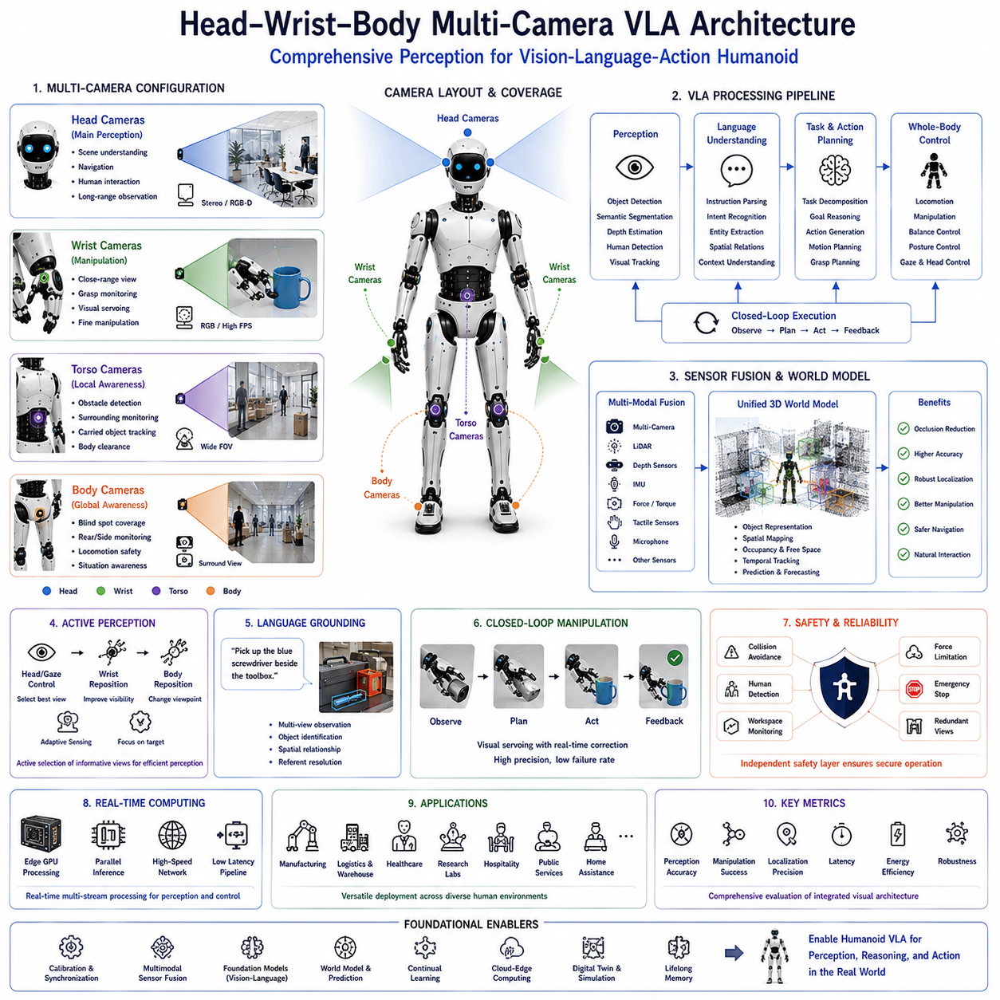{width="7.268055555555556in" height="7.268055555555556in"}

The Head--Wrist--Body Multi-Camera Vision-Language-Action (VLA) Architecture represents one of the most important sensing frameworks for next-generation humanoid Physical AI systems. Unlike conventional robotic perception systems that rely on a single forward-facing camera, humanoid robots perform complex tasks while continuously changing body posture, arm configuration, object distance, and viewing direction. A single viewpoint cannot provide sufficient environmental awareness for robust manipulation and navigation. Consequently, modern humanoid VLA systems employ multiple synchronized cameras distributed across the head, wrists, torso, and body to provide complementary visual information supporting perception, language grounding, reasoning, planning, and full-body control.

The primary objective of a multi-camera architecture is to establish comprehensive visual awareness throughout the robot\'s operational workspace. Cameras mounted on different body locations observe the environment from unique perspectives, reducing occlusion while increasing perception robustness. Head-mounted cameras provide global scene understanding and human interaction, wrist-mounted cameras deliver precise manipulation feedback, torso cameras monitor nearby obstacles, and body-mounted cameras improve situational awareness during locomotion. Together these sensing modalities create a unified visual representation that supports autonomous decision making across complex environments.

Head-mounted cameras function as the primary perception system for long-range observation. Positioned near the robot\'s visual center, they approximate the viewpoint naturally used by humans during navigation and interaction. These cameras continuously identify rooms, corridors, furniture, equipment, people, obstacles, signs, and task-relevant objects. They also support semantic scene understanding, environmental mapping, visual localization, object recognition, and natural human communication. Active head movement further expands the observable workspace by directing attention toward areas relevant to the current task.

Stereo cameras mounted on the head significantly improve three-dimensional perception. By combining synchronized left and right images, the robot estimates object depth, surface geometry, free space, and relative distances. Stereo vision supports obstacle avoidance, object localization, grasp planning, stair detection, human distance estimation, and precise navigation through cluttered environments. When combined with depth sensors or LiDAR, stereo perception provides highly reliable spatial understanding under varying lighting conditions.

Wrist-mounted cameras play a unique role within manipulation tasks. During grasping, assembly, tool use, or object placement, head cameras frequently lose direct visibility because robotic arms partially block the field of view. Wrist cameras overcome this limitation by providing close-range observations directly aligned with the end-effector. These cameras continuously monitor grasp quality, object orientation, insertion alignment, contact position, and manipulation progress. Their viewpoint remains closely coupled to hand motion, enabling accurate visual servoing during fine manipulation.

Visual servo control benefits substantially from wrist-mounted sensing. Instead of executing open-loop trajectories based solely on prior perception, the robot continuously adjusts hand motion according to real-time visual feedback. Minor positioning errors caused by localization uncertainty, object displacement, mechanical tolerance, or environmental disturbance can therefore be corrected dynamically throughout manipulation. Closed-loop visual servoing significantly improves manipulation precision while reducing failure rates during contact-rich tasks.

Torso-mounted cameras expand environmental awareness beyond the robot\'s immediate forward direction. They observe surrounding workspace boundaries, nearby obstacles, collaborative human activity, carried objects, and body clearance during locomotion. Since torso orientation frequently differs from head orientation, these cameras provide complementary perspectives supporting collision avoidance and safe navigation. Torso perception becomes particularly valuable while carrying large objects that partially obstruct the forward view of head-mounted cameras.

Additional body-mounted cameras further improve environmental coverage during whole-body movement. Cameras positioned near the hips, shoulders, legs, or rear body monitor blind areas that cannot be observed by head or wrist sensors alone. During turning, backward movement, side-stepping, stair climbing, or collaborative manipulation, these auxiliary viewpoints substantially reduce perception uncertainty while improving overall operational safety.

Each camera within the architecture fulfills a specialized perceptual function rather than simply increasing image quantity. Head cameras emphasize semantic understanding, navigation, and communication. Wrist cameras prioritize manipulation accuracy and contact monitoring. Torso cameras enhance local environmental awareness and obstacle detection. Body cameras improve global situational awareness throughout locomotion. The cognitive architecture integrates these heterogeneous observations into a unified world representation supporting decision making at multiple spatial scales.

Sensor synchronization represents a critical engineering requirement within multi-camera systems. Images acquired from different viewpoints must correspond to the same physical instant to enable accurate sensor fusion. Hardware triggering, Precision Time Protocol synchronization, synchronized timestamps, and deterministic communication networks ensure temporal consistency across all imaging devices. Accurate synchronization becomes especially important during rapid whole-body movement where even small timing errors produce significant spatial inconsistencies.

Camera calibration provides another essential foundation for reliable perception. Intrinsic calibration determines the optical properties of individual cameras, while extrinsic calibration estimates precise spatial relationships among all imaging devices and the robot body. Calibration establishes a unified coordinate system allowing observations from different viewpoints to be fused into consistent three-dimensional representations. Continuous calibration monitoring further compensates for mechanical vibration, thermal expansion, and long-term hardware drift.

Multimodal sensor fusion integrates visual observations with complementary sensing modalities including LiDAR, depth cameras, inertial measurement units, force sensors, tactile arrays, wheel encoders, joint encoders, GNSS receivers, microphones, and thermal cameras. These heterogeneous data sources collectively improve localization, mapping, manipulation, human detection, obstacle avoidance, and environmental understanding. Sensor fusion therefore provides significantly greater robustness than any individual sensing modality alone.

Semantic perception transforms raw sensor observations into meaningful environmental representations. Vision-language models identify objects, estimate attributes, recognize activities, interpret human gestures, detect affordances, segment semantic regions, and understand spatial relationships. Rather than processing images independently, multimodal foundation models combine language, vision, and prior knowledge to generate context-aware scene understanding suitable for cognitive reasoning.

Language grounding directly benefits from multiple visual viewpoints. Instructions such as "Pick up the blue screwdriver beside the toolbox," "Open the cabinet behind the chair," or "Hand me the package near the printer" require accurate association between linguistic references and observed physical entities. Multi-camera perception reduces ambiguity by observing referenced objects from several perspectives simultaneously, allowing more reliable interpretation of spatial language.

World models continuously integrate observations from all cameras into persistent environmental representations. Objects remain represented even after leaving individual camera fields of view, while environmental changes update the internal map continuously. Predictive world models estimate future object motion, human activity, and robot interaction outcomes before physical execution. Multi-camera observations significantly improve world model accuracy by reducing uncertainty and expanding observable workspace coverage.

Whole-body motion planning depends heavily upon comprehensive visual perception. Navigation trajectories, manipulation motions, balance maintenance, collision avoidance, human interaction, and cooperative tasks all require accurate knowledge of surrounding geometry. Since different body movements continuously change sensor viewpoints, the planning system dynamically selects the most informative camera observations according to current task requirements. Perception therefore becomes an active component of motion generation rather than passive environmental observation.

Human-Robot Interaction similarly benefits from distributed visual sensing. Head cameras support face recognition, gaze estimation, facial expression analysis, and conversational interaction. Wrist cameras monitor object handover during collaborative manipulation. Body cameras observe interpersonal distance and surrounding activity, improving safety during close collaboration. Together these viewpoints enable more natural communication while supporting socially appropriate robot behavior.

Real-time computing requirements increase significantly within multi-camera architectures because multiple high-resolution image streams must be processed simultaneously. Edge GPUs execute perception, object detection, segmentation, language grounding, visual tracking, and sensor fusion with minimal latency. Efficient scheduling, model optimization, parallel processing, and heterogeneous computing architectures become essential for maintaining real-time performance without excessive energy consumption.

Safety supervision remains independent from cognitive reasoning throughout operation. Multi-camera perception continuously supports collision avoidance, human detection, workspace monitoring, obstacle tracking, manipulation safety, balance recovery, and emergency intervention. Redundant viewpoints substantially reduce perception failure caused by temporary occlusion or sensor malfunction, thereby increasing operational reliability in human-centered environments.

Performance evaluation extends beyond conventional vision metrics. Researchers assess object detection accuracy, semantic grounding quality, localization precision, manipulation success, visual servo performance, camera synchronization accuracy, sensor fusion consistency, world model quality, computational latency, energy efficiency, robustness to occlusion, environmental generalization, human interaction effectiveness, and long-duration operational stability. These metrics collectively evaluate the effectiveness of the integrated perception architecture rather than individual camera performance.

Future Head--Wrist--Body Multi-Camera VLA architectures will increasingly integrate multimodal foundation models, predictive world models, continual learning, lifelong memory, active perception, cloud-edge computing, distributed sensing, digital twins, advanced visual reasoning, and increasingly capable Large Language Models into unified embodied intelligence systems. Rather than functioning as isolated imaging devices, distributed camera networks will become cooperative perceptual components supporting comprehensive environmental understanding, language-guided reasoning, whole-body motion generation, dexterous manipulation, and natural human collaboration. This integrated visual architecture will become a fundamental sensing foundation for future humanoid Physical AI platforms operating safely and intelligently across manufacturing, logistics, healthcare, research laboratories, hospitality, public services, and domestic environments.

## 8.5 NVIDIA GR00T Foundation Model (with Code)

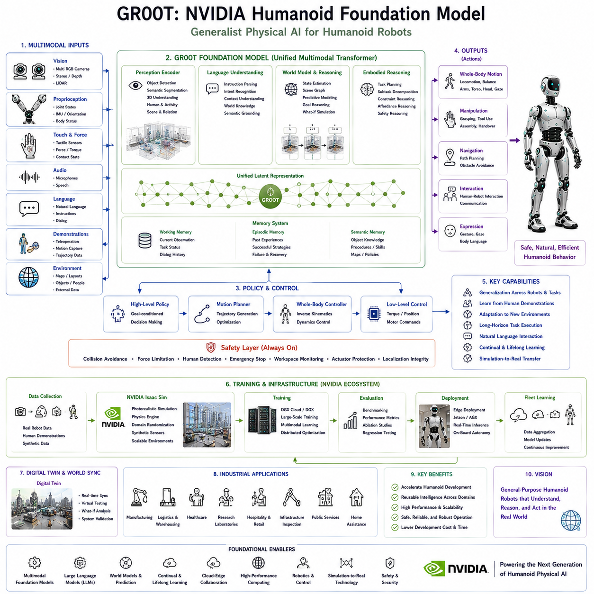{width="7.268055555555556in" height="7.268055555555556in"}

NVIDIA GR00T is a humanoid foundation model designed to accelerate the development of general-purpose humanoid robots capable of understanding, reasoning, and acting within complex physical environments. Rather than focusing on a single robotic task, GR00T provides a unified cognitive framework that combines perception, language understanding, world modeling, motion generation, and embodied reasoning into a scalable architecture suitable for a wide variety of humanoid applications. As Physical AI evolves from specialized automation toward general-purpose intelligence, foundation models such as GR00T represent an important transition from task-specific robotics to reusable embodied intelligence platforms.

The central objective of GR00T is to provide a common intelligence model that can be adapted to different humanoid platforms without redesigning the complete software stack for every robot. Traditional robotic systems are usually developed around application-specific software architectures where perception, navigation, manipulation, and planning are independently engineered for individual tasks. GR00T instead introduces a generalized representation capable of transferring learned knowledge across different environments, robot morphologies, and operational domains. This significantly reduces development effort while improving scalability and adaptability.

A defining characteristic of GR00T is its multimodal foundation architecture. Instead of processing only images or language independently, the model jointly learns from visual observations, natural language, proprioceptive sensing, robot state information, motion trajectories, environmental interactions, and demonstration data. These heterogeneous information sources are embedded into a unified latent representation where semantic concepts become directly associated with physical behaviors. Consequently, language, perception, and motor actions become tightly integrated within a common cognitive space.

Visual perception serves as one of the primary inputs to the GR00T architecture. Multiple RGB cameras, stereo cameras, depth sensors, LiDAR, tactile sensing, force sensors, inertial measurement units, and additional onboard sensing devices continuously observe both the external environment and the robot\'s internal body state. Unlike conventional perception pipelines that simply detect objects, GR00T learns contextual relationships among objects, people, tools, workspaces, and ongoing activities. This richer environmental understanding enables more intelligent reasoning during long-horizon task execution.

Natural language understanding forms another essential component of the foundation model. Human instructions are interpreted semantically rather than syntactically. Instead of mapping predefined commands to fixed behaviors, GR00T analyzes user intent, contextual information, procedural dependencies, spatial references, temporal relationships, and implicit constraints. Instructions such as "Prepare the workstation for assembly," "Assist the technician," or "Organize the storage shelves" are decomposed into meaningful operational objectives requiring autonomous reasoning rather than explicit programming.

Semantic grounding connects linguistic concepts with physical entities observed in the environment. Objects described through language become associated with visual observations, spatial locations, manipulation affordances, and task relevance. The robot therefore understands not only what an object is but also how it can be manipulated, where it is located, how it relates to surrounding objects, and how it contributes to task completion. This grounding process establishes the bridge between abstract cognition and physical execution.

World models provide predictive reasoning capabilities throughout task execution. Rather than reacting only to immediate sensory observations, GR00T continuously maintains an internal representation describing object locations, environmental topology, human activities, robot state, and anticipated future changes. Candidate actions can therefore be evaluated internally before physical execution begins. Predictive simulation improves planning quality, reduces unnecessary motion, increases safety, and supports long-horizon autonomous behavior across dynamic environments.

Embodied reasoning distinguishes GR00T from purely language-based artificial intelligence systems. Every cognitive decision ultimately influences physical interaction with the surrounding world. Language understanding, semantic reasoning, perception, motion planning, manipulation, navigation, and safety supervision therefore operate within a single embodied decision-making framework. The model continuously reasons about what should be done, how it should be performed, and whether the intended behavior remains physically feasible under current environmental conditions.

Motion generation within GR00T emphasizes whole-body coordination rather than isolated joint control. High-level semantic goals are translated into executable body movements involving locomotion, arm motion, torso adjustment, balance control, hand manipulation, gaze direction, and environmental interaction. Instead of generating individual motor commands directly from language, hierarchical planning first produces structured task representations that are subsequently transformed into physically valid trajectories by motion optimization and control modules.

Learning from demonstration represents one of the major strengths of foundation models. GR00T can learn complex manipulation strategies, navigation behaviors, collaborative procedures, and operational workflows from human demonstrations without requiring explicit programming of every individual behavior. Demonstration data collected through teleoperation, motion capture, virtual simulation, or previous robot experience provide rich examples that improve generalization across new tasks. The model gradually acquires reusable physical knowledge applicable to diverse operational scenarios.

Simulation serves as a critical training environment for GR00T. NVIDIA Isaac Sim provides photorealistic environments, accurate physics simulation, synthetic sensor generation, domain randomization, and scalable robot training infrastructure. Millions of simulated interactions allow robots to learn locomotion, manipulation, perception, balance, object interaction, and collaborative behaviors before deployment on physical hardware. Digital twins further enable continuous synchronization between virtual models and real robotic systems, accelerating both development and validation.

Simulation-to-Real transfer remains a fundamental engineering objective throughout GR00T development. Although simulation enables efficient learning, real environments introduce sensor noise, actuator variability, lighting changes, contact uncertainty, hardware tolerances, and unpredictable human behavior. Domain randomization, continual learning, online adaptation, robust perception, and world model refinement collectively reduce discrepancies between virtual training environments and physical deployment, allowing learned knowledge to transfer more reliably into operational robots.

Memory systems significantly enhance long-term autonomous capability. Working memory maintains current observations, dialogue history, task progress, and execution status. Episodic memory stores previous operational experiences, successful recovery strategies, environmental changes, and collaborative interactions. Semantic memory accumulates object knowledge, operational procedures, facility layouts, and organizational policies. Together these complementary memory structures enable robots to improve continuously throughout long-duration deployment rather than repeatedly solving identical problems from scratch.

Human-Robot Interaction represents another major application domain for GR00T. Natural language communication allows people to specify objectives, modify priorities, request explanations, and collaborate during complex tasks. Simultaneously, robots explain execution progress, report uncertainty, summarize completed work, request clarification, and provide safety notifications. Physical gestures, gaze direction, body posture, locomotion, and manipulation behaviors naturally complement verbal communication, creating intuitive collaboration between humans and embodied intelligent agents.

Computing infrastructure plays a decisive role within the GR00T ecosystem. High-performance GPUs execute multimodal perception, language understanding, reasoning, world modeling, motion generation, and learning under demanding real-time constraints. Edge computing supports onboard autonomy with low latency, while cloud computing enables large-scale model training, fleet learning, digital twins, centralized knowledge management, and distributed model optimization. Hybrid cloud-edge architectures therefore provide scalable embodied intelligence suitable for industrial deployment.

Industrial applications of GR00T extend across manufacturing, logistics, warehouse automation, healthcare, laboratory operation, hospitality, retail, infrastructure inspection, public services, and domestic assistance. Rather than building separate software systems for each application, organizations can adapt a common foundation model using task-specific demonstration data and operational knowledge. This foundation-model paradigm substantially accelerates deployment while improving consistency across diverse robotic platforms.

Safety remains an independent supervisory layer throughout the architecture. Collision avoidance, force limitation, human detection, emergency stopping, workspace monitoring, localization integrity, actuator diagnostics, cybersecurity validation, and regulatory compliance continuously constrain robot behavior regardless of cognitive reasoning. Foundation models therefore operate within deterministic safety boundaries that guarantee reliable physical operation even when environmental uncertainty or reasoning ambiguity arises.

Evaluation of GR00T extends beyond conventional robotics metrics. Researchers assess language understanding, semantic grounding, perception quality, world model accuracy, reasoning capability, manipulation success, locomotion stability, whole-body coordination, demonstration learning efficiency, Simulation-to-Real transfer performance, computational efficiency, energy consumption, human collaboration, long-horizon planning, continual learning, safety performance, and generalization across unseen environments. These integrated evaluation criteria reflect the comprehensive nature of embodied foundation models.

Future GR00T development is expected to integrate increasingly capable multimodal foundation models, predictive world models, lifelong learning, distributed fleet intelligence, cloud-edge collaboration, digital twins, advanced dexterous manipulation, whole-body optimization, active perception, and next-generation Large Language Models into unified humanoid cognitive architectures. Rather than functioning as isolated software components, future GR00T-based systems will become reusable embodied intelligence platforms capable of understanding language, reasoning about physical environments, learning continuously from experience, and safely performing diverse real-world tasks across multiple industries. Such foundation models are likely to become one of the central technological pillars supporting the emergence of general-purpose Physical AI and scalable humanoid robotics over the coming decade.

## 8.6 OpenAI Humanoid Architecture (with Code)

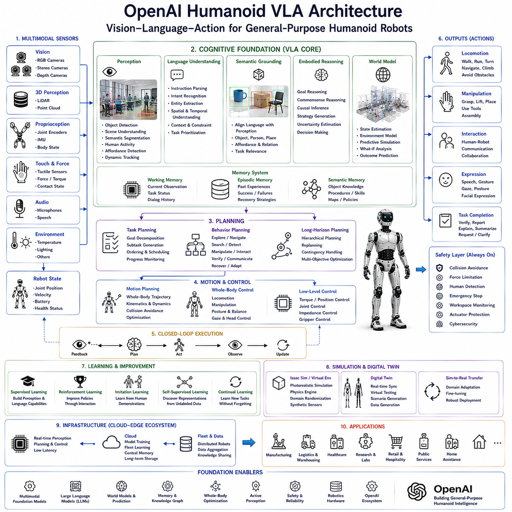{width="7.268055555555556in" height="7.268055555555556in"}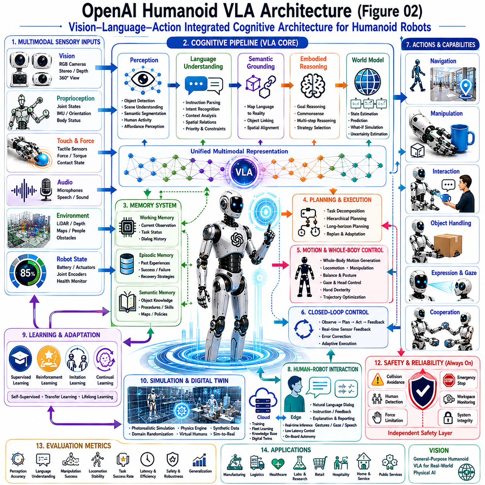{width="7.268055555555556in" height="7.268055555555556in"}

The OpenAI Humanoid Vision-Language-Action (VLA) Architecture represents a conceptual cognitive framework that integrates multimodal perception, natural language understanding, embodied reasoning, long-horizon planning, memory, and whole-body motor control into a unified intelligent robotic system. Rather than treating perception, planning, manipulation, and locomotion as isolated software modules, the architecture organizes them into a continuous cognitive pipeline where sensory observations, semantic understanding, reasoning, and physical actions operate cooperatively within a closed-loop interaction cycle. This integrated design reflects the emerging direction of Physical AI, where general-purpose humanoid robots continuously perceive, reason, learn, and interact with dynamic environments in a manner similar to human cognitive processes.

The architecture begins with multimodal sensory perception. A humanoid robot continuously acquires information through multiple RGB cameras, stereo vision systems, depth sensors, LiDAR, inertial measurement units, force sensors, tactile arrays, microphones, proprioceptive sensing, and joint encoders. Unlike traditional robotic perception systems that process each sensing modality independently, the OpenAI VLA architecture integrates heterogeneous observations into a unified multimodal representation describing both the external environment and the robot\'s internal physical state. This unified perception layer provides the cognitive foundation upon which all subsequent reasoning and decision making are constructed.

Visual perception performs significantly more than conventional object detection. Modern vision foundation models identify semantic objects, estimate spatial relationships, recognize human activities, understand environmental affordances, detect dynamic obstacles, interpret gestures, and continuously update scene understanding as the robot moves through its surroundings. Rather than generating isolated image classifications, visual perception constructs a semantic understanding of the environment that directly supports reasoning, planning, and interaction.

Natural language understanding functions as the primary interface between humans and the embodied cognitive system. Spoken or written instructions are interpreted according to semantic intent instead of predefined command templates. Human requests often omit procedural details while relying upon contextual knowledge and common sense. The language understanding component therefore extracts task objectives, identifies referenced objects, interprets temporal ordering, resolves spatial relationships, infers implicit constraints, and establishes operational priorities before transferring structured representations to higher-level reasoning modules.

Semantic grounding bridges linguistic concepts with physical reality. Every object, person, location, and environmental feature referenced in natural language must correspond to observable entities within the robot\'s perception system. Vision-language alignment continuously associates symbolic concepts with sensory observations, allowing the robot to understand not only object identity but also spatial position, manipulation affordance, environmental context, and task relevance. This grounding process enables reliable translation from abstract language into executable physical behavior.

At the center of the architecture resides the embodied reasoning engine. Rather than performing isolated symbolic planning, the reasoning module integrates language understanding, perception, world knowledge, memory, environmental context, and robot embodiment into a unified cognitive process. It continuously evaluates multiple candidate strategies, predicts potential outcomes, estimates uncertainty, resolves ambiguity, and selects actions that maximize long-term task success while respecting physical constraints and operational safety.

Large Language Models contribute high-level cognitive reasoning throughout this process. They interpret complex instructions, infer omitted procedural knowledge, explain decision rationale, prioritize competing objectives, generate alternative strategies, summarize completed tasks, and facilitate natural dialogue with human collaborators. However, language reasoning does not directly generate low-level motor commands. Instead, semantic reasoning provides structured goals that are subsequently validated by planning, safety, and motion generation modules before execution.

World models provide predictive environmental understanding that extends beyond immediate sensory observations. Rather than reacting only to current perception, the architecture continuously maintains an internal representation describing object locations, environmental topology, human activity, robot state, task progress, and anticipated future changes. Candidate actions are internally simulated before execution, allowing the system to evaluate expected consequences, estimate success probability, identify potential hazards, and minimize unnecessary movement. Predictive world models therefore improve long-horizon planning while increasing operational robustness.

Memory forms another essential component of the architecture. Working memory maintains current observations, dialogue history, active goals, and execution status during ongoing tasks. Episodic memory stores previous experiences, successful strategies, encountered failures, and recovery procedures accumulated throughout robot operation. Semantic memory preserves object knowledge, environmental layouts, operational procedures, organizational policies, and commonsense information. Together these complementary memory systems enable continual improvement through accumulated experience while supporting context-aware decision making across extended interactions.

Task planning converts semantic objectives into structured action hierarchies. High-level goals become decomposed into executable subtasks involving exploration, navigation, object localization, manipulation, verification, communication, recovery, and completion assessment. Hierarchical planning continuously updates task sequences according to environmental feedback, allowing autonomous missions to remain robust despite changing conditions or unexpected disturbances.

Motion planning subsequently transforms symbolic action plans into physically feasible body trajectories. Instead of controlling individual joints independently, whole-body optimization simultaneously coordinates locomotion, arm movement, torso posture, head orientation, gaze direction, hand configuration, balance maintenance, and environmental interaction. Kinematic constraints, dynamic stability, collision avoidance, actuator limitations, human proximity, and energy efficiency collectively influence trajectory generation, ensuring that cognitive decisions remain physically executable.

Whole-body control provides continuous sensorimotor coordination throughout execution. Feedback from cameras, tactile sensors, force sensors, inertial measurement units, joint encoders, and proprioceptive sensing continuously updates the control system during movement. Closed-loop execution allows actions to adapt immediately whenever environmental conditions differ from prior predictions, providing substantially greater robustness than open-loop trajectory execution. Walking, reaching, grasping, carrying, balancing, and collaborative interaction therefore become tightly integrated within a unified control framework.

Human-Robot Interaction operates throughout the complete cognitive pipeline rather than functioning as an isolated communication module. Humans provide task instructions, answer clarification questions, modify priorities, request explanations, and supervise execution through natural dialogue. Simultaneously, the robot communicates progress, explains decisions, reports uncertainty, requests assistance when necessary, and summarizes completed work using speech, gestures, gaze behavior, body posture, and expressive motion. Communication therefore becomes an integral component of intelligent collaboration.

Learning continuously refines every layer of the architecture. Supervised learning establishes initial perception and language capabilities. Reinforcement learning improves decision policies through environmental interaction. Imitation learning transfers human demonstrations into autonomous robot behavior. Self-supervised learning extracts meaningful representations from unlabeled multimodal data, while continual learning incorporates new experiences without catastrophic forgetting. The entire cognitive architecture therefore evolves continuously throughout deployment rather than remaining fixed after initial training.

Simulation provides the primary environment for large-scale training and validation. Digital twins, photorealistic simulation, synthetic sensor generation, physics-based interaction models, and virtual human collaboration enable millions of learning experiences before deployment on physical robots. Simulation supports efficient optimization of perception, reasoning, planning, manipulation, locomotion, and collaborative behaviors while minimizing development cost and hardware wear. Simulation-to-Real transfer techniques subsequently bridge remaining differences between virtual environments and real-world deployment.

Cloud-edge collaboration significantly enhances computational scalability. Edge computing performs real-time perception, reasoning, planning, and motion generation directly on the robot with minimal latency. Cloud infrastructure supports foundation model training, distributed learning, fleet knowledge sharing, centralized memory management, digital twin synchronization, and large-scale optimization. Hybrid cloud-edge architectures therefore balance autonomous operation with continuously expanding collective intelligence.

Safety supervision remains completely independent from cognitive reasoning. Collision avoidance, workspace monitoring, force limitation, human detection, emergency stopping, actuator diagnostics, localization integrity verification, cybersecurity protection, and regulatory compliance continuously constrain physical behavior regardless of high-level reasoning output. This independent safety layer ensures deterministic protective behavior even under uncertain environmental conditions or ambiguous language instructions.

Performance evaluation extends beyond conventional robotics benchmarks. Researchers evaluate multimodal perception accuracy, semantic grounding quality, language understanding, reasoning capability, world model consistency, task planning efficiency, manipulation precision, locomotion stability, whole-body coordination, computational latency, energy efficiency, recovery performance, human collaboration quality, continual learning effectiveness, long-horizon autonomy, safety robustness, and generalization across previously unseen environments. These integrated evaluation criteria reflect the complete embodied cognitive pipeline rather than isolated software components.

Future OpenAI Humanoid Vision-Language-Action architectures will likely integrate increasingly capable multimodal foundation models, predictive world models, lifelong memory, continual learning, distributed cognitive systems, advanced whole-body optimization, cloud-edge intelligence, digital twins, dexterous manipulation, active perception, and increasingly sophisticated Large Language Models into unified embodied intelligence platforms. Rather than functioning as collections of independent robotic algorithms, future humanoid systems will become continuously learning cognitive partners capable of understanding natural language, reasoning about complex physical environments, adapting through experience, collaborating naturally with humans, and safely performing diverse long-horizon tasks across manufacturing, logistics, healthcare, scientific research, public services, hospitality, and domestic environments. These integrated architectures represent a major step toward scalable, general-purpose Physical AI designed for real-world human-centered operation.

## 8.7 Bimanual Manipulation Policies (with Code)

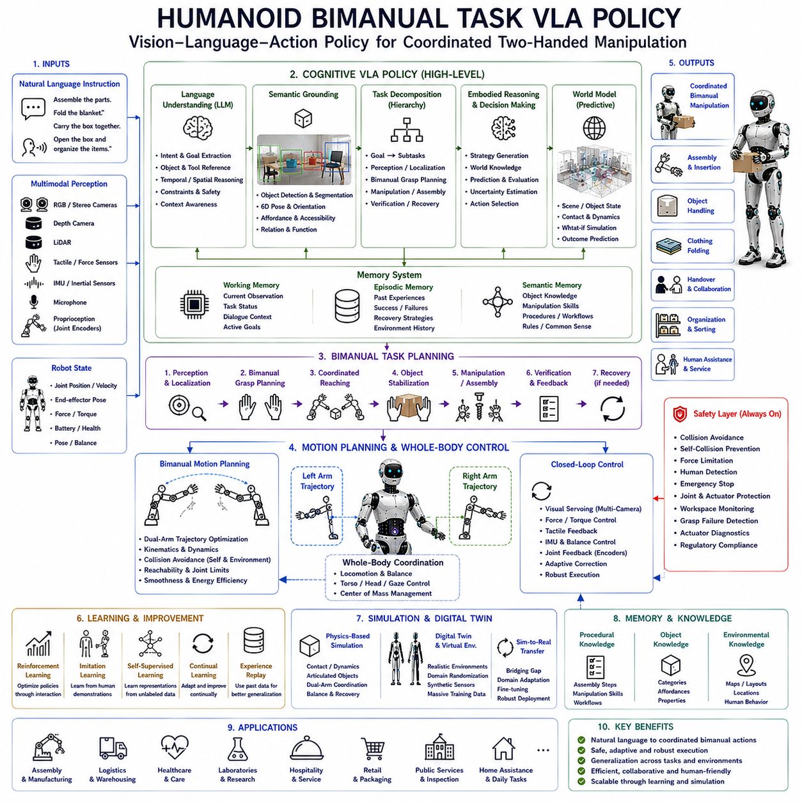{width="7.268055555555556in" height="7.268055555555556in"}

A Humanoid Bimanual Task Vision-Language-Action (VLA) Policy is an integrated decision-making framework that enables a humanoid robot to coordinate both arms, hands, torso, locomotion, perception, and language understanding while performing complex manipulation tasks. Unlike conventional robotic manipulation systems that often treat each arm independently, a bimanual VLA policy considers the entire body as a unified system in which both upper limbs cooperate to achieve shared task objectives. This coordinated approach allows humanoid robots to execute sophisticated activities such as assembling mechanical components, carrying large objects, folding clothes, opening containers, organizing shelves, preparing laboratory equipment, and assisting humans in collaborative environments.

The primary objective of a bimanual VLA policy is to transform natural language instructions into coordinated two-handed physical behaviors. Human instructions generally specify goals rather than individual arm movements. Commands such as "Assemble these parts," "Fold the blanket," "Carry the box together," or "Open the package and organize the contents" contain semantic intent without explicitly describing how each hand should move. The cognitive architecture therefore interprets language, identifies task objectives, decomposes the operation into subtasks, and generates synchronized motions for both arms while simultaneously maintaining whole-body stability.

Language understanding forms the initial stage of the policy pipeline. Large Language Models analyze spoken or written instructions by extracting semantic goals, object references, temporal ordering, spatial relationships, operational constraints, safety requirements, and contextual information. Rather than generating motor commands directly, the language module produces structured task representations that describe the desired physical outcome. These symbolic representations are subsequently processed by planning and control modules that transform semantic objectives into executable manipulation strategies.

Semantic grounding establishes the relationship between language and the physical environment. Objects mentioned within instructions must correspond to actual entities observed by the robot\'s perception system. Cameras, depth sensors, LiDAR, object detectors, semantic segmentation models, and human pose estimation collectively identify tools, containers, workpieces, furniture, and collaborative partners. Grounding further determines object orientation, grasp affordance, accessibility, and functional relationships, enabling the planning system to understand not only what objects exist but also how they should be manipulated.

Bimanual manipulation differs fundamentally from single-arm manipulation because both hands frequently perform complementary rather than identical roles. One hand may stabilize an object while the other performs fine manipulation. During assembly, one arm positions components while the second inserts connectors or fasteners. When opening a container, one hand holds the object securely while the other rotates the lid. Such complementary coordination requires continuous synchronization of force, timing, trajectory, and contact conditions across both manipulators.

Whole-body coordination plays a critical role throughout bimanual execution. Manipulation cannot be considered independently from locomotion, torso posture, head orientation, balance control, and visual perception. Carrying a large object may require coordinated stepping, body rotation, torso inclination, and simultaneous arm adjustment. Heavy loads alter the robot\'s center of mass, requiring continuous balance correction during manipulation. Consequently, the policy optimizes the entire body rather than individual joints or isolated limbs.

Task decomposition converts complex objectives into structured action hierarchies. High-level goals become sequences of perception, localization, grasp planning, coordinated reaching, object stabilization, manipulation, verification, and recovery. These subtasks are dynamically updated according to sensory feedback throughout execution. If environmental conditions change unexpectedly, the policy modifies task sequences without requiring complete replanning, thereby maintaining operational continuity during long-horizon manipulation tasks.

Motion planning generates synchronized trajectories for both arms while considering kinematic constraints, collision avoidance, reachability, joint limits, actuator capabilities, object geometry, and environmental obstacles. Unlike independent trajectory generation, bimanual planning optimizes both manipulators simultaneously to avoid self-collision and maintain ergonomic body posture. Motion optimization further minimizes unnecessary movement while improving manipulation efficiency and reducing energy consumption.

Grasp planning represents one of the most challenging components of bimanual policy generation. The robot must determine appropriate grasp locations, finger configurations, wrist orientations, grasp forces, contact sequences, and manipulation strategies according to object geometry, material properties, weight distribution, and task requirements. Coordinated grasp planning ensures that both hands interact safely while maintaining stable object control throughout manipulation.

Force coordination becomes especially important during contact-rich manipulation. Both hands continuously regulate applied forces according to object stiffness, surface friction, deformation characteristics, and task objectives. Excessive force may damage delicate objects, while insufficient force causes grasp failure or unstable manipulation. Tactile sensing, force-torque sensors, and compliance control therefore provide continuous feedback allowing adaptive force regulation during cooperative manipulation.

Visual perception supports every stage of bimanual execution. Head-mounted cameras provide global environmental awareness, wrist-mounted cameras monitor local manipulation, torso cameras observe surrounding workspace conditions, and depth sensors estimate three-dimensional object geometry. Multi-camera observations reduce occlusion caused by arm movement while improving grasp accuracy and contact monitoring. Visual servoing continuously refines manipulation trajectories according to real-time sensory observations.

Sensorimotor feedback enables adaptive closed-loop control throughout execution. Cameras monitor object movement, tactile arrays confirm contact quality, force sensors estimate interaction forces, inertial measurement units maintain body stability, and joint encoders continuously report actuator positions. Every observation updates the controller, allowing immediate correction of positioning errors, object displacement, environmental disturbances, or unexpected human interaction. Closed-loop execution therefore provides significantly greater robustness than open-loop manipulation strategies.

World models provide predictive reasoning supporting coordinated manipulation. Before execution begins, candidate action sequences are internally simulated to estimate object motion, contact dynamics, collision probability, energy consumption, and task completion likelihood. Predictive evaluation allows the policy to select strategies expected to maximize success while minimizing physical risk. Such internal simulation becomes particularly valuable during long-horizon assembly tasks involving numerous sequential operations.

Memory systems improve long-term manipulation capability. Working memory maintains current object states, manipulation progress, dialogue context, and active goals. Episodic memory stores previous successful manipulation sequences, encountered failures, recovery strategies, and environmental observations. Semantic memory accumulates knowledge regarding object categories, manipulation affordances, assembly procedures, operational workflows, and organizational standards. These complementary memory structures allow continual improvement through accumulated experience.

Human-Robot Interaction frequently requires coordinated bimanual behavior. Collaborative assembly, object handover, packaging, lifting assistance, laboratory operation, healthcare support, and domestic service often involve direct interaction between humans and robot manipulators. The policy continuously monitors human movement, predicts collaborative intent, adjusts manipulation timing, maintains safe interpersonal distance, and synchronizes physical actions with verbal communication. Language therefore complements physical coordination throughout collaborative manipulation.

Learning plays a fundamental role in developing generalized bimanual policies. Reinforcement learning optimizes coordinated motion through repeated interaction, imitation learning transfers human demonstrations into robot behavior, self-supervised learning extracts sensorimotor representations from unlabeled experience, and continual learning gradually improves manipulation strategies throughout deployment. Demonstration datasets collected through teleoperation, motion capture, virtual simulation, and previous robot experience provide valuable knowledge supporting policy generalization across diverse manipulation tasks.

Simulation provides an indispensable environment for training bimanual manipulation policies before deployment on physical robots. Physics-based simulation models contact dynamics, grasp stability, articulated object interaction, dual-arm coordination, balance recovery, and human collaboration while enabling millions of learning episodes at minimal cost. Domain randomization, synthetic sensor generation, and digital twins further improve policy robustness while facilitating efficient Simulation-to-Real transfer.

Safety supervision operates independently from cognitive reasoning throughout execution. Collision avoidance, self-collision prevention, force limitation, human detection, emergency stopping, joint protection, workspace monitoring, grasp failure detection, actuator diagnostics, and regulatory compliance continuously constrain manipulation behavior regardless of high-level language objectives. Independent safety monitoring guarantees reliable operation within collaborative human environments.

Performance evaluation extends beyond traditional manipulation accuracy. Researchers assess semantic grounding quality, language understanding, dual-arm synchronization, grasp stability, manipulation precision, trajectory smoothness, force regulation, task completion success, balance robustness, computational efficiency, energy consumption, recovery capability, human collaboration quality, policy generalization, long-horizon planning, and operational safety. Comprehensive evaluation therefore measures the effectiveness of the integrated embodied manipulation architecture rather than isolated robotic control algorithms.

Future Humanoid Bimanual Task Vision-Language-Action policies will increasingly integrate multimodal foundation models, predictive world models, lifelong memory, continual learning, cloud-edge computing, distributed cognition, dexterous hand control, active perception, whole-body optimization, digital twins, and increasingly capable Large Language Models into unified embodied manipulation frameworks. Rather than controlling two robotic arms independently, future humanoid systems will generate coordinated full-body behaviors directly from natural language while adapting continuously to dynamic environments, collaborative interaction, and accumulated operational experience. These integrated bimanual VLA policies will become fundamental technologies supporting general-purpose humanoid robots across manufacturing, logistics, healthcare, laboratories, hospitality, public services, and domestic assistance.

## 8.8 Unified Locomotion and Manipulation (with Code)

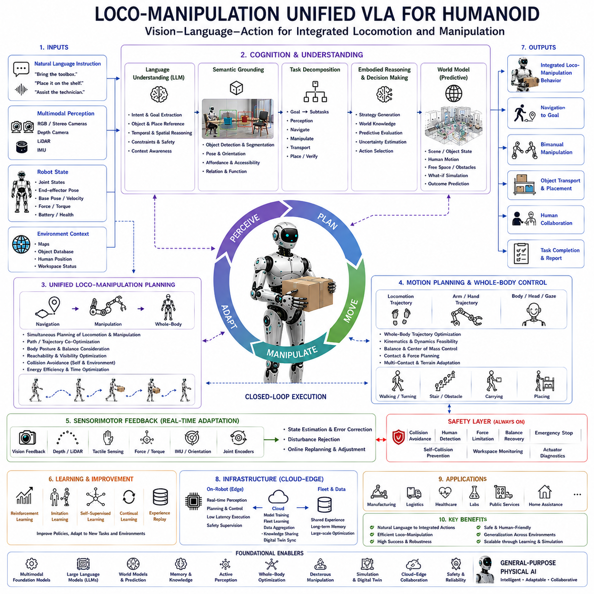{width="7.268055555555556in" height="7.268055555555556in"}

Loco-Manipulation Unified Vision-Language-Action (VLA) for humanoid robots represents an integrated cognitive and control framework that simultaneously coordinates locomotion, manipulation, perception, language understanding, and whole-body motion within a single embodied intelligence architecture. Traditional robotic systems often separate navigation from manipulation, allowing a mobile platform to move first and manipulate objects afterward. Although this modular approach simplifies system design, it limits efficiency when robots operate in complex, dynamic human environments. Humanoid robots instead require continuous coordination between walking and manipulation because movement, balance, object interaction, and environmental perception influence one another throughout task execution. A unified loco-manipulation VLA architecture therefore enables robots to perceive, reason, move, and manipulate simultaneously while adapting continuously to environmental changes.

The primary objective of unified loco-manipulation is to transform high-level human intentions into coordinated whole-body behaviors that integrate navigation and manipulation without artificial boundaries. Human instructions such as "Bring the toolbox from the workshop," "Place the package on the upper shelf," or "Assist the technician during assembly" implicitly require movement, object recognition, grasp planning, carrying, obstacle avoidance, and final placement. Humans naturally perform these operations as continuous actions without consciously separating locomotion from manipulation. The VLA architecture seeks to replicate this integrated behavior through a unified decision-making process.

Natural language understanding provides the cognitive entry point into the architecture. Large Language Models interpret semantic intent rather than predefined command syntax. Instructions are analyzed to identify operational objectives, referenced objects, destination locations, temporal dependencies, environmental constraints, safety considerations, and collaborative requirements. The language module constructs structured semantic representations describing what the robot should accomplish while leaving detailed body motion generation to downstream planning and control systems.

Semantic grounding connects symbolic language with physical observations obtained from multimodal perception. Objects described in language become associated with visual detections, spatial locations, manipulation affordances, and environmental context. Cameras, stereo vision, depth sensing, LiDAR, object detection networks, semantic segmentation, and human recognition collectively establish reliable correspondences between language and reality. This grounding process allows the robot to understand not only object identity but also accessibility, orientation, carrying feasibility, and interaction requirements.

Unlike conventional robotic pipelines, unified loco-manipulation planning considers navigation and manipulation simultaneously from the beginning of task generation. Instead of first computing a navigation path and later planning arm motion, both processes are optimized together. The selected walking trajectory depends upon future manipulation requirements, while manipulation strategies consider available walking paths, body posture, environmental obstacles, and balance constraints. This integrated optimization significantly improves operational efficiency while reducing unnecessary movement.

Locomotion forms the mobility foundation of the architecture. Walking, turning, side stepping, climbing stairs, obstacle crossing, and posture adjustment continuously reposition the robot according to manipulation objectives. Every step changes body orientation, center of mass, reachable workspace, and future interaction possibilities. Consequently, locomotion planning becomes an integral component of manipulation reasoning rather than an independent navigation subsystem.

Manipulation planning operates concurrently with locomotion throughout execution. Rather than waiting until the robot reaches a destination, arm trajectories, grasp strategies, wrist orientations, and finger configurations are continuously prepared while the robot is still moving. As the robot approaches an object, perception becomes increasingly precise, allowing manipulation plans to be refined according to updated environmental observations. This parallel planning reduces execution latency while improving overall task performance.

Whole-body coordination represents the defining characteristic of unified loco-manipulation. Every body segment contributes to task completion. Legs provide mobility and balance, the torso extends reachability through body rotation, arms position manipulators relative to target objects, wrists optimize grasp orientation, hands perform dexterous manipulation, and head movement actively directs visual attention. The entire body therefore functions as a coordinated kinematic structure rather than a collection of independent mechanisms.

Balance maintenance remains continuously active during combined locomotion and manipulation. Carrying heavy objects, reaching beyond the support polygon, climbing stairs while holding equipment, or opening doors during walking significantly alters dynamic stability. Whole-body controllers estimate center of mass, support polygon, zero moment point, contact forces, joint torques, and external disturbances while generating corrective actions before instability develops. Stable locomotion and stable manipulation therefore become inseparable objectives.

Perception supports both navigation and manipulation simultaneously. Head-mounted cameras provide long-range scene understanding and navigation awareness, wrist-mounted cameras enable precise manipulation, torso cameras monitor surrounding workspace conditions, and additional body-mounted sensors reduce blind areas during movement. Multi-camera perception continuously updates environmental understanding as body posture changes throughout execution. Active perception further directs sensing resources toward task-relevant regions to maximize decision quality.

World models significantly enhance unified loco-manipulation by maintaining predictive representations of both robot state and environmental evolution. Rather than reacting only to immediate sensory observations, the architecture continuously predicts future object motion, human movement, free-space availability, manipulation feasibility, and balance conditions. Candidate action sequences are internally simulated before execution, allowing the planner to evaluate long-horizon consequences while minimizing operational risk.

Motion planning transforms semantic objectives into coordinated body trajectories. Instead of optimizing walking trajectories and arm trajectories independently, unified planning simultaneously generates locomotion paths, manipulation motions, torso adjustments, gaze behavior, balance corrections, and object transport strategies. Kinematic constraints, dynamic feasibility, collision avoidance, joint limitations, actuator capabilities, energy efficiency, and safety requirements collectively influence trajectory optimization across the entire body.

Sensorimotor feedback provides continuous adaptation throughout execution. Cameras verify object positions, depth sensors estimate distances, tactile arrays monitor grasp quality, force sensors regulate interaction forces, inertial measurement units estimate body orientation, and joint encoders continuously report actuator states. Every observation updates the controller in real time, allowing the robot to compensate immediately for localization error, object displacement, environmental uncertainty, or unexpected human activity.

Human-Robot Interaction naturally benefits from unified loco-manipulation behavior. Humans perceive robot movement as significantly more intelligent when navigation and manipulation occur fluidly rather than sequentially. During collaborative tasks, the robot adjusts walking speed, body orientation, carrying posture, manipulation timing, gaze direction, and verbal communication according to human behavior. Physical coordination therefore complements natural language dialogue throughout collaborative operations.

Learning continuously improves integrated loco-manipulation policies through multiple complementary approaches. Reinforcement learning discovers efficient movement strategies through interaction, imitation learning transfers human demonstrations into autonomous behavior, self-supervised learning extracts meaningful sensorimotor representations without manual annotation, and continual learning incorporates new operational experience while preserving existing knowledge. Large demonstration datasets collected from teleoperation, motion capture, simulation, and previous deployments significantly improve generalization across diverse environments.

Simulation provides an essential training environment before deployment on physical humanoid robots. Physics-based simulation models walking dynamics, contact interactions, grasp stability, object transport, obstacle avoidance, balance recovery, and collaborative behavior under highly diverse environmental conditions. Digital twins synchronize virtual and physical systems, enabling efficient validation while reducing hardware wear. Simulation-to-Real transfer techniques subsequently minimize discrepancies between simulated learning environments and real-world deployment.

Cloud-edge collaboration expands the scalability of unified VLA architectures. Edge computing executes real-time perception, planning, control, and safety supervision directly on the robot with minimal latency. Cloud infrastructure supports foundation model training, fleet learning, centralized knowledge sharing, digital twin synchronization, long-term memory management, and large-scale optimization. This distributed computing strategy balances computational performance with autonomous operational capability.

Safety remains an independent supervisory layer throughout every stage of execution. Collision avoidance, human detection, workspace monitoring, force limitation, balance recovery, self-collision prevention, emergency stopping, actuator diagnostics, localization integrity verification, and cybersecurity protection continuously constrain generated behaviors regardless of high-level cognitive reasoning. Safety supervision guarantees deterministic protective operation while allowing flexible adaptive behavior under changing environmental conditions.

Performance evaluation extends beyond traditional locomotion or manipulation benchmarks individually. Researchers assess semantic grounding accuracy, language understanding quality, locomotion stability, manipulation precision, whole-body coordination, task completion success, trajectory smoothness, computational latency, energy efficiency, adaptation capability, collaborative interaction quality, predictive planning accuracy, recovery performance, continual learning effectiveness, generalization across unseen environments, and long-horizon autonomous behavior. These integrated metrics evaluate the complete embodied intelligence architecture rather than isolated subsystem performance.

Future Loco-Manipulation Unified Vision-Language-Action systems will increasingly integrate multimodal foundation models, predictive world models, lifelong memory, continual learning, active perception, cloud-edge computing, distributed cognitive architectures, dexterous manipulation, digital twins, advanced whole-body optimization, and increasingly capable Large Language Models into unified humanoid intelligence platforms. Rather than treating navigation and manipulation as separate robotic capabilities, future humanoid systems will perform fluid, coordinated, and adaptive whole-body behaviors directly from natural language intentions while continuously interacting with complex human environments. Such unified loco-manipulation architectures will become a foundational technology for general-purpose Physical AI across manufacturing, logistics, healthcare, laboratories, hospitality, infrastructure maintenance, public services, and domestic assistance.

## 8.9 Safe Deployment and Human Override (with Code)

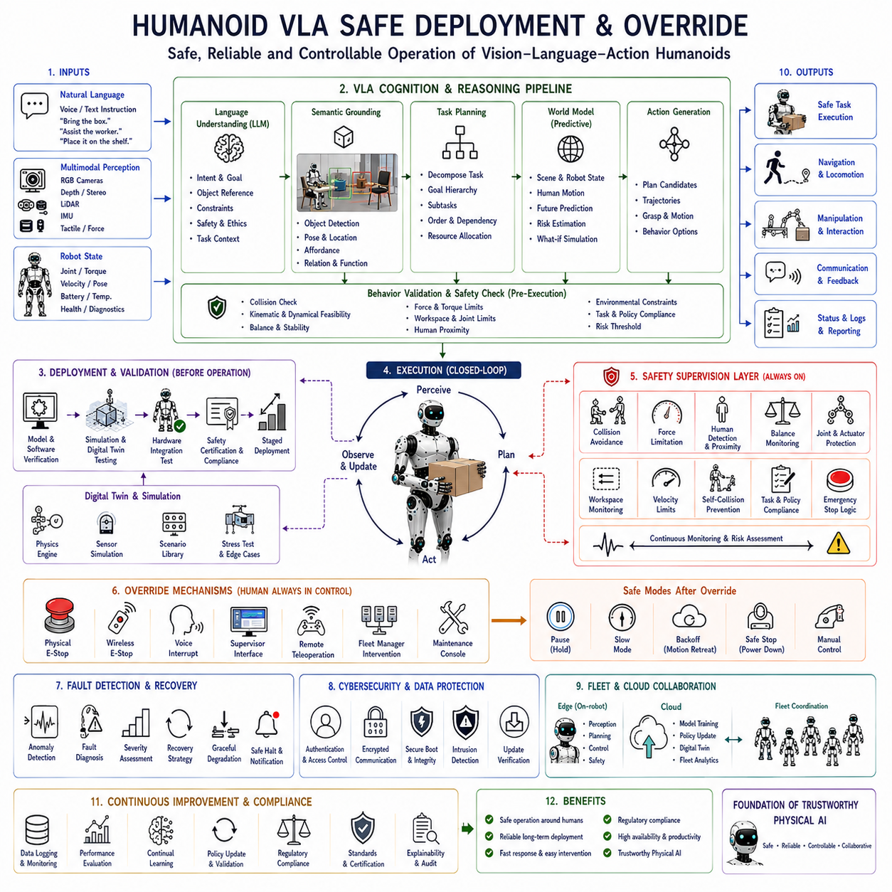{width="7.268055555555556in" height="7.268055555555556in"}

Humanoid Vision-Language-Action (VLA) Safe Deployment and Override refers to the comprehensive framework that ensures humanoid robots can operate safely, reliably, and predictably while maintaining the flexibility and intelligence offered by foundation models and large-scale multimodal reasoning systems. Unlike conventional industrial robots that execute deterministic motion programs inside isolated work cells, humanoid robots interact directly with humans, manipulate diverse objects, navigate dynamic environments, and continuously make autonomous decisions based on perception and language understanding. As a result, safe deployment requires not only traditional robotic safety mechanisms but also cognitive supervision, behavioral validation, policy monitoring, and human override capabilities that remain active throughout the robot\'s operational lifetime.

The primary objective of safe deployment is to guarantee that every action generated by the Vision-Language-Action pipeline remains physically safe, operationally reliable, ethically appropriate, and compliant with organizational policies regardless of environmental uncertainty or reasoning complexity. Language models and foundation models are capable of generating diverse action strategies, but these strategies must always be evaluated against physical constraints, environmental conditions, safety regulations, and mission objectives before any motor command reaches the robot actuators. Consequently, safety supervision functions as an independent decision layer rather than an optional component of the cognitive architecture.

The deployment process begins with comprehensive system validation before physical operation. Individual perception modules, language understanding components, world models, motion planners, whole-body controllers, safety monitors, communication interfaces, and hardware drivers undergo extensive verification in simulation and controlled environments. Digital twins reproduce mechanical dynamics, sensor behavior, actuator characteristics, environmental interactions, and expected mission scenarios, allowing engineers to identify software defects and unsafe behaviors before deployment on real robots. Simulation-based validation significantly reduces operational risk while accelerating system integration.

Hardware reliability forms the physical foundation of safe deployment. Multiple redundant sensing modalities including RGB cameras, stereo vision, depth sensors, LiDAR, inertial measurement units, force sensors, tactile arrays, joint encoders, battery monitoring systems, and actuator diagnostics continuously verify the robot\'s operational status. Sensor redundancy reduces the probability that individual hardware failures produce unsafe decisions. Cross-validation among heterogeneous sensors further improves confidence in environmental perception while enabling fault detection and graceful degradation during abnormal operating conditions.

Software safety architecture introduces multiple independent supervisory layers separating cognitive reasoning from deterministic control. The Vision-Language-Action pipeline generates candidate actions according to semantic understanding and environmental observations, while dedicated safety controllers independently verify every proposed behavior before execution. Collision avoidance, force limitation, workspace monitoring, joint limit enforcement, balance verification, velocity constraints, actuator protection, and emergency stop logic continuously operate regardless of the reasoning output produced by foundation models. This layered architecture prevents unsafe cognitive decisions from directly influencing physical motion.

Behavior validation represents an essential intermediate stage between reasoning and execution. Every generated action sequence is evaluated according to physical feasibility, kinematic consistency, dynamic stability, environmental constraints, object accessibility, manipulation safety, human proximity, and mission objectives. Candidate trajectories violating safety policies are rejected automatically before execution begins. Predictive simulation further estimates possible future outcomes, enabling the system to anticipate hazards before physical interaction occurs. Behavioral validation therefore transforms cognitive flexibility into operational reliability.

Human detection and proximity monitoring remain continuously active throughout robot operation. Vision systems, depth sensing, LiDAR, and wearable localization technologies identify nearby people, estimate motion trajectories, recognize body posture, and monitor interpersonal distance. Safety policies dynamically adjust robot velocity, manipulation force, approach distance, and interaction timing according to human presence. As people move closer to the robot, progressively stricter motion constraints are automatically applied, ensuring comfortable and safe collaboration without requiring complete interruption of ongoing tasks.

Override mechanisms constitute one of the defining characteristics of safe humanoid deployment. Although autonomous operation maximizes productivity, humans must always retain ultimate authority over robot behavior. Multiple override mechanisms operate simultaneously, including physical emergency stop buttons, wireless emergency controllers, supervisory software interfaces, voice interruption commands, remote teleoperation, fleet management intervention, and maintenance control consoles. Any authorized override immediately interrupts autonomous reasoning and transfers the robot into predefined safe operating modes while preserving diagnostic information for subsequent analysis.

Hierarchical authority management determines how different decision sources influence robot behavior. Low-level safety controllers possess absolute priority over motion generation. Human override commands supersede autonomous planning. Mission supervisors can modify operational objectives without bypassing safety policies. Fleet management systems coordinate multiple robots while respecting local safety constraints. This hierarchical decision structure ensures that intelligent reasoning never overrides deterministic protective mechanisms or authorized human intervention.

Operational modes define progressively increasing levels of autonomy according to deployment requirements. Manual mode enables complete teleoperation under direct human control. Assisted mode allows autonomous stabilization while operators provide high-level guidance. Supervised autonomy performs complete task execution subject to continuous human observation and intervention capability. Full autonomy permits independent operation only after comprehensive validation within environments satisfying predefined safety conditions. Robots may transition dynamically among these modes according to mission complexity, environmental uncertainty, or organizational policy.

Risk assessment continuously evaluates operational safety throughout execution rather than only before task initiation. Environmental changes, sensor degradation, communication failures, localization uncertainty, battery depletion, actuator abnormalities, unexpected human behavior, and object displacement all influence current operational risk. Dynamic risk estimation enables the robot to reduce speed, simplify behavior, request assistance, modify plans, or suspend execution whenever uncertainty exceeds acceptable safety thresholds. Continuous risk assessment therefore supports adaptive rather than static safety management.

Fault detection and diagnosis provide early identification of abnormal operating conditions. Sensor inconsistencies, actuator anomalies, communication delays, excessive computation latency, localization drift, abnormal force measurements, thermal overload, battery degradation, network interruptions, and unexpected environmental observations are continuously monitored. Diagnostic reasoning distinguishes temporary disturbances from persistent faults while recommending appropriate recovery actions. Early fault identification substantially improves reliability by preventing minor anomalies from evolving into hazardous system failures.

Recovery strategies enable graceful response following detected abnormalities. Minor perception failures may trigger sensor recalibration or viewpoint adjustment. Manipulation failures initiate grasp replanning or alternative contact strategies. Navigation uncertainty activates additional localization procedures. Hardware degradation may reduce operating speed while preserving essential functionality. Severe failures automatically transition the robot into safe stop modes awaiting human intervention. Structured recovery policies maximize operational continuity without compromising safety.

Cybersecurity represents another indispensable aspect of safe deployment. Modern humanoid robots rely upon wireless communication, cloud connectivity, distributed learning, software updates, and remote monitoring. Authentication, encrypted communication, secure boot, software integrity verification, access control, intrusion detection, and runtime security monitoring protect robotic systems from unauthorized modification or malicious interference. Cybersecurity therefore complements physical safety by ensuring trustworthy operation throughout network-connected deployments.

Fleet deployment introduces additional coordination requirements beyond individual robot safety. Multiple humanoids operating within shared environments exchange localization information, task assignments, environmental observations, and operational status. Fleet supervisors coordinate traffic management, collision avoidance, resource allocation, charging schedules, and mission priorities while ensuring that collective robot behavior remains safe under dynamically changing conditions. Distributed safety policies therefore extend beyond individual robots toward coordinated system-wide operation.

Cloud-edge collaboration supports scalable deployment while preserving deterministic local safety. Edge computers execute perception, planning, control, and safety supervision directly on each robot with minimal latency. Cloud infrastructure manages foundation model training, policy updates, digital twins, long-term learning, centralized monitoring, and fleet analytics. Importantly, loss of cloud connectivity never compromises essential safety functions because all protective mechanisms remain locally executable on onboard computing platforms.

Continuous learning introduces unique safety challenges because robot policies evolve over time. Newly acquired behaviors must undergo validation before becoming operational. Offline simulation, staged deployment, shadow evaluation, incremental policy updates, and human approval procedures ensure that continual learning improves performance without introducing unsafe behavior. Safe learning frameworks therefore balance adaptation with operational stability across long-term deployment.

Regulatory compliance further guides safe humanoid deployment. Functional safety standards, collaborative robotics guidelines, industrial automation regulations, medical safety requirements, cybersecurity frameworks, privacy protection, and organizational operating procedures collectively define acceptable deployment practices. Compliance verification extends beyond hardware certification to include software architecture, data governance, operational procedures, maintenance protocols, incident reporting, and lifecycle management. Future Physical AI systems will increasingly integrate regulatory reasoning directly into cognitive architectures.

Performance evaluation for safe deployment extends beyond conventional robotics benchmarks. Researchers assess collision avoidance reliability, human interaction safety, override response time, emergency stopping performance, fault detection accuracy, recovery success rate, cybersecurity resilience, policy validation effectiveness, operational availability, risk estimation quality, hardware reliability, software robustness, fleet coordination efficiency, long-term stability, and regulatory compliance. Comprehensive evaluation therefore measures not only intelligent task execution but also trustworthy operation throughout extended autonomous deployment.

Future Humanoid Vision-Language-Action Safe Deployment and Override frameworks will increasingly integrate multimodal foundation models, predictive world models, lifelong monitoring, adaptive risk assessment, cloud-edge safety collaboration, digital twins, distributed fleet intelligence, cybersecurity-aware reasoning, formal verification, explainable artificial intelligence, and increasingly capable Large Language Models into unified safety architectures. Rather than functioning as isolated emergency systems, future safety frameworks will become continuously operating cognitive supervisors capable of predicting hazards, validating behavior, coordinating human intervention, explaining autonomous decisions, and guaranteeing trustworthy humanoid operation across manufacturing, healthcare, logistics, laboratories, infrastructure maintenance, hospitality, public services, and domestic environments. These integrated deployment architectures will become a fundamental requirement for scalable, socially acceptable, and commercially viable Physical AI systems operating safely alongside humans.

## 8.10 Benchmarking Humanoid VLAs

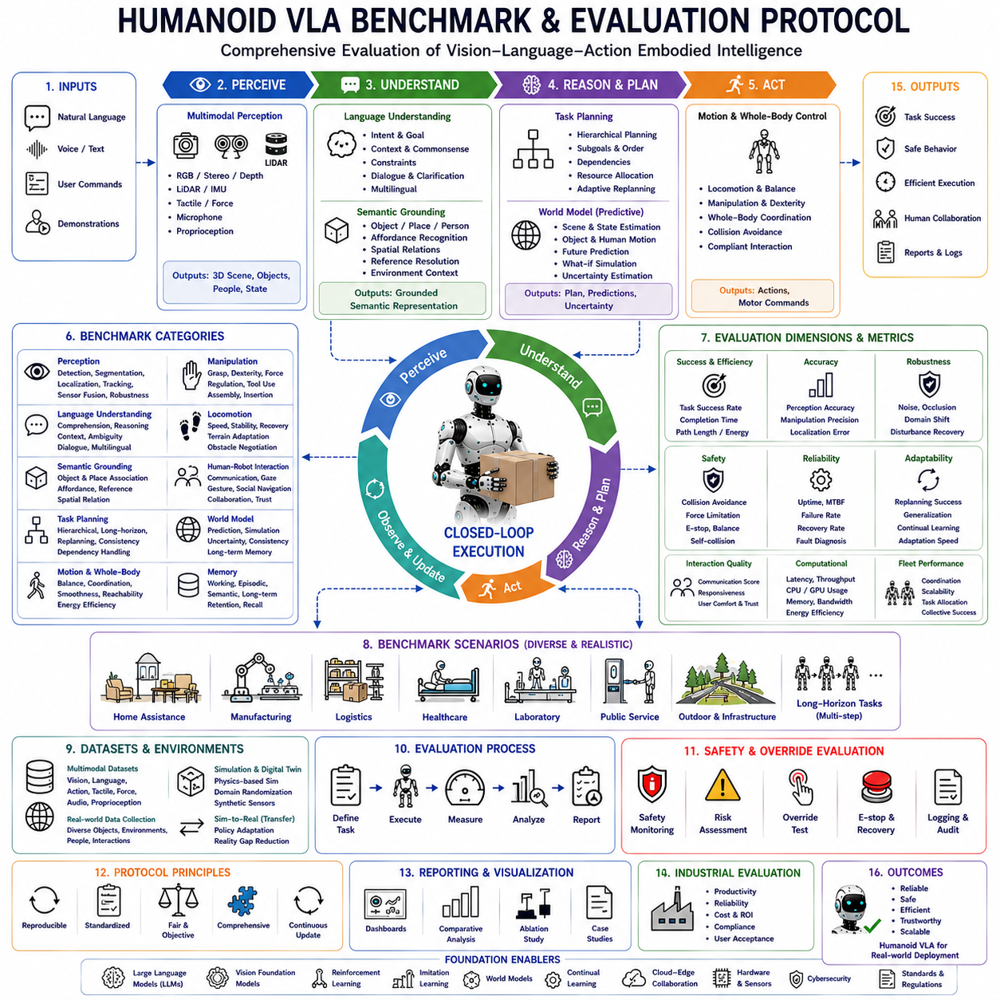{width="7.268055555555556in" height="7.268055555555556in"}

Humanoid Vision-Language-Action (VLA) Benchmark and Evaluation Protocol defines a comprehensive framework for measuring the intelligence, reliability, safety, robustness, and practical usefulness of humanoid robots operating in real-world environments. Unlike conventional robotic benchmarking, which often evaluates isolated capabilities such as navigation accuracy or manipulation precision, a VLA benchmark measures the complete embodied intelligence pipeline, including perception, language understanding, reasoning, planning, whole-body control, learning, human interaction, and long-horizon autonomous execution. Since humanoid robots are expected to function as general-purpose embodied agents, evaluation protocols must assess not only individual algorithms but also the integrated behavior emerging from the interaction of all cognitive and physical subsystems.

The primary objective of a humanoid VLA benchmark is to determine how effectively a robot converts natural language instructions into safe, efficient, and successful physical actions under diverse environmental conditions. Evaluation therefore extends beyond task completion by measuring the quality of perception, semantic reasoning, motion generation, decision making, environmental adaptation, recovery behavior, and collaboration with humans. A complete benchmark must represent realistic operational scenarios rather than carefully controlled laboratory experiments, ensuring that measured performance accurately reflects practical deployment capability.

The evaluation process begins with multimodal perception assessment. Humanoid robots continuously receive information from RGB cameras, stereo vision, depth sensors, LiDAR, inertial measurement units, force sensors, tactile arrays, microphones, joint encoders, and proprioceptive sensing. Benchmark protocols evaluate object detection accuracy, semantic segmentation quality, three-dimensional localization precision, human recognition performance, obstacle detection reliability, sensor fusion consistency, temporal synchronization, and environmental awareness. Robust perception under changing illumination, cluttered workspaces, dynamic obstacles, and partial occlusion forms a critical prerequisite for reliable embodied intelligence.

Language understanding constitutes another major evaluation category. Large Language Models must correctly interpret user intentions expressed through natural speech or written instructions rather than predefined command templates. Evaluation measures semantic comprehension, contextual reasoning, ambiguity resolution, temporal interpretation, spatial understanding, constraint extraction, procedural reasoning, multilingual capability, and dialogue consistency. Rather than testing isolated question-answer performance, benchmarks examine how effectively language understanding supports successful physical task execution.

Semantic grounding evaluates the robot\'s ability to connect linguistic concepts with observable physical entities. Instructions referencing objects, locations, people, tools, or spatial relationships must correspond accurately to real-world observations. Benchmark scenarios measure object association accuracy, affordance recognition, reference disambiguation, environmental context understanding, spatial relation interpretation, and grounding robustness under changing viewpoints. Effective semantic grounding represents the essential bridge between symbolic cognition and embodied behavior.

Task planning evaluation measures the capability to decompose high-level goals into executable sequences of actions. Benchmarks assess hierarchical planning quality, subgoal generation, dependency management, resource allocation, procedural consistency, adaptive replanning, and long-horizon reasoning. Complex tasks involving dozens of intermediate operations evaluate whether the robot maintains coherent execution strategies despite environmental uncertainty, changing objectives, or unexpected interruptions. Planning metrics therefore emphasize sustained cognitive consistency rather than isolated decision quality.

Motion planning and whole-body coordination receive dedicated evaluation because humanoid robots possess significantly greater kinematic complexity than conventional robotic manipulators. Performance metrics include locomotion stability, trajectory smoothness, manipulation precision, whole-body synchronization, balance maintenance, collision avoidance, reachability optimization, energy efficiency, and execution latency. Dynamic tasks involving simultaneous walking, carrying, manipulation, turning, and obstacle avoidance provide realistic assessments of integrated motor intelligence.

Manipulation benchmarking extends beyond grasp success alone. Evaluation considers grasp stability, dexterous finger coordination, force regulation, contact quality, object transport, assembly accuracy, insertion performance, tool usage, and bimanual coordination. Robots manipulate objects exhibiting diverse geometry, weight, compliance, surface friction, and articulation properties under varying environmental conditions. Such benchmarks determine whether learned manipulation policies generalize across previously unseen tasks rather than merely memorizing demonstration examples.

Locomotion evaluation examines mobility across diverse terrains and environmental conditions. Humanoid robots navigate flat surfaces, stairs, ramps, uneven ground, narrow corridors, cluttered workspaces, and dynamically changing environments while maintaining stability and operational efficiency. Performance metrics include walking speed, balance robustness, foot placement accuracy, obstacle negotiation, terrain adaptation, localization consistency, recovery capability following disturbances, and coordinated locomotion during simultaneous manipulation.

Human-Robot Interaction forms an increasingly important benchmark category because future humanoids will operate alongside people rather than within isolated industrial environments. Evaluation measures natural language communication, dialogue quality, gaze behavior, gesture interpretation, social navigation, collaborative task execution, interpersonal distance management, responsiveness, explanation capability, and user trust. Human participants assess subjective qualities including comfort, predictability, transparency, perceived intelligence, and overall collaborative experience.

World model evaluation measures predictive environmental reasoning rather than immediate perception alone. Benchmarks assess the consistency of internal environmental representations, prediction accuracy regarding object motion and human behavior, future scene estimation, simulation quality, uncertainty estimation, and long-term environmental memory. Robots demonstrating accurate predictive world models generally achieve superior planning performance and greater operational robustness within dynamic environments.

Memory evaluation distinguishes among working memory, episodic memory, and semantic memory. Working memory benchmarks measure retention of ongoing task context, dialogue history, and execution status. Episodic memory evaluates recall of previous experiences, successful recovery procedures, and historical environmental observations. Semantic memory assesses accumulated knowledge regarding object properties, operational procedures, organizational rules, and commonsense reasoning. Long-duration experiments examine whether memory improves future task performance without introducing catastrophic forgetting.

Learning evaluation focuses on continual adaptation rather than static capability. Reinforcement learning, imitation learning, self-supervised learning, transfer learning, and continual learning algorithms are assessed according to adaptation speed, sample efficiency, knowledge retention, policy generalization, robustness across environmental changes, and recovery from novel situations. Benchmarks emphasize the robot\'s ability to improve autonomously throughout extended operational deployment rather than maintaining fixed performance after initial training.

Simulation-to-Real evaluation measures how effectively policies learned within simulation transfer into physical robots. Benchmark protocols compare perception accuracy, manipulation success, locomotion stability, planning consistency, safety performance, and computational efficiency across simulated and real environments. Domain randomization, digital twins, synthetic sensor generation, and adaptive policy refinement collectively contribute to improved transfer quality. High Simulation-to-Real consistency significantly reduces development cost while accelerating deployment.

Safety benchmarking remains an independent evaluation dimension throughout the protocol. Collision avoidance, human detection, force limitation, emergency stopping, balance recovery, self-collision prevention, actuator protection, fault diagnosis, cybersecurity resilience, and override response time are evaluated under both normal operation and abnormal conditions. Safety metrics emphasize deterministic protective behavior even when language reasoning, perception, or planning experiences unexpected uncertainty. Comprehensive safety evaluation is essential for deployment within human-centered environments.

Computational performance directly influences real-time embodied intelligence. Benchmark protocols evaluate perception latency, reasoning speed, planning frequency, control update rate, GPU utilization, memory consumption, communication bandwidth, energy efficiency, thermal behavior, and overall computational scalability. Efficient computing architectures enable increasingly sophisticated cognitive reasoning while preserving responsive physical interaction within practical power constraints suitable for mobile humanoid platforms.

Fleet evaluation extends benchmarking from individual robots to distributed embodied intelligence systems. Multiple humanoids cooperate while sharing environmental knowledge, task assignments, learned policies, and operational experiences. Evaluation measures coordination efficiency, communication reliability, collaborative planning quality, distributed learning effectiveness, conflict resolution, workload balancing, and collective task performance. Fleet-level benchmarks increasingly reflect emerging industrial deployment scenarios involving coordinated robot teams.

Standardized benchmark datasets provide consistent evaluation across research organizations and industrial developers. Multimodal datasets combine synchronized language, vision, manipulation, locomotion, tactile sensing, force measurements, and environmental annotations collected from realistic operational scenarios. Standard protocols ensure reproducibility, objective comparison, and long-term measurement of technological progress while encouraging fair evaluation across different robotic architectures and learning methodologies.

Industrial evaluation extends laboratory benchmarks toward practical deployment criteria. Manufacturing, logistics, healthcare, laboratories, hospitality, public services, infrastructure maintenance, and domestic environments each introduce domain-specific operational requirements. Benchmarks therefore assess productivity, reliability, maintenance frequency, uptime, operational cost, safety compliance, user acceptance, scalability, and return on investment alongside conventional robotics performance metrics. Industrial evaluation bridges the gap between research demonstrations and commercially viable Physical AI systems.

Future Humanoid Vision-Language-Action Benchmark and Evaluation Protocols will increasingly incorporate multimodal foundation models, predictive world models, lifelong learning, distributed fleet intelligence, cloud-edge collaboration, digital twins, explainable artificial intelligence, adaptive safety monitoring, continual evaluation, and increasingly capable Large Language Models into unified assessment frameworks. Rather than measuring isolated robotic functions independently, future benchmarks will evaluate the complete embodied cognitive ecosystem operating across extended time horizons within realistic human environments. Such comprehensive evaluation protocols will become essential for guiding the development, certification, deployment, and continuous improvement of general-purpose humanoid Physical AI systems capable of reliable, trustworthy, and scalable real-world operation.
