**Volume 20. Vision Language Action (VLA) Models**

# Chapter 9. Generalist Robot Policies

## 9.1 Generalist Policies Across Tasks and Embodiments

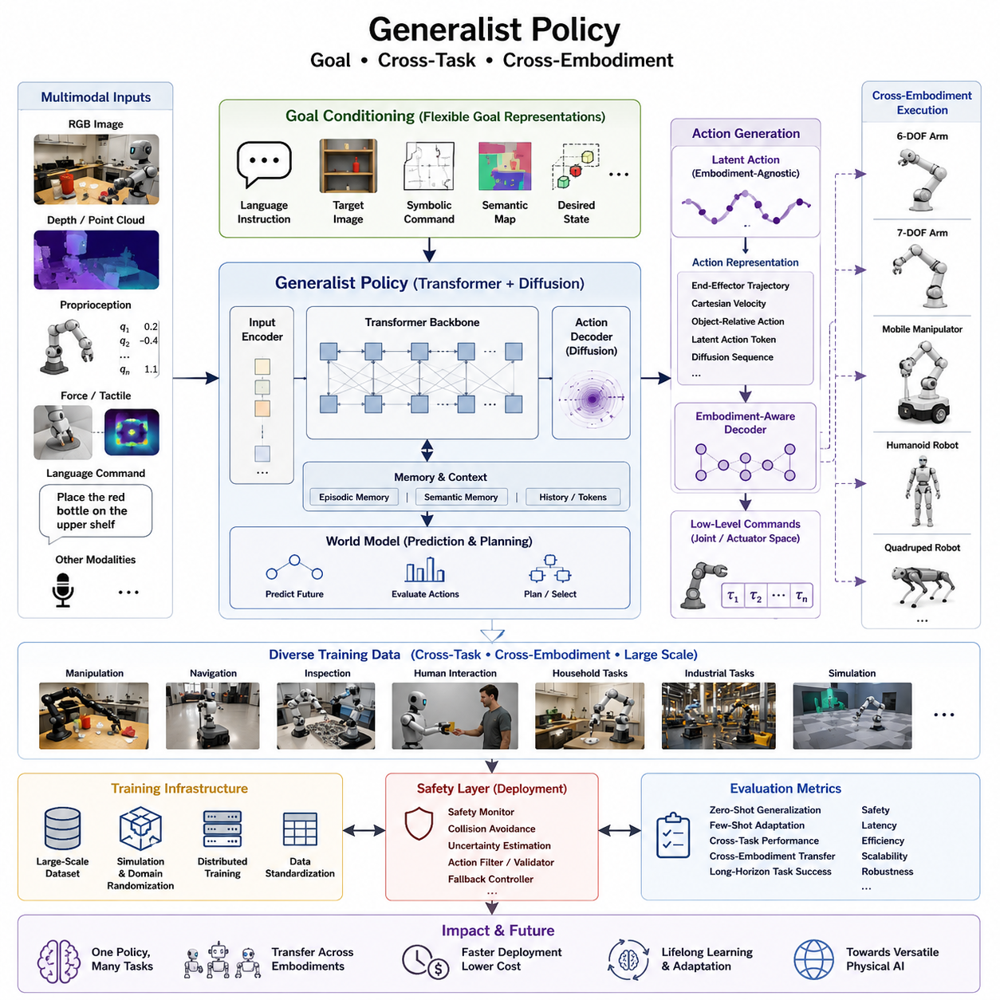{width="7.268055555555556in" height="7.268055555555556in"}

일반화 로봇 정책(Generalist Robot Policy)은 특정 작업만 수행하도록 설계된 제어기에서 벗어나, 하나의 정책(Policy)으로 다양한 작업과 환경을 수행할 수 있도록 하는 차세대 로봇 인공지능(Artificial Intelligence) 기술이다. 기존에는 작업(Task)이나 로봇 종류마다 별도의 제어기를 개발해야 했지만, 일반화 정책은 다양한 경험을 하나의 모델에 통합하여 여러 작업을 동시에 수행할 수 있도록 한다. 이는 자연어 처리(Natural Language Processing, NLP)와 컴퓨터 비전(Computer Vision)의 파운데이션 모델(Foundation Model) 개념을 로봇 분야에 적용한 것으로 볼 수 있다.

일반화 정책의 핵심 목표는 센서 입력과 목표(Goal)를 받아 로봇이 수행해야 할 행동(Action)을 직접 생성하는 것이다. 입력은 RGB 영상, 깊이 영상(Depth), 점군(Point Cloud), 관절 상태(Proprioception), 힘 센서(Force Sensor), 촉각(Tactile Sensor), 자연어(Language) 명령 등 다양한 형태를 포함한다. 이러한 멀티모달(Multimodal) 정보를 하나의 잠재 표현(Latent Representation)으로 변환하여 환경과 작업을 동시에 이해하고 행동을 생성한다.

이 잠재 표현은 단순한 영상 특징이 아니라 물체(Object), 공간 관계(Spatial Relationship), 작업 진행 상태(Task Progress), 환경(Context), 물리적 제약(Physical Constraints)까지 포함하는 고수준 의미 정보를 담는다. 따라서 모델은 단순히 관절을 움직이는 것이 아니라, 현재 상황에서 무엇을 해야 하는지를 이해한 후 적절한 행동을 선택할 수 있다.

일반화 정책의 가장 중요한 특징 중 하나는 목표 조건화(Goal Conditioning)이다. 작업 자체를 네트워크 내부에 고정하는 것이 아니라, 실행 시점에 목표를 입력으로 제공한다. 목표는 자연어 명령, 목표 이미지(Target Image), 기호(Symbolic Command), 의미 지도(Semantic Map), 원하는 최종 상태(Desired State) 등 다양한 방식으로 표현될 수 있다. 예를 들어 "빨간 병을 위쪽 선반에 올려놓아라"와 같은 자연어 명령과 목표 이미지를 함께 제공하면 정책은 두 정보를 모두 활용하여 행동을 생성한다.

교차 작업 일반화(Cross-task Generalization)는 하나의 정책이 별도의 재학습 없이 다양한 작업을 수행할 수 있는 능력을 의미한다. 기존 로봇은 집기(Grasping), 이동(Navigation), 장애물 회피(Obstacle Avoidance), 검사(Inspection) 등을 각각 독립적인 알고리즘으로 구현하였다. 반면 일반화 정책은 이러한 다양한 기능을 하나의 모델 안에서 통합적으로 학습한다.

이를 위해 학습 과정에서는 수백에서 수천 개의 작업(Task)을 포함하는 대규모 데이터셋(Dataset)을 사용한다. 모델은 단순히 개별 작업을 암기하는 것이 아니라 접근(Approach), 집기(Grasp), 회전(Rotate), 밀기(Push), 삽입(Insert), 운반(Transport)과 같은 재사용 가능한 행동 프리미티브(Primitive)를 학습한다. 이후 복잡한 작업은 이러한 기본 행동들의 조합으로 자연스럽게 생성된다.

작업 다양성(Task Diversity)은 일반화 성능을 결정하는 중요한 요소이다. 데이터에는 다양한 물체 형상(Object Geometry), 조명(Lighting), 배경(Background), 센서 잡음(Sensor Noise), 카메라 시점(Viewpoint), 작업 공간(Workspace), 작업 순서(Task Sequence)가 포함된다. 이러한 다양한 경험을 통해 모델은 특정 환경에 의존하지 않는 본질적인 작업 개념을 학습하게 되며, 새로운 환경에서도 높은 성능을 유지할 수 있다.

교차 구현체 학습(Cross-embodiment Learning)은 일반화를 작업 수준에서 로봇 구조 자체로 확장하는 개념이다. 로봇마다 관절 수(Degree of Freedom), 작업 공간(Workspace), 적재 능력(Payload), 이동 방식(Locomotion), 센서 구성(Sensor Configuration), 운동학(Kinematics)이 모두 다르다. 기존에는 이러한 차이 때문에 로봇마다 별도의 정책을 개발해야 했지만, 일반화 정책은 공통적인 지능을 공유하면서 로봇별 행동만 다르게 생성할 수 있도록 설계된다.

이를 위해 정책은 먼저 로봇과 무관한 고수준 행동 의도를 생성한 뒤, 마지막 단계에서 구현체 인식 디코더(Embodiment-aware Decoder)를 이용하여 해당 로봇의 관절 명령으로 변환한다. 구현체 정보에는 기구학 구조(Kinematic Chain), 관절 제한(Joint Limits), 액추에이터 특성(Actuator Characteristics), 말단 장치(End-effector), 센서 위치 등이 포함된다.

교차 구현체 전이(Cross-embodiment Transfer)는 새로운 로봇을 개발할 때 필요한 학습 데이터를 크게 줄여준다. 이미 학습된 일반화 정책은 물체 인식(Object Recognition), 안정적인 파지(Stable Grasp), 장애물 회피(Obstacle Avoidance), 작업 순서(Task Sequencing) 등의 기본 지식을 가지고 있기 때문에, 새로운 로봇에서는 적은 양의 데이터만으로 해당 하드웨어 특성에 맞게 미세조정(Fine-tuning)하면 된다.

그러나 구현체마다 행동 공간(Action Space)이 서로 다르다는 문제도 존재한다. 어떤 로봇은 6축 매니퓰레이터(Manipulator)이고, 다른 로봇은 7축이며, 휴머노이드(Humanoid)는 수십 개의 관절을 동시에 제어해야 한다. 이동형 매니퓰레이터(Mobile Manipulator)는 이동과 조작을 함께 수행하고, 사족보행 로봇(Quadruped)은 균형(Balance)과 이동을 동시에 고려해야 한다. 따라서 일반화 정책은 직접 관절 명령을 생성하기보다 작업 공간(Tool Space)이나 잠재 행동 토큰(Latent Action Token)을 이용하는 경우가 많다.

대규모 로봇 데이터셋(Large-scale Robot Dataset)은 일반화 정책의 핵심 자산이다. 데이터는 연구소, 공장, 가정, 창고, 원격 조작(Teleoperation), 시뮬레이션(Simulation) 등 다양한 환경에서 수집된다. 서로 다른 제조사의 로봇과 센서를 사용하더라도 데이터 표준화(Standardization)를 통해 공통 표현으로 변환하여 하나의 모델에서 함께 학습할 수 있도록 구성한다.

시뮬레이션은 현실 데이터를 보완하는 중요한 역할을 수행한다. 물리 엔진(Physics Engine)을 이용하여 수십억 개 이상의 데이터를 생성할 수 있으며, 도메인 랜덤화(Domain Randomization)를 통해 조명, 질감(Texture), 마찰 계수(Friction), 물체 질량(Mass), 카메라 보정(Camera Calibration), 센서 지연(Latency) 등을 지속적으로 변경한다. 이러한 학습은 모델이 특정 환경에 과적합(Overfitting)되는 것을 방지하며, Sim2Real(Simulation to Reality) 기술을 통해 실제 로봇으로 자연스럽게 이전할 수 있다.

현대의 일반화 정책은 대부분 트랜스포머(Transformer) 구조를 기반으로 한다. 자기 주의(Self-attention) 메커니즘을 이용하여 영상, 언어, 관절 상태(Proprioception), 이전 행동(Action History), 메모리(Memory)를 동시에 처리하며, 장시간에 걸친 작업(Task Sequence)을 이해할 수 있다. 이러한 구조는 복잡한 장기 작업(Long-horizon Task)에서도 안정적인 성능을 제공한다.

최근에는 확산 정책(Diffusion Policy)이 일반화 정책의 핵심 기술로 주목받고 있다. 확산 모델(Diffusion Model)은 하나의 정답 행동만 생성하는 것이 아니라 여러 가능한 행동 후보를 점진적으로 생성하고 개선한다. 따라서 부드럽고 자연스러운 움직임을 생성할 수 있으며, 불확실성이 높은 환경에서도 더욱 안정적인 성능을 보인다.

메모리(Memory) 시스템 역시 중요한 구성 요소이다. 긴 작업에서는 이전에 관찰한 물체 위치나 완료된 하위 작업(Subtask), 과거 실패 사례를 기억해야 한다. 에피소드 메모리(Episodic Memory)는 작업 중 발생한 경험을 저장하며, 의미 메모리(Semantic Memory)는 여러 작업에서 공통적으로 사용할 수 있는 지식을 유지한다. 이를 통해 계획(Planning)의 효율성과 장기 작업 수행 능력이 크게 향상된다.

최근 일반화 정책은 월드 모델(World Model)과 결합되는 방향으로 발전하고 있다. 로봇은 행동을 수행하기 전에 미래 환경을 예측하고 여러 행동의 결과를 내부적으로 시뮬레이션한다. 이러한 예측 기반 계획(Predictive Planning)은 충돌 가능성을 줄이고 작업 성공률을 높이며, 동적인 환경에서도 보다 안정적인 의사결정을 가능하게 한다.

안전성(Safety)은 실제 산업 현장에서 반드시 고려해야 하는 요소이다. 일반화 정책은 매우 다양한 작업을 수행하기 때문에 예상하지 못한 상황에서 오류가 발생할 가능성이 존재한다. 따라서 실제 시스템에서는 안전 감시기(Safety Monitor), 규칙 기반 검증기(Rule-based Validator), 충돌 방지(Collision Avoidance), 불확실성 추정(Uncertainty Estimation), 행동 필터(Action Filter), 기존 제어기(Classical Controller)로의 전환(Fallback) 등을 함께 적용하여 안전성을 확보한다.

일반화 정책의 성능 평가는 단순한 성공률(Success Rate)만으로는 충분하지 않다. 제로샷 일반화(Zero-shot Generalization), 소량 학습(Few-shot Learning), 구현체 전이 효율(Embodiment Transfer Efficiency), 장기 작업(Long-horizon Task), 안전성(Safety), 추론 지연(Inference Latency), 계산 효율(Computational Efficiency), 확장성(Scalability) 등을 종합적으로 평가해야 한다. 이러한 지표는 모델이 단순 암기가 아니라 실제 일반화 능력을 갖추었는지를 판단하는 기준이 된다.

산업 현장에서는 일반화 정책이 로봇 개발 방식을 크게 변화시킬 것으로 예상된다. 제조사는 작업별 프로그램 대신 범용 파운데이션 정책(Foundation Policy)을 제공하고, 시스템 통합업체(System Integrator)는 소량의 고객 데이터를 이용하여 이를 현장에 맞게 미세조정할 수 있다. 이를 통해 개발 비용과 구축 기간을 크게 줄일 수 있으며, 서로 다른 로봇 플랫폼도 동일한 지능을 공유하는 통합 시스템으로 운영할 수 있다.

궁극적으로 일반화 로봇 정책은 더욱 다양한 데이터와 구현체를 학습하고, 월드 모델(World Model), 지속 학습(Continual Learning), 멀티모달 추론(Multimodal Reasoning), 인간-로봇 협업(Human-Robot Collaboration)을 통합하는 방향으로 발전할 것이다. 이러한 기술은 특정 작업만 수행하는 로봇을 넘어, 새로운 환경과 새로운 임무를 스스로 이해하고 적응하는 차세대 물리 AI(Physical AI)의 핵심 기반 기술로 자리 잡을 것으로 전망된다.

## 9.2 Open X-Embodiment Dataset (with Code)

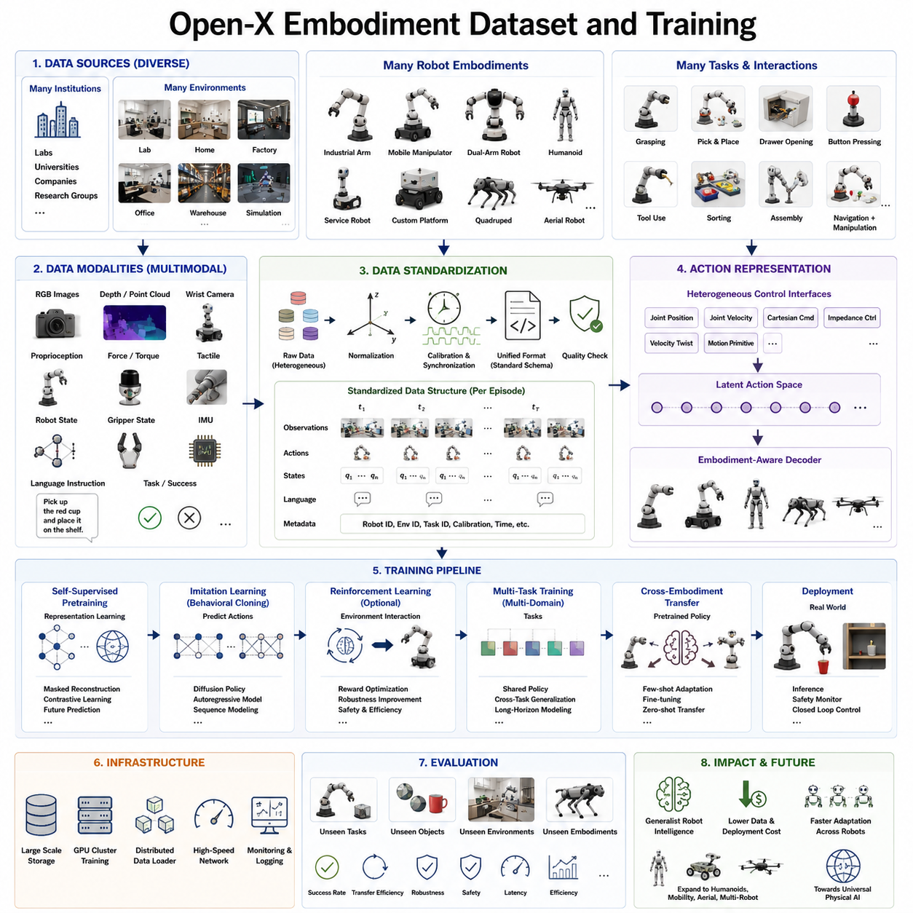{width="7.268055555555556in" height="7.268055555555556in"}

**42_09_02 Open-X 구현체 데이터셋(Open-X Embodiment Dataset)과 학습(Training)**

Open-X 구현체 데이터셋(Open-X Embodiment Dataset)은 범용 로봇 지능(Generalist Robot Intelligence)을 구현하기 위한 대표적인 대규모 공개 데이터셋이다. 하나의 연구실이나 특정 로봇만을 대상으로 하지 않고, 다양한 연구기관과 여러 종류의 로봇에서 수집한 데이터를 하나의 통합 데이터셋으로 구성한다. 목표는 작업(Task), 환경(Environment), 로봇 구조(Embodiment)가 달라도 공통적으로 활용할 수 있는 일반화 정책(Generalist Policy)을 학습하는 것이다. 이는 대규모 언어 모델(Large Language Model, LLM)과 비전 파운데이션 모델(Vision Foundation Model)의 성공적인 확장(Scaling) 전략을 로봇 분야에 적용한 사례라 할 수 있다.

기존의 로봇 학습 데이터셋은 특정 매니퓰레이터(Manipulator), 제한된 작업 공간(Workspace), 일부 조작 작업(Manipulation Task)에만 초점을 맞추는 경우가 많았다. 이러한 데이터셋은 특정 연구에는 충분했지만 새로운 환경이나 다른 로봇에서는 일반화 성능이 크게 떨어졌다. Open-X는 여러 로봇과 다양한 환경에서 수집한 데이터를 하나로 통합함으로써 이러한 한계를 극복하고자 한다. 이를 통해 모델은 훨씬 넓은 범위의 환경과 상황을 경험하며 보다 강건한 일반화 능력을 학습한다.

Open-X의 가장 큰 특징 가운데 하나는 구현체 다양성(Embodiment Diversity)이다. 데이터는 산업용 로봇, 이동형 매니퓰레이터(Mobile Manipulator), 양팔 로봇(Dual-arm Robot), 휴머노이드(Humanoid), 서비스 로봇(Service Robot), 연구용 플랫폼 등 매우 다양한 기계 구조에서 수집된다. 각각의 로봇은 자유도(Degree of Freedom), 액추에이터(Actuator), 작업 공간, 말단 장치(End-effector), 센서 구성 등이 모두 다르지만, Open-X는 이러한 차이를 문제로 보지 않고 지식을 공유할 수 있는 중요한 학습 자산으로 활용한다.

작업 다양성(Task Diversity) 역시 핵심 요소이다. 데이터에는 파지(Grasping), 피킹 앤 플레이스(Pick-and-Place), 서랍 열기(Drawer Opening), 캐비닛 조작(Cabinet Manipulation), 버튼 누르기(Button Pressing), 물체 분류(Object Sorting), 공구 사용(Tool Usage), 정리 작업(Organization), 주방 보조(Kitchen Assistance), 조립(Assembly), 이동 기반 조작(Navigation-assisted Manipulation), 물체 이동(Object Relocation) 등 매우 다양한 작업이 포함된다. 동일한 목표를 여러 가지 방법으로 수행한 사례도 함께 포함되어 있어 하나의 작업에 여러 해결 방법이 존재한다는 사실까지 학습할 수 있다.

환경 다양성(Environmental Diversity)은 일반화 성능을 크게 향상시킨다. 데이터는 서로 다른 조명(Lighting), 카메라 시점(Viewpoint), 배경(Texture), 물체 배치(Object Arrangement), 작업 공간 구조(Workspace Geometry), 센서 잡음(Sensor Noise) 환경에서 수집된다. 연구실뿐 아니라 실제 가정(Home), 공장(Factory), 사무실(Office), 시뮬레이션(Simulation) 환경까지 포함되므로 모델은 특정 환경에 과도하게 의존하지 않고 보다 본질적인 작업 개념을 학습하게 된다.

센서 다양성(Sensor Diversity) 또한 매우 중요하다. 데이터에는 RGB 영상, 스테레오 카메라(Stereo Vision), 깊이 카메라(Depth Camera), 점군(Point Cloud), 손목 카메라(Wrist Camera), 힘 센서(Force Sensor), 촉각 센서(Tactile Sensor), 관절 상태(Proprioception), 말단 위치(End-effector Pose), 그리퍼 상태(Gripper Status), 관성 센서(IMU), 자연어(Language) 설명 등이 함께 포함된다. 모든 로봇이 동일한 센서를 사용하지 않기 때문에 모델은 일부 정보가 부족한 상황에서도 안정적으로 동작할 수 있는 멀티모달 융합(Multimodal Fusion) 능력을 갖추게 된다.

최근 Open-X에서는 언어(Language) 정보의 중요성이 더욱 커지고 있다. 많은 시연(Demonstration)에는 자연어 설명이 함께 제공되며, 작업 목표(Task Goal), 물체 이름(Object Identity), 공간 관계(Spatial Relationship), 원하는 결과(Desired Outcome), 작업 제약조건(Interaction Constraint) 등을 기술한다. 따라서 모델은 단순히 행동을 모방하는 것이 아니라 영상과 언어, 그리고 행동(Action)을 함께 연결하여 이해하는 멀티모달 학습(Multimodal Learning)을 수행하게 된다.

데이터 표준화(Data Standardization)는 Open-X에서 가장 어려운 기술적 과제 가운데 하나이다. 연구기관마다 좌표계(Coordinate System), 카메라 보정(Camera Calibration), 시간 정보(Timestamp), 제어 주기(Control Frequency), 관절 이름(Joint Naming), 행동 표현(Action Representation)이 모두 다르기 때문이다. Open-X는 이러한 데이터를 공통 형식(Common Format)으로 변환하여 관측(Observation), 행동(Action), 로봇 구성(Configuration), 보정 정보(Calibration), 작업 설명(Task Description), 시간 정보(Timestamp), 에피소드(Episode)를 동일한 구조로 관리한다.

행동 표현(Action Representation)은 특히 중요한 연구 분야이다. 어떤 로봇은 관절 위치(Joint Position)를 사용하고, 다른 로봇은 관절 속도(Joint Velocity), 말단 위치(Cartesian Command), 임피던스 제어(Impedance Control), 속도 명령(Velocity Twist), 고수준 행동 프리미티브(Motion Primitive)를 사용한다. Open-X는 이러한 차이를 흡수하기 위해 잠재 행동 공간(Latent Action Space)을 학습하며, 실제 실행 시에는 구현체 인식 디코더(Embodiment-aware Decoder)가 각 로봇에 맞는 명령으로 변환한다.

데이터의 시간적 일관성(Temporal Consistency)도 매우 중요하다. 하나의 시연은 관측, 행동, 성공 여부(Success Indicator), 상태 변화(State Transition)가 시간 순서대로 정확하게 저장된다. 카메라, 힘 센서, 관절 상태, 언어 정보까지 모두 동일한 시간축으로 동기화(Synchronization)되며, 이러한 정확한 시간 정렬은 트랜스포머(Transformer)가 긴 작업(Long-horizon Task)을 학습하는 데 매우 중요한 역할을 한다.

데이터 품질(Data Quality)은 정책 성능을 직접 결정한다. Open-X는 센서 보정(Sensor Calibration), 시간 동기화(Time Synchronization), 궤적 완전성(Trajectory Completeness), 주석 정확도(Annotation Reliability)를 철저히 검증한다. 손상된 데이터나 좌표계 오류, 불가능한 행동이 포함된 시연은 제거하거나 수정한 후 데이터셋에 포함한다. 이러한 고품질 데이터는 학습 안정성과 최종 정책의 강건성(Robustness)을 크게 향상시킨다.

Open-X의 학습은 대규모 분산 학습(Distributed Training)을 기반으로 수행된다. 수백만 개의 시연과 수십억 개의 센서 데이터를 학습하기 위해 GPU 클러스터(GPU Cluster), 분산 데이터 로딩(Distributed Data Loading), 그래디언트 동기화(Gradient Synchronization), 혼합 정밀도 연산(Mixed Precision), 체크포인트(Checkpoint), 고성능 저장장치(Storage Infrastructure) 등이 함께 사용된다. 로봇 데이터는 영상뿐 아니라 연속적인 센서 정보까지 포함하기 때문에 저장 시스템의 성능 역시 매우 중요하다.

자기지도학습(Self-supervised Learning)은 Open-X의 활용 가치를 더욱 높여준다. 사람이 직접 라벨(Label)을 붙이지 않은 데이터도 시간적 일관성(Temporal Consistency), 마스킹 복원(Masked Reconstruction), 대조학습(Contrastive Learning), 미래 상태 예측(Future State Prediction) 등을 이용하여 의미 있는 표현을 학습할 수 있다. 이후 지도학습(Supervised Learning)과 결합하면 일반화 성능이 크게 향상된다.

모방학습(Imitation Learning)은 현재 Open-X에서 가장 널리 사용되는 학습 방식이다. 모델은 전문가의 행동을 그대로 예측하며 다양한 작업을 동시에 학습한다. 최근에는 행동 복제(Behavior Cloning)뿐 아니라 확산 정책(Diffusion Policy), 자기회귀 행동 생성(Autoregressive Action Generation), 시퀀스 모델링(Sequence Modeling), 잠재 행동 예측(Latent Action Prediction) 등 다양한 최신 기술이 함께 활용되고 있다.

모방학습 이후에는 강화학습(Reinforcement Learning)을 이용하여 정책을 더욱 발전시킬 수 있다. 이미 Open-X를 통해 일반적인 조작 능력을 학습한 정책은 실제 환경에서 추가적인 상호작용만으로 성능을 빠르게 향상시킬 수 있다. 따라서 처음부터 강화학습만 수행하는 것보다 훨씬 적은 데이터와 짧은 학습 시간으로 높은 성능을 달성할 수 있다.

시뮬레이션(Simulation)은 실제 데이터를 보완하는 중요한 수단이다. 물리 엔진(Physics Engine)을 이용하여 위험하거나 현실에서 재현하기 어려운 상황까지 자유롭게 생성할 수 있으며, 도메인 랜덤화(Domain Randomization)를 통해 조명, 질감(Texture), 질량(Mass), 마찰(Friction), 카메라 특성(Camera Parameters), 액추에이터 지연(Actuator Delay), 환경 구조(Environment Layout)를 지속적으로 변경한다. 이를 통해 실제 환경에서도 높은 적응력을 확보할 수 있다.

교차 구현체 전이(Cross-Embodiment Transfer)는 Open-X의 핵심 연구 목표 가운데 하나이다. 다양한 로봇에서 학습한 정책은 새로운 로봇에서도 적은 양의 추가 데이터만으로 빠르게 적응할 수 있다. 따라서 새로운 플랫폼을 개발할 때마다 막대한 데이터를 다시 수집할 필요가 없으며, 산업 현장에서의 구축 비용과 개발 기간을 크게 줄일 수 있다.

Open-X의 성능 평가는 단순한 성공률(Success Rate)만으로 이루어지지 않는다. 새로운 작업(Unseen Task), 새로운 물체(Unseen Object), 새로운 환경(Unseen Environment), 새로운 로봇(Unseen Robot)에서 얼마나 빠르게 적응하는지를 함께 평가한다. 또한 구현체 전이 효율(Embodiment Transfer Efficiency), 장기 작업(Long-horizon Task), 언어 이해(Language Understanding), 추론 속도(Inference Latency), 계산 효율(Computational Efficiency) 등 다양한 지표를 종합적으로 분석한다.

Open-X는 공개 데이터(Open Dataset), 공통 평가 기준(Standard Benchmark), 표준 학습 절차(Standardized Training Methodology)를 제공함으로써 재현 가능한 로봇 연구(Reproducible Robotics Research)를 촉진한다. 서로 다른 연구기관도 동일한 기준에서 알고리즘을 비교할 수 있으며, 중복 개발을 줄이고 공동 연구를 활성화하는 기반이 된다.

산업 현장에서도 Open-X 기반의 파운데이션 정책(Foundation Policy)은 큰 변화를 가져올 것으로 기대된다. 제조(Manufacturing), 물류(Logistics), 창고(Warehouse), 서비스(Service), 농업(Agriculture), 의료(Healthcare), 인프라 검사(Infrastructure Inspection) 등 다양한 분야에서 미리 학습된 일반화 정책을 활용하고, 고객 환경에 맞는 소량의 데이터만으로 빠르게 미세조정(Fine-tuning)하여 적용할 수 있게 된다.

향후 Open-X는 조작(Manipulation)을 넘어 휴머노이드(Humanoid), 이동 로봇(Mobile Robot), 드론(UAV), 사족보행 로봇(Quadruped), 다중 로봇 협업(Multi-Robot Collaboration), 자율주행(Autonomous Driving)까지 포함하는 초대형 멀티모달 데이터셋으로 발전할 전망이다. 영상(Video), 언어(Language), 촉각(Tactile), 힘 센서(Force Sensing), 월드 모델(World Model), 장기 계획(Long-horizon Planning)까지 통합한 차세대 학습 플랫폼으로 성장하며, 범용 물리 AI(Physical AI)를 구현하는 핵심 기반 기술이 될 것으로 기대된다.

## 9.3 Cross-Embodiment Policy Transfer (with Code)

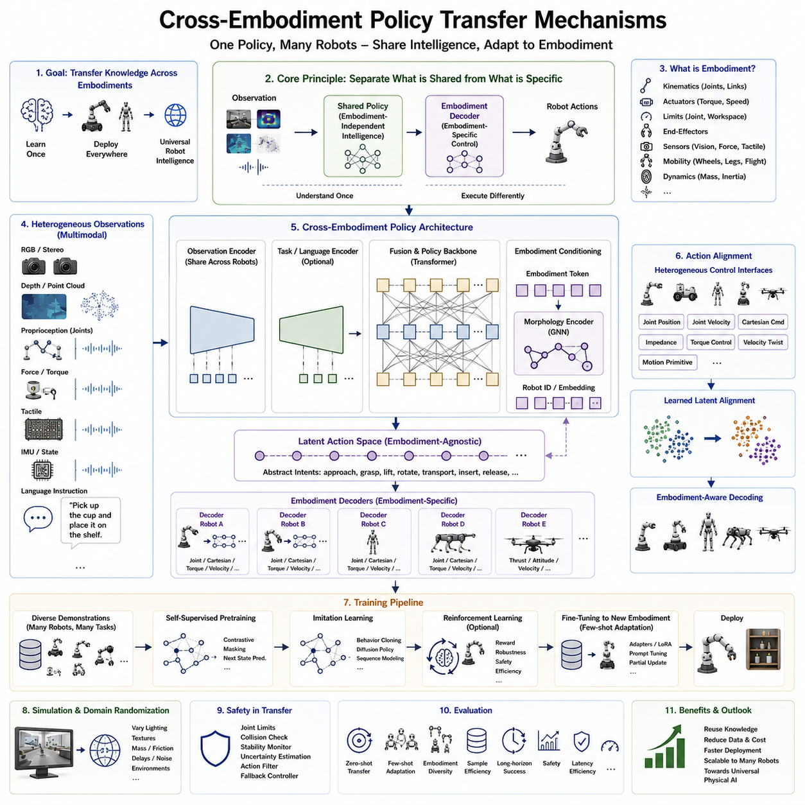{width="7.268055555555556in" height="7.268055555555556in"}

**42_09_03 교차 구현체 정책 전이 메커니즘(Cross-Embodiment Policy Transfer Mechanisms)**

교차 구현체 정책 전이(Cross-Embodiment Policy Transfer)는 현대 로봇 학습(Robot Learning)에서 가장 중요한 연구 분야 가운데 하나이다. 하나의 로봇에서 학습한 정책(Policy)을 서로 다른 기계 구조를 가진 다양한 로봇에서도 활용할 수 있도록 하는 기술이다. 새로운 로봇이 개발될 때마다 처음부터 제어기를 다시 학습하는 대신, 기존에 학습한 지식을 재활용함으로써 데이터 수집 비용과 개발 기간을 크게 줄일 수 있다. 이는 대규모 언어 모델(Large Language Model, LLM)이 하나의 지식을 다양한 응용 분야에 활용하는 방식과 매우 유사한 개념이다.

기존의 로봇 제어기는 특정 하드웨어(Hardware)에 강하게 의존하였다. 관절 궤적(Joint Trajectory), 제어 이득(Control Gain), 액추에이터(Actuator), 운동학(Kinematics), 센서 구성(Sensor Configuration) 등이 모두 특정 로봇에 맞게 설계되었기 때문에 작은 기구 변경만 발생해도 제어기를 다시 설계하거나 대규모 재학습이 필요했다. 예를 들어 6축 산업용 로봇(Industrial Manipulator)의 관절 명령은 7축 협동로봇(Collaborative Robot)이나 사족보행 로봇(Quadruped)에 그대로 적용할 수 없다.

교차 구현체 전이는 이러한 문제를 해결하기 위해 구현체와 독립적인 지능(Embodiment-independent Intelligence)과 구현체 전용 제어(Embodiment-specific Control)를 분리한다. 정책은 먼저 작업 목표(Task Goal), 물체와의 상호작용(Object Interaction), 공간 관계(Spatial Relationship), 환경 제약(Environment Constraint) 등을 이해하고, 마지막 단계에서만 해당 로봇의 하드웨어 특성에 맞는 제어 명령으로 변환한다. 즉, 사고(Reasoning)는 공유하고 실행(Execution)만 로봇마다 다르게 수행하는 구조이다.

여기서 구현체(Embodiment)는 로봇을 구성하는 모든 물리적 특성을 의미한다. 운동학 구조(Kinematic Structure), 자유도(Degree of Freedom), 링크 길이(Link Length), 관절 제한(Joint Limit), 액추에이터 특성(Actuator Property), 적재 능력(Payload), 작업 공간(Workspace), 이동 방식(Mobility Mechanism), 말단 장치(End-effector), 센서 위치(Sensor Placement), 카메라 시점(Camera Viewpoint), 힘 센서(Force Sensor), 동역학(Dynamics) 등이 모두 구현체의 일부이다. 동일한 작업이라도 이러한 요소가 달라지면 실제 움직임은 크게 달라질 수 있다.

교차 구현체 전이의 핵심은 의미(Semantics)는 그대로 유지하고 운동 실행(Motor Execution)만 변경하는 것이다. 예를 들어 컵을 잡는다는 개념은 휴머노이드(Humanoid), 산업용 로봇, 이동형 서비스 로봇 모두 동일하다. 물체를 인식하고 위치를 판단하며 파지 계획(Grasp Planning)을 세우는 과정은 공통적으로 활용되지만, 실제 관절 움직임(Joint Motion)은 로봇마다 다르게 생성된다.

이를 가능하게 하는 대표적인 기술이 잠재 행동 공간(Latent Action Space)이다. 정책은 처음부터 관절 명령을 생성하지 않고 접근(Approach), 접촉(Contact), 들어 올리기(Lift), 회전(Rotate), 운반(Transport), 삽입(Insert), 놓기(Release)와 같은 추상적인 행동을 먼저 생성한다. 이후 구현체 디코더(Embodiment Decoder)가 이러한 행동을 각 로봇의 관절 궤적(Joint Trajectory)으로 변환한다. 따라서 대부분의 정책은 여러 로봇이 공유하고, 마지막 출력 계층만 로봇별로 달라진다.

최근에는 구현체 토큰(Embodiment Token)도 중요한 기술로 사용되고 있다. 각 로봇의 물리적 특성을 하나의 임베딩 벡터(Embedding Vector)로 표현하여 트랜스포머(Transformer)의 입력으로 함께 사용한다. 이 토큰에는 관절 구조(Joint Topology), 이동 방식(Mobility Type), 액추에이터 특성, 작업 공간, 센서 구성 등이 포함되며, 하나의 신경망(Neural Network)이 로봇에 따라 서로 다른 행동을 생성할 수 있도록 만든다.

형태 인식 인코더(Morphology-aware Encoder)는 구현체 정보를 더욱 효과적으로 활용하는 방법이다. 로봇의 운동학 트리(Kinematic Tree), 링크 연결(Link Connectivity), 액추에이터 구조를 그래프(Graph) 형태로 입력하여 그래프 신경망(Graph Neural Network, GNN)이나 트랜스포머와 함께 학습한다. 이를 통해 모델은 환경뿐 아니라 자신의 기계 구조까지 동시에 이해하면서 보다 효율적인 행동을 생성할 수 있다.

관측 정렬(Observation Alignment)도 중요한 요소이다. 로봇마다 카메라 위치(Camera Position), 화각(Field of View), 해상도(Resolution), 깊이 센서(Depth Sensor), 촉각 센서(Tactile Sensor), 힘 센서, 관절 센서(Proprioception)가 모두 다르다. 교차 구현체 정책은 이러한 차이를 흡수하기 위해 센서별 특징이 아니라 공통적인 의미 정보(Semantic Representation)를 추출하는 인코더를 학습한다. 자기지도학습(Self-supervised Learning)과 멀티모달 융합(Multimodal Fusion)이 이러한 과정에서 중요한 역할을 수행한다.

행동 정렬(Action Alignment)은 더욱 어려운 문제이다. 어떤 로봇은 관절 위치(Joint Position)를 사용하고, 다른 로봇은 관절 속도(Joint Velocity), 말단 위치(Cartesian Command), 임피던스 제어(Impedance Control), 토크 제어(Torque Control)를 사용한다. 이러한 차이를 직접 맞추기보다 공통적인 잠재 행동 표현(Latent Action Representation)을 먼저 학습하고, 각 로봇의 제어 방식에 맞게 변환하는 방법이 일반적으로 사용된다.

시연 다양성(Demonstration Diversity)은 전이 성능을 크게 향상시킨다. 동일한 작업을 서로 다른 로봇들이 다양한 방식으로 수행한 데이터를 함께 학습하면 정책은 특정 움직임보다 작업의 본질적인 의미를 학습하게 된다. Open-X 구현체(Open-X Embodiment)와 같은 대규모 데이터셋은 이러한 다양한 시연을 제공하여 구현체 전이 성능을 크게 향상시키고 있다.

다중 작업 학습(Multi-task Learning)은 교차 구현체 전이와 매우 잘 결합된다. 조작(Manipulation), 이동(Navigation), 검사(Inspection), 조립(Assembly), 공구 사용(Tool Use), 물체 정리(Object Organization) 등을 동시에 학습하면 공통적인 특징 표현이 더욱 강건해진다. 이러한 표현은 특정 동작보다 물리적 상호작용의 본질을 학습하기 때문에 새로운 로봇으로도 쉽게 전이될 수 있다.

최근에는 파운데이션 정책(Foundation Policy) 사전학습(Pretraining)이 구현체 전이의 핵심 방법으로 자리 잡고 있다. 수많은 로봇과 다양한 환경에서 수집한 대규모 데이터셋을 이용하여 트랜스포머 기반 모델을 먼저 학습한다. 이 과정에서 모델은 물체 인식(Object Recognition), 언어 이해(Language Grounding), 시간적 추론(Temporal Reasoning), 조작 전략(Manipulation Strategy)을 습득하고, 새로운 로봇에서는 구현체 적응만 수행하면 된다.

미세조정(Fine-tuning) 방법도 다양하다. 전체 모델을 다시 학습하는 Full Fine-tuning은 높은 성능을 제공하지만 계산량이 크다. 최근에는 어댑터(Adapter), 저랭크 적응(Low-Rank Adaptation, LoRA), 프롬프트 튜닝(Prompt Tuning)과 같이 일부 파라미터만 수정하는 방식이 널리 사용된다. 이러한 방법은 기존 지식을 유지하면서 새로운 구현체에 빠르게 적응할 수 있다.

시뮬레이션(Simulation)은 교차 구현체 연구에서 매우 중요한 역할을 수행한다. 물리 엔진(Physics Engine)을 이용하면 다양한 크기와 구조를 가진 매니퓰레이터, 이동 로봇, 휴머노이드, 사족보행 로봇, 드론(UAV)을 손쉽게 생성할 수 있다. 수천 개의 서로 다른 구현체를 시뮬레이션에서 학습한 정책은 실제 로봇에서도 높은 일반화 성능을 보이는 경우가 많다.

도메인 랜덤화(Domain Randomization)는 구현체 전이의 강건성을 더욱 향상시킨다. 조명(Lighting), 질감(Texture), 물체 질량(Mass), 마찰(Friction), 액추에이터 지연(Actuator Delay), 카메라 보정(Camera Calibration), 센서 잡음(Sensor Noise), 환경 구조(Environment Layout)를 지속적으로 변경하여 학습함으로써 모델이 특정 환경에 과적합되지 않도록 한다.

최근에는 월드 모델(World Model)도 구현체 전이에 활용되고 있다. 월드 모델은 행동을 수행하기 전에 미래 환경을 예측하고 결과를 시뮬레이션한다. 환경의 물리 법칙은 로봇 구조와 무관하기 때문에 하나의 월드 모델을 다양한 구현체에서 공유할 수 있으며, 실제 행동 생성만 구현체 디코더가 담당하게 된다.

안전성(Safety)은 구현체 전이에서 반드시 고려해야 하는 요소이다. 한 로봇에서는 안전했던 행동이 다른 로봇에서는 위험할 수 있기 때문이다. 따라서 관절 제한(Joint Limit), 충돌 영역(Collision Boundary), 액추에이터 포화(Actuator Saturation), 적재 한계(Payload Limit), 안정성(Stability)을 지속적으로 검사하며, 행동 필터(Action Filter), 불확실성 추정(Uncertainty Estimation), 충돌 예측(Collision Prediction), 폴백 제어기(Fallback Controller)를 함께 적용하여 안전성을 확보한다.

교차 구현체 전이의 성능 평가는 단순한 성공률(Success Rate)보다 훨씬 다양한 지표를 사용한다. 추가 학습 없이 수행하는 제로샷 전이(Zero-shot Transfer), 적은 데이터만 사용하는 소량 학습(Few-shot Adaptation), 데이터 효율성(Sample Efficiency), 구현체 다양성(Embodiment Diversity), 추론 지연(Inference Latency), 계산 비용(Computational Cost), 장기 작업(Long-horizon Task), 안전성(Safety) 등을 종합적으로 평가하여 실제 활용 가능성을 판단한다.

산업 현장에서는 이러한 기술이 매우 큰 경제적 효과를 가져올 것으로 예상된다. 하나의 파운데이션 정책을 개발한 뒤 협동로봇(Collaborative Robot), 물류 로봇(Logistics Robot), 검사 로봇(Inspection Robot), 의료 로봇(Healthcare Robot), 농업 로봇(Agricultural Robot), 휴머노이드까지 동일한 지능을 공유할 수 있기 때문이다. 고객 환경에서는 소량의 데이터만 추가 학습하면 되므로 개발 비용과 구축 기간을 크게 단축할 수 있으며, 여러 제품군을 하나의 AI 플랫폼으로 유지·관리하는 것도 가능해진다.

향후 교차 구현체 정책 전이는 이동 로봇(Wheeled Robot), 사족보행 로봇(Quadruped), 휴머노이드(Humanoid), 드론(UAV), 수중 로봇(Underwater Robot), 이동형 매니퓰레이터(Mobile Manipulator)를 하나의 정책으로 제어하는 방향으로 발전할 것으로 전망된다. 월드 모델(World Model), 멀티모달 추론(Multimodal Reasoning), 그래프 신경망(Graph Neural Network), 자기지도학습(Self-supervised Learning), 초대형 로봇 데이터셋(Large-scale Robot Dataset)과 결합되면서, 한 번 학습한 지식을 거의 모든 형태의 로봇에 적용할 수 있는 범용 물리 AI(Universal Physical AI)의 핵심 기술로 발전할 것으로 기대된다.

## 9.4 Multi-Task Policy Learning (with Code)

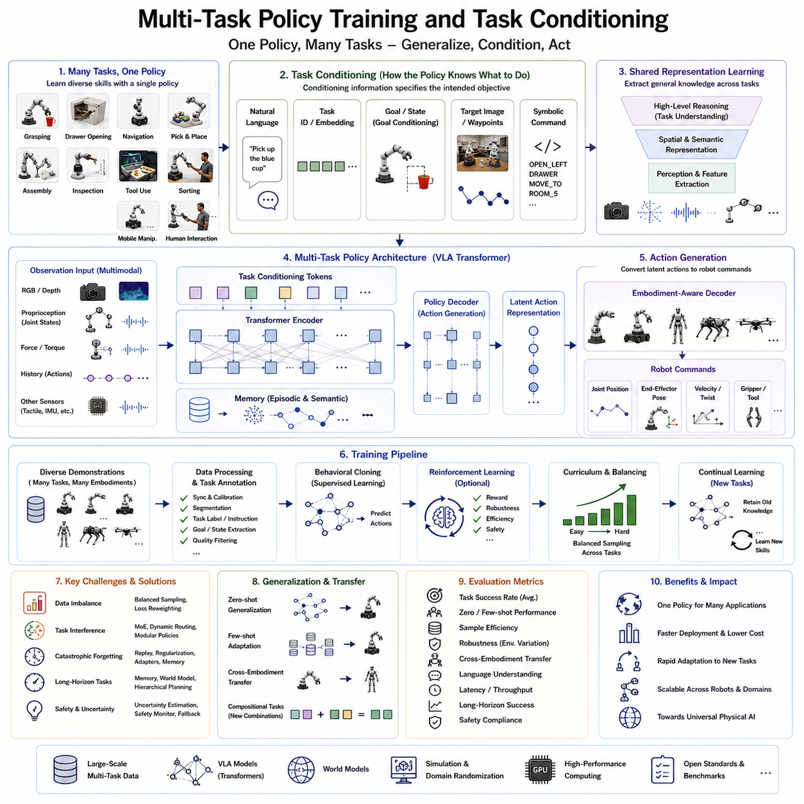{width="7.268055555555556in" height="7.268055555555556in"}

**42_09_04 다중 작업 정책 학습(Multi-Task Policy Training)과 작업 조건화(Task Conditioning)**

다중 작업 정책 학습(Multi-Task Policy Training)은 하나의 정책(Policy)이 여러 종류의 로봇 작업(Task)을 동시에 학습하고 수행할 수 있도록 하는 범용 로봇 지능(General-Purpose Robot Intelligence)의 핵심 기술이다. 기존에는 파지(Grasping), 이동(Navigation), 조작(Manipulation), 검사(Inspection), 조립(Assembly), 인간-로봇 상호작용(Human-Robot Interaction)마다 별도의 신경망을 구축했지만, 다중 작업 학습은 하나의 통합 정책으로 이러한 다양한 작업을 모두 수행하도록 학습한다. 이를 통해 공통적인 지각(Perception), 추론(Reasoning), 계획(Planning), 행동 생성(Action Generation) 능력을 공유할 수 있다.

기존의 로봇 학습은 대부분 하나의 작업만을 대상으로 수행되었다. 예를 들어 블록 쌓기(Block Stacking), 서랍 열기(Drawer Opening), 복도 이동(Hallway Navigation)과 같은 단일 작업에 최적화된 모델은 새로운 작업에서는 성능이 크게 저하되었다. 새로운 기능이 필요할 때마다 새로운 데이터셋(Dataset), 새로운 모델(Model), 새로운 제어기(Controller)를 다시 개발해야 했으며, 이는 다양한 산업 환경에 적용하기에는 매우 비효율적인 방식이었다.

다중 작업 학습의 핵심 아이디어는 대부분의 로봇 작업이 공통적인 물리 원리(Physical Principles)를 공유한다는 점이다. 거의 모든 조작 작업은 물체 인식(Object Detection), 공간 추론(Spatial Reasoning), 경로 계획(Motion Planning), 충돌 회피(Collision Avoidance), 파지 생성(Grasp Generation), 궤적 최적화(Trajectory Optimization), 폐루프 제어(Closed-loop Feedback)를 필요로 한다. 이러한 공통 기능을 하나의 정책에서 학습하면 새로운 작업도 훨씬 빠르게 습득할 수 있다.

작업 조건화(Task Conditioning)는 하나의 정책이 여러 작업을 구분하여 수행할 수 있도록 하는 핵심 메커니즘이다. 작업별로 별도의 모델을 사용하는 대신, 현재 수행해야 할 작업 정보를 입력으로 함께 제공한다. 정책은 센서 정보와 함께 작업 목표(Task Description)를 입력받아 해당 작업에 맞는 행동(Action)을 생성한다. 따라서 동일한 네트워크라도 입력되는 작업 조건에 따라 서로 다른 행동을 수행할 수 있다.

작업 조건(Task Condition)은 다양한 형태로 표현될 수 있다. 자연어 명령(Natural Language Instruction), 작업 식별자(Task Identifier), 기호 명령(Symbolic Command), 의미 목표(Semantic Goal), 목표 이미지(Target Image), 원하는 물체 상태(Desired Object State), 경유 지점(Waypoint) 등이 대표적인 예이다. 이러한 다양한 조건은 하나의 통합된 정책에서 모두 처리될 수 있으며, 서로 다른 작업을 유연하게 수행할 수 있도록 지원한다.

최근에는 자연어(Language)가 가장 강력한 작업 조건화 방식으로 사용되고 있다. "파란 컵을 집어라", "왼쪽 서랍을 열어라", "배관을 검사하라", "5번 방으로 물건을 배송하라"와 같은 자연어 명령은 사람이 이해하기 쉬운 방식으로 로봇의 목표를 전달한다. 비전-언어-행동(Vision-Language-Action, VLA) 모델은 영상과 언어를 함께 처리하여 사람이 의도한 작업을 직접 행동으로 변환할 수 있다.

작업 식별자(Task Identifier)는 보다 단순한 조건화 방식이다. 각 작업에 고유한 임베딩 벡터(Task Embedding)를 부여하고 이를 정책의 입력으로 함께 제공한다. 자연어보다 표현력은 제한적이지만 수백 또는 수천 개의 정의된 작업을 효율적으로 관리할 수 있기 때문에 대규모 데이터셋에서 널리 활용된다.

목표 조건 학습(Goal-Conditioned Learning)은 작업 자체보다 최종 목표(Final Goal)를 중심으로 정책을 학습하는 방법이다. "컵을 집어라"와 같은 작업 이름 대신 최종 물체 위치(Target Pose), 목표 이미지(Target Image), 원하는 환경 상태(World State)를 입력으로 사용한다. 이를 통해 정책은 특정 작업을 암기하는 것이 아니라 목표를 달성하기 위한 일반적인 전략을 학습하게 되며, 새로운 목표 조합에도 높은 적응력을 보인다.

공유 표현 학습(Shared Representation Learning)은 다중 작업 정책의 핵심이다. 초기 계층에서는 영상 특징(Visual Feature), 공간 관계(Spatial Relationship), 물체 어포던스(Object Affordance), 기하학적 정보(Geometric Information), 시간적 변화(Temporal Dynamics)와 같은 공통적인 특징을 학습한다. 이후 상위 계층에서는 작업 조건(Task Condition)을 함께 고려하여 최종 행동을 생성한다. 이러한 계층적 구조는 공통 지식과 작업별 특성을 동시에 효과적으로 학습할 수 있도록 한다.

트랜스포머(Transformer)는 다중 작업 정책 학습에 가장 적합한 구조 가운데 하나이다. 자기 주의(Self-Attention) 메커니즘을 이용하여 영상(Video), 언어(Language), 관절 상태(Proprioception), 이전 행동(Action History), 작업 조건(Task Embedding), 메모리(Memory)를 동시에 처리할 수 있다. 또한 긴 작업(Long-horizon Task)에서도 장기적인 의존 관계(Long-term Dependency)를 효과적으로 학습할 수 있다.

데이터 다양성(Data Diversity)은 다중 작업 정책의 성능을 결정하는 핵심 요소이다. 데이터셋에는 조작(Manipulation), 이동(Navigation), 조립(Assembly), 검사(Inspection), 공구 사용(Tool Use), 물체 분류(Object Sorting), 인간과의 협업(Human Interaction), 이동형 조작(Mobile Manipulation) 등 매우 다양한 작업이 포함된다. 또한 물체 종류(Object Category), 환경(Environment), 조명(Lighting), 센서 잡음(Sensor Noise), 로봇 구현체(Embodiment), 수행 방법(Execution Strategy)도 다양하게 구성되어야 한다.

작업 균형(Task Balancing)은 학습 과정에서 중요한 문제이다. 일부 작업은 수백만 개의 데이터가 존재하지만, 산업용 특수 작업은 매우 적은 데이터만 존재할 수 있다. 이러한 불균형을 해결하기 위해 가중치 샘플링(Weighted Sampling), 커리큘럼 학습(Curriculum Learning), 적응형 손실 조정(Adaptive Loss Scaling), 균형 미니배치(Balanced Mini-batch) 등의 기법이 사용된다.

커리큘럼 학습(Curriculum Learning)은 쉬운 작업부터 어려운 작업으로 점진적으로 학습하는 방법이다. 먼저 단순한 도달(Reaching), 파지(Grasping), 물체 이동(Object Manipulation)을 학습하고 이후 조립(Assembly), 협업(Collaboration), 장기 계획(Long-horizon Planning)과 같은 복잡한 작업으로 확장한다. 이러한 단계적 학습은 모델의 안정성과 최종 성능을 모두 향상시킨다.

행동 복제(Behavior Cloning)는 현재 가장 널리 사용되는 다중 작업 학습 방법이다. 원격 조작(Teleoperation), 스크립트 기반 제어(Scripted Controller), 전문가 시연(Expert Demonstration)으로부터 수집한 행동을 그대로 학습한다. 최근에는 확산 정책(Diffusion Policy), 자기회귀 모델(Autoregressive Model), 시퀀스 모델(Sequence Model), 잠재 행동 표현(Latent Action Representation) 등이 결합되어 더욱 자연스럽고 다양한 행동을 생성하고 있다.

강화학습(Reinforcement Learning)은 사전 학습된 다중 작업 정책을 더욱 향상시키는 데 활용된다. 이미 다양한 작업을 수행할 수 있는 정책을 초기값으로 사용하기 때문에 처음부터 강화학습을 수행하는 것보다 훨씬 적은 상호작용으로 높은 성능을 얻을 수 있다. 또한 작업 효율(Task Efficiency), 에너지 절감(Energy Efficiency), 안전성(Safety), 장기 계획(Long-term Planning) 등을 추가적으로 최적화할 수 있다.

지속 학습(Continual Learning)은 새로운 작업이 추가될 때 기존 모델을 유지하면서 새로운 지식을 학습하는 기술이다. 기존에는 새로운 작업을 학습하면 이전 작업을 잊어버리는 파국적 망각(Catastrophic Forgetting)이 큰 문제였다. 이를 해결하기 위해 재생 버퍼(Replay Buffer), 정규화(Regularization), 파라미터 분리(Parameter Isolation), 어댑터(Adapter), 메모리 기반 학습(Memory-based Learning) 등이 활용된다.

작업 간 간섭(Task Interference)은 다중 작업 학습에서 해결해야 할 또 다른 문제이다. 일부 작업은 서로 도움이 되지만, 빠른 조작과 정밀 조립처럼 요구 조건이 상반되는 작업은 서로 성능을 저하시킬 수도 있다. 이를 해결하기 위해 전문가 혼합(Mixture of Experts), 동적 경로 선택(Dynamic Routing), 적응형 주의 메커니즘(Adaptive Attention), 모듈형 정책(Modular Policy) 등이 연구되고 있다.

교차 작업 일반화(Cross-task Generalization)는 학습하지 않은 새로운 작업을 기존 지식의 조합만으로 해결하는 능력을 의미한다. 단순히 시연을 암기하는 것이 아니라 물체 상호작용(Object Interaction), 공간 추론(Spatial Reasoning), 공구 사용(Tool Usage), 순차 계획(Sequential Planning)의 공통 원리를 이해하기 때문에 새로운 작업도 수행할 수 있다.

메모리(Memory)는 장기 작업(Long-horizon Task)에서 매우 중요한 역할을 한다. 에피소드 메모리(Episodic Memory)는 이전 관측과 완료된 하위 작업(Subtask), 물체 위치(Object Location), 과거 행동(Action History)을 저장한다. 의미 메모리(Semantic Memory)는 다양한 작업에서 축적된 공통 지식을 저장하여 장기 계획과 안정적인 작업 수행을 지원한다.

최근에는 월드 모델(World Model)이 다중 작업 정책과 결합되고 있다. 정책은 단순히 현재 상황만 보는 것이 아니라 여러 행동의 결과를 내부적으로 예측하고 가장 적합한 행동을 선택한다. 작업 조건(Task Condition)은 이러한 미래 예측에 영향을 주며, 복잡한 장기 작업에서도 더욱 안정적인 계획을 가능하게 한다.

안전성(Safety)은 하나의 정책이 다양한 작업을 수행하는 만큼 더욱 중요하다. 실행 중에는 안전 감시기(Safety Monitor)가 충돌 가능성(Collision), 작업 공간 제한(Workspace Constraint), 액추에이터 한계(Actuator Capability), 운영 규칙(Operation Rule)을 지속적으로 확인한다. 또한 불확실성 추정(Uncertainty Estimation)을 통해 신뢰도가 낮은 경우에는 폴백 제어기(Fallback Controller)나 사람의 개입(Human Intervention)을 수행하여 안전성을 확보한다.

다중 작업 정책의 성능 평가는 단일 작업 성공률(Success Rate)만으로는 충분하지 않다. 전체 작업 평균 성능(Average Performance), 새로운 작업 적응 속도(Adaptation Speed), 제로샷 일반화(Zero-shot Generalization), 소량 학습(Few-shot Learning), 환경 변화에 대한 강건성(Robustness), 구현체 전이(Cross-Embodiment Transfer), 언어 이해(Language Understanding), 추론 속도(Inference Latency), 메모리 사용량(Memory Utilization), 장기 계획(Long-horizon Planning) 등을 종합적으로 평가해야 한다.

산업 현장에서는 다중 작업 정책이 매우 큰 장점을 제공한다. 제조사는 작업마다 별도의 소프트웨어를 개발할 필요 없이 하나의 파운데이션 정책(Foundation Policy)을 다양한 제품에 적용할 수 있다. 고객은 소량의 데이터만 추가하여 자신의 환경에 맞게 미세조정(Fine-tuning)할 수 있으므로 개발 비용과 구축 기간이 크게 단축된다. 물류(Logistics), 제조(Manufacturing), 의료(Healthcare), 서비스(Service), 농업(Agriculture), 가정용 로봇(Household Robotics) 등 거의 모든 분야에서 동일한 AI 플랫폼을 활용할 수 있게 된다.

향후 다중 작업 정책 학습은 언어 추론(Language Reasoning), 멀티모달 인식(Multimodal Perception), 월드 모델(World Model), 지속 학습(Continual Learning), 교차 구현체 적응(Cross-Embodiment Adaptation), 다중 에이전트 협업(Multi-Agent Collaboration)과 결합하여 더욱 발전할 것이다. 데이터 규모와 모델 성능이 지속적으로 향상됨에 따라, 하나의 통합 정책만으로 사람의 다양한 목표를 이해하고 실제 환경에서 수많은 작업을 수행하는 범용 물리 AI(Universal Physical AI)의 핵심 기술로 자리 잡을 것으로 전망된다.

## 9.5 Zero-Shot Transfer Evaluation (with Code)

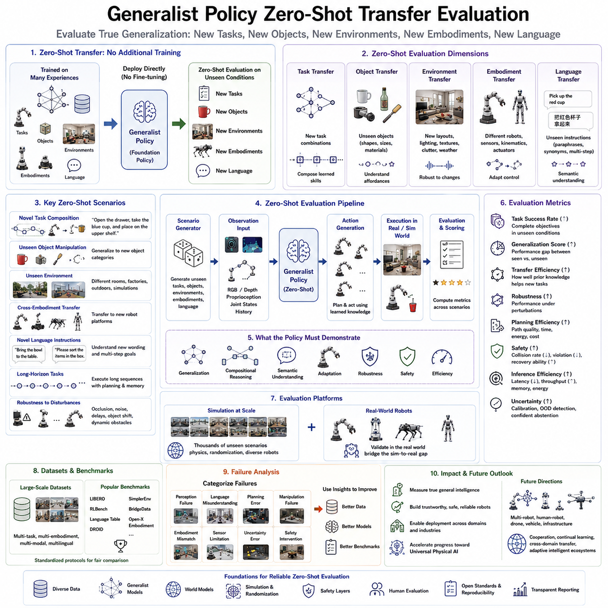{width="7.268055555555556in" height="7.268055555555556in"}

**42_09_05 일반화 정책(Generalist Policy)의 제로샷 전이 평가(Zero-Shot Transfer Evaluation)**

제로샷 전이 평가(Zero-Shot Transfer Evaluation)는 현대의 일반화 로봇 정책(Generalist Robot Policy)이 실제로 얼마나 범용적인 지능을 갖추었는지를 평가하는 가장 중요한 방법 가운데 하나이다. 기존의 로봇 평가는 학습에 사용한 작업(Task)에서의 성능만 측정했지만, 제로샷 평가는 추가 학습(Fine-tuning) 없이 새로운 작업(New Task), 새로운 환경(New Environment), 새로운 로봇(New Embodiment)에서도 성공적으로 동작하는지를 확인한다. 이는 물리 AI(Physical AI)가 단순 암기(Memorization)가 아닌 진정한 일반화(Generalization)를 달성했는지를 검증하는 핵심 기준이다.

과거의 로봇 학습 시스템은 학습 데이터와 매우 유사한 환경에서만 성능을 평가하였다. 이러한 방식은 최적화 수준은 확인할 수 있었지만 실제 환경에서는 성능을 과대평가하는 경우가 많았다. 현실에서는 새로운 물체(Object), 변화된 공간(Layout), 조명(Lighting), 센서 잡음(Sensor Noise), 사람과의 상호작용(Human Interaction), 예상하지 못한 작업(Task Combination)이 지속적으로 발생한다. 따라서 최근에는 암기 능력보다 새로운 상황에 얼마나 잘 적응하는지를 평가하는 방향으로 평가 체계가 발전하고 있다.

일반화 정책은 다양한 작업과 환경에서 재사용 가능한 지식을 학습하도록 설계된다. 따라서 평가 역시 특정 작업의 정확도가 아니라 기존에 학습한 지식을 새로운 문제 해결에 얼마나 효과적으로 활용하는지를 측정해야 한다. 제로샷 전이는 학습하지 않은 상황에서도 정책이 기존의 지식을 이용하여 적절한 행동(Action)을 생성할 수 있는지를 직접 확인하는 평가 방식이다.

제로샷 전이는 여러 관점에서 평가된다. 작업 전이(Task Transfer)는 새로운 작업을 수행할 수 있는지를 평가하고, 물체 전이(Object Transfer)는 처음 보는 물체를 다룰 수 있는지를 확인한다. 환경 전이(Environment Transfer)는 새로운 공장, 창고, 가정, 실외 환경에서의 성능을 측정하며, 구현체 전이(Embodiment Transfer)는 새로운 로봇 플랫폼에서도 정책이 동작하는지를 평가한다. 언어 전이(Language Transfer)는 학습하지 않은 자연어 명령까지 올바르게 이해할 수 있는지를 확인한다.

작업 수준의 제로샷(Task-level Zero-Shot)은 기존에 학습한 기술을 새로운 방식으로 조합할 수 있는지를 평가한다. 예를 들어 컵 집기, 서랍 열기, 선반에 물건 올리기를 각각 학습한 로봇에게 "서랍을 열고 파란 컵을 꺼내 위쪽 선반에 올려놓아라"와 같은 새로운 작업을 제시한다. 이러한 작업을 성공적으로 수행한다면 정책이 단순히 시연을 암기한 것이 아니라 작업 구조(Task Structure)를 이해하고 있다는 의미가 된다.

물체 수준 전이(Object-level Transfer)는 처음 보는 물체를 얼마나 잘 다룰 수 있는지를 평가한다. 병(Bottle), 컵(Cup), 상자(Box)만 학습한 로봇이 새로운 생활용품(Household Object)을 만났을 때에도 형태(Geometry), 어포던스(Affordance), 물리적 특성(Physical Property)을 분석하여 적절한 조작 전략을 생성해야 한다. 이는 외형이 아니라 기능(Function)을 이해하는 능력을 평가하는 것이다.

환경 전이(Environment Transfer)는 실제 배치 환경에서 매우 중요한 평가 요소이다. 새로운 조명(Lighting), 가구 배치(Furniture Layout), 질감(Texture), 작업 공간(Workspace), 센서 위치(Viewpoint), 장애물(Obstacle) 등이 포함된 환경에서도 안정적인 성능을 유지해야 한다. 우수한 정책은 환경이 달라져도 표면적인 특징이 아니라 물리적 원리와 의미 정보를 기반으로 행동을 결정한다.

구현체 전이(Cross-Embodiment Transfer)는 가장 어려운 평가 항목 중 하나이다. 산업용 로봇, 협동로봇(Collaborative Robot), 이동형 매니퓰레이터(Mobile Manipulator)에서 학습한 정책을 새로운 로봇에 추가 학습 없이 적용한다. 자유도(Degree of Freedom), 센서(Sensor), 액추에이터(Actuator), 작업 공간(Workspace)이 모두 달라도 정책이 의미 이해(Semantic Understanding)를 유지하면서 새로운 로봇에서 적절한 행동을 생성해야 한다.

언어 기반 제로샷(Language-conditioned Zero-Shot)은 비전-언어-행동(Vision-Language-Action, VLA) 모델에서 특히 중요하다. 미리 정의된 작업 번호가 아니라 새로운 자연어 명령(New Natural Language Instruction), 다양한 표현(Paraphrase), 동의어(Synonym), 다단계 작업(Multi-step Instruction)을 입력했을 때 의미를 정확하게 이해하고 행동으로 변환할 수 있어야 한다. 이는 실제 사람과 협업하는 서비스 로봇에서 매우 중요한 능력이다.

시간적 일반화(Temporal Generalization)는 장기 작업(Long-horizon Task)에 대한 능력을 평가한다. 단순한 하나의 행동이 아니라 수십 또는 수백 단계의 작업을 수행하면서 계획(Planning), 메모리(Memory), 하위 목표 분해(Subgoal Decomposition), 오류 복구(Error Recovery)를 지속적으로 수행할 수 있어야 한다. 장기 작업은 실제 산업 현장과 생활 환경에서 요구되는 핵심 능력이다.

강건성 평가(Robustness Evaluation)는 작업 수행 중 의도적으로 다양한 장애를 발생시킨다. 영상 가림(Occlusion), 센서 고장(Sensor Failure), 통신 지연(Communication Delay), 액추에이터 오차(Actuator Uncertainty), 물체 이동(Object Displacement), 동적 장애물(Dynamic Obstacle), 환경 잡음(Environmental Noise), 부분 관측(Partial Observation) 등이 대표적이다. 우수한 정책은 이러한 예기치 않은 상황에서도 안정적으로 작업을 계속 수행할 수 있어야 한다.

최근의 평가 데이터셋(Benchmark Dataset)은 단순히 규모만 큰 것이 아니라 다양성(Diversity)을 중요하게 고려한다. 다양한 로봇 플랫폼, 여러 종류의 물체, 멀티모달 센서(Multimodal Sensor), 여러 언어(Multilingual Instruction), 동적인 환경(Dynamic Environment), 사람과의 상호작용(Human Interaction)을 포함하여 실제 환경과 유사한 조건에서 평가가 이루어진다.

시뮬레이션(Simulation)은 제로샷 평가에서 매우 중요한 역할을 한다. 물리 엔진(Physics Engine)을 이용하면 새로운 환경, 새로운 로봇 구조, 다양한 물체 조합, 동적 상황을 자동으로 생성할 수 있다. 수천 개 이상의 시나리오를 반복적으로 평가할 수 있기 때문에 통계적으로 신뢰성 높은 성능 분석이 가능하며, 실제 환경에서 재현하기 어려운 극단적인 상황까지 시험할 수 있다.

그러나 시뮬레이션만으로는 실제 환경을 완전히 대체할 수 없다. 실제 로봇은 센서 오차, 마찰(Friction), 진동(Vibration), 환경 변화 등 다양한 요소를 포함하기 때문이다. 따라서 최근에는 시뮬레이션과 실제 로봇(Real Robot)을 함께 사용하는 혼합 평가(Hybrid Evaluation)가 일반적인 방식이 되고 있다. 두 환경에서 모두 안정적인 성능을 보이는 정책이 진정한 일반화 능력을 가진 것으로 평가된다.

제로샷 평가에서는 다양한 정량적 지표(Quantitative Metrics)가 사용된다. 작업 성공률(Task Success Rate), 일반화 점수(Generalization Score), 전이 효율(Transfer Efficiency), 환경 변화에 따른 강건성(Robustness), 계획 효율(Planning Efficiency), 실행 시간(Execution Time), 에너지 소비(Energy Consumption), 계산 비용(Computational Cost) 등이 대표적이다. 또한 충돌 횟수(Collision Frequency), 제약조건 위반(Constraint Violation), 불안정한 동작(Unstable Motion), 복구 능력(Recovery Behavior)과 같은 안전성(Safety) 지표도 함께 평가한다.

추론 효율(Inference Efficiency) 역시 매우 중요한 평가 요소이다. 최신 파운데이션 정책(Foundation Policy)은 수십억 개의 파라미터(Parameter)를 가지는 경우가 많기 때문에 추론 지연(Inference Latency), GPU 사용률(GPU Utilization), 메모리 사용량(Memory Consumption), 처리량(Throughput), 에너지 효율(Energy Efficiency)도 함께 분석한다. 실제 로봇에서는 높은 성능뿐 아니라 실시간 처리(Real-Time Processing)가 반드시 보장되어야 한다.

불확실성 추정(Uncertainty Estimation)은 개방형 환경(Open World)에서 특히 중요하다. 일반화 정책은 경험하지 못한 상황에서는 무조건 행동을 생성하는 것이 아니라 자신이 확신할 수 없는 상황임을 판단해야 한다. 따라서 신뢰도 보정(Confidence Calibration), 이상 상황 탐지(Out-of-Distribution Detection), 불확실성 예측(Uncertainty Prediction), 폴백 제어(Fallback Control)가 평가 항목에 포함된다.

사람 기반 평가(Human Evaluation)는 정량적인 수치만으로 측정하기 어려운 요소를 평가한다. 움직임의 자연스러움(Motion Naturalness), 부드러움(Smoothness), 예측 가능성(Predictability), 협업 능력(Cooperation), 의사소통 능력(Communication Effectiveness), 전체적인 작업 품질(Task Quality) 등을 사람이 직접 평가한다. 특히 협동로봇과 서비스 로봇에서는 이러한 주관적 평가가 실제 활용성에 큰 영향을 미친다.

최근에는 LIBERO, RLBench, Language Table, DROID, SimplerEnv, BridgeData, Open-X Embodiment 등 다양한 공개 벤치마크(Benchmark)가 제로샷 평가를 위한 표준 환경을 제공하고 있다. 이들은 공통 작업(Task), 데이터셋(Dataset), 평가 절차(Evaluation Protocol), 성능 지표(Metrics)를 제공하여 서로 다른 연구 결과를 공정하게 비교할 수 있도록 지원하며, 로봇 AI 연구의 발전을 가속화하고 있다.

산업 현장에서는 실험실 성능보다 장기간 안정성(Long-term Reliability)이 더욱 중요하다. 수주 또는 수개월 동안 지속적으로 동작할 수 있는지, 생산 환경 변화에 얼마나 잘 적응하는지, 기존 자동화 시스템과 호환되는지, 안전 규정을 준수하는지, 유지보수가 쉬운지 등을 함께 평가한다. 따라서 산업용 제로샷 평가는 단순한 작업 성공률을 넘어 실제 운영(Operation) 성능까지 포함한다.

실패 분석(Failure Analysis)도 평가 과정에서 매우 중요한 역할을 한다. 실패 원인을 인식 오류(Perception Failure), 언어 이해 오류(Language Understanding Error), 계획 오류(Planning Error), 조작 실패(Manipulation Failure), 구현체 불일치(Embodiment Mismatch), 센서 한계(Sensor Limitation), 불확실성 추정 실패(Uncertainty Estimation Error), 안전 개입(Safety Intervention) 등으로 분류한다. 이러한 분석은 차세대 파운데이션 정책과 평가 체계를 개선하는 중요한 자료가 된다.

최근에는 월드 모델(World Model)을 활용한 예측 기반 평가도 활발히 연구되고 있다. 단순히 행동 결과만 평가하는 것이 아니라 내부적으로 미래 환경을 얼마나 정확하게 예측하는지까지 함께 분석한다. 미래 예측 능력이 뛰어난 정책일수록 계획(Planning) 성능과 제로샷 일반화 능력도 우수한 경우가 많다.

향후 제로샷 평가는 단일 로봇을 넘어 다중 로봇(Multi-Robot), 인간(Human), 자율주행 차량(Autonomous Vehicle), 드론(UAV), 지능형 인프라(Intelligent Infrastructure)가 함께 협력하는 물리 AI 생태계 전체를 평가하는 방향으로 발전할 것이다. 협업(Cooperation), 분산 계획(Distributed Planning), 지속 학습(Continual Learning), 교차 도메인 지식 전이(Cross-domain Knowledge Transfer)까지 포함하는 종합적인 평가 체계가 구축될 것이며, 이는 로봇이 실제로 물리 세계를 이해하는지 아니면 단순히 학습 데이터를 재현하는지를 판단하는 가장 중요한 기준으로 자리 잡을 것으로 전망된다.

## 9.6 Fine-Tuning Foundation Policies (with Code)

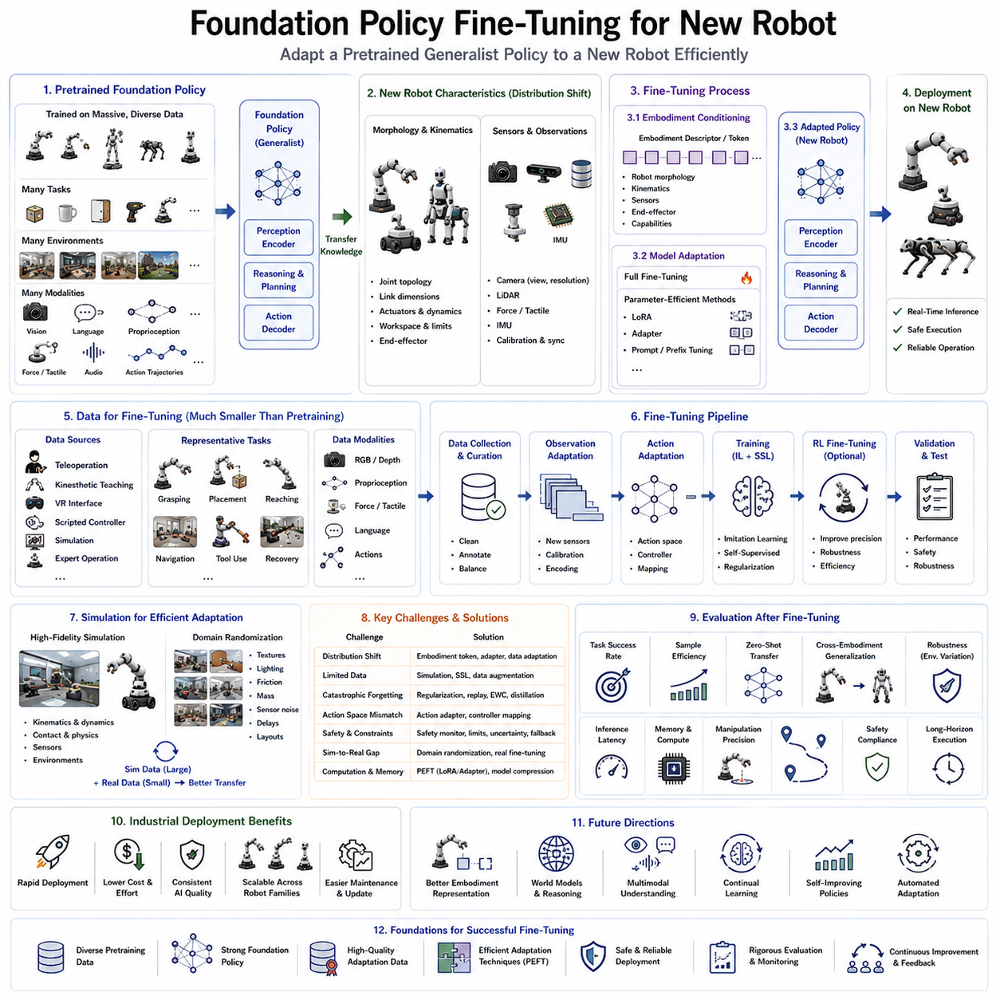{width="7.268055555555556in" height="7.268055555555556in"}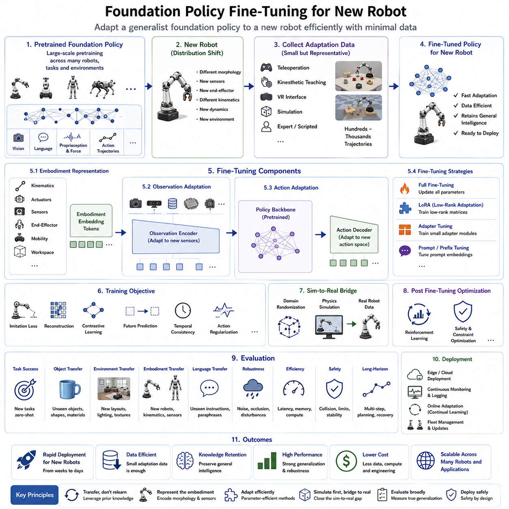{width="7.268055555555556in" height="7.268055555555556in"}

**42_09_06 새로운 로봇을 위한 파운데이션 정책(Foundation Policy) 미세조정(Fine-Tuning)**

새로운 로봇(New Robot)을 위한 파운데이션 정책(Foundation Policy) 미세조정(Fine-Tuning)은 대규모 사전학습(Pretraining)된 로봇 파운데이션 모델을 특정 로봇 플랫폼에 맞게 적응시키는 과정이다. 처음부터 새로운 정책을 학습하는 것이 아니라, 이미 다양한 작업(Task), 환경(Environment), 로봇 구현체(Embodiment)에서 학습한 일반화 정책(Generalist Policy)을 기반으로 새로운 로봇에 맞게 일부만 수정한다. 이를 통해 적은 데이터와 낮은 개발 비용으로 새로운 로봇을 빠르게 실용화할 수 있으며, 현대 물리 AI(Physical AI)의 핵심 기술로 자리 잡고 있다.

기존의 로봇 개발 방식은 새로운 로봇이 나올 때마다 대규모 데이터셋(Dataset)을 다시 수집하고, 지각(Perception), 계획(Planning), 제어(Control), 조작(Manipulation) 알고리즘을 모두 새롭게 개발해야 했다. 구조가 비슷한 로봇이라도 수개월 이상의 데이터 수집과 재학습이 필요했으며, 개발 비용과 유지보수 비용도 매우 높았다. 파운데이션 정책은 이러한 방식을 전이학습(Transfer Learning) 기반으로 전환하여 한 번 학습한 범용 지능을 여러 로봇에 재사용할 수 있도록 한다.

미세조정의 성능은 사전학습된 파운데이션 정책의 품질에 크게 좌우된다. 사전학습 과정에서는 영상(Video), 자연어(Language), 관절 상태(Proprioception), 힘 센서(Force Sensor), 촉각(Tactile), 행동 궤적(Action Trajectory), 환경 상호작용(Environment Interaction) 등 다양한 멀티모달(Multimodal) 데이터를 이용하여 대규모 학습을 수행한다. 이를 통해 물체 어포던스(Object Affordance), 공간 추론(Spatial Reasoning), 시간 계획(Temporal Planning), 조작 전략(Manipulation Strategy), 장애물 회피(Obstacle Avoidance), 의미 이해(Semantic Understanding) 등의 범용 지식을 습득하게 된다.

새로운 로봇을 적용할 때는 다양한 분포 변화(Distribution Shift)가 발생한다. 관절 구조(Joint Topology), 링크 길이(Link Dimension), 적재 능력(Payload), 액추에이터(Actuator), 운동학(Kinematics), 작업 공간(Workspace)이 달라질 수 있으며, 카메라(Camera), 라이다(LiDAR), 힘 센서, 촉각 센서, 관성 센서(IMU) 등 센서 구성도 크게 달라질 수 있다. 또한 병렬 그리퍼(Parallel Gripper), 다지 손(Robotic Hand), 흡착기(Suction Tool), 산업용 공구(Industrial Tool) 등 말단 장치(End-effector)의 차이도 존재한다. 미세조정은 이러한 구현체 특성에 적응하면서 기존의 범용 지식을 유지하는 것을 목표로 한다.

미세조정의 첫 번째 단계는 구현체 표현(Embodiment Representation)을 구축하는 것이다. 로봇의 관절 구조, 운동학 체인(Kinematic Chain), 액추에이터 사양, 센서 배치, 이동 방식(Mobility Mechanism), 작업 공간 한계, 말단 장치 정보를 하나의 구현체 기술자(Embodiment Descriptor)로 표현한다. 최근에는 트랜스포머(Transformer) 기반 정책에서 구현체 토큰(Embodiment Token)이나 형태 임베딩(Morphology Embedding)을 함께 입력하여 하나의 네트워크가 다양한 로봇을 동시에 지원할 수 있도록 구성하는 경우가 많다.

관측 적응(Observation Adaptation)은 또 다른 중요한 단계이다. 로봇마다 카메라 위치(Camera Position), 해상도(Resolution), 시야(Field of View), 센서 종류(Modality), 보정 정보(Calibration), 시간 동기화(Synchronization)가 모두 다르기 때문이다. 따라서 입력 인코더(Observation Encoder)는 새로운 센서 구성에 적응하면서도 기존의 의미 표현(Semantic Representation)을 유지해야 한다. 일반적으로 초기의 지각 계층(Perception Layer)만 수정하면 상위 추론 계층은 대부분 그대로 활용할 수 있다.

행동 적응(Action Adaptation)은 구현체마다 가장 큰 차이가 발생하는 부분이다. 파운데이션 정책은 먼저 추상적인 잠재 행동(Latent Action)을 생성하지만, 실제 로봇은 이를 관절 위치(Joint Position), 관절 속도(Joint Velocity), 말단 위치(Cartesian Pose), 토크(Torque), 임피던스 제어(Impedance Control), 이동 속도(Mobile Velocity) 등으로 변환해야 한다. 미세조정은 이러한 행동 디코더(Action Decoder)를 수정하여 새로운 로봇에서도 동일한 행동 전략을 구현할 수 있도록 한다.

미세조정을 위한 데이터는 사전학습보다 훨씬 적다. 수백만 개의 시연(Demonstration)을 다시 수집할 필요 없이 수백에서 수천 개 정도의 고품질 궤적(Trajectory)만으로도 충분한 경우가 많다. 데이터는 원격 조작(Teleoperation), 직접 교시(Kinesthetic Teaching), 가상현실(VR), 스크립트 제어(Scripted Controller), 시뮬레이션(Simulation), 전문가 조작(Expert Operation) 등을 통해 수집할 수 있다. 이미 일반적인 조작 능력을 갖춘 정책이기 때문에 새로운 로봇의 동작 방식만 학습하면 된다.

작업 선택(Task Selection)도 매우 중요하다. 모든 작업을 다시 학습하는 것이 아니라 파지(Grasping), 물체 이동(Object Placement), 접근(Reaching), 이동(Navigation), 장애물 회피(Obstacle Avoidance), 공구 사용(Tool Usage), 오류 복구(Recovery) 등 대표적인 작업만 포함해도 구현체의 특성을 충분히 학습할 수 있다. 따라서 데이터의 양보다 작업 다양성(Task Diversity)이 더 중요한 경우가 많다.

미세조정 방식에는 여러 가지가 존재한다. 전체 모델을 모두 업데이트하는 전체 미세조정(Full Fine-Tuning)은 높은 성능을 제공하지만 계산량이 매우 크고 기존 지식을 잊어버리는 파국적 망각(Catastrophic Forgetting)의 위험도 존재한다. 반면 파라미터 효율적 미세조정(Parameter-Efficient Fine-Tuning, PEFT)은 일부 계층만 수정하여 기존의 지식을 최대한 유지하면서 계산량을 크게 줄인다.

저랭크 적응(Low-Rank Adaptation, LoRA)은 현재 가장 널리 사용되는 미세조정 기법 가운데 하나이다. 기존 가중치(Weight)는 그대로 유지하고, 작은 저차원 행렬(Low-Rank Matrix)만 추가로 학습한다. 이 방식은 메모리 사용량을 크게 줄이고 학습 속도를 높일 수 있으며, 하나의 파운데이션 모델을 여러 로봇에서 효율적으로 공유할 수 있게 한다.

어댑터(Adapter)는 트랜스포머 블록 사이에 작은 신경망을 삽입하여 새로운 로봇 전용 지식을 학습하는 방식이다. 여러 로봇이 동일한 파운데이션 정책을 공유하면서도 각자의 어댑터만 별도로 유지할 수 있기 때문에 다양한 로봇 제품군을 관리하기에 매우 적합하다. 공통 백본(Backbone)을 개선하면 모든 로봇이 동시에 혜택을 받을 수 있다는 장점도 있다.

프롬프트 튜닝(Prompt Tuning)과 프리픽스 튜닝(Prefix Tuning)은 언어 기반 정책(Language-Conditioned Policy)에 적합한 기법이다. 내부 가중치를 거의 변경하지 않고 학습 가능한 프롬프트 임베딩(Prompt Embedding)만 추가하여 새로운 로봇이나 새로운 응용 분야에 적응한다. 학습해야 하는 파라미터 수가 매우 적기 때문에 계산 자원이 제한된 엣지 로봇(Edge Robot)에서도 효과적으로 사용할 수 있다.

시뮬레이션(Simulation)은 미세조정 과정에서 매우 중요한 역할을 한다. 고정밀 물리 시뮬레이터(Physics Simulator)를 이용하여 새로운 로봇의 운동학, 동역학(Dynamics), 센서, 접촉(Contact), 환경을 재현하고 대량의 합성 데이터(Synthetic Data)를 생성한다. 이후 소량의 실제 데이터만 추가하여 Sim2Real(Simulation to Reality) 차이를 보정하면 된다. 또한 도메인 랜덤화(Domain Randomization)를 적용하여 조명, 질감(Texture), 마찰(Friction), 질량(Mass), 센서 잡음(Sensor Noise), 액추에이터 지연 등을 지속적으로 변경하면 실제 환경에서도 높은 적응력을 확보할 수 있다.

자기지도학습(Self-Supervised Learning)은 지도학습을 보완하는 중요한 기술이다. 복원(Reconstruction), 대조학습(Contrastive Learning), 마스킹 예측(Masked Prediction), 미래 상태 예측(Future State Prediction), 시간 일관성(Temporal Consistency), 멀티모달 정렬(Cross-Modal Alignment) 등을 함께 학습하여 적은 양의 시연 데이터만으로도 효율적인 적응이 가능하도록 한다.

강화학습(Reinforcement Learning)은 초기 미세조정이 완료된 이후 성능을 더욱 향상시키는 단계에서 활용된다. 이미 범용 능력을 갖춘 정책을 초기값으로 사용하기 때문에 처음부터 강화학습을 수행하는 것보다 훨씬 적은 상호작용으로 높은 성능을 얻을 수 있다. 이를 통해 정밀도(Precision), 강건성(Robustness), 안전성(Safety), 에너지 효율(Energy Efficiency), 작업 속도(Task Speed), 장기 계획(Long-Horizon Planning) 등을 추가적으로 최적화할 수 있다.

파국적 망각(Catastrophic Forgetting)을 방지하는 것도 매우 중요하다. 새로운 로봇에 과도하게 적응하면 기존에 학습한 범용 능력을 잃을 수 있기 때문이다. 이를 해결하기 위해 정규화(Regularization), 리플레이 버퍼(Replay Buffer), 탄성 가중치 통합(Elastic Weight Consolidation, EWC), 지식 증류(Knowledge Distillation), 어댑터 분리(Adapter Isolation), 지속 학습(Continual Learning) 등의 기법이 함께 사용된다.

안전성(Safety)은 실제 로봇 적용에서 반드시 고려해야 하는 요소이다. 미세조정된 정책은 새로운 로봇의 관절 제한(Joint Limit), 속도 제한(Velocity Limit), 충돌 영역(Collision Boundary), 적재 한계(Payload Limit), 안정성(Stability), 열 제한(Thermal Constraint)을 모두 만족해야 한다. 실행 중에는 안전 감시기(Safety Monitor)가 행동을 지속적으로 검증하며, 신뢰도가 낮은 상황에서는 폴백 제어기(Fallback Controller)나 사람의 개입(Human Supervision)을 수행한다.

미세조정 이후의 평가는 단순한 작업 성공률(Task Success Rate)만으로 이루어지지 않는다. 적응 속도(Adaptation Speed), 데이터 효율성(Sample Efficiency), 추가 작업에 대한 제로샷 전이(Zero-Shot Transfer), 교차 구현체 일반화(Cross-Embodiment Generalization), 추론 지연(Inference Latency), 계산 효율(Computational Efficiency), 메모리 사용량(Memory Utilization), 환경 변화에 대한 강건성(Robustness), 언어 이해(Language Understanding), 조작 정밀도(Manipulation Precision), 이동 정확도(Navigation Accuracy), 장기 작업(Long-Horizon Task) 등을 종합적으로 평가하여 범용 지능이 유지되었는지를 확인한다.

산업 현장에서는 파운데이션 정책 미세조정이 매우 큰 경제적 효과를 가져온다. 하나의 파운데이션 정책만으로 협동로봇(Collaborative Robot), 산업용 로봇(Industrial Robot), 이동형 매니퓰레이터(Mobile Manipulator), 물류 로봇(Logistics Robot), 검사 로봇(Inspection Robot), 의료 로봇(Healthcare Robot), 농업 로봇(Agricultural Robot), 휴머노이드(Humanoid)까지 지원할 수 있다. 제품별로 소규모 미세조정만 수행하면 되므로 개발 비용과 유지보수 비용을 크게 절감할 수 있으며, 다양한 제품군에서도 일관된 AI 성능을 유지할 수 있다.

향후에는 구현체 표현(Embodiment Representation), 월드 모델(World Model), 멀티모달 추론(Multimodal Reasoning), 지속 학습(Continual Learning), 자기 개선 정책(Self-Improving Policy), 자동 적응 파이프라인(Automated Adaptation Pipeline)이 더욱 발전할 것으로 예상된다. 장기적으로는 새로운 로봇이 생산된 후 몇 번의 시연(Demonstration)만으로, 나아가 추가 학습 없이도 즉시 운용 가능한 수준까지 발전할 것으로 전망된다. 이러한 파운데이션 정책 미세조정 기술은 다양한 로봇 생태계에서 빠른 상용화와 지속적인 성능 향상을 가능하게 하는 핵심 기반 기술이 될 것이다.

## 9.7 Octo Generalist Policy (with Code)

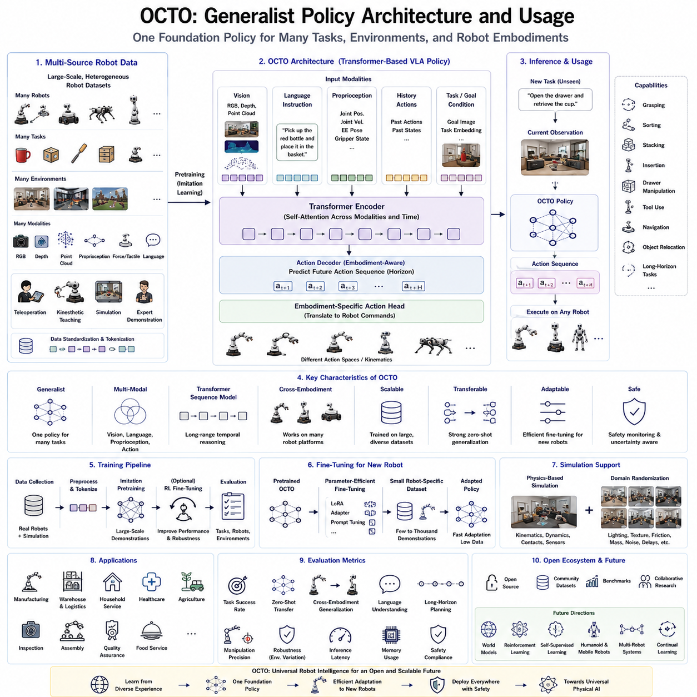{width="7.268055555555556in" height="7.268055555555556in"}

**42_09_07 옥토(Octo) 일반화 정책(Generalist Policy) 아키텍처(Architecture)와 활용(Usage)**

옥토(Octo)는 다양한 작업(Task), 환경(Environment), 로봇 구현체(Embodiment)를 하나의 정책으로 학습하기 위해 개발된 대규모 로봇 파운데이션 정책(Robot Foundation Policy)이다. 트랜스포머(Transformer) 기반 구조와 대규모 로봇 데이터셋을 결합하여 범용적인 로봇 지능을 구현하는 것을 목표로 한다. 기존처럼 작업마다 별도의 신경망을 만드는 것이 아니라, 하나의 정책이 멀티모달(Multimodal) 정보를 이해하고 다양한 로봇에서 적절한 행동(Action)을 생성하도록 설계되었다. 이는 작업 중심의 로봇 제어에서 범용 비전-언어-행동(Vision-Language-Action, VLA) 시스템으로 전환하는 중요한 이정표라 할 수 있다.

옥토의 핵심 철학은 로봇 지능을 한 번 학습하고 여러 환경에서 반복적으로 활용하는 것이다. 기존에는 새로운 작업이나 새로운 로봇이 등장할 때마다 독립적인 개발 프로젝트가 필요했지만, 옥토는 모든 로봇 경험을 하나의 공통 지식으로 통합한다. 여러 연구기관과 다양한 제조사의 로봇, 여러 응용 분야에서 수집한 데이터를 함께 학습하여 특정 작업이나 특정 하드웨어를 넘어서는 범용적인 물리 지능(Physical Intelligence)을 구축한다. 이를 통해 새로운 환경에서도 적은 양의 추가 데이터만으로 높은 성능을 얻을 수 있다.

옥토는 트랜스포머 기반의 시퀀스 모델(Sequence Model)을 사용한다. 자기 주의(Self-Attention) 메커니즘을 이용하여 영상(Video), 관절 상태(Proprioception), 자연어(Language), 이전 행동(Action History), 작업 정보(Task Information)를 하나의 잠재 표현(Latent Representation) 안에서 함께 처리한다. 이러한 구조는 서로 다른 입력 정보가 상호 보완되도록 하며, 긴 시간 동안 이어지는 작업에서도 장기적인 의존 관계(Long-Term Dependency)를 효과적으로 학습할 수 있도록 한다.

비전(Visual Perception)은 옥토의 가장 중요한 입력 정보 가운데 하나이다. RGB 영상, 깊이 영상(Depth), 손목 카메라(Wrist Camera), 외부 카메라, 점군(Point Cloud) 등의 다양한 센서가 물체의 형태, 위치, 공간 관계, 주변 환경 정보를 제공한다. 비전 인코더(Visual Encoder)는 이러한 원시 데이터를 잠재 표현으로 변환하며, 사람이 직접 설계한 특징 대신 대규모 로봇 데이터를 이용하여 물체와 환경의 의미를 스스로 학습한다. 이를 통해 다양한 환경에서도 높은 일반화 성능을 유지할 수 있다.

자연어(Language)는 옥토의 유연성을 높이는 핵심 요소이다. 사용자는 "빨간 병을 집어라", "드라이버를 공구함에 넣어라", "서랍을 열고 컵을 가져와라"와 같은 자연어 명령으로 로봇을 제어할 수 있다. 언어 임베딩(Language Embedding)은 비전 정보와 결합되어 작업의 의미를 이해하며, 사람이 원하는 목표를 실제 행동으로 연결하는 역할을 수행한다. 따라서 별도의 프로그래밍 없이도 다양한 작업을 수행할 수 있다.

관절 상태(Proprioception)는 로봇 자신의 현재 상태를 나타내는 중요한 정보이다. 관절 위치(Joint Position), 관절 속도(Joint Velocity), 말단 위치(End-Effector Pose), 그리퍼 상태(Gripper State), 힘 센서(Force Sensor), 촉각(Tactile), 관성 센서(IMU), 액추에이터 상태 등을 함께 입력으로 사용한다. 이러한 내부 정보는 외부 영상 정보와 결합되어 보다 정확한 조작(Manipulation)과 안정적인 폐루프 제어(Closed-Loop Control)를 가능하게 한다.

옥토는 시간적 시퀀스 모델링(Temporal Sequence Modeling)을 지원한다는 점에서도 기존 정책과 차별화된다. 실제 조작 작업은 수십 단계 이상의 연속된 행동으로 구성되는 경우가 많으며, 현재 행동은 몇 초 전에 관찰한 정보를 기억해야 하는 경우가 많다. 트랜스포머의 자기 주의 메커니즘은 이러한 장기 의존 관계를 유지하여 복잡한 조립(Assembly), 도구 사용(Tool Use), 정리(Organization) 등의 작업에서도 일관성 있는 계획을 생성한다.

옥토의 또 다른 중요한 특징은 다양한 구현체(Embodiment)를 지원한다는 점이다. 학습 데이터는 산업용 로봇, 이동형 매니퓰레이터(Mobile Manipulator), 협동로봇(Collaborative Robot), 연구용 플랫폼 등 매우 다양한 로봇에서 수집된다. 각 로봇은 운동학(Kinematics), 센서 구성(Sensor Configuration), 행동 공간(Action Space)이 서로 다르지만, 옥토는 작업 의미(Task Semantics)를 공통 잠재 표현으로 학습하고 마지막 단계에서 구현체별 행동 디코더(Action Decoder)를 통해 해당 로봇의 제어 명령으로 변환한다.

대규모 데이터 통합(Large-Scale Data Aggregation)은 옥토의 중요한 기반 기술이다. Open-X 구현체(Open-X Embodiment)와 같은 공동 연구 프로젝트를 통해 여러 기관이 수집한 조작 궤적(Manipulation Trajectory), 언어 설명(Language Annotation), 센서 데이터(Sensory Observation), 관절 정보(Proprioception), 로봇 메타데이터(Metadata)를 하나의 공통 형식으로 통합하여 학습한다. 이러한 데이터 다양성은 일반화 능력과 전이 성능을 크게 향상시킨다.

작업 조건화(Task Conditioning)는 하나의 옥토 정책이 다양한 작업을 수행할 수 있도록 하는 핵심 기술이다. 자연어 명령, 작업 임베딩(Task Embedding), 목표 이미지(Target Image), 원하는 물체 상태(Object Configuration), 의미 기반 작업 설명(Semantic Task Description) 등이 입력으로 사용된다. 정책은 이러한 조건을 바탕으로 파지(Grasping), 분류(Sorting), 적재(Stacking), 삽입(Insertion), 서랍 조작(Drawer Manipulation), 물체 이동(Object Relocation), 공구 사용(Tool Usage) 등 매우 다양한 작업을 수행할 수 있다.

옥토는 주로 모방학습(Imitation Learning)을 이용하여 사전학습된다. 원격 조작(Teleoperation), 직접 교시(Kinesthetic Teaching), 스크립트 기반 제어(Scripted Controller), 시뮬레이션(Simulation), 전문가 시연(Expert Demonstration)을 통해 수집한 행동 데이터를 학습한다. 단순히 행동을 암기하는 것이 아니라 다양한 작업에서 공통적으로 사용할 수 있는 조작 원리를 학습하며, 이를 통해 새로운 로봇과 새로운 작업에도 빠르게 적응할 수 있다.

행동 생성(Action Generation)은 단일 명령이 아니라 일정 시간 구간(Horizon)에 대한 행동 시퀀스를 예측하는 방식으로 수행된다. 미래의 여러 행동을 동시에 예측하기 때문에 움직임이 더욱 부드럽고(Motion Smoothness), 시간적으로 일관되며(Temporal Consistency), 센서 잡음에도 강건한 특성을 보인다. 또한 반복적 계획(Receding Horizon Planning)을 통해 새로운 센서 정보가 들어올 때마다 행동 계획을 지속적으로 수정한다.

실제 현장에서는 미세조정(Fine-Tuning)이 매우 중요한 과정이다. 사전학습된 옥토는 이미 강력한 범용 능력을 갖고 있지만, 새로운 로봇의 운동학, 센서, 작업 공간, 액추에이터 특성에 맞게 일부를 수정해야 한다. 이를 위해 저랭크 적응(Low-Rank Adaptation, LoRA), 어댑터(Adapter), 프롬프트 튜닝(Prompt Tuning), 구현체 전용 디코더(Embodiment-Specific Decoder)와 같은 파라미터 효율적 미세조정(Parameter-Efficient Fine-Tuning, PEFT) 기법이 널리 활용된다.

시뮬레이션(Simulation)은 옥토의 학습 범위를 크게 확장하는 역할을 한다. 물리 시뮬레이터(Physics Simulator)를 이용하여 실제 환경에서 수집하기 어려운 대규모 데이터를 생성하고, 도메인 랜덤화(Domain Randomization)를 통해 조명(Lighting), 질감(Texture), 마찰(Friction), 물체 형상(Object Geometry), 센서 잡음(Sensor Noise), 액추에이터 지연(Actuator Delay) 등을 지속적으로 변경한다. 이러한 학습은 실제 로봇에서도 높은 강건성을 제공한다.

안전성(Safety)은 실제 배포에서 반드시 고려해야 한다. 파운데이션 정책이 아무리 높은 일반화 능력을 갖추고 있어도 충돌(Collision), 관절 제한(Joint Limit), 작업 공간 한계(Workspace Boundary), 적재 하중(Payload), 액추에이터 포화(Actuator Saturation), 사람과의 안전(Human Safety)을 항상 만족해야 한다. 이를 위해 안전 감시기(Safety Monitor), 행동 검증(Action Validation), 불확실성 추정(Uncertainty Estimation), 사람의 개입(Human Intervention) 등이 함께 적용된다.

옥토의 평가는 단순한 작업 성공률(Task Success Rate)만으로 이루어지지 않는다. 제로샷 전이(Zero-Shot Transfer), 구현체 일반화(Cross-Embodiment Generalization), 언어 이해(Language Understanding), 장기 계획(Long-Horizon Planning), 조작 정밀도(Manipulation Precision), 환경 변화에 대한 강건성(Robustness), 추론 속도(Inference Latency), 메모리 사용량(Memory Utilization), 안전성(Safety Compliance) 등을 종합적으로 평가하여 실제 활용 가능성을 판단한다.

산업 현장에서 옥토는 매우 다양한 분야에 적용될 수 있다. 제조업(Manufacturing)에서는 조립(Assembly), 검사(Inspection), 자재 이송(Material Handling), 품질 검사(Quality Assurance)를 지원하며, 물류(Logistics)에서는 분류(Sorting), 적재(Packing), 운반(Material Handling)를 수행한다. 또한 가정용 서비스 로봇(Household Service Robot), 의료 로봇(Healthcare Robot), 농업 로봇(Agricultural Robot) 등에서도 동일한 파운데이션 정책을 기반으로 소규모 미세조정만 수행하여 빠르게 적용할 수 있다.

옥토는 오픈소스(Open Source) 정책이라는 점에서도 큰 의미를 가진다. 전 세계 연구기관이 동일한 모델을 기반으로 실험을 재현하고, 새로운 데이터셋과 알고리즘을 추가하며, 동일한 평가 기준에서 성능을 비교할 수 있다. 이러한 개방형 생태계는 로봇 연구의 발전 속도를 높이고, 표준화된 파운데이션 정책 개발을 촉진하는 중요한 역할을 한다.

옥토는 물리 AI(Physical AI)의 새로운 방향을 제시하고 있다. 기존처럼 지각, 계획, 제어를 각각 독립적인 모듈로 구현하는 것이 아니라, 비전(Vision), 언어(Language), 추론(Reasoning), 메모리(Memory), 계획(Planning), 행동(Action)을 하나의 종단간(End-to-End) 아키텍처로 통합한다. 이를 통해 시스템 구조를 단순화하면서도 높은 일반화 능력과 확장성을 동시에 확보할 수 있다.

향후 옥토는 단순한 매니퓰레이션(Manipulation)을 넘어 휴머노이드(Humanoid), 이동형 조작(Mobile Manipulation), 사족보행(Quadruped), 드론(UAV), 다중 로봇 협업(Multi-Robot Collaboration), 지속 학습(Continual Learning)까지 지원하는 방향으로 발전할 것으로 예상된다. 또한 월드 모델(World Model), 강화학습(Reinforcement Learning), 자기지도학습(Self-Supervised Learning), 자동 데이터 수집(Autonomous Data Collection)과 결합되면서 더욱 강력한 범용 로봇 지능을 구현할 것으로 전망된다. 옥토는 다양한 경험을 하나의 모델에 통합하고 이를 여러 로봇에 효율적으로 적용할 수 있음을 보여준 대표적인 로봇 파운데이션 정책으로, 차세대 범용 물리 AI를 구현하는 핵심 기술 중 하나로 평가받고 있다.

## 9.8 Policies for AMRs, Manipulators, and Legged Robots (with Code)

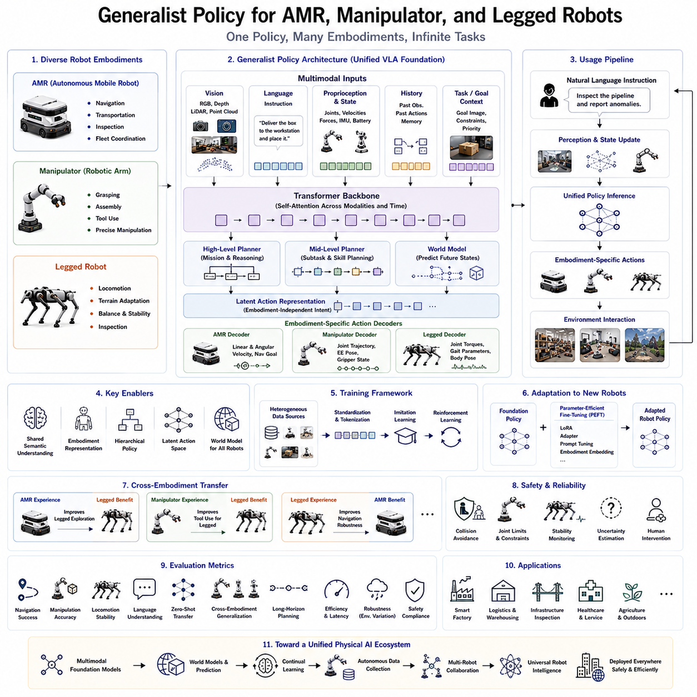{width="7.268055555555556in" height="7.268055555555556in"}

**42_09_08 AMR(Autonomous Mobile Robot), 매니퓰레이터(Manipulator), 사족보행 로봇(Legged Robot)을 위한 일반화 정책(Generalist Policy)**

일반화 정책(Generalist Policy)은 서로 다른 형태와 이동 방식, 센서 구성, 작업 특성을 가진 다양한 로봇을 하나의 지능으로 제어하기 위한 차세대 로봇 인공지능 기술이다. 기존에는 자율이동로봇(Autonomous Mobile Robot, AMR), 산업용 매니퓰레이터(Manipulator), 사족보행 로봇(Legged Robot)을 각각 독립적인 소프트웨어와 제어기로 개발해야 했지만, 일반화 정책은 하나의 통합 정책을 이용하여 다양한 로봇을 동시에 지원하는 것을 목표로 한다. 이를 통해 개발 복잡도를 줄이고, 다양한 로봇 플랫폼에서 동일한 AI를 재사용할 수 있는 기반을 제공한다.

AMR은 주로 이동(Navigation), 운반(Transportation), 순찰(Inspection), 환경 탐색(Environment Interaction)을 수행하며, 위치 추정(Localization), 지도 작성(Mapping), 장애물 회피(Obstacle Avoidance), 경로 계획(Path Planning), 임무 수행(Mission Execution)이 핵심 기능이다. 반면 매니퓰레이터는 물체 조작(Object Manipulation), 파지(Grasping), 조립(Assembly), 공구 사용(Tool Usage)과 같은 정밀 작업에 집중한다. 사족보행 로봇은 동적 균형(Dynamic Balance), 지형 적응(Terrain Adaptation), 전신 협조(Whole-body Coordination), 보행 안정성(Stability)과 같은 전혀 다른 문제를 해결해야 한다.

기존에는 이러한 로봇들이 서로 다른 목적과 하드웨어를 가지고 있기 때문에 완전히 다른 소프트웨어 구조를 사용하였다. 그러나 일반화 정책은 로봇의 형태와 관계없이 작업을 이해하는 지능은 대부분 공통이라는 점에 주목한다. 물체를 인식하고, 사람의 명령을 이해하며, 목표를 계획하고, 환경을 예측하는 과정은 이동형 로봇과 매니퓰레이터, 사족보행 로봇 모두 동일한 인공지능을 사용할 수 있다. 따라서 고수준 지능은 공유하고, 실제 움직임만 각 로봇에 맞게 생성하는 구조를 채택한다.

일반화 정책의 입력은 멀티모달 관측(Multimodal Observation)으로 구성된다. RGB 카메라, 스테레오 카메라(Stereo Vision), 깊이 카메라(Depth Camera), 라이다(LiDAR), 열화상 카메라(Thermal Camera), 이벤트 카메라(Event Camera), 점군(Point Cloud) 등이 외부 환경을 인식한다. 또한 관절 위치(Joint Position), 관절 속도(Joint Velocity), 휠 엔코더(Wheel Encoder), 액추에이터 온도(Actuator Temperature), 배터리 상태(Battery Condition), 힘 센서(Force Sensor), 촉각(Tactile Sensor), 관성 센서(IMU)와 같은 내부 상태도 함께 입력된다. 여기에 자연어(Language), 이전 행동(Action History), 메모리(Memory)가 결합되어 하나의 통합 입력을 구성한다.

비전(Vision)은 세 가지 로봇 모두에서 가장 중요한 입력이다. AMR은 복도(Corridor), 문(Door), 장애물(Obstacle), 충전 스테이션(Docking Station)을 인식해야 하며, 매니퓰레이터는 물체의 위치와 자세(Object Pose), 파지 위치(Grasp Point), 조립 특징(Assembly Feature)을 분석해야 한다. 사족보행 로봇은 지형(Terrain), 발 디딜 위치(Foothold), 계단(Stair), 경사(Slope), 틈(Gap)을 인식해야 한다. 일반화 정책은 이러한 정보를 별도로 학습하지 않고 하나의 공통적인 시각 표현(Semantic Visual Representation)으로 통합하여 처리한다.

자연어(Language)는 다양한 로봇을 연결하는 공통 인터페이스 역할을 수행한다. "이 상자를 운반하라", "공구를 집어라", "배관을 검사하라", "계단을 올라가라", "충전소로 복귀하라"와 같은 명령은 로봇 종류와 무관하게 동일한 의미를 가진다. 일반화 정책은 이러한 명령을 먼저 의미적으로 해석한 후, 각 로봇에 맞는 행동으로 변환한다. 따라서 사용자는 로봇 종류를 고려하지 않고 자연어만으로 다양한 로봇을 제어할 수 있다.

작업 분해(Task Decomposition)는 여러 종류의 로봇이 협력하는 환경에서 매우 중요하다. 예를 들어 AMR은 자재를 작업장까지 운반하고, 그 위에 장착된 매니퓰레이터는 물체를 집어 조립 작업을 수행하며, 사족보행 로봇은 사람이 접근하기 어려운 위험 지역을 점검할 수 있다. 일반화 정책은 이러한 전체 작업을 하나의 임무(Mission)로 이해하고, 각 로봇에게 적절한 하위 작업(Subtask)을 배정한다.

구현체 표현(Embodiment Representation)은 서로 다른 로봇을 구분하기 위한 핵심 기술이다. 각 로봇은 운동학(Kinematics), 이동 방식(Mobility), 작업 공간(Workspace), 액추에이터 특성(Actuator Characteristics), 적재 능력(Payload), 센서 구성(Sensor Configuration), 말단 장치(End-Effector)에 대한 정보를 제공한다. 트랜스포머 기반 정책은 이를 구현체 토큰(Embodiment Token)이나 형태 임베딩(Morphology Embedding)으로 표현하여 하나의 정책 안에서 다양한 로봇을 구분하면서도 공통 지능을 유지한다.

행동 표현(Action Representation)은 가장 어려운 문제 중 하나이다. AMR은 선속도(Linear Velocity)와 각속도(Angular Velocity)를 제어하며, 매니퓰레이터는 관절 궤적(Joint Trajectory), 말단 위치(Cartesian Pose), 그리퍼 상태(Gripper State)를 제어한다. 사족보행 로봇은 수십 개의 관절을 동시에 제어하면서 균형과 보행(Gait)을 유지해야 한다. 일반화 정책은 이러한 차이를 직접 다루지 않고 먼저 잠재 행동(Latent Action)을 생성한 뒤, 구현체별 행동 디코더(Action Decoder)를 통해 각 로봇의 제어 명령으로 변환한다.

계층형 정책(Hierarchical Policy)은 이러한 다양한 로봇을 효과적으로 지원하는 구조이다. 상위 계층은 임무 계획(Mission Planning), 작업 순서(Task Sequencing), 의미 추론(Semantic Reasoning), 장기 전략(Long-Term Strategy)을 담당한다. 중간 계층은 이동 목표(Navigation Goal), 조작 목표(Manipulation Target), 보행 목표(Locomotion Objective)를 생성하며, 하위 계층은 휠 속도(Wheel Velocity), 관절 토크(Joint Torque), 보행 패턴(Gait Parameter) 등 실제 제어 명령을 생성한다. 이러한 구조는 지능은 공유하면서도 구현체별 제어를 정확하게 수행할 수 있도록 한다.

월드 모델(World Model)은 서로 다른 로봇 간 협업 능력을 향상시키는 핵심 요소이다. AMR은 이동 경로와 동적 장애물을 예측하고, 매니퓰레이터는 물체의 움직임과 접촉(Contact)을 예측하며, 사족보행 로봇은 지면 변형과 균형을 예측한다. 이러한 환경 예측은 로봇 종류와 무관하게 동일한 물리 법칙을 기반으로 하기 때문에 하나의 월드 모델을 공유할 수 있으며, 각 로봇은 이를 이용하여 자신에게 맞는 행동을 생성한다.

이러한 일반화 정책은 대규모 이종 데이터셋(Heterogeneous Dataset)을 이용하여 학습된다. 창고용 AMR, 공장용 매니퓰레이터, 서비스 로봇, 사족보행 로봇, 휴머노이드(Humanoid), 원격 조작(Teleoperation), 시뮬레이션(Simulation) 데이터를 하나의 공통 형식으로 통합하여 학습한다. 이를 통해 특정 로봇이 아니라 물리 세계 전체에 대한 공통적인 이해를 습득하게 된다.

시뮬레이션(Simulation)은 학습 데이터를 대규모로 생성하는 핵심 기술이다. 물리 엔진(Physics Engine)을 이용하여 이동, 조작, 보행, 협업 시나리오를 대량으로 생성하며, 도메인 랜덤화(Domain Randomization)를 통해 조명(Lighting), 지형(Terrain), 물체(Object), 날씨(Weather), 센서 잡음(Sensor Noise), 액추에이터 지연(Actuator Delay)을 지속적으로 변화시킨다. 이러한 학습은 실제 환경에서도 높은 일반화 성능을 제공한다.

학습 과정에서는 모방학습(Imitation Learning)이 기본이 된다. 원격 조작(Teleoperation), 전문가 시연(Expert Demonstration), 직접 교시(Kinesthetic Teaching), 시뮬레이션 데이터 등을 이용하여 다양한 로봇의 행동을 학습한다. 이후 강화학습(Reinforcement Learning)을 추가하여 작업 효율(Task Efficiency), 에너지 절감(Energy Efficiency), 안전성(Safety), 장기 계획(Long-Horizon Planning)을 더욱 향상시킨다.

새로운 로봇을 추가할 때에는 파라미터 효율적 미세조정(Parameter-Efficient Fine-Tuning, PEFT)이 사용된다. 저랭크 적응(Low-Rank Adaptation, LoRA), 어댑터(Adapter), 프롬프트 튜닝(Prompt Tuning), 구현체 임베딩(Embodiment Embedding) 등을 활용하여 전체 모델을 다시 학습하지 않고도 새로운 로봇에 빠르게 적응할 수 있다. 이를 통해 계산 비용을 크게 줄이면서도 기존의 범용 지능을 유지할 수 있다.

교차 구현체 전이(Cross-Embodiment Transfer)는 일반화 정책의 가장 큰 장점 가운데 하나이다. 매니퓰레이터가 학습한 조작 기술은 사족보행 로봇의 공구 사용에도 활용될 수 있으며, AMR의 이동 경험은 사족보행 로봇의 탐색 능력을 향상시킬 수 있다. 창고에서 학습한 시각 표현은 공장 검사나 서비스 로봇에도 그대로 활용될 수 있다. 이처럼 하나의 로봇에서 얻은 경험이 다른 모든 로봇으로 확장되는 것이 일반화 정책의 핵심 가치이다.

안전성(Safety)은 서로 다른 로봇을 동시에 제어하는 환경에서 더욱 중요하다. 휠 미끄러짐(Wheel Slip), 관절 제한(Joint Limit), 충돌(Collision), 적재 하중(Payload), 균형(Stability), 온도(Thermal Condition), 액추에이터 포화(Actuator Saturation)를 지속적으로 감시해야 한다. 또한 불확실성 추정(Uncertainty Estimation)을 통해 새로운 환경에서는 사람의 개입(Human Supervision)이나 보수적인 행동을 선택하도록 설계된다.

일반화 정책의 평가는 이동 성공률(Navigation Success), 조작 정확도(Manipulation Accuracy), 보행 안정성(Locomotion Stability), 언어 이해(Language Understanding), 제로샷 전이(Zero-Shot Transfer), 구현체 일반화(Cross-Embodiment Generalization), 장기 계획(Long-Horizon Planning), 추론 속도(Inference Latency), 메모리 사용량(Memory Utilization), 환경 변화에 대한 강건성(Robustness), 다중 로봇 협업(Multi-Robot Coordination), 안전성(Safety) 등을 종합적으로 고려하여 수행된다.

산업 현장에서는 이러한 통합 정책이 매우 큰 효과를 가져온다. 스마트 팩토리(Smart Factory)에서는 AMR이 자재를 운반하고, 매니퓰레이터가 조립과 포장을 수행하며, 사족보행 로봇이 설비를 점검한다. 물류센터(Logistics Center), 인프라 유지보수(Infrastructure Maintenance), 의료(Healthcare), 서비스(Service), 농업(Agriculture)에서도 다양한 로봇이 하나의 AI를 공유하면서 협업할 수 있다. 이는 소프트웨어 유지보수를 단순화하고, 새로운 로봇을 빠르게 도입할 수 있는 기반을 제공한다.

클라우드-엣지 협업(Cloud-Edge Collaboration)은 이러한 시스템을 더욱 효율적으로 만든다. 클라우드에서는 대규모 GPU를 이용하여 언어 이해(Language Understanding), 월드 모델(World Model), 장기 계획(Long-Term Planning)을 수행하고, AMR·매니퓰레이터·사족보행 로봇의 엣지 컴퓨터(Edge Computer)는 실시간 센서 처리, 지역 경로 계획(Local Planning), 안전 제어(Safety Control)를 담당한다. 이러한 구조는 높은 연산 성능과 실시간성을 동시에 만족시킨다.

향후 일반화 정책은 이동 로봇(Wheeled Robot), 휴머노이드(Humanoid), 사족보행 로봇(Quadruped), 매니퓰레이터, 드론(UAV), 자율주행 차량(Autonomous Vehicle), 지능형 인프라(Intelligent Infrastructure)를 하나의 인지 아키텍처(Cognitive Architecture)로 통합하는 방향으로 발전할 것이다. 멀티모달 파운데이션 모델(Multimodal Foundation Model), 월드 모델(World Model), 자기지도학습(Self-Supervised Learning), 지속 학습(Continual Learning), 다중 에이전트 협업(Multi-Agent Collaboration)이 결합되면서 로봇의 형태에 관계없이 하나의 범용 지능을 공유하고, 각 로봇은 자신의 구현체에 맞는 움직임만 생성하는 진정한 범용 물리 AI(Universal Physical AI)가 구현될 것으로 전망된다.

## 9.9 Safety and Operational Boundaries

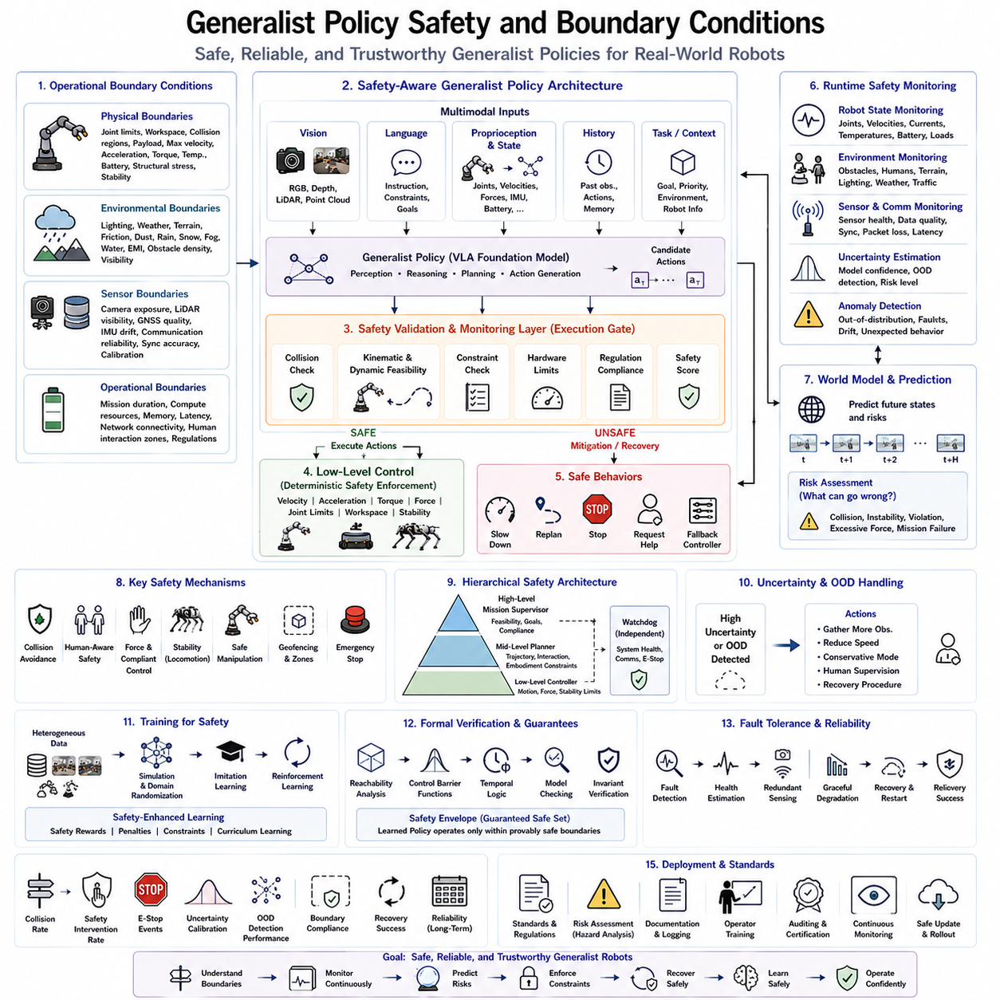{width="7.268055555555556in" height="7.268055555555556in"}

**42_09_09 일반화 정책(Generalist Policy)의 안전성(Safety)과 경계 조건(Boundary Conditions)**

일반화 정책(Generalist Policy)은 하나의 인공지능 정책(Policy)으로 다양한 작업(Task), 여러 환경(Environment), 서로 다른 로봇 구현체(Embodiment)를 제어할 수 있도록 하는 차세대 로봇 기술이다. 그러나 이러한 범용성은 새로운 안전 문제(Safety Challenge)도 함께 가져온다. 기존의 로봇 제어기는 제한된 환경에서 동작하도록 정밀하게 설계되었지만, 일반화 정책은 학습하지 않은 환경에서도 동작해야 한다. 따라서 높은 성능뿐 아니라 안전한 동작을 보장하기 위한 안전 프레임워크(Safety Framework)가 필수적이며, 이는 정책의 핵심 구성 요소로 포함되어야 한다.

기존 산업용 로봇은 결정론적 제어(Deterministic Control)를 기반으로 안전성을 확보하였다. 모든 동작은 미리 정의되었고, 작업 공간(Workspace)과 환경(Environment)도 엄격하게 제한되었다. 반면 파운데이션 정책(Foundation Policy)은 신경망 추론(Neural Inference)을 통해 실시간으로 행동을 생성하기 때문에 예측하지 못한 상황에서 불확실성이 발생할 수 있다. 따라서 학습 기반 지능(Learning-based Intelligence)과 전통적인 제어 공학(Control Engineering)을 함께 사용하는 새로운 안전 구조가 필요하다.

경계 조건(Boundary Conditions)은 로봇이 안전하게 동작할 수 있는 허용 범위를 의미한다. 모든 로봇은 관절(Joint), 액추에이터(Actuator), 적재 하중(Payload), 배터리(Battery), 온도(Thermal), 통신(Communication), 위치 추정(Localization), 지형(Terrain), 장애물 밀도(Obstacle Density), 시야(Visibility) 등에 한계가 존재한다. 안전한 일반화 정책은 이러한 경계 조건을 명확히 정의하고, 실행 중에도 지속적으로 감시하여 허용 범위를 벗어나기 전에 적절한 대응을 수행한다.

경계 조건은 여러 영역으로 나눌 수 있다. 물리적 경계(Physical Boundary)는 관절 제한(Joint Limit), 작업 공간, 충돌 영역(Collision Region), 적재 하중, 최대 속도(Maximum Velocity), 가속도(Acceleration), 액추에이터 온도, 배터리 전압(Battery Voltage), 구조 강도(Structural Stress), 안정성(Stability)을 포함한다. 환경적 경계(Environmental Boundary)는 조명(Lighting), 날씨(Weather), 지면 마찰(Floor Friction), 먼지(Dust), 비(Rain), 눈(Snow), 안개(Fog), 물(Water), 전자기 간섭(Electromagnetic Interference), 장애물 복잡도 등을 의미한다.

센서 경계(Sensor Boundary)는 카메라 노출(Camera Exposure), 라이다 가시성(LiDAR Visibility), GNSS 품질, IMU 드리프트(IMU Drift), 통신 품질(Communication Reliability), 시간 동기화(Synchronization Accuracy), 센서 보정(Calibration)과 관련된다. 운영 경계(Operational Boundary)는 임무 수행 시간(Mission Duration), 계산 자원(Computational Resource), 메모리(Memory), 추론 지연(Latency), 네트워크 연결(Network Connectivity), 사람과의 협업 구역(Human Interaction Zone) 등을 포함한다. 이러한 조건을 모두 만족해야만 일반화 정책은 안전하게 운용될 수 있다.

안전한 일반화 정책의 핵심 원칙은 의사결정(Decision Intelligence)과 실행 권한(Execution Authority)을 분리하는 것이다. 파운데이션 정책은 행동 후보(Action Candidate)를 생성하지만, 생성된 명령이 곧바로 로봇에 전달되지는 않는다. 실행 전에는 안전 검증 계층(Safety Validation Layer)이 모든 행동을 검사하여 충돌 여부(Collision-Free Motion), 운동학 가능성(Kinematic Feasibility), 동적 안정성(Dynamic Stability), 하드웨어 적합성(Hardware Compatibility), 운영 규칙(Operation Constraint)을 확인한다. 검증을 통과한 행동만 실제 액추에이터로 전달된다.

실행 시간 안전 감시(Runtime Safety Monitoring)는 작업이 진행되는 동안 지속적으로 동작한다. 관절 속도(Joint Velocity), 모터 전류(Motor Current), 배터리 온도(Battery Temperature), 액추에이터 부하(Actuator Load), 위치 추정 신뢰도(Localization Confidence), 장애물 거리(Obstacle Proximity), 힘 센서(Force Sensor), 통신 품질(Communication Quality)을 실시간으로 감시한다. 이상이 감지되면 속도를 줄이거나, 경로를 수정하거나, 작업을 중단하여 위험 상황으로 발전하는 것을 방지한다.

불확실성 추정(Uncertainty Estimation)은 일반화 정책에서 매우 중요한 역할을 한다. 신경망은 경험하지 못한 상황에서도 항상 답을 생성하려는 특성이 있기 때문에, 자신의 예측을 얼마나 신뢰할 수 있는지를 함께 계산해야 한다. 이를 위해 베이지안 신경망(Bayesian Neural Network), 앙상블(Ensemble), 몬테카를로 드롭아웃(Monte Carlo Dropout), 신뢰도 보정(Confidence Calibration), 잠재 공간 밀도 추정(Latent Density Estimation) 등이 사용된다. 불확실성이 높으면 추가 센서 정보를 수집하거나, 속도를 낮추거나, 사람의 개입을 요청할 수 있다.

분포 외 탐지(Out-of-Distribution Detection)는 학습하지 않은 상황을 인식하는 기술이다. 새로운 물체(New Object), 처음 보는 환경(Unseen Environment), 센서 고장(Sensor Failure), 악천후(Severe Weather), 새로운 로봇 구조(New Embodiment) 등이 대표적인 사례이다. 이러한 상황에서는 일반적인 행동을 수행하기보다 보수적인 안전 모드(Safe Mode)나 복구 절차(Recovery Procedure)를 실행하는 것이 바람직하다. 이는 실제 개방형 환경(Open World)에서 매우 중요한 기능이다.

충돌 회피(Collision Avoidance)는 모든 로봇에서 가장 기본적인 안전 기능이다. 일반화 정책은 카메라(Camera), 라이다(LiDAR), 깊이 센서(Depth Sensor), 점유 지도(Occupancy Map), 의미 기반 장면 이해(Semantic Scene Understanding), 미래 경로 예측(Trajectory Prediction)을 이용하여 충돌 없는 경로를 생성한다. 사람, 차량, 동물, 다른 로봇과 같은 동적 장애물(Dynamic Obstacle)은 단순 반응이 아니라 미래 움직임까지 예측하여 회피해야 한다.

사람 중심 안전(Human-Aware Safety)은 협동로봇(Collaborative Robot)과 서비스 로봇에서 더욱 중요하다. 일반화 정책은 사람을 단순한 장애물이 아니라 협업 대상(Collaboration Partner)으로 인식해야 한다. 사람의 위치(Position), 이동 방향(Motion), 제스처(Gesture), 음성 명령(Verbal Instruction), 개인 공간(Personal Space)을 이해하고 안전한 거리를 유지하면서도 효율적으로 협업해야 한다. 이는 의미 기반 인간 이해(Semantic Human Understanding)를 요구하는 분야이다.

운동 제약(Motion Constraint)은 학습 기반 정책과 관계없이 반드시 적용되는 물리적 안전 장치이다. 속도 제한(Velocity Limit), 가속도 제한(Acceleration Bound), 저크(Jerk), 토크(Torque), 힘(Force), 작업 공간(Workspace), 관절 제한(Joint Limit), 안정성(Stability)은 저수준 제어기(Low-Level Controller)가 항상 강제로 유지한다. 따라서 상위 정책이 잘못된 명령을 생성하더라도 물리적으로 위험한 행동은 수행되지 않는다.

조작 안전(Manipulation Safety)은 물체와 직접 접촉하는 과정에서 매우 중요하다. 일반화 정책은 물체의 특성에 따라 파지 힘(Grasp Force), 접촉 압력(Contact Pressure), 삽입 속도(Insertion Speed), 조작 토크(Manipulation Torque), 공구 자세(Tool Orientation), 순응 제어(Compliance)를 조절해야 한다. 깨지기 쉬운 물체는 부드럽게 다루고, 무거운 산업용 부품은 충분한 힘으로 안정적으로 조작해야 한다.

이동 로봇 안전(Mobile Robot Safety)은 자율주행과 관련된 다양한 조건을 포함한다. AMR은 위치 추정 오차(Localization Uncertainty), 휠 미끄러짐(Wheel Slip), 주행 가능 지형(Terrain Traversability), 동적 교통(Dynamic Traffic), 비상구(Emergency Exit), 제한 구역(Restricted Area), 충전 정렬(Docking Alignment), 보행자(Pedestrian)를 지속적으로 고려해야 한다. 실외에서는 날씨와 지형 변화까지 함께 고려하여 안전한 이동을 수행해야 한다.

사족보행 로봇(Legged Robot)은 균형과 보행이 가장 중요한 안전 요소이다. 발 디딜 위치(Foothold), 무게 중심(Center of Mass), 접촉력(Contact Force), 보행 패턴(Gait), 지면 변형(Terrain Deformation), 미끄러짐 가능성(Slip Probability), 복구 능력(Recovery Capability)을 지속적으로 평가해야 한다. 일반화 정책은 미래의 균형 상태를 예측하여 넘어질 위험을 사전에 방지하는 예측 기반 안정성(Predictive Stability)을 활용한다.

월드 모델(World Model)은 안전성을 한 단계 향상시키는 핵심 기술이다. 실제 행동을 수행하기 전에 내부적으로 미래를 시뮬레이션하여 충돌(Collision), 불안정(Stability Loss), 막다른 길(Dead End), 과도한 힘(Excessive Force), 작업 실패(Task Failure)를 미리 예측한다. 위험한 결과가 예상되면 보다 안전한 대안을 선택하므로 시행착오를 줄이고 사고를 예방할 수 있다.

계층형 안전 구조(Hierarchical Safety Architecture)는 여러 단계에서 안전을 보장한다. 상위 계층은 임무 적합성(Mission Feasibility)과 규정 준수(Regulatory Compliance)를 확인하고, 중간 계층은 경로(Trajectory)와 환경(Environment)을 평가하며, 하위 계층은 물리적 한계(Motion, Force, Stability)를 직접 제어한다. 별도의 감시기(Watchdog)는 계산 시스템, 통신, 긴급 상황(Emergency Condition)을 독립적으로 감시하여 단일 오류(Single Point Failure)를 방지한다.

형식 검증(Formal Verification)은 학습 기반 정책을 보완하는 중요한 기술이다. 도달 가능성 분석(Reachability Analysis), 제어 배리어 함수(Control Barrier Function), 시간 논리(Temporal Logic), 모델 검사(Model Checking), 불변성 검증(Invariant Verification) 등을 이용하여 안전성을 수학적으로 증명한다. 아직 대규모 신경망 전체를 완전히 검증하는 것은 어렵지만, 학습 정책과 형식 검증을 결합한 하이브리드(Hybrid) 방식이 안전성이 중요한 산업 분야에서 활발히 연구되고 있다.

시뮬레이션(Simulation)은 안전 검증에 매우 효과적이다. 실제 환경에서는 수행하기 어려운 극단적인 상황과 위험한 시나리오를 반복적으로 시험할 수 있기 때문이다. 날씨, 조명, 센서 고장, 액추에이터 오류, 통신 지연, 장애물 행동, 환경 변화 등을 지속적으로 변경하면서 수백만 개 이상의 안전 시나리오를 평가할 수 있으며, 이를 통해 실제 환경에서 발생 가능한 다양한 위험을 사전에 분석할 수 있다.

고장 허용(Fault Tolerance)은 하드웨어와 소프트웨어의 오류를 고려하는 기술이다. 센서 고장(Sensor Failure), 액추에이터 이상(Actuator Malfunction), 배터리 문제(Battery Fault), 네트워크 단절(Network Failure), 메모리 오류(Memory Corruption), 프로세서 과부하(Processor Overload), 위치 추정 실패(Localization Failure) 등이 발생해도 시스템은 즉시 중단되지 않고 안전하게 성능을 저하시켜야 한다. 이를 위해 중복 센서(Redundant Sensor), 자가 진단(Self-Diagnosis), 건강 상태 추정(Health Estimation), 비상 정지(Emergency Stop), 자동 복구(Autonomous Recovery)가 함께 사용된다.

지속 학습(Continual Learning)은 새로운 안전 문제를 가져온다. 로봇은 새로운 지식을 계속 학습하지만, 새롭게 학습한 내용이 기존의 안전성을 훼손해서는 안 된다. 이를 위해 재생 버퍼(Replay Buffer), 정규화(Regularization), 안전 검증 데이터셋(Safety Validation Dataset), 단계적 배포(Staged Deployment)를 함께 사용하여 기존 안전성을 유지하면서 새로운 기능만 추가하도록 한다.

안전 정책의 평가는 단순한 작업 성공률(Task Success Rate)이 아니라 충돌 빈도(Collision Frequency), 안전 개입 횟수(Safety Intervention Rate), 비상 정지(Emergency Stop), 불확실성 보정(Uncertainty Calibration), 분포 외 탐지(Out-of-Distribution Detection), 경계 조건 준수(Boundary Condition Compliance), 복구 성공률(Recovery Success), 고장 허용(Fault Tolerance), 인간과의 협업 품질(Human Interaction Quality), 장기 운영 안정성(Long-Term Reliability) 등을 종합적으로 분석하여 수행한다.

산업 현장에서는 국제 안전 규격(International Safety Standard)과 인증(Certification)을 반드시 만족해야 한다. 협동로봇, AMR, 의료 로봇(Medical Robot), 물류 자동화(Logistics Automation), 검사 로봇(Inspection Robot), 서비스 로봇(Service Robot)은 각각 서로 다른 안전 기준을 적용받는다. 따라서 일반화 정책은 학습 기반 지능을 유지하면서도 기존 산업 규격과 호환되는 결정론적 안전 구조를 함께 제공해야 한다.

향후 일반화 정책은 자신의 판단을 스스로 설명(Self-Explanation)하고, 행동 전에 위험을 예측(Risk Prediction)하며, 장기적인 안전 영향을 분석하고, 상황에 따라 경계 조건을 동적으로 조정(Dynamic Boundary Adaptation)하는 방향으로 발전할 것이다. 멀티모달 인식(Multimodal Perception), 월드 모델(World Model), 지속 학습(Continual Learning), 형식 검증(Formal Verification), 불확실성 추정(Uncertainty Estimation), 계층형 안전 감독(Hierarchical Safety Supervision)이 결합되면서 다양한 로봇과 환경에서도 신뢰할 수 있는 범용 물리 AI(Universal Physical AI)가 구현될 것으로 기대된다. 안전성과 명확한 경계 조건은 앞으로도 범용 로봇 인공지능의 가장 중요한 기반 기술로 남을 것이다.

## 9.10 Industrial Deployment Case Studies (with Code)

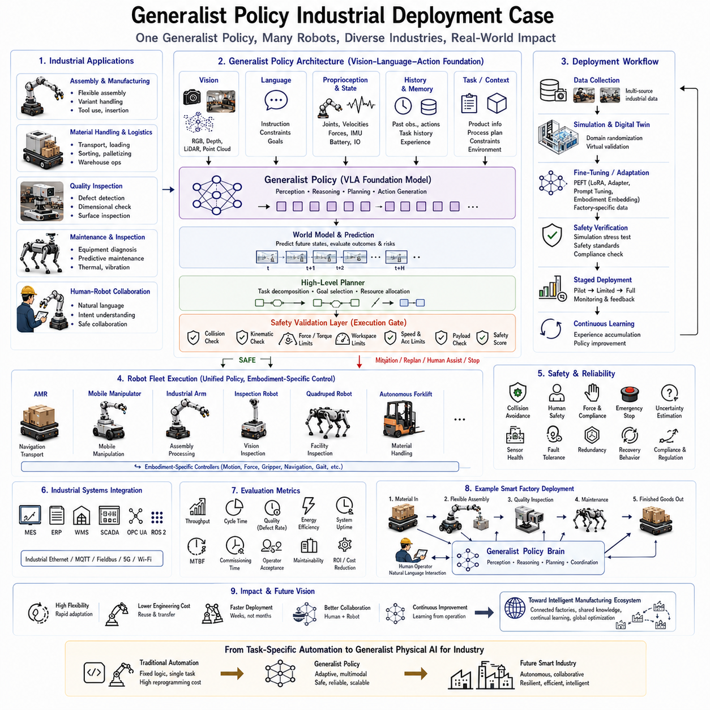{width="7.268055555555556in" height="7.268055555555556in"}

**42_09_10 일반화 정책(Generalist Policy)의 산업 현장 적용 사례(Industrial Deployment Case)**

일반화 정책(Generalist Policy)의 산업 현장 적용은 기존의 반복 작업 중심 자동화에서 지능형 물리 AI(Physical AI) 기반 스마트 제조로 전환하는 중요한 변화이다. 기존 산업용 로봇은 미리 정의된 작업만 수행하도록 설계되었지만, 일반화 정책은 다양한 생산 환경과 작업을 이해하고 변화하는 요구사항에 적응할 수 있다. 자연어(Language)를 이해하고 환경을 추론하며 적절한 행동(Action)을 생성할 수 있기 때문에 생산 유연성(Flexibility)을 높이고, 개발 비용과 구축 기간을 크게 줄일 수 있다.

기존 산업 자동화는 자동차, 반도체, 제약, 전자 산업처럼 제품이 일정하고 반복 생산이 이루어지는 환경에서는 매우 높은 효율을 보여 왔다. 그러나 최근에는 다품종 소량 생산(High-Mix Low-Volume), 맞춤형 생산(Custom Manufacturing), 제품 주기 단축(Short Product Lifecycle), 노동력 부족(Labor Shortage) 등으로 인해 기존 방식의 한계가 나타나고 있다. 제품이 조금만 변경되어도 프로그램 수정, 시스템 통합(System Integration), 보정(Calibration), 검증(Validation), 작업자 교육을 다시 수행해야 하기 때문이다. 일반화 정책은 기존 지식을 새로운 작업으로 전이(Transfer)하여 이러한 문제를 해결한다.

산업용 일반화 정책은 여러 산업 분야에서 수집한 대규모 데이터셋(Dataset)을 기반으로 사전학습(Pretraining)된다. 제조 공정(Manufacturing Process), 조작(Manipulation), 이동(Navigation), 검사(Inspection), 힘 센서(Force Sensor), 촉각(Tactile), 물류(Logistics), 유지보수(Maintenance), 사람의 작업 시연(Human Demonstration) 등이 함께 학습된다. 이를 통해 특정 작업을 암기하는 것이 아니라 산업 환경 전반에 적용 가능한 물리적 원리와 작업 지식을 습득하게 된다.

일반화 정책의 가장 큰 장점 가운데 하나는 새로운 생산 라인(New Production Line)에 빠르게 적용할 수 있다는 점이다. 기존에는 새로운 생산 공정을 위해 모든 소프트웨어를 다시 개발해야 했지만, 일반화 정책은 사전학습된 모델을 기반으로 소량의 데이터만 이용하여 미세조정(Fine-Tuning)을 수행하면 된다. 공장별 장비, 공구(Tool), 제품 형상(Product Geometry), 작업 공간(Workspace), 로봇 특성만 추가로 학습하면 되므로 구축 기간을 수개월에서 수주 수준으로 단축할 수 있다.

조립 공정(Assembly)은 일반화 정책의 대표적인 적용 분야이다. 현대 제조업은 제품 종류와 설계가 지속적으로 변경되기 때문에 기존의 고정된 조립 프로그램만으로는 대응하기 어렵다. 일반화 정책은 "새로운 하우징을 조립하라", "변경된 커넥터를 설치하라", "새로운 밸브를 검사하라"와 같은 자연어 명령을 이해하고, 현재의 제품 상태와 환경을 분석하여 적절한 조립 전략을 스스로 생성한다. 따라서 설계 변경에도 높은 적응성을 유지할 수 있다.

자재 이송(Material Handling)은 또 다른 중요한 응용 분야이다. 자율이동로봇(Autonomous Mobile Robot, AMR), 이동형 매니퓰레이터(Mobile Manipulator), 물류 로봇(Logistics Robot), 자율 지게차(Autonomous Forklift)가 동일한 일반화 정책을 공유하면 운반, 적재, 하역, 분류(Sorting), 재고 이동을 하나의 통합 시스템으로 운영할 수 있다. 이동 경험과 물류 지식이 여러 플랫폼에서 공유되므로 전체 물류 효율도 크게 향상된다.

품질 검사(Quality Inspection)는 일반화 정책이 특히 효과적인 분야이다. 기존에는 제품마다 검사 프로그램을 새롭게 작성해야 했지만, 일반화 정책은 CAD 모델(CAD Model), 디지털 트윈(Digital Twin), 검사 규격(Inspection Instruction), 자연어 설명을 함께 이해하여 검사 절차를 자동으로 생성한다. 또한 비전 시스템(Vision System)을 이용하여 결함(Defect), 치수 오차(Dimensional Deviation), 조립 오류(Assembly Error), 표면 손상(Surface Damage), 부식(Corrosion), 오염(Contamination) 등을 자동으로 검출할 수 있다.

설비 유지보수(Maintenance)는 일반화 정책이 높은 가치를 제공하는 또 다른 분야이다. 공장, 발전소(Power Plant), 정유 시설(Refinery), 화학 플랜트(Chemical Plant), 터널(Tunnel), 물류센터 등은 환경이 매우 다양하기 때문에 기존의 결정론적 프로그램으로 대응하기 어렵다. 일반화 정책은 카메라(Camera), 열화상(Thermal Imaging), 음향(Acoustic Sensor), 진동(Vibration Sensor), 유지보수 문서(Maintenance Manual), 과거 이력(Historical Record)을 함께 분석하여 설비 상태를 진단하고 적절한 유지보수 작업을 수행한다.

협동로봇(Collaborative Robot)은 일반화 정책의 언어 이해(Language Understanding) 능력을 잘 보여주는 사례이다. 작업자는 "다음 부품을 가져와라", "이 부품을 잡아라", "손상된 부분을 검사하라", "용접 준비를 하라"와 같은 자연어로 로봇을 제어할 수 있다. 일반화 정책은 작업자의 의도(Intent), 현재 작업 상태(Current Context), 생산 일정(Production Schedule)을 함께 고려하여 적절한 행동을 생성하므로 사람과 로봇이 더욱 자연스럽게 협업할 수 있다.

현대 스마트 팩토리(Smart Factory)는 AMR, 산업용 매니퓰레이터(Industrial Manipulator), 이동형 매니퓰레이터, 검사 로봇(Inspection Robot), 사족보행 로봇(Quadruped), 자율 지게차, 서비스 로봇(Service Robot) 등 다양한 로봇을 동시에 운용한다. 일반화 정책은 이러한 이기종 로봇(Heterogeneous Robot)을 하나의 공통 인지 구조(Cognitive Architecture)로 통합한다. 지각(Perception), 추론(Reasoning), 계획(Planning), 언어 이해(Language Understanding)는 공유하고, 각 로봇은 구현체별 제어기(Embodiment-Specific Controller)를 통해 자신의 움직임만 생성한다.

디지털 트윈(Digital Twin)은 일반화 정책의 산업 적용을 더욱 효율적으로 만든다. 실제 공장의 설비, 컨베이어, 기계, 센서, 작업자, 환경을 가상 공간에 그대로 구현하고, 다양한 시뮬레이션(Simulation)을 수행하여 정책을 먼저 학습한다. 도메인 랜덤화(Domain Randomization)를 이용하여 조명(Lighting), 물체 형상(Object Variation), 센서 잡음(Sensor Noise), 기계 오차(Machine Tolerance)를 지속적으로 변경하면 실제 환경에서도 높은 일반화 성능을 확보할 수 있다.

공장마다 장비와 공정이 다르기 때문에 미세조정(Fine-Tuning)은 매우 중요한 단계이다. 저랭크 적응(Low-Rank Adaptation, LoRA), 어댑터(Adapter), 프롬프트 튜닝(Prompt Tuning), 구현체 임베딩(Embodiment Embedding)과 같은 파라미터 효율적 미세조정(Parameter-Efficient Fine-Tuning, PEFT)을 이용하면 수십억 개의 파라미터를 모두 다시 학습하지 않고도 공장별 맞춤형 AI를 구축할 수 있다. 따라서 여러 공장이 하나의 공통 파운데이션 모델을 공유하면서도 각자의 생산 환경에 최적화된 정책을 유지할 수 있다.

안전성(Safety)은 산업 현장에서 가장 중요한 요소이다. 일반화 정책은 고가의 장비, 위험 물질(Hazardous Material), 사람, 자율주행 로봇이 함께 존재하는 환경에서 동작한다. 따라서 충돌 회피(Collision Avoidance), 속도 제한(Velocity Limit), 작업 공간 제한(Workspace Boundary), 적재 하중(Payload), 비상 정지(Emergency Stop), 힘 제한(Force Constraint), 위치 추정 신뢰도(Localization Confidence)를 실행 전에 반드시 검증한다. 별도의 안전 감시기(Safety Supervisor)가 항상 최종 제어 권한을 가지고 있으므로 AI의 예측 오류가 직접 사고로 이어지지 않는다.

불확실성 추정(Uncertainty Estimation)은 산업 현장의 신뢰성을 더욱 높인다. 새로운 제품(New Product), 손상된 부품(Damaged Component), 센서 이상(Sensor Failure), 조명 변화(Lighting Change), 통신 오류(Network Failure), 희귀한 기계 고장(Rare Machine Fault)이 발생하면 일반화 정책은 이를 새로운 상황으로 인식한다. 이 경우 속도를 줄이거나, 추가 정보를 수집하거나, 작업자의 확인을 요청하거나, 안전 모드(Fallback Mode)로 전환하여 사고를 예방한다.

산업 현장에서는 클라우드-엣지 협업(Cloud-Edge Collaboration) 구조가 점점 중요해지고 있다. 클라우드의 GPU 서버에서는 생산 일정(Production Scheduling), 멀티모달 추론(Multimodal Reasoning), 월드 모델(World Model), 지식 검색(Knowledge Retrieval), 플릿 최적화(Fleet Optimization)를 수행한다. 반면 각 로봇의 엣지 컴퓨터(Edge Computer)는 실시간 센서 처리(Sensor Fusion), 지역 경로 계획(Local Planning), 안전 감시(Safety Monitoring), 실시간 제어(Real-Time Control)를 수행한다. 이를 통해 높은 계산 성능과 실시간성을 동시에 확보할 수 있다.

일반화 정책은 기존 산업 시스템과의 연동도 중요하다. 산업용 이더넷(Industrial Ethernet), OPC UA, MQTT, ROS 2, 필드버스(Fieldbus), 제조 실행 시스템(Manufacturing Execution System, MES), 전사적 자원 관리(Enterprise Resource Planning, ERP), 창고 관리 시스템(Warehouse Management System, WMS), 감시 제어 시스템(Supervisory Control and Data Acquisition, SCADA)과 연동하여 기존 자동화 시스템을 그대로 활용할 수 있다. 따라서 전체 공장을 새롭게 구축하지 않고도 AI 기반 자동화를 단계적으로 도입할 수 있다.

산업 적용의 평가는 단순한 작업 성공률이 아니라 생산량(Production Throughput), 사이클 타임(Cycle Time), 제품 품질(Product Quality), 불량률(Defect Rate), 에너지 소비(Energy Consumption), 유지보수 비용(Maintenance Cost), 시스템 가동률(System Availability), 평균 고장 간격(Mean Time Between Failures), 구축 기간(Commissioning Time), 작업자 만족도(Operator Acceptance), 유지보수성(Maintainability), 사이버 보안(Cybersecurity), 장기 운영 안정성(Long-Term Stability)을 종합적으로 고려한다. 기술적 성능뿐 아니라 실제 경제적 효과까지 함께 평가해야 한다.

대표적인 스마트 제조 사례에서는 AMR이 자재를 운반하고, 이동형 매니퓰레이터가 조립을 수행하며, 검사 로봇이 제품 품질을 확인하고, 사족보행 로봇이 설비를 점검한다. 작업자는 자연어를 이용하여 여러 로봇과 협업하며, 하나의 일반화 정책이 전체 로봇 플릿(Fleet)의 작업 계획과 자원 배분을 관리한다. 각 로봇은 자신의 구현체에 맞는 움직임만 생성하므로 다양한 로봇이 하나의 지능을 공유하면서 효율적으로 협업할 수 있다.

또 다른 적용 사례는 산업 시설 유지보수이다. 고해상도 카메라, 열화상 카메라, 라이다(LiDAR), 초음파 센서(Ultrasonic Sensor), 매니퓰레이터를 장착한 검사 로봇이 공장 내부를 자율적으로 이동하면서 설비 상태를 점검한다. 일반화 정책은 유지보수 매뉴얼을 이해하고 이상 상태를 발견하며 우선순위를 결정하고, 작업자에게 적절한 수리 방안을 제안한다. 여러 공장에서 축적된 유지보수 경험은 다른 공장으로도 전이되어 예지보전(Predictive Maintenance) 성능을 지속적으로 향상시킨다.

대규모 물류센터(Logistics Center)에서도 일반화 정책은 높은 효과를 제공한다. 창고 운반(Warehouse Transportation), 재고 검사(Inventory Inspection), 로봇 피킹(Robotic Picking), 팔레트 운반(Pallet Handling), 컨테이너 적재(Container Loading), 자동 재고 확인(Automated Inventory Verification)을 하나의 정책이 관리한다. 창고 구조나 상품 종류가 변경되더라도 자연어와 의미 기반 이해를 통해 빠르게 적응할 수 있으며, 여러 로봇이 경험을 공유하여 물류 효율을 지속적으로 향상시킨다.

향후 산업용 일반화 정책은 개별 공장을 넘어 전 세계적으로 연결된 제조 생태계(Global Manufacturing Ecosystem)로 발전할 것이다. 여러 국가의 공장이 생산 최적화(Production Optimization), 설비 유지보수(Equipment Maintenance), 결함 검출(Defect Detection), 에너지 관리(Energy Management), 안전성 향상(Safety Improvement), 공정 혁신(Process Innovation)에 대한 지식을 지속적으로 공유하면서도 데이터 보안(Data Privacy)과 지식재산권(Intellectual Property)을 보호하는 구조가 구축될 것으로 예상된다.

물리 AI(Physical AI)가 발전함에 따라 일반화 정책은 산업용 로봇의 공통 지능 계층(Common Intelligence Layer)이 될 가능성이 높다. 제품이나 공정마다 별도의 소프트웨어를 개발하는 시대에서 벗어나, 하나의 범용 파운데이션 정책을 기반으로 다양한 로봇을 지원하고, 변화하는 생산 환경에 빠르게 적응하며, 사람과 자연스럽게 협업하고, 지속적인 학습을 통해 스스로 성능을 향상시키는 차세대 스마트 제조(Smart Manufacturing)의 핵심 기술로 자리 잡을 것으로 전망된다.
