**Volume 20. Vision Language Action (VLA) Models**

# Chapter 10. VLA Deployment and Inference

## 10.1 Edge-Cloud Hybrid Deployment

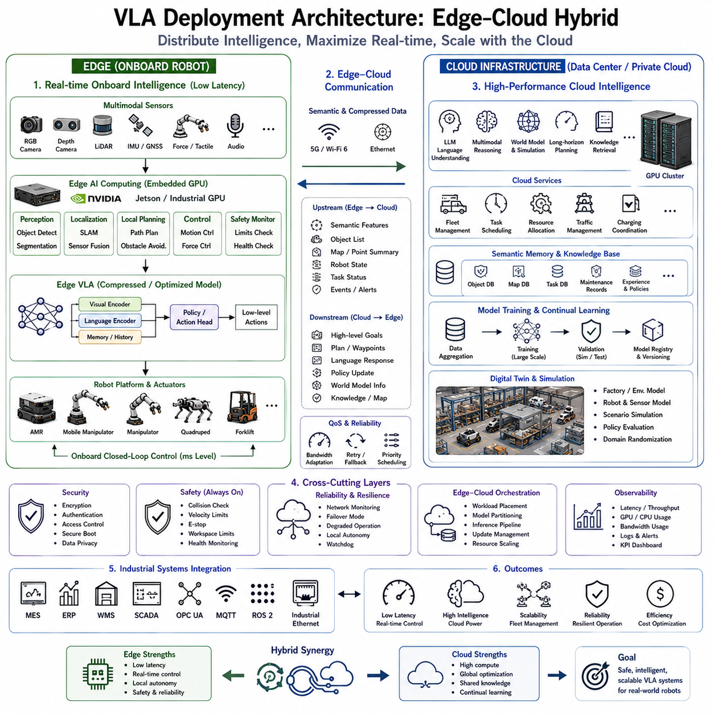{width="7.268055555555556in" height="7.268055555555556in"}

**42_10_01 비전-언어-행동(Vision-Language-Action, VLA) 배포 아키텍처: 엣지-클라우드 하이브리드(Edge--Cloud Hybrid)**

비전-언어-행동(Vision-Language-Action, VLA) 시스템의 배포 아키텍처는 현대 물리 AI(Physical AI)에서 가장 중요한 기술 가운데 하나이다. 로봇은 실시간성(Real-Time), 높은 연산 성능(Computational Capability), 신뢰성(Reliability), 확장성(Scalability), 운영 비용(Operation Cost)을 동시에 만족해야 하기 때문이다. VLA 모델은 비전(Vision), 언어(Language), 의미 추론(Semantic Reasoning), 월드 모델(World Model), 계획(Planning), 행동 생성(Action Generation)을 하나의 구조로 통합하지만, 이러한 기능은 매우 큰 연산 자원을 요구한다. 따라서 실제 산업에서는 엣지-클라우드 하이브리드 구조가 가장 현실적인 배포 방식으로 자리 잡고 있다.

기존 로봇은 대부분 모든 계산을 로봇 내부에서 수행하는 온보드(Onboard) 구조를 사용하였다. 센서 처리, 위치 추정(Localization), 경로 계획(Path Planning), 제어(Control)를 모두 로봇 내부 프로세서에서 실행하였기 때문에 통신 장애와 관계없이 안정적으로 동작할 수 있었다. 그러나 최근의 대규모 멀티모달(Multimodal) 파운데이션 모델은 수십억 개의 파라미터를 가지므로, 임베디드 컴퓨터만으로는 실시간 추론이 어려워졌다. GPU와 클라우드 컴퓨팅의 발전으로 이러한 구조는 점차 변화하고 있다.

현대 VLA 시스템은 RGB 카메라, 깊이 카메라(Depth Camera), 라이다(LiDAR), 열화상(Thermal Camera), 힘 센서(Force Sensor), 촉각(Tactile Sensor), GNSS, IMU, 오디오(Audio) 등 다양한 센서를 동시에 처리한다. 또한 자연어(Language), 과거 작업 이력(History), 메모리(Memory), 월드 모델(World Model)까지 함께 사용하므로 연산량이 매우 크다. 이러한 계산을 모두 로봇 내부에서 수행하면 전력(Power), 발열(Thermal), 비용(Cost) 측면에서 현실적인 한계가 발생한다.

엣지-클라우드 하이브리드 구조는 이러한 문제를 해결하기 위해 연산을 적절히 분산한다. 실시간성이 필요한 기능은 엣지 컴퓨터(Edge Computer)에서 수행하고, 높은 연산량이 필요한 추론은 클라우드 GPU 서버에서 수행한다. 즉, 엣지와 클라우드는 서로 경쟁하는 구조가 아니라 서로의 장점을 활용하는 협력 구조이다. 이를 통해 실시간성과 높은 AI 성능을 동시에 확보할 수 있다.

엣지 컴퓨팅(Edge Computing)은 로봇의 실시간 지능 계층(Real-Time Intelligence Layer)을 담당한다. 센서 데이터 처리(Sensor Processing), 위치 추정(Localization), 장애물 검출(Obstacle Detection), 센서 융합(Sensor Fusion), 지역 경로 계획(Local Planning), 모션 제어(Motion Control), 안전 감시(Safety Monitoring)와 같은 기능은 반드시 로봇 내부에서 수행된다. 네트워크가 끊기더라도 최소한의 자율주행과 안전한 조작은 유지되어야 하기 때문이다.

최근의 엣지 하드웨어는 NVIDIA Jetson 계열과 산업용 GPU 컴퓨터를 중심으로 발전하고 있다. 이들은 경량화된 VLA 모델을 실행하면서 객체 검출(Object Detection), 의미 분할(Semantic Segmentation), Visual SLAM, 지역 경로 생성(Local Trajectory), 충돌 회피(Collision Avoidance), 힘 제어(Force Control), 구현체 전용 제어(Embodiment Control)를 수행한다. 또한 양자화(Quantization), 프루닝(Pruning), 지식 증류(Knowledge Distillation), 연산 최적화(Operator Fusion)를 이용하여 제한된 자원에서도 높은 성능을 유지한다.

클라우드(Cloud)는 엣지에서 수행하기 어려운 대규모 연산을 담당한다. GPU 클러스터(GPU Cluster)는 대형 파운데이션 모델(Foundation Model), 멀티모달 추론(Multimodal Reasoning), 장기 계획(Long-Horizon Planning), 월드 모델 시뮬레이션(World Model Simulation), 의미 메모리(Semantic Memory), 지속 학습(Continual Learning), 플릿 관리(Fleet Coordination)를 수행한다. 로봇은 필요한 경우에만 압축된 의미 정보(Semantic Information)를 전송하여 클라우드의 강력한 AI 기능을 활용한다.

클라우드는 특히 자연어 이해(Language Understanding)와 의미 추론(Semantic Reasoning)에 매우 적합하다. 대규모 언어 모델(Large Language Model, LLM)은 복잡한 명령을 이해하고, 다단계 작업을 분해(Task Decomposition)하며, 필요한 지식을 검색하고(Knowledge Retrieval), 전체 작업 계획(Execution Strategy)을 생성한다. 이후 생성된 고수준 목표(High-Level Goal)만 로봇으로 전달되고, 실제 움직임은 엣지에서 수행된다.

월드 모델(World Model)은 매우 많은 계산이 필요한 기능이다. 미래 환경을 예측하고, 여러 행동 후보(Action Candidate)를 시뮬레이션하며, 위험(Risk)과 장기 결과(Long-Term Consequence)를 분석하는 과정은 모바일 로봇 내부에서 수행하기 어렵다. 따라서 이러한 예측 시뮬레이션은 클라우드 GPU에서 수행하고, 로봇은 현재 환경에 대한 즉각적인 대응만 엣지에서 처리하는 구조가 일반적이다.

플릿 관리(Fleet Management)는 클라우드의 대표적인 역할이다. 공장에는 AMR, 이동형 매니퓰레이터(Mobile Manipulator), 협동로봇(Collaborative Robot), 사족보행 로봇(Quadruped), 검사 로봇(Inspection Robot), 자율 지게차(Autonomous Forklift) 등 수십\~수백 대의 로봇이 함께 운영된다. 클라우드는 작업 스케줄(Task Scheduling), 자원 배분(Resource Allocation), 교통 관리(Traffic Management), 충전 관리(Charging Coordination), 유지보수 계획(Maintenance Planning), 임무 배정(Mission Assignment)을 전체 공장 수준에서 최적화한다.

의미 메모리(Semantic Memory)는 클라우드가 제공하는 또 하나의 중요한 기능이다. 모든 로봇이 동일한 데이터를 각각 저장하는 대신, 클라우드는 물체 데이터베이스(Object Database), 환경 지도(Environment Map), 유지보수 기록(Maintenance Record), 작업 절차(Operation Procedure), 언어 지식(Language Knowledge), 작업 이력(Task History)을 중앙에서 관리한다. 각 로봇은 필요한 정보만 가져오고, 새로운 경험은 다시 클라우드에 저장하여 전체 로봇이 지식을 공유할 수 있도록 한다.

엣지와 클라우드 사이의 데이터 전송(Data Transmission)은 효율적으로 설계되어야 한다. 모든 카메라 영상과 점군(Point Cloud)을 그대로 전송하면 네트워크 대역폭(Bandwidth)이 부족해진다. 따라서 엣지에서는 특징 추출(Feature Extraction), 객체 검출(Object Detection), 의미 분할(Semantic Segmentation), 이벤트 필터링(Event Filtering)을 먼저 수행한 뒤 압축된 의미 정보만 클라우드로 전송한다. 이러한 방식은 대역폭을 크게 줄이면서도 필요한 정보를 유지할 수 있다.

통신 신뢰성(Communication Reliability)은 하이브리드 구조에서 매우 중요하다. 산업용 무선 네트워크는 지연(Latency), 혼잡(Congestion), 일시적인 단절(Network Interruption)이 발생할 수 있다. 따라서 모터 제어(Motor Control), 충돌 회피(Collision Avoidance), 긴급 정지(Emergency Stop), 위치 추정(Localization)은 반드시 로컬에서 수행되어야 한다. 클라우드는 성능을 향상시키는 역할을 하지만 안전 운행의 필수 조건이 되어서는 안 된다.

로봇 기능마다 요구되는 지연 시간(Latency)은 서로 다르다. 모터 제어는 수 밀리초(ms), 충돌 회피와 지역 경로 계획은 수십 밀리초, 자연어 이해와 장기 계획은 수백 밀리초에서 수 초까지 허용될 수 있다. 하이브리드 구조는 이러한 시간 특성에 맞추어 적절한 위치에서 연산을 수행하도록 설계된다.

최근에는 AI 모델 분할(Model Partitioning)도 중요한 연구 분야이다. 대형 트랜스포머(Transformer)를 여러 단계로 나누어 초기 인식 계층은 엣지에서 수행하고, 중간의 의미 표현(Semantic Representation)은 클라우드로 전달한다. 클라우드에서는 고수준 추론을 수행한 후 목표 정보만 다시 엣지에 전달하여 최종 행동을 생성한다. 이를 통해 통신량과 연산량을 동시에 줄일 수 있다.

모델 압축(Model Compression)은 엣지 AI에서 매우 중요하다. 양자화(Quantization)는 계산 정밀도를 낮추어 연산량을 줄이고, 지식 증류(Knowledge Distillation)는 클라우드의 대형 모델 지식을 경량 모델로 전달한다. 또한 프루닝(Pruning)과 신경망 최적화(Neural Architecture Optimization)를 통해 임베디드 GPU에서도 VLA 모델을 실행할 수 있도록 한다.

보안(Security)은 클라우드 연동에서 반드시 고려해야 한다. 통신은 암호화(Encryption), 인증(Authentication), 접근 제어(Access Control), 보안 부팅(Secure Boot), 신뢰 실행 환경(Trusted Execution Environment)을 적용해야 한다. 생산 일정, 공장 지도, 검사 결과, 유지보수 정보 등 산업 데이터는 외부로 유출되어서는 안 되므로 온프레미스 AI(On-Premises AI)와 프라이빗 클라우드(Private Cloud)가 산업 분야에서 선호되고 있다.

안전 구조(Safety Architecture)는 통신과 관계없이 항상 독립적으로 동작해야 한다. 로컬 안전 감시기(Local Safety Monitor)는 관절 제한(Joint Limit), 속도 제한(Velocity Limit), 충돌(Collision), 적재 하중(Payload), 긴급 정지(Emergency Stop), 액추에이터 상태(Actuator Health), 위치 추정 신뢰도(Localization Confidence)를 지속적으로 확인한다. 클라우드 연결이 끊기더라도 로봇은 안전한 자율 동작을 유지해야 한다.

지속 학습(Continual Learning)은 하이브리드 구조의 큰 장점이다. 로봇은 현장에서 작업하면서 새로운 데이터와 실패 사례(Failure Case), 사람의 피드백(Human Feedback), 환경 변화를 수집한다. 이러한 데이터는 클라우드에서 통합되어 전체 플릿(Fleet)의 파운데이션 모델을 재학습하는 데 활용된다. 이후 개선된 모델은 검증 과정을 거쳐 다시 엣지 로봇에 배포되므로 시간이 지날수록 전체 시스템이 지속적으로 발전한다.

디지털 트윈(Digital Twin)은 클라우드의 또 다른 중요한 기능이다. 공장과 로봇의 가상 모델을 이용하여 새로운 정책을 실제 배포 전에 충분히 검증한다. 다양한 조명, 환경 변화, 통신 장애, 센서 오류, 희귀한 고장 상황까지 반복적으로 시뮬레이션하여 충분히 안전성이 검증된 모델만 실제 공장에 배포한다.

산업 현장에서는 제조 실행 시스템(Manufacturing Execution System, MES), 전사적 자원 관리(Enterprise Resource Planning, ERP), 창고 관리 시스템(Warehouse Management System, WMS), 감시 제어 시스템(Supervisory Control and Data Acquisition, SCADA), OPC UA, MQTT, ROS 2와 같은 기존 산업 시스템과의 연동이 필수적이다. 클라우드는 기업 수준의 업무를 관리하고, 엣지 로봇은 실제 물리 작업을 수행하는 계층형 구조를 형성한다.

하이브리드 아키텍처의 평가는 추론 지연(Inference Latency), 통신 대역폭(Bandwidth), 네트워크 신뢰성(Network Resilience), GPU 사용률(GPU Utilization), 메모리 사용량(Memory Consumption), 에너지 효율(Energy Efficiency), 플릿 확장성(Fleet Scalability), 작업 완료 시간(Task Completion Time), 장애 복구(Failover), 사이버 보안(Cybersecurity), 유지보수성(Maintainability), 총소유비용(Total Cost of Ownership, TCO) 등을 종합적으로 고려하여 수행한다.

대표적인 스마트 팩토리 사례에서는 각 로봇의 엣지 컴퓨터가 센서 처리, 위치 추정, 안전 제어, 조작, 자율주행을 수행한다. 공장 내부의 GPU 서버(On-Premises GPU Cluster)는 자연어 이해, 생산 일정, 멀티모달 추론, 예지보전(Predictive Maintenance), 플릿 최적화, 월드 모델을 담당한다. MES와 WMS는 생산과 물류를 관리하며, 전체 시스템은 하나의 통합된 물리 AI 플랫폼으로 운영된다.

또 다른 사례는 대규모 인프라 점검이다. 검사 로봇은 자율주행, 열화상 분석, 라이다 매핑, 이상 탐지를 엣지에서 수행한다. 이상이 발견되면 클라우드에서는 파운데이션 모델을 이용하여 상세한 진단, 유지보수 기록 비교, 수리 방안 생성, 여러 시설의 점검 일정 최적화를 수행한다. 이를 통해 현장의 자율성과 중앙의 전문 지식을 동시에 활용할 수 있다.

향후 엣지-클라우드 하이브리드 구조는 엣지 로봇, 온프레미스 GPU, 퍼블릭 클라우드(Public Cloud), 디지털 트윈, 월드 모델, 지속 학습 시스템을 모두 연결하는 분산형 물리 AI 생태계(Distributed Physical AI Ecosystem)로 발전할 것이다. 통신 기술, 임베디드 AI, 모델 압축, 분산 트랜스포머, 의미 기반 네트워크(Semantic Networking), 자율 오케스트레이션(Autonomous Orchestration)이 발전하면서 엣지와 클라우드는 더 이상 분리된 시스템이 아니라 하나의 통합된 인지 아키텍처(Unified Cognitive Architecture)로 동작하게 될 것이다. 이러한 구조는 차세대 지능형 로봇 플랫폼을 위한 가장 현실적이고 확장 가능한 배포 방식이 될 것으로 전망된다.

## 10.2 Quantization Techniques (with Code)

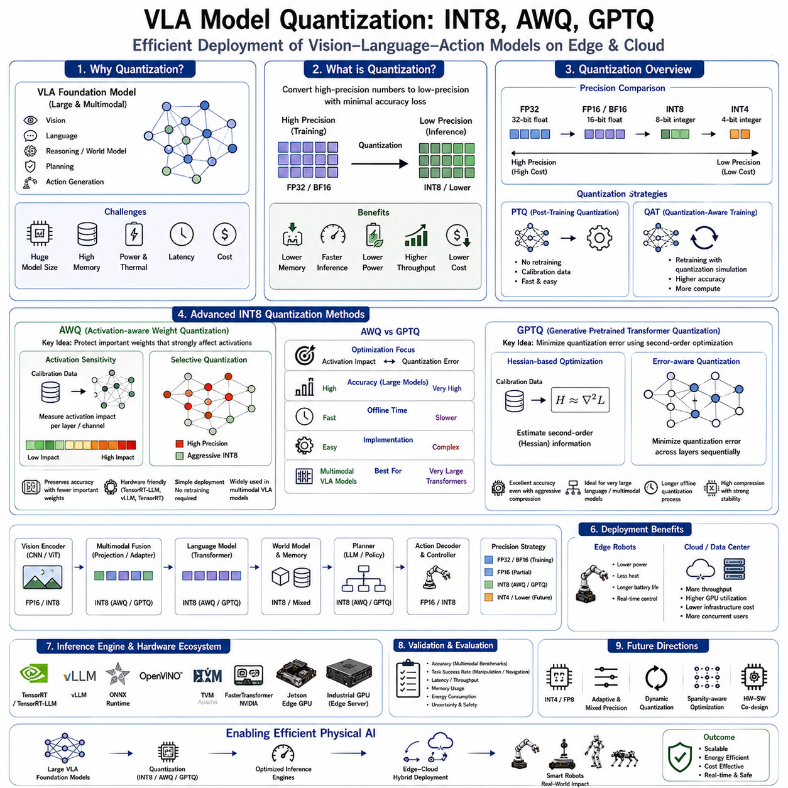{width="7.268055555555556in" height="7.268055555555556in"}

**42_10_02 비전-언어-행동(Vision-Language-Action, VLA) 모델 양자화(Quantization): INT8, AWQ, GPTQ**

비전-언어-행동(Vision-Language-Action, VLA) 모델은 비전(Vision), 자연어(Language), 의미 추론(Semantic Reasoning), 월드 모델(World Model), 작업 계획(Task Planning), 행동 생성(Action Generation)을 하나의 통합 구조에서 수행하는 대규모 파운데이션 모델(Foundation Model)이다. 그러나 이러한 모델은 수십억 개 이상의 파라미터(Parameter)를 포함하는 경우가 많아 엣지 로봇(Edge Robot)이나 임베디드 GPU에서 직접 실행하기 어렵다. 따라서 모델 양자화(Quantization)는 제한된 하드웨어에서도 높은 성능을 유지하면서 VLA 모델을 효율적으로 배포하기 위한 핵심 최적화 기술로 자리 잡고 있다.

양자화는 신경망의 가중치(Weight)와 연산을 높은 정밀도의 부동소수점(Floating Point)에서 낮은 정밀도의 정수(Integer) 또는 저정밀 부동소수점으로 변환하는 과정이다. 대부분의 파운데이션 모델은 FP32(32-bit Floating Point)나 BF16(Brain Floating Point 16)으로 학습되지만, 추론(Inference) 단계에서는 그 정도의 정밀도가 항상 필요한 것은 아니다. 따라서 INT8과 같은 저정밀 표현으로 변환하면 메모리 사용량과 연산량을 크게 줄이면서도 대부분의 성능을 유지할 수 있다.

양자화는 특히 모바일 로봇(Mobile Robot)에서 매우 중요한 의미를 가진다. 자율이동로봇(Autonomous Mobile Robot, AMR), 이동형 매니퓰레이터(Mobile Manipulator), 사족보행 로봇(Quadruped), 휴머노이드(Humanoid), 검사 로봇(Inspection Robot)은 전력(Power), 배터리(Battery), 발열(Thermal), 공간(Size), 비용(Cost)의 제약을 동시에 받는다. 따라서 데이터센터급 GPU를 사용할 수 없으며, NVIDIA Jetson이나 산업용 엣지 GPU를 이용해 VLA 모델을 실행해야 한다. 양자화는 이러한 제약 속에서도 대규모 AI 모델을 실시간으로 실행할 수 있도록 한다.

양자화의 가장 큰 장점은 메모리 사용량(Memory Footprint)을 줄일 수 있다는 점이다. 신경망의 대부분은 가중치 저장에 메모리를 사용하므로 FP16을 INT8로 변환하면 메모리 사용량이 절반 수준으로 감소한다. 더욱 공격적인 양자화 기법을 사용하면 메모리 절감 효과는 더욱 커진다. 메모리 사용량이 감소하면 더 큰 모델을 GPU 메모리에 올릴 수 있고, 메모리 접근이 줄어들어 전체 추론 속도도 향상된다.

연산 효율(Computational Efficiency) 역시 크게 향상된다. 최신 GPU는 INT8과 같은 저정밀 연산을 위해 텐서 코어(Tensor Core)와 전용 정수 연산 장치를 제공한다. 따라서 동일한 하드웨어에서도 초당 처리량(Throughput)이 증가하고 추론 지연(Inference Latency)이 감소한다. 이는 로봇이 더 빠르게 환경을 인식하고 의사결정을 수행할 수 있도록 하며, 실시간 제어(Real-Time Control) 성능을 크게 향상시킨다.

INT8 양자화는 현재 가장 널리 사용되는 방식이다. INT8은 가중치와 활성값(Activation)을 8비트 정수로 표현하며, 스케일링(Scaling)을 이용하여 원래의 부동소수점 값을 근사한다. 대부분의 트랜스포머(Transformer) 기반 모델은 적절한 보정을 수행하면 정확도 손실이 매우 작으며, 메모리와 연산량은 크게 감소한다. 이러한 이유로 INT8은 산업용 AI 추론 엔진에서 사실상의 표준 배포 형식으로 사용되고 있다.

INT8 양자화는 여러 방식으로 구현될 수 있다. 사후 양자화(Post-Training Quantization, PTQ)는 이미 학습된 모델을 별도의 재학습 없이 저정밀 모델로 변환한다. 소량의 보정 데이터(Calibration Dataset)를 이용하여 각 계층(Layer)의 활성값 분포를 분석하고 적절한 스케일을 계산한다. 구현이 간단하고 빠르지만 일부 민감한 모델에서는 약간의 정확도 저하가 발생할 수 있다.

양자화 인식 학습(Quantization-Aware Training, QAT)은 학습 과정에서 양자화를 미리 고려하는 방법이다. 학습 중에 양자화 효과를 모사하여 모델이 저정밀 환경에 적응하도록 만든다. 일반적으로 PTQ보다 높은 정확도를 얻을 수 있지만, 대규모 파운데이션 모델을 다시 학습해야 하므로 매우 많은 계산 자원이 필요하다. 따라서 수십억 개의 파라미터를 가진 VLA 모델에서는 PTQ 기반의 고성능 알고리즘이 더욱 많이 활용된다.

활성값 인식 가중치 양자화(Activation-aware Weight Quantization, AWQ)는 최근 가장 주목받는 양자화 기법 가운데 하나이다. 모든 가중치를 동일하게 처리하지 않고, 활성값(Activation)에 큰 영향을 주는 중요한 가중치만 높은 정밀도로 보호한다. 상대적으로 중요도가 낮은 가중치는 더욱 강하게 양자화하므로 정확도 손실을 최소화하면서도 높은 압축률을 달성할 수 있다.

AWQ의 핵심 원리는 활성값 민감도 분석(Activation Sensitivity Analysis)이다. 보정 데이터를 모델에 입력하여 각 계층과 채널(Channel)의 활성값 변화를 분석하고, 출력 품질에 큰 영향을 미치는 가중치를 우선적으로 보호한다. 트랜스포머 모델에서는 모든 가중치의 중요도가 동일하지 않기 때문에 이러한 선택적 보호는 일반적인 균일 양자화보다 훨씬 높은 정확도를 제공한다.

AWQ는 하드웨어 호환성(Hardware Compatibility)도 우수하다. TensorRT-LLM, TensorRT, vLLM 등 최신 추론 엔진(Inference Engine)에서 직접 지원되므로 산업용 로봇에 쉽게 적용할 수 있다. 구현이 비교적 단순하면서도 높은 정확도를 유지할 수 있기 때문에 현재 멀티모달 VLA 모델의 엣지 배포에서 매우 널리 사용되고 있다.

생성형 사전학습 트랜스포머 양자화(Generative Pretrained Transformer Quantization, GPTQ)는 또 다른 대표적인 사후 양자화 알고리즘이다. GPTQ는 단순히 가중치를 줄이는 것이 아니라 헤시안(Hessian) 정보를 이용하여 양자화 오차(Quantization Error)를 최소화한다. 이를 통해 매우 높은 압축률에서도 원래 모델의 성능을 효과적으로 유지할 수 있다.

GPTQ는 각 계층을 순차적으로 처리하면서 발생하는 오차가 다음 계층으로 전달되는 과정을 함께 고려한다. 따라서 단순한 계층별 양자화보다 훨씬 정밀한 결과를 얻을 수 있으며, 특히 매우 큰 언어 모델과 멀티모달 모델에서 우수한 성능을 보인다. GPU 메모리가 제한된 환경에서도 대형 모델을 실행할 수 있도록 하는 핵심 기술 중 하나이다.

GPTQ는 AWQ보다 사전 처리 시간이 조금 더 길다. 헤시안 근사를 계산해야 하기 때문에 오프라인 양자화 과정은 다소 복잡하지만, 이 과정은 한 번만 수행하면 된다. 실제 추론 단계에서는 일반적인 저정밀 연산을 사용하므로 매우 높은 실행 속도를 유지할 수 있다. 따라서 배포 품질이 중요한 산업 환경에서 많이 사용된다.

AWQ와 GPTQ는 서로 다른 장점을 가진다. AWQ는 활성값을 중심으로 보호하여 구현이 간단하고 멀티모달 모델에 적합하다. GPTQ는 수학적으로 양자화 오차를 최소화하여 대규모 트랜스포머에서 매우 높은 정확도를 유지한다. 두 방법 모두 기존의 균일 양자화보다 우수한 성능을 제공하며, 별도의 대규모 재학습 없이 적용할 수 있다는 공통적인 장점을 가진다.

VLA 모델의 양자화는 언어 모델(Language Model)에만 적용되는 것이 아니다. 비전 인코더(Vision Encoder), 멀티모달 융합(Multimodal Fusion), 월드 모델(World Model), 계획 네트워크(Planning Network), 행동 생성기(Action Decoder), 메모리 모듈(Memory Module)도 각각의 민감도에 따라 독립적으로 양자화할 수 있다. 특히 초기의 비전 계층은 작은 오차도 이후 추론에 영향을 줄 수 있으므로 더 높은 정밀도를 유지하는 경우가 많다.

이러한 이유로 혼합 정밀도(Mixed Precision) 구조가 널리 사용된다. 비전 인코더는 FP16을 유지하고, 언어 모델은 AWQ 또는 GPTQ를 적용하며, 안전 제어(Safety Control), 위치 추정(Localization), 힘 제어(Force Control)는 부동소수점으로 유지하는 방식이다. 이를 통해 계산 효율과 안정성을 동시에 확보할 수 있다.

추론 엔진(Inference Engine)은 양자화 성능을 극대화하는 중요한 요소이다. TensorRT, TensorRT-LLM, ONNX Runtime, OpenVINO, TVM, FasterTransformer, vLLM 등은 저정밀 연산을 최적화하기 위한 다양한 기능을 제공한다. 커널 융합(Kernel Fusion), 메모리 최적화(Memory Optimization), 연산 스케줄링(Operator Scheduling), 하드웨어 최적화(Hardware-Specific Compilation)를 통해 양자화 효과를 더욱 향상시킨다.

엣지 로봇에서는 이러한 최적화의 효과가 매우 크다. 제한된 전력 환경에서도 높은 추론 성능을 유지할 수 있으며, 발열 감소(Thermal Reduction)와 배터리 사용 시간 연장(Battery Life Extension)이라는 추가적인 장점도 얻을 수 있다. 또한 절약된 계산 자원을 자율주행, 지도 작성(Mapping), 센서 융합, 안전 감시 등에 사용할 수 있으므로 전체 시스템 성능이 향상된다.

클라우드 환경에서도 양자화는 중요한 역할을 한다. GPU 메모리를 절약하여 하나의 GPU에서 더 많은 추론 세션(Inference Session)을 동시에 실행할 수 있으며, GPU 활용률(Utilization)을 높이고 운영 비용(Operation Cost)을 절감할 수 있다. 따라서 양자화는 엣지뿐 아니라 대규모 클라우드 AI 서비스에서도 필수적인 기술로 활용된다.

양자화 이후에는 반드시 성능 검증(Model Validation)이 수행되어야 한다. 추론 정확도(Inference Accuracy), 멀티모달 성능(Multimodal Performance), 로봇 조작 성공률(Manipulation Success), 자율주행 정확도(Navigation Accuracy), 작업 완료율(Task Completion Rate), 추론 지연(Latency), 메모리 사용량(Memory Usage), 에너지 소비(Energy Consumption), 불확실성 추정(Uncertainty Estimation), 안전성(Safety) 등을 종합적으로 평가하여 실제 산업 환경에서도 충분한 성능을 유지하는지 확인해야 한다.

향후 VLA 양자화는 INT8을 넘어 INT4, FP8, 적응형 혼합 정밀도(Adaptive Mixed Precision), 활성값 압축(Activation Compression), 동적 양자화(Dynamic Quantization), 희소성 기반 최적화(Sparsity-Aware Optimization), 하드웨어-소프트웨어 공동 설계(Hardware--Software Co-design) 방향으로 발전할 것으로 예상된다. 또한 멀티모달 어텐션(Multimodal Attention), 월드 모델, 메모리 구조, 행동 생성기까지 고려하는 지능형 양자화 기술이 등장하여 더욱 높은 효율과 정확도를 동시에 제공할 것으로 전망된다.

비전-언어-행동(VLA) 모델의 규모가 지속적으로 증가함에 따라 양자화는 앞으로도 핵심 배포 기술로 남을 것이다. INT8, AWQ, GPTQ와 같은 기술은 제한된 엣지 하드웨어에서도 대규모 멀티모달 AI를 실시간으로 실행할 수 있도록 하며, 모델 압축(Model Compression), 지식 증류(Knowledge Distillation), 추론 엔진 최적화(Inference Engine Optimization), 엣지-클라우드 하이브리드(Edge--Cloud Hybrid) 구조와 결합되어 차세대 산업용 로봇과 서비스 로봇을 위한 고효율·저전력·고성능 물리 AI를 실현하는 핵심 기반 기술이 될 것이다.

## 10.3 TensorRT-LLM Optimization (with Code)

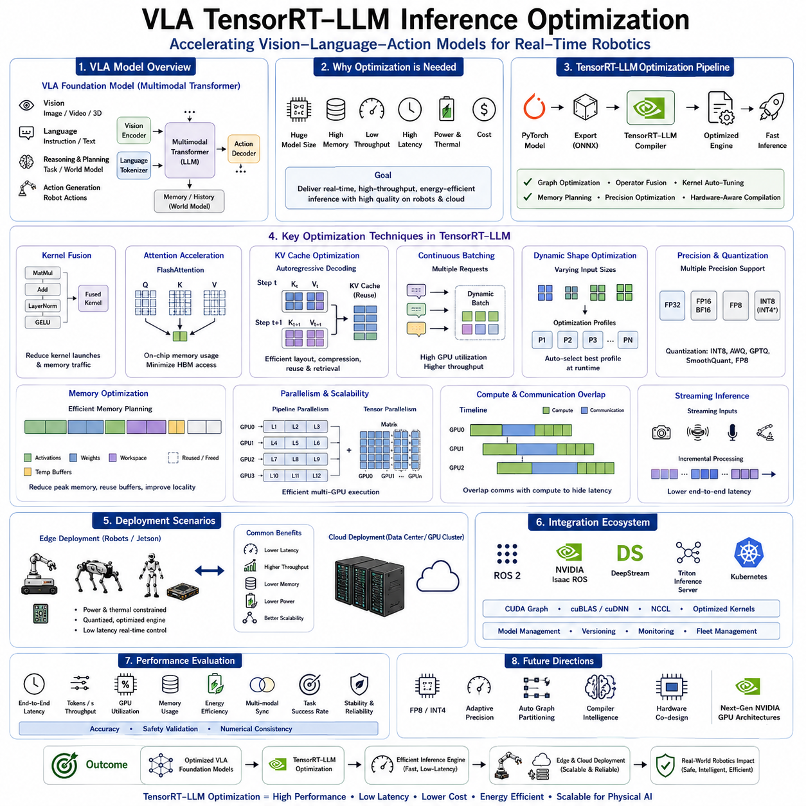{width="7.268055555555556in" height="7.268055555555556in"}

**42_10_03 비전-언어-행동(Vision-Language-Action, VLA) TensorRT-LLM 추론 최적화(Inference Optimization)**

비전-언어-행동(Vision-Language-Action, VLA) 모델은 비전(Vision), 자연어(Language), 의미 추론(Semantic Reasoning), 작업 계획(Task Planning), 월드 모델(World Model), 행동 생성(Action Generation)을 하나의 통합 구조에서 수행하는 대규모 멀티모달(Multimodal) 파운데이션 모델(Foundation Model)이다. 그러나 이러한 모델은 수십억 개의 파라미터(Parameter)를 포함하며 매우 큰 GPU 메모리와 연산 성능을 요구한다. 따라서 실제 산업용 로봇과 엣지 컴퓨터에서는 추론 최적화(Inference Optimization)가 필수적이며, TensorRT-LLM은 이를 위한 대표적인 최적화 프레임워크로 활용되고 있다.

기존의 트랜스포머(Transformer) 모델은 대부분 PyTorch나 TensorFlow와 같은 연구 중심 프레임워크에서 실행된다. 이러한 프레임워크는 모델 개발에는 매우 유연하지만 실제 추론 단계에서는 동적 계산 그래프(Dynamic Computation Graph), 일반적인 GPU 커널(Kernel), 비효율적인 메모리 관리(Memory Allocation) 등으로 인해 GPU 성능을 충분히 활용하지 못한다. 로봇은 일정한 응답 시간(Deterministic Latency)과 높은 처리량(Throughput)을 요구하므로 전용 추론 엔진이 필요하다.

TensorRT는 NVIDIA GPU에서 딥러닝 추론을 최적화하기 위해 개발된 고성능 추론 엔진(Inference Engine)이다. TensorRT-LLM은 이를 대규모 언어 모델(Large Language Model, LLM)과 VLA 모델에 맞게 확장한 것으로, 트랜스포머 전용 최적화, 어텐션(Attention) 가속, 메모리 최적화(Memory Optimization), 연산 융합(Operator Fusion), 병렬 실행(Parallel Scheduling), 양자화(Quantization) 등을 제공한다. 단순히 모델을 실행하는 것이 아니라 GPU 구조에 맞도록 다시 컴파일하여 최적의 실행 엔진을 생성한다.

최적화 과정은 먼저 모델 변환(Model Conversion)부터 시작된다. PyTorch에서 학습된 모델을 중간 표현(Intermediate Representation)으로 변환한 후 TensorRT 엔진으로 컴파일한다. 이 과정에서 불필요한 연산을 제거하고, 계산 그래프를 단순화하며, 텐서(Tensor) 배치를 최적화하고, 메모리 사용과 실행 순서를 GPU 구조에 맞게 재구성한다. 이를 통해 동일한 모델이라도 훨씬 빠른 추론 속도를 얻을 수 있다.

커널 융합(Kernel Fusion)은 TensorRT-LLM의 핵심 최적화 기술 가운데 하나이다. 일반적인 딥러닝 프레임워크는 행렬 곱(Matrix Multiplication), 정규화(Normalization), 활성 함수(Activation Function), 잔차 연결(Residual Connection) 등을 각각 별도의 GPU 커널에서 수행한다. TensorRT-LLM은 이러한 연속된 연산을 하나의 GPU 커널로 통합하여 메모리 이동을 줄이고 GPU 활용률(Utilization)을 높인다. 특히 반복 구조가 많은 트랜스포머에서는 매우 큰 성능 향상을 얻을 수 있다.

어텐션(Attention)은 트랜스포머 모델에서 가장 많은 연산을 수행하는 부분이다. 시퀀스 길이(Sequence Length)가 길어질수록 계산량이 급격히 증가하므로 효율적인 구현이 매우 중요하다. TensorRT-LLM은 FlashAttention, 마스크 어텐션(Masked Attention), 다중 질의 어텐션(Multi-Query Attention), 그룹 질의 어텐션(Grouped-Query Attention), 키-값 캐시(Key-Value Cache) 최적화 등을 제공하여 메모리 사용량과 연산량을 크게 줄인다.

FlashAttention은 최근 가장 영향력이 큰 트랜스포머 최적화 기술이다. 기존 방식처럼 거대한 어텐션 행렬(Attention Matrix)을 GPU 메모리에 저장하지 않고, GPU 내부의 고속 메모리(On-Chip Memory)를 최대한 활용하여 연산을 수행한다. 이로 인해 메모리 사용량이 크게 감소하고 계산 속도가 향상되며, 긴 문맥(Long Context)을 처리하는 VLA 모델에서도 높은 성능을 유지할 수 있다.

키-값 캐시(Key-Value Cache, KV Cache)는 자기회귀(Auto-Regressive) 추론에서 매우 중요한 기술이다. 이전 단계에서 계산된 Key와 Value를 GPU 메모리에 저장하여 다음 단계에서 다시 계산하지 않도록 한다. TensorRT-LLM은 KV Cache의 메모리 배치(Layout), 압축(Compression), 검색(Retrieval)을 최적화하여 토큰(Token) 생성 속도를 크게 향상시키고 GPU 메모리 단편화(Fragmentation)를 줄인다.

연속 배치 처리(Continuous Batching)는 다수의 요청(Request)을 동시에 처리할 때 GPU 활용률을 극대화하는 기술이다. 일반적인 시스템은 요청마다 독립적으로 실행하지만, TensorRT-LLM은 여러 요청을 하나의 동적인 배치(Batch)로 묶어 GPU를 지속적으로 활용한다. 특히 여러 대의 로봇이 동시에 클라우드 GPU를 사용하는 환경에서는 처리량이 크게 향상된다.

동적 입력 최적화(Dynamic Shape Optimization)는 다양한 입력 크기를 효율적으로 처리하기 위한 기술이다. 로봇은 이미지 해상도(Image Resolution), 자연어 길이(Language Length), 센서 데이터(Sensor Stream), 행동 이력(Action History)이 계속 달라진다. TensorRT-LLM은 다양한 입력 크기에 대한 최적화 프로파일(Optimization Profile)을 생성하고, 실행 시 가장 적합한 프로파일을 자동으로 선택하여 높은 성능을 유지한다.

정밀도 최적화(Precision Optimization)는 TensorRT-LLM의 또 다른 핵심 기능이다. FP32, TF32, FP16, BF16, FP8, INT8 등 다양한 정밀도를 지원하며, 모델 특성에 따라 혼합 정밀도(Mixed Precision)를 적용할 수 있다. 예를 들어 비전 인코더(Vision Encoder)는 FP16을 유지하고, 트랜스포머는 INT8을 사용하는 방식으로 정확도와 성능을 동시에 확보할 수 있다.

TensorRT-LLM은 양자화(Quantization)와도 긴밀하게 통합된다. INT8, 활성값 인식 가중치 양자화(Activation-aware Weight Quantization, AWQ), 생성형 사전학습 트랜스포머 양자화(Generative Pretrained Transformer Quantization, GPTQ), SmoothQuant, FP8 등을 지원하며, 최신 NVIDIA GPU의 저정밀 텐서 코어(Low-Precision Tensor Core)를 최대한 활용한다. 별도의 재학습 없이도 높은 추론 성능을 얻을 수 있다.

메모리 최적화(Memory Optimization)는 대규모 VLA 모델에서 매우 중요하다. TensorRT-LLM은 활성값 버퍼(Activation Buffer), 임시 작업 공간(Workspace), 텐서 재사용(Tensor Reuse)을 효율적으로 관리하여 불필요한 메모리 사용을 줄인다. 사용이 끝난 중간 텐서는 즉시 재활용되므로 GPU 메모리를 더욱 효율적으로 사용할 수 있으며, 제한된 GPU에서도 더 큰 모델을 실행할 수 있다.

파이프라인 병렬화(Pipeline Parallelism)와 텐서 병렬화(Tensor Parallelism)는 여러 GPU를 동시에 사용하는 기술이다. 매우 큰 VLA 모델은 하나의 GPU에 모두 올릴 수 없기 때문에 여러 GPU에 나누어 실행한다. 파이프라인 병렬화는 계층(Layer)을 GPU별로 분산하고, 텐서 병렬화는 하나의 큰 행렬 연산을 여러 GPU가 동시에 처리한다. TensorRT-LLM은 이러한 GPU 간 통신도 효율적으로 최적화한다.

계산과 통신의 중첩(Overlap of Computation and Communication)은 다중 GPU 환경에서 중요한 최적화 기법이다. 일반적으로 통신이 끝날 때까지 계산을 기다리지만, TensorRT-LLM은 가능한 경우 계산과 통신을 동시에 수행하여 통신 지연을 숨기고 전체 처리량을 향상시킨다.

VLA 모델은 비전과 언어를 동시에 처리하기 때문에 멀티모달 융합(Multimodal Fusion) 최적화도 중요하다. 비전 인코더에서 생성된 특징(Feature)을 언어 임베딩(Language Embedding)과 효율적으로 결합하고, 프로젝션(Projection), 어텐션, 메모리 관리를 통합적으로 최적화한다. 이를 통해 전체 추론 시간을 줄일 수 있다.

스트리밍 추론(Streaming Inference)은 실시간 로봇에서 매우 중요한 기술이다. 모든 입력을 기다린 후 추론을 시작하는 것이 아니라, 카메라, 라이다, 오디오, 힘 센서, 촉각 센서 등의 데이터가 들어오는 즉시 순차적으로 처리한다. TensorRT-LLM은 이러한 비동기(Asynchronous) 데이터 처리를 지원하여 로봇의 반응 시간을 최소화한다.

엣지 환경(Edge Deployment)에서는 전력(Power), 발열(Thermal), 메모리(Memory)가 제한되므로 더욱 강력한 최적화가 필요하다. NVIDIA Jetson과 같은 엣지 플랫폼에서는 양자화, 커널 융합, 저정밀 연산, 메모리 최적화를 함께 적용하여 제한된 전력에서도 VLA 모델을 실시간으로 실행할 수 있다. 이는 자율주행 로봇, 휴머노이드, 사족보행 로봇 등에 매우 적합하다.

클라우드 환경(Cloud Deployment)은 처리량(Throughput)과 확장성(Scalability)을 우선시한다. 여러 대의 로봇이 동시에 언어 추론, 작업 계획, 플릿 관리(Fleet Management), 월드 모델 시뮬레이션을 수행하므로 TensorRT-LLM은 연속 배치 처리, 다중 GPU 병렬화, 메모리 공유(Memory Sharing), 고밀도 추론(High-Density Inference)을 통해 GPU 자원을 최대한 활용한다. 이를 통해 동일한 GPU에서도 더 많은 로봇을 동시에 지원할 수 있다.

추론 최적화가 이루어지더라도 안전성(Safety)은 반드시 유지되어야 한다. 양자화와 저정밀 연산으로 인해 발생하는 수치 오차(Numerical Error)가 장애물 회피(Collision Avoidance), 위치 추정(Localization), 힘 제어(Force Control), 긴급 정지(Emergency Stop)에 영향을 주어서는 안 된다. 따라서 TensorRT-LLM 기반 엔진은 원본 모델과의 정확도 비교 및 안전성 검증을 반드시 수행해야 한다.

성능 평가는 단순한 토큰 생성(Token Generation) 속도만으로 이루어지지 않는다. 전체 응답 시간(End-to-End Latency), GPU 사용률(GPU Utilization), 메모리 사용량(Memory Consumption), 전력 효율(Energy Efficiency), 발열(Thermal Behavior), 멀티모달 동기화(Multimodal Synchronization), 행동 생성 주기(Action Generation Frequency), 작업 완료 시간(Task Completion Time), 유지보수성(Maintainability), 총소유비용(Total Cost of Ownership, TCO) 등을 종합적으로 평가해야 한다.

TensorRT-LLM은 ROS 2, NVIDIA Isaac ROS, DeepStream, CUDA Graph, Triton Inference Server, Kubernetes 등과 자연스럽게 연동된다. 이를 통해 산업용 로봇의 모델 배포(Model Deployment), 버전 관리(Version Management), 플릿 관리(Fleet Management), 지속적 통합(Continuous Integration)까지 하나의 통합 파이프라인으로 구축할 수 있다.

향후 TensorRT-LLM은 적응형 정밀도(Adaptive Precision), 자동 그래프 분할(Automatic Graph Partitioning), 하드웨어 인식 컴파일(Hardware-Aware Compilation), AI 기반 최적화(AI-Assisted Optimization), 차세대 트랜스포머 엔진(Transformer Engine)과 결합하여 더욱 발전할 것으로 예상된다. 또한 NVIDIA의 새로운 GPU 아키텍처와 함께 멀티모달 AI에 최적화된 추론 엔진으로 진화하면서 실시간 물리 AI(Physical AI)의 핵심 기술이 될 것이다.

비전-언어-행동(VLA) 모델이 지속적으로 대형화됨에 따라 TensorRT-LLM은 실제 산업 현장에 AI를 배포하기 위한 가장 중요한 기반 기술 가운데 하나가 될 것이다. 커널 융합(Kernel Fusion), FlashAttention, 양자화, 메모리 최적화, 연속 배치 처리, 스트리밍 추론, 다중 GPU 병렬화, 하드웨어 전용 컴파일을 통해 대규모 멀티모달 AI를 실시간 추론 엔진으로 변환하며, 모델 압축(Model Compression), 엣지-클라우드 하이브리드(Edge--Cloud Hybrid), 최신 GPU와 결합하여 차세대 산업용 로봇과 서비스 로봇을 위한 고성능 물리 AI 플랫폼을 실현하는 핵심 기술로 자리매김할 것이다.

## 10.4 Speculative Decoding (with Code)

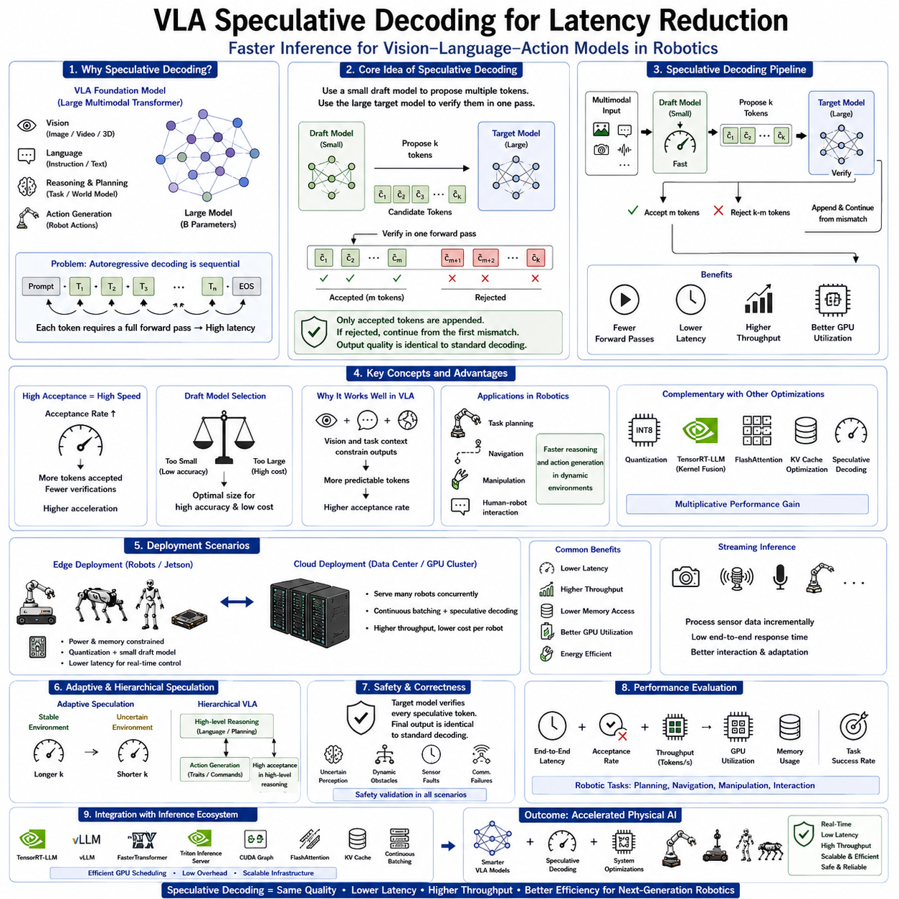{width="7.268055555555556in" height="7.268055555555556in"}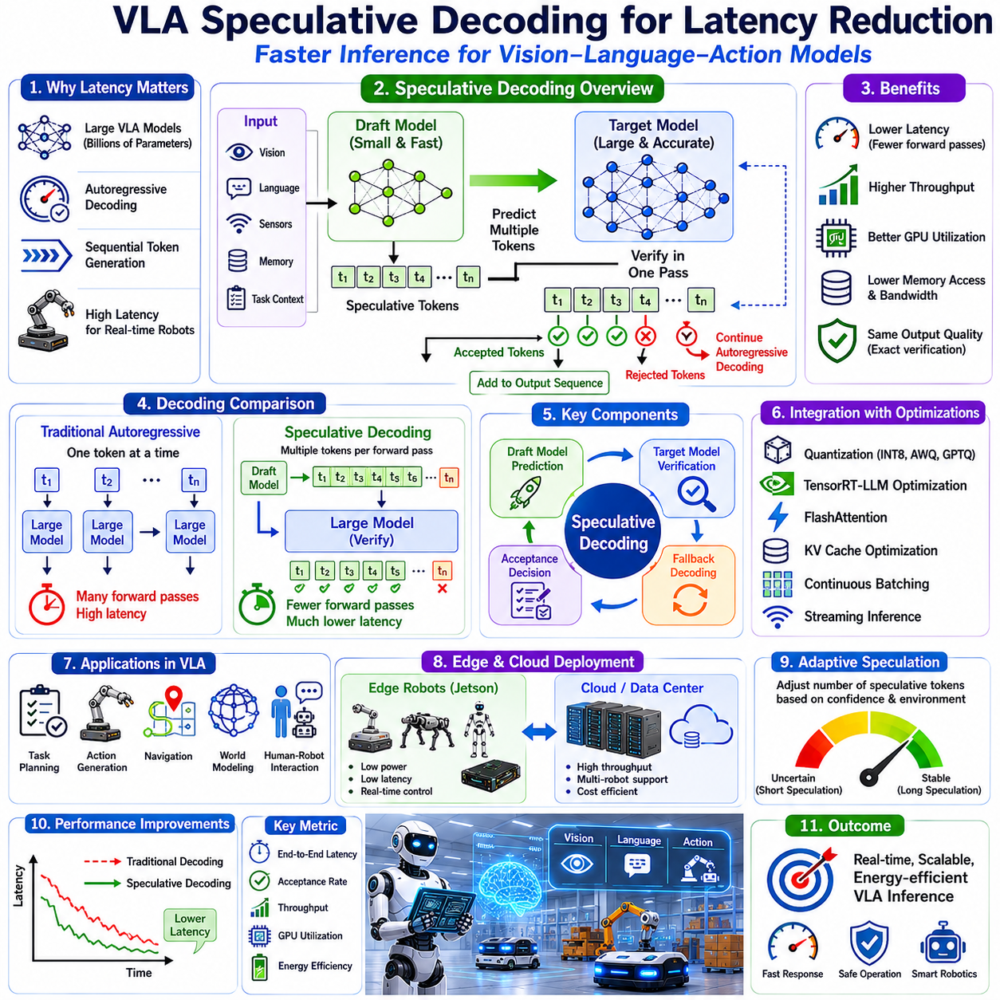{width="7.268055555555556in" height="7.268055555555556in"}

**42_10_04 비전-언어-행동(Vision-Language-Action, VLA) 추론 지연 감소를 위한 추측 디코딩(Speculative Decoding)**

비전-언어-행동(Vision-Language-Action, VLA) 모델은 비전(Vision), 자연어(Language), 의미 추론(Semantic Reasoning), 월드 모델(World Model), 작업 계획(Task Planning), 행동 생성(Action Generation)을 하나의 통합 구조에서 수행하는 대규모 멀티모달(Multimodal) 파운데이션 모델(Foundation Model)이다. 그러나 모델 규모가 커질수록 추론 지연(Inference Latency)이 증가하며, 이는 실시간 로봇 제어에서 중요한 문제로 작용한다. 특히 VLA는 수십억 개의 파라미터를 가진 트랜스포머(Transformer)를 사용하므로 응답 속도를 높이기 위한 새로운 추론 기법이 필요하다.

기존의 자기회귀 디코딩(Autoregressive Decoding)은 한 번에 하나의 토큰(Token)만 생성하는 방식이다. 새로운 토큰을 생성할 때마다 전체 트랜스포머를 다시 실행해야 하므로 모든 출력이 순차적으로 생성된다. 트랜스포머 내부 연산은 병렬 처리할 수 있지만, 토큰 생성 자체는 이전 결과에 의존하기 때문에 병렬화가 어렵다. 따라서 모델이 커질수록 반복적인 연산이 증가하여 전체 응답 시간이 길어진다.

실시간 물리 AI(Physical AI)에서는 이러한 지연이 더욱 치명적이다. 자율주행(Navigation), 조작(Manipulation), 장애물 회피(Obstacle Avoidance), 사람과의 대화(Human-Robot Interaction), 작업 계획(Task Planning)은 모두 빠른 응답을 요구한다. 수백 밀리초 정도는 장기 계획(Long-Horizon Planning)에서는 허용될 수 있지만, 지속적인 환경 변화에 대응하는 제어에서는 추론 지연이 안전성과 작업 효율을 크게 저하시킬 수 있다.

추측 디코딩(Speculative Decoding)은 이러한 문제를 해결하기 위해 제안된 새로운 추론 기법이다. 하나의 대형 모델만 사용하는 대신, 작은 초안 모델(Draft Model)과 큰 목표 모델(Target Model)을 함께 사용한다. 작은 모델이 먼저 여러 개의 토큰을 빠르게 예측하고, 큰 모델은 이를 한 번의 추론으로 검증한다. 예측이 맞으면 여러 개의 토큰을 동시에 확정할 수 있으므로 대형 모델의 반복 실행 횟수를 크게 줄일 수 있다.

추측 디코딩의 핵심 아이디어는 대부분의 토큰이 충분히 예측 가능하다는 점이다. 언어와 의미 구조는 연속성을 가지므로, 작은 모델도 다음에 생성될 토큰을 상당히 정확하게 예측할 수 있다. 따라서 큰 모델은 모든 토큰을 직접 생성하는 대신, 작은 모델이 제안한 결과를 확인(Verification)하는 역할만 수행한다. 이로 인해 동일한 출력 품질을 유지하면서도 추론 시간을 크게 단축할 수 있다.

추론 과정은 일반적인 VLA 입력으로 시작된다. 카메라 영상(Camera), 자연어(Language), 센서 데이터(Sensor Data), 메모리(Memory), 작업 정보(Task Context)는 초안 모델과 목표 모델 모두에 입력된다. 초안 모델은 다음 한 개의 토큰이 아니라 여러 개의 토큰을 한 번에 예측한다. 이 예측 결과는 임시 후보(Candidate Token)가 되며, 이후 목표 모델이 이를 검증한다.

목표 모델은 한 번의 Forward Pass를 통해 여러 후보 토큰을 동시에 평가한다. 예측이 목표 모델의 결과와 일치하면 해당 토큰들은 모두 최종 출력으로 채택된다. 만약 중간에서 예측이 달라지면 그 지점 이후의 토큰은 폐기하고 기존의 자기회귀 방식으로 다시 생성한다. 따라서 최종 결과는 일반 디코딩과 완전히 동일하지만, 대형 모델의 실행 횟수는 크게 감소한다.

수용률(Acceptance Rate)은 추측 디코딩 성능을 결정하는 가장 중요한 요소이다. 초안 모델이 얼마나 많은 토큰을 정확하게 예측하는지가 전체 속도를 결정한다. 수용률이 높을수록 목표 모델의 실행 횟수가 줄어들어 성능 향상이 커진다. 반대로 예측이 자주 틀리면 다시 계산해야 하므로 성능 향상이 제한된다. 따라서 높은 정확도의 초안 모델을 설계하는 것이 매우 중요하다.

초안 모델(Draft Model)은 속도와 정확도의 균형이 중요하다. 너무 작은 모델은 빠르지만 예측 정확도가 낮아 수용률이 떨어질 수 있다. 반대로 너무 큰 모델은 정확도는 높지만 계산량이 증가하여 가속 효과가 감소한다. 따라서 실제 산업에서는 충분한 정확도를 유지하면서도 목표 모델보다 훨씬 빠른 중간 규모의 모델을 사용하는 것이 일반적이다.

VLA 모델은 멀티모달(Multimodal) 정보를 사용하기 때문에 추측 디코딩의 효과가 더욱 커질 수 있다. 비전 정보(Vision)가 이미 장면(Scene)과 작업(Task)을 제한하기 때문에 이후 생성될 언어와 행동은 상당 부분 예측 가능하다. 따라서 일반적인 언어 모델보다 로봇 환경에서는 초안 모델의 수용률이 더 높게 나타날 가능성이 있다.

예를 들어 "두 번째 선반의 파란 상자를 집어서 검사 테이블 위에 놓아라"라는 명령이 주어졌다고 가정하자. 비전 시스템이 환경을 인식한 이후에는 작업 계획과 행동 순서가 상당히 제한되므로 초안 모델은 이후 생성될 계획을 매우 높은 정확도로 예측할 수 있다. 목표 모델은 이를 확인만 하면 되므로 전체 작업 계획 생성 속도가 크게 향상된다.

행동 생성(Action Generation) 역시 추측 디코딩의 큰 수혜를 받는다. VLA 모델은 이동 경로(Trajectory), 파지(Grasp), 조작(Manipulation), 자율주행 목표(Navigation Goal)와 같은 구조화된 행동을 생성한다. 이러한 행동은 시간적으로 연속성을 가지므로 초안 모델이 다음 행동을 예측하기 쉽다. 목표 모델은 이를 검증하는 역할만 수행하므로 행동 생성 속도가 향상된다.

추측 디코딩은 다른 최적화 기술과 함께 사용할 때 더욱 큰 효과를 얻는다. 양자화(Quantization)는 한 번의 계산 비용을 줄이고, TensorRT-LLM은 GPU 실행을 최적화하며, FlashAttention은 어텐션 연산을 가속하고, 키-값 캐시(Key-Value Cache, KV Cache)는 중복 계산을 줄인다. 추측 디코딩은 아예 대형 모델의 실행 횟수를 줄이므로 이들 기술과 결합하면 성능 향상 효과가 누적된다.

GPU 활용률(Utilization)도 크게 향상된다. 기존에는 작은 연산을 반복적으로 실행해야 했지만, 추측 디코딩은 한 번에 여러 토큰을 처리하므로 GPU의 병렬 연산 능력을 더욱 효율적으로 사용할 수 있다. 메모리 접근도 줄어들고 커널 실행(Kernel Launch) 횟수도 감소하므로 전체 GPU 효율이 향상된다. 여러 대의 로봇을 동시에 지원하는 클라우드 서버에서는 이러한 효과가 더욱 크게 나타난다.

메모리 사용 방식도 개선된다. 기존 자기회귀 방식은 토큰마다 KV Cache를 반복적으로 접근하지만, 추측 디코딩은 여러 토큰을 한 번에 검증하므로 메모리 접근 횟수가 감소한다. 최적화된 KV Cache와 함께 사용하면 메모리 대역폭(Bandwidth) 사용량도 줄어들어 더욱 빠른 추론이 가능하다.

엣지 컴퓨팅(Edge Computing)에서는 초안 모델과 목표 모델을 동시에 실행해야 하므로 계산량이 증가하는 것처럼 보일 수 있다. 그러나 초안 모델은 매우 작기 때문에 전체 계산량은 여전히 감소한다. NVIDIA Jetson과 같은 임베디드 GPU에서도 양자화와 함께 사용하면 실제 응답 시간을 줄일 수 있으며, 제한된 하드웨어에서도 충분한 성능 향상을 얻을 수 있다.

클라우드 환경에서는 여러 대의 로봇이 하나의 GPU 서버를 공유한다. 이 경우 초안 모델은 여러 로봇이 함께 사용할 수 있으며, 연속 배치 처리(Continuous Batching)와 추측 디코딩을 결합하면 GPU 실행 횟수를 크게 줄일 수 있다. 따라서 더 많은 로봇을 동일한 GPU 자원으로 지원할 수 있으며 운영 비용도 감소한다.

스트리밍 추론(Streaming Inference)에서도 추측 디코딩은 매우 유용하다. 카메라, 라이다(LiDAR), 오디오(Audio), 촉각(Tactile) 센서는 지속적으로 데이터를 생성한다. 환경이 계속 변화하는 상황에서도 초안 모델이 빠르게 예측을 수행하고 목표 모델이 이를 검증하므로, 사람과 로봇 간의 상호작용이 더욱 자연스럽고 빠르게 이루어진다.

멀티모달 추론에서는 일반 언어 모델과 다른 어려움도 존재한다. 새로운 장애물, 갑작스러운 사람의 등장, 센서 이상(Sensor Failure)과 같이 환경이 급격히 변하면 초안 모델의 예측이 틀릴 가능성이 높아진다. 이러한 경우에는 수용률이 감소하므로 추측 디코딩의 성능도 함께 감소할 수 있다.

이를 해결하기 위해 적응형 추측(Adaptive Speculation)이 연구되고 있다. 항상 동일한 개수의 토큰을 예측하는 것이 아니라 환경 안정성(Environment Stability), 작업 복잡도(Task Complexity), 모델의 불확실성(Uncertainty), 최근 수용률을 고려하여 예측 길이를 동적으로 변경한다. 안정적인 상황에서는 긴 추측을 수행하고, 불확실한 환경에서는 짧은 추측으로 전환하여 성능과 정확도를 동시에 유지한다.

계층형 VLA(Hierarchical VLA) 구조에서는 추측 디코딩의 효과가 더욱 크다. 언어 이해(Language Understanding), 작업 분해(Task Decomposition), 의미 계획(Semantic Planning), 월드 모델(World Model)은 구조적인 출력을 생성하기 때문에 높은 수용률을 얻을 수 있다. 반면 저수준 제어(Low-Level Control)는 결정론적 제어기를 그대로 사용하는 경우가 많아 추측 디코딩의 적용 대상이 아니다.

안전성(Safety)은 추측 디코딩에서도 매우 중요하다. 실행 순서는 달라지지만 최종 출력은 반드시 목표 모델(Target Model)의 검증을 통과해야 한다. 따라서 일반 자기회귀 방식과 동일한 결과를 생성하며, 추론 과정만 더 효율적으로 수행된다. 그럼에도 불구하고 실제 환경에서는 동적 장애물(Dynamic Obstacle), 센서 오류, 통신 장애, 불확실한 환경에서 충분한 검증이 이루어져야 한다.

추측 디코딩의 성능 평가는 단순한 토큰 생성 속도(Token Generation Speed)가 아니라 전체 응답 시간(End-to-End Latency), 작업 계획 시간(Task Planning Time), 행동 생성 속도(Action Generation Frequency), 자율주행 응답성(Navigation Responsiveness), 조작 주기(Manipulation Cycle Time), GPU 활용률, 에너지 소비(Energy Consumption), 수용률(Acceptance Rate), 메모리 사용량(Memory Utilization), 멀티모달 동기화(Multimodal Synchronization), 작업 완료 시간(Task Completion Time) 등을 종합적으로 고려하여 수행한다.

TensorRT-LLM, vLLM, FasterTransformer, Triton Inference Server 등 최신 추론 엔진은 추측 디코딩을 적극적으로 지원하고 있다. GPU 스케줄링을 최적화하여 초안 모델과 목표 모델 간의 동기화를 최소화하며, FlashAttention, KV Cache, 양자화, 연속 배치 처리와 함께 사용할 수 있도록 설계되고 있다.

향후 추측 디코딩은 단순한 언어 생성뿐 아니라 멀티모달 추론(Multimodal Reasoning) 전체로 확장될 전망이다. 초안 모델은 언어뿐 아니라 시각 어텐션(Visual Attention), 장면 해석(Scene Understanding), 월드 모델 예측(World Model Prediction), 행동 계획(Action Planning)까지 미리 생성하고, 목표 모델은 이를 검증하는 방식으로 발전할 가능성이 높다. 또한 계층형 추론(Hierarchical Reasoning)과 결합하여 더욱 높은 가속 효과를 얻을 것으로 예상된다.

비전-언어-행동(Vision-Language-Action) 모델이 계속 대형화됨에 따라 추측 디코딩은 실시간 물리 AI를 위한 핵심 추론 기술로 자리 잡을 것이다. 작은 초안 모델과 대형 목표 모델의 협업을 통해 동일한 출력 품질을 유지하면서 추론 지연을 크게 줄일 수 있으며, TensorRT-LLM, FlashAttention, 양자화, KV Cache 최적화, 엣지-클라우드 하이브리드(Edge--Cloud Hybrid) 구조와 결합하여 차세대 산업용 로봇과 서비스 로봇을 위한 고속·고효율 AI 플랫폼의 핵심 기술로 발전할 것으로 전망된다.

## 10.5 Batch Inference and KV Cache Management (with Code)

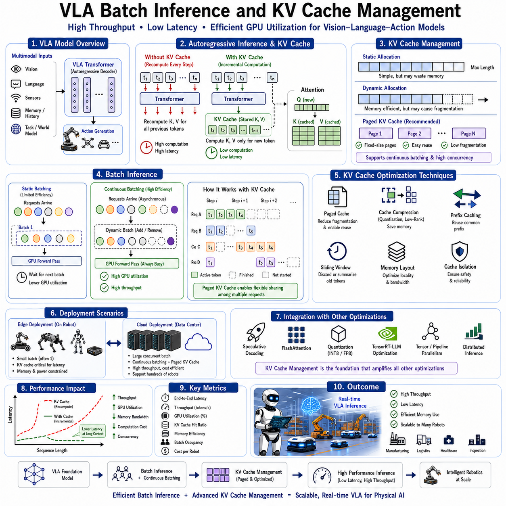{width="7.268055555555556in" height="7.268055555555556in"}

**42_10_05 비전-언어-행동(Vision-Language-Action, VLA) 배치 추론(Batch Inference)과 키-값 캐시(Key-Value Cache, KV Cache) 관리**

비전-언어-행동(Vision-Language-Action, VLA) 모델은 비전(Vision), 자연어(Language), 의미 추론(Semantic Reasoning), 월드 모델(World Model), 작업 계획(Task Planning), 행동 생성(Action Generation)을 하나의 트랜스포머(Transformer) 구조에서 수행하는 물리 AI(Physical AI)의 핵심 기술이다. 그러나 모델의 규모가 수십억 개 이상의 파라미터로 증가하면서 실시간 추론(Inference)의 계산량도 급격히 증가하였다. 따라서 실제 산업용 로봇에서는 높은 처리량(Throughput)과 낮은 지연 시간(Latency)을 확보하기 위해 배치 추론(Batch Inference)과 키-값 캐시(Key-Value Cache, KV Cache) 관리 기술이 필수적으로 사용된다.

트랜스포머 기반 VLA 모델은 언어 생성(Language Generation), 작업 계획(Task Planning), 행동 생성(Action Generation), 순차적 의사결정(Sequential Decision Making) 과정에서 자기회귀 추론(Autoregressive Inference)을 수행한다. 새로운 토큰(Token)은 이전에 생성된 모든 토큰에 의존하므로 한 번에 하나씩 순차적으로 생성된다. 따라서 매 토큰 생성 시마다 전체 어텐션(Self-Attention) 계산을 반복해야 하며, 문맥(Context)이 길어질수록 계산량은 계속 증가하게 된다.

이러한 계산 병목(Bottleneck)은 자기어텐션(Self-Attention)에서 발생한다. 각 토큰은 Query, Key, Value를 이용하여 이전의 모든 토큰과 관계를 계산한다. 만약 이전 토큰의 Key와 Value를 매번 다시 계산한다면 동일한 연산이 반복되어 매우 큰 계산 낭비가 발생한다. 특히 긴 언어 명령(Long Instruction), 비전 임베딩(Vision Embedding), 월드 모델(World Model), 작업 이력(Task History)을 함께 사용하는 VLA에서는 이러한 문제가 더욱 심각하다.

키-값 캐시(Key-Value Cache, KV Cache)는 이러한 중복 계산을 제거하기 위한 핵심 기술이다. 이전 단계에서 계산된 Key와 Value를 GPU 메모리에 저장하고 이후에는 이를 다시 계산하지 않는다. 새로운 토큰이 생성되면 새로운 Query만 계산하고, 기존에 저장된 Key와 Value를 그대로 사용하여 어텐션을 수행한다. 이 단순한 구조만으로도 자기회귀 추론의 계산량을 크게 줄일 수 있다.

KV Cache는 트랜스포머의 계산 방식을 반복 계산(Recomputation)에서 점진적 계산(Incremental Computation)으로 바꾼다. 최초 입력 단계에서는 프롬프트(Prompt), 비전 정보, 센서 데이터, 멀티모달 문맥(Multimodal Context)에 대한 Key와 Value를 계산하여 저장한다. 이후에는 새로 생성된 토큰에 대한 Key와 Value만 추가하면 되므로 기존 문맥을 다시 계산할 필요가 없다. 결과적으로 계산량이 크게 감소하고 추론 속도가 향상된다.

KV Cache는 GPU 메모리를 많이 사용하기 때문에 메모리 관리(Memory Management)가 매우 중요하다. 현대의 트랜스포머는 수십\~수백 개의 계층(Layer)과 다수의 어텐션 헤드(Attention Head)를 포함한다. 생성되는 토큰마다 모든 계층과 헤드에 대한 Key와 Value가 저장되므로 문맥이 길어질수록 메모리 사용량도 지속적으로 증가한다. 따라서 캐시의 저장, 압축, 재사용을 효율적으로 수행하는 기술이 필수적이다.

정적 KV Cache(Static KV Cache)는 추론 시작 전에 최대 길이(Maximum Sequence Length)에 맞는 메모리를 미리 확보하는 방식이다. 실행 중에는 주소가 변하지 않으므로 관리가 단순하고 매우 안정적이다. 그러나 실제 사용되는 문맥이 짧을 경우 많은 GPU 메모리가 사용되지 않은 채 낭비된다. 여러 대의 로봇을 동시에 서비스하는 환경에서는 이러한 비효율이 전체 시스템 성능을 저하시킬 수 있다.

동적 KV Cache(Dynamic KV Cache)는 실제 생성되는 토큰 수에 맞추어 메모리를 점진적으로 할당한다. 필요할 때만 메모리를 사용하므로 GPU 활용률(Utilization)이 크게 향상되고 동시에 더 많은 추론 세션(Inference Session)을 실행할 수 있다. 하지만 실행 중 메모리 단편화(Fragmentation), 메모리 할당 지연(Allocation Latency), 주소 관리(Address Management)가 발생할 수 있으므로 보다 복잡한 메모리 관리 기술이 필요하다.

페이지 기반 KV Cache(Paged KV Cache)는 이러한 문제를 해결하기 위해 개발된 방식이다. 하나의 큰 연속 메모리 대신 작은 페이지(Page) 단위로 캐시를 관리한다. 각 페이지는 독립적으로 생성, 삭제, 재사용할 수 있으므로 메모리 단편화가 크게 감소한다. 또한 여러 추론 세션이 GPU 메모리를 효율적으로 공유할 수 있어 최신 추론 엔진에서 가장 널리 사용되는 방식으로 자리 잡고 있다.

페이지 기반 캐시는 연속 배치 처리(Continuous Batching)와도 매우 잘 결합된다. 여러 로봇의 요청이 서로 다른 시점에 들어오더라도 각각의 캐시 페이지를 독립적으로 관리할 수 있다. 하나의 작업이 종료되면 해당 페이지는 즉시 다른 작업에 재사용된다. 따라서 GPU 메모리 활용률이 향상되고, 동시에 더 많은 로봇을 지원할 수 있다.

배치 추론(Batch Inference)은 GPU 효율을 높이는 또 다른 핵심 기술이다. 하나의 요청만 처리하는 대신 여러 개의 추론 요청을 하나의 Forward Pass에서 동시에 처리한다. GPU의 텐서 코어(Tensor Core)는 큰 행렬 연산에서 최고의 성능을 발휘하므로 배치 크기가 커질수록 GPU 활용률과 처리량이 크게 증가한다. 결과적으로 요청 하나당 평균 계산 비용도 감소한다.

기존의 정적 배치(Static Batching)는 동시에 도착한 요청만 하나의 배치로 묶는다. 오프라인 처리에는 적합하지만 실제 로봇 환경에서는 요청이 계속 비동기적으로 발생하므로 효율이 떨어진다. 자율주행, 조작, 검사, 작업 계획 등은 모두 서로 다른 시점에 추론 요청을 생성하기 때문이다.

연속 배치 처리(Continuous Batching)는 이러한 문제를 해결한다. 이미 실행 중인 배치에 새로운 요청을 실시간으로 추가하고, 종료된 요청은 즉시 제거한다. GPU는 항상 높은 활용률을 유지하면서 지속적으로 추론을 수행할 수 있다. TensorRT-LLM과 vLLM 같은 최신 추론 엔진은 이러한 방식을 적극적으로 활용한다.

연속 배치에서는 로봇마다 생성되는 시퀀스 길이가 서로 다르다. 어떤 로봇은 짧은 응답만 생성하지만, 다른 로봇은 수천 개의 토큰이 필요한 장기 계획(Long-Horizon Planning)을 수행할 수도 있다. 따라서 스케줄러(Scheduler)는 매 디코딩 단계마다 배치를 재구성하고, KV Cache도 이러한 동적인 변경을 효율적으로 지원해야 한다.

VLA 기반 로봇 플릿(Fleet)은 이러한 기술의 대표적인 적용 사례이다. 여러 대의 자율이동로봇(Autonomous Mobile Robot, AMR), 이동형 매니퓰레이터(Mobile Manipulator), 휴머노이드(Humanoid), 사족보행 로봇(Quadruped), 검사 로봇(Inspection Robot)이 동시에 언어 이해, 작업 계획, 행동 생성을 요청한다. 배치 추론을 이용하면 하나의 GPU가 이러한 요청을 동시에 처리할 수 있으므로 전체 시스템의 효율이 크게 향상된다.

엣지 컴퓨팅(Edge Computing)에서는 상황이 조금 다르다. NVIDIA Jetson과 같은 임베디드 GPU는 일반적으로 하나의 로봇만 지원하므로 배치 크기는 작다. 하지만 자기회귀 추론에서는 KV Cache만으로도 상당한 성능 향상을 얻을 수 있으며, 긴 문맥을 유지하면서도 제한된 메모리 안에서 안정적인 추론을 수행할 수 있다.

클라우드 환경(Cloud Deployment)은 처리량과 확장성이 가장 중요하다. 산업용 GPU 서버는 수백 개의 로봇 요청을 동시에 처리해야 한다. 이때 배치 추론, 연속 배치 처리, 페이지 기반 KV Cache, 텐서 병렬화(Tensor Parallelism), 파이프라인 병렬화(Pipeline Parallelism)를 함께 사용하면 GPU 자원을 최대한 활용할 수 있으며 로봇 한 대당 운영 비용도 크게 감소한다.

멀티모달 VLA는 KV Cache 관리가 더욱 복잡하다. 언어 토큰(Language Token)뿐 아니라 비전 임베딩(Vision Embedding), 작업 이력(Task History), 의미 메모리(Semantic Memory), 월드 모델 정보까지 함께 저장해야 한다. 또한 비전 정보는 자주 바뀌지 않지만 언어는 계속 생성되므로 데이터 종류에 따라 서로 다른 캐시 전략(Cache Strategy)이 필요하다.

프리픽스 캐시(Prefix Cache)는 반복되는 입력을 재활용하는 기술이다. 산업용 로봇은 동일한 시스템 프롬프트(System Prompt), 안전 규칙(Safety Policy), 작업 절차(Operation Procedure)를 반복적으로 사용한다. 이러한 공통 부분은 한 번만 계산하여 저장하고 이후에는 계속 재사용하므로 초기 추론 시간을 크게 줄일 수 있다.

캐시 압축(Cache Compression)은 긴 문맥을 지원하기 위한 중요한 연구 분야이다. FP8, INT8과 같은 저정밀 양자화(Quantization)를 이용하여 Key와 Value를 저장하거나, 저랭크 근사(Low-Rank Approximation), 희소성(Sparsity), 메모리 요약(Memory Summarization)을 이용하여 캐시 크기를 줄인다. 이를 통해 GPU 메모리를 크게 늘리지 않고도 매우 긴 문맥을 처리할 수 있다.

슬라이딩 윈도우 어텐션(Sliding-Window Attention)은 오래된 토큰을 점진적으로 제거하거나 요약하는 방식이다. 최신 토큰은 높은 정밀도로 유지하고, 오래된 정보는 별도의 의미 메모리(Semantic Memory)에 요약하여 저장한다. 이러한 계층형 메모리(Hierarchical Memory)는 긴 작업을 수행하는 로봇에서 매우 효과적이다.

메모리 지역성(Memory Locality)도 성능에 큰 영향을 준다. KV Cache를 GPU 접근 방식에 맞게 배치하면 메모리 대역폭(Bandwidth) 사용량을 줄이고 캐시 효율(Cache Efficiency)을 높일 수 있다. 하드웨어 특성을 고려한 메모리 배치는 알고리즘 최적화만큼 중요한 요소이다.

배치 추론과 KV Cache는 다른 최적화 기술과도 긴밀하게 연동된다. 추측 디코딩(Speculative Decoding)은 디코딩 횟수를 줄이고, FlashAttention은 어텐션 연산을 가속하며, 양자화는 메모리 사용량을 감소시키고, TensorRT-LLM은 GPU 커널(Kernel)을 최적화한다. KV Cache는 이러한 모든 기술을 지원하는 기반 기술이며, 함께 적용할 경우 성능 향상 효과가 누적된다.

신뢰성(Reliability)은 산업용 로봇에서 매우 중요하다. 캐시 손상(Cache Corruption), 메모리 오류(Memory Error), 잘못된 세션(Session) 공유는 로봇의 판단 오류로 이어질 수 있다. 따라서 최신 추론 시스템은 캐시 검증(Cache Validation), 메모리 보호(Memory Protection), 세션 분리(Session Isolation), 결정론적 스케줄링(Deterministic Scheduling)을 통해 안정성을 보장한다.

성능 평가는 단순한 토큰 생성 속도가 아니라 전체 응답 시간(End-to-End Latency), GPU 활용률(GPU Utilization), 메모리 대역폭(Bandwidth Utilization), KV Cache 적중률(Cache Hit Ratio), 메모리 효율(Memory Efficiency), 배치 활용률(Batch Occupancy), 에너지 소비(Energy Consumption), 발열(Thermal Behavior), 긴 문맥 지원(Long Context Scalability), 스케줄링 오버헤드(Scheduling Overhead), 작업 완료율(Task Completion Performance) 등을 종합적으로 고려하여 수행한다.

향후 VLA 추론 구조는 페이지 기반 KV Cache, 적응형 캐시 압축(Adaptive Cache Compression), 계층형 의미 메모리(Hierarchical Semantic Memory), 멀티모달 캐시(Multimodal Cache), 분산 캐시(Distributed Cache), 하드웨어 인식 스케줄링(Hardware-Aware Scheduling)을 통합하는 방향으로 발전할 것으로 예상된다. 또한 차세대 GPU의 대용량 온칩 메모리(On-Chip Memory), 고대역폭 메모리(High-Bandwidth Memory), 트랜스포머 전용 연산기(Transformer Engine)와 결합하여 더욱 높은 성능을 제공할 것이다.

비전-언어-행동(Vision-Language-Action) 모델의 규모와 문맥 길이가 지속적으로 증가함에 따라 배치 추론과 KV Cache 관리는 앞으로도 실시간 물리 AI를 위한 핵심 기반 기술로 남을 것이다. 중복 계산을 제거하고 GPU 활용률을 극대화하며, 긴 문맥을 효율적으로 처리하고, 수백 대의 로봇을 동시에 지원할 수 있도록 함으로써 산업 자동화, 자율주행, 협동로봇, 물류, 인프라 점검, 의료 로봇 등 차세대 지능형 로봇 시스템의 핵심 추론 기술로 자리매김할 것으로 전망된다.

## 10.6 ROS 2 Integration (with Code)

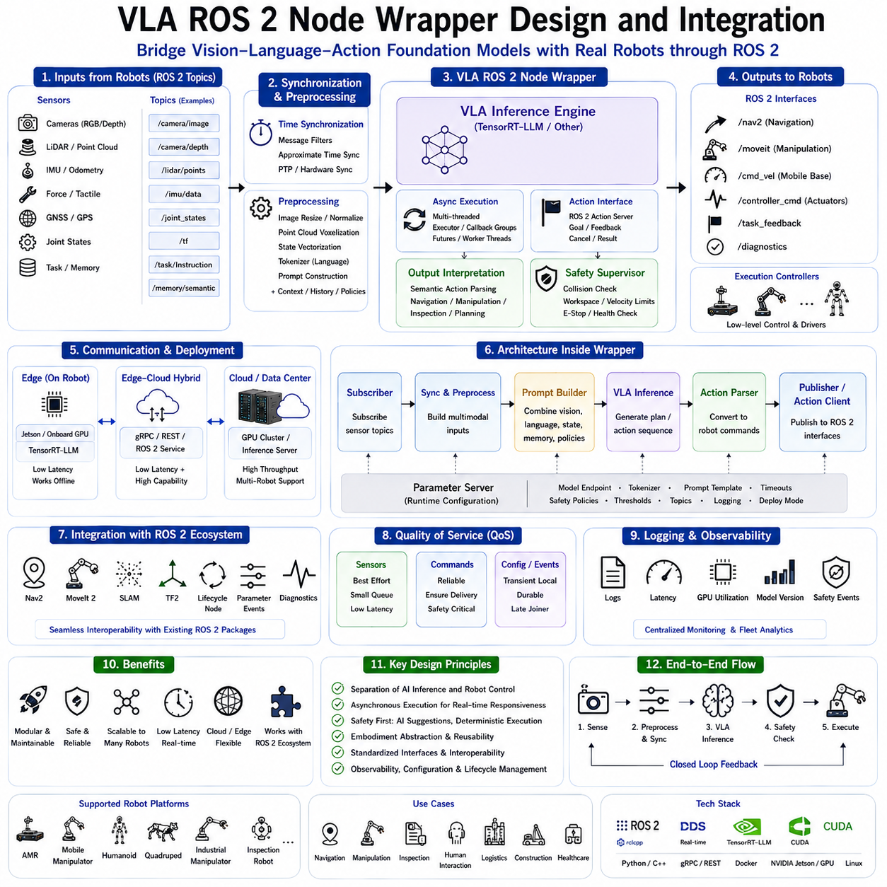{width="7.268055555555556in" height="7.268055555555556in"}

**42_10_06 비전-언어-행동(Vision-Language-Action, VLA) ROS 2 노드 래퍼(Node Wrapper) 설계 및 통합(Design and Integration)**

비전-언어-행동(Vision-Language-Action, VLA) 모델을 실제 로봇에 적용하기 위해서는 우수한 AI 모델만으로는 충분하지 않다. 파운데이션 모델(Foundation Model)은 멀티모달(Multimodal) 추론, 의미 이해(Semantic Understanding), 작업 계획(Task Planning), 행동 생성(Action Generation) 능력을 제공하지만, 로봇 하드웨어와 직접 연결되어 동작할 수는 없다. 따라서 로봇 운영체제(Robot Operating System 2, ROS 2)를 기반으로 AI와 실제 하드웨어를 연결하는 노드 래퍼(Node Wrapper)가 필수적인 구성 요소가 된다.

ROS 2는 현재 가장 널리 사용되는 로봇 미들웨어(Middleware)로, 표준화된 통신(Standardized Communication), 모듈형 소프트웨어(Modular Software), 분산 실행(Distributed Execution), 하드웨어 추상화(Hardware Abstraction), 실시간 협업(Real-Time Coordination)을 제공한다. VLA 노드 래퍼는 이러한 ROS 2 생태계와 대규모 트랜스포머(Transformer) 기반 AI 사이를 연결하는 인터페이스 역할을 수행하며, 기존 로봇 시스템과 AI를 자연스럽게 통합할 수 있도록 지원한다.

VLA 모델은 카메라(Camera), 깊이 카메라(Depth Camera), 라이다(LiDAR), 힘 센서(Force Sensor), IMU, 자연어(Language), 의미 메모리(Semantic Memory), 월드 모델(World Model) 등 다양한 입력을 동시에 처리한다. 따라서 ROS 2 노드 래퍼는 비동기적으로 들어오는 여러 센서 데이터를 수집하고, 이를 하나의 멀티모달 입력으로 변환하여 VLA 모델에 전달하는 역할을 수행한다. 이를 통해 AI 모델은 실제 로봇 환경을 정확하게 이해할 수 있다.

ROS 2 노드 래퍼는 AI 추론과 하드웨어 제어를 분리하는 중간 계층(Intermediate Layer)이다. 센서 데이터를 수신하고, 입력을 전처리(Preprocessing)한 뒤 VLA 추론 엔진(Inference Engine)을 호출한다. 이후 생성된 결과를 해석하여 안전성을 검증하고, 다시 ROS 2 명령으로 변환하여 로봇 제어기에 전달한다. 이러한 구조는 AI와 하드웨어를 독립적으로 관리할 수 있도록 하여 유지보수성과 확장성을 크게 향상시킨다.

전체 구조는 일반적으로 계층형(Layered Architecture)으로 구성된다. 가장 아래에는 카메라, 라이다, IMU, GNSS, 힘 센서, 모터 드라이버(Motor Driver), 매니퓰레이터(Manipulator) 등의 하드웨어 드라이버가 위치한다. 이들은 ROS 2 토픽(Topic)을 통해 이미지(Image), 포인트 클라우드(Point Cloud), 오도메트리(Odometry), 조인트 상태(Joint State) 등을 지속적으로 발행(Publish)한다. VLA 노드 래퍼는 필요한 데이터만 선택적으로 구독(Subscribe)하여 AI 입력으로 사용한다.

센서 동기화(Sensor Synchronization)는 매우 중요한 기능이다. 카메라, 깊이 센서, 라이다, IMU, 힘 센서는 서로 다른 주기(Frequency)와 시간 정보(Timestamp)를 가진다. ROS 2의 Message Filter, Approximate Time Synchronizer, 하드웨어 타임스탬프(Hardware Timestamp), 정밀 시간 프로토콜(Precision Time Protocol, PTP), 하드웨어 트리거(Hardware Trigger)를 이용하여 시간적으로 일치하는 데이터를 생성한 후 하나의 입력으로 통합한다.

입력 전처리(Input Preprocessing)는 ROS 2 메시지를 VLA 모델이 이해할 수 있는 형태로 변환한다. RGB 영상은 크기 조정(Resize), 정규화(Normalization), 텐서(Tensor) 변환을 수행하고, 포인트 클라우드는 특징 추출(Feature Extraction)을 거친다. 로봇 상태(Robot State)는 관절 벡터(Joint Vector)로 변환되며, 자연어는 토크나이저(Tokenizer)를 이용하여 토큰(Token)으로 변환된다. 또한 작업 이력(Task History)과 월드 모델도 프롬프트(Prompt)에 포함된다.

프롬프트 생성(Prompt Construction)은 노드 래퍼의 핵심 기능 가운데 하나이다. 단순히 센서 데이터만 전달하는 것이 아니라, 현재 환경, 로봇 상태, 과거 작업 이력, 안전 정책(Safety Policy), 작업 목표(Task Goal), 사용자 명령(User Instruction)을 하나의 통합 프롬프트로 구성한다. 이러한 풍부한 문맥(Context)을 제공함으로써 VLA 모델은 더욱 정확하고 일관된 추론 결과를 생성할 수 있다.

VLA 추론 엔진은 다양한 형태로 배포될 수 있다. 엣지 배포(Edge Deployment)에서는 TensorRT-LLM 기반 추론 엔진을 로봇 내부 GPU에서 직접 실행한다. 엣지-클라우드 하이브리드(Edge--Cloud Hybrid)에서는 gRPC, REST API, ROS 2 Service 등을 이용하여 중앙 GPU 서버에서 추론을 수행한다. 온프레미스(On-Premises) AI 서버는 여러 대의 로봇이 하나의 파운데이션 모델을 공유할 수 있도록 지원한다.

비동기 실행(Asynchronous Execution)은 ROS 2 노드 래퍼에서 매우 중요하다. 대형 VLA 모델의 추론은 수십\~수백 밀리초가 소요될 수 있다. 만약 ROS 2 콜백(Callback)이 추론이 끝날 때까지 기다리면 전체 시스템이 멈출 수 있다. 따라서 Callback Group, Multi-threaded Executor, Future, Action Server, 별도의 추론 스레드(Inference Thread)를 사용하여 AI 추론과 ROS 2 통신을 동시에 수행한다.

ROS 2 액션(Action)은 장시간 작업(Long-Duration Task)에 적합한 인터페이스이다. 자율주행(Navigation), 조작(Manipulation), 검사(Inspection), 복합 작업(Multi-Step Workflow)은 수 초 이상이 소요될 수 있다. Action 인터페이스를 이용하면 목표(Goal), 진행 상황(Feedback), 취소(Cancel), 최종 결과(Result)를 체계적으로 관리할 수 있으며, VLA가 생성한 작업 계획을 자연스럽게 ROS 2 Action으로 변환할 수 있다.

행동 해석(Action Interpretation)은 VLA 출력(Output)을 실제 로봇 명령으로 변환하는 과정이다. VLA는 "검사 위치로 이동하라", "파란 상자를 집어라", "파이프를 검사하라"와 같은 의미 기반 명령(Semantic Command)을 생성한다. 노드 래퍼는 이를 Navigation Planner, Manipulation Planner, 역기구학(Inverse Kinematics), 궤적 생성기(Trajectory Generator), 행동 트리(Behavior Tree) 등과 연결하여 실제 제어 명령으로 변환한다.

구현체 추상화(Embodiment Abstraction)는 노드 래퍼의 가장 큰 장점 가운데 하나이다. 하나의 VLA 모델은 자율이동로봇(Autonomous Mobile Robot, AMR), 이동형 매니퓰레이터(Mobile Manipulator), 휴머노이드(Humanoid), 사족보행 로봇(Quadruped), 산업용 매니퓰레이터(Industrial Manipulator), 검사 로봇(Inspection Robot)을 모두 지원할 수 있다. 노드 래퍼는 동일한 의미 명령을 각 로봇의 하드웨어 구조에 맞는 ROS 2 인터페이스로 변환한다.

안전 감독(Safety Supervision)은 AI와 독립적으로 동작해야 한다. VLA가 생성한 행동은 바로 실행되지 않고, 충돌 회피(Collision Avoidance), 작업 공간 제한(Workspace Boundary), 속도 제한(Velocity Limit), 적재 하중(Payload), 위치 추정(Localization), 긴급 정지(Emergency Stop)를 먼저 검증한다. 노드 래퍼는 AI와 실제 제어기 사이의 안전 게이트웨이(Safety Gateway) 역할을 수행하여 위험한 명령이 실행되지 않도록 한다.

행동 트리(Behavior Tree)는 VLA와 매우 잘 결합된다. VLA는 높은 수준의 목표(Task Goal)와 작업 계획을 생성하고, 행동 트리는 자율주행, 조작, 도킹(Docking), 장애 복구(Recovery), 오류 처리(Fault Handling)를 결정론적으로 수행한다. 이러한 구조는 AI의 유연성과 기존 산업용 로봇 제어의 안정성을 동시에 확보할 수 있다.

라이프사이클 노드(Lifecycle Node)는 시스템의 안정성을 높인다. ROS 2는 Unconfigured, Inactive, Active, Finalized, Error 상태를 지원한다. 노드 래퍼는 GPU 초기화, 모델 로딩(Model Loading), 통신 확인(Communication Check), 상태 점검(Health Check)을 완료한 후 Active 상태로 전환한다. 이러한 상태 관리는 유지보수와 장애 복구를 더욱 쉽게 만든다.

파라미터 관리(Parameter Management)는 실행 중에도 다양한 설정을 변경할 수 있도록 한다. 추론 서버 주소(Inference Endpoint), 토크나이저, 프롬프트 템플릿(Prompt Template), 모델 정밀도(Model Precision), 신뢰도 임계값(Confidence Threshold), 타임아웃(Timeout), 안전 정책, 토픽 이름 등을 ROS 2 Parameter로 관리하면 프로그램을 다시 컴파일하지 않고도 운영 환경에 맞게 조정할 수 있다.

로그와 모니터링(Logging and Observability)은 산업용 시스템에서 매우 중요하다. 노드 래퍼는 추론 시간(Inference Latency), GPU 사용률(GPU Utilization), 통신 지연(Communication Delay), 프롬프트 내용, 생성된 행동, 신뢰도(Confidence), 모델 버전(Model Version), 안전 개입(Safety Intervention), 오류(Error)를 기록한다. 이러한 정보는 플릿(Fleet) 운영과 유지보수에 활용된다.

서비스 품질(Quality of Service, QoS) 설정도 중요하다. 카메라와 같은 고속 센서는 Best Effort를 사용하여 지연을 최소화하고, 제어 명령은 Reliable을 사용하여 반드시 전달되도록 한다. 설정 정보(Parameter Event)는 Transient Local을 이용하여 새로 시작한 노드도 기존 정보를 받을 수 있도록 한다. 적절한 QoS 설정은 안정성과 실시간성을 동시에 확보한다.

분산 배포(Distributed Deployment)는 현대 로봇 시스템의 중요한 특징이다. 센서 처리, AI 추론, 작업 계획, 모니터링은 서로 다른 컴퓨터에서 실행될 수 있다. 노드 래퍼는 로컬 추론(Local Inference), 엣지 서버, 클라우드 서버를 모두 동일한 ROS 2 인터페이스로 연결하므로 주변 소프트웨어를 수정하지 않고도 배포 환경을 변경할 수 있다.

ROS 2 Navigation(Nav2)과의 연동은 대표적인 사례이다. VLA는 자연어 명령과 환경 정보를 바탕으로 목적지를 결정한다. 노드 래퍼는 이를 Nav2 Action Goal로 변환하고, 기존의 위치 추정(Localization), 지도(Map), 장애물 회피, 경로 추종(Path Following)은 그대로 활용한다. 조작은 MoveIt, 지도 작성은 SLAM과 같은 기존 ROS 2 패키지와 동일한 방식으로 연동된다.

메모리 관리(Memory Management)는 대규모 VLA 모델에서 매우 중요하다. 멀티모달 텐서(Multimodal Tensor), 긴 대화 이력, KV Cache, 이미지 버퍼(Image Buffer)를 효율적으로 관리해야 한다. 노드 래퍼는 GPU 메모리 재사용(Buffer Reuse), 스트리밍 처리(Streaming Processing), 텐서 생명주기(Tensor Lifetime)를 관리하여 메모리 단편화를 줄이고 추론 속도를 높인다.

보안(Security)은 클라우드 기반 AI와 연결될수록 중요해진다. 노드 래퍼는 서버 인증(Authentication), 통신 암호화(Encryption), 세션 분리(Session Isolation), 로그 보호(Log Protection), 접근 권한(Authorization)을 관리한다. 산업 환경에서는 ROS 2 DDS Security와 기업 인증 시스템을 함께 사용하는 경우가 많다.

성능 최적화(Performance Optimization)는 시스템 전체에 적용된다. 이미지 전처리, 토크나이징(Tokenization), 텐서 변환, 메시지 직렬화(Serialization)는 GPU 가속을 사용하며, TensorRT-LLM, 양자화(Quantization), FlashAttention, KV Cache, 연속 배치 처리(Continuous Batching), 추측 디코딩(Speculative Decoding)과 결합하여 전체 응답 시간을 최소화한다.

노드 래퍼는 충분한 테스트와 검증(Test and Validation)이 필요하다. 단위 테스트(Unit Test)는 메시지 변환, 동기화, 파라미터 관리, 프롬프트 생성, 행동 변환을 확인한다. 통합 테스트(Integration Test)는 Navigation, MoveIt, SLAM, 센서 드라이버와의 연동을 검증한다. 디지털 트윈(Digital Twin)을 이용한 HIL(Hardware-in-the-Loop) 시험을 통해 실제 환경 배포 전에 충분한 검증을 수행한다.

향후 ROS 2 노드 래퍼는 하나의 AI 모델이 아니라 여러 개의 파운데이션 모델을 동시에 관리하는 AI 오케스트레이션(AI Orchestration) 계층으로 발전할 가능성이 높다. 비전 모델(Vision Model), 언어 모델(Language Model), 월드 모델(World Model), 작업 계획 모델(Task Planner), 안전 감독기(Safety Supervisor)를 상황에 따라 선택적으로 실행하고, 엣지와 클라우드의 자원을 동적으로 분배하는 구조가 일반화될 것으로 예상된다.

비전-언어-행동(Vision-Language-Action) 모델이 물리 AI의 핵심 지능으로 자리 잡음에 따라 ROS 2 노드 래퍼는 단순한 소프트웨어 연결 도구를 넘어 핵심 인프라(Core Infrastructure)가 될 것이다. 멀티모달 통합(Multimodal Integration), 하드웨어 추상화(Hardware Abstraction), 비동기 실행(Asynchronous Execution), 안전 감독(Safety Supervision), 분산 배포(Distributed Deployment), 기존 ROS 2 생태계와의 완전한 호환성을 제공함으로써 연구용 AI를 실제 산업용 로봇으로 연결하는 가장 중요한 기반 기술 가운데 하나로 발전할 것으로 전망된다.

## 10.7 Monitoring and Anomaly Detection (with Code)

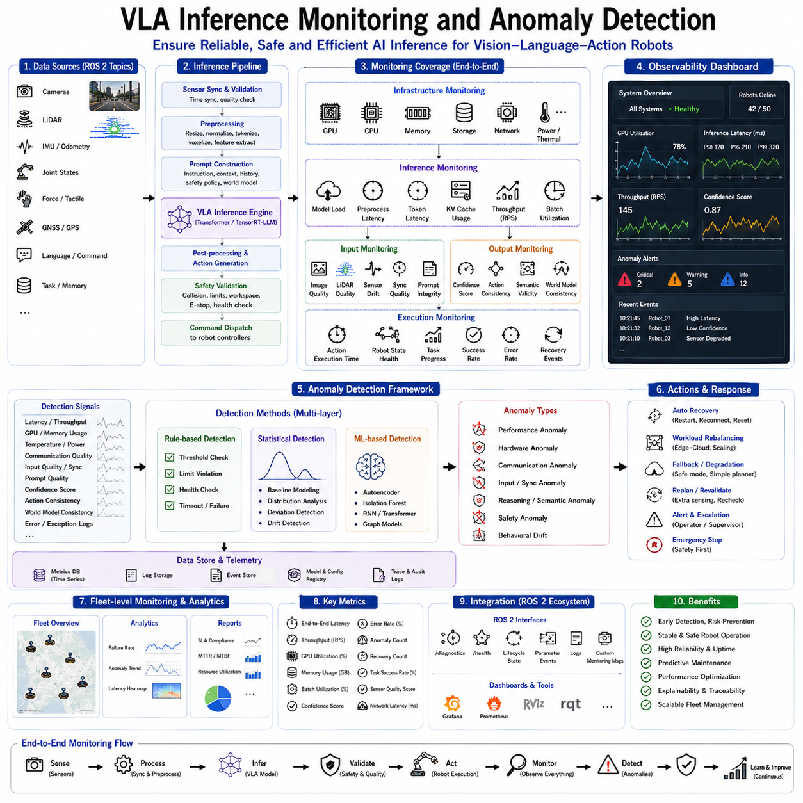{width="7.268055555555556in" height="7.268055555555556in"}

**42_10_07 비전-언어-행동(Vision-Language-Action, VLA) 추론 모니터링(Inference Monitoring) 및 이상 탐지(Anomaly Detection)**

비전-언어-행동(Vision-Language-Action, VLA) 모델은 비전(Vision), 자연어(Language), 의미 추론(Semantic Reasoning), 월드 모델(World Model), 작업 계획(Task Planning), 행동 생성(Action Generation)을 하나의 트랜스포머(Transformer) 구조로 통합한 차세대 물리 AI(Physical AI)의 핵심 기술이다. 그러나 이러한 모델이 연구 환경을 넘어 실제 산업용 로봇에 적용되기 위해서는 높은 정확도뿐 아니라 지속적인 추론 모니터링(Inference Monitoring)과 이상 탐지(Anomaly Detection)가 필수적이다. 잘못된 추론은 단순한 오류가 아니라 실제 장비 손상이나 안전 사고로 이어질 수 있기 때문이다.

추론 모니터링은 AI 모델만 감시하는 것이 아니라 전체 추론 파이프라인(Inference Pipeline)을 지속적으로 관찰하는 과정이다. 센서 입력(Sensor Input), 멀티모달 전처리(Multimodal Preprocessing), 트랜스포머 추론(Transformer Inference), 행동 생성(Action Generation), 안전 검증(Safety Validation), 실제 로봇 실행(Robot Execution)에 이르기까지 모든 과정을 실시간으로 모니터링한다. 이를 통해 이상 상황을 조기에 발견하고 위험한 동작이 발생하기 전에 대응할 수 있다.

산업용 로봇에서는 일반적인 대화형 AI보다 훨씬 높은 신뢰성(Reliability)이 요구된다. 언어 모델이 잘못된 답변을 생성하는 것은 단순한 불편으로 끝날 수 있지만, 로봇이 잘못된 조작 명령을 실행하면 장비 손상, 생산 중단, 작업자 안전 문제로 이어질 수 있다. 따라서 추론 모니터링은 단순한 디버깅(Debugging)을 넘어 안전 보장(Safety Assurance), 예측 유지보수(Predictive Maintenance), 운영 진단(Runtime Diagnostics), 장애 관리(Fault Management)의 핵심 역할을 수행한다.

모니터링 시스템은 일반적으로 계층형(Layered Architecture) 구조를 가진다. 가장 아래에서는 GPU, CPU, 메모리(Memory), 저장장치(Storage), 네트워크(Network), 전력(Power), 온도(Thermal)와 같은 하드웨어 자원을 감시한다. 그 위에서는 TensorRT-LLM, KV Cache, FlashAttention, 양자화(Quantization), 토큰 생성(Token Generation) 등의 추론 과정을 감시하며, 최상위 계층에서는 의미 추론 품질(Semantic Reasoning Quality), 행동 생성 일관성(Action Consistency), 안전 검증, 작업 수행 결과를 종합적으로 분석한다.

GPU 모니터링은 가장 중요한 요소 가운데 하나이다. GPU 사용률(Utilization), 메모리 사용량, 텐서 코어(Tensor Core) 활용률, 스트리밍 멀티프로세서(Streaming Multiprocessor) 사용률, 메모리 대역폭(Bandwidth), 캐시(Cache) 적중률, 커널 실행 시간(Kernel Execution Time), 전력 소비(Power Consumption), GPU 온도 등을 지속적으로 측정한다. GPU 사용률이 갑자기 감소하면 통신 병목이나 소프트웨어 오류를 의미할 수 있으며, 반대로 지속적으로 100%에 가까운 사용률과 높은 지연 시간이 함께 나타나면 계산 자원이 포화된 상태일 가능성이 높다.

메모리 모니터링(Memory Monitoring)도 매우 중요하다. VLA 모델은 모델 가중치(Model Weight), 활성값(Activation), 멀티모달 임베딩(Multimodal Embedding), KV Cache, 임시 텐서(Temporary Tensor)를 모두 GPU 메모리에 저장한다. 시간이 지나면서 메모리 단편화(Fragmentation), 할당 실패(Allocation Failure), 캐시 오버플로(Cache Overflow)가 발생하면 추론 속도가 점진적으로 저하될 수 있다. 따라서 사용 가능한 메모리, 캐시 활용률, 메모리 효율 등을 지속적으로 감시해야 한다.

추론 지연(Inference Latency)은 산업용 로봇의 핵심 성능 지표이다. 시스템은 전처리 시간(Preprocessing Latency), 모델 실행 시간(Model Execution Time), 토큰 생성 시간(Token Generation Latency), 멀티모달 동기화(Multimodal Synchronization), 통신 지연(Communication Delay), 행동 해석(Action Interpretation), 안전 검증 시간을 각각 측정한다. 이러한 데이터를 장기간 분석하면 성능 저하가 심각해지기 전에 문제를 조기에 발견할 수 있다.

처리량(Throughput) 모니터링도 중요하다. 엣지 로봇(Edge Robot)은 낮은 응답 시간을 우선시하지만, 클라우드 AI 서버는 여러 대의 로봇을 동시에 처리해야 한다. 따라서 초당 처리 요청(Request per Second), 동시 추론 세션(Concurrent Session), 배치 활용률(Batch Utilization), 연속 배치 처리(Continuous Batching), 추측 디코딩(Speculative Decoding) 수용률(Acceptance Rate), TensorRT 실행 효율 등을 지속적으로 측정하여 GPU 자원을 최적으로 분배한다.

통신 모니터링(Communication Monitoring)은 엣지-클라우드 하이브리드(Edge--Cloud Hybrid) 구조에서 매우 중요하다. 카메라, 라이다(LiDAR), 로봇 제어기, 엣지 서버, 클라우드 GPU 서버, 플릿 관리(Fleet Management)는 ROS 2, DDS, Ethernet, Wi-Fi, 5G, gRPC 등을 통해 통신한다. 패킷 손실(Packet Loss), 통신 지연(Network Latency), 대역폭 사용량, 시간 동기화 오차(Time Synchronization Drift), 메시지 큐(Message Queue) 증가 등을 감시하여 추론 품질 저하를 방지한다.

입력 모니터링(Input Monitoring)은 AI에 입력되는 센서 데이터의 품질을 평가한다. 카메라는 흐림(Blur), 과다 노출(Over Exposure), 저조도(Under Exposure), 렌즈 가림(Obstruction)이 발생할 수 있으며, 라이다는 비나 안개로 인해 포인트 클라우드(Point Cloud)가 손실될 수 있다. IMU는 드리프트(Drift)가 발생할 수 있고, 음성 인식은 잘못된 문장을 생성할 수도 있다. 이러한 입력 품질을 먼저 평가한 후 추론을 수행함으로써 잘못된 결과를 줄일 수 있다.

센서 동기화(Sensor Synchronization)도 중요한 모니터링 대상이다. 카메라, 라이다, GNSS, IMU, 힘 센서는 서로 다른 주기로 데이터를 생성한다. 시간 오차(Timestamp Error), PTP(Precision Time Protocol) 드리프트, 하드웨어 트리거 오류(Hardware Trigger Error), 메시지 손실이 발생하면 멀티모달 추론 정확도가 크게 감소한다. 따라서 시간 일관성을 지속적으로 검증해야 한다.

프롬프트 모니터링(Prompt Monitoring)은 최근 중요성이 커지고 있는 분야이다. VLA 모델은 프롬프트(Prompt)에 크게 의존하므로 시스템 프롬프트(System Prompt), 작업 지시(Task Instruction), 안전 정책(Safety Policy), 과거 작업 이력(Task History), 토큰 길이(Token Length), 멀티모달 구성(Multimodal Formatting)이 올바르게 생성되었는지를 확인해야 한다. 프롬프트가 잘못 구성되면 모델 자체는 정상이어도 전혀 다른 결과를 생성할 수 있다.

모델 신뢰도(Model Confidence)는 중요한 모니터링 지표이다. 토큰 확률(Token Probability), 엔트로피(Entropy), 불확실성(Uncertainty), 앙상블(Ensemble), 몬테카를로 샘플링(Monte Carlo Sampling)을 이용하여 결과의 신뢰도를 계산한다. 신뢰도가 낮은 경우에는 추가적인 센서 확인이나 다른 계획 알고리즘을 실행하거나, 필요하면 사람의 개입(Human Intervention)을 요청할 수 있다.

출력 일관성(Output Consistency)도 반드시 확인해야 한다. 생성된 행동은 이전 행동과 논리적으로 연결되어야 하며, 월드 모델(World Model), 안전 정책, 로봇의 실제 능력과 일치해야 한다. 갑작스럽게 서로 모순되는 행동이나 물리적으로 불가능한 명령이 생성되면 이를 이상 상황으로 판단하여 실행을 차단한다.

이상 탐지(Anomaly Detection)는 단순한 임계값(Threshold) 감시를 넘어 지능형 분석으로 발전하고 있다. 기존에는 GPU 온도, 메모리 부족, 통신 실패와 같은 명확한 조건만 감시했지만, 최근에는 정상적인 운영 패턴을 AI가 학습하고 이전에 정의되지 않은 이상 상황도 자동으로 탐지할 수 있도록 발전하고 있다.

통계 기반 이상 탐지(Statistical Anomaly Detection)는 지연 시간, GPU 사용률, 메모리 사용량, 신뢰도, 센서 동기화 등의 정상 분포(Baseline Distribution)를 학습한다. 이후 통계적으로 의미 있는 편차가 발생하면 아직 임계값을 넘지 않았더라도 이상으로 판단하여 조기에 대응할 수 있다.

기계학습 기반 이상 탐지(Machine Learning-Based Anomaly Detection)는 오토인코더(Autoencoder), 순환 신경망(Recurrent Neural Network), 트랜스포머 기반 모델, 가우시안 혼합 모델(Gaussian Mixture Model), Isolation Forest, 그래프 신경망(Graph Neural Network) 등을 사용한다. 여러 변수 간의 복합적인 관계를 동시에 분석하여 단순 규칙 기반보다 훨씬 높은 탐지 성능을 제공한다.

의미 기반 이상 탐지(Semantic Anomaly Detection)는 AI 추론 결과 자체를 분석한다. 하드웨어는 정상이라도 AI가 환각(Hallucination), 논리적 오류(Logical Inconsistency), 존재하지 않는 객체(Object Reference Error), 불가능한 조작(Impossible Manipulation), 위험한 행동을 생성할 수 있다. 이러한 결과를 환경 정보, 작업 규칙, 로봇의 물리적 제약과 비교하여 실행 전에 차단한다.

월드 모델 일관성(World Model Consistency) 검사도 매우 중요하다. VLA는 내부적으로 환경 모델을 유지하고 있으며, 새로운 행동은 이 모델과 일치해야 한다. 실제 환경과 내부 월드 모델 간의 차이가 커지면 센서 오류, 위치 추정(Localization) 오류, 오래된 메모리(Outdated Memory), 잘못된 추론을 의미할 수 있으므로 추가 검증을 수행한다.

행동 드리프트(Behavioral Drift) 모니터링은 장기간 운영에서 중요한 역할을 한다. 지속 학습(Continual Learning), 미세조정(Fine-Tuning), 검색 증강 생성(Retrieval-Augmented Generation, RAG) 등을 통해 모델이 점진적으로 변하면 추론 특성도 함께 변화한다. 운영 중인 모델을 과거의 검증된 기준(Baseline)과 비교하여 예상하지 못한 성능 변화나 안전성 저하를 조기에 발견할 수 있다.

플릿 수준 모니터링(Fleet-Level Monitoring)은 개별 로봇이 아닌 전체 로봇 시스템을 분석한다. 수백 대의 로봇에서 수집된 GPU 사용률, 추론 시간, 통신 상태, 작업 성공률(Task Success Rate), 이상 발생 빈도, 하드웨어 상태를 종합적으로 분석하여 시스템 전체의 문제를 발견할 수 있다. 이는 개별 로봇에서는 확인하기 어려운 인프라 문제를 찾는 데 매우 효과적이다.

ROS 2와의 통합도 매우 중요하다. ROS 2 Diagnostics, Lifecycle Node, Logging, Parameter Event, Health Monitoring Service 등을 이용하여 추론 정보와 하드웨어 상태를 지속적으로 수집하고, 전용 모니터링 노드(Monitoring Node)가 이를 종합하여 시스템 전체의 상태를 관리한다.

시각화 대시보드(Visualization Dashboard)는 운영자가 시스템 상태를 한눈에 확인할 수 있도록 지원한다. GPU 사용률, 추론 시간, 메모리 사용량, 통신 상태, 센서 품질, 신뢰도, 이상 탐지 결과, 플릿 위치, 작업 진행률 등을 실시간으로 표시하며, 장기간의 추세 분석을 통해 유지보수와 시스템 확장 계획에도 활용된다.

알림 관리(Alert Management)는 이상 탐지 결과를 실제 대응으로 연결한다. 경미한 이상은 로그(Log)만 남기고, 중간 수준의 이상은 추론 재시작, 작업 재분배, 센서 재보정을 수행한다. 심각한 이상은 긴급 정지(Emergency Stop), 안전 제어기(Safety Controller) 전환, 백업 시스템 활성화, 작업자 알림을 즉시 실행하여 안전을 확보한다.

원인 분석(Root Cause Analysis)은 이상 발생 이후의 조사 과정이다. 하드웨어 상태, 소프트웨어 로그, 통신 기록, 추론 결과, 센서 데이터, 로봇 행동을 함께 분석하여 정확한 원인을 찾아낸다. 이러한 분석은 향후 시스템 개선과 운영 안정성 향상에 중요한 역할을 한다.

보안(Security) 모니터링도 추론 모니터링과 밀접하게 연결된다. 악성 프롬프트(Prompt Injection), 센서 공격(Sensor Attack), 통신 위변조(Tampering), 모델 변경(Model Modification), 인증 실패(Authentication Failure), 비정상 네트워크 활동 등을 함께 감시하여 AI 시스템의 신뢰성을 유지한다.

향후 VLA 모니터링은 자가 복구(Self-Healing) 시스템으로 발전할 것으로 예상된다. AI 기반 감독기(Supervisory AI)가 GPU 상태, 모델 신뢰도, 통신 품질, 환경 복잡도, 작업 우선순위를 분석하여 엣지와 클라우드 간 작업을 자동으로 재분배하고, 모델을 교체하거나 정밀도(Precision)를 조절하며, 캐시(Cache)를 최적화하는 등 시스템을 스스로 복구하는 방향으로 발전할 것이다.

비전-언어-행동(Vision-Language-Action) 모델이 물리 AI의 핵심 지능으로 자리 잡을수록 추론 모니터링과 이상 탐지는 단순한 디버깅 도구가 아니라 필수 운영 인프라(Core Operational Infrastructure)가 될 것이다. 하드웨어, 소프트웨어, 통신, 멀티모달 입력, 트랜스포머 추론, 의미 추론, 행동 생성, 안전 검증까지 전 과정을 지속적으로 감시함으로써 산업용 로봇이 실제 환경에서도 안전하고 신뢰성 있게 동작하도록 지원하는 핵심 기술로 발전할 것으로 전망된다.

## 10.8 A/B Testing and Gradual Rollout (with Code)

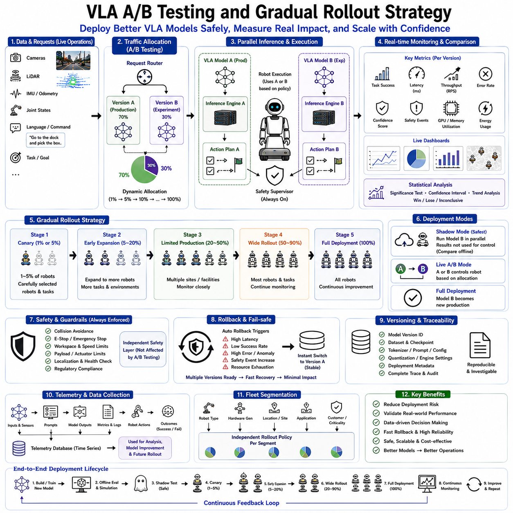{width="7.268055555555556in" height="7.268055555555556in"}

**42_10_08 비전-언어-행동(Vision-Language-Action, VLA) A/B 테스트(A/B Testing) 및 점진적 배포(Gradual Rollout) 전략**

비전-언어-행동(Vision-Language-Action, VLA) 파운데이션 모델(Foundation Model)은 비전(Vision), 자연어(Language), 의미 추론(Semantic Reasoning), 월드 모델(World Model), 작업 계획(Task Planning), 행동 생성(Action Generation)을 하나의 통합 구조에서 수행하며 차세대 물리 AI(Physical AI)의 핵심 기술로 자리 잡고 있다. 그러나 이러한 모델을 실제 산업용 로봇에 배포할 때는 모델 성능만큼이나 안전한 배포(Deployment) 전략이 중요하다. 새로운 모델은 로봇의 자율주행, 조작, 검사, 사람과의 상호작용까지 직접 변화시키므로 잘못된 업데이트는 생산 중단이나 안전사고로 이어질 수 있다.

기존 소프트웨어는 새로운 버전이 출시되면 기존 버전을 한 번에 교체하는 방식(All-at-Once Deployment)을 자주 사용하였다. 하지만 VLA 모델은 실제 환경에서 예상하지 못한 센서 노이즈(Sensor Noise), 새로운 객체, 다양한 조명, 하드웨어 차이, 장시간 작업 등으로 인해 연구실에서 확인하지 못한 문제가 발생할 수 있다. 따라서 모든 로봇에 동시에 새로운 모델을 적용하는 것은 매우 큰 운영 위험(Operation Risk)을 초래할 수 있다.

A/B 테스트(A/B Testing)는 두 개의 모델을 동일한 환경에서 비교하는 대표적인 실험 방법이다. 새로운 모델이 기존 모델보다 우수하다고 가정하지 않고, 실제 작업 환경에서 두 모델을 동시에 운영하면서 다양한 성능 지표를 수집한다. 이후 통계적 분석(Statistical Analysis)을 통해 실제 성능 향상인지, 단순한 환경 변화에 따른 차이인지를 객관적으로 판단한다.

일반적으로 Version A는 현재 운영 중인 검증된 프로덕션 모델(Production Model)이며, Version B는 새로운 학습 데이터, 향상된 월드 모델(World Model), 개선된 추론 구조, 새로운 프롬프트(Prompt), 양자화(Quantization), TensorRT 최적화 등을 적용한 실험 모델이다. 두 모델은 동시에 운영되며, 일부 작업만 새로운 모델에 할당하여 성능을 비교한다.

A/B 테스트의 가장 큰 목적은 배포 불확실성(Deployment Uncertainty)을 최소화하는 것이다. 오프라인 벤치마크(Benchmark)는 모델의 정확도와 추론 능력을 측정하는 데 유용하지만 실제 산업 환경에서는 동적 장애물(Dynamic Obstacle), 센서 오류, 통신 지연, 작업자의 개입 등 다양한 변수가 존재한다. 따라서 실제 운영 환경에서의 온라인 평가(Online Evaluation)가 반드시 필요하다.

트래픽 할당(Traffic Allocation)은 A/B 테스트의 핵심 요소이다. 처음부터 모든 추론 요청을 새로운 모델로 처리하지 않고, 일부 요청만 새로운 모델에 전달한다. 초기에는 전체 요청의 1% 또는 5% 정도만 Version B를 사용하며, 충분한 검증이 이루어진 후 점진적으로 비율을 증가시킨다. 이를 통해 문제 발생 시 영향 범위를 최소화할 수 있다.

트래픽 할당에는 여러 방식이 있다. 랜덤 할당(Random Allocation)은 요청을 무작위로 두 모델에 배분하여 통계적 편향을 줄인다. 로봇 기반 할당(Robot-Based Allocation)은 특정 로봇을 하나의 모델에 고정하여 장기간 비교한다. 작업 기반 할당(Task-Based Allocation)은 자율주행, 조작, 검사 등 특정 작업만 새로운 모델에 적용한다. 지역 기반 할당(Geographic Allocation)은 공장이나 운영 구역별로 서로 다른 모델을 적용하여 비교한다.

카나리아 배포(Canary Deployment)는 가장 안전한 점진적 배포 전략 가운데 하나이다. 전체 로봇이 아니라 극소수의 로봇만 새로운 VLA 모델을 사용한다. 이 카나리아 로봇들은 지속적으로 모니터링되며, 추론 품질, 안전성, 하드웨어 호환성, GPU 사용률, 작업 성공률 등을 집중적으로 분석한다. 문제가 없다고 판단되면 점차 적용 범위를 확대한다.

섀도우 배포(Shadow Deployment)는 더욱 안전한 방식이다. 새로운 VLA 모델은 실제 센서 데이터를 입력받아 추론을 수행하지만, 생성된 결과는 실제 로봇 제어에는 사용되지 않는다. 기존 프로덕션 모델만 실제 행동을 수행하고, 새로운 모델의 결과는 비교 분석만 수행한다. 따라서 실제 운영 환경에서 AI 성능을 검증하면서도 안전 위험은 전혀 발생하지 않는다.

디지털 트윈(Digital Twin)은 A/B 테스트를 보완하는 중요한 기술이다. 창고, 공장, 병원, 물류센터, 도심 환경 등을 가상으로 재현하여 두 모델을 동일한 조건에서 반복적으로 시험할 수 있다. 실제 환경을 완전히 대체할 수는 없지만, 실제 배포 이전에 많은 문제를 발견할 수 있으므로 운영 위험을 크게 줄여준다.

VLA 모델의 성능 평가는 단순한 AI 정확도만으로 이루어지지 않는다. 자율주행 성공률(Navigation Success Rate), 조작 정확도(Manipulation Accuracy), 작업 완료 시간(Task Completion Time), 이동 경로의 부드러움(Trajectory Smoothness), 장애물 회피 성능, 자연어 이해(Language Understanding), 의미 추론(Semantic Reasoning), 작업 계획(Task Planning), 로봇 대기 시간(Idle Time), 안전 개입(Safety Intervention), 에너지 소비(Energy Consumption), GPU 사용률, 추론 지연(Inference Latency) 등을 종합적으로 평가해야 한다.

추론 품질(Inference Quality)은 다양한 요소 간의 균형을 요구한다. 새로운 모델은 추론 정확도가 높지만 응답 시간이 길어질 수 있으며, 강한 양자화는 처리량을 높이지만 의미 이해 능력이 조금 감소할 수도 있다. 긴 문맥(Context Window)은 계획 능력을 향상시키지만 메모리 사용량도 증가한다. A/B 테스트는 이러한 여러 요소를 동시에 분석하여 실제 운영에서 가장 적절한 모델을 선택한다.

통계적 유의성(Statistical Significance)은 매우 중요하다. 산업 현장은 작업량, 작업자 행동, 센서 상태, 날씨 등 다양한 변수에 영향을 받는다. 따라서 단기간의 성능 향상이 실제 모델 성능 때문인지 단순한 환경 변화 때문인지를 구분해야 한다. 이를 위해 신뢰구간(Confidence Interval), 베이지안 추론(Bayesian Inference), 순차 분석(Sequential Analysis), 부트스트랩(Bootstrapping) 등을 활용하여 객관적인 결론을 도출한다.

안전 모니터링(Safety Monitoring)은 실험과 완전히 독립적으로 운영된다. 어떤 VLA 모델을 사용하더라도 충돌 회피(Collision Avoidance), 긴급 정지(Emergency Stop), 작업 공간 제한(Workspace Boundary), 속도 제한(Velocity Limit), 적재 하중(Payload), 위치 추정(Localization) 검증 등은 기존의 결정론적 안전 시스템(Deterministic Safety System)이 항상 담당한다. AI는 높은 수준의 작업 계획만 수행하며, 최종 안전은 기존 제어기가 책임진다.

롤백(Rollback) 기능은 점진적 배포의 핵심 요소이다. 추론 시간이 증가하거나 작업 성공률이 감소하거나 안전 문제가 발생하면 새로운 모델을 즉시 중단하고 기존 검증된 모델로 자동 복귀한다. 여러 모델이 동시에 유지되므로 소프트웨어를 다시 설치하지 않고도 매우 빠르게 이전 상태로 복원할 수 있다.

버전 관리(Version Management)는 이러한 배포를 지원하는 핵심 인프라이다. 각 모델은 모델 버전(Model Version), 학습 데이터셋(Dataset), 토크나이저(Tokenizer), 양자화 방식, TensorRT 설정, 프롬프트 템플릿(Prompt Template), 추론 엔진(Inference Engine) 등을 모두 함께 기록한다. 이를 통해 문제가 발생하면 정확한 환경을 재현하고 원인을 분석할 수 있다.

지속적인 모니터링(Continuous Monitoring)은 배포 과정 전체를 지원한다. GPU 사용률, 메모리 사용량, 추론 시간, 신뢰도(Confidence), 이상 탐지(Anomaly Detection), 작업 성공률(Task Success Rate), 안전 이벤트(Safety Event)를 버전별로 분리하여 분석한다. 운영자는 대시보드(Dashboard)를 통해 새로운 모델의 성능 변화를 실시간으로 확인할 수 있다.

점진적 배포(Gradual Rollout)는 단순히 트래픽 비율만 조절하는 것이 아니다. 먼저 연구실의 한 대의 로봇에서 시작하고, 이후 개발용 로봇, 시험 생산 라인, 일부 공장, 특정 지역, 전 세계 플릿(Fleet) 순으로 적용 범위를 확대한다. 각 단계는 일정이 아니라 성능 기준(Performance Criteria)을 만족했을 때만 다음 단계로 진행한다.

플릿 분할(Fleet Segmentation)은 배포 위험을 더욱 줄여준다. 로봇 종류, 하드웨어 세대, 지역, 고객, 작업 종류에 따라 각각 다른 배포 전략을 적용할 수 있다. 동일한 모델이라도 AMR, 휴머노이드(Humanoid), 이동형 매니퓰레이터(Mobile Manipulator)는 서로 다른 성능을 보일 수 있으므로 각 플릿에 최적화된 배포 전략을 적용하는 것이 중요하다.

ROS 2는 이러한 A/B 테스트를 자연스럽게 지원한다. 노드(Node) 교체, Lifecycle Node, Parameter, Namespace 기능을 이용하여 기존 소프트웨어를 수정하지 않고도 새로운 모델을 선택적으로 사용할 수 있다. Navigation, MoveIt, SLAM, Safety Controller는 그대로 유지되며 VLA 추론 엔진만 변경된다.

엣지-클라우드 하이브리드(Edge--Cloud Hybrid) 구조에서는 더욱 유연한 배포가 가능하다. 새로운 모델은 클라우드 GPU 서버에만 먼저 배포되고, 로봇은 중앙 서버에서 선택된 버전의 추론만 사용한다. 따라서 로봇 내부 소프트웨어를 수정하지 않고도 즉시 새로운 모델을 시험하거나 롤백할 수 있다.

초기 배포에서는 사람의 감독(Human Oversight)이 매우 중요하다. 작업자는 AI가 생성한 행동 계획(Action Plan), 의미 해석(Semantic Interpretation), 작업 순서(Task Sequence)를 검토한 후 실행 여부를 승인한다. 충분한 검증이 이루어진 이후에는 점차 사람의 개입을 줄이고 완전 자율 운용으로 전환할 수 있다.

텔레메트리(Telemetry)는 지속적인 개선의 핵심 데이터이다. 모든 추론 요청에 대해 입력 데이터, 프롬프트, 모델 버전, 추론 결과, GPU 사용률, 응답 시간, 신뢰도, 이상 탐지, 안전 이벤트, 작업 성공 여부를 저장한다. 이러한 데이터는 향후 모델 개선과 배포 전략 수립에 매우 중요한 자료가 된다.

비용 대비 효과(Cost-Benefit Analysis)도 중요한 평가 항목이다. 더 큰 모델은 높은 추론 성능을 제공하지만 GPU, 메모리, 네트워크 비용도 함께 증가한다. 따라서 실제 산업에서는 최고 성능보다 성능과 운영 비용(Total Cost of Ownership, TCO)의 균형이 더 중요하다. A/B 테스트는 이러한 비용 대비 성능도 함께 분석한다.

향후 점진적 배포는 AI 기반 자동 배포(AI-Assisted Deployment)로 발전할 것으로 예상된다. AI 오케스트레이터(Orchestrator)가 플릿 상태, GPU 자원, 환경 복잡도, 고객 요구사항, 네트워크 품질을 분석하여 어떤 로봇에 어떤 모델을 언제 배포할 것인지를 자동으로 결정하게 될 것이다. 강화학습(Reinforcement Learning), 베이지안 최적화(Bayesian Optimization), 예측 분석(Predictive Analytics)이 이러한 과정에 활용될 가능성이 높다.

비전-언어-행동(Vision-Language-Action) 모델이 산업용 물리 AI의 핵심 지능으로 발전함에 따라 A/B 테스트와 점진적 배포 전략은 선택 사항이 아니라 필수 운영 기술이 될 것이다. 체계적인 실험, 지속적인 모니터링, 통계적 검증, 안전 중심의 배포 정책, 신속한 롤백, 단계적 플릿 확대를 통해 더욱 강력한 AI 모델을 안전하게 산업 현장에 적용할 수 있으며, 생산성 향상과 운영 안정성, 규제 준수, 작업자 안전을 동시에 달성하는 핵심 기반 기술로 자리매김할 것이다.

## 10.9 Fallback to Classical Controllers (with Code)

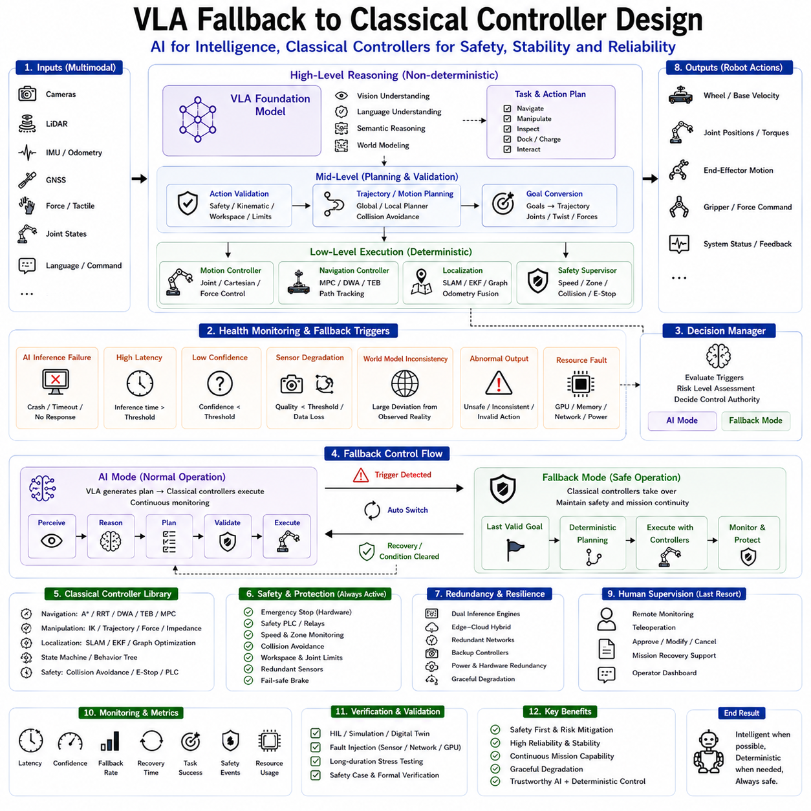{width="7.268055555555556in" height="7.268055555555556in"}

**42_10_09 비전-언어-행동(Vision-Language-Action, VLA) 고전 제어기(Classical Controller) 폴백(Fallback) 설계**

비전-언어-행동(Vision-Language-Action, VLA) 파운데이션 모델(Foundation Model)은 비전(Vision), 자연어(Language), 의미 추론(Semantic Reasoning), 월드 모델(World Model), 작업 계획(Task Planning), 행동 생성(Action Generation)을 하나의 통합 구조에서 수행하는 차세대 물리 AI(Physical AI)의 핵심 기술이다. 하지만 VLA는 학습 기반의 확률적(Probabilistic) 모델이며, 결정론적(Deterministic) 제어기가 아니다. 따라서 높은 수준의 추론과 계획에는 뛰어나지만, 산업 현장에서 요구되는 안전성(Safety), 예측 가능성(Predictability), 안정성(Stability)을 단독으로 보장할 수는 없다.

이러한 이유로 산업용 VLA 시스템은 반드시 폴백(Fallback) 구조를 함께 가져야 한다. 폴백이란 AI가 정상적으로 동작하지 못하거나 신뢰도가 낮아질 경우, 기존의 검증된 고전 제어기(Classical Controller)가 즉시 제어 권한을 이어받는 구조를 의미한다. 이를 통해 AI의 장점은 유지하면서도 실제 산업 현장에서 요구되는 높은 신뢰성과 안전성을 확보할 수 있다.

폴백 설계의 기본 원칙은 AI가 기존 제어기를 대체하는 것이 아니라 보완(Augmentation)하는 것이다. PID 제어기(Proportional-Integral-Derivative Controller), 모델 예측 제어(Model Predictive Control, MPC), 경로 계획기(Path Planner), 행동 트리(Behavior Tree), 상태 기계(Finite State Machine, FSM), 안전 PLC(Safety PLC), 충돌 회피(Collision Avoidance), 긴급 정지(Emergency Stop) 등은 수십 년 동안 산업 현장에서 검증된 기술이다. VLA는 이러한 제어기를 대체하지 않고 상위 수준의 의미 기반 의사결정만 담당한다.

산업용 로봇은 일반적으로 계층형 제어 구조(Hierarchical Control Architecture)를 사용한다. 최상위 계층에서는 VLA가 자연어를 이해하고 환경을 해석하며 작업 계획을 생성한다. 그 아래 계층에서는 기존 제어기가 이동 경로(Trajectory), 속도(Velocity), 조인트(Joint), 힘 제어(Force Control)를 계산한다. 폴백 시스템은 이 두 계층 사이에서 AI가 생성한 명령을 실행할 것인지, 기존 제어기로 전환할 것인지를 지속적으로 판단한다.

폴백은 단순히 AI가 완전히 멈추었을 때만 사용하는 기능이 아니다. GPU 고장, 모델 오류, 클라우드 연결 실패와 같은 명확한 장애뿐 아니라, 추론 지연(Inference Latency), 신뢰도 저하(Confidence Degradation), 이상 행동(Abnormal Output), 환경 복잡도 증가(Environment Complexity), 센서 품질 저하(Sensor Quality Degradation) 등 다양한 상황에서도 자동으로 활성화될 수 있어야 한다.

추론 지연(Inference Latency)은 가장 대표적인 폴백 조건이다. 로봇은 일정한 시간 안에 반드시 응답해야 하지만, 트랜스포머 기반 VLA는 GPU 부하, 메모리 부족, 통신 지연 등으로 응답 시간이 증가할 수 있다. 이러한 경우 AI의 응답을 계속 기다리는 것은 위험하므로, 일정 시간 이상 지연되면 즉시 기존의 결정론적 제어기로 제어 권한을 넘긴다.

모델 신뢰도(Confidence Estimation)도 중요한 판단 기준이다. 토큰 확률(Token Probability), 엔트로피(Entropy), 몬테카를로 샘플링(Monte Carlo Sampling), 베이지안 추론(Bayesian Estimation), 앙상블(Ensemble)을 이용하여 AI 결과의 신뢰도를 계산한다. 신뢰도가 낮으면 AI가 잘못되었다는 의미는 아니지만, 학습하지 않은 환경이나 불확실한 상황일 가능성이 높다. 이 경우 추가 센서 정보를 수집하거나 기존 계획기로 전환하는 것이 더욱 안전하다.

센서 품질(Sensor Quality)이 저하될 때도 폴백이 필요하다. VLA는 RGB 카메라, 깊이 센서(Depth Camera), 라이다(LiDAR), IMU, GNSS, 힘 센서(Force Sensor), 촉각 센서(Tactile Sensor) 등에 크게 의존한다. 비, 안개, 먼지, 어두운 환경, 센서 오염, 통신 장애 등으로 입력 데이터의 품질이 떨어지면 AI의 판단도 함께 불안정해질 수 있다. 따라서 센서 상태를 지속적으로 모니터링하고 기준 이하가 되면 기존의 자율주행 및 제어 알고리즘으로 전환한다.

월드 모델(World Model)의 일관성도 중요한 판단 요소이다. VLA는 내부적으로 환경을 표현하는 월드 모델을 유지한다. 하지만 실제 환경과 내부 모델이 크게 달라질 경우 위치 추정(Localization) 오류, 센서 이상, 환경 변화 또는 AI의 환각(Hallucination)이 발생했을 가능성이 있다. 이러한 경우 독립적인 SLAM, 위치 추정기(State Estimator), 지도(Map)와 비교하여 이상 여부를 판단하고 필요하면 폴백을 수행한다.

행동 검증(Action Validation)은 폴백 구조의 핵심이다. AI가 생성한 행동은 즉시 실행되지 않고 먼저 결정론적 안전 시스템에서 검증된다. 충돌 회피, 작업 공간 제한(Workspace Boundary), 속도 제한(Velocity Limit), 조인트 한계(Joint Limit), 토크 제한(Torque Limit), 적재 하중(Payload), 제동 거리(Braking Distance) 등을 모두 만족해야만 실제 제어기로 전달된다. 하나라도 위반되면 AI의 신뢰도와 관계없이 해당 행동은 거부된다.

행동 트리(Behavior Tree)는 폴백 구조와 매우 잘 결합된다. VLA는 작업 목표(Task Goal)와 계획(Task Plan)만 생성하고, 행동 트리는 자율주행, 조작, 검사, 도킹(Docking), 장애 복구(Recovery), 오류 처리(Fault Handling)를 결정론적으로 수행한다. 폴백이 발생하면 기존 행동 트리 안에 준비되어 있는 복구 경로(Recovery Branch)가 즉시 실행되므로 기존 산업용 소프트웨어를 거의 수정하지 않고도 AI를 통합할 수 있다.

상태 기계(Finite State Machine, FSM)도 안정적인 폴백 구조를 제공한다. 산업용 로봇은 초기화(Initialization), 대기(Idle), 이동(Navigation), 조작(Manipulation), 검사(Inspection), 충전(Charging), 긴급 정지(Emergency Stop), 복구(Recovery), 유지보수(Maintenance) 등의 명확한 상태를 가진다. VLA는 상태 간의 목표를 결정하지만, 실제 상태 전이는 FSM이 항상 검증한다. AI가 실패하더라도 FSM은 안전한 상태 전환을 지속적으로 유지할 수 있다.

자율주행(Navigation)은 대표적인 폴백 대상이다. SLAM, A\*, Dijkstra, Hybrid A\*, RRT(Rapidly-exploring Random Tree), DWA(Dynamic Window Approach), TEB(Timed Elastic Band), MPC, Pure Pursuit와 같은 기존 경로 계획기는 구조화된 환경에서 매우 높은 신뢰성을 가진다. AI가 일시적으로 사용할 수 없더라도 이러한 알고리즘을 이용하여 목적지까지 안전하게 이동할 수 있다.

매니퓰레이터(Manipulator)도 동일한 원리를 따른다. AI가 생성한 새로운 조작 계획 대신 기존의 역기구학(Inverse Kinematics), 궤적 생성기(Trajectory Generator), 카테시안 경로(Cartesian Motion), 힘 제어(Force Control), 임피던스 제어(Impedance Control), 검증된 파지 라이브러리(Grasp Library)를 사용하여 작업을 계속 수행할 수 있다.

위치 추정(Localization)은 항상 AI와 독립적으로 유지된다. 파티클 필터(Particle Filter), 확장 칼만 필터(Extended Kalman Filter, EKF), 그래프 최적화(Graph Optimization), Scan Matching, 휠 오도메트리(Wheel Odometry), GNSS 융합(GNSS Fusion), Visual Localization은 AI 상태와 관계없이 계속 동작한다. 따라서 AI가 중단되어도 로봇은 자신의 위치를 지속적으로 인식할 수 있다.

긴급 정지(Emergency Stop)는 AI와 완전히 독립적이어야 한다. 안전 릴레이(Safety Relay), Safety PLC, 브레이크 시스템, 레이저 안전 스캐너(Laser Safety Scanner), 보호 영역(Protective Field), 비상 정지 버튼(E-Stop)은 AI를 우회하여 직접 동작한다. 따라서 VLA나 폴백 소프트웨어 모두 이러한 안전 장치를 무시하거나 변경할 수 없다.

이중화(Redundancy)는 폴백의 신뢰성을 더욱 높인다. 여러 개의 GPU 서버, 엣지-클라우드 하이브리드(Edge--Cloud Hybrid), 이중 통신망(Redundant Communication), 복수의 위치 추정 시스템, 백업 컴퓨터 등을 함께 사용하면 하나의 장치가 고장 나더라도 전체 시스템은 계속 동작할 수 있다.

ROS 2는 폴백 구현에 매우 적합한 구조를 제공한다. Lifecycle Node, Node Composition, Parameter, Topic Remapping, Service Redirection, Action Cancellation 등을 이용하여 VLA 노드와 기존 제어 노드를 동시에 실행할 수 있다. 감독 노드(Supervisory Node)가 AI 상태와 시스템 상태를 감시하다가 필요하면 제어 권한을 기존 제어기로 즉시 전환한다.

엣지-클라우드 하이브리드 구조에서는 더욱 강력한 폴백이 가능하다. 클라우드 AI가 정상적으로 동작할 때는 고성능 VLA를 사용하고, 통신 장애나 네트워크 지연이 발생하면 로봇 내부에 있는 기존 자율주행 및 제어 알고리즘이 즉시 동작한다. 클라우드 연결이 복구되면 다시 AI 기반 운용으로 자연스럽게 전환할 수 있다.

사람(Human Supervisor)은 최후의 폴백 계층이다. AI와 기존 제어기 모두 해결하지 못하는 상황에서는 원격 조종(Teleoperation), 작업 승인(Task Approval), 임무 수정(Mission Modification), 작업 취소(Mission Cancellation) 등을 수행한다. 따라서 폴백은 단순한 소프트웨어 기능이 아니라 사람까지 포함하는 계층형 안전 구조(Hierarchical Safety Architecture)로 설계되어야 한다.

폴백 시스템의 성능도 지속적으로 평가해야 한다. 폴백 발생 빈도(Fallback Frequency), 복구 시간(Recovery Duration), 작업 성공률(Task Completion Rate), 안전 개입 횟수(Safety Intervention), 제어기 전환 시간(Controller Switching Latency), 위치 추정 연속성(Localization Continuity), 통신 안정성, 작업자 부담(Operator Workload) 등을 분석하여 AI 자체의 한계를 지속적으로 개선해야 한다.

폴백 구조는 충분한 검증이 필요하다. 디지털 트윈(Digital Twin), HIL(Hardware-in-the-Loop), GPU 장애 시험, 통신 장애 시뮬레이션, 센서 고장 시험, 장시간 자율 운용 시험 등을 통해 모든 장애 상황에서도 안전하게 제어 권한이 전환되는지 확인해야 한다. 또한 형식 검증(Formal Verification)을 이용하여 전환 과정의 안정성도 검증할 수 있다.

향후 폴백 구조는 단순한 ON/OFF 방식이 아니라 적응형(Adaptive) 구조로 발전할 가능성이 높다. AI 감독기(Supervisory AI)가 모델 신뢰도, 환경 복잡도, GPU 자원, 네트워크 상태, 하드웨어 상태를 종합적으로 분석하여 AI와 기존 제어기의 비중을 실시간으로 조절하게 될 것이다. 강화학습(Reinforcement Learning), 위험 추정(Risk Estimation), 베이지안 의사결정(Bayesian Decision Theory)이 이러한 구조에 활용될 것으로 예상된다.

비전-언어-행동(Vision-Language-Action) 모델이 차세대 물리 AI의 핵심 지능으로 발전하더라도 결정론적 고전 제어기(Classical Controller)는 산업용 로봇에서 여전히 필수적인 기반 기술로 남을 것이다. VLA는 의미 이해와 유연한 추론을 담당하고, 고전 제어기는 안정성과 안전성을 보장한다. 두 기술을 계층적으로 결합한 폴백 구조는 실제 산업 환경에서 신뢰할 수 있는 지능형 로봇을 구현하기 위한 가장 현실적이고 효과적인 아키텍처가 될 것으로 전망된다.

## 10.10 Production Latency Benchmarking

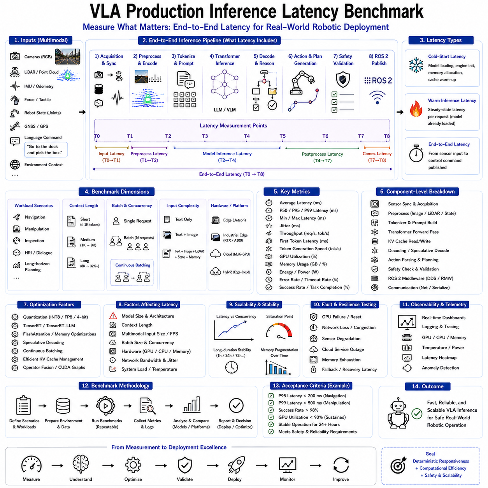{width="7.268055555555556in" height="7.268055555555556in"}

**42_10_10 비전-언어-행동(Vision-Language-Action, VLA) 프로덕션(Production) 추론 지연(Inference Latency) 벤치마크(Benchmark)**

비전-언어-행동(Vision-Language-Action, VLA) 파운데이션 모델(Foundation Model)은 비전(Vision), 자연어(Language), 의미 추론(Semantic Reasoning), 월드 모델(World Model), 작업 계획(Task Planning), 행동 생성(Action Generation)을 하나의 트랜스포머(Transformer) 구조에서 수행하는 물리 AI(Physical AI)의 핵심 기술이다. 그러나 모델의 규모와 성능이 증가할수록 추론 지연(Inference Latency)은 실제 산업용 로봇 적용 여부를 결정하는 가장 중요한 요소 가운데 하나가 되었다. 연구 환경에서는 정확도가 중요하지만, 실제 생산 환경에서는 응답 속도와 안정성이 동일하게 중요하다.

추론 지연은 멀티모달 입력(Multimodal Input)을 받아 실제 로봇 명령(Robot Action)을 생성하기까지 걸리는 전체 시간을 의미한다. 이는 단순히 AI 모델의 실행 시간만을 의미하지 않는다. 카메라 입력(Camera Acquisition), 라이다(LiDAR) 처리, 센서 동기화(Sensor Synchronization), 전처리(Preprocessing), 토크나이저(Tokenizer), 프롬프트 생성(Prompt Construction), 트랜스포머 추론, KV Cache 처리, 행동 생성(Action Decoding), 경로 생성(Trajectory Generation), 안전 검증(Safety Validation), ROS 2 통신까지 전체 과정이 포함된다.

실시간 로봇 시스템은 일반적인 대화형 AI와는 다른 요구사항을 가진다. 챗봇(Chatbot)은 수 초 정도의 응답 지연이 허용될 수 있지만, 산업용 로봇은 이동 중 장애물, 사람과의 상호작용, 센서 변화에 즉시 반응해야 한다. 응답 시간이 길어질수록 자율주행 정확도, 조작 정밀도, 안전성, 작업 완료 시간이 모두 영향을 받는다. 따라서 벤치마크는 연구실 환경이 아니라 실제 운영 환경을 기준으로 수행되어야 한다.

프로덕션 벤치마크는 여러 종류의 지연 시간을 구분하여 측정한다. 콜드 스타트 지연(Cold-Start Latency)은 모델 로딩(Model Loading), TensorRT 초기화, GPU 메모리 확보, 토크나이저 준비, KV Cache 초기화 등 시스템 시작에 필요한 시간을 의미한다. 이는 일상적인 추론에는 직접적인 영향을 주지 않지만 시스템 재시작이나 유지보수 시 중요한 성능 지표가 된다.

웜 추론 지연(Warm Inference Latency)은 모델이 이미 메모리에 적재되어 정상적으로 실행 중인 상태에서 새로운 요청을 처리하는 시간을 의미한다. 실제 산업 현장은 장시간 연속 운용이 일반적이므로 웜 지연 시간이 실제 운영 성능을 가장 잘 나타내는 지표로 사용된다.

종단 간 지연(End-to-End Latency)은 가장 중요한 성능 지표이다. 센서 입력부터 시작하여 이미지와 라이다 수집, 멀티모달 전처리, 프롬프트 생성, 트랜스포머 추론, 행동 생성, 안전 검증, ROS 2 메시지 전달, 실제 로봇 제어 명령 생성까지 모든 과정을 포함한다. 따라서 실제 로봇의 응답성을 평가하는 가장 현실적인 벤치마크 방식이다.

구성 요소별(Component-Level) 벤치마크도 함께 수행된다. 센서 동기화 시간, 이미지 전처리, 토크나이징(Tokenization), 프롬프트 생성, 트랜스포머 Forward Pass, KV Cache 처리, 추측 디코딩(Speculative Decoding), 행동 해석(Action Parsing), 궤적 생성(Trajectory Generation), 안전 검증(Safety Validation), ROS 2 통신 시간을 각각 측정한다. 이를 통해 병목(Bottleneck)이 발생하는 구간을 정확하게 찾을 수 있다.

트랜스포머 추론은 전체 계산량의 대부분을 차지한다. 따라서 첫 번째 토큰 생성 시간(First Token Latency), 토큰 생성 속도(Token Generation Speed), 전체 디코딩 시간(Decoding Time), 추측 디코딩 수용률(Acceptance Rate), FlashAttention 성능, TensorRT 커널(Kernel) 실행 시간, 양자화(Quantization), KV Cache 활용률 등을 세부적으로 분석한다.

배치 추론(Batch Inference)은 지연 시간에 큰 영향을 준다. 단일 로봇의 응답 시간을 측정하는 단일 요청(Single Request)과 여러 대의 로봇을 동시에 처리하는 배치 추론은 서로 다른 특성을 가진다. 연속 배치 처리(Continuous Batching)는 실행 중인 배치에 새로운 요청을 계속 추가하므로 처리량(Throughput)은 증가하지만 개별 응답 시간은 달라질 수 있다. 따라서 다양한 배치 크기에 대해 별도로 측정해야 한다.

하드웨어(Hardware)는 추론 성능을 결정하는 가장 중요한 요소 가운데 하나이다. NVIDIA Jetson과 같은 엣지 플랫폼(Edge Platform)은 낮은 전력 소비를 목표로 하지만 계산 성능은 제한적이다. 산업용 엣지 컴퓨터(Industrial Edge Computer)는 RTX GPU를 사용하여 높은 성능을 제공하며, 클라우드 GPU 서버는 다중 GPU(Multi-GPU), 텐서 병렬화(Tensor Parallelism), 파이프라인 병렬화(Pipeline Parallelism)를 이용하여 가장 높은 처리량을 제공한다. 따라서 플랫폼별 벤치마크가 반드시 필요하다.

GPU 사용률(GPU Utilization)은 지연 시간을 해석하는 중요한 지표이다. GPU 사용률이 낮은데도 응답 시간이 길다면 CPU 전처리, 통신, 메모리 단편화(Fragmentation), 배치 스케줄링(Batch Scheduling)에 문제가 있을 가능성이 높다. 반대로 GPU 사용률이 지속적으로 100%에 가까우면서 응답 시간이 증가한다면 계산 자원이 포화(Saturation)된 상태를 의미한다.

메모리(Memory) 동작도 중요한 평가 대상이다. 모델 가중치(Model Weight), 활성값(Activation), 멀티모달 임베딩(Multimodal Embedding), KV Cache, 임시 버퍼(Buffer) 등이 GPU 메모리를 사용한다. 메모리 할당 시간, 단편화, 캐시 효율(Cache Efficiency), 메모리 대역폭(Bandwidth), 페이지(Page) 관리 등을 분석하여 지연 시간과의 관계를 평가한다.

엣지-클라우드 하이브리드(Edge--Cloud Hybrid) 구조에서는 통신 지연(Communication Latency)도 중요한 요소이다. Ethernet, Wi-Fi, 5G, DDS, ROS 2, gRPC, REST API 등을 통해 데이터가 전달되므로 네트워크 지연(Network Latency), 패킷 손실(Packet Loss), 직렬화(Serialization), 시간 동기화(Synchronization)까지 모두 포함하여 측정해야 한다.

멀티모달 입력(Multimodal Input)의 복잡성도 추론 시간에 영향을 준다. 단순한 언어 명령은 빠르게 처리되지만, 이미지, 포인트 클라우드(Point Cloud), 월드 모델, 의미 메모리(Semantic Memory)를 함께 사용하는 경우 계산량이 크게 증가한다. 따라서 자율주행, 조작, 검사, 사람과의 상호작용(Human-Robot Interaction), 장기 작업(Long-Horizon Planning) 등 다양한 작업별로 별도의 벤치마크를 수행해야 한다.

문맥 길이(Context Length) 역시 중요한 변수이다. 최신 VLA 모델은 긴 작업 이력(Task History), 검색 증강 생성(Retrieval-Augmented Generation, RAG), 환경 설명, 의미 메모리 등을 함께 처리한다. 문맥이 길어질수록 어텐션(Attention) 계산량과 KV Cache 크기가 증가하므로 다양한 문맥 길이에 따른 성능 변화를 함께 측정해야 한다.

추론 최적화(Optimization)는 벤치마크 결과를 크게 변화시킨다. 양자화(Quantization)는 계산량을 줄이고, TensorRT-LLM은 GPU 실행을 최적화하며, FlashAttention은 어텐션 연산을 가속한다. 추측 디코딩(Speculative Decoding)은 디코딩 횟수를 줄이고, 연속 배치 처리와 KV Cache 최적화는 GPU 활용률을 높인다. 따라서 각 기술을 단독으로 적용한 경우와 조합하여 적용한 경우를 모두 비교해야 한다.

평균 응답 시간(Average Latency)만으로는 실제 성능을 평가할 수 없다. 산업용 로봇은 결정론적 응답(Deterministic Response)이 중요하므로 최소(Minimum), 최대(Maximum), 중앙값(Median), 95% 백분위(P95), 99% 백분위(P99), 표준편차(Standard Deviation), 지터(Jitter)를 모두 분석해야 한다. 특히 드물게 발생하는 긴 지연(Tail Latency)은 전체 시스템의 안전성에 큰 영향을 줄 수 있다.

확장성(Scalability)도 중요한 평가 항목이다. 여러 대의 로봇이 하나의 GPU 서버를 사용할 경우 동시 추론 요청이 증가하면서 응답 시간이 어떻게 변하는지를 분석해야 한다. 이를 통해 GPU 포화 시점(Saturation Point)을 미리 예측하고 적절한 서버 규모를 계획할 수 있다.

장시간 안정성(Long-Term Stability) 시험도 필수적이다. 수 시간 또는 수일 동안 연속적으로 추론을 수행하면 GPU 발열(Thermal Throttling), 메모리 단편화, 캐시 누적(Cache Accumulation), 통신 품질 저하, 자원 누수(Resource Leakage) 등이 발생할 수 있다. 짧은 벤치마크에서는 보이지 않는 이러한 문제를 장시간 시험을 통해 확인해야 한다.

장애 허용성(Fault Tolerance)도 벤치마크 대상이다. GPU 장애, 통신 끊김, 센서 이상, 네트워크 혼잡, 클라우드 서버 장애, 메모리 부족 등을 인위적으로 발생시켜 폴백(Fallback) 제어기가 얼마나 빠르게 제어를 이어받는지 평가한다. 정상 상태뿐 아니라 장애 상황에서도 응답성을 유지하는 것이 중요하다.

ROS 2 자체도 지연 시간에 영향을 준다. 메시지 직렬화(Message Serialization), DDS 전송, QoS(Quality of Service), Callback 실행, Action Server, Lifecycle Node, 분산 노드(Node Synchronization)가 모두 응답 시간에 영향을 미친다. 따라서 AI 추론과 ROS 2 통신을 분리하여 각각의 오버헤드(Overhead)를 측정하는 것이 필요하다.

관측성(Observability)은 벤치마크 과정에서 매우 중요하다. GPU 사용률, CPU 부하, 메모리 사용량, 전력 소비(Power Consumption), 온도(Thermal), 추론 시간, 토큰 생성 속도, 통신 성능, KV Cache 활용률, 신뢰도(Confidence), 이상 탐지(Anomaly Detection), 작업 성공률(Task Success Rate)을 지속적으로 기록하여 성능 저하의 원인을 분석한다.

벤치마크는 반드시 재현 가능(Reproducibility)해야 한다. 동일한 GPU, TensorRT 버전, 양자화 설정, 토크나이저, 프롬프트 템플릿, 최적화 옵션, 통신 환경, 작업 시나리오를 사용해야만 모델 간의 공정한 비교가 가능하다. 버전 관리(Version Control)를 통해 모든 실험 조건을 기록하는 것이 중요하다.

최종적으로 프로덕션 적용 여부는 운영 기준(Production Acceptance Criteria)에 의해 결정된다. 창고 물류(Warehouse Logistics), 협동로봇(Collaborative Robot), 자율 점검(Autonomous Inspection), 의료 로봇(Medical Robot), 건설 로봇(Construction Robot), 농업 로봇(Agricultural Robot)은 모두 요구되는 응답 시간이 다르다. 따라서 동일한 벤치마크 결과라도 적용 분야에 따라 평가 기준이 달라질 수 있다.

향후 추론 지연 벤치마크는 AI 기반 자동 벤치마킹(AI-Driven Benchmarking)으로 발전할 것으로 예상된다. AI가 자동으로 다양한 작업 시나리오를 생성하고, 병목을 분석하며, 최적의 TensorRT 설정, 배치 크기, 캐시(Cache) 구성, GPU 자원 배분을 추천하는 형태로 발전할 가능성이 높다. 또한 운영 중인 시스템을 지속적으로 분석하여 성능을 자동으로 최적화하는 방향으로 발전할 것이다.

비전-언어-행동(Vision-Language-Action) 모델이 차세대 물리 AI의 핵심 기술로 자리 잡을수록 프로덕션 추론 지연 벤치마크는 단순한 성능 시험이 아니라 실제 산업 적용 가능성을 결정하는 핵심 평가 방법이 될 것이다. 멀티모달 입력부터 트랜스포머 추론, 통신, ROS 2, 안전 검증, 장기 안정성까지 전 과정을 종합적으로 분석함으로써 고성능 AI와 산업 현장의 실시간성, 안전성, 신뢰성을 동시에 만족하는 VLA 시스템을 구축하는 핵심 기반 기술로 발전할 것으로 전망된다.
