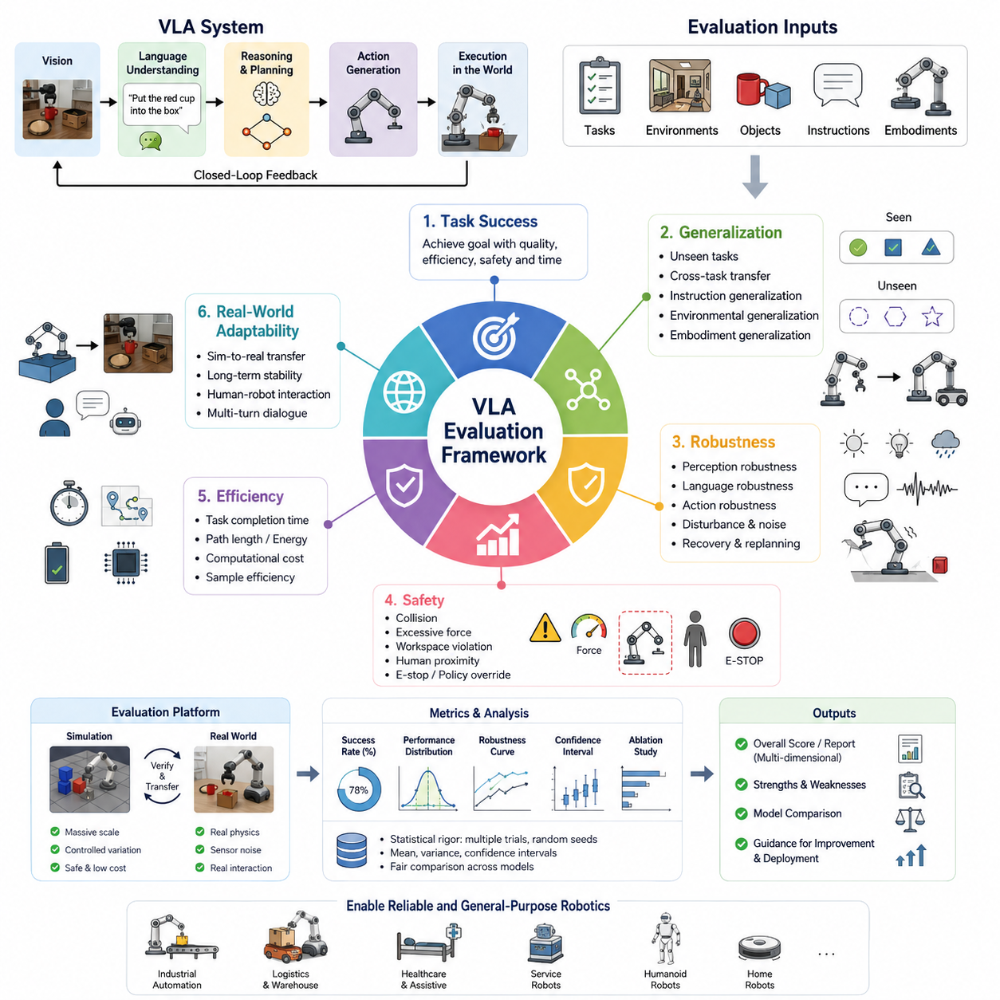
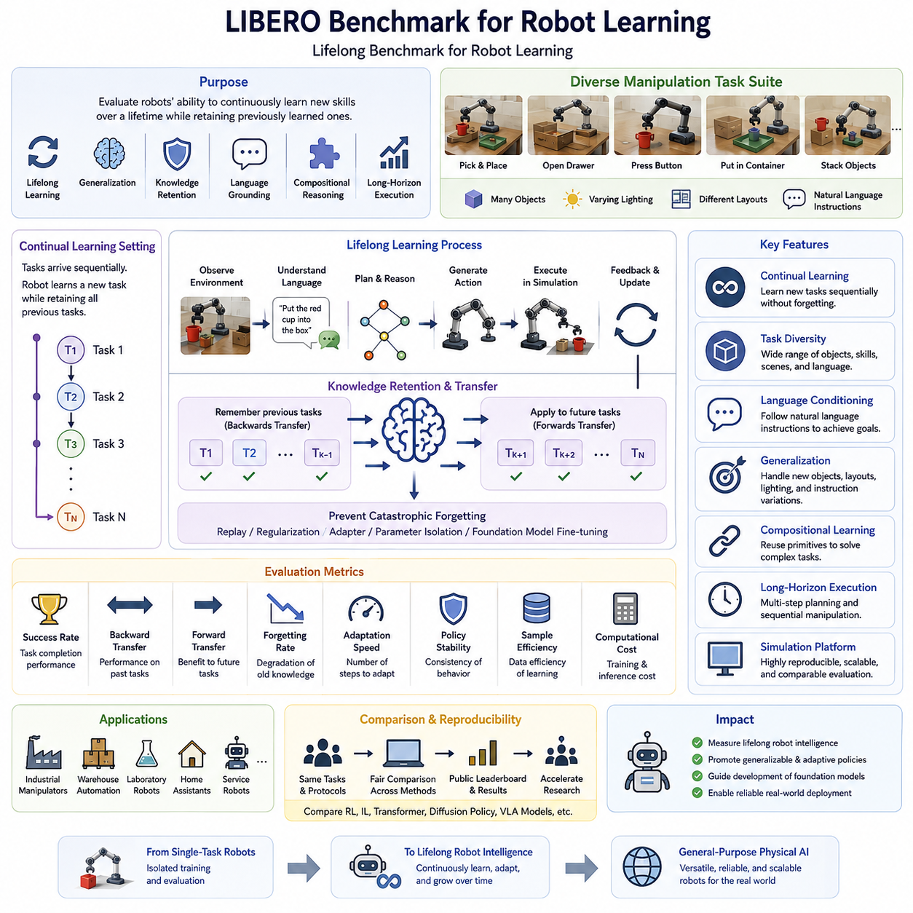
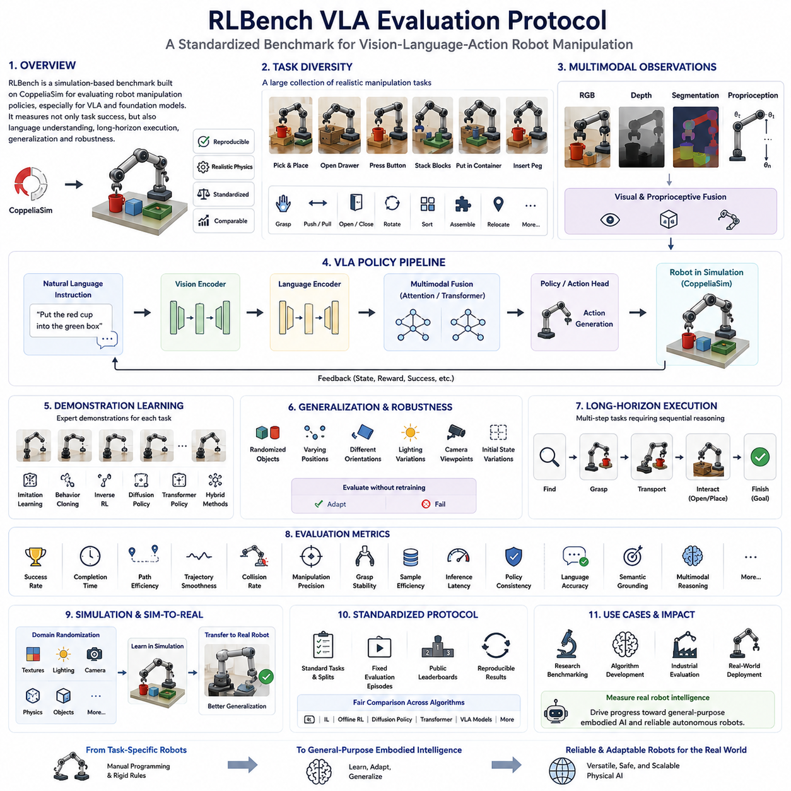
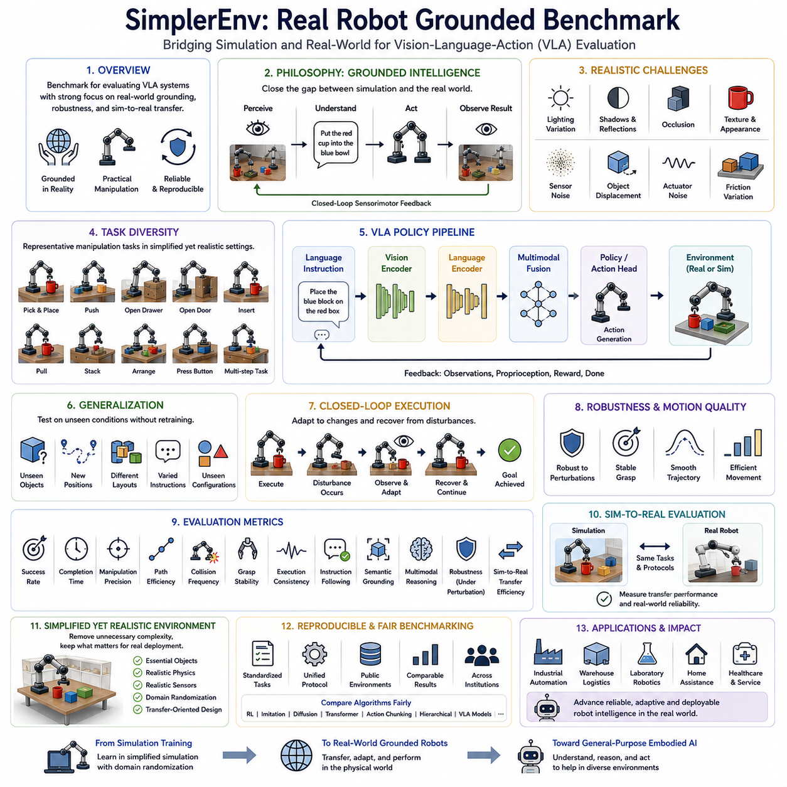
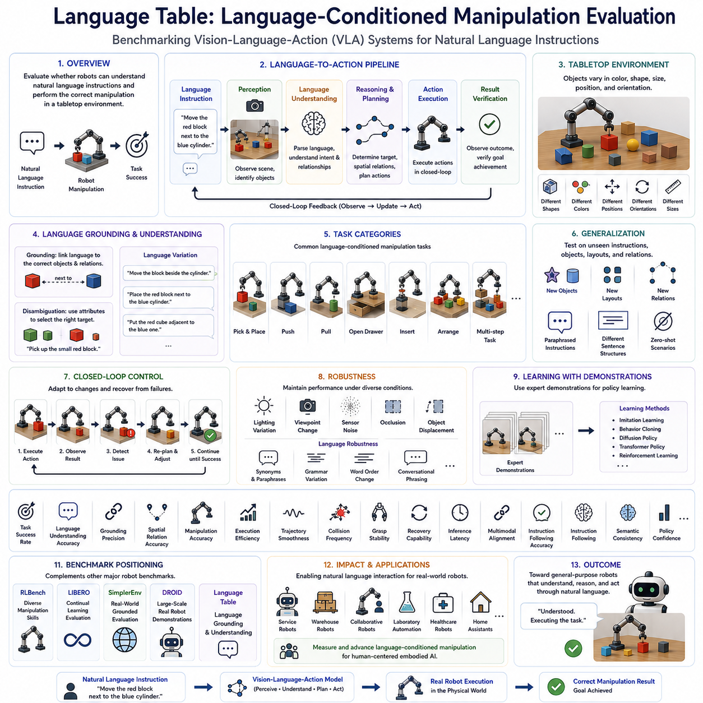
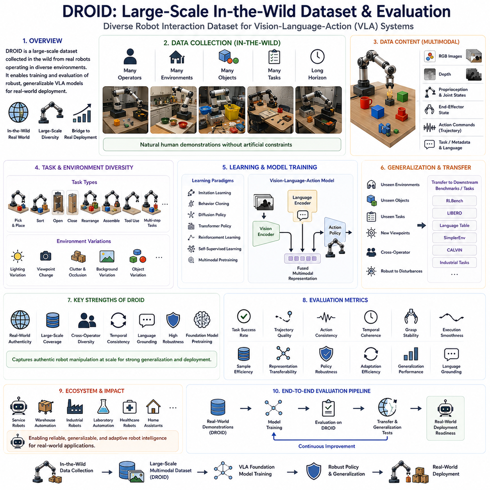
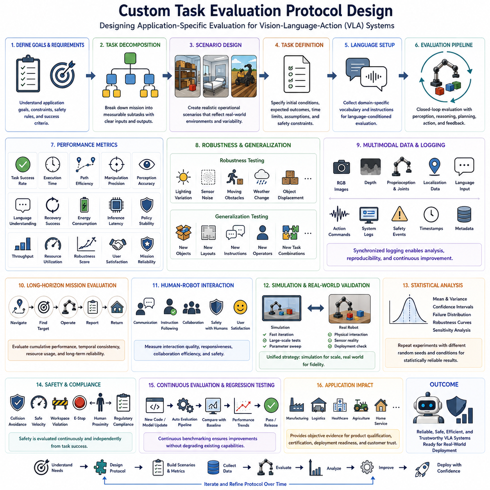
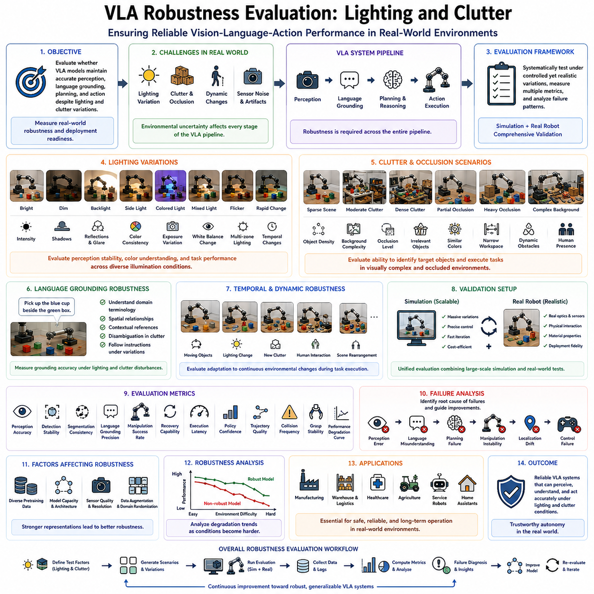
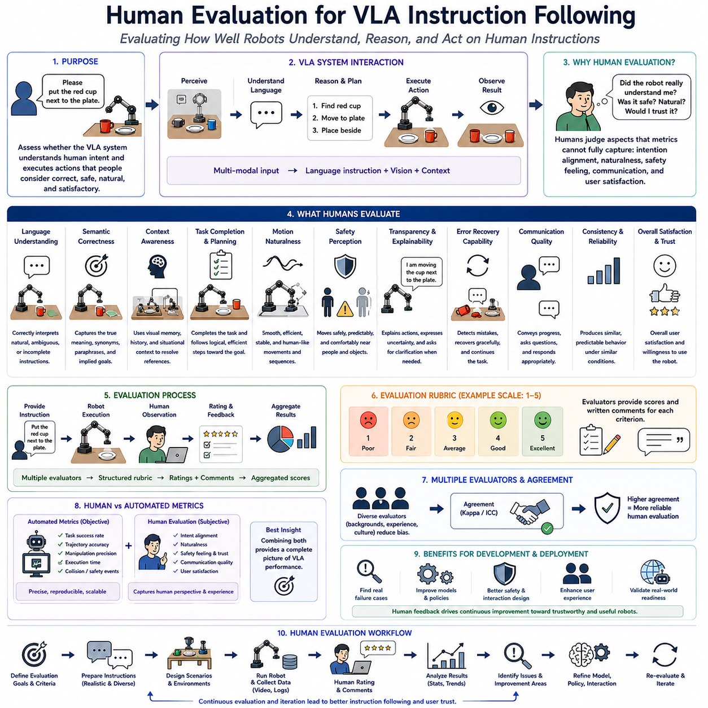
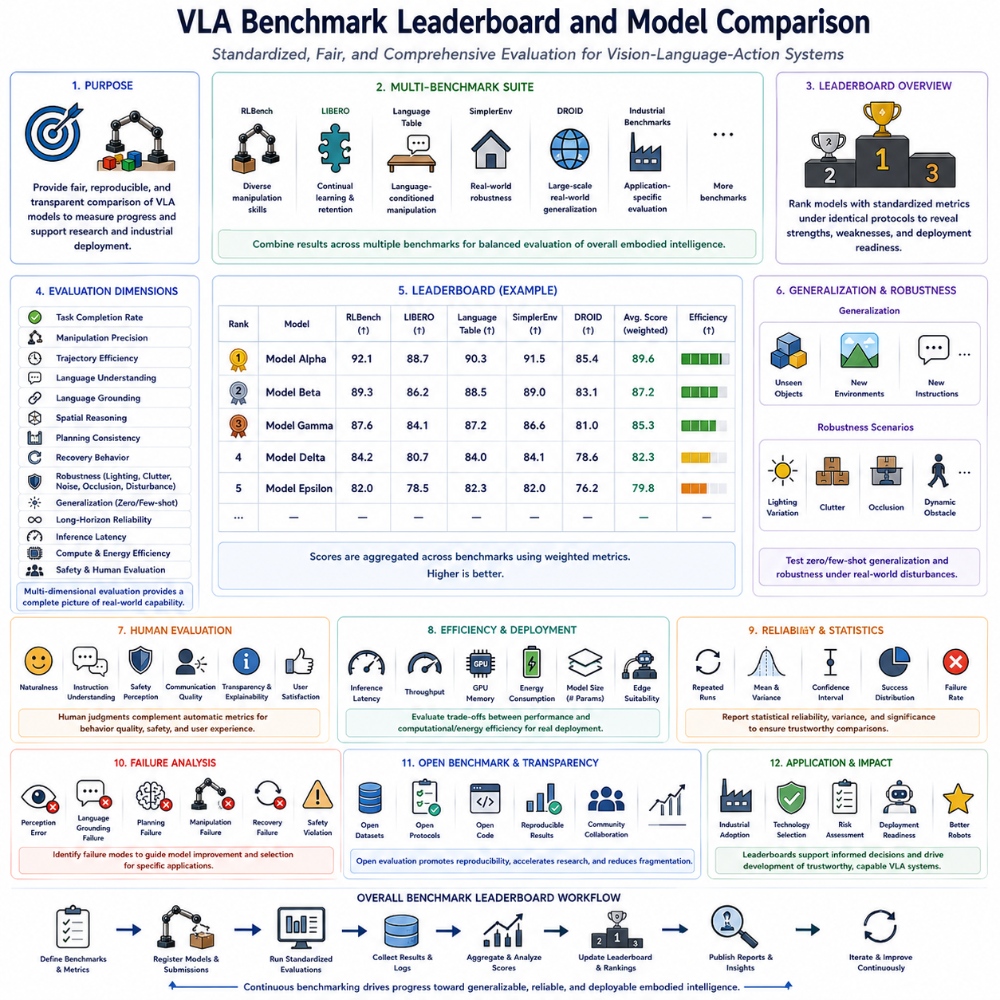

**Volume 20. Vision Language Action (VLA) Models**

# Chapter 11. VLA Evaluation and Benchmarks

## 11.1 Evaluation Framework

{width="7.268055555555556in" height="7.268055555555556in"}

**42_11_01_VLA_Evaluation_Framework_Task_Generalization_Robustness**

Vision-Language-Action (VLA) systems represent a new generation of robotic intelligence in which perception, language understanding, reasoning, and action generation are learned within a unified model. Unlike conventional robotics, where perception, planning, and control are evaluated independently, VLA models require an integrated evaluation framework capable of measuring the complete decision-making pipeline. A comprehensive evaluation framework must therefore assess not only whether a robot successfully completes a task, but also whether it understands instructions, adapts to unseen environments, generalizes across tasks, recovers from unexpected situations, and consistently performs under realistic operating conditions. The primary objective of VLA evaluation is to quantify how effectively a foundation model transforms multimodal observations and natural language instructions into safe, efficient, and reliable physical actions. This topic is positioned within the Volume 42 VLA Evaluation and Benchmarks section as the foundational methodology upon which all subsequent benchmark suites and evaluation protocols are built.

Traditional robotics evaluation often focuses on isolated performance indicators such as localization accuracy, grasp success, navigation efficiency, or trajectory tracking error. Although these metrics remain valuable, they cannot adequately capture the holistic intelligence exhibited by modern VLA systems. A robot may achieve excellent manipulation precision while completely misunderstanding a user\'s natural language instruction. Conversely, a robot may correctly interpret an instruction but fail due to poor visual grounding or insufficient action planning. Consequently, VLA evaluation must simultaneously analyze perception quality, semantic reasoning, language grounding, action generation, execution stability, and overall mission success. These interconnected capabilities should be assessed using unified evaluation protocols that reflect real-world robotic deployment rather than isolated subsystem performance.

Task success remains one of the most intuitive evaluation metrics within a VLA framework. A task is considered successful when the robot reaches the intended goal while satisfying all specified constraints, safety requirements, and environmental conditions. Success should not merely represent binary completion but should also consider execution quality, efficiency, robustness, and consistency. For example, a robot instructed to place a fragile object inside a storage container should be evaluated not only on whether the object reaches the destination but also on whether excessive force was avoided, collisions were prevented, object orientation remained acceptable, and execution time met operational requirements. Such comprehensive success criteria provide a richer understanding of robotic intelligence than simple completion rates.

Generalization is one of the defining characteristics that distinguishes foundation models from conventional task-specific robotic systems. An effective VLA model should transfer learned knowledge to previously unseen tasks without extensive retraining. Evaluation of task generalization therefore measures the model\'s ability to apply existing knowledge to novel combinations of objects, environments, instructions, and operational contexts. Generalization testing intentionally introduces conditions that differ from those observed during training. These may include new object categories, unfamiliar room layouts, alternative manipulation targets, different lighting conditions, novel instruction phrasing, or entirely new task compositions. A highly generalizable VLA system demonstrates graceful performance degradation rather than catastrophic failure when encountering unfamiliar situations.

Cross-task generalization represents another essential dimension of evaluation. Rather than memorizing individual demonstrations, a capable VLA model should recognize reusable manipulation skills, navigation behaviors, and semantic relationships that apply across multiple tasks. For instance, grasping techniques learned during warehouse picking should transfer naturally to household object organization, while navigation skills developed in office environments should remain useful within industrial facilities. Evaluation frameworks therefore include diverse task families that require the model to recombine previously acquired skills into new behaviors. Measuring cross-task transfer provides valuable insight into whether a model has learned meaningful physical representations instead of memorizing fixed action sequences.

Instruction generalization focuses specifically on language understanding. Human users rarely issue identical commands during real-world operation, making linguistic flexibility essential for practical deployment. Evaluation therefore includes paraphrased instructions, varying sentence structures, indirect requests, ambiguous wording, contextual references, and multi-step commands. A robust VLA model should correctly infer semantic intent despite substantial variation in linguistic expression. Successful language generalization demonstrates that the robot understands concepts rather than memorizing predefined command templates. This capability significantly improves natural human-robot interaction and reduces the need for carefully engineered command syntax.

Environmental generalization extends evaluation beyond language into the physical world. Robots must operate reliably across diverse environments characterized by different layouts, object arrangements, illumination conditions, background textures, weather, sensor noise, and dynamic obstacles. Evaluation protocols deliberately modify environmental variables while preserving task objectives to determine whether the learned policy remains stable under changing conditions. Robust environmental generalization indicates that the model has acquired invariant representations capable of supporting reliable decision-making across realistic deployment scenarios.

Embodiment generalization has become increasingly important as foundation policies are expected to operate across multiple robot platforms. Evaluation should determine whether knowledge acquired using one robotic embodiment can be transferred to systems with different kinematic structures, sensor configurations, end effectors, or mobility platforms. Examples include transferring manipulation policies between robotic arms, applying navigation behaviors across different AMRs, or adapting integrated VLA policies to humanoid robots. Measuring embodiment transfer helps determine whether learned representations capture abstract task semantics rather than embodiment-specific control strategies.

Robustness evaluation examines how well the VLA model maintains performance when exposed to disturbances, uncertainty, and unexpected environmental changes. Real-world robotic systems rarely operate under ideal laboratory conditions. Sensor noise, partial occlusions, lighting variation, communication delays, object deformation, actuator inaccuracies, and environmental dynamics continuously challenge decision-making. A comprehensive robustness evaluation systematically introduces these disturbances while measuring degradation in task performance. Robust models should exhibit stable behavior, recover gracefully from temporary failures, and avoid unsafe actions even when operating under significant uncertainty.

Perception robustness is particularly important because visual observations form the foundation of most VLA architectures. Evaluation includes varying illumination intensity, camera exposure, motion blur, shadows, reflections, clutter density, partial object visibility, and sensor degradation. Performance should remain relatively stable despite these visual perturbations. Models that rely excessively on superficial visual cues often experience significant performance degradation under such conditions, whereas models with stronger semantic understanding demonstrate greater resilience.

Language robustness complements perception robustness by evaluating resistance to imperfect natural language input. Spoken language recognition errors, incomplete instructions, grammatical mistakes, multilingual expressions, colloquial wording, and ambiguous references frequently occur during practical human-robot interaction. A robust VLA model should resolve ambiguity using contextual information whenever possible and request clarification only when uncertainty exceeds acceptable operational thresholds. Measuring language robustness provides insight into the practical usability of embodied AI systems deployed outside carefully controlled research environments.

Action robustness evaluates execution stability after decisions have been generated. Small disturbances during manipulation, unexpected object motion, wheel slippage, external contact forces, or temporary localization errors should not immediately cause catastrophic failure. Evaluation therefore measures recovery behavior, replanning capability, adaptive control, and fault tolerance throughout task execution. High-performing VLA systems continuously monitor execution outcomes and modify future actions based on observed discrepancies between predicted and actual environmental responses.

Evaluation protocols should distinguish between simulation-based testing and real-world deployment. Simulation enables large-scale automated experimentation with controlled environmental variation, repeatable conditions, and rapid benchmarking across thousands of scenarios. Synthetic evaluation accelerates algorithm development while reducing hardware costs and safety risks. However, simulation alone cannot fully capture the complexity of real physical interaction. Real-world evaluation therefore remains indispensable for validating sim-to-real transfer, sensor imperfections, mechanical tolerances, contact dynamics, human interaction, and long-term operational reliability. The most effective VLA evaluation frameworks combine extensive simulation with carefully designed physical robot experiments to obtain statistically meaningful and practically relevant performance measurements.

Statistical rigor is equally important when comparing VLA models. Single demonstrations rarely provide sufficient evidence of capability due to stochastic policy behavior and environmental variability. Evaluation should therefore include repeated trials across multiple random seeds, environments, object configurations, and instruction variants. Confidence intervals, variance analysis, robustness curves, and distributional statistics provide significantly more reliable insight than average success rates alone. Proper experimental design enables fair comparison between competing VLA architectures while minimizing bias introduced by limited evaluation datasets.

Safety should be treated as a first-class evaluation criterion rather than an independent certification activity. Every benchmark should monitor collision frequency, unsafe joint motion, excessive force application, workspace violations, human proximity, emergency stop activation, and policy override events. A highly capable VLA model that achieves excellent task completion but repeatedly violates safety constraints cannot be considered suitable for practical deployment. Consequently, modern evaluation frameworks integrate safety metrics alongside task performance, generalization capability, robustness, efficiency, and computational cost.

Ultimately, the purpose of a VLA evaluation framework extends beyond producing benchmark scores. Its broader objective is to guide the development of increasingly capable embodied intelligence that performs reliably across diverse environments, tasks, embodiments, and operational conditions. By simultaneously measuring task success, language understanding, perception quality, action execution, cross-domain generalization, robustness to uncertainty, safety compliance, and real-world adaptability, researchers and engineers obtain a comprehensive understanding of system capability. Such holistic evaluation methodologies provide the foundation for comparing future VLA models, accelerating scientific progress, and enabling trustworthy deployment of general-purpose robotic intelligence across industrial, commercial, healthcare, service, logistics, and household applications.

## 11.2 LIBERO Benchmark (with Code)

{width="7.268055555555556in" height="7.268055555555556in"}

**42_11_02_LIBERO Benchmark for Robot Learning**

The LIBERO benchmark has emerged as one of the most influential evaluation platforms for modern robot learning systems, particularly for Vision-Language-Action (VLA) models, imitation learning policies, and robot foundation models. As robotic intelligence evolves from single-task automation toward general-purpose embodied intelligence, the ability to evaluate continual learning, cross-task adaptation, and knowledge transfer has become increasingly important. Traditional robot benchmarks typically focus on isolated manipulation tasks performed within a fixed environment. While these evaluations are useful for measuring task-specific performance, they fail to capture the broader objective of developing robots capable of continuously acquiring new skills without forgetting previously learned behaviors. LIBERO addresses this limitation by providing a comprehensive benchmark specifically designed to evaluate lifelong robot learning, task generalization, continual adaptation, and knowledge retention across multiple manipulation domains. Within the VLA evaluation ecosystem, LIBERO serves as a standardized framework for measuring whether a robot learns as a continuously evolving intelligent agent rather than as a collection of independently trained task policies.

The name LIBERO represents Lifelong Benchmark for Robot Learning, emphasizing the benchmark\'s primary objective of evaluating continuous skill acquisition over an extended sequence of tasks. Unlike conventional datasets where all training data are available simultaneously, LIBERO introduces sequential learning scenarios in which robots encounter new tasks one after another. This learning paradigm closely resembles real-world deployment, where service robots, industrial manipulators, and household assistants continuously experience new environments, new objects, and new user requirements throughout their operational lifetime. Consequently, the benchmark measures not only how effectively a model learns a new task but also whether previously acquired capabilities remain intact after subsequent training.

One of the defining characteristics of LIBERO is its focus on continual learning. In conventional supervised learning, a model is trained once using a fixed dataset before deployment. However, practical robotic systems rarely enjoy such static operating conditions. New tools, new workspaces, modified object layouts, updated procedures, and changing customer requirements continuously introduce unfamiliar situations. LIBERO therefore evaluates the ability of learning algorithms to incorporate new knowledge incrementally while maintaining stable performance on earlier tasks. This capability is fundamental for future autonomous robots expected to operate for months or years without complete retraining.

Catastrophic forgetting represents one of the major challenges addressed by the LIBERO benchmark. Neural networks often experience severe degradation of previously learned skills after being fine-tuned on new tasks. For example, a robot initially trained to organize kitchen objects may lose its ability to stack blocks after learning warehouse picking operations. LIBERO explicitly measures this phenomenon by repeatedly evaluating previously learned tasks throughout the continual learning process. The benchmark provides quantitative metrics describing knowledge retention, allowing researchers to compare replay methods, regularization techniques, parameter isolation strategies, adapter-based learning, and foundation model fine-tuning approaches.

LIBERO organizes robotic manipulation tasks into structured task suites that progressively increase learning difficulty. Individual tasks generally involve common tabletop manipulation scenarios such as grasping objects, opening containers, placing items into designated locations, arranging objects according to semantic instructions, pressing buttons, operating drawers, or performing multi-stage assembly procedures. Although each individual task may appear relatively simple, the benchmark intentionally combines diverse object categories, environmental layouts, spatial relationships, and language instructions to encourage the development of generalized manipulation policies rather than specialized controllers.

Task diversity plays a critical role within the benchmark. Different tasks require varying combinations of perception, language grounding, spatial reasoning, object manipulation, sequential planning, and motor execution. Some tasks primarily test visual recognition, whereas others emphasize semantic understanding or long-horizon planning. Certain scenarios require precise geometric manipulation, while others evaluate flexible adaptation under changing environmental conditions. This diversity ensures that successful performance reflects broad robotic competence rather than optimization for a narrow collection of demonstrations.

Language conditioning has become increasingly important as LIBERO evolves alongside modern Vision-Language-Action systems. Rather than executing predefined motion trajectories, robots receive natural language instructions describing desired goals. The benchmark therefore evaluates whether the robot correctly grounds linguistic concepts into physical actions. Instructions may specify object identities, spatial relations, colors, relative positions, manipulation sequences, or semantic goals. A successful VLA model must accurately interpret these instructions while integrating visual observations and proprioceptive information into coherent action policies.

Generalization evaluation represents another major strength of LIBERO. Instead of measuring memorization, the benchmark intentionally introduces variations that differ from training experiences. Objects may appear in new locations, previously unseen combinations of objects may be presented, lighting conditions may change, or instruction phrasing may vary significantly. Models demonstrating genuine understanding should transfer previously acquired knowledge to these novel situations without requiring additional optimization. Such evaluations provide valuable insight into whether the policy has learned abstract task representations rather than memorizing demonstration trajectories.

Long-horizon reasoning forms another essential component of many LIBERO tasks. Numerous robotic activities cannot be completed using a single manipulation primitive. Instead, they require multiple sequential decisions in which earlier actions influence later outcomes. For example, a robot may first need to open a drawer, retrieve an object, transport it across the workspace, place it inside a container, and finally close the drawer. Success therefore depends upon maintaining task context, remembering intermediate objectives, and coordinating multiple manipulation skills over extended temporal horizons. Evaluation of long-horizon execution is particularly relevant for foundation models expected to perform complex household and industrial workflows.

The benchmark also emphasizes compositional learning. Rather than learning every possible task independently, robots should reuse previously acquired skills to solve more complex problems. Basic capabilities such as grasping, pushing, opening, placing, rotating, and aligning objects become reusable building blocks for increasingly sophisticated manipulation sequences. LIBERO measures how effectively learned primitives can be recombined into new task compositions, providing an important indicator of scalable robotic intelligence.

Simulation serves as the primary execution environment for LIBERO, enabling highly repeatable experimentation under carefully controlled conditions. Large numbers of training and evaluation episodes can be generated efficiently while ensuring consistent physics, identical object properties, reproducible initial states, and standardized performance measurements. This repeatability allows researchers worldwide to compare algorithms under identical conditions, accelerating scientific progress and enabling statistically meaningful benchmark leaderboards.

Despite its simulation-based design, LIBERO maintains strong relevance to real robotic deployment. The manipulation tasks, object interactions, sequential planning challenges, and language grounding requirements closely resemble practical applications encountered by industrial manipulators, warehouse automation systems, laboratory robots, household assistants, and service robots. Consequently, algorithms demonstrating strong LIBERO performance often exhibit promising transfer characteristics when deployed on physical robotic platforms, particularly when combined with domain randomization, synthetic data generation, and sim-to-real adaptation techniques.

Evaluation metrics within LIBERO extend well beyond simple task completion rates. Success rate remains an important indicator, but additional measurements include continual learning efficiency, backward transfer, forward transfer, forgetting rate, adaptation speed, policy stability, sample efficiency, computational cost, and training scalability. These complementary metrics provide a multidimensional understanding of algorithm performance, allowing researchers to identify strengths and weaknesses across different continual learning strategies. Such comprehensive evaluation encourages balanced algorithm development rather than optimization for a single benchmark score.

Foundation models have significantly increased the importance of LIBERO in recent years. Large-scale pretrained policies derived from internet-scale robot datasets, multimodal learning pipelines, and Vision-Language-Action architectures require evaluation environments capable of measuring broad generalization instead of isolated manipulation accuracy. LIBERO naturally supports this objective by presenting diverse task distributions that encourage transferable representations, semantic reasoning, and continual adaptation. As a result, many modern robot foundation models now report LIBERO performance alongside other widely recognized benchmarks such as RLBench, Language Table, DROID, and SimplerEnv to demonstrate comprehensive manipulation capability.

Another significant contribution of LIBERO is its support for fair and reproducible scientific comparison. Standardized task definitions, consistent evaluation protocols, identical simulation environments, and publicly available benchmark suites ensure that different research groups evaluate their algorithms under equivalent experimental conditions. This reproducibility reduces ambiguity in reported performance and promotes objective comparison among imitation learning methods, reinforcement learning approaches, transformer-based policies, diffusion policies, action chunking architectures, and large Vision-Language-Action models.

From an industrial perspective, LIBERO provides valuable insight into the readiness of robot learning systems for real-world deployment. Manufacturing facilities, logistics centers, healthcare institutions, research laboratories, and household robotics applications increasingly demand robots capable of continuous improvement without expensive retraining from scratch. Benchmark results describing continual adaptation, knowledge retention, compositional reasoning, and long-horizon execution provide meaningful indicators of operational robustness and long-term maintainability. Organizations selecting foundation models for deployment can therefore use LIBERO evaluation results to estimate future scalability and lifecycle performance rather than relying exclusively on isolated demonstration accuracy.

Ultimately, the LIBERO benchmark represents a fundamental shift in robot learning evaluation philosophy. Rather than treating each robotic capability as an independent optimization problem, it views robotic intelligence as an evolving collection of transferable knowledge that expands throughout a robot\'s operational lifetime. By systematically evaluating continual learning, catastrophic forgetting, task generalization, language grounding, compositional reasoning, long-horizon planning, and knowledge retention within a unified framework, LIBERO provides one of the most comprehensive methodologies currently available for assessing modern Vision-Language-Action systems and robot foundation models. As embodied artificial intelligence continues progressing toward general-purpose autonomous robots, benchmarks such as LIBERO will remain indispensable for measuring meaningful advances in lifelong robotic intelligence and guiding the development of increasingly adaptable, reliable, and versatile physical AI systems.

## 11.3 RLBench Evaluation (with Code)

{width="7.268055555555556in" height="7.268055555555556in"}

**42_11_03_RLBench VLA Evaluation Protocol**

RLBench has become one of the most widely adopted benchmark environments for evaluating robotic manipulation algorithms, particularly in the fields of imitation learning, reinforcement learning, Vision-Language-Action (VLA) systems, and robot foundation models. As modern robotics moves beyond task-specific automation toward general-purpose embodied intelligence, evaluation protocols must measure not only low-level manipulation accuracy but also language understanding, long-horizon planning, policy generalization, and adaptability to diverse environments. RLBench provides a standardized simulation platform that enables researchers to evaluate these capabilities under reproducible experimental conditions. Unlike benchmarks that emphasize lifelong learning or large-scale real-world datasets, RLBench primarily focuses on providing a comprehensive collection of realistic manipulation tasks executed within a physics-based simulation environment. Within the VLA evaluation ecosystem, RLBench serves as a critical benchmark for measuring how effectively multimodal robot policies convert visual observations and natural language instructions into successful manipulation behaviors under controlled yet diverse operating conditions.

RLBench is built upon the CoppeliaSim robotics simulator and utilizes high-fidelity physical simulation to reproduce realistic interactions between robot manipulators, objects, and surrounding environments. The benchmark includes numerous robotic manipulation tasks that closely resemble practical industrial, laboratory, household, and service robot applications. Because every experiment is executed within the same standardized simulation framework, researchers can fairly compare different learning algorithms without the uncertainty introduced by inconsistent hardware configurations or environmental variations. This standardization has made RLBench one of the most influential evaluation platforms for modern manipulation research.

The primary objective of the RLBench evaluation protocol is to assess whether robotic learning algorithms can successfully execute a broad variety of manipulation tasks using learned policies instead of manually programmed control logic. Traditional robotic programming often requires engineers to explicitly define object locations, grasp trajectories, motion sequences, and exception handling rules. In contrast, VLA models and learning-based policies infer these behaviors directly from demonstrations, multimodal observations, and language instructions. RLBench therefore measures whether these learned representations are sufficiently robust to perform practical robotic tasks without handcrafted task-specific engineering.

One of the defining characteristics of RLBench is its extensive task diversity. The benchmark contains a large collection of manipulation scenarios involving grasping, pushing, pulling, stacking, inserting, opening, closing, pressing, rotating, sorting, assembling, and object relocation. These tasks require different combinations of perception, motion planning, spatial reasoning, force control, sequential execution, and language grounding. Rather than evaluating isolated motor primitives, RLBench measures how effectively complete robotic systems integrate multiple capabilities into coherent task execution.

Each RLBench task is carefully designed to include meaningful physical interactions. Robots frequently manipulate articulated objects such as drawers, doors, switches, buttons, cabinets, containers, and tools whose behavior depends upon contact dynamics rather than simple geometric positioning. Successful execution therefore requires understanding object affordances, predicting environmental responses, maintaining stable grasps, and adapting control policies during execution. Such realistic interaction significantly increases the relevance of RLBench for evaluating practical robotic intelligence.

Language-conditioned evaluation has become increasingly important as Vision-Language-Action systems have matured. Modern RLBench protocols frequently associate each manipulation task with one or more natural language instructions describing the desired objective. Instead of selecting predefined action scripts, robots must interpret human language, identify relevant objects within the visual scene, understand spatial relationships, and generate appropriate action sequences. This capability transforms RLBench from a pure manipulation benchmark into an important evaluation platform for multimodal embodied intelligence.

Visual perception plays a central role throughout the RLBench evaluation process. Robots receive observations from one or more RGB cameras, depth sensors, segmentation images, and proprioceptive measurements. Vision encoders must extract semantic object information, estimate relative positions, identify manipulation targets, and maintain awareness of environmental state throughout task execution. Performance therefore depends not only on manipulation policy quality but also on the robustness of visual feature extraction and multimodal sensor fusion. This close integration between perception and action closely reflects the architecture of modern Vision-Language-Action models.

Demonstration learning forms another important component of RLBench. Most tasks include expert demonstrations that provide high-quality examples of successful manipulation trajectories. These demonstrations support imitation learning, behavior cloning, inverse reinforcement learning, diffusion policy training, transformer-based policy learning, and hybrid learning approaches. Because demonstrations are generated consistently across all benchmark tasks, researchers can directly compare how efficiently different learning algorithms utilize identical training data. This standardized demonstration framework has significantly accelerated progress in robot learning research.

Generalization evaluation represents one of the strongest aspects of the RLBench protocol. Rather than measuring performance only under fixed conditions, evaluation introduces randomized object positions, alternative orientations, varying initial states, different camera viewpoints, modified lighting conditions, and previously unseen object configurations. Successful policies should adapt naturally to these changes without requiring retraining. This evaluation methodology helps distinguish genuine robotic intelligence from simple memorization of demonstration trajectories and encourages the development of transferable manipulation policies.

Long-horizon task execution receives particular attention within RLBench because many practical robotic applications require multiple coordinated actions performed over extended periods. A robot may need to locate an object, navigate its manipulator toward the target, establish a stable grasp, transport the object through cluttered environments, manipulate secondary mechanisms such as doors or containers, and finally complete placement operations. Evaluation therefore measures not only individual manipulation accuracy but also sequential reasoning, temporal consistency, error accumulation, and execution reliability across extended task horizons.

The RLBench protocol also evaluates motion quality in addition to final task completion. Smooth trajectories, collision avoidance, stable grasp maintenance, efficient path planning, and physically plausible manipulation contribute significantly to overall performance. A robot that completes a task through unstable or unsafe motion receives lower evaluation quality than one achieving identical results using efficient, reliable, and smooth manipulation. Such considerations become particularly important when transferring learned policies from simulation to real robotic hardware.

Simulation reproducibility represents one of RLBench\'s greatest strengths. Every evaluation episode begins from precisely controlled initial conditions while still allowing randomized environmental variation through configurable parameters. Researchers can reproduce published experiments exactly, facilitating objective algorithm comparison and scientific validation. This reproducibility has made RLBench a standard reference benchmark for evaluating transformer-based manipulation policies, diffusion policies, action chunking architectures, reinforcement learning methods, imitation learning algorithms, and large Vision-Language-Action systems.

Although RLBench operates primarily within simulation, considerable attention has been devoted to improving sim-to-real transfer. Domain randomization techniques introduce variability in textures, illumination, camera calibration, physics parameters, object appearance, and environmental properties during training. These variations encourage learning algorithms to develop invariant representations that remain effective when deployed on physical robots. Consequently, RLBench has become an important development platform for research focused on transferring foundation policies from virtual environments to real robotic manipulators.

Performance metrics within RLBench extend beyond binary task success. Evaluation commonly includes success rate, completion time, trajectory efficiency, path smoothness, collision frequency, manipulation precision, grasp stability, sample efficiency, computational cost, inference latency, and policy consistency. Recent Vision-Language-Action evaluations additionally measure instruction-following accuracy, semantic grounding quality, visual recognition performance, and multimodal reasoning capability. These complementary metrics provide a multidimensional assessment of overall robotic intelligence rather than relying upon a single numerical score.

Modern robot foundation models frequently report RLBench performance alongside complementary benchmarks such as LIBERO, Language Table, DROID, SimplerEnv, CALVIN, and real-world manipulation datasets. Each benchmark emphasizes different aspects of robotic intelligence. RLBench primarily evaluates manipulation diversity, demonstration learning, simulation-based generalization, and multimodal policy execution. When combined with other benchmark suites, researchers obtain a comprehensive understanding of model capability across continual learning, long-horizon planning, real-world robustness, and cross-domain transfer.

The standardized protocol also encourages fair comparison among competing learning paradigms. Researchers can directly compare reinforcement learning, imitation learning, offline reinforcement learning, diffusion-based action generation, transformer architectures, hierarchical planning methods, and Vision-Language-Action foundation models under identical experimental conditions. Such objective comparison has significantly accelerated scientific progress by allowing algorithmic improvements to be evaluated independently of implementation differences or hardware variability.

From an industrial perspective, RLBench provides valuable insight into whether learning-based manipulation systems are approaching deployment readiness. Manufacturing automation, warehouse logistics, pharmaceutical laboratories, electronics assembly, food handling, and service robotics increasingly require robots capable of adapting to changing environments rather than executing rigid preprogrammed sequences. RLBench evaluation results provide meaningful indicators of policy robustness, manipulation versatility, perception quality, and task generalization before expensive physical deployment begins. Companies developing intelligent robotic platforms therefore frequently utilize RLBench during algorithm selection, model validation, and performance benchmarking.

As Vision-Language-Action architectures continue evolving toward increasingly capable embodied foundation models, RLBench remains highly relevant because its evaluation philosophy aligns naturally with multimodal robotic intelligence. The benchmark integrates perception, language grounding, manipulation planning, sequential reasoning, and physical execution within a unified evaluation framework. This holistic perspective closely resembles the operational requirements of future household robots, industrial assistants, healthcare manipulators, laboratory automation systems, and collaborative robotic platforms expected to operate autonomously across diverse environments.

Ultimately, the RLBench VLA Evaluation Protocol represents far more than a collection of manipulation tasks. It provides a scientifically rigorous, highly reproducible, and practically relevant methodology for evaluating the complete embodied intelligence pipeline of modern robotic systems. By combining realistic physical simulation, multimodal perception, natural language understanding, demonstration learning, long-horizon task execution, motion quality assessment, and robust generalization testing, RLBench enables researchers and engineers to measure the true capabilities of Vision-Language-Action models in a standardized environment. As robot foundation models continue expanding toward increasingly general-purpose physical intelligence, RLBench will remain one of the most important benchmarks for validating progress, comparing algorithms, and guiding the development of reliable, adaptable, and deployable autonomous robotic systems.

## 11.4 SimplerEnv Benchmark (with Code)

{width="7.268055555555556in" height="7.268055555555556in"}

**42_11_04 SimplerEnv Real Robot Grounded Benchmark**

SimplerEnv has emerged as an important benchmark for evaluating modern Vision-Language-Action (VLA) systems, robot foundation models, and embodied AI policies with a strong emphasis on real-world applicability. While many existing robot learning benchmarks rely primarily on synthetic simulation environments, SimplerEnv was designed to bridge the gap between simulation-based evaluation and real robotic deployment. The benchmark focuses on measuring whether learned robotic policies remain effective when operating under realistic sensing conditions, physical uncertainties, environmental variations, and practical manipulation scenarios. Rather than emphasizing purely simulated performance, SimplerEnv evaluates the extent to which robot intelligence can be grounded in the physical world. Within the VLA evaluation ecosystem, SimplerEnv serves as an intermediate benchmark that connects large-scale simulation training with reliable real-world robotic execution.

One of the primary motivations behind SimplerEnv is the recognition that high simulation performance does not necessarily translate into successful real-world deployment. Many robotic policies achieve impressive benchmark scores inside idealized simulation environments but experience significant degradation when transferred to physical robots. Differences in camera calibration, lighting conditions, sensor noise, object appearance, actuator dynamics, contact friction, and environmental uncertainty often produce unexpected failures. SimplerEnv addresses these challenges by introducing evaluation scenarios specifically designed to narrow the sim-to-real gap while maintaining reproducibility and scientific rigor.

The benchmark adopts a grounded evaluation philosophy in which robot intelligence is measured through direct interaction with realistic environments rather than abstract numerical optimization alone. Grounding refers to the ability of an intelligent system to associate visual observations, language instructions, physical actions, and environmental consequences within a coherent sensorimotor loop. A successful VLA system should not merely recognize objects or generate action tokens but should understand how actions modify the surrounding environment and continuously update future decisions based on observed outcomes. SimplerEnv therefore evaluates complete perception-action feedback loops instead of isolated algorithmic components.

Unlike many traditional simulation benchmarks, SimplerEnv intentionally reduces unnecessary environmental complexity while preserving realistic physical interactions. Rather than constructing highly complicated virtual worlds containing thousands of distractor objects, the benchmark focuses on carefully selected manipulation scenarios that emphasize robust perception, language grounding, and reliable execution. This simplified yet physically meaningful design enables researchers to identify the true strengths and weaknesses of robotic learning algorithms without excessive interference from unrelated environmental factors.

Task diversity remains an important aspect of the benchmark despite its simplified environment design. Robots perform representative manipulation tasks including object picking, placing, pushing, pulling, opening articulated objects, inserting components, arranging objects according to semantic instructions, and executing sequential manipulation behaviors. These tasks closely resemble practical industrial automation, laboratory robotics, warehouse handling, household assistance, and service robotics applications. Each task requires the integration of perception, language understanding, spatial reasoning, manipulation planning, and low-level motor control.

Language-conditioned manipulation constitutes one of the benchmark\'s central evaluation capabilities. Human operators provide natural language instructions describing desired task objectives instead of predefined symbolic commands. The robot must identify relevant objects, interpret spatial relationships, understand semantic attributes such as color, shape, size, and location, and generate appropriate manipulation actions. Evaluation therefore measures the quality of language grounding alongside physical execution, making SimplerEnv particularly suitable for benchmarking modern Vision-Language-Action architectures.

Visual perception robustness receives substantial attention throughout the evaluation protocol. Real-world environments introduce numerous visual challenges that are difficult to reproduce accurately within conventional simulation. Lighting variation, shadows, reflections, camera exposure differences, sensor noise, partial occlusions, motion blur, and object texture variation frequently influence perception quality. SimplerEnv systematically evaluates policy performance under these realistic visual conditions to determine whether learned visual representations remain stable outside carefully controlled laboratory settings.

Generalization is evaluated by exposing robotic policies to unseen object instances, alternative object positions, varying scene layouts, different language formulations, and previously unobserved environmental configurations. Unlike memorization-oriented evaluation, SimplerEnv measures whether robots transfer learned knowledge to unfamiliar situations without additional fine-tuning. Generalization performance provides valuable insight into the quality of internal multimodal representations learned by VLA foundation models and indicates whether they capture abstract physical concepts instead of demonstration-specific details.

Another distinguishing characteristic of SimplerEnv is its emphasis on embodied consistency. During task execution, robots continuously receive multimodal observations including RGB images, depth information, proprioceptive states, and language instructions. Evaluation measures whether action generation remains temporally consistent as environmental conditions evolve. Successful policies should adapt smoothly to changing observations while maintaining stable task progression instead of producing inconsistent or oscillatory control behavior. This temporal consistency is particularly important for long-horizon manipulation tasks requiring multiple sequential decisions.

The benchmark also emphasizes closed-loop policy evaluation rather than open-loop trajectory reproduction. Instead of executing a predetermined sequence of actions regardless of environmental feedback, robots continuously observe execution outcomes and modify future actions accordingly. Closed-loop control enables recovery from small disturbances, object displacement, grasp inaccuracies, and unexpected environmental changes. SimplerEnv therefore rewards adaptive behavior rather than rigid trajectory tracking, reflecting the operational requirements of practical autonomous robots.

Robustness evaluation extends beyond visual disturbances to include physical uncertainty. Slight object displacement, contact variation, actuator noise, friction differences, grasp instability, and sensor latency are systematically introduced during evaluation. These perturbations simulate realistic deployment conditions and provide meaningful indicators of operational reliability. Policies capable of maintaining stable performance despite such disturbances demonstrate stronger real-world readiness than those optimized exclusively for ideal simulation environments.

Motion quality forms another important evaluation dimension. Successful robotic behavior should exhibit smooth trajectories, efficient motion planning, stable grasp maintenance, minimal unnecessary movement, and physically plausible manipulation strategies. Two policies may complete identical tasks, yet one may achieve substantially higher quality through safer, smoother, and more efficient execution. SimplerEnv therefore considers both task completion and execution quality when comparing learning algorithms.

Simulation remains an important component of SimplerEnv, but its role differs from traditional benchmark environments. Instead of maximizing simulation complexity, the benchmark employs simplified simulation specifically optimized for transferability. Object models, contact properties, camera configurations, and environmental parameters are selected to closely resemble physical deployment scenarios. Domain randomization further improves robustness by introducing moderate variations during training while avoiding unrealistic parameter distributions that may negatively affect transfer performance.

Real robot validation represents a defining element of the benchmark philosophy. Policies demonstrating strong simulation performance are evaluated using physical robotic platforms under comparable task conditions. This evaluation measures sim-to-real transfer efficiency, practical deployment robustness, and adaptation to genuine environmental uncertainty. Because identical evaluation protocols are applied across both simulated and physical environments, researchers obtain meaningful insight into transfer performance rather than relying exclusively on synthetic benchmark scores.

Performance metrics within SimplerEnv combine conventional robotic evaluation with modern embodied AI assessment. Standard metrics include task success rate, completion time, manipulation precision, trajectory efficiency, collision frequency, grasp stability, and execution consistency. Additional Vision-Language-Action metrics evaluate instruction-following accuracy, semantic grounding quality, multimodal reasoning capability, recovery performance, robustness under perturbation, and sim-to-real transfer effectiveness. These complementary indicators provide a multidimensional understanding of robotic intelligence that extends well beyond binary success rates.

SimplerEnv has become increasingly valuable for evaluating robot foundation models trained on large-scale multimodal datasets. Such models often demonstrate impressive zero-shot capabilities but require rigorous assessment under realistic deployment conditions. The benchmark provides standardized evaluation scenarios capable of measuring cross-task transfer, cross-environment adaptation, instruction generalization, and robust manipulation without requiring highly specialized laboratory infrastructure. This accessibility has contributed to its growing adoption within embodied AI research.

Another important contribution of SimplerEnv is its support for reproducible benchmarking across different research institutions. Standardized task definitions, consistent evaluation procedures, publicly available environments, and carefully controlled experimental protocols enable objective comparison among reinforcement learning algorithms, imitation learning methods, diffusion policies, transformer-based architectures, action chunking models, hierarchical planners, and Vision-Language-Action foundation models. Such reproducibility accelerates scientific progress while ensuring fairness across competing approaches.

From an industrial perspective, SimplerEnv offers practical advantages because its evaluation scenarios closely resemble common robotic deployment environments without introducing unnecessary complexity. Manufacturing automation, warehouse logistics, laboratory robotics, electronics assembly, food processing, healthcare assistance, and service robotics frequently involve relatively structured environments where robustness, perception quality, and reliable manipulation matter more than extreme environmental diversity. Consequently, benchmark results obtained through SimplerEnv often correlate more closely with real deployment performance than purely synthetic simulation benchmarks.

As embodied artificial intelligence continues progressing toward general-purpose autonomous robots, evaluation methodologies must increasingly emphasize grounded physical interaction rather than isolated computational performance. SimplerEnv reflects this transition by measuring how effectively multimodal intelligence operates within realistic sensorimotor loops, adapts to environmental uncertainty, grounds natural language into physical behavior, and transfers learned knowledge from simulation to real robotic systems. These capabilities represent essential milestones for future household robots, collaborative industrial manipulators, healthcare assistants, mobile service robots, and intelligent laboratory automation platforms.

Ultimately, the SimplerEnv Real Robot Grounded Benchmark represents an important evolution in robotic evaluation philosophy. Rather than maximizing environmental complexity, it emphasizes meaningful physical grounding, robust perception, adaptive closed-loop control, realistic manipulation, and reliable sim-to-real transfer within carefully designed evaluation scenarios. By integrating multimodal perception, language understanding, sequential reasoning, physical interaction, robustness testing, and real robot validation into a unified benchmark, SimplerEnv provides one of the most practical methodologies currently available for assessing Vision-Language-Action systems and embodied foundation models. As robot intelligence continues advancing toward scalable deployment across diverse real-world environments, SimplerEnv will remain a critical benchmark for measuring genuine embodied capability and guiding the development of reliable, adaptive, and trustworthy physical AI systems.

## 11.5 Language Table (with Code)

{width="7.268055555555556in" height="7.268055555555556in"}

**42_11_05 Language Table: Language-Conditioned Manipulation Evaluation**

Language Table has become one of the most influential benchmarks for evaluating language-conditioned robotic manipulation, particularly for Vision-Language-Action (VLA) systems, robot foundation models, imitation learning algorithms, and embodied artificial intelligence. As robots evolve from executing predefined motion programs toward understanding natural human instructions, the ability to interpret language and convert semantic intent into precise physical manipulation has become a fundamental capability. Traditional robotic benchmarks primarily evaluate manipulation accuracy using predefined symbolic goals or manually specified task parameters. Language Table introduces a fundamentally different evaluation paradigm by measuring whether a robot can understand natural language instructions and successfully execute corresponding manipulation behaviors within a physical environment. Within the VLA evaluation ecosystem, Language Table serves as a specialized benchmark for assessing multimodal language grounding, semantic reasoning, and language-conditioned action generation in tabletop robotic manipulation scenarios.

The central objective of Language Table is to evaluate the complete language-to-action pipeline rather than isolated perception or manipulation modules. Human users communicate desired objectives through natural language expressions, while the robot must observe its environment, identify relevant objects, understand spatial relationships, reason about task semantics, generate an appropriate manipulation strategy, and execute the required physical actions. Every stage of this perception-language-action pipeline contributes directly to overall benchmark performance. Consequently, Language Table evaluates integrated robotic intelligence instead of independently measuring individual algorithmic components.

The benchmark derives its name from its primary experimental setting, a tabletop manipulation environment where robots interact with multiple objects arranged on a flat workspace. Although the environment appears relatively simple, it provides sufficient complexity to evaluate sophisticated multimodal reasoning capabilities. Objects differ in shape, color, position, orientation, size, and semantic category. Language instructions specify desired object movements using natural descriptions instead of symbolic labels. The benchmark therefore emphasizes semantic understanding rather than memorization of predefined command templates.

Language grounding represents the core capability measured by Language Table. Grounding refers to the process of associating linguistic concepts with corresponding entities and relationships observed within the physical environment. When a user instructs the robot to move the red block next to the blue cylinder, the robot must correctly identify object colors, recognize object categories, determine spatial relationships, and generate manipulation actions that satisfy the requested objective. Successful grounding requires close integration between visual perception, language understanding, and action planning rather than independent optimization of each subsystem.

Natural language understanding extends beyond simple keyword recognition. Language Table deliberately includes instructions exhibiting varying grammatical structures, synonyms, paraphrases, contextual references, and alternative linguistic formulations. Robots should understand semantic intent regardless of superficial wording differences. For example, instructions requesting placement beside, next to, adjacent to, or near another object should produce equivalent manipulation behavior. This evaluation methodology encourages models to learn abstract semantic representations instead of memorizing fixed language patterns.

Spatial reasoning constitutes another fundamental evaluation dimension. Many manipulation tasks depend upon understanding relative object positions rather than absolute coordinates. Instructions frequently describe concepts such as left of, right of, behind, in front of, between, inside, outside, close to, farther from, or aligned with other objects. Accurate interpretation of these spatial relationships requires integration of visual geometry, scene understanding, and semantic reasoning. Language Table therefore provides an effective benchmark for evaluating multimodal spatial intelligence within embodied robotic systems.

Object disambiguation presents additional challenges during evaluation. Multiple objects may share similar visual characteristics while differing in only one distinguishing attribute such as color, size, shape, or relative location. Language instructions often rely upon these distinguishing properties to uniquely identify manipulation targets. The robot must combine linguistic information with visual perception to resolve ambiguity before initiating manipulation. Such scenarios closely resemble practical human-robot interaction where natural language descriptions frequently identify objects through contextual attributes rather than explicit identifiers.

The benchmark evaluates closed-loop manipulation rather than open-loop trajectory execution. During task performance, robots continuously observe environmental changes resulting from their own actions. Visual observations, proprioceptive feedback, and object state updates influence subsequent decision making throughout execution. If objects move unexpectedly or grasp attempts fail, successful policies modify future actions accordingly. This closed-loop evaluation reflects realistic robotic operation and encourages adaptive behavior instead of rigid execution of predetermined trajectories.

Language Table also emphasizes multimodal representation learning. Modern Vision-Language-Action architectures typically process images through vision encoders, natural language through transformer-based language models, and physical actions through learned policy networks. Effective manipulation requires meaningful alignment between these heterogeneous representations. Evaluation therefore measures how well multimodal feature fusion enables accurate action generation. Policies exhibiting strong visual-language alignment generally achieve superior manipulation accuracy and stronger generalization across unseen instructions.

Demonstration learning forms an important component of the benchmark. Expert demonstrations provide examples of successful language-conditioned manipulation trajectories. These demonstrations support behavior cloning, imitation learning, diffusion policy training, transformer policy optimization, and other supervised learning approaches. Because all algorithms receive identical demonstration datasets, researchers can objectively compare learning efficiency, policy robustness, sample utilization, and generalization capability under standardized experimental conditions.

Generalization evaluation occupies a central position within the Language Table protocol. Rather than testing only familiar instructions, the benchmark introduces previously unseen combinations of objects, alternative sentence structures, new spatial relationships, paraphrased commands, and modified scene layouts. Models capable of true semantic understanding should correctly execute these novel instructions without additional fine-tuning. Such zero-shot and few-shot evaluation provides valuable insight into the abstraction capability of modern robot foundation models.

Long-horizon manipulation tasks further increase evaluation complexity. Certain instructions require multiple sequential actions before the final objective can be achieved. A robot may first need to move one object away, create sufficient workspace, reposition another object, and finally arrange several items into a desired spatial configuration. Evaluation therefore measures planning capability, intermediate goal maintenance, sequential reasoning, and temporal consistency throughout extended manipulation sequences.

Robustness evaluation examines policy stability under realistic environmental variation. Lighting changes, camera viewpoint differences, sensor noise, slight object displacement, partial occlusion, and manipulation uncertainty are systematically introduced during evaluation. Language variation likewise includes grammatical modifications, synonym substitution, alternative sentence ordering, and conversational phrasing. Successful models maintain consistent performance despite these multimodal perturbations, demonstrating strong semantic invariance and operational robustness.

Performance metrics extend significantly beyond binary task success. Standard measurements include task completion rate, language understanding accuracy, grounding precision, manipulation accuracy, spatial relationship correctness, execution efficiency, trajectory smoothness, collision frequency, grasp stability, recovery capability, and inference latency. Recent Vision-Language-Action evaluations additionally incorporate multimodal alignment scores, semantic consistency metrics, instruction-following accuracy, and policy confidence estimation. These complementary metrics provide a comprehensive understanding of integrated robotic intelligence.

Language Table complements other widely adopted robot learning benchmarks rather than replacing them. While RLBench emphasizes diverse manipulation skills, LIBERO focuses on continual learning, SimplerEnv concentrates on real-world grounded evaluation, and DROID provides large-scale real robot demonstrations, Language Table specializes in semantic language grounding for manipulation. Together, these benchmarks provide a comprehensive evaluation ecosystem covering manipulation diversity, lifelong learning, multimodal understanding, robustness, generalization, and real-world deployment readiness.

The benchmark has become particularly valuable for evaluating modern robot foundation models because language understanding represents one of the defining characteristics distinguishing Vision-Language-Action systems from conventional robotic controllers. Large pretrained multimodal models frequently demonstrate impressive linguistic reasoning capabilities, but practical deployment requires precise grounding of language into reliable physical behavior. Language Table provides standardized evaluation scenarios specifically designed to measure this transition from abstract semantic understanding to concrete embodied action.

From a scientific perspective, Language Table contributes significantly to reproducible research. Publicly available datasets, standardized task definitions, consistent evaluation protocols, and common demonstration collections allow researchers worldwide to compare competing algorithms under identical experimental conditions. Reinforcement learning methods, imitation learning algorithms, transformer architectures, diffusion policies, action chunking models, hierarchical planners, and Vision-Language-Action foundation models can therefore be evaluated objectively without confounding differences in benchmark implementation.

Industrial relevance further increases the benchmark\'s importance. Future service robots, warehouse assistants, collaborative industrial manipulators, laboratory automation systems, healthcare robots, and household assistants will primarily receive instructions through natural language rather than structured programming interfaces. Evaluating language-conditioned manipulation therefore provides meaningful insight into practical deployment readiness. Organizations developing commercial robotic systems increasingly utilize Language Table results when selecting multimodal architectures for real-world applications.

As embodied artificial intelligence progresses toward increasingly capable general-purpose robots, natural language communication will become one of the primary interfaces between humans and autonomous systems. Effective language grounding, semantic reasoning, contextual understanding, and adaptive manipulation will determine whether robots can operate safely and efficiently alongside human users. Language Table directly evaluates these essential capabilities, making it one of the most important benchmarks for future human-centered robotic intelligence.

Ultimately, Language Table represents a major advancement in robotic evaluation methodology by placing natural language understanding at the center of physical manipulation assessment. Rather than measuring isolated perception accuracy or manipulation precision alone, it evaluates the complete multimodal reasoning pipeline connecting language, perception, semantic understanding, spatial reasoning, planning, and embodied action. By integrating language grounding, multimodal representation learning, closed-loop control, robust manipulation, and semantic generalization within a unified benchmark, Language Table provides one of the most comprehensive methodologies available for evaluating Vision-Language-Action systems. As multimodal robot foundation models continue advancing toward general-purpose embodied intelligence, Language Table will remain an indispensable benchmark for measuring meaningful progress in language-conditioned robotic manipulation and guiding the development of reliable, adaptable, and human-compatible physical AI systems.

## 11.6 DROID Dataset Evaluation (with Code)

{width="7.268055555555556in" height="7.268055555555556in"}

**42_11_06 DROID: Large-Scale In-the-Wild Dataset Evaluation**

The DROID benchmark has emerged as one of the most significant resources for evaluating modern Vision-Language-Action (VLA) systems, robot foundation models, imitation learning algorithms, and large-scale embodied artificial intelligence. Unlike traditional robotic benchmarks that primarily rely on simulation environments or carefully controlled laboratory experiments, DROID emphasizes large-scale real-world data collected from robots operating under naturally occurring conditions. The benchmark was developed to address one of the most fundamental limitations of robot learning research: the gap between highly structured benchmark environments and the unpredictable complexity of real-world deployment. By providing a comprehensive dataset gathered from diverse physical environments, DROID enables researchers to evaluate whether robot learning algorithms can generalize beyond laboratory demonstrations and perform reliably across realistic manipulation scenarios. Within the VLA evaluation ecosystem, DROID serves as one of the most representative benchmarks for assessing large-scale real-world embodied intelligence and the practical deployment capability of foundation models.

The name DROID reflects its objective of providing a Diverse Robot Interaction Dataset that captures natural robotic manipulation across a wide range of environments, operators, tasks, and object categories. Instead of limiting evaluation to a small collection of predefined benchmark tasks, DROID embraces environmental diversity as an essential characteristic of intelligent robotic systems. Future service robots, warehouse automation platforms, laboratory assistants, industrial manipulators, healthcare robots, and household assistants will all encounter significant environmental variation throughout their operational lifetime. Consequently, robotic intelligence should be evaluated using data that accurately reflects this diversity rather than relying exclusively on simplified benchmark scenarios.

One of the defining characteristics of DROID is its emphasis on in-the-wild data collection. In-the-wild refers to data acquired under authentic operating conditions rather than carefully engineered experimental settings. Objects naturally appear with varying illumination, partial occlusions, clutter, viewpoint changes, background complexity, and unpredictable spatial arrangements. Human operators perform demonstrations using ordinary manipulation behavior without artificially optimizing trajectories for machine learning purposes. This approach produces a dataset that more closely resembles the observations encountered by practical robotic systems during deployment.

Large-scale data collection represents another major contribution of the benchmark. Modern robot foundation models require enormous quantities of multimodal experience to learn transferable physical representations. DROID provides extensive demonstrations spanning numerous manipulation tasks, environmental conditions, object categories, and user behaviors. Such diversity supports large-scale supervised learning, imitation learning, self-supervised representation learning, multimodal pretraining, and Vision-Language-Action policy optimization. As foundation models continue increasing in scale, benchmarks such as DROID become increasingly valuable because they provide the breadth of experience necessary for robust generalization.

Human demonstration quality plays an essential role throughout the dataset. Rather than relying exclusively on scripted robotic trajectories, DROID captures manipulation performed by human operators interacting naturally with robotic platforms. These demonstrations contain realistic variations in speed, trajectory smoothness, grasp strategies, correction behaviors, and recovery actions. Such variability provides valuable learning signals because real-world robotic execution rarely follows perfectly deterministic trajectories. Models trained using these demonstrations therefore develop stronger robustness and greater flexibility than policies optimized using highly constrained synthetic datasets.

The benchmark emphasizes multimodal observation throughout every manipulation episode. Each demonstration typically includes synchronized RGB images, depth information, robot proprioceptive measurements, end-effector states, joint positions, action commands, temporal sequences, and task annotations. In many cases, natural language descriptions further describe intended manipulation objectives. This rich multimodal representation allows Vision-Language-Action systems to learn meaningful relationships between visual perception, semantic understanding, physical interaction, and motor execution within a unified learning framework.

Generalization evaluation occupies a central position within DROID. Because demonstrations originate from numerous environments rather than a single standardized laboratory, learning algorithms naturally encounter substantial variability during both training and evaluation. Objects differ in appearance, geometry, texture, size, lighting conditions, background composition, and contextual arrangement. Successful robot foundation models should extract invariant physical concepts that transfer across these variations instead of memorizing environment-specific visual details. DROID therefore provides a realistic measure of representation quality and cross-domain transfer capability.

Cross-operator diversity further strengthens the benchmark. Different human demonstrators naturally employ distinct manipulation strategies even when performing identical tasks. Some operators move cautiously while others execute faster trajectories. Grasp locations, intermediate motions, correction behaviors, and object handling styles vary considerably across demonstrations. Rather than treating these differences as undesirable noise, DROID considers them valuable examples of alternative successful manipulation strategies. Learning algorithms must therefore identify fundamental task objectives while remaining robust to stylistic variation among demonstrators.

Task diversity within DROID spans a broad collection of practical robotic activities. Demonstrations include object picking, placing, sorting, opening articulated objects, closing containers, organizing household items, manipulating tools, assembling components, repositioning objects, and executing sequential manipulation procedures. Unlike highly specialized benchmark suites focusing exclusively on one manipulation category, DROID intentionally incorporates diverse task distributions to encourage development of general-purpose robotic intelligence capable of adapting to new operational contexts.

Temporal consistency represents another important evaluation dimension. Manipulation tasks unfold continuously over time rather than consisting of isolated independent observations. Robot policies must maintain awareness of task progress, intermediate goals, environmental changes, and previous actions throughout execution. DROID preserves complete temporal sequences, enabling researchers to evaluate recurrent architectures, transformer-based sequence models, diffusion policies, action chunking methods, and long-horizon planning algorithms under realistic operational conditions.

Language-conditioned learning has become increasingly relevant as DROID integrates with modern Vision-Language-Action systems. Natural language descriptions accompanying manipulation demonstrations allow researchers to evaluate semantic grounding alongside physical execution. Robots learn not only how objects are manipulated but also why specific actions are performed according to human instructions. This semantic information supports instruction following, zero-shot task execution, language-guided policy adaptation, and multimodal reasoning within robot foundation models.

Robustness evaluation benefits substantially from the benchmark\'s naturally occurring variability. Instead of artificially introducing random perturbations after data collection, DROID captures authentic environmental uncertainty directly during demonstration recording. Lighting fluctuations, object displacement, clutter, partial visibility, sensor imperfections, operator variability, and workspace differences naturally emerge throughout the dataset. Consequently, evaluation results more accurately reflect practical deployment conditions than purely synthetic robustness benchmarks.

One of the most significant advantages of DROID is its compatibility with foundation model pretraining. Modern Vision-Language-Action architectures often require millions of multimodal interaction samples before task-specific fine-tuning begins. Large-scale datasets such as DROID provide valuable pretraining resources that allow models to acquire generalized physical representations before specializing for downstream robotic applications. This training strategy closely resembles the large-scale pretraining paradigm that transformed natural language processing and computer vision over the past decade.

The benchmark also supports transfer learning evaluation. Researchers can pretrain policies using DROID before adapting them to smaller task-specific datasets such as RLBench, LIBERO, Language Table, SimplerEnv, CALVIN, or industrial robotic applications. Transfer performance provides meaningful insight into representation quality because strong pretrained models typically require fewer demonstrations, adapt more rapidly, and achieve higher final performance than models trained entirely from scratch.

Performance evaluation within DROID extends well beyond simple task completion. Standard metrics include manipulation success rate, trajectory quality, action consistency, temporal coherence, grasp stability, execution smoothness, sample efficiency, representation transferability, policy robustness, adaptation efficiency, and generalization performance across unseen environments. Recent Vision-Language-Action evaluations additionally measure language grounding accuracy, multimodal alignment quality, zero-shot capability, instruction-following performance, and cross-domain transfer effectiveness.

Scientific reproducibility remains an important design objective despite the benchmark\'s emphasis on real-world diversity. Standardized data formats, synchronized multimodal recordings, consistent annotation procedures, unified evaluation protocols, and publicly available benchmark subsets allow researchers worldwide to compare competing algorithms under common experimental conditions. This standardization supports objective comparison among imitation learning methods, reinforcement learning algorithms, transformer architectures, diffusion policies, hierarchical planners, action chunking models, and Vision-Language-Action foundation models.

From an industrial perspective, DROID addresses one of the greatest challenges facing practical robotics: deployment robustness. Commercial robotic systems rarely operate inside carefully controlled benchmark environments. Instead, they encounter continuously changing objects, lighting conditions, users, workspace arrangements, and operational requirements. Evaluation using DROID therefore provides valuable evidence regarding whether a robot learning algorithm possesses sufficient robustness and adaptability for real-world deployment. Organizations developing service robots, collaborative manipulators, warehouse automation systems, laboratory assistants, and intelligent manufacturing platforms increasingly utilize large-scale real-world datasets when selecting foundation models for commercial applications.

As embodied artificial intelligence advances toward increasingly capable general-purpose robots, data diversity will become as important as model architecture. Foundation models trained exclusively using synthetic simulation may struggle to capture the richness of physical interaction observed in natural environments. DROID demonstrates that large-scale in-the-wild data collection provides essential knowledge unavailable through simulation alone. By exposing learning algorithms to authentic environmental variation, realistic manipulation behavior, diverse human strategies, and naturally occurring uncertainty, the benchmark significantly improves the development of transferable embodied intelligence.

Ultimately, DROID represents a major milestone in the evolution of robotic evaluation methodology. Rather than treating environmental variability as an obstacle to scientific comparison, it embraces diversity as a necessary characteristic of intelligent robotic behavior. By combining large-scale multimodal demonstrations, authentic real-world interaction, natural language grounding, temporal consistency, cross-operator diversity, robust manipulation, transfer learning evaluation, and foundation model pretraining within a unified benchmark, DROID provides one of the most comprehensive datasets currently available for evaluating Vision-Language-Action systems. As future robot foundation models continue expanding toward scalable embodied intelligence, DROID will remain a critical benchmark for measuring real-world generalization, guiding algorithm development, and accelerating the deployment of reliable, adaptive, and human-compatible autonomous robotic systems.

## 11.7 Designing Custom Evaluation Protocols (with Code)

{width="7.268055555555556in" height="7.268055555555556in"}

**42_11_07 Custom Task Evaluation Protocol Design**

As Vision-Language-Action (VLA) systems continue expanding into increasingly diverse industrial, commercial, healthcare, logistics, agricultural, and household applications, the limitations of standardized benchmark suites become more apparent. Public benchmarks such as RLBench, LIBERO, Language Table, SimplerEnv, and DROID provide valuable measurements of general robotic intelligence, yet they cannot fully represent the unique operational requirements of every real-world deployment. Consequently, organizations developing practical robotic systems must design custom evaluation protocols that accurately measure performance within their own application domains. A Custom Task Evaluation Protocol provides a structured methodology for defining task-specific benchmarks, evaluation metrics, testing procedures, success criteria, and validation methodologies tailored to particular robotic applications. Within the VLA evaluation framework, custom evaluation protocols complement standardized public benchmarks by ensuring that learned robot policies satisfy the functional, safety, efficiency, and reliability requirements of actual deployment environments.

The primary objective of a custom evaluation protocol is to translate operational requirements into measurable performance indicators. Every robotic application possesses unique goals, environmental constraints, safety regulations, interaction patterns, and business objectives. A warehouse picking robot, an autonomous hospital assistant, an agricultural harvesting platform, and an industrial inspection robot all require different evaluation priorities despite sharing common Vision-Language-Action architectures. Rather than applying identical benchmark criteria across all domains, custom protocols identify the capabilities most critical to successful deployment and evaluate those capabilities using representative operational scenarios.

The design process begins with careful task decomposition. Complex robotic missions should be divided into clearly defined subtasks representing meaningful operational units. Each subtask contains measurable inputs, expected behaviors, environmental conditions, and desired outcomes. For example, an autonomous inspection robot may divide its overall mission into navigation, localization, target identification, inspection positioning, sensor activation, anomaly detection, report generation, and return-to-base operations. Decomposition enables detailed performance analysis while preserving evaluation of complete end-to-end mission execution.

Operational scenarios form the foundation of every evaluation protocol. Instead of constructing artificial benchmark environments, custom evaluation should closely reproduce realistic deployment conditions. Environmental layouts, object distributions, lighting conditions, human interactions, weather variability, communication quality, terrain characteristics, sensor limitations, and operational schedules should all reflect expected real-world deployment. Evaluation scenarios become significantly more meaningful when they accurately represent actual operating environments rather than simplified laboratory demonstrations.

Task definition must specify clear objectives using measurable outcomes rather than ambiguous qualitative descriptions. A task should identify initial conditions, required inputs, expected outputs, allowable execution time, environmental assumptions, safety constraints, and acceptable performance thresholds. Well-defined task specifications reduce ambiguity during evaluation and ensure consistent comparison between multiple robotic systems or policy versions. Such formalization also facilitates automated evaluation pipelines capable of executing large-scale benchmark experiments.

Language-conditioned evaluation has become increasingly important within custom protocols as Vision-Language-Action systems replace manually programmed robotic controllers. Users frequently issue instructions using natural language rather than predefined symbolic commands. Evaluation therefore measures whether robots correctly interpret domain-specific terminology, contextual references, procedural instructions, and conversational task descriptions. Industrial vocabulary, medical terminology, maintenance procedures, logistics commands, and operational abbreviations should all be represented within application-specific language evaluation datasets.

Performance metrics constitute one of the most important components of protocol design. Successful evaluation requires multiple complementary measurements rather than reliance upon a single success rate. Common metrics include task completion ratio, execution time, path efficiency, manipulation precision, localization accuracy, perception accuracy, language understanding performance, recovery success, energy consumption, computational efficiency, inference latency, policy stability, and mission reliability. Different applications prioritize different metrics depending upon operational objectives. For example, healthcare robots may emphasize safety and accuracy, whereas warehouse robots may prioritize throughput and efficiency.

Success criteria should distinguish between mandatory requirements and desirable performance improvements. Certain safety constraints, collision avoidance rules, regulatory compliance requirements, and mission completion thresholds represent minimum acceptable performance rather than optimization objectives. Additional performance characteristics such as execution speed, energy efficiency, trajectory smoothness, or user satisfaction may be optimized after mandatory requirements have been satisfied. Separating mandatory criteria from optimization objectives enables more meaningful engineering tradeoff analysis.

Robustness evaluation occupies a central role within custom protocol design because real deployment environments inevitably introduce uncertainty. Evaluation should systematically introduce representative disturbances including lighting variation, sensor noise, communication delays, moving obstacles, object displacement, weather changes, environmental clutter, localization drift, actuator inaccuracies, and unexpected human interaction. Robust robotic policies should maintain acceptable performance under these realistic perturbations without requiring excessive manual intervention.

Generalization testing extends protocol evaluation beyond repeated execution of identical scenarios. New object instances, alternative environmental layouts, modified language instructions, varying user behaviors, different operating schedules, seasonal environmental changes, and previously unseen task combinations should all be incorporated into benchmark design. Generalization performance provides strong evidence that robot policies have learned transferable operational knowledge rather than memorizing fixed evaluation scenarios.

Long-horizon mission evaluation is particularly important for autonomous service robots operating over extended periods. Rather than evaluating isolated manipulation primitives or individual navigation episodes, custom protocols should measure complete operational workflows involving multiple sequential decisions. Inspection robots, warehouse automation systems, delivery platforms, agricultural machines, and healthcare assistants often execute missions lasting tens of minutes or several hours. Evaluation therefore considers cumulative error, temporal consistency, resource utilization, recovery behavior, and sustained operational reliability throughout entire missions.

Closed-loop evaluation methodology ensures that robot policies continuously respond to environmental feedback rather than executing predetermined action sequences. Every decision influences subsequent observations, requiring continual perception, reasoning, planning, and control updates. Evaluation should therefore measure adaptive behavior, replanning frequency, recovery efficiency, policy consistency, and response to unexpected environmental events. Closed-loop testing provides considerably stronger evidence of real-world intelligence than open-loop replay of prerecorded trajectories.

Human-robot interaction represents another essential consideration in custom evaluation design. Many practical robotic systems operate alongside human workers, customers, patients, or operators. Evaluation protocols should therefore measure communication quality, instruction interpretation, response timing, user satisfaction, shared workspace behavior, interruption handling, collaboration efficiency, and safety during human interaction. Human-centered evaluation becomes particularly important for service robotics, healthcare applications, collaborative manufacturing, education, and household assistance.

Simulation and real-world evaluation should be integrated within a unified validation strategy. Simulation enables rapid algorithm iteration, extensive parameter exploration, automated regression testing, and large-scale statistical evaluation. Real robot experiments validate physical interaction, sensor behavior, mechanical reliability, environmental uncertainty, and deployment robustness. Custom protocols should define clear relationships between simulation benchmarks and physical validation procedures, enabling efficient development while maintaining confidence in real-world performance.

Data collection and logging procedures significantly influence evaluation quality. Every experiment should record synchronized multimodal observations including visual data, language inputs, robot states, action outputs, localization estimates, sensor measurements, execution timestamps, environmental conditions, system diagnostics, and safety events. Comprehensive logging enables post-experiment analysis, failure diagnosis, reproducibility, and continuous improvement of robotic policies. Rich evaluation datasets also support future model retraining and algorithm refinement.

Statistical analysis strengthens protocol reliability by ensuring that evaluation results reflect genuine system capability rather than isolated experimental success. Each benchmark scenario should be executed repeatedly under randomized initial conditions whenever appropriate. Mean performance, variance, confidence intervals, failure distributions, robustness curves, and sensitivity analyses provide substantially more meaningful conclusions than single-run demonstrations. Statistical rigor also enables objective comparison among competing robotic architectures, learning algorithms, and policy updates.

Safety evaluation should remain independent of overall task success. A robot achieving high operational productivity but violating safety constraints cannot be considered deployment ready. Custom protocols therefore monitor collision events, excessive force, unsafe velocities, workspace violations, emergency stop activation, policy overrides, human proximity, hazardous behaviors, and regulatory compliance throughout every evaluation episode. Safety metrics should remain visible alongside performance metrics during all engineering reviews.

Continuous evaluation represents another important design principle. Robotic systems evolve through software updates, foundation model improvements, sensor modifications, hardware upgrades, and operational refinements. Custom evaluation protocols should therefore support automated regression testing, continuous integration pipelines, version comparison, benchmark history tracking, and performance trend analysis. Regular evaluation ensures that newly introduced capabilities do not unintentionally degrade previously validated behaviors, supporting reliable long-term deployment.

From an industrial perspective, custom evaluation protocols directly support product qualification, customer acceptance testing, regulatory certification, quality assurance, and operational readiness assessment. Organizations deploying autonomous robots require objective evidence demonstrating that systems satisfy contractual specifications under realistic operating conditions. Well-designed evaluation protocols therefore become valuable engineering assets supporting development, procurement, certification, maintenance, and lifecycle management throughout the operational lifetime of robotic products.

Ultimately, Custom Task Evaluation Protocol Design represents the bridge between academic benchmark performance and successful real-world robotic deployment. While standardized benchmarks measure general robotic intelligence, custom protocols evaluate application-specific capability within representative operational environments. By integrating task decomposition, realistic scenario design, multimodal evaluation, language understanding, robustness testing, long-horizon execution, statistical analysis, human interaction assessment, safety validation, and continuous benchmarking into a unified methodology, organizations obtain comprehensive evidence regarding the readiness of Vision-Language-Action systems for practical deployment. As embodied artificial intelligence continues expanding into increasingly specialized domains, custom evaluation protocols will become indispensable tools for validating trustworthy, reliable, efficient, and scalable autonomous robotic systems across diverse real-world applications.

## 11.8 Robustness Evaluation (with Code)

{width="7.268055555555556in" height="7.268055555555556in"}

**42_11_08 VLA Robustness Evaluation: Lighting and Clutter**

Robustness evaluation has become one of the most critical components of modern Vision-Language-Action (VLA) system assessment because real-world robotic environments rarely resemble the carefully controlled laboratory conditions under which many robotic models are developed. While benchmark datasets frequently provide standardized environments with consistent lighting, clean backgrounds, and predictable object arrangements, practical deployment introduces continuous variations that challenge every stage of the perception-action pipeline. Illumination changes, visual clutter, partial occlusion, dynamic obstacles, sensor noise, and environmental uncertainty significantly influence robotic decision making. Consequently, a comprehensive VLA evaluation framework must include systematic robustness testing that measures whether robotic intelligence remains reliable under realistic environmental disturbances. Within the broader VLA evaluation architecture, robustness testing for lighting and clutter serves as a fundamental benchmark for validating the practical deployment readiness of robot foundation models and embodied artificial intelligence systems.

The primary objective of robustness evaluation is to determine whether a VLA model has learned stable semantic representations rather than memorizing superficial visual features. Models trained under limited environmental diversity often perform exceptionally well on benchmark datasets yet fail dramatically when exposed to unfamiliar lighting conditions or cluttered scenes. Such failures indicate that the learned policy relies excessively on low-level appearance characteristics instead of understanding object identity, spatial relationships, and task semantics. Robustness evaluation therefore measures the ability of multimodal foundation models to maintain consistent perception, language grounding, planning, and action generation despite significant changes in environmental appearance.

Lighting variation represents one of the most influential factors affecting robotic perception. Industrial facilities, warehouses, hospitals, laboratories, offices, homes, agricultural environments, and outdoor workplaces all experience substantial illumination changes throughout daily operation. Natural sunlight varies according to time of day, weather conditions, seasonal changes, and cloud coverage. Indoor environments exhibit differences in artificial lighting intensity, color temperature, shadow formation, reflections, and localized illumination. A robust Vision-Language-Action model should maintain reliable object recognition and manipulation performance regardless of these variations without requiring extensive recalibration or retraining.

Evaluation protocols should therefore systematically introduce controlled lighting variations across multiple experimental scenarios. Bright illumination, dim lighting, directional lighting, backlighting, side lighting, colored illumination, mixed light sources, flickering illumination, and rapidly changing brightness conditions each represent distinct evaluation categories. Rather than simply testing average performance, robustness evaluation analyzes performance degradation as lighting conditions become increasingly challenging. This degradation profile provides valuable insight into the stability of learned visual representations and identifies operational limits for practical deployment.

Shadow formation introduces additional perception complexity beyond overall illumination intensity. Shadows frequently alter apparent object shape, texture, color, and boundary definition while simultaneously creating false visual structures that may confuse perception algorithms. Dynamic shadows generated by moving people, robotic manipulators, vehicles, or environmental objects produce continuously changing visual observations throughout task execution. Robustness evaluation therefore measures whether Vision-Language-Action systems distinguish genuine object geometry from temporary illumination artifacts during manipulation and navigation tasks.

Reflection and glare present another significant challenge in practical robotic environments. Metallic surfaces, glass containers, polished machinery, liquid materials, transparent packaging, and glossy household objects often generate strong specular reflections that interfere with visual recognition. Cameras may experience localized overexposure, reduced contrast, or false object boundaries resulting from reflected light sources. Robust evaluation includes representative reflective objects and varying observation angles to determine whether perception systems remain stable under realistic optical disturbances.

Color consistency evaluation becomes increasingly important because language-conditioned manipulation frequently relies upon semantic color descriptions. Instructions such as "pick up the blue container" or "place the red component beside the green box" require accurate color recognition under varying illumination. Different light sources significantly influence observed object color, while camera white balance and exposure adaptation introduce additional variation. Robustness evaluation therefore measures whether multimodal representations preserve semantic color understanding despite substantial photometric changes.

Camera exposure variation constitutes another important evaluation dimension. Automatic exposure control continuously adjusts sensor parameters according to observed scene brightness, potentially altering image appearance during task execution. Sudden transitions between bright and dark regions frequently produce temporary overexposure or underexposure. Evaluation protocols intentionally introduce exposure variation to determine whether visual encoders maintain stable object representations throughout changing imaging conditions. Such testing closely reflects practical robotic deployment in environments containing multiple lighting zones.

Clutter evaluation addresses another fundamental challenge of embodied intelligence. Real-world environments rarely present isolated objects positioned against clean backgrounds. Instead, robots encounter densely populated workspaces containing overlapping objects, background distractions, irrelevant tools, packaging materials, furniture, equipment, cables, documents, and human activity. Visual clutter increases scene complexity while simultaneously reducing object visibility and increasing ambiguity during language grounding. Robust robotic systems must therefore identify relevant manipulation targets despite substantial environmental complexity.

Object occlusion represents one of the most common consequences of cluttered environments. Target objects frequently become partially hidden behind other objects, containers, equipment, or human operators. Complete visibility cannot be assumed during practical manipulation tasks. Robust Vision-Language-Action models should infer partially visible object identity using contextual reasoning, geometric consistency, semantic relationships, and prior environmental knowledge. Evaluation protocols therefore systematically vary occlusion levels while measuring perception accuracy and task completion performance.

Background complexity further influences perception robustness. Benchmark datasets often employ visually simple backgrounds that minimize distraction, whereas operational environments contain textured walls, shelves, equipment, signs, cables, machinery, furniture, and moving personnel. Similar colors, repetitive textures, and visually confusing backgrounds increase segmentation difficulty and challenge object recognition algorithms. Evaluation should therefore compare policy performance across progressively increasing background complexity to assess representation stability.

Scene density provides another meaningful clutter evaluation parameter. Sparse workspaces containing only a few objects differ substantially from densely packed storage systems, industrial assembly stations, laboratory benches, warehouse containers, or household cabinets. Increasing object density introduces greater visual ambiguity while simultaneously reducing available manipulation space. Robust evaluation measures policy performance across varying object densities to determine whether manipulation quality degrades gracefully under realistic workspace constraints.

Language grounding robustness becomes particularly important within cluttered environments because natural language frequently refers to contextual object relationships. Instructions such as "pick up the screwdriver beside the blue container" or "move the package behind the large box" require simultaneous interpretation of semantic object identity and spatial relationships within visually complex scenes. Evaluation therefore measures whether multimodal reasoning remains accurate despite increased perceptual ambiguity caused by clutter and partial visibility.

Temporal robustness should also be considered throughout lighting and clutter evaluation. Environmental conditions rarely remain static during extended robotic operation. Human workers introduce new objects, move equipment, alter lighting conditions, create temporary obstacles, and reorganize workspaces. Autonomous robots must continuously adapt to these evolving conditions without catastrophic performance degradation. Evaluation therefore introduces dynamic environmental changes throughout task execution rather than modifying conditions only before individual episodes begin.

Robustness testing should combine simulation-based experimentation with physical robot validation. Simulation enables systematic exploration of thousands of lighting configurations, clutter arrangements, camera parameters, and environmental conditions under precisely controlled circumstances. However, physical evaluation remains essential because real optical phenomena, sensor characteristics, material reflectance, mechanical tolerances, and environmental uncertainty cannot be perfectly reproduced through simulation alone. A comprehensive robustness protocol therefore integrates large-scale simulation with representative real-world validation experiments.

Performance metrics should extend beyond simple task completion rates. Robustness evaluation commonly measures perception accuracy, object detection stability, segmentation consistency, language grounding precision, manipulation success, recovery capability, execution latency, policy confidence, trajectory quality, collision frequency, grasp stability, and performance degradation curves under increasing environmental difficulty. Rather than reporting isolated benchmark scores, evaluation should characterize how system capability evolves continuously across varying robustness conditions.

Failure analysis forms an equally important component of robustness evaluation. Every unsuccessful episode should identify the primary failure source, including perception error, language misunderstanding, planning deficiency, manipulation instability, localization drift, or control failure. Categorizing failures enables engineers to determine whether performance degradation originates from visual representation weakness, multimodal alignment problems, policy limitations, or mechanical execution constraints. Such diagnostic information guides targeted improvement of future Vision-Language-Action architectures.

Foundation model pretraining significantly influences robustness performance because exposure to large-scale multimodal data encourages learning of invariant semantic representations. Models trained using diverse datasets containing varying lighting conditions, environmental layouts, object appearances, and manipulation scenarios generally demonstrate substantially stronger robustness than models optimized using narrowly constrained laboratory datasets. Robustness evaluation therefore provides indirect evidence regarding the quality and diversity of foundation model pretraining.

Industrial deployment places particularly strong emphasis on robustness because autonomous robotic systems often operate continuously without direct human supervision. Manufacturing facilities, logistics centers, agricultural operations, hospitals, laboratories, construction sites, and service environments all exhibit substantial environmental variability throughout daily operation. Evaluation results describing robustness under realistic lighting and clutter conditions therefore provide valuable indicators of deployment readiness and long-term operational reliability.

Ultimately, VLA Robustness Evaluation for Lighting and Clutter represents an essential component of embodied artificial intelligence assessment because environmental uncertainty defines the difference between laboratory demonstrations and practical autonomous operation. By systematically evaluating illumination variation, shadow effects, reflections, exposure adaptation, visual clutter, occlusion, background complexity, scene density, language grounding stability, temporal adaptation, failure diagnosis, and real-world validation within a unified framework, researchers obtain comprehensive insight into the resilience of Vision-Language-Action systems. As robot foundation models continue advancing toward increasingly capable general-purpose physical intelligence, robustness evaluation will remain indispensable for measuring trustworthy autonomy and guiding the development of reliable robotic systems capable of operating safely and effectively across the diverse and unpredictable conditions encountered in real-world environments.

## 11.9 Human Evaluation Protocols

{width="7.268055555555556in" height="7.268055555555556in"}

**42_11_09 Human Evaluation for VLA Instruction Following**

Human evaluation has become an increasingly essential component of Vision-Language-Action (VLA) system assessment because objective benchmark metrics alone cannot fully measure the quality of robot behavior during interaction with human users. Traditional robotic evaluation primarily focuses on measurable quantities such as task completion rate, trajectory accuracy, manipulation precision, or execution time. While these quantitative metrics provide valuable engineering insights, they often fail to capture whether a robot truly understands human intent, follows instructions naturally, behaves safely, communicates appropriately, and produces actions that humans consider reasonable. Human evaluation complements automated benchmarking by incorporating subjective yet practically meaningful assessments of robot behavior. Within the VLA evaluation ecosystem, human-centered instruction-following assessment serves as a critical benchmark for measuring how effectively embodied artificial intelligence translates natural language into reliable physical actions that satisfy human expectations.

The primary objective of human evaluation is to determine whether robotic behavior aligns with user intention rather than simply maximizing benchmark scores. A robot may technically complete a manipulation task while violating implicit human expectations regarding safety, efficiency, communication, or common sense. Conversely, a robot that makes small execution errors but demonstrates clear understanding of user intent may be considered more successful in practical deployment. Human evaluation therefore measures semantic alignment between human instructions, robot reasoning, and observable physical behavior rather than relying exclusively on numerical performance indicators.

Instruction following begins with accurate language understanding. Human users naturally communicate using incomplete sentences, ambiguous references, conversational expressions, contextual assumptions, and domain-specific terminology. Unlike carefully designed benchmark prompts, real instructions frequently omit explicit details because humans expect intelligent systems to infer missing information from surrounding context. Human evaluation therefore measures whether Vision-Language-Action systems correctly interpret natural communication without requiring artificially structured commands.

Semantic understanding extends beyond literal interpretation of individual words. Effective robotic systems should recognize synonyms, paraphrases, indirect requests, conversational reformulations, and implied objectives. For example, commands such as "put the cup beside the plate," "place the mug next to the dish," and "move the coffee cup close to the plate" all describe essentially identical manipulation goals. Human evaluators assess whether robotic behavior reflects underlying semantic intent instead of superficial keyword matching. Strong semantic understanding significantly improves practical usability because users naturally employ diverse linguistic expressions during interaction.

Context awareness constitutes another important evaluation dimension. Human communication frequently depends upon information that remains implicit within the surrounding environment or previous conversation. Instructions such as "bring me the other tool," "move it back," or "place everything where it was before" require the robot to integrate language with visual memory, task history, object identity, and situational understanding. Human evaluation therefore examines whether robotic systems successfully combine multimodal contextual information to resolve ambiguity during instruction interpretation.

Human evaluators also assess instruction completeness. Rather than considering only whether the final objective was achieved, evaluators observe whether intermediate actions logically support task completion. For instance, when instructed to organize a workspace, a robot should identify relevant objects, avoid unnecessary movement, preserve existing organization where appropriate, and maintain safe manipulation throughout execution. Evaluation therefore measures planning quality, procedural reasoning, and behavioral consistency across complete task sequences instead of isolated final outcomes.

Naturalness of robot behavior plays a significant role during human-centered evaluation. Technically correct manipulation may still appear awkward, inefficient, excessively slow, unnecessarily complex, or unpredictable from a human perspective. Smooth trajectories, stable manipulation, logical sequencing, efficient path planning, and understandable action selection all contribute to perceived intelligence. Human evaluators therefore consider qualitative behavioral characteristics that are difficult to represent using conventional robotic performance metrics.

Safety perception represents another major component of human evaluation. Although engineering safety standards objectively define collision limits, velocity constraints, and emergency stop behavior, human users additionally judge whether robotic motion appears trustworthy, cautious, predictable, and comfortable. Sudden acceleration, unnecessarily close movement near people, aggressive manipulation, or confusing behavior may reduce user confidence even when formal safety requirements remain satisfied. Human-centered evaluation therefore includes subjective trust and comfort assessment alongside objective safety verification.

Transparency and explainability have become increasingly important as robot foundation models generate more complex decision-making behavior. Human users often prefer robots capable of communicating why specific actions are being performed, particularly when execution differs from initial expectations. Evaluation therefore measures whether robots provide understandable explanations, communicate uncertainty appropriately, acknowledge misunderstandings, and clarify ambiguous instructions before executing potentially incorrect actions. Such transparency significantly improves human trust and facilitates collaborative problem solving.

Error recovery constitutes another essential evaluation criterion. Practical robotic systems inevitably encounter misunderstanding, perception failure, manipulation error, or unexpected environmental change. Human evaluators observe whether robots detect execution failures, request clarification when necessary, recover gracefully from mistakes, and continue task execution without requiring complete manual intervention. Recovery capability often influences practical user satisfaction more strongly than initial task success because real environments continuously generate unpredictable situations.

Human evaluation also measures conversational interaction quality. Modern Vision-Language-Action systems increasingly support bidirectional communication rather than one-way command execution. Robots may request additional information, confirm ambiguous instructions, report task progress, explain delays, or notify users about encountered problems. Human evaluators assess whether these interactions remain informative, concise, contextually appropriate, and socially acceptable throughout extended task execution. Effective communication significantly enhances usability within collaborative environments.

Consistency across repeated interactions forms another important evaluation dimension. Users expect intelligent robots to produce similar behavior when given equivalent instructions under comparable environmental conditions. Large behavioral variation reduces predictability and user confidence even when individual task executions remain technically successful. Human evaluators therefore compare repeated executions to determine whether policy behavior remains stable while still adapting appropriately to genuine environmental differences.

Generalization evaluation extends human assessment beyond familiar benchmark scenarios. Evaluators intentionally introduce previously unseen instructions, alternative linguistic formulations, novel object combinations, modified workspace layouts, and unexpected contextual changes. Rather than measuring memorized responses, human assessment determines whether robots genuinely understand task semantics and successfully transfer learned knowledge to unfamiliar situations. Such evaluation provides valuable evidence regarding the abstraction capability of robot foundation models.

Multiple evaluators typically participate in human assessment to reduce subjective bias. Individual preferences naturally influence judgments regarding behavioral quality, efficiency, communication style, and naturalness. Evaluation protocols therefore aggregate ratings across diverse participants possessing different backgrounds, expertise levels, cultural expectations, and operational experience. Statistical agreement among evaluators strengthens confidence that observed performance reflects genuine system capability rather than isolated personal opinion.

Structured evaluation rubrics improve reproducibility by defining consistent scoring criteria across participants. Common evaluation categories include instruction understanding, semantic correctness, task completion, planning quality, motion naturalness, safety perception, communication effectiveness, robustness, recovery capability, collaboration quality, overall satisfaction, and deployment readiness. Each criterion typically employs standardized ordinal rating scales combined with qualitative written observations that explain particularly strong or weak robot behavior.

Objective benchmark metrics and subjective human evaluation should complement rather than replace one another. Automated evaluation provides precise quantitative measurements with excellent reproducibility, while human assessment captures qualities that remain difficult to quantify algorithmically. Combining both approaches produces a more comprehensive understanding of robotic intelligence. For example, manipulation accuracy, trajectory efficiency, and inference latency may be measured automatically, whereas instruction clarity, behavioral naturalness, trustworthiness, and user satisfaction require human judgment.

Human evaluation also supports iterative development of Vision-Language-Action systems. Feedback collected during evaluation identifies recurring misunderstandings, unnatural behaviors, communication weaknesses, planning deficiencies, and interaction problems that may not appear within traditional benchmark metrics. Engineers can subsequently refine language grounding, multimodal reasoning, policy optimization, safety strategies, and interaction design based upon authentic user experience. Continuous human evaluation therefore becomes an important component of the overall development lifecycle.

Industrial deployment places particular importance on human-centered assessment because autonomous robots increasingly operate alongside workers, customers, patients, and household users rather than isolated laboratory environments. Warehouses, hospitals, manufacturing facilities, retail stores, laboratories, offices, and homes all require robots capable of interpreting diverse human instructions while maintaining intuitive, trustworthy, and socially acceptable behavior. Human evaluation therefore provides essential evidence regarding operational readiness before commercial deployment.

Recent advances in robot foundation models have further increased the importance of instruction-following evaluation. Large multimodal models possess remarkable language understanding capabilities but may occasionally generate plausible yet incorrect physical actions due to grounding errors, contextual misunderstanding, or reasoning inconsistencies. Human evaluators remain uniquely capable of identifying these subtle semantic failures because they naturally understand intended task objectives and recognize when robotic behavior deviates from common human expectations despite appearing technically reasonable.

Ultimately, Human Evaluation for VLA Instruction Following represents an indispensable complement to conventional robotic benchmarking. Rather than evaluating only measurable physical performance, it assesses the quality of communication, semantic understanding, contextual reasoning, behavioral naturalness, safety perception, transparency, recovery capability, collaboration, and user satisfaction that collectively determine practical robotic intelligence. By integrating structured human assessment with objective engineering metrics, researchers and developers obtain a far more comprehensive understanding of Vision-Language-Action system performance. As embodied artificial intelligence continues advancing toward widespread real-world deployment, human-centered evaluation will remain essential for ensuring that autonomous robots not only perform tasks correctly but also understand human intentions, behave predictably, communicate effectively, and operate safely within the complex social environments where future robotic systems will increasingly coexist with people.

## 11.10 Benchmark Leaderboards and Model Comparison

{width="7.268055555555556in" height="7.268055555555556in"}

**42_11_10 VLA Benchmark Leaderboard and Model Comparison**

As Vision-Language-Action (VLA) systems rapidly evolve toward general-purpose embodied intelligence, standardized benchmark leaderboards have become essential tools for measuring scientific progress and comparing competing robotic foundation models. A benchmark leaderboard provides an objective framework that ranks models according to standardized evaluation protocols, allowing researchers, engineers, and industrial organizations to assess relative strengths, weaknesses, and deployment readiness under consistent experimental conditions. Unlike isolated research demonstrations that often emphasize individual capabilities, leaderboard-based evaluation encourages reproducible experimentation, transparent reporting, and continuous performance improvement across the entire robotics research community. Within the modern VLA ecosystem, benchmark leaderboards serve as common reference points for evaluating multimodal reasoning, robotic manipulation, language understanding, generalization capability, robustness, and real-world operational performance.

The primary objective of a VLA benchmark leaderboard is to provide fair and reproducible comparison among robotic learning algorithms. Vision-Language-Action models differ substantially in architecture, training methodology, foundation model initialization, dataset composition, policy representation, computational complexity, and deployment strategy. Without standardized evaluation protocols, comparing these systems becomes extremely difficult because reported performance often depends upon different environments, datasets, hardware configurations, and evaluation procedures. Leaderboards eliminate much of this ambiguity by requiring every participating model to follow identical benchmark protocols and standardized evaluation metrics.

Modern VLA leaderboards typically aggregate results from multiple complementary benchmark suites rather than relying on a single evaluation environment. Benchmarks such as RLBench evaluate diverse robotic manipulation skills, LIBERO measures continual learning and knowledge retention, Language Table focuses on language-conditioned manipulation, SimplerEnv emphasizes grounded real-world robustness, DROID evaluates large-scale real-world generalization, while custom industrial benchmarks assess application-specific deployment capability. Combining results across multiple benchmark families produces a more balanced assessment of overall embodied intelligence and reduces the risk of optimizing exclusively for one benchmark.

A comprehensive leaderboard should evaluate multiple dimensions of robotic intelligence simultaneously. Task completion rate remains an important baseline metric, but modern embodied AI evaluation extends far beyond simple success percentages. Additional measurements include manipulation precision, trajectory efficiency, language understanding accuracy, semantic grounding quality, spatial reasoning capability, planning consistency, recovery behavior, robustness under environmental disturbances, generalization across unseen tasks, inference latency, computational efficiency, energy consumption, and long-horizon execution reliability. Multi-dimensional evaluation provides a significantly more complete representation of real robotic capability than any individual metric alone.

Generalization has become one of the defining characteristics separating modern robot foundation models from traditional task-specific robotic systems. Consequently, benchmark leaderboards increasingly emphasize zero-shot and few-shot evaluation alongside conventional supervised performance. Rather than measuring only tasks observed during training, leaderboards introduce unseen objects, alternative environments, novel language instructions, unfamiliar spatial configurations, and new task combinations. Models demonstrating strong generalization indicate that they have acquired transferable semantic and physical knowledge instead of memorizing demonstration trajectories or benchmark-specific patterns.

Language understanding represents another increasingly important evaluation category. Vision-Language-Action systems must correctly interpret natural language instructions expressed through diverse grammatical structures, paraphrases, contextual references, and conversational formulations. Leaderboards therefore measure instruction-following accuracy, semantic consistency, contextual reasoning, language grounding precision, ambiguity resolution, and multimodal alignment between language and perception. Such evaluation reflects the growing importance of natural human-robot communication in practical deployment scenarios.

Robustness evaluation occupies a central position within modern benchmark comparison. High benchmark scores obtained under ideal laboratory conditions provide limited practical value if robotic performance deteriorates significantly under realistic environmental variation. Leaderboards therefore include systematic evaluation across lighting changes, cluttered scenes, sensor noise, dynamic obstacles, object occlusion, environmental uncertainty, communication delays, actuator variation, and physical disturbances. Robust models maintain stable performance despite these challenges and therefore demonstrate stronger deployment readiness than systems optimized exclusively for clean benchmark environments.

Long-horizon planning capability has become another distinguishing evaluation criterion. Many practical robotic applications require dozens or even hundreds of sequential decisions before task completion. Industrial inspection, warehouse logistics, laboratory automation, household assistance, and healthcare support frequently involve extended workflows requiring memory, planning, recovery, and adaptive decision making. Benchmark leaderboards therefore increasingly incorporate long-duration tasks measuring temporal consistency, cumulative error accumulation, intermediate goal maintenance, and sustained policy stability across extended operational sequences.

Inference efficiency represents a practical consideration that is becoming increasingly important as VLA systems transition from research laboratories to commercial deployment. Large foundation models frequently require substantial computational resources that may exceed the capabilities of embedded robotic hardware. Leaderboards therefore report inference latency, computational throughput, GPU memory utilization, energy consumption, model parameter count, and deployment efficiency alongside conventional accuracy metrics. These measurements enable engineers to evaluate tradeoffs between model capability and operational feasibility on edge computing platforms.

Foundation model scalability also influences comparative evaluation. Some VLA systems rely upon extremely large multimodal foundation models containing billions of parameters, while others prioritize compact architectures optimized for embedded deployment. Leaderboards therefore benefit from reporting normalized efficiency measurements such as performance per parameter, performance per watt, sample efficiency, and computational cost. Such metrics encourage algorithmic innovation rather than rewarding model scale alone.

Simulation-to-real transfer has emerged as another essential leaderboard category because successful deployment depends upon policy robustness beyond virtual environments. Evaluation measures how effectively models trained primarily within simulation perform when transferred to physical robotic platforms without extensive retraining. Sim-to-real benchmarks quantify transfer efficiency, adaptation capability, physical interaction reliability, perception stability, and manipulation accuracy under authentic operating conditions. Strong transfer performance demonstrates meaningful physical understanding rather than overfitting to simulation-specific characteristics.

Human evaluation increasingly complements automated benchmark scoring within modern leaderboard systems. Although objective metrics provide excellent reproducibility, human evaluators contribute valuable assessment of behavioral naturalness, instruction understanding, safety perception, communication quality, transparency, collaboration effectiveness, and user satisfaction. Hybrid leaderboards integrating quantitative metrics with structured human evaluation provide a more comprehensive assessment of embodied intelligence, particularly for robots designed to operate alongside people in collaborative environments.

Statistical reliability plays an essential role in meaningful model comparison. Benchmark scores should represent repeated experimental evaluation rather than isolated successful demonstrations. Modern leaderboards therefore encourage reporting confidence intervals, performance variance, success distributions, statistical significance, robustness curves, and failure category analysis. These statistical measurements improve scientific rigor while preventing misleading conclusions based upon small experimental samples or favorable initial conditions.

Failure analysis provides valuable diagnostic information beyond numerical ranking. Rather than simply identifying which model achieves the highest score, benchmark comparisons increasingly categorize failure modes including perception errors, language grounding mistakes, planning deficiencies, manipulation instability, localization drift, recovery failure, and safety violations. Understanding failure characteristics enables researchers to prioritize architectural improvements while helping industrial users select models most appropriate for specific operational requirements.

Open benchmarking contributes substantially to scientific reproducibility and community collaboration. Public leaderboards encourage researchers to publish evaluation procedures, benchmark configurations, training methodologies, model architectures, datasets, hyperparameters, and experimental settings. Such transparency facilitates independent verification while accelerating collective progress across the robotics research community. Open evaluation also reduces benchmark fragmentation by encouraging standardized reporting practices across competing research organizations.

Industrial organizations increasingly rely upon benchmark leaderboards during technology selection and procurement. Companies deploying warehouse automation, manufacturing robots, healthcare assistants, inspection platforms, agricultural machines, collaborative manipulators, and household service robots require objective evidence regarding operational capability before large-scale deployment. Comprehensive benchmark comparison enables informed engineering decisions by highlighting strengths and limitations across competing Vision-Language-Action architectures under representative operating conditions.

Despite their importance, benchmark leaderboards should not be interpreted as complete measures of robotic intelligence. Every benchmark necessarily emphasizes particular capabilities while omitting others. Models optimized exclusively for leaderboard performance may inadvertently overfit benchmark-specific evaluation criteria without improving practical deployment capability. Consequently, standardized public benchmarks should be complemented by application-specific evaluation protocols reflecting the unique operational requirements of individual deployment environments. The combination of public benchmarks and custom industrial evaluation provides a significantly more reliable assessment than either approach alone.

Future VLA leaderboards will likely evolve toward increasingly comprehensive evaluation covering multimodal reasoning, lifelong learning, adaptive planning, collaborative interaction, continual learning, autonomous exploration, long-term autonomy, safety certification, explainability, energy efficiency, and real-world deployment robustness. Rather than producing a single numerical ranking, next-generation benchmark systems may present multidimensional capability profiles that more accurately represent the diverse competencies required by embodied artificial intelligence operating across different application domains.

Another emerging direction involves continuous benchmarking rather than static evaluation. Robot foundation models evolve rapidly through ongoing training, dataset expansion, architectural improvements, and software updates. Continuous leaderboards capable of automatically evaluating new model versions provide more accurate measurement of technological progress while encouraging sustained optimization across the complete robot development lifecycle. Such evaluation frameworks integrate naturally with continuous integration, automated regression testing, and long-term performance monitoring.

Ultimately, the VLA Benchmark Leaderboard and Model Comparison framework represents far more than a competitive ranking system. It provides the scientific infrastructure necessary for measuring progress toward increasingly capable embodied intelligence. By integrating standardized evaluation protocols, multimodal benchmark suites, robustness assessment, generalization testing, human evaluation, efficiency analysis, statistical validation, failure diagnosis, simulation-to-real transfer, and real-world deployment readiness into a unified comparison framework, benchmark leaderboards enable objective assessment of Vision-Language-Action systems across diverse research and industrial settings. As robot foundation models continue advancing toward scalable physical intelligence, comprehensive leaderboard methodologies will remain indispensable for guiding algorithm development, supporting industrial adoption, promoting reproducible research, and accelerating the realization of trustworthy, adaptable, and general-purpose autonomous robotic systems.
