**Volume 20. Vision Language Action (VLA) Models**


# Chapter 12. Future Vision-Language-Action Systems

##  

## 12.1 Future Trends in VLA

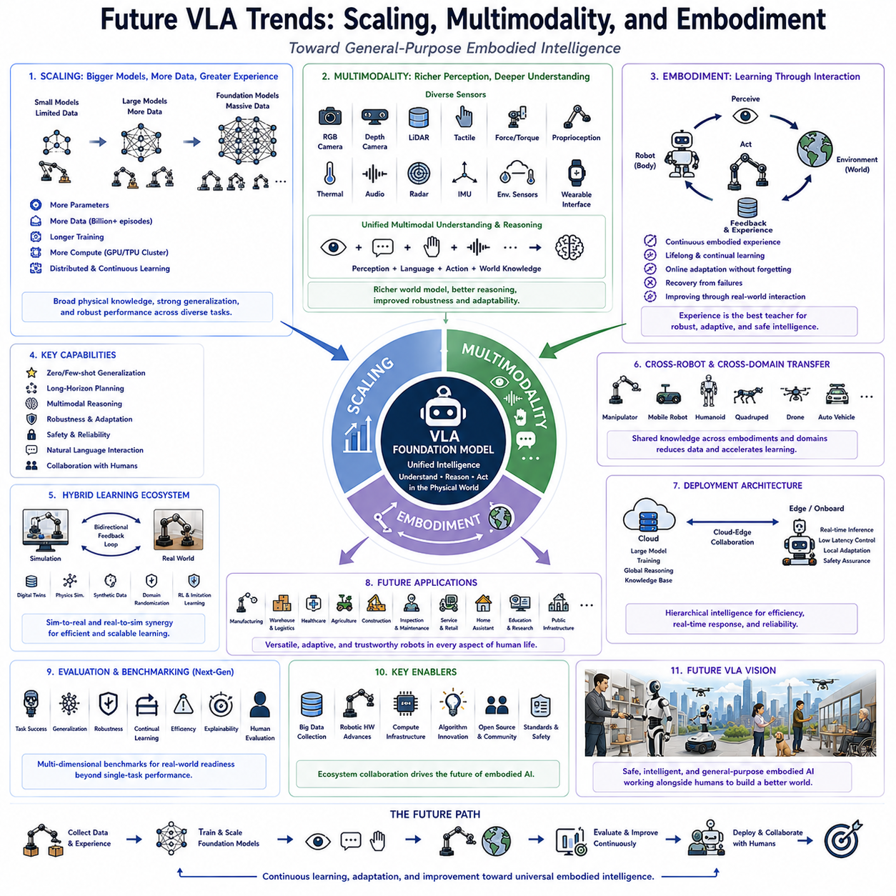{width="7.268055555555556in" height="7.268055555555556in"}

# 42_12_01 Future VLA Trends: Scaling, Multimodality, and Embodiment

The future of Vision-Language-Action (VLA) systems is expected to be defined by three closely connected technological trends: scaling, multimodality, and embodiment. These trends collectively represent the transition from specialized robotic intelligence toward general-purpose embodied artificial intelligence capable of understanding the physical world, reasoning across multiple information modalities, and performing increasingly complex tasks through continuous interaction with dynamic environments. While current VLA models have already demonstrated impressive capabilities in language-conditioned manipulation, navigation, and multimodal reasoning, future research is expected to significantly expand their scale, learning efficiency, reasoning depth, and adaptability. As a result, VLA systems will gradually evolve from task-oriented robotic controllers into comprehensive cognitive systems capable of autonomous decision-making across diverse physical domains.

Scaling has become one of the strongest driving forces behind recent advances in artificial intelligence. Similar to the evolution of large language models, robot foundation models increasingly benefit from larger neural architectures, larger training datasets, longer training durations, and greater computational resources. Early robotic learning systems were typically trained on relatively small datasets collected within individual laboratories, limiting their ability to generalize beyond narrowly defined tasks. Future VLA models are expected to be trained using billions of multimodal observations collected from robots operating across industrial facilities, warehouses, hospitals, homes, laboratories, construction sites, agricultural environments, and public spaces. This enormous increase in training diversity will allow models to learn highly transferable representations of objects, physical interactions, human behavior, and environmental dynamics.

Model scaling extends beyond simply increasing parameter count. Future architectures are expected to scale simultaneously along several dimensions, including dataset diversity, task complexity, multimodal representation richness, temporal reasoning capability, and embodied interaction experience. Researchers increasingly recognize that balanced scaling across these dimensions produces more reliable improvements than enlarging model size alone. Consequently, future robot foundation models will likely combine billions of parameters with extensive multimodal datasets, long-horizon interaction sequences, continuous environmental feedback, and large-scale real-world robotic demonstrations to produce more robust embodied intelligence.

The rapid growth of computational infrastructure will further accelerate model scaling. Next-generation GPU clusters, specialized AI accelerators, distributed training frameworks, and cloud-edge collaborative computing will enable training workloads that were previously impractical. Large-scale distributed optimization techniques will support continuous learning from massive multimodal datasets collected by heterogeneous robotic platforms operating worldwide. Such infrastructure will enable foundation models to acquire broad physical knowledge comparable to the diversity currently observed in large language model training.

Multimodality represents another defining characteristic of future VLA systems. Current robotic policies primarily integrate RGB vision, natural language, and low-dimensional robot state information. Future architectures are expected to incorporate substantially richer sensory inputs, including depth perception, LiDAR, radar, tactile sensing, force-torque measurements, proprioception, thermal imaging, event cameras, audio, environmental sensors, physiological monitoring devices, and wearable human interfaces. Rather than treating these information sources independently, future VLA systems will develop unified multimodal representations capable of reasoning across heterogeneous sensory channels simultaneously.

The integration of multimodal perception will significantly improve environmental understanding. Vision provides geometric and semantic information, language conveys abstract goals and instructions, tactile sensing reveals physical contact properties, force measurements estimate interaction dynamics, audio detects environmental events, while thermal sensing identifies invisible physical processes. Combining these complementary modalities enables robots to construct significantly richer world models than those achievable through vision alone. Such comprehensive perception is expected to improve manipulation reliability, navigation safety, anomaly detection, collaborative interaction, and adaptive decision-making.

Language itself is expected to evolve beyond simple instruction interpretation. Future VLA systems will increasingly engage in extended dialogue, collaborative planning, question answering, explanation generation, procedural teaching, and interactive reasoning with human users. Rather than receiving isolated commands, robots will participate in continuous conversations that refine objectives, negotiate alternative solutions, explain uncertainty, request clarification, and provide progress updates. Language will become an active reasoning interface connecting human intentions with physical robot behavior throughout long-duration collaborative tasks.

Multimodal reasoning will also become substantially more sophisticated. Instead of processing perception and language independently before generating actions, future architectures are expected to perform joint reasoning across visual observations, environmental memory, semantic knowledge, physical dynamics, and temporal context. Such integrated reasoning enables robots to infer hidden object properties, predict future environmental changes, estimate human intentions, and proactively adapt task execution before failures occur. These capabilities will significantly improve long-horizon planning under uncertain operating conditions.

Embodiment represents perhaps the most fundamental trend shaping future robotic intelligence. Unlike purely digital artificial intelligence systems, embodied intelligence emerges through continuous interaction between physical agents and their surrounding environments. Future VLA systems will increasingly learn not only from static datasets but also through lifelong interaction with the real world. Every successful manipulation, navigation episode, collaboration event, environmental observation, and recovery experience will contribute to continuously improving internal representations of physical reality.

Continuous embodied learning will gradually replace isolated offline training paradigms. Instead of periodically retraining models using fixed datasets, future robotic systems will accumulate experience throughout deployment while preserving previously acquired knowledge. Online adaptation, continual learning, incremental representation refinement, and experience replay mechanisms will enable robots to improve autonomously without catastrophic forgetting. This transition toward lifelong embodied learning represents one of the most important milestones in the development of general-purpose physical intelligence.

Simulation will remain an essential component of future VLA development but will increasingly function as one element within broader hybrid learning ecosystems. High-fidelity digital twins, physics simulation, synthetic data generation, domain randomization, procedural environment generation, and reinforcement learning will complement large-scale real-world experience rather than replacing it. Bidirectional simulation-to-real and real-to-simulation feedback loops will continuously improve both virtual training environments and deployed robotic policies.

Foundation models specifically designed for robotics are expected to emerge as universal physical reasoning engines. Rather than developing separate models for navigation, manipulation, perception, planning, and dialogue, future VLA architectures will unify these capabilities within shared multimodal foundation models capable of supporting numerous downstream robotic applications through lightweight task adaptation. Such unified architectures will substantially reduce development cost while improving transfer learning, zero-shot generalization, and cross-domain knowledge sharing.

Cross-robot knowledge transfer represents another promising direction. Future robot foundation models may simultaneously support manipulators, mobile robots, humanoids, quadrupeds, autonomous vehicles, drones, underwater robots, agricultural machines, medical assistants, and industrial automation systems. Shared physical knowledge acquired by one embodiment may accelerate learning within another through transferable multimodal representations. This capability would significantly reduce the amount of task-specific data required for newly introduced robotic platforms.

Generalization will remain a central research objective. Future VLA systems are expected to demonstrate increasingly strong zero-shot, few-shot, and open-world adaptation capabilities. Rather than requiring extensive retraining for every new task, robots will leverage previously acquired semantic knowledge, physical reasoning, and multimodal understanding to perform unfamiliar tasks using only natural language instructions or limited demonstrations. Such generalization represents one of the defining characteristics of future embodied foundation models.

Robustness will become increasingly important as autonomous robots transition into safety-critical environments. Future evaluation will emphasize resilience under changing lighting conditions, cluttered workspaces, sensor degradation, hardware failures, communication interruptions, dynamic human activity, uncertain terrain, adverse weather, and unexpected environmental events. Models capable of maintaining stable performance across these challenging conditions will demonstrate true deployment readiness rather than laboratory optimization.

Human-centered collaboration is expected to become one of the primary application domains for advanced VLA systems. Future robots will operate alongside workers, patients, students, customers, and family members rather than functioning as isolated automation devices. Consequently, social intelligence, natural communication, shared decision-making, explainability, trust calibration, adaptive assistance, and personalized interaction will become integral components of embodied intelligence rather than optional features.

Safety, transparency, and ethical reasoning will receive growing attention as robot autonomy increases. Future VLA systems will require mechanisms capable of explaining decisions, estimating uncertainty, detecting anomalous behavior, respecting human preferences, complying with regulatory constraints, and safely resolving conflicting objectives. Trustworthy artificial intelligence will become a prerequisite for large-scale deployment across healthcare, transportation, manufacturing, education, public infrastructure, and domestic environments.

Edge intelligence will evolve alongside cloud-based foundation models. While large centralized models provide extensive reasoning capability, real-time robotic control demands low-latency local inference. Future VLA architectures will therefore employ hierarchical computing frameworks combining cloud-scale reasoning, edge inference acceleration, onboard adaptation, and distributed collaborative learning. Such architectures balance computational efficiency with operational responsiveness while reducing communication dependency during mission-critical operations.

Evaluation methodologies will likewise evolve to reflect increasing model capability. Future benchmark suites will assess not only task completion but also continual learning, long-term adaptation, multimodal reasoning, collaborative intelligence, safety certification, energy efficiency, environmental robustness, explainability, social interaction quality, and real-world deployment performance. Comprehensive multidimensional evaluation will replace isolated benchmark scores as the primary measure of embodied intelligence progress.

Industrial adoption is expected to accelerate as scalable foundation models reduce development complexity. Instead of engineering separate perception, planning, and control systems for every application, organizations will increasingly customize pretrained VLA foundation models through domain-specific adaptation. Manufacturing automation, warehouse logistics, precision agriculture, autonomous inspection, healthcare assistance, laboratory automation, construction robotics, retail services, hospitality, and domestic assistance will all benefit from this scalable development paradigm.

Ultimately, the future of Vision-Language-Action systems will be defined by the convergence of large-scale foundation models, comprehensive multimodal perception, and continuously evolving embodied intelligence. Scaling will provide increasingly powerful representations, multimodality will enable richer environmental understanding, and embodiment will ground abstract reasoning within physical interaction. Together, these three technological pillars will transform autonomous robots from narrowly specialized machines into adaptive cognitive agents capable of learning, reasoning, communicating, and acting effectively across the diverse physical environments encountered throughout everyday human life. As these trends mature over the coming decade, VLA systems are expected to become the core technological foundation supporting the next generation of trustworthy, general-purpose Physical AI operating safely and intelligently alongside people in nearly every sector of society.

비전-언어-행동(Vision-Language-Action, VLA) 시스템의 미래는 **확장성(Scaling)**, **멀티모달(Multimodality)**, **구현형 지능(Embodiment)**이라는 세 가지 핵심 기술 축을 중심으로 발전할 것으로 전망된다. 이러한 기술들은 특정 작업만 수행하는 로봇에서 벗어나 다양한 환경을 이해하고 스스로 판단하며 행동하는 범용 구현형 인공지능(Embodied AI)으로 진화하는 기반이 된다. 현재의 VLA 모델도 뛰어난 언어 기반 조작과 추론 능력을 보여주고 있지만, 앞으로는 더욱 큰 규모의 학습과 다양한 센서 융합, 지속적인 환경 학습을 통해 실제 물리 세계에서의 적응력이 크게 향상될 것으로 기대된다.

확장성(Scaling)은 최근 인공지능 발전을 이끄는 가장 중요한 요소 가운데 하나이다. 대규모 언어 모델(Large Language Model)과 마찬가지로 로봇 파운데이션 모델(Robot Foundation Model)도 더 많은 파라미터(Parameter), 더 큰 데이터셋(Dataset), 더 긴 학습 시간, 더 높은 계산 자원(Computing Resource)을 사용할수록 성능이 향상되는 경향을 보인다. 과거에는 연구실 수준의 제한된 데이터만 사용했지만, 앞으로는 공장, 병원, 물류센터, 가정, 농업, 건설 현장 등에서 수집되는 방대한 실제 데이터를 학습하여 범용적인 물리 지식과 환경 이해 능력을 갖추게 될 것이다.

미래의 확장성은 단순히 모델 크기를 키우는 것만 의미하지 않는다. 데이터 다양성(Data Diversity), 작업 복잡도(Task Complexity), 멀티모달 표현(Multimodal Representation), 시간적 추론(Temporal Reasoning), 실제 환경 경험(Embodied Experience)까지 함께 확장되는 방향으로 발전할 것이다. 이러한 균형 잡힌 확장은 단순히 파라미터만 증가시키는 것보다 훨씬 안정적인 성능 향상을 가져오며, 보다 일반화된 로봇 지능을 구현하는 핵심 요소가 된다.

GPU 클러스터(GPU Cluster), AI 전용 가속기(AI Accelerator), 분산 학습(Distributed Training), 클라우드-엣지 협업(Cloud-Edge Collaboration)과 같은 계산 인프라의 발전도 모델 확장을 더욱 가속화할 것이다. 미래에는 전 세계 다양한 로봇에서 수집되는 데이터를 지속적으로 학습하는 대규모 분산 학습 체계가 구축될 것으로 예상된다. 이를 통해 로봇은 사람과 유사한 수준의 다양한 물리 경험을 축적하며 점차 범용적인 지능을 획득하게 될 것이다.

멀티모달(Multimodality)은 미래 VLA 시스템의 또 다른 핵심 기술이다. 현재는 RGB 영상, 자연어, 로봇 상태 정보 정도를 주로 사용하지만, 앞으로는 깊이 영상(Depth), 라이다(LiDAR), 레이더(Radar), 촉각(Tactile), 힘-토크 센서(Force-Torque Sensor), 자기 위치(Proprioception), 열화상(Thermal Imaging), 이벤트 카메라(Event Camera), 음성(Audio), 환경 센서(Environment Sensor), 생체 신호(Physiological Signal) 등 다양한 정보를 동시에 활용하게 될 것이다. 이러한 센서들을 하나의 통합된 표현 공간에서 함께 이해하는 것이 미래 VLA의 중요한 방향이다.

멀티모달 융합은 환경 이해(Environment Understanding)를 크게 향상시킨다. 비전은 형태와 위치를 제공하고, 언어는 목표를 전달하며, 촉각은 접촉 상태를 알려주고, 힘 센서는 물리적 상호작용을 측정하며, 음성은 주변 상황을 전달하고, 열화상은 눈에 보이지 않는 물리 현상을 감지한다. 이러한 정보를 통합하면 단순한 영상 기반 인식보다 훨씬 풍부한 세계 모델(World Model)을 구축할 수 있으며, 조작, 이동, 이상 탐지, 사람과의 협업에서도 높은 성능을 기대할 수 있다.

자연어(Language)는 단순한 명령 전달 수단을 넘어 지속적인 대화 인터페이스로 발전할 것이다. 미래의 VLA 시스템은 작업 지시를 수행하는 것뿐 아니라 사람과 함께 계획을 세우고, 질문에 답하고, 작업 진행 상황을 설명하며, 모호한 명령을 확인하고, 불확실성을 표현하는 등 지속적인 상호작용을 수행하게 된다. 언어는 사람의 의도와 로봇의 행동을 연결하는 핵심 인터페이스로 자리잡게 될 것이다.

멀티모달 추론(Multimodal Reasoning)도 더욱 발전할 것이다. 미래의 VLA는 시각 정보, 언어, 기억(Memory), 물리 법칙(Physical Dynamics), 시간 정보(Temporal Context)를 동시에 고려하여 추론하게 된다. 이를 통해 보이지 않는 물체의 상태를 예측하거나, 사람의 의도를 미리 이해하고, 환경 변화를 예측하여 실패를 사전에 방지하는 능력을 갖추게 된다. 이는 장시간 작업(Long-Horizon Task)에서 특히 중요한 기술이 될 것이다.

구현형 지능(Embodiment)은 미래 로봇 지능의 가장 본질적인 변화이다. 디지털 AI와 달리 구현형 AI는 실제 환경과 지속적으로 상호작용하면서 학습한다. 성공적인 조작, 이동, 사람과의 협업, 환경 변화, 오류 복구 등 모든 경험이 새로운 학습 데이터가 되며, 이를 통해 로봇은 물리 세계에 대한 이해를 지속적으로 향상시킨다. 결국 실제 경험 자체가 가장 중요한 학습 자원이 된다.

앞으로는 지속적 구현형 학습(Continuous Embodied Learning)이 기존의 오프라인 학습을 대체하게 될 것이다. 로봇은 배포 이후에도 계속해서 새로운 경험을 축적하며 온라인 학습(Online Learning), 연속학습(Continual Learning), 경험 재생(Experience Replay), 점진적 표현 개선(Incremental Representation Refinement)을 수행한다. 이를 통해 기존 지식을 잃지 않으면서 새로운 환경에 적응하는 평생학습(Lifelong Learning)이 가능해질 것이다.

시뮬레이션(Simulation)은 여전히 중요한 역할을 수행하지만, 앞으로는 실제 환경 학습과 결합된 하이브리드(Hybrid) 방식으로 발전할 것이다. 디지털 트윈(Digital Twin), 물리 시뮬레이션(Physics Simulation), 합성 데이터(Synthetic Data), 도메인 랜덤화(Domain Randomization)가 실제 환경 데이터를 보완하며, 시뮬레이션-실환경(Sim-to-Real)과 실환경-시뮬레이션(Real-to-Sim)이 지속적으로 상호 피드백을 주는 구조가 될 것으로 예상된다.

미래에는 로봇 전용 파운데이션 모델(Robot Foundation Model)이 범용 물리 추론 엔진(Universal Physical Reasoning Engine)으로 발전할 것이다. 현재처럼 이동, 조작, 계획, 대화를 각각 다른 모델이 수행하는 것이 아니라 하나의 통합된 파운데이션 모델이 다양한 로봇 작업을 지원하게 된다. 이러한 구조는 개발 비용을 줄이고 전이학습(Transfer Learning), 제로샷(Zero-Shot), 일반화(Generalization) 성능을 크게 향상시킬 것으로 기대된다.

로봇 간 지식 공유(Cross-Robot Knowledge Transfer)도 중요한 발전 방향이다. 산업용 로봇, 이동 로봇(Mobile Robot), 휴머노이드(Humanoid), 사족보행 로봇(Quadruped), 드론(Drone), 자율주행 차량(Autonomous Vehicle), 의료 로봇 등 다양한 플랫폼이 동일한 파운데이션 모델을 공유할 수 있게 된다. 하나의 로봇이 학습한 물리 지식이 다른 형태의 로봇에도 전이되어 학습 시간을 크게 줄이는 효과를 가져올 것이다.

일반화(Generalization)는 미래 VLA 시스템의 핵심 경쟁력이 된다. 새로운 작업(New Task), 새로운 환경(New Environment), 새로운 물체(New Object)를 만나더라도 추가 학습 없이 기존 지식을 활용하여 문제를 해결하는 능력이 더욱 중요해질 것이다. 자연어 명령이나 몇 개의 시범(Few-Shot Demonstration)만으로 새로운 작업을 수행할 수 있는 능력이 차세대 로봇의 핵심 특징이 될 것으로 예상된다.

강건성(Robustness)은 실제 산업 환경에서 필수적인 요소이다. 미래의 VLA 시스템은 조명 변화(Lighting Variation), 복잡한 환경(Clutter), 센서 고장(Sensor Failure), 통신 장애(Communication Failure), 사람의 움직임(Human Activity), 거친 지형(Terrain), 악천후(Weather) 등 다양한 외란 속에서도 안정적으로 동작해야 한다. 따라서 강건성은 연구 성능보다 실제 배포 가능성을 결정하는 핵심 요소가 될 것이다.

사람 중심 협업(Human-Centered Collaboration)은 미래 VLA 시스템의 주요 응용 분야가 될 것이다. 로봇은 더 이상 독립적으로 작업하는 기계가 아니라 작업자, 환자, 학생, 고객, 가족과 함께 협업하는 동반자로 발전한다. 따라서 사회적 지능(Social Intelligence), 자연스러운 대화(Natural Communication), 공동 의사결정(Shared Decision-Making), 설명 가능성(Explainability), 신뢰 형성(Trust Calibration), 개인 맞춤 지원(Personalized Assistance)이 필수 기능으로 자리잡게 된다.

안전성(Safety), 투명성(Transparency), 윤리적 추론(Ethical Reasoning)의 중요성도 더욱 커질 것이다. 미래의 VLA 시스템은 자신의 판단을 설명하고, 불확실성을 표현하며, 이상 행동을 감지하고, 사람의 선호를 존중하며, 법적·윤리적 규정을 준수해야 한다. 신뢰할 수 있는 AI(Trustworthy AI)는 의료, 교통, 제조, 교육, 공공 서비스 등 다양한 분야에서 로봇이 보급되기 위한 필수 조건이 될 것이다.

엣지 AI(Edge Intelligence)와 클라우드 AI(Cloud AI)는 계층적으로 결합될 것으로 예상된다. 클라우드는 복잡한 추론과 대규모 학습을 담당하고, 엣지는 실시간 제어와 저지연 추론(Low-Latency Inference)을 수행한다. 이러한 클라우드-엣지 협업 구조는 계산 효율성과 실시간성을 동시에 확보하면서 통신 장애에도 안정적인 자율주행을 가능하게 한다.

평가 체계(Evaluation Framework) 역시 함께 발전할 것이다. 단순한 작업 성공률이 아니라 연속학습(Continual Learning), 장기 적응(Long-Term Adaptation), 멀티모달 추론(Multimodal Reasoning), 협업 능력(Collaboration), 안전성(Safety), 에너지 효율(Energy Efficiency), 설명 가능성(Explainability), 실제 환경 강건성(Real-World Robustness) 등을 종합적으로 평가하는 다차원 벤치마크(Multi-Dimensional Benchmark)가 표준이 될 것으로 전망된다.

산업 현장에서는 범용 파운데이션 모델을 기반으로 분야별 맞춤형 적응(Domain Adaptation)을 수행하는 방식이 확산될 것이다. 제조 자동화, 물류, 농업, 자율 검사, 의료, 연구실 자동화, 건설, 유통, 서비스, 가정용 로봇 등 다양한 산업에서 동일한 기반 모델을 활용하여 개발 비용을 줄이고 개발 속도를 크게 높일 수 있을 것으로 기대된다.

궁극적으로 **미래 VLA(Future Vision-Language-Action)**는 **확장성(Scaling)**, **멀티모달(Multimodality)**, **구현형 지능(Embodiment)**이라는 세 가지 축이 융합되면서 범용 물리 AI(General-Purpose Physical AI)로 발전하게 된다. 대규모 파운데이션 모델은 강력한 표현 능력을 제공하고, 멀티모달 기술은 풍부한 환경 이해를 가능하게 하며, 구현형 학습은 실제 물리 세계에서 지속적으로 지능을 향상시킨다. 이러한 기술들이 결합되면 미래의 로봇은 단순한 자동화 장비를 넘어 사람과 함께 학습하고, 추론하고, 협업하며, 다양한 실제 환경에 적응하는 신뢰할 수 있는 범용 자율 시스템으로 발전하게 될 것이다.

##  

## 12.2 Video Prediction and World Models

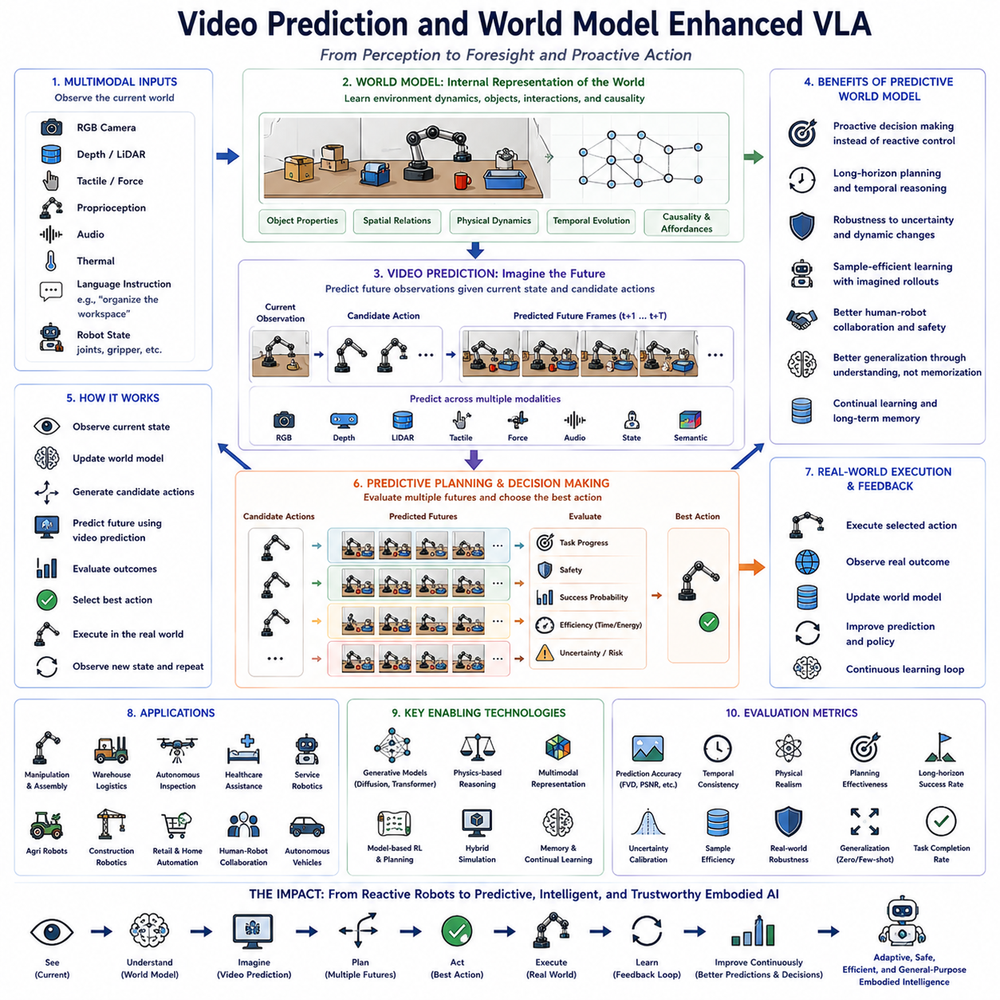{width="7.268055555555556in" height="7.268055555555556in"}

# 42_12_02 Video Prediction and World Model Enhanced VLA

The future evolution of Vision-Language-Action (VLA) systems is expected to be significantly influenced by advances in video prediction and world models. While current VLA architectures primarily react to the robot\'s current observations, next-generation systems will increasingly predict future environmental states before executing actions. This transition represents a fundamental shift from reactive intelligence toward predictive embodied intelligence, enabling robots to anticipate environmental changes, evaluate multiple possible action sequences, and select behaviors that maximize long-term task success. Video prediction and world models therefore serve as essential cognitive components that transform perception into foresight and planning. As these technologies mature, VLA systems will gradually evolve from action execution engines into autonomous reasoning systems capable of understanding how the physical world changes over time.

A world model is an internal computational representation that enables a robot to simulate future environmental dynamics without physically interacting with the environment. Instead of relying solely on immediate sensor observations, the robot constructs an internal model describing object properties, physical interactions, spatial relationships, temporal dynamics, and causal dependencies. This internal representation allows the robot to estimate how the environment is likely to evolve after each potential action. Rather than repeatedly performing trial-and-error interactions, the robot can mentally evaluate alternative strategies before selecting the safest and most efficient behavior. World models therefore significantly improve decision quality while reducing unnecessary physical experimentation.

Video prediction complements world models by forecasting future visual observations based on the current scene and candidate robot actions. Given a sequence of previous camera frames and an intended action, the prediction model estimates what future camera images are expected to look like over the next several seconds. Unlike traditional image recognition systems that analyze only the present, video prediction explicitly models temporal evolution. This capability allows robots to anticipate object motion, human movement, environmental changes, and the consequences of manipulation before those events actually occur. Predictive visual modeling therefore extends perception beyond observation into future expectation.

The integration of video prediction within Vision-Language-Action architectures enables proactive decision making rather than reactive control. Traditional robotic systems typically observe the environment, generate an action, execute it, and then wait for new observations before planning again. Future VLA systems equipped with predictive models instead evaluate multiple hypothetical futures simultaneously. Candidate actions are simulated inside the world model, future observations are predicted through video generation, and expected task outcomes are compared before any physical movement begins. The selected action therefore reflects long-term consequences rather than immediate reward alone.

Temporal reasoning becomes substantially stronger when prediction is incorporated into embodied intelligence. Many robotic tasks extend over dozens or hundreds of sequential decisions where immediate observations provide only partial information about future success. Long-horizon manipulation, autonomous inspection, warehouse logistics, service robotics, healthcare assistance, household organization, and collaborative manufacturing all require anticipation of future environmental states. Video prediction enables robots to maintain consistent plans across extended time horizons by continuously estimating how current decisions influence later observations.

Future world models are expected to represent significantly more than visual appearance. Rather than predicting only future RGB images, they will integrate multimodal information including depth maps, LiDAR observations, tactile feedback, force measurements, proprioceptive states, thermal images, audio signals, semantic scene graphs, object affordances, and physical interaction dynamics. This unified representation provides a comprehensive understanding of environmental evolution across multiple sensing modalities. Such multimodal world models allow robots to reason simultaneously about geometry, semantics, contact physics, human activity, and environmental uncertainty.

Physical consistency represents one of the defining characteristics of future predictive models. Successful world models should generate physically plausible future states that obey object permanence, collision constraints, gravity, friction, momentum, articulated motion, and manipulation dynamics. Predicting visually realistic images alone is insufficient if generated futures violate fundamental physical principles. Consequently, future VLA research increasingly combines neural generative modeling with explicit physical reasoning to improve predictive reliability during robot interaction.

Language understanding also benefits substantially from predictive world models. Natural language instructions frequently describe desired future outcomes rather than immediate actions. Commands such as "organize the workspace," "prepare the table for dinner," or "arrange the components for assembly" require robots to imagine future environmental configurations before planning individual manipulations. World models enable robots to translate high-level language objectives into predicted future states and then generate action sequences that gradually transform the current environment toward those desired configurations.

Video prediction further improves manipulation planning by allowing robots to anticipate object motion before physical contact occurs. During grasping, pushing, opening, stacking, or assembly operations, predicted visual sequences estimate whether objects are likely to slip, rotate, collide, or become unstable. Robots can therefore adjust grasp positions, motion trajectories, contact forces, and execution timing before errors occur. Such predictive planning substantially increases manipulation robustness while reducing trial-and-error exploration.

Human-robot collaboration also benefits from predictive environmental modeling. Human motion is inherently dynamic and often difficult to interpret using instantaneous observations alone. Video prediction enables robots to estimate future human movement, anticipated workspace occupancy, gesture completion, object handover timing, and collaborative interaction opportunities. Rather than reacting after people move, robots proactively adapt trajectories to maintain safety, improve efficiency, and produce smoother collaborative behavior.

World models provide an efficient mechanism for reinforcement learning by reducing dependence on expensive physical interaction. Instead of collecting every experience directly through real robotic execution, policies can be optimized inside learned world models where millions of simulated trajectories are generated computationally. Model-based reinforcement learning therefore significantly improves sample efficiency while reducing mechanical wear, operational cost, and safety risk associated with extensive real-world exploration. Future VLA systems will likely combine model-free policies with model-based planning to exploit the advantages of both learning paradigms.

Simulation also becomes substantially more powerful when integrated with learned world models. Traditional physics simulators require manually designed object models, material properties, and environmental parameters. Learned predictive models instead infer environmental dynamics directly from large-scale multimodal experience. Hybrid simulation frameworks combining analytical physics with neural world models are expected to generate increasingly realistic training environments that better reflect authentic deployment conditions while supporting efficient large-scale policy optimization.

Foundation models for robotics will likely incorporate world modeling as a central architectural component. Rather than treating perception, planning, and action generation as independent modules, future unified architectures will jointly learn visual representations, language understanding, environmental prediction, physical reasoning, and policy optimization within shared latent spaces. Such integrated foundation models enable consistent reasoning across perception, imagination, planning, and execution while improving transfer learning across multiple robotic domains.

Generalization capability is expected to improve substantially through predictive learning. Robots capable of modeling underlying environmental dynamics acquire causal understanding instead of memorizing demonstration trajectories. Consequently, they adapt more effectively to unfamiliar objects, novel environments, alternative task sequences, and previously unseen manipulation scenarios. World models therefore contribute directly to zero-shot and few-shot task generalization by learning transferable physical principles applicable across diverse operational contexts.

Robustness under uncertainty represents another important advantage of predictive VLA systems. Real environments continuously introduce sensor noise, lighting variation, object displacement, communication delay, actuator uncertainty, and unexpected human behavior. Predictive world models estimate multiple possible future trajectories instead of assuming deterministic outcomes. Decision making therefore incorporates uncertainty estimation, confidence prediction, and risk-aware planning, enabling robots to select actions that remain reliable even when future observations cannot be predicted perfectly.

Memory and long-term experience become naturally integrated within predictive architectures. World models continuously accumulate information about environmental structure, object behavior, user preferences, task history, and previous interaction outcomes. This persistent memory allows robots to improve prediction accuracy over time while supporting continual learning and personalized assistance. Long-term environmental knowledge also enables faster adaptation when revisiting previously encountered locations or users.

Evaluation methodologies for predictive VLA systems will necessarily evolve beyond traditional task completion metrics. Future benchmarks are expected to measure prediction accuracy, temporal consistency, physical realism, planning effectiveness, uncertainty calibration, simulation fidelity, imagination quality, causal reasoning capability, long-horizon success, and real-world deployment robustness. Video prediction quality will increasingly be evaluated according to its contribution to downstream robotic performance rather than visual appearance alone.

Industrial applications stand to benefit significantly from world-model-enhanced VLA systems. Autonomous inspection robots can predict equipment degradation before failure becomes visible. Warehouse robots anticipate traffic flow and optimize navigation accordingly. Agricultural robots forecast crop growth and harvesting conditions. Healthcare assistants predict patient movement and adapt supportive actions proactively. Manufacturing robots estimate assembly outcomes before execution, reducing production errors and improving operational efficiency. These predictive capabilities transform robots from reactive automation devices into intelligent operational partners.

The emergence of generative artificial intelligence further accelerates world-model research. Diffusion models, autoregressive transformers, latent video generation architectures, and multimodal generative foundation models increasingly demonstrate the ability to synthesize physically coherent future observations. Future VLA architectures are expected to integrate these generative capabilities directly into robotic planning, enabling increasingly sophisticated imagination-driven reasoning before physical execution.

Ultimately, Video Prediction and World Model Enhanced VLA represents one of the most important directions in the evolution of embodied artificial intelligence. By enabling robots to predict future environmental states, mentally simulate alternative actions, understand physical causality, anticipate human behavior, integrate multimodal perception, and optimize long-term planning before acting, predictive world models fundamentally transform robotic intelligence from reactive execution into proactive reasoning. As large-scale multimodal foundation models continue advancing alongside increasingly accurate predictive architectures, future Vision-Language-Action systems will become capable of understanding not only what the world currently is, but also what it is likely to become. This predictive capability will serve as a cornerstone for the next generation of trustworthy, adaptive, and general-purpose Physical AI operating safely and intelligently across complex real-world environments.

비전-언어-행동(Vision-Language-Action, VLA) 시스템의 미래는 **비디오 예측(Video Prediction)**과 **월드 모델(World Model)** 기술의 발전에 의해 크게 변화할 것으로 예상된다. 현재의 VLA 시스템은 주로 현재의 센서 정보를 기반으로 행동을 결정하지만, 미래의 VLA는 행동을 수행하기 전에 앞으로의 환경 변화를 미리 예측하는 방향으로 발전하고 있다. 이는 단순한 반응형 지능(Reactive Intelligence)에서 예측형 구현형 지능(Predictive Embodied Intelligence)으로의 전환을 의미하며, 로봇은 여러 가지 미래 상황을 가상으로 시뮬레이션한 후 가장 적절한 행동을 선택할 수 있게 된다.

월드 모델(World Model)은 로봇 내부에 구축되는 가상의 환경 모델로, 실제 행동을 수행하지 않고도 미래의 환경 변화를 예측할 수 있도록 한다. 이 모델은 물체의 특성(Object Property), 공간 관계(Spatial Relationship), 물리 법칙(Physical Dynamics), 시간 변화(Temporal Dynamics), 인과 관계(Causal Relationship) 등을 내부적으로 표현한다. 로봇은 이러한 내부 모델을 이용하여 여러 행동의 결과를 미리 계산하고, 가장 안전하고 효율적인 행동을 선택할 수 있다. 이는 시행착오(Trial-and-Error)를 크게 줄이고 의사결정의 품질을 향상시킨다.

비디오 예측(Video Prediction)은 현재의 영상과 로봇의 행동을 입력으로 받아 미래의 카메라 영상을 예측하는 기술이다. 기존의 비전 시스템이 현재 장면만 분석했다면, 비디오 예측은 앞으로 몇 초 동안 환경이 어떻게 변화할지를 생성한다. 이를 통해 로봇은 물체의 움직임, 사람의 이동, 주변 환경의 변화, 자신의 행동이 가져올 결과를 실제 실행 전에 미리 예상할 수 있다. 즉, 단순한 인식(Perception)을 넘어 미래를 예측하는 능력을 갖추게 되는 것이다.

비디오 예측이 VLA 시스템에 통합되면 로봇은 반응형 제어(Reactive Control)가 아니라 선제적 의사결정(Proactive Decision Making)을 수행할 수 있다. 기존 시스템은 환경을 관찰하고 즉시 행동한 뒤 다시 새로운 정보를 받아 계획을 수정했다. 반면 미래의 VLA 시스템은 여러 개의 행동 후보(Action Candidate)를 월드 모델 안에서 먼저 시뮬레이션하고, 각각의 미래 결과를 비교한 후 가장 좋은 행동을 실제로 수행한다. 따라서 단기적인 보상보다 장기적인 성공 가능성을 고려하는 계획이 가능해진다.

예측 기능이 포함되면 시간적 추론(Temporal Reasoning) 능력도 크게 향상된다. 실제 로봇 작업은 수십 단계 이상의 연속적인 의사결정을 요구하며, 현재의 정보만으로는 미래의 성공 여부를 판단하기 어렵다. 장기 조작(Long-Horizon Manipulation), 자율 검사(Autonomous Inspection), 물류 자동화(Warehouse Logistics), 서비스 로봇(Service Robot), 의료 지원(Healthcare Assistance) 등은 모두 미래 상태를 고려한 계획이 필요하다. 비디오 예측은 현재의 행동이 미래의 환경에 어떤 영향을 미칠지를 지속적으로 예측하여 일관성 있는 장기 계획을 가능하게 한다.

미래의 월드 모델은 단순히 RGB 영상만 예측하는 수준을 넘어 다양한 정보를 함께 다루게 된다. 깊이 영상(Depth Map), 라이다(LiDAR), 촉각(Tactile), 힘-토크 센서(Force-Torque Sensor), 자기 위치(Proprioception), 열화상(Thermal Image), 음성(Audio), 장면 그래프(Scene Graph), 물체 기능(Object Affordance), 물리 상호작용(Physical Interaction Dynamics) 등을 하나의 통합된 모델에서 함께 표현하게 된다. 이러한 멀티모달(Multimodal) 월드 모델은 실제 환경을 더욱 풍부하게 이해할 수 있도록 한다.

물리적 일관성(Physical Consistency)은 미래 월드 모델의 핵심 요소이다. 단순히 보기 좋은 영상을 생성하는 것이 아니라 중력(Gravity), 충돌(Collision), 마찰(Friction), 운동량(Momentum), 관절 운동(Articulated Motion), 조작 과정(Manipulation Dynamics) 등을 정확하게 반영해야 한다. 물리 법칙을 따르지 않는 예측은 실제 로봇 제어에 사용할 수 없기 때문에, 앞으로는 생성형 AI와 물리 기반 모델(Physics-Based Model)을 결합하는 연구가 더욱 활발해질 것으로 예상된다.

자연어(Language) 이해 역시 월드 모델의 도움을 받게 된다. 사람의 명령은 대부분 현재 행동보다 미래의 목표를 설명한다. 예를 들어 "작업 공간을 정리해라", "식탁을 준비해라", "조립을 위한 부품을 배치해라"와 같은 명령은 최종적인 미래 상태를 먼저 상상해야 한다. 월드 모델은 이러한 목표 상태를 내부적으로 생성하고, 현재 환경을 그 상태로 변화시키기 위한 행동 계획(Action Sequence)을 자동으로 생성한다.

비디오 예측은 조작 계획(Manipulation Planning)에서도 매우 큰 역할을 한다. 물체를 집거나 밀거나(Stacking), 문을 열거나(Open), 조립(Assembly)하는 과정에서 물체가 미끄러질지(Slip), 회전할지(Rotate), 충돌할지(Collide), 균형을 잃을지(Unstable)를 미리 예측할 수 있다. 로봇은 이러한 예측을 바탕으로 파지 위치(Grasp Position), 이동 경로(Trajectory), 힘의 크기(Contact Force), 동작 속도(Motion Timing)를 미리 조정하여 실패 가능성을 크게 줄일 수 있다.

사람과의 협업(Human-Robot Collaboration)도 예측 기술을 통해 크게 향상된다. 사람의 움직임은 매우 복잡하고 계속 변화하기 때문에 현재 모습만으로는 충분하지 않다. 비디오 예측은 사람의 다음 움직임, 작업 공간 점유(Workspace Occupancy), 물체 전달(Handover Timing), 협업 기회를 미리 예측하여 로봇이 더욱 안전하고 자연스럽게 행동하도록 한다. 이는 협동 로봇(Collaborative Robot)에서 매우 중요한 기술이 된다.

월드 모델은 강화학습(Reinforcement Learning)의 효율도 크게 향상시킨다. 기존에는 실제 로봇이 수많은 시행착오를 반복해야 했지만, 월드 모델 안에서 수백만 번의 가상 시뮬레이션을 수행할 수 있다. 이를 통해 샘플 효율(Sample Efficiency)이 향상되고, 기계 마모(Mechanical Wear), 운영 비용(Operation Cost), 안전 위험(Safety Risk)을 크게 줄일 수 있다. 앞으로는 모델 기반 강화학습(Model-Based Reinforcement Learning)과 모델 프리(Model-Free) 방식을 함께 사용하는 하이브리드 구조가 널리 사용될 것으로 예상된다.

시뮬레이션(Simulation)도 월드 모델과 결합되면서 더욱 발전할 것이다. 기존의 물리 시뮬레이터는 물체 모델과 재질 정보를 사람이 직접 입력해야 했지만, 학습 기반 월드 모델은 실제 환경에서 이러한 정보를 자동으로 학습한다. 앞으로는 물리 엔진과 신경망 기반 월드 모델이 결합된 하이브리드 시뮬레이션(Hybrid Simulation)이 실제 환경과 매우 유사한 학습 환경을 제공하게 될 것이다.

미래의 로봇 파운데이션 모델(Robot Foundation Model)은 월드 모델을 핵심 구성 요소로 포함하게 될 가능성이 높다. 인식(Perception), 계획(Planning), 행동(Action)을 각각 별도의 모듈로 처리하는 것이 아니라 하나의 통합된 잠재 공간(Latent Space)에서 환경 이해, 미래 예측, 행동 생성이 동시에 이루어진다. 이러한 구조는 다양한 작업 간 전이학습(Transfer Learning)과 일반화(Generalization)를 크게 향상시킬 것으로 기대된다.

월드 모델은 일반화(Generalization) 능력도 크게 향상시킨다. 단순히 사람의 시범을 암기하는 것이 아니라 환경 변화의 원리와 물리 법칙을 학습하기 때문에 새로운 환경(New Environment), 새로운 물체(New Object), 새로운 작업(New Task)에서도 기존 지식을 활용하여 적응할 수 있다. 이는 제로샷(Zero-Shot) 및 퓨샷(Few-Shot) 학습의 핵심 기반 기술이 될 것이다.

불확실성(Uncertainty)에 대한 강건성(Robustness)도 월드 모델의 중요한 장점이다. 실제 환경에서는 센서 노이즈(Sensor Noise), 조명 변화(Lighting Variation), 물체 위치 변화(Object Displacement), 통신 지연(Communication Delay), 구동기 오차(Actuator Uncertainty), 사람의 예기치 않은 행동(Human Behavior) 등이 지속적으로 발생한다. 미래의 월드 모델은 하나의 미래만 예측하는 것이 아니라 여러 가능한 미래(Multiple Future Trajectory)를 함께 생성하여 위험을 고려한 의사결정(Risk-Aware Planning)을 수행하게 된다.

메모리(Memory)와 장기 경험(Long-Term Experience)도 월드 모델과 자연스럽게 통합된다. 로봇은 환경 구조(Environment Structure), 물체 특성(Object Behavior), 사용자 선호(User Preference), 작업 이력(Task History), 과거의 성공과 실패를 지속적으로 저장하고 미래 예측에 활용한다. 이러한 장기 기억은 연속학습(Continual Learning), 개인 맞춤 서비스(Personalized Assistance), 반복 작업 최적화에 중요한 역할을 한다.

평가 체계(Evaluation Framework)도 기존과 달라질 것이다. 단순한 작업 성공률(Task Completion Rate)뿐 아니라 예측 정확도(Prediction Accuracy), 시간적 일관성(Temporal Consistency), 물리적 현실성(Physical Realism), 계획 품질(Planning Effectiveness), 불확실성 추정(Uncertainty Calibration), 시뮬레이션 정확도(Simulation Fidelity), 상상 능력(Imagination Quality), 인과 추론(Causal Reasoning), 장기 작업 성공률(Long-Horizon Success), 실제 환경 강건성(Real-World Robustness) 등이 함께 평가될 것으로 예상된다.

산업 현장에서도 월드 모델 기반 VLA 시스템은 큰 변화를 가져올 것이다. 자율 검사 로봇은 설비 고장을 사전에 예측하고, 물류 로봇은 교통 흐름을 예상하여 최적의 경로를 선택하며, 농업 로봇은 작물의 성장과 수확 시점을 예측하고, 의료 로봇은 환자의 움직임을 미리 예측하여 적절한 지원을 제공할 수 있다. 제조 로봇은 조립 결과를 사전에 예측하여 생산 오류를 줄이고 생산성을 높일 수 있다.

생성형 인공지능(Generative AI)의 발전도 월드 모델 연구를 크게 가속화하고 있다. 확산 모델(Diffusion Model), 자기회귀 트랜스포머(Autoregressive Transformer), 잠재 비디오 생성(Latent Video Generation), 멀티모달 생성 모델(Multimodal Generative Model)은 물리적으로 자연스러운 미래 영상을 생성하는 능력을 빠르게 향상시키고 있다. 앞으로는 이러한 생성 모델이 로봇의 계획 과정에 직접 활용되어 실제 행동 전에 다양한 미래를 상상하는 능력을 제공하게 될 것이다.

궁극적으로 **비디오 예측 및 월드 모델 기반 VLA(Video Prediction and World Model Enhanced VLA)**는 구현형 인공지능(Embodied AI)의 핵심 기술 가운데 하나로 자리잡게 될 것이다. 미래의 로봇은 행동하기 전에 여러 미래를 예측하고, 다양한 행동을 내부적으로 시뮬레이션하며, 물리 법칙을 이해하고, 사람의 행동을 예상하고, 멀티모달 정보를 통합하여 장기적인 계획을 세운 뒤 실제 행동을 수행하게 된다. 이러한 예측 기반 지능은 기존의 반응형 로봇을 넘어 미래를 이해하고 대비하는 **예측형 물리 AI(Predictive Physical AI)**를 실현하는 핵심 기술이 될 것이며, 향후 신뢰성 있고 적응력이 뛰어난 범용 자율 로봇 개발의 중요한 기반으로 활용될 것이다.

##  

## 12.3 Reasoning-Enhanced VLA Systems

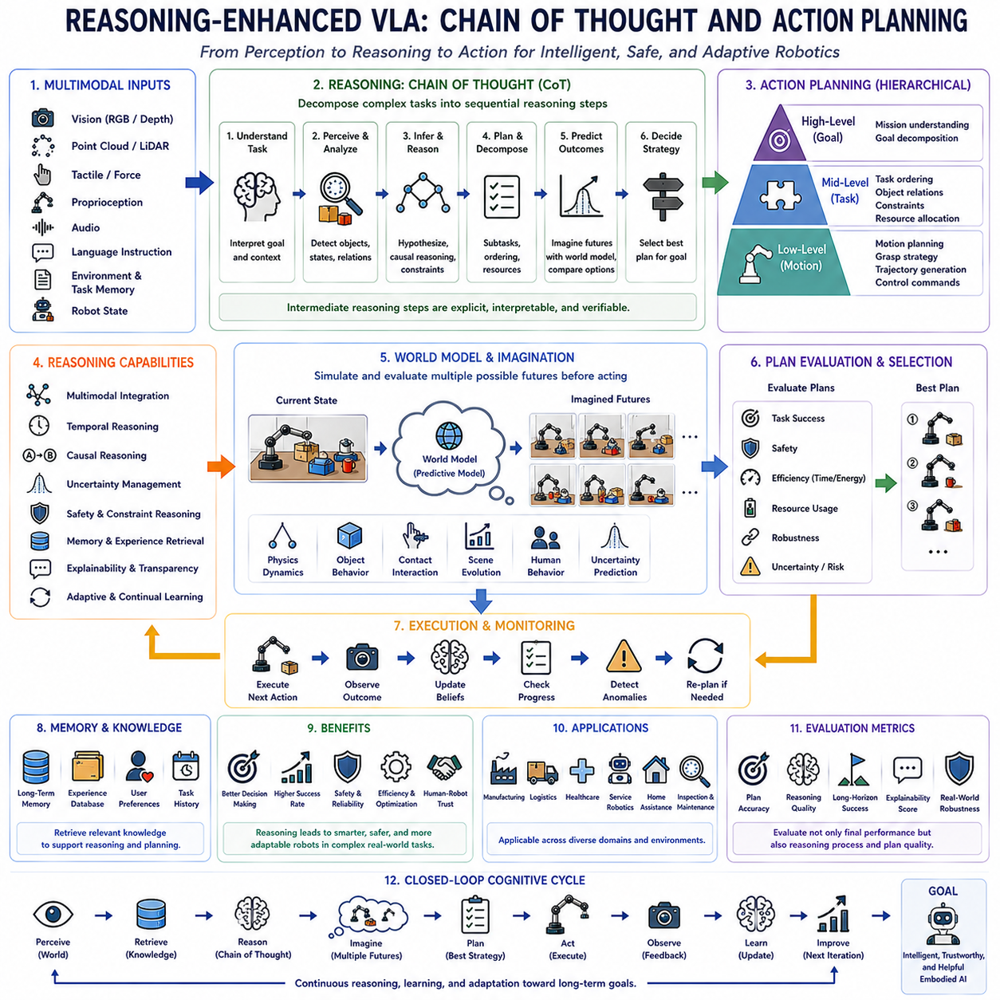{width="7.268055555555556in" height="7.268055555555556in"}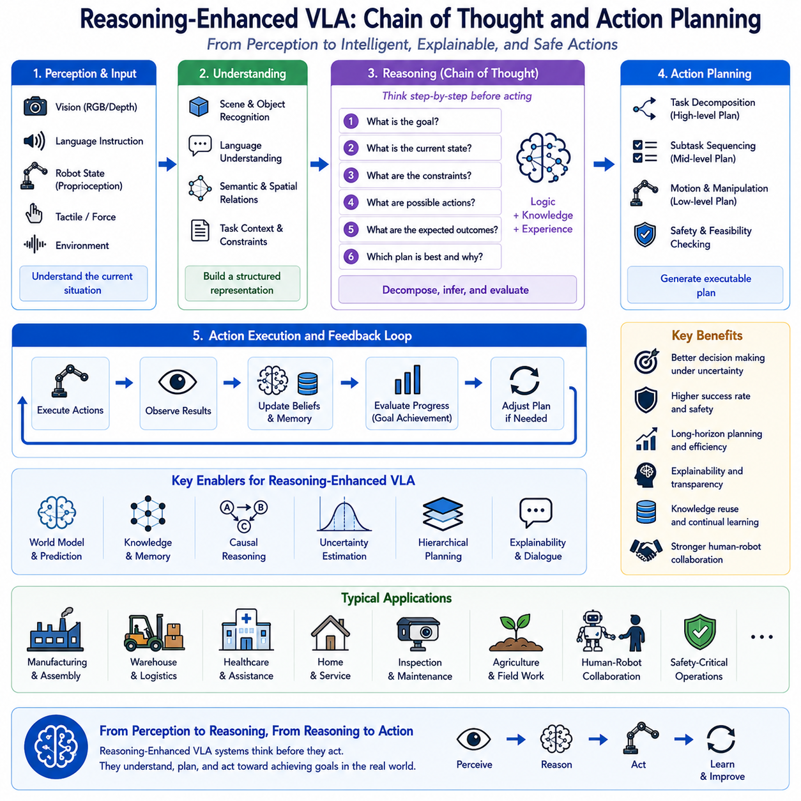{width="7.268055555555556in" height="7.268055555555556in"}

# 42_12_03 Reasoning-Enhanced VLA: Chain of Thought and Action Planning

The next generation of Vision-Language-Action (VLA) systems is expected to evolve beyond perception-driven action generation toward reasoning-centered embodied intelligence. While current VLA models have demonstrated remarkable capability in understanding multimodal inputs and producing appropriate robotic actions, many practical tasks require considerably deeper reasoning before action execution. Complex manipulation, long-horizon planning, collaborative robotics, autonomous inspection, household assistance, industrial automation, and healthcare applications often involve uncertain environments where multiple possible action sequences exist. Under such conditions, selecting the optimal behavior depends not only on perception and language understanding but also on structured reasoning that evaluates alternative strategies before execution. Consequently, reasoning-enhanced VLA systems introduce explicit cognitive processes that bridge perception, language understanding, planning, and physical action through sequential logical inference. This evolution represents an important transition from reactive robotic policies toward intelligent decision-making systems capable of understanding why actions should be performed before determining how they should be executed.

Reasoning serves as the cognitive layer connecting multimodal perception with physical interaction. Traditional robotic control pipelines generally transform observations directly into control commands using learned policies. Although such approaches achieve impressive performance on many benchmark tasks, they often struggle when confronted with ambiguous instructions, unexpected environmental changes, conflicting objectives, or tasks requiring long-term planning. Reasoning introduces an intermediate decision-making process in which the robot interprets environmental context, evaluates multiple hypotheses, predicts possible outcomes, identifies constraints, and constructs coherent plans before initiating movement. This cognitive layer enables more reliable and explainable robot behavior across increasingly complex operational scenarios.

Chain of Thought reasoning has emerged as one of the most influential concepts in modern artificial intelligence because it encourages models to decompose complex problems into smaller, logically connected intermediate reasoning steps. Rather than generating immediate responses directly from input observations, the reasoning process incrementally develops an internal understanding of the task by considering sequential relationships among observations, goals, constraints, and possible actions. Within Vision-Language-Action systems, this concept extends naturally into embodied reasoning, where intermediate reasoning supports physical planning instead of textual response generation. Instead of simply predicting the next robotic action, the system progressively constructs an executable strategy that considers environmental conditions, physical feasibility, safety, efficiency, and task objectives simultaneously.

Action planning therefore becomes the physical counterpart of cognitive reasoning. Every robotic mission can be viewed as a sequence of interconnected decisions rather than isolated control commands. A service robot instructed to prepare a workspace must identify relevant objects, determine an efficient manipulation sequence, avoid collisions, preserve object stability, anticipate future workspace configurations, and satisfy user intentions. Each decision influences subsequent environmental observations, making planning inherently sequential. Reasoning-enhanced VLA systems explicitly analyze these dependencies before execution, reducing unnecessary movement while improving overall mission efficiency and robustness.

Hierarchical reasoning represents another important characteristic of future embodied intelligence. High-level reasoning interprets human intentions, decomposes complex objectives into manageable subtasks, and establishes long-term planning goals. Mid-level reasoning determines task ordering, object dependencies, environmental constraints, and resource allocation. Low-level reasoning selects precise manipulation strategies, navigation trajectories, grasp configurations, and actuator commands. Organizing reasoning across multiple abstraction levels enables robots to solve highly complex missions while maintaining computational efficiency and behavioral consistency throughout execution.

Multimodal reasoning substantially enriches this planning process by simultaneously integrating visual perception, natural language, environmental memory, proprioceptive information, tactile feedback, semantic knowledge, and physical interaction history. Instead of treating these information sources independently, future VLA systems construct unified reasoning graphs that capture relationships among objects, actions, goals, and environmental states. Such multimodal integration enables robots to infer hidden object properties, identify causal relationships, recognize implicit task requirements, and resolve ambiguity using complementary information obtained from multiple sensing modalities.

Environmental context plays a central role in reasoning-enhanced action generation. Human instructions rarely specify every procedural detail explicitly because people naturally assume contextual understanding. Commands such as "prepare the meeting room," "clean the workstation," or "organize the storage shelf" contain abstract objectives rather than detailed action sequences. Reasoning enables robots to interpret these high-level goals using environmental observations, previous interaction history, organizational conventions, and physical constraints. The resulting action plans therefore reflect practical situational understanding rather than literal interpretation of isolated language commands.

Temporal reasoning becomes increasingly important as robotic tasks extend over longer durations. Many industrial, medical, logistics, and household applications involve dozens or hundreds of sequential decisions spanning extended operational periods. Immediate observations alone rarely determine optimal behavior because current actions influence future opportunities and constraints. Reasoning-enhanced VLA systems therefore maintain persistent representations of mission progress, anticipated future states, intermediate objectives, and environmental evolution. Such temporal awareness enables coherent planning throughout long-horizon tasks while reducing cumulative error accumulation.

Causal reasoning further strengthens embodied intelligence by allowing robots to understand why particular actions produce specific environmental changes. Instead of merely associating observations with successful demonstrations, causal reasoning identifies underlying physical relationships governing object interaction, manipulation dynamics, human behavior, and environmental evolution. Understanding causal structure enables robots to adapt learned knowledge to unfamiliar situations where superficial visual similarity may be limited but underlying physical principles remain consistent. Such capability substantially improves transfer learning and zero-shot generalization.

Reasoning also supports uncertainty management during autonomous operation. Real-world environments continuously present incomplete information, sensor noise, ambiguous observations, communication limitations, and unpredictable human behavior. Rather than assuming deterministic environmental states, reasoning-enhanced VLA systems explicitly estimate uncertainty, evaluate multiple competing hypotheses, and update internal beliefs as additional observations become available. Decision-making therefore becomes probabilistic rather than purely reactive, allowing robots to select robust strategies even when complete environmental knowledge is unavailable.

Safety benefits significantly from explicit reasoning processes. Before executing potentially hazardous actions, reasoning modules evaluate collision risk, human proximity, object stability, environmental constraints, mechanical limitations, and regulatory requirements. Multiple alternative plans can be simulated and compared according to safety criteria before selecting the final execution strategy. Such deliberative planning substantially reduces accidental failures while improving human trust during collaborative robotic operation.

Explainability emerges naturally from structured reasoning because intermediate planning stages provide interpretable descriptions of why specific actions were selected. Instead of functioning as opaque action generators, reasoning-enhanced VLA systems can communicate task interpretation, identified constraints, considered alternatives, predicted outcomes, and expected execution sequences. Human operators therefore gain insight into robot decision-making, facilitating supervision, debugging, collaborative planning, and regulatory validation within safety-critical applications.

Memory integration significantly expands reasoning capability. Future embodied systems will continuously accumulate long-term knowledge regarding environmental layouts, object behaviors, user preferences, previous task outcomes, procedural experience, and operational history. Rather than reasoning solely from current observations, robots will retrieve relevant experiences, compare analogous situations, and incorporate historical knowledge into ongoing planning processes. This combination of memory and reasoning supports continual learning while improving adaptation to familiar environments.

World models provide an additional foundation for reasoning-enhanced planning by enabling mental simulation of hypothetical future scenarios. Candidate action sequences can be evaluated inside learned predictive models before physical execution, allowing robots to compare expected outcomes, identify potential failures, estimate resource requirements, and optimize long-term mission success. The combination of world modeling and structured reasoning transforms robotic planning from immediate reaction toward imagination-driven decision making that closely resembles human cognitive problem solving.

Reasoning-enhanced VLA architectures are expected to employ increasingly sophisticated planning representations. Graph-based reasoning captures object relationships and task dependencies. Tree search explores alternative decision sequences. Latent planning models optimize high-dimensional action spaces. Transformer-based reasoning integrates multimodal context across extended temporal windows. Neuro-symbolic reasoning combines learned representations with explicit logical constraints. Hybrid cognitive architectures integrating these complementary approaches are likely to define future embodied foundation models.

Foundation models specifically optimized for embodied reasoning will likely become central components of future robotic intelligence. Rather than learning isolated perception or manipulation capabilities independently, unified multimodal foundation models will jointly acquire visual understanding, language comprehension, physical reasoning, world modeling, memory retrieval, action planning, and execution policies within shared latent representations. Such integration enables efficient transfer across diverse robotic domains while substantially reducing task-specific engineering effort.

Evaluation methodologies must also evolve to measure reasoning capability directly rather than relying exclusively on final task success. Future benchmark suites are expected to assess planning consistency, reasoning accuracy, intermediate decision quality, causal understanding, uncertainty calibration, long-horizon optimization, action explainability, memory utilization, recovery planning, and adaptive strategy selection. Human evaluation will likely complement automated metrics by assessing whether generated reasoning appears coherent, interpretable, and aligned with human expectations.

Industrial deployment stands to benefit substantially from reasoning-enhanced Vision-Language-Action systems. Manufacturing robots will optimize assembly strategies before execution. Warehouse robots will coordinate inventory movement while anticipating traffic congestion. Healthcare assistants will adapt care procedures according to patient condition and environmental context. Inspection robots will prioritize maintenance tasks based on predicted operational risk. Agricultural robots will integrate weather forecasts, crop conditions, and resource availability into long-term cultivation planning. These applications illustrate how reasoning transforms robotic systems from reactive automation devices into intelligent operational partners capable of strategic decision making.

As multimodal foundation models continue advancing, reasoning is expected to become increasingly integrated with perception, prediction, planning, memory, and execution rather than functioning as an isolated module. Future embodied intelligence will likely operate through continuous cognitive cycles in which robots perceive their surroundings, retrieve relevant knowledge, reason about environmental context, imagine multiple future possibilities, evaluate competing action plans, execute optimal behaviors, observe resulting consequences, and update internal knowledge for future reasoning. This closed cognitive loop represents a significant step toward truly autonomous physical intelligence.

Ultimately, Reasoning-Enhanced Vision-Language-Action systems represent one of the most important directions for the future of embodied artificial intelligence. By integrating structured reasoning, Chain of Thought planning principles, multimodal understanding, causal inference, world models, memory, uncertainty estimation, explainability, and hierarchical action planning into unified robotic foundation models, future VLA architectures will move beyond simple perception-to-action mappings toward comprehensive cognitive systems capable of deliberate, adaptive, and trustworthy decision making. As these technologies mature, autonomous robots will increasingly demonstrate the ability not only to understand the world and execute actions but also to reason systematically about why specific actions should be taken, how they should be organized, and how they contribute to achieving long-term human objectives across diverse real-world environments.

비전-언어-행동(Vision-Language-Action, VLA) 시스템의 차세대 발전 방향은 단순한 인식 기반 행동 생성에서 **추론 중심 구현형 지능(Reasoning-Centered Embodied Intelligence)**으로의 진화이다. 현재의 VLA 시스템은 시각과 언어 정보를 이해하여 적절한 행동을 생성하는 능력을 갖추고 있지만, 실제 산업 현장에서는 보다 깊은 추론(Reasoning)이 요구된다. 복잡한 조작, 장기 작업(Long-Horizon Task), 협업 로봇(Collaborative Robot), 자율 검사(Autonomous Inspection), 서비스 로봇(Service Robot), 의료 지원(Healthcare Assistance) 등은 여러 가능한 행동 가운데 가장 적절한 전략을 선택해야 하므로 단순한 반응형 정책만으로는 충분하지 않다. 따라서 미래의 VLA는 행동을 수행하기 전에 논리적인 추론을 수행하는 방향으로 발전하고 있다.

추론(Reasoning)은 멀티모달 인식(Multimodal Perception)과 실제 행동(Action)을 연결하는 핵심 인지 계층(Cognitive Layer)이다. 기존 로봇은 센서 정보를 입력받아 바로 제어 명령(Control Command)을 생성하는 구조가 일반적이었다. 하지만 실제 환경에서는 명령이 모호하거나, 환경이 변하거나, 여러 목표가 동시에 존재하는 경우가 많다. 추론 계층은 이러한 상황에서 환경(Context)을 해석하고, 여러 가능한 행동을 비교하며, 예상 결과를 평가하고, 제약 조건(Constraint)을 분석한 후 최종 행동을 결정한다. 이를 통해 더욱 안정적이고 설명 가능한(Explainable) 의사결정이 가능해진다.

사고의 연쇄(Chain of Thought, CoT)는 최근 인공지능 분야에서 가장 중요한 추론 기법 가운데 하나이다. 복잡한 문제를 한 번에 해결하는 것이 아니라 여러 개의 중간 추론 단계(Intermediate Reasoning Step)로 나누어 해결하는 방식이다. VLA에서는 이러한 개념이 행동 계획(Action Planning)으로 확장된다. 로봇은 다음 행동을 바로 생성하는 것이 아니라 현재 환경, 작업 목표, 안전 조건, 물리적 제약, 효율성을 단계적으로 분석하면서 실행 가능한 행동 계획을 구성하게 된다.

행동 계획(Action Planning)은 인지적 추론(Cognitive Reasoning)의 물리적 대응 과정이라고 할 수 있다. 하나의 작업은 독립적인 행동들의 집합이 아니라 서로 연결된 연속적인 의사결정 과정이다. 예를 들어 서비스 로봇이 작업 공간을 정리하려면 필요한 물체를 찾고, 작업 순서를 결정하며, 충돌을 피하고, 물체의 안정성을 유지하고, 최종 목표 상태를 고려하면서 행동해야 한다. 추론 기반 VLA는 이러한 모든 요소를 사전에 분석하여 불필요한 이동을 줄이고 전체 작업 효율을 향상시킨다.

계층적 추론(Hierarchical Reasoning)은 미래 VLA의 중요한 특징이다. 상위 계층은 사람의 의도(User Intention)를 이해하고 복잡한 작업을 여러 개의 하위 작업(Subtask)으로 분해한다. 중간 계층은 작업 순서(Task Ordering), 물체 간 관계(Object Dependency), 환경 제약(Environment Constraint), 자원(Resource Allocation)을 결정한다. 하위 계층은 실제 이동 경로(Trajectory), 파지 방법(Grasp Strategy), 로봇 제어(Control Command)를 생성한다. 이러한 계층 구조는 복잡한 문제를 효율적으로 해결할 수 있도록 한다.

멀티모달 추론(Multimodal Reasoning)은 시각(Vision), 언어(Language), 메모리(Memory), 자기 위치(Proprioception), 촉각(Tactile), 환경 정보(Environment), 과거 경험(Interaction History)을 하나의 통합된 구조에서 함께 분석한다. 미래의 VLA는 이러한 다양한 정보를 그래프(Graph) 형태의 추론 구조로 연결하여 물체 관계(Object Relationship), 행동(Action), 목표(Goal), 환경 상태(Environment State)를 동시에 고려한다. 이를 통해 숨겨진 물체의 특성이나 작업의 암묵적인 요구사항까지 추론할 수 있다.

환경 문맥(Environmental Context)은 추론 기반 행동 생성의 핵심 요소이다. 사람은 "회의실을 준비해라", "작업 공간을 정리해라", "선반을 정돈해라"처럼 세부 절차를 설명하지 않는 추상적인 명령을 자주 사용한다. 추론 기반 VLA는 현재 환경, 과거 경험, 작업 규칙, 물리적 제약을 함께 고려하여 이러한 추상적인 목표를 실제 행동으로 변환한다. 이는 단순한 문장 해석이 아니라 상황(Context)을 이해하는 능력을 의미한다.

시간적 추론(Temporal Reasoning)은 장기 작업에서 매우 중요하다. 산업용 검사, 물류 자동화, 의료 서비스, 가정용 로봇은 수십 단계 이상의 연속적인 작업을 수행한다. 현재의 행동은 미래의 환경에 직접적인 영향을 주므로 현재 정보만으로는 최적의 판단을 내릴 수 없다. 추론 기반 VLA는 작업 진행 상태(Mission Progress), 미래 환경(Future State), 중간 목표(Intermediate Goal), 환경 변화(Environment Evolution)를 지속적으로 관리하면서 장기적인 계획을 유지한다.

인과 추론(Causal Reasoning)은 미래 VLA의 핵심 경쟁력이 된다. 기존의 모방학습(Imitation Learning)은 성공 사례를 그대로 학습하는 경우가 많지만, 인과 추론은 왜 특정 행동이 특정 결과를 만드는지를 이해한다. 물체의 물리적 상호작용(Physical Interaction), 사람의 행동(Human Behavior), 환경 변화(Environment Change)의 원인을 이해하면 새로운 환경에서도 기존 지식을 효과적으로 활용할 수 있다. 이는 전이학습(Transfer Learning)과 일반화(Generalization)를 크게 향상시키는 핵심 기술이다.

추론은 불확실성(Uncertainty) 관리에도 중요한 역할을 한다. 실제 환경에서는 센서 노이즈(Sensor Noise), 불완전한 정보(Incomplete Information), 통신 지연(Communication Delay), 사람의 예측 불가능한 행동(Human Behavior)이 지속적으로 발생한다. 추론 기반 VLA는 하나의 결과만 가정하지 않고 여러 가능한 가설(Hypothesis)을 유지하며 새로운 정보를 바탕으로 지속적으로 판단을 수정한다. 이러한 확률적 의사결정(Probabilistic Decision Making)은 실제 환경에서 더욱 안정적인 동작을 가능하게 한다.

안전성(Safety)은 추론 기반 시스템의 중요한 장점이다. 실제 행동을 수행하기 전에 충돌 위험(Collision Risk), 사람과의 거리(Human Proximity), 물체 안정성(Object Stability), 작업 공간 제약(Workspace Constraint), 기계적 한계(Mechanical Limitation), 안전 규정(Regulatory Requirement)을 먼저 분석한다. 여러 개의 행동 계획을 비교한 후 가장 안전한 계획을 선택하기 때문에 사고 발생 가능성을 크게 줄일 수 있으며, 사람과의 협업에서도 높은 신뢰성을 확보할 수 있다.

설명 가능성(Explainability)은 추론 과정이 존재하기 때문에 자연스럽게 제공된다. 기존의 블랙박스(Black Box) 방식과 달리 추론 기반 VLA는 왜 특정 행동을 선택했는지, 어떤 제약 조건을 고려했는지, 어떤 대안을 비교했는지, 앞으로 어떤 결과를 예상하는지를 사용자에게 설명할 수 있다. 이러한 기능은 디버깅(Debugging), 협업(Collaboration), 안전 인증(Safety Certification), 규제 대응(Regulatory Compliance)에서도 매우 중요한 역할을 한다.

메모리(Memory)는 추론 능력을 더욱 강화한다. 미래의 VLA는 현재 정보만 사용하는 것이 아니라 환경 구조(Environment Structure), 물체 특성(Object Behavior), 사용자 선호(User Preference), 과거 작업(Task History), 이전 성공과 실패를 장기 기억(Long-Term Memory)에 저장하고 이를 추론 과정에 활용한다. 이러한 기억 기반 추론은 연속학습(Continual Learning), 개인 맞춤 서비스(Personalized Assistance), 반복 작업 최적화에 중요한 기반이 된다.

월드 모델(World Model)은 추론 기반 계획을 더욱 발전시킨다. 실제 행동을 수행하기 전에 여러 행동 계획을 내부 시뮬레이션(Mental Simulation)으로 실행하여 예상 결과를 비교할 수 있다. 로봇은 실패 가능성, 자원 사용(Resource Usage), 수행 시간(Execution Time), 성공 확률(Success Probability)을 미리 평가한 후 가장 적합한 전략을 선택한다. 이는 사람의 사고 과정과 매우 유사한 방식으로 미래를 상상(Imagination)하고 계획하는 능력을 제공한다.

미래의 추론 기반 VLA는 더욱 다양한 계획 구조를 활용하게 될 것이다. 그래프 기반 추론(Graph Reasoning)은 물체 관계를 표현하고, 트리 탐색(Tree Search)은 여러 행동 경로를 비교하며, 잠재 계획(Latent Planning)은 고차원 행동 공간을 최적화한다. 또한 트랜스포머 기반 추론(Transformer Reasoning)과 신경-기호 추론(Neuro-Symbolic Reasoning)이 결합된 하이브리드 인지 구조(Hybrid Cognitive Architecture)가 차세대 로봇 파운데이션 모델의 핵심이 될 것으로 예상된다.

미래의 로봇 파운데이션 모델(Robot Foundation Model)은 인식, 언어 이해, 물리 추론(Physical Reasoning), 월드 모델(World Model), 메모리(Memory), 행동 계획(Action Planning), 제어(Control)를 하나의 통합된 잠재 공간(Latent Space)에서 학습하게 된다. 이러한 통합 구조는 다양한 로봇 플랫폼에서 전이학습과 일반화를 향상시키고, 분야별 맞춤형 개발 비용도 크게 줄여줄 것으로 기대된다.

평가 체계(Evaluation Framework) 역시 변화하게 된다. 기존처럼 작업 성공률(Task Success)만 평가하는 것이 아니라 추론 정확도(Reasoning Accuracy), 계획 일관성(Planning Consistency), 중간 의사결정 품질(Intermediate Decision Quality), 인과 추론(Causal Reasoning), 불확실성 추정(Uncertainty Calibration), 장기 계획(Long-Horizon Planning), 설명 가능성(Explainability), 메모리 활용(Memory Utilization), 오류 복구(Recovery Planning), 전략 적응성(Adaptive Strategy Selection) 등을 함께 평가하는 새로운 벤치마크가 등장할 것으로 예상된다.

산업 현장에서는 추론 기반 VLA의 활용 가치가 매우 크다. 제조 로봇은 조립 순서를 최적화하고, 물류 로봇은 교통 흐름을 예측하며, 의료 로봇은 환자의 상태를 고려하여 치료를 지원하고, 검사 로봇은 설비의 위험도를 분석하여 우선순위를 결정하며, 농업 로봇은 날씨와 작물 상태를 고려하여 장기적인 재배 계획을 수립할 수 있다. 이러한 능력은 로봇을 단순한 자동화 장비에서 전략적인 의사결정 파트너로 발전시키게 된다.

미래에는 추론이 인식, 예측(Prediction), 메모리, 행동과 완전히 통합된 구조로 발전할 것이다. 로봇은 주변 환경을 인식하고, 관련 지식을 검색하며, 여러 미래를 상상하고, 다양한 행동 계획을 비교한 후 최적의 행동을 수행하고, 결과를 다시 학습하여 다음 추론에 반영하는 **폐루프 인지 구조(Closed Cognitive Loop)**를 형성하게 된다. 이러한 구조는 진정한 자율 구현형 인공지능(Embodied AI)의 핵심이 된다.

궁극적으로 **추론 강화 VLA(Reasoning-Enhanced Vision-Language-Action)**는 **사고의 연쇄(Chain of Thought, CoT)**, **멀티모달 추론(Multimodal Reasoning)**, **인과 추론(Causal Reasoning)**, **월드 모델(World Model)**, **메모리(Memory)**, **불확실성 추론(Uncertainty Reasoning)**, **설명 가능성(Explainability)**, **계층적 행동 계획(Hierarchical Action Planning)**을 하나의 통합된 파운데이션 모델로 결합하는 방향으로 발전할 것이다. 이를 통해 미래의 VLA 시스템은 단순히 환경을 인식하고 행동을 수행하는 수준을 넘어, **왜(Why)** 특정 행동이 필요한지, **어떻게(How)** 실행해야 하는지, 그리고 **장기적인 목표(Long-Term Objective)** 달성에 어떤 의미를 가지는지를 스스로 논리적으로 추론하는 범용 물리 AI(General-Purpose Physical AI)로 진화하게 될 것이다.

##  

## 12.4 Multi-Agent Collaborative VLA Systems

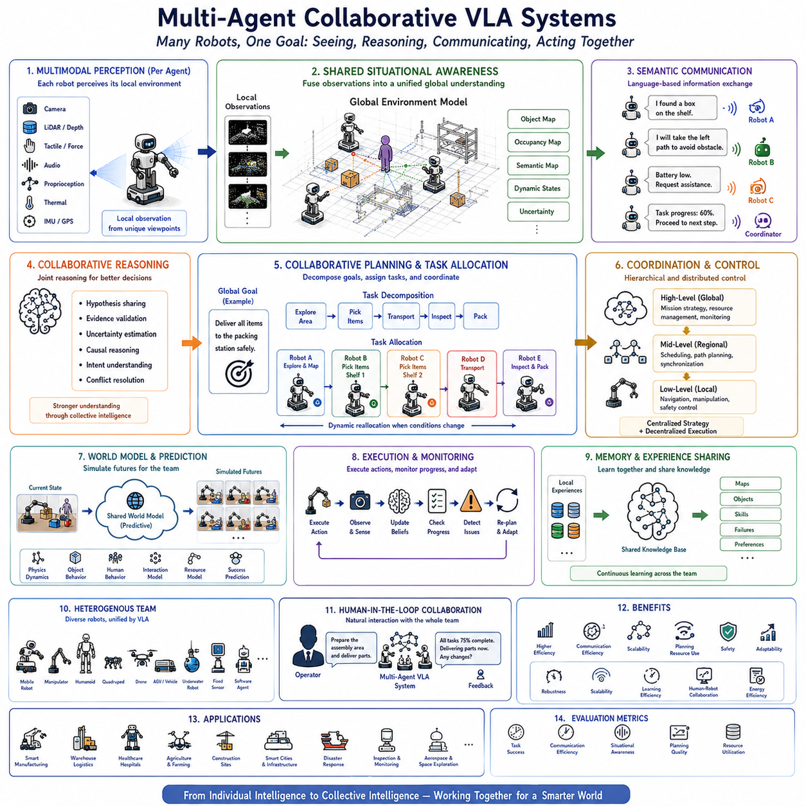{width="7.268055555555556in" height="7.268055555555556in"}

# 42_12_04 Multi-Agent Collaborative VLA Systems

The future of Vision-Language-Action (VLA) systems is expected to extend beyond individual autonomous robots toward collaborative multi-agent intelligence capable of coordinating perception, reasoning, planning, and physical actions across multiple robotic platforms. While current VLA research has primarily focused on enabling a single robot to understand natural language, interpret visual observations, and execute manipulation or navigation tasks, many real-world applications require groups of robots working together toward common objectives. Warehouses, manufacturing facilities, hospitals, airports, construction sites, agricultural fields, smart cities, disaster response operations, and planetary exploration all involve environments where no single robot possesses sufficient sensing capability, computational resources, physical reach, or operational endurance to complete every task independently. Multi-Agent Collaborative VLA Systems therefore represent an important evolutionary step from isolated embodied intelligence toward distributed physical intelligence operating through coordinated cooperation.

Multi-agent collaboration fundamentally changes how robotic intelligence is organized. Instead of viewing each robot as a fully independent decision-making entity, future systems increasingly treat multiple robots as members of a unified cognitive ecosystem. Each robot contributes unique sensing capabilities, computational resources, mobility characteristics, manipulation skills, and environmental observations while continuously exchanging information with other agents. The collective intelligence emerging from this cooperation enables the robotic team to solve significantly more complex problems than any individual robot could accomplish alone.

Vision-Language-Action models provide a natural foundation for multi-agent collaboration because language serves as a universal communication interface between robots, human operators, and autonomous software agents. Rather than relying exclusively on low-level communication protocols, future robotic systems will increasingly exchange high-level semantic information expressed through structured natural language representations. Robots may communicate discovered objects, environmental hazards, task progress, resource availability, planning updates, uncertainty estimates, and collaborative requests using language-grounded reasoning rather than purely numerical state variables. This semantic communication significantly improves flexibility while reducing coordination complexity across heterogeneous robotic teams.

Shared situational awareness represents one of the defining characteristics of collaborative VLA systems. Every robot continuously observes its local environment using cameras, LiDAR, tactile sensors, force sensors, proprioception, audio, thermal imaging, and other multimodal sensing technologies. Instead of maintaining isolated local maps, collaborative systems integrate these distributed observations into a continuously evolving global environmental representation accessible to all participating agents. Shared perception substantially improves environmental understanding because observations from multiple viewpoints reduce occlusion, improve localization accuracy, increase object detection reliability, and provide broader contextual awareness than any individual sensor platform.

Collaborative perception naturally extends into collaborative reasoning. Rather than independently interpreting observations, multiple robots jointly analyze environmental information, compare hypotheses, validate object identities, estimate uncertainty, and infer hidden environmental structure through distributed reasoning processes. For example, one robot may observe partial visual evidence while another contributes complementary depth information or tactile confirmation. By integrating these heterogeneous observations through shared reasoning frameworks, the collective system generates more accurate environmental understanding than isolated perception alone.

Task allocation becomes a central component of multi-agent embodied intelligence. Real-world missions frequently consist of numerous interconnected subtasks requiring different capabilities, resources, and physical locations. Collaborative VLA systems decompose high-level objectives into executable subtasks before assigning responsibilities according to each robot\'s current location, available resources, manipulation capability, sensing quality, computational workload, battery status, and operational expertise. Intelligent task allocation improves mission efficiency while minimizing redundant effort and unnecessary resource consumption throughout large-scale operations.

Dynamic task allocation further enhances operational flexibility under changing environmental conditions. Unexpected obstacles, hardware failures, communication interruptions, human intervention, weather variation, or evolving mission priorities continuously modify operational requirements during deployment. Future collaborative VLA systems therefore re-evaluate task assignments in real time, redistributing responsibilities whenever environmental changes render previous plans suboptimal. Such adaptive coordination enables resilient mission execution despite uncertainty and operational disturbances.

Hierarchical coordination architectures are expected to dominate future collaborative robotic systems. High-level coordination agents interpret global mission objectives, allocate resources, establish collaborative strategies, and monitor overall mission progress. Mid-level coordination manages regional task distribution, local scheduling, information sharing, and inter-robot synchronization. Individual robots then perform autonomous low-level perception, navigation, manipulation, and control while continuously reporting progress back to the collaborative coordination framework. This hierarchical organization balances centralized planning with decentralized execution, improving scalability while preserving local autonomy.

Distributed decision making represents another defining characteristic of future multi-agent systems. Instead of relying exclusively on centralized controllers vulnerable to communication failure or computational bottlenecks, collaborative VLA architectures increasingly distribute reasoning capability across participating agents. Each robot maintains local decision autonomy while contributing to collective planning through information exchange, negotiation, consensus formation, and distributed optimization. Such decentralized intelligence significantly improves fault tolerance, scalability, and operational robustness during large-scale deployments.

World models become substantially richer within collaborative environments because multiple robots jointly construct predictive environmental representations. Distributed world models integrate observations from heterogeneous sensors, maintain synchronized environmental memory, estimate future system evolution, and predict collaborative action outcomes across the entire robotic team. Instead of imagining only individual future trajectories, collaborative world models simulate coordinated multi-agent behaviors while evaluating communication constraints, resource allocation, environmental dynamics, and mission success probabilities before execution begins.

Communication efficiency plays a critical role in collaborative embodied intelligence. Continuous transmission of raw sensor data quickly exceeds available network bandwidth, particularly for high-resolution video streams, LiDAR point clouds, or multimodal observations. Future collaborative VLA systems therefore prioritize semantic communication in which robots exchange compressed environmental knowledge, symbolic object representations, task intentions, uncertainty estimates, reasoning summaries, and predicted future states rather than transmitting complete sensor streams. This knowledge-centric communication dramatically reduces bandwidth requirements while preserving essential collaborative information.

Reasoning-enhanced collaboration further improves team performance by enabling robots to explain intentions, justify decisions, negotiate responsibilities, request assistance, and resolve conflicts through structured reasoning. Rather than blindly following predetermined coordination rules, collaborative VLA systems analyze mission objectives, compare alternative strategies, estimate cooperative benefits, and adapt coordination policies according to evolving operational requirements. Such cognitive collaboration more closely resembles human teamwork than traditional distributed robotic control.

Human operators naturally become collaborative members within future multi-agent VLA ecosystems. Instead of supervising individual robots independently, humans interact with the collective robotic team using high-level natural language instructions, mission objectives, strategic guidance, and interactive feedback. The collaborative system interprets these instructions, distributes responsibilities across available agents, coordinates execution, monitors progress, and communicates summarized mission status back to human supervisors. This human-centered collaboration substantially reduces operator workload while improving mission transparency and overall operational effectiveness.

Multi-agent reinforcement learning is expected to play an increasingly important role in collaborative VLA development. Rather than optimizing policies for isolated robots, future learning algorithms simultaneously optimize cooperative behaviors across multiple interacting agents. Robots learn communication strategies, collaborative planning, resource sharing, coordinated navigation, joint manipulation, conflict resolution, and adaptive teamwork through repeated multi-agent experience. Such learning produces emergent cooperative behaviors that exceed manually engineered coordination strategies in both efficiency and adaptability.

Heterogeneous robot collaboration significantly expands operational capability. Future collaborative systems will increasingly integrate mobile robots, manipulators, humanoids, quadrupeds, aerial drones, autonomous vehicles, underwater robots, fixed sensing infrastructure, and intelligent software agents within unified cooperative frameworks. Each platform contributes specialized capabilities while sharing common multimodal representations, semantic communication protocols, and collaborative planning architectures. Such heterogeneous integration enables comprehensive physical intelligence across diverse operational environments.

Long-horizon collaborative planning introduces additional challenges beyond individual robot planning. Team coordination requires synchronization of multiple parallel task sequences, shared resource utilization, conflict avoidance, communication scheduling, transportation logistics, environmental access management, and coordinated recovery following unexpected failures. Future collaborative VLA systems therefore combine hierarchical planning, predictive world models, distributed optimization, and continual reasoning to maintain coherent long-duration mission execution despite evolving environmental uncertainty.

Safety becomes increasingly important as collaborative robot populations expand. Multiple autonomous agents simultaneously operating within shared environments introduce additional collision risks, communication dependencies, resource conflicts, and coordination failures. Future collaborative architectures therefore integrate distributed safety reasoning, cooperative collision avoidance, shared situational awareness, conflict detection, emergency coordination protocols, and collaborative recovery planning to maintain safe operation under complex multi-robot conditions.

Memory sharing substantially enhances collective intelligence. Individual robots continuously accumulate operational experience, environmental knowledge, object interaction history, user preferences, failure cases, and procedural expertise. Collaborative memory systems synchronize relevant knowledge across the robotic team, enabling newly deployed agents to benefit immediately from experiences acquired by others. This distributed knowledge base supports continual learning while significantly reducing redundant exploration across repeated missions.

Cloud-edge collaboration further strengthens multi-agent intelligence by combining centralized foundation models with distributed edge inference. Cloud infrastructure performs computationally intensive reasoning, global optimization, long-term memory management, and foundation model adaptation, while edge computing supports real-time perception, local planning, manipulation control, and low-latency safety monitoring. Hybrid cloud-edge architectures therefore balance computational efficiency, communication latency, operational autonomy, and system scalability across geographically distributed robotic deployments.

Evaluation methodologies for collaborative VLA systems necessarily extend beyond individual robot performance. Future benchmarks are expected to measure collaborative task completion, communication efficiency, shared situational awareness, resource utilization, planning coordination, robustness under communication failure, distributed reasoning quality, adaptive task allocation, collective learning efficiency, scalability, energy consumption, fault tolerance, and human-robot collaboration effectiveness. These multidimensional metrics provide comprehensive assessment of distributed embodied intelligence operating under realistic deployment conditions.

Industrial applications illustrate the transformative potential of collaborative VLA systems. Manufacturing facilities employ coordinated robotic teams for assembly, inspection, logistics, and quality assurance. Warehouses integrate autonomous mobile robots with robotic manipulators to optimize inventory movement and order fulfillment. Hospitals coordinate service robots, medication delivery systems, cleaning robots, and patient assistance platforms. Agricultural operations combine drones, autonomous tractors, field robots, and sensing stations for precision farming. Smart cities integrate autonomous vehicles, inspection robots, environmental monitoring systems, and infrastructure maintenance platforms through unified collaborative intelligence. Disaster response teams deploy heterogeneous robotic agents capable of jointly performing search, mapping, rescue, communication, and environmental assessment under hazardous conditions.

Ultimately, Multi-Agent Collaborative Vision-Language-Action Systems represent one of the most significant directions in the future evolution of embodied artificial intelligence. By integrating distributed perception, semantic communication, collaborative reasoning, hierarchical planning, shared world models, adaptive task allocation, distributed memory, multi-agent reinforcement learning, heterogeneous robot cooperation, cloud-edge intelligence, and human-centered collaboration into unified cognitive ecosystems, future VLA architectures will transcend the limitations of individual autonomous robots. Instead of isolated intelligent machines, the next generation of Physical AI will consist of cooperative robotic societies capable of collectively perceiving, reasoning, communicating, learning, and acting across large-scale dynamic environments. Such distributed embodied intelligence will provide the technological foundation for highly scalable, resilient, trustworthy, and efficient autonomous systems operating collaboratively alongside human society across virtually every industrial and public domain.

다중 에이전트 협업 비전-언어-행동(Multi-Agent Collaborative Vision-Language-Action, VLA) 시스템은 하나의 로봇이 독립적으로 작업을 수행하는 구조를 넘어, 여러 대의 로봇이 함께 인식하고 추론하며 계획하고 행동하는 **분산 구현형 지능(Distributed Embodied Intelligence)**으로 발전하는 방향을 의미한다. 현재의 VLA 연구는 단일 로봇이 자연어를 이해하고 작업을 수행하는 데 초점을 맞추고 있지만, 실제 산업 현장에서는 여러 대의 로봇이 동시에 협력해야 하는 경우가 대부분이다. 물류센터, 제조 공장, 병원, 공항, 건설 현장, 농업, 스마트시티, 재난 대응 등에서는 하나의 로봇만으로는 모든 작업을 수행하기 어렵기 때문에 협업 기반 VLA가 차세대 핵심 기술로 주목받고 있다.

다중 에이전트(Multi-Agent) 시스템에서는 각각의 로봇을 독립적인 개체가 아니라 하나의 통합된 인지 시스템(Cognitive Ecosystem)을 구성하는 구성원으로 본다. 각 로봇은 서로 다른 센서(Sensor), 계산 자원(Computing Resource), 이동 능력(Mobility), 조작 능력(Manipulation Skill), 환경 정보를 가지고 있으며, 지속적으로 정보를 공유하면서 공동의 목표를 수행한다. 이러한 집단 지능(Collective Intelligence)은 개별 로봇이 수행할 수 없는 복잡한 문제를 해결할 수 있도록 해준다.

비전-언어-행동(VLA) 모델은 로봇 간 협업을 위한 매우 적합한 기반 기술이다. 자연어(Language)는 사람과 로봇뿐 아니라 로봇과 로봇 사이에서도 공통의 의미 기반(Semantic Interface) 역할을 할 수 있다. 미래의 협업 로봇은 단순한 위치 좌표나 숫자 데이터를 주고받는 것이 아니라, 발견한 물체(Object), 위험 요소(Hazard), 작업 진행(Task Progress), 자원 상태(Resource Availability), 계획 변경(Planning Update), 불확실성(Uncertainty) 등을 의미 중심의 언어 표현으로 공유하게 된다. 이러한 의미 기반 통신(Semantic Communication)은 협업의 유연성과 확장성을 크게 향상시킨다.

공유 상황 인식(Shared Situational Awareness)은 협업 VLA 시스템의 가장 중요한 특징 가운데 하나이다. 각 로봇은 카메라(Camera), 라이다(LiDAR), 촉각(Tactile), 힘 센서(Force Sensor), 자기 위치(Proprioception), 음성(Audio), 열화상(Thermal Imaging) 등 다양한 센서를 이용하여 주변 환경을 인식한다. 미래의 협업 시스템은 이러한 개별 정보를 하나의 통합된 환경 모델(Global Environment Model)로 결합하여 모든 로봇이 동시에 활용할 수 있도록 한다. 여러 시점(Viewpoint)의 정보를 통합하면 가려진 영역(Occlusion)을 줄이고, 위치 추정(Localization)과 물체 인식(Object Detection)의 정확도를 크게 향상시킬 수 있다.

공유 인식은 자연스럽게 협업 추론(Collaborative Reasoning)으로 이어진다. 각각의 로봇이 독립적으로 판단하는 것이 아니라 서로의 관찰 결과를 비교하고, 가설(Hypothesis)을 검증하며, 물체를 확인하고, 불확실성을 함께 분석한다. 예를 들어 한 로봇은 RGB 영상으로 물체를 발견하고 다른 로봇은 깊이 정보(Depth)나 촉각 정보를 제공하면 더욱 정확한 환경 이해가 가능하다. 이러한 분산 추론(Distributed Reasoning)은 단일 로봇보다 높은 정확도를 제공한다.

작업 할당(Task Allocation)은 다중 에이전트 시스템의 핵심 기능이다. 실제 작업은 여러 개의 하위 작업(Subtask)으로 구성되며 각각 다른 위치와 능력을 요구한다. 협업 VLA는 상위 목표를 여러 작업으로 분해한 뒤 로봇의 현재 위치(Location), 배터리(Battery), 조작 능력(Manipulation Capability), 센서 성능(Sensor Quality), 계산 부하(Computational Workload), 전문 기능(Operational Expertise)을 고려하여 가장 적합한 로봇에게 작업을 할당한다. 이를 통해 작업 효율성과 자원 활용도를 크게 향상시킬 수 있다.

동적 작업 할당(Dynamic Task Allocation)은 변화하는 환경에서도 높은 적응성을 제공한다. 작업 도중 장애물(Obstacle), 장비 고장(Hardware Failure), 통신 장애(Communication Failure), 사람의 개입(Human Intervention), 날씨 변화(Weather Change), 작업 우선순위 변경(Priority Change)이 발생하면 시스템은 작업을 다시 분석하여 새로운 할당을 수행한다. 이러한 적응형 협업(Adaptive Collaboration)은 예기치 않은 상황에서도 안정적인 작업 수행을 가능하게 한다.

계층적 협업 구조(Hierarchical Coordination)는 미래 협업 시스템의 대표적인 구조가 될 것이다. 상위 계층은 전체 작업 목표(Mission Objective)를 해석하고 자원을 배분하며 전체 진행 상황을 관리한다. 중간 계층은 지역별 작업 분배(Local Task Distribution), 일정 관리(Scheduling), 정보 공유(Information Sharing), 로봇 간 동기화(Synchronization)를 수행한다. 하위 계층에서는 개별 로봇이 자율적으로 이동(Navigation), 조작(Manipulation), 인식(Perception), 제어(Control)를 수행하고 결과를 다시 상위 계층에 보고한다.

분산 의사결정(Distributed Decision Making)은 미래 협업 시스템의 중요한 특징이다. 중앙 제어기(Central Controller)에 모든 판단을 맡기면 통신 장애나 계산 병목(Bottleneck)이 발생할 수 있다. 따라서 미래의 협업 VLA는 각 로봇이 독립적으로 판단하면서도 서로 정보를 교환하고 협상(Negotiation), 합의(Consensus), 분산 최적화(Distributed Optimization)를 수행하는 구조를 채택하게 된다. 이러한 방식은 확장성과 장애 허용성(Fault Tolerance)을 크게 향상시킨다.

월드 모델(World Model)도 협업 환경에서는 더욱 강력한 기능을 수행한다. 여러 로봇이 수집한 정보를 이용하여 하나의 공유 월드 모델(Shared World Model)을 구축하고, 다양한 행동 시나리오를 공동으로 시뮬레이션한다. 이를 통해 각 로봇의 이동 경로, 작업 순서, 자원 사용량, 성공 확률 등을 사전에 예측할 수 있으며, 보다 효율적인 협업 계획을 수립할 수 있다.

통신 효율(Communication Efficiency)은 협업 시스템에서 매우 중요한 요소이다. 여러 대의 로봇이 원본 영상이나 라이다 데이터를 그대로 전송하면 네트워크(Network)에 큰 부하가 발생한다. 따라서 미래의 VLA는 원시 데이터(Raw Data)가 아니라 의미 정보(Semantic Knowledge), 객체 표현(Symbolic Object Representation), 작업 의도(Task Intention), 불확실성(Uncertainty), 추론 결과(Reasoning Summary), 미래 예측(Predicted State)과 같은 고수준 정보를 공유하는 방향으로 발전할 것이다. 이를 통해 통신량은 줄이면서 협업 효율은 높일 수 있다.

추론 기반 협업(Reasoning-Enhanced Collaboration)은 로봇이 자신의 의도를 설명하고, 작업을 협의하며, 도움을 요청하고, 충돌을 해결할 수 있도록 한다. 미리 정의된 규칙만 따르는 것이 아니라 작업 목표를 분석하고 여러 전략을 비교하며 가장 효율적인 협업 방식을 스스로 선택한다. 이러한 인지적 협업(Cognitive Collaboration)은 사람의 팀워크와 유사한 수준의 협력 능력을 구현하는 중요한 기술이다.

사람(Human)도 미래의 협업 시스템에서는 하나의 협업 구성원으로 포함된다. 작업자는 개별 로봇을 직접 제어하는 대신 자연어(Natural Language)로 전체 작업 목표를 제시한다. 협업 VLA 시스템은 이를 이해한 뒤 각 로봇에게 작업을 분배하고, 수행 과정을 관리하며, 진행 상황을 다시 사람에게 보고한다. 이러한 사람 중심 협업(Human-Centered Collaboration)은 작업자의 부담을 줄이고 전체 작업 효율을 크게 높인다.

다중 에이전트 강화학습(Multi-Agent Reinforcement Learning)은 협업 VLA의 핵심 학습 기술이 될 것이다. 로봇은 단독으로 학습하는 것이 아니라 서로 협력하면서 통신 방법(Communication Strategy), 공동 계획(Collaborative Planning), 자원 공유(Resource Sharing), 협동 이동(Coordinated Navigation), 공동 조작(Joint Manipulation), 충돌 해결(Conflict Resolution)을 스스로 학습한다. 이를 통해 사람이 직접 설계하기 어려운 협력 전략(Emergent Cooperation)이 자연스럽게 형성된다.

이기종 로봇(Heterogeneous Robot) 협업도 매우 중요한 발전 방향이다. 미래에는 이동 로봇(Mobile Robot), 매니퓰레이터(Manipulator), 휴머노이드(Humanoid), 사족보행 로봇(Quadruped), 드론(Drone), 자율주행 차량(Autonomous Vehicle), 수중 로봇(Underwater Robot), 고정형 센서(Fixed Sensor), 소프트웨어 에이전트(Software Agent)가 하나의 협업 시스템 안에서 함께 동작하게 된다. 각 플랫폼은 자신만의 전문 기능을 제공하면서 공통된 의미 표현과 협업 계획을 공유하게 된다.

장기 협업 계획(Long-Horizon Collaborative Planning)은 단일 로봇보다 훨씬 복잡하다. 여러 작업의 동기화(Synchronization), 자원 공유(Resource Sharing), 충돌 방지(Conflict Avoidance), 통신 일정(Communication Scheduling), 물류 관리(Logistics), 접근 제어(Access Management), 장애 복구(Recovery Planning)를 동시에 고려해야 한다. 미래의 협업 VLA는 계층적 계획(Hierarchical Planning), 월드 모델(World Model), 분산 최적화(Distributed Optimization), 지속적 추론(Continual Reasoning)을 결합하여 장시간 작업에서도 안정성을 유지하게 된다.

안전성(Safety)은 다중 에이전트 환경에서 더욱 중요하다. 여러 대의 로봇이 동시에 움직이면 충돌 위험(Collision Risk), 자원 충돌(Resource Conflict), 통신 오류(Communication Failure)가 발생할 가능성이 높아진다. 따라서 미래의 협업 시스템은 공동 충돌 회피(Cooperative Collision Avoidance), 공유 상황 인식(Shared Situational Awareness), 위험 탐지(Conflict Detection), 비상 협업(Emergency Coordination), 공동 복구(Collaborative Recovery)를 포함한 분산 안전 체계를 구축하게 될 것이다.

공유 메모리(Shared Memory)는 집단 지능을 크게 향상시킨다. 개별 로봇이 축적한 환경 정보(Environment Knowledge), 물체 특성(Object Behavior), 사용자 선호(User Preference), 실패 사례(Failure Case), 작업 경험(Operational Experience)은 공동 메모리 시스템을 통해 모든 로봇이 활용할 수 있다. 새로운 로봇도 기존 로봇의 경험을 즉시 사용할 수 있으므로 반복적인 탐색과 학습을 크게 줄일 수 있으며, 연속학습(Continual Learning)의 기반도 마련된다.

클라우드-엣지 협업(Cloud-Edge Collaboration)은 협업 VLA 시스템의 핵심 인프라가 될 것이다. 클라우드는 대규모 추론(Large-Scale Reasoning), 전역 최적화(Global Optimization), 장기 메모리(Long-Term Memory), 파운데이션 모델(Foundation Model) 학습을 담당하고, 엣지 컴퓨팅(Edge Computing)은 실시간 인식(Real-Time Perception), 지역 계획(Local Planning), 조작 제어(Manipulation Control), 저지연 안전 제어(Low-Latency Safety)를 수행한다. 이러한 구조는 계산 효율성과 실시간성을 동시에 만족시킨다.

평가 체계(Evaluation Framework)도 단일 로봇 중심에서 협업 중심으로 발전하게 된다. 미래에는 작업 성공률(Task Completion), 통신 효율(Communication Efficiency), 공유 상황 인식(Shared Situational Awareness), 자원 활용(Resource Utilization), 협업 계획(Collaborative Planning), 통신 장애 강건성(Communication Robustness), 분산 추론(Distributed Reasoning), 동적 작업 할당(Adaptive Task Allocation), 집단 학습 효율(Collective Learning), 확장성(Scalability), 에너지 소비(Energy Consumption), 장애 허용성(Fault Tolerance), 사람-로봇 협업(Human-Robot Collaboration)을 종합적으로 평가하는 새로운 벤치마크가 등장할 것으로 예상된다.

산업 현장에서는 협업 VLA 시스템의 활용 범위가 매우 넓다. 제조 공장에서는 조립(Assembly), 검사(Inspection), 물류(Logistics), 품질 관리(Quality Assurance)를 여러 로봇이 공동 수행하고, 물류센터에서는 이동 로봇과 매니퓰레이터가 함께 주문 처리를 수행한다. 병원에서는 약품 배송, 청소, 환자 지원 로봇이 협력하며, 농업에서는 드론, 자율주행 트랙터, 작업 로봇이 함께 정밀 농업(Precision Agriculture)을 수행한다. 스마트시티에서는 자율주행 차량, 순찰 로봇, 환경 감시 시스템이 협력하여 도시 전체를 관리하고, 재난 대응에서는 다양한 로봇이 공동으로 탐색(Search), 구조(Rescue), 통신(Communication), 환경 분석(Environment Assessment)을 수행하게 된다.

궁극적으로 **다중 에이전트 협업 비전-언어-행동 시스템(Multi-Agent Collaborative Vision-Language-Action Systems)**은 **분산 인식(Distributed Perception)**, **의미 기반 통신(Semantic Communication)**, **협업 추론(Collaborative Reasoning)**, **계층적 계획(Hierarchical Planning)**, **공유 월드 모델(Shared World Model)**, **동적 작업 할당(Adaptive Task Allocation)**, **공유 메모리(Shared Memory)**, **다중 에이전트 강화학습(Multi-Agent Reinforcement Learning)**, **이기종 로봇 협력(Heterogeneous Robot Cooperation)**, **클라우드-엣지 지능(Cloud-Edge Intelligence)**, **사람 중심 협업(Human-Centered Collaboration)**을 하나의 통합된 인지 생태계(Cognitive Ecosystem)로 발전시키게 될 것이다. 미래의 **물리 AI(Physical AI)**는 더 이상 하나의 지능형 로봇이 아니라, 수많은 로봇이 함께 인식하고 추론하며 학습하고 행동하는 **협력형 로봇 사회(Cooperative Robotic Society)**로 발전하여 산업과 사회 전반에서 대규모 자율 협업을 실현하는 핵심 기술이 될 것으로 전망된다.

##  

## 12.5 Continual Learning During Deployment

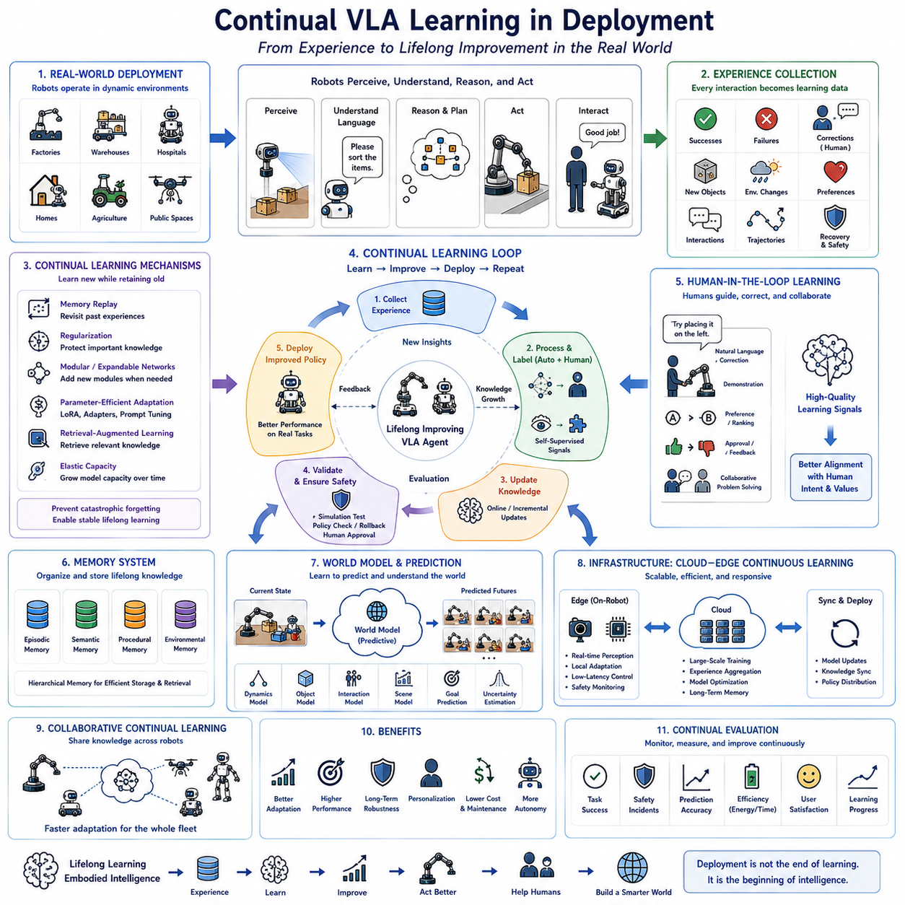{width="7.268055555555556in" height="7.268055555555556in"}

# 42_12_05 Continual VLA Learning in Deployment

The next stage in the evolution of Vision-Language-Action (VLA) systems is expected to move beyond static pre-trained models toward continuously improving embodied intelligence capable of learning throughout real-world deployment. Most existing VLA models are trained offline using large-scale datasets and are subsequently deployed with fixed parameters. Although these models often demonstrate impressive generalization capabilities, real operational environments continuously change due to new objects, evolving workflows, environmental variation, user preferences, and unforeseen situations that were not represented during initial training. Consequently, future VLA systems must become lifelong learning agents that continuously acquire new knowledge while maintaining previously learned capabilities. Continual learning during deployment therefore represents one of the most important technological foundations for scalable Physical AI capable of long-term autonomous operation across diverse real-world environments.

Traditional machine learning follows a train-then-deploy paradigm in which the learning process ends before practical operation begins. Data are collected, models are trained offline, evaluation is performed using benchmark datasets, and the resulting models are frozen before deployment. While this approach simplifies validation and certification, it prevents robotic systems from adapting to changing operational conditions. In contrast, continual VLA learning extends the learning process into deployment itself. Every interaction with the environment becomes a valuable learning opportunity, allowing robots to continuously improve perception, reasoning, language understanding, manipulation skills, navigation strategies, and collaborative behavior through accumulated operational experience.

Continual learning fundamentally transforms the relationship between robots and their environments. Rather than treating deployment as the final stage of development, future embodied intelligence systems regard deployment as the primary source of knowledge acquisition. Every successful task, failed manipulation, unexpected obstacle, human correction, environmental change, and recovery procedure contributes new information that gradually improves internal representations of the physical world. This continuous adaptation enables robots to remain effective despite evolving operational requirements without requiring complete retraining from scratch.

One of the central challenges in continual learning is catastrophic forgetting. Neural networks optimized for newly acquired tasks often lose performance on previously learned knowledge because parameter updates overwrite existing representations. This problem becomes particularly significant in long-term robotic deployment where thousands of new experiences accumulate over extended operational periods. Future VLA systems therefore require learning mechanisms capable of integrating new information while preserving existing competencies. Memory replay, parameter regularization, modular architectures, dynamic network expansion, and retrieval-augmented learning represent promising approaches for balancing adaptation with long-term knowledge retention.

Experience replay provides one effective solution by storing representative historical experiences within long-term memory. During subsequent learning updates, previously acquired examples are periodically revisited alongside newly collected data, preventing older knowledge from disappearing. Replay memories may include successful manipulations, navigation trajectories, language interactions, environmental observations, safety-critical situations, and recovery procedures. Intelligent experience selection further improves efficiency by prioritizing informative or rare events rather than indiscriminately storing every observation generated during deployment.

Memory organization becomes increasingly important as robots accumulate years of operational experience. Future VLA systems are expected to maintain hierarchical memory structures combining episodic memory, semantic memory, procedural memory, and environmental memory. Episodic memory records individual experiences, semantic memory stores generalized knowledge about objects and environments, procedural memory captures learned manipulation and navigation skills, while environmental memory maintains persistent maps and contextual information. Together these complementary memory systems enable continual adaptation while supporting efficient retrieval of relevant knowledge during future reasoning and planning.

Foundation models provide an effective basis for continual adaptation because large-scale pretrained representations already encode broad semantic and physical knowledge acquired from extensive multimodal datasets. Rather than retraining complete models after every deployment experience, future VLA systems will likely perform lightweight adaptation using parameter-efficient fine-tuning, low-rank adaptation techniques, adapter modules, prompt optimization, or latent representation refinement. Such approaches significantly reduce computational requirements while preserving the general capabilities of the underlying foundation model.

Online learning represents another essential component of continual deployment. Instead of waiting until sufficient data accumulate for periodic offline retraining, robots incrementally update selected components while remaining operational. Carefully designed online optimization strategies allow perception modules, language grounding components, world models, manipulation policies, and planning systems to improve continuously without interrupting mission execution. This capability enables rapid adaptation to newly introduced objects, changing environmental layouts, evolving user preferences, and modified operational procedures.

Human feedback plays a particularly valuable role during continual learning. Operators naturally provide corrections, demonstrations, verbal explanations, preferences, and task refinements while interacting with deployed robots. Rather than treating these interactions merely as supervisory control, future VLA systems interpret human guidance as high-quality learning signals that improve future performance. Natural language corrections, physical demonstrations, approval feedback, ranking preferences, and collaborative problem solving all contribute to progressively aligning robotic behavior with human expectations. Human-in-the-loop continual learning therefore accelerates adaptation while improving safety and trustworthiness.

Self-supervised learning substantially expands the quantity of useful deployment data by enabling robots to learn from unlabeled observations. Every navigation sequence, object interaction, sensor measurement, environmental change, and multimodal observation contributes predictive learning signals without requiring manual annotation. Future VLA systems are expected to continuously refine visual representations, environmental models, temporal predictions, and physical understanding through self-supervised objectives integrated directly into routine autonomous operation. This approach dramatically increases learning efficiency while minimizing annotation cost.

World models further enhance continual learning by allowing robots to compare predicted environmental evolution with actual observations collected during deployment. Prediction errors identify deficiencies within current internal representations, highlighting areas requiring additional adaptation. Robots therefore improve not only through explicit task success or failure but also through continuous refinement of predictive accuracy. As predictive models become increasingly accurate, planning, manipulation, navigation, and collaborative decision making all benefit from progressively improved environmental understanding.

Simulation and real-world deployment increasingly complement one another within continual learning frameworks. Experiences collected during practical operation are transferred back into simulation to improve virtual training environments, while synthetic scenarios generated in simulation prepare robots for future real-world situations that have not yet been encountered. This bidirectional simulation-to-real learning cycle enables efficient large-scale optimization without exposing physical systems to unnecessary operational risk. Hybrid learning environments therefore accelerate continual adaptation while maintaining deployment safety.

Collaborative continual learning extends these concepts across multiple robots operating simultaneously. Rather than learning independently, distributed robotic teams exchange newly acquired knowledge through shared cloud infrastructure or decentralized communication networks. When one robot learns to manipulate a previously unseen object or adapt to a novel environmental condition, this knowledge becomes immediately available to other robots facing similar situations. Collective learning therefore accelerates adaptation across entire robotic fleets while reducing redundant exploration and repeated mistakes.

Cloud-edge collaboration provides the computational infrastructure necessary for scalable continual learning. Edge computing supports low-latency perception, local adaptation, and real-time control directly on deployed robots, while cloud infrastructure performs computationally intensive model optimization, large-scale experience aggregation, long-term memory management, and foundation model refinement. Periodic synchronization between cloud and edge systems enables continuous deployment of improved capabilities without interrupting ongoing autonomous operation. This hybrid architecture balances responsiveness with large-scale learning efficiency.

Safety remains a primary concern during continual adaptation because autonomous learning directly influences future robot behavior. Consequently, future continual learning systems incorporate verification mechanisms, confidence estimation, anomaly detection, policy validation, simulation-based testing, rollback capability, and human approval before newly learned behaviors become fully operational. Safety-aware learning ensures that adaptation improves performance without introducing unacceptable operational risk. Such controlled adaptation is particularly important for healthcare, manufacturing, transportation, and public service applications where reliability remains essential.

Continual evaluation accompanies continual learning throughout deployment. Rather than relying exclusively on static benchmark datasets collected before deployment, future evaluation frameworks continuously monitor task performance, prediction accuracy, manipulation reliability, navigation quality, energy efficiency, human satisfaction, safety incidents, recovery success, language understanding, and collaborative effectiveness. Performance trends reveal whether learning produces genuine long-term improvement or unintended degradation. Continuous evaluation therefore becomes an integral component of autonomous system maintenance.

Personalization emerges naturally through deployment-based learning. Different users often possess unique preferences regarding communication style, task execution, workspace organization, interaction frequency, safety margins, and collaborative behavior. Continual learning enables robots to gradually adapt these characteristics without sacrificing general capability. Personalized assistance significantly improves user satisfaction while supporting long-term human-robot relationships across domestic, industrial, medical, educational, and service environments.

Industrial deployment demonstrates the practical importance of continual VLA learning. Manufacturing robots adapt to evolving production processes, new components, and changing assembly procedures. Warehouse robots continuously optimize navigation according to traffic patterns and inventory organization. Agricultural robots refine crop management strategies using seasonal observations. Healthcare assistants personalize support according to patient behavior and clinical routines. Autonomous inspection robots improve anomaly detection as new equipment conditions emerge over years of operation. In each application, continual adaptation substantially extends operational lifetime while reducing maintenance cost.

Future research is expected to integrate continual learning with reasoning, world models, multimodal perception, memory systems, collaborative intelligence, and foundation model adaptation within unified embodied cognitive architectures. Rather than functioning as isolated learning modules, these components will continuously exchange information throughout perception, planning, execution, evaluation, and knowledge refinement. Every completed task contributes additional experience, every prediction improves future reasoning, and every interaction expands collective understanding of the physical world.

Ultimately, Continual VLA Learning in Deployment represents a fundamental transition from static robotic intelligence toward continuously evolving Physical AI. Instead of viewing deployment as the endpoint of development, future Vision-Language-Action systems will treat deployment as an ongoing learning process through which perception, language understanding, reasoning, manipulation, navigation, collaboration, and decision making continuously improve. By integrating lifelong learning, memory organization, self-supervised adaptation, human feedback, world models, cloud-edge collaboration, collective knowledge sharing, safety-aware optimization, and continuous evaluation into unified foundation models, future embodied intelligence will become increasingly adaptive, resilient, personalized, and capable of operating autonomously for extended periods across diverse real-world environments. Continuous learning will therefore serve as one of the defining capabilities distinguishing next-generation autonomous robotic systems from the static AI models of today.

비전-언어-행동(Vision-Language-Action, VLA) 시스템의 다음 발전 단계는 고정된 사전학습 모델(Pre-trained Model)에서 벗어나 실제 운영 환경에서 지속적으로 학습하는 **지속학습 구현형 지능(Continual Embodied Intelligence)**으로 발전하는 것이다. 현재 대부분의 VLA 모델은 대규모 데이터셋으로 오프라인 학습을 수행한 후 고정된 상태로 배포된다. 그러나 실제 환경에서는 새로운 물체(New Object), 변화하는 작업 절차(Workflow), 환경 변화(Environment Variation), 사용자 선호(User Preference), 예측하지 못한 상황이 지속적으로 발생한다. 따라서 미래의 VLA 시스템은 배포 이후에도 새로운 지식을 지속적으로 습득하는 **평생학습(Lifelong Learning)** 능력을 갖추어야 하며, 이는 장기간 자율 운영이 가능한 물리 AI(Physical AI)의 핵심 기반 기술이 된다.

기존의 기계학습은 **학습 후 배포(Train-Then-Deploy)** 방식이었다. 데이터를 수집하고 모델을 학습한 뒤 성능을 검증하고, 이후에는 모델을 고정하여 실제 환경에 적용한다. 이러한 방식은 검증과 인증에는 유리하지만 변화하는 환경에 적응하기 어렵다. 반면 지속학습(Continual Learning)은 배포 이후에도 학습을 계속 수행한다. 로봇이 환경과 상호작용하는 모든 과정이 새로운 학습 데이터가 되며, 인식(Perception), 추론(Reasoning), 언어 이해(Language Understanding), 조작(Manipulation), 자율주행(Navigation), 협업(Collaboration) 능력이 운영 경험을 통해 지속적으로 향상된다.

지속학습은 로봇과 환경의 관계를 근본적으로 변화시킨다. 기존에는 배포가 개발의 마지막 단계였지만, 미래의 구현형 AI에서는 배포 자체가 가장 중요한 학습 과정이 된다. 성공적인 작업(Task Success), 조작 실패(Manipulation Failure), 예상치 못한 장애물(Unexpected Obstacle), 사람의 수정(Human Correction), 환경 변화(Environment Change), 오류 복구(Recovery Procedure)와 같은 모든 경험이 새로운 학습 자료가 된다. 이를 통해 로봇은 전체 모델을 다시 학습하지 않고도 변화하는 환경에 지속적으로 적응할 수 있다.

지속학습의 가장 큰 문제는 **파국적 망각(Catastrophic Forgetting)**이다. 신경망(Neural Network)은 새로운 작업을 학습하면서 기존에 학습한 지식을 잃어버리는 문제가 발생할 수 있다. 장기간 운영되는 로봇은 수천 개 이상의 새로운 경험을 축적하기 때문에 이러한 문제가 더욱 심각해진다. 따라서 미래의 VLA는 새로운 정보를 학습하면서도 기존 능력을 유지할 수 있는 구조가 필요하다. 메모리 재생(Memory Replay), 파라미터 정규화(Parameter Regularization), 모듈형 구조(Modular Architecture), 동적 네트워크 확장(Dynamic Network Expansion), 검색 기반 학습(Retrieval-Augmented Learning) 등이 이러한 문제를 해결하기 위한 핵심 기술이 된다.

메모리 재생(Memory Replay)은 지속학습을 위한 대표적인 방법이다. 과거의 중요한 경험을 장기 메모리(Long-Term Memory)에 저장한 후 새로운 데이터를 학습할 때 이전 경험도 함께 반복 학습한다. 성공적인 조작, 자율주행 경로(Navigation Trajectory), 언어 상호작용(Language Interaction), 환경 관찰(Environment Observation), 안전 관련 사례(Safety-Critical Situation), 오류 복구(Recovery Procedure) 등이 대표적인 저장 대상이다. 또한 모든 데이터를 저장하는 것이 아니라 중요한 경험만 선택하는 지능형 경험 선택(Intelligent Experience Selection)을 적용하여 학습 효율을 높이게 된다.

메모리 구조(Memory Organization)는 지속학습에서 매우 중요한 역할을 한다. 미래의 VLA 시스템은 에피소드 메모리(Episodic Memory), 의미 메모리(Semantic Memory), 절차 메모리(Procedural Memory), 환경 메모리(Environmental Memory)를 계층적으로 구성할 것으로 예상된다. 에피소드 메모리는 개별 경험을 저장하고, 의미 메모리는 일반적인 지식을 저장하며, 절차 메모리는 조작과 이동 기술을 저장하고, 환경 메모리는 지도(Map)와 환경 정보를 유지한다. 이러한 계층적 메모리는 지속적인 적응과 효율적인 지식 검색을 동시에 가능하게 한다.

파운데이션 모델(Foundation Model)은 지속학습에 매우 적합한 기반이 된다. 이미 대규모 멀티모달 데이터(Multimodal Data)를 통해 폭넓은 물리 지식과 의미 표현을 학습했기 때문에 전체 모델을 다시 학습할 필요가 없다. 대신 **파라미터 효율적 미세조정(Parameter-Efficient Fine-Tuning)**, **저순위 적응(Low-Rank Adaptation, LoRA)**, **어댑터 모듈(Adapter Module)**, **프롬프트 최적화(Prompt Optimization)**, **잠재 표현 개선(Latent Representation Refinement)** 등을 활용하여 적은 계산량으로 새로운 환경에 적응할 수 있다.

온라인 학습(Online Learning)은 지속학습의 또 다른 핵심 요소이다. 일정 기간 데이터를 모은 뒤 다시 학습하는 것이 아니라 운영 중에도 일부 모델을 지속적으로 업데이트한다. 인식 모듈, 언어 접지(Language Grounding), 월드 모델(World Model), 조작 정책(Manipulation Policy), 계획(Planning) 시스템 등이 작업을 수행하면서 동시에 개선된다. 이를 통해 새로운 물체, 변경된 작업 환경, 사용자 선호, 작업 절차 변화에 매우 빠르게 적응할 수 있다.

사람의 피드백(Human Feedback)은 지속학습에서 매우 중요한 학습 신호가 된다. 작업자는 로봇에게 수정 사항(Correction), 시범(Demonstration), 설명(Explanation), 선호도(Preference), 작업 개선(Task Refinement)을 자연스럽게 제공한다. 미래의 VLA 시스템은 이러한 상호작용을 단순한 제어 명령이 아니라 학습 데이터로 활용한다. 자연어 수정(Natural Language Correction), 직접 시범(Physical Demonstration), 승인 피드백(Approval Feedback), 선호도 비교(Ranking Preference), 협업 문제 해결(Collaborative Problem Solving)은 모두 사람 중심 지속학습(Human-in-the-Loop Continual Learning)의 핵심 요소가 된다.

자기지도학습(Self-Supervised Learning)은 지속학습의 효율을 크게 향상시킨다. 자율주행 과정, 물체 조작, 센서 데이터, 환경 변화 등 대부분의 데이터는 사람이 직접 라벨(Label)을 붙이지 않아도 학습에 사용할 수 있다. 미래의 VLA 시스템은 이러한 비지도 데이터(Unlabeled Data)를 활용하여 시각 표현(Visual Representation), 환경 모델(Environment Model), 시간 예측(Temporal Prediction), 물리 이해(Physical Understanding)를 지속적으로 개선하게 된다. 이를 통해 데이터 구축 비용을 크게 줄일 수 있다.

월드 모델(World Model)은 지속학습을 더욱 효과적으로 만든다. 로봇은 자신이 예측한 미래(Predicted Future)와 실제 관찰 결과(Actual Observation)를 지속적으로 비교한다. 예측 오류(Prediction Error)는 현재 모델의 부족한 부분을 알려주는 중요한 학습 신호가 된다. 따라서 단순히 성공과 실패만 학습하는 것이 아니라 예측 정확도 자체를 지속적으로 향상시키면서 환경 이해 능력을 개선할 수 있다. 이는 장기적으로 계획, 조작, 자율주행, 협업 능력까지 함께 향상시키는 기반이 된다.

시뮬레이션(Simulation)과 실제 환경(Real World)은 지속학습 과정에서 서로 보완적인 역할을 수행한다. 실제 운영에서 얻은 경험은 시뮬레이션으로 다시 전달되어 가상 환경을 개선하고, 시뮬레이션에서 생성된 다양한 시나리오는 실제 환경에서 아직 경험하지 못한 상황을 미리 학습하는 데 활용된다. 이러한 **시뮬레이션-실환경 학습 순환(Simulation-to-Real Learning Cycle)**은 안전성을 유지하면서도 대규모 학습을 가능하게 한다.

협업 지속학습(Collaborative Continual Learning)은 여러 대의 로봇이 함께 학습하는 구조이다. 각각의 로봇이 독립적으로 학습하는 것이 아니라 클라우드(Cloud)나 분산 네트워크(Distributed Network)를 통해 새로운 경험을 공유한다. 한 로봇이 새로운 물체를 학습하거나 새로운 환경에 적응하면 그 지식은 즉시 다른 로봇에게도 전달된다. 이러한 집단 학습(Collective Learning)은 전체 로봇 시스템의 적응 속도를 크게 향상시키고 중복된 시행착오를 줄여준다.

클라우드-엣지 협업(Cloud-Edge Collaboration)은 지속학습을 위한 핵심 인프라이다. 엣지 컴퓨팅(Edge Computing)은 실시간 인식, 지역 적응(Local Adaptation), 제어(Control)를 수행하고, 클라우드는 대규모 모델 최적화(Model Optimization), 경험 통합(Experience Aggregation), 장기 메모리(Long-Term Memory), 파운데이션 모델 개선(Foundation Model Refinement)을 담당한다. 주기적인 동기화(Synchronization)를 통해 로봇은 운영을 중단하지 않고도 새로운 기능을 지속적으로 반영할 수 있다.

안전성(Safety)은 지속학습에서 반드시 고려해야 할 요소이다. 운영 중 학습된 새로운 정책이 곧바로 적용되면 예상하지 못한 위험이 발생할 수 있다. 따라서 미래의 지속학습 시스템은 정책 검증(Policy Validation), 신뢰도 추정(Confidence Estimation), 이상 탐지(Anomaly Detection), 시뮬레이션 검증(Simulation-Based Testing), 롤백(Rollback), 사람 승인(Human Approval) 등을 거쳐 안전성을 확인한 후에만 새로운 기능을 실제 시스템에 적용하게 된다.

지속적인 평가(Continual Evaluation)는 지속학습과 함께 수행되어야 한다. 기존처럼 고정된 벤치마크만 사용하는 것이 아니라 작업 성공률(Task Success), 예측 정확도(Prediction Accuracy), 조작 신뢰성(Manipulation Reliability), 자율주행 품질(Navigation Quality), 에너지 효율(Energy Efficiency), 사용자 만족도(User Satisfaction), 안전 사고(Safety Incident), 오류 복구(Recovery Success), 언어 이해(Language Understanding), 협업 성능(Collaboration Effectiveness)을 지속적으로 모니터링한다. 이를 통해 학습이 실제 성능 향상으로 이어지는지를 확인할 수 있다.

개인화(Personalization)는 지속학습을 통해 자연스럽게 구현된다. 사용자마다 대화 방식(Communication Style), 작업 순서(Task Execution), 작업 공간 구성(Workspace Organization), 안전 거리(Safety Margin), 협업 방식(Collaboration Style)이 다르다. 지속학습을 통해 로봇은 이러한 개인별 특성을 점진적으로 학습하며 사용자 맞춤형 서비스를 제공할 수 있다. 이는 가정용, 의료용, 교육용, 서비스 로봇에서 특히 중요한 기능이 된다.

산업 현장에서도 지속학습의 효과는 매우 크다. 제조 로봇은 생산 공정 변화와 새로운 부품에 적응하고, 물류 로봇은 창고 구조와 교통 흐름을 지속적으로 최적화하며, 농업 로봇은 계절 변화에 따라 재배 전략을 개선한다. 의료 로봇은 환자의 행동과 의료 절차를 학습하고, 자율 검사 로봇은 장기간 운용을 통해 설비의 새로운 이상 패턴을 지속적으로 학습한다. 이러한 지속적인 적응은 시스템의 운영 기간을 연장하고 유지보수 비용을 크게 절감한다.

미래의 연구는 지속학습을 추론(Reasoning), 월드 모델(World Model), 멀티모달 인식(Multimodal Perception), 메모리(Memory), 협업 지능(Collaborative Intelligence), 파운데이션 모델(Foundation Model)과 통합하는 방향으로 발전할 것이다. 각각의 구성 요소가 독립적으로 동작하는 것이 아니라 인식, 계획, 실행, 평가, 지식 개선 과정 전체에서 서로 긴밀하게 연결된다. 모든 작업 경험은 새로운 학습이 되고, 모든 예측은 추론을 향상시키며, 모든 상호작용은 물리 세계에 대한 이해를 확장하게 된다.

궁극적으로 **배포 환경에서의 지속학습 VLA(Continual VLA Learning in Deployment)**는 고정된 AI에서 **지속적으로 진화하는 물리 AI(Evolving Physical AI)**로의 근본적인 전환을 의미한다. 미래의 VLA 시스템은 배포를 개발의 끝이 아니라 새로운 학습의 시작으로 인식하며, **평생학습(Lifelong Learning)**, **계층적 메모리(Hierarchical Memory)**, **자기지도학습(Self-Supervised Learning)**, **사람 피드백(Human Feedback)**, **월드 모델(World Model)**, **클라우드-엣지 협업(Cloud-Edge Collaboration)**, **집단 지식 공유(Collective Knowledge Sharing)**, **안전 기반 최적화(Safety-Aware Optimization)**, **지속 평가(Continual Evaluation)**를 하나의 통합된 파운데이션 모델에 결합하게 될 것이다. 이를 통해 차세대 구현형 인공지능(Embodied AI)은 시간이 지날수록 더욱 똑똑해지고, 환경에 적응하며, 개인화되고, 장기간 안정적으로 동작하는 범용 자율 시스템으로 발전하게 될 것이다.

##  

## 12.6 Beyond Manipulation: Navigation and Autonomous Driving

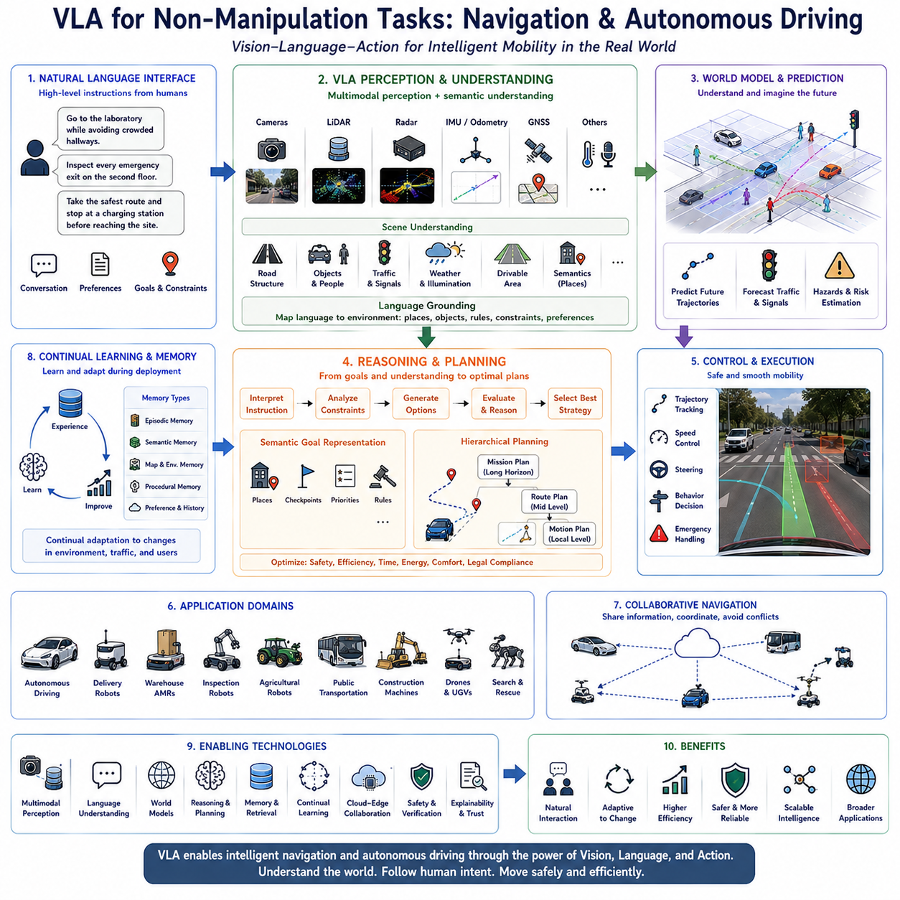{width="7.268055555555556in" height="7.268055555555556in"}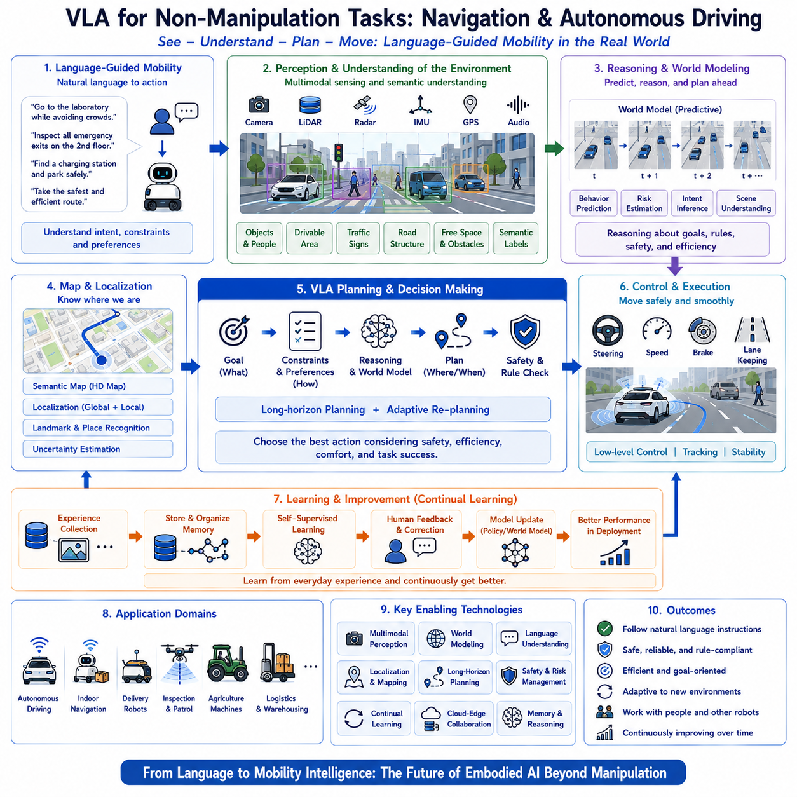{width="7.268055555555556in" height="7.268055555555556in"}

# 42_12_06 VLA for Non-Manipulation Tasks: Navigation and Autonomous Driving

Vision-Language-Action (VLA) systems have traditionally been associated with robotic manipulation tasks such as object grasping, assembly, pick-and-place operations, and household assistance. These applications emphasize dexterous interaction between robotic manipulators and physical objects under language guidance. However, the future of embodied artificial intelligence extends far beyond manipulation. A significant portion of real-world robotic intelligence is devoted to mobility, navigation, autonomous driving, exploration, inspection, logistics, surveillance, transportation, and collaborative movement through complex environments. Consequently, next-generation VLA systems are expected to become comprehensive mobility intelligence platforms capable of integrating perception, language understanding, reasoning, planning, and vehicle control for autonomous navigation across indoor, outdoor, structured, and unstructured environments. This evolution transforms VLA from manipulation-oriented intelligence into a universal embodied cognitive architecture supporting virtually every category of autonomous mobile system.

Navigation fundamentally differs from manipulation because decisions must continuously account for dynamic environmental changes over extended spatial and temporal scales. While manipulation often focuses on precise interactions within localized workspaces, navigation requires understanding large environments, predicting future traffic conditions, maintaining localization, avoiding obstacles, optimizing routes, and continuously adapting to changing surroundings. Future VLA systems therefore require significantly stronger world understanding, temporal reasoning, environmental memory, and predictive planning than those developed solely for manipulation benchmarks.

Language becomes an increasingly powerful interface for navigation-oriented robots. Human operators naturally express navigation objectives using high-level instructions such as "inspect every emergency exit on the second floor," "deliver these supplies to the laboratory while avoiding crowded hallways," "search the parking area for available charging stations," or "drive to the maintenance site using the safest available route." Rather than specifying explicit coordinates or predefined trajectories, language describes semantic goals, operational constraints, environmental preferences, and mission priorities. Future VLA systems translate these natural instructions into executable navigation strategies through integrated reasoning across language, perception, mapping, localization, and motion planning.

Semantic navigation represents one of the defining capabilities of navigation-oriented VLA systems. Traditional autonomous navigation relies heavily on metric maps containing geometric information regarding walls, corridors, obstacles, and free space. Future VLA architectures enrich these representations with semantic understanding that associates locations with functional meaning. Instead of navigating toward numerical coordinates, robots recognize concepts such as offices, conference rooms, loading docks, charging stations, storage areas, emergency exits, elevators, staircases, parking zones, hazardous regions, and collaborative workspaces. Such semantic understanding enables significantly more intuitive human-robot interaction while improving mission flexibility across unfamiliar environments.

Scene understanding becomes substantially more sophisticated when navigation is integrated with multimodal foundation models. Future VLA systems simultaneously interpret geometric structure, object identity, human activity, environmental affordances, traffic flow, weather conditions, road characteristics, and operational context using unified multimodal representations. Rather than identifying isolated obstacles, robots understand complete environmental situations involving moving pedestrians, interacting vehicles, construction zones, temporary barriers, changing terrain, and evolving mission objectives. Comprehensive situational awareness enables proactive navigation decisions instead of reactive obstacle avoidance alone.

Localization remains one of the fundamental challenges in autonomous navigation. Conventional localization algorithms estimate robot position using LiDAR, cameras, GNSS, IMUs, wheel odometry, or map matching independently. Future VLA systems increasingly combine these sensing modalities with semantic reasoning and language understanding. Robots recognize meaningful landmarks described by human instructions, associate observed scenes with previously learned environmental memories, and maintain robust localization despite sensor degradation or environmental changes. Language-guided localization further enables intuitive human assistance when autonomous positioning uncertainty becomes excessive.

World models significantly enhance navigation capability by allowing robots to predict future environmental evolution before selecting trajectories. Instead of planning only according to current observations, predictive VLA systems estimate pedestrian movement, vehicle trajectories, traffic congestion, environmental accessibility, weather influence, and dynamic obstacle behavior several seconds or minutes ahead. Candidate navigation strategies are mentally simulated inside learned world models before execution, allowing robots to choose routes optimizing safety, efficiency, energy consumption, and mission completion probability under uncertain operating conditions.

Long-horizon planning represents another essential characteristic of navigation-oriented embodied intelligence. Real missions frequently involve dozens of sequential destinations, resource constraints, charging requirements, collaborative interactions, inspection schedules, delivery priorities, and environmental uncertainties. Rather than repeatedly generating short local trajectories, future VLA systems construct hierarchical mission plans spanning extended operational periods while continuously adapting intermediate navigation decisions according to evolving environmental conditions. This capability closely resembles human route planning during complex travel or logistics operations.

Reasoning substantially strengthens navigation performance under ambiguous conditions. Human instructions often specify abstract objectives rather than explicit routes. Commands such as "avoid noisy areas," "take the safest route," "stay near the inspection targets," or "minimize pedestrian disturbance" require contextual interpretation rather than deterministic execution. Reasoning-enhanced VLA systems evaluate multiple navigation hypotheses, estimate expected outcomes, analyze environmental constraints, and balance competing objectives before selecting optimal movement strategies. Such cognitive planning enables significantly greater operational flexibility than purely reactive path planning algorithms.

Autonomous driving represents one of the most demanding application domains for navigation-oriented Vision-Language-Action systems. Road environments exhibit highly dynamic interactions among vehicles, pedestrians, cyclists, traffic infrastructure, weather conditions, and regulatory constraints. Future driving-oriented VLA architectures integrate multimodal perception, language understanding, traffic rule reasoning, predictive world models, long-horizon planning, and continuous environmental adaptation within unified cognitive systems. Rather than treating perception, prediction, planning, and control as isolated software modules, foundation models increasingly unify these capabilities through shared multimodal representations.

Language-guided autonomous driving introduces entirely new interaction paradigms between passengers and intelligent vehicles. Instead of selecting destinations through conventional interfaces, users naturally communicate intentions such as "find a scenic route," "avoid highways," "stop at an electric charging station before reaching the destination," "drive carefully because the road may be icy," or "prioritize fuel efficiency over travel time." Future VLA systems interpret these preferences while continuously integrating traffic conditions, environmental observations, energy management, and safety requirements into adaptive driving strategies.

Predictive perception becomes particularly valuable during autonomous driving because successful navigation depends on anticipating future events rather than reacting to current observations. World models estimate future pedestrian crossing behavior, vehicle lane changes, traffic signal transitions, road hazards, weather evolution, and infrastructure conditions. Continuous prediction enables smoother driving, earlier risk mitigation, reduced emergency braking, and improved passenger comfort while maintaining regulatory compliance and operational safety.

Collaborative navigation extends mobility intelligence beyond individual autonomous vehicles. Multiple robots, delivery platforms, warehouse vehicles, inspection systems, agricultural machines, autonomous trucks, drones, and public transportation systems increasingly coordinate through shared situational awareness and distributed planning. Collaborative VLA architectures exchange semantic information regarding traffic conditions, environmental hazards, resource availability, mission priorities, charging infrastructure, and operational constraints. Such distributed coordination significantly improves fleet efficiency while reducing congestion and redundant movement across large operational environments.

Indoor navigation presents different challenges from outdoor autonomous driving but benefits equally from VLA integration. Hospitals, factories, airports, warehouses, office buildings, shopping centers, laboratories, hotels, and educational campuses contain dynamic human activity, temporary obstacles, changing layouts, restricted areas, elevators, narrow corridors, and collaborative workspaces. Navigation-oriented VLA systems interpret natural language instructions while simultaneously understanding semantic building structure, operational workflows, and human behavioral patterns. Such contextual intelligence supports reliable long-term deployment in complex indoor environments where conventional mapping alone proves insufficient.

Off-road navigation further expands the applicability of Vision-Language-Action systems. Agricultural fields, forests, mines, construction sites, disaster zones, military operations, planetary exploration, and environmental monitoring involve highly unstructured terrain lacking conventional road infrastructure. Future VLA systems combine visual terrain analysis, language-guided mission planning, predictive world modeling, environmental reasoning, and adaptive mobility control to navigate safely across uncertain natural environments. Continuous adaptation to changing terrain conditions significantly enhances operational robustness under extreme deployment scenarios.

Multimodal perception forms the sensory foundation of navigation-oriented VLA architectures. Cameras provide semantic understanding, LiDAR captures precise geometry, radar operates under adverse weather, GNSS supports global positioning, IMUs estimate motion, wheel odometry measures local displacement, thermal imaging identifies invisible hazards, audio detects environmental events, and communication networks supply infrastructure information. Rather than processing these sensors independently, future foundation models construct unified multimodal representations enabling holistic environmental understanding supporting navigation, reasoning, and decision making simultaneously.

Memory plays a central role in intelligent navigation because robots frequently revisit previously explored environments. Persistent environmental memory stores semantic maps, operational history, traffic patterns, charging station availability, user preferences, frequently encountered hazards, and historical mission outcomes. Instead of repeatedly exploring familiar locations, robots retrieve accumulated knowledge to improve planning efficiency while continuously refining environmental understanding through new deployment experiences. Such lifelong navigation memory significantly improves long-term operational performance.

Continual learning naturally complements navigation because environmental conditions continuously evolve after deployment. Construction modifies road layouts, furniture rearranges indoor spaces, seasonal vegetation changes agricultural environments, weather alters terrain accessibility, and human behavior evolves over time. Navigation-oriented VLA systems therefore continuously update semantic maps, world models, traffic predictions, localization strategies, and mobility policies using newly acquired operational experience. Continuous adaptation enables sustained performance despite dynamic environmental evolution throughout years of autonomous deployment.

Safety remains the highest priority throughout autonomous navigation and driving applications. Future VLA systems integrate uncertainty estimation, collision prediction, risk-aware planning, regulatory reasoning, ethical decision making, emergency response strategies, redundancy management, and explainable decision processes into unified safety architectures. Instead of optimizing only navigation efficiency, robots explicitly balance mission objectives against operational risk while maintaining transparent reasoning supporting certification and regulatory compliance.

Cloud-edge collaborative intelligence provides the computational infrastructure necessary for advanced navigation. Edge computing performs real-time perception, localization, obstacle avoidance, and motion control directly onboard autonomous platforms, while cloud infrastructure supports large-scale map construction, fleet coordination, foundation model refinement, traffic prediction, long-term memory management, and collaborative knowledge sharing. Hybrid architectures therefore combine low-latency responsiveness with continuously improving large-scale cognitive capability.

Evaluation methodologies for navigation-oriented VLA systems extend well beyond conventional path-following accuracy. Future benchmarks measure semantic navigation capability, language instruction following, localization robustness, long-horizon planning quality, traffic rule compliance, prediction accuracy, collaborative coordination, energy efficiency, passenger comfort, environmental adaptability, continual learning performance, and safe operation under diverse real-world conditions. Comprehensive evaluation ensures that future embodied intelligence reflects practical deployment requirements rather than isolated laboratory metrics.

Industrial applications illustrate the broad impact of navigation-focused Vision-Language-Action systems. Autonomous logistics vehicles optimize warehouse transportation through semantic route planning. Inspection robots navigate industrial facilities while understanding maintenance priorities expressed in natural language. Agricultural robots coordinate field operations according to crop conditions and weather forecasts. Autonomous buses communicate naturally with passengers while adapting routes dynamically. Delivery robots interpret customer instructions regarding preferred drop-off locations. Mining vehicles optimize extraction routes under continuously changing terrain conditions. Search-and-rescue robots navigate hazardous environments while collaborating with human emergency responders through language-guided mission coordination.

Ultimately, Vision-Language-Action systems for navigation and autonomous driving represent a major expansion of embodied artificial intelligence beyond robotic manipulation. By integrating multimodal perception, semantic navigation, language understanding, predictive world models, hierarchical planning, continual learning, collaborative intelligence, autonomous driving, environmental memory, reasoning, cloud-edge computing, and safety-aware decision making into unified cognitive architectures, future VLA systems will enable intelligent mobility across virtually every physical domain. These technologies will transform autonomous robots, vehicles, drones, industrial platforms, and public transportation systems into adaptive cognitive agents capable of understanding complex environments, communicating naturally with humans, continuously improving through experience, and navigating safely through the dynamic physical world.

비전-언어-행동(Vision-Language-Action, VLA) 시스템은 지금까지 주로 물체를 집고 옮기거나 조립하는 **조작(Manipulation)** 작업 중심으로 발전해 왔다. 그러나 미래의 구현형 인공지능(Embodied AI)은 조작을 넘어 **이동성(Mobility)**과 **자율주행(Autonomous Driving)**을 포함하는 범용 지능으로 확장될 것으로 예상된다. 실제 산업 환경에서는 물류, 순찰, 검사, 운송, 탐사, 감시, 서비스 로봇 등 이동 기반 작업이 훨씬 큰 비중을 차지한다. 따라서 차세대 VLA는 조작 중심 AI가 아니라 이동과 자율주행까지 통합하는 범용 이동 지능(Universal Mobility Intelligence)으로 발전하게 된다.

자율주행(Navigation)은 조작과 본질적으로 다른 특성을 가진다. 조작은 제한된 작업 공간에서 정밀한 제어를 수행하는 것이지만, 자율주행은 넓은 공간에서 지속적으로 변화하는 환경을 이해하고 경로를 계획해야 한다. 따라서 미래의 VLA는 대규모 환경 이해(Large-Scale Environment Understanding), 시간적 추론(Temporal Reasoning), 환경 메모리(Environmental Memory), 미래 예측(Predictive Planning) 능력을 더욱 강화해야 한다. 이러한 능력이 장거리 이동과 장시간 임무 수행의 핵심 기반이 된다.

자연어(Language)는 자율주행 로봇과 사람을 연결하는 핵심 인터페이스가 된다. 사용자는 "2층의 모든 비상구를 점검해라", "혼잡한 복도를 피해 실험실로 이동해라", "가장 안전한 경로로 유지보수 현장에 가라"와 같은 고수준 명령을 내리게 된다. 미래의 VLA는 이러한 자연어를 단순한 목적지가 아니라 작업 목표(Goal), 환경 제약(Environment Constraint), 우선순위(Priority), 안전 요구사항(Safety Requirement)까지 포함한 의미 정보로 이해하고 실제 이동 계획으로 변환한다.

의미 기반 자율주행(Semantic Navigation)은 차세대 VLA의 핵심 기술이다. 기존의 자율주행은 좌표와 지도(Map)를 기반으로 이동했지만, 미래의 VLA는 사무실(Office), 회의실(Conference Room), 충전소(Charging Station), 창고(Storage), 비상구(Emergency Exit), 엘리베이터(Elevator), 위험 구역(Hazard Area)과 같은 의미(Semantic Meaning)를 이해하면서 이동한다. 이를 통해 사람은 좌표 대신 자연어로 로봇을 제어할 수 있으며, 로봇도 새로운 환경에서 보다 유연하게 작업을 수행할 수 있다.

환경 이해(Scene Understanding)는 훨씬 더 복합적으로 발전한다. 미래의 VLA는 단순히 장애물을 인식하는 것이 아니라 도로 구조(Road Structure), 사람의 움직임(Human Activity), 차량 흐름(Traffic Flow), 날씨(Weather), 지형(Terrain), 작업 상황(Operational Context)을 동시에 이해한다. 이러한 종합적인 상황 인식(Situational Awareness)은 단순한 장애물 회피를 넘어 미래 상황을 고려한 능동적인 이동(Proactive Navigation)을 가능하게 한다.

위치 추정(Localization)은 자율주행의 핵심 요소이다. 기존에는 라이다(LiDAR), 카메라(Camera), 위성항법(GNSS), 관성측정장치(IMU), 휠 오도메트리(Wheel Odometry)를 개별적으로 사용하였다. 미래의 VLA는 이러한 센서 정보와 함께 의미 기반 추론(Semantic Reasoning), 자연어(Language), 환경 기억(Environmental Memory)을 함께 활용한다. 이를 통해 센서 성능이 저하되거나 환경이 변화해도 보다 안정적인 위치 추정이 가능하며, 사람이 설명한 랜드마크(Landmark)를 이용한 위치 인식도 가능해진다.

월드 모델(World Model)은 자율주행 능력을 크게 향상시킨다. 현재의 환경만 보고 이동하는 것이 아니라 보행자의 이동(Pedestrian Motion), 차량 흐름(Vehicle Trajectory), 교통 혼잡(Traffic Congestion), 날씨 변화(Weather Change), 장애물 이동(Dynamic Obstacle)을 미리 예측한다. 여러 개의 경로를 내부적으로 시뮬레이션(Mental Simulation)한 후 가장 안전하고 효율적인 이동 계획을 선택할 수 있기 때문에 실제 주행의 안정성과 효율성이 크게 향상된다.

장기 계획(Long-Horizon Planning)은 미래 이동형 VLA의 핵심 능력이다. 실제 업무는 여러 개의 목적지(Destination), 충전 계획(Charging Schedule), 자원 관리(Resource Management), 검사 일정(Inspection Schedule), 배송 우선순위(Delivery Priority)를 동시에 고려해야 한다. 미래의 VLA는 계층적 계획(Hierarchical Planning)을 통해 장기간의 임무를 전체적으로 계획하고, 환경 변화에 따라 중간 계획을 지속적으로 수정하면서 작업을 수행하게 된다.

추론(Reasoning)은 모호한 자율주행 명령을 이해하는 데 중요한 역할을 한다. 예를 들어 "사람이 많은 곳을 피해 이동해라", "가장 안전한 길을 선택해라", "검사 대상 근처를 우선적으로 순찰해라"와 같은 명령은 명확한 좌표가 아니라 상황(Context)을 해석해야 한다. 추론 기반 VLA는 여러 이동 경로를 비교하고 위험도를 분석하며 효율성과 안전성을 함께 고려하여 최적의 이동 전략을 선택한다.

자율주행 자동차(Autonomous Driving)는 VLA가 적용될 가장 중요한 분야 가운데 하나이다. 실제 도로는 차량(Vehicle), 보행자(Pedestrian), 자전거(Cyclist), 신호등(Traffic Signal), 도로 규칙(Traffic Rule), 날씨(Weather)가 끊임없이 변화하는 매우 복잡한 환경이다. 미래의 VLA는 멀티모달 인식(Multimodal Perception), 자연어 이해(Language Understanding), 교통 규칙 추론(Traffic Rule Reasoning), 월드 모델(World Model), 장기 계획(Long-Horizon Planning)을 하나의 통합된 인지 시스템으로 결합하여 보다 안전한 자율주행을 구현하게 된다.

자연어 기반 자율주행(Language-Guided Driving)은 새로운 사용자 경험을 제공한다. 사용자는 "경치가 좋은 길로 가라", "고속도로를 피하라", "도착 전에 충전소를 들러라", "연비를 우선으로 운전해라"와 같은 명령을 자연스럽게 전달할 수 있다. 미래의 VLA는 이러한 요구를 교통 상황(Traffic Condition), 배터리 상태(Battery Status), 안전성(Safety), 주행 효율(Efficiency)과 함께 고려하여 최적의 운전 전략을 생성한다.

예측 기반 인식(Predictive Perception)은 자율주행에서 매우 중요한 역할을 한다. 미래의 VLA는 보행자의 이동, 차량의 차선 변경(Lane Change), 신호등 변화(Traffic Signal Transition), 도로 위험(Road Hazard), 날씨 변화를 지속적으로 예측한다. 이러한 예측을 통해 급제동(Emergency Braking)을 줄이고 보다 부드러운 주행과 높은 승차감을 제공하면서도 안전성을 유지할 수 있다.

협업 자율주행(Collaborative Navigation)은 여러 대의 이동 로봇과 자율주행 차량이 함께 작업하는 구조이다. 물류 로봇(Logistics Robot), 검사 로봇(Inspection Robot), 농업 기계(Agricultural Machine), 드론(Drone), 자율주행 차량이 서로 교통 정보(Traffic Information), 위험 요소(Hazard), 자원(Resource), 충전 상태(Charging Infrastructure), 작업 우선순위(Mission Priority)를 공유하면서 협업한다. 이를 통해 전체 시스템의 이동 효율과 운영 생산성이 크게 향상된다.

실내 자율주행(Indoor Navigation) 역시 VLA 기술의 중요한 응용 분야이다. 병원(Hospital), 공장(Factory), 공항(Airport), 물류센터(Warehouse), 연구소(Laboratory), 호텔(Hotel), 쇼핑몰(Shopping Center)은 사람의 이동이 많고 구조가 자주 바뀌는 환경이다. 미래의 VLA는 자연어 명령을 이해하면서 건물 구조(Building Structure), 업무 흐름(Workflow), 사람의 행동(Human Behavior)을 함께 고려하여 안정적으로 이동할 수 있다.

비정형 환경(Off-Road Navigation)은 또 다른 중요한 분야이다. 농업(Agriculture), 산림(Forest), 광산(Mining), 건설 현장(Construction Site), 재난 지역(Disaster Zone), 우주 탐사(Planetary Exploration)와 같은 환경은 일반 도로가 존재하지 않는다. 미래의 VLA는 지형(Terrain), 환경(Environment), 기상 정보(Weather), 작업 목표(Mission Goal)를 종합적으로 분석하여 변화하는 자연환경에서도 안정적으로 이동할 수 있는 적응형 자율주행을 수행하게 된다.

멀티모달 인식(Multimodal Perception)은 이동형 VLA의 핵심 기반이다. 카메라는 의미 정보를 제공하고, 라이다는 정확한 거리 정보를 측정하며, 레이더(Radar)는 악천후에서도 동작하고, 위성항법(GNSS)은 전역 위치를 제공하며, IMU는 자세를 추정하고, 열화상(Thermal Imaging)은 보이지 않는 위험 요소를 탐지한다. 미래의 VLA는 이러한 모든 센서를 하나의 통합된 표현 공간(Unified Representation)으로 결합하여 환경을 종합적으로 이해하게 된다.

메모리(Memory)는 지능적인 이동에서 매우 중요한 요소이다. 로봇은 자주 방문하는 장소(Frequent Location), 교통 흐름(Traffic Pattern), 충전소 위치(Charging Station), 위험 구역(Hazard Area), 사용자 선호(User Preference), 과거 임무(Mission History)를 지속적으로 저장한다. 이후 동일한 장소를 다시 방문할 때 이러한 기억을 활용하여 더욱 효율적인 이동 계획을 수립하며, 지속적인 경험 축적을 통해 환경 이해 능력도 함께 향상된다.

지속학습(Continual Learning)은 자율주행에서도 필수적인 기술이다. 도로 구조가 바뀌고, 건물 내부가 변경되며, 계절 변화로 환경이 달라지고, 사람의 이동 패턴도 계속 변화한다. 미래의 VLA는 이러한 변화를 지속적으로 학습하여 의미 지도(Semantic Map), 월드 모델(World Model), 교통 예측(Traffic Prediction), 위치 추정(Localization), 이동 정책(Navigation Policy)을 계속 개선하게 된다. 이러한 지속적인 적응은 장기간 안정적인 자율 운영을 가능하게 한다.

안전성(Safety)은 이동형 VLA에서 가장 중요한 요소이다. 미래의 시스템은 불확실성 추정(Uncertainty Estimation), 충돌 예측(Collision Prediction), 위험 기반 계획(Risk-Aware Planning), 교통 규칙 준수(Regulatory Compliance), 윤리적 의사결정(Ethical Decision Making), 비상 대응(Emergency Response), 설명 가능한 판단(Explainable Decision Making)을 모두 통합하여 안전을 최우선으로 고려한다.

클라우드-엣지 협업(Cloud-Edge Collaboration)은 이동형 VLA를 위한 핵심 인프라이다. 엣지 컴퓨팅(Edge Computing)은 실시간 인식, 위치 추정, 장애물 회피, 제어를 수행하고, 클라우드는 대규모 지도(Map), 교통 예측(Traffic Prediction), 차량군(Fleet) 관리, 장기 메모리(Long-Term Memory), 파운데이션 모델(Foundation Model)을 관리한다. 이러한 구조는 실시간성과 대규모 지능을 동시에 확보할 수 있도록 한다.

평가 체계(Evaluation Framework)도 단순한 경로 추종(Path Following)을 넘어 발전하게 된다. 미래에는 의미 기반 자율주행(Semantic Navigation), 자연어 명령 수행(Language Instruction Following), 위치 추정 강건성(Localization Robustness), 장기 계획(Long-Horizon Planning), 교통 규칙 준수(Traffic Rule Compliance), 예측 정확도(Prediction Accuracy), 협업 성능(Collaborative Coordination), 에너지 효율(Energy Efficiency), 승차감(Passenger Comfort), 환경 적응성(Environment Adaptability), 지속학습 성능(Continual Learning), 안전성(Safety) 등을 종합적으로 평가하는 새로운 벤치마크가 표준이 될 것으로 예상된다.

산업 현장에서는 이동형 VLA의 활용 범위가 매우 넓다. 물류 로봇은 의미 기반 경로 계획을 수행하고, 검사 로봇은 자연어로 전달된 검사 우선순위를 이해하며, 농업 로봇은 작물 상태와 날씨를 고려하여 이동하고, 자율주행 버스는 승객과 자연스럽게 대화하며, 배송 로봇은 고객이 지정한 위치를 이해하여 물품을 전달한다. 광산과 재난 지역에서는 변화하는 지형을 분석하며 안전하게 이동하는 자율 시스템이 구축될 것으로 기대된다.

궁극적으로 **비조작 작업을 위한 VLA(Vision-Language-Action for Non-Manipulation Tasks)**는 조작 중심 로봇을 넘어 **자율주행(Navigation)**과 **자율운전(Autonomous Driving)**을 포함하는 범용 이동 지능으로 발전하게 된다. 미래의 VLA는 **멀티모달 인식(Multimodal Perception)**, **의미 기반 자율주행(Semantic Navigation)**, **자연어 이해(Language Understanding)**, **월드 모델(World Model)**, **계층적 계획(Hierarchical Planning)**, **지속학습(Continual Learning)**, **협업 지능(Collaborative Intelligence)**, **환경 메모리(Environmental Memory)**, **추론(Reasoning)**, **클라우드-엣지 컴퓨팅(Cloud-Edge Computing)**, **안전 기반 의사결정(Safety-Aware Decision Making)**을 하나의 통합된 인지 시스템으로 결합하여, 다양한 이동체와 자율주행 플랫폼이 실제 환경에서 사람과 자연스럽게 협력하는 차세대 **물리 AI(Physical AI)**의 핵심 기술로 자리매김하게 될 것이다.

##  

## 12.7 Human-Robot Collaborative Architectures

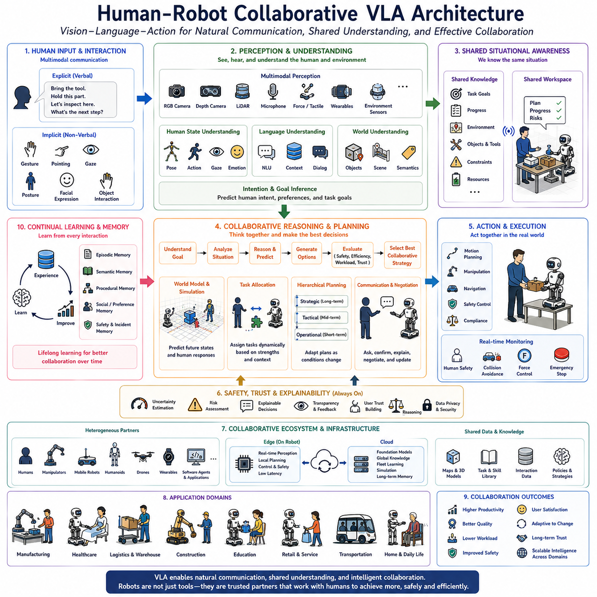{width="7.268055555555556in" height="7.268055555555556in"}

# 42_12_07 Human-Robot Collaborative VLA Architecture

Human-Robot Collaborative Vision-Language-Action (VLA) Architecture represents one of the most significant future directions in embodied artificial intelligence, where autonomous robots are designed not merely to execute predefined tasks independently but to function as intelligent partners capable of understanding, communicating, reasoning, and collaborating naturally with human users. While conventional industrial robots traditionally operate within isolated workspaces separated from people for safety reasons, the next generation of Physical AI systems is expected to share environments with workers, patients, customers, students, engineers, and family members. Consequently, future VLA architectures must integrate multimodal perception, language understanding, cognitive reasoning, intention modeling, adaptive planning, safety mechanisms, and continuous interaction into a unified collaborative intelligence framework. The objective is no longer simple automation but effective human-robot teamwork in complex, dynamic, and uncertain real-world environments.

Human-robot collaboration fundamentally differs from autonomous task execution because both humans and robots continuously influence each other\'s behavior throughout task performance. Human actions modify environmental conditions, introduce new objectives, create unexpected constraints, and communicate implicit intentions that may not be explicitly verbalized. Likewise, robot actions affect human decision making, workload, situational awareness, and operational efficiency. Future collaborative VLA systems therefore require bidirectional interaction models capable of continuously interpreting human behavior while simultaneously adapting robotic actions to evolving collaborative contexts. Rather than treating humans as external supervisors, collaborative architectures increasingly consider people as integral components of the overall cognitive system.

Vision-Language-Action provides an ideal foundation for human-centered collaboration because it naturally integrates visual understanding, linguistic communication, and physical behavior. Vision enables robots to observe human posture, gestures, facial expressions, gaze direction, object manipulation, and environmental context. Language provides a rich communication interface for exchanging instructions, questions, explanations, preferences, warnings, and collaborative planning. Action generation converts shared understanding into coordinated physical behavior. The combination of these three capabilities enables robots to participate in collaborative workflows using communication methods that closely resemble natural human interaction rather than specialized programming interfaces.

Human intention understanding represents one of the central capabilities required for collaborative VLA architectures. Human instructions are frequently incomplete, ambiguous, or context dependent because people naturally assume shared understanding. Commands such as "help me organize these materials," "hold this while I assemble it," "bring the appropriate tools," or "prepare everything for inspection" require robots to infer implicit objectives, recognize environmental context, estimate human preferences, and predict future task evolution. Future VLA systems therefore combine multimodal perception, contextual reasoning, historical interaction memory, and world models to estimate human intentions beyond literal language interpretation.

Natural language communication becomes substantially more sophisticated within collaborative environments. Rather than receiving isolated commands, future robots engage in continuous dialogue throughout task execution. They ask clarification questions when instructions are ambiguous, explain reasoning behind selected actions, provide progress updates, report uncertainty, request assistance, negotiate task allocation, and confirm safety-critical decisions before execution. Such conversational interaction significantly improves transparency, user trust, and operational efficiency while reducing misunderstandings during collaborative missions.

Multimodal perception enables robots to interpret nonverbal communication naturally occurring during teamwork. Humans communicate intentions not only through spoken language but also through gestures, pointing, gaze direction, body posture, facial expressions, movement trajectories, hand motions, and object interaction patterns. Future collaborative VLA architectures integrate RGB cameras, depth sensing, skeletal tracking, eye gaze estimation, tactile sensing, audio processing, force sensing, wearable devices, physiological monitoring, and environmental context into unified multimodal representations. These complementary sensing modalities enable comprehensive understanding of human activity beyond verbal instructions alone.

Shared situational awareness forms another essential component of collaborative intelligence. Humans and robots must maintain consistent understanding of task progress, environmental conditions, object locations, safety constraints, resource availability, and mission objectives throughout joint operation. Collaborative VLA systems continuously synchronize environmental knowledge through multimodal perception, semantic mapping, language interaction, and shared memory. Rather than maintaining isolated internal representations, both human operators and robotic teammates contribute to an evolving shared cognitive workspace supporting coordinated decision making.

Reasoning plays an increasingly important role in collaborative architectures because human requests frequently involve conflicting objectives, uncertain conditions, or incomplete information. Collaborative reasoning enables robots to evaluate alternative strategies, estimate consequences, identify constraints, prioritize competing goals, and recommend optimal collaborative actions before execution. Rather than simply obeying commands, reasoning-enhanced VLA systems actively participate in problem solving by proposing safer, more efficient, or more practical alternatives while respecting human authority and operational objectives.

Task allocation within collaborative teams becomes dynamic rather than predetermined. Future VLA systems continuously evaluate human workload, robot capability, environmental complexity, resource availability, and operational efficiency before assigning responsibilities. Tasks requiring dexterity, creativity, ethical judgment, or contextual understanding may remain under human control, while repetitive, hazardous, physically demanding, or computationally intensive activities are delegated to robotic partners. Dynamic collaboration therefore maximizes collective team performance by leveraging complementary strengths of both humans and autonomous systems.

Adaptive planning further strengthens collaborative operation under changing conditions. Human priorities may shift unexpectedly during task execution due to environmental changes, operational emergencies, newly discovered information, or evolving mission objectives. Future collaborative VLA systems continuously revise plans according to updated human instructions while preserving previously completed work and minimizing unnecessary interruption. Hierarchical planning architectures support rapid adaptation across strategic, tactical, and operational decision levels throughout long-duration collaborative missions.

World models significantly improve collaborative decision making by allowing robots to mentally simulate both environmental evolution and potential human responses before selecting actions. Candidate collaborative strategies are evaluated according to expected task success, human workload, safety implications, communication requirements, resource utilization, and operational efficiency. Predictive reasoning enables proactive assistance rather than reactive response, allowing robots to prepare tools, reposition equipment, anticipate requested materials, or avoid interfering with ongoing human activity before explicit instructions become necessary.

Human preference modeling becomes increasingly valuable during long-term collaboration. Different users often exhibit distinct communication styles, preferred workflows, risk tolerance, organizational habits, interaction frequency, physical capabilities, and assistance preferences. Future VLA systems accumulate personalized knowledge through continual interaction, enabling adaptive behavior that aligns with individual working styles without sacrificing general operational capability. Personalized collaboration substantially improves user satisfaction, productivity, and long-term acceptance of autonomous robotic assistants.

Trust represents one of the most important requirements for successful human-robot collaboration. Users must understand why robots behave in particular ways, predict future robotic actions, and maintain confidence in autonomous decision making under uncertain conditions. Explainable VLA architectures therefore communicate reasoning processes, anticipated outcomes, identified risks, confidence estimates, and planning assumptions using natural language and intuitive visual interfaces. Transparent decision making significantly improves user trust while supporting collaborative supervision and regulatory validation.

Safety remains the highest priority throughout collaborative operation. Unlike isolated industrial automation, collaborative robots operate in close physical proximity to people, requiring continuous monitoring of human location, posture, movement intention, environmental hazards, and mechanical interaction forces. Future collaborative VLA architectures integrate real-time human detection, collision prediction, force limitation, emergency intervention, adaptive speed control, uncertainty estimation, and safety-aware reasoning into every stage of perception, planning, and execution. Rather than functioning as independent safety modules, these mechanisms become deeply integrated within the overall cognitive architecture.

Continual learning naturally enhances collaborative intelligence because every interaction provides opportunities to improve future teamwork. Human corrections, demonstrations, verbal explanations, approval feedback, workflow adaptations, and operational experience gradually refine language understanding, intention prediction, task allocation, planning strategies, and personalized assistance. Future VLA systems therefore continuously improve collaborative performance throughout deployment while preserving previously acquired knowledge using lifelong learning mechanisms.

Memory organization supports effective long-term collaboration by storing procedural knowledge, environmental layouts, object histories, user preferences, previous conversations, completed tasks, collaborative strategies, and safety incidents. Episodic memory records individual interaction experiences, semantic memory captures generalized collaborative knowledge, procedural memory maintains learned teamwork skills, while social memory models relationships among users, roles, preferences, and communication patterns. These complementary memory systems enable increasingly natural long-term partnerships between humans and autonomous robots.

Cloud-edge collaboration provides scalable computational infrastructure supporting collaborative VLA architectures. Edge computing performs real-time perception, language interaction, manipulation control, safety monitoring, and local planning directly onboard robotic platforms. Cloud infrastructure supports foundation model refinement, shared knowledge management, long-term memory, collaborative fleet learning, simulation, and computationally intensive reasoning. Hybrid cloud-edge architectures therefore balance low-latency responsiveness with continuously improving large-scale intelligence while preserving operational reliability.

Collaborative VLA architectures are expected to support heterogeneous robotic ecosystems involving mobile robots, manipulators, humanoids, autonomous vehicles, drones, wearable devices, environmental sensors, intelligent software agents, and cloud services operating alongside human teams. Shared semantic representations, multimodal communication protocols, distributed reasoning, collaborative planning, and synchronized world models enable these diverse systems to function as unified cognitive partners rather than isolated automation components. Such heterogeneous integration substantially expands operational capability across industrial, medical, commercial, educational, and public service environments.

Evaluation methodologies for collaborative embodied intelligence extend beyond traditional task completion metrics. Future benchmarks assess human intention understanding, communication quality, shared situational awareness, collaborative efficiency, adaptive planning, trust development, explanation quality, safety performance, workload reduction, user satisfaction, personalization, recovery from misunderstandings, and long-term teamwork effectiveness. Human-centered evaluation therefore becomes equally important as technical performance when assessing future collaborative VLA systems.

Industrial applications illustrate the broad potential of collaborative architectures. Manufacturing workers collaborate with robotic assistants during assembly and inspection. Healthcare professionals coordinate with service robots for patient care, medication delivery, rehabilitation, and clinical logistics. Warehouse employees work alongside autonomous logistics platforms handling transportation and inventory organization. Construction teams coordinate robotic equipment for material handling and site inspection. Educational environments employ collaborative robots as teaching assistants. Domestic robots support elderly care, household management, and personalized assistance through continuous interaction with family members. Across each domain, robots function not as replacements for human workers but as intelligent teammates enhancing safety, productivity, and quality of life.

Future research is expected to integrate multimodal perception, language understanding, intention modeling, world models, reasoning, continual learning, personalized memory, explainability, collaborative planning, cloud-edge intelligence, and foundation models into unified Human-Robot Collaborative VLA Architectures. Rather than developing isolated perception, communication, planning, and control modules independently, future embodied intelligence will emerge from tightly integrated cognitive systems capable of understanding human goals, adapting to changing environments, learning from continuous interaction, and participating naturally in complex collaborative workflows.

Ultimately, Human-Robot Collaborative Vision-Language-Action Architecture represents one of the defining directions in the evolution of Physical AI. By combining natural communication, multimodal perception, shared situational awareness, collaborative reasoning, adaptive planning, personalized learning, predictive world models, lifelong memory, safety-aware decision making, explainable intelligence, and cloud-edge collaboration into unified cognitive architectures, future VLA systems will transform robots from autonomous tools into trusted collaborative partners. These intelligent systems will work alongside people across manufacturing, healthcare, logistics, education, transportation, public infrastructure, and domestic environments, enabling highly productive, safe, adaptive, and human-centered collaboration that significantly expands the capabilities of both humans and machines.

인간-로봇 협업 비전-언어-행동(Human-Robot Collaborative Vision-Language-Action, VLA) 아키텍처는 구현형 인공지능(Embodied AI)의 가장 중요한 발전 방향 가운데 하나이다. 미래의 로봇은 단순히 정해진 작업을 수행하는 자동화 장비가 아니라 사람과 함께 이해하고, 소통하며, 추론하고, 협력하는 지능형 파트너(Intelligent Partner)로 발전하게 된다. 기존 산업용 로봇은 안전을 위해 사람과 분리된 공간에서 동작했지만, 앞으로의 물리 AI(Physical AI)는 작업자, 환자, 고객, 학생, 엔지니어, 가족과 동일한 공간에서 함께 작업하게 된다. 따라서 차세대 VLA는 멀티모달 인식(Multimodal Perception), 언어 이해(Language Understanding), 추론(Reasoning), 의도 이해(Intention Modeling), 적응형 계획(Adaptive Planning), 안전(Safety), 지속적 상호작용(Continuous Interaction)을 하나의 통합된 협업 구조로 결합해야 한다.

인간-로봇 협업(Human-Robot Collaboration)은 단순한 자율 작업과 근본적으로 다르다. 사람과 로봇은 작업 과정에서 서로의 행동에 지속적으로 영향을 미친다. 사람은 새로운 목표를 제시하고 환경을 변화시키며 암묵적인 의도(Implicit Intention)를 표현한다. 반대로 로봇의 행동은 사람의 의사결정, 작업 부하(Workload), 상황 인식(Situational Awareness), 생산성에도 영향을 준다. 미래의 협업 VLA는 이러한 양방향 상호작용(Bidirectional Interaction)을 지속적으로 이해하고, 사람을 단순한 감독자가 아니라 전체 인지 시스템(Cognitive System)의 구성원으로 인식하는 구조를 갖추게 된다.

비전-언어-행동(Vision-Language-Action)은 사람 중심 협업을 구현하기에 가장 적합한 구조이다. 비전(Vision)은 사람의 자세(Posture), 제스처(Gesture), 얼굴 표정(Facial Expression), 시선(Gaze), 물체 조작(Object Manipulation), 주변 환경(Context)을 이해하게 해준다. 언어(Language)는 작업 지시, 질문, 설명, 선호도, 경고, 협업 계획을 전달하는 핵심 인터페이스가 되며, 행동(Action)은 이러한 공동 이해를 실제 물리적인 협업으로 연결한다. 이 세 요소가 결합되면 사람과 로봇은 별도의 프로그래밍 없이도 자연스러운 방식으로 함께 작업할 수 있게 된다.

사람의 의도 이해(Human Intention Understanding)는 협업 VLA에서 가장 중요한 기능 가운데 하나이다. 사람은 "이것들을 정리해줘", "조립하는 동안 이것을 잡아줘", "필요한 공구를 가져와", "검사를 준비해"처럼 세부 절차를 모두 설명하지 않는 경우가 많다. 미래의 VLA는 이러한 명령을 그대로 해석하는 것이 아니라 환경(Context), 과거 경험(Interaction History), 사람의 선호(User Preference), 월드 모델(World Model)을 함께 활용하여 실제 의도를 추론하게 된다. 이를 통해 더욱 자연스럽고 효율적인 협업이 가능해진다.

자연어 기반 상호작용(Natural Language Communication)은 더욱 발전하게 된다. 미래의 로봇은 단순히 명령을 수행하는 것이 아니라 작업 중에도 지속적으로 대화를 이어간다. 명령이 모호하면 질문을 하고, 선택한 행동의 이유를 설명하며, 작업 진행 상황을 보고하고, 불확실성을 알리고, 도움이 필요하면 요청하며, 안전과 관련된 중요한 결정은 사람과 확인한 후 실행한다. 이러한 지속적인 대화는 신뢰성과 작업 효율을 크게 향상시키는 핵심 요소가 된다.

멀티모달 인식(Multimodal Perception)은 사람의 비언어적 의사소통까지 이해하도록 발전한다. 사람은 음성뿐 아니라 손짓(Gesture), 손가락으로 가리키기(Pointing), 시선(Gaze), 몸의 자세(Body Posture), 얼굴 표정(Facial Expression), 이동 방향(Movement Trajectory), 손의 움직임(Hand Motion) 등을 통해 자신의 의도를 표현한다. 미래의 협업 VLA는 RGB 카메라, 깊이 센서(Depth Sensor), 골격 추적(Skeletal Tracking), 시선 추정(Eye Gaze Estimation), 촉각(Tactile), 음성(Audio), 힘 센서(Force Sensor), 웨어러블(Wearable Device), 생체 신호(Physiological Monitoring)를 통합하여 사람의 상태를 종합적으로 이해하게 된다.

공유 상황 인식(Shared Situational Awareness)은 사람과 로봇이 동일한 환경 이해를 유지하는 핵심 기술이다. 작업 진행(Task Progress), 환경 상태(Environment), 물체 위치(Object Location), 안전 제약(Safety Constraint), 자원 상태(Resource Availability), 작업 목표(Mission Goal)를 사람과 로봇이 함께 공유해야 협업이 원활하게 이루어진다. 미래의 VLA는 멀티모달 인식, 의미 지도(Semantic Map), 자연어 대화(Language Interaction), 공유 메모리(Shared Memory)를 통해 하나의 공동 작업 공간(Shared Cognitive Workspace)을 구축하게 된다.

추론(Reasoning)은 협업 상황에서 더욱 중요한 역할을 한다. 사람의 요청은 종종 불완전하거나 상충되는 목표를 포함한다. 협업 VLA는 여러 전략을 비교하고, 예상 결과를 분석하며, 제약 조건을 확인하고, 가장 효율적이고 안전한 방법을 제안한다. 단순히 사람의 명령을 수행하는 것이 아니라 더 나은 해결책을 제시하는 능동적인 협력자(Proactive Partner)로 발전하게 된다.

작업 할당(Task Allocation)은 고정된 방식이 아니라 동적으로 이루어진다. 미래의 시스템은 사람의 작업 부하(Human Workload), 로봇의 능력(Robot Capability), 환경 복잡도(Environment Complexity), 자원(Resource), 전체 효율(Efficiency)을 지속적으로 분석하여 작업을 분배한다. 창의성(Creativity), 윤리적 판단(Ethical Judgment), 복잡한 상황 이해(Contextual Understanding)가 필요한 작업은 사람이 수행하고, 반복적이고 위험하며 계산량이 많은 작업은 로봇이 담당하는 형태로 협업이 이루어진다.

적응형 계획(Adaptive Planning)은 변화하는 작업 환경에서 필수적인 기술이다. 작업 도중 목표가 변경되거나 새로운 정보가 추가되거나 긴급 상황(Emergency)이 발생하면 미래의 VLA는 기존 계획을 실시간으로 수정한다. 계층적 계획(Hierarchical Planning)을 기반으로 전략 수준, 전술 수준, 실행 수준을 동시에 조정하여 장시간 작업에서도 높은 유연성을 유지하게 된다.

월드 모델(World Model)은 협업 의사결정을 크게 향상시킨다. 로봇은 사람의 행동과 환경 변화를 미리 예측하면서 여러 협업 전략을 내부적으로 시뮬레이션(Mental Simulation)한다. 작업 성공 가능성(Task Success), 사람의 작업 부하(Human Workload), 안전성(Safety), 자원 사용(Resource Utilization), 효율성을 비교한 뒤 가장 적합한 전략을 선택한다. 이를 통해 사람이 요청하기 전에 필요한 도구를 준비하거나 작업을 미리 지원하는 선제적 협업(Proactive Assistance)이 가능해진다.

사람 선호 모델링(Human Preference Modeling)은 장기 협업에서 중요한 요소이다. 사용자마다 대화 방식(Communication Style), 작업 습관(Workflow), 위험 허용 수준(Risk Tolerance), 작업 방식(Working Style)이 모두 다르다. 미래의 VLA는 지속적인 상호작용을 통해 이러한 개인 특성을 학습하고, 개인 맞춤형 협업(Personalized Collaboration)을 제공하게 된다. 이는 사용자 만족도와 장기적인 협업 효율을 크게 향상시킨다.

신뢰(Trust)는 성공적인 인간-로봇 협업의 핵심 조건이다. 사람은 로봇이 왜 특정 행동을 선택했는지 이해할 수 있어야 하며, 앞으로 무엇을 할지도 예측할 수 있어야 한다. 설명 가능한 VLA(Explainable VLA)는 자신의 추론 과정, 예상 결과, 위험 요소, 신뢰도(Confidence), 계획 근거를 자연어와 시각적 인터페이스를 통해 설명한다. 이러한 투명성은 사용자 신뢰와 안전 인증 모두에 매우 중요한 역할을 한다.

안전성(Safety)은 협업 환경에서 가장 중요한 요소이다. 협업 로봇은 사람과 매우 가까운 거리에서 작업하기 때문에 사람의 위치(Human Location), 자세(Posture), 이동 방향(Motion Intention), 환경 위험(Environment Hazard), 접촉 힘(Contact Force)을 실시간으로 감시해야 한다. 미래의 협업 VLA는 사람 감지(Human Detection), 충돌 예측(Collision Prediction), 힘 제한(Force Limitation), 비상 정지(Emergency Intervention), 적응형 속도 제어(Adaptive Speed Control), 불확실성 추정(Uncertainty Estimation)을 인식과 계획, 제어 과정 전체에 통합하게 된다.

지속학습(Continual Learning)은 협업 능력을 시간이 지날수록 향상시킨다. 사람의 수정(Correction), 시범(Demonstration), 설명(Explanation), 승인(Approval), 작업 방식 변화(Workflow Adaptation)는 모두 새로운 학습 데이터가 된다. 미래의 VLA는 이러한 경험을 이용하여 언어 이해, 의도 추론, 작업 분배, 계획 전략, 개인 맞춤 서비스를 지속적으로 개선하면서도 기존 지식은 유지하는 평생학습(Lifelong Learning)을 수행하게 된다.

메모리(Memory)는 장기 협업의 핵심 기반이다. 시스템은 작업 절차(Procedural Knowledge), 환경 구조(Environment Layout), 물체 이력(Object History), 사용자 선호(User Preference), 이전 대화(Conversation History), 완료된 작업(Task History), 협업 전략(Collaboration Strategy), 안전 사고(Safety Incident)를 장기적으로 저장한다. 에피소드 메모리(Episodic Memory), 의미 메모리(Semantic Memory), 절차 메모리(Procedural Memory), 사회적 메모리(Social Memory)가 함께 동작하여 사람과의 협업 품질을 지속적으로 향상시킨다.

클라우드-엣지 협업(Cloud-Edge Collaboration)은 협업 VLA를 위한 핵심 인프라이다. 엣지 컴퓨팅(Edge Computing)은 실시간 인식, 자연어 대화, 조작 제어, 안전 감시를 수행하고, 클라우드는 파운데이션 모델(Foundation Model) 개선, 장기 메모리(Long-Term Memory), 집단 학습(Fleet Learning), 시뮬레이션(Simulation), 대규모 추론(Large-Scale Reasoning)을 담당한다. 이러한 구조는 실시간성과 대규모 지능을 동시에 확보할 수 있도록 한다.

미래의 협업 VLA는 이동 로봇(Mobile Robot), 매니퓰레이터(Manipulator), 휴머노이드(Humanoid), 자율주행 차량(Autonomous Vehicle), 드론(Drone), 웨어러블(Wearable Device), 환경 센서(Environment Sensor), 소프트웨어 에이전트(Software Agent)를 하나의 통합된 협업 생태계로 연결하게 된다. 의미 기반 표현(Semantic Representation), 멀티모달 통신(Multimodal Communication), 분산 추론(Distributed Reasoning), 공유 월드 모델(Shared World Model)을 통해 서로 다른 플랫폼이 하나의 팀처럼 협력할 수 있게 된다.

평가 체계(Evaluation Framework)도 기술 중심에서 사람 중심으로 확대된다. 단순한 작업 성공률뿐 아니라 의도 이해(Intention Understanding), 대화 품질(Communication Quality), 공유 상황 인식(Shared Situational Awareness), 협업 효율(Collaboration Efficiency), 적응형 계획(Adaptive Planning), 신뢰 형성(Trust Development), 설명 가능성(Explanation Quality), 안전성(Safety Performance), 작업 부담 감소(Workload Reduction), 사용자 만족도(User Satisfaction), 개인화(Personalization), 협업 지속성(Long-Term Teamwork) 등을 함께 평가하는 새로운 벤치마크가 등장할 것이다.

산업 현장에서는 협업 VLA의 활용 범위가 매우 넓다. 제조업에서는 조립과 검사 작업을 작업자와 함께 수행하고, 의료 분야에서는 환자 지원과 약품 운반을 담당하며, 물류에서는 창고 작업자를 지원하고, 건설 현장에서는 자재 운반과 현장 점검을 협력하여 수행한다. 교육 분야에서는 학습 보조 로봇으로 활용되고, 가정에서는 고령자 돌봄과 생활 지원을 제공하게 된다. 미래의 로봇은 사람을 대체하는 존재가 아니라 사람의 능력을 확장하는 협력자(Collaborative Partner)로 발전하게 된다.

궁극적으로 **인간-로봇 협업 비전-언어-행동 아키텍처(Human-Robot Collaborative Vision-Language-Action Architecture)**는 **자연어 기반 소통(Natural Language Communication)**, **멀티모달 인식(Multimodal Perception)**, **공유 상황 인식(Shared Situational Awareness)**, **협업 추론(Collaborative Reasoning)**, **적응형 계획(Adaptive Planning)**, **개인 맞춤 학습(Personalized Learning)**, **월드 모델(World Model)**, **장기 메모리(Lifelong Memory)**, **안전 기반 의사결정(Safety-Aware Decision Making)**, **설명 가능한 AI(Explainable AI)**, **클라우드-엣지 협업(Cloud-Edge Collaboration)**을 하나의 통합된 인지 구조로 결합하게 될 것이다. 이를 통해 미래의 **물리 AI(Physical AI)**는 단순한 자동화 장비를 넘어 사람과 함께 이해하고, 학습하고, 추론하며, 안전하게 협력하는 **신뢰 가능한 지능형 파트너(Trusted Intelligent Partner)**로 발전하여 제조, 의료, 물류, 교육, 교통, 공공 서비스, 가정 등 다양한 분야에서 인간과 로봇이 자연스럽게 공존하는 새로운 협업 환경을 구현하게 될 것이다.

##  

## 12.8 Neuro-Symbolic Integration

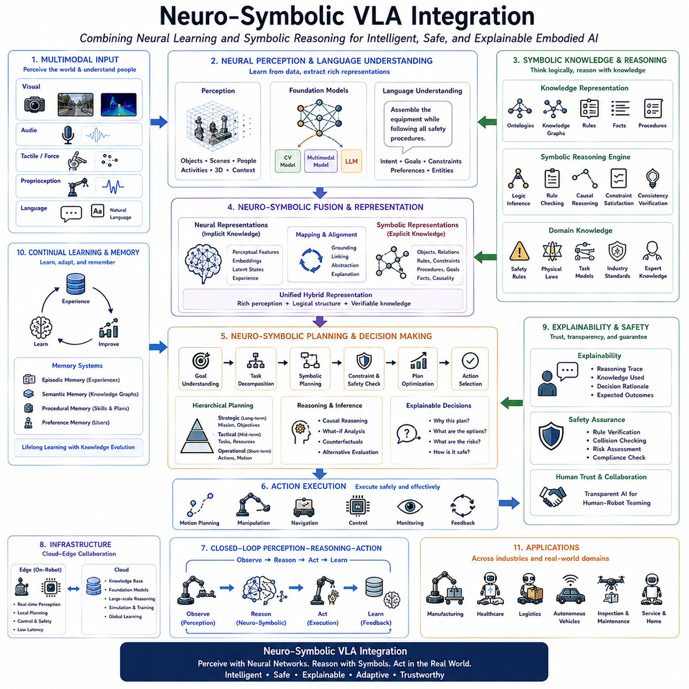{width="7.268055555555556in" height="7.268055555555556in"}

# 42_12_08 Neuro-Symbolic VLA Integration

The future evolution of Vision-Language-Action (VLA) systems is expected to combine the powerful learning capabilities of deep neural networks with the structured reasoning mechanisms of symbolic artificial intelligence. While modern foundation models have demonstrated remarkable performance in visual perception, language understanding, and embodied control through large-scale data-driven learning, they still face significant challenges when dealing with logical reasoning, explicit knowledge representation, long-horizon planning, safety verification, explainability, and rule-based decision making. Conversely, symbolic AI provides interpretable knowledge structures, formal logic, causal inference, and deterministic planning but lacks the adaptability and perception capabilities necessary for complex real-world environments. Neuro-Symbolic VLA Integration seeks to combine these complementary strengths into a unified embodied intelligence architecture capable of simultaneously perceiving, reasoning, learning, planning, and acting within dynamic physical environments.

Deep neural networks excel at extracting complex patterns from high-dimensional sensory inputs such as images, video, audio, tactile signals, and natural language. Through self-supervised learning, imitation learning, reinforcement learning, and multimodal foundation model pretraining, neural systems acquire rich latent representations capable of supporting robust perception and flexible behavior generation. However, purely neural approaches frequently operate as opaque black-box models whose internal reasoning processes remain difficult to interpret or formally verify. In safety-critical robotic applications such as manufacturing, healthcare, transportation, and infrastructure inspection, these limitations restrict deployment because operators require confidence that autonomous decisions satisfy explicit operational rules and safety constraints.

Symbolic artificial intelligence offers a fundamentally different computational paradigm. Knowledge is represented explicitly using logical predicates, semantic graphs, ontologies, production rules, knowledge bases, planning operators, and causal relationships. Instead of learning solely through statistical association, symbolic reasoning manipulates structured representations according to formal inference mechanisms. Such reasoning enables deterministic planning, rule verification, logical consistency checking, explainable decision making, constraint satisfaction, and explicit incorporation of human expertise. These properties make symbolic systems highly valuable for applications where correctness, transparency, accountability, and regulatory compliance remain essential.

Neuro-Symbolic VLA architectures integrate these complementary approaches by assigning perception-oriented tasks to neural foundation models while delegating logical reasoning, symbolic planning, knowledge management, and rule verification to symbolic reasoning engines. Visual perception extracts objects, scenes, relationships, human activities, and environmental context from raw sensory observations. Language understanding converts human instructions into semantic representations describing intentions, goals, constraints, and operational preferences. Symbolic reasoning then transforms these semantic representations into structured task models that support planning, constraint checking, causal inference, and policy generation before actions are executed by robotic control systems.

Knowledge representation becomes significantly richer within neuro-symbolic embodied intelligence. Neural models encode statistical knowledge implicitly inside distributed latent representations, capturing complex correlations difficult to specify manually. Symbolic systems complement this capability by explicitly representing object categories, physical properties, spatial relationships, temporal sequences, procedural knowledge, safety regulations, task hierarchies, manufacturing processes, and domain-specific operational rules. Combining implicit and explicit knowledge enables robots to generalize from experience while preserving interpretable reasoning supporting human supervision and certification.

Scene understanding illustrates the advantages of neuro-symbolic integration. Neural perception models accurately identify objects, estimate poses, recognize human activities, and reconstruct three-dimensional environments from multimodal sensor data. Symbolic reasoning subsequently interprets these observations using semantic relationships describing functional object roles, physical affordances, environmental constraints, and task-relevant interactions. Rather than merely detecting objects independently, robots understand structured environments containing workstations, storage areas, assembly components, transportation pathways, restricted regions, collaborative workspaces, and safety boundaries. Such semantic interpretation substantially improves planning quality while supporting explainable environmental understanding.

Language understanding similarly benefits from hybrid reasoning. Neural language models excel at interpreting natural human communication, resolving ambiguity, translating multilingual instructions, and capturing contextual semantics. Symbolic reasoning converts these interpretations into formal task specifications, logical constraints, executable plans, and verifiable action sequences. Human commands such as "assemble the equipment while following all safety procedures" require robots not only to understand language but also to interpret procedural regulations, operational dependencies, equipment compatibility, and mandatory safety requirements. Neuro-symbolic architectures bridge this gap by integrating statistical language understanding with formal procedural reasoning.

Task planning becomes considerably more reliable through symbolic reasoning. Purely neural action generation often predicts plausible next actions based on learned statistical patterns but may overlook hidden logical dependencies, resource constraints, or operational prerequisites. Symbolic planners explicitly verify preconditions, evaluate causal relationships, optimize task ordering, allocate resources, enforce safety constraints, and guarantee logical consistency before execution begins. Neural perception continuously updates environmental information while symbolic planning dynamically revises execution strategies according to newly observed conditions. This hybrid planning process combines flexibility with formal correctness.

Hierarchical reasoning naturally emerges within neuro-symbolic VLA architectures. High-level symbolic planners interpret mission objectives, decompose complex goals into executable subtasks, enforce logical dependencies, and maintain procedural consistency across long-horizon operations. Mid-level reasoning coordinates resource allocation, scheduling, collaborative task distribution, and workflow optimization. Low-level neural controllers generate manipulation trajectories, navigation commands, visual servoing behaviors, and motor control using learned sensorimotor representations. This hierarchical organization separates abstract reasoning from continuous control while maintaining seamless interaction between symbolic cognition and neural execution.

World models become substantially more expressive when integrating symbolic knowledge with neural prediction. Neural world models learn predictive environmental dynamics from multimodal experience, estimating future object movement, human activity, physical interactions, and environmental evolution. Symbolic reasoning enriches these predictions by incorporating explicit causal knowledge, physical laws, operational procedures, and domain-specific constraints. Consequently, robots evaluate hypothetical future scenarios not only according to learned statistical likelihood but also according to logical feasibility, regulatory compliance, safety policies, and mission objectives before selecting execution strategies.

Causal reasoning represents another significant advantage of neuro-symbolic integration. Neural networks often learn statistical correlations without explicitly distinguishing causal mechanisms from coincidental associations. Symbolic reasoning provides structured causal models describing how actions influence environmental states, object relationships, human responses, and mission outcomes. Understanding causality enables robots to transfer learned knowledge more effectively across novel situations while improving intervention planning, failure diagnosis, recovery strategies, and counterfactual reasoning. Such capabilities become increasingly important for autonomous operation in unpredictable real-world environments.

Explainability naturally improves because symbolic reasoning generates interpretable decision traces. Instead of functioning as opaque black-box predictors, neuro-symbolic VLA systems communicate logical reasoning steps, identified constraints, inferred causal relationships, selected planning alternatives, expected outcomes, and safety justifications using structured natural language. Human supervisors therefore understand why specific actions were selected, facilitating collaborative operation, debugging, validation, certification, and regulatory approval. Explainable embodied intelligence significantly strengthens trust between autonomous systems and human operators.

Safety verification becomes substantially more rigorous within neuro-symbolic architectures. Before executing potentially hazardous actions, symbolic reasoning modules verify compliance with operational constraints, collision avoidance policies, workspace boundaries, human safety regulations, equipment limitations, and mission-specific requirements. Neural perception continuously monitors dynamic environmental changes while symbolic verification determines whether updated conditions still satisfy execution constraints. Such continuous verification provides stronger operational guarantees than purely learned control policies, particularly in high-risk industrial environments.

Memory organization benefits from integrating symbolic knowledge bases with neural representation learning. Neural memory stores high-dimensional perceptual experience, multimodal embeddings, and continuous environmental observations. Symbolic memory maintains explicit task procedures, object relationships, manufacturing rules, maintenance histories, user preferences, operational documentation, and semantic knowledge graphs. Together these complementary memory systems enable efficient retrieval of both experiential knowledge and structured domain expertise throughout planning and decision making.

Continual learning further strengthens neuro-symbolic VLA systems during long-term deployment. Neural models continuously refine perceptual representations, language grounding, manipulation policies, and predictive world models through accumulated operational experience. Symbolic knowledge bases simultaneously evolve by incorporating newly discovered procedural rules, validated causal relationships, updated safety regulations, and refined operational workflows. Unlike purely neural adaptation, symbolic updates remain interpretable and verifiable, allowing controlled knowledge expansion without catastrophic forgetting or unintended behavioral degradation.

Human-robot collaboration benefits significantly from symbolic reasoning because collaborative tasks frequently require explicit communication regarding responsibilities, procedural sequences, safety constraints, and organizational policies. Neural models interpret multimodal human communication while symbolic reasoning manages task negotiation, collaborative planning, workflow synchronization, and regulatory compliance. Human intentions become formal collaborative objectives supporting transparent decision making and predictable teamwork across complex operational environments.

Cloud-edge computing provides practical infrastructure supporting neuro-symbolic embodied intelligence. Edge computing executes latency-sensitive perception, language understanding, manipulation control, navigation, and local reasoning directly onboard robotic platforms. Cloud infrastructure manages large-scale knowledge graphs, symbolic rule repositories, foundation model refinement, collaborative learning, simulation, and computationally intensive reasoning. Synchronization between cloud and edge systems enables continuously evolving knowledge while preserving real-time operational responsiveness.

Evaluation methodologies for neuro-symbolic VLA systems necessarily extend beyond traditional perception and task completion metrics. Future benchmark suites are expected to assess logical consistency, symbolic reasoning accuracy, knowledge utilization, causal inference quality, planning correctness, explainability, regulatory compliance, safety verification, continual knowledge integration, reasoning robustness, collaborative decision quality, and hybrid perception-reasoning performance. These multidimensional evaluation frameworks provide comprehensive assessment of embodied intelligence capable of integrating statistical learning with formal symbolic cognition.

Industrial applications clearly demonstrate the value of neuro-symbolic integration. Manufacturing robots combine learned perception with formal production rules and quality assurance procedures. Healthcare assistants integrate multimodal patient understanding with explicit clinical protocols and regulatory guidelines. Autonomous vehicles combine neural environmental perception with symbolic traffic regulations and ethical driving policies. Warehouse robots integrate object recognition with inventory management rules and logistics optimization. Infrastructure inspection robots combine visual anomaly detection with engineering knowledge bases describing maintenance procedures and structural safety requirements. Across these diverse domains, neuro-symbolic integration significantly improves reliability, transparency, adaptability, and operational safety.

Future research is expected to move toward unified foundation architectures in which neural and symbolic reasoning operate cooperatively rather than as independent software modules. Shared multimodal representations, differentiable reasoning mechanisms, neural knowledge graphs, symbolic memory systems, explainable planning, retrieval-augmented cognition, world models, continual learning, and human-centered interaction will increasingly become integrated components of comprehensive embodied cognitive systems. Rather than separating perception from reasoning, future VLA architectures will continuously exchange information across neural learning, symbolic inference, planning, memory, and action generation throughout the entire perception-to-action cycle.

Ultimately, Neuro-Symbolic Vision-Language-Action Integration represents one of the most promising directions for the future of Physical AI. By combining the perceptual flexibility and learning capability of neural foundation models with the interpretability, logical consistency, causal reasoning, explicit knowledge representation, formal planning, and safety verification provided by symbolic artificial intelligence, future embodied systems will overcome many limitations of purely data-driven architectures. These hybrid cognitive systems will be capable of understanding complex environments, communicating naturally with humans, reasoning transparently, adapting continuously through experience, verifying their own decisions, and executing reliable physical actions across manufacturing, healthcare, logistics, autonomous transportation, infrastructure inspection, scientific exploration, and countless other real-world applications. Neuro-symbolic integration therefore provides a powerful foundation for the next generation of trustworthy, explainable, and highly intelligent autonomous robotic systems.

비전-언어-행동(Vision-Language-Action, VLA) 시스템의 미래는 **신경망 기반 인공지능(Neural AI)**과 **기호 기반 인공지능(Symbolic AI)**을 결합하는 **신경-기호 통합(Neuro-Symbolic Integration)** 방향으로 발전할 것으로 예상된다. 현재의 파운데이션 모델(Foundation Model)은 시각 인식, 언어 이해, 행동 생성에서 뛰어난 성능을 보이지만 논리 추론(Logical Reasoning), 명시적 지식 표현(Explicit Knowledge Representation), 장기 계획(Long-Horizon Planning), 안전 검증(Safety Verification), 설명 가능성(Explainability)에서는 한계를 가진다. 반면 기호 기반 AI는 논리적 추론과 규칙 기반 의사결정에는 강하지만 실제 환경의 복잡한 인식과 적응 능력은 부족하다. 따라서 미래의 VLA는 두 기술의 장점을 결합한 하이브리드 인지 구조(Hybrid Cognitive Architecture)로 발전하게 된다.

딥러닝 기반 신경망(Deep Neural Network)은 이미지(Image), 영상(Video), 음성(Audio), 촉각(Tactile), 자연어(Natural Language)와 같은 고차원 데이터를 매우 효과적으로 처리한다. 자기지도학습(Self-Supervised Learning), 모방학습(Imitation Learning), 강화학습(Reinforcement Learning), 멀티모달 사전학습(Multimodal Pretraining)을 통해 복잡한 환경을 이해하고 행동을 생성할 수 있다. 그러나 이러한 모델은 내부 동작 원리를 사람이 이해하기 어려운 **블랙박스(Black Box)** 특성을 가진다. 특히 제조, 의료, 교통과 같은 안전이 중요한 분야에서는 이러한 불투명성이 실제 적용의 큰 제약이 된다.

기호 기반 인공지능(Symbolic AI)은 완전히 다른 방식으로 동작한다. 지식을 논리 규칙(Logical Rule), 의미 그래프(Semantic Graph), 온톨로지(Ontology), 지식 베이스(Knowledge Base), 계획 연산자(Planning Operator), 인과 관계(Causal Relationship) 형태로 명시적으로 표현한다. 이러한 구조는 논리 추론(Logical Inference), 규칙 검증(Rule Verification), 제약 조건 확인(Constraint Satisfaction), 설명 가능한 의사결정(Explainable Decision Making), 인간 전문가의 지식 활용(Human Expertise Integration)에 매우 강점을 가진다. 따라서 높은 신뢰성과 규제 준수가 필요한 산업 분야에서 중요한 역할을 수행한다.

신경-기호 VLA(Neuro-Symbolic VLA)는 이러한 두 가지 접근법을 하나의 시스템으로 통합한다. 시각 인식은 신경망이 담당하여 물체(Object), 장면(Scene), 사람의 행동(Human Activity), 환경(Context)을 추출한다. 언어 이해는 자연어를 작업 목표(Task Goal), 의도(Intention), 제약 조건(Constraint)으로 변환한다. 이후 기호 기반 추론(Symbolic Reasoning)은 이러한 정보를 논리 구조(Logical Structure)로 변환하여 작업 계획(Task Planning), 규칙 검증(Rule Verification), 인과 추론(Causal Reasoning), 정책 생성(Policy Generation)을 수행한 뒤 최종 행동(Action)을 생성한다.

지식 표현(Knowledge Representation)은 신경-기호 통합에서 크게 향상된다. 신경망은 대규모 데이터로부터 통계적 지식(Statistical Knowledge)을 잠재 공간(Latent Representation)에 저장한다. 반면 기호 시스템은 물체 종류(Object Category), 물리 특성(Physical Property), 공간 관계(Spatial Relationship), 시간 순서(Temporal Sequence), 작업 절차(Procedure), 안전 규칙(Safety Regulation), 산업 표준(Domain Rule)을 명시적으로 저장한다. 두 방식을 함께 사용하면 경험을 통한 일반화 능력과 설명 가능한 추론 능력을 동시에 확보할 수 있다.

장면 이해(Scene Understanding)는 신경-기호 통합의 대표적인 장점이다. 신경망은 카메라와 센서를 이용하여 물체를 인식하고 자세(Pose)를 추정하며 3차원 환경을 복원한다. 이후 기호 추론은 이러한 결과를 이용하여 작업 공간(Workspace), 저장 구역(Storage Area), 이동 경로(Path), 위험 구역(Hazard Zone), 협업 공간(Collaboration Area)의 의미를 해석한다. 단순히 물체를 인식하는 수준을 넘어 환경 전체의 구조와 기능을 이해하는 능력을 제공하게 된다.

언어 이해(Language Understanding)도 신경-기호 구조에서 크게 향상된다. 신경망은 자연어를 이해하고 문맥(Context)을 분석하며 다양한 언어를 처리한다. 이후 기호 기반 시스템은 이를 작업 명세(Task Specification), 논리 제약(Logical Constraint), 실행 계획(Executable Plan), 검증 가능한 행동 시퀀스(Action Sequence)로 변환한다. 예를 들어 "안전 규정을 지키면서 장비를 조립하라"는 명령은 단순한 언어 해석이 아니라 작업 절차와 안전 규정을 함께 고려해야 하며, 신경-기호 구조는 이를 효과적으로 처리할 수 있다.

작업 계획(Task Planning)은 기호 추론(Symbolic Reasoning)을 통해 더욱 신뢰성 있게 수행된다. 순수 신경망은 다음 행동을 통계적으로 예측하지만, 작업 순서(Task Order), 자원(Resource), 선행 조건(Precondition), 안전 규칙(Safety Rule)을 놓칠 가능성이 있다. 반면 기호 기반 계획은 이러한 조건을 명시적으로 확인하면서 최적의 작업 순서를 생성한다. 신경망은 지속적으로 환경을 인식하고 기호 계획기는 이를 반영하여 계획을 실시간으로 수정하는 구조가 된다.

계층적 추론(Hierarchical Reasoning)은 신경-기호 VLA의 핵심 구조이다. 상위 계층은 작업 목표(Mission Goal)를 이해하고 하위 작업(Subtask)으로 분해하며 논리적 관계를 관리한다. 중간 계층은 자원 배분(Resource Allocation), 일정 관리(Scheduling), 협업(Task Coordination)를 수행한다. 하위 계층에서는 신경망이 이동 경로(Trajectory), 조작(Manipulation), 시각 서보(Visual Servoing), 모터 제어(Motor Control)를 담당한다. 이러한 구조는 추상적인 사고와 실제 제어를 효율적으로 분리하면서도 긴밀하게 연결한다.

월드 모델(World Model)은 신경-기호 통합을 통해 더욱 강력해진다. 신경망은 물체의 움직임(Object Motion), 사람의 행동(Human Activity), 환경 변화(Environment Evolution)를 예측한다. 기호 추론은 여기에 물리 법칙(Physical Law), 산업 규칙(Industrial Rule), 작업 절차(Operational Procedure), 안전 기준(Safety Policy)을 추가한다. 결과적으로 미래의 VLA는 단순한 확률 예측이 아니라 논리적으로 가능한 행동(Logically Feasible Action)만 선택하는 높은 신뢰성을 갖게 된다.

인과 추론(Causal Reasoning)은 신경-기호 통합의 중요한 장점이다. 신경망은 통계적 상관관계(Statistical Correlation)를 학습하지만 원인과 결과(Cause and Effect)를 명확히 구분하지 못하는 경우가 많다. 기호 기반 추론은 행동(Action)이 환경(Environment)에 어떤 영향을 미치는지 명확하게 표현한다. 이를 통해 실패 원인 분석(Failure Diagnosis), 복구 전략(Recovery Strategy), 새로운 환경으로의 전이학습(Transfer Learning), 가상 시나리오 분석(Counterfactual Reasoning) 능력이 크게 향상된다.

설명 가능성(Explainability)은 기호 추론을 통해 자연스럽게 제공된다. 시스템은 왜 특정 행동을 선택했는지, 어떤 제약 조건을 고려했는지, 어떤 대안을 비교했는지, 어떤 결과를 예상하는지를 논리적인 형태로 설명할 수 있다. 이러한 기능은 사람과의 협업(Human Collaboration), 디버깅(Debugging), 인증(Certification), 규제 대응(Regulatory Compliance)에서 매우 중요한 역할을 수행한다.

안전 검증(Safety Verification)은 신경-기호 구조에서 더욱 강화된다. 위험한 작업을 수행하기 전에 기호 기반 추론은 작업 공간(Workspace), 충돌 위험(Collision Risk), 사람의 위치(Human Safety), 장비 제한(Equipment Limitation), 안전 규정(Safety Regulation)을 모두 확인한다. 신경망은 환경 변화를 지속적으로 감시하고, 기호 시스템은 새로운 환경에서도 규칙이 유지되는지를 실시간으로 검증한다. 이러한 구조는 순수 데이터 기반 AI보다 훨씬 높은 안전성을 제공한다.

메모리(Memory)는 신경망과 기호 시스템이 각각 다른 역할을 담당한다. 신경 메모리(Neural Memory)는 시각 정보와 경험을 저장하고, 기호 메모리(Symbolic Memory)는 작업 절차, 물체 관계, 제조 규칙, 유지보수 이력, 사용자 선호, 의미 그래프(Semantic Knowledge Graph)를 저장한다. 이러한 이중 메모리 구조(Dual Memory Structure)는 경험 기반 학습과 전문가 지식을 동시에 활용할 수 있도록 한다.

지속학습(Continual Learning)은 신경-기호 VLA를 더욱 발전시킨다. 신경망은 새로운 경험을 통해 인식과 조작 능력을 지속적으로 개선하고, 기호 시스템은 새로운 규칙(New Rule), 새로운 인과 관계(New Causal Relationship), 변경된 안전 규정(Updated Safety Regulation), 개선된 작업 절차(Refined Workflow)를 지속적으로 추가한다. 이러한 구조는 기존 지식을 잃지 않으면서 새로운 지식을 안정적으로 축적할 수 있게 한다.

인간-로봇 협업(Human-Robot Collaboration)에서도 신경-기호 통합은 중요한 역할을 한다. 신경망은 사람의 음성, 표정, 행동을 이해하고, 기호 시스템은 작업 역할(Role), 협업 절차(Collaboration Procedure), 안전 규칙(Safety Rule), 조직 정책(Organizational Policy)을 관리한다. 사람의 의도는 논리적인 작업 목표로 변환되어 투명하고 예측 가능한 협업을 가능하게 한다.

클라우드-엣지 컴퓨팅(Cloud-Edge Computing)은 신경-기호 VLA의 핵심 인프라이다. 엣지 컴퓨팅(Edge Computing)은 실시간 인식, 언어 이해, 자율주행, 조작을 수행하고, 클라우드는 지식 그래프(Knowledge Graph), 규칙 저장소(Symbolic Rule Repository), 파운데이션 모델(Foundation Model), 시뮬레이션(Simulation), 대규모 추론(Large-Scale Reasoning)을 담당한다. 이를 통해 실시간성과 대규모 지능을 동시에 확보할 수 있다.

평가 체계(Evaluation Framework)는 단순한 작업 성공률을 넘어 발전한다. 미래에는 논리 일관성(Logical Consistency), 기호 추론 정확도(Symbolic Reasoning Accuracy), 지식 활용(Knowledge Utilization), 인과 추론(Causal Inference), 계획 정확도(Planning Correctness), 설명 가능성(Explainability), 규칙 준수(Regulatory Compliance), 안전 검증(Safety Verification), 지속적 지식 통합(Continual Knowledge Integration), 협업 품질(Collaborative Decision Quality)을 함께 평가하는 새로운 벤치마크가 등장하게 될 것이다.

산업 현장에서 신경-기호 통합의 활용 가능성은 매우 크다. 제조 로봇은 시각 인식과 생산 규칙을 결합하여 조립을 수행하고, 의료 로봇은 환자의 상태와 의료 프로토콜(Clinical Protocol)을 함께 고려한다. 자율주행 차량은 환경 인식과 교통 규칙(Traffic Regulation)을 통합하며, 물류 로봇은 물체 인식과 재고 관리 규칙을 함께 활용한다. 검사 로봇은 시각 이상 탐지와 설비 유지보수 지식을 결합하여 더욱 정확한 판단을 수행하게 된다.

미래의 연구는 신경망과 기호 추론을 별개의 모듈이 아니라 하나의 통합된 파운데이션 아키텍처(Integrated Foundation Architecture)로 발전시키는 방향으로 진행될 것이다. 멀티모달 표현(Multimodal Representation), 미분 가능한 추론(Differentiable Reasoning), 신경 지식 그래프(Neural Knowledge Graph), 기호 메모리(Symbolic Memory), 설명 가능한 계획(Explainable Planning), 검색 기반 추론(Retrieval-Augmented Cognition), 월드 모델(World Model), 지속학습(Continual Learning)을 하나의 인지 시스템으로 통합하여 인식부터 행동까지 모든 과정이 긴밀하게 연결되는 구조가 될 것이다.

궁극적으로 **신경-기호 비전-언어-행동 통합(Neuro-Symbolic Vision-Language-Action Integration)**은 **신경망 기반 파운데이션 모델(Neural Foundation Model)**의 뛰어난 인식과 학습 능력에 **기호 기반 인공지능(Symbolic AI)**의 논리적 추론(Logical Reasoning), 명시적 지식 표현(Explicit Knowledge Representation), 인과 추론(Causal Reasoning), 형식적 계획(Formal Planning), 안전 검증(Safety Verification)을 결합하는 차세대 **물리 AI(Physical AI)**의 핵심 기술이 될 것이다. 이러한 하이브리드 인지 시스템(Hybrid Cognitive System)은 복잡한 환경을 이해하고, 사람과 자연스럽게 협력하며, 자신의 판단을 설명하고, 지속적으로 학습하면서도 안전성을 스스로 검증하는 **신뢰 가능한 범용 구현형 인공지능(Trustworthy General-Purpose Embodied AI)**의 기반을 제공하게 될 것이다.

##  

## 12.9 Hardware--Software Co-Design for VLA Accelerators

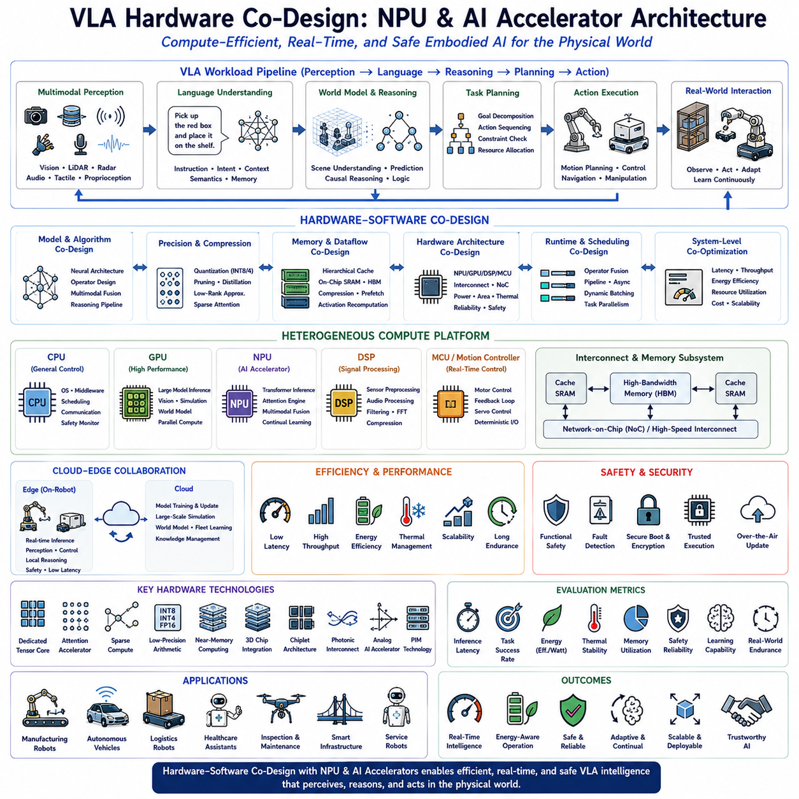{width="7.268055555555556in" height="7.268055555555556in"}

# 42_12_09 VLA Hardware Codesign: NPU and AI Accelerator Architecture

The rapid advancement of Vision-Language-Action (VLA) systems has significantly increased the computational requirements of embodied artificial intelligence, creating a growing need for hardware architectures specifically optimized for multimodal perception, language understanding, reasoning, planning, and real-time robotic control. Traditional robotic computing platforms have relied primarily on general-purpose CPUs and GPUs, which provide flexibility but often suffer from high power consumption, memory bandwidth limitations, latency constraints, and inefficient utilization when executing increasingly large foundation models. As VLA models continue to scale toward billions of parameters while simultaneously supporting real-time interaction with dynamic physical environments, software optimization alone becomes insufficient. Future embodied intelligence therefore requires a tightly integrated hardware-software co-design approach in which neural architectures, inference algorithms, memory hierarchies, communication infrastructure, and specialized AI accelerators are jointly optimized to maximize computational efficiency, energy utilization, and deployment scalability.

Hardware co-design fundamentally changes the conventional relationship between AI algorithms and computing platforms. Historically, AI software has been developed independently before being optimized for existing hardware architectures. In contrast, future VLA systems increasingly adopt a co-design philosophy in which neural network architectures, transformer operators, multimodal fusion mechanisms, reasoning pipelines, scheduling algorithms, memory layouts, and accelerator hardware are designed simultaneously. Such integrated optimization enables significantly higher inference throughput, reduced energy consumption, lower latency, and improved resource utilization compared with independent hardware and software development.

The computational characteristics of Vision-Language-Action models differ substantially from those of conventional computer vision or language processing systems. VLA architectures must simultaneously process high-resolution camera streams, LiDAR point clouds, radar measurements, tactile sensing, proprioception, audio signals, natural language instructions, environmental memory, world models, planning modules, reasoning engines, and continuous robot control loops. These heterogeneous workloads require diverse computational patterns involving dense matrix multiplication, sparse attention mechanisms, graph reasoning, sequence modeling, probabilistic inference, sensor fusion, and low-latency control. General-purpose processors rarely optimize all these workloads efficiently, motivating the development of specialized heterogeneous accelerator architectures.

Neural Processing Units (NPUs) have emerged as one of the most promising hardware platforms for future embodied intelligence. Unlike traditional CPUs optimized for sequential instruction execution or GPUs optimized for large-scale parallel graphics computation, NPUs are specifically designed for neural network inference and training workloads. Dedicated tensor processing engines, optimized matrix multiplication units, high-bandwidth memory interfaces, low-precision arithmetic support, and specialized scheduling mechanisms enable NPUs to execute transformer-based foundation models with significantly higher energy efficiency than conventional processors. These characteristics make NPUs particularly attractive for mobile robots operating under strict power and thermal constraints.

Future VLA hardware platforms are expected to integrate multiple heterogeneous computing engines rather than relying on a single processor architecture. CPUs continue managing operating systems, middleware, scheduling, communication, safety monitoring, and deterministic control logic. GPUs provide high-performance execution for large multimodal foundation models, visual perception, language understanding, simulation, and world model inference. NPUs accelerate transformer inference, attention computation, multimodal fusion, and lightweight continual learning. Digital Signal Processors handle sensor preprocessing, audio analysis, and communication processing, while dedicated motion controllers execute real-time motor control and feedback stabilization. Such heterogeneous architectures enable each computational task to execute on the hardware most suitable for its workload characteristics.

Memory architecture represents one of the most significant bottlenecks in future embodied AI systems. Modern transformer models frequently spend more energy transferring data between memory and compute units than performing arithmetic operations themselves. Consequently, future accelerator architectures increasingly optimize memory locality through hierarchical cache structures, on-chip SRAM, high-bandwidth memory, shared memory pools, unified address spaces, memory compression, intelligent data prefetching, and activation recomputation techniques. Efficient memory co-design substantially improves inference performance while reducing overall system energy consumption.

Model compression plays a central role in hardware co-design because many foundation models exceed the computational capacity of edge robotic platforms. Quantization reduces numerical precision from floating-point representations to INT8, INT4, or even binary computation while preserving acceptable inference accuracy. Structured pruning removes redundant network parameters without significantly degrading performance. Knowledge distillation transfers capabilities from large teacher models into smaller student architectures optimized for edge deployment. Low-rank approximation reduces transformer complexity through efficient matrix factorization. These complementary optimization techniques enable increasingly sophisticated VLA capabilities to execute efficiently on resource-constrained robotic hardware.

Attention mechanisms dominate computational cost within transformer-based VLA models. Hardware accelerators therefore increasingly implement dedicated attention processing units capable of executing self-attention, cross-attention, sparse attention, sliding-window attention, grouped attention, and multimodal attention operations directly in specialized hardware. By reducing unnecessary memory movement and exploiting fine-grained parallelism, dedicated attention accelerators significantly improve transformer inference throughput while lowering latency for real-time robotic applications.

Multimodal fusion introduces additional hardware design challenges because different sensing modalities exhibit highly diverse temporal characteristics, bandwidth requirements, precision levels, and computational demands. Camera streams require high-throughput visual feature extraction, LiDAR processing emphasizes sparse geometric computation, language understanding depends upon sequential transformer execution, while robot control loops require deterministic low-latency response. Future accelerator architectures increasingly incorporate asynchronous processing pipelines capable of simultaneously executing heterogeneous workloads while maintaining synchronized multimodal representations supporting integrated reasoning and action generation.

Real-time inference remains a defining requirement for embodied intelligence. Unlike cloud-based language models where several seconds of latency may be acceptable, robotic systems frequently require perception-to-action cycles below tens of milliseconds. Obstacle avoidance, manipulation control, autonomous driving, collaborative interaction, and dynamic balancing all demand deterministic low-latency computation. Hardware-software co-design therefore optimizes scheduling, operator fusion, pipeline execution, asynchronous computation, dynamic batching, and parallel task execution to minimize end-to-end inference delay throughout complete VLA processing pipelines.

Energy efficiency becomes particularly critical for mobile robots operating from battery-powered platforms. Every additional watt consumed by onboard computing directly reduces operational endurance, increases cooling requirements, and limits payload capacity. Future AI accelerators therefore prioritize performance-per-watt rather than raw computational throughput alone. Near-threshold voltage operation, adaptive frequency scaling, workload-aware power management, dynamic voltage adjustment, sparse computation, approximate arithmetic, and hardware sleep mechanisms contribute to substantial improvements in energy efficiency while maintaining real-time performance.

Thermal management increasingly influences hardware architecture because advanced AI accelerators generate significant heat under sustained transformer inference workloads. Passive cooling solutions often become insufficient for large multimodal foundation models operating continuously within enclosed robotic platforms. Future VLA hardware therefore integrates intelligent thermal-aware scheduling, dynamic workload migration, adaptive clock scaling, liquid cooling for high-performance edge servers, heat pipe technologies, advanced vapor chamber cooling, and thermal simulation during hardware design. Effective thermal co-design ensures stable long-duration operation without performance throttling.

Cloud-edge collaboration significantly extends hardware capability beyond onboard computation alone. Edge platforms execute latency-sensitive perception, language interaction, navigation, manipulation, safety monitoring, and local reasoning directly within robots. Cloud infrastructure performs computationally intensive foundation model refinement, large-scale world modeling, distributed fleet learning, simulation, collaborative planning, and long-term knowledge management. Hardware co-design therefore considers communication bandwidth, model partitioning, distributed inference scheduling, network latency, and workload migration when allocating computational tasks across heterogeneous cloud-edge environments.

Hardware support for continual learning represents another emerging research direction. Future NPUs increasingly incorporate accelerator units supporting parameter-efficient fine-tuning, adapter updates, retrieval-augmented learning, memory management, incremental knowledge integration, and lightweight online adaptation without requiring complete model retraining. Such capabilities enable robots to continuously improve throughout deployment while maintaining computational efficiency appropriate for edge hardware.

Functional safety becomes increasingly important as AI accelerators directly influence autonomous robotic decision making. Hardware architectures therefore integrate redundant computation pathways, fault detection, error-correcting memory, secure execution environments, hardware monitoring units, watchdog processors, deterministic scheduling, and safety-certified control channels. These mechanisms ensure that accelerator failures cannot compromise safe robot operation, particularly within collaborative manufacturing, healthcare, autonomous transportation, and public service environments.

Security considerations similarly influence future accelerator design. Hardware root-of-trust mechanisms, secure boot processes, encrypted model storage, confidential inference, trusted execution environments, hardware authentication, secure communication engines, and tamper-resistant architectures protect proprietary foundation models while preventing malicious modification of autonomous behavior. Secure hardware becomes essential as embodied AI increasingly performs safety-critical and commercially valuable operations.

Open hardware ecosystems are expected to accelerate innovation in embodied intelligence. Standardized accelerator interfaces, modular AI computing platforms, interoperable runtime environments, portable inference frameworks, open compiler toolchains, and hardware abstraction layers enable researchers and industrial developers to deploy VLA models across diverse computing architectures without extensive platform-specific optimization. Such standardization promotes rapid adoption while reducing engineering complexity throughout the robotics ecosystem.

Future robotic computing platforms will likely incorporate multiple specialized NPUs distributed throughout the robotic architecture. Vision processors near camera sensors perform early visual feature extraction. Manipulation accelerators execute local control and grasp planning near robotic arms. Navigation processors optimize localization and motion planning within mobile platforms. Central AI processors integrate multimodal reasoning, language understanding, and world models. Distributed hardware architectures reduce communication overhead while improving scalability across increasingly sophisticated robotic systems.

Evaluation methodologies for hardware-software co-design extend beyond conventional benchmark metrics such as TOPS or FLOPS. Future evaluation increasingly emphasizes end-to-end robotic performance including inference latency, perception accuracy, planning responsiveness, task completion rate, energy efficiency, thermal stability, memory utilization, safety reliability, continual learning capability, multimodal synchronization, cloud-edge scalability, and real-world operational endurance. Such holistic evaluation better reflects the practical requirements of embodied intelligence than isolated computational benchmarks.

Industrial applications clearly demonstrate the importance of hardware co-design. Manufacturing robots require deterministic low-latency inspection and manipulation under strict thermal constraints. Autonomous logistics vehicles demand energy-efficient navigation over extended operational periods. Healthcare assistants balance real-time perception with secure patient data processing. Autonomous vehicles integrate high-throughput sensor fusion with functional safety certification. Infrastructure inspection robots perform large-scale multimodal analysis under battery-powered deployment conditions. Across all these domains, optimized accelerator architectures directly determine achievable intelligence, operational reliability, and commercial viability.

Future research is expected to converge toward fully integrated embodied computing platforms where foundation models, multimodal perception, world models, reasoning engines, symbolic inference, continual learning, safety verification, communication infrastructure, and specialized accelerator hardware are co-designed as unified systems rather than independent software and hardware components. Advances in three-dimensional chip integration, chiplet architectures, photonic interconnects, near-memory computing, analog AI accelerators, processing-in-memory technologies, and next-generation NPU architectures will further improve computational density and energy efficiency. These innovations will enable increasingly sophisticated VLA foundation models to execute entirely onboard autonomous robotic platforms while maintaining real-time responsiveness.

Ultimately, VLA Hardware Co-design integrating Neural Processing Units and specialized AI accelerators represents one of the foundational technologies enabling the next generation of Physical AI. By jointly optimizing neural architectures, multimodal foundation models, transformer execution, memory systems, communication infrastructure, cloud-edge computation, continual learning, safety mechanisms, and heterogeneous accelerator hardware, future robotic platforms will overcome the computational limitations constraining today\'s embodied intelligence systems. These co-designed architectures will deliver highly efficient, low-latency, energy-aware, secure, scalable, and trustworthy computing foundations capable of supporting autonomous robots operating continuously across manufacturing, healthcare, logistics, autonomous transportation, scientific exploration, smart infrastructure, and countless other real-world environments. Hardware-software co-design will therefore become as essential to future embodied intelligence as foundation models themselves, forming the computational backbone upon which truly general-purpose autonomous robotic systems will be built.

비전-언어-행동(Vision-Language-Action, VLA) 시스템의 발전은 구현형 인공지능(Embodied AI)의 계산 요구사항을 급격히 증가시키고 있다. 기존 로봇은 범용 중앙처리장치(CPU)와 그래픽처리장치(GPU)를 중심으로 구성되었지만, 대규모 파운데이션 모델(Foundation Model)은 높은 전력 소모(Power Consumption), 메모리 대역폭(Memory Bandwidth) 한계, 지연 시간(Latency), 낮은 연산 효율이라는 문제를 가진다. 수십억 개 이상의 파라미터를 가진 VLA 모델이 실시간으로 동작하기 위해서는 단순한 소프트웨어 최적화만으로는 부족하며, 하드웨어와 소프트웨어를 동시에 설계하는 **하드웨어 공동설계(Hardware Co-design)**가 필수적인 기술이 되고 있다.

하드웨어 공동설계(Hardware Co-design)는 기존의 개발 방식과 근본적으로 다르다. 과거에는 AI 알고리즘을 먼저 개발한 뒤 기존 하드웨어에 맞추어 최적화했지만, 미래의 VLA는 신경망 구조(Neural Architecture), 트랜스포머 연산(Transformer Operator), 멀티모달 융합(Multimodal Fusion), 추론 파이프라인(Reasoning Pipeline), 메모리 구조(Memory Layout), 스케줄링(Scheduling), AI 가속기(Accelerator)를 동시에 설계한다. 이러한 통합 최적화를 통해 추론 속도(Inference Throughput), 에너지 효율(Energy Efficiency), 지연 시간(Latency), 자원 활용(Resource Utilization)을 크게 향상시킬 수 있다.

VLA의 계산 특성은 기존의 컴퓨터 비전이나 자연어 처리 시스템과는 크게 다르다. 카메라(Camera), 라이다(LiDAR), 레이더(Radar), 촉각(Tactile), 자기 위치(Proprioception), 음성(Audio), 자연어(Language), 환경 메모리(Environmental Memory), 월드 모델(World Model), 계획(Planning), 추론(Reasoning), 실시간 제어(Control)를 동시에 수행해야 한다. 이러한 다양한 연산은 행렬 곱(Matrix Multiplication), 희소 어텐션(Sparse Attention), 그래프 추론(Graph Reasoning), 센서 융합(Sensor Fusion), 확률 추론(Probabilistic Inference), 저지연 제어(Low-Latency Control)를 모두 포함하므로 범용 프로세서만으로는 높은 효율을 얻기 어렵다.

신경망 처리 장치(Neural Processing Unit, NPU)는 미래 구현형 AI의 핵심 하드웨어로 주목받고 있다. CPU는 순차적인 명령 실행에 최적화되어 있고 GPU는 대규모 병렬 연산에 적합하지만, NPU는 신경망 추론(Inference)과 학습(Training)에 특화되어 있다. 텐서 연산기(Tensor Processing Engine), 행렬 곱셈 장치(Matrix Multiplication Unit), 고대역폭 메모리 인터페이스(High-Bandwidth Memory Interface), 저정밀 연산(Low-Precision Arithmetic), 전용 스케줄러(Specialized Scheduler)를 통해 트랜스포머 기반 VLA 모델을 훨씬 높은 전력 효율로 실행할 수 있다. 따라서 배터리 기반 이동 로봇(Mobile Robot)에서 매우 중요한 역할을 수행하게 된다.

미래의 VLA 플랫폼은 하나의 프로세서가 아니라 여러 종류의 이기종 컴퓨팅(Heterogeneous Computing) 구조를 사용하게 된다. CPU는 운영체제(Operating System), 미들웨어(Middleware), 통신(Communication), 안전 관리(Safety Monitoring)를 담당하고, GPU는 대규모 파운데이션 모델과 시각 인식(Visual Perception), 언어 이해(Language Understanding), 시뮬레이션(Simulation)을 수행한다. NPU는 트랜스포머 추론(Transformer Inference), 멀티모달 융합(Multimodal Fusion), 지속학습(Continual Learning)을 담당하며, 디지털 신호 처리기(Digital Signal Processor, DSP)는 센서 전처리와 음성 처리를 수행한다. 또한 전용 모션 컨트롤러(Motion Controller)는 실시간 제어를 담당하여 전체 시스템의 효율을 극대화한다.

메모리 구조(Memory Architecture)는 VLA 시스템에서 가장 큰 병목 요소 가운데 하나이다. 현대의 트랜스포머 모델은 실제 계산보다 메모리와 연산 장치 사이의 데이터 이동(Data Movement)에 더 많은 에너지를 소비하는 경우가 많다. 이를 해결하기 위해 미래의 하드웨어는 계층적 캐시(Hierarchical Cache), 온칩 SRAM(On-Chip SRAM), 고대역폭 메모리(High-Bandwidth Memory, HBM), 공유 메모리(Shared Memory), 메모리 압축(Memory Compression), 데이터 프리페치(Data Prefetching), 활성화 재계산(Activation Recomputation)과 같은 기술을 적극 활용하게 된다.

모델 압축(Model Compression)은 하드웨어 공동설계에서 매우 중요한 기술이다. 대형 파운데이션 모델은 엣지 로봇(Edge Robot)에서 그대로 실행하기 어렵기 때문에 양자화(Quantization)를 통해 부동소수점(Floating Point)을 INT8, INT4 또는 더 낮은 정밀도로 변환한다. 가지치기(Structured Pruning)는 불필요한 파라미터를 제거하며, 지식 증류(Knowledge Distillation)는 대형 교사 모델(Teacher Model)의 지식을 소형 학생 모델(Student Model)에 전달한다. 또한 저랭크 근사(Low-Rank Approximation)는 트랜스포머 계산량을 줄여 엣지 환경에서도 높은 성능을 유지할 수 있도록 한다.

어텐션 메커니즘(Attention Mechanism)은 트랜스포머 모델에서 가장 많은 연산을 차지한다. 따라서 미래의 AI 가속기는 자기 어텐션(Self-Attention), 교차 어텐션(Cross-Attention), 희소 어텐션(Sparse Attention), 슬라이딩 윈도우 어텐션(Sliding Window Attention), 그룹 어텐션(Grouped Attention), 멀티모달 어텐션(Multimodal Attention)을 전용 하드웨어에서 직접 수행하는 구조를 채택하게 된다. 이를 통해 메모리 이동을 최소화하고 병렬성을 극대화하여 추론 속도와 응답성을 크게 향상시킬 수 있다.

멀티모달 융합(Multimodal Fusion)은 하드웨어 설계에서도 중요한 과제이다. 카메라는 대용량 영상 처리를 요구하고, 라이다는 희소한 3차원 연산을 수행하며, 자연어는 순차적인 트랜스포머 계산을 필요로 하고, 로봇 제어는 매우 짧은 지연 시간을 요구한다. 미래의 AI 가속기는 이러한 서로 다른 계산 특성을 동시에 처리하는 비동기 파이프라인(Asynchronous Pipeline)을 갖추어 모든 센서 정보를 하나의 통합 표현(Unified Representation)으로 결합하게 된다.

실시간 추론(Real-Time Inference)은 구현형 AI의 가장 중요한 요구사항이다. 클라우드 언어 모델은 수 초의 지연도 허용될 수 있지만, 자율주행, 충돌 회피, 로봇 제어는 수십 밀리초(Millisecond) 이내에 인식부터 행동까지 완료되어야 한다. 이를 위해 하드웨어 공동설계는 연산 융합(Operator Fusion), 파이프라인 실행(Pipeline Execution), 비동기 계산(Asynchronous Computation), 동적 배치(Dynamic Batching), 병렬 실행(Parallel Execution)을 최적화하여 전체 추론 시간을 최소화한다.

에너지 효율(Energy Efficiency)은 이동 로봇에서 매우 중요한 요소이다. 계산 장치가 소비하는 전력이 증가하면 배터리 사용 시간이 줄어들고 냉각 장치가 커지며 탑재 중량도 증가한다. 따라서 미래의 AI 가속기는 단순한 최고 성능보다 **와트당 성능(Performance per Watt)**을 가장 중요한 지표로 사용한다. 저전압 동작(Near-Threshold Voltage), 적응형 클록 조절(Adaptive Frequency Scaling), 전력 관리(Power Management), 희소 연산(Sparse Computation), 근사 계산(Approximate Arithmetic), 슬립 모드(Sleep Mechanism)를 통해 높은 에너지 효율을 달성하게 된다.

열 관리(Thermal Management)는 대형 AI 모델에서 매우 중요한 설계 요소이다. 지속적인 트랜스포머 추론은 많은 열을 발생시키며, 밀폐된 로봇 내부에서는 성능 저하(Thermal Throttling)가 발생할 수 있다. 미래의 VLA 플랫폼은 열 인식 스케줄링(Thermal-Aware Scheduling), 동적 작업 이동(Workload Migration), 적응형 클록 제어(Adaptive Clock Scaling), 액체 냉각(Liquid Cooling), 히트파이프(Heat Pipe), 베이퍼 챔버(Vapor Chamber), 열 시뮬레이션(Thermal Simulation)을 통합하여 장시간 안정적인 동작을 보장하게 된다.

클라우드-엣지 협업(Cloud-Edge Collaboration)은 VLA 하드웨어의 중요한 구성 요소이다. 엣지 컴퓨팅(Edge Computing)은 실시간 인식, 언어 처리, 자율주행, 조작, 안전 제어를 담당하고, 클라우드는 파운데이션 모델 개선(Foundation Model Refinement), 대규모 월드 모델(World Model), 차량군(Fleet) 학습, 시뮬레이션(Simulation), 장기 지식 관리(Long-Term Knowledge Management)를 수행한다. 하드웨어 공동설계는 통신 대역폭(Bandwidth), 모델 분할(Model Partitioning), 분산 추론(Distributed Inference), 작업 이동(Migration)을 함께 고려하는 방향으로 발전한다.

지속학습(Continual Learning)을 위한 하드웨어 지원도 중요한 연구 분야이다. 미래의 NPU는 전체 모델을 다시 학습하지 않고도 파라미터 효율적 미세조정(Parameter-Efficient Fine-Tuning), 어댑터(Adapter), 검색 기반 학습(Retrieval-Augmented Learning), 온라인 적응(Online Adaptation)을 지원하는 전용 연산 장치를 포함하게 될 것으로 예상된다. 이를 통해 로봇은 실제 환경에서 지속적으로 학습하면서도 높은 계산 효율을 유지할 수 있다.

기능 안전성(Functional Safety)은 AI 가속기 설계에서 필수 요소가 된다. 미래의 하드웨어는 이중 연산 경로(Redundant Computation), 오류 검출(Fault Detection), 오류 정정 메모리(Error-Correcting Memory), 보안 실행 환경(Secure Execution Environment), 감시 프로세서(Watchdog Processor), 결정론적 스케줄링(Deterministic Scheduling), 안전 인증 제어 채널(Safety-Certified Control Channel)을 포함하여 하드웨어 오류가 로봇의 안전에 영향을 미치지 않도록 설계된다.

보안(Security) 역시 중요한 설계 요소이다. 하드웨어 루트 오브 트러스트(Hardware Root of Trust), 보안 부팅(Secure Boot), 암호화된 모델 저장(Encrypted Model Storage), 기밀 추론(Confidential Inference), 신뢰 실행 환경(Trusted Execution Environment), 하드웨어 인증(Hardware Authentication), 보안 통신(Secure Communication)은 AI 모델과 로봇 시스템을 외부 공격으로부터 보호하는 핵심 기술이 된다.

개방형 하드웨어 생태계(Open Hardware Ecosystem)는 구현형 AI 발전을 가속화할 것으로 기대된다. 표준화된 AI 가속기 인터페이스(Standard Accelerator Interface), 모듈형 AI 플랫폼(Modular AI Platform), 공통 실행 환경(Runtime Environment), 개방형 컴파일러(Open Compiler), 하드웨어 추상화 계층(Hardware Abstraction Layer)을 통해 다양한 플랫폼에서도 동일한 VLA 모델을 손쉽게 실행할 수 있게 된다. 이는 로봇 산업 전반의 개발 효율을 크게 향상시킬 것이다.

미래의 로봇은 여러 개의 NPU를 분산 배치한 구조를 사용할 가능성이 높다. 카메라 근처에는 비전 프로세서(Vision Processor), 로봇 팔에는 조작 가속기(Manipulation Accelerator), 이동 플랫폼에는 자율주행 프로세서(Navigation Processor), 중앙에는 멀티모달 추론(Multimodal Reasoning)과 언어 이해(Language Understanding)를 담당하는 중앙 AI 프로세서(Central AI Processor)가 배치된다. 이러한 분산 컴퓨팅 구조는 통신량을 줄이고 전체 시스템의 확장성과 성능을 향상시킨다.

평가 체계(Evaluation Framework)는 기존의 TOPS나 FLOPS와 같은 연산 성능 중심에서 벗어나게 된다. 앞으로는 추론 지연 시간(Inference Latency), 인식 정확도(Perception Accuracy), 계획 응답성(Planning Responsiveness), 작업 성공률(Task Completion Rate), 에너지 효율(Energy Efficiency), 열 안정성(Thermal Stability), 메모리 활용도(Memory Utilization), 안전성(Safety Reliability), 지속학습 능력(Continual Learning), 멀티모달 동기화(Multimodal Synchronization), 클라우드-엣지 확장성(Cloud-Edge Scalability), 실제 운영 시간(Operational Endurance)과 같은 종합적인 성능 평가가 중요해질 것이다.

산업 현장에서는 하드웨어 공동설계의 효과가 매우 크다. 제조 로봇은 저지연 검사와 조작을 수행하고, 물류 로봇은 긴 배터리 사용 시간을 확보하며, 의료 로봇은 실시간 환자 인식과 데이터 보안을 동시에 만족시킨다. 자율주행 차량은 센서 융합과 기능 안전 인증을 지원하고, 검사 로봇은 제한된 전력으로 대규모 멀티모달 분석을 수행한다. 하드웨어 공동설계는 이러한 모든 시스템의 성능과 신뢰성을 결정하는 핵심 기술이 된다.

미래의 연구는 파운데이션 모델, 멀티모달 인식(Multimodal Perception), 월드 모델(World Model), 추론 엔진(Reasoning Engine), 기호 추론(Symbolic Reasoning), 지속학습(Continual Learning), 안전 검증(Safety Verification), 통신 인프라(Communication Infrastructure), AI 가속기를 하나의 통합된 시스템으로 공동 설계하는 방향으로 발전할 것이다. 또한 3차원 칩 적층(3D Chip Integration), 칩렛(Chiplet), 광 인터커넥트(Photonic Interconnect), 메모리 근접 연산(Processing-in-Memory), 아날로그 AI 가속기(Analog AI Accelerator), 차세대 NPU 기술은 더욱 높은 집적도와 에너지 효율을 제공하여 대형 VLA 모델을 완전히 온보드(On-Board)에서 실시간으로 실행할 수 있도록 만들 것이다.

궁극적으로 **VLA 하드웨어 공동설계(VLA Hardware Co-design)**는 **신경망 처리 장치(NPU)**와 다양한 **AI 가속기(AI Accelerator)**를 중심으로 파운데이션 모델, 멀티모달 처리, 트랜스포머 실행, 메모리 구조, 통신 시스템, 클라우드-엣지 컴퓨팅, 지속학습, 안전 기술을 하나의 통합 플랫폼으로 최적화하는 핵심 기술이다. 이러한 공동설계는 계산 성능, 전력 효율, 실시간성, 보안성, 확장성, 신뢰성을 동시에 확보하여 제조, 의료, 물류, 자율주행, 인프라 점검, 과학 탐사 등 다양한 분야에서 장시간 안정적으로 동작하는 차세대 **범용 물리 AI(General-Purpose Physical AI)**의 핵심 계산 기반(Computational Backbone)이 될 것으로 전망된다.

##  

## 12.10 Hills Robotics VLA Roadmap and Strategy

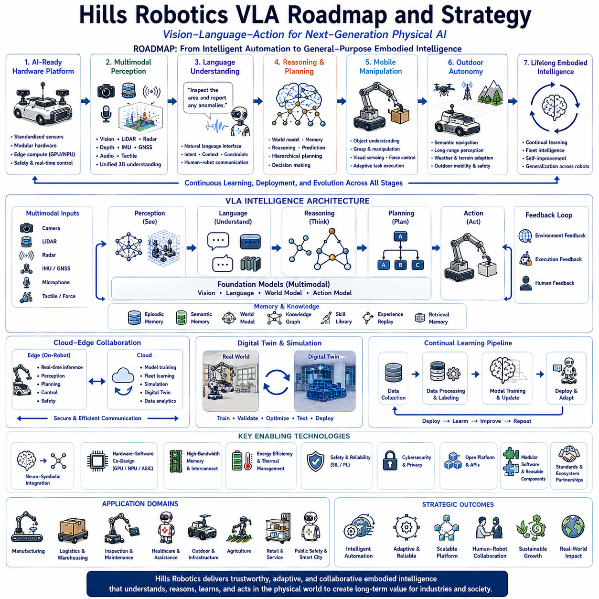{width="7.268055555555556in" height="7.268055555555556in"}

# 42_12_10 Hills Robotics VLA Roadmap and Strategy

The future competitiveness of autonomous robotics will be determined not only by advances in individual artificial intelligence models but also by the ability to integrate Vision-Language-Action (VLA) technologies into scalable robotic platforms capable of operating reliably across diverse real-world environments. For Hills Robotics, VLA is not simply another software component but the central intelligence architecture that will define the company\'s long-term transition from conventional autonomous mobile robots toward next-generation Physical AI systems. Rather than focusing exclusively on navigation, manipulation, or perception as independent technologies, the company\'s strategic vision is to build an integrated embodied intelligence platform where perception, language understanding, reasoning, planning, learning, and physical interaction operate as a unified cognitive system. This roadmap establishes a progressive evolution from intelligent automation to general-purpose embodied intelligence while maintaining practical industrial deployment throughout every stage of development.

The strategic objective of Hills Robotics is to develop an AI-native robotic platform that combines robust hardware engineering, scalable software architecture, multimodal foundation models, and cloud-edge intelligence into a unified ecosystem supporting indoor robots, outdoor autonomous vehicles, inspection robots, logistics platforms, healthcare assistants, and future humanoid systems. Instead of building separate AI solutions for each product category, the roadmap emphasizes a common VLA foundation capable of supporting multiple robotic embodiments through shared perception models, reasoning engines, planning systems, and deployment infrastructure. Such architectural unification significantly reduces development complexity while enabling continuous knowledge transfer across different robotic platforms.

The first stage of the roadmap focuses on establishing a stable AI-ready robotic hardware platform. Reliable autonomous intelligence requires high-quality sensing, deterministic control, synchronized communication, scalable compute resources, and modular mechanical architecture before advanced reasoning capabilities can be deployed effectively. During this phase, Hills Robotics standardizes sensor interfaces, power systems, onboard networking, synchronization mechanisms, safety architectures, and modular computing platforms capable of supporting progressively larger AI workloads. Edge computing platforms integrating GPUs, NPUs, and heterogeneous accelerators become the computational backbone supporting future VLA deployment.

Following hardware standardization, the second development stage introduces advanced multimodal perception. Vision, LiDAR, radar, GNSS, IMU, depth sensing, thermal imaging, tactile sensing, and audio inputs are integrated into unified perception pipelines capable of constructing comprehensive environmental understanding. Rather than processing each sensing modality independently, multimodal foundation models generate shared latent representations describing objects, people, infrastructure, terrain, dynamic obstacles, semantic relationships, and environmental context. Robust multimodal perception provides the sensory foundation upon which all higher-level reasoning and autonomous decision making depend.

The third phase expands robotic capability through natural language understanding and human-centered interaction. Conventional robots typically require predefined graphical interfaces, mission scripts, or manually programmed workflows. Future Hills Robotics platforms instead interpret high-level natural language instructions describing objectives, operational constraints, task priorities, environmental preferences, and collaborative requirements. Language therefore evolves from a user interface into the primary communication channel between humans and autonomous robotic systems. This capability substantially simplifies deployment while enabling more flexible operation across changing industrial environments.

Reasoning becomes the defining capability of the fourth strategic phase. Rather than reacting solely to sensory observations, robots begin interpreting environmental situations, estimating hidden relationships, evaluating multiple planning alternatives, predicting future outcomes, and selecting optimal actions according to mission objectives and operational constraints. World models, symbolic reasoning, hierarchical planning, retrieval-augmented memory, and multimodal foundation models collectively support increasingly sophisticated cognitive behavior extending beyond traditional reactive robotics. This transition marks the evolution from autonomous execution toward genuine embodied intelligence.

The fifth phase introduces autonomous manipulation integrated with mobile robotics. Instead of separating navigation platforms from robotic manipulators, Hills Robotics develops unified mobile manipulation systems capable of understanding language instructions, navigating complex environments, identifying task-relevant objects, planning manipulation sequences, and adapting continuously during execution. Visual servoing, grasp planning, force control, semantic scene understanding, and multimodal reasoning operate cooperatively within shared VLA architectures. Mobile manipulation significantly expands application domains including manufacturing, logistics, inspection, maintenance, healthcare, and service robotics.

Outdoor autonomy represents another major strategic direction. Building upon indoor autonomous mobile robot technology, Hills Robotics extends VLA architectures toward autonomous outdoor platforms supporting logistics, infrastructure inspection, agriculture, construction, public safety, mining, defense support, and smart city applications. Outdoor deployment requires robust localization, semantic navigation, weather adaptation, terrain understanding, predictive world models, long-range perception, and multimodal sensor fusion under continuously changing environmental conditions. Unified VLA intelligence enables consistent cognitive capability across both indoor and outdoor operational domains.

Cloud-edge collaboration constitutes a foundational element throughout the roadmap. Edge computing performs real-time perception, planning, manipulation, navigation, and safety-critical control directly onboard robotic platforms. Cloud infrastructure manages foundation model refinement, distributed learning, fleet coordination, digital twins, simulation, knowledge management, large-scale analytics, and continual model improvement. This hybrid architecture enables robots to respond immediately to local events while continuously benefiting from globally accumulated knowledge across deployed robotic fleets.

Digital twin technology plays an increasingly important role as VLA capability expands. High-fidelity simulation environments replicate robotic hardware, sensors, environments, workflows, and operational scenarios, enabling large-scale training, verification, optimization, and safety validation before physical deployment. Bidirectional synchronization between physical robots and virtual environments continuously improves both simulation accuracy and deployed operational performance. Digital twins therefore become essential infrastructure supporting continual learning, predictive maintenance, fleet management, and large-scale embodied AI development.

Foundation models gradually become the central software layer across the entire Hills Robotics ecosystem. Initially supporting perception and language understanding, foundation models progressively expand toward reasoning, planning, memory management, manipulation, navigation, collaboration, and continual learning. Rather than maintaining numerous task-specific AI models, Hills Robotics adopts unified multimodal foundation architectures capable of transferring knowledge across industrial applications while remaining adaptable through parameter-efficient fine-tuning and domain-specific specialization.

The roadmap also emphasizes continual learning throughout deployment. Every robot operating within customer environments contributes valuable operational experience supporting future system improvement. Perception errors, successful task executions, recovery procedures, environmental changes, user preferences, maintenance records, and collaborative interactions become continuous learning signals. Cloud-based knowledge aggregation combined with edge adaptation enables deployed systems to improve throughout their operational lifetime while maintaining safety, reliability, and regulatory compliance.

Human-robot collaboration forms another strategic pillar. Future Hills Robotics platforms function as intelligent teammates rather than isolated automation systems. Natural language communication, multimodal perception, intention understanding, explainable reasoning, adaptive planning, personalized interaction, and shared situational awareness enable productive collaboration between humans and autonomous robots across manufacturing, logistics, healthcare, education, inspection, and public infrastructure. Human-centered design therefore becomes a core architectural principle rather than an application-specific feature.

Neuro-symbolic integration further strengthens the roadmap by combining neural foundation models with explicit symbolic reasoning. Neural architectures provide robust perception, language understanding, and multimodal representation learning, while symbolic reasoning contributes formal planning, logical consistency, knowledge representation, causal reasoning, safety verification, and explainability. Hybrid cognitive architectures significantly improve reliability, transparency, and regulatory acceptance across safety-critical industrial applications where autonomous decisions require both adaptability and formal correctness.

Hardware-software co-design represents another essential long-term strategy. Future VLA models require computational architectures optimized specifically for multimodal transformer inference, continual learning, memory-intensive reasoning, and low-latency robot control. Hills Robotics therefore progressively integrates GPUs, NPUs, AI accelerators, heterogeneous processors, high-bandwidth memory systems, energy-efficient edge computing, and cloud infrastructure into unified computing platforms supporting increasingly sophisticated embodied intelligence while maintaining practical deployment constraints regarding power, thermal management, size, reliability, and operational cost.

Safety remains central throughout every stage of technological evolution. Functional safety, cybersecurity, explainable decision making, uncertainty estimation, fault detection, redundancy management, human-aware motion planning, regulatory compliance, and continuous verification become deeply integrated architectural components rather than independent safety modules. Future autonomous robots must not only operate intelligently but also demonstrate trustworthy behavior under uncertain real-world conditions throughout long-duration deployment.

The roadmap recognizes that robotics increasingly evolves toward platform ecosystems rather than isolated products. Standardized APIs, modular software architecture, reusable AI components, cloud services, digital twin infrastructure, developer toolchains, simulation environments, application frameworks, and fleet management systems collectively create an expandable ecosystem supporting customers, researchers, industrial partners, universities, and third-party developers. Open architecture significantly accelerates innovation while reducing engineering effort required for future product expansion.

Industrial deployment serves as the primary validation mechanism for every stage of the roadmap. Manufacturing automation, mobile inspection, warehouse logistics, autonomous transportation, healthcare assistance, infrastructure monitoring, agricultural automation, semiconductor production, public safety, and smart city operations provide progressively challenging deployment environments through which VLA capability continuously matures. Practical deployment remains tightly coupled with research activity, ensuring that technological innovation consistently addresses genuine industrial requirements rather than isolated laboratory benchmarks.

The long-term vision extends beyond current autonomous mobile robots toward comprehensive Physical AI platforms capable of supporting diverse robotic embodiments. Mobile robots, mobile manipulators, humanoids, autonomous vehicles, collaborative industrial robots, service platforms, healthcare assistants, inspection systems, educational robots, and intelligent infrastructure agents increasingly share common cognitive foundations despite significant differences in physical embodiment. Unified VLA architectures therefore enable scalable expansion across future product portfolios without fundamental redesign of core intelligence systems.

International collaboration constitutes another important strategic direction. Partnerships with universities, research institutes, semiconductor vendors, cloud infrastructure providers, industrial manufacturers, AI companies, and global robotics organizations accelerate technology development while promoting interoperability across international ecosystems. Collaborative research strengthens access to advanced foundation models, simulation technologies, specialized hardware, benchmark datasets, and emerging standards governing future embodied intelligence.

Future technological milestones gradually progress from perception-centered intelligence toward reasoning-centered autonomy and ultimately toward continually learning embodied cognitive systems. Early development emphasizes robust multimodal perception and autonomous navigation. Intermediate phases integrate language understanding, manipulation, reasoning, and collaborative intelligence. Long-term objectives include world models, continual learning, neuro-symbolic reasoning, digital twins, fleet intelligence, generalized embodiment, and adaptive lifelong autonomy operating across diverse physical environments with minimal human intervention.

Ultimately, the Hills Robotics Vision-Language-Action Roadmap represents a comprehensive strategy for transforming conventional robotics into scalable Physical AI platforms capable of understanding, reasoning, communicating, learning, and acting within complex real-world environments. By integrating multimodal foundation models, cloud-edge intelligence, digital twins, continual learning, neuro-symbolic reasoning, hardware-software co-design, collaborative autonomy, explainable intelligence, and unified embodied architectures into a single long-term technological vision, Hills Robotics positions itself to evolve from a manufacturer of autonomous robotic systems into a provider of intelligent cognitive platforms supporting the next generation of industrial, commercial, healthcare, logistics, infrastructure, and service robotics. This roadmap establishes a sustainable pathway toward trustworthy, adaptive, scalable, and general-purpose embodied intelligence capable of operating continuously across the physical world while creating long-term technological and commercial value.

힐스로보틱스(Hills Robotics)의 **비전-언어-행동(Vision-Language-Action, VLA) 로드맵(Roadmap)**은 개별 인공지능 기술을 개발하는 것을 넘어, 실제 산업 현장에서 지속적으로 동작하는 **범용 물리 AI(General-Purpose Physical AI)** 플랫폼을 구축하는 것을 목표로 한다. VLA는 단순한 소프트웨어 기능이 아니라 로봇의 인식(Perception), 언어 이해(Language Understanding), 추론(Reasoning), 계획(Planning), 학습(Learning), 행동(Action)을 하나의 통합된 인지 시스템(Cognitive System)으로 연결하는 핵심 기술이다. 힐스로보틱스는 이를 기반으로 기존의 자율주행 로봇을 차세대 구현형 인공지능(Embodied AI) 플랫폼으로 발전시키고자 한다.

회사의 핵심 전략은 개별 제품마다 서로 다른 AI를 개발하는 것이 아니라, 하나의 공통 VLA 플랫폼(Common VLA Platform)을 구축하는 것이다. 이 플랫폼은 실내 자율주행 로봇(Indoor AMR), 실외 자율주행 플랫폼(Outdoor Autonomous Platform), 검사 로봇(Inspection Robot), 물류 로봇(Logistics Robot), 의료 지원 로봇(Healthcare Robot), 향후 휴머노이드(Humanoid)까지 동일한 AI 기반을 공유하도록 설계된다. 이러한 통합 구조는 개발 비용을 줄이고, 서로 다른 로봇 간의 지식과 경험을 공유할 수 있도록 하여 장기적인 기술 경쟁력을 확보하게 한다.

로드맵의 첫 번째 단계는 **AI 친화형 하드웨어 플랫폼(AI-Ready Hardware Platform)** 구축이다. 고성능 인공지능을 구현하기 위해서는 센서(Sensor), 실시간 제어(Control), 동기화(Synchronization), 통신(Network), 전원(Power), 계산 장치(Compute Platform)가 안정적으로 동작해야 한다. 힐스로보틱스는 표준화된 센서 인터페이스, 모듈형 기계 구조(Modular Mechanical Architecture), GPU·NPU 기반 엣지 컴퓨팅(Edge Computing), 안전 시스템(Safety Architecture)을 공통 플랫폼으로 구축하여 향후 대규모 VLA 모델을 안정적으로 실행할 수 있는 기반을 마련한다.

두 번째 단계는 **멀티모달 인식(Multimodal Perception)** 기술의 고도화이다. 카메라(Camera), 라이다(LiDAR), 레이더(Radar), 위성항법(GNSS), 관성측정장치(IMU), 깊이 카메라(Depth Camera), 열화상(Thermal Camera), 촉각(Tactile Sensor), 음성(Audio)를 하나의 통합된 인식 시스템으로 연결한다. 이러한 멀티모달 파운데이션 모델(Multimodal Foundation Model)은 사람, 물체, 시설, 도로, 지형, 장애물, 환경의 의미를 동시에 이해하는 통합 표현(Unified Representation)을 생성하며, 이후 모든 추론과 의사결정의 기반이 된다.

세 번째 단계에서는 **자연어 기반 상호작용(Natural Language Interaction)**을 도입한다. 기존 로봇은 미리 정의된 버튼이나 스크립트를 사용했지만, 미래의 힐스로보틱스 플랫폼은 "창고를 점검해라", "안전한 경로로 이동해라", "장비를 준비해라"와 같은 자연어 명령을 직접 이해한다. 자연어는 단순한 사용자 인터페이스(User Interface)가 아니라 작업 목표(Task Goal), 우선순위(Priority), 환경 조건(Environment Constraint), 협업 요구사항(Collaboration Requirement)을 전달하는 핵심 인터페이스로 발전한다.

네 번째 단계는 **추론 중심 지능(Reasoning-Centered Intelligence)**의 구현이다. 로봇은 단순히 센서 데이터를 반응적으로 처리하는 것이 아니라 환경을 이해하고, 여러 계획을 비교하며, 미래를 예측하고, 최적의 행동을 선택하는 인지 시스템으로 발전한다. 월드 모델(World Model), 기호 추론(Symbolic Reasoning), 계층적 계획(Hierarchical Planning), 검색 기반 메모리(Retrieval-Augmented Memory), 멀티모달 파운데이션 모델이 결합되어 기존의 자동화 로봇을 구현형 인공지능으로 발전시키는 핵심 기술이 된다.

다섯 번째 단계에서는 **이동형 매니퓰레이션(Mobile Manipulation)**을 구현한다. 기존에는 자율주행과 로봇 팔을 별도로 개발했지만, 힐스로보틱스는 이동(Mobility), 조작(Manipulation), 자연어(Language), 시각 인식(Vision), 힘 제어(Force Control), 시각 서보(Visual Servoing)를 하나의 VLA 시스템으로 통합한다. 이를 통해 제조, 물류, 유지보수, 의료, 서비스 분야에서 이동과 작업을 동시에 수행하는 차세대 로봇을 개발하게 된다.

실외 자율주행(Outdoor Autonomy)은 또 하나의 핵심 전략이다. 실내 AMR 기술을 기반으로 물류(Logistics), 인프라 점검(Infrastructure Inspection), 농업(Agriculture), 건설(Construction), 스마트시티(Smart City), 공공안전(Public Safety) 분야까지 확장한다. 이를 위해 의미 기반 자율주행(Semantic Navigation), 악천후 대응(Weather Adaptation), 지형 이해(Terrain Understanding), 장거리 인식(Long-Range Perception), 멀티모달 센서 융합(Multimodal Sensor Fusion)을 포함하는 통합 VLA 구조를 구축한다.

클라우드-엣지 협업(Cloud-Edge Collaboration)은 전체 로드맵의 핵심 기반이다. 엣지 컴퓨팅은 실시간 인식, 자율주행, 조작, 안전 제어를 담당하고, 클라우드는 파운데이션 모델 학습(Foundation Model Training), 차량군(Fleet) 관리, 시뮬레이션(Simulation), 디지털 트윈(Digital Twin), 장기 지식 관리(Long-Term Knowledge Management)를 담당한다. 이러한 구조는 실시간성과 대규모 지능을 동시에 확보하며, 모든 로봇이 지속적으로 성능을 향상시킬 수 있도록 지원한다.

디지털 트윈(Digital Twin)은 로드맵에서 매우 중요한 기술이다. 실제 로봇과 동일한 가상 환경을 구축하여 학습, 검증, 최적화, 안전 시험을 수행한 후 실제 환경에 적용한다. 실제 로봇과 디지털 트윈은 지속적으로 데이터를 교환하며, 이를 통해 시뮬레이션 정확도와 실제 운용 성능을 동시에 향상시킨다. 디지털 트윈은 지속학습(Continual Learning), 예지보전(Predictive Maintenance), 차량군 관리(Fleet Management)의 핵심 기반이 된다.

파운데이션 모델(Foundation Model)은 힐스로보틱스 전체 소프트웨어의 중심 계층으로 발전한다. 초기에는 시각 인식과 언어 이해를 담당하지만, 이후 추론, 계획, 메모리 관리, 조작, 자율주행, 협업, 지속학습까지 모두 포함하는 범용 AI로 확장된다. 하나의 멀티모달 파운데이션 모델이 다양한 산업 분야에 공통적으로 적용되며, 필요에 따라 파라미터 효율적 미세조정(Parameter-Efficient Fine-Tuning)을 통해 각 산업에 맞게 최적화된다.

지속학습(Continual Learning)은 힐스로보틱스 전략의 중요한 요소이다. 실제 고객 환경에서 운용되는 모든 로봇은 새로운 경험을 지속적으로 수집한다. 작업 성공(Task Success), 오류 복구(Recovery), 사용자 선호(User Preference), 환경 변화(Environment Change), 유지보수 기록(Maintenance History), 협업 경험(Collaboration Experience)은 모두 새로운 학습 데이터가 된다. 클라우드에서 이러한 경험을 통합하고 다시 각 로봇으로 배포함으로써 시스템은 시간이 지날수록 더욱 지능적으로 발전한다.

인간-로봇 협업(Human-Robot Collaboration)은 장기적인 핵심 전략이다. 미래의 로봇은 사람을 대신하는 자동화 장비가 아니라 함께 일하는 협력자(Intelligent Partner)가 된다. 자연어 대화(Natural Language Communication), 의도 이해(Intention Understanding), 설명 가능한 AI(Explainable AI), 적응형 계획(Adaptive Planning), 공유 상황 인식(Shared Situational Awareness)을 통해 제조, 물류, 의료, 교육, 공공 서비스 등 다양한 환경에서 사람과 자연스럽게 협업하게 된다.

신경-기호 통합(Neuro-Symbolic Integration)은 로드맵의 중요한 기술 축이다. 신경망은 인식과 학습을 담당하고, 기호 기반 AI(Symbolic AI)는 논리 추론(Logical Reasoning), 작업 계획(Task Planning), 명시적 지식 표현(Explicit Knowledge Representation), 안전 검증(Safety Verification), 설명 가능성(Explainability)을 담당한다. 이러한 하이브리드 인지 구조(Hybrid Cognitive Architecture)는 높은 신뢰성과 산업 적용성을 확보하는 핵심 기술이 된다.

하드웨어-소프트웨어 공동설계(Hardware-Software Co-design)는 미래 VLA 플랫폼을 위한 필수 전략이다. GPU(Graphics Processing Unit), NPU(Neural Processing Unit), AI 가속기(AI Accelerator), 고대역폭 메모리(High-Bandwidth Memory), 저전력 엣지 컴퓨팅(Energy-Efficient Edge Computing), 클라우드 인프라를 함께 최적화하여 대규모 VLA 모델을 실시간으로 실행할 수 있는 계산 플랫폼을 구축한다. 이는 성능, 전력, 발열, 비용, 신뢰성을 동시에 만족시키기 위한 핵심 기술이다.

안전성(Safety)은 모든 단계에서 가장 중요한 원칙이다. 기능 안전(Function Safety), 사이버 보안(Cyber Security), 설명 가능한 의사결정(Explainable Decision Making), 불확실성 추정(Uncertainty Estimation), 고장 감지(Fault Detection), 중복 시스템(Redundancy), 사람 인식 기반 경로 계획(Human-Aware Motion Planning), 지속적인 검증(Continuous Verification)이 기본 구조에 포함된다. 미래의 VLA는 지능뿐 아니라 신뢰성과 안전성까지 동시에 확보해야 한다.

힐스로보틱스는 개별 제품이 아니라 **플랫폼 생태계(Platform Ecosystem)** 구축을 목표로 한다. 표준 API(Standard API), 모듈형 소프트웨어(Modular Software), AI 컴포넌트(Component), 디지털 트윈, 차량군 관리 시스템(Fleet Management), 개발 도구(Developer Toolchain), 시뮬레이션 환경(Simulation Environment)을 하나의 통합 생태계로 제공하여 고객과 연구기관, 산업 파트너가 쉽게 활용할 수 있는 개방형 플랫폼(Open Platform)을 구축한다.

산업 현장은 모든 기술의 최종 검증 환경이다. 제조 자동화(Manufacturing Automation), 이동형 검사(Mobile Inspection), 물류(Logistics), 자율 운송(Autonomous Transportation), 의료 지원(Healthcare Assistance), 인프라 모니터링(Infrastructure Monitoring), 농업 자동화(Agricultural Automation), 반도체 생산(Semiconductor Manufacturing), 스마트시티(Smart City) 등 다양한 산업 분야에서 실제 운용을 통해 기술을 검증하고 개선하는 것이 로드맵의 핵심 전략이다.

장기적으로 힐스로보틱스는 기존의 자율주행 로봇을 넘어 다양한 구현체(Embodiment)를 지원하는 **범용 물리 AI 플랫폼(General-Purpose Physical AI Platform)**을 구축하고자 한다. 이동 로봇(Mobile Robot), 이동형 매니퓰레이터(Mobile Manipulator), 휴머노이드(Humanoid), 자율주행 차량(Autonomous Vehicle), 협업 로봇(Collaborative Robot), 서비스 로봇(Service Robot), 검사 로봇(Inspection Robot)이 모두 동일한 VLA 기반 인지 구조를 공유하게 된다.

국제 협력(Global Collaboration) 역시 중요한 전략이다. 대학, 연구기관, 반도체 기업, 클라우드 기업, 제조업체, AI 기업, 글로벌 로봇 기업과의 협력을 통해 파운데이션 모델, 시뮬레이션 기술, AI 반도체, 벤치마크 데이터셋(Benchmark Dataset), 국제 표준(Standard)을 공동으로 개발하고 글로벌 생태계를 구축하는 방향으로 발전하게 된다.

기술 발전은 **인식 중심 AI(Perception-Centered AI)**에서 **추론 중심 AI(Reasoning-Centered AI)**를 거쳐 **지속적으로 학습하는 구현형 AI(Lifelong Embodied AI)**로 발전한다. 초기에는 멀티모달 인식과 자율주행을 중심으로 시작하지만, 이후 언어 이해, 조작, 추론, 협업, 월드 모델, 지속학습, 디지털 트윈, 차량군 지능(Fleet Intelligence), 범용 구현형 AI로 단계적으로 확장된다.

궁극적으로 **힐스로보틱스 비전-언어-행동 로드맵(Hills Robotics Vision-Language-Action Roadmap)**은 **멀티모달 파운데이션 모델(Multimodal Foundation Model)**, **클라우드-엣지 지능(Cloud-Edge Intelligence)**, **디지털 트윈(Digital Twin)**, **지속학습(Continual Learning)**, **신경-기호 통합(Neuro-Symbolic Integration)**, **하드웨어-소프트웨어 공동설계(Hardware-Software Co-design)**, **협업 자율성(Collaborative Autonomy)**, **설명 가능한 AI(Explainable AI)**를 하나의 통합된 플랫폼으로 결합하여, 힐스로보틱스를 단순한 로봇 제조 기업이 아니라 차세대 **범용 물리 AI 플랫폼(General-Purpose Physical AI Platform)** 기업으로 성장시키기 위한 장기 전략이다. 이러한 로드맵은 제조, 의료, 물류, 자율주행, 공공 인프라, 서비스 산업 등 다양한 분야에서 안전하고 신뢰할 수 있으며 지속적으로 진화하는 **범용 구현형 인공지능(General-Purpose Embodied AI)**을 실현하는 핵심 비전이 될 것이다.
